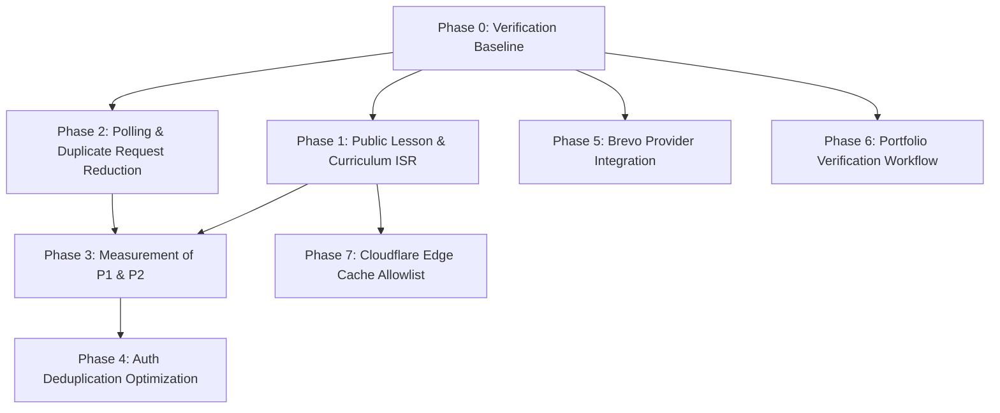

# Phase 0 — Repository Verification & Implementation Baseline Report

**Execution Date:** August 30, 2026  
**Repository Branch:** `fixes/implementation-plan`  
**Base Commit:** `cff7087 fix(marketing): restore Testimonials section visibility and review submission empty state for 0 reviews`  
**Working Tree Status:** Clean  
**Push Restriction:** Active (Local verification only; zero remote push operations)

---

## 1. Executive Summary

This Phase 0 verification report provides an independent, source-level audit of the Prodily repository and live production environment against the technical requirements in `FIXES.md`. 

Every referenced file, route, API endpoint, database migration, React component, notification provider, queue processor, and authentication mechanism has been inspected in the active codebase. 

### Key Findings Summary:
1. **Public Marketing/Learning Dynamic Rendering (Phase 1):** Verified. `/lessons/[slug]` and `/curriculum` invoke Next.js `cookies()` solely for authenticated user redirects, forcing full dynamic server rendering (`ƒ`) on every request despite static export intentions. `resolveSlugToId` in `lib/lesson-loader.ts` lacks an in-memory cache, causing repetitive disk I/O.
2. **Client Polling & Duplication (Phase 2):** Verified. `useUsageTimeTracker` triggers two API requests every 30 seconds (`POST` followed immediately by `GET /api/feedback/eligibility`) and never stops polling after milestone completion. `NotificationBell` polls every 60 seconds. `NotificationCenterDrawer` does not mark notifications read on open. `TestimonialsSection` sends a client API fetch on every homepage load when 0 testimonials exist.
3. **Authentication Duplication (Phase 4):** Verified. Middleware (`proxy.ts`) authenticates via Supabase Auth and queries the `users` profile table; downstream API route handlers (`lib/auth.ts`) re-execute `supabase.auth.getUser()` and repeat database authorization checks.
4. **Email / Brevo Architecture (Phase 5):** Verified. A robust notification queue and provider abstraction (`NotificationProvider`, `ProviderRegistry`, `email_queue`, RPC `claim_email_queue_items`) already exists in `lib/notifications/`. However, `processor.ts` hardcodes `getProvider('resend')` and writes to `resend_id`. A legacy direct-send path in `lib/email.ts` contains hardcoded Resend and Brevo fetch calls. Outbound delivery webhook handling already exists in `/api/email/webhooks` with `email_delivery_events`. The live privacy policy currently names Resend Inc. as the email subprocessor.
5. **Portfolio Verification & Fellow State (Phase 6):** Verified. User designation `is_fellow` exists on `public.users` (migration `20260830000001_add_is_fellow_column.sql`). The 7-item share-readiness engine (`calculatePortfolioReadiness`) is implemented and tested in `lib/portfolio-readiness.ts`. The direct admin Fellow toggle exists in `AdminConsoleService.toggleUserFellowStatus` and `/api/admin/users/[id]/fellow-status`. A formal user-submission and admin-review request workflow (`portfolio_verification_requests`) does not yet exist and will be introduced cleanly with a partial unique constraint (`UNIQUE(user_id) WHERE status = 'pending'`).

---

## 2. Repository Structure Verified

The monorepo structure is located at `d:\Prodily`:
- **Root**: `package.json`, `pnpm-lock.yaml`, `AGENTS.md`, `FIXES.md`, `content/`, `supabase/`, `apps/`
- **Application Directory**: `apps/web` (Next.js 16.2.12 with Turbopack, React 19.2.4, TypeScript 5, Tailwind CSS 4, Vitest 4.1.11)
- **Database Migrations**: `supabase/migrations/` (39 migration files spanning July–August 2026)
- **Compiled Content**: `content/dist/` with 90 precompiled AST lessons (`content/dist/lessons/les_*.json`) and curriculum metadata (`content/dist/curriculum.json`)

All key directories and configuration files match the expected architecture.

---

## 3. Current Architecture Findings

### Architecture Map:
```
Client Browser
   │
   ├── (Static / ISR Pages) ─── Next.js Cache / CDN
   │
   ├── (Dynamic Pages / APIs)
   │      │
   │      ▼
   │   proxy.ts (Middleware) ─── Supabase Auth Check + User Profile Check
   │      │
   │      ▼
   │   Route Handlers / Pages ─── Duplicate Supabase Auth Check (lib/auth.ts)
   │      │
   │      ├── DB Operations (Supabase Client with RLS or Service Role)
   │      │
   │      ├── Event Dispatcher (lib/notifications/dispatcher.ts)
   │      │      │
   │      │      ▼
   │      └── Email Queue (email_queue table) ─── Queue Processor ─── Resend Provider
```

---

## 4. Vercel CPU Findings

### 4.1 Lesson & Curriculum Rendering (`/lessons/[slug]`, `/curriculum`)
- **Current Route Status in Build**: Both routes build as `ƒ (Dynamic)` dynamic server-rendered on demand.
- **Root Cause**: `apps/web/app/(marketing)/lessons/[slug]/page.tsx` (line 93) and `apps/web/app/(marketing)/curriculum/page.tsx` (line 52) call `const cookieStore = await cookies()` to inspect `sb-access-token`.
- **Slug Loader**: `apps/web/lib/lesson-loader.ts` lines 95–110: `resolveSlugToId` reads `lesson-id-registry.json` from the filesystem on every invocation without an in-memory `Map` cache.
- **Remediation Target**: Remove `cookies()` from both page render paths, export `revalidate = 3600` (or appropriate ISR duration), memoize `resolveSlugToId` in memory, and handle any required authenticated redirects in `proxy.ts`.

### 4.2 Client-Side Polling Loops
1. **Feedback Dwell Tracker (`apps/web/hooks/useUsageTimeTracker.ts`)**:
   - Polling interval: 30,000ms (30s).
   - Behavior: Calls `POST /api/feedback/eligibility` to sync active seconds, then upon success immediately invokes `checkEligibility()` which sends a `GET /api/feedback/eligibility`.
   - Invocations per minute per active learner: **4 requests / min**.
   - Lifecycle: Does not stop polling once the `usage_1hr` milestone is reached or dismissed.
2. **Notification Bell (`apps/web/components/notifications/NotificationBell.tsx`)**:
   - Polling interval: 60,000ms (60s).
   - Behavior: Calls `GET /api/notifications?limit=1`.
   - Invocations per minute per active learner: **1 request / min**.
3. **Marketing Testimonials (`apps/web/components/marketing/sections/testimonials.tsx`)**:
   - Logic at line 28: `if (initialTestimonials && initialTestimonials.length > 0) return`.
   - When 0 published reviews exist (`initialTestimonials = []`), it evaluates to false and sends `GET /api/testimonials` on every homepage visit.

---

## 5. Authentication Findings

### 5.1 Request Flow & Redundancies
1. **Middleware Layer (`apps/web/proxy.ts`)**:
   - Extracts `sb-access-token` / `sb-refresh-token`.
   - Executes `supabase.auth.getUser(accessToken)` (Network roundtrip to Supabase Auth).
   - If user exists, queries `users` table: `.select('is_admin, curriculum_access_override')`.
   - Checks `isAdminEmail(user.email)` or DB `is_admin`.
   - Fast-paths non-app public pages at lines 104–106.
2. **API / Server Action Layer (`apps/web/lib/auth.ts`)**:
   - `getAuthenticatedUserFromRequest(request)` reads `Authorization` header or `sb-access-token` cookie.
   - Executes `authClient.auth.getUser()` (Second network roundtrip to Supabase Auth).
3. **Admin Guard Layer (`apps/web/lib/admin/guard.ts`)**:
   - `requireAdminUser(request)` calls `getAuthenticatedUserFromRequest(request)`.
   - Calls `isAdminUser(supabase, user.id, user.email)` which re-queries `users.is_admin` from the database.

### 5.2 Optimization Boundary
Authentication optimization must avoid arbitrary client-spoofable request headers. A secure internal context or deduplication strategy should be tested in Phase 4 after measuring Phases 1 and 2.

---

## 6. Notification Findings

1. **Data Model**: `public.in_app_notifications` table with columns `id`, `user_id`, `category`, `title`, `body`, `action_url`, `priority`, `is_read`, `created_at`, `read_at`.
2. **API Routes**:
   - `GET /api/notifications`: Returns paginated list, unread count, and grouped buckets (`today`, `yesterday`, `thisWeek`, `earlier`).
   - `PATCH /api/notifications`: Supports `action: "mark_read"` (single `notificationId`) and `action: "mark_all_read"` (`update is_read = true WHERE user_id = authUser.id AND is_read = false`).
3. **Notification Drawer UX (`NotificationCenterDrawer.tsx`)**:
   - Currently, opening the drawer fetches notifications via `GET /api/notifications` but does **not** call `PATCH` with `mark_all_read`.
   - Users are required to click individual notifications to mark them as read.
   - Desired behavior: On opening drawer, once items are successfully fetched, trigger `PATCH /api/notifications` with `mark_all_read` (or mark presented items), zero out the badge, and maintain optimistic rollback on network error.

---

## 7. Email / Brevo Findings

1. **Provider Abstraction**:
   - `NotificationProvider` interface in `apps/web/lib/notifications/providers/types.ts`.
   - `ProviderRegistry` in `apps/web/lib/notifications/providers/index.ts` with singleton `globalProviderRegistry`.
   - Currently only registers `ResendProvider`.
2. **Queue Processor (`apps/web/lib/notifications/queue/processor.ts`)**:
   - Claims rows atomically using Supabase RPC `claim_email_queue_items(batchSize)` with fallback to `in('status', ['pending', 'retrying'])`.
   - Hardcoded provider lookup at line 303: `globalProviderRegistry.getProvider('resend')`.
   - Updates `resend_id` column upon delivery.
3. **Legacy Direct-Send Path (`apps/web/lib/email.ts`)**:
   - Contains standalone `sendEmail()` with fallback logic to Brevo REST API (`https://api.brevo.com/v3/smtp/email`) when `BREVO_API_KEY` is present.
   - Direct call sites:
     - `apps/web/app/api/waitlist/route.ts`
     - `apps/web/app/api/contact/route.ts`
     - `apps/web/app/api/dev/send-test-email/route.ts`
     - `apps/web/app/api/admin/emails/test-send/route.ts`
     - `apps/web/app/api/auth/send-email-hook/route.ts`
     - `apps/web/app/api/email/webhooks/route.ts` (inbound email forwarder)
4. **Delivery Events & Suppression**:
   - Outbound delivery webhook endpoint at `apps/web/app/api/email/webhooks/route.ts` already handles `email.delivered`, `email.failed`, `email.bounced`, `email.complained` and inserts into `email_delivery_events`.
5. **Subprocessor Disclosure**:
   - Production privacy policy (`/privacy`) explicitly mentions `Resend Inc.`. Will need to be updated after Brevo migration.

---

## 8. Portfolio & Fellow Findings

### 8.1 Critical Semantic Boundary
**Portfolio Verification Request $\neq$ `is_fellow`**
- `is_fellow` is a user-level boolean column on `public.users` indicating whether the user holds the Fellow designation on their public portfolio (`/p/[username]`).
- A **Portfolio Verification Request** is an auditable workflow record tracking a user's formal submission, review state, admin feedback, and review history.

### 8.2 Existing Architecture Elements
1. **Fellow Field**: `users.is_fellow` (boolean, default false).
2. **Readiness Engine**: `calculatePortfolioReadiness` in `apps/web/lib/portfolio-readiness.ts`:
   - 7 items: Display Name, Portfolio Handle, Public Visibility, Professional Bio, Applied Capstone Project, Profile Photo, Professional Links.
   - Evaluates `isReadyToShare: boolean`, `statusLabel`, `missingEssentialCount`, `missingRecommendedCount`.
3. **Fellow Grant Logic**: `AdminConsoleService.toggleUserFellowStatus(targetUserId, isFellow)` in `apps/web/lib/admin/service.ts`:
   - Enforces invariant: Only public portfolios can be designated as Fellow (`if (isFellow && !userRow.is_portfolio_public) throw Error(...)`).
   - Updates `is_fellow`.
   - Proactively revalidates `/p/${username}` and `/api/og/portfolio/${username}`.
4. **Admin Route**: `POST /api/admin/users/[id]/fellow-status` handles direct toggle and writes to `admin_audit_logs`.

---

## 9. Database & RLS Findings

1. **Existing Tables**:
   - `users`: Core profile, streaks, XP, `is_admin`, `is_fellow`, `is_portfolio_public`, `total_active_seconds`.
   - `in_app_notifications`: In-app notification feed with user-level RLS.
   - `email_queue`: Transactional email queue with priority, retry count, status, `resend_id`.
   - `email_suppressions`: Suppression list for unsubscribed/spam-complaining emails.
   - `email_dead_letter`: Dead-letter storage for permanent failures.
   - `email_delivery_events`: Delivery tracking event log.
   - `admin_audit_logs`: Admin audit log with RLS restricted to admins.
2. **Proposed Table `portfolio_verification_requests`**:
   - Fits Supabase/PostgreSQL schema conventions.
   - Columns: `id` (uuid PK), `user_id` (uuid FK `users.id`), `status` (`text CHECK status IN ('pending', 'approved', 'denied')`), `note` (text), `admin_note` (text), `reviewed_by` (uuid FK `users.id`), `reviewed_at` (timestamptz), `created_at` (timestamptz), `updated_at` (timestamptz).
   - Partial Unique Index:
     ```sql
     CREATE UNIQUE INDEX idx_portfolio_verification_requests_pending_user
       ON public.portfolio_verification_requests (user_id)
       WHERE status = 'pending';
     ```
     This strictly guarantees at the database level that no user can have multiple concurrent pending requests.

---

## 10. Production Site Findings

Verified via live HTTP requests to `https://prodily.adityagangwani.me`:
- **Homepage (`/`)**: HTTP 200. Fully functional, loads hero, curriculum preview, sample portfolio link (`/p/adityagangwani`), and testimonials section.
- **Curriculum (`/curriculum`)**: HTTP 200. Fully functional, renders 9 modules and 90 direct lesson links.
- **Lesson Page (`/lessons/lesson-001`)**: HTTP 200. Renders Lesson 1 preview, module hierarchy, structured data (`LearningResource`, `BreadcrumbList`), and signup CTA.
- **Privacy Policy (`/privacy`)**: HTTP 200. Section 5 identifies Resend Inc. as the email subprocessor.

---

## 11. FIXES.md Discrepancies & Structured Comparison

### Category 1: VERIFIED
| Audit Finding in FIXES.md | Repository Reality | Status |
| :--- | :--- | :--- |
| Dynamic rendering on `/lessons/[slug]` due to `cookies()` | `apps/web/app/(marketing)/lessons/[slug]/page.tsx:93` calls `cookies()` | **VERIFIED** |
| Dynamic rendering on `/curriculum` due to `cookies()` | `apps/web/app/(marketing)/curriculum/page.tsx:52` calls `cookies()` | **VERIFIED** |
| Unmemoized `resolveSlugToId` disk reading | `apps/web/lib/lesson-loader.ts:95-110` calls `readFile` without memory cache | **VERIFIED** |
| Dual requests on feedback eligibility every 30s | `apps/web/hooks/useUsageTimeTracker.ts:71-78` sends POST then GET | **VERIFIED** |
| Notification polling every 60s in `NotificationBell` | `apps/web/components/notifications/NotificationBell.tsx:36` sets 60s interval | **VERIFIED** |
| Notification drawer does not mark all as read on open | `apps/web/components/notifications/NotificationCenterDrawer.tsx` lacks open mutation | **VERIFIED** |
| Existing bulk mark-all-read endpoint exists | `apps/web/app/api/notifications/route.ts:130` supports `action: "mark_all_read"` | **VERIFIED** |
| Testimonials empty-state client fetch | `apps/web/components/marketing/sections/testimonials.tsx:28` fetches on `length === 0` | **VERIFIED** |
| Existing notification queue and provider abstraction | `apps/web/lib/notifications/` contains `ProviderRegistry`, `email_queue`, RPC claim | **VERIFIED** |
| Hardcoded Resend in queue processor | `apps/web/lib/notifications/queue/processor.ts:303` hardcodes `getProvider('resend')` | **VERIFIED** |
| Existing `is_fellow` column on `users` | `supabase/migrations/20260830000001_add_is_fellow_column.sql` adds `is_fellow` | **VERIFIED** |
| Existing 7-item portfolio readiness engine | `apps/web/lib/portfolio-readiness.ts` implements `calculatePortfolioReadiness` | **VERIFIED** |
| Existing Fellow grant logic in admin service | `apps/web/lib/admin/service.ts:915` has `toggleUserFellowStatus` | **VERIFIED** |

### Category 2: OUTDATED / INCORRECT / ADJUSTED
| Audit Item in FIXES.md | Repository Reality | Required Plan Adjustment |
| :--- | :--- | :--- |
| Move public lesson/curriculum redirect into existing proxy routing without modifications | `proxy.ts` currently bypasses `/curriculum` and `/lessons/*` on lines 104-106 via public fast-path | If authenticated redirects are preserved, `proxy.ts` route classification must be updated to check auth for those specific paths or allow authenticated users to view the public preview without redirect. |
| Delivery webhooks marked as "Needs verification if any exist" | `apps/web/app/api/email/webhooks/route.ts` already handles Svix signatures and logs delivery events to `email_delivery_events` | Brevo webhook integration can follow the exact existing `email_delivery_events` schema pattern. |

### Category 3: NEEDS VERIFICATION (External / Cloud)
| Item | Verification Note |
| :--- | :--- |
| Exact historic Vercel Active CPU / Invocations | Requires live Vercel dashboard metrics outside repository access. Directional reductions verified by code analysis. |
| Cloudflare DNS & WAF Zone Configuration | Requires Cloudflare dashboard credentials during Phase 7. |

---

## 12. Verified Implementation Targets

1. **Phase 1 Targets**:
   - `apps/web/app/(marketing)/lessons/[slug]/page.tsx`
   - `apps/web/app/(marketing)/curriculum/page.tsx`
   - `apps/web/lib/lesson-loader.ts`
   - `apps/web/proxy.ts` (if redirect retained in proxy)
2. **Phase 2 Targets**:
   - `apps/web/hooks/useUsageTimeTracker.ts`
   - `apps/web/app/api/feedback/eligibility/route.ts`
   - `apps/web/components/notifications/NotificationBell.tsx`
   - `apps/web/components/notifications/NotificationCenterDrawer.tsx`
   - `apps/web/components/marketing/sections/testimonials.tsx`
3. **Phase 4 Targets**:
   - `apps/web/lib/auth.ts`
   - `apps/web/proxy.ts`
   - High-volume authenticated API endpoints
4. **Phase 5 Targets**:
   - `apps/web/lib/notifications/providers/brevo-provider.ts` (NEW)
   - `apps/web/lib/notifications/providers/index.ts`
   - `apps/web/lib/notifications/queue/processor.ts`
   - `apps/web/lib/email.ts`
   - `apps/web/app/api/webhooks/brevo/route.ts` (NEW, conditional)
   - `apps/web/app/(marketing)/privacy/page.tsx` (Update after deployment)
5. **Phase 6 Targets**:
   - `supabase/migrations/20260831000001_create_portfolio_verification_requests.sql` (NEW)
   - `apps/web/lib/admin/fellow-service.ts` or extraction from `apps/web/lib/admin/service.ts`
   - `apps/web/app/api/portfolio/verification-request/route.ts` (NEW)
   - `apps/web/app/api/admin/portfolio-verification-requests/route.ts` (NEW)
   - `apps/web/app/api/admin/portfolio-verification-requests/[id]/decision/route.ts` (NEW)
   - Admin moderation portfolio queue UI & User portfolio settings UI

---

## 13. Items Requiring Further Verification

- **Production Vercel Usage Telemetry**: Exact CPU seconds per route are verifiable via Vercel dashboard metrics outside local git access.
- **Brevo Production Sending Domain & API Keys**: Production environment secrets (`BREVO_API_KEY`, DNS records) will be configured in deployment environments.

---

## 14. Dependency Map



- **Phase 1 & 2** are independent and low risk; both reduce serverless invocations immediately.
- **Phase 3** validates the invocation and CPU drops prior to any auth refactoring.
- **Phase 4** relies on baseline measurements from Phase 3.
- **Phase 5** plugs into the existing notification provider registry and queue processor.
- **Phase 6** builds on existing `is_fellow` and `calculatePortfolioReadiness` foundations.
- **Phase 7** requires public routes to be static/ISR before caching at Cloudflare.

---

## 15. Recommended Implementation Order

1. **Phase 0**: Repository Verification & Baseline Documentation (CURRENT — Complete).
2. **Phase 1**: Public Lesson & Curriculum ISR Rendering (`/lessons/[slug]`, `/curriculum`, `lesson-loader.ts`).
3. **Phase 2**: Low-Risk Polling & Request Collapsing (Feedback tracker, Notification bell, Drawer mark-read, Testimonials fallback).
4. **Phase 3**: Measure Impact on Vercel CPU & Invocations.
5. **Phase 4**: Redundant Authentication Optimization.
6. **Phase 5**: Brevo Transactional Email Provider Migration.
7. **Phase 6**: Portfolio Verification Request Workflow & Admin Review Queue.
8. **Phase 7**: Cloudflare Edge Setup & Cache Allowlist.
9. **Phase 8**: Privacy Policy & Subprocessor Documentation Update.

---

## 16. Risks Discovered & Mitigations

1. **Proxy Dynamic Opt-In Risk**: If public route authentication checks in `proxy.ts` accidentally set dynamic headers on public pages, ISR will be bypassed.  
   *Mitigation:* Keep `/curriculum` and `/lessons/[slug]` purely static/ISR with cache headers and perform any learner-redirects without breaking public caching.
2. **Brevo Provider Failover Risk**: Switching email providers could interrupt transactional emails if credentials or domain verifications fail.  
   *Mitigation:* Retain `ResendProvider` as a configurable fallback during migration (`PRIMARY_EMAIL_PROVIDER=brevo` with graceful fallback).
3. **Portfolio Concurrency Race Condition**: Multiple rapid submissions could create duplicate pending verification requests.  
   *Mitigation:* The PostgreSQL partial unique constraint (`UNIQUE(user_id) WHERE status = 'pending'`) eliminates this at the database level.
4. **Semantic Bleed (`is_fellow` vs Request)**: Mistakenly treating the request table as the Fellow source of truth.  
   *Mitigation:* Ensure `is_fellow` on `users` remains the authoritative Fellow designation, and requests remain purely workflow records.

---

## 17. Phase 1 Readiness Assessment

- **Dedicated Branch**: `fixes/implementation-plan` created and active.
- **Git State**: Clean working tree.
- **Typecheck Baseline**: Passed (`tsc --noEmit` — 0 errors).
- **Lint Baseline**: Passed (`eslint` — 0 errors).
- **Test Suite Baseline**: Passed (84 test files, 894 tests passing, 0 failing).
- **Build Baseline**: Passed (90 lessons compiled, Turbopack production build succeeded).
- **Code Changes in Phase 0**: 0 production code changes.

**Readiness Verdict:** **PHASE 1 IS READY TO BEGIN.**
