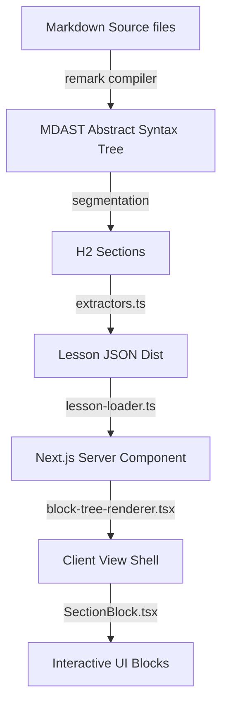

# PM Academy — Developer Handbook (README.md)

Welcome to the **PM Academy** core workspace. This document serves as the canonical developer guide for onboarding, local development, architectural standards, database migrations, and contribution workflows.

---

## 1. Project Overview & Structure

PM Academy is an interactive, gamified learning platform for product managers. It features a curated 90-lesson curriculum divided into exactly 9 modules × 10 lessons each.

```
/
├── .agents/                 # Workspace agent rules & custom skills
├── apps/
│   └── web/                # Next.js 16 web application
│       ├── app/            # App Router pages and API routes
│       ├── blocks/         # Custom renderable curriculum blocks
│       ├── components/     # Reusable shadcn/ui and layout components
│       ├── contexts/       # React Contexts (auth, breadcrumbs, etc.)
│       ├── hooks/          # Client hooks (progress, streaks)
│       ├── lib/            # Business logic, Supabase client, static loaders
│       └── renderer/       # Block-tree layout dispatcher
├── content/
│   ├── lessons/            # 90 raw lesson markdown files
│   └── dist/               # Compiled lesson JSON outputs
├── docs/                   # Architectural docs, roadmaps, and invariants
├── scripts/
│   └── compiler/           # AST compiler, validations, search index generators
└── supabase/
    ├── migrations/         # Database migrations (schema and auth state)
    └── templates/          # Custom transactional HTML templates
```

---

## 2. Tech Stack & Version Warning

The project uses a locked-in, stable tech stack:
*   **Framework:** Next.js 16 App Router + TypeScript 5 (Strict)
*   **Styling:** Tailwind CSS v4 + Framer Motion (animations) + shadcn/ui
*   **Database:** Supabase (PostgreSQL + Auth)
*   **Emails:** Resend SMTP
*   **Hosting:** Vercel

> [!WARNING]
> **Next.js 16 Version Constraints:**
> - Next.js 16 uses `proxy.ts` at the root of `apps/web/` instead of `middleware.ts` for Edge routing. DO NOT create a `middleware.ts` file; it will cause Next.js to fail compilation.
> - Refer to Next.js 16 documentation in `apps/web/node_modules/next/dist/docs/` for specific API signatures.

---

## 3. Architecture

### A. Compiler & Render Pipeline

1.  **Static-First Lesson Content:** Lesson content is stored in markdown under `content/lessons/` and pre-compiled to JSON. There is no runtime Markdown parsing.
2.  **Deterministic Lesson IDs:** Lesson IDs are stable strings (`les_XXXXXX`) generated deterministically from markdown filenames by the registry.
3.  **Dynamic Canonical Routes:** Lessons are rendered at `/academy/[moduleSlug]/[lessonId]`. The `moduleSlug` is checked dynamically against the lesson's compiled metadata module to guarantee URL canonicalization.
4.  **Legacy Route Redirects:** Legacy `/academy/l/[lessonId]` URLs perform 301/302 redirects to canonical paths.
5.  **Dynamic Breadcrumbs:** `BreadcrumbContext` manages Topbar labels to display curriculum metadata (`Curriculum > Module X: Name > Lesson Y: Title`) rather than stable internal lesson IDs.

### B. Database Schema & State Management
Supabase is used **only** for storing user-owned state.
*   **`users` table:** Tracks profile details, levels, streaks, and cache values.
*   **`lesson_progress` table:** Tracks user engagement across lesson states (`not_started`, `in_progress`, `completed`).
*   **`xp_events` ledger:** Append-only transaction log of XP earnings. Cache values for user XP are updated asynchronously or computed from this table. **Never directly modify `users.total_xp`.**
*   **`quiz_attempts` & `reflection_responses`:** Stores structured user submissions for audit trails and verification.

---

## 4. Local Development Setup

### Envs & Credentials
Create `apps/web/.env.local` containing:
```env
NEXT_PUBLIC_SUPABASE_URL=http://127.0.0.1:54321
NEXT_PUBLIC_SUPABASE_ANON_KEY=your-local-anon-key
SUPABASE_SERVICE_ROLE_KEY=your-local-service-role-key
```

### Essential Commands
Run these commands from the **workspace root**:

| Command | Action |
|---------|--------|
| `npm run dev` | Spin up Next.js local development server (or run `npm run dev` inside `apps/web`) |
| `npx tsx scripts/compiler/compile.ts` | Compile raw Markdown lessons to `content/dist/` |
| `npx tsx scripts/compiler/compile.ts --validate-only` | Run parser check and curriculum consistency validations |
| `supabase start` | Run Supabase locally via Docker |
| `supabase db reset` | Reset local db and apply migrations |

---

## 5. Deployment & CI/CD Pipeline

All repository deployments flow through the automated GitHub Actions pipeline.

1.  **CI/CD Pipeline (`ci.yml`):**
    *   Triggered on push/pull requests to `main`.
    *   Job 1: `build-and-validate` - Runs dependencies install, runs compilation, checks formatting/linting, and builds Next.js production bundles.
    *   Job 2: `deploy-supabase` - Runs only on branch `main` push or manual trigger. Connects to production database and deploys migrations.
2.  **Git Branching Strategy:**
    *   Develop on feature branches (`feature/your-feature` or `bugfix/your-fix`).
    *   Create Pull Requests against `main`. All checks must pass before merging.
