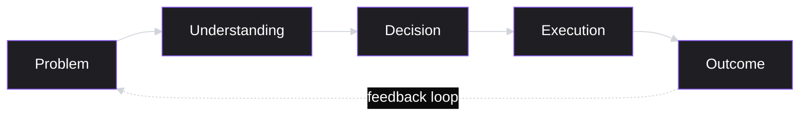
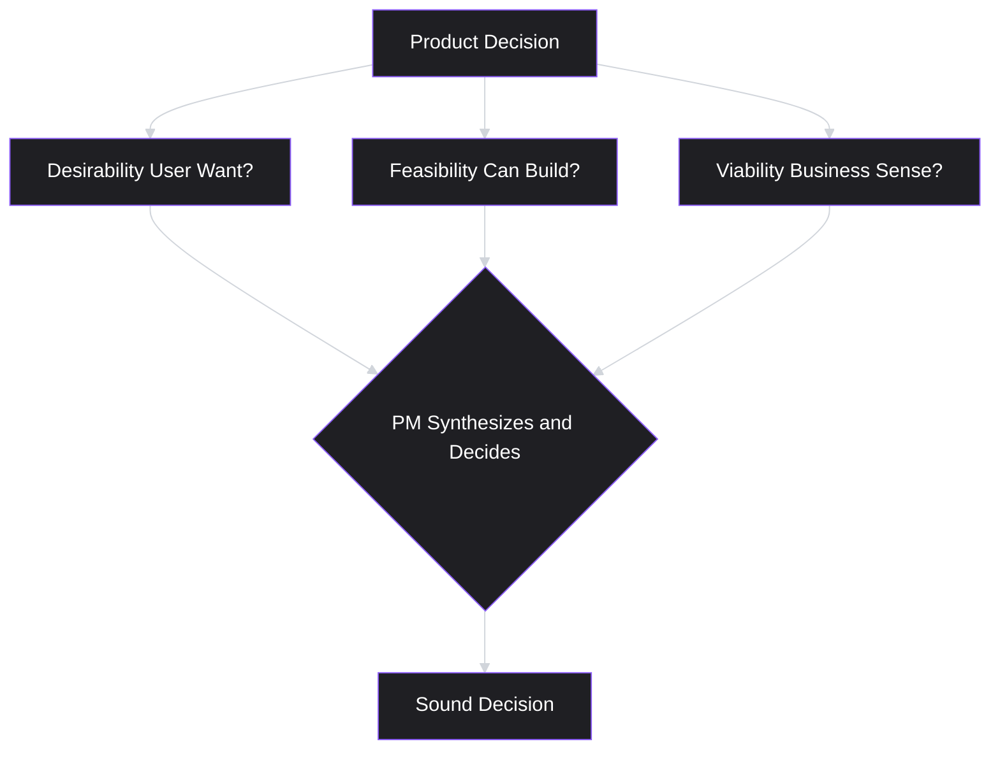

# Lesson 1: What is Product Management?

## Why This Lesson Matters

Every discipline has a founding question. For Product Management, it is this: *if a PM doesn't write the code, doesn't design the interface, and doesn't manage the engineers as direct reports — what, precisely, are they accountable for?*

Most people who enter Product Management, whether from engineering, design, consulting, or straight out of school, carry an incomplete or subtly wrong answer to this question. They think the job is "being the voice of the customer," or "translating business requirements into engineering tickets," or "managing the roadmap." Each of these is a fragment of the job, mistaken for the whole.

This lesson exists to correct that at the root, before any other habit is built on top of it. Everything else in this curriculum — discovery, prioritization, metrics, execution — is a method for answering the three questions this lesson introduces. If the definition of the role is fuzzy, every technique you learn afterward will be applied inconsistently, because you won't know what it's *for*.

This matters in real companies for a concrete reason: PMs who misunderstand their own accountability tend to default to the parts of the job that feel most controllable — writing detailed specs, chasing timelines, sitting in on every design review — while neglecting the part that is actually theirs alone: deciding, with evidence, what problem is worth solving. Hiring managers and skip-level leaders notice this immediately. It is the single most common gap between a PM who is "busy" and a PM who is "effective."

---

## Learning Path

| Field | Detail |
|---|---|
| **Module** | 1 — Foundations |
| **Current Lesson** | 1 of 90 |
| **Difficulty** | 1 / 10 |
| **Estimated Study Time** | 25 minutes (reading) + 10 minutes (reflection + quiz) |
| **Prerequisites** | None |
| **Next Lesson** | Lesson 2 — Product vs. Project |
| **Future Topics Unlocked** | Lesson 6 (Jobs to Be Done), Lesson 8 (Product Discovery), Lesson 29 (Prioritization Basics), Lesson 33 (Retention) — all directly build on the Accountability Triangle and Output vs. Outcome concepts introduced here |

---

## Learning Objectives

By the end of this lesson, you will be able to:

1. Define Product Management and distinguish it from adjacent disciplines (engineering, design, marketing, project management).
2. Explain the three core questions every Product Manager must answer.
3. Describe the Accountability Triangle (desirability, feasibility, viability) and explain why it is a more precise model than the popular "PM Venn diagram."
4. Distinguish output-focused work from outcome-focused work, and identify which one a given metric or activity represents.
5. Explain why PMs typically operate through influence rather than formal authority, and identify what this implies for how a PM should behave in a disagreement.

---

## Prerequisites

None. This is the first lesson in the PM Academy curriculum.

---

## Theory

### The Core Definition

A **Product Manager (PM)** is the person accountable for guiding a product toward success by identifying what problem is worth solving, for whom, and why — and then working with engineering, design, and business stakeholders to bring a solution to that problem to life.

Notice what this definition omits. It does not say the PM writes the code. It does not say the PM designs the interface. It does not say the PM manages people as direct reports. This omission is deliberate, and it is the first thing every new PM must internalize: **the PM manages the product, not the people, and manages it primarily through decisions, prioritization, and communication — not through direct execution.**

This is disorienting for people arriving from execution-heavy backgrounds (engineering, consulting, operations), where value is usually measured by what you personally produced. In Product Management, the PM's personal output is often invisible: a prioritization decision, a well-framed problem statement, a "no" said at the right moment. The *team's* output is visible. This asymmetry — invisible personal contribution, visible team contribution — is a permanent feature of the role, not a temporary condition to escape.

### The Three Core Questions

Nearly every activity a PM performs can be traced back to answering three questions, in order:

1. **What problem are we solving, and for whom?** (the "why")
2. **What should we build to solve it?** (the "what")
3. **How do we know if it worked?** (the "so what")

A person who cannot answer all three of these questions for their product, at any given time, is not yet doing product management — they are doing project coordination, which is a narrower and different job (see the comparison table below, and Lesson 2 for a full treatment).

It's worth noting the *order* matters. A surprising number of failed products can be traced to teams that answered question 2 before question 1 — they became attached to a solution before rigorously establishing the problem. We will return to this failure mode explicitly in the Case Study below, and again in Lesson 8 (Product Discovery).

### PM vs. Adjacent Roles

It helps to define Product Management by contrast with the roles it most often gets confused with:

| Role | Primary Question | Primary Output | Primary Accountability |
|---|---|---|---|
| **Product Manager** | What should we build, and why? | Decisions, priorities, roadmaps | Problem-solution-value fit |
| **Engineer** | How do we build it? | Working software | Technical correctness and feasibility |
| **Designer** | How should it look and feel to use? | Interfaces, interaction flows | Usability and desirability |
| **Project Manager** | Are we on schedule and on budget? | Timelines, status reports | Delivery predictability |
| **Marketer** | How do we communicate this to the market? | Positioning, campaigns | Awareness and demand |

A common early-career mistake is treating Product Management as "a bit of all of these" — a generalist who knows enough about engineering, design, and business to talk to everyone. This self-description is popular, usually illustrated with three overlapping circles (the "PM Venn diagram"), and it is not *false*. But it is dangerously incomplete, for a reason worth sitting with.

### Why the Venn Diagram Model Falls Short

The Venn diagram model describes **proximity** — which departments a PM sits near, which languages they can speak. It does not describe **accountability** — what result the PM is actually on the hook for, that no one else is on the hook for.

A more precise framing:

> A PM is accountable for outcomes that no single other function can be accountable for alone.

An engineer is accountable for whether the code works. A designer is accountable for whether the interface is usable. But *no one else on the team* is accountable for whether the product solves the right problem, for the right people, in a way that creates real business value. That accountability — for what this lesson calls **problem-solution-value fit** — is the actual center of the job. Knowing "a little about everything" is a *side effect* of holding that accountability, not the accountability itself.

This distinction is not academic. A PM who thinks of the job as "being a bridge between teams" will spend their time in meetings, relaying information. A PM who thinks of the job as "being accountable for problem-solution-value fit" will spend their time gathering evidence, making calls, and defending those calls — even in the same meetings. Same room, different job.

### Output vs. Outcome

The single most important distinction introduced in this lesson — one you will apply in nearly every subsequent lesson — is the difference between **output** and **outcome**.

- **Output** is what a team ships: a feature, a redesign, a new setting, a new integration.
- **Outcome** is the change in user or business behavior that results from that output: higher retention, faster task completion, increased revenue, reduced support tickets.

A team can ship a large volume of output and produce zero meaningful outcome, if what was shipped didn't address a real problem for real users. This is such a common failure pattern in the industry that Melissa Perri named an entire book after it: *Escaping the Build Trap* — the trap of measuring yourself, and being measured, by how much you shipped rather than what changed because of it.

Junior PMs are often informally evaluated on output ("we shipped 12 features this quarter"). Senior PMs, and PMs at companies with mature product cultures, are evaluated on outcome ("retention improved 4 points because we fixed the onboarding drop-off"). This curriculum will consistently push you toward outcome-based thinking, starting here.

A practical test you can apply immediately: **if you can't state the outcome a piece of work is meant to produce before it ships, you are not yet ready to build it.** This single sentence will save you more wasted engineering time than any framework in this curriculum.

### Authority Without Control

New PMs are frequently surprised to learn that they typically cannot:

- Order an engineer to prioritize their request over another team's request.
- Unilaterally overrule a designer's judgment on interaction design.
- Force a launch date without engineering's agreement on scope.
- Compel a stakeholder in another department to adopt their roadmap.

Instead, a PM operates primarily through **influence**: clear reasoning, well-communicated priorities, credible evidence, and trust accumulated over time. This is sometimes summarized as "responsibility without authority" — you are held accountable for the outcome, but you cannot simply command your way to it.

This is not a flaw in how companies are organized; it is a deliberate design choice. Engineers and designers report to their own functional leadership, who are accountable for the health and growth of those disciplines. If PMs had direct authority over engineers, the incentive to build genuinely excellent engineering organizations — as opposed to organizations optimized purely for whatever the PM wants this quarter — would erode. Understanding *why* the structure exists makes it far easier to work within it without resentment.

---

## Common Beginner Mistakes

**Mistake 1: "PMs manage engineers."**
This is the single most common misconception, usually inherited from the word "manager" in the title. PMs do not sit in engineers' reporting lines, do not conduct their performance reviews, and cannot assign work by fiat. What a PM does is set *priority and direction* — the engineering manager and the engineers themselves retain authority over *how* the work gets done. Confusing these two leads new PMs to behave in ways that damage trust with engineering partners almost immediately.

**Mistake 2: "Shipping more features means the product is succeeding."**
This is the output/outcome confusion described above, and it is worth restating directly because it is so persistent: a shipped feature is an *attempt* at an outcome, not the outcome itself. A PM who reports "we shipped X" as if it were an achievement, without reference to what changed for users or the business, has not yet separated their evaluation criteria from an engineer's.

**Mistake 3: "As the PM, I have final authority."**
Some new PMs, especially those coming from more hierarchical prior roles, assume the title implies command authority similar to a general manager. It does not, in the vast majority of modern tech organizations. The PM's power comes from the quality of their reasoning and the trust they've built, not their position on an org chart.

**Mistake 4: "My job is to solve the solution the stakeholder asked for."**
A stakeholder (often a sales leader, an executive, or a customer) will frequently arrive with a specific solution already in mind: "We need a dark mode." "We need an export-to-Excel button." A common beginner mistake is to take this request at face value and route it directly to engineering. A more mature response is to ask *what problem the requested solution is meant to solve*, because the requester's proposed solution is frequently not the best — or even a correct — answer to their actual underlying problem. This single habit, more than any other, separates order-takers from Product Managers. We will build a dedicated framework for this in Lesson 6 (Jobs to Be Done).

**Mistake 5: "The PM Venn diagram is the whole job."**
As covered in the Theory section: describing the PM as "a generalist who knows business, tech, and design" describes proximity to disciplines, not the accountability that actually defines the role. Beginners who over-index on this model tend to spend their energy trying to sound credible in every domain, rather than developing the judgment to make hard trade-off calls between desirability, feasibility, and viability.

---

## Mental Model: The Decision Chain

Every lesson in this curriculum will introduce one memorable mental model — a compressed way of carrying the lesson's core idea in your head permanently, long after the details fade. For this lesson, the mental model is the **Decision Chain**:

Read it as follows:

- You start with a **Problem** — something is wrong or missing for a specific group of users.
- You build **Understanding** — evidence about who has this problem, how severe it is, and why it exists (this is the domain of Module 2, User Research).
- You make a **Decision** — what, specifically, will be built, and what will deliberately *not* be built (this is where prioritization and trade-offs, covered later in Module 3, live).
- Engineering and design perform **Execution** — turning the decision into a working product.
- You measure the **Outcome** — did user or business behavior actually change (Module 4, Product Analytics).
- Critically, the outcome **feeds back** into a refined understanding of the problem — the chain is a loop, not a straight line.

Use this model as a diagnostic tool. When a product initiative fails, ask which link in the chain broke: Was the problem misidentified? Was understanding thin (built on assumption, not evidence)? Was the decision poorly reasoned? Was execution weak? Or was the outcome never actually measured, so no one can even say whether it worked? Nearly every product failure can be traced to exactly one of these five links, and identifying which one is often more useful than any post-mortem template.

---

## Real Company Example

**Spotify** is a common reference point for how Product Management operates inside a large technology company, partly because Spotify has been unusually open about publishing its internal practices through its official engineering and product culture materials over the years.

At Spotify, PMs have historically been embedded within small, cross-functional teams (Spotify has referred to these as "squads") alongside engineers and designers, rather than sitting outside the team as an external coordinator. The PM in this model is accountable for the squad's mission and priorities, while the squad retains significant autonomy over *how* to execute against that mission. This is a direct, real-world instance of "responsibility without authority": the PM sets direction; the squad decides implementation.

*(Assumption flagged: the exact current team structures at Spotify may have evolved since these practices were first publicized, and this curriculum does not claim to represent Spotify's present-day internal organization with certainty. The underlying principle — a PM as direction-setter embedded in an autonomous, cross-functional team — is a widely adopted pattern across the industry independent of Spotify's specific current structure.)*

---

## Real World Perspective: Startup vs. Mid-Size vs. Big Tech

The *definition* of Product Management in this lesson holds everywhere. The *day-to-day texture* of the job differs substantially by company stage, and new PMs are frequently caught off guard by this.

**At a startup (roughly pre-seed to Series B):**
The PM often wears multiple hats simultaneously — sometimes doing customer support, sometimes writing marketing copy, sometimes doing basic QA. There is usually no dedicated user researcher or data analyst, so the PM personally conducts interviews and pulls raw data. The Accountability Triangle is often heavily skewed toward *viability*, because runway is finite and every decision has immediate survival implications. Speed frequently matters more than rigor; a "good enough" decision made this week often beats a perfect decision made in a month.

**At a mid-size company (roughly Series C to pre-IPO, or an established profitable company):**
Specialization begins. There are usually dedicated designers, a data team, and sometimes a user research function. The PM's job shifts from "do everything" to "coordinate specialists and make the call between their inputs." Process starts to matter — quarterly planning, roadmap reviews, cross-team dependencies — because the number of people affected by a decision has grown past what informal conversation can manage.

**At Big Tech (Google, Microsoft, Amazon, Meta, and similar):**
PMs typically operate within a highly specialized ecosystem: dedicated UX researchers, data scientists, program managers (who absorb much of the scheduling/coordination burden a startup PM would otherwise handle personally), and often a formal experimentation platform for A/B testing (covered in Lesson 40). The core job — problem-solution-value fit — does not change, but the PM spends comparatively more time on stakeholder alignment across large orgs, and comparatively less time on hands-on research or QA, because dedicated specialists exist for those functions. Influence, rather than raw output, becomes an even more pronounced lever, because a single PM's product often touches millions of users and dozens of adjacent teams.

The common thread: as company size grows, the PM's job shifts from *doing* toward *deciding and aligning*. This is worth remembering as you plan your own career path — the skills that make you excel at a 10-person startup (versatility, speed, hands-on execution) are not identical to the skills that make you excel inside a 10,000-person organization (stakeholder navigation, structured decision-making, working through specialists rather than around them).

---

## Detailed Case Study: The Problem With "More Features"

Consider a simplified, illustrative scenario based on a pattern extremely common across both early-stage and mature products.

A photo-sharing app has stagnant user growth. Leadership, concerned, tells the product team: "Our competitors have more features than us. We need to catch up." Over the following two quarters, the team ships:

- A new filter library
- A "stories" feature
- A redesigned profile page
- An in-app messaging system

At the end of this period, engagement metrics have not moved. Some users report the app now feels "cluttered."

**What went wrong?**

The team optimized for *output* (four new features) without ever answering the three core questions from this lesson:

1. **What problem are we solving, and for whom?** — Never clearly defined. "Catch up to competitors" is a reaction to competitors' *output*, not a diagnosis of a *user need*. It answers "what are they doing" rather than "what is broken for our users."
2. **What should we build to solve it?** — Without a defined problem, feature selection was driven by competitive anxiety rather than evidence. Each feature was plausible in isolation, which is precisely what makes this failure mode dangerous — nothing on the list was obviously a bad idea.
3. **How do we know if it worked?** — No success metric was defined *before* building, so the team had no operational definition of "working," even in principle, until after the fact — by which point it was too late to course-correct cheaply.

A PM applying the Decision Chain mental model would have paused at the very first link. Before committing engineering time, they would have investigated: Is growth stagnating because of onboarding drop-off? Because of a specific friction point among existing users? Because the core value proposition is no longer differentiated from a specific competitor? Each of these implies a *completely different* solution — and possibly no new feature at all. This is the difference between reactive feature production and product management: not effort, not intelligence, but the discipline to build understanding before committing to a decision.

This case will be revisited directly in **Lesson 6 (Jobs to Be Done)**, where we introduce a structured method for uncovering the real problem before this mistake happens, and again in **Lesson 33 (Retention)**, where we introduce the metrics that would have surfaced the actual friction point.

---

## Framework Explanation: The Accountability Triangle

This lesson introduces the first reusable framework of the curriculum: the **Accountability Triangle**.

Three conditions must all be true simultaneously for a product decision to be sound:

1. **Desirability** — Do users actually want this?
2. **Feasibility** — Can we actually build this, given our technology and resources?
3. **Viability** — Does this make sense for the business — commercially, strategically, operationally?

In practice, Design tends to hold the strongest signal on desirability (usability research, qualitative feedback). Engineering tends to hold the strongest signal on feasibility (technical constraints, architecture, timeline realism). Business and leadership tend to hold the strongest signal on viability (unit economics, strategic fit, regulatory exposure). The PM's distinctive job is to sit at the center of these three signals and make the call when they conflict — for example, when a feature is desirable and feasible but not viable (too expensive to support at scale), or desirable and viable but not feasible within a reasonable timeframe (would require a full architecture rebuild).

This is a considerably more precise version of the "PM Venn diagram" than the popular one, because it names *what specific tension is being resolved* (desirability vs. feasibility vs. viability) rather than merely *which departments happen to sit nearby*.

We will apply the Accountability Triangle directly in **Lesson 8 (Product Discovery)** and **Lesson 29 (Prioritization Basics)** — in both cases, as a lens for evaluating competing ideas, not just a theoretical diagram.

---

## Interview Perspective: How Interviewers Think About This

Questions built directly on this lesson appear, in some form, in nearly every entry-level and associate PM interview loop. They rarely sound like "define Product Management" — that would be too easy to answer from memorization. Instead, they are disguised as scenario or behavioral questions.

**Typical question 1: "Walk me through a time you disagreed with an engineer or designer. What happened?"**
*What the interviewer is actually evaluating:* Whether you understand that you cannot simply mandate your way through disagreement (Mistake 3 above), and whether you resolve conflict through evidence and reasoning rather than titles. A weak answer describes "pulling rank" or escalating immediately to a manager. A strong answer describes surfacing the underlying disagreement (often a difference in assumed user need, or a difference in perceived technical risk), bringing evidence to bear, and reaching a decision the other party could understand even if they didn't fully agree with it.

**Typical question 2: "Tell me about a product you think is badly designed, and how you'd fix it."**
*What the interviewer is actually evaluating:* Whether your instinct is to jump to a solution ("I'd add feature X") or whether you first diagnose the underlying problem for a specific user segment. A candidate who immediately proposes a fix, without ever stating what problem the current design fails to solve and for whom, is demonstrating the exact failure mode from this lesson's Case Study. A strong candidate explicitly separates "here is the problem I believe exists, and here is my evidence or reasoning for believing it" from "here is what I would build," even under interview time pressure.

**Typical question 3: "What does a Product Manager actually do all day?"**
*What the interviewer is actually evaluating:* Whether you understand that the PM's personal output is often invisible (decisions, prioritization, framing) rather than confusing the job with visible execution work. A candidate who describes writing detailed specs and attending standups all day, without mentioning problem definition, evidence-gathering, or trade-off decisions, has described the mechanics of the job without its substance.

The underlying pattern across all three: interviewers are rarely testing whether you can recite a definition. They are testing whether your *instincts*, under a realistic scenario, default toward problem-first thinking and evidence-based influence — or toward solution-first thinking and positional authority. This is precisely why this curriculum insists on first-principles understanding rather than memorized frameworks: frameworks recited without the underlying instinct fall apart under a good interviewer's follow-up question.

---

## Summary

Product Management is the discipline of deciding what to build and why, and being accountable for whether it actually solves a real problem for real users in a way that creates business value. Unlike engineering, design, or project management, the PM role is defined not by a specific tangible output but by accountability for *problem-solution-value fit* — captured in this lesson's Accountability Triangle of desirability, feasibility, and viability. PMs typically hold responsibility without direct authority, meaning the job is performed through influence, evidence, and communication rather than command — a structural feature of how companies organize, not an accident. Above all, effective PMs think in terms of outcomes (behavior change) rather than output (features shipped), applying the Decision Chain (Problem → Understanding → Decision → Execution → Outcome) as a standing diagnostic for their own work. This distinction — output vs. outcome — is the single idea from this lesson you will use most often for the remainder of this curriculum.

---

## Key Takeaways

- A PM is accountable for problem-solution-value fit, not for writing code, designing interfaces, or managing people.
- The three core questions — what problem, what solution, how do we know it worked — define the boundaries of the job, in that order.
- The Accountability Triangle (desirability, feasibility, viability) is a more precise model of the job than the popular "PM Venn diagram," because it names the actual tensions being resolved.
- Output (what is shipped) is not the same as outcome (what changes as a result); shipping more does not guarantee impact — this is the core failure mode in the "Build Trap."
- PMs typically operate through influence rather than formal authority — a deliberate organizational design choice, not an oversight.
- The Decision Chain (Problem → Understanding → Decision → Execution → Outcome, with feedback) is a reusable diagnostic for identifying exactly where a product initiative broke down.
- The texture of the job shifts significantly by company stage — from generalist execution at a startup to structured decision-making and stakeholder navigation at Big Tech — even though the underlying accountability never changes.

---

## Cheat Sheet

*A two-minute review of everything in this lesson.*

- **Definition:** PM = accountable for problem-solution-value fit. Not code, not design, not people management.
- **Three questions, in order:** (1) What problem, for whom? (2) What should we build? (3) How do we know it worked?
- **Accountability Triangle:** Desirability (users want it) × Feasibility (we can build it) × Viability (business sense) — all three required.
- **Output ≠ Outcome:** Output = what's shipped. Outcome = behavior change that results. Measure outcome, not output.
- **Authority:** PMs typically have responsibility without authority. Influence > command.
- **Decision Chain:** Problem → Understanding → Decision → Execution → Outcome → (feeds back to Problem).
- **Biggest beginner trap:** Solving the solution someone handed you, instead of the problem underneath it.
- **Company-stage lens:** Startup = generalist/speed. Mid-size = specialization begins. Big Tech = decide-and-align through specialists.
- **Interview tell:** Solution-first instinct = weak signal. Problem-first, evidence-based instinct = strong signal.

---

## Glossary

| Term | Definition | Related Concepts | Difficulty |
|---|---|---|---|
| Product Manager (PM) | The person accountable for deciding what a product should do and why, and for the fit between problem, solution, and business value. | Accountability Triangle, Output vs. Outcome | 1 |
| Output | What a team produces or ships — a feature, release, or design change. | Outcome, Product Metrics (Lesson 31) | 1 |
| Outcome | The change in user or business behavior that results from an output. | Output, North Star Metric (Lesson 32) | 1 |
| Desirability | Whether users actually want a proposed solution. | Accountability Triangle, User Research (Lesson 11) | 1 |
| Feasibility | Whether a proposed solution can realistically be built with available technology and resources. | Accountability Triangle | 1 |
| Viability | Whether a proposed solution makes sense for the business, commercially or strategically. | Accountability Triangle | 1 |
| Accountability Triangle | A framework stating that sound product decisions require desirability, feasibility, and viability simultaneously. | Product Discovery (Lesson 8), Prioritization (Lesson 29) | 2 |
| Decision Chain | A mental model tracing a product initiative through Problem → Understanding → Decision → Execution → Outcome, with feedback into the next cycle. | Product Discovery (Lesson 8), Product Lifecycle (Lesson 4) | 2 |
| Build Trap | A pattern (named by Melissa Perri) in which teams measure themselves by output shipped rather than outcomes achieved. | Output vs. Outcome, Product Metrics (Lesson 31) | 2 |
| Responsibility Without Authority | The organizational condition in which a PM is accountable for outcomes but lacks direct command authority over the people who produce them. | Stakeholder Management (Lesson 47) | 2 |

---

## Further Reading / Resources

- Marty Cagan, *Inspired: How to Create Tech Products Customers Love* (Silicon Valley Product Group) — the widely referenced industry text underlying the desirability/feasibility/viability framing and modern product team structure used in this lesson.
- Melissa Perri, *Escaping the Build Trap: How Effective Product Management Creates Real Value* — the foundational text on the output vs. outcome distinction, including the "Build Trap" term used above.
- Spotify Engineering Culture videos (published by Spotify on its official engineering blog and YouTube channel) — original source of the "squad" model referenced in the Real Company Example.

---

## Flashcards

**Card 1**
- Front: What are the three core questions a PM must answer, and in what order?
- Back: (1) What problem are we solving, and for whom? (2) What should we build to solve it? (3) How do we know if it worked? Order matters — problem before solution.
- Difficulty: 1
- Tags: fundamentals, core-questions

**Card 2**
- Front: What is the difference between output and outcome?
- Back: Output is what a team ships (a feature, release). Outcome is the resulting change in user or business behavior.
- Difficulty: 1
- Tags: output-outcome, fundamentals

**Card 3**
- Front: Name the three elements of the Accountability Triangle.
- Back: Desirability (do users want it?), Feasibility (can we build it?), Viability (does it make business sense?).
- Difficulty: 2
- Tags: framework, accountability-triangle

**Card 4**
- Front: Why is "responsibility without authority" a defining, deliberate characteristic of Product Management — not just an inconvenience?
- Back: If PMs had direct command authority over engineers and designers, it would erode those functions' own incentive to build excellence on their own terms. The structure forces PMs to lead through evidence and trust.
- Difficulty: 2
- Tags: authority, influence

**Card 5**
- Front: What is the main limitation of the "PM Venn diagram" (business/tech/design intersection) model?
- Back: It describes proximity to other disciplines but does not specify what the PM is actually accountable for — namely, problem-solution-value fit.
- Difficulty: 2
- Tags: venn-diagram, critique

**Card 6**
- Front: What are the five links in the Decision Chain mental model?
- Back: Problem → Understanding → Decision → Execution → Outcome (which feeds back into a refined Problem).
- Difficulty: 2
- Tags: mental-model, decision-chain

**Card 7**
- Front: A stakeholder asks you to build a specific feature. What should you do first, according to this lesson?
- Back: Ask what problem the requested feature is meant to solve, rather than routing the request directly to engineering — the stakeholder's proposed solution may not be the best answer to their real problem.
- Difficulty: 3
- Tags: stakeholder-management, problem-first

---

## Reflection Exercise

You are the PM for a note-taking app. Your VP of Sales tells you, in a hallway conversation: "Three of our biggest enterprise prospects this quarter said they won't sign unless we add offline mode. We need to build this immediately."

Work through the following, in writing, before reading further:

1. Using the Decision Chain, identify which link you currently have the *least* understanding of. Is it the problem itself, or something else?
2. What specific evidence would you want, beyond the VP's summary, before treating "build offline mode" as a decision rather than a proposed solution?
3. Construct two different underlying problems that could each explain "enterprise prospects want offline mode" — problems that would imply two *different* solutions, only one of which might be offline mode.
4. Apply the Accountability Triangle to the VP's proposed solution (offline mode) using only the information given. Where is your greatest uncertainty — desirability, feasibility, or viability?
5. Write the single sentence you would say back to the VP in the hallway, right now, without being dismissive of urgent revenue pressure.

There is no single correct answer. The purpose of this exercise is to practice resisting a solution handed to you by a stakeholder — including one with real organizational power and real urgency — until you have done the work this lesson describes. This is a harder skill in practice, under social and political pressure, than it appears on paper.

---

## Quiz

**1. What is the primary distinguishing accountability of a Product Manager, compared to an engineer or designer?**
A) Writing the highest-quality code
B) Accountability for the fit between problem, solution, and business value
C) Managing the largest team
D) Creating the final visual design

*Correct answer: B*
*Explanation: Engineers are accountable for whether the code works and designers for usability; the PM is uniquely accountable for whether the product solves the right problem in a way that creates value.*
*Learning objective tested: #1*
*Difficulty: Easy*

---

**2. Which of the following is NOT one of the three core questions a PM must answer?**
A) What problem are we solving, and for whom?
B) What should we build to solve it?
C) How much will each team member be paid?
D) How do we know if it worked?

*Correct answer: C*
*Explanation: Compensation is an HR/management function, not one of the three defining questions of product management.*
*Learning objective tested: #2*
*Difficulty: Easy*

---

**3. A team ships five new features in a quarter, but user retention does not improve. This is best described as:**
A) High outcome, low output
B) High output, low outcome
C) High viability, low feasibility
D) A failure of engineering execution

*Correct answer: B*
*Explanation: Shipping features is output. Since retention (a behavior change) did not improve, outcome was low, despite high output.*
*Learning objective tested: #4*
*Difficulty: Easy*

---

**4. Why is the "PM Venn diagram" (intersection of business, technology, design) described as incomplete in this lesson?**
A) Because PMs do not work with designers
B) Because it describes proximity to disciplines, not actual accountability
C) Because it does not include marketing
D) Because it applies only to Spotify

*Correct answer: B*
*Explanation: The Venn diagram shows which departments a PM sits near, not what the PM is actually responsible for delivering — problem-solution-value fit.*
*Learning objective tested: #3*
*Difficulty: Easy*

---

**5. In the Accountability Triangle, "Viability" refers to:**
A) Whether users want the solution
B) Whether the solution can technically be built
C) Whether the solution makes sense for the business
D) Whether the solution has been tested with real users

*Correct answer: C*
*Explanation: Viability concerns business sense — cost, revenue, strategic fit — distinct from desirability (user want) and feasibility (technical possibility).*
*Learning objective tested: #3*
*Difficulty: Easy*

---

**6. A PM wants to change the design direction of a feature, but the designer disagrees based on usability research. According to this lesson, what should the PM most likely do?**
A) Override the designer, since the PM has final authority
B) Escalate immediately to leadership
C) Use influence, evidence, and discussion to resolve the disagreement, since PMs typically lack direct authority over design decisions
D) Cancel the feature entirely

*Correct answer: C*
*Explanation: The lesson establishes that PMs typically operate through influence rather than command authority, especially in domains like design where another role holds the strongest expertise.*
*Learning objective tested: #5*
*Difficulty: Easy*

---

**7. In the Detailed Case Study, what was the primary mistake made by the product team?**
A) They hired too few engineers
B) They shipped output (new features) without first defining the underlying problem or success metric
C) They did not use Mermaid diagrams
D) They ignored competitor products entirely

*Correct answer: B*
*Explanation: The team reacted to competitive pressure by shipping features without answering the three core questions — problem, solution, and success measurement — first.*
*Learning objective tested: #1, #4*
*Difficulty: Medium*

---

**8. At Spotify, as referenced in this lesson, how is the PM's relationship to their team best described?**
A) The PM has direct command authority over all squad decisions, including implementation details
B) The PM sets direction and priorities for the squad; the squad retains autonomy over execution
C) The PM is not part of the squad and works separately from engineers and designers
D) The PM's role is purely administrative

*Correct answer: B*
*Explanation: The Spotify model illustrates "responsibility without authority" — the PM defines mission and priorities, while the squad decides how to execute.*
*Learning objective tested: #5*
*Difficulty: Medium*

---

**9. Which statement correctly distinguishes a Project Manager from a Product Manager, based on this lesson?**
A) They are the same role with different titles
B) A Project Manager focuses on schedule and budget; a Product Manager focuses on what should be built and why
C) A Project Manager has more authority than a Product Manager
D) A Product Manager only works on internal tools

*Correct answer: B*
*Explanation: The comparison table shows Project Managers are primarily concerned with schedule/budget adherence, while PMs are concerned with defining the right thing to build.*
*Learning objective tested: #1*
*Difficulty: Medium*

---

**10. In the Decision Chain mental model, what does the feedback loop from "Outcome" back to "Problem" represent?**
A) A sign that the initiative has failed
B) The idea that measuring outcomes refines your understanding of the original problem, informing the next cycle
C) A requirement to repeat the exact same execution
D) An optional step that most teams skip

*Correct answer: B*
*Explanation: The Decision Chain is a loop, not a straight line — outcome measurement feeds back into a sharper understanding of the problem for the next cycle of work.*
*Learning objective tested: #4*
*Difficulty: Medium*

---

**11. Why does this lesson argue that "authority" is the wrong lens for understanding PM effectiveness?**
A) Because PMs technically outrank engineers in most organizations
B) Because most PMs cannot mandate outcomes through direct command, and must instead rely on influence and evidence
C) Because authority is only relevant in large companies
D) Because engineers have more authority than PMs in all cases

*Correct answer: B*
*Explanation: The lesson explicitly frames PM effectiveness around influence — through reasoning, communication, and trust — rather than formal command authority.*
*Learning objective tested: #5*
*Difficulty: Medium*

---

**12. A feature is desirable (users want it) and viable (good business case) but would require a complete rebuild of the product's backend architecture within an unrealistic timeframe. Which element of the Accountability Triangle is in question?**
A) Desirability
B) Feasibility
C) Viability
D) Authority

*Correct answer: B*
*Explanation: Feasibility concerns whether something can actually be built with available technology and resources — a backend rebuild constraint is a feasibility issue.*
*Learning objective tested: #3*
*Difficulty: Medium-Hard*

---

**13. (Product Thinking) A PM at a 15-person startup and a PM at a 10,000-person company both apply the Decision Chain. According to the Real World Perspective section, which part of the job is most likely to look different between them, even though the underlying accountability is identical?**
A) Whether they need to understand the problem before building
B) Whether outcome, not output, is the right measure of success
C) How much of the "Understanding" and "Execution" work they do personally versus through specialists
D) Whether the Accountability Triangle applies to their decisions

*Correct answer: C*
*Explanation: The core accountability (problem-solution-value fit, output vs. outcome, the Triangle) is invariant across company stages. What changes is how much of the day-to-day work — research, coordination, QA — the PM does hands-on versus delegates to specialists, per the Real World Perspective section.*
*Learning objective tested: #1, #3*
*Difficulty: Hard*

---

**14. (Interview Reasoning) An interviewer asks, "Tell me about a product you think is badly designed, and how you'd fix it." A candidate immediately describes three new features they would add. What does this response most likely signal to the interviewer, based on this lesson's Interview Perspective section?**
A) Strong product instincts, because the candidate proposed concrete solutions quickly
B) A solution-first instinct, since the candidate never established what problem the current design fails to solve, or for whom
C) That the candidate has strong design skills
D) Nothing meaningful — interviewers only care about the final list of features proposed

*Correct answer: B*
*Explanation: As described in the Interview Perspective section, jumping straight to proposed fixes without first diagnosing the underlying problem and affected user segment mirrors the exact failure mode described in this lesson's Case Study, and is read as a weak signal by experienced interviewers.*
*Learning objective tested: #1, #4*
*Difficulty: Hard*

---

**15. (Product Thinking, Highest Difficulty) A VP tells a PM: "Our top three enterprise prospects all said they won't sign unless we build offline mode. Build it." Using only the frameworks in this lesson, what is the single best justification for the PM to pause before committing engineering time — even though the request comes from a powerful stakeholder with real urgency?**
A) The PM has final authority and can simply decline the request outright
B) "Offline mode" is a proposed solution, not a validated problem statement — the underlying need (e.g., unreliable venue connectivity, data security concerns, or something else entirely) is not yet known, and different underlying problems could imply different, possibly cheaper or more valuable, solutions
C) Engineering will refuse to build it regardless of justification
D) The request should be declined because it did not come through the design team first

*Correct answer: B*
*Explanation: This mirrors the lesson's core lesson about solution-first requests (Common Beginner Mistake #4) and the ordering of the three core questions: understanding the problem must precede committing to a specific solution, even under real stakeholder pressure. The PM's job is not to refuse the request, nor to accept it uncritically, but to establish the actual problem first — which may or may not confirm offline mode as the right answer.*
*Learning objective tested: #1, #2, #5*
*Difficulty: Hard*

---

## Connections

| | Lesson | Core Idea Carried Forward |
|---|---|---|
| **Previous Lesson** | None (this is Lesson 1) | — |
| **Current Lesson** | Lesson 1 — What is Product Management? | PM accountability = problem-solution-value fit; Accountability Triangle; Output vs. Outcome; Decision Chain |
| **Next Lesson** | Lesson 2 — Product vs. Project | Builds directly on the PM/Project Manager comparison table above, and introduces why products require ongoing lifecycle thinking that a single project cannot capture |
| **Future Concepts Unlocked** | Lesson 6 (Jobs to Be Done) | Provides the structured method for uncovering real problems — directly resolves Common Beginner Mistake #4 and the Case Study's core failure |
| | Lesson 8 (Product Discovery) | Formalizes the "Understanding" link of the Decision Chain into a repeatable process |
| | Lesson 29 (Prioritization Basics) | Applies the Accountability Triangle as a scoring lens across competing ideas |
| | Lesson 33 (Retention) | Introduces the metrics that would have diagnosed the Case Study's stagnant growth *before* four quarters of wasted output |
| | Lesson 47 (Stakeholder Management) | Directly extends "Responsibility Without Authority" into a full toolkit for managing upward and sideways influence |

This curriculum is designed to be read as one continuous argument, not fifty independent articles. Every lesson from here forward will assume you carry the Accountability Triangle, the Output/Outcome distinction, and the Decision Chain with you — they will not be re-explained, only re-applied in new contexts.
