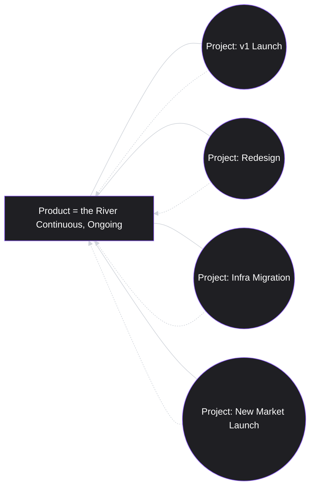
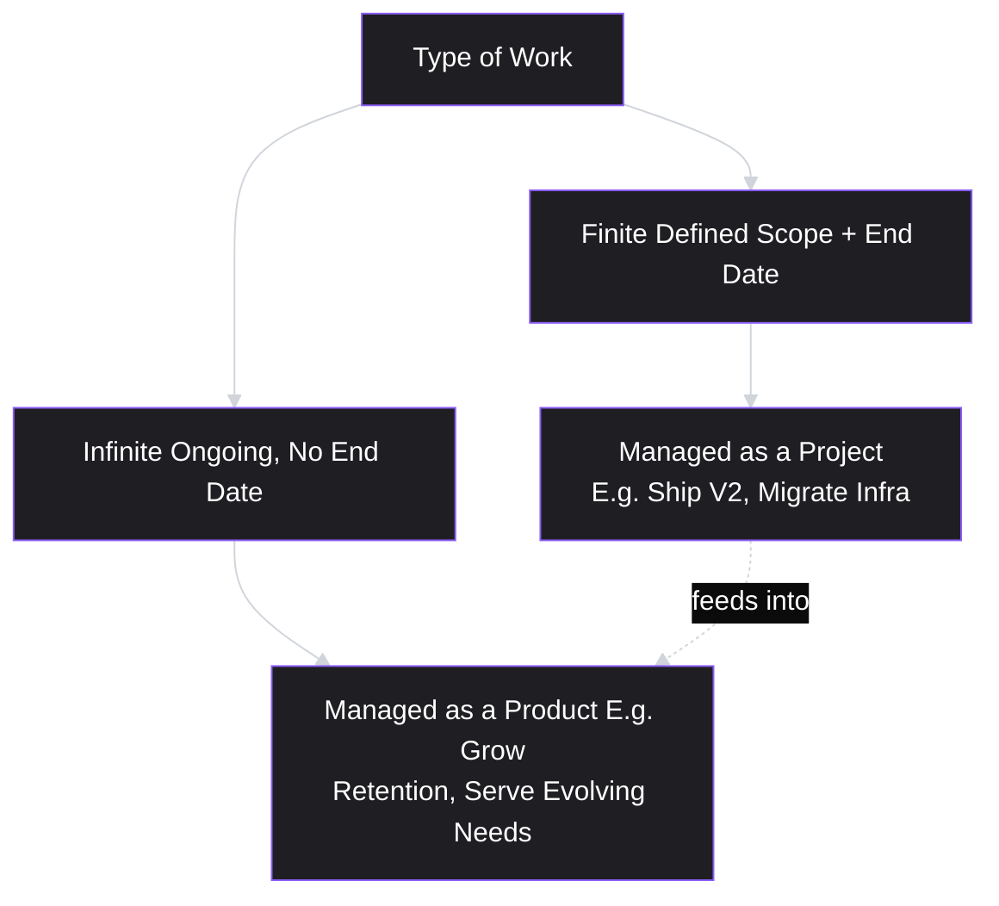

# Lesson 2: Product vs. Project

## Why This Lesson Matters

Lesson 1 introduced a comparison table distinguishing a Product Manager from a Project Manager by their primary question and accountability. That distinction was necessary but incomplete — it told you *who* is accountable for what, but not *why* the underlying work itself is structurally different.

This lesson goes one level deeper: it is not just that PMs and Project Managers ask different questions. It is that **a product and a project are fundamentally different kinds of things**, and confusing the two leads to some of the most common structural mistakes in early-career product work — treating a product like something that gets "finished," or measuring a product team's success the way you'd measure a construction crew's.

This matters because the language of projects is everywhere in corporate life — deadlines, milestones, deliverables, "done" — and it is easy to unconsciously import that language, and the thinking behind it, into product work where it quietly does damage. A PM who thinks in projects ships a feature and moves on. A PM who thinks in products ships a feature and then asks what it did, and what to do next. This lesson exists to install the second instinct before the first one calcifies.

---

## Learning Path

| Field | Detail |
|---|---|
| **Module** | 1 — Foundations |
| **Current Lesson** | 2 of 90 |
| **Difficulty** | 1 / 10 |
| **Estimated Study Time** | 20 minutes (reading) + 10 minutes (reflection + quiz) |
| **Prerequisites** | Lesson 1 (What is Product Management?) |
| **Next Lesson** | Lesson 3 — Product Thinking |
| **Future Topics Unlocked** | Lesson 4 (Product Lifecycle), Lesson 9 (Product Vision), Lesson 41 (Roadmaps) — all depend on the finite/infinite distinction introduced here |

---

## Learning Objectives

By the end of this lesson, you will be able to:

1. Define the structural difference between a product and a project, independent of who manages each.
2. Explain why "done" is a meaningful concept for a project but not for a healthy product.
3. Identify the risk of "project thinking" applied to product work, using a real scenario.
4. Describe how product teams and project-based teams are typically funded and evaluated differently, and why that shapes incentives.
5. Explain how a single product is usually delivered through a *sequence* of projects, and why this relationship is easy to misunderstand.

---

## Prerequisites

This lesson assumes familiarity with Lesson 1's core definition of a Product Manager and its Accountability Triangle (desirability, feasibility, viability). If you have not completed Lesson 1, do so first — this lesson builds directly on its comparison table.

---

## Theory

### The Core Distinction

A **project** is a temporary endeavor with a defined beginning, a defined end, and a specific deliverable. Once the deliverable is produced and accepted, the project is complete. Building a new office, migrating a database, launching a marketing campaign for a specific quarter — these are projects. They have a natural finish line.

A **product** is an ongoing, evolving thing that exists to serve a continuing need for its users, for as long as that need exists and the business chooses to serve it. A product does not have a natural finish line. Spotify did not "finish" being a music streaming product in some year and stop; it continues to evolve, indefinitely, in response to changing user needs, competition, and technology.

This is the single most important distinction in this lesson, and it has a direct practical consequence: **you cannot apply project-management thinking (fixed scope, fixed timeline, defined "done") to product work without eventually causing damage**, because product work has no natural end state to plan toward. There is no "finished" version of a product, only a *current* version and a *better next* version.

### Products Are Delivered Through Projects

This does not mean projects are irrelevant to product work — quite the opposite. A product is typically built and evolved through a *sequence* of projects: a project to ship v1, a project to ship a major redesign, a project to migrate to new infrastructure. Each of these individual projects can and should have a defined scope and end date. What has no end date is the *product itself* — the underlying commitment to serve a user need, which continues across and beyond any individual project.

This relationship is easy to get backward. A common mistake is to think of "the product" as one long project that simply hasn't finished yet, rather than as an ongoing entity that is *host to* many discrete projects over its life. The difference matters because it changes what "success" means. A project succeeds when it delivers its defined scope on time. A product succeeds when it continues to serve real user needs better than the available alternative — a standard that has no expiration date and is never fully and finally satisfied.

### Why "Done" Is the Wrong Question for a Healthy Product

If you ask, "Is this project done?" — that is a meaningful, answerable question. Scope was defined; either it was delivered or it wasn't.

If you ask, "Is this product done?" — for any product still being actively served to users, the honest answer is that the question doesn't quite make sense. A product's users' needs keep evolving (new competitors emerge, new use cases arise, new technology becomes available), so a product that stops evolving is not "done" in a successful sense — it is stagnating, and stagnation typically precedes decline. Products that are truly "done," in a durable sense, are usually products the company has decided to sunset.

This has a subtle but important implication for how you write goals and OKRs (a topic covered later, in Module 5). "Ship feature X" is a project-shaped goal — it has a clear finish line. "Improve activation rate" is a product-shaped goal — it has no natural finish line, only a direction of continuous improvement. Mature product organizations lean toward the second kind of goal, even though the first kind feels more satisfying to check off a list.

### Funding and Evaluation Differences

Projects and products are typically funded and evaluated differently inside real companies, and this shapes incentives in ways worth understanding early.

A **project** is often funded with a fixed budget and evaluated primarily on delivery: did it ship on time, within budget, matching the agreed scope? This is why traditional project management places heavy emphasis on scope, schedule, and budget as the three variables to manage (sometimes called the "iron triangle" of project management — not to be confused with this curriculum's Accountability Triangle from Lesson 1, which is a different concept entirely, despite the similar name).

A **product** (or a product team responsible for it) is typically funded on an ongoing basis and evaluated on the outcomes it produces over time — retention, revenue, engagement, satisfaction — rather than on whether any single release shipped on schedule. This is a direct consequence of the output vs. outcome distinction from Lesson 1: a project-funded team is naturally pulled toward measuring and reporting output (did we ship it), while a product-funded team is naturally pulled toward measuring outcome (did it work). Neither orientation is inherently wrong — they are appropriate to different kinds of work — but applying project-style evaluation (pure delivery tracking) to product-style work (which requires ongoing outcome tracking) is a recurring organizational mistake, and one you are likely to encounter directly in your career.

---

## Common Beginner Mistakes

**Mistake 1: "The redesign project is done, so my job here is done."**
A new PM ships a redesign, closes out the project plan, and moves fully on to the next initiative without measuring what the redesign actually did to user behavior. The project (the redesign) is indeed done. The product's need for that redesign to actually work is not something a completed project checklist can confirm — only outcome measurement (Module 4) can.

**Mistake 2: Treating the roadmap like a fixed project plan.**
Some new PMs present their roadmap the way a project manager presents a Gantt chart: fixed dates, fixed scope, "we will deliver X by Q3." Because products are shaped by continuous learning (new user research, new data, new competitive moves), a roadmap that cannot flex when new evidence arrives will either be broken by reality or will be defended past the point where it still makes sense — both bad outcomes. We will return to this directly in Lesson 41 (Roadmaps).

**Mistake 3: Confusing "project complete" with "problem solved."**
Because a project has a clean finish line, it is emotionally satisfying to treat its completion as evidence of success. But a project can be completed exactly as scoped and still fail to solve the underlying user problem — this is precisely the risk flagged in Lesson 1's Case Study, where four features shipped (four projects completed) without moving the product's actual outcome.

**Mistake 4: Believing a "project mindset" is simply wrong and should be avoided entirely.**
This is an overcorrection. Projects remain a legitimate and necessary way to organize discrete chunks of work with real deadlines (a compliance deadline, a partner integration commitment, a conference launch). The mistake is not using project thinking at all — it's applying *project-style finality* to the *product itself*, rather than to the individual, bounded pieces of work that make up its ongoing life.

---

## Mental Model: The River and the Bridge

This lesson's mental model: think of a **product as a river** and each **project as a bridge** built across it at a point in time.

A river keeps flowing regardless of any single bridge. Each bridge (project) is built with a specific engineering scope, a start date, and a completion date — and once built, the bridge-building project is genuinely finished. But the river itself doesn't stop because a bridge was completed; it keeps flowing, and at some point another bridge may be needed further downstream, built with fresh understanding of the river's current conditions.

Use this model whenever you feel the pull to declare a product "done" because a project shipped. Ask instead: *which bridge did we just finish, and what is the river doing now?* This reframes the natural next step from "move on" to "measure, then decide what's next" — the same discipline introduced as the Decision Chain in Lesson 1, now applied specifically to the product/project relationship.

---

## Real Company Example

**Amazon** offers an instructive real-world illustration of the product/project relationship. Amazon's Prime membership program has existed as an ongoing product since 2005, continuously evolving in scope (from expedited shipping, to video streaming, to music, to grocery delivery benefits, among other additions over the years). No single year represents Prime being "finished" — it is a continuously evolving product, held together by a stable underlying value proposition (fast, convenient access to a growing bundle of benefits for a recurring fee).

Within that single ongoing product, Amazon has run countless discrete *projects*: the project to launch Prime Video as a benefit, the project to expand same-day delivery to new metro areas, the project to integrate grocery delivery after acquiring Whole Foods. Each of these had a defined scope and a launch date — a genuine finish line as a project. But Prime itself, as a product, has never had a finish line; it has only ever had a *next* version.

*(Assumption flagged: the specific internal project structures and timelines behind these Prime feature launches are not publicly detailed in full, and this example describes the observable pattern of ongoing product evolution through discrete launches, not confirmed internal Amazon project management practices.)*

---

## Real World Perspective: Startup vs. Mid-Size vs. Big Tech

**At a startup:** The line between "product" and "project" is often blurry by necessity, because the entire company may be organized around a single upcoming launch (a project) that effectively *is* the product's current existence. Early-stage PMs frequently operate almost entirely in project mode — ship the MVP, ship the next milestone — because the product hasn't yet reached a stage of ongoing, multi-team parallel evolution. This is appropriate at this stage, but the PM should recognize it as a temporary condition, not the permanent shape of the job.

**At a mid-size company:** Product and project structures typically formalize and separate. A dedicated program or project management function often emerges specifically to handle the *delivery mechanics* (schedules, dependencies, cross-team coordination) of shipping product work, freeing the PM to focus more fully on the ongoing, undefined-end product questions (what should we build next, and why) rather than delivery logistics.

**At Big Tech:** The separation is usually explicit and formalized: Technical Program Managers (TPMs) or equivalent roles often own the project-shaped delivery mechanics entirely, while PMs own the product-shaped direction and outcome questions. A PM at this scale who spends most of their time managing Gantt-chart-style delivery tracking, rather than direction and outcome, is usually a signal that role boundaries have blurred in an unhealthy way — the specialized delivery function exists precisely so the PM doesn't have to default back into project-only thinking.

---

## Detailed Case Study: The CRM That Was "Finished" Three Times

Consider a business-to-business software company that builds a CRM (customer relationship management) tool. Over three years, the product goes through the following:

- **Year 1:** The team ships the initial CRM as a defined project — contact management, deal tracking, a basic dashboard. Leadership declares the "CRM project" complete and reassigns most of the team to a new initiative.
- **Year 2:** Customer churn rises. Exit interviews reveal that customers found the tool useful at first, but their needs evolved (they needed integrations with email tools, reporting for their own managers, mobile access) faster than the "finished" CRM did. A new team is assembled to "relaunch" the CRM — again treated as a discrete project with its own finish line.
- **Year 3:** The same pattern repeats. Each time, the team treats the CRM as a project to be completed and closed, rather than a product with a continuously evolving relationship to a changing user need.

**What went wrong?**

The company never had a *product* team for the CRM — it had a rotating sequence of *project* teams, each of which correctly delivered its defined scope, and each of which was then reassigned as though the underlying user need had also been "delivered." Applying the mental model from this lesson: the company kept building bridges, but no one was watching the river. Each bridge was well-engineered. But because no team held ongoing accountability for the CRM's continued fit with evolving customer needs — the actual product accountability described in Lesson 1 — the same gap reopened predictably, three times, at real cost in customer trust and churn.

A healthier structure would have staffed the CRM with a standing product team from Year 1 onward, one that treated each year's work as a *project within an ongoing product*, continuously monitoring outcomes (Lesson 1's Decision Chain) rather than declaring victory and dispersing after each release.

1. What specific organizational pattern caused the CRM to fail even though each project team correctly delivered its defined scope?
2. What structural change would have prevented the same gap from reopening each year, and which Lesson 1 concept does this change directly apply?

---

## Framework Explanation: The Finite/Infinite Work Frame

This lesson's reusable framework draws a distinction between **finite work** and **infinite work**, adapted from a broader concept (finite and infinite games) that has become influential in product and business strategy circles.

- **Finite work** has a defined endpoint and a defined win condition: ship this feature by this date, migrate this database, pass this audit. Once achieved, it is genuinely over.
- **Infinite work** has no defined endpoint and no single win condition — only ongoing relative success or failure: "keep the product valuable to users," "keep growing revenue sustainably." There is no moment where this work is finally, permanently won.

The practical use of this framework: when a new initiative lands on your desk, ask which category it belongs to *before* deciding how to plan and evaluate it. If it's genuinely finite (a specific integration a partner requires by a contractual date), plan it like a project — fixed scope, fixed date, clear "done." If it's genuinely infinite (improving your product's core retention), do not force it into project shape; instead, treat it the way Lesson 1's Decision Chain describes — as an ongoing cycle of understanding, deciding, executing, and measuring, with no final "done" milestone, only continued or discontinued investment.

Most real product work is a *mixture*: infinite product goals delivered through a sequence of finite projects, exactly as the River and Bridge model illustrates. The failure mode this framework guards against is treating an infinite goal (retention, revenue, engagement) as though it could be closed out with a single finite project — the exact mistake made in the CRM case study above.

---

## Interview Perspective: How Interviewers Think About This

**Typical question 1: "How do you know when a product is 'done'?"**
*What the interviewer is actually evaluating:* Whether you understand that healthy products are not "done" in any final sense. A weak answer describes a specific feature list being completed. A strong answer distinguishes between a *project* being done (a defined release) and the *product* continuing to evolve indefinitely, and explains what ongoing signals (usage, retention, competitive position) would tell you whether continued investment is still justified.

**Typical question 2: "Tell me about a time a project succeeded but the product didn't improve."**
*What the interviewer is actually evaluating:* Direct pattern-matching to this lesson's Case Study. They want to see that you can separate "did we deliver what we said we would" (project success) from "did it actually help users and the business" (product success), and that you personally take responsibility for tracking the second, not just the first.

**Typical question 3: "How would you plan a roadmap for a product that has no clear end state?"**
*What the interviewer is actually evaluating:* Whether you can resist the urge to make a roadmap look like a fixed project plan with hard dates for everything. A strong answer describes organizing the roadmap around outcomes and themes with flexible, evidence-driven sequencing (previewing Lesson 41), rather than a rigid Gantt chart borrowed from project management.

---

## Summary

A project is a temporary endeavor with a defined scope and a genuine finish line; a product is an ongoing, evolving commitment to serve a continuing user need, with no natural end state. Products are built and evolved through sequences of discrete projects — but the product itself is never "done" the way a project can be, because the user needs it serves keep changing. Confusing the two leads to characteristic failures: declaring victory and moving on after a single release, treating a roadmap like a fixed project plan, or mistaking "we shipped what we scoped" for "we solved the user's actual problem." The Finite/Infinite Work framework and the River and Bridge mental model both exist to help you correctly categorize a piece of work before deciding how to plan, staff, and evaluate it.

---

## Key Takeaways

- A project has a defined scope and a genuine finish line; a product has no natural end state, only a current and a next version.
- Products are delivered through sequences of projects, but the product itself outlives any individual project.
- "Is this done?" is a meaningful question for a project and the wrong question for a healthy, ongoing product.
- Projects are typically funded and evaluated on delivery (schedule, budget, scope); products are typically funded and evaluated on outcomes (retention, revenue, engagement) over time.
- The most common failure mode is treating infinite, ongoing product goals as if they could be closed out by a single finite project.

---

## Cheat Sheet

- **Project:** temporary, defined scope, genuine finish line, evaluated on delivery.
- **Product:** ongoing, evolving, no natural finish line, evaluated on outcomes over time.
- **Relationship:** a product is delivered through a sequence of projects (River and Bridge).
- **Wrong question:** "Is the product done?" **Right question:** "What did the last project change, and what's next?"
- **Finite/Infinite frame:** categorize new work before planning it — finite work gets project treatment; infinite work gets ongoing product treatment.
- **Biggest trap:** declaring success because a project shipped on scope, without checking whether it moved a real outcome.

---

## Glossary

| Term | Definition | Related Concepts | Difficulty |
|---|---|---|---|
| Project | A temporary endeavor with a defined scope and end date, producing a specific deliverable. | Product, Finite Work | 1 |
| Product | An ongoing, evolving entity that serves a continuing user need for as long as that need exists and the business chooses to serve it. | Project, Infinite Work, Decision Chain (Lesson 1) | 1 |
| Finite Work | Work with a defined win condition and endpoint; appropriately managed as a project. | Project | 1 |
| Infinite Work | Ongoing work with no single win condition, only continued relative success or failure; appropriately managed as a product. | Product | 1 |
| Iron Triangle (Project Management) | The traditional project-management framing of scope, schedule, and budget as the three variables under management tension. Distinct from Lesson 1's Accountability Triangle. | Project | 2 |

---

## Further Reading / Resources

- Melissa Perri, *Escaping the Build Trap* — directly addresses the organizational risk of treating ongoing product work as a series of completed projects.
- Marty Cagan, *Inspired* — describes the structural distinction between project-funded "feature teams" and outcome-accountable "empowered product teams."
- Amazon's official "About Amazon" Prime timeline materials (published by Amazon) — a public reference for Prime's multi-year evolution referenced in the Real Company Example.

---

## Flashcards

**Card 1**
- Front: What is the core structural difference between a product and a project?
- Back: A project is temporary with a defined end date and deliverable. A product is ongoing with no natural end state, evolving as user needs change.
- Difficulty: 1
- Tags: fundamentals, product-vs-project

**Card 2**
- Front: How does a product typically relate to projects?
- Back: A product is delivered and evolved through a sequence of discrete projects, but the product itself outlives any single project.
- Difficulty: 1
- Tags: relationship, river-and-bridge

**Card 3**
- Front: Why is "is this product done?" usually the wrong question?
- Back: Healthy products continue evolving as user needs, competition, and technology change; there is no final "done" state short of sunsetting the product.
- Difficulty: 2
- Tags: done-question, product-lifecycle

**Card 4**
- Front: How are projects typically evaluated, versus products?
- Back: Projects are evaluated on delivery (schedule, budget, scope). Products are evaluated on outcomes (retention, revenue, engagement) over time.
- Difficulty: 2
- Tags: evaluation, funding

**Card 5**
- Front: What is the Finite/Infinite Work framework used for?
- Back: Categorizing a new initiative as finite (plan it like a project, with fixed scope/date) or infinite (treat it as ongoing product work with continuous measurement) before deciding how to plan and evaluate it.
- Difficulty: 2
- Tags: framework, finite-infinite

---

## Reflection Exercise

Think of a product feature you have personally seen "launched with fanfare" and then never meaningfully iterated on again (this could be at a company you've worked for, or a product you use as a consumer where a feature clearly stalled after its initial release).

1. Using the River and Bridge mental model, was this a case of a well-built bridge with no one watching the river afterward? What evidence suggests that?
2. If you were the PM, what single metric would you have tracked after the "project" (the launch) ended, to know whether the underlying "product" need was actually being served on an ongoing basis?
3. Using the Finite/Infinite Work framework, was the *underlying goal* behind this feature ever explicitly finite (e.g., a contractual obligation) or was it implicitly infinite (an ongoing user need) that got mistakenly treated as finite? What is your evidence either way?

---

## Quiz

**1. What is the defining characteristic of a project, as distinguished from a product?**
A) It requires more engineers
B) It has a defined scope and a genuine end date
C) It is always more important than a product
D) It cannot be managed by a Product Manager

*Correct answer: B*
*Explanation: A project's defining trait is a temporary duration with a specific deliverable and finish line, unlike a product, which has no natural end state.*
*Learning objective tested: #1*
*Difficulty: Easy*

---

**2. Why is "is this product done?" typically the wrong question for a healthy, actively served product?**
A) Products are never evaluated
B) User needs continue to evolve, so a product that stops evolving is stagnating rather than "finished" in a successful sense
C) Products do not have users
D) Only projects can be evaluated for completion

*Correct answer: B*
*Explanation: Because user needs, competition, and technology keep changing, an actively served product has no natural finish line; "done" applies more sensibly to projects.*
*Learning objective tested: #2*
*Difficulty: Easy*

---

**3. How does a single product typically relate to projects over its life?**
A) A product and a project are the same thing
B) A product is delivered and evolved through a sequence of discrete projects, each with its own scope and end date
C) A product can only ever have one project associated with it
D) Projects replace the need for a product entirely once shipped

*Correct answer: B*
*Explanation: As described in the River and Bridge model, a product persists across many individual, well-scoped projects over time.*
*Learning objective tested: #5*
*Difficulty: Easy*

---

**4. In the CRM Case Study, what was the fundamental organizational mistake made across all three years?**
A) The engineering quality was poor
B) The company staffed the CRM with rotating project teams instead of a standing product team accountable for its ongoing fit with evolving customer needs
C) The company never launched a CRM
D) Customers never provided feedback

*Correct answer: B*
*Explanation: Each project team executed correctly, but no team held ongoing accountability for the product's continued fit with changing user needs, so the same gap reopened repeatedly.*
*Learning objective tested: #3*
*Difficulty: Easy*

---

**5. Which of the following is typically true about how projects are funded and evaluated, compared to products?**
A) Projects are evaluated on ongoing outcomes; products are evaluated on delivery
B) Projects are typically evaluated on delivery (schedule, budget, scope); products are typically evaluated on ongoing outcomes (retention, revenue, engagement)
C) Both are evaluated identically in all companies
D) Neither is ever evaluated formally

*Correct answer: B*
*Explanation: This mirrors the lesson's discussion of funding/evaluation differences, which also connects to the output vs. outcome distinction from Lesson 1.*
*Learning objective tested: #4*
*Difficulty: Easy*

---

**6. According to the Finite/Infinite Work framework, which of the following is best categorized as "finite work"?**
A) Improving overall user retention indefinitely
B) A contractual integration a partner requires to be delivered by a specific date
C) Continuously growing revenue
D) Maintaining product-market fit over time

*Correct answer: B*
*Explanation: A contractual deliverable with a specific date has a defined scope and win condition — the hallmark of finite work, appropriately managed as a project.*
*Learning objective tested: #4*
*Difficulty: Easy*

---

**7. A PM says: "Our roadmap has hard delivery dates for every initiative through the next two years, regardless of what we learn along the way." What mistake does this most likely reflect?**
A) No mistake — this is a best practice
B) Treating the roadmap like a fixed project plan, rather than allowing infinite, evidence-driven product work to remain flexible
C) The PM is using too many Mermaid diagrams
D) The roadmap is too short-term

*Correct answer: B*
*Explanation: This is Common Beginner Mistake #2 — applying rigid project-style planning to product work that should flex as new evidence emerges.*
*Learning objective tested: #3*
*Difficulty: Medium*

---

**8. In the River and Bridge mental model, what does "the river" represent?**
A) A single project's timeline
B) The ongoing, continuous product and its underlying user need
C) The engineering team's backlog
D) A quarterly OKR

*Correct answer: B*
*Explanation: The river represents the product — continuous and ongoing — while each bridge represents an individual, time-bound project built across it.*
*Learning objective tested: #1*
*Difficulty: Medium*

---

**9. Why does Amazon Prime serve as a useful illustration of the product/project relationship in this lesson?**
A) Because Prime was completed in a single project in 2005 and has not changed since
B) Because Prime has existed as an ongoing product for years, evolving through many discrete project launches (e.g., Prime Video, expanded delivery) without ever reaching a "finished" state
C) Because Amazon does not use projects at all
D) Because Prime is evaluated purely on project delivery metrics

*Correct answer: B*
*Explanation: Prime illustrates a product that has continuously evolved through many bounded projects over time, with no single "done" state, consistent with the lesson's core distinction.*
*Learning objective tested: #5*
*Difficulty: Medium*

---

**10. (Product Thinking) A team ships a new onboarding flow (a project) exactly on schedule and exactly to the agreed scope. Three months later, activation rates have not improved. What should this scenario be classified as, using the frameworks in this lesson?**
A) A product failure and a project failure
B) A project success and a possible product failure — the project delivered as scoped, but whether it served the underlying, ongoing user need remains unproven
C) Proof that project thinking should never be used
D) Evidence that the roadmap needs more Mermaid diagrams

*Correct answer: B*
*Explanation: The project succeeded by its own definition (on schedule, on scope). Whether it served the product's ongoing outcome need is a separate question, unresolved by project completion alone — the exact distinction this lesson is built around.*
*Learning objective tested: #2, #3*
*Difficulty: Medium-Hard*

---

**11. (Interview Reasoning) A candidate is asked, "How would you plan a roadmap for a product with no clear end state?" A weak candidate responds by describing a rigid Gantt chart with fixed dates for the next 18 months. What does this reveal, per this lesson's Interview Perspective section?**
A) Strong planning discipline
B) A project-mindset default being incorrectly applied to inherently infinite, evidence-driven product work
C) That the candidate has excellent technical skills
D) Nothing — this is the correct approach for all roadmaps

*Correct answer: B*
*Explanation: As covered in Interview Perspective, forcing a rigid, date-driven plan onto ongoing product work (rather than organizing around outcomes and flexible sequencing) signals a project-mindset default that interviewers are specifically listening for.*
*Learning objective tested: #2, #3*
*Difficulty: Hard*

---

**12. (Highest Difficulty, Product Thinking) A company's leadership says: "We finished the mobile app project last year, so mobile is handled — let's focus engineering elsewhere." Using both the Finite/Infinite Work framework and the River and Bridge model, what is the strongest argument a PM could make in response?**
A) Agree — since the project was completed, no further investment is needed
B) Argue that "the mobile app" is not itself a finite project but an ongoing product surface; last year's work was one bridge across that river, and user needs on mobile will keep evolving regardless of whether the original project is closed
C) Argue that mobile apps are always less important than web products
D) Argue that engineering resources should never be reallocated

*Correct answer: B*
*Explanation: This applies the lesson's core distinction directly: "the mobile app project" (finite, completed) is different from "the mobile product surface" (infinite, ongoing), and completing the former does not discharge accountability for the latter.*
*Learning objective tested: #2, #3, #5*
*Difficulty: Hard*

---

**13. According to the lesson's Real World Perspective, why do PMs at early-stage startups typically operate almost entirely in "project mode"?**
A) Because startups never build real products
B) Because the entire company is often organized around a single upcoming launch that effectively is the product's current existence, not because project thinking is the permanent shape of the job
C) Because startup PMs are less skilled than Big Tech PMs
D) Because startups do not have engineers

*Correct answer: B*
*Explanation: The Real World Perspective section explains this is a natural, temporary condition tied to early-stage company structure, not a lesser or permanent version of the PM role — the lesson explicitly warns the PM should recognize it as temporary.*
*Learning objective tested: #3*
*Difficulty: Medium-Hard*

---

**14. Common Beginner Mistake #4 warns against overcorrecting into believing "project mindset is simply wrong." What is the accurate takeaway instead?**
A) Projects should never be used in product work under any circumstances
B) Projects remain a legitimate way to organize discrete, deadline-bound work; the actual mistake is applying project-style finality to the product itself rather than to its bounded component pieces
C) Only Big Tech companies should use projects
D) Products and projects are interchangeable terms with no meaningful difference

*Correct answer: B*
*Explanation: The lesson is explicit that project thinking is necessary and appropriate for bounded pieces of work (a compliance deadline, a partner integration); the error is applying that same finality to the ongoing product itself.*
*Learning objective tested: #3*
*Difficulty: Medium-Hard*

---

**15. (Highest Difficulty, Product Thinking) A mid-size company's newly hired Technical Program Manager (TPM) begins owning all delivery-mechanics work (schedules, cross-team dependencies), while the PM continues spending most of her time building detailed Gantt charts herself. Using the Real World Perspective section, what does this scenario most likely signal?**
A) A healthy, well-functioning division of labor between the TPM and PM roles
B) An unhealthy blurring of role boundaries — the specialized delivery function exists precisely so the PM can focus on ongoing, undefined-end product direction and outcome questions instead of defaulting back into project-only thinking
C) That the company should eliminate the TPM role immediately
D) That Gantt charts are always inappropriate in any context

*Correct answer: B*
*Explanation: The lesson explicitly states that a PM who continues to spend most of their time on delivery-mechanics tracking after a specialized delivery role exists is a signal that role boundaries have blurred unhealthily, since that function exists specifically to free the PM for direction and outcome work.*
*Learning objective tested: #3, #4*
*Difficulty: Hard*

---

## Connections

| | Lesson | Core Idea Carried Forward |
|---|---|---|
| **Previous Lesson** | Lesson 1 — What is Product Management? | Extends the PM/Project Manager comparison table into a full structural distinction between products and projects |
| **Current Lesson** | Lesson 2 — Product vs. Project | Finite vs. Infinite Work; River and Bridge mental model; products evaluated on outcome, projects on delivery |
| **Next Lesson** | Lesson 3 — Product Thinking | Builds on the idea that products are ongoing and evolving to introduce the cognitive habits ("product thinking") required to manage something with no fixed end state |
| **Future Concepts Unlocked** | Lesson 4 (Product Lifecycle) | Formalizes the stages an ongoing product moves through, building directly on "no natural end state" from this lesson |
| | Lesson 9 (Product Vision) | A vision is what gives direction to infinite, ongoing product work in the absence of a project-style finish line |
| | Lesson 41 (Roadmaps) | Directly resolves Common Beginner Mistake #2 with a structured approach to planning ongoing, evidence-driven work without forcing it into rigid project form |
