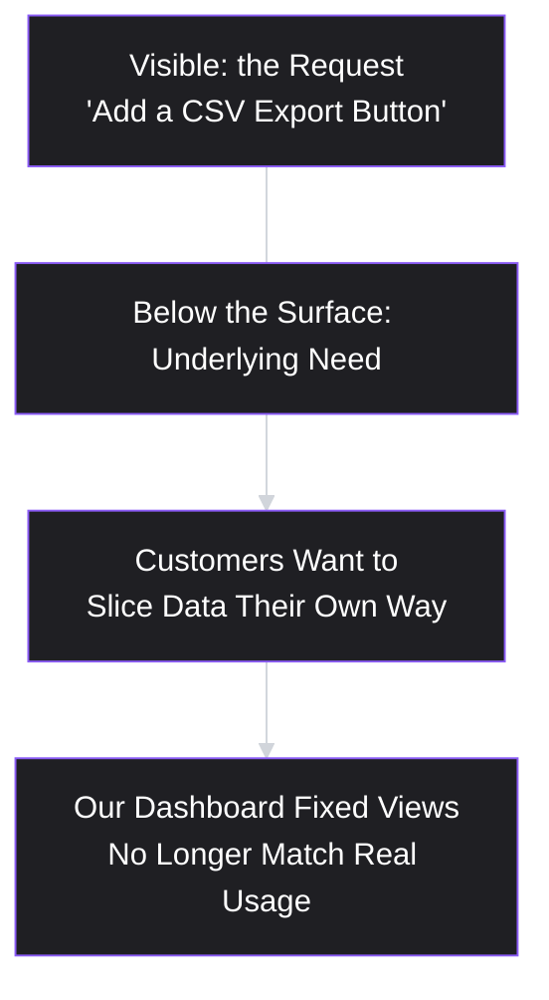
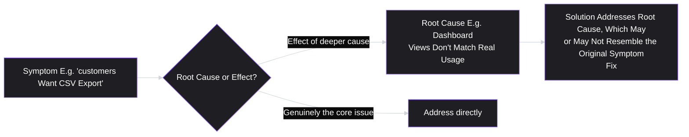

# Lesson 3: Product Thinking

## Why This Lesson Matters

Lessons 1 and 2 defined *what* a PM is accountable for and *what kind of thing* a product is. This lesson addresses something different: the actual cognitive habit — the way of seeing a problem — that lets a PM apply that accountability well, day to day, on questions that have no textbook answer.

"Product thinking" is one of the most overused phrases in the industry, frequently invoked without definition, as a vague compliment ("she has great product thinking") or a vague criticism ("that's not very product-thinking"). This lesson exists to make the phrase concrete and teachable, rather than a mystical trait some people supposedly have and others don't.

This matters because product thinking is the thing that actually gets evaluated in interviews, in performance reviews, and in the day-to-day judgment calls that make up most of a PM's real work. Frameworks (which this curriculum will introduce many of) are tools; product thinking is the judgment that decides *which* tool applies, *when* to trust data versus intuition, and *when* a seemingly reasonable request should be pushed back on. Without it, frameworks become a checklist performed without understanding — which is precisely the failure mode Lesson 1's Case Study described.

---

## Learning Path

| Field | Detail |
|---|---|
| **Module** | 1 — Foundations |
| **Current Lesson** | 3 of 90 |
| **Difficulty** | 1 / 10 |
| **Estimated Study Time** | 20 minutes (reading) + 10 minutes (reflection + quiz) |
| **Prerequisites** | Lesson 1 (What is Product Management?), Lesson 2 (Product vs. Project) |
| **Next Lesson** | Lesson 4 — Product Lifecycle |
| **Future Topics Unlocked** | Lesson 6 (Jobs to Be Done), Lesson 8 (Product Discovery), Lesson 19 (Opportunity Identification) — all are applications of the thinking habit introduced here |

---

## Learning Objectives

By the end of this lesson, you will be able to:

1. Define product thinking as a specific, describable cognitive habit rather than a vague trait.
2. Distinguish product thinking from feature thinking and from purely technical or purely business thinking.
3. Apply the "Five Whys of Product Thinking" technique to move from a surface request to an underlying need.
4. Explain the relationship between product thinking and the Accountability Triangle and Decision Chain from Lesson 1.
5. Identify signs of feature thinking in a real request, and reframe it using product thinking.

---

## Prerequisites

This lesson builds directly on Lesson 1 (the Accountability Triangle, the Decision Chain, and the "solve the problem, not the handed-in solution" mistake) and Lesson 2 (the finite/infinite distinction). Both should be completed first.

---

## Theory

### Defining Product Thinking

**Product thinking** is the habit of evaluating any request, idea, or observation by first asking what underlying user and business need it connects to, before evaluating whether or how to build it.

This sounds simple, almost obvious, stated this way. In practice, it is a habit that must be deliberately built, because the natural human instinct — especially under time pressure, which is the normal operating condition of most product work — is to evaluate requests at face value and move directly to implementation. Product thinking is the discipline of resisting that shortcut.

Contrast this with its opposite, **feature thinking**: evaluating a request by asking only whether it's technically buildable and whether stakeholders want it, without examining the underlying need it's meant to serve. Feature thinking is not stupid or lazy — it is often fast, and sometimes fast is genuinely the right call (see the Real World Perspective section below). But feature thinking applied by default, as a permanent operating mode, is precisely the failure mode from Lesson 1's Case Study: four plausible features shipped, none evaluated against an actual underlying problem.

### Product Thinking Is Not the Same as Being Data-Driven

A common misconception equates product thinking with "always basing decisions on data." This is not quite right, and the distinction matters. Product thinking is about asking the right *question* — what need does this serve, for whom, and why — before deciding how to answer it. Data is one way to answer that question. So is a well-conducted user interview. So, sometimes, is well-reasoned judgment applied in the absence of data, particularly in genuinely new situations where no data yet exists (a new market, a novel product category).

A PM with strong product thinking but no data available will still ask "what problem does this solve, and for whom?" — they will just have to answer it through reasoning, analogous cases, and small-scale testing rather than an existing dataset. A PM without product thinking, even sitting on excellent data, may still fail to ask the right question of that data in the first place — for instance, measuring "did we ship on time" (output) instead of "did user behavior change" (outcome), a distinction Lesson 1 already established as the more fundamental error.

### The Five Whys of Product Thinking

A practical technique for building this habit, adapted from a broader problem-diagnosis method used in manufacturing and engineering (the "Five Whys," originally associated with the Toyota Production System), applied specifically to product requests:

When a request or idea arrives, ask "why" repeatedly, drilling from the surface request down toward the underlying need:

1. A stakeholder says: "We need a CSV export button."
2. *Why?* "Customers keep asking for it."
3. *Why do customers want it?* "They want to analyze their data in their own tools."
4. *Why do they want to analyze it in their own tools?* "Our own reporting dashboard doesn't show the specific breakdowns they need."
5. *Why doesn't our dashboard show those breakdowns?* "We only built the three most common report views at launch, and never revisited them as usage diversified."

Five steps in, the original request ("add a CSV export button") has been reframed into a much clearer underlying need: *our reporting dashboard's fixed views no longer match how our customers actually want to slice their data.* This reframed problem might indeed be solved by CSV export (letting users build their own views externally) — but it might also be better solved by a more flexible, configurable dashboard, which could be a stronger, more differentiated solution and might avoid customers needing to leave the product entirely to get value from their own data.

The purpose of this technique is not to always reach exactly five "whys," nor to always conclude the original request was wrong — sometimes the surface request genuinely is the best answer. The purpose is to *never accept the first framing of a problem as necessarily the right one*, and to build the reflex of digging at least one or two levels before committing engineering time.

### Product Thinking vs. Pure Technical or Business Thinking

Product thinking is often confused with two adjacent but distinct habits:

- **Pure technical thinking** asks "is this well-engineered?" and stops there. It's essential — feasibility is one leg of the Accountability Triangle — but on its own it can produce technically excellent solutions to the wrong problem.
- **Pure business thinking** asks "does this make money?" and stops there. It's also essential — viability is another leg of the Triangle — but on its own it can produce commercially rational decisions that ignore whether users actually want the thing (desirability), which often undermines the business case in the medium term anyway.

Product thinking is distinguished by holding all three legs of the Triangle in view simultaneously, and specifically by refusing to settle on a solution until the underlying problem (desirability's foundation) has been examined with the same rigor normally reserved for feasibility and viability. This is why product thinking connects so directly to Lesson 1's frameworks — it is, in a real sense, the day-to-day cognitive practice of applying the Accountability Triangle and the Decision Chain, rather than a separate concept alongside them.

---

## Common Beginner Mistakes

**Mistake 1: Treating product thinking as a personality trait rather than a practice**

New PMs sometimes conclude that some people are just naturally "good at product" and others aren't, treating it as an innate gift rather than a skill built through repetition (like the Five Whys technique above). This is discouraging and also inaccurate — it is a learnable habit, developed the same way any diagnostic skill is developed: by deliberately practicing it on real requests, repeatedly, until it becomes automatic.

**Mistake 2: Applying the Five Whys as a rigid script in front of stakeholders**

Interrogating a stakeholder with five rapid-fire "why" questions in a live meeting can come across as adversarial or as though you're stalling the request. The technique is meant to structure your own internal reasoning and follow-up questions — it should surface as natural, curious follow-up ("help me understand what you're trying to accomplish for the customer here") rather than a visible checklist being read aloud.

**Mistake 3: Assuming product thinking means always saying no to feature requests**

Some new PMs, having learned to distrust surface-level requests, overcorrect into reflexive skepticism of every incoming idea, which damages trust with stakeholders and slows down genuinely good, low-risk ideas. Product thinking is about *examining* a request appropriately to its size and risk — not treating every request as a five-alarm investigation. A low-cost, low-risk, clearly justified request doesn't need the same scrutiny as a request for a major new engineering investment.

**Mistake 4: Confusing "asking why" with "questioning the requester's competence."**

Digging into the underlying need behind a stakeholder's request can feel, to the requester, like their judgment is being doubted. Skilled PMs frame these questions collaboratively ("I want to make sure whatever we build actually solves this for you — can you walk me through what happens right now?") rather than skeptically ("why do you think you need this?"), which preserves the relationship while still doing the underlying diagnostic work.

**Mistake 5: Equating product thinking with "always basing decisions on data"**

Some new PMs assume product thinking simply means never deciding anything without a dataset in hand, and feel stuck whenever data is unavailable. Product thinking is about asking the right question — what need does this serve, for whom, and why — before deciding how to answer it; data is one way to answer that question, but a well-conducted interview, an analogous case, or well-reasoned judgment can answer it too, especially in genuinely new situations where no data yet exists. Treating "no data" as a reason to skip the underlying question entirely abandons the habit at exactly the moment it matters most.

---

## Mental Model: The Iceberg

This lesson's mental model is the **Iceberg**: the request you receive is only the visible tip; the actual underlying need sits beneath the surface, usually larger and more important than what's visible.

Use this model as an instinct-check whenever a request arrives fully formed with a specific solution already attached (a pattern flagged as Common Beginner Mistake #4 in Lesson 1). Before agreeing to build the visible tip, ask what's beneath it. Sometimes the visible tip and the underlying need turn out to be the same thing — icebergs are occasionally mostly above water. But you cannot know that without looking, and the cost of looking (a short conversation) is almost always far lower than the cost of building the wrong thing at scale.

---

## Real Company Example

**Netflix** offers a well-documented illustration of product thinking applied at the level of an entire business model. In its early history as a DVD-by-mail company, a naive, feature-thinking response to "customers want more convenience" might have been to add more physical distribution centers, faster shipping options, or a larger DVD catalog — incremental improvements to the existing solution.

Instead, applying deeper product thinking to the underlying need — customers wanted convenient, immediate access to video content, not specifically "DVDs delivered faster" — led toward streaming as a fundamentally different solution to the same underlying need. The DVD-by-mail service was the visible tip; the underlying need (convenient access to entertainment) was the iceberg beneath it, and streaming technology eventually offered a far better answer to that deeper need than any amount of DVD logistics optimization could.

*(Assumption flagged: this is a simplified, illustrative reading of a well-known strategic shift; Netflix's actual internal decision-making process involved many additional strategic and market factors not detailed here. The example is used to illustrate the pattern of interrogating an underlying need rather than optimizing a surface-level solution, not as a complete account of Netflix's corporate history.)*

---

## Real World Perspective: Product Thinking at Different Company Stages

**At a startup:** Product thinking is often applied under extreme time pressure, with very little data. The practice looks less like rigorous Five Whys interviews and more like rapid, reasoned hypothesis-forming ("we believe users are churning because of X, based on the five conversations we've had this week") followed by fast, cheap validation. Speed and judgment substitute for exhaustive process.

**At a mid-size company:** There is usually enough usage data and enough customer-facing staff (sales, support, success) that product thinking can be applied with more structured evidence — support ticket themes, usage analytics, structured customer interviews (Module 2) — rather than founder intuition alone.

**At Big Tech:** Product thinking often has to be applied across a much larger and more fragmented set of signals (large-scale analytics, formal user research functions, competitive intelligence teams), and a key added skill is synthesizing across many inputs that may partially conflict, rather than simply gathering more of one kind of evidence. The underlying cognitive habit — dig beneath the surface request — remains identical; what changes is the volume and structure of the evidence available to dig with.

---

## Detailed Case Study: The "Add More Filters" Request

A B2B project management tool's sales team reports that several large prospects are asking for "more advanced filtering options" in the task list view, and that deals are being lost to a competitor with a more powerful filter UI. The initial, feature-thinking response under consideration is to expand the filter panel with more field types and combination logic, matching the competitor feature-for-feature.

A PM applying product thinking instead runs a short version of the Five Whys with the sales team and two of the specific prospects:

1. *Why do prospects want more filtering?* "They manage hundreds of tasks across many projects and can't find what's relevant to them."
2. *Why can't they find what's relevant with current filters?* "The filters are per-field (assignee, due date, status) but prospects want to filter by role-specific combinations — for example, 'my team's overdue items in active projects.'"
3. *Why doesn't the competitor's filter system solve this more elegantly?* On inspection, it doesn't, either — it also requires manually combining several filters. Prospects are simply willing to invest more effort in the competitor's tool because they've heard positive things about it overall.
4. *Why would saved, role-specific views matter more than raw filter power?* Because the actual underlying need is *not having to reconstruct the same filter combination every day* — a different problem than "insufficient filter options."

This reframing shifts the likely solution from "match the competitor's filter complexity" (a feature-thinking response, and an expensive one, requiring significant UI and query engine work) toward "saved, shareable views" (a product-thinking response, addressing the actual underlying friction — repeated manual reconstruction — more directly, and potentially at lower engineering cost). Whether saved views is definitively the *correct* solution would still require further validation (Module 2's tools), but product thinking has already meaningfully changed the shape of what's being considered, before a single line of code is written.

---

## Framework Explanation: Symptom vs. Root Cause

This lesson's reusable framework distinguishes a **symptom** from a **root cause**, and gives a simple test for telling them apart in product contexts.

- A **symptom** is an observable effect that users or stakeholders report or notice — "we're losing deals," "customers want a CSV button," "support tickets about slow load times."
- A **root cause** is the underlying condition producing that symptom — a mismatch between the product's current capabilities and an evolved user need, a specific technical bottleneck, a gap in onboarding.

**A useful test:** ask whether fixing the reported symptom directly would leave the underlying condition unchanged for a *different* symptom to emerge from later. In the Case Study above, adding raw filter power (fixing the stated symptom) would likely still leave users reconstructing the same combinations repeatedly — the underlying condition — meaning a new complaint (perhaps "filters are tedious to set up every time") would likely surface again down the line, just in a different form. When a proposed fix would plausibly leave room for a related symptom to reappear elsewhere, that's a strong signal you're still looking at a symptom, not the root cause.

This framework and product thinking as a whole connect directly forward to **Lesson 6 (Jobs to Be Done)**, which formalizes "underlying need" into a structured, repeatable statement, and to **Lesson 17 (Problem Statements)**, which gives you a disciplined way to write down a root cause once you believe you've found it.

---

## Interview Perspective: How Interviewers Think About This

**Typical question 1: "A stakeholder asks you to build feature X. How do you respond?"**
*What the interviewer is actually evaluating:* Whether your first instinct is to clarify the underlying need (product thinking) or to start scoping the literal request (feature thinking). A strong answer walks through something resembling the Five Whys, in natural conversational language, arriving at a reframed understanding of the problem before proposing next steps.

**Typical question 2: "Design a product for [some unusual constraint, e.g., visually impaired commuters / elderly users unfamiliar with smartphones]."**
*What the interviewer is actually evaluating:* Whether you can apply product thinking to an unfamiliar context without simply pattern-matching to features you've seen elsewhere. A weak answer proposes generic features immediately. A strong answer starts by identifying the specific underlying needs and constraints of that user group, and only then proposes solutions clearly connected to those needs.

**Typical question 3: "What's a feature you'd remove from [well-known product], and why?"**
*What the interviewer is actually evaluating:* Whether you can reason about a feature's relationship to an underlying need at all, in either direction — i.e., whether you can identify a feature that seems to exist without a clear, validated underlying need behind it, which is the mirror image of the skill tested in question 1.

---

## Summary

Product thinking is the habit of examining the underlying user and business need behind any request or idea before evaluating how to build it, rather than accepting the surface-level framing at face value — the practical, day-to-day application of the Accountability Triangle and Decision Chain introduced in Lesson 1. Its opposite, feature thinking, evaluates requests purely on buildability and stated demand, which is faster but risks solving symptoms rather than root causes. Techniques like the Five Whys and the Iceberg mental model exist to build this habit deliberately, moving from a surface request toward a reframed, deeper understanding of what's actually needed — without treating every incoming idea as an adversarial interrogation, and without assuming the underlying need will always differ from the stated request.

---

## Key Takeaways

- Product thinking is a learnable, describable practice: examine the underlying need before evaluating a solution, not an innate personality trait.
- Feature thinking evaluates requests at face value (buildable? wanted?); product thinking asks what deeper need a request connects to first.
- The Five Whys technique moves you from a surface request toward its underlying cause, but should be applied as natural curiosity, not a rigid interrogation script.
- Product thinking is not the same as "being data-driven" — it's about asking the right question; data is one of several ways to answer it.
- A useful test for symptom vs. root cause: would fixing the stated symptom directly leave room for a related symptom to reappear later?

---

## Cheat Sheet

*A two-minute review of everything in this lesson.*

- **Product thinking:** examine underlying need before evaluating a solution.
- **Feature thinking (its opposite):** evaluate requests at face value — buildable and wanted, nothing deeper.
- **Five Whys:** ask "why" repeatedly to move from surface request to underlying need; use conversationally, not as an interrogation.
- **Iceberg model:** the request is the visible tip; the real need is usually larger and beneath the surface.
- **Symptom vs. root cause test:** would fixing the stated symptom leave the underlying condition free to produce a different symptom later? If yes, you're still at the symptom level.
- **Connects to:** Accountability Triangle and Decision Chain (Lesson 1) — product thinking is those frameworks put into daily practice.

---

## Glossary

| Term | Definition | Related Concepts | Difficulty |
|---|---|---|---|
| Product Thinking | The habit of examining the underlying user and business need behind a request before evaluating how to build a solution to it. | Feature Thinking, Accountability Triangle (Lesson 1) | 1 |
| Feature Thinking | Evaluating a request based only on whether it's buildable and wanted at face value, without examining the underlying need. | Product Thinking | 1 |
| Five Whys | A technique of repeatedly asking "why" to move from a surface-level request toward its underlying root cause. | Root Cause, Symptom | 2 |
| Symptom | An observable effect reported by users or stakeholders, which may or may not reflect the true underlying issue. | Root Cause | 2 |
| Root Cause | The underlying condition actually producing an observed symptom. | Symptom, Problem Statements (Lesson 17) | 2 |

---

## Further Reading / Resources

- Marty Cagan, *Inspired* — discusses the distinction between feature teams (feature thinking) and empowered product teams (product thinking) at length.
- Taiichi Ohno and the Toyota Production System literature (widely documented in operations management texts) — the original source of the "Five Whys" root-cause technique adapted for product use in this lesson.
- Melissa Perri, *Escaping the Build Trap* — reinforces the underlying-need-first approach as a core antidote to output-obsessed product organizations.

---

## Flashcards

**Card 1**
- Front: What is the core difference between product thinking and feature thinking?
- Back: Product thinking examines the underlying need behind a request before evaluating solutions. Feature thinking evaluates a request at face value — buildable and wanted, nothing deeper.
- Difficulty: 1
- Tags: fundamentals, product-thinking

**Card 2**
- Front: What is the purpose of the Five Whys technique in a product context?
- Back: To move from a surface-level request toward its underlying root cause by repeatedly asking why, applied conversationally rather than as a rigid script.
- Difficulty: 2
- Tags: five-whys, technique

**Card 3**
- Front: What does the Iceberg mental model represent?
- Back: The visible request is only the tip; the actual underlying need is usually larger and sits beneath the surface, requiring deliberate investigation to uncover.
- Difficulty: 1
- Tags: mental-model, iceberg

**Card 4**
- Front: Is product thinking the same as being data-driven?
- Back: No. Product thinking is about asking the right question (what underlying need does this serve?); data is only one of several ways to answer that question — reasoning, interviews, and analogous cases are others.
- Difficulty: 2
- Tags: data-driven, misconception

**Card 5**
- Front: What test helps distinguish a symptom from a root cause?
- Back: Ask whether fixing the stated symptom directly would leave the underlying condition unchanged, allowing a different symptom to reappear later. If yes, you're likely still at the symptom level.
- Difficulty: 3
- Tags: symptom, root-cause, framework

## Reflection Exercise

Recall a specific request you have received, made, or observed in any context — work, a student project, a customer support interaction, even a personal example (e.g., a friend asking you for a specific favor rather than stating their actual need).

There is no single correct answer. Work through the following before reading further.

1. Write the request exactly as it was originally stated.
2. Apply the Five Whys, writing out each "why" and its answer, even if you have to make a reasonable inference for some steps.
3. State the underlying need you arrive at by the fourth or fifth "why."
4. Ask: does the original request still seem like the best way to address that underlying need, now that you've named it explicitly? If not, what alternative would you now consider?

---

## Quiz

**1. Which of the following best defines product thinking, as introduced in this lesson?**
A) Basing every product decision on quantitative usage data
B) Evaluating whether a request is buildable and clearly wanted
C) An innate aptitude that strong product people are born with
D) Examining the underlying need behind a request before solving it

*Correct answer: D*
*Explanation: Product thinking is a learnable habit of asking what user and business need a request connects to before evaluating how to build it. The other three options are each named in the lesson as misconceptions about what it means.*
*Learning objective tested: #1*
*Difficulty: Medium-Hard*

---

**2. What is "feature thinking," as contrasted with product thinking in this lesson?**
A) Designing the user interface before the underlying data model
B) Judging a request on buildability and stated demand alone
C) A more advanced form of product thinking used by senior PMs
D) Focusing on the feature set a competitor has already shipped

*Correct answer: B*
*Explanation: Feature thinking takes the request at face value and asks only whether it can be built and whether someone wants it. The lesson is careful to note this is often fast and occasionally correct — the problem is using it as a permanent default.*
*Learning objective tested: #2*
*Difficulty: Medium-Hard*

---

**3. In the Five Whys example involving a CSV export request, what was the eventual underlying need uncovered?**
A) Customers needed a faster and more reliable export format
B) Fixed dashboard views no longer matched how customers sliced data
C) Customers had already decided to migrate to a competing tool
D) The export feature had been built but was hard for users to find

*Correct answer: B*
*Explanation: Five steps of "why" moved the request from a button to a mismatch: the three report views built at launch were never revisited as usage diversified, so customers went outside the product to slice their own data.*
*Learning objective tested: #3*
*Difficulty: Easy*

---

**4. Why does this lesson caution against applying the Five Whys as a rigid, visible script in stakeholder meetings?**
A) Because stakeholders rarely know the answer beyond the first why
B) Because the technique was designed for manufacturing, not software
C) Because it can read as adversarial and erode the requester's trust
D) Because five rounds take longer than most meetings allow for

*Correct answer: C*
*Explanation: Rapid-fire "why" questions can feel like the requester's judgment is being doubted, or like the PM is stalling. The technique is meant to structure your own reasoning and surface as collaborative curiosity.*
*Learning objective tested: #3*
*Difficulty: Easy*

---

**5. Is product thinking the same as "being data-driven"? According to this lesson:**
A) Yes — both describe deciding only once evidence has been gathered
B) No — product thinking deliberately sets quantitative data aside
C) No — it concerns which question to ask; data is one way to answer
D) Yes — though the equivalence holds mainly for mature B2B products

*Correct answer: C*
*Explanation: A PM with no data can still ask what need a request serves and answer it through interviews, analogous cases, or reasoning. A PM sitting on excellent data can still fail to ask the right question of it.*
*Learning objective tested: #1, #4*
*Difficulty: Medium-Hard*

---

**6. In the "Add More Filters" Case Study, why was matching the competitor's filter complexity likely not the best solution?**
A) The real friction was rebuilding the same filter combination daily
B) The competitor's filter engine was technically weaker on inspection
C) Sales had overstated how many deals actually turned on filtering
D) Filter panels are a poor interface pattern for large task lists

*Correct answer: A*
*Explanation: The fourth "why" reframed the problem from insufficient filter power to repeated manual reconstruction of the same view. Saved, shareable views address that directly, and likely at lower engineering cost than a richer query engine.*
*Learning objective tested: #3, #5*
*Difficulty: Easy*

---

**7. What relationship does this lesson draw between product thinking and the Accountability Triangle from Lesson 1?**
A) Product thinking supersedes the Triangle once a PM becomes sufficiently senior
B) Product thinking covers desirability while the Triangle covers the other legs
C) Product thinking and the Triangle address unrelated parts of the PM's job
D) Product thinking is the Triangle and Decision Chain put into daily practice

*Correct answer: D*
*Explanation: Product thinking is not a separate concept sitting alongside Lesson 1's frameworks — it is what applying them looks like hour to hour, holding all three legs in view and refusing to settle on a solution before the problem has been examined.*
*Learning objective tested: #4*
*Difficulty: Medium-Hard*

---

**8. According to the Symptom vs. Root Cause framework, what is a useful test for telling the two apart?**
A) Ask whether fixing the report would let a related complaint resurface
B) Ask whether the report came from users or from internal stakeholders
C) Ask whether the fix costs more engineering time than the issue warrants
D) Ask whether the issue appears in analytics as well as in support tickets

*Correct answer: A*
*Explanation: If a proposed fix would leave the underlying condition intact, a different symptom will surface later from the same source. That is the signal you are still working at the symptom level.*
*Learning objective tested: #5*
*Difficulty: Medium*

---

**9. Why does this lesson caution against applying skepticism to every incoming feature request equally?**
A) Stakeholders lose confidence when a PM asks any clarifying questions
B) Requests from sales deserve less scrutiny than requests from support
C) Skepticism belongs in discovery rather than in stakeholder conversations
D) Scrutiny should scale with a request's size and risk, not apply uniformly

*Correct answer: D*
*Explanation: Common Beginner Mistake #3 warns against overcorrecting into reflexive doubt. A low-cost, low-risk, clearly justified request does not warrant the same investigation as a major engineering commitment.*
*Learning objective tested: #2*
*Difficulty: Medium*

---

**10. (Product Thinking) A support team reports rising complaints about "slow load times" on a specific page. A PM immediately assigns engineers to optimize that page's load speed. Using this lesson's framework, what should the PM have done first?**
A) Redesign the page so the loading state communicates progress clearly
B) Route the complaints to engineering and let them choose the fix
C) Check whether slow load time is the cause or a symptom of something else
D) Compare the page's load time against competitor benchmarks first

*Correct answer: C*
*Explanation: "Slow load times" is a reported symptom. The page may be fetching data it does not need, or a confusing loading state may make an acceptable duration feel long. Each implies a different fix, so the diagnosis has to come before the engineering commitment.*
*Learning objective tested: #3, #5*
*Difficulty: Medium-Hard*

---

**11. (Interview Reasoning) An interviewer asks a candidate to "design a product for elderly users unfamiliar with smartphones." A weak candidate immediately lists five specific app features. What does this reveal, per this lesson's Interview Perspective section?**
A) Strong prioritization, since the candidate produced a concrete scope
B) A feature-thinking default, since no underlying need was identified
C) A research gap, since the candidate did not request usage data first
D) Strong empathy, since the features were chosen for a specific group

*Correct answer: B*
*Explanation: The question tests whether a candidate can reason about an unfamiliar user group rather than pattern-match to features seen elsewhere. Naming the group's specific needs and constraints has to come before naming solutions.*
*Learning objective tested: #1, #2*
*Difficulty: Hard*

---

**12. (Highest Difficulty, Product Thinking) A PM uncovers, via the Five Whys, that a stakeholder's request for "faster customer support response times" is actually rooted in customers not being able to self-serve answers to common questions. The PM proposes a self-service help center instead of hiring more support staff. What is the strongest justification for this choice, using this lesson's Symptom vs. Root Cause framework?**
A) More staff would address response speed while the self-serve gap remains
B) Self-service help centers are preferred by customers over live support
C) Hiring support staff carries a higher long-run cost than any software
D) The stakeholder's framing should be adopted once volume data confirms it

*Correct answer: A*
*Explanation: Adding staff moves the symptom without touching the condition producing it. As volume grows the same complaint returns, which is exactly the test the framework provides for recognizing a symptom-level fix.*
*Learning objective tested: #3, #5*
*Difficulty: Hard*

---

**13. Common Beginner Mistake #1 warns against treating product thinking as a personality trait. Why does this matter practically?**
A) Framing it as innate discourages the repeated practice that builds it
B) Framing it as innate understates how much technical background matters
C) Framing it as innate makes hiring harder than it needs to be for teams
D) Framing it as innate conflates product judgment with general intelligence

*Correct answer: A*
*Explanation: The habit develops the way any diagnostic skill does — by applying it to real requests until it becomes automatic. Treating it as a gift removes the reason to practice, which is what actually prevents people from developing it.*
*Learning objective tested: #1*
*Difficulty: Hard*

---

**14. Using the Iceberg mental model and the Netflix Real Company Example, what distinguishes product thinking from a naive, feature-thinking response to "customers want more convenience"?**
A) Both instincts would have converged on the same distribution improvements
B) Feature thinking optimizes the visible tip; product thinking digs beneath it
C) The Iceberg model applies to physical goods more readily than to software
D) Streaming was the only solution the underlying need could plausibly support

*Correct answer: B*
*Explanation: Faster shipping and more distribution centers optimize the visible request. Reading the need as convenient access to entertainment, rather than faster DVDs, opens a different category of solution entirely.*
*Learning objective tested: #3, #5*
*Difficulty: Hard*

---

**15. (Highest Difficulty, Product Thinking) A PM holds all three legs of the Accountability Triangle in view for a proposed feature: it is technically feasible, and a financial model shows it would be profitable. However, the PM has not yet examined whether the underlying user need is real. Using this lesson's framework, what should the PM do next, and why?**
A) Proceed, since two of the three legs have been confirmed with evidence
B) Treat desirability as satisfied, because a profitable model implies demand
C) Defer the decision until a competitor validates the category for them
D) Examine desirability with the rigor already applied to the other two legs

*Correct answer: D*
*Explanation: Confirming feasibility and viability alone is precisely the pure-technical and pure-business failure mode the Theory section describes. A well-engineered, profitable solution to a problem no one has is still a failure.*
*Learning objective tested: #1, #4*
*Difficulty: Hard*

---

## Connections

| | Lesson | Core Idea Carried Forward |
|---|---|---|
| **Previous Lesson** | Lesson 2 — Product vs. Project | Applies product thinking specifically to the ongoing, evolving nature of product work established there |
| **Current Lesson** | Lesson 3 — Product Thinking | Product thinking vs. feature thinking; Five Whys; Iceberg model; Symptom vs. Root Cause |
| **Next Lesson** | Lesson 4 — Product Lifecycle | Applies product thinking across time, examining how a product's needs and priorities shift across different lifecycle stages |
| **Future Concepts Unlocked** | Lesson 6 (Jobs to Be Done) | Formalizes "underlying need" into a structured, repeatable statement format |
| | Lesson 8 (Product Discovery) | Turns the Five Whys' ad hoc questioning into a repeatable discovery process |
| | Lesson 17 (Problem Statements) | Gives a disciplined format for writing down a root cause once product thinking has surfaced it |
| | Lesson 19 (Opportunity Identification) | Applies the Iceberg model at a portfolio level, scanning for underlying opportunities across many surface signals |
