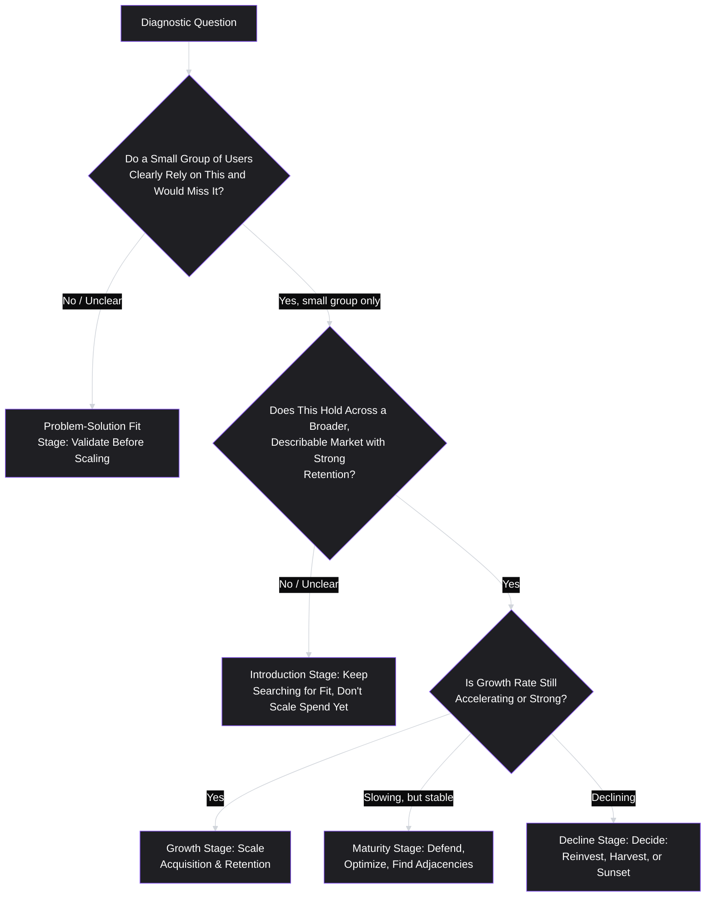

# Lesson 4: Product Lifecycle

## Why This Lesson Matters

Lesson 2 established that a product has no natural finish line the way a project does. This lesson doesn't contradict that — it refines it. A product without a fixed end state can still move through recognizably different *stages*, each with different priorities, different risks, and different definitions of what "good work" looks like. Understanding which stage a product is in — and recognizing when it's shifting into a new one — is one of the most practically useful diagnostic skills a PM can develop.

This matters because the single most common strategic mistake in product work is applying the priorities of one lifecycle stage to a product that has already moved into another. Chasing growth aggressively in a product that hasn't yet found what users actually want (before problem-solution fit) wastes resources on scaling something not yet worth scaling. Conversely, obsessively re-validating a problem that was already validated years ago, in a mature product, wastes time that should go toward optimization and defense of an established position. This lesson gives you the vocabulary and the diagnostic questions to avoid both mistakes.

---

## Learning Path

| Field | Detail |
|---|---|
| **Module** | 1 — Foundations |
| **Current Lesson** | 4 of 90 |
| **Difficulty** | 1 / 10 |
| **Estimated Study Time** | 20 minutes (reading) + 10 minutes (reflection + quiz) |
| **Prerequisites** | Lesson 1 (What is Product Management?), Lesson 2 (Product vs. Project), Lesson 3 (Product Thinking) |
| **Next Lesson** | Lesson 5 — Users vs. Customers |
| **Future Topics Unlocked** | Lesson 9 (Product Vision), Lesson 10 (Product Strategy Basics), Lesson 33 (Retention) — all depend on correctly diagnosing lifecycle stage before applying strategy |

---

## Learning Objectives

By the end of this lesson, you will be able to:

1. Name and describe the standard stages of the product lifecycle: Introduction, Growth, Maturity, and Decline (with Problem-Solution Fit and Product-Market Fit as critical pre-Introduction gates).
2. Explain why the priorities, risks, and success metrics differ meaningfully across lifecycle stages.
3. Diagnose which lifecycle stage a real product is likely in, using observable signals rather than assumption.
4. Explain the common failure mode of applying growth-stage tactics to a pre-fit product, and vice versa.
5. Describe how a single company can have products in multiple different lifecycle stages simultaneously.

---

## Prerequisites

This lesson assumes you understand Lesson 2's finite/infinite distinction (a product has no fixed end state) and Lesson 3's product thinking habit (examining underlying need before jumping to solutions), since lifecycle diagnosis is itself an act of product thinking applied to the *product as a whole* rather than to a single feature request.

---

## Theory

### The Stages, at a Glance

While different sources use slightly different terminology, this curriculum will use the following consistent stage names, which map closely to widely used product and marketing lifecycle models:

1. **Problem-Solution Fit** — pre-launch or early-launch validation that a real problem exists and a proposed solution genuinely addresses it for at least a small group of users.
2. **Introduction (Product-Market Fit search)** — the product is live, but the team is still actively searching for a repeatable, scalable match between the product and a broader market.
3. **Growth** — product-market fit has been found; the primary challenge shifts to scaling adoption, usage, and revenue as efficiently as possible.
4. **Maturity** — growth naturally slows as the addressable market becomes saturated; the primary challenge shifts to defending market position, improving efficiency, and finding smaller, adjacent growth opportunities.
5. **Decline** — usage, revenue, or relevance is falling, usually due to a shifting market, changing user needs, or superior alternatives; the primary challenge shifts to a deliberate decision: reinvest, harvest, or sunset.

It is worth being explicit that these stages are not always linear or permanent. A mature product can be reinvigorated into renewed growth (sometimes called a second growth curve) through a significant new capability, market expansion, or business model change. A product in decline is not always doomed — sometimes decline reflects a temporary, addressable problem rather than an inevitable trajectory. The value of the lifecycle model is diagnostic, not deterministic: it tells you what questions to ask right now, not what will necessarily happen next.

### Why Priorities Differ by Stage

The reason lifecycle stage matters so much is that the *right question to be asking* is different at each stage, and asking the wrong question wastes real resources.

- In **Problem-Solution Fit**, the right question is: *does this problem, and this proposed solution, actually resonate with real users, even at small scale?* The right metrics are qualitative and small-sample: are early users engaged, do they come back unprompted, would they be genuinely disappointed if the product disappeared?
- In **Introduction**, the right question is: *have we found a specific, describable audience and value proposition that could scale, or are we still guessing?* Metrics start to include early retention curves and word-of-mouth signals, but sample sizes are often still too small for rigorous statistical confidence.
- In **Growth**, the right question is: *how do we acquire, activate, and retain users as efficiently and durably as possible, now that we know the product works for a defined audience?* This is where the acquisition, activation, and retention metrics of Module 4 (AARRR, funnels) become the dominant operating lens.
- In **Maturity**, the right question is: *how do we defend our position, improve margins, and find smaller pockets of adjacent growth, given that the core market is largely saturated?* Metrics shift toward efficiency (cost per acquisition relative to lifetime value), retention defense, and share of an increasingly fixed market.
- In **Decline**, the right question is: *is this decline addressable (a fixable product or market issue) or structural (the underlying need has genuinely moved elsewhere), and what is the deliberate plan — reinvest, harvest for cash with minimal investment, or sunset gracefully?*

Applying a Growth-stage mindset (aggressive scaling of acquisition spend) to a product still in Problem-Solution Fit is a specific, common, expensive mistake: it scales a solution that hasn't yet been shown to actually work, multiplying the cost of being wrong before the team even knows whether it's wrong. This is one of the most cited reasons early-stage startups fail — not lack of effort, but premature scaling of an unvalidated model.

### Problem-Solution Fit and Product-Market Fit as Gates

Two specific milestones deserve special attention because they function as *gates* — thresholds a product should cross before the next stage's priorities become appropriate.

**Problem-Solution Fit** is reached when you have real evidence (not assumption) that a specific problem is significant enough, for a specific group of people, that your proposed solution meaningfully addresses it for at least some of them. This is usually established through qualitative methods — interviews, small prototypes, concierge-style manual solutions — covered in Module 2.

**Product-Market Fit (PMF)** is reached when that solution has been shown to work not just for a handful of early adopters, but for a definable, reachable market at a scale and consistency that suggests durable demand — often signaled by strong organic retention, word-of-mouth growth, and users expressing something close to genuine reliance on the product (a commonly cited informal signal: a large share of surveyed users saying they would be "very disappointed" if the product no longer existed).

Crucially, PMF is not a permanent state achieved once and then held forever — markets shift, competitors emerge, and a product can lose fit it once had (a transition toward Maturity's defensive posture, or even into Decline). This is why lifecycle diagnosis is something a PM should revisit periodically, not something decided once at launch and never reconsidered.

---

## Common Beginner Mistakes

**Mistake 1: Assuming lifecycle stage is determined by a product's age, rather than by evidence**

A product that has existed for five years is not automatically in Maturity; if it has been repeatedly repositioned or has never found a clearly resonant audience, it may still be effectively in Introduction, regardless of calendar time elapsed. Lifecycle stage should be diagnosed from evidence (retention behavior, growth pattern, qualitative signals), not inferred from launch date.

**Mistake 2: Applying growth tactics before Problem-Solution Fit is established**

This is the single most expensive version of stage-mismatch: spending heavily on user acquisition for a product that has not yet demonstrated it solves a real problem for real people. Acquiring more users faster does not fix an unvalidated value proposition — it simply multiplies the number of people who churn from it.

**Mistake 3: Treating Maturity as a failure state**

Some PMs, especially those who joined a fast-growing company, treat a shift into Maturity (slowing growth rate) as a sign that something has gone wrong. In reality, Maturity is a normal, often highly profitable stage, and the correct priorities (efficiency, defense, selective adjacent growth) are entirely different from Growth-stage priorities — not a lesser version of the same goals.

**Mistake 4: Assuming an entire company is in one single lifecycle stage**

Large organizations typically have a portfolio of products or product lines in different stages simultaneously — a mature flagship product funding an early-stage bet still searching for Problem-Solution Fit. Treating "the company" as a single lifecycle stage, rather than diagnosing each product or product line individually, leads to applying the wrong priorities to the wrong initiative.

**Mistake 5: Treating Product-Market Fit as a permanent achievement rather than a state that must be periodically re-verified**

Some PMs, once a product reaches PMF, treat that milestone as permanently settled and stop revisiting the question. Markets shift, competitors emerge, and user needs evolve, so a product that once had a strong fit can lose it, sliding toward Maturity's defensive posture or even Decline without anyone noticing until the trailing metrics make it obvious. Lifecycle diagnosis is something a PM should revisit periodically, not something decided once at launch and never reconsidered.

---

## Mental Model: The Seasons

This lesson's mental model maps the five stages onto the four seasons plus an early "planting" period, to make the shifting priorities memorable and intuitive.

```mermaid
%%{init: {
  "theme": "dark",
  "themeVariables": {
    "background": "#0b0b0c",
    "primaryColor": "#1f1f23",
    "primaryTextColor": "#ffffff",
    "primaryBorderColor": "#8b5cf6",
    "lineColor": "#d1d5db",
    "secondaryColor": "#18181b",
    "tertiaryColor": "#111111",
    "mainBkg": "#1f1f23",
    "nodeBorder": "#8b5cf6",
    "clusterBkg": "#000000",
    "clusterBorder": "#27272a",
    "titleColor": "#ffffff",
    "edgeLabelBackground": "#0b0b0c",
    "nodeTextColor": "#ffffff",
    "edgeLabelColor": "#ffffff",
    "actorBorder": "#8b5cf6",
    "actorBkg": "#1f1f23",
    "actorTextColor": "#ffffff",
    "sequenceNumberColor": "#ffffff",
    "signalColor": "#8b5cf6",
    "signalTextColor": "#ffffff",
    "textColor": "#ffffff",
    "classText": "#ffffff",
    "classBorder": "#8b5cf6",
    "classBkg": "#1f1f23"
  }
}}%%
graph LR
    A[Planting Problem-Solution Fit] --> B[Spring Introduction / PMF Search]
    B --> C[Summer Growth]
    C --> D[Autumn Maturity]
    D --> E[Winter Decline]
    D -.->|Reinvestment, New Capability| C
```

In **Planting**, you're testing whether the seed (the problem-solution match) is even viable before committing real resources. In **Spring**, growth is fragile and uneven — you're still learning which conditions make it thrive. In **Summer**, conditions are right and the priority is maximizing growth while it's available. In **Autumn**, growth naturally slows, and the priority shifts to harvesting value efficiently and preparing for leaner conditions. In **Winter**, the honest question is whether to invest in surviving until the next Spring (reinvention) or to responsibly wind down.

Use this model as a quick gut-check: if your product's current priorities feel like "Summer" tactics (aggressive scaling) but the evidence around you looks like "Planting" conditions (still uncertain if the core value proposition resonates), that mismatch is itself a diagnostic signal worth investigating immediately.

---

## Real Company Example

**Slack** offers a well-documented, frequently cited example of the Problem-Solution Fit to Growth transition. Slack originated as an internal communication tool built by a team (Tiny Speck) that was originally developing a different product entirely — an online game. The internal tool the team built for its own communication needs during that process was recognized as solving a real, resonant problem, leading to a deliberate pivot toward building and launching that tool as the primary product.

This illustrates the Problem-Solution Fit gate directly: the team had strong, direct evidence (their own intense daily use, and interest from other teams they showed it to) that the underlying problem — fragmented, inefficient team communication — was real and that their solution addressed it, before committing to scaling it as a company-defining product. Slack's subsequent rapid growth phase, including its widely noted early word-of-mouth adoption pattern, reflects the transition into the Growth stage once that fit had been established.

*(Assumption flagged: this account reflects widely reported public narratives about Slack's origin; internal decision-making details beyond what has been publicly discussed are not claimed here with certainty.)*

---

## Real World Perspective: Product Lifecycle at Different Company Stages

**At a startup:** Nearly all attention is typically focused on the earliest stages — establishing Problem-Solution Fit and searching for Product-Market Fit. Because runway is finite (as noted in Lesson 1), the central existential question is almost always "have we actually found something people need," rather than optimization questions that only make sense once fit exists.

**At a mid-size company:** The core product has often reached Growth or early Maturity, while newer initiatives (an adjacent product line, a new market segment) may simultaneously be back in Problem-Solution Fit or Introduction. A PM's job at this stage often includes correctly identifying which stage their *specific* area of ownership is in, since company-wide messaging ("we're a growth company") can misleadingly suggest every initiative should be run with growth-stage urgency and tactics.

**At Big Tech:** It's common to see an extreme range of lifecycle stages within a single company — a flagship product deep in Maturity (optimizing efficiency, defending share) alongside experimental bets still searching for Problem-Solution Fit, often run with deliberately different operating models, funding structures, and success metrics precisely because leadership recognizes that a Maturity-stage playbook applied to an early bet would strangle it before it had a chance to find fit.

---

## Detailed Case Study: Scaling Before Fit

A furniture e-commerce startup builds an AI-powered room-design tool that lets users upload a photo of their room and see AI-generated furniture recommendations placed virtually within it. Early feedback from a small group of beta users is enthusiastic. Encouraged, leadership approves a significant paid marketing budget to drive broad user acquisition, reasoning that a clearly innovative feature "should" attract strong growth.

Three months later, acquisition numbers look strong (many new users tried the tool), but retention is poor: the vast majority of users try it once and never return, and conversion to actual furniture purchases is far below the company's cost of acquiring each user. The company has spent a significant marketing budget scaling a product that had not yet demonstrated durable Problem-Solution Fit beyond a small, enthusiastic beta group.

**What went wrong, using this lesson's framework?**

The enthusiastic beta feedback established, at most, weak early signals — a small sample of engaged early adopters is not the same as evidence of Product-Market Fit across a broader market. The company applied Growth-stage tactics (aggressive paid acquisition) to a product still genuinely in the Introduction stage, where the priority should have been small-scale, low-cost experimentation to understand *why* the small beta group loved it, whether that reason generalized to a wider audience, and what was actually driving the gap between initial trial and repeat use — before spending heavily to bring in users at scale.

A PM applying the lifecycle model correctly would have paused after the beta phase to ask the Introduction-stage question ("have we found a specific, describable audience and value proposition that could scale, or are we still guessing?") rather than the Growth-stage question ("how do we acquire users as efficiently as possible?") — and would likely have proposed a smaller, retention-focused validation phase before recommending any significant acquisition spend.

1. What specific evidence was missing when leadership approved the paid marketing budget, and why was the enthusiastic beta feedback insufficient to justify scaling?
2. If you were the PM on this product at the end of the beta phase, what low-cost experiment would you propose to determine whether the product was ready for Growth-stage tactics?

---

## Framework Explanation: The Stage Diagnostic Checklist

This lesson's reusable framework is a short diagnostic checklist for identifying which lifecycle stage a product is actually in, based on observable evidence rather than assumption or company narrative.

The value of this checklist is that it forces the diagnosis to rest on specific, checkable evidence (retention behavior, growth trend, breadth of resonance) rather than on convenient assumptions ("we're clearly a growth company because leadership says so," or "this feature is obviously going to work because early users loved it"). A PM should be able to point to the specific evidence behind wherever they place their product on this checklist — and should revisit the diagnosis periodically, since stage is a current-state read, not a permanent label.

---

## Interview Perspective: How Interviewers Think About This

**Typical question 1: "How would you decide whether to invest in growth marketing for this product?"**
*What the interviewer is actually evaluating:* Whether you first check for evidence of Problem-Solution Fit and durable retention before recommending acquisition spend, or whether you jump straight to acquisition tactics. A weak answer proposes marketing channels immediately. A strong answer first asks what retention and resonance evidence currently exists, explicitly naming that scaling acquisition before fit is established multiplies the cost of an unvalidated model.

**Typical question 2: "This product's growth has slowed significantly over the last year. What would you do?"**
*What the interviewer is actually evaluating:* Whether you correctly diagnose slowing growth as potentially normal (a shift into Maturity) rather than automatically treating it as a crisis requiring the same tactics that worked during Growth. A strong answer distinguishes between a market-saturation explanation (appropriate Maturity response: efficiency, defense, adjacencies) and a competitive or product-quality explanation (potentially early Decline, requiring a different response).

**Typical question 3: "How would you evaluate whether a mature product should be reinvested in or sunset?"**
*What the interviewer is actually evaluating:* Whether you can reason about lifecycle transitions as deliberate strategic decisions with real trade-offs, rather than treating "keep investing" as the automatic default answer regardless of evidence.

---

## Summary

Products move through recognizable lifecycle stages — Problem-Solution Fit, Introduction, Growth, Maturity, and Decline — each with fundamentally different priorities, risks, and appropriate success metrics. Correctly diagnosing which stage a product is actually in, using observable evidence rather than assumption or company narrative, is essential before applying any stage-specific strategy; the most common and expensive mistake is applying Growth-stage tactics (particularly aggressive scaling of acquisition spend) before Problem-Solution Fit or Product-Market Fit has genuinely been established. Because a company typically operates several products or product lines simultaneously, lifecycle diagnosis should be applied at the level of the specific product or initiative, not assumed uniformly across an entire organization.

---

## Key Takeaways

- The five lifecycle stages are Problem-Solution Fit, Introduction, Growth, Maturity, and Decline — each has a different right question to be asking.
- Problem-Solution Fit and Product-Market Fit function as gates; crossing them prematurely (scaling before fit) is one of the most expensive and common strategic mistakes in product work.
- Lifecycle stage should be diagnosed from evidence (retention, growth pattern, breadth of resonance), not from a product's age or a company's self-narrative.
- Maturity is a normal, often profitable stage — not a failure state — with its own distinct, appropriate priorities (efficiency, defense, adjacent growth).
- A single company routinely has multiple products in different lifecycle stages at once; diagnosis must happen at the level of the individual product.

---

## Cheat Sheet

*A two-minute review of everything in this lesson.*

- **Stages:** Problem-Solution Fit → Introduction (PMF search) → Growth → Maturity → Decline.
- **Gates:** Problem-Solution Fit (small group, real evidence of resonance) and Product-Market Fit (broader market, durable retention) must be crossed before scaling makes sense.
- **Biggest mistake:** scaling acquisition spend before fit is validated — multiplies the cost of being wrong.
- **Maturity ≠ failure:** it's a normal stage with its own priorities (defend, optimize, find adjacencies).
- **Diagnose per product, not per company:** large companies routinely run products in different stages simultaneously.
- **Diagnostic checklist:** small-group reliance → broader market retention → growth trend (accelerating / stable / declining) tells you the stage.

---

## Glossary

| Term | Definition | Related Concepts | Difficulty |
|---|---|---|---|
| Product Lifecycle | The sequence of recognizable stages a product moves through — Problem-Solution Fit, Introduction, Growth, Maturity, Decline — each with distinct priorities. | Product-Market Fit, Product Strategy (Lesson 10) | 1 |
| Problem-Solution Fit | Evidence that a specific problem is significant for a specific group of people, and a proposed solution meaningfully addresses it for at least some of them. | Product-Market Fit | 1 |
| Product-Market Fit (PMF) | Evidence that a solution works not just for early adopters but for a definable, reachable market at scale, typically signaled by strong organic retention and word-of-mouth growth. | Problem-Solution Fit, Growth Stage | 2 |
| Growth Stage | The lifecycle stage after PMF, where the primary challenge is scaling acquisition, activation, and retention efficiently. | AARRR (Lesson 32) | 1 |
| Maturity Stage | The lifecycle stage where growth naturally slows due to market saturation; priorities shift to efficiency, defense, and adjacent opportunities. | Decline Stage | 2 |
| Decline Stage | The lifecycle stage where usage or relevance is falling, requiring a deliberate decision to reinvest, harvest, or sunset. | Maturity Stage | 2 |

---

## Further Reading / Resources

- Marty Cagan, *Inspired* — discusses Problem-Solution Fit and Product-Market Fit as sequential validation gates before scaling.
- Geoffrey Moore, *Crossing the Chasm* — a foundational text on the transition between early adopters and a broader mainstream market, closely related to the Introduction-to-Growth transition described in this lesson.
- Slack's official company blog and widely reported technology press coverage of Slack's origin as an internal tool at Tiny Speck — the basis for the Real Company Example above.

---

## Flashcards

**Card 1**
- Front: What are the five stages of the product lifecycle used in this curriculum?
- Back: Problem-Solution Fit, Introduction, Growth, Maturity, Decline.
- Difficulty: 1
- Tags: fundamentals, lifecycle-stages

**Card 2**
- Front: What is the most common and expensive lifecycle-related strategic mistake?
- Back: Applying Growth-stage tactics (especially aggressive acquisition spend) before Problem-Solution Fit or Product-Market Fit has actually been established.
- Difficulty: 2
- Tags: mistake, premature-scaling

**Card 3**
- Front: Is Maturity a failure state?
- Back: No — it's a normal, often highly profitable stage with its own distinct priorities: efficiency, defense of market position, and selective adjacent growth.
- Difficulty: 2
- Tags: maturity, misconception

**Card 4**
- Front: How should lifecycle stage be diagnosed, according to this lesson?
- Back: From observable evidence — retention behavior, growth trend, breadth of resonance across a market — not from a product's age or a company's self-narrative.
- Difficulty: 2
- Tags: diagnosis, evidence

**Card 5**
- Front: Can a single company have products in different lifecycle stages simultaneously?
- Back: Yes — this is common and expected; lifecycle diagnosis should happen at the level of the individual product or initiative, not assumed uniformly across the whole company.
- Difficulty: 2
- Tags: portfolio, multi-stage

## Reflection Exercise

Pick a product or company you believe has shifted lifecycle stages at some point in its history (this can be a well-known company or a product you have personal experience with).

There is no single correct answer. Work through the following before reading further.

1. Using the Stage Diagnostic Checklist, identify what evidence would have indicated its stage at an earlier point in time, and what evidence indicates its current stage now.
2. Identify the specific transition point (as best you can tell) and what changed — was it a deliberate strategic shift, a market change, competitive pressure, or something else?
3. If you were advising the product team during that earlier period, what stage-appropriate priority would you have recommended, and does that match what you believe the team actually did?

---

## Quiz

**1. What is the correct order of the standard product lifecycle stages used in this lesson?**
A) Problem-Solution Fit, Introduction, Growth, Maturity, Decline
B) Introduction, Problem-Solution Fit, Growth, Decline, Maturity
C) Problem-Solution Fit, Growth, Introduction, Maturity, Decline
D) Introduction, Growth, Problem-Solution Fit, Maturity, Decline

*Correct answer: A*
*Explanation: This is the sequence defined in the Theory section, running from earliest small-scale validation through eventual decline or reinvention.*
*Learning objective tested: #1*
*Difficulty: Easy*

---

**2. What does "Product-Market Fit" specifically require, beyond Problem-Solution Fit?**
A) A defined number of paying customers on annual contracts
B) Durable demand across a broader, definable, reachable market
C) Formal sign-off from company leadership on the launch plan
D) A positive contribution margin on every acquisition channel

*Correct answer: B*
*Explanation: Problem-Solution Fit is evidence that a solution lands for some users. PMF extends that to a market — scale, consistency, and retention durable enough to suggest the demand will hold.*
*Learning objective tested: #1*
*Difficulty: Easy*

---

**3. In the Detailed Case Study, what was the core mistake made by the furniture e-commerce company?**
A) The team shipped the room-design feature before designing the checkout
B) The team tested the feature with employees rather than with real buyers
C) The team scaled paid acquisition on small-sample beta enthusiasm alone
D) The team underspent on marketing relative to its established competitors

*Correct answer: C*
*Explanation: The product was still genuinely in Introduction, and the team applied Growth-stage tactics to it. Acquiring users faster does not repair an unvalidated value proposition; it multiplies the number of people who churn from it.*
*Learning objective tested: #3, #4*
*Difficulty: Easy*

---

**4. Why is Maturity described in this lesson as a normal stage rather than a failure state?**
A) Slowing growth reflects saturation, and the stage has its own priorities
B) Maturity revenue is guaranteed to hold steady once the stage is reached
C) Maturity applies to whole companies rather than to individual products
D) Maturity products should be harvested and wound down on a fixed schedule

*Correct answer: A*
*Explanation: Maturity is frequently the most profitable stage a product has. Efficiency, defending position, and finding adjacent pockets of growth are the right goals there — not a diminished version of Growth-stage goals.*
*Learning objective tested: #2*
*Difficulty: Easy*

---

**5. Which of the following is a sign that a PM should investigate a possible lifecycle stage mismatch?**
A) A mature product's team concentrates on efficiency and defending share
B) An early-stage team runs small, cheap experiments to test resonance
C) An Introduction-stage product's team is scaling acquisition spend hard
D) A declining product's team is weighing reinvestment against sunsetting

*Correct answer: C*
*Explanation: The other three describe tactics that match the stage the product is actually in. Scaling spend before fit is established is the specific, expensive mismatch this lesson is built around.*
*Learning objective tested: #4*
*Difficulty: Easy*

---

**6. According to this lesson, can a single company have products in different lifecycle stages at the same time?**
A) No — a company occupies exactly one lifecycle stage at any given time
B) Rarely — this happens mainly at small firms with few product lines
C) Chiefly at very large firms with formal portfolio review processes
D) Yes — and stage should be diagnosed per product, not per company

*Correct answer: D*
*Explanation: A mature flagship funding an early-stage bet is an ordinary arrangement at almost any company size. Diagnosing at the company level applies the wrong priorities to at least one of them.*
*Learning objective tested: #5*
*Difficulty: Easy*

---

**7. What commonly cited evidence helped establish Slack's early Problem-Solution Fit, as described in this lesson's Real Company Example?**
A) A large customer base signed up in the first week of public launch
B) The founding team's own heavy internal use, plus early outside interest
C) A sustained marketing campaign run in the months before launch
D) A patent filing covering the underlying real-time messaging technology

*Correct answer: B*
*Explanation: Intense first-hand use by the team, combined with genuine interest from the first outside teams shown the tool, is small-scale qualitative evidence of resonance — exactly what this gate asks for before scaling.*
*Learning objective tested: #3*
*Difficulty: Medium*

---

**8. In the Seasons mental model, what does "Winter" represent?**
A) The planting period when the problem-solution match is still being tested
B) The Decline stage, where the team chooses to reinvest, harvest, or sunset
C) The Summer conditions in which scaling acquisition is most appropriate
D) A closed end state in which no further strategic decisions remain open

*Correct answer: B*
*Explanation: Winter maps to Decline, and the model frames it as a decision point rather than a passive ending — survive until the next spring through reinvention, harvest what remains, or wind down responsibly.*
*Learning objective tested: #1*
*Difficulty: Medium*

---

**9. Why does this lesson caution against determining lifecycle stage based on a product's age (e.g., "it's been five years, so it must be mature")?**
A) A long-lived product without a retained audience may still be early
B) Product age correlates with stage only for consumer, not B2B, products
C) Age matters less than the number of major releases a product has had
D) Most products reach Maturity at roughly the five-year mark regardless

*Correct answer: A*
*Explanation: A product repeatedly repositioned over five years, with no clearly resonant audience, is effectively still in Introduction. Stage is read from retention behavior, growth pattern, and breadth of resonance — not from the calendar.*
*Learning objective tested: #3*
*Difficulty: Medium*

---

**10. (Product Thinking) A mature product's growth has flattened, but retention among existing users remains strong and stable. A newer competitor is not gaining meaningful share. According to this lesson's framework, what is the most appropriate response?**
A) Treat the flattening as Decline and reduce further investment sharply
B) Restart the search for Product-Market Fit as though the product were new
C) Hold the current Growth-stage acquisition plan unchanged through the year
D) Read this as Maturity and shift to efficiency, defense, and adjacencies

*Correct answer: D*
*Explanation: Flat growth with stable retention and no share loss is the textbook Maturity signature. Neither panic nor unchanged Growth tactics fit the evidence; the stage-appropriate priorities do.*
*Learning objective tested: #2, #3*
*Difficulty: Medium-Hard*

---

**11. (Interview Reasoning) An interviewer asks how a candidate would decide whether to invest in growth marketing for a given product. A weak candidate immediately proposes specific marketing channels and budgets. What does this reveal, per this lesson's Interview Perspective section?**
A) Strong command of acquisition mechanics applied decisively under pressure
B) A failure to check for fit evidence before recommending acquisition spend
C) A preference for paid channels over the organic growth the product needs
D) An understanding that growth marketing decisions are budget decisions first

*Correct answer: B*
*Explanation: The question is a trap for premature scaling. Channels and budgets are downstream of a prior question the candidate skipped: is there evidence this product retains the users it already has?*
*Learning objective tested: #3, #4*
*Difficulty: Hard*

---

**12. (Highest Difficulty, Product Thinking) A company's flagship product is in Maturity, generating stable, efficient revenue. Leadership proposes reallocating most of that product's engineering budget toward an early-stage bet still searching for Problem-Solution Fit. Using this lesson's framework, what is the most important diagnostic question before evaluating this proposal?**
A) Whether the flagship product's engineering team supports being reassigned
B) Whether the early-stage bet can reach revenue parity within the same year
C) Whether the flagship's market is saturated enough to justify the transfer
D) Whether each product is being judged by standards appropriate to its stage

*Correct answer: D*
*Explanation: A Maturity product and a pre-fit bet need different operating models, funding structures, and success metrics. Comparing them through one lens guarantees at least one of the two is misjudged.*
*Learning objective tested: #4, #5*
*Difficulty: Hard*

---

**13. According to the Theory section, is the lifecycle model deterministic — does it predict what a product must do next?**
A) Yes — entering Decline reliably predicts that the product will be retired
B) Yes — the stages proceed in strict order, which is what makes them useful
C) No — it is diagnostic, and a mature product can reach a second growth curve
D) No — and stage therefore has little bearing on which questions a PM asks

*Correct answer: C*
*Explanation: Stages are neither strictly linear nor permanent. The model earns its keep by telling you which question to ask right now, not by forecasting a fixed trajectory — decline is sometimes addressable rather than structural.*
*Learning objective tested: #1, #2*
*Difficulty: Medium-Hard*

---

**14. What is the practical difference between "Problem-Solution Fit" and "Product-Market Fit" functioning as gates, per the Theory section?**
A) They describe the same threshold, reached at the same point in a product's life
B) Product-Market Fit is normally established before Problem-Solution Fit is
C) One is small-scale qualitative evidence; the other is durable scale demand
D) Both are permanent once reached and do not need to be re-verified later

*Correct answer: C*
*Explanation: Problem-Solution Fit comes from interviews, prototypes, and concierge solutions with a few users. PMF requires evidence the demand holds across a reachable market — and unlike the first gate, it can be lost again as markets shift.*
*Learning objective tested: #1*
*Difficulty: Medium-Hard*

---

**15. (Highest Difficulty, Product Thinking) A large company's flagship product is clearly in Maturity, while a newer internal bet is still searching for Problem-Solution Fit. Leadership issues a single company-wide OKR: "grow revenue 20% via aggressive acquisition spend across all product lines this year." Using Common Beginner Mistake #4 and the Theory section, what is the strongest critique of this directive?**
A) It treats one company as a single stage, misapplying growth tactics to both
B) It sets a revenue target when engagement would be the more honest measure
C) It should exclude the unvalidated bet and apply to the flagship product only
D) It understates the growth rate a mature flagship product can still deliver

*Correct answer: A*
*Explanation: One acquisition mandate lands wrong twice: it scales an unvalidated bet before fit, and it pushes a saturated flagship toward spend when efficiency and defense are the stage-appropriate levers.*
*Learning objective tested: #4, #5*
*Difficulty: Hard*

---

## Connections

| | Lesson | Core Idea Carried Forward |
|---|---|---|
| **Previous Lesson** | Lesson 3 — Product Thinking | Applies the "examine underlying need before acting" habit to the product as a whole, across time, rather than to a single request |
| **Current Lesson** | Lesson 4 — Product Lifecycle | Five lifecycle stages; Problem-Solution Fit and Product-Market Fit as gates; Seasons mental model; Stage Diagnostic Checklist |
| **Next Lesson** | Lesson 5 — Users vs. Customers | Introduces a distinction that becomes especially important when diagnosing Introduction-stage fit: who exactly is the product resonating with, and who is paying for it |
| **Future Concepts Unlocked** | Lesson 9 (Product Vision) | A vision must account for which lifecycle stage the product is in and where it's headed next |
| | Lesson 10 (Product Strategy Basics) | Strategy formulation depends directly on correctly diagnosing current lifecycle stage first |
| | Lesson 33 (Retention) | Provides the specific metrics used to distinguish Introduction-stage fragility from Growth-stage durability in this lesson's diagnostic checklist |
