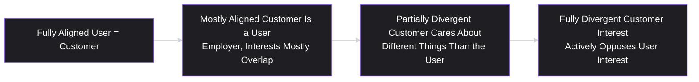
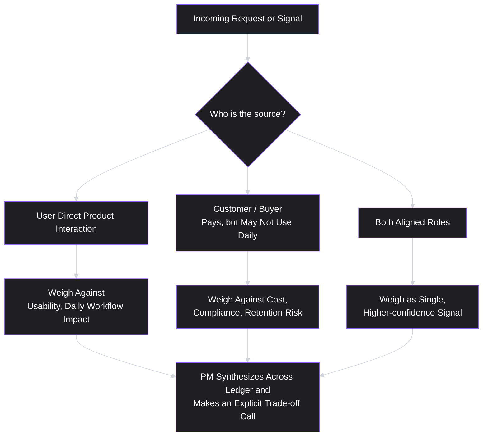

# Lesson 5: Users vs. Customers

## Why This Lesson Matters

Here is a question that sounds trivial until you try to answer it under pressure: when a PM says "the user," do they mean the same person as when a stakeholder says "the customer"? In many products, no. And the gap between those two words is where some of the most expensive prioritization mistakes in the industry originate.

A **user** is the person who directly interacts with the product. A **customer** is the person or entity that pays for it. In a large number of real products — most enterprise software, most ad-supported consumer apps, most marketplaces — these are not the same person. When they diverge, a PM who conflates them will optimize for the wrong signal at exactly the moment it matters most: when user needs and customer/buyer needs pull in different directions.

This lesson exists because the Accountability Triangle introduced in Lesson 1 has a hidden trap. "Desirability" sounds like a single, unified question — do people want this? — but the moment users and customers are different people, "desirability" splits into at least two separate questions that can have two different answers. A PM who hasn't separated these will misdiagnose why a product is failing, misassign a success metric, or build a roadmap that pleases the wrong audience. This shows up constantly in real companies: enterprise software optimized purely for procurement checklists that end users hate; ad-supported apps optimized purely for engagement metrics that advertisers pay for, at user experience's expense; parental-control apps where the "user" (a child) has essentially no say over what gets built at all. Understanding this distinction — and knowing where your own product sits on the spectrum — is foundational to nearly every prioritization decision from here forward.

---

## Learning Path

| Field | Detail |
|---|---|
| **Module** | 1 — Foundations |
| **Current Lesson** | 5 of 90 |
| **Difficulty** | 2 / 10 |
| **Estimated Study Time** | 25 minutes (reading) + 10 minutes (reflection + quiz) |
| **Prerequisites** | Lesson 1 (What is Product Management?) |
| **Next Lesson** | Lesson 6 — Jobs To Be Done |
| **Future Topics Unlocked** | Lesson 6 (Jobs to Be Done — the underlying-need framework for both users and customers), Lesson 7 (Value Proposition — separate value props per audience), Lesson 18 (Customer Segmentation), Lesson 29 (Prioritization Basics — weighting competing user vs. customer demands) |

---

## Learning Objectives

By the end of this lesson, you will be able to:

1. Define "user" and "customer" precisely, and identify which one (or both) a given stakeholder request actually concerns.
2. Classify a product along the User-Customer Alignment Spectrum, from fully aligned (user = customer) to fully divergent (user and customer have opposing interests).
3. Explain why conflating users and customers leads to systematically biased prioritization decisions, using at least one real-world mechanism (e.g., attention economy, procurement dynamics).
4. Apply a structured method for deciding whose need takes priority when user and customer needs genuinely conflict.
5. Identify the specific interview and case-study failure pattern that results from treating "the user" as a single, homogeneous stakeholder.

---

## Prerequisites

Lesson 1 (What is Product Management?). This lesson assumes familiarity with the Accountability Triangle (desirability, feasibility, viability) and the Output vs. Outcome distinction, and extends "desirability" into a more precise, multi-audience concept.

---

## Theory

### The Core Definitions

A **user** is the person who directly interacts with the product — clicks the buttons, reads the screen, receives the notification, experiences the friction or delight of the interface.

A **customer** is the person or entity that makes the purchasing decision and pays for the product, directly or indirectly.

In consumer products with a direct-purchase model (a single person buys and uses a paid mobile game, for instance), these two roles usually collapse into one person, and the distinction barely matters day to day. But as soon as a product is bought by someone other than the person who uses it, the distinction becomes load-bearing.

Consider a few common patterns:

- **Enterprise software**: An IT director or procurement team (the customer) purchases a tool that individual employees (the users) will operate daily. The customer cares about total cost of ownership, security compliance, and vendor reliability. The user cares about whether the tool makes their actual job easier or harder.
- **Ad-supported consumer apps**: The end user does not pay anything directly. The customer is the advertiser, who pays for attention and engagement. The user's experience matters to the business only insofar as it sustains the attention the customer is paying for.
- **Marketplaces**: A two-sided marketplace like a food delivery app has at least three populations to track — the diner (a user), the restaurant (a user and, in a real sense, a customer, since they often pay commission), and in some models an advertiser paying for placement (a customer).
- **Products built for dependents**: A parental-control app, a pet-tracking device, or many categories of children's educational software have a user (the dependent) with essentially no purchasing power or product feedback channel at all — the customer (a parent or guardian) makes every meaningful product decision on the user's behalf.

None of these patterns are unusual or edge cases. They are, in aggregate, more common than the simple case where user and customer are identical.

### The User-Customer Alignment Spectrum

It is useful to think of every product as sitting somewhere on a spectrum, rather than treating "user vs. customer" as a binary:

- **Fully aligned** (e.g., a single-player mobile game bought and played by the same person): user research and customer research are effectively the same activity.
- **Mostly aligned** (e.g., a project management tool where the buyer is a team lead who also uses the product daily): the buyer and the daily user overlap substantially, though budget-holder concerns (cost, admin controls) can still diverge from daily-user concerns (speed, ease of use).
- **Partially divergent** (e.g., enterprise software bought by an IT department for employees who never chose it): the customer's criteria (security, compliance, price) and the user's criteria (usability, speed) can both be legitimate but are not the same list, and can trade off against each other.
- **Fully divergent** (e.g., an ad-supported free app where more user attention directly benefits the advertiser-customer, sometimes at the cost of user wellbeing): the customer's commercial interest can be in direct tension with what is actually good for the user.

A PM's first job in this lesson is diagnostic: **place your own product honestly on this spectrum before doing anything else.** Most of the prioritization mistakes described below come from PMs who assume, by default, that they are further left on this spectrum (more aligned) than they actually are.

### Why This Distinction Breaks Naive "Desirability"

Recall from Lesson 1 that desirability is one leg of the Accountability Triangle — do people want this? The user-customer distinction reveals that this question is underspecified. The more precise version is: **desirability to whom?**

A feature can be simultaneously:

- Highly desirable to the customer (a compliance dashboard that procurement loves) and low-desirability to the user (who finds it adds friction to their daily workflow), or
- Highly desirable to the user (a feature that reduces the ads they see) and low-desirability to the customer (an advertiser who is, after all, paying specifically for that attention).

A PM who reports "high desirability" without specifying *whose* desirability has quietly picked a side — usually the side that is easier to measure, or the side with more organizational power, rather than the side that is actually correct for the product's health.

### Why This Matters More at Certain Company Stages and Business Models

The user-customer gap is not a fixed property of a company; it is a property of a **business model**. This means the same company can have wildly different user-customer alignment across different products or even different pricing tiers of the same product. A subscription-based tier of a product (where the paying user is also the daily user) sits much further left on the spectrum than a free, ad-supported tier of the exact same product (where the daily user is not the paying customer at all — the advertiser is). PMs who move between pricing tiers, or who are asked to evaluate "the same feature" across a free and paid tier, must re-diagnose alignment each time rather than assuming it transfers.

### The Political Dimension

There's a version of this problem that is not just analytical but organizational: **customers usually have more organizational leverage than users.** A customer complaint often arrives through an account manager, a sales leader, or a contract renewal conversation — channels with direct revenue consequences and executive visibility. A user complaint often arrives through a support ticket, an app store review, or a research session — channels that are easier for an organization to deprioritize, even when the underlying signal is just as important.

This creates a systematic bias: absent deliberate correction, product roadmaps tend to over-index on customer requests relative to user needs, simply because customer requests are louder and better connected to revenue conversations, not because they are objectively more important. Recognizing this bias explicitly — and building processes that give user signal equal structural weight (dedicated user research, usage analytics, in-product feedback loops) — is part of the PM's job of guarding against a distortion the org chart naturally produces.

---

## Common Beginner Mistakes

**Mistake 1: Assuming a paying customer's request reflects what end users actually want**

This assumes alignment without checking it. A request from a paying customer (particularly in enterprise software) reflects that customer's priorities — which may be procurement-driven, cost-driven, or politically driven within their own organization — and is not automatically a proxy for what the people who will actually use the feature every day want or need.

**Mistake 2: Treating customer-facing conversations as a substitute for user research**

Sales and account management conversations are a real and valuable signal, but they are customer signal, not user signal, whenever the two differ. A PM relying exclusively on customer-facing conversations for product direction, in a product where users and customers diverge, is building on half the picture — often the half that is easier to access, not the half that is most important.

**Mistake 3: Treating "the user" as a single homogeneous person**

Even within "users," there are often multiple distinct roles with different needs — an admin user versus an end-user of the same enterprise tool, for instance. Lumping all of these into one undifferentiated "the user" hides exactly the kind of conflict this lesson is about to teach you to look for.

**Mistake 4: Assuming misalignment means the customer is "wrong."**

The correct response to discovering user-customer divergence is not automatically to side with the user. A customer's business concerns (security compliance, cost control, contractual obligations) are often entirely legitimate and can be things the user themselves would care about if they had visibility into them. The goal is not "users always win" — it is to make the trade-off explicit and deliberate, rather than accidental.

**Mistake 5: Assuming this distinction is unique to B2B or enterprise products**

Ad-supported consumer products, freemium products, and products built for dependents (children, pets, elderly relatives under someone else's account) all have the exact same structural issue, often in a more extreme form, because the user in these cases frequently has no direct commercial relationship with the company at all.

---

## Mental Model: The Stakeholder Ledger

This lesson's mental model is the **Stakeholder Ledger** — a simple habit of explicitly naming, for any given feature request or complaint, exactly whose interest it represents before evaluating it.

Use this as a discipline, not just a diagram: every time a request lands on your desk, name the row of the ledger it belongs to *before* deciding how much weight to give it. A surprising number of misprioritized roadmaps trace back to a PM who evaluated every incoming request as if it came from the same, undifferentiated "the user," when in fact requests were arriving from at least two structurally different sources with different — sometimes opposing — incentives.

---

## Real Company Example

**Slack** is a useful illustration of partial divergence between user and customer. Slack is typically purchased at the organizational level — an IT admin or a department head (the customer, in procurement terms) selects and pays for the tool — while individual employees (the users) use it daily for messaging and collaboration. Slack's own public product communications over the years have described a deliberate strategy of driving adoption from the bottom up: getting individual teams using the product for free, so that user enthusiasm creates pressure on the eventual paying customer (the organization) to formalize and pay for the tool, rather than relying purely on top-down procurement sales.

This is a direct, real-world response to the user-customer gap: instead of accepting that the customer (IT/procurement) and the user (employees) might have different priorities, Slack's early growth model aimed to make user enthusiasm itself the thing that drives the customer's purchasing decision, partially collapsing the gap between the two roles rather than optimizing for one at the expense of the other.

*(Assumption flagged: this describes a widely reported pattern in Slack's early go-to-market approach rather than a claim about Slack's current internal strategy, which this curriculum does not claim certainty about.)*

- Slack's bottom-up adoption model shows how user enthusiasm can be leveraged to drive the purchasing decision, partially collapsing the user-customer gap.
- B2B PMs should maintain parallel discovery tracks for buyer personas (cost, compliance) and end-user personas (daily workflow, usability).

---

## Real World Perspective: Users vs. Customers at Different Company Stages

**In B2B/enterprise SaaS:**
The user-customer gap is often at its widest here. A procurement team may select a vendor based on a security questionnaire, a contract negotiation, and an RFP process that the actual daily users of the software never see or influence. PMs in this environment often maintain two parallel discovery tracks: one for buyer/admin personas (focused on cost, control, compliance) and one for end-user personas (focused on daily workflow), and treat convergence between the two — a feature that helps both — as a particularly high-value target.

**In ad-supported consumer products:**
The gap here is structural and cannot be fully "solved," only managed responsibly. The advertiser-customer's interest (more attention, more engagement, more time in-app) is not automatically the same as the user's interest (a healthy, non-manipulative relationship with the product). Mature product organizations in this category typically build explicit user-wellbeing guardrails — usage transparency features, screen-time tools, engagement caps — precisely because the business model alone would not naturally produce them. Recognizing that the underlying incentive structure creates this tension is the first step to managing it responsibly, rather than assuming it away.

**In products for dependents (children, pets, elderly relatives):**
Here the user has essentially no direct commercial voice, and the customer (a parent, adult child, or guardian) makes nearly all product decisions. PMs in this space have a particular ethical obligation to build genuine proxies for the user's actual experience and wellbeing — usability testing with the dependent population itself, developmental or safety expertise — precisely because the market mechanism that normally forces companies to listen to users (the user could simply stop paying) does not operate the same way when the user isn't the one paying at all.

---

## Detailed Case Study: The Compliance Dashboard No One Used

Consider a simplified, illustrative scenario common across enterprise B2B software.

A workplace analytics company sells a product to HR departments (the customer) that is used daily by individual managers (the users) to track team performance metrics. During a renewal cycle, several large customers' procurement and legal teams request a new "compliance audit dashboard" — a detailed log of every action taken in the tool, exportable for regulatory review.

Leadership, eager to close renewals and unlock several six-figure contracts, tells the product team: "This is now our top priority. Build it this quarter."

The team builds the compliance dashboard. It ships on time. The affected contracts renew. Six months later, usage data shows the compliance dashboard has been opened by exactly the number of legal/compliance staff expected — and by almost no one else. Meanwhile, a long-standing complaint from the actual daily users (managers) about the product's slow, confusing team-comparison view has gone unaddressed for over a year, and churn among smaller customers — where the manager and the buyer are frequently the same person — has quietly worsened over the same period.

**What went wrong?**

Nothing about building the compliance dashboard was a mistake in itself — it was a legitimate customer need, tied to real revenue, and probably worth building. The mistake was treating it as *the* top priority for the entire roadmap, rather than *a* priority alongside user-facing work, without ever explicitly reasoning through the Stakeholder Ledger:

1. The compliance dashboard request came entirely from the **customer** side of the ledger (procurement/legal), at large accounts where the customer and the user are different people.
2. The unaddressed team-comparison complaint came entirely from the **user** side of the ledger, and disproportionately affected smaller accounts where the user and the customer are the *same* person — meaning user dissatisfaction there translates directly and quickly into customer churn, with no intermediary to buffer it.
3. By fully deprioritizing user-side work for a quarter, the team correctly protected large-account renewals in the short term, while quietly increasing churn risk in a segment where user pain converts directly into lost revenue, with no separate procurement relationship to catch it.

A PM applying the Stakeholder Ledger would not necessarily have made a different final call — closing large renewals may genuinely have been the right trade-off — but they would have made the *trade-off explicit*, quantified the churn risk in the user-equals-customer segment, and likely negotiated at least partial resourcing for the team-comparison fix in the same quarter, rather than treating one ledger row as if it were the only row that existed.

This case will be revisited in **Lesson 18 (Customer Segmentation)**, where we introduce a structured method for tracking exactly which segments have aligned versus divergent user-customer roles, and in **Lesson 29 (Prioritization Fundamentals)**, where the Stakeholder Ledger becomes one input into a formal scoring model.

---

## Framework Explanation: The Alignment Spectrum as a Decision Tool

Beyond the diagram already shown, the User-Customer Alignment Spectrum is directly actionable in a specific way: **it tells you which research methods and which metrics to trust for a given decision.**

| Spectrum Position | Trust This Signal Most | Be Cautious Of |
|---|---|---|
| Fully aligned | Direct user research, usage analytics, satisfaction surveys | Overweighting a single vocal customer as representative |
| Mostly aligned | A blend of admin/buyer interviews and end-user usage data | Assuming budget-holder priorities always reflect daily-user priorities |
| Partially divergent | Two separate discovery tracks: buyer criteria and user criteria, tracked independently | Letting sales-reported "customer requests" substitute for actual user research |
| Fully divergent | Independent, deliberately protected user-wellbeing signals (not just engagement metrics, which reward the customer's interest by default) | Treating engagement or time-in-app as a proxy for user satisfaction, when it may really be a proxy for advertiser value |

The practical takeaway: as a product moves rightward on the spectrum, a PM must *increase*, not decrease, the deliberate investment in independent user signal — because the natural organizational forces (sales relationships, renewal conversations, executive attention) will already over-supply customer signal without any extra effort. Nobody has to go out of their way to make sure a paying enterprise customer's voice is heard. Someone does have to go out of their way to make sure the user's voice is heard, precisely in the products where the two diverge most.

---

## Interview Perspective: How Interviewers Think About This

**Typical question 1: "Tell me about a product where you had to balance the needs of a user and a paying customer who wanted different things."**
*What the interviewer is actually evaluating:* Whether the candidate has ever actually noticed that users and customers can be different people at all, and whether they can articulate a real trade-off rather than a hypothetical one. A weak answer either claims "they were always aligned" (often a sign the candidate hasn't looked closely enough) or describes simply doing whatever the customer wanted without examining the user-side cost. A strong answer names the specific tension, the evidence used to weigh it, and the actual decision made — including its downside.

**Typical question 2: "How would you prioritize a feature request that came from your biggest customer's IT department, if your user research showed employees actively disliked the proposed approach?"**
*What the interviewer is actually evaluating:* Whether the candidate defaults to "the customer is always right" (a revenue-driven but potentially short-sighted instinct) or to "ignore the customer" (naive and commercially reckless), versus a more mature answer that seeks to understand the underlying problem behind the IT department's request — using the Jobs to Be Done instinct introduced in Lesson 6 — and looks for a solution that could satisfy the underlying business need without the specific implementation employees disliked.

**Typical question 3: "What's the difference between a user and a customer, and why does it matter?"**
*What the interviewer is actually evaluating:* Basic fluency with the vocabulary of the discipline, but more importantly, whether the candidate can immediately produce a real or plausible example of divergence, rather than reciting the definition abstractly. Candidates who can name the Alignment Spectrum concept, even informally, signal that they think about *which* stakeholder a given metric or request actually represents — a habit interviewers associate with more mature product thinking.

---

## Summary

Every product has both users (who interact with it) and customers (who pay for it), and in a large share of real products — enterprise software, ad-supported apps, products for dependents, many marketplaces — these are different people with different, sometimes opposing, interests. The User-Customer Alignment Spectrum, from fully aligned to fully divergent, is a diagnostic tool for locating your own product honestly before making prioritization calls. Conflating the two roles produces a systematic bias, because customer signal typically arrives through louder, more revenue-connected organizational channels (sales, renewals, executive escalation) than user signal does (support tickets, app reviews, research sessions) — meaning roadmaps will over-index on customer needs unless a PM deliberately corrects for it. The Stakeholder Ledger — explicitly naming whose interest a given request represents before evaluating it — is this lesson's core practical habit, and it does not imply users automatically outrank customers; it implies the trade-off must be made deliberately rather than by organizational default.

---

## Key Takeaways

- A user directly interacts with the product; a customer pays for it. These are frequently different people.
- The User-Customer Alignment Spectrum (fully aligned → mostly aligned → partially divergent → fully divergent) describes how far apart their interests typically sit for a given product.
- "Desirability" from the Accountability Triangle is underspecified until you ask "desirability to whom" — the user, the customer, or both.
- Customer signal tends to arrive through more powerful, revenue-connected organizational channels than user signal, creating a structural bias toward over-weighting customer requests unless deliberately corrected.
- Divergence does not mean the customer is wrong — legitimate business concerns (cost, compliance, contracts) are real. The goal is an explicit, deliberate trade-off, not an accidental one.
- Products for dependents (children, pets, users with no direct commercial relationship) represent the most extreme form of this gap, and carry a heightened obligation to build genuine proxies for user experience.
- The Stakeholder Ledger — naming whose interest a request represents before evaluating it — is the core practical habit this lesson introduces.

---

## Cheat Sheet

*A two-minute review of everything in this lesson.*

- **User** = interacts with the product. **Customer** = pays for it. Often not the same person.
- **Alignment Spectrum:** Fully aligned → Mostly aligned → Partially divergent → Fully divergent.
- **Desirability, more precisely:** always ask "desirable to whom?"
- **Structural bias:** customer signal is louder (sales, renewals, escalation) than user signal (tickets, reviews) — correct for this deliberately.
- **Divergence ≠ customer is wrong.** The goal is an explicit trade-off, not an assumption either way.
- **Stakeholder Ledger:** before evaluating any request, name whose interest it represents.
- **Highest-risk category:** products for dependents, where the user has no direct commercial voice at all.
- **Interview tell:** naming a real user-vs-customer tension, with evidence and a decision, beats claiming "they were always aligned."

---

## Glossary

| Term | Definition | Related Concepts | Difficulty |
|---|---|---|---|
| User | The person who directly interacts with a product. | Customer, Alignment Spectrum | 1 |
| Customer | The person or entity that makes the purchasing decision and pays for a product. | User, Alignment Spectrum | 1 |
| User-Customer Alignment Spectrum | A model describing how closely user and customer interests overlap, from fully aligned to fully divergent. | Desirability (Lesson 1), Customer Segmentation (Lesson 18) | 2 |
| Stakeholder Ledger | A practical habit of naming which stakeholder (user, customer, or both) a given request or signal represents before evaluating it. | Alignment Spectrum, Prioritization (Lesson 29) | 2 |
| Structural Bias (toward customer signal) | The organizational tendency to over-weight customer requests relative to user needs, because customer signal typically arrives through more powerful channels (sales, renewals). | Stakeholder Management (Lesson 47) | 2 |
| Products for Dependents | Products where the user has no direct commercial relationship with the company (e.g., children's apps, pet trackers), and a guardian or customer makes product decisions on their behalf. | User-Customer Alignment Spectrum | 2 |

---

## Further Reading / Resources

- Marty Cagan, *Inspired: How to Create Tech Products Customers Love* — discusses the distinction between the buyer and the user in enterprise software contexts as a recurring theme in modern product practice.
- Melissa Perri, *Escaping the Build Trap* — touches on how misreading whose need a metric represents can drive teams toward output that satisfies the wrong audience.
- Public product and go-to-market commentary from companies with well-documented bottom-up adoption strategies (e.g., Slack's early growth writing) — useful primary material for seeing the user-customer gap addressed in practice.

---

## Flashcards

**Card 1**
- Front: What is the difference between a user and a customer?
- Back: A user directly interacts with the product. A customer makes the purchasing decision and pays for it. They are often, but not always, different people.
- Difficulty: 1
- Tags: fundamentals, user-customer

**Card 2**
- Front: Name the four positions on the User-Customer Alignment Spectrum.
- Back: Fully aligned, mostly aligned, partially divergent, fully divergent.
- Difficulty: 2
- Tags: alignment-spectrum, framework

**Card 3**
- Front: Why does "desirability" from the Accountability Triangle need refinement in this lesson?
- Back: Desirability is underspecified until you ask "desirable to whom" — the user, the customer, or both — since the answer can differ.
- Difficulty: 2
- Tags: desirability, accountability-triangle

**Card 4**
- Front: Why does product roadmaps tend to over-index on customer requests relative to user needs, absent correction?
- Back: Customer signal typically arrives through louder, revenue-connected organizational channels (sales, renewals, executive escalation), while user signal arrives through weaker channels (tickets, reviews, research) — a structural, not evidentiary, bias.
- Difficulty: 3
- Tags: structural-bias, stakeholder-management

**Card 5**
- Front: What is the Stakeholder Ledger?
- Back: A habit of explicitly naming whose interest — user, customer, or both — a given request or complaint represents, before deciding how much weight to give it.
- Difficulty: 2
- Tags: stakeholder-ledger, mental-model

**Card 6**
- Front: Does user-customer divergence mean the customer's request is wrong?
- Back: No. Customer concerns (cost, compliance, contracts) are often legitimate. Divergence means the trade-off must be made deliberately, not that one side automatically wins.
- Difficulty: 2
- Tags: trade-offs, divergence

**Card 7**
- Front: What category of product represents the most extreme form of user-customer divergence, and why?
- Back: Products for dependents (children, pets, elderly relatives under someone else's account), because the user has no direct commercial relationship with the company at all — the normal market mechanism of "users can simply stop paying" doesn't apply.
- Difficulty: 3
- Tags: dependents, divergence

## Reflection Exercise

You are the PM for a free, ad-supported habit-tracking app. Your data team reports that a new notification pattern increases daily active usage by 22%, which your advertising partners (your paying customers) are thrilled about, since it means more ad impressions. Separately, a small but consistent stream of app store reviews and support tickets describes the same notification pattern as "anxiety-inducing" and "hard to turn off."

Work through the following, in writing, before reading further:

1. Using the Alignment Spectrum, where does this product sit, and why?
2. Name, specifically, whose interest the 22% usage increase actually represents. Is it automatically evidence that users are better off?
3. Construct two different ways you could address the advertiser's legitimate interest in engagement without relying on a notification pattern that some users experience as harmful.
4. Using the Stakeholder Ledger, how would you weigh the small volume of negative reviews against the large, clearly measured usage increase? What additional evidence would change your answer?
5. Write the one-sentence framing you would use to explain this trade-off to a leadership team focused primarily on the advertiser relationship and the revenue it represents.

There is no single correct answer. The purpose of this exercise is to practice noticing when a metric that looks like unambiguous success is actually success for one stakeholder on the ledger, potentially at a cost to another — and to practice making that trade-off explicit rather than letting the loudest, most measurable signal decide by default.

---

## Quiz

**1. Which of the following best defines a "user," as distinct from a "customer"?**
A) The person or entity that pays the invoices for the product
B) The person who approves the department's budget
C) The person who directly interacts with the product
D) The person who negotiates the vendor contract

*Correct answer: C*
*Explanation: A user is defined by direct interaction — clicking the buttons, reading the screen, living with the friction. A customer is defined by the purchasing decision. In many products these are different people.*
*Learning objective tested: #1*
*Difficulty: Easy*

---

**2. In a two-sided food delivery marketplace, which of the following is the most accurate statement about user/customer roles?**
A) The courier is the primary customer in most delivery models
B) Diners are users, and restaurants have no product role
C) Restaurants can be users and customers at the same time
D) Each marketplace has exactly one user and one customer role

*Correct answer: C*
*Explanation: A restaurant operates the tool daily and pays commission on orders, so it occupies both roles at once. Multi-sided marketplaces routinely have three or more populations with overlapping relationships.*
*Learning objective tested: #1*
*Difficulty: Easy*

---

**3. A product where a single person both buys and uses a paid mobile game would sit where on the User-Customer Alignment Spectrum?**
A) Fully aligned — buyer and daily user are the same person
B) Mostly aligned — the buyer also uses it, with some divergence
C) Partially divergent — purchase criteria differ from use criteria
D) Fully divergent — the paying party benefits from more attention

*Correct answer: A*
*Explanation: When one person occupies both roles, user research and customer research collapse into the same activity, and the distinction stops carrying weight day to day.*
*Learning objective tested: #2*
*Difficulty: Easy*

---

**4. Why is "desirability" from the Accountability Triangle described as underspecified in this lesson?**
A) Because desirability is measured after launch rather than before
B) Because it omits whose desire is being measured, user or customer
C) Because desirability applies to consumer but not enterprise products
D) Because feasibility should be assessed before desirability is raised

*Correct answer: B*
*Explanation: A compliance dashboard can be highly desirable to procurement and unwelcome to the person who has to use it. Reporting "high desirability" without naming whose quietly picks a side.*
*Learning objective tested: #1, #3*
*Difficulty: Easy*

---

**5. According to this lesson, why do product roadmaps tend to systematically over-index on customer requests relative to user needs, absent deliberate correction?**
A) Because engineering teams prefer building customer-requested work
B) Because customer requests are validated more rigorously than user ones
C) Because user feedback channels produce less reliable signal overall
D) Because customer signal arrives through louder, revenue-linked channels

*Correct answer: D*
*Explanation: A customer complaint reaches the roadmap through an account manager or a renewal conversation. A user complaint arrives as a support ticket or an app store review. The difference is channel power, not signal quality.*
*Learning objective tested: #3*
*Difficulty: Easy*

---

**6. A parental-control app's core end-user is a child, while the paying customer is a parent. According to this lesson, what special obligation does this create for the PM?**
A) To defer each product decision to the paying parent without exception
B) To build genuine proxies for the child user's actual experience
C) To let the child user hold final say over the feature set
D) To treat the parent's requests as secondary to the child's

*Correct answer: B*
*Explanation: Products for dependents sit at the far end of the spectrum. The usual corrective — a dissatisfied user stops paying — is unavailable, so the PM has to manufacture the feedback loop the market will not supply.*
*Learning objective tested: #5*
*Difficulty: Easy*

---

**7. In the Detailed Case Study, what was the underlying structural reason that user-side neglect disproportionately increased churn risk among smaller accounts?**
A) Smaller accounts had lower overall usage of the core product
B) In smaller accounts the user and the customer were the same person
C) Smaller accounts had no access to the new compliance dashboard
D) Smaller accounts were locked into shorter renewal cycles than large ones

*Correct answer: B*
*Explanation: With no procurement layer in between, user dissatisfaction has nothing to travel through — it becomes a renewal decision directly, and much faster than in a large account.*
*Learning objective tested: #3, #4*
*Difficulty: Medium*

---

**8. Using the Stakeholder Ledger described in this lesson, what should a PM do first upon receiving a new feature request?**
A) Estimate the engineering cost before anything else is considered
B) Weight the request by the revenue attached to its originating account
C) Treat every incoming request as representing the same interest
D) Name whose interest the request represents before weighting it at all

*Correct answer: D*
*Explanation: The habit is diagnostic and comes before evaluation. Misprioritized roadmaps often trace back to a PM who treated every request as coming from one undifferentiated source with one set of incentives.*
*Learning objective tested: #4*
*Difficulty: Medium*

---

**9. Which of the following is the most accurate description of how a PM should respond upon discovering user-customer divergence?**
A) Prioritize the user's interest, since they experience the product
B) Prioritize the customer's interest, since they carry the revenue
C) Make the trade-off explicit, since both interests can be legitimate
D) Postpone the call until one side's position changes on its own

*Correct answer: C*
*Explanation: Security compliance and cost control are real concerns the user might share if they could see them. The failure mode is not choosing wrong — it is choosing by organizational default without noticing a choice was made.*
*Learning objective tested: #4*
*Difficulty: Medium*

---

**10. (Scenario) An ad-supported app sees engagement rise sharply after a new feature launch, and the advertising team is pleased. What should a PM do, according to this lesson, before treating this as unambiguous product success?**
A) Check whether the rise reflects user value or advertiser value
B) Treat the rise as unambiguous success and scale the feature further
C) Roll the feature back until the advertising team can review the data
D) Survey the advertising partners and close the question on their answer

*Correct answer: A*
*Explanation: Near the divergent end of the spectrum, engagement is a direct measure of what the customer is buying and only an indirect, sometimes misleading, measure of whether the user is better off.*
*Learning objective tested: #3, #5*
*Difficulty: Medium-Hard*

---

**11. (Product Thinking) A B2B software company's IT-department customers all request a new security feature that end-users have told researchers they find confusing and disruptive. What is the most mature PM response, based on this lesson and its connection to Lesson 6 (Jobs to Be Done)?**
A) Build the specification exactly as the IT departments originally submitted it
B) Probe the underlying security need and find a less disruptive design
C) Decline the feature, since researched users report it as confusing
D) Refer the conflict to the legal team for a binding determination

*Correct answer: B*
*Explanation: The security concern is legitimate; the specific implementation is a proposal, not the need itself. Separating the two usually reveals a design that satisfies procurement without imposing the friction users reported.*
*Learning objective tested: #4*
*Difficulty: Medium-Hard*

---

**12. Why does the lesson caution against treating "the user" as a single, homogeneous person even within a single product?**
A) Because user research is generally less reliable than sales input
B) Because most products in practice serve exactly one kind of user
C) Because customer needs should outrank user needs when they conflict
D) Because admin and end-user roles within one tool can conflict

*Correct answer: D*
*Explanation: Beginner Mistake 3 warns that an undifferentiated "the user" hides precisely the conflicts this lesson teaches you to look for — the admin who wants control and the end-user who wants speed are both users.*
*Learning objective tested: #5*
*Difficulty: Medium-Hard*

---

**13. (Product Thinking, Higher Difficulty) A company's free tier and paid tier are structurally identical in features, but the free tier is ad-supported and the paid tier removes ads for a subscription fee. According to this lesson, how should a PM's approach to prioritization differ between the two tiers?**
A) The free tier sits further right on the spectrum than the paid tier does
B) The two tiers should be prioritized identically, since features match
C) The free tier should be deprioritized, since it carries no direct revenue
D) The paid tier's requests should outrank the free tier's in every cycle

*Correct answer: A*
*Explanation: Alignment is a property of the business model, not the company. On the free tier the paying customer is the advertiser; on the paid tier it is the user. The same feature therefore warrants different signals and different weighting.*
*Learning objective tested: #2*
*Difficulty: Hard*

---

**14. (Interview Reasoning) An interviewer asks a candidate to describe a time they balanced conflicting user and customer needs. The candidate responds that "our users and customers were always the same, so this never came up." What does this likely signal to an experienced interviewer, according to this lesson's Interview Perspective section?**
A) A strong answer, since full alignment is the healthiest state for a product
B) A sign the candidate is best suited to enterprise software positions
C) A complete answer that gives the interviewer little further to probe
D) A sign the candidate has not looked closely at the roles actually in play

*Correct answer: D*
*Explanation: Most real products carry at least some role divergence, even mild ones. A candidate who can surface a genuine tension, and describe how they decided, signals a sharper read than one who reports none existed.*
*Learning objective tested: #5*
*Difficulty: Hard*

---

**15. (Highest Difficulty) A workplace analytics company deprioritizes a long-standing user complaint for an entire quarter in favor of a customer-requested compliance dashboard, and large-account renewals close successfully as a result. According to the Detailed Case Study, was this necessarily the wrong decision, and what did the PM's process lack regardless of the final call?**
A) Necessarily wrong, because user needs outrank customer needs here
B) Necessarily right, because it directly protected renewal revenue
C) Possibly reasonable, but the concentrated churn risk was left implicit
D) Wrong, because compliance dashboards rarely change renewal outcomes

*Correct answer: C*
*Explanation: The case study's point is about process, not verdict. The trade-off may well have been defensible, but the risk concentrated in the segment where user and customer are one person went unaccounted for, and partial parallel investment was never considered.*
*Learning objective tested: #3, #4*
*Difficulty: Hard*

---

## Connections

| | Lesson | Core Idea Carried Forward |
|---|---|---|
| **Previous Lesson** | Lesson 4 — Product Lifecycle | Assumes familiarity with how a product's stage affects its priorities; this lesson adds the user/customer lens to that same evolving context |
| **Current Lesson** | Lesson 5 — Users vs. Customers | User-Customer Alignment Spectrum; refining "desirability"; the Stakeholder Ledger |
| **Next Lesson** | Lesson 6 — Jobs To Be Done | Provides the structured method for uncovering the underlying need behind *any* stakeholder's request — user or customer — extending this lesson's case study resolution |
| **Future Concepts Unlocked** | Lesson 7 (Value Proposition) | Requires articulating distinct value propositions for user and customer audiences when they diverge |
| | Lesson 18 (Customer Segmentation) | Formalizes tracking which segments have aligned vs. divergent user-customer roles, directly extending the Case Study |
| | Lesson 29 (Prioritization Fundamentals) | Incorporates the Stakeholder Ledger as a scoring input alongside the Accountability Triangle |
| | Lesson 47 (Stakeholder Management) | Extends the structural-bias insight (customer signal being louder) into a full toolkit for balancing organizational voice fairly |

This curriculum is designed to be read as one continuous argument. From this lesson forward, any reference to "desirability" assumes you will ask "to whom" — this will not be re-explained, only re-applied.
