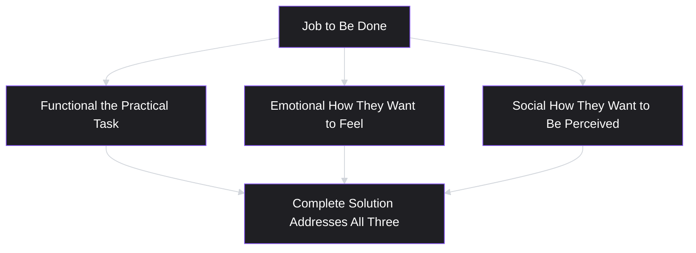
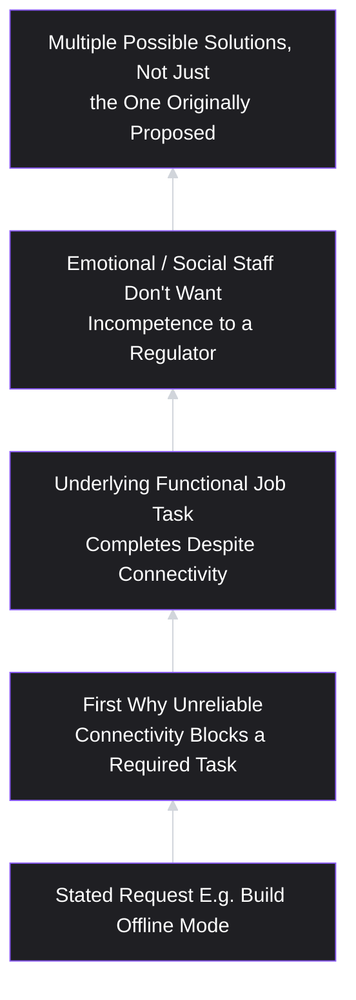
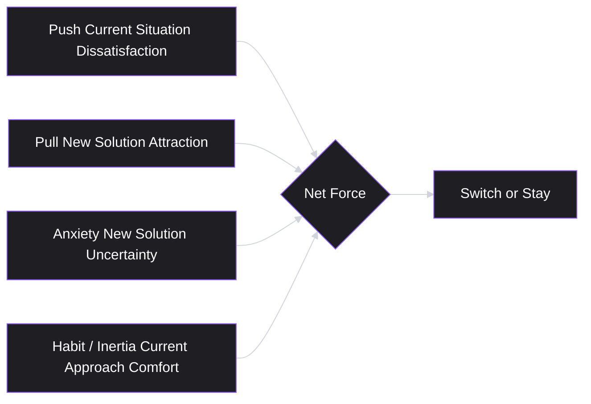

# Lesson 6: Jobs To Be Done

## Why This Lesson Matters

Two lessons ago, in the Reflection Exercise, a VP of Sales told you: "Three of our biggest enterprise prospects said they won't sign unless we add offline mode. Build it immediately." Last lesson, a workplace analytics company's customers all demanded a compliance dashboard. In both cases, this curriculum told you to pause before treating the request as a decision — but it did not yet give you a structured method for doing that pausing well. This lesson is that method.

**Jobs to Be Done (JTBD)** is the discipline of asking what underlying task, goal, or change a person is actually trying to accomplish, of which their stated request is only one possible, and often imperfect, solution. The core insight, most closely associated with the late Harvard Business School professor Clayton Christensen, is deceptively simple: **people don't want products; they "hire" products to make progress on a specific job in their life or work.** A person doesn't want a quarter-inch drill bit — they want a quarter-inch hole, and in some tellings of this idea, they don't really want the hole either; they want to hang a shelf, or fix something broken, or make a room feel finished.

This matters urgently for a PM because nearly every stakeholder request you will ever receive — from users, from customers, from your own leadership — arrives pre-packaged as a proposed solution rather than as a stated problem. "We need offline mode." "We need a compliance dashboard." "We need dark mode." "We need an export button." JTBD is the discipline that lets you decompose any of these requests back into the underlying job, so that you can evaluate whether the proposed solution is actually the best available answer — or whether a cheaper, faster, or more effective solution exists that the requester simply didn't think to propose, because proposing solutions isn't their job. It's yours.

---

## Learning Path

| Field | Detail |
|---|---|
| **Module** | 1 — Foundations |
| **Current Lesson** | 6 of 90 |
| **Difficulty** | 3 / 10 |
| **Estimated Study Time** | 30 minutes (reading) + 15 minutes (reflection + quiz) |
| **Prerequisites** | Lesson 1 (What is Product Management?), Lesson 5 (Users vs. Customers) |
| **Next Lesson** | Lesson 7 — Value Proposition |
| **Future Topics Unlocked** | Lesson 7 (Value Proposition — articulating value in job terms), Lesson 12 (Customer Interviews — the primary method for uncovering jobs), Lesson 17 (Problem Statements — formalizing a job into a workable statement), Lesson 21 (MVP — scoping a first solution to a validated job) |

---

## Learning Objectives

By the end of this lesson, you will be able to:

1. Define a "job to be done" and distinguish it from a feature request, a solution, and a demographic persona.
2. Apply the "Five Whys"–style laddering technique to decompose a stated request into its underlying functional, social, and emotional dimensions.
3. Distinguish functional, social, and emotional jobs, and explain why solutions that address only the functional dimension often underperform.
4. Identify the "competing against non-consumption" trap and explain why a product's true competitors are often not the obvious rival products.
5. Apply JTBD thinking to a stakeholder request from either a user or a customer (per the Stakeholder Ledger, Lesson 5), and propose at least one alternative solution to the same underlying job.

---

## Prerequisites

Lesson 1 (What is Product Management?) and Lesson 5 (Users vs. Customers). This lesson assumes familiarity with the three core questions (what problem, what solution, how do we know), the Decision Chain, and the Stakeholder Ledger habit of naming whose interest a request represents before evaluating it. JTBD is the method that fills in exactly the step this curriculum has, until now, only told you to perform without showing you how.

---

## Theory

### The Core Definition

A **job to be done** is the progress a person is trying to make in a particular circumstance — the underlying task, goal, or change they are trying to achieve — independent of any specific product or feature. The person "hires" a product, service, or even an informal workaround to get that job done, and will "fire" it (switch away, stop using it, or never adopt it in the first place) if something else does the job better, cheaper, or more conveniently.

The classic formulation, drawn from Clayton Christensen's writing and popularized further by consultants such as Bob Moesta and Tony Ulwick, uses a specific structure:

> When [situation/circumstance], I want to [motivation], so I can [expected outcome].

Notice what this structure deliberately omits: it says nothing about a product, a feature, or a company. It describes a person's situation and their desired outcome only. This is intentional — a job statement written correctly should be just as true before your product existed as after, and should remain true even if a competitor's product, or no product at all, ends up being hired to do it.

### Why "The Customer Wants X" Is Usually the Wrong Level of Analysis

Recall from Lesson 1's Common Beginner Mistake 4 and this lesson's opening example: stakeholders overwhelmingly express their needs as proposed solutions, not as jobs. This isn't a character flaw in stakeholders — it's a natural consequence of the fact that solving problems for a living is a specialized skill, and most people, most of the time, reach for the first plausible solution they can imagine rather than doing the harder work of naming the underlying problem precisely.

The risk is that a PM who takes stated solutions at face value inherits whatever blind spots the requester had. A sales VP who hears "we need offline mode" from prospects has correctly identified that *something* is blocking a sale, but has no particular expertise in solution design — that is the PM's job, and it is exactly the value a PM adds that a simple order-taker does not.

### The Three Dimensions of a Job: Functional, Social, Emotional

A job to be done is rarely purely practical. JTBD theory distinguishes three overlapping dimensions:

- **Functional dimension** — the practical task itself. ("I need to get my team's quarterly numbers reviewed before the board meeting.")
- **Emotional dimension** — how the person wants to feel, or wants to avoid feeling, while getting the job done. ("I don't want to feel embarrassed presenting incomplete data.")
- **Social dimension** — how the person wants to be perceived by others while getting the job done. ("I want my peers to see me as someone who runs a data-driven team.")

A product that satisfies only the functional dimension while ignoring the emotional and social dimensions frequently underperforms a functionally weaker competitor that better addresses all three. This is one of the most common reasons "objectively better" products lose to seemingly inferior ones: the losing product solved the practical task but ignored how the person wanted to feel, or be seen, while doing it.

### Laddering: Getting From a Stated Request to the Real Job

The core technique for uncovering a job is **laddering** — repeatedly asking "why" or "what would that let you do" in response to a stated request, until you reach a level of explanation that would remain true regardless of which specific solution is chosen.

A worked example, continuing this lesson's opening scenario:

> Stakeholder request: "We need offline mode."
> **Why?** "Because our enterprise prospects work in facilities with unreliable Wi-Fi — warehouses, factory floors, field sites."
> **Why does unreliable connectivity block a sale?** "Because if the app doesn't work, their staff can't log safety inspections in real time, and inspections are a regulatory requirement."
> **What would solve that, fundamentally?** "A way to guarantee that a safety inspection gets recorded and eventually synced, regardless of connectivity at the moment it happens."

Notice what happened during this ladder: the request moved from a specific technical implementation ("offline mode," which could mean full local data caching, conflict resolution, background sync, and a meaningful engineering investment) to a more precise underlying job ("guarantee an inspection gets recorded and eventually synced regardless of momentary connectivity"). The second framing opens up a wider solution space — a much lighter-weight "save now, sync automatically when reconnected" queuing mechanism might satisfy the actual job at a fraction of the engineering cost of a full offline mode, and might even be delivered faster, which also helps the sales timeline that motivated the original request.

This is the payoff of laddering: **it is not merely an academic exercise — it routinely reveals solutions that are cheaper, faster to ship, or more broadly useful than the one originally proposed**, without sacrificing the underlying need the stakeholder actually cares about.

### Jobs, Not Personas, Segment Real Markets

A common early instinct is to segment users by demographic persona — age, job title, industry. JTBD theory argues this is often the wrong segmentation axis, because two people with identical demographics can be trying to accomplish completely different jobs in a given moment, while two people with wildly different demographics can be trying to accomplish the exact same job.

The canonical illustration from Christensen's own research: a fast-food chain wanted to improve milkshake sales and initially segmented by traditional demographics (age, income) with little success. When researchers instead asked what job people were "hiring" a milkshake to do, they discovered a large, unexpected segment: commuters buying milkshakes alone, in the early morning, to make a long, boring commute more bearable and to stave off hunger until lunch — a job with almost nothing to do with dessert, indulgence, or the demographic profile the company had assumed. This job (a long, one-handed, slow-to-consume companion for a boring commute) suggested completely different product improvements — a thicker shake that lasts longer, a more convenient dispensing process for commuters in a hurry — than a demographic-based analysis ever would have.

### Competing Against Non-Consumption

One of JTBD's most useful and counterintuitive ideas is that **a product's real competition is often not the obvious rival product, but non-consumption** — the alternative of not solving the job at all, or solving it with an improvised, non-product workaround.

A project management tool doesn't only compete with other project management tools; it competes with a shared spreadsheet, a whiteboard, a series of Slack messages, or simply the team's memory. A meal-kit delivery service doesn't only compete with other meal-kit companies; it competes with takeout, with skipping the meal, and with a jar of pasta sauce and whatever's already in the fridge. Understanding the true "job competitor" — frequently an informal workaround rather than a branded rival — reframes what "winning" actually requires: not necessarily being better than the nearest named competitor, but being clearly better than doing nothing, or doing it the old, unglamorous way.

This reframing matters directly for prioritization: a feature that only makes sense in a world where you're racing a specific named competitor may be far less valuable than a feature that converts non-consumers — people currently solving the job badly, informally, or not at all — into users.

---

## Common Beginner Mistakes

**Mistake 1: Treating the first stated request as the job itself**

"We need offline mode" is a solution, not a job. Stopping the analysis at the first sentence a stakeholder says is the single most common JTBD failure, and it is precisely the failure this lesson's laddering technique exists to prevent.

**Mistake 2: Confusing a persona with a job**

"Our user is a 35-year-old marketing manager" describes a demographic, not a job. The same marketing manager may be hiring your product for entirely different jobs on a Monday morning (planning a campaign calendar) versus a Friday afternoon (quickly checking whether a report is ready before a client call) — and a single persona description flattens this into one undifferentiated profile.

**Mistake 3: Assuming the job is purely functional**

Ignoring the emotional and social dimensions of a job (how the person wants to feel or be perceived) frequently produces a functionally competent but commercially underperforming solution, especially in categories where status, confidence, or belonging matter alongside the practical task.

**Mistake 4: Benchmarking only against named competitors**

Focusing exclusively on feature parity with a known rival product, while ignoring the much larger population of people solving the job through an informal workaround or not solving it at all, causes teams to miss the biggest available growth opportunity — converting non-consumption.

**Mistake 5: Laddering endlessly until the "why" becomes meaningless**

It is possible to ladder too far — asking "why" so many times that you arrive at something so abstract ("I want to be happy") that it no longer usefully constrains solution design. The correct stopping point is the most specific level of explanation that would remain stable across multiple possible solutions, not the most abstract level imaginable.

---

## Mental Model: The Job Ladder

This lesson's mental model is the **Job Ladder** — a simple visual for the laddering technique described above, used as a standing habit whenever a stakeholder hands you a solution instead of a problem.

Use the Job Ladder as a checkpoint, not a one-time exercise: every time a stakeholder request lands on your desk pre-packaged as a solution, climb the ladder at least two rungs before allowing yourself to evaluate feasibility or scope it for engineering. Skipping straight to scoping the originally proposed solution — even a solution that turns out to be correct — means you never actually checked whether it was correct; you got lucky, or you didn't, and you have no way of knowing which.

---

## Real Company Example

**Netflix** offers a specific, on-the-record illustration of the "competing against non-consumption" idea. On an April 2017 earnings call, CEO Reed Hastings said Netflix was "competing with sleep, on the margin" — and months later, at the Summit LA17 conference, he repeated the point more bluntly: "You get a show or a movie you're really dying to watch, and you end up staying up late at night, so we actually compete with sleep. And we're winning." In the same remarks he named the actual competitive set even more broadly than sleep: not just HBO or Amazon, but everything a person might otherwise do to relax and unwind on a given night.

This is a job-level reframing, not a category-level one. The job Netflix is hired for isn't narrowly "watch a streaming show" — it's something closer to "unwind and be entertained at the end of the day," and *that* job has always been competing against sleep, video games, a walk, or a phone scroll, whether or not Netflix executives named it that way. Framing the job that broadly changes what counts as a real threat: a competitor doesn't have to make a better prestige drama to take share from Netflix — it only has to be a more convenient or more satisfying way to fill the same evening.

*(Assumption flagged: the quotes above are Hastings's own public statements, verifiable via contemporaneous reporting on the April 2017 earnings call and the November 2017 Summit LA appearance. What this curriculum does not claim certainty about is how deeply that framing shapes Netflix's current internal content-investment decisions day to day.)*

---

## Real World Perspective: Jobs To Be Done at Different Company Stages

**At a startup:**
JTBD is often used at its most foundational level — determining whether a job is real, painful, and currently poorly served enough to justify building a product around it at all. Early-stage teams frequently conduct direct "switch interviews" (detailed conversations about the moment someone adopted, or considered adopting, a new solution) to understand the forces that pushed them away from their old approach and pulled them toward a new one. At this stage, JTBD is a discovery tool for validating that a market exists before committing meaningful engineering time.

**At a mid-size company:**
JTBD is more often used to resolve specific prioritization disputes — deciding between two or more already-validated feature ideas by asking which better serves the core job, or to explain a puzzling metric (why a seemingly successful feature isn't driving the expected downstream behavior, because it addressed the functional job but ignored an emotional or social dimension that mattered more than expected).

**At Big Tech:**
JTBD often operates at the level of entire product-line strategy — determining whether a job is currently being served by an internal competing product line, an external competitor, or non-consumption, and using that analysis to decide where a large organization should invest scarce, high-leverage engineering resources across many possible initiatives, rather than at the level of a single feature decision.

---

## Detailed Case Study: The Software That Solved the Wrong Job

Consider a simplified, illustrative scenario common across B2B productivity software.

A team-collaboration software company notices, through customer interviews, that several enterprise customers are frustrated with how difficult it is to find "the latest version" of a shared document across email threads and chat messages. The stated request, repeated across multiple customers, is consistent: "We need built-in version history and a document viewer inside your app."

The team builds a robust, well-reviewed version-history feature. Adoption is disappointing: usage analytics show only a small fraction of customers use it regularly, and the original complaint about "finding the latest version" persists in subsequent customer conversations almost unchanged.

**What went wrong?**

A closer laddering exercise, conducted after the disappointing launch, reveals the actual job was different from — and slightly upstream of — the stated request:

1. **Stated request:** "We need version history and a document viewer."
2. **First why:** "Because we can never tell which version of a document is the current one when it's shared across email and chat."
3. **Underlying functional job:** "I need to instantly know, without asking anyone, whether the file I'm looking at right now is the one my team is currently working from."
4. **Emotional layer:** "I don't want to look careless in front of my team by working from an outdated file and having to be corrected."

The company had built a *viewer* for comparing past versions — a genuinely useful capability, but one aimed at investigating history *after* confusion had already occurred. The actual job was almost entirely about *preventing* the moment of confusion in the first place — a single, unambiguous, always-visible indicator of "this is the current version" at the moment someone opens a file, requiring no investigation at all. The version-history viewer solved a real but adjacent problem; it did not solve the job customers were actually describing, which is why usage stayed low and the original complaint kept recurring almost verbatim.

A team applying the Job Ladder from the beginning would likely have shipped a much smaller, cheaper feature first — a persistent "latest version" indicator — and might have discovered that the deeper version-history viewer, while still valuable to a smaller subset of power users, was not the thing driving the loudest and most common complaint at all.

This case will be revisited in **Lesson 17 (Problem Statements)**, where we formalize the output of a Job Ladder exercise into a structured, testable problem statement, and again in **Lesson 21 (MVP)**, where we discuss scoping the smallest solution that addresses a validated job.

---

## Framework Explanation: The Forces of Progress

A companion framework to the Job Ladder, widely used alongside JTBD, is the **Forces of Progress** model (associated with Bob Moesta's applied JTBD work), which explains *why* someone switches — or fails to switch — to a new solution. Four forces are in tension whenever someone considers a change:

- **Push**: dissatisfaction with the current approach ("our spreadsheet keeps breaking").
- **Pull**: the attraction of a new solution ("this new tool looks like it would fix that").
- **Anxiety**: uncertainty or fear about the new solution itself ("what if migrating loses our historical data, or the team refuses to learn a new tool").
- **Habit/Inertia**: comfort with, and sunk investment in, the current approach, independent of whether it's actually good ("we've used this spreadsheet for six years and everyone already knows it").

A switch only happens when Push plus Pull together exceed Anxiety plus Habit. This model directly explains a pattern many PMs find puzzling: a product can be functionally superior to an alternative and still fail to gain adoption, because the anxiety and habit forces holding people to their current (worse) solution were never addressed — onboarding friction, migration risk, or the social cost of admitting the old approach wasn't working can all outweigh a purely functional improvement. This is why JTBD-driven product work often includes deliberate anxiety-reduction and habit-breaking design (easy data import, low-commitment trials, social proof) alongside the core functional solution itself.

---

## Interview Perspective: How Interviewers Think About This

**Typical question 1: "A customer tells you they need Feature X. Walk me through how you'd respond."**
*What the interviewer is actually evaluating:* Whether the candidate's instinct is to route the request directly to engineering (a weak, order-taking signal) or to ladder the request back to the underlying job before evaluating solutions. A strong answer names specific follow-up questions the candidate would ask, and gives at least one example of an alternative solution that might satisfy the same underlying need at lower cost or faster delivery — directly demonstrating the payoff of laddering, not just the concept of it.

**Typical question 2: "Tell me about a time a 'better' product feature still failed to gain adoption. Why do you think that happened?"**
*What the interviewer is actually evaluating:* Familiarity with the idea that functional superiority alone doesn't guarantee adoption — whether the candidate can name emotional, social, anxiety, or habit-related forces that outweighed a purely functional improvement, rather than attributing the failure only to execution quality or awareness/marketing.

**Typical question 3: "Who is your product's biggest competitor?"**
*What the interviewer is actually evaluating:* Whether the candidate defaults to naming the obvious branded rival, or whether they recognize non-consumption (a spreadsheet, a manual process, doing nothing) as frequently the true and larger competitor. A candidate who can articulate both — the named rival and the more significant non-consumption alternative — demonstrates a more complete strategic picture.

---

## Summary

Jobs to Be Done reframes every stakeholder request — from users, customers, or leadership — as a proposed solution to an underlying job, rather than as the job itself. The laddering technique (repeatedly asking "why" or "what would that let you do") decomposes a stated request into a more precise functional job, and reveals the emotional and social dimensions layered on top of it, both of which a complete solution must address. Jobs, not demographic personas, are the correct unit for segmenting real markets, since the same person can be hiring a product for entirely different jobs at different moments, and different demographics can be hiring it for the identical job. A product's true competition is frequently non-consumption — an informal workaround, or doing nothing at all — rather than only the obvious named rival, and this reframing changes what "winning" actually requires. Finally, the Forces of Progress model (Push, Pull, Anxiety, Habit) explains why even a functionally superior solution can fail to gain adoption if the anxiety and habit forces anchoring people to their current approach are never addressed.

---

## Key Takeaways

- A job to be done is the underlying progress a person is trying to make, independent of any specific product — people "hire" products to do jobs, and "fire" them for something that does the job better.
- Laddering (repeated "why" questions) decomposes a stated solution request into its underlying job, often revealing a cheaper, faster, or broader solution space than the one originally proposed.
- Jobs have functional, emotional, and social dimensions; solving only the functional dimension frequently underperforms a competitor that addresses all three.
- Demographic personas are often the wrong segmentation axis; the same person can hire a product for different jobs at different moments, and different demographics can share the same job.
- A product's real competitor is frequently non-consumption (an informal workaround, or doing nothing), not only the obvious named rival — and this reframes what growth opportunities actually look like.
- The Forces of Progress (Push, Pull, Anxiety, Habit) explain why functional superiority alone doesn't guarantee adoption; a switch requires Push + Pull to exceed Anxiety + Habit.
- Laddering has a correct stopping point: the most specific explanation that remains stable across multiple possible solutions, not the most abstract explanation imaginable.

---

## Cheat Sheet

*A two-minute review of everything in this lesson.*

- **Job to be done:** the underlying progress someone is trying to make; products are "hired" and "fired" to do it.
- **Job statement structure:** "When [situation], I want to [motivation], so I can [outcome]."
- **Laddering:** ask "why" or "what would that let you do" repeatedly until you reach a stable, solution-independent explanation.
- **Three dimensions:** functional (the task), emotional (how they want to feel), social (how they want to be seen).
- **Segment by job, not persona:** same person, different jobs at different times; different people, same job.
- **Real competitor:** often non-consumption (a workaround, or nothing) — not just the obvious named rival.
- **Forces of Progress:** switch happens when Push + Pull > Anxiety + Habit.
- **Biggest trap:** stopping at the first stated request, treating it as the job itself.

---

## Glossary

| Term | Definition | Related Concepts | Difficulty |
|---|---|---|---|
| Job to Be Done (JTBD) | The underlying progress a person is trying to make in a given circumstance, independent of any specific product. | Laddering, Forces of Progress | 2 |
| Laddering | The technique of repeatedly asking "why" or "what would that let you do" to decompose a stated request into its underlying job. | Job to Be Done, Problem Statements (Lesson 17) | 2 |
| Functional Job | The practical task dimension of a job to be done. | Emotional Job, Social Job | 2 |
| Emotional Job | The dimension of a job concerned with how the person wants to feel while accomplishing it. | Functional Job, Social Job | 2 |
| Social Job | The dimension of a job concerned with how the person wants to be perceived by others while accomplishing it. | Functional Job, Emotional Job | 2 |
| Non-Consumption | The alternative of not solving a job at all, or solving it through an informal workaround, often a product's true largest competitor. | Competitive Analysis | 3 |
| Forces of Progress | A model (Push, Pull, Anxiety, Habit) explaining why someone switches, or fails to switch, to a new solution. | Job to Be Done | 3 |

---

## Further Reading / Resources

- Clayton Christensen, Taddy Hall, Karen Dillon, and David S. Duncan, *Competing Against Luck: The Story of Innovation and Customer Choice* — the primary modern text formalizing Jobs to Be Done theory, including the milkshake research referenced above.
- Bob Moesta and Chris Spiek's public writing and interviews on the Forces of Progress model and "switch interview" methodology — the applied, interview-based approach to uncovering jobs referenced in this lesson.
- Tony Ulwick, *What Customers Want* — an alternative, more quantitative formalization of outcome-driven innovation built on related job-based thinking.

---

## Flashcards

**Card 1**
- Front: What is a "job to be done"?
- Back: The underlying progress a person is trying to make in a given circumstance, independent of any specific product — products are "hired" to do jobs and "fired" for better alternatives.
- Difficulty: 1
- Tags: jtbd, fundamentals

**Card 2**
- Front: What technique decomposes a stated request into its underlying job?
- Back: Laddering — repeatedly asking "why" or "what would that let you do" until reaching a stable, solution-independent explanation.
- Difficulty: 2
- Tags: laddering, technique

**Card 3**
- Front: Name the three dimensions of a job to be done.
- Back: Functional (the practical task), emotional (how they want to feel), and social (how they want to be perceived).
- Difficulty: 2
- Tags: three-dimensions, jtbd

**Card 4**
- Front: Why are demographic personas often the wrong axis for segmenting a market, according to JTBD theory?
- Back: The same person can hire a product for different jobs at different moments, while very different demographics can share the exact same job — jobs, not demographics, better predict what people actually need.
- Difficulty: 3
- Tags: segmentation, personas

**Card 5**
- Front: What is meant by "competing against non-consumption"?
- Back: A product's real competitor is often not the obvious named rival, but the alternative of not solving the job at all, or solving it through an informal workaround.
- Difficulty: 3
- Tags: non-consumption, competition

**Card 6**
- Front: What are the four Forces of Progress, and what determines whether someone switches to a new solution?
- Back: Push (dissatisfaction with current state), Pull (attraction of new solution), Anxiety (fear of the new solution), Habit (comfort with current approach). A switch happens when Push + Pull exceed Anxiety + Habit.
- Difficulty: 3
- Tags: forces-of-progress, adoption

**Card 7**
- Front: What is the correct stopping point when laddering a request?
- Back: The most specific level of explanation that remains stable across multiple possible solutions — not the most abstract explanation imaginable, which would no longer usefully constrain solution design.
- Difficulty: 3
- Tags: laddering, stopping-point

## Reflection Exercise

You are the PM for a personal finance app. Several users have requested, through app store reviews and support tickets, "a way to set a monthly spending limit per category, with a hard block once we hit it."

Work through the following, in writing, before reading further:

1. Write a first-pass job statement for this request using the structure: "When [situation], I want to [motivation], so I can [outcome]."
2. Ladder the request at least two levels deeper. What functional job is likely underneath "hard block once we hit it"? Is there an emotional or social dimension layered on top (consider feelings like guilt, self-control, or accountability to a partner)?
3. Using the "competing against non-consumption" idea, name at least one non-product way people currently try to solve this same job (a workaround, a habit, a manual method), and consider what it tells you about what a good solution needs to beat.
4. Propose two different solutions to the underlying job you identified — the originally requested "hard block," and at least one alternative that might satisfy the same job differently (for example, a softer warning-based approach, or a social-accountability feature).
5. Using the Forces of Progress model, name one Anxiety or Habit force that might cause a user to resist adopting either solution, even if it perfectly addressed the underlying job.

There is no single correct answer. The purpose of this exercise is to practice the full Job Ladder — from a specific stated request, through functional and emotional/social layers, to a genuinely reconsidered solution space — under a request that, unlike the lesson's worked examples, you have not seen laddered before.

---

## Quiz

**1. Which of the following best defines a "job to be done"?**
A) A specific feature a customer has requested
B) The underlying progress a person is trying to make, independent of any specific product
C) A demographic description of a target user
D) A company's internal engineering roadmap

*Correct answer: B*
*Explanation: A job to be done describes the underlying task or goal a person is trying to accomplish, not a specific feature or demographic profile.*
*Learning objective tested: #1*
*Difficulty: Easy*

---

**2. What is the primary purpose of the "laddering" technique?**
A) To estimate engineering effort for a feature
B) To decompose a stated request into its underlying job by repeatedly asking "why" or "what would that let you do"
C) To rank features by revenue impact
D) To assign a request to a specific engineering team

*Correct answer: B*
*Explanation: Laddering is the technique of repeatedly probing a stated request to reveal the underlying job it is meant to serve.*
*Learning objective tested: #2*
*Difficulty: Easy*

---

**3. Which of the following is NOT one of the three dimensions of a job to be done described in this lesson?**
A) Functional
B) Emotional
C) Social
D) Financial

*Correct answer: D*
*Explanation: The three dimensions described are functional (the practical task), emotional (how the person wants to feel), and social (how the person wants to be perceived). "Financial" is not one of the three named dimensions.*
*Learning objective tested: #3*
*Difficulty: Easy*

---

**4. In the milkshake example referenced in this lesson, what did researchers discover by asking about the underlying job rather than demographics?**
A) Younger customers bought more milkshakes than older customers
B) A significant segment of buyers were commuters hiring the milkshake as a long-lasting, one-handed companion for a boring commute, unrelated to typical dessert framing
C) Milkshakes were primarily purchased as gifts
D) Demographic segmentation was ultimately the most useful method after all

*Correct answer: B*
*Explanation: The job-based analysis revealed a commuter segment hiring milkshakes for a purpose entirely disconnected from age or income demographics — a job traditional segmentation had missed.*
*Learning objective tested: #3*
*Difficulty: Easy*

---

**5. According to this lesson, why is a product's real competitor often "non-consumption" rather than a named rival product?**
A) Because named rivals never actually compete for the same customers
B) Because a large number of potential customers may currently be solving the job through an informal workaround, or not solving it at all, representing a larger opportunity than rivalry with a named competitor
C) Because non-consumption is always impossible to overcome
D) Because JTBD theory does not consider competition relevant

*Correct answer: B*
*Explanation: Many people solving a job through a workaround or not at all represent an underused opportunity, and this population is often larger and more significant to address than rivalry with the closest named competitor.*
*Learning objective tested: #4*
*Difficulty: Easy*

---

**6. A team ships a functionally superior tool, but adoption remains low because users are afraid of losing years of data during migration. Using the Forces of Progress model, which force is most directly responsible for this outcome?**
A) Push
B) Pull
C) Anxiety
D) Habit

*Correct answer: C*
*Explanation: Fear or uncertainty about the new solution itself (e.g., migration risk) is the Anxiety force, which can outweigh even a strong functional Pull.*
*Learning objective tested: #5*
*Difficulty: Easy*

---

**7. In the Detailed Case Study, what was the actual underlying job customers were describing, as opposed to the feature the company initially built?**
A) A way to permanently delete old file versions
B) A way to instantly know, without investigation, whether the file currently being viewed is the team's current working version
C) A way to compare two documents side by side
D) A way to restrict document editing to certain team members

*Correct answer: B*
*Explanation: The deeper job was about preventing confusion at the moment of opening a file, not investigating history after confusion had already occurred — which is what the built version-history viewer addressed instead.*
*Learning objective tested: #2*
*Difficulty: Medium*

---

**8. Why did the version-history viewer in the Detailed Case Study see low adoption despite being well-built?**
A) It was too expensive for customers to access
B) It solved an adjacent but different job (investigating history after confusion) rather than the actual job customers described (preventing confusion at the moment of opening a file)
C) Customers did not know the feature existed
D) The feature had significant bugs

*Correct answer: B*
*Explanation: The case study attributes low adoption to a mismatch between the built solution and the actual underlying job, not to awareness or quality issues.*
*Learning objective tested: #2, #4*
*Difficulty: Medium*

---

**9. Which of the following job statements is written correctly, according to the structure introduced in this lesson?**
A) "I want your app to have a dark mode setting."
B) "When I'm reviewing documents late at night, I want to reduce eye strain, so I can keep working without discomfort."
C) "Your competitor has dark mode, so we need it too."
D) "Dark mode is a commonly requested feature."

*Correct answer: B*
*Explanation: Option B follows the "When [situation], I want to [motivation], so I can [outcome]" structure and names no specific product or feature, unlike the others, which describe a solution or a competitive comparison rather than an underlying job.*
*Learning objective tested: #1*
*Difficulty: Medium*

---

**10. What is the risk of "laddering too far," as described in this lesson's Common Beginner Mistakes?**
A) The stakeholder becomes annoyed by too many questions
B) The explanation becomes so abstract (e.g., "I want to be happy") that it no longer usefully constrains solution design
C) Engineering will refuse to build anything after too many "why" questions
D) There is no such thing as laddering too far

*Correct answer: B*
*Explanation: The correct stopping point is the most specific, stable explanation across possible solutions — laddering past that point produces an explanation too abstract to guide design.*
*Learning objective tested: #2*
*Difficulty: Medium*

---

**11. (Scenario) A customer requests "an export-to-Excel button." Using this lesson's framework, what should a PM do first?**
A) Immediately scope the export button for engineering, since it is a simple, well-understood feature
B) Ladder the request to understand what the customer actually intends to do with the exported data, since a different, perhaps simpler, in-app solution might satisfy the same underlying need
C) Reject the request, since JTBD theory argues all stated requests should be ignored
D) Ask other customers if they also want an export button, and build it only if a majority agree

*Correct answer: B*
*Explanation: The lesson's core habit is to ladder a stated solution request to its underlying job before evaluating or scoping it, since the export button may be one of several possible solutions to a deeper need (e.g., needing to share a specific view with someone outside the tool).*
*Learning objective tested: #1, #5*
*Difficulty: Medium-Hard*

---

**12. (Product Thinking) Two users with very different job titles and ages are both observed using a note-taking app in the exact same way: capturing a fleeting thought during a meeting so it isn't forgotten. According to JTBD theory, what does this suggest about how the product should be segmented?**
A) By age, since age is always the most reliable segmentation variable
B) By job title, since professional context always determines product needs
C) By the shared job ("capture a fleeting thought before it's lost"), since both users are hiring the product for the same underlying job despite different demographics
D) The product cannot be segmented at all in this scenario

*Correct answer: C*
*Explanation: JTBD theory argues that shared jobs, not shared demographics, are the more meaningful segmentation axis — two demographically different users hiring a product for the same job should often be treated as the same segment for that use case.*
*Learning objective tested: #3*
*Difficulty: Medium-Hard*

---

**13. (Interview Reasoning) An interviewer asks, "Who is your product's biggest competitor?" A candidate names only the closest, most well-known rival product. What might this signal, according to this lesson's Interview Perspective section?**
A) Strong competitive awareness and nothing more is needed
B) A possibly incomplete picture, since the candidate did not consider non-consumption (workarounds, doing nothing) as frequently the larger and more significant competitive force
C) That the candidate has misunderstood the question entirely
D) That naming a specific rival is always the wrong answer

*Correct answer: B*
*Explanation: The lesson notes that a stronger answer names both the obvious rival and the often-larger non-consumption alternative, and that defaulting only to the named rival can indicate an incomplete strategic picture.*
*Learning objective tested: #4*
*Difficulty: Hard*

---

**14. (Product Thinking, Higher Difficulty) A team ships a feature that is measurably superior on every functional benchmark compared to a competitor's equivalent feature, yet adoption remains flat. Using the frameworks in this lesson, what are two plausible, non-mutually-exclusive explanations?**
A) The feature failed to satisfy the emotional or social dimension of the job, and/or the Anxiety or Habit forces anchoring users to their current approach were never addressed
B) Functional superiority always guarantees adoption, so this scenario is not possible
C) The feature must have had a bug, since functional superiority is the only relevant factor
D) The competitor's product must be functionally superior in reality, despite the benchmarks

*Correct answer: A*
*Explanation: This lesson explicitly argues that functional superiority alone does not guarantee adoption — unaddressed emotional/social dimensions or unresolved Anxiety/Habit forces can each independently suppress adoption even when functional benchmarks favor the new solution.*
*Learning objective tested: #3, #5*
*Difficulty: Hard*

---

**15. (Highest Difficulty) A VP insists a specific technical solution ("full offline mode") is the only acceptable fix for a sales-blocking connectivity complaint. After laddering the request, a PM identifies a lighter-weight "queue and auto-sync" solution that appears to satisfy the same underlying job at a fraction of the engineering cost. What is the most defensible next step, according to this lesson's overall approach?**
A) Silently build the lighter-weight solution without informing the VP, since the PM's technical judgment should not be questioned
B) Build the VP's originally specified solution exactly as requested, since ignoring a senior stakeholder's explicit instruction is never appropriate
C) Present the underlying job, the evidence behind it, and the lighter-weight alternative to the VP directly, making the trade-off (cost, speed, risk) explicit, while remaining open to the VP's business context possibly ruling it out
D) Escalate the disagreement to engineering leadership for a unilateral technical ruling

*Correct answer: C*
*Explanation: This mirrors the lesson's consistent guidance (and Lesson 1's Common Beginner Mistake 4): the goal of laddering is not to unilaterally override a stakeholder, but to surface a broader solution space with clear reasoning and let the actual decision be made with that fuller picture — respecting that the VP may still have context (e.g., a specific contractual commitment) that the PM does not.*
*Learning objective tested: #1, #5*
*Difficulty: Hard*

---

## Connections

| | Lesson | Core Idea Carried Forward |
|---|---|---|
| **Previous Lesson** | Lesson 5 — Users vs. Customers | Resolves this lesson's cliffhanger — how to evaluate any stakeholder's request, whether from a user or a customer, using the Job Ladder rather than taking it at face value |
| **Current Lesson** | Lesson 6 — Jobs To Be Done | Laddering; functional/emotional/social dimensions; non-consumption; Forces of Progress |
| **Next Lesson** | Lesson 7 — Value Proposition | Builds directly on a validated job to construct a value proposition — what a product uniquely offers to help someone get that job done better than alternatives |
| **Future Concepts Unlocked** | Lesson 12 (Customer Interviews) | Provides the interview-based method (including "switch interviews") for uncovering jobs directly from real conversations, rather than inferring them from stated requests alone |
| | Lesson 17 (Problem Statements) | Formalizes the output of a completed Job Ladder into a structured, testable problem statement |
| | Lesson 21 (MVP) | Uses a validated job as the basis for scoping the smallest solution worth building first |
| | Lesson 29 (Prioritization Fundamentals) | Uses job validation strength as one input into scoring competing initiatives |

This curriculum is designed to be read as one continuous argument. From this lesson forward, any stated stakeholder request — from a user or a customer — is assumed to require laddering before it is treated as a decision; this will not be re-explained, only re-applied in new contexts.
