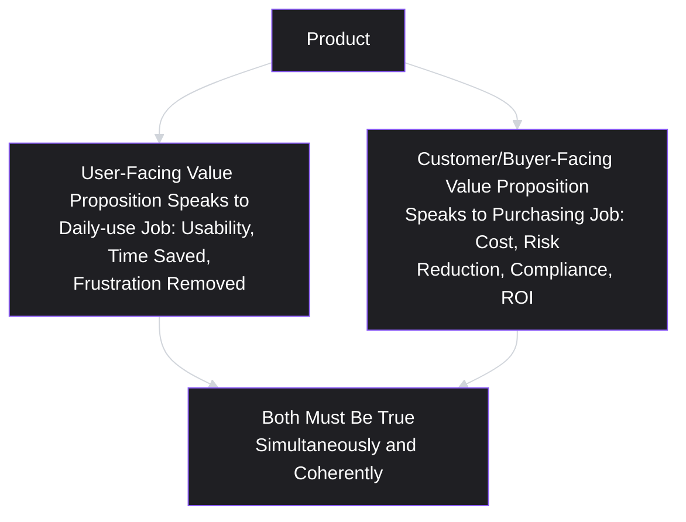
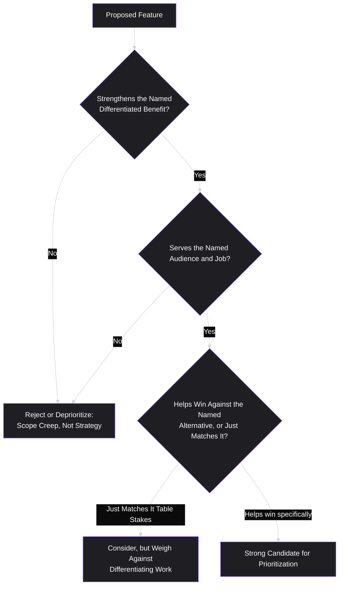

# Lesson 7: Value Proposition

## Why This Lesson Matters

Last lesson ended with a validated job: field staff need a way to guarantee a safety inspection gets recorded and eventually synced, regardless of momentary connectivity. Knowing the job is only half of the work. The other half is answering a much sharper question: **why should this specific person choose this specific product, over every other way — including doing nothing — of getting that job done?** That answer is a value proposition, and most product teams either skip articulating it explicitly, or write one so vague it could describe any competitor equally well.

A **value proposition** is a clear statement of the specific value a product delivers to a specific audience, for a specific job, better than the available alternatives. It is not a slogan, not a mission statement, and not a list of features. It is closer to a hypothesis: "for this person, doing this job, our product is the best available choice, because of these specific reasons, and here is the evidence."

This lesson matters because a fuzzy value proposition produces fuzzy prioritization. If a team cannot state precisely why a customer chooses them over the alternative — a competitor, a workaround, or non-consumption from Lesson 6 — then every roadmap debate becomes a matter of opinion, because there is no shared, falsifiable claim to test decisions against. A sharp value proposition, by contrast, becomes a filter: any proposed feature can be checked against it directly — does this strengthen the specific value we claim to deliver, or is it unrelated, or worse, does it dilute it by pulling the product toward being a slightly-worse version of some other product's value proposition?

---

## Learning Path

| Field | Detail |
|---|---|
| **Module** | 1 — Foundations |
| **Current Lesson** | 7 of 90 |
| **Difficulty** | 3 / 10 |
| **Estimated Study Time** | 25 minutes (reading) + 15 minutes (reflection + quiz) |
| **Prerequisites** | Lesson 5 (Users vs. Customers), Lesson 6 (Jobs To Be Done) |
| **Next Lesson** | Lesson 8 — Product Discovery |
| **Future Topics Unlocked** | Lesson 8 (Product Discovery — testing a value proposition before building), Lesson 9 (Product Vision — a value proposition extended across time), Lesson 10 (Product Strategy Basics — choosing which value proposition to compete on) |

---

## Learning Objectives

By the end of this lesson, you will be able to:

1. Define a value proposition and distinguish it from a mission statement, a tagline, and a feature list.
2. Construct a value proposition using a structured template that ties a specific audience, job, and differentiator together.
3. Explain why a value proposition must be written differently for divergent user and customer audiences (per Lesson 5), when applicable.
4. Apply the "value proposition as a filter" technique to evaluate whether a proposed feature strengthens or dilutes a product's core claim.
5. Identify the specific failure pattern of a "trying to be everything to everyone" value proposition, and explain why it is a strategic weakness rather than a strength.

---

## Prerequisites

Lesson 5 (Users vs. Customers) and Lesson 6 (Jobs To Be Done). This lesson assumes you can name a specific stakeholder role on the Alignment Spectrum and can produce a laddered job statement using the "When/I want to/so I can" structure — a value proposition is, in a real sense, the answer to "and this product is the best way to do that, because..." appended directly onto a job statement.

---

## Theory

### The Core Definition

A value proposition states: **for [a specific audience], who [has a specific job to be done or problem], [this product] is [a specific kind of solution] that [delivers a specific, differentiated benefit], unlike [the primary alternative].**

This is a widely used structural template (closely related to Geoffrey Moore's positioning statement format from *Crossing the Chasm*), and every clause in it is load-bearing:

- **A specific audience** — not "everyone," but a named segment, ideally tied to a specific job (Lesson 6) or a specific position on the Alignment Spectrum (Lesson 5).
- **A specific job or problem** — the thing this audience is actually trying to accomplish, stated in job terms rather than feature terms.
- **A specific kind of solution** — the category the product belongs to, which sets the audience's basic expectations.
- **A specific, differentiated benefit** — the part that actually does the strategic work: what does this product deliver that the alternative does not?
- **The primary alternative** — explicitly named, because a value proposition that doesn't name what it's better *than* cannot actually be evaluated as a comparative claim at all.

### Why "For Everyone" Is Not a Value Proposition — It's the Absence of One

A recurring failure mode, especially at early-stage companies eager not to turn away any potential customer, is a value proposition that tries to serve every possible audience and every possible job simultaneously: "Our platform helps businesses of all sizes work more efficiently." This statement is not wrong, exactly — it is simply not a value proposition, because it fails the basic test of specificity: it says nothing that a hundred other tools could not equally claim, and it gives a PM no way to evaluate whether a proposed feature strengthens or weakens the product's actual position.

This connects directly to a well-established idea in strategy: a real strategic choice necessarily excludes some options in favor of others. A value proposition that includes everyone and excludes nothing has not made a choice, and a product built to satisfy an unbounded audience with an unbounded set of jobs will tend to drift toward being a mediocre, generic version of many other products, rather than an excellent, differentiated version of one thing for one clearly named audience.

### The Relationship Between Value Proposition and Job to Be Done

A value proposition is not a replacement for a job statement — it is built directly on top of one. Recall Lesson 6's structure:

> **Job statement:** "When [situation], I want to [motivation], so I can [outcome]."

A value proposition adds a claim about *why this specific product* is the best available way to satisfy that job:

> **Value proposition:** "For [the person in that situation], [product] is the [category] that [uniquely delivers X], unlike [the alternative they'd otherwise use]."

Written this way, it becomes clear that a value proposition without a preceding, validated job statement is built on sand — it is a claim about being the best solution to a problem the team may not have actually confirmed is real, painful, or currently poorly served (the non-consumption question from Lesson 6). This is why this lesson sits directly after Jobs to Be Done in the curriculum sequence, rather than before it.

### Value Propositions Across the User-Customer Divide

Recall from Lesson 5 that users and customers frequently have different jobs and different concerns. A product with meaningful user-customer divergence often needs **two distinct value propositions** — one aimed at the user, one aimed at the customer/buyer — that are consistent with each other but not identical.

For example, a workplace analytics tool might have:

- **User-facing value proposition:** "For managers who need a quick pulse on team workload, [Product] is the dashboard that surfaces the one metric that matters before your Monday stand-up — unlike digging through three separate spreadsheets."
- **Customer/buyer-facing value proposition:** "For HR leaders who must demonstrate measurable productivity gains to the board, [Product] is the analytics platform that provides audit-ready reporting in one click — unlike stitching together exports from disconnected tools."

Notice these are not contradictory — both could be true of the same underlying product — but they emphasize entirely different benefits, because they answer entirely different jobs held by entirely different people (Lesson 5's Stakeholder Ledger applied directly). A PM who writes only one value proposition and assumes it covers both audiences risks producing marketing, onboarding, and even feature-prioritization decisions that resonate with one side of the Alignment Spectrum and fall flat with the other.

### Using a Value Proposition as a Prioritization Filter

Beyond external communication, a value proposition's most important internal use is as a **filter for evaluating proposed work**. Given any proposed feature, a PM can ask:

1. Does this feature strengthen the specific, differentiated benefit named in our value proposition?
2. Does this feature address the named audience and named job — or does it serve a different audience or job entirely?
3. Does this feature help us win specifically against the named alternative — or is it a feature the alternative already has, making it table stakes rather than differentiation?

A feature can pass a naive "is this valuable?" test while failing this filter — it might be valuable to *someone*, just not to the specific audience and job the value proposition names, meaning building it doesn't advance the product's actual strategic position; it just adds scope.

---

## Common Beginner Mistakes

**Mistake 1: Writing a value proposition that lists features instead of benefits**

"Our app has push notifications, calendar sync, and offline mode" describes what the product does, not why a specific person should choose it over an alternative to accomplish a specific job. Features are means; a value proposition is about the end result the audience gets.

**Mistake 2: Naming no alternative**

A value proposition that never says "unlike X" cannot actually be evaluated as a comparative claim, and often signals the team hasn't done the competitive or non-consumption analysis from Lesson 6 needed to write a real one.

**Mistake 3: Confusing a value proposition with a company mission statement**

"We believe in empowering people to do their best work" is an aspirational statement about company purpose, not a specific, falsifiable claim about audience, job, and differentiated benefit. Both can coexist, but they serve different purposes and should not be substituted for each other.

**Mistake 4: Writing one value proposition when the product genuinely serves divergent user and customer audiences**

As shown above, a product with meaningful Alignment Spectrum divergence often needs two coherent, consistent, but distinct value propositions, not one generic statement meant to satisfy both.

**Mistake 5: Treating "trying to serve everyone" as inclusive or growth-friendly, rather than as a strategic weakness**

Broadening a value proposition to avoid excluding any potential customer feels safe, but it removes the specificity that makes the proposition useful as a filter at all, and tends to produce a product that is a diluted, less-differentiated version of several other products' actual value propositions.

---

## Mental Model: The Value Proposition Filter

This lesson's mental model is the **Value Proposition Filter** — a habit of running every proposed feature through the three questions above before committing engineering resources to it.

Use this filter as a standing discipline in roadmap reviews: any feature that cannot pass through all three gates should prompt an explicit conversation about whether the team is quietly drifting away from its own stated value proposition, rather than being silently added to the backlog as if it were self-evidently good.

---

## Real Company Example

**Duolingo** offers a useful illustration of a sharply specific value proposition rather than a generic one. Duolingo's positioning has consistently centered on making language learning accessible, habit-forming, and low-friction for casual learners — using short, gamified daily lessons, streaks, and reminders — rather than competing on the depth or fluency outcomes that more intensive, immersion-based, or classroom-based language programs claim to deliver. This is a deliberate exclusion: Duolingo's public communication and product design choices have not generally positioned the product as a replacement for full immersion or academic-level fluency, but as the best available option for a specific audience (people who want to build a language habit in small daily increments, and who would otherwise likely do no language learning at all — directly invoking the non-consumption idea from Lesson 6) against the alternative of a more intensive program that this same audience is unlikely to actually stick with.

*(Assumption flagged: this reflects widely observed and reported product positioning rather than a claim about Duolingo's internal strategic documents, which this curriculum does not claim certainty about.)*

---

## Real World Perspective: Value Proposition at Different Company Stages

**At a startup:**
The value proposition is often still a live hypothesis rather than a settled fact, and the primary job of early product discovery (Lesson 8) is testing whether the claimed differentiated benefit is actually true and actually valued by the named audience, rather than assumed to be true because the founding team believes it. Startups frequently iterate on the exact wording and even the exact audience of their value proposition multiple times before finding one that survives contact with real customer conversations.

**At a mid-size company:**
The value proposition often becomes a genuine internal tool for resolving prioritization disputes across multiple teams — used explicitly in roadmap reviews as the filter described above, and revisited periodically as the competitive landscape or the named "primary alternative" shifts (a new entrant, a competitor's new feature, a changing market expectation for "table stakes").

**At Big Tech:**
Large companies often manage multiple, deliberately distinct value propositions across different product lines or tiers within the same overall brand, and a substantial part of senior product strategy work involves ensuring these value propositions remain internally consistent (not contradicting or cannibalizing each other) rather than assuming a single company-wide value proposition can meaningfully describe every product in a large portfolio.

---

## Detailed Case Study: The Value Proposition That Tried to Be Two Things

Consider a simplified, illustrative scenario common across early-stage B2B SaaS.

A startup builds a scheduling tool initially aimed at independent contractors and freelancers who need a simple way to let clients book time on their calendar without back-and-forth emails. Early value proposition: "For freelancers who lose time coordinating meetings by email, [Product] is the booking tool that lets clients pick a slot in one click — unlike endless email threads."

The product gains modest early traction. Encouraged, the founding team notices that a few larger companies have also signed up, apparently using the tool for internal team scheduling across departments — a different audience, doing a somewhat different job (internal coordination across many calendars, rather than external client-facing booking). Excited by the larger contract sizes this segment implies, leadership directs the team to build features aimed at this new audience: multi-calendar team views, department-level permissions, and admin controls.

Eighteen months later, the product has a confusing feature set that partially serves both audiences and fully satisfies neither. Freelancer users complain the interface has become cluttered with team-administration concepts irrelevant to their simple, one-click booking need. Enterprise buyers, meanwhile, compare the product unfavorably to dedicated enterprise scheduling suites that were built from the ground up around multi-calendar administration, finding the freelancer-oriented core experience underpowered for their needs.

**What went wrong?**

The team never explicitly re-evaluated its value proposition when it discovered the second audience — it simply began building for both simultaneously, without confronting the fact that these were **two different jobs, two different primary alternatives, and arguably two different products** wearing one interface:

1. The freelancer audience's job (frictionless client-facing booking) and primary alternative (email back-and-forth) had almost nothing in common with the enterprise audience's job (internal team calendar coordination) and primary alternative (dedicated enterprise scheduling suites).
2. Every feature built for the enterprise audience (multi-calendar views, permissions, admin controls) added complexity that directly worked against the original, sharply differentiated freelancer value proposition of frictionless simplicity.
3. Every feature that kept the interface simple for freelancers left the product underpowered relative to purpose-built enterprise alternatives, since those competitors were not making the same compromise.

A team applying the Value Proposition Filter from Lesson 7 at the moment enterprise usage was first noticed would have confronted an explicit strategic choice — commit fully to the freelancer value proposition and treat enterprise usage as an interesting but secondary signal, commit fully to pivoting toward the enterprise value proposition and accept some freelancer attrition, or deliberately build two genuinely separate product experiences (a common resolution in practice) — rather than attempting to serve both audiences within a single, increasingly incoherent value proposition by default.

This case will be revisited in **Lesson 10 (Product Strategy Basics)**, where we formalize the process of choosing which value proposition, and which audience, to commit strategic resources toward when multiple are viable.

---

## Framework Explanation: The Positioning Statement Template

The structural template introduced earlier in this lesson is worth restating as a directly fillable framework, since it is one of the most widely reused tools in product and marketing practice:

> For **[target audience]**, who **[statement of job or problem]**, **[product name]** is a **[product category]** that **[key differentiated benefit]**. Unlike **[primary alternative]**, our product **[key point of differentiation]**.

Filling in every blank forces the specificity this lesson argues for. A team that cannot fill in the "unlike" and "key point of differentiation" blanks with something specific and defensible has, in a real sense, discovered that it does not yet have a value proposition at all — only a product description. This is a useful diagnostic in its own right: **if you cannot complete this template with specific, non-generic language, that gap is itself a signal about what discovery work (Lesson 8) still needs to happen**, not simply a wording problem to be smoothed over with better marketing copy.

---

## Interview Perspective: How Interviewers Think About This

**Typical question 1: "Describe your product's value proposition."**
*What the interviewer is actually evaluating:* Whether the candidate can state something specific and falsifiable — a named audience, a named job, a named differentiated benefit, a named alternative — versus a generic, feature-listing, or mission-statement-style answer that could apply to almost any product in the category. A strong answer sounds like a claim that could, in principle, be proven wrong by evidence; a weak answer sounds like marketing copy no one could disagree with.

**Typical question 2: "A stakeholder proposes a feature that's popular with users but doesn't fit your product's core value proposition. What do you do?"**
*What the interviewer is actually evaluating:* Whether the candidate treats the value proposition as a genuine filter with real consequences (potentially declining or deprioritizing a popular-sounding feature) or treats it as decoration that never actually constrains a decision. A strong answer explains the specific mismatch (wrong audience, wrong job, or matches-but-doesn't-differentiate against the named alternative) rather than a vague sense that the feature "doesn't feel right."

**Typical question 3: "How would you position a product serving two very different customer segments?"**
*What the interviewer is actually evaluating:* Whether the candidate recognizes that divergent audiences (echoing Lesson 5's Alignment Spectrum) often require genuinely distinct value propositions rather than one compromise statement, and can reason about when to serve both with tailored positioning versus when serving both is itself a strategic mistake, as in the Detailed Case Study.

---

## Summary

A value proposition is a specific, falsifiable claim that a product is the best available way for a named audience, with a named job, to get better outcomes than a named alternative — built directly on top of a validated job statement from Lesson 6, not as a replacement for one. The most common failure is writing a value proposition broad enough to describe almost any competitor, which sacrifices the specificity that makes it useful at all, particularly the temptation to serve "everyone" rather than making a real strategic choice. Products with meaningful user-customer divergence (Lesson 5) frequently need two coherent but distinct value propositions, one per audience, rather than a single compromise statement. Beyond external communication, a value proposition's most important internal use is as a prioritization filter — checking whether a proposed feature strengthens the named differentiated benefit, serves the named audience and job, and helps win specifically against the named alternative, rather than merely sounding valuable in the abstract.

---

## Key Takeaways

- A value proposition names a specific audience, a specific job, a specific differentiated benefit, and a specific named alternative — all four elements are load-bearing.
- A value proposition is built directly on top of a validated job statement (Lesson 6); without a real, validated job underneath it, a value proposition is a claim built on sand.
- "For everyone" is not an inclusive value proposition — it is the absence of a real strategic choice, and typically produces a diluted, less-differentiated product.
- Products with meaningful user-customer divergence often require two distinct, coherent value propositions — one per audience — rather than a single compromise statement.
- The Value Proposition Filter (does this strengthen our differentiated benefit, serve our named audience/job, and help us win against our named alternative?) is a practical prioritization tool, not just an external marketing exercise.
- Discovering a new, unplanned audience for a product (as in the Detailed Case Study) requires an explicit strategic choice, not silent, simultaneous expansion to serve both the original and new audience.
- If you cannot fill in a positioning statement template with specific language, that gap is a signal that more discovery work is needed, not simply a copywriting problem.

---

## Cheat Sheet

*A two-minute review of everything in this lesson.*

- **Value proposition:** for [audience], with [job], [product] delivers [differentiated benefit], unlike [named alternative].
- **Built on top of a job statement** (Lesson 6) — not a replacement for one.
- **"For everyone" = no value proposition** — it's the absence of a real strategic choice.
- **User-customer divergence** (Lesson 5) often requires two distinct value propositions, not one.
- **Value Proposition Filter:** does this feature strengthen the benefit? serve the named audience/job? help win against the named alternative (vs. just match it)?
- **Positioning statement template:** fill every blank with something specific — if you can't, that's a discovery gap, not a wording problem.
- **Biggest trap:** discovering a new audience and silently trying to serve both without an explicit strategic choice.

---

## Glossary

| Term | Definition | Related Concepts | Difficulty |
|---|---|---|---|
| Value Proposition | A specific, falsifiable claim that a product is the best available way for a named audience, with a named job, to get a better outcome than a named alternative. | Job to Be Done, Positioning Statement | 2 |
| Positioning Statement | A fillable template ("For [audience], who [job]...") used to construct a specific, non-generic value proposition. | Value Proposition | 2 |
| Value Proposition Filter | A practical technique of checking a proposed feature against the named audience, job, and differentiator in a value proposition before prioritizing it. | Prioritization (Lesson 29) | 2 |
| Primary Alternative | The specific competitor, workaround, or non-consumption option that a value proposition explicitly claims to beat. | Non-Consumption (Lesson 6) | 2 |
| Table Stakes | A feature that merely matches an alternative's existing capability, rather than providing genuine differentiation. | Value Proposition Filter | 2 |

---

## Further Reading / Resources

- Geoffrey Moore, *Crossing the Chasm* — the origin of the widely used positioning statement template referenced in this lesson.
- Alexander Osterwalder, Yves Pigneur, et al., *Value Proposition Design* — a detailed, visual companion methodology (the Value Proposition Canvas) for mapping customer jobs, pains, and gains against product features and benefits.
- April Dunford, *Obviously Awesome* — a modern, widely cited treatment of product positioning that directly addresses the "trying to serve everyone" failure pattern discussed in this lesson.

---

## Flashcards

**Card 1**
- Front: What is a value proposition?
- Back: A specific, falsifiable claim that a product is the best available way for a named audience, with a named job, to get a better outcome than a named alternative.
- Difficulty: 1
- Tags: value-proposition, fundamentals

**Card 2**
- Front: What must a value proposition be built directly on top of?
- Back: A validated job statement (Lesson 6) — without a real, validated underlying job, a value proposition is a claim built on sand.
- Difficulty: 2
- Tags: value-proposition, jtbd

**Card 3**
- Front: Why is "for everyone" not a real value proposition?
- Back: It fails to make a genuine strategic choice, describes nothing a competitor couldn't equally claim, and typically produces a diluted, less-differentiated product.
- Difficulty: 2
- Tags: value-proposition, specificity

**Card 4**
- Front: Why might a product need two distinct value propositions?
- Back: When user and customer audiences diverge significantly (Lesson 5's Alignment Spectrum), each audience often has a different job and different concerns, requiring a coherent but distinct value proposition per audience.
- Difficulty: 3
- Tags: value-proposition, user-customer

**Card 5**
- Front: What are the three questions in the Value Proposition Filter?
- Back: Does this feature strengthen the named differentiated benefit? Does it serve the named audience and job? Does it help win specifically against the named alternative, or just match it (table stakes)?
- Difficulty: 2
- Tags: value-proposition-filter, prioritization

**Card 6**
- Front: What should a team do upon discovering an unplanned second audience using their product for a different job (as in the Detailed Case Study)?
- Back: Make an explicit strategic choice (commit to the original audience, pivot to the new one, or deliberately build separate experiences) rather than silently expanding to serve both within one incoherent value proposition.
- Difficulty: 3
- Tags: case-study, strategy

## Reflection Exercise

You are the PM for a recipe app. Your current value proposition: "For home cooks who don't know what to make with what's already in their fridge, [Product] is the recipe app that generates a usable recipe from a photo of your fridge's contents — unlike scrolling through generic recipe blogs."

A subset of power users has begun using the app heavily for a different purpose: meticulous, macro-tracking meal planning for strict fitness diets, and this segment has an unusually high willingness to pay for a premium tier.

Work through the following, in writing, before reading further:

1. Using the positioning template, write out this new segment's likely value proposition, naming their audience, job, and probable primary alternative (consider what tools serious macro-trackers currently use).
2. Compare the two value propositions (the original and this new one). Do they share an audience? A job? A primary alternative?
3. Apply the Value Proposition Filter: would a "detailed macro-tracking" feature strengthen, dilute, or have no effect on the original fridge-photo value proposition?
4. Referencing the Detailed Case Study, name the specific risk of building fully for both audiences simultaneously without an explicit strategic choice.
5. Propose one path forward (commit to one audience, pivot, or build two distinct experiences) and justify it in one paragraph.

There is no single correct answer. The purpose of this exercise is to practice recognizing when an unplanned but commercially attractive second audience represents a genuine strategic fork, rather than simply a good feature idea to add on top of an existing product.

---

## Quiz

**1. Which of the following best completes a value proposition template?**
A) "For small teams juggling many calendars, [Product] is the scheduling tool that saves hours every single week."
B) "[Product] is the booking tool that completely replaces the back-and-forth of email scheduling threads."
C) "For freelancers losing hours to scheduling email, [Product] is the booking tool that lets clients self-book, unlike email threads."
D) "For freelancers, [Product] offers calendar sync, automated reminders, and a shareable public booking page."

*Correct answer: C*
*Explanation: Only C carries all four load-bearing elements: a named audience, a named job, a differentiated benefit, and a named alternative. A omits the alternative, B omits the audience and job, and D lists features rather than a benefit.*
*Learning objective tested: #1, #2*
*Difficulty: Easy*

---

**2. Why is a value proposition described as being "built on top of" a job statement?**
A) Because the claim depends on the job beneath it being genuinely real
B) Because job statements become obsolete once positioning is written
C) Because the two artifacts are owned by separate teams in most firms
D) Because a value proposition must be signed off before discovery begins

*Correct answer: A*
*Explanation: A value proposition asserts you are the best available answer to a job. If that job has not been validated as real, painful, and poorly served, the comparative claim has nothing underneath it.*
*Learning objective tested: #2*
*Difficulty: Easy*

---

**3. Why does this lesson argue that "for everyone" is not a real value proposition?**
A) Because such statements tend to be too long to be memorable
B) Because value propositions must target consumers, not businesses
C) Because broad claims attract regulatory scrutiny in most markets
D) Because it makes no real choice and excludes nothing

*Correct answer: D*
*Explanation: A strategic choice necessarily rules something out. A statement a hundred other tools could equally make gives the PM no way to judge whether a proposed feature strengthens or dilutes the product's position.*
*Learning objective tested: #5*
*Difficulty: Easy*

---

**4. According to this lesson, when might a product need two distinct value propositions?**
A) When the product is sold across two or more separate countries
B) When the product offers more than one paid pricing tier
C) When marketing and product teams disagree about the messaging
D) When user and customer audiences genuinely diverge

*Correct answer: D*
*Explanation: Divergence on the Alignment Spectrum means two audiences holding different jobs. The two statements should be consistent with one another, but they will emphasize different benefits because they answer different questions.*
*Learning objective tested: #3*
*Difficulty: Easy*

---

**5. In the Value Proposition Filter, what does it mean if a proposed feature merely matches an alternative's existing capability?**
A) It is table stakes — possibly necessary, but not differentiating
B) It should immediately become the single highest priority on the roadmap
C) It should be rejected, since matching a rival is wasted effort
D) It indicates the stated value proposition needs to be rewritten

*Correct answer: A*
*Explanation: Table stakes features are sometimes worth building to stay credible in a category. The filter's job is to keep them from being mistaken for work that advances differentiation.*
*Learning objective tested: #4*
*Difficulty: Easy*

---

**6. In the Detailed Case Study, what was the core strategic mistake made by the scheduling tool's team?**
A) Building any enterprise features at all for the newly arrived segment
B) Serving two audiences with different jobs and alternatives, without choosing
C) Refusing to keep serving freelancers once enterprise use grew
D) Charging enterprise buyers more than the freelancer segment paid

*Correct answer: B*
*Explanation: Serving enterprise was not inherently wrong. Drifting into it silently, while still claiming the original freelancer proposition, produced a product that was a compromise on both counts.*
*Learning objective tested: #5*
*Difficulty: Easy*

---

**7. Which of the following is the clearest example of Beginner Mistake 1 (listing features instead of benefits) in a value proposition?**
A) "Our app has push notifications, calendar sync, and offline mode."
B) "For managers, [Product] surfaces the one metric that matters."
C) "Unlike three separate spreadsheets, [Product] gives you one dashboard."
D) "For HR leaders, [Product] delivers audit-ready reporting in one click."

*Correct answer: A*
*Explanation: A names three capabilities and stops. It never says who they are for, what job they serve, or what they beat — features are the means, and a value proposition is about the result the audience gets.*
*Learning objective tested: #1*
*Difficulty: Medium*

---

**8. (Scenario) A product's value proposition names "spreadsheets and manual tracking" as its primary alternative. According to this lesson, what does naming a primary alternative allow a PM to do that a value proposition without one cannot?**
A) Evaluate the proposition as a genuinely testable comparative claim
B) Guarantee that the product will outperform every rival automatically
C) Little — naming an alternative is mainly a marketing formality
D) Avoid revisiting the value proposition as the market shifts

*Correct answer: A*
*Explanation: "Better than X" can be checked against evidence; "better" on its own cannot. Naming the alternative is what converts a generic description into a falsifiable claim the team can be wrong about.*
*Learning objective tested: #1*
*Difficulty: Medium-Hard*

---

**9. (Product Thinking) A team discovers that a proposed feature is popular in user surveys but does not serve the audience or job named in their current value proposition. According to the Value Proposition Filter, what is the most appropriate next step?**
A) Build it right away, since survey popularity justifies the work
B) Discard all future survey data as an unreliable input to planning
C) Reject it outright, since a filter failure settles the question
D) Treat the mismatch as a flag for explicit discussion

*Correct answer: D*
*Explanation: The filter surfaces a question rather than answering it. The mismatch might mean scope creep, or it might be early evidence that the value proposition itself should evolve — and only a deliberate conversation distinguishes the two.*
*Learning objective tested: #4*
*Difficulty: Medium-Hard*

---

**10. (Interview Reasoning) A candidate describes their product's value proposition as "we help businesses succeed." What is the most likely interviewer reaction, based on this lesson's Interview Perspective section?**
A) Approval, since broad propositions imply larger addressable markets
B) Skepticism, since it names no audience, job, or alternative, and could fit any product
C) Indifference, since positioning rarely comes up in PM interviews
D) Approval, since the framing is ambitious and universally positive

*Correct answer: B*
*Explanation: The statement is unfalsifiable. An interviewer is listening for whether the candidate has made a real choice about who the product is for and what it beats, and this answer reveals that none has been made.*
*Learning objective tested: #5*
*Difficulty: Hard*

---

**11. (Product Thinking, Higher Difficulty) A subscription fitness app's user-facing value proposition emphasizes "personalized workouts that adapt daily," while its customer-facing (corporate wellness buyer) value proposition emphasizes "measurable employee engagement reporting for HR." According to this lesson, is having two different value propositions here a problem?**
A) Yes — a product must maintain exactly one universal value proposition
B) Yes — users and buyers must receive identical product messaging
C) No, provided the two stay coherent with each other rather than contradictory
D) No, though this is a special exception peculiar to fitness products

*Correct answer: C*
*Explanation: Two audiences, two jobs, two propositions. Both can be true of the same product; the requirement is consistency, not sameness, and a single compromise statement would serve neither audience well.*
*Learning objective tested: #3*
*Difficulty: Medium-Hard*

---

**12. Which of the following would most directly indicate that a proposed feature passes all three gates of the Value Proposition Filter?**
A) The feature is inexpensive for the team to build this quarter
B) The feature was personally requested by a senior executive last week
C) The feature is technically impressive but has no bearing on the audience's named job
D) It strengthens the benefit, serves the named audience, and beats the alternative

*Correct answer: D*
*Explanation: All three gates have to clear together. A feature can be cheap, well-sponsored, and impressive while still adding scope rather than advancing the product's strategic position.*
*Learning objective tested: #4*
*Difficulty: Medium-Hard*

---

**13. (Interview Reasoning, Higher Difficulty) An interviewer presents a scenario where a product is used heavily by two very different audiences with different jobs, and asks the candidate how they'd approach positioning. A weak answer would most likely do which of the following?**
A) Recognize the divergence and weigh distinct propositions, a pivot, or separate experiences
B) Propose one broad compromise statement meant to satisfy both audiences equally
C) Ask clarifying questions about each audience's specific job before answering
D) Reference the Value Proposition Filter to test any proposed resolution

*Correct answer: B*
*Explanation: The compromise statement dodges the strategic choice the scenario is built to surface, and reproduces the exact drift described in the Case Study. The other three all engage the choice directly.*
*Learning objective tested: #3, #5*
*Difficulty: Hard*

---

**14. Why does this lesson argue that discovering a new, unplanned audience for a product requires an explicit strategic choice, rather than default expansion to serve both?**
A) Because a second audience is inherently less valuable than the first
B) Because a published value proposition cannot be revised
C) Because features serving one job can undercut the other's benefit
D) Because serving two segments requires a formal legal review process

*Correct answer: C*
*Explanation: In the case study the enterprise work added exactly the complexity the freelancer proposition promised to remove. Expansion is a legitimate option; doing it without deciding is what produces the incoherence.*
*Learning objective tested: #5*
*Difficulty: Medium-Hard*

---

**15. (Highest Difficulty) A team completes the positioning statement template but is unable to fill in a specific, defensible answer for the "unlike [primary alternative]" and "key point of differentiation" blanks. According to this lesson, what does this most likely indicate?**
A) The template is flawed and the team should abandon it for another
B) A gap in discovery — the team does not yet know what it competes against
C) The team should invent a plausible alternative, since any statement beats none
D) The product should be discontinued and the segment abandoned entirely

*Correct answer: B*
*Explanation: The empty blank is the finding, not the failure. It says the team has not yet established what customers would otherwise do, which is discovery work rather than a copywriting problem to smooth over.*
*Learning objective tested: #1, #2*
*Difficulty: Hard*

---

## Connections

| | Lesson | Core Idea Carried Forward |
|---|---|---|
| **Previous Lesson** | Lesson 6 — Jobs To Be Done | Provides the validated job statement that a value proposition is built directly on top of |
| **Current Lesson** | Lesson 7 — Value Proposition | Positioning statement template; the Value Proposition Filter; divergent value propositions for divergent audiences |
| **Next Lesson** | Lesson 8 — Product Discovery | Provides the methods for testing whether a proposed value proposition is actually true, before committing significant engineering investment to it |
| **Future Concepts Unlocked** | Lesson 9 (Product Vision) | Extends a validated value proposition across time into a longer-term aspirational direction |
| | Lesson 10 (Product Strategy Basics) | Formalizes the process (previewed in this lesson's Case Study) of choosing which value proposition and audience to commit strategic resources toward |
| | Lesson 29 (Prioritization Fundamentals) | Incorporates the Value Proposition Filter as one lens within a fuller prioritization scoring model |

This curriculum is designed to be read as one continuous argument. From this lesson forward, any reference to a product's strategic direction assumes a specific, filterable value proposition exists — this will not be re-explained, only re-applied and tested.
