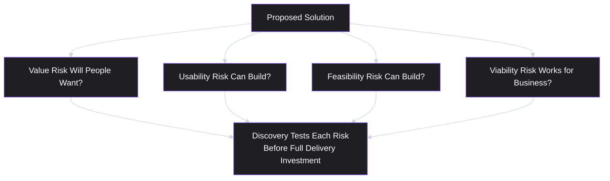
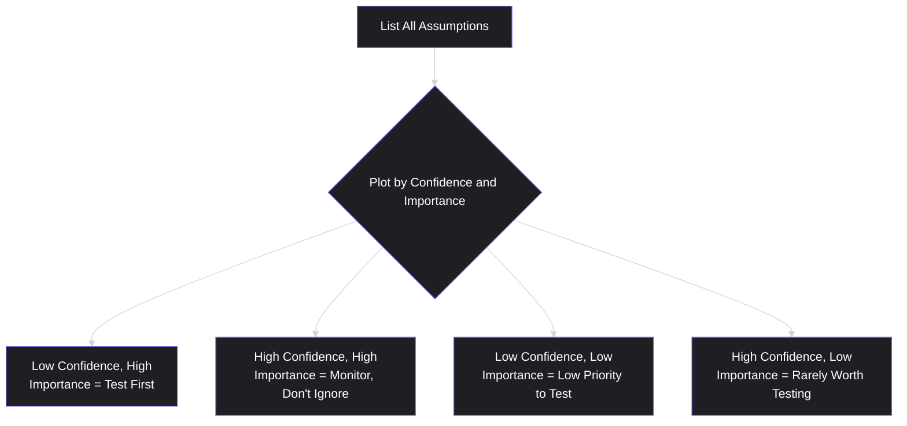
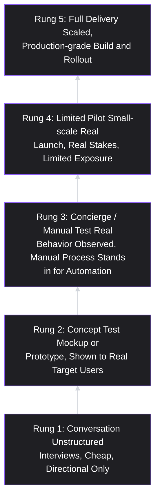

# Lesson 8: Product Discovery

## Why This Lesson Matters

Lesson 7 ended with a pointed diagnostic: if you can't fill in a value proposition's "unlike [alternative]" blank with something specific and defensible, that gap isn't a wording problem — it's evidence that discovery work hasn't happened yet. This lesson is that missing work made explicit.

**Product discovery** is the set of activities a team uses to determine whether a proposed solution is worth building, *before* committing significant engineering investment to building it. It sits in deliberate contrast to what many teams do by default: skip straight from an idea (often a stakeholder's proposed solution, per Lesson 6) to delivery — designing, building, and shipping — and only discover afterward, via low adoption or a disappointing metric, that the underlying assumption was wrong. Discovery exists to catch that failure earlier and cheaper, when the cost of being wrong is a few days of research rather than a quarter of engineering time.

This matters urgently because the two most expensive kinds of product failure are not failures of execution — a bug, a missed deadline, a rough UI — but failures of **validity**: building something nobody actually wants (a desirability failure) or building something that technically works but that the business cannot sustain (a viability failure). Both are, in principle, detectable before a single line of production code is written, if a team is willing to structure its work around testing assumptions rather than assuming validity by default. Discovery is the discipline of doing that testing deliberately, rather than by accident, and rather than not at all.

---

## Learning Path

| Field | Detail |
|---|---|
| **Module** | 1 — Foundations |
| **Current Lesson** | 8 of 90 |
| **Difficulty** | 4 / 10 |
| **Estimated Study Time** | 30 minutes (reading) + 15 minutes (reflection + quiz) |
| **Prerequisites** | Lesson 1 (What is Product Management?), Lesson 6 (Jobs To Be Done), Lesson 7 (Value Proposition) |
| **Next Lesson** | Lesson 9 — Product Vision |
| **Future Topics Unlocked** | Lesson 11 (User Research — the specific methods discovery relies on), Lesson 20 (Product Discovery Process — a deeper, structured version of this lesson), Lesson 21 (MVP — the delivery-side counterpart to discovery) |

---

## Learning Objectives

By the end of this lesson, you will be able to:

1. Define product discovery and distinguish it from product delivery.
2. Identify the four categories of risk a discovery process is designed to reduce: value, usability, feasibility, and viability risk.
3. Explain why discovery and delivery should run continuously and in parallel, rather than as sequential phases.
4. Apply a basic assumption-mapping technique to identify which assumption in a proposed solution is riskiest and most in need of testing first.
5. Distinguish a genuine discovery test from "discovery theater" — activity that resembles validation but does not actually reduce risk.

---

## Prerequisites

Lesson 1 (What is Product Management?), Lesson 6 (Jobs To Be Done), and Lesson 7 (Value Proposition). This lesson assumes familiarity with the Accountability Triangle (desirability, feasibility, viability) from Lesson 1, and treats discovery as the active process of testing each leg of that triangle before committing to delivery — extending the "how do we know" question from Lesson 1 into a repeatable practice.

---

## Theory

### The Core Definition

Product discovery is the process of testing assumptions and reducing risk in a proposed solution *before* it is built at full scale. It is distinct from **product delivery** — the process of actually designing, building, testing for quality, and shipping a solution once it has been validated. Discovery asks "should we build this, and if so, roughly what should it look like?" Delivery asks "how do we build this well, on time, and to a high quality bar?"

A useful shorthand, widely used in modern product practice (closely associated with Marty Cagan's writing at the Silicon Valley Product Group): discovery is optimized for **speed and learning**, often producing artifacts that are never meant to be shippable — rough prototypes, landing pages, concierge-style manual processes standing in for automation, or simple prompts to a small group of real users. Delivery is optimized for **quality and scale**, producing the actual production-grade product that will serve the full user base reliably.

### The Four Risks Discovery Tests

Discovery exists to reduce four categories of risk, extending the Accountability Triangle from Lesson 1 into a slightly more granular, delivery-adjacent framework:

- **Value risk**: will people actually want this, and choose to use or pay for it? (Directly tied to the job and value proposition validated in Lessons 6 and 7.)
- **Usability risk**: can people actually figure out how to use it, even if they want the underlying value?
- **Feasibility risk**: can the team actually build it, within realistic technical, legal, or resource constraints?
- **Viability risk**: does the solution work for the business — economically, legally, and strategically — even if users love it and engineering can build it?

Each risk category calls for a different kind of test, and a common discovery mistake is testing only one risk (usually value risk, via a prototype demo) while quietly assuming the other three away. A beautifully validated, highly desirable idea that turns out to be legally non-viable, or technically infeasible at the required scale, has still failed — discovery that stops after confirming value risk has only done a quarter of the job.

### Discovery and Delivery Run Continuously, Not Sequentially

A common misunderstanding treats discovery as a distinct, front-loaded "phase" that happens before delivery begins — research this quarter, build next quarter. Modern product practice generally rejects this framing in favor of **continuous discovery**: a standing, ongoing habit of testing assumptions in parallel with delivery, rather than a one-time gate a project passes through once.

This matters for a specific practical reason: a team that treats discovery as a phase that ends once delivery begins loses its ability to catch new risks that emerge *during* building — a technical constraint discovered mid-implementation, a competitor's launch that changes the viability picture, or user feedback on an early build that reveals a usability problem no prototype surfaced. Continuous discovery treats validation as a standing capability the team maintains throughout a product's life, not a box checked once at the start of a project.

### Assumption Mapping: Finding the Riskiest Assumption First

Any proposed solution rests on a stack of assumptions, and not all assumptions carry equal risk. **Assumption mapping** is the practice of explicitly listing the assumptions a solution depends on, and identifying which one is both least certain and most consequential if wrong — the assumption whose failure would most completely invalidate the whole idea.

A simple two-axis technique plots each assumption by:

- **How confident are we this assumption is true?** (low to high)
- **How much does the whole solution depend on this assumption being true?** (low to high)

The assumption sitting in the "low confidence, high importance" position is the one to test first, regardless of which of the four risk categories it belongs to. A team that instead defaults to testing whichever assumption is easiest or most comfortable to test (frequently a usability question, since usability testing is procedurally familiar) can spend real discovery effort while leaving the actual riskiest assumption — often a value or viability question — completely unexamined.

### Discovery Theater: Activity That Looks Like Validation But Isn't

A specific and common failure mode deserves its own name: **discovery theater** — activities that have the visible form of discovery (interviews were conducted, a prototype was shown, a survey was sent) but that do not actually reduce risk, because they were structured in a way that could not have produced disconfirming evidence even if the underlying assumption were false.

Common patterns of discovery theater include:

- Showing a polished prototype and asking "would you use this?" — a question people tend to answer generously regardless of their actual future behavior, because there is no real cost to saying yes in the moment.
- Surveying existing enthusiastic users about a new feature idea, rather than a broader or more skeptical population, producing artificially positive signal.
- Running a study but only after the team has already effectively committed (engineering has started, a launch date is set), such that negative findings would be organizationally very difficult to act on even if they appeared.
- Interpreting polite, encouraging feedback in a demo as validation, without ever observing what people actually do when given a real opportunity to adopt or reject the solution with real stakes (time, money, switching cost).

The corrective principle: a genuine discovery test must be designed so that a plausible negative outcome (people don't want it, can't use it, or won't pay for it) is actually possible to observe and would actually change the team's decision. If a test cannot, even in principle, produce a result that changes the plan, it is discovery theater, not discovery.

---

## Common Beginner Mistakes

**Mistake 1: Skipping discovery for "obviously good" ideas.**
An idea that feels self-evidently good to the team — often because it addresses a real pain the team itself has experienced, or because a senior stakeholder is confident in it — is exactly the kind of idea most likely to skip discovery, and exactly the kind of idea where an untested assumption can hide in plain sight because no one felt the need to question it.

**Mistake 2: Treating a single successful prototype demo as complete validation.**
As covered above, a demo that produces polite enthusiasm has usually only tested a shallow version of value risk (and often not even that, robustly), while usability, feasibility, and viability risk remain completely unexamined.

**Mistake 3: Running discovery only at the very start of a project, then treating it as "done."**
This misses the continuous nature of discovery described above — new risks emerge throughout delivery, and a one-time discovery phase leaves a team blind to them.

**Mistake 4: Testing the easiest assumption instead of the riskiest one.**
A team eager to show discovery progress may gravitate toward whichever assumption is simplest to test procedurally, rather than the assumption identified by assumption mapping as carrying the most combined uncertainty and consequence.

**Mistake 5: Confusing discovery activity with discovery outcomes.**
"We did five user interviews" describes an activity, not a finding. Discovery should be evaluated by what was actually learned and what decision it changed, not by the volume of research activity conducted — a team can conduct extensive research and still learn nothing decision-relevant if the research was poorly targeted.

---

## Mental Model: The Assumption Map

This lesson's mental model is the **Assumption Map** introduced above — used as a standing discipline before committing meaningful resources to any new initiative.

```mermaid
%%{init: {
  "theme": "dark",
  "themeVariables": {
    "background": "#0b0b0c",
    "primaryColor": "#1f1f23",
    "primaryTextColor": "#ffffff",
    "primaryBorderColor": "#8b5cf6",
    "lineColor": "#d1d5db",
    "secondaryColor": "#18181b",
    "tertiaryColor": "#111111",
    "mainBkg": "#1f1f23",
    "nodeBorder": "#8b5cf6",
    "clusterBkg": "#000000",
    "clusterBorder": "#27272a",
    "titleColor": "#ffffff",
    "edgeLabelBackground": "#0b0b0c",
    "nodeTextColor": "#ffffff",
    "edgeLabelColor": "#ffffff",
    "actorBorder": "#8b5cf6",
    "actorBkg": "#1f1f23",
    "actorTextColor": "#ffffff",
    "sequenceNumberColor": "#ffffff",
    "signalColor": "#8b5cf6",
    "signalTextColor": "#ffffff",
    "textColor": "#ffffff",
    "classText": "#ffffff",
    "classBorder": "#8b5cf6",
    "classBkg": "#1f1f23"
  }
}}%%
graph LR
    A[New Idea or Feature] --> B[List Every Assumption It Depends On]
    B --> C[Categorize Each by Value /<br/>Usability / Feasibility / Viability]
    C --> D[Plot by Confidence X Importance]
    D --> E[Identify the<br/>Riskiest Untested Assumption]
    E --> F[Design a Genuine<br/>Test Could Disconfirm It]
    F --> G[Only Proceed to Delivery Once the<br/>Riskiest Assumptions Are Addressed]
```

Use this as a repeatable checklist before any significant delivery commitment: name the assumptions, categorize them, find the riskiest one, and design a test that could actually fail. A team that has done this — even briefly and informally — has done meaningfully more real discovery than a team that ran a longer but less targeted research process without ever identifying which assumption mattered most.

---

## Real Company Example

**Airbnb**'s early history is a frequently cited illustration of lightweight, high-signal discovery preceding any significant engineering investment. According to widely reported accounts of the company's early days, the founders manually photographed listings themselves and personally interacted with early hosts and guests, rather than building automated, scalable systems for photography or host support from the outset. This approach let the team directly observe what actually drove booking behavior and where friction occurred, using manual, non-scalable effort as a stand-in for future automated features, before investing engineering resources in building automated versions of processes whose value hadn't yet been confirmed.

*(Assumption flagged: this reflects a widely repeated account of Airbnb's early practices rather than a claim about current internal Airbnb discovery processes, which this curriculum does not claim certainty about.)*

---

## Real World Perspective: Discovery at Different Company Stages

**At a startup:**
Discovery is often existential rather than incremental — the central open question is frequently whether the entire product concept addresses a real, sufficiently painful job at all (value risk in its most fundamental form), and viability risk (can this ever become a sustainable business) looms especially large given limited runway. Startups often rely heavily on manual, unscalable "concierge" discovery methods precisely because building scalable infrastructure before value risk is resolved would be a poor use of extremely scarce resources.

**At a mid-size company:**
Discovery more often concerns a specific feature or expansion decision within an already-validated core product, and usability and feasibility risk frequently carry more relative weight, since the core value proposition (Lesson 7) is often already established. Discovery here is more likely to run as a continuous, embedded practice alongside ongoing delivery work, rather than as a distinct existential question.

**At Big Tech:**
Discovery at scale often involves rigorous, large-sample quantitative testing (A/B experiments, staged rollouts) precisely because the user base is large enough to generate statistically reliable signal quickly, and because a wrong decision at scale carries a correspondingly larger cost. Discovery here often blends qualitative methods (interviews, prototype testing) for early-stage idea shaping with quantitative experimentation for final validation before full rollout.

---

## Detailed Case Study: The Feature That Skipped Discovery

Consider a simplified, illustrative scenario common across consumer subscription products.

A subscription meal-kit company's leadership becomes convinced, based on a handful of enthusiastic comments in customer support tickets, that customers want the ability to fully customize every ingredient in every recipe, rather than choosing from a fixed set of recipe options each week. The idea is popular internally — several senior stakeholders personally find the current fixed-recipe system limiting — and the team moves directly to building a full ingredient-customization engine: a substantial engineering investment involving new inventory logic, a redesigned recipe-selection interface, and new fulfillment and packing workflows.

Three months after launch, usage data shows fewer than 4% of customers use the customization feature regularly, and internal fulfillment costs have risen meaningfully due to the added packing complexity of handling highly variable, per-customer ingredient combinations. A brief post-launch investigation, conducted only after the disappointing results were already visible, finds that most customers actually valued the fixed recipe structure specifically because it removed decision-making burden from their week — the "job" the product was actually hired for was reducing weekly meal-planning effort, not maximizing ingredient control.

**What went wrong?**

Applying this lesson's frameworks in hindsight:

1. **Value risk was never genuinely tested.** The handful of enthusiastic support comments represented a self-selected, vocal minority — not evidence that a broader, largely silent majority shared the same preference — and no test was designed that could have surfaced a negative signal before full investment.
2. **The riskiest assumption was never explicitly identified.** Applying assumption mapping in hindsight, the assumption "customers want more ingredient control, even at the cost of more weekly decision-making" was both low-confidence (untested beyond a handful of comments) and high-importance (the entire engineering investment depended on it) — precisely the assumption that should have been tested first, and cheaply, before any fulfillment-workflow investment was made.
3. **Viability risk was assumed away entirely.** No one modeled the fulfillment cost impact of highly variable, per-customer ingredient combinations before building the feature, despite this being a foreseeable and quantifiable operational risk.

A team applying continuous discovery would likely have run a cheap, disconfirmable test first — perhaps a manual, "concierge"-style limited pilot with a small group of customers choosing custom ingredients through a simple form, with a human coordinating fulfillment manually — before building any automated inventory or interface systems. Such a test could have surfaced both the low genuine demand and the fulfillment cost problem at a small fraction of the cost actually incurred, while still allowing the team to observe real behavior rather than solicited opinions.

This case will be revisited in **Lesson 20 (Product Discovery Process)**, where we formalize a repeatable, structured discovery workflow, and in **Lesson 21 (MVP)**, where we discuss scoping the smallest version of a solution capable of testing the riskiest assumption cheaply.

---

## Framework Explanation: The Discovery-to-Delivery Confidence Ladder

A useful companion framework for sequencing discovery activity is a **confidence ladder**, moving from cheap, low-fidelity tests toward progressively more expensive, higher-fidelity ones, only advancing a rung once the current rung's evidence supports it:

The core discipline this ladder enforces: **do not skip rungs.** A team eager to move fast can be tempted to jump straight from Rung 1 (a few encouraging conversations) to Rung 5 (full production build), skipping the cheaper, faster rungs that would have surfaced the same disconfirming evidence at a fraction of the cost — exactly what happened in the Detailed Case Study above. Climbing the ladder deliberately, one rung at a time, is what keeps discovery cheap relative to the cost of a full, wrong delivery investment.

---

## Interview Perspective: How Interviewers Think About This

**Typical question 1: "Walk me through how you validated an idea before building it."**
*What the interviewer is actually evaluating:* Whether the candidate can describe a genuine, disconfirmable test — one that could plausibly have produced a negative result and changed the plan — versus a description of discovery theater (a well-received demo, an enthusiastic survey of existing fans) presented as if it were rigorous validation. A strong answer names the specific riskiest assumption tested and what result would have caused the team to change course.

**Typical question 2: "How do you decide how much discovery is enough before starting to build?"**
*What the interviewer is actually evaluating:* Whether the candidate has a principled way of scaling discovery effort to risk (using something like assumption mapping) rather than a fixed, one-size-fits-all amount of research regardless of how confident or how consequential the underlying assumptions are. A weak answer treats discovery as a mandatory checklist step of fixed size; a strong answer explains how the amount and kind of discovery should vary with the specific risk profile of the idea.

**Typical question 3: "Tell me about a time you were confident an idea was good, but discovery proved you wrong."**
*What the interviewer is actually evaluating:* Intellectual honesty and a genuine track record of letting evidence override prior conviction — a candidate who cannot produce a real example of this, or who reframes every past project as ultimately having been correct, may signal a discovery process that never actually has teeth, echoing this lesson's theme that discovery must be capable of producing an inconvenient answer to be real.

---

## Summary

Product discovery is the process of testing assumptions and reducing risk before committing to full-scale delivery, distinct from delivery's focus on building a validated solution well and at scale. Discovery targets four categories of risk — value, usability, feasibility, and viability — and a common failure is testing only value risk (often shallowly, via a well-received demo) while leaving the other three unexamined. Discovery should run continuously alongside delivery, rather than as a one-time phase that ends once building begins, since new risks emerge throughout a product's life. Assumption mapping — plotting each assumption a solution depends on by confidence and importance — identifies the riskiest assumption to test first, regardless of which risk category it falls into. Finally, "discovery theater" describes activity that has the visible form of validation without the capacity to actually produce disconfirming evidence; genuine discovery requires a test structured so that a plausible negative result is actually observable and would actually change the team's plan.

---

## Key Takeaways

- Discovery tests whether a solution is worth building; delivery builds a validated solution well, at scale. These are distinct activities with different goals.
- Discovery reduces four categories of risk: value, usability, feasibility, and viability — testing only one (usually value) while ignoring the others is incomplete discovery.
- Discovery should run continuously alongside delivery, not as a one-time phase completed before building begins.
- Assumption mapping (plotting assumptions by confidence and importance) identifies the riskiest, most consequential untested assumption — the one to test first, regardless of category.
- "Discovery theater" is activity that resembles validation but cannot produce a disconfirming result; genuine discovery must be able to fail.
- A confidence ladder (conversation → concept test → concierge/manual test → limited pilot → full delivery) keeps discovery cheap by not skipping rungs on the way to full-scale investment.
- Evaluate discovery by what was learned and what decision it changed, not by the volume of research activity conducted.

---

## Cheat Sheet

*A two-minute review of everything in this lesson.*

- **Discovery** tests whether to build; **delivery** builds it well at scale. Different goals, different methods.
- **Four risks:** value, usability, feasibility, viability — test all four, not just value.
- **Continuous, not phased:** discovery runs alongside delivery throughout a product's life.
- **Assumption mapping:** plot assumptions by confidence x importance; test the low-confidence, high-importance one first.
- **Discovery theater:** activity that can't produce a negative result isn't real validation.
- **Confidence ladder:** conversation → concept test → concierge test → limited pilot → full delivery. Don't skip rungs.
- **Judge discovery by findings and decisions changed, not by activity volume.**

---

## Glossary

| Term | Definition | Related Concepts | Difficulty |
|---|---|---|---|
| Product Discovery | The process of testing assumptions and reducing risk in a proposed solution before committing to full-scale delivery. | Product Delivery, Assumption Mapping | 2 |
| Product Delivery | The process of designing, building, and shipping a validated solution at production quality and scale. | Product Discovery | 1 |
| Value Risk | The risk that people will not actually want or choose to use/pay for a proposed solution. | Job to Be Done (Lesson 6), Value Proposition (Lesson 7) | 2 |
| Usability Risk | The risk that people cannot figure out how to use a proposed solution, even if they want its underlying value. | Value Risk | 2 |
| Feasibility Risk | The risk that a team cannot actually build a proposed solution within realistic technical, legal, or resource constraints. | Accountability Triangle (Lesson 1) | 2 |
| Viability Risk | The risk that a solution does not work economically, legally, or strategically for the business, even if desirable and feasible. | Accountability Triangle (Lesson 1) | 2 |
| Assumption Mapping | A technique for listing and plotting the assumptions a solution depends on, by confidence and importance, to find the riskiest one. | Confidence Ladder | 3 |
| Discovery Theater | Activity that has the visible form of discovery but cannot produce disconfirming evidence, and therefore does not actually reduce risk. | Genuine Discovery Test | 3 |
| Confidence Ladder | A sequence of progressively more expensive discovery tests (conversation, concept test, concierge test, limited pilot, full delivery), advanced one rung at a time. | Assumption Mapping, MVP (Lesson 21) | 3 |

---

## Further Reading / Resources

- Marty Cagan, *Inspired: How to Create Tech Products Customers Love* — a widely referenced modern treatment of continuous discovery and the distinction between discovery and delivery teams.
- Teresa Torres, *Continuous Discovery Habits* — a detailed, practice-oriented treatment of running discovery as an ongoing habit rather than a phase, including assumption-mapping techniques closely related to this lesson's framework.
- Eric Ries, *The Lean Startup* — the origin of much of the "build-measure-learn" and minimum-viable-test thinking that underlies this lesson's confidence ladder concept.

---

## Flashcards

**Card 1**
- Front: What is the core distinction between product discovery and product delivery?
- Back: Discovery tests whether a solution is worth building and reduces risk before investment; delivery builds a validated solution well, at production quality and scale.
- Difficulty: 1
- Tags: discovery, delivery, fundamentals

**Card 2**
- Front: Name the four categories of risk discovery is designed to reduce.
- Back: Value risk (will people want it), usability risk (can people use it), feasibility risk (can we build it), viability risk (does it work for the business).
- Difficulty: 2
- Tags: four-risks, discovery

**Card 3**
- Front: Why should discovery run continuously rather than as a one-time phase?
- Back: New risks emerge throughout delivery (technical constraints, competitor moves, early feedback), and a one-time discovery phase leaves a team blind to risks that appear after building begins.
- Difficulty: 2
- Tags: continuous-discovery

**Card 4**
- Front: What is assumption mapping, and what does it identify?
- Back: A technique for plotting a solution's assumptions by confidence and importance; it identifies the low-confidence, high-importance assumption that should be tested first.
- Difficulty: 3
- Tags: assumption-mapping

**Card 5**
- Front: What is "discovery theater"?
- Back: Activity that has the visible form of validation (interviews, demos, surveys) but is structured such that it could not have produced disconfirming evidence, and therefore doesn't actually reduce risk.
- Difficulty: 3
- Tags: discovery-theater

**Card 6**
- Front: What defines a genuine discovery test, as opposed to discovery theater?
- Back: A genuine test is structured so that a plausible negative result is actually observable and would actually change the team's decision.
- Difficulty: 3
- Tags: discovery-theater, genuine-test

**Card 7**
- Front: What is the core discipline enforced by the confidence ladder (conversation → concept test → concierge test → pilot → full delivery)?
- Back: Do not skip rungs — climb from cheap, low-fidelity tests to expensive, high-fidelity ones deliberately, since skipping ahead sacrifices cheap opportunities to catch a wrong assumption early.
- Difficulty: 2
- Tags: confidence-ladder

---

## Reflection Exercise

You are the PM for a B2B invoicing tool. Several sales reps report that prospects keep asking for "automatic multi-currency conversion with live exchange rates," and leadership wants to fast-track this as a differentiator against a competitor that recently added the feature.

Work through the following, in writing, before reading further:

1. List at least four distinct assumptions this proposed feature depends on (consider assumptions about actual usage volume across currencies, willingness to pay for it, technical/legal complexity of live exchange-rate data, and whether prospects citing this as a requirement would actually convert if it were built).
2. Categorize each assumption as primarily a value, usability, feasibility, or viability risk.
3. Using the confidence/importance plot, identify which assumption is likely lowest-confidence and highest-importance, and explain your reasoning.
4. Design one specific, genuinely disconfirmable test for that riskiest assumption — one that could plausibly return a negative result — using the confidence ladder (starting from the cheapest applicable rung).
5. Referencing the Detailed Case Study, name one way this scenario could turn into "discovery theater" if handled carelessly (for example, by only asking existing enthusiastic prospects, or by testing after committing to a launch date).

There is no single correct answer. The purpose of this exercise is to practice moving from a stakeholder-driven feature request directly to a structured, testable discovery plan, rather than either fast-tracking the request uncritically or dismissing it without genuine investigation.

---

## Quiz

**1. Which of the following best distinguishes product discovery from product delivery?**
A) Discovery is optional; delivery is mandatory
B) Discovery tests whether a solution is worth building; delivery builds a validated solution well and at scale
C) Discovery is performed only by designers; delivery is performed only by engineers
D) Discovery and delivery are two names for the same process

*Correct answer: B*
*Explanation: Discovery and delivery serve distinct goals — discovery reduces risk and validates assumptions before investment, while delivery focuses on building the validated solution to a high quality bar at scale.*
*Learning objective tested: #1*
*Difficulty: Easy*

---

**2. Which of the following is NOT one of the four risk categories discovery is designed to test?**
A) Value risk
B) Usability risk
C) Marketing risk
D) Viability risk

*Correct answer: C*
*Explanation: The four risk categories described in this lesson are value, usability, feasibility, and viability risk. "Marketing risk" is not one of the four named categories.*
*Learning objective tested: #2*
*Difficulty: Easy*

---

**3. Why is testing only value risk (e.g., via a well-received prototype demo) considered incomplete discovery?**
A) Because value risk is the least important of the four risks
B) Because usability, feasibility, and viability risk remain completely unexamined, and any one of them could still invalidate the solution even if value risk is confirmed
C) Because prototype demos are never useful for any purpose
D) Because value risk cannot actually be tested with a prototype

*Correct answer: B*
*Explanation: The lesson explicitly warns that a validated, desirable idea can still fail if it turns out to be infeasible, unusable, or non-viable — testing only value risk leaves three other potential failure points unexamined.*
*Learning objective tested: #2*
*Difficulty: Easy*

---

**4. According to this lesson, why should discovery run continuously alongside delivery, rather than as a phase completed before delivery begins?**
A) Because continuous discovery is required by regulation in most industries
B) Because new risks (technical constraints discovered mid-build, competitor moves, early feedback) can emerge throughout delivery, and a one-time discovery phase leaves a team unable to catch them
C) Because delivery teams are not capable of building without discovery running simultaneously
D) Because discovery and delivery must always be performed by the same person

*Correct answer: B*
*Explanation: The lesson argues that treating discovery as a completed phase misses new risks that emerge during the delivery process itself.*
*Learning objective tested: #3*
*Difficulty: Easy*

---

**5. In assumption mapping, which assumption should generally be tested first?**
A) The assumption that is easiest to test, regardless of its importance
B) The assumption with high confidence and high importance
C) The assumption with low confidence and high importance
D) The assumption with low confidence and low importance

*Correct answer: C*
*Explanation: The assumption that is both least certain (low confidence) and most consequential if wrong (high importance) carries the most risk and should be tested first, regardless of which risk category it belongs to.*
*Learning objective tested: #4*
*Difficulty: Easy*

---

**6. Which of the following is the clearest example of "discovery theater," as defined in this lesson?**
A) Running a small, manual concierge pilot where real customers make real purchasing decisions with real stakes
B) Showing a polished prototype to existing enthusiastic fans and asking whether they would use it, then treating their positive response as full validation
C) Designing a test specifically intended to surface a possible negative result before committing to full delivery
D) Testing the riskiest, least-confident assumption identified through assumption mapping

*Correct answer: B*
*Explanation: Surveying existing enthusiastic users about a new idea, and treating a polite positive response as validation, is a textbook example of discovery theater — a test structured such that a genuinely negative signal was unlikely to surface.*
*Learning objective tested: #5*
*Difficulty: Easy*

---

**7. In the Detailed Case Study, what specific viability risk was assumed away without being tested?**
A) Whether customers wanted more recipe variety
B) The fulfillment cost impact of handling highly variable, per-customer ingredient combinations
C) Whether the interface redesign would be visually appealing
D) Whether competitors already offered a similar feature

*Correct answer: B*
*Explanation: The case study explicitly identifies the unexamined operational/fulfillment cost impact as a viability risk that was never modeled before the feature was built.*
*Learning objective tested: #2*
*Difficulty: Medium*

---

**8. What was the actual underlying job that most customers in the Detailed Case Study valued the fixed-recipe structure for satisfying?**
A) Maximizing ingredient control and customization
B) Reducing weekly meal-planning decision-making burden
C) Minimizing the cost of groceries
D) Increasing the variety of cuisines available

*Correct answer: B*
*Explanation: The post-launch investigation found that customers valued the fixed structure specifically because it reduced weekly decision-making effort — the opposite of what the customization feature assumed customers wanted.*
*Learning objective tested: #2, #4*
*Difficulty: Medium*

---

**9. According to the confidence ladder framework, what is the core discipline it enforces?**
A) Always begin discovery at the most expensive, highest-fidelity rung to save time
B) Progress from cheap, low-fidelity tests to more expensive, higher-fidelity ones without skipping rungs
C) Skip discovery entirely once a prototype has been built
D) Use only one type of discovery test regardless of the situation

*Correct answer: B*
*Explanation: The ladder's core discipline is climbing deliberately, one rung at a time, rather than jumping straight to expensive, high-fidelity tests (or full delivery) without first extracting the cheaper learning available at earlier rungs.*
*Learning objective tested: #3, #5*
*Difficulty: Medium*

---

**10. (Scenario) A team wants to test whether customers would actually pay for a proposed new feature, using the cheapest possible rung on the confidence ladder that could still produce a genuine signal. Which of the following best fits that goal?**
A) Immediately building the full, production-grade feature and observing revenue
B) Conducting a single internal team discussion about whether the feature seems appealing
C) A simple landing page or concept description offering the (not-yet-built) feature, measuring how many real users attempt to sign up or pre-pay for it
D) Asking only the company's most loyal, existing power users whether they like the idea

*Correct answer: C*
*Explanation: A landing page or pre-payment test occupies a cheap-but-genuine rung on the confidence ladder — it can produce a real, disconfirmable signal about willingness to pay without requiring the full feature to be built, unlike the internal discussion (too weak a test) or immediate full build (skips cheaper rungs).*
*Learning objective tested: #4, #5*
*Difficulty: Medium-Hard*

---

**11. (Product Thinking) A PM is told that discovery is "done" for a project because the team completed ten user interviews at the very beginning, before any delivery work started. Using this lesson's framework, what is the most appropriate response?**
A) Agree, since ten interviews is generally considered sufficient regardless of context
B) Note that discovery should continue throughout delivery, not end once building starts, since new risks can emerge during implementation that the initial interviews could not have surfaced
C) Insist that the interviews be repeated exactly as before, with no changes
D) Argue that no discovery was needed at all in this case

*Correct answer: B*
*Explanation: This directly reflects the lesson's continuous discovery principle — a one-time, front-loaded research phase does not account for risks that emerge later during the delivery process.*
*Learning objective tested: #3*
*Difficulty: Medium-Hard*

---

**12. (Interview Reasoning) An interviewer asks a candidate to describe a validated idea, and the candidate describes only a series of encouraging conversations with existing fans, with no mention of any test that could have produced a negative result. What does this most likely signal, according to this lesson's Interview Perspective section?**
A) Strong discovery practice, since talking to real users is always sufficient validation
B) A possible instance of discovery theater — the described process may not have been structured in a way that could have surfaced disconfirming evidence
C) That the candidate should have talked to even more existing fans
D) Nothing meaningful, since interviews are always the gold standard of discovery

*Correct answer: B*
*Explanation: Per the lesson's discovery theater concept and Interview Perspective section, a validation story lacking any real possibility of a negative outcome is a weak signal, not a strong one, regardless of how many conversations occurred.*
*Learning objective tested: #5*
*Difficulty: Hard*

---

**13. (Product Thinking, Higher Difficulty) A team has high confidence that a proposed feature is technically feasible (their engineers have built similar systems before) but low confidence that customers actually want it, and the feature's success depends entirely on customer adoption. According to assumption mapping, where should the team focus its discovery effort first?**
A) On feasibility, since it's important to be thorough about every risk category equally regardless of confidence level
B) On value risk (customer desire), since it is the low-confidence, high-importance assumption in this scenario, while feasibility is already high-confidence
C) On viability, since it was not mentioned in the scenario and should therefore be assumed to be the riskiest
D) Discovery effort should be spread exactly evenly across all four risk categories regardless of the specifics described

*Correct answer: B*
*Explanation: Assumption mapping directs discovery effort toward the assumption combining lowest confidence and highest importance — here, that is customer desire (value risk), not feasibility, which the team already has high confidence in.*
 
*Learning objective tested: #4*
*Difficulty: Hard*

---

**14. (Interview Reasoning, Higher Difficulty) A candidate is asked how they scale the amount of discovery effort applied to different ideas. A weak answer would most likely include which of the following?**
A) Explaining that discovery effort should scale with the risk profile of the idea, using something like assumption mapping to prioritize
B) Describing a fixed, identical discovery process (e.g., always exactly five interviews) applied uniformly regardless of an idea's underlying risk or consequence
C) Distinguishing between value, usability, feasibility, and viability risk when scoping a discovery plan
D) Referencing the confidence ladder to decide how far to climb before committing to full delivery

*Correct answer: B*
*Explanation: The lesson explicitly frames a one-size-fits-all, fixed discovery process (applied without regard to an idea's actual risk profile) as a weak signal, in contrast to the principled, risk-scaled approaches described in the other options.*
*Learning objective tested: #4, #5*
*Difficulty: Hard*

---

**15. (Highest Difficulty) A team runs a concierge-style manual pilot (Rung 3 of the confidence ladder) for a proposed feature, and the pilot reveals strong customer interest but also an unexpectedly high manual operating cost per customer. According to this lesson, what should the team do next?**
A) Proceed immediately to full-scale automated delivery, since customer interest was strong
B) Abandon the idea entirely, since manual operating cost was higher than expected
C) Treat the newly discovered cost risk as a viability-risk assumption requiring its own targeted test (e.g., whether automation or pricing changes could resolve it) before advancing further up the confidence ladder
D) Ignore the cost finding, since only value risk matters for this type of feature

*Correct answer: C*
*Explanation: This reflects the lesson's core principle that discovery must test all four risk categories, and that a newly surfaced viability risk (cost) deserves its own genuine test before the team commits to a more expensive rung (full delivery) — neither blind proceeding nor outright abandonment reflects the deliberate, evidence-driven approach this lesson advocates.*
*Learning objective tested: #2, #3, #4*
*Difficulty: Hard*

---

## Connections

| | Lesson | Core Idea Carried Forward |
|---|---|---|
| **Previous Lesson** | Lesson 7 — Value Proposition | Directly answers Lesson 7's closing diagnostic — an unfillable "unlike" blank in a value proposition is precisely the kind of gap discovery work is meant to close |
| **Current Lesson** | Lesson 8 — Product Discovery | Four risk categories; assumption mapping; discovery theater; the confidence ladder |
| **Next Lesson** | Lesson 9 — Product Vision | Extends validated discovery findings into a longer-term aspirational direction for where the product should go next |
| **Future Concepts Unlocked** | Lesson 11 (User Research) | Provides the specific interview and research methods that populate the early rungs of the confidence ladder |
| | Lesson 20 (Product Discovery Process) | Formalizes this lesson's concepts into a complete, repeatable, structured discovery workflow |
| | Lesson 21 (MVP) | The delivery-side counterpart — scoping the smallest solution capable of testing the riskiest assumption cheaply |

This curriculum is designed to be read as one continuous argument. From this lesson forward, any proposed feature or initiative is assumed to require an explicit accounting of its riskiest assumption before delivery begins — this will not be re-explained, only re-applied.
