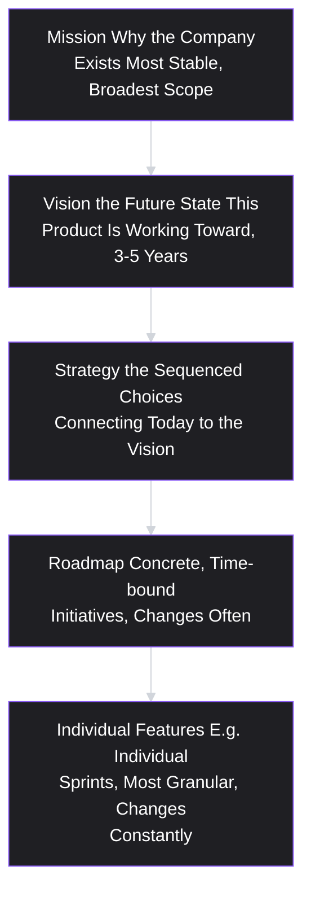
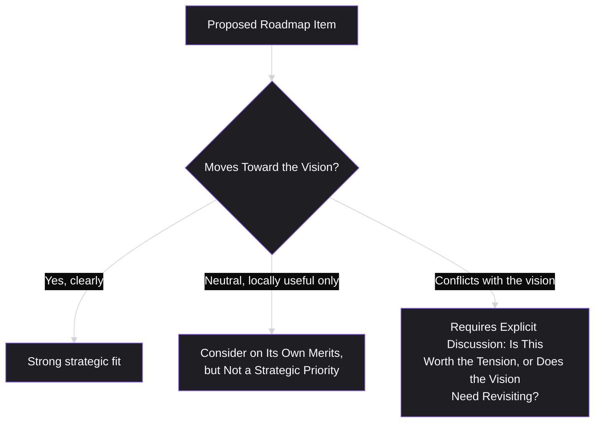
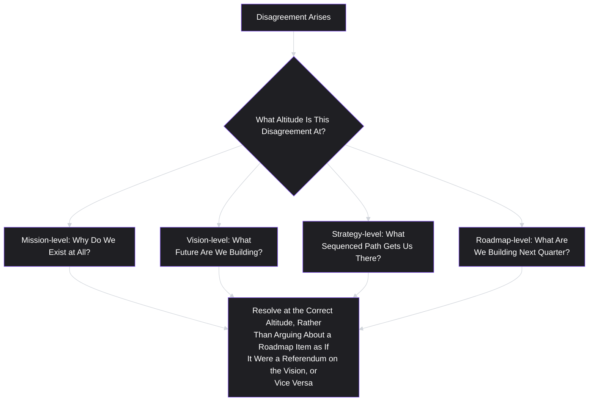

# Lesson 9: Product Vision

## Why This Lesson Matters

Every lesson so far has operated at the level of a single decision: is this the right audience (Lesson 5)? What's the real job (Lesson 6)? What's our differentiated value (Lesson 7)? Is this specific assumption worth testing before we build (Lesson 8)? These are all, in a sense, tactical questions — they help you make one good decision at a time. This lesson asks a different kind of question, at a different altitude entirely: where is this product trying to go, over the next several years, and why should anyone — engineers, leadership, users — care enough to follow it there?

A **product vision** is a clear, compelling description of the future state a product is working toward — typically a three-to-five-year horizon — independent of the specific features or roadmap items that will get it there. It answers "why does this product exist, and what would the world look like if it fully succeeded?" rather than "what are we building next quarter?" A vision is deliberately more stable and more aspirational than a roadmap: roadmaps change constantly as discovery (Lesson 8) reveals new information, but a good vision should remain largely intact across many roadmap iterations, because it operates one level of abstraction above any single tactical decision.

This lesson matters because a team without an articulated vision tends to drift: every quarter's roadmap gets decided in relative isolation, prioritization arguments have no stable reference point above the immediate metric in front of everyone, and the product can end up as a collection of individually reasonable features that don't add up to anything coherent — a symptom closely related to the "trying to be everything to everyone" failure from Lesson 7, but operating at a longer time horizon. A strong vision, by contrast, gives every subsequent roadmap decision a directional test: does this move us toward the future we said we were building, or is it merely locally convenient?

---

## Learning Path

| Field | Detail |
|---|---|
| **Module** | 1 — Foundations |
| **Current Lesson** | 9 of 90 |
| **Difficulty** | 3 / 10 |
| **Estimated Study Time** | 25 minutes (reading) + 15 minutes (reflection + quiz) |
| **Prerequisites** | Lesson 7 (Value Proposition), Lesson 8 (Product Discovery) |
| **Next Lesson** | Lesson 10 — Product Strategy Basics |
| **Future Topics Unlocked** | Lesson 10 (Product Strategy Basics — the bridge between vision and near-term execution), Module 2 (User & Research lessons, which operationalize discovering what a vision should actually contain) |

---

## Learning Objectives

By the end of this lesson, you will be able to:

1. Define product vision and distinguish it from a mission statement, a value proposition, a strategy, and a roadmap.
2. Explain why a vision should be stable across time while a roadmap changes frequently, and identify the risks of confusing the two.
3. Apply a basic test for evaluating whether a written vision statement is genuinely useful (specific, falsifiable-in-direction, motivating) versus decorative.
4. Identify the "vision without strategy" failure pattern and explain why an inspiring vision alone does not constitute a plan.
5. Use a vision as a filter for evaluating whether a proposed roadmap item is aligned with, neutral to, or in tension with the product's long-term direction.

---

## Prerequisites

Lesson 7 (Value Proposition) and Lesson 8 (Product Discovery). This lesson assumes you can write a specific, falsifiable value proposition and understand that discovery is what reveals whether a given path toward a vision is actually working — vision sets the direction; discovery tells you, iteratively, whether you're actually making progress along it.

---

## Theory

### The Core Definition and Its Neighbors

A product vision describes the future state a product is working toward, typically expressed as a durable narrative rather than a specific list of features: what changes in the world, or in a user's life, if this product fully succeeds? It is useful to precisely distinguish vision from four closely related, frequently confused concepts:

- **Mission statement**: a company-level statement of purpose ("why we exist"), often broader than any single product and more stable even than a vision.
- **Value proposition** (Lesson 7): a specific, comparative claim about why a named audience should choose this product over a named alternative, right now.
- **Product strategy** (Lesson 10): the specific, sequenced set of choices — which markets, which capabilities, in what order — that connects the current state of the product to the vision.
- **Roadmap**: the concrete, time-bound list of initiatives currently planned or in progress, which should serve the strategy, which should serve the vision.

Each layer should exist in service of the layer above it. A common and costly failure is treating these layers as interchangeable — writing a "vision" that is really just a longer list of near-term features, or worse, having no vision at all and mistaking the current roadmap for the product's actual direction.

### Why Vision Must Be Stable While Roadmap Changes Constantly

A vision operates at a level of abstraction meant to survive contact with new information from discovery (Lesson 8). If a single failed experiment or a single quarter's disappointing metric requires rewriting the vision itself, the vision was almost certainly written at the wrong altitude — too close to a specific tactical bet, rather than describing a genuinely durable future state.

This distinction has direct practical consequences. A team that conflates vision and roadmap tends to treat any roadmap change as an existential crisis of direction ("we're pivoting again!"), when in fact healthy products change roadmaps constantly and should, because discovery is supposed to keep revealing new information that reshapes near-term plans. What should *not* change nearly as often is the underlying answer to "what future are we building toward, and why does that matter?" A vision that survives many roadmap iterations, largely unchanged, is doing its job; a vision that needs rewriting every quarter was never really a vision.

### What Makes a Vision Statement Actually Useful

A written vision statement can range from genuinely useful to purely decorative, and the difference comes down to three tests:

- **Specific**: does it describe a particular future state, or could it apply equally to any product in any category? ("We will fundamentally change how people manage money" is specific to a domain; "We will make the world a better place" is not.)
- **Directionally falsifiable**: is it possible, in principle, to look at the current state of the world and say whether the company is moving toward or away from this vision? A vision that can never be judged as "off track" gives no real signal about anything.
- **Motivating**: does it give people — particularly engineers and designers doing detailed, often unglamorous work — a genuine reason to care about the outcome, beyond the immediate task in front of them?

A vision statement that fails the specificity test tends to converge on generic, interchangeable language ("empowering people," "delighting customers," "changing the world") that could be printed on the wall of almost any company in almost any industry, and that provides no actual filter for any subsequent decision — echoing the "for everyone" failure from Lesson 7, but at the level of long-term direction rather than audience.

### Vision Without Strategy Is Not a Plan

A frequently underappreciated failure mode is the **inspiring-but-empty vision**: a genuinely well-written, motivating description of a future state, with no accompanying account of the sequenced, concrete choices that would actually get the product there. A vision answers "where are we going and why does it matter"; it deliberately does not answer "how, specifically, do we get there, and in what order" — that is the job of strategy (Lesson 10).

A team can have an excellent, well-communicated vision and still fail completely, if it never translates that vision into a coherent strategy — a sequenced set of near-term bets that plausibly compound toward the described future. Vision without strategy tends to produce two symptoms: either paralysis (everyone agrees on the destination but no one can agree on, or even articulate, a first move), or scattered, uncoordinated activity (many individually plausible initiatives launched in the vision's name, none of them sequenced in a way that actually builds toward it, echoing the same drift problem this lesson opened with, just camouflaged by the presence of an inspiring-sounding vision statement).

### Using Vision as a Roadmap Filter

Beyond its motivational role, a vision's most concrete practical use is as a **filter for evaluating proposed roadmap items** — similar in spirit to the Value Proposition Filter from Lesson 7, but operating at a longer time horizon. Given any proposed initiative, a PM can ask:

1. Does this initiative move the product meaningfully closer to the described future state?
2. Is this initiative neutral to the vision — locally useful, but not particularly connected to where the product is ultimately going?
3. Does this initiative actively pull the product in a direction that conflicts with the vision — solving a real, immediate problem in a way that would make the described future state harder, not easier, to reach?

Notice the third branch does not automatically mean "reject the initiative" — sometimes a genuinely necessary near-term move (a large customer's urgent request, a competitive response) is worth doing even in some tension with the long-term vision, exactly as Lesson 5's Stakeholder Ledger argued divergence should be handled with an explicit, deliberate trade-off rather than either automatic acceptance or automatic rejection. What this filter prevents is the far more common failure: making that trade-off *silently*, without ever noticing that a locally reasonable decision is quietly working against the very future the team claims to be building.

---

## Common Beginner Mistakes

**Mistake 1: Writing a vision that is really just an ambitious feature list.**
"Our vision is to add AI-powered recommendations, a mobile app, and enterprise SSO" describes a set of features, not a future state — it fails the specificity-about-outcome test, describing means rather than the end they're meant to serve.

**Mistake 2: Writing a vision so generic it could belong to any company.**
"We will empower people to achieve their goals" could be printed on the wall of a fitness app, a productivity tool, a bank, or a shoe company. This fails the specificity test and provides no real filter for any decision.

**Mistake 3: Treating every roadmap change as a sign the vision has failed.**
Roadmaps should change frequently as discovery reveals new information; conflating this healthy, expected iteration with a failure of vision produces unnecessary anxiety and can pressure teams to stick rigidly to a plan that discovery has already shown to be wrong, purely to preserve an illusion of unwavering direction.

**Mistake 4: Assuming a well-communicated, inspiring vision is itself a strategy.**
As covered above, a vision describes a destination; it says nothing about the sequenced path to get there. Teams that stop at an inspiring vision statement, without doing the harder work of Lesson 10's strategic sequencing, often experience either paralysis or scattered, uncoordinated activity.

**Mistake 5: Never revisiting the vision at all, even when the market fundamentally changes.**
While a vision should be more stable than a roadmap, "stable" does not mean "permanent regardless of evidence." A genuinely disruptive market shift, a fundamental new discovery about the underlying job (Lesson 6), or a repeatedly failed strategy despite good execution can be legitimate signals that the vision itself, not just the roadmap, needs to be reconsidered — treating vision as entirely beyond question can be just as damaging as changing it too casually.

---

## Mental Model: The Altitude Ladder

This lesson's mental model is the **Altitude Ladder** — the same layered diagram introduced in Theory, used as a standing discipline for diagnosing confusion whenever a team disagreement seems to be about "strategy" or "vision" but is actually happening at mismatched altitudes.

A large share of unproductive product debates trace back to two people arguing about different altitudes without realizing it — one person defending a specific feature decision (roadmap-altitude) while the other is actually raising a concern about long-term direction (vision-altitude). Naming the altitude explicitly, before continuing the debate, is often enough to reveal that both people may be right at their respective altitudes, and that the real conversation needed is about how the two connect, not about who is correct.

---

## Real Company Example

**Amazon** offers a widely cited illustration of a long-stable vision operating above a constantly changing roadmap. Amazon's leadership has, over many years and in various public communications (including shareholder letters), articulated a consistent, durable vision organized around being the most customer-centric company in the world — offering the broadest selection, the lowest prices, and the fastest, most convenient delivery. Notably, this vision itself has remained recognizable across a period in which Amazon's actual roadmap and product portfolio changed dramatically — from an online bookstore, to a general marketplace, to cloud infrastructure (AWS), to hardware devices, to logistics and delivery infrastructure. Each of these represents an enormous roadmap and even strategic shift, yet each has been publicly framed by company leadership as serving the same underlying, comparatively stable vision around customer-centricity and convenience, rather than each representing a new, unrelated vision invented from scratch.

*(Assumption flagged: this reflects publicly stated, long-running company communications rather than a claim about Amazon's complete internal strategic reasoning, which this curriculum does not claim certainty about.)*

---

## Real World Perspective: Vision at Different Company Stages

**At a startup:**
A vision is often still being actively discovered and refined alongside the product itself, and founders frequently articulate it more through action and early product decisions than through a single, polished written statement. The primary risk at this stage is usually not "vision without strategy" but the opposite — moving fast tactically (following whatever discovery reveals quarter to quarter) without ever pausing to articulate a stable direction at all, which can make it hard to attract long-term-committed team members or investors who need a "why" beyond the current feature list.

**At a mid-size company:**
Vision often needs deliberate, explicit articulation and communication precisely because the organization has grown large enough that not everyone was present for its informal, founder-driven origins. This is frequently where the vision gets written down formally for the first time, and where the Altitude Ladder becomes most useful as new hires and existing team members work out how their specific roadmap work connects to a broader direction they may not have internalized firsthand.

**At Big Tech:**
Vision often needs to operate at multiple nested levels simultaneously — an overall company vision, and more specific visions for individual product lines or business units within it, each needing to remain coherent with the level above it. Much of senior product leadership's strategic work at this scale involves ensuring these nested visions don't quietly drift apart or contradict one another as different parts of a large organization pursue their own roadmaps somewhat independently.

---

## Detailed Case Study: The Vision That Never Became a Strategy

Consider a simplified, illustrative scenario common across mid-size B2B software companies.

A project management software company's leadership crafts a genuinely compelling vision statement: "We believe the future of work is asynchronous — teams making meaningful progress without needing to be online, in a meeting, or even awake at the same time. We are building the definitive platform for asynchronous team collaboration." The vision is well-received internally, referenced enthusiastically in all-hands meetings, and printed prominently on the company's careers page.

Over the following year, however, the product roadmap continues largely unchanged from the company's prior direction: incremental improvements to real-time collaborative editing, faster live notifications, and a new "who's online now" presence indicator — all features that, if anything, reinforce synchronous, real-time collaboration rather than reducing dependence on it. When a new product manager, unfamiliar with the company's history, asks in a planning meeting how the "who's online now" feature connects to the asynchronous-work vision, no one in the room has a ready answer.

**What went wrong?**

Applying this lesson's frameworks:

1. **The vision was genuinely well-written** — it passes the specificity test (a particular claim about the future of work, not a generic aspiration) and the directional-falsifiability test (one could plausibly assess whether a given feature moves the company toward or away from reduced real-time dependence).
2. **No strategy connected the vision to the roadmap.** The company never did the sequenced work (previewed in Lesson 10) of translating "asynchronous work" into a specific, ordered set of near-term bets — for example, prioritizing async-friendly features like structured written updates, decision logs, or notification-batching over real-time presence indicators.
3. **The Vision Filter was never applied to roadmap decisions.** Each individual feature (faster notifications, live presence indicators) was locally reasonable — customers did ask for them, and they were not inherently bad ideas — but no one ever explicitly asked whether they moved toward, were neutral to, or actively worked against the stated vision, and in this case, at least the presence indicator plausibly worked against it, by reinforcing exactly the "must be online now" dynamic the vision claimed to be moving away from.

A team applying the Vision Filter consistently would likely have caught this tension well before a confused new hire had to ask about it in a planning meeting — not necessarily by rejecting every real-time feature outright, but by making the trade-off explicit: is this specific real-time feature worth building despite working against our stated direction, or does it suggest the vision itself needs updating, since customer demand keeps pulling us toward synchronous collaboration?

This case will be revisited in **Lesson 10 (Product Strategy Basics)**, where we formalize exactly the missing step in this case study: the sequenced, concrete path connecting a stated vision to today's roadmap decisions.

---

## Framework Explanation: The Vision Test Checklist

A practical, reusable checklist for evaluating any draft vision statement, synthesizing the three tests introduced in Theory:

| Test | Question to Ask | Fails If... |
|---|---|---|
| **Specificity** | Could this statement describe almost any company in almost any industry? | The statement is interchangeable across unrelated companies |
| **Directional Falsifiability** | Could you point to a real decision or market change and say "that moves us toward, or away from, this vision"? | No conceivable evidence could ever be described as being "off track" from the vision |
| **Motivating Power** | Would this genuinely give someone doing detailed, unglamorous work a reason to care about the outcome? | The statement reads as corporate language no one would repeat unprompted |

A vision statement that passes all three tests is not automatically correct — it can still describe the wrong future, or a future the market doesn't actually want, which is a separate, deeper strategic question. But a vision statement that fails any of these three tests is not yet doing its job structurally, regardless of whether the underlying direction it gestures toward is sound.

---

## Interview Perspective: How Interviewers Think About This

**Typical question 1: "What's the difference between a product vision and a product roadmap?"**
*What the interviewer is actually evaluating:* Basic fluency with the Altitude Ladder — whether the candidate can clearly distinguish a durable future-state description from a concrete, frequently changing set of near-term initiatives, and can explain why conflating the two causes real problems (roadmap volatility being mistaken for a crisis of direction, or a static vision being mistaken for a complete plan).

**Typical question 2: "Describe a product vision you've worked toward. How did you know whether a given feature was aligned with it?"**
*What the interviewer is actually evaluating:* Whether the candidate has actually used a vision as a practical filter (per the Vision Filter framework) rather than treating it as a decorative statement disconnected from real prioritization decisions. A strong answer names a specific instance where a proposed feature was evaluated against the vision and a real decision followed from that evaluation — including, ideally, an instance where something locally popular was deprioritized or reconsidered because of a vision-level tension.

**Typical question 3: "How do you know when it's time to revisit or change a product's vision, rather than just its roadmap?"**
*What the interviewer is actually evaluating:* Whether the candidate understands the deliberate asymmetry this lesson describes — vision should be far more stable than roadmap, but not permanently beyond question. A strong answer names specific, legitimate triggers (a fundamental market shift, repeated strategic failure despite good execution, a fundamentally revised understanding of the underlying job) rather than either extreme: treating the vision as sacred and unchangeable, or revising it reactively every time a quarter goes poorly.

---

## Summary

A product vision describes the future state a product is working toward, typically over a three-to-five-year horizon, and sits at a distinct altitude from a company mission (broader, more stable), a value proposition (a specific, comparative, present-tense claim), a strategy (the sequenced path connecting today to the vision), and a roadmap (concrete, frequently changing near-term initiatives). A vision should remain largely stable across many roadmap iterations, since roadmaps are expected to change constantly as discovery reveals new information — a vision needing rewriting every quarter was likely written at the wrong altitude. A genuinely useful vision statement passes three tests: it is specific rather than generic, directionally falsifiable rather than unfalsifiable, and motivating rather than merely decorative. A well-written, inspiring vision is not itself a strategy — without a sequenced plan connecting today's decisions to the described future, teams risk either paralysis or scattered, locally reasonable but uncoordinated activity, as shown in this lesson's Detailed Case Study. Finally, a vision's most practical use is as a filter for evaluating whether proposed roadmap items move toward, are neutral to, or actively conflict with the long-term direction — with conflict requiring an explicit, deliberate trade-off discussion, not automatic rejection or silent acceptance.

---

## Key Takeaways

- A product vision describes a durable future state (typically 3–5 years out); it is distinct from mission (broader, company-level), value proposition (specific and present-tense), strategy (the sequenced path), and roadmap (concrete near-term plans).
- A vision should remain stable across many roadmap changes; roadmaps are expected to change frequently as discovery reveals new information, and this is healthy, not a sign the vision has failed.
- A genuinely useful vision statement is specific, directionally falsifiable, and motivating — generic, unfalsifiable, or purely decorative language fails to serve as a real filter for anything.
- A vision is not a strategy: an inspiring, well-communicated vision with no sequenced plan connecting it to today's decisions produces paralysis or scattered, uncoordinated activity.
- The Vision Filter (does a proposed initiative move toward, sit neutral to, or conflict with the vision) is a practical prioritization tool, and conflicts should prompt explicit discussion, not silent acceptance or automatic rejection.
- Vision should be more stable than roadmap, but is not beyond question forever — a genuine market shift, a fundamentally revised understanding of the underlying job, or repeated strategic failure despite good execution can be legitimate reasons to revisit it.
- The Altitude Ladder is a useful diagnostic whenever a disagreement seems to be about "direction" but is actually happening at mismatched levels (mission, vision, strategy, or roadmap).

---

## Cheat Sheet

*A two-minute review of everything in this lesson.*

- **Vision:** the future state a product is working toward (3–5 years); distinct from mission, value proposition, strategy, and roadmap.
- **Altitude Ladder:** Mission → Vision → Strategy → Roadmap → Features, each in service of the layer above.
- **Vision stays stable; roadmap changes constantly** — conflating the two causes unnecessary anxiety or false confidence.
- **Vision Test Checklist:** specific (not generic), directionally falsifiable (not unfalsifiable), motivating (not decorative).
- **Vision ≠ strategy.** An inspiring vision with no sequenced plan produces paralysis or scattered activity.
- **Vision Filter:** does a proposed roadmap item move toward, sit neutral to, or conflict with the vision? Conflict requires explicit discussion, not silence.
- **Vision can be revisited** — but only for real reasons (market shift, revised job understanding, repeated strategic failure), not every rough quarter.

---

## Glossary

| Term | Definition | Related Concepts | Difficulty |
|---|---|---|---|
| Product Vision | A clear, durable description of the future state a product is working toward, typically over a 3–5 year horizon. | Mission, Strategy, Roadmap | 2 |
| Altitude Ladder | A layered model (Mission → Vision → Strategy → Roadmap → Features) used to diagnose which level a discussion or disagreement is actually happening at. | Product Vision | 2 |
| Vision Test Checklist | A three-part test (specificity, directional falsifiability, motivating power) for evaluating whether a vision statement is genuinely useful. | Product Vision | 2 |
| Vision Without Strategy | The failure pattern of having a compelling, well-communicated vision with no sequenced plan connecting it to near-term decisions. | Product Strategy (Lesson 10) | 3 |
| Vision Filter | A technique for evaluating whether a proposed roadmap item moves toward, is neutral to, or conflicts with a product's stated vision. | Value Proposition Filter (Lesson 7) | 2 |

---

## Further Reading / Resources

- Marty Cagan, *Inspired: How to Create Tech Products Customers Love* — discusses product vision as a distinct artifact from strategy and roadmap, and its role in aligning autonomous product teams around a shared long-term direction.
- Roman Pichler, *Strategize: Product Strategy and Product Roadmap Practices for the Digital Age* — a detailed treatment of the vision-to-strategy-to-roadmap chain referenced in this lesson's Altitude Ladder.
- Public shareholder letters and long-form interviews from durable, long-lived technology companies (e.g., Amazon's shareholder letters) — useful primary material for observing a stable vision persisting across dramatic roadmap and strategic change over many years.

---

## Flashcards

**Card 1**
- Front: What is a product vision?
- Back: A clear, durable description of the future state a product is working toward, typically over a 3–5 year horizon — distinct from mission, value proposition, strategy, and roadmap.
- Difficulty: 1
- Tags: vision, fundamentals

**Card 2**
- Front: Name the layers of the Altitude Ladder, from broadest/most stable to most granular/frequently changing.
- Back: Mission → Vision → Strategy → Roadmap → Individual Features.
- Difficulty: 2
- Tags: altitude-ladder

**Card 3**
- Front: Why should a vision remain stable while a roadmap changes frequently?
- Back: Roadmaps are expected to change constantly as discovery reveals new information; a vision needing rewriting every quarter was likely written at the wrong altitude — too close to a specific tactical bet rather than a durable future state.
- Difficulty: 2
- Tags: vision-stability

**Card 4**
- Front: What are the three tests for whether a vision statement is genuinely useful?
- Back: Specificity (not generic/interchangeable), directional falsifiability (evidence could show progress or regression), and motivating power (gives people a real reason to care).
- Difficulty: 2
- Tags: vision-test-checklist

**Card 5**
- Front: Why isn't an inspiring vision statement itself a strategy?
- Back: A vision describes a destination; it doesn't describe the sequenced, concrete path to get there. Without that path, teams risk paralysis or scattered, uncoordinated activity.
- Difficulty: 3
- Tags: vision-without-strategy

**Card 6**
- Front: What are the three possible outcomes when applying the Vision Filter to a proposed roadmap item?
- Back: It moves clearly toward the vision (strong fit), it's neutral (locally useful but not strategically connected), or it conflicts with the vision (requires explicit discussion, not automatic rejection or silent acceptance).
- Difficulty: 2
- Tags: vision-filter

**Card 7**
- Front: What are legitimate reasons to revisit a product vision, according to this lesson?
- Back: A genuine market shift, a fundamentally revised understanding of the underlying job, or repeated strategic failure despite good execution — not simply one rough quarter or a single failed experiment.
- Difficulty: 3
- Tags: revisiting-vision

---

## Reflection Exercise

You are the PM for a small business accounting tool whose stated vision is: "We believe small business owners should spend their time running their business, not doing their books — we are building toward a future where bookkeeping requires zero manual data entry."

Your team is currently debating two proposed roadmap items for next quarter: (1) a highly requested manual bulk-editing tool that lets users quickly correct large batches of transactions by hand, and (2) an automated bank-transaction categorization engine that requires significant upfront engineering investment and will initially only handle 60% of transaction types correctly.

Work through the following, in writing, before reading further:

1. Using the Vision Test Checklist, briefly evaluate whether this company's stated vision passes all three tests.
2. Apply the Vision Filter to each of the two proposed roadmap items. Does each move toward, sit neutral to, or conflict with the stated vision?
3. If the manual bulk-editing tool is genuinely the more commercially urgent request (perhaps a large customer has threatened to churn without it), how would you frame the trade-off explicitly to your team, rather than silently choosing one or the other?
4. Referencing the Detailed Case Study, what specific new-hire question might arise in six months if the bulk-editing tool is built now without an explicit connection to the automation vision?
5. Propose one middle path (if one exists) that might partially serve the urgent near-term need while still visibly moving toward the long-term vision.

There is no single correct answer. The purpose of this exercise is to practice applying the Vision Filter to a real trade-off between an urgent, locally reasonable request and a stated long-term direction, rather than resolving the tension by default or by whichever argument is loudest in the room.

---

## Quiz

**1. Which of the following best defines a product vision?**
A) A list of features planned for the next quarter
B) A clear, durable description of the future state a product is working toward, typically over a multi-year horizon
C) A company's overall statement of purpose, covering all of its products
D) A specific, present-tense comparative claim about why customers should choose a product over a competitor

*Correct answer: B*
*Explanation: A product vision describes a durable future state, distinct from a roadmap (near-term feature list), a mission (company-wide purpose), and a value proposition (a present-tense comparative claim).*
*Learning objective tested: #1*
*Difficulty: Easy*

---

**2. Why does this lesson argue that a vision should remain more stable than a roadmap?**
A) Because roadmaps are unimportant and rarely need to change
B) Because roadmaps are expected to change frequently as discovery reveals new information, while a vision operating at a higher altitude should generally survive many such iterations
C) Because visions cannot legally be changed once published
D) Because roadmaps and visions should always be identical documents

*Correct answer: B*
*Explanation: The lesson explains that healthy products change roadmaps constantly in response to new discovery findings, while a genuinely well-written vision should remain largely intact across many such iterations.*
*Learning objective tested: #2*
*Difficulty: Easy*

---

**3. Which of the following vision statements would most likely FAIL the specificity test described in this lesson?**
A) "We believe the future of work is asynchronous, and we are building the definitive platform for asynchronous team collaboration."
B) "We will empower people to achieve their goals."
C) "We believe small business owners should spend their time running their business, not doing their books."
D) "We are building toward a future of customer-centric commerce with the broadest selection and fastest delivery."

*Correct answer: B*
*Explanation: "We will empower people to achieve their goals" is generic enough to apply to almost any company in almost any industry, failing the specificity test, unlike the other options, which describe particular, industry-specific future states.*
*Learning objective tested: #3*
*Difficulty: Easy*

---

**4. What does "directional falsifiability" mean in the context of evaluating a vision statement?**
A) The vision must be provably true at the moment it is written
B) It must be possible, in principle, to point to evidence and say whether the company is moving toward or away from the stated future state
C) The vision must be re-written every time new evidence emerges
D) The vision must include specific, measurable financial targets

*Correct answer: B*
*Explanation: Directional falsifiability means a vision gives enough specificity that real decisions or market changes could plausibly be assessed as moving toward or away from it — not that the vision itself must currently be a proven fact.*
*Learning objective tested: #3*
*Difficulty: Easy*

---

**5. According to this lesson, why is a well-written, inspiring vision statement not itself a strategy?**
A) Because visions are always poorly written
B) Because a vision describes a destination, while strategy describes the sequenced, concrete path connecting today's decisions to that destination
C) Because strategy and vision are the same concept under different names
D) Because visions should never be communicated to the broader team

*Correct answer: B*
*Explanation: The lesson explicitly distinguishes vision (the destination) from strategy (the sequenced path to get there), and warns that having one without the other produces paralysis or scattered activity.*
*Learning objective tested: #4*
*Difficulty: Easy*

---

**6. In the Detailed Case Study, what was the core missing element between the company's vision and its actual roadmap?**
A) The vision was not specific enough to be useful
B) A sequenced strategy connecting the asynchronous-work vision to concrete near-term roadmap priorities was never developed, and the Vision Filter was never applied to roadmap decisions
C) The company had no product vision at all
D) The roadmap perfectly matched the vision, but employees were simply unaware of it

*Correct answer: B*
*Explanation: The case study explicitly attributes the disconnect to a missing strategy layer and the absence of an explicit Vision Filter check on roadmap decisions, not to the vision itself being poorly written or entirely absent.*
*Learning objective tested: #4, #5*
*Difficulty: Easy*

---

**7. Which specific feature in the Detailed Case Study most directly conflicted with the company's stated asynchronous-work vision?**
A) Structured written status updates
B) A "who's online now" live presence indicator
C) Notification batching
D) Decision logs

*Correct answer: B*
*Explanation: A live "who's online now" presence indicator reinforces real-time, synchronous collaboration dynamics, working against a vision centered on reducing dependence on being online at the same time as teammates.*
*Learning objective tested: #5*
*Difficulty: Medium*

---

**8. According to the Vision Filter, what should happen when a proposed roadmap item conflicts with the stated vision?**
A) The item should always be rejected immediately, with no further discussion
B) The item should always be approved, since customer requests take precedence over vision
C) The conflict should prompt explicit discussion — the item might still be worth doing despite the tension, or it might signal the vision itself needs revisiting, but the trade-off should not be made silently
D) The vision should be deleted and replaced immediately

*Correct answer: C*
*Explanation: The lesson explicitly states that a conflict with the vision does not mean automatic rejection; it means the trade-off must be made deliberately and explicitly, rather than silently accepted or rejected by default.*
*Learning objective tested: #5*
*Difficulty: Medium*

---

**9. (Scenario) A company's roadmap changes substantially every quarter based on new discovery findings, but its stated vision has remained essentially unchanged for two years. According to this lesson, is this a sign of a problem?**
A) Yes — a vision unchanged for two years always signals stagnation
B) No — this is the expected, healthy pattern; roadmaps should change frequently while a genuinely well-written vision remains stable across many such iterations
C) Yes — vision and roadmap should always change together at the same rate
D) It cannot be determined without knowing the company's specific industry

*Correct answer: B*
*Explanation: This is precisely the pattern the lesson describes as healthy — frequent roadmap iteration alongside long-term vision stability, rather than a warning sign.*
*Learning objective tested: #2*
*Difficulty: Medium-Hard*

---

**10. (Product Thinking) A team's vision statement is so broad it could describe almost any company in its industry, yet the team insists it is useful because "everyone likes it." According to this lesson, what is the most accurate assessment?**
A) The vision is functioning well, since broad appeal is the primary goal of a vision statement
B) The vision likely fails the specificity test, and broad, generic appeal is itself evidence of the problem, since it suggests the statement provides no real filter for any decision
C) The vision cannot be evaluated without financial data
D) All vision statements should aim for the broadest possible appeal to maximize motivation

*Correct answer: B*
*Explanation: The lesson explicitly frames generic, universally appealing language as a failure of the specificity test, precisely because such language could apply to any company and therefore filters nothing.*
*Learning objective tested: #3*
*Difficulty: Medium-Hard*

---

**11. (Interview Reasoning) A candidate is asked to describe a product vision they worked toward, and their answer focuses entirely on how inspiring and well-received the statement was internally, without describing any instance where it actually changed a prioritization decision. What does this most likely signal, based on this lesson's Interview Perspective section?**
A) Strong vision-setting skills, since internal reception is the primary measure of a good vision
B) A possible sign the vision was treated as decorative rather than as a practical filter actually used in real decisions
C) That the candidate is unqualified for any product role
D) Nothing meaningful, since visions are not typically discussed in interviews

*Correct answer: B*
*Explanation: The lesson's Interview Perspective explicitly looks for evidence that a vision was used as a practical filter in real prioritization decisions, not just well-received as an internal communication artifact.*
*Learning objective tested: #5*
*Difficulty: Hard*

---

**12. (Product Thinking, Higher Difficulty) A company's market undergoes a fundamental shift — a new regulation makes its core product's approach illegal in its primary market. According to this lesson, what is the most appropriate response regarding the company's vision?**
A) The vision should never be changed under any circumstances, regardless of market shifts
B) This qualifies as one of the legitimate triggers described in this lesson for revisiting the vision itself, not just the roadmap
C) Only the roadmap should change; visions are entirely independent of market conditions
D) The company should immediately abandon product management as a discipline

*Correct answer: B*
*Explanation: The lesson explicitly names a genuine, disruptive market shift as one of the legitimate reasons to revisit a vision, rather than simply adjusting the roadmap while leaving an now-outdated vision unexamined.*
*Learning objective tested: #2*
*Difficulty: Medium-Hard*

---

**13. (Interview Reasoning, Higher Difficulty) An interviewer describes a scenario where a team has an excellent, specific, motivating vision, but has never translated it into any sequenced set of near-term priorities, resulting in scattered, uncoordinated feature work. What is this scenario a direct example of?**
A) Discovery theater (Lesson 8)
B) The "vision without strategy" failure pattern described in this lesson
C) A well-functioning Vision Filter
D) The Value Proposition Filter (Lesson 7) working correctly

*Correct answer: B*
*Explanation: This is the exact failure pattern this lesson names directly — a compelling vision with no accompanying sequenced strategy, producing scattered, uncoordinated activity.*
*Learning objective tested: #4*
*Difficulty: Hard*

---

**14. (Product Thinking, Higher Difficulty) A new PM proposes rejecting any roadmap item that isn't in perfect, unambiguous alignment with the company's long-term vision, including urgent, commercially necessary near-term requests. According to this lesson, is this the correct application of the Vision Filter?**
A) Yes — the Vision Filter requires automatic rejection of anything not in perfect alignment
B) No — the Vision Filter is meant to surface tension for explicit, deliberate discussion, not to mandate automatic rejection of every item in tension with the vision
C) Yes, but only for B2B products
D) The Vision Filter does not apply to urgent or commercially necessary requests at all

*Correct answer: B*
*Explanation: The lesson explicitly states that items in tension with the vision may still be worth doing, and that the Filter's purpose is to make such trade-offs explicit, not to enforce automatic rejection.*
*Learning objective tested: #5*
*Difficulty: Hard*

---

**15. (Highest Difficulty) Two team members are in an extended disagreement: one insists a specific quarterly roadmap decision "betrays the company's whole direction," while the other insists the roadmap decision is "just a normal tactical choice unrelated to any bigger picture." Using the Altitude Ladder, what is the most likely underlying issue in this disagreement, and what should happen next?**
A) One person is simply wrong and should be overruled immediately, without further discussion
B) The two people are likely arguing about the same decision at mismatched altitudes (one treating it as vision-level, the other as roadmap-level), and the productive next step is to explicitly name which altitude the decision actually belongs to, and whether it connects meaningfully to the vision or not
C) This kind of disagreement is impossible to resolve and should be escalated to company leadership immediately without further analysis
D) The roadmap decision should simply be cancelled to avoid the disagreement entirely

*Correct answer: B*
*Explanation: The Altitude Ladder is explicitly introduced as a diagnostic for exactly this kind of mismatched-altitude disagreement — naming the actual altitude in question is the productive first step, rather than assuming one side is simply correct or escalating without analysis.*
*Learning objective tested: #1, #5*
*Difficulty: Hard*

---

## Connections

| | Lesson | Core Idea Carried Forward |
|---|---|---|
| **Previous Lesson** | Lesson 8 — Product Discovery | Discovery is what reveals, iteratively, whether the current path toward the vision is actually working — vision sets the destination; discovery tests progress along the way |
| **Current Lesson** | Lesson 9 — Product Vision | The Altitude Ladder; the Vision Test Checklist; the Vision Filter; vision-without-strategy |
| **Next Lesson** | Lesson 10 — Product Strategy Basics | Directly resolves this lesson's central gap — the sequenced, concrete path connecting a stated vision to today's roadmap decisions |
| **Future Concepts Unlocked** | Module 2 (User & Research lessons) | Provides the research methods used to inform and periodically re-validate whether a stated vision still reflects genuine, current user and market reality |

This curriculum is designed to be read as one continuous argument. From this lesson forward, any reference to "strategy" or "roadmap" assumes a clear altitude distinction from vision has already been made — this will not be re-explained, only re-applied and connected in Lesson 10.
