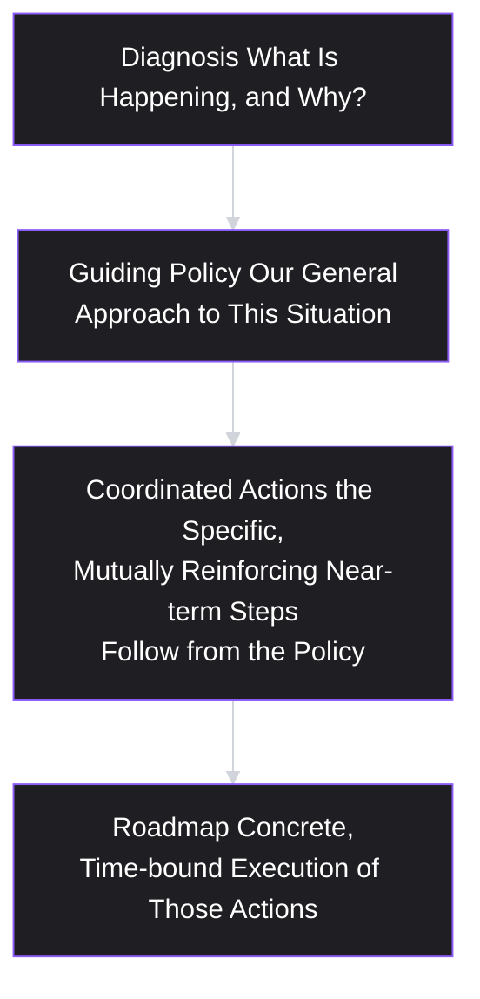
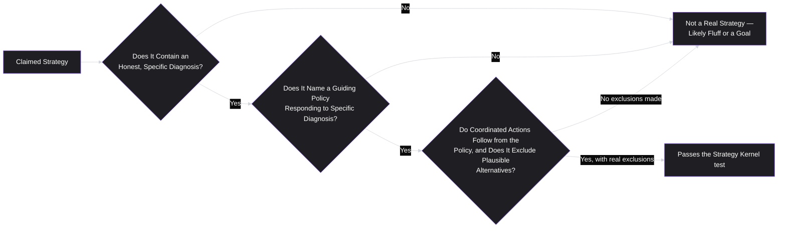

# Lesson 10: Product Strategy Basics

## Why This Lesson Matters

Lesson 9 ended with an unresolved gap: a project management company had a genuinely well-written vision — asynchronous work as the future — and a roadmap that quietly contradicted it, because nothing connected the two. This lesson exists to fill that exact gap. If a vision answers "where are we going and why does it matter," **product strategy** answers the much harder question: "given where we are right now, with our specific constraints, what is the smallest number of deliberate choices we can make, in what order, that plausibly gets us there — and just as importantly, what are we choosing *not* to do?"

Strategy is frequently confused with ambition, with a list of priorities, or with a roadmap dressed up in more formal language. This lesson treats strategy as something much narrower and more useful: **a coherent, evidence-based diagnosis of the situation, a guiding policy for responding to it, and a set of coordinated actions that follow from that policy** — a structure closely associated with strategy scholar Richard Rumelt's work, and one that stands in sharp contrast to what Rumelt calls "bad strategy": a restatement of goals, a list of priorities with no underlying logic connecting them, or motivational language mistaken for an actual plan.

This matters because most of the damage done by "strategy" in real product organizations comes not from having the wrong strategy, but from never having one at all — operating instead on an implicit assumption that ambition, hard work, and a good vision will somehow add up to a coherent path forward, without ever doing the harder, more uncomfortable work of explicitly ruling things out.

---

## Learning Path

| Field | Detail |
|---|---|
| **Module** | 1 — Foundations |
| **Current Lesson** | 10 of 90 |
| **Difficulty** | 4 / 10 |
| **Estimated Study Time** | 30 minutes (reading) + 15 minutes (reflection + quiz) |
| **Prerequisites** | Lesson 7 (Value Proposition), Lesson 9 (Product Vision) |
| **Next Lesson** | Lesson 11 — User Research (opens Module 2) |
| **Future Topics Unlocked** | Module 2 (User & Research — the methods used to gather the diagnosis a strategy is built on), Lesson 19 (Opportunity Identification), Lesson 29 (Prioritization Fundamentals — strategy as an input into scoring) |

---

## Learning Objectives

By the end of this lesson, you will be able to:

1. Define product strategy using the diagnosis–guiding policy–coordinated action structure, and distinguish it from a goal, a vision, and a roadmap.
2. Identify "bad strategy" patterns: fluff, failure to face the challenge, mistaking goals for strategy, and a grab-bag of disconnected objectives.
3. Explain why a real strategy necessarily excludes options, and why an unwillingness to exclude anything is itself a sign that no real strategy exists.
4. Apply a basic method for connecting a stated vision (Lesson 9) to a concrete near-term strategy through sequenced, evidence-based choices.
5. Distinguish a strategic choice from a tactical or operational one, and explain why conflating the two produces the "vision without strategy" failure from Lesson 9.

---

## Prerequisites

Lesson 7 (Value Proposition) and Lesson 9 (Product Vision). This lesson assumes fluency with the Altitude Ladder (Mission → Vision → Strategy → Roadmap → Features) and treats strategy as the specific, missing middle layer between a stated long-term direction and this quarter's concrete work.

---

## Theory

### The Core Definition: Diagnosis, Guiding Policy, Coordinated Action

A useful, precise definition of strategy, adapted from Richard Rumelt's influential formulation, breaks it into three necessary components:

- **Diagnosis**: a clear-eyed, evidence-based account of the actual situation — what's really happening, what's really constraining progress, and why. Not a wish list of what you'd like to be true, but an honest assessment of the current reality.
- **Guiding policy**: a general approach for dealing with the situation identified in the diagnosis — the overall logic that will govern subsequent decisions, without yet specifying every individual action.
- **Coordinated actions**: the specific, mutually reinforcing set of near-term steps that follow from, and are consistent with, the guiding policy.

Notice how this differs from simply stating an ambitious goal. "We will become the market leader in project management software" is a goal, not a strategy — it contains no diagnosis of why the company isn't currently the market leader, no guiding policy for how that gap will be closed, and no specific coordinated actions. A real strategy for the same ambition might read: "Our diagnosis is that enterprise buyers currently choose incumbents primarily on compliance and integration depth, not features, and our current product is feature-competitive but integration-weak (diagnosis). Our guiding policy is to win through a narrow, best-in-class integration ecosystem rather than competing broadly on feature count (guiding policy). Our coordinated actions this year are: build our top three requested integrations, deprioritize a planned but unvalidated new module, and reallocate that engineering capacity to an integrations team (coordinated actions)."

### Bad Strategy: The Patterns to Recognize

Rumelt's work identifies several recurring patterns of "bad strategy" that are worth naming explicitly, because they are common, superficially plausible, and easy to produce without realizing a real strategy was never actually developed:

- **Fluff**: language that sounds sophisticated or strategic but, on close inspection, states nothing concrete or falsifiable — restating a goal in more abstract vocabulary rather than actually diagnosing anything.
- **Failure to face the challenge**: a strategy document that never actually names the core obstacle standing in the way, often because naming it honestly would be uncomfortable (it might implicate a prior decision, a beloved product area, or a powerful stakeholder's pet project).
- **Mistaking goals for strategy**: stating an ambitious outcome ("increase market share by 20%") as if the statement itself constituted a plan for achieving it, with no diagnosis or guiding policy attached.
- **A grab-bag of disconnected objectives**: a list of priorities that may each be individually reasonable, but that don't reinforce or build on each other, and that could just as easily be reordered or partially abandoned without the overall plan changing in any coherent way — because there was never really a unifying logic connecting them in the first place.

A useful diagnostic test for any strategy document: **does it name a specific, honestly identified obstacle, and does it explain a specific logic for overcoming that particular obstacle** — or could the same document, with only the company's name changed, be handed to a direct competitor with an entirely different situation and still sound equally plausible? A real strategy should not be interchangeable across companies in fundamentally different situations; a fake one usually is.

### Why Real Strategy Necessarily Excludes Things

The single most reliable signal that a strategy is real, rather than decorative, is that **it says no to some genuinely plausible, individually reasonable options** — not because those options are bad in the abstract, but because pursuing them would dilute focus, resources, or coherence relative to the chosen guiding policy. This directly echoes Lesson 7's argument that a value proposition trying to serve "everyone" has made no real choice at all — strategy operates on the same underlying logic, at a broader scope.

A strategy that endorses every plausible initiative simultaneously — more features, more markets, more integrations, more platforms, all pursued at once, all described as "priorities" — has not actually made the hard trade-offs that define real strategic work. This is uncomfortable precisely because every individual excluded option usually has a genuine, articulable case in its favor; the discipline of strategy is choosing anyway, based on the diagnosis, rather than trying to avoid the discomfort of exclusion by pursuing everything at a diluted level of investment.

### Connecting Vision to Strategy: The Missing Middle Layer

Recall Lesson 9's Detailed Case Study: a company had a specific, well-written vision (a future of asynchronous work) and a roadmap that quietly worked against it, because no strategy connected the two. The practical method for closing this gap involves working backward from the vision through a specific sequence:

1. **Name the current gap.** What is the honest, evidence-based distance between where the product is today and the described future state? (This is the diagnosis.)
2. **Identify the two or three highest-leverage obstacles** actually standing in the way of closing that gap — not every possible obstacle, but the ones that, if resolved, would most unlock progress toward the vision.
3. **Choose a guiding policy** for addressing those specific obstacles — a general logic, not yet a full task list.
4. **Derive coordinated near-term actions** from that guiding policy, explicitly checking each one against the Vision Filter from Lesson 9 (does this action move toward the vision, sit neutral, or conflict with it?).
5. **Explicitly name what will NOT be pursued**, even if individually reasonable, because it doesn't follow from the chosen guiding policy.

Applied to the asynchronous-work case: the diagnosis might reveal that the biggest obstacle to the vision isn't a lack of async-specific features, but the fact that the product's core interaction model still assumes synchronous presence by default (the live "who's online now" indicator being a symptom, not a cause). The guiding policy might then be: "redesign core workflows to default to async-first patterns, rather than adding async features on top of a fundamentally synchronous core." Coordinated actions might include redesigning the update/notification model around structured async check-ins, and — critically — explicitly deprioritizing further investment in real-time presence and live-notification speed, even though these were individually popular with some customers, because they run counter to the chosen guiding policy.

---

## Common Beginner Mistakes

**Mistake 1: Presenting a goal as if it were a strategy**

"Our strategy is to double revenue this year" states an ambition with no diagnosis of the current obstacle and no guiding policy for overcoming it — it is a target, not a strategy, and stating it more forcefully or more often does not make it one.

**Mistake 2: Writing a strategy document full of fluff that could apply to any company**

Sophisticated-sounding language ("we will leverage synergies to drive customer-centric innovation") that states nothing falsifiable or specific to the actual situation is the clearest sign that real diagnostic work was skipped.

**Mistake 3: Refusing to exclude anything**

A "strategy" that endorses every plausible initiative as a simultaneous priority has not made a real choice, and functions more as a wish list than a plan — echoing Lesson 7's "for everyone" value proposition failure at a broader scope.

**Mistake 4: Confusing strategic choices with tactical or operational ones**

Deciding which specific bug to fix first this sprint is an operational decision; deciding which integration ecosystem to build a competitive moat around is strategic. Treating every decision as equally "strategic" dilutes the term and makes it harder to recognize when a genuinely consequential choice is actually being made.

**Mistake 5: Skipping the diagnosis and jumping straight to guiding policy**

A guiding policy chosen without an honest diagnosis of the actual obstacle tends to reflect whatever approach the team already prefers or is most comfortable with, rather than the approach that genuinely fits the situation — strategy built backward from a preferred solution, rather than forward from an honest read of reality.

---

## Mental Model: The Strategy Kernel

This lesson's mental model is the **Strategy Kernel** — the three-part diagnosis / guiding policy / coordinated action structure, used as a standing test for any document or statement that claims to be a "strategy."

Use the Strategy Kernel as a filter whenever a "strategy" is presented to you, including your own drafts: can you point to the specific diagnosis, the specific guiding policy responding to it, and at least one thing being explicitly excluded as a result? If any of these three pieces is missing, what you have is very likely a goal, a vision restated, or a list of priorities — not yet a strategy.

---

## Real Company Example

**Netflix**'s strategic shift from DVD-by-mail to streaming offers a widely discussed illustration of the diagnosis–policy–action structure in practice. According to extensively reported accounts of the company's history, Netflix's leadership diagnosed that physical DVD distribution, while still profitable at the time, faced a long-term structural obsolescence as internet bandwidth and streaming technology matured — an honest diagnosis that ran directly counter to the company's own then-current, successful core business. The guiding policy that followed was to invest heavily in streaming infrastructure and licensing even while the DVD business remained the primary revenue source, effectively choosing to cannibalize their own core product ahead of external competitors doing so instead. Coordinated actions included substantial content-licensing investment, and later original content production, executed in a sequence that supported the streaming transition specifically — and, notably, this required excluding or deprioritizing further heavy investment in optimizing the DVD-mail logistics business, even though that business still generated meaningful revenue during the transition period.

*(Assumption flagged: this reflects widely reported public accounts of Netflix's strategic history rather than a claim about the company's complete internal decision-making process, which this curriculum does not claim certainty about.)*

---

## Real World Perspective: Product Strategy Basics at Different Company Stages

**At a startup:**
Strategy is often concentrated almost entirely on a single, existential diagnosis: which specific segment and job (Lessons 5 and 6) represents the startup's best available path to a defensible position, given extremely limited resources — and, just as importantly, which adjacent, individually plausible markets or features the team will explicitly avoid pursuing in order to protect focus. The guiding policy at this stage is often close to "go deep and narrow before going broad," precisely because a startup rarely has the resources to pursue a grab-bag of disconnected objectives even if it wanted to.

**At a mid-size company:**
Strategy typically becomes more explicit and more frequently documented, since the organization has grown large enough that implicit, founder-held strategic logic no longer automatically propagates to every team. This is often where formal strategy documents (following something like the Strategy Kernel structure) are first introduced, precisely to prevent the drift described in Lesson 9's case study — different teams independently pursuing individually reasonable but strategically disconnected initiatives.

**At Big Tech:**
Strategy often needs to be coordinated across multiple product lines or business units simultaneously, and a significant part of senior strategic work involves ensuring that one unit's guiding policy doesn't quietly undermine another's — for example, one team's strategy of aggressive platform openness working against another team's strategy of tightly controlled ecosystem lock-in. At this scale, the exclusions a strategy requires often have organizational, not just product, consequences (specific teams being deliberately not funded, or explicitly wound down).

---

## Detailed Case Study: The Strategy That Never Said No

Consider a simplified, illustrative scenario common across growth-stage consumer technology companies.

A photo-sharing app's leadership, facing slowing user growth, commissions a strategy process to reverse the trend. After several weeks of workshops, the resulting strategy document lists five equally weighted "strategic priorities" for the year: expand into short-form video, launch a creator monetization program, improve core photo-editing tools, build a messaging feature to compete with a rival's recent launch, and pursue international expansion into two new markets.

Each priority, examined individually, has a reasonable justification — video is growing across the industry, creators are requesting monetization, editing tools are a known differentiator, the rival's messaging launch is a competitive threat, and international markets represent untapped growth. Engineering, however, has capacity for perhaps two of these five initiatives to be executed well within the year. Leadership, unwilling to explicitly deprioritize any of the five (each has a vocal internal advocate), instructs teams to make "the best progress possible" on all five simultaneously.

A year later, all five initiatives show only partial, underwhelming progress: the short-form video feature launched but with limited differentiation from established competitors: the creator monetization program signed up a small pilot group but was never scaled; editing tools received minor incremental updates; the messaging feature shipped roughly a year after the rival's, by which point the competitive threat had partially resolved on its own; and international expansion reached one of the two targeted markets, with limited localization investment.

**What went wrong?**

Applying the Strategy Kernel in hindsight:

1. **There was no real diagnosis.** The document never identified a specific, honest account of *why* growth was actually slowing — was it a saturated core market, a specific competitive gap, a churn problem, or a stalled acquisition funnel? Without this diagnosis, there was no way to determine which of the five initiatives, if any, actually addressed the real underlying obstacle.
2. **There was no guiding policy.** Five equally weighted priorities is a list, not a policy — nothing in the document explained a unifying logic for why these five, together, represented the best response to the (unstated) diagnosis, or how they reinforced each other.
3. **Nothing was excluded.** The unwillingness to say no to any of the five vocal internal advocates meant engineering capacity was spread thin across all five, guaranteeing that none would receive the sustained, coordinated investment needed to genuinely succeed — precisely the failure mode this lesson identifies as the clearest sign of a fake strategy.

A team applying the Strategy Kernel from the outset would have first done the uncomfortable diagnostic work of identifying the actual primary obstacle to growth, then chosen a guiding policy addressing that specific obstacle, and then — critically — explicitly told at least three of the five initiatives' advocates that their proposals, while individually reasonable, would not be pursued this year, because they did not follow from the chosen guiding policy. This would have concentrated capacity enough to genuinely execute two initiatives well, rather than five initiatives poorly.

This case connects directly back to **Lesson 9's Vision Filter**: an explicit vision, applied rigorously, would likely have flagged that several of these five priorities (video expansion, international expansion) had little clear connection to whatever the company's stated long-term vision actually was — but without a strategy layer translating vision into a specific diagnosis and guiding policy, the Vision Filter alone had no mechanism to force the necessary exclusions.

---

## Framework Explanation: The "Say No" Test

A simple, practical test for evaluating whether a strategy document is real: **ask what it explicitly excludes.**

| Question | Real Strategy | Bad Strategy (Fluff / Goal / Grab-Bag) |
|---|---|---|
| Does it name a specific, honest diagnosis of the actual obstacle? | Yes, often uncomfortably specific | Vague, generic, or absent entirely |
| Could the same document apply equally well to a competitor in a different situation? | No — it's specific to this diagnosis | Yes — the language is interchangeable |
| Does it explicitly name at least one plausible, individually reasonable option that will NOT be pursued? | Yes | No — everything is a "priority" |
| Do the coordinated actions reinforce each other, or could any be removed without affecting the others? | They reinforce each other; removing one weakens the whole | Each item stands alone; the list could be reordered or trimmed with no real consequence |

If a strategy document cannot name anything it is excluding, this is not evidence of unusual ambition or resourcefulness — per this lesson's core argument, it is the clearest available signal that no real strategic choice has actually been made.

---

## Interview Perspective: How Interviewers Think About This

**Typical question 1: "What's the difference between a goal and a strategy?"**
*What the interviewer is actually evaluating:* Whether the candidate can articulate the diagnosis–policy–action structure, or whether they conflate an ambitious target with an actual plan for achieving it. A strong answer names a specific example distinguishing a stated goal ("grow revenue 20%") from the actual strategic logic (diagnosis of the obstacle, guiding policy, coordinated actions) that would justify believing that goal is achievable.

**Typical question 2: "Tell me about a time you had to say no to a reasonable, popular idea for strategic reasons."**
*What the interviewer is actually evaluating:* Whether the candidate has real experience with the exclusion discipline this lesson emphasizes, or whether they default to describing a strategy where everything was pursued and nothing was declined. A strong answer names the specific idea excluded, the reasoning tied to a guiding policy, and — ideally — how the disagreement with the idea's advocates was handled.

**Typical question 3: "How would you diagnose why a product's growth has stalled?"**
*What the interviewer is actually evaluating:* Whether the candidate treats diagnosis as a genuine, evidence-based investigation (examining funnel data, churn, competitive dynamics, market saturation) or jumps immediately to proposing solutions without first doing the diagnostic work — directly echoing this lesson's Detailed Case Study, where the absence of a real diagnosis was the root cause of the eventual strategic failure.

---

## Summary

Product strategy is a three-part structure — an honest, evidence-based diagnosis of the actual situation, a guiding policy responding to that specific diagnosis, and a set of coordinated, mutually reinforcing near-term actions that follow from the policy — and it sits as the missing middle layer between a stated vision (Lesson 9) and a concrete roadmap. "Bad strategy" takes several recognizable forms: fluff that states nothing falsifiable, a failure to honestly name the real obstacle, mistaking an ambitious goal for a plan, and a grab-bag of individually reasonable but strategically disconnected priorities. The single most reliable signal of a real strategy is that it explicitly excludes some genuinely plausible options — pursuing everything simultaneously, as in this lesson's Detailed Case Study, guarantees diluted investment and partial, underwhelming results across the board rather than genuine success anywhere. Connecting a stated vision to a concrete strategy requires an explicit sequence: naming the honest gap between today and the vision, identifying the highest-leverage obstacles, choosing a guiding policy, deriving coordinated actions checked against the Vision Filter, and explicitly naming what will not be pursued.

---

## Key Takeaways

- Strategy has three necessary parts: an honest diagnosis, a guiding policy responding to it, and coordinated actions that follow from the policy — missing any one of these produces something other than a real strategy.
- "Bad strategy" commonly takes the form of fluff, failure to face the real challenge, mistaking a goal for a plan, or a grab-bag of disconnected priorities.
- The clearest signal that a strategy is real is that it explicitly excludes plausible, individually reasonable options — an unwillingness to say no to anything is itself a sign that no real strategic choice has been made.
- A real strategy is specific to its situation; a fake one is often interchangeable and could plausibly apply to a competitor facing an entirely different situation.
- Strategy is the missing middle layer connecting a stated vision to a concrete roadmap — vision names the destination, strategy names the diagnosed obstacles, the guiding policy, and the sequenced path.
- Diagnosis must come first, honestly, before choosing a guiding policy — a policy chosen without an honest diagnosis tends to reflect existing preferences rather than the actual situation.
- A strategic choice is distinct from a tactical or operational one; conflating all decisions as equally "strategic" dilutes the term's usefulness.

---

## Cheat Sheet

*A two-minute review of everything in this lesson.*

- **Strategy = Diagnosis + Guiding Policy + Coordinated Actions.**
- **Bad strategy patterns:** fluff, failure to face the challenge, mistaking a goal for a plan, a disconnected grab-bag of priorities.
- **The "Say No" Test:** a real strategy explicitly excludes plausible options; a fake one endorses everything as a "priority."
- **Strategy is specific to its situation** — if the same document could apply to a competitor facing a different problem, it's likely fluff.
- **Strategy is the missing middle layer:** Vision (destination) → Strategy (diagnosis + policy + path) → Roadmap (execution).
- **Diagnosis first, honestly** — before choosing a policy, or the policy just reflects existing preferences.
- **Not every decision is strategic** — distinguish strategic choices from tactical/operational ones.

---

## Glossary

| Term | Definition | Related Concepts | Difficulty |
|---|---|---|---|
| Product Strategy | A three-part structure — diagnosis, guiding policy, and coordinated actions — connecting a stated vision to a concrete roadmap. | Strategy Kernel, Product Vision (Lesson 9) | 3 |
| Diagnosis | An honest, evidence-based account of the actual situation and the real obstacle constraining progress. | Strategy Kernel | 2 |
| Guiding Policy | The general logic or approach chosen to address a specific diagnosis, prior to specifying individual actions. | Strategy Kernel | 2 |
| Coordinated Actions | The specific, mutually reinforcing near-term steps that follow from, and are consistent with, a guiding policy. | Strategy Kernel, Roadmap | 2 |
| Bad Strategy | A category of failure patterns — fluff, failure to face the challenge, mistaking goals for strategy, and disconnected grab-bags of objectives — that resemble strategy without functioning as one. | Strategy Kernel | 3 |
| Strategy Kernel | A three-question test (diagnosis? guiding policy? coordinated, exclusionary actions?) for evaluating whether a claimed strategy is real. | Product Strategy | 3 |
| The "Say No" Test | A diagnostic asking whether a strategy explicitly excludes any plausible option; the absence of exclusion signals a fake strategy. | Bad Strategy | 3 |

---

## Further Reading / Resources

- Richard Rumelt, *Good Strategy/Bad Strategy: The Difference and Why It Matters* — the primary source for the diagnosis–guiding policy–coordinated action structure and the "bad strategy" patterns discussed in this lesson.
- Roman Pichler, *Strategize: Product Strategy and Product Roadmap Practices for the Digital Age* — connects product-specific strategy work directly to the vision-to-roadmap chain introduced in Lesson 9.
- Publicly reported historical accounts and retrospectives of Netflix's DVD-to-streaming strategic transition — useful primary material for observing the diagnosis–policy–action structure and deliberate exclusion in a real, well-documented case.

---

## Flashcards

**Card 1**
- Front: What are the three necessary parts of a real strategy, according to this lesson?
- Back: An honest diagnosis of the actual situation, a guiding policy responding to that diagnosis, and coordinated actions that follow from the policy.
- Difficulty: 2
- Tags: strategy-kernel, fundamentals

**Card 2**
- Front: What is the clearest signal that a strategy is real rather than decorative?
- Back: It explicitly excludes some genuinely plausible, individually reasonable options — an unwillingness to say no to anything signals no real strategic choice was made.
- Difficulty: 2
- Tags: exclusion, say-no-test

**Card 3**
- Front: Name the four "bad strategy" patterns described in this lesson.
- Back: Fluff (sophisticated-sounding but empty language), failure to face the real challenge, mistaking a goal for a strategy, and a grab-bag of disconnected objectives.
- Difficulty: 3
- Tags: bad-strategy

**Card 4**
- Front: How does strategy relate to vision, in terms of the Altitude Ladder from Lesson 9?
- Back: Strategy is the missing middle layer connecting a stated vision (the destination) to a concrete roadmap (execution) — the diagnosis, guiding policy, and sequenced path that gets from one to the other.
- Difficulty: 2
- Tags: strategy-vision-connection

**Card 5**
- Front: Why must diagnosis come before choosing a guiding policy?
- Back: A guiding policy chosen without an honest diagnosis tends to reflect the team's existing preferences rather than the actual situation, since there's no evidence-based logic constraining the choice.
- Difficulty: 3
- Tags: diagnosis-first

**Card 6**
- Front: What is the "Say No" Test?
- Back: A diagnostic asking whether a strategy document explicitly names at least one plausible option it will NOT pursue — the absence of any such exclusion is a strong signal of bad strategy.
- Difficulty: 2
- Tags: say-no-test

**Card 7**
- Front: In the Detailed Case Study, why did pursuing all five "equally weighted priorities" simultaneously guarantee poor results?
- Back: Engineering capacity was spread thin across all five, with no diagnosis or guiding policy concentrating investment on the actual obstacle, guaranteeing diluted, partial progress on each rather than genuine success on any.
- Difficulty: 3
- Tags: case-study, dilution

## Reflection Exercise

You are the PM for a niche online learning platform whose vision (echoing Lesson 9) is: "We believe expert-led, small-group learning should be accessible to anyone, anywhere, regardless of their local geography." User growth has plateaued over the past two quarters.

Work through the following, in writing, before reading further:

1. Propose three plausible, genuinely different diagnoses for why growth might have plateaued (consider: market saturation in current geographies, a weak acquisition funnel, insufficient instructor supply, or a retention/churn problem) — and briefly describe what evidence you would need to distinguish between them.
2. Choose one of your three diagnoses and write a guiding policy that follows specifically from it (not a generic "grow faster" statement, but a specific logic tied to your chosen diagnosis).
3. Derive two or three coordinated actions from your guiding policy, and check each against the Vision Filter from Lesson 9 (does it move toward the accessibility-focused vision, sit neutral, or conflict with it?).
4. Explicitly name at least one plausible, individually reasonable initiative that you would choose NOT to pursue this year as a direct consequence of your guiding policy, and explain why.
5. Apply the "Say No" Test to your own answer: could your guiding policy and actions be handed, largely unchanged, to a different company facing a different growth problem? If so, revise until they are specific to your diagnosis.

There is no single correct answer. The purpose of this exercise is to practice the full Strategy Kernel — diagnosis, guiding policy, coordinated action, and explicit exclusion — under a scenario without a pre-worked example to lean on, and to notice how much harder genuine exclusion feels than simply endorsing every plausible idea.

---

## Quiz

**1. Which of the following best completes the definition of product strategy used in this lesson?**
A) An ambitious goal stated with conviction
B) A three-part structure: an honest diagnosis, a guiding policy responding to it, and coordinated actions that follow from the policy
C) A list of every initiative a team would like to pursue
D) A restated version of the company's mission statement

*Correct answer: B*
*Explanation: This lesson's core definition, adapted from Rumelt's framework, requires all three components — diagnosis, guiding policy, and coordinated action — to constitute a real strategy.*
*Learning objective tested: #1*
*Difficulty: Easy*

---

**2. Which of the following is the clearest example of "fluff," as described in this lesson's bad strategy patterns?**
A) "Our diagnosis is that enterprise buyers choose incumbents on integration depth, not features."
B) "We will leverage synergies to drive customer-centric innovation across all touchpoints."
C) "We will not pursue the international expansion opportunity this year."
D) "Our guiding policy is to win through a narrow, best-in-class integration ecosystem."

*Correct answer: B*
*Explanation: This statement sounds sophisticated but states nothing concrete, falsifiable, or specific to any particular situation — the hallmark of fluff, as distinguished from the specific diagnosis, exclusion, and policy statements in the other options.*
*Learning objective tested: #2*
*Difficulty: Easy*

---

**3. What is the single most reliable signal, according to this lesson, that a strategy is real rather than decorative?**
A) It is written in formal, professional language
B) It explicitly excludes at least one genuinely plausible, individually reasonable option
C) It has been approved by senior leadership
D) It contains at least five distinct priorities

*Correct answer: B*
*Explanation: The lesson repeatedly emphasizes that genuine exclusion — saying no to something plausible — is the clearest available signal of real strategic work, since a document endorsing everything has not made an actual choice.*
*Learning objective tested: #3*
*Difficulty: Easy*

---

**4. Why is "we will become the market leader in project management software" described in this lesson as a goal rather than a strategy?**
A) Because market leadership is an unrealistic goal for any company
B) Because it contains no diagnosis of the current obstacle and no guiding policy for closing the gap — it states an ambition without a plan
C) Because goals are always shorter than strategies
D) Because it does not mention a specific product category

*Correct answer: B*
*Explanation: This lesson explicitly distinguishes a stated ambition (a goal) from an actual plan containing a diagnosis and guiding policy for achieving it (a strategy).*
*Learning objective tested: #1*
*Difficulty: Easy*

---

**5. In the Detailed Case Study, what was the primary reason all five initiatives showed only partial, underwhelming progress?**
A) All five ideas were fundamentally bad ideas
B) Engineering capacity was spread thin across all five, with no diagnosis or guiding policy concentrating investment, guaranteeing diluted results
C) The company lacked sufficient funding to pursue any of the five
D) Customers did not want any of the five initiatives

*Correct answer: B*
*Explanation: The case study explicitly attributes the underwhelming results to spreading limited capacity across all five initiatives without any diagnosis-driven concentration of effort, not to the ideas themselves being flawed.*
*Learning objective tested: #3*
*Difficulty: Easy*

---

**6. According to this lesson, what must come first when connecting a stated vision to a concrete strategy?**
A) Choosing a guiding policy based on what the team is most comfortable executing
B) An honest, evidence-based diagnosis of the actual gap and obstacle between the current state and the vision
C) Assigning engineering resources to as many plausible initiatives as possible
D) Rewriting the vision statement to match the current roadmap

*Correct answer: B*
*Explanation: The lesson's sequence explicitly places honest diagnosis first, since a guiding policy chosen before diagnosis tends to reflect existing preferences rather than the actual situation.*
*Learning objective tested: #4*
*Difficulty: Easy*

---

**7. What does the "Say No" Test check for in a strategy document?**
A) Whether the document is grammatically correct
B) Whether the document names at least one plausible option that will explicitly NOT be pursued
C) Whether the document has been reviewed by at least three stakeholders
D) Whether the document uses the word "strategy" at least once

*Correct answer: B*
*Explanation: The "Say No" Test specifically evaluates whether a strategy makes a real exclusionary choice, which the lesson identifies as the clearest marker of genuine strategic work.*
*Learning objective tested: #3*
*Difficulty: Medium*

---

**8. (Scenario) A strategy document states a diagnosis and a guiding policy, but its "coordinated actions" section lists five unrelated initiatives that could each be removed without affecting the others. According to this lesson, what does this suggest?**
A) The strategy is complete and well-formed, since a diagnosis and guiding policy are present
B) The coordinated actions likely don't actually follow from, or reinforce, the stated guiding policy — a real set of coordinated actions should be mutually reinforcing, not independently removable
C) This is an example of excellent, flexible strategic planning
D) The document should add even more unrelated initiatives to increase its scope

*Correct answer: B*
*Explanation: The lesson specifies that real coordinated actions reinforce each other and derive specifically from the guiding policy; a list of independently removable items suggests the "actions" section was not actually derived from the stated policy.*
*Learning objective tested: #1, #2*
*Difficulty: Medium-Hard*

---

**9. (Product Thinking) A company's leadership names an honest diagnosis (a specific competitive weakness) but refuses to deprioritize any existing initiative to address it, insisting all current work continues "in parallel" with new efforts targeting the diagnosis. What does this most likely indicate, according to this lesson?**
A) This is a strong strategy, since it addresses the diagnosis without disrupting existing work
B) Despite having a real diagnosis, the refusal to exclude anything suggests the resulting plan may still function as bad strategy in practice, since resources will likely be diluted across old and new priorities alike
C) This approach guarantees success on both the diagnosis-driven initiative and all existing work
D) Diagnosis alone is sufficient for a strategy to be considered complete and real

*Correct answer: B*
*Explanation: Even with an honest diagnosis, the lesson's core argument is that failing to exclude anything undermines a strategy's coherence — diagnosis alone is necessary but not sufficient without a policy and genuine, resource-concentrating exclusion.*
*Learning objective tested: #2, #3*
*Difficulty: Medium-Hard*

---

**10. (Interview Reasoning) A candidate is asked to describe a strategy they developed, and their answer consists entirely of an ambitious target with no mention of an underlying obstacle or approach for overcoming it. What does this most likely signal, based on this lesson's Interview Perspective section?**
A) Strong strategic thinking, since ambitious targets demonstrate leadership
B) A likely conflation of a goal with an actual strategy, missing the diagnosis and guiding policy this lesson identifies as necessary
C) That the candidate is unqualified for any senior product role
D) Nothing meaningful, since strategy questions are rarely asked in interviews

*Correct answer: B*
*Explanation: This lesson's Interview Perspective explicitly frames a stated-goal-only answer as a weak signal, since it lacks the diagnosis and guiding policy that distinguish a real strategy from an ambition.*
*Learning objective tested: #1*
*Difficulty: Hard*

---

**11. (Product Thinking, Higher Difficulty) A team's guiding policy is "win through best-in-class integration depth rather than competing on feature count," and a stakeholder proposes a new, unrelated feature module that would require significant engineering investment. Using this lesson's framework, what is the most appropriate response?**
A) Automatically approve the feature, since all stakeholder requests should be treated equally regardless of strategic fit
B) Evaluate the proposal against the guiding policy — since it does not follow from an integration-focused approach, treat this as a candidate for explicit exclusion, or require a deliberate discussion about revising the guiding policy if there's compelling new evidence
C) Approve the feature without discussion, since guiding policies are not meant to influence real decisions
D) Reject the guiding policy entirely in favor of pursuing every stakeholder's individual proposal

*Correct answer: B*
*Explanation: This reflects the lesson's core discipline — using the guiding policy as an actual filter for evaluating proposals, and treating a mismatch as grounds for explicit exclusion or a deliberate, evidence-based reconsideration of the policy itself, rather than either blind approval or blind rejection of the policy.*
*Learning objective tested: #4, #5*
*Difficulty: Medium-Hard*

---

**12. Which of the following best distinguishes a strategic choice from a tactical or operational one, according to this lesson?**
A) Strategic choices are always more expensive than tactical ones
B) Strategic choices involve the fundamental diagnosis, guiding policy, and resource-allocation logic of the business; tactical/operational choices are near-term execution details that should follow from that logic
C) There is no meaningful distinction between strategic and tactical choices
D) Strategic choices are only made by senior executives, while tactical choices are made by anyone else

*Correct answer: B*
*Explanation: The lesson explicitly warns against treating every decision as equally "strategic," distinguishing the higher-altitude diagnosis/policy/resource-allocation decisions from the more granular execution decisions that should derive from them.*
*Learning objective tested: #5*
*Difficulty: Medium-Hard*

---

**13. (Interview Reasoning, Higher Difficulty) An interviewer asks a candidate to critique a real strategy document that lists ten equally weighted "strategic pillars" with no stated diagnosis. What is the strongest possible critique, based on this lesson?**
A) The document should have more pillars to increase strategic coverage
B) The document likely represents a grab-bag of disconnected objectives rather than a real strategy, since it lacks a diagnosis, a unifying guiding policy, and any explicit exclusion among the ten pillars
C) The document is excellent, since ten pillars demonstrates thorough strategic thinking
D) The document's only flaw is that it should be reordered alphabetically

*Correct answer: B*
*Explanation: This is a direct instance of the "grab-bag of disconnected objectives" bad-strategy pattern this lesson names explicitly — a long list without diagnosis, guiding policy, or exclusion.*
*Learning objective tested: #2*
*Difficulty: Hard*

---

**14. (Product Thinking, Higher Difficulty) A company diagnoses that its core obstacle to growth is a weak onboarding funnel causing early churn, and adopts a guiding policy of "invest exclusively in onboarding and early retention this year, deferring new-market expansion." A stakeholder objects that deferring international expansion "leaves money on the table." Using this lesson's framework, how should this objection be evaluated?**
A) The objection is automatically correct, since any foregone opportunity represents a real cost, and the strategy should be abandoned
B) The objection may be valid in the abstract, but the guiding policy was chosen specifically because the diagnosis identified onboarding, not new-market opportunity, as the primary constraint — the objection would need new diagnostic evidence to justify revising the policy, not just the existence of a plausible alternative
C) The objection should be ignored entirely without any consideration
D) The strategy should immediately add international expansion as an eleventh equally weighted priority

*Correct answer: B*
*Explanation: This reflects the lesson's repeated theme — a real strategy will always have plausible foregone alternatives, and the correct response is to weigh new evidence against the existing diagnosis, not to treat every plausible objection as automatic grounds for abandoning the exclusion that makes the strategy real in the first place.*
*Learning objective tested: #3, #4*
*Difficulty: Hard*

---

**15. (Highest Difficulty) A product team has a specific, well-written vision (Lesson 9) and a specific, well-formed strategy (this lesson's Strategy Kernel), but its actual roadmap for the next two quarters bears little visible relationship to either. What does this most likely indicate, and what is the appropriate next step?**
A) The vision and strategy are irrelevant documents and should be discarded in favor of the existing roadmap
B) There is likely a breakdown in the final translation step — coordinated actions and roadmap items should be explicitly checked against both the guiding policy and the Vision Filter, and the roadmap should be revised to reflect that connection, or the mismatch should prompt honest reconsideration of whether the strategy itself needs updating
C) This is normal and requires no further action, since roadmaps and strategies operate independently of each other
D) The team should abandon strategic planning altogether, since apparently even a well-formed strategy cannot influence a roadmap

*Correct answer: B*
*Explanation: This mirrors the exact failure diagnosed in Lesson 9's case study and this lesson's core argument — a well-formed vision and strategy still require an active, checked translation into roadmap decisions; a disconnect here calls for closing that gap, not discarding the higher-altitude work or assuming the disconnect is unavoidable.*
*Learning objective tested: #4, #5*
*Difficulty: Hard*

---

## Connections

| | Lesson | Core Idea Carried Forward |
|---|---|---|
| **Previous Lesson** | Lesson 9 — Product Vision | Directly resolves the missing middle layer identified in Lesson 9's Detailed Case Study — the sequenced diagnosis, policy, and action connecting a stated vision to today's roadmap |
| **Current Lesson** | Lesson 10 — Product Strategy Basics | The Strategy Kernel (diagnosis, guiding policy, coordinated action); bad strategy patterns; the "Say No" Test |
| **Next Lesson** | Lesson 11 — User Research | Provides the methods for gathering the evidence a genuine strategic diagnosis depends on, opening Module 2 |
| **Future Concepts Unlocked** | Lesson 19 (Opportunity Identification) | Uses strategic diagnosis as an input into identifying which specific opportunities are worth pursuing |
| | Lesson 29 (Prioritization Fundamentals) | Incorporates strategic fit (does this follow from our guiding policy?) as a scoring input alongside the Value Proposition Filter and Vision Filter |

This curriculum is designed to be read as one continuous argument. Module 1 — Foundations concludes here: Lessons 5 through 10 have built, in sequence, from naming the right audience (Users vs. Customers), to understanding their real need (Jobs to Be Done), to articulating why your product serves that need best (Value Proposition), to validating that claim before committing resources (Product Discovery), to describing where this all leads (Product Vision), to the disciplined, exclusionary path of actually getting there (Product Strategy). Module 2 — Users & Research begins next, providing the concrete methods for gathering the evidence every framework in Module 1 has assumed you already have.
