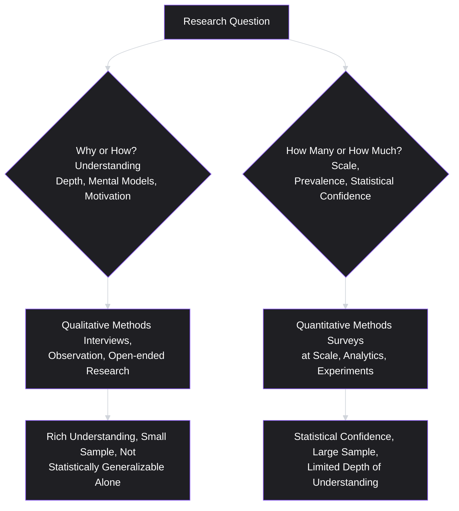
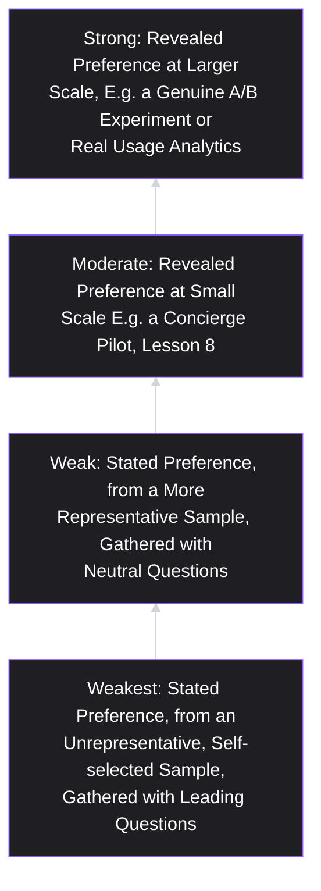

# Lesson 11: User Research

## Why This Lesson Matters

Module 1 built an entire stack of frameworks — the Stakeholder Ledger, the Job Ladder, the Value Proposition Filter, assumption mapping, the Vision Filter, the Strategy Kernel — and every single one of them depends on the same hidden input: an honest, accurate picture of what real users and customers actually think, do, and need. A diagnosis (Lesson 10) built on guesses is not a diagnosis at all; a laddered job (Lesson 6) invented in a conference room rather than surfaced from a real conversation is speculation wearing the clothing of insight. This lesson, and the module it opens, exists to make sure the picture underneath all of that prior work is actually real.

**User research** is the disciplined practice of gathering direct evidence about users' behavior, needs, and context, using methods designed to minimize the many ways teams unintentionally fool themselves. The operative word is *disciplined*: talking to users is not, by itself, user research — a conversation can be run in ways that produce genuine insight or in ways that produce comfortable, misleading confirmation of what the team already believed. This lesson focuses on the foundational distinctions and failure modes that determine which of those two outcomes you get, before Module 2's later lessons cover specific methods (interviews, surveys, journey mapping) in depth.

---

## Learning Path

| Field | Detail |
|---|---|
| **Module** | 2 — Users & Research |
| **Current Lesson** | 11 of 90 |
| **Difficulty** | 3 / 10 |
| **Estimated Study Time** | 25 minutes (reading) + 15 minutes (reflection + quiz) |
| **Prerequisites** | Lesson 6 (Jobs To Be Done), Lesson 8 (Product Discovery) |
| **Next Lesson** | Lesson 12 — Customer Interviews |
| **Future Topics Unlocked** | Lesson 12 (Customer Interviews — the deepest, most detailed method), Lesson 13 (Surveys — the quantitative counterpart), Lesson 14 (Personas), Lesson 15 (Journey Mapping) |

---

## Learning Objectives

By the end of this lesson, you will be able to:

1. Define user research and distinguish it from casual conversation, stakeholder anecdotes, and market research conducted for other purposes.
2. Distinguish qualitative from quantitative research, and explain what each is, and is not, well suited to answer.
3. Identify at least four common research biases (confirmation bias, leading questions, social desirability bias, and the false-positive "would you use this" trap) and explain the mechanism behind each.
4. Distinguish stated preference from revealed preference, and explain why the gap between them is one of the most consequential issues in user research.
5. Apply a basic checklist for evaluating whether a piece of research evidence is trustworthy enough to inform a real decision.

---

## Prerequisites

Lesson 6 (Jobs To Be Done) and Lesson 8 (Product Discovery). This lesson assumes familiarity with laddering as a technique for uncovering underlying needs, and with the distinction between genuine discovery tests and "discovery theater" — user research is the primary practical toolkit for conducting the genuine version of that testing.

---

## Theory

### The Core Definition and What It Is Not

User research is the systematic collection and analysis of evidence about real users' behaviors, needs, motivations, and context, using methods specifically designed to reduce the many biases that distort casual observation. It is worth explicitly distinguishing this from several things it is commonly, and incorrectly, conflated with:

- **Not the same as talking to users informally.** A hallway conversation with a friendly, enthusiastic customer is a data point, but without deliberate structure, it is far more likely to produce confirmation of existing beliefs than genuine new insight — precisely because informal conversations tend to happen with the most accessible, most engaged users, and tend to be steered, often unconsciously, toward topics the interviewer already has opinions about.
- **Not the same as stakeholder anecdotes.** A sales team's account of "what customers keep telling us" is valuable signal, but it is secondhand, filtered through the sales team's own incentives and framing (recall Lesson 5's structural bias toward customer-channel signal), and has typically not been gathered using methods designed to control for bias.
- **Not the same as market research conducted for other purposes.** Market sizing studies, brand perception surveys, and competitive analyses can all be valuable, but they typically answer different questions (how big is this opportunity, how is our brand perceived) than the specific behavioral and needs-based questions user research is built to answer (what is this person actually trying to do, and why does our current solution fail or succeed at helping them).

### Qualitative vs. Quantitative Research: Different Tools for Different Questions

A foundational distinction, which recurs throughout this module, is between qualitative and quantitative research:

- **Qualitative research** (in-depth interviews, observational studies, open-ended surveys) is well suited to answering *why* and *how* questions — why does a user abandon a workflow partway through, how do they actually think about a problem, what mental model do they bring to a new feature. It typically involves small sample sizes and rich, detailed, hard-to-quantify data.
- **Quantitative research** (large-scale surveys, usage analytics, A/B experiments) is well suited to answering *how many*, *how much*, and *is this actually true at scale* questions — what percentage of users experience a given problem, how does a specific change affect a specific metric, does an effect observed in a small qualitative sample generalize to the broader user base.

A common and costly mistake is using the wrong tool for the question at hand: running a large quantitative survey to understand *why* users are confused by an onboarding flow (a question surveys are poorly suited to answer in depth), or relying on five qualitative interviews to determine *what percentage* of the user base is affected by a given problem (a sample far too small to support that kind of quantitative claim). The two methods are complementary, not competing — qualitative research is often best used to generate hypotheses about *why* something is happening, which quantitative research can then test for prevalence and scale.

### Stated Preference vs. Revealed Preference

One of the single most important distinctions in all of user research is between **stated preference** (what someone says they want or would do) and **revealed preference** (what someone actually does when given a real opportunity, with real stakes, to do it).

The gap between these two is large and well-documented across many domains: people routinely overstate their willingness to pay for something, overstate their intention to adopt a healthier habit or a new tool, and understate behaviors they perceive as embarrassing or socially undesirable — not necessarily out of dishonesty, but because predicting one's own future behavior in a hypothetical scenario is genuinely difficult, and because there is no real cost to answering generously in a research conversation the way there would be in an actual purchasing or adoption decision.

This directly echoes Lesson 8's discovery theater warning: a research method that only ever captures stated preference (survey questions like "would you use this feature?" or "how likely are you to recommend this to a friend?") is systematically vulnerable to overstating genuine demand, precisely because answering "yes" or "very likely" costs the respondent nothing in the moment. Wherever possible, user research should be designed to capture some form of revealed preference — actual past behavior, a real (even if small-stakes) commitment such as a pre-order or a genuine time investment, or direct observation of what a person does rather than what they say they would do.

### Common Research Biases

Several specific, well-documented biases distort research findings if not deliberately controlled for:

- **Confirmation bias**: the tendency to notice, weight, and remember evidence that supports an existing belief, while discounting or forgetting evidence that contradicts it. A researcher who already believes a feature is a good idea will tend to interpret ambiguous interview responses more favorably than a neutral observer would.
- **Leading questions**: questions phrased in a way that suggests a preferred answer ("Don't you find it frustrating when...?" rather than "How do you feel about...?"), which prompt respondents to agree rather than to report their genuine, independent perspective.
- **Social desirability bias**: the tendency for respondents to answer in ways that make them look good to the researcher, rather than reporting their actual behavior or belief — particularly strong around topics involving health, money, productivity, or anything perceived as a personal shortcoming.
- **The "would you use this" trap**: as described above, hypothetical questions about future behavior, especially about a polished concept or prototype, reliably overstate genuine adoption intent, because there is no real cost to a generous, encouraging answer.

### A Basic Trustworthiness Checklist

Given these biases, a practical checklist for evaluating whether a piece of research evidence is trustworthy enough to inform a real decision:

1. **Was the sample representative of the actual population the decision concerns**, or drawn disproportionately from the most accessible, most enthusiastic, or most vocal users?
2. **Were questions open-ended and neutrally phrased**, rather than leading respondents toward a particular answer?
3. **Does the evidence reflect revealed preference (actual behavior, real stakes) or only stated preference (hypothetical, low-stakes responses)?**
4. **Was the research conducted, and interpreted, by someone without a strong prior stake in a particular conclusion** — or at minimum, were disconfirming findings actively sought out rather than only confirming ones?
5. **Is the sample size and method appropriate to the type of claim being made** — a qualitative finding used to generate a hypothesis, versus a quantitative finding used to support a claim about prevalence or scale across the whole user base?

A piece of evidence that fails several of these checks is not necessarily worthless, but it should be weighted accordingly, and ideally supplemented with additional, more rigorous research before it is allowed to drive a significant, costly decision.

---

## Common Beginner Mistakes

**Mistake 1: Treating a handful of enthusiastic conversations as sufficient validation**

As covered in Lesson 8, a small number of positive conversations with self-selected, engaged users is highly vulnerable to both an unrepresentative sample and to stated-preference overstatement — it is a reasonable starting point for generating hypotheses, not a sufficient basis for a major investment decision.

**Mistake 2: Asking "would you use this?" and treating the answer as reliable**

This is the single most common instance of the stated-preference trap described above, and one of the most reliable ways to generate falsely confident validation for an idea that will underperform once it requires a real behavioral commitment.

**Mistake 3: Only talking to existing power users or the most vocal customers**

This produces a systematically unrepresentative sample — existing power users, almost by definition, already like the product enough to use it heavily, and their feedback tends to reflect refinements to an already-working experience rather than the concerns of the larger population of casual users, non-users, or churned users who might reveal more fundamental problems.

**Mistake 4: Phrasing questions in a way that signals the "right" answer**

Even subtle framing ("What did you love about this feature?" rather than "What was your experience with this feature?") primes respondents toward a particular kind of answer, contaminating the resulting data before analysis has even begun.

**Mistake 5: Confusing the volume of research conducted with the quality or decision-relevance of what was learned**

Echoing Lesson 8's related warning about discovery theater, a large number of interviews or a large survey sample does not guarantee useful findings if the sample was unrepresentative, the questions were leading, or the research measured stated rather than revealed preference throughout.

---

## Mental Model: The Evidence Trustworthiness Ladder

This lesson's mental model is the **Evidence Trustworthiness Ladder** — a way of ranking research evidence by how resistant it is to the biases described above, used whenever evaluating how much weight a given finding should carry in a real decision.

Use this ladder as a discipline for describing evidence honestly in team discussions: instead of saying simply "users told us they want this," specify where on the ladder that evidence actually sits — was it stated or revealed preference, from a representative or self-selected sample, gathered with neutral or leading questions? Naming the rung explicitly prevents a weak piece of evidence from being unconsciously treated as though it were a strong one simply because it confirms what the team wanted to hear.

---

## Real Company Example

**Spotify** offers a useful illustration of relying on revealed preference (actual listening behavior) over stated preference for major product decisions. Public commentary from Spotify's product and data teams over the years has described extensive use of actual usage and listening-behavior data — skip rates, replay behavior, listening session patterns — to inform features like personalized playlists and recommendation algorithms, rather than relying primarily on survey questions asking users what kind of music or features they believe they want. This reflects a deliberate methodological choice consistent with this lesson's core argument: people's stated musical preferences and their actual, revealed listening behavior can diverge substantially, and building a personalization product around stated preference alone risks systematically misjudging what people actually listen to and enjoy.

*(Assumption flagged: this reflects widely reported descriptions of Spotify's general approach to personalization rather than a claim about the company's complete internal research methodology, which this curriculum does not claim certainty about.)*

---

## Real World Perspective: User Research at Different Company Stages

**At a startup:**
Research is often necessarily lightweight and qualitative, given limited resources — direct conversations with early adopters, careful observation of how a small number of users actually behave with an early prototype, and close attention to revealed preference wherever it can be captured cheaply (a genuine sign-up, a real, if small, payment). The central risk at this stage is over-relying on an unrepresentative sample of especially enthusiastic early adopters, whose needs and tolerance for rough edges may not reflect the broader market the company eventually needs to serve.

**At a mid-size company:**
Research typically becomes more structured and mixed-method, combining qualitative interviews (to generate and refine hypotheses) with quantitative surveys and usage analytics (to test prevalence and scale) in an ongoing, continuous cycle — directly echoing Lesson 8's continuous discovery principle. Dedicated research functions or research-trained PMs often emerge at this stage specifically to guard against the biases described in this lesson, which become harder to self-police informally as an organization grows.

**At Big Tech:**
Research at scale often has access to extremely large quantitative datasets and rigorous experimentation infrastructure, which can create its own distinct risk: over-relying on quantitative signal (a statistically significant but shallow metric movement) while under-investing in the qualitative *why* behind it, since qualitative research doesn't scale as easily as automated quantitative pipelines. Mature research organizations at this scale typically maintain deliberate investment in both methods precisely to avoid this imbalance.

---

## Detailed Case Study: The Survey That Asked the Wrong Question

Consider a simplified, illustrative scenario common across consumer subscription products.

A fitness app's product team wants to understand why free-trial users aren't converting to paid subscriptions at the expected rate. They design and send a survey to a sample of recent free-trial users, asking: "How likely are you to recommend this app to a friend?" and "Would you find a slightly cheaper subscription tier appealing?" The results are encouraging: a high average recommendation score, and strong stated interest in a cheaper tier. Leadership concludes that price is the primary barrier to conversion and directs the team to build and launch a new, lower-priced subscription tier.

The lower-priced tier launches. Conversion rates barely move. A follow-up investigation — this time using actual in-app behavioral data (a revealed-preference source, examined instead of relying further on survey responses) — reveals that the overwhelming majority of non-converting trial users had stopped opening the app entirely within the first four days of the trial, well before ever reaching a point where price would have been a relevant factor in their decision.

**What went wrong?**

Applying this lesson's frameworks:

1. **The survey measured stated preference on an unrelated hypothetical ("would a cheaper tier be appealing"), not the actual underlying behavior driving non-conversion.** Nearly anyone might say a cheaper price sounds appealing in the abstract — this is a close cousin of the "would you use this" trap, applied to pricing rather than features.
2. **The survey was only sent to, and only answerable by, users who were still engaged enough to respond to a survey at all** — an unrepresentative sample that systematically excluded the much larger population of users who had already disengaged entirely within the first four days, which is precisely the population whose behavior most needed to be understood.
3. **The actual underlying problem — an early-engagement drop-off, likely tied to onboarding friction or an unclear initial value demonstration — was never investigated**, because the survey's leading, price-focused framing directed attention toward a plausible-sounding but ultimately incorrect explanation.

A team applying the Evidence Trustworthiness Ladder from the outset would have recognized that a stated-preference survey, sent to a self-selected, still-engaged sample, sat near the bottom of the ladder — a reasonable starting hypothesis generator, but far too weak a basis for a costly pricing-tier launch decision. A stronger approach would have started with revealed-preference behavioral data (when, specifically, do users stop engaging, and what did they do or not do immediately before that point) to correctly diagnose the actual obstacle, before investing in a solution aimed at the wrong cause entirely.

This case will be revisited in **Lesson 12 (Customer Interviews)**, where we cover techniques for uncovering the real behavioral story behind a drop-off like this one, and in **Lesson 13 (Surveys)**, where we address how to design surveys that avoid exactly this kind of leading, stated-preference-only framing.

---

## Framework Explanation: Matching Method to Question

A practical summary framework for choosing the right research method, extending the qualitative/quantitative distinction introduced earlier:

| If your question is... | Use this type of method | Because... |
|---|---|---|
| Why do users behave this way, or what's their mental model? | Qualitative (interviews, observation) | Requires depth and open-ended follow-up that quantitative methods can't provide |
| How many users are affected by this specific problem? | Quantitative (large-sample survey, analytics) | Requires a sample large and representative enough to support a prevalence claim |
| Would users actually pay for or adopt this? | Revealed preference (a concierge test, a real pre-order, actual usage data) | Stated preference alone is unreliable for predicting real commitment (Lesson 8's confidence ladder) |
| What is a specific, actionable early hypothesis worth testing further? | Qualitative, small-sample, exploratory research | Cheap and fast, appropriate for hypothesis generation rather than final validation |

The recurring discipline this table reinforces: **match the method to the specific question being asked, and be explicit about which rung of the Evidence Trustworthiness Ladder the resulting evidence actually occupies**, rather than defaulting to whichever method is most familiar or convenient regardless of fit.

---

## Interview Perspective: How Interviewers Think About This

**Typical question 1: "How do you decide when qualitative research is enough, versus when you need quantitative validation?"**
*What the interviewer is actually evaluating:* Whether the candidate understands that these methods answer fundamentally different kinds of questions (why/how versus how many/how much), rather than treating them as interchangeable or as a strict hierarchy where quantitative is always "more rigorous." A strong answer describes using qualitative research to generate a specific hypothesis and quantitative research to test its prevalence or scale.

**Typical question 2: "Tell me about a time research findings contradicted what you or your team expected."**
*What the interviewer is actually evaluating:* Genuine openness to disconfirming evidence, and whether the candidate's research process has actual teeth (per Lesson 8's discovery theater warning) rather than reliably confirming whatever the team already believed. A candidate who cannot produce a real example may be signaling a research process contaminated by confirmation bias.

**Typical question 3: "A survey shows strong interest in a proposed feature. What questions would you ask before trusting that result?"**
*What the interviewer is actually evaluating:* Fluency with the Evidence Trustworthiness Ladder and the stated-versus-revealed-preference distinction — whether the candidate immediately probes sample representativeness, question framing, and whether the "interest" reflects any real behavioral commitment, rather than accepting a positive survey result at face value.

---

## Summary

User research is the disciplined, bias-aware collection of evidence about real users' behavior and needs — distinct from informal conversation, stakeholder anecdote, or market research aimed at different questions. Qualitative methods (interviews, observation) are well suited to why/how questions and hypothesis generation; quantitative methods (large-sample surveys, analytics, experiments) are well suited to how-many/how-much questions and testing prevalence at scale, and the two are complementary rather than competing. The gap between stated preference (what people say they'd do) and revealed preference (what they actually do with real stakes) is one of the most consequential issues in the field, and research that captures only stated preference — especially via questions resembling "would you use this?" — is systematically vulnerable to overstating genuine demand. Confirmation bias, leading questions, social desirability bias, and the stated-preference trap all distort findings if not deliberately controlled for, and a basic trustworthiness checklist (sample representativeness, question neutrality, stated vs. revealed preference, researcher objectivity, and method-to-claim fit) helps evaluate how much weight a given piece of evidence deserves before it drives a costly decision.

---

## Key Takeaways

- User research is distinct from casual conversation, stakeholder anecdote, and market research for other purposes — it requires deliberate method to control for bias.
- Qualitative research answers why/how questions with depth but small samples; quantitative research answers how-many/how-much questions with scale but less depth — match the method to the question.
- Stated preference (what people say) and revealed preference (what people actually do with real stakes) frequently diverge; research that captures only stated preference systematically overstates genuine demand.
- Confirmation bias, leading questions, and social desirability bias all distort findings; deliberate, neutral method design is required to control for them.
- The "would you use this" question is one of the most common and reliable ways to generate falsely confident, stated-preference-only validation.
- The Evidence Trustworthiness Ladder ranks research evidence by resistance to bias — naming which rung a piece of evidence occupies prevents weak evidence from being unconsciously treated as strong.
- An unrepresentative sample (existing power users, only still-engaged respondents) can produce confident-sounding findings that miss the actual population whose behavior most needs to be understood.

---

## Cheat Sheet

*A two-minute review of everything in this lesson.*

- **User research ≠ casual conversation, stakeholder anecdote, or unrelated market research.**
- **Qualitative = why/how, small sample, deep.** **Quantitative = how many/how much, large sample, less depth.** Complementary, not competing.
- **Stated preference (what people say) vs. revealed preference (what people actually do)** — the gap between them is huge; prioritize revealed preference wherever possible.
- **"Would you use this?" is a trap** — no real cost to a generous, hypothetical answer.
- **Four key biases:** confirmation bias, leading questions, social desirability bias, the stated-preference trap.
- **Evidence Trustworthiness Ladder:** stated/unrepresentative/leading (weakest) → stated/representative/neutral → revealed/small-scale → revealed/large-scale (strongest).
- **Trustworthiness checklist:** representative sample? neutral questions? stated or revealed? objective researcher? method fits the claim?

---

## Glossary

| Term | Definition | Related Concepts | Difficulty |
|---|---|---|---|
| User Research | The disciplined, bias-aware collection and analysis of evidence about real users' behavior, needs, and context. | Qualitative Research, Quantitative Research | 2 |
| Qualitative Research | Research methods (interviews, observation) suited to why/how questions, with rich detail but small sample sizes. | Quantitative Research | 2 |
| Quantitative Research | Research methods (large-sample surveys, analytics, experiments) suited to how-many/how-much questions at scale. | Qualitative Research | 2 |
| Stated Preference | What a person says they want, believe, or would do, often in a hypothetical or low-stakes context. | Revealed Preference | 2 |
| Revealed Preference | What a person actually does when given a real opportunity, with real stakes, to act. | Stated Preference | 2 |
| Confirmation Bias | The tendency to notice and weight evidence that supports an existing belief while discounting contradicting evidence. | Research Biases | 2 |
| Social Desirability Bias | The tendency for respondents to answer in ways that make them look good to the researcher, rather than reporting actual behavior or belief. | Research Biases | 2 |
| Evidence Trustworthiness Ladder | A ranking of research evidence by its resistance to bias, from weak (stated, unrepresentative, leading) to strong (revealed, representative, large-scale). | Discovery Confidence Ladder (Lesson 8) | 3 |

---

## Further Reading / Resources

- Erika Hall, *Just Enough Research* — a widely used, practical introduction to research methods, bias awareness, and matching method to question, directly relevant to this lesson's framing.
- Steve Portigal, *Interviewing Users* — a detailed treatment of qualitative interviewing technique, previewing Lesson 12's deeper coverage.
- Daniel Kahneman, *Thinking, Fast and Slow* — a foundational, widely cited treatment of cognitive biases (including confirmation bias and the general unreliability of self-reported predictions about one's own future behavior) underlying this lesson's stated-versus-revealed-preference discussion.

---

## Flashcards

**Card 1**
- Front: What distinguishes user research from casual conversation with a user?
- Back: User research uses deliberate method to control for bias (sampling, question neutrality, evidence type); casual conversation typically lacks this structure and is vulnerable to unconscious confirmation and unrepresentative sampling.
- Difficulty: 1
- Tags: user-research, fundamentals

**Card 2**
- Front: What kinds of questions is qualitative research best suited to answer, and what about quantitative?
- Back: Qualitative research answers why/how questions with depth but small samples; quantitative research answers how-many/how-much questions with scale but less depth.
- Difficulty: 2
- Tags: qualitative-quantitative

**Card 3**
- Front: What is the difference between stated preference and revealed preference?
- Back: Stated preference is what someone says they want or would do; revealed preference is what they actually do when given a real opportunity with real stakes. The two frequently diverge.
- Difficulty: 2
- Tags: stated-revealed-preference

**Card 4**
- Front: Why is "would you use this?" considered a research trap?
- Back: There is no real cost to a generous, hypothetical answer, so responses systematically overstate genuine future adoption — a classic stated-preference trap.
- Difficulty: 2
- Tags: would-you-use-this-trap

**Card 5**
- Front: Name the four biases covered in this lesson's Theory section.
- Back: Confirmation bias, leading questions, social desirability bias, and the "would you use this" (stated-preference) trap.
- Difficulty: 2
- Tags: research-biases

**Card 6**
- Front: What does the Evidence Trustworthiness Ladder rank, and what sits at its weakest rung?
- Back: It ranks research evidence by resistance to bias; the weakest rung is stated preference, from an unrepresentative sample, gathered with leading questions.
- Difficulty: 3
- Tags: evidence-ladder

**Card 7**
- Front: In the Detailed Case Study, what was the actual underlying reason for low trial-to-paid conversion, as opposed to the survey's price-based explanation?
- Back: The majority of non-converting users had disengaged from the app entirely within the first four days, well before price would have been relevant — likely an onboarding or early-value-demonstration problem, not a pricing problem.
- Difficulty: 3
- Tags: case-study, revealed-preference

## Reflection Exercise

You are the PM for a language-learning app. You want to understand why users who complete the free trial's first lesson often don't return for a second session.

Work through the following, in writing, before reading further:

1. Propose one research question best answered with qualitative methods, and one best answered with quantitative methods, related to this drop-off problem.
2. Design a survey question about this drop-off that would fall into the "would you use this" or stated-preference trap, and then rewrite it to better capture revealed preference or more neutral, specific behavioral detail.
3. Identify one way your sample could become unrepresentative if you only surveyed users who are still engaged with the app today (consider who is excluded from that sample and why that population might matter most).
4. Using the Evidence Trustworthiness Ladder, describe what a "strong" (high-rung) piece of evidence about this drop-off problem would actually look like, in concrete terms specific to this app.
5. Referencing the Detailed Case Study, name one plausible wrong conclusion your team might reach if it relied solely on a stated-preference survey of currently engaged users, without any revealed-preference behavioral data.

There is no single correct answer. The purpose of this exercise is to practice designing research that avoids this lesson's core traps — unrepresentative sampling, leading questions, and reliance on stated over revealed preference — for a scenario without a pre-worked example to lean on.

---

## Quiz

**1. Which of the following best distinguishes user research from an informal, unstructured conversation with a customer?**
A) User research always takes longer to conduct
B) User research uses deliberate methods designed to control for bias, sampling, and question framing, while informal conversation typically lacks this structure
C) User research can only be conducted by a dedicated research team, never by a PM
D) There is no meaningful distinction between the two

*Correct answer: B*
*Explanation: The lesson explicitly distinguishes user research by its deliberate, bias-aware methodology, not by who conducts it or how long it takes.*
*Learning objective tested: #1*
*Difficulty: Easy*

---

**2. Which type of research question is qualitative research best suited to answer?**
A) What percentage of the user base experiences a specific problem?
B) Why does a user abandon a workflow partway through, and what is their mental model of the problem?
C) How does a specific pricing change affect conversion at scale?
D) Is an effect observed in a small sample statistically significant across the full user base?

*Correct answer: B*
*Explanation: Qualitative research is suited to why/how questions requiring depth and open-ended follow-up, unlike quantitative methods better suited to prevalence and scale questions.*
*Learning objective tested: #2*
*Difficulty: Easy*

---

**3. What is the key difference between stated preference and revealed preference?**
A) Stated preference is always more accurate than revealed preference
B) Stated preference is what someone says they want or would do; revealed preference is what they actually do when given a real opportunity with real stakes
C) Revealed preference can only be measured through surveys
D) The two terms describe the same concept using different vocabulary

*Correct answer: B*
*Explanation: This is the lesson's core distinction — stated preference reflects hypothetical or low-stakes responses, while revealed preference reflects actual behavior under real stakes.*
*Learning objective tested: #4*
*Difficulty: Easy*

---

**4. Why is the question "would you use this feature?" considered a common research trap?**
A) Because users are always dishonest when answering survey questions
B) Because there is no real cost to a generous, hypothetical answer, systematically overstating genuine future adoption intent
C) Because this question is illegal to ask in most research contexts
D) Because this question can only be asked in quantitative surveys, never in interviews

*Correct answer: B*
*Explanation: The lesson explains this trap as a consequence of the stated-preference problem — answering "yes" costs the respondent nothing in the moment, unlike a real adoption decision.*
*Learning objective tested: #3*
*Difficulty: Easy*

---

**5. Which of the following best describes confirmation bias in the context of user research?**
A) The tendency for respondents to answer in ways that make them look good
B) The tendency to notice, weight, and remember evidence supporting an existing belief while discounting contradicting evidence
C) The tendency for surveys to always contain leading questions
D) The tendency for revealed preference data to be more reliable than stated preference data

*Correct answer: B*
*Explanation: This is the lesson's definition of confirmation bias, distinct from social desirability bias (option A) and leading questions (a separate, related bias).*
*Learning objective tested: #3*
*Difficulty: Easy*

---

**6. In the Detailed Case Study, why was the fitness app's survey an unrepresentative sample of the population most relevant to the conversion problem?**
A) The survey was too long for most users to complete
B) The survey could only be answered by users who were still engaged enough to respond, systematically excluding the larger population who had already disengaged within the first four days
C) The survey asked about pricing instead of features
D) The survey was sent to too many people, diluting the results

*Correct answer: B*
*Explanation: The case study explicitly identifies the sample as excluding precisely the disengaged population whose behavior most needed to be understood, since only still-engaged users would respond to a survey at all.*
*Learning objective tested: #5*
*Difficulty: Easy*

---

**7. What was the actual underlying cause of low conversion in the Detailed Case Study, as revealed by behavioral (revealed-preference) data?**
A) The subscription price was too high
B) Users disengaged from the app entirely within the first four days, well before price would have been a relevant factor
C) Users did not understand how to cancel their free trial
D) The app had significant technical bugs during the trial period

*Correct answer: B*
*Explanation: The follow-up behavioral investigation found early disengagement, not price, as the actual driver of non-conversion — the opposite of what the original survey suggested.*
*Learning objective tested: #4, #5*
*Difficulty: Medium*

---

**8. According to the Evidence Trustworthiness Ladder, which of the following would sit at the STRONGEST rung?**
A) A stated-preference survey sent only to existing power users, using leading questions
B) A stated-preference survey sent to a broad, representative sample, using neutral questions
C) Revealed-preference data from a genuine, larger-scale A/B experiment
D) A handful of informal, enthusiastic hallway conversations

*Correct answer: C*
*Explanation: Revealed preference at larger scale (a genuine experiment or real usage data) occupies the strongest rung on the ladder, since it reflects actual behavior under real stakes at a scale sufficient to generalize.*
*Learning objective tested: #5*
*Difficulty: Medium*

---

**9. (Scenario) A PM wants to know whether users would pay for a proposed premium feature. Which of the following research approaches would provide the strongest evidence, according to this lesson?**
A) Asking a survey question: "Would you pay for this feature if it existed?"
B) Asking only the company's most loyal existing subscribers whether they like the idea
C) Offering a real, even if small-scale, pre-order or paid pilot and observing actual sign-up behavior
D) Asking the sales team what they believe customers want

*Correct answer: C*
*Explanation: A real, small-stakes commitment (a pre-order or paid pilot) captures revealed preference, which the lesson identifies as far more reliable than stated-preference survey questions or secondhand stakeholder impressions.*
*Learning objective tested: #4, #5*
*Difficulty: Medium-Hard*

---

**10. Which of the following questions is the clearest example of a leading question, as described in this lesson?**
A) "How do you currently manage this task?"
B) "Don't you find it frustrating when this happens?"
C) "What would you change about this experience, if anything?"
D) "Can you walk me through the last time you did this?"

*Correct answer: B*
*Explanation: This question is phrased in a way that suggests a preferred answer (frustration), prompting agreement rather than an independent, genuine response, unlike the neutral, open-ended phrasing in the other options.*
*Learning objective tested: #3*
*Difficulty: Medium*

---

**11. (Product Thinking) A team has run five in-depth qualitative interviews suggesting a new onboarding flow reduces confusion. Before rolling the change out to the entire user base, what should the team most likely do next, according to this lesson's framework?**
A) Roll the change out immediately to all users, since five interviews is sufficient evidence for any decision
B) Treat the qualitative finding as a hypothesis and use a quantitative method (e.g., an A/B experiment) to test whether the effect holds and is significant at scale, before full rollout
C) Discard the qualitative finding entirely, since qualitative research is never useful
D) Repeat the same five interviews multiple times until the sample size feels sufficient

*Correct answer: B*
*Explanation: This reflects the lesson's guidance on complementary methods — qualitative research generates a hypothesis, and quantitative research is the appropriate next step to test its prevalence and significance at scale before a costly full rollout.*
*Learning objective tested: #2*
*Difficulty: Medium-Hard*

---

**12. (Interview Reasoning) A candidate describes their research process as consistently confirming the team's original hypothesis across every single project they've worked on. What might this most likely signal, according to this lesson's Interview Perspective section?**
A) Exceptionally strong initial product instincts that never require correction
B) A possible sign of confirmation bias contaminating the research process, since genuine research should sometimes surface disconfirming evidence
C) That the candidate's team never needed to conduct research at all
D) Nothing meaningful, since consistently confirmed hypotheses are the expected, normal outcome of good research

*Correct answer: B*
*Explanation: The lesson's Interview Perspective explicitly treats an inability to produce a real example of disconfirming research findings as a signal of a research process that may lack genuine rigor.*
*Learning objective tested: #3*
*Difficulty: Hard*

---

**13. (Product Thinking, Higher Difficulty) A large-sample quantitative survey shows that 80% of respondents rate a proposed feature as "very appealing," but the team has no data on what specifically makes it appealing or what problem it solves for different types of users. According to this lesson, what is the most appropriate next step?**
A) Proceed directly to full-scale delivery, since 80% approval is a strong quantitative signal
B) Conduct qualitative research (interviews) to understand the why/how behind the appeal, since the quantitative survey alone cannot explain the underlying motivations or use cases driving that number
C) Disregard the survey entirely, since quantitative methods are inherently less trustworthy than qualitative ones
D) Repeat the identical survey with a larger sample size to increase confidence in the same limited finding

*Correct answer: B*
*Explanation: This reflects the complementary relationship between methods described in this lesson — a quantitative finding (prevalence of appeal) benefits from qualitative follow-up to understand the underlying why, rather than treating either method as sufficient alone.*
*Learning objective tested: #2*
*Difficulty: Hard*

---

**14. (Interview Reasoning, Higher Difficulty) An interviewer asks how a candidate would evaluate a piece of user research evidence before allowing it to influence a costly decision. A weak answer would most likely include which of the following?**
A) Checking whether the sample was representative of the relevant population
B) Accepting the finding at face value simply because it was labeled as "user research," without examining sample, question framing, or preference type
C) Distinguishing whether the evidence reflects stated or revealed preference
D) Considering whether the research method fits the type of claim being made (prevalence vs. depth of understanding)

*Correct answer: B*
*Explanation: The lesson's trustworthiness checklist explicitly requires examining these specific factors; accepting labeled "research" uncritically, without checking sample, framing, or preference type, is precisely the weak, undisciplined approach this lesson warns against.*
*Learning objective tested: #5*
*Difficulty: Hard*

---

**15. (Highest Difficulty) A team recognizes that its usual research process disproportionately samples existing power users, and is designing a new study to correct for this. Which of the following study designs would MOST directly address that specific weakness, based on this lesson?**
A) Sending the same survey to an even larger number of existing power users to increase the sample size
B) Deliberately including non-users, churned users, and casual users in the sample, and pairing revealed-preference behavioral data with any qualitative interviews conducted
C) Switching entirely from qualitative to quantitative methods, regardless of the specific research question being asked
D) Asking existing power users to recommend other power users to interview, to expand the sample further

*Correct answer: B*
*Explanation: The core weakness described is sample representativeness — deliberately including non-users, churned users, and casual users (rather than only more power users) directly addresses this, while also strengthening the evidence with revealed-preference data, consistent with this lesson's trustworthiness checklist.*
*Learning objective tested: #1, #4, #5*
*Difficulty: Hard*

---

## Connections

| | Lesson | Core Idea Carried Forward |
|---|---|---|
| **Previous Lesson** | Lesson 10 — Product Strategy Basics | Strategy requires an honest diagnosis; user research is the primary practical toolkit for gathering the evidence that diagnosis depends on |
| **Current Lesson** | Lesson 11 — User Research | Qualitative vs. quantitative methods; stated vs. revealed preference; research biases; the Evidence Trustworthiness Ladder |
| **Next Lesson** | Lesson 12 — Customer Interviews | Provides the detailed, practical technique for conducting the qualitative method introduced at a foundational level in this lesson |
| **Future Concepts Unlocked** | Lesson 13 (Surveys) | Extends this lesson's quantitative-method discussion into detailed survey design, directly addressing the leading-question and stated-preference traps covered here |
| | Lesson 14 (Personas) | Uses well-conducted research, rather than assumption, as the required input for building accurate personas |
| | Lesson 15 (User Journey Mapping) | Uses research findings (particularly revealed-preference behavioral data) to construct an accurate map of the real user experience |

This curriculum is designed to be read as one continuous argument. From this lesson forward, any reference to "user research" or "customer feedback" assumes the stated-versus-revealed-preference distinction and the Evidence Trustworthiness Ladder as a baseline — this will not be re-explained, only re-applied with increasing method-specific depth across Module 2.
