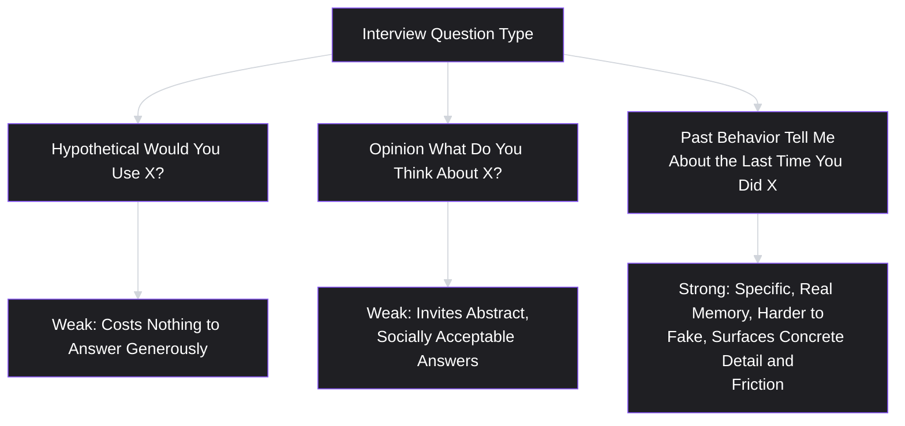
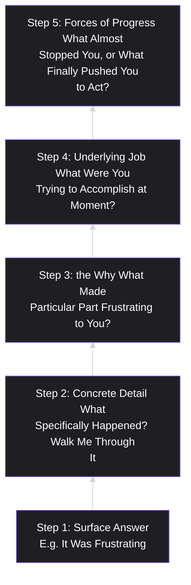

# Lesson 12: Customer Interviews

## Why This Lesson Matters

Lesson 11 established the theory: qualitative research answers why/how questions, revealed preference beats stated preference, and several specific biases (confirmation bias, leading questions, social desirability bias, the "would you use this" trap) distort findings if not deliberately controlled for. This lesson is where that theory becomes a skill you can actually execute in a room — or on a call — with a real person, in real time, under the real pressure of wanting to hear a particular answer.

**A customer interview** is a structured, one-on-one conversation designed to surface a person's actual past behavior, context, and reasoning — not their opinions about hypothetical futures, and not a pitch dressed up as a conversation. The central discipline of a good interview is almost the opposite of what feels natural in a normal conversation: instead of asking what someone thinks, wants, or would do, a skilled interviewer asks about what someone has actually done, in as much concrete, specific detail as possible, because specific past behavior is a form of revealed preference (Lesson 11) that is far more reliable than a hypothetical opinion.

This lesson matters because customer interviews are simultaneously the most commonly used and the most commonly misused research method in product work. Nearly every PM conducts interviews at some point; comparatively few conduct them in a way that reliably produces trustworthy evidence rather than a comfortable, leading, self-fulfilling conversation. The gap between a good interview and a bad one is not raw talent — it is a specific, learnable set of techniques, which this lesson covers directly.

---

## Learning Path

| Field | Detail |
|---|---|
| **Module** | 2 — Users & Research |
| **Current Lesson** | 12 of 90 |
| **Difficulty** | 4 / 10 |
| **Estimated Study Time** | 30 minutes (reading) + 15 minutes (reflection + quiz) |
| **Prerequisites** | Lesson 6 (Jobs To Be Done), Lesson 11 (User Research) |
| **Next Lesson** | Lesson 13 — Surveys |
| **Future Topics Unlocked** | Lesson 13 (Surveys — the quantitative complement to interviews), Lesson 14 (Personas — built from interview synthesis), Lesson 16 (Pain Points), Lesson 17 (Problem Statements) |

---

## Learning Objectives

By the end of this lesson, you will be able to:

1. Distinguish a "past-behavior" interview question from a hypothetical or opinion-based question, and explain why the former produces more reliable evidence.
2. Apply the "switch interview" structure to uncover the specific moment and forces that led someone to adopt, or seriously consider adopting, a new solution.
3. Identify and avoid the most common interviewer mistakes: leading questions, pitching instead of listening, accepting vague answers, and interviewing only easy-to-reach participants.
4. Distinguish a customer interview conducted for discovery purposes from one conducted for usability testing, and explain why conflating the two produces weaker results for both.
5. Apply the "Five Whys" and silence techniques to move a conversation from a surface-level answer to a genuinely underlying one.

---

## Prerequisites

Lesson 6 (Jobs To Be Done) and Lesson 11 (User Research). This lesson assumes fluency with the laddering technique from Lesson 6 (which customer interviews are the primary vehicle for conducting) and with the stated-versus-revealed-preference distinction and bias list from Lesson 11, which this lesson translates into concrete interviewing technique.

---

## Theory

### Past-Behavior Questions vs. Hypothetical and Opinion Questions

The single most important technical skill in customer interviewing is the discipline of asking about **specific past behavior** rather than **hypothetical future behavior** or **general opinion**. Consider three ways of asking about the same underlying topic:

- **Hypothetical (weak)**: "Would you use a feature that let you set spending limits per category?"
- **Opinion (weak)**: "What do you think about budgeting apps in general?"
- **Past behavior (strong)**: "Tell me about the last time you tried to stick to a budget. Walk me through exactly what happened."

The past-behavior question is dramatically more reliable, for reasons directly tied to Lesson 11's stated-versus-revealed-preference distinction: a hypothetical question asks someone to predict their own future behavior, which people are demonstrably bad at, and costs nothing to answer generously; an opinion question invites abstract, socially acceptable answers disconnected from lived experience; a past-behavior question asks for a specific, real memory, which is far harder to answer with a comfortable, generic platitude, and which tends to surface concrete detail — including friction, workarounds, and abandoned attempts — that a hypothetical question would never reveal.

### The Switch Interview Structure

A particularly powerful, structured application of past-behavior questioning is the **switch interview** (closely associated with Bob Moesta's applied Jobs to Be Done work, previewed in Lesson 6's Forces of Progress model), which focuses specifically on the moment someone adopted, or seriously considered adopting, a new solution. The structure moves through a specific sequence:

1. **First thought**: "When did you first start thinking you might need something like this?" — establishing the earliest moment of dissatisfaction (the Push force from Lesson 6).
2. **Passive looking**: "What did you do next? Did you look into any options at that point, even casually?"
3. **Active looking**: "What made you go from casually considering this to actually seriously looking for a solution?" — often revealing a specific triggering event, not a gradual, generic realization.
4. **Deciding**: "Walk me through how you actually chose [this solution] over the alternatives you were considering." — surfacing the Pull force and the specific comparison being made.
5. **Anxiety and habit at the moment of commitment**: "What almost stopped you from going through with it?" — directly surfacing the Anxiety and Habit forces from Lesson 6's Forces of Progress model.

This structure is powerful precisely because it anchors the entire conversation in a real, specific, already-completed event, rather than a general opinion or a hypothetical scenario — every question asks about something that actually happened, in a particular order, which the respondent can recall concretely rather than construct on the spot.

### Common Interviewer Mistakes

**Leading questions** (introduced in Lesson 11) remain the most pervasive interviewing mistake, but several additional, interview-specific mistakes deserve direct attention:

- **Pitching instead of listening.** An interviewer excited about their own product idea often unconsciously turns an interview into a sales pitch — describing the proposed solution and gauging reaction, rather than first fully understanding the respondent's existing behavior and pain independent of any proposed solution. Once a solution has been described, the respondent's subsequent answers are contaminated by anchoring toward that specific solution, making it much harder to learn what they would have said, or wanted, absent that framing.
- **Accepting vague answers.** A respondent saying "it was frustrating" or "I just wanted it to be easier" is common, and an inexperienced interviewer often moves on, treating this as sufficient detail. A skilled interviewer follows up specifically: "What does 'frustrating' mean, concretely — what happened, step by step, that felt frustrating?" Vague language is a signal to dig deeper, not a finished answer.
- **Interviewing only easy-to-reach participants.** Directly echoing Lesson 11's representativeness concern, interviews conducted only with the most available, most enthusiastic, or most vocal customers systematically miss the perspectives — often including churned users, skeptical prospects, or quietly dissatisfied customers — that would most challenge the team's existing assumptions.
- **Filling silence too quickly.** When a respondent pauses after a question, an uncomfortable-feeling silence often tempts the interviewer to jump in with a clarifying suggestion or a multiple-choice-style prompt. This frequently short-circuits the respondent's own, more genuine train of thought — deliberately tolerating a few seconds of silence often produces a more considered, more useful answer than immediately rescuing the respondent from having to think.

### Discovery Interviews vs. Usability Interviews

A conceptually important distinction, often blurred in practice: a **discovery interview** aims to understand a person's existing behavior, context, and needs — usually before a specific solution exists, or independent of one — while a **usability interview** (more precisely, a usability test conducted with an interview component) aims to observe how a person interacts with a specific, already-built prototype or product, to identify points of confusion or friction.

Conflating these two produces a specific, recognizable failure: a session framed as "discovery" that spends most of its time reacting to a shown prototype has, without anyone quite deciding to make this trade, actually become a usability session — collecting reactions to a specific proposed solution rather than the more foundational, solution-independent understanding discovery is meant to produce. Neither type of session is superior; they simply answer different questions, and a PM should be deliberate about which one they are running in a given conversation, rather than drifting between the two without noticing.

### Digging Deeper: The Five Whys and the Power of Silence

Two specific, complementary techniques help move a conversation from a surface-level answer to a genuinely underlying one, directly extending Lesson 6's laddering technique into live interview practice:

- **The Five Whys**: repeatedly asking "why" (or a softer equivalent, like "what made that important to you?") in response to a stated reason, until reaching an explanation that feels genuinely foundational rather than another intermediate justification. As in Lesson 6, this has a natural stopping point — the most specific, stable explanation, not the most abstract one imaginable.
- **Tolerating silence**: as described above, resisting the urge to fill a pause immediately after asking a question, giving the respondent genuine space to think past their first, most readily available answer.

Used together, these techniques counteract a natural tendency in conversation — both interviewer and respondent are inclined to treat the first plausible-sounding answer as sufficient and move on — that, left unchecked, produces exactly the kind of surface-level, insufficiently specific finding this lesson (and Lesson 11) warns against.

---

## Common Beginner Mistakes

**Mistake 1: Asking "would you use this?" partway through an interview, then treating the answer as reliable evidence**

As covered in Lesson 11, this remains one of the single most reliable ways to generate falsely confident, stated-preference-only validation — an interview format doesn't inoculate against this trap; it requires the same discipline of avoiding hypothetical framing.

**Mistake 2: Describing the proposed solution before fully understanding the respondent's existing behavior**

Once a solution is on the table, every subsequent answer is anchored to it, making it far harder to learn what the respondent's actual, solution-independent experience and need really are.

**Mistake 3: Treating a vague answer as a complete answer**

"It's frustrating" or "I wish it were easier" are starting points, not findings — a skilled interviewer follows up for concrete, specific detail rather than recording the vague version as the finding itself.

**Mistake 4: Recruiting only friendly, easy-to-reach participants**

This produces exactly the unrepresentative sample problem from Lesson 11 — a systematic bias toward the perspectives of people already inclined to be positive and engaged, at the expense of skeptics, churned users, or people who never adopted the product at all.

**Mistake 5: Rushing past silence**

Jumping in to rescue a respondent from a pause, or offering a multiple-choice-style prompt ("was it more about cost, or more about time?") before they've had a chance to answer in their own words, often produces a shallower, more interviewer-shaped answer than genuine patience would have.

---

## Mental Model: The Interview Depth Staircase

This lesson's mental model is the **Interview Depth Staircase** — a way of visualizing how a single topic should be progressively deepened across a conversation, rather than left at its first, surface-level answer.

Use this staircase as a discipline for noticing when a conversation has stalled on a lower step: if you find yourself recording "it was frustrating" as if it were a complete insight, you have stopped on Step 1, and the techniques covered in this lesson — concrete follow-up questions, the Five Whys, and tolerating silence — are specifically what climb the remaining steps.

---

## Real Company Example

**Intuit** (maker of QuickBooks and TurboTax) runs a company-wide practice called "Follow Me Home," started by co-founder Scott Cook in the company's early days: an employee would wait at a retail store until a customer bought an Intuit product, then ask permission to go watch them actually use it in their own home or office. The practice has been continuously in use since — Intuit's own product blog and design-award case studies describe employees across the company, not just researchers, still conducting Follow Me Home sessions as a standard part of "Design for Delight," the company's internal innovation methodology.

The reason Follow Me Home is a sharper example than a standard interview is precisely the distinction this lesson draws between recalled behavior and observed behavior: Cook's stated reasoning for the practice was that customers are often unwilling or unable to accurately recall the specific friction they hit while using software, so watching them in their actual working environment — with its real interruptions, real workarounds, and real second monitor full of a different task entirely — surfaces problems a conference-room interview alone would miss. It pairs direct observation with interview questions in real time, rather than treating either alone as sufficient.

*(Source: Intuit's own product blog and multiple independently reported accounts of the program's 1989 origin and continued company-wide use are consistent on these specifics. This curriculum does not claim certainty about the exact current scale or frequency of the program.)*

---

## Real World Perspective: Customer Interviews at Different Company Stages

**At a startup:**
Customer interviews are often the primary, sometimes only, research method available, given limited resources, and founders frequently conduct these interviews personally in the earliest stages. The central risk at this stage is the "pitching instead of listening" mistake — a founder deeply attached to their own idea can find it especially difficult to resist describing the solution early and anchoring the conversation toward validating it, rather than first understanding the respondent's independent experience.

**At a mid-size company:**
Interviews are often conducted by dedicated researchers or research-trained PMs, using more standardized interview guides and recruitment processes designed specifically to counteract the representativeness problem — deliberately including skeptics, churned users, and less-engaged customers rather than relying on convenient, self-selected volunteers.

**At Big Tech:**
Interviews at this scale are often used specifically to generate and refine hypotheses that will subsequently be tested quantitatively at scale (directly echoing Lesson 11's complementary-methods framework), and are frequently combined with more extensive documentation, coding, and synthesis practices (formal thematic analysis across dozens or hundreds of interview transcripts) to extract patterns systematically rather than relying on an individual interviewer's impressionistic recollection of a handful of conversations.

---

## Detailed Case Study: The Interview That Became a Pitch

Consider a simplified, illustrative scenario common across early-stage productivity software.

A team building a project management tool for small creative agencies conducts a round of ten customer interviews to validate their product concept. In each interview, following an initial round of warm-up questions, the interviewer shows a working prototype and walks the respondent through its key features, asking after each one, "Does this seem useful to you?" and "Would this solve your project-tracking problems?" All ten respondents respond positively, several enthusiastically. The team proceeds confidently into a significant engineering investment.

Six months after launch, adoption among the target segment is markedly lower than the interview round's enthusiasm predicted. A second round of interviews, conducted with a different, more disciplined structure — past-behavior questions asked before any prototype was shown, with the prototype withheld until the final few minutes of each conversation — reveals a different picture: most respondents' actual current project-tracking behavior was a lightweight combination of a shared spreadsheet and informal team chat messages, and several specifically mentioned that they had tried more full-featured project management tools in the past and abandoned them within weeks because the overhead of maintaining detailed task structures didn't match their agency's fast-moving, informal working style.

**What went wrong?**

Applying this lesson's frameworks:

1. **The original interviews pitched the solution early**, anchoring every subsequent answer to a reaction about the shown prototype rather than an independent account of the respondents' actual existing behavior and pain.
2. **"Does this seem useful?" and "Would this solve your problem?" are hypothetical, stated-preference questions**, precisely the kind Lesson 11 and this lesson both warn produce falsely confident, low-cost-to-answer-generously validation.
3. **No past-behavior questions were asked about respondents' actual current tracking methods and any prior tool-adoption attempts**, meaning the team never surfaced the specific, highly relevant fact — a documented history of trying and abandoning similar tools — that would have directly challenged their confidence before a costly engineering investment was made.

A team applying this lesson's discipline from the outset would have started every interview with past-behavior questions about current project-tracking methods and any prior tool adoption or abandonment, withheld any prototype until well into or after that discussion, and specifically probed prior abandoned-tool experiences using the switch-interview structure — likely surfacing the agency-specific mismatch (heavyweight tool overhead versus a fast-moving, informal working style) well before committing significant engineering resources to build it.

This case connects directly back to **Lesson 8's discovery theater** concept: the original interview round had the visible form of validation (ten interviews were conducted) but was structured in a way that made a negative, disconfirming result nearly impossible to surface, precisely because the questions asked were hypothetical and solution-anchored rather than past-behavior-based.

---

## Framework Explanation: The Interview Guide Structure

A practical, reusable structure for sequencing a discovery interview, synthesizing this lesson's techniques into a repeatable order:

| Segment | Purpose | Example Question Style |
|---|---|---|
| **Warm-up** | Build rapport, establish context, low-stakes | "Tell me a bit about your role and how your day typically goes." |
| **Past-behavior deep dive** | Surface actual existing behavior and pain, with no solution mentioned yet | "Tell me about the last time you [did the relevant task]. Walk me through it step by step." |
| **Switch interview (if applicable)** | Uncover the specific moment and forces behind adopting, or considering, a prior solution | "What made you first start looking for something like this? What almost stopped you from switching?" |
| **Digging deeper** | Move past vague, surface-level answers | "What specifically made that frustrating?" / "Why did that matter to you?" (Five Whys) |
| **Solution reaction (only if needed, and only near the end)** | Gauge reaction to a specific concept, clearly separated from the discovery portion | "Here's something we're considering. What's your honest reaction?" |

The critical discipline this structure enforces: **the solution reaction segment comes last, is clearly separated from the discovery portion, and is treated as a distinct type of evidence** (weaker, stated-preference-adjacent evidence, per the Evidence Trustworthiness Ladder) rather than blended together with the earlier, more reliable past-behavior findings as if they were the same kind of data.

---

## Interview Perspective: How Interviewers Think About This

**Typical question 1: "Walk me through how you'd structure a customer interview to validate a new idea."**
*What the interviewer is actually evaluating:* Whether the candidate defaults to past-behavior questions and defers solution description until late in the conversation, versus immediately describing the idea and asking for reactions. A strong answer explicitly separates a discovery segment (past behavior, no solution mentioned) from a solution-reaction segment, and explains why that ordering matters.

**Typical question 2: "Tell me about an interview where you learned something you didn't expect."**
*What the interviewer is actually evaluating:* Whether the candidate's interviewing practice actually has the capacity to surface disconfirming, non-obvious findings — echoing Lesson 11's related question — or whether every described interview conveniently confirms a pre-existing hypothesis, suggesting a pitching-not-listening pattern.

**Typical question 3: "A respondent gives you a vague answer like 'it was just annoying.' What do you do?"**
*What the interviewer is actually evaluating:* Fluency with the Interview Depth Staircase — whether the candidate has a concrete follow-up technique (asking for specific detail, using the Five Whys, tolerating silence) rather than accepting the vague answer and moving to the next question.

---

## Summary

A customer interview is a structured conversation designed to surface specific past behavior rather than hypothetical opinion, because concrete, specific memories are a far more reliable form of evidence than predictions about future behavior or abstract opinion, directly extending Lesson 11's stated-versus-revealed-preference distinction into live interviewing practice. The switch interview structure (first thought, passive looking, active looking, deciding, anxiety/habit at commitment) is a powerful technique for anchoring an entire conversation in a real, already-completed adoption decision, directly surfacing the Forces of Progress from Lesson 6. Common mistakes include pitching a solution before understanding existing behavior, accepting vague answers without digging deeper, recruiting only easy-to-reach participants, and rushing past silence rather than tolerating it. Discovery interviews (understanding existing behavior and needs) and usability interviews (observing reaction to a specific built solution) answer different questions and should not be blended without deliberate awareness, and a well-structured interview guide keeps any solution-reaction segment clearly separated from, and evidentially weaker than, the earlier past-behavior findings.

---

## Key Takeaways

- Past-behavior questions ("tell me about the last time you...") produce far more reliable evidence than hypothetical ("would you use this?") or opinion-based questions.
- The switch interview structure (first thought, passive looking, active looking, deciding, anxiety/habit) anchors a conversation in a real, completed adoption decision and directly surfaces the Forces of Progress from Lesson 6.
- Common interviewer mistakes: pitching instead of listening, accepting vague answers, recruiting only easy-to-reach participants, and rushing past silence.
- Discovery interviews and usability interviews answer different questions; conflating them (e.g., showing a prototype too early in a discovery interview) weakens both.
- The Five Whys and tolerating silence are complementary techniques for climbing the Interview Depth Staircase past a first, surface-level answer.
- A well-structured interview guide clearly separates a past-behavior discovery segment from any solution-reaction segment, treating the latter as weaker, stated-preference-adjacent evidence.
- Describing a proposed solution before understanding existing behavior anchors all subsequent answers to that solution, contaminating the discovery process.

---

## Cheat Sheet

*A two-minute review of everything in this lesson.*

- **Ask about past behavior, not hypotheticals or opinions:** "Tell me about the last time..." beats "Would you use this?"
- **Switch interview structure:** first thought → passive looking → active looking → deciding → anxiety/habit at commitment.
- **Don't pitch before you understand** — describing a solution early anchors every later answer to it.
- **Vague answers aren't findings** — dig deeper with the Five Whys and concrete follow-ups.
- **Recruit beyond the easy-to-reach** — include skeptics, churned users, and the quietly dissatisfied.
- **Tolerate silence** — don't rescue a pause with a suggestion; let the respondent think past their first answer.
- **Discovery ≠ usability testing** — keep solution-reaction segments separate and evidentially weaker than past-behavior findings.

---

## Glossary

| Term | Definition | Related Concepts | Difficulty |
|---|---|---|---|
| Customer Interview | A structured, one-on-one conversation designed to surface a person's actual past behavior, context, and reasoning. | User Research (Lesson 11), Switch Interview | 2 |
| Switch Interview | A structured interview technique focused on the specific moment and forces behind a past adoption decision. | Forces of Progress (Lesson 6) | 3 |
| Discovery Interview | An interview aimed at understanding a person's existing behavior and needs, typically before or independent of a specific solution. | Usability Interview | 2 |
| Usability Interview | An interview/observation session aimed at understanding how a person interacts with a specific, already-built prototype or product. | Discovery Interview | 2 |
| Interview Depth Staircase | A model for progressively deepening a single interview topic from a surface answer to an underlying job or motivating force. | Five Whys (Lesson 6) | 3 |

---

## Further Reading / Resources

- Steve Portigal, *Interviewing Users: How to Uncover Compelling Insights* — a widely used, detailed treatment of interview technique, including handling silence and digging past vague answers.
- Bob Moesta and Chris Spiek's public writing on the switch interview methodology, extending the Forces of Progress model introduced in Lesson 6 into a concrete interview structure.
- Rob Fitzpatrick, *The Mom Test* — a widely referenced, practically oriented treatment specifically focused on avoiding the "pitching instead of listening" mistake and asking questions that produce honest, rather than polite, answers.

---

## Flashcards

**Card 1**
- Front: Why are past-behavior questions more reliable than hypothetical questions in customer interviews?
- Back: Hypothetical questions ask people to predict their own future behavior (which they're demonstrably bad at) and cost nothing to answer generously; past-behavior questions ask for a specific, real memory that's harder to answer with a comfortable, generic response.
- Difficulty: 2
- Tags: past-behavior, interview-technique

**Card 2**
- Front: Name the five steps of the switch interview structure.
- Back: First thought, passive looking, active looking, deciding, and anxiety/habit at the moment of commitment.
- Difficulty: 3
- Tags: switch-interview

**Card 3**
- Front: Why is "pitching instead of listening" a mistake in a discovery interview?
- Back: Once a solution is described, all subsequent answers are anchored to it, making it much harder to learn the respondent's independent, solution-free experience and need.
- Difficulty: 2
- Tags: pitching-mistake

**Card 4**
- Front: What should an interviewer do when a respondent gives a vague answer like "it was frustrating"?
- Back: Follow up for concrete, specific detail (using the Five Whys or direct clarifying questions) rather than recording the vague answer as a finished finding.
- Difficulty: 2
- Tags: vague-answers

**Card 5**
- Front: What is the difference between a discovery interview and a usability interview?
- Back: A discovery interview understands existing behavior and needs, typically independent of a specific solution; a usability interview observes reactions to and interaction with an already-built prototype or product.
- Difficulty: 2
- Tags: discovery-vs-usability

**Card 6**
- Front: Why should an interviewer tolerate silence after asking a question?
- Back: Filling silence too quickly (with a suggestion or prompt) often short-circuits the respondent's own, more genuine train of thought, producing a shallower, more interviewer-shaped answer.
- Difficulty: 2
- Tags: silence-technique

**Card 7**
- Front: In the Detailed Case Study, what specific structural change in the second interview round revealed the agency's actual tool-adoption history?
- Back: Past-behavior questions were asked before any prototype was shown, and the prototype was withheld until the final few minutes — surfacing prior tool abandonment that the original, solution-first interviews had missed.
- Difficulty: 3
- Tags: case-study

## Reflection Exercise

You are preparing to interview small business owners about how they currently handle employee scheduling, ahead of building a new scheduling tool.

Work through the following, in writing, before reading further:

1. Write three past-behavior questions you would ask early in the interview, before mentioning any proposed solution.
2. Write a switch-interview-style question sequence (first thought through anxiety/habit) you would use if a respondent mentions they previously tried and abandoned a different scheduling tool.
3. A respondent answers, "Scheduling is just always a headache." Write two specific follow-up questions using the Five Whys or concrete-detail technique to dig past this vague answer.
4. Identify one type of participant you might be tempted to skip recruiting (for example, someone who currently uses only a paper schedule, or someone who tried and quickly abandoned a competitor's app) and explain why including them matters, referencing Lesson 11's representativeness concern.
5. Describe exactly when and how you would introduce your own proposed solution concept in this interview, and how you would keep that segment evidentially separate from the earlier past-behavior findings.

There is no single correct answer. The purpose of this exercise is to practice structuring a full interview guide using this lesson's techniques, for a scenario without a pre-worked example to lean on.

---

## Quiz

**1. Which of the following interview questions best exemplifies the "past-behavior" question type described in this lesson?**
A) "Would you use a feature that automates employee scheduling?"
B) "Tell me about the last time you built a weekly team schedule. Walk me through it."
C) "Do you think scheduling is a common problem for small firms?"
D) "What do you generally think about scheduling software today?"

*Correct answer: B*
*Explanation: B asks for one real, completed event. The others ask for a prediction, a generalisation about other people, and an abstract opinion — none of which the respondent has to have actually lived.*
*Learning objective tested: #1*
*Difficulty: Easy*

---

**2. Why are past-behavior questions considered more reliable than hypothetical questions, according to this lesson?**
A) A specific memory is harder to answer generically
B) Hypothetical questions are answered dishonestly as a rule
C) Past-behavior questions are always quicker to ask aloud
D) Hypothetical questions belong in written surveys, not interviews

*Correct answer: A*
*Explanation: Recalling what actually happened surfaces friction, workarounds, and abandoned attempts. A prediction about the future costs nothing to answer generously, which is why it so often is.*
*Learning objective tested: #1*
*Difficulty: Easy*

---

**3. What is the purpose of the "passive looking" step in a switch interview?**
A) To show the respondent a working prototype and gauge their reaction
B) To ask whether they would recommend the eventual solution to a colleague
C) To ask the respondent to rate their satisfaction numerically
D) To learn what they did after first dissatisfaction, before searching

*Correct answer: D*
*Explanation: Passive looking sits between the first flicker of dissatisfaction and the decision to go looking properly. What happens in that gap often explains what eventually triggered the real search.*
*Learning objective tested: #2*
*Difficulty: Easy*

---

**4. Which of the following is the clearest example of the "pitching instead of listening" mistake?**
A) Asking about the current workflow before mentioning any feature
B) Describing prototype features early and asking after each whether it seems useful
C) Tolerating a long pause after asking an open-ended question
D) Following up with detail when a respondent gives a vague answer

*Correct answer: B*
*Explanation: Once the solution is on the table, every later answer is anchored to it, and there is no way to recover what the respondent would have said without that framing.*
*Learning objective tested: #3*
*Difficulty: Easy*

---

**5. According to this lesson, what should an interviewer do when a respondent answers, "It was just annoying"?**
A) Log it as a complete finding and move to the next topic
B) Assume the respondent holds no real view and skip the topic
C) Follow up concretely to learn what specifically happened
D) Rephrase it as a multiple-choice prompt to ease answering

*Correct answer: C*
*Explanation: Vague language marks the place where the useful detail is, not the end of the answer. "Annoying" becomes actionable only once you know which step, in what order, produced it.*
*Learning objective tested: #5*
*Difficulty: Easy*

---

**6. What is the key difference between a discovery interview and a usability interview, as described in this lesson?**
A) Discovery studies behaviour; usability observes a built product
B) Discovery interviews always run longer than usability interviews do
C) Usability interviews must be conducted in person rather than remotely
D) The two labels describe the same activity under different names today

*Correct answer: A*
*Explanation: Neither is superior; they answer different questions. The failure is drifting from one into the other mid-session without noticing which one you are now running.*
*Learning objective tested: #4*
*Difficulty: Easy*

---

**7. In the Detailed Case Study, what was the key structural flaw in the original round of ten interviews?**
A) Too few interviews were conducted to support any real conclusion
B) The respondents recruited were not actual customers of the product
C) The interviews were run in a language respondents were unsure of
D) The prototype was shown first, which anchored the later questions

*Correct answer: D*
*Explanation: Ten is a workable number for discovery. What undid the round was leading with the artefact and then asking whether it seemed useful, which is a reaction, not a behaviour.*
*Learning objective tested: #3*
*Difficulty: Medium*

---

**8. What specific, highly relevant fact did the original (flawed) interview round fail to surface, which the second, more disciplined round did surface?**
A) They had abandoned fuller tools that clashed with their informal style
B) They preferred a different colour scheme for the product interface
C) They were unwilling to pay for any project management tool at all
D) They intended to keep using a competitor's product exclusively going forward

*Correct answer: A*
*Explanation: A prior adoption that failed is exactly the kind of detail a past-behaviour question reaches and a "does this seem useful?" question never will, because nobody volunteers it unprompted.*
*Learning objective tested: #3*
*Difficulty: Medium*

---

**9. (Scenario) An interviewer asks a respondent a question and the respondent pauses for several seconds before answering. According to this lesson, what is the most appropriate interviewer response?**
A) Move on at once, since the pause shows they have nothing to say
B) Tolerate the silence, giving them space to think past the first answer
C) Offer a multiple-choice prompt so they can answer more quickly
D) Repeat the question louder, assuming they did not hear it

*Correct answer: B*
*Explanation: The pause is usually the respondent thinking, and the discomfort is the interviewer's. Rescuing them replaces their considered answer with one of your suggestions.*
*Learning objective tested: #3*
*Difficulty: Medium-Hard*

---

**10. (Product Thinking) A team wants to run a session to observe how users interact with a nearly finished prototype and identify points of confusion. According to this lesson, what kind of session is this, and what should the team be careful about?**
A) A discovery interview, so the prototype should not be shown at all
B) A usability interview, distinct from discovery questioning
C) Not a legitimate research method under this lesson's framework
D) A session type that needs no particular interview structure at all

*Correct answer: B*
*Explanation: Watching someone use a built thing is a usability session and a perfectly good one. The care required is not calling it discovery afterwards, or reading its findings as solution-independent.*
*Learning objective tested: #4*
*Difficulty: Medium-Hard*

---

**11. (Interview Reasoning) A candidate describes every past customer interview they've conducted as ultimately confirming their team's original product idea, with no example of a surprising or disconfirming finding. What might this signal, based on this lesson's Interview Perspective section?**
A) Exceptionally accurate instincts that warrant no further scrutiny at all
B) No cause for note, since consistent confirmation is the usual outcome
C) A pitching-not-listening pattern suppressing disconfirmation
D) That interviews cannot in principle produce disconfirming findings

*Correct answer: C*
*Explanation: Interviews that begin with the solution tend to return agreement with the solution. An unbroken confirmation record usually describes the method rather than the quality of the ideas.*
*Learning objective tested: #3*
*Difficulty: Hard*

---

**12. (Product Thinking, Higher Difficulty) A respondent in a switch interview describes actively searching for a new tool but ultimately says, "I almost didn't switch because I was worried about losing all my existing data." Which Force of Progress (Lesson 6) does this statement most directly surface?**
A) Push — dissatisfaction with the current way of working
B) Pull — the attraction of the new solution on offer
C) Anxiety — worry about a specific consequence of switching
D) Habit — comfort with the existing, familiar approach

*Correct answer: C*
*Explanation: The worry attaches to the act of switching rather than to the old tool or the new one. That is what separates Anxiety from Habit, which is inertia without a specific fear.*
*Learning objective tested: #2*
*Difficulty: Medium-Hard*

---

**13. (Interview Reasoning, Higher Difficulty) An interviewer is asked to critique a colleague's interview guide, which begins with a five-minute demo of the proposed solution before any questions about the respondent's current behavior. What is the strongest critique, based on this lesson?**
A) It anchors later answers; move past-behavior questions first
B) It is well structured, since an early demo builds respondent enthusiasm
C) It should be improved by adding further demo time up front
D) It has no meaningful flaw, since demos suit any point in a session

*Correct answer: A*
*Explanation: Solution reaction belongs at the end, clearly fenced off, and weighted as the weaker stated-preference evidence it is. Put first, it contaminates everything that follows.*
*Learning objective tested: #3, #4*
*Difficulty: Hard*

---

**14. (Product Thinking, Higher Difficulty) A team has completed several interviews and is unsure whether a recurring vague theme ("it's just complicated") represents a genuine, specific finding or an unexplored surface-level answer. Using the Interview Depth Staircase, what should the team conclude?**
A) An actionable finding as stated, requiring no further investigation
B) A theme to discard outright, since vague findings are never useful
C) Grounds to build a complexity fix straight away without clarifying it further
D) A Step 1 surface answer needing concrete follow-up before it is actionable

*Correct answer: D*
*Explanation: Recurrence makes the theme worth pursuing, not worth acting on as written. "Complicated" could mean too many steps, unfamiliar vocabulary, or an unclear mental model, and each implies a different fix.*
*Learning objective tested: #5*
*Difficulty: Hard*

---

**15. (Highest Difficulty) A team conducts twenty interviews, all recruited through an in-app pop-up shown only to daily active users, and all following a past-behavior-first structure with solution reaction deferred to the end. According to this lesson and Lesson 11 combined, what specific limitation remains, despite the strong interview structure?**
A) No limitation remains, since the interview structure was well designed
B) Twenty interviews is too small a sample for any purpose whatsoever
C) The sample still excludes non-users and churned, less-engaged customers
D) The sessions should have been run as usability tests rather than interviews

*Correct answer: C*
*Explanation: Technique and recruitment are independent failure points. A flawless guide administered to a self-selected slice of the most engaged users still cannot speak for the people who left.*
*Learning objective tested: #3, #4*
*Difficulty: Hard*

---

## Connections

| | Lesson | Core Idea Carried Forward |
|---|---|---|
| **Previous Lesson** | Lesson 11 — User Research | Provides the theoretical foundation (stated vs. revealed preference, research biases) that this lesson translates into concrete interviewing technique |
| **Current Lesson** | Lesson 12 — Customer Interviews | Past-behavior questions; the switch interview structure; the Interview Depth Staircase; discovery vs. usability interviews |
| **Next Lesson** | Lesson 13 — Surveys | Extends this module's research methods into the quantitative domain, addressing how to design surveys that avoid the same leading-question and stated-preference traps at scale |
| **Future Concepts Unlocked** | Lesson 14 (Personas) | Uses synthesized interview findings, rather than assumption, as the required input for building accurate personas |
| | Lesson 16 (Pain Points) | Builds directly on the concrete, specific detail surfaced through past-behavior questioning and the Interview Depth Staircase |
| | Lesson 17 (Problem Statements) | Formalizes interview findings, combined with Lesson 6's laddering, into a structured, testable problem statement |

This curriculum is designed to be read as one continuous argument. From this lesson forward, any reference to "what customers told us" assumes the past-behavior discipline and the discovery-versus-usability distinction covered here — this will not be re-explained, only re-applied.
