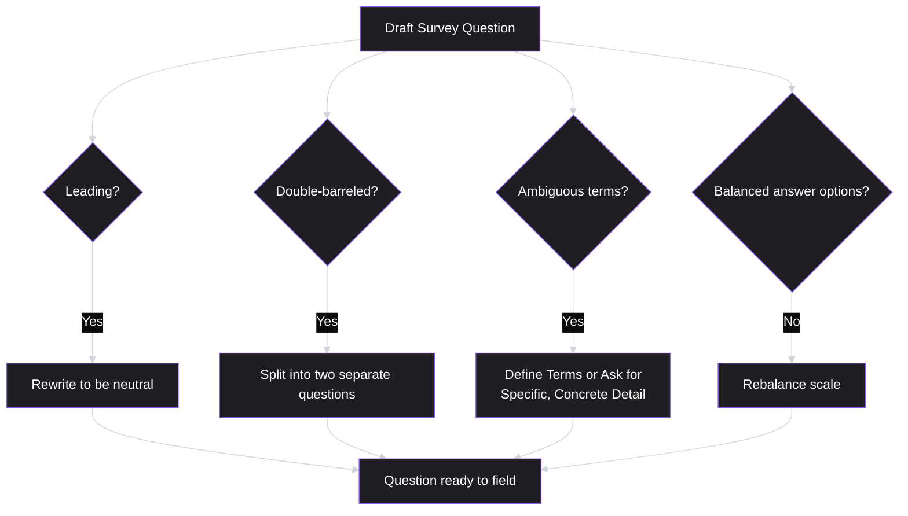

# Lesson 13: Surveys

## Why This Lesson Matters

Lesson 12 gave you a way to go deep with a small number of people. This lesson gives you the complementary tool: a way to check, across a much larger population, whether what you learned from those few conversations actually generalizes. A **survey** is a structured research instrument administered to many respondents at once, designed to answer quantitative questions — how many, how much, how often — that a handful of interviews cannot reliably answer on their own, directly extending Lesson 11's qualitative/quantitative distinction into a specific, buildable method.

Surveys are also, unfortunately, one of the easiest research instruments to build badly while feeling confident you've built them well. A leading question (Lesson 11), a biased sample, or a poorly worded scale can produce a clean-looking chart of numbers that feels authoritative precisely because it's quantitative — while actually encoding all the same distortions a bad interview would, just with more decimal places. This lesson exists to make sure the numbers you get out of a survey are actually measuring what you think they're measuring.

---

## Learning Path

| Field | Detail |
|---|---|
| **Module** | 2 — Users & Research |
| **Current Lesson** | 13 of 90 |
| **Difficulty** | 4 / 10 |
| **Estimated Study Time** | 25 minutes (reading) + 15 minutes (reflection + quiz) |
| **Prerequisites** | Lesson 11 (User Research), Lesson 12 (Customer Interviews) |
| **Next Lesson** | Lesson 14 — Personas |
| **Future Topics Unlocked** | Lesson 14 (Personas — often synthesized from combined interview and survey data), Lesson 18 (Customer Segmentation — frequently validated with survey data at scale), Lesson 19 (Opportunity Identification) |

---

## Learning Objectives

By the end of this lesson, you will be able to:

1. Identify when a survey is the appropriate research method, versus when an interview or behavioral data is better suited to the question.
2. Distinguish well-constructed survey questions from leading, double-barreled, or ambiguous ones.
3. Explain the purpose and correct interpretation of common quantitative scales (Likert scales, NPS) and their known limitations.
4. Identify sampling bias in survey distribution and explain its effect on the validity of results.
5. Apply a basic checklist for evaluating whether a completed survey's findings are trustworthy enough to inform a decision.

---

## Prerequisites

Lesson 11 (User Research) and Lesson 12 (Customer Interviews). This lesson assumes fluency with the stated-versus-revealed-preference distinction and the qualitative/quantitative complementary-methods framework, and extends both into the specific mechanics of survey design.

---

## Theory

### When a Survey Is the Right Tool

Recall Lesson 11's framework: quantitative methods are well suited to how-many/how-much questions, where a large, representative sample is needed to support a claim about prevalence or scale. Surveys are the most common quantitative instrument for this purpose. A survey is the right tool when:

- You already have a well-formed hypothesis (often generated through qualitative interviews, per Lesson 12) and need to know how widespread it is across the broader user base.
- You need to measure something efficiently across a large population that would be prohibitively expensive to interview individually.
- You need a baseline measurement to track over time (e.g., satisfaction tracked quarterly).

A survey is the wrong tool when you don't yet know what you're looking for — a survey can only ask about things the designer already thought to ask about, unlike an open-ended interview, which can follow an unexpected thread wherever it leads. This is why, per Lesson 11's complementary-methods framework, surveys typically work best *after* qualitative research has generated a specific hypothesis to test, not as a substitute for that earlier exploratory work.

### Constructing Good Survey Questions

Several specific, well-documented question-design failures distort survey results:

- **Leading questions** (from Lesson 11): "How much do you love our new dashboard?" presupposes a positive reaction and biases responses toward it, compared to a neutral "How would you describe your experience with the new dashboard?"
- **Double-barreled questions**: asking about two things at once, such as "How satisfied are you with our product's speed and ease of use?" — a respondent might feel very differently about speed than about ease of use, and a single combined answer obscures which one actually drove their response.
- **Ambiguous or vague terms**: asking "How often do you use this feature regularly?" without defining "regularly" leaves each respondent to apply their own inconsistent standard, making aggregated results difficult to interpret meaningfully.
- **Unbalanced or missing answer options**: a satisfaction scale that includes three positive options and only one negative option biases the aggregate distribution toward apparent satisfaction regardless of true sentiment.

### Common Scales: Likert and NPS, and Their Limitations

Two widely used quantitative scales deserve specific attention, both for their usefulness and their well-documented limitations:

- **Likert scales** (typically a 5- or 7-point agreement or satisfaction scale, e.g., "Strongly Disagree" to "Strongly Agree") allow respondents to express degree, not just direction, of sentiment. Their limitation: individual respondents interpret the middle and endpoint options differently (some respondents rarely select extreme options regardless of true sentiment, a pattern sometimes called central tendency bias), meaning cross-respondent comparisons carry more noise than the clean-looking numeric output might suggest.
- **Net Promoter Score (NPS)**, based on the single question "How likely are you to recommend this to a friend or colleague?" on a 0–10 scale, is widely used as a simple, trackable proxy for overall sentiment. Its well-documented limitation, directly connected to Lesson 11's stated-preference warning: NPS asks about a hypothetical future action (a recommendation that may never actually happen), not a real, revealed behavior, and a single number provides no insight into *why* a respondent scored as they did — precisely the kind of why/how gap that quantitative methods, per Lesson 11's framework, are not well suited to answer alone.

Both scales are useful for tracking directional change over time and for flagging where deeper qualitative investigation (returning to Lesson 12's interview techniques) is warranted — but neither should be treated as a complete, self-sufficient answer to "how are we doing and why."

### Sampling Bias in Survey Distribution

Directly extending Lesson 11's representativeness concern, **how a survey is distributed** determines who is even eligible to respond, and this can silently and severely distort results before a single question is even answered. Common patterns:

- **In-app pop-up surveys** reach only currently active users, systematically excluding churned users, users who found the product too frustrating to keep using, and non-users entirely — precisely the populations most likely to reveal the most serious, unaddressed problems.
- **Email surveys sent to an existing customer list** exclude prospects who never converted and churned customers who may have been removed from the active list.
- **Surveys promoted through the product's own social media or community channels** oversample the most engaged, enthusiastic segment of the user base, who are demonstrably not representative of the broader population.

A survey with a large number of responses can still produce badly misleading findings if the distribution method silently excluded the population segment most relevant to the question being asked — a large, biased sample is not more trustworthy than a small, biased one; it simply produces a false sense of confidence at a larger scale.

### A Trustworthiness Checklist for Completed Surveys

Extending Lesson 11's general trustworthiness checklist to the specific case of a completed survey:

1. **Who was excluded by the distribution method**, and does that exclusion matter for the specific question being asked?
2. **Were questions neutral, single-barreled, and clearly defined**, or did any suffer from the failures described above?
3. **Does the survey measure stated preference (e.g., NPS, hypothetical satisfaction) or something closer to revealed preference** (e.g., a question about actual, specific past behavior, similar in spirit to Lesson 12's past-behavior interview questions)?
4. **Is the sample size and response rate sufficient to support the specific claim being made**, and has non-response bias (are the people who didn't respond systematically different from those who did) been considered?
5. **Was the survey used to test an existing hypothesis**, generated through prior qualitative work, or was it used to explore blindly without a clear prior hypothesis — a pattern more likely to produce noisy, hard-to-interpret results?

---

## Common Beginner Mistakes

**Mistake 1: Using a survey to explore an open-ended question with no prior hypothesis.**
Surveys can only ask about what the designer already thought to ask, making them poorly suited to genuinely open-ended exploration — that work belongs to qualitative interviews (Lesson 12), with the survey following afterward to test a specific, now-formed hypothesis at scale.

**Mistake 2: Writing double-barreled questions.**
Combining two distinct dimensions ("speed and ease of use") into a single question makes the resulting number impossible to interpret cleanly, since a respondent's answer conflates two potentially very different underlying sentiments.

**Mistake 3: Distributing a survey only through channels that reach already-engaged users.**
In-app pop-ups, existing customer email lists, and community channels all systematically exclude churned users, frustrated non-adopters, and prospects — often the exact population whose perspective would be most revealing.

**Mistake 4: Treating NPS or a single satisfaction number as a complete answer.**
A single quantitative score can flag that something is wrong, or track directional change over time, but provides no insight into *why* — treating it as sufficient on its own skips the necessary qualitative follow-up.

**Mistake 5: Over-interpreting small differences in Likert scale averages.**
Given individual variation in how respondents use rating scales (central tendency bias and similar effects), small differences between, say, a 3.8 and a 4.1 average often reflect noise rather than a meaningful, decision-worthy difference in underlying sentiment.

---

## Mental Model: The Survey Validity Chain

This lesson's mental model is the **Survey Validity Chain** — a sequence of checkpoints, any one of which can silently invalidate an otherwise clean-looking result.

```mermaid
%%{init: {
  "theme": "dark",
  "themeVariables": {
    "background": "#0b0b0c",
    "primaryColor": "#1f1f23",
    "primaryTextColor": "#ffffff",
    "primaryBorderColor": "#8b5cf6",
    "lineColor": "#d1d5db",
    "secondaryColor": "#18181b",
    "tertiaryColor": "#111111",
    "mainBkg": "#1f1f23",
    "nodeBorder": "#8b5cf6",
    "clusterBkg": "#000000",
    "clusterBorder": "#27272a",
    "titleColor": "#ffffff",
    "edgeLabelBackground": "#0b0b0c",
    "nodeTextColor": "#ffffff",
    "edgeLabelColor": "#ffffff",
    "actorBorder": "#8b5cf6",
    "actorBkg": "#1f1f23",
    "actorTextColor": "#ffffff",
    "sequenceNumberColor": "#ffffff",
    "signalColor": "#8b5cf6",
    "signalTextColor": "#ffffff",
    "textColor": "#ffffff",
    "classText": "#ffffff",
    "classBorder": "#8b5cf6",
    "classBkg": "#1f1f23"
  }
}}%%
graph LR
    A[Distribution Method<br/>Who Could Even Respond?] --> B[Question Design Neutral,<br/>Single-barreled, Defined?]
    B --> C[Scale Choice Appropriate<br/>for What Being Measured?]
    C --> D[Response Rate & Sample Sufficient, and<br/>Is Non-response Bias Accounted For?]
    D --> E[Interpretation Stated or Revealed<br/>Preference? What Follow-up Is Still<br/>Needed?]
    E --> F[Trustworthy Finding]
```

A break at any single link invalidates the chain regardless of how clean the final numbers look — a perfectly worded, neutral question distributed only to the most engaged users is still compromised at the distribution link, and a representatively distributed survey full of leading questions is compromised at the question-design link. Checking the whole chain, not just the parts that are easiest to verify (the final numbers), is the core discipline this lesson asks for.

---

## Real Company Example

**Airbnb**'s use of large-scale surveys alongside qualitative research to understand host and guest trust dynamics is a widely discussed illustration of pairing survey data with other methods rather than relying on either alone. Public product and research commentary from the company has described using broad, quantitative surveys to measure the prevalence of specific trust concerns (such as concerns about safety or unfamiliar hosts) across large segments of users, while pairing that quantitative prevalence data with qualitative interviews to understand the specific reasoning and emotional context behind those concerns — directly reflecting the complementary-methods discipline this lesson and Lesson 11 both describe, rather than treating a survey's aggregate percentages as a self-sufficient explanation on their own.

*(Assumption flagged: this reflects widely reported descriptions of Airbnb's general research approach rather than a claim about the company's specific, current internal survey methodology, which this curriculum does not claim certainty about.)*

---

## Real World Perspective: Surveys at Different Company Stages

**At a startup:**
Surveys are often used sparingly, given small user bases that may not yet support statistically meaningful sample sizes, and qualitative interviews (Lesson 12) frequently carry proportionally more weight in early decision-making. When surveys are used, they are often deployed to test a specific, sharply defined hypothesis already surfaced through direct conversations, rather than for broad, exploratory purposes.

**At a mid-size company:**
Surveys become a more standard, recurring tool — tracking metrics like NPS or feature-specific satisfaction over time, and testing hypotheses generated by product and research teams at a scale that individual interviews cannot efficiently support. This is often where dedicated attention to distribution bias (deliberately including churned users, not just active ones) becomes a more formalized practice.

**At Big Tech:**
Surveys at scale can achieve very high statistical precision, but this precision can create a specific risk: treating a statistically significant but practically small difference as meaningful without considering whether the underlying scale or question wording introduces systematic bias that a larger sample size does nothing to correct. Mature research organizations at this scale typically maintain rigorous survey methodology review (piloting questions, checking for leading or double-barreled phrasing) precisely because errors compound at scale rather than washing out.

---

## Detailed Case Study: The NPS Score That Hid a Problem

Consider a simplified, illustrative scenario common across B2B SaaS companies.

A project collaboration tool's leadership tracks NPS quarterly, distributed via an in-app pop-up shown to users who have been actively logged in for at least ten minutes in the current session. For several consecutive quarters, NPS remains stable and respectably positive, and leadership treats this as evidence that overall customer sentiment is healthy, deprioritizing several proposed initiatives aimed at addressing specific workflow friction that a smaller number of customer support tickets had flagged.

Eighteen months later, the company faces an unexpectedly sharp increase in churn among mid-sized customer accounts. A retrospective investigation finds that the stable, positive NPS scores had been measuring the sentiment of users who were still actively, comfortably using the product — precisely the population least likely to be experiencing the friction driving churn — while excluding, by design, the users who had already begun disengaging or who left negative feedback through support channels rather than staying logged in long enough to see the in-app survey pop-up at all.

**What went wrong?**

Applying this lesson's frameworks:

1. **The distribution method silently excluded the population most relevant to the churn question.** A survey requiring ten minutes of active session time before triggering will, by construction, undersample exactly the disengaging or frustrated users whose declining engagement is the leading indicator of the churn problem the company later discovered.
2. **A single quantitative score (NPS) was treated as a complete, self-sufficient answer**, rather than as a signal that — even at a healthy-looking level — warranted qualitative follow-up specifically with the users the survey's own distribution method was excluding.
3. **The Survey Validity Chain broke at the distribution link**, and no amount of clean-looking, statistically stable NPS numbers in subsequent quarters could correct for that initial, structural flaw — the numbers remained clean precisely because the same excluded population kept being excluded, quarter after quarter.

A team applying this lesson's checklist would have asked, before trusting the stable NPS trend: who is systematically excluded by requiring ten active minutes to trigger the survey, and does that exclusion matter for the specific question (overall customer health) being asked? This question alone would likely have prompted a supplementary, more inclusive research effort — reaching disengaging users through a different channel, such as targeted outreach to accounts showing declining usage — well before the churn increase made the gap unavoidably visible.

This case will be revisited in **Lesson 18 (Customer Segmentation)**, where we discuss stratified sampling approaches designed specifically to avoid this kind of engagement-correlated exclusion.

---

## Framework Explanation: The Question-Type Decision Table

A practical summary table for choosing the right survey question type, given a specific research goal:

| Research Goal | Recommended Question Type | Avoid |
|---|---|---|
| Measure directional sentiment over time | Likert scale, tracked consistently across waves | Changing question wording between waves, which invalidates trend comparisons |
| Get a simple, trackable proxy for overall health | NPS, paired with a mandatory open-ended follow-up ("why did you give that score?") | Treating the NPS number alone as sufficient without the qualitative follow-up |
| Understand actual past behavior | Specific, concrete behavioral questions ("How many times did you use X in the past week?") | Vague frequency terms like "regularly" or "often" without a defined timeframe |
| Test a specific hypothesis from prior interviews | A targeted, single-barreled question directly testing that hypothesis | A broad, exploratory question with no prior hypothesis to test |

The consistent discipline across this table: **choose the question type based on the specific goal, and always pair a quantitative score with some mechanism (an open-ended follow-up, or planned qualitative research) for understanding the why behind the number**, rather than letting the quantitative score stand alone as if it were self-explanatory.

---

## Interview Perspective: How Interviewers Think About This

**Typical question 1: "How would you design a survey to measure customer satisfaction?"**
*What the interviewer is actually evaluating:* Whether the candidate considers distribution method (who gets excluded), question design (leading, double-barreled, ambiguous), and pairs any quantitative score with a mechanism for understanding the underlying why — versus simply naming a metric like NPS without engaging with its known limitations.

**Typical question 2: "Your survey shows 90% satisfaction, but churn is rising. How do you reconcile that?"**
*What the interviewer is actually evaluating:* Whether the candidate immediately suspects a sampling or distribution bias (echoing this lesson's Detailed Case Study) rather than accepting the two numbers as simply contradictory or dismissing the churn data. A strong answer specifically asks who was excluded from the survey's sample.

**Typical question 3: "When would you use a survey instead of interviews, or vice versa?"**
*What the interviewer is actually evaluating:* Fluency with Lesson 11's complementary-methods framework as applied specifically to surveys — recognizing that surveys test known hypotheses at scale, while interviews generate and explore hypotheses in depth, and that neither substitutes fully for the other.

---

## Summary

Surveys are the primary quantitative research instrument for answering how-many/how-much questions at scale, and work best when testing a specific hypothesis already generated through qualitative research (Lesson 12), rather than for open-ended exploration. Good survey questions avoid leading phrasing, double-barreled framing, and ambiguous terms, and use balanced answer scales. Common scales like Likert and NPS are useful for tracking directional sentiment but have well-documented limitations — NPS measures a hypothetical future action (a stated-preference concern directly tied to Lesson 11) and provides no insight into why, while Likert scales carry individual-level noise from inconsistent scale usage. Sampling bias in survey distribution — reaching only currently active users, existing customer lists, or engaged community members — can silently exclude the exact population segment most relevant to a given question, producing a large but misleading sample, as shown in this lesson's Detailed Case Study. The Survey Validity Chain (distribution, question design, scale choice, sample/response rate, interpretation) can break at any single link regardless of how clean the final numbers appear, making a full-chain check essential before treating survey findings as trustworthy.

---

## Key Takeaways

- Surveys answer how-many/how-much questions at scale and work best testing a hypothesis already generated qualitatively, not for open-ended exploration.
- Avoid leading, double-barreled, and ambiguous questions, and use balanced answer scales.
- Likert scales and NPS are useful for tracking directional sentiment but have known limitations — NPS is a stated-preference measure with no built-in "why," and Likert scales carry individual response-style noise.
- Survey distribution method determines who can even respond, and can silently exclude the exact population most relevant to a given question (e.g., churned or disengaging users).
- A large sample does not correct for a biased distribution method — it produces a false sense of confidence at a larger scale, not a more trustworthy result.
- The Survey Validity Chain (distribution, question design, scale, sample/response rate, interpretation) can break at any single link, invalidating an otherwise clean-looking result.
- Always pair a quantitative score with a mechanism for understanding the why behind it — an open-ended follow-up question, or planned qualitative research.

---

## Cheat Sheet

*A two-minute review of everything in this lesson.*

- **Surveys test known hypotheses at scale; interviews generate them.** Don't use a survey for open-ended exploration.
- **Avoid:** leading questions, double-barreled questions, ambiguous terms, unbalanced scales.
- **NPS = stated preference, no "why."** Always pair it with an open-ended follow-up.
- **Likert scales carry individual noise** — don't over-interpret small average differences (e.g., 3.8 vs. 4.1).
- **Distribution method determines who's excluded** — in-app pop-ups, existing customer lists, and community channels all skew toward the already-engaged.
- **A large biased sample ≠ trustworthy** — it's just confident-looking noise at scale.
- **Survey Validity Chain:** distribution → question design → scale → sample/response rate → interpretation. Any broken link invalidates the result.

---

## Glossary

| Term | Definition | Related Concepts | Difficulty |
|---|---|---|---|
| Survey | A structured research instrument administered to many respondents to answer quantitative (how-many/how-much) questions. | Qualitative/Quantitative Research (Lesson 11) | 2 |
| Double-Barreled Question | A survey question that asks about two distinct dimensions at once, making the resulting answer difficult to interpret. | Question Design | 2 |
| Likert Scale | A multi-point agreement or satisfaction scale (e.g., 5- or 7-point) used to express degree of sentiment. | Central Tendency Bias | 2 |
| Net Promoter Score (NPS) | A single-question metric ("How likely are you to recommend this?") on a 0–10 scale, used as a proxy for overall sentiment. | Stated Preference (Lesson 11) | 2 |
| Sampling Bias (in Surveys) | Systematic distortion caused by a distribution method that excludes a relevant population segment from ever being able to respond. | Evidence Trustworthiness Ladder (Lesson 11) | 2 |
| Survey Validity Chain | A sequence of checkpoints (distribution, question design, scale, sample/response rate, interpretation), any one of which can invalidate a survey's results. | Trustworthiness Checklist | 3 |

---

## Further Reading / Resources

- Jared M. Spool and various UX research practitioners' widely cited public writing on survey question design pitfalls (leading, double-barreled, and ambiguous phrasing).
- Fred Reichheld, *The Ultimate Question 2.0* — the origin of the Net Promoter Score methodology, alongside its intended use and documented limitations.
- Erika Hall, *Just Enough Research* — extends the qualitative/quantitative complementary-methods framework introduced in Lesson 11 directly into practical survey design guidance.

---

## Flashcards

**Card 1**
- Front: When is a survey the right research tool, versus an interview?
- Back: A survey is right for testing a specific, already-formed hypothesis across a large population (how-many/how-much); an interview is right for open-ended exploration and understanding why/how, since a survey can only ask about what the designer already thought to ask.
- Difficulty: 2
- Tags: survey-vs-interview

**Card 2**
- Front: What is a double-barreled question, and why is it a problem?
- Back: A question that asks about two distinct dimensions at once (e.g., speed and ease of use); it's a problem because a single combined answer obscures which dimension actually drove the respondent's sentiment.
- Difficulty: 2
- Tags: double-barreled

**Card 3**
- Front: What is the key limitation of NPS, connected to Lesson 11's stated-preference concept?
- Back: NPS asks about a hypothetical future action (whether someone would recommend the product) rather than actual, revealed behavior, and provides no insight into why a respondent scored as they did.
- Difficulty: 2
- Tags: nps-limitation

**Card 4**
- Front: Why can a large survey sample still produce misleading results?
- Back: If the distribution method excludes a relevant population (e.g., churned users), a large sample simply produces a confident-looking result at scale — it does not correct for the underlying sampling bias.
- Difficulty: 3
- Tags: sampling-bias

**Card 5**
- Front: Name the five links in the Survey Validity Chain.
- Back: Distribution method, question design, scale choice, sample size/response rate, and interpretation.
- Difficulty: 3
- Tags: survey-validity-chain

**Card 6**
- Front: In the Detailed Case Study, why did stable, positive NPS scores fail to predict the later increase in churn?
- Back: The survey's distribution method (requiring ten active minutes in-session) systematically excluded disengaging or frustrated users, who were exactly the population whose declining engagement predicted the eventual churn.
- Difficulty: 3
- Tags: case-study, nps

**Card 7**
- Front: What should always accompany a quantitative score like NPS or a Likert average, according to this lesson?
- Back: A mechanism for understanding the why behind the number — an open-ended follow-up question, or planned qualitative research (interviews, per Lesson 12) — since the quantitative score alone doesn't explain the underlying reasoning.
- Difficulty: 2
- Tags: quantitative-qualitative-pairing

---

## Reflection Exercise

You are the PM for a meal-planning app and want to measure how well a recently launched grocery-list feature is being received.

Work through the following, in writing, before reading further:

1. Write one leading version and one neutral version of a satisfaction question about this feature.
2. Write one double-barreled question about this feature, then split it into two separate, single-barreled questions.
3. Choose between a Likert scale and NPS for measuring reception of this specific feature, and justify your choice, noting the limitation of whichever scale you choose.
4. Identify at least two distribution methods you could use for this survey, and for each, name a population segment it would likely exclude.
5. Using the Survey Validity Chain, identify which link you believe is most at risk of breaking in your proposed survey design, and describe one specific step you would take to strengthen it.

There is no single correct answer. The purpose of this exercise is to practice applying every link of the Survey Validity Chain to a concrete survey design, rather than treating survey construction as a simple, low-risk task.

---

## Quiz

**1. According to this lesson, when is a survey generally the most appropriate research method?**
A) When exploring an entirely new, undefined problem space with no prior hypothesis
B) When testing a specific hypothesis, often generated through prior qualitative research, across a larger population
C) When a team wants to avoid talking to real customers entirely
D) Only when a product has fewer than 100 total users

*Correct answer: B*
*Explanation: The lesson explains that surveys work best testing an already-formed hypothesis at scale, since they can only ask about what the designer already thought to ask, unlike open-ended interviews.*
*Learning objective tested: #1*
*Difficulty: Easy*

---

**2. Which of the following is an example of a double-barreled survey question?**
A) "How satisfied are you with the product's loading speed?"
B) "How satisfied are you with the product's speed and ease of use?"
C) "How often did you use this feature last week?"
D) "How likely are you to recommend this product to a colleague?"

*Correct answer: B*
*Explanation: This question combines two distinct dimensions (speed and ease of use) into a single question, making the resulting answer difficult to interpret cleanly — the defining feature of a double-barreled question.*
*Learning objective tested: #2*
*Difficulty: Easy*

---

**3. What is the primary limitation of Net Promoter Score (NPS), as described in this lesson?**
A) It cannot be calculated using a 0–10 scale
B) It measures a hypothetical future action rather than actual behavior, and provides no insight into why a respondent scored as they did
C) It can only be used by B2B companies
D) It requires a minimum sample size of 10,000 respondents to be valid

*Correct answer: B*
*Explanation: NPS asks about a hypothetical recommendation (a stated-preference concern per Lesson 11) and, as a single number, offers no explanation of the underlying reasoning behind the score.*
*Learning objective tested: #3*
*Difficulty: Easy*

---

**4. Why does an in-app pop-up survey, shown only to currently active users, introduce sampling bias?**
A) Because in-app pop-ups are technically difficult to implement
B) Because it systematically excludes churned users, frustrated non-adopters, and other disengaged populations who may be most relevant to certain research questions
C) Because active users always provide dishonest answers
D) Because pop-up surveys always have leading questions by design

*Correct answer: B*
*Explanation: Restricting distribution to currently active users excludes precisely the population (churned, disengaged, or frustrated users) that questions about overall health or churn risk would most need to capture.*
*Learning objective tested: #4*
*Difficulty: Easy*

---

**5. In the Detailed Case Study, why did stable, positive NPS scores fail to predict the later spike in churn?**
A) The NPS scale was mathematically miscalculated
B) The survey's distribution method (requiring ten minutes of active session time) excluded disengaging users, who were the population actually driving the churn
C) NPS is never a useful metric under any circumstances
D) The company simply didn't collect enough NPS responses

*Correct answer: B*
*Explanation: The case study explicitly attributes the missed signal to a distribution-method bias that excluded exactly the population whose behavior was predictive of the churn problem.*
*Learning objective tested: #4, #5*
*Difficulty: Easy*

---

**6. According to this lesson, what should always accompany a tracked quantitative score like NPS?**
A) Nothing — a single quantitative score is always sufficient on its own
B) A mechanism (such as a mandatory open-ended follow-up question) for understanding the underlying reasoning behind the score
C) A requirement that all respondents must also complete a lengthy in-person interview
D) An immediate decision to change the product, regardless of the score's value

*Correct answer: B*
*Explanation: The lesson explicitly recommends pairing a quantitative score with a mechanism for understanding the "why," since the number alone doesn't explain the reasoning behind it.*
*Learning objective tested: #3, #5*
*Difficulty: Easy*

---

**7. Why can a survey with a very large number of responses still produce misleading findings?**
A) Large sample sizes are always statistically invalid
B) A biased distribution method can produce a confident-looking result at scale without correcting for the underlying exclusion of a relevant population
C) Large samples always contain more leading questions than small samples
D) Survey platforms limit the accuracy of results once a certain sample size is reached

*Correct answer: B*
*Explanation: This lesson explicitly warns that a large sample does not fix a biased distribution method — it simply produces a false sense of confidence at greater scale.*
*Learning objective tested: #4*
*Difficulty: Medium*

---

**8. Which of the following best describes the Survey Validity Chain?**
A) A sequence of checkpoints (distribution, question design, scale, sample/response rate, interpretation) where a break at any single link can invalidate the overall result
B) A single-step process focused only on choosing the correct scale (Likert vs. NPS)
C) A method for calculating statistical significance without needing to consider sample bias
D) A checklist used only after a survey has already been fielded, with no relevance to survey design

*Correct answer: A*
*Explanation: The chain represents multiple sequential checkpoints, each of which can independently invalidate the survey's results regardless of how the others perform.*
*Learning objective tested: #5*
*Difficulty: Medium*

---

**9. (Scenario) A team wants to know precisely why users abandon a specific onboarding step, an open-ended and not-yet-understood problem. According to this lesson, what is the most appropriate first research method?**
A) A large-scale quantitative survey with predefined multiple-choice answer options
B) Qualitative interviews (per Lesson 12), since the team does not yet have a specific hypothesis a survey could test
C) An NPS survey sent to all users regardless of whether they experienced the onboarding step
D) No research is needed; the team should simply guess based on internal opinion

*Correct answer: B*
*Explanation: Since the team lacks a specific, already-formed hypothesis, qualitative interviews are the appropriate first step, consistent with the lesson's guidance that surveys work best testing hypotheses rather than exploring undefined problems.*
*Learning objective tested: #1*
*Difficulty: Medium-Hard*

---

**10. (Product Thinking) A survey shows a small average difference between two feature versions (3.8 vs. 4.1 on a 5-point Likert scale). According to this lesson, what should a team be cautious about before treating this as a meaningful, decision-worthy difference?**
A) Nothing — any numeric difference should be treated as decisive
B) Individual variation in how respondents use Likert scales (central tendency bias and similar effects) can produce noise of this magnitude, so a small difference may not reflect a meaningful underlying sentiment gap
C) Likert scales cannot be used for comparing two different feature versions under any circumstances
D) The team should immediately discard both feature versions

*Correct answer: B*
*Explanation: The lesson explicitly warns against over-interpreting small Likert-average differences, given known individual-level noise in how people use rating scales.*
*Learning objective tested: #3*
*Difficulty: Medium-Hard*

---

**11. (Interview Reasoning) An interviewer presents a scenario where survey results show high satisfaction but churn is rising, and asks a candidate how to reconcile this. A weak answer would most likely do which of the following?**
A) Immediately question the survey's distribution method and consider whether a relevant population was excluded
B) Accept both figures as simply contradictory and unresolvable, without further investigation
C) Propose supplementary outreach to disengaging or churned users who may have been excluded from the original survey
D) Ask what the survey's actual questions were, to check for leading or double-barreled phrasing

*Correct answer: B*
*Explanation: The lesson's Interview Perspective explicitly frames immediate suspicion of sampling or distribution bias as the strong response; treating the two figures as simply irreconcilable without further investigation reflects a weaker, less diagnostic approach.*
*Learning objective tested: #4*
*Difficulty: Hard*

---

**12. (Product Thinking, Higher Difficulty) A team wants to track customer sentiment about a specific feature over multiple quarters. Which of the following practices would most undermine the validity of that tracked trend, according to this lesson?**
A) Using the same Likert scale and wording consistently across each quarterly wave
B) Changing the survey's question wording or scale between waves, making comparisons across time unreliable
C) Pairing the tracked score with an open-ended follow-up question each quarter
D) Distributing the survey to a consistent, well-defined population across waves

*Correct answer: B*
*Explanation: Changing question wording or scale between measurement waves breaks the ability to meaningfully compare results over time, undermining the core purpose of a tracked trend metric.*
*Learning objective tested: #2, #3*
*Difficulty: Medium-Hard*

---

**13. (Interview Reasoning, Higher Difficulty) A candidate proposes fielding a broad, open-ended survey to "discover what's wrong with the product," with no prior hypothesis to test. What is the strongest critique of this approach, based on this lesson?**
A) Surveys are never useful for any purpose and should be avoided entirely
B) A survey without a specific prior hypothesis is poorly suited to genuine exploration, since it can only ask about what the designer already thought to ask — qualitative interviews are better suited to this open-ended goal
C) The survey should include as many double-barreled questions as possible to cover more ground efficiently
D) This approach is ideal, since broader questions always produce more useful data

*Correct answer: B*
*Explanation: This directly reflects the lesson's guidance that surveys are the wrong tool for genuinely open-ended exploration, since they are inherently limited to questions already anticipated by the designer.*
*Learning objective tested: #1*
*Difficulty: Hard*

---

**14. (Product Thinking, Higher Difficulty) A team notices their survey's response rate is very low, and wonders whether respondents differ systematically from non-respondents. What concept does this concern reflect, and why does it matter?**
A) Central tendency bias, and it matters because it affects only Likert scale interpretation
B) Non-response bias, and it matters because if respondents are systematically different from non-respondents (e.g., more engaged or more dissatisfied), the survey's findings may not generalize to the full population being studied
C) Double-barreled question bias, and it matters only for questions combining multiple dimensions
D) This concern is irrelevant as long as the total number of responses is large

*Correct answer: B*
*Explanation: Non-response bias — the concern that respondents differ systematically from non-respondents — is explicitly named in this lesson's trustworthiness checklist as a factor to consider alongside raw sample size.*
*Learning objective tested: #4, #5*
*Difficulty: Hard*

---

**15. (Highest Difficulty) A survey uses neutral, single-barreled, well-defined questions and a large, representative sample distributed across active users, recent churned users, and prospects who never converted — but reports only a single aggregated NPS-style score with no open-ended follow-up. Applying the full Survey Validity Chain, what specific weakness remains?**
A) No weakness remains; this survey is fully valid and complete
B) The interpretation link remains weak — a single aggregated stated-preference score, even from a well-distributed, well-designed survey, still lacks the "why" that would come from an open-ended follow-up or complementary qualitative research
C) The distribution link is the only weakness, since active, churned, and prospective users were all included
D) The question design link is the only remaining weakness, despite the description explicitly noting neutral, single-barreled, well-defined questions

*Correct answer: B*
*Explanation: Even a survey that clears the distribution and question-design links can still fail at the interpretation link if it relies solely on an aggregated stated-preference score without any mechanism for understanding the underlying reasoning — testing whether the full chain, not just the earlier links, has been checked.*
*Learning objective tested: #3, #5*
*Difficulty: Hard*

---

## Connections

| | Lesson | Core Idea Carried Forward |
|---|---|---|
| **Previous Lesson** | Lesson 12 — Customer Interviews | Provides the qualitative hypothesis-generation step that a well-designed survey is typically built to test at scale |
| **Current Lesson** | Lesson 13 — Surveys | Question design pitfalls; Likert and NPS limitations; sampling bias in distribution; the Survey Validity Chain |
| **Next Lesson** | Lesson 14 — Personas | Often synthesizes combined interview and survey data into a structured, evidence-based representation of user segments |
| **Future Concepts Unlocked** | Lesson 18 (Customer Segmentation) | Uses stratified, bias-aware survey sampling techniques to validate segment definitions at scale |
| | Lesson 19 (Opportunity Identification) | Uses survey-validated prevalence data to help size and prioritize identified opportunities |

This curriculum is designed to be read as one continuous argument. From this lesson forward, any reference to survey data or a quantitative score assumes the Survey Validity Chain has been checked — this will not be re-explained, only re-applied.
