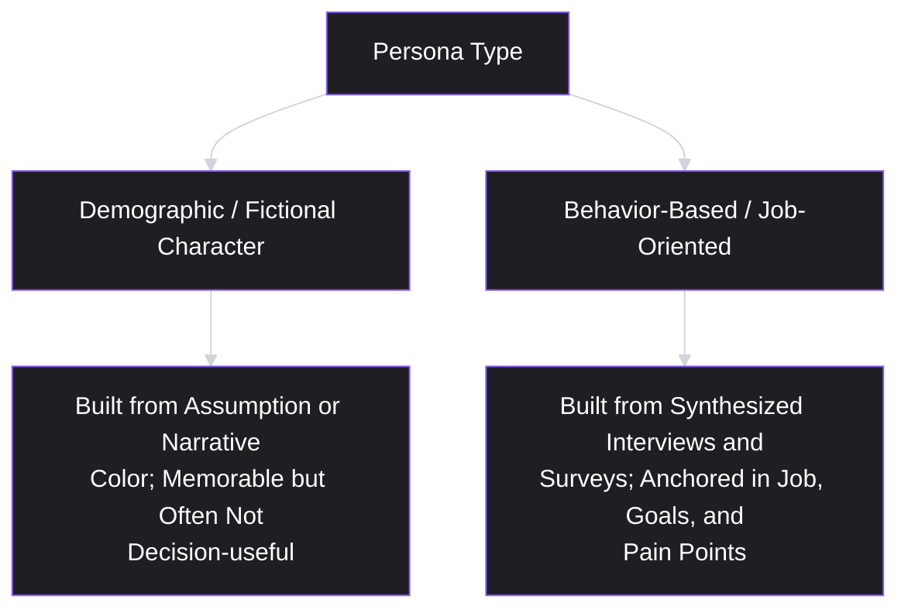
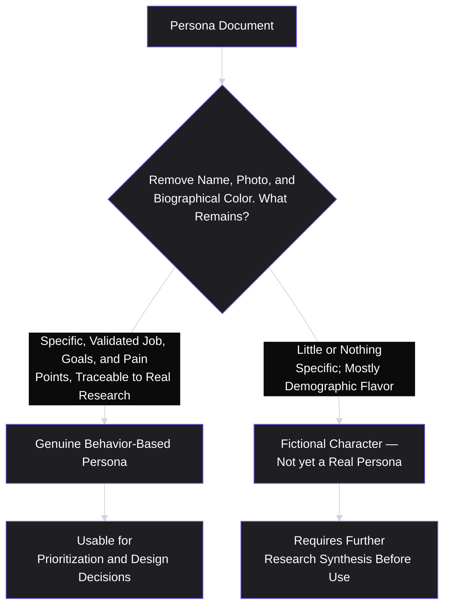

# Lesson 14: Personas

## Why This Lesson Matters

You now have two research engines running: deep, qualitative interviews (Lesson 12) and broad, quantitative surveys (Lesson 13). Both produce raw findings — quotes, transcripts, percentages, cross-tabs. Neither, by itself, gives a team an easy way to keep that evidence alive in daily decision-making, months after the research was conducted. A **persona** is the artifact that tries to solve this specific problem: a synthesized, evidence-based representation of a distinct user segment, built to make research findings memorable, referenceable, and usable in day-to-day product conversations, long after the original interviews and surveys have faded from anyone's immediate memory.

This lesson matters because personas have a well-earned reputation for going wrong in a specific, recognizable way: a poorly built persona — invented from assumption rather than research, or built around demographic details with no connection to actual behavior — becomes worse than useless. It doesn't just fail to help; it actively misleads, because it wears the visual trappings of rigor (a name, a photo, a job title, a quote) while smuggling in exactly the kind of unvalidated assumption this entire curriculum has been teaching you to catch. This lesson is about building personas that earn their place as a genuine synthesis of Lessons 6, 11, 12, and 13, rather than a fictional character dressed up as research.

---

## Learning Path

| Field | Detail |
|---|---|
| **Module** | 2 — Users & Research |
| **Current Lesson** | 14 of 90 |
| **Difficulty** | 3 / 10 |
| **Estimated Study Time** | 25 minutes (reading) + 15 minutes (reflection + quiz) |
| **Prerequisites** | Lesson 6 (Jobs To Be Done), Lesson 12 (Customer Interviews), Lesson 13 (Surveys) |
| **Next Lesson** | Lesson 15 — User Journey Mapping |
| **Future Topics Unlocked** | Lesson 15 (User Journey Mapping — often built per persona), Lesson 18 (Customer Segmentation — a more rigorous, quantitative complement to personas), Lesson 22 (PRDs — often reference specific personas directly) |

---

## Learning Objectives

By the end of this lesson, you will be able to:

1. Define a persona and distinguish a behavior-based, job-oriented persona from a demographic-based, "fictional character" persona.
2. Explain why personas must be built from synthesized research (Lessons 12 and 13), not assumption, and identify the specific risks of skipping that step.
3. Apply a structured template for building a persona around a job, goals, and pain points, rather than superficial demographic detail.
4. Identify the "too many personas" and "persona as decoration" failure patterns and explain why they undermine the artifact's purpose.
5. Use a persona as a practical tool for prioritization and communication, distinguishing this use from treating a persona as a complete substitute for ongoing research.

---

## Prerequisites

Lesson 6 (Jobs To Be Done), Lesson 12 (Customer Interviews), and Lesson 13 (Surveys). This lesson assumes you can articulate a job statement, have conducted or reviewed interviews designed to surface past behavior, and understand how survey data can validate prevalence — a persona is the synthesis point where all three come together into a single, referenceable artifact.

---

## Theory

### The Core Definition, and the Trap Hiding Inside It

A persona is a synthesized representation of a distinct group of users, built from research, that captures their goals, jobs to be done, behaviors, and pain points in a form the whole team can quickly recall and reference. The trap hiding inside this definition is that a persona's most visible features — a name, a photo, a fictional biographical detail ("Sarah, 34, marketing manager, enjoys hiking on weekends") — are almost never the load-bearing part of a genuinely useful persona, yet they are frequently the part teams spend the most effort polishing.

The load-bearing part of a persona is the **job, the goals, and the pain points** — the same underlying concepts covered in Lesson 6 (Jobs to Be Done) and surfaced through the interview and survey techniques in Lessons 12 and 13. A persona's demographic and biographical detail should exist only to the extent it is genuinely predictive of behavior relevant to the product; when it is included purely for narrative color, it risks distracting from, or actively substituting for, the actual research-based substance the persona is supposed to convey.

### Behavior-Based Personas vs. Demographic "Fictional Character" Personas

This lesson draws a sharp distinction between two very different things that both get called "personas" in practice:

- **A demographic, fictional-character persona** is built primarily around surface-level attributes — age, job title, hobbies, a stock photo — often invented or assumed rather than derived from actual research, and frequently more memorable as a character than useful as a decision-making tool.
- **A behavior-based, job-oriented persona** is built primarily around a validated job to be done (Lesson 6), specific goals, and specific pain points, drawn directly from synthesized interview and survey findings — with demographic detail included only when it is genuinely correlated with a meaningfully different job or behavior pattern.

The clearest diagnostic question for distinguishing the two: **if you removed the name, photo, and biographical color from this persona, would there still be something specific and useful left** — a distinct job, a distinct set of goals, distinct pain points, validated by real research? If the answer is no, what remains is a fictional character, not a behavior-based persona, regardless of how polished its visual presentation is.

### Why Personas Must Be Built from Research, Not Assumption

A persona invented from a team's collective assumption about "our typical user," without grounding in actual interviews or survey data, inherits every bias this curriculum has already covered — most dangerously, it tends to reflect the team's own mental model of the user (often shaped by whoever is loudest or most senior in the room) rather than an evidence-based account of real behavior. This is a direct extension of Lesson 11's core warning: an unvalidated assumption dressed up in a specific, professional-looking format (a persona document, complete with name and photo) is not made more trustworthy by that formatting — if anything, the polished presentation can make an unvalidated assumption feel more authoritative than it has actually earned the right to feel.

A behavior-based persona built from actual synthesized research carries a specific kind of authority a fictional one cannot: it can be pointed back to specific interview quotes, specific survey response patterns, and specific validated jobs, meaning a team member who questions the persona's accuracy can actually be shown the underlying evidence, rather than simply being told to trust the persona because it was written down.

### Building a Persona: A Structured Template

A useful, research-grounded persona template includes:

- **Persona name and one-line summary**: a short, memorable label, but understood as a convenience for reference, not the substance of the persona.
- **Primary job to be done**: stated using the Lesson 6 structure ("When [situation], I want to [motivation], so I can [outcome]").
- **Goals**: what this segment is ultimately trying to achieve, distinct from the specific job statement — often a slightly higher-altitude version of the job.
- **Pain points**: specific, concrete frustrations with current solutions (including workarounds and non-consumption, per Lesson 6), ideally drawn directly from interview findings.
- **Behavioral patterns**: how this segment actually uses (or doesn't use) relevant tools today, drawn from revealed-preference data (Lesson 11) wherever possible.
- **Representative quote(s)**: a real, sourced quote from actual research — never an invented quote presented as if it were real — used to keep the persona anchored to genuine evidence.
- **Validated prevalence** (where available): an indication, from survey data (Lesson 13), of roughly how large or significant this segment is, distinguishing a persona representing a large, common segment from one representing a small, niche one.

A persona missing the job, goals, and pain points sections — or filling them with vague, generic language rather than specific findings — has not actually completed the synthesis work a persona is meant to represent, regardless of how complete its demographic section looks.

### The "Too Many Personas" and "Persona as Decoration" Failure Patterns

Two specific, common failure patterns deserve direct attention:

- **Too many personas**: creating a large number of personas (sometimes a dozen or more) in an attempt to represent every possible variation observed in research. This dilutes the artifact's core purpose — making research memorable and actionable — since a team cannot realistically hold more than a small handful of distinct personas in mind during a typical prioritization discussion. A large number of personas often indicates that the underlying segments haven't actually been prioritized or consolidated around the segments that matter most for the product's current strategy (Lesson 10).
- **Persona as decoration**: creating polished persona documents (often as posters, slide decks, or wiki pages) that are well-received when first presented, but never actually referenced again in a real prioritization or design decision. This is the persona equivalent of Lesson 8's discovery theater — the visible form of a research-synthesis artifact, without the artifact ever actually functioning as a genuine decision-making tool.

---

## Common Beginner Mistakes

**Mistake 1: Building a persona primarily around demographic detail rather than job, goals, and pain points**

As covered above, a persona whose core content evaporates once the name, photo, and biographical color are removed is a fictional character, not a genuinely useful behavior-based persona.

**Mistake 2: Inventing a persona from team assumption rather than actual research**

This inherits all the biases Lesson 11 warns about, while the polished, professional-looking persona format can make an unvalidated assumption feel more authoritative than it has earned the right to feel.

**Mistake 3: Creating too many personas to capture every observed variation**

A large number of personas dilutes the artifact's core purpose and often indicates unfinished consolidation or prioritization work, rather than reflecting genuine product-strategic focus.

**Mistake 4: Treating personas as static, one-time artifacts that never need updating**

As markets, products, and user behavior change over time, a persona built from research conducted years earlier may no longer accurately reflect the current segment it claims to represent — personas should be periodically revisited against fresh research, similar to Lesson 9's guidance on revisiting a vision when the underlying evidence has genuinely shifted.

**Mistake 5: Building a persona that is well-received once, then never referenced again in real decisions**

This is the persona-as-decoration failure — a polished artifact that never actually functions as an ongoing decision-making tool, which suggests the persona was built for a presentation moment rather than for genuine, ongoing use.

---

## Mental Model: The Persona Substance Test

This lesson's mental model is the **Persona Substance Test** — a quick diagnostic for evaluating whether a given persona document is a genuine, behavior-based synthesis or a fictional character in disguise.

Apply this test to any persona document before relying on it in a real decision: strip away the surface-level narrative color and ask what specific, research-traceable content remains. If the answer is "not much," the persona needs more synthesis work before it can be trusted the way this lesson describes.

---

## Real Company Example

**Microsoft**'s long-running use of detailed personas in its product design practice is a widely discussed example of behavior-based persona development at scale. Public accounts of Microsoft's design and research practices over the years have described building personas grounded in extensive usability research and behavioral data across different product lines, rather than personas built primarily around demographic guesswork — with an explicit emphasis on tying persona goals and pain points back to specific, observed user behavior and research findings, precisely the discipline this lesson emphasizes as the difference between a genuinely useful persona and a fictional character.

*(Assumption flagged: this reflects widely reported descriptions of Microsoft's general design research practices rather than a claim about the company's current, complete internal methodology, which this curriculum does not claim certainty about.)*

---

## Real World Perspective: Personas at Different Company Stages

**At a startup:**
Personas are often built from a small number of qualitative interviews (Lesson 12) rather than large-scale survey validation, given limited research resources, and are typically kept few in number — often just one or two — reflecting the startup's need for sharp strategic focus (echoing Lesson 10's exclusion discipline) rather than an attempt to represent every possible user variation.

**At a mid-size company:**
Personas often become a more formalized, cross-functional artifact, ideally validated with both qualitative interviews and quantitative survey data (Lesson 13) to establish prevalence, and periodically revisited as the product and market evolve. This is often where the "too many personas" failure pattern first emerges, as different teams each push to have their own preferred segment represented.

**At Big Tech:**
Personas often need to be coordinated across multiple product lines, and a significant part of research and design leadership's work involves preventing persona proliferation across a large organization — consolidating overlapping or redundant personas defined independently by different teams into a smaller, more strategically coherent set that the whole organization can reference consistently.

---

## Detailed Case Study: The Persona Nobody Could Name

Consider a simplified, illustrative scenario common across B2B software companies.

A team building an expense-reporting tool holds a workshop to define target personas. Without conducting new research, the team draws on their collective impressions from prior sales conversations and internal opinions, producing three polished personas: "Efficient Emma," a detail-oriented finance manager who loves organization; "Busy Ben," a traveling sales executive who hates paperwork; and "Cautious Carla," a compliance-focused controller worried about audit risk. Each persona includes a stock photo, a fabricated quote written by the design team to sound plausible, and a short biography.

The personas are presented enthusiastically at an all-hands meeting and printed as posters for the office. Six months later, a new product manager, preparing a roadmap review, asks the team to point to the specific interview or survey evidence behind "Busy Ben's" stated pain point ("he hates filling out detailed expense categories while traveling"). No one in the room can locate a source — the pain point, on closer inspection, turns out to have been an assumption someone voiced during the original workshop that was written into the persona document as if it were an established finding.

**What went wrong?**

Applying this lesson's frameworks:

1. **The personas were built from assumption, not research** — no interviews or surveys informed the stated jobs, goals, or pain points, meaning the personas inherited the team's pre-existing beliefs rather than reflecting actual customer behavior.
2. **The quotes were fabricated rather than sourced**, directly violating the template's requirement that representative quotes be real and traceable — a fabricated quote presented as genuine creates a false impression of evidentiary support that does not actually exist.
3. **The Persona Substance Test would have failed immediately** had anyone applied it at the time of creation: stripping away "Busy Ben's" name, photo, and biography would have left only an unvalidated assumption about travel-related pain points, with no research trail behind it.

A team applying this lesson's discipline from the outset would have conducted at least a small round of interviews (Lesson 12) with actual traveling sales executives before writing any persona document, sourced any quotes directly from those transcripts, and explicitly flagged any remaining assumption-based content as a hypothesis requiring further validation rather than presenting it as an established finding indistinguishable from validated research.

This case connects directly back to **Lesson 11's core warning**: a polished, professional-looking artifact (here, a persona poster) does not become more trustworthy simply because of its presentation quality — the underlying evidentiary basis is what determines whether it deserves to inform real decisions.

---

## Framework Explanation: The Persona Prioritization Filter

Once a small number of genuine, research-based personas exist, a useful practical framework is the **Persona Prioritization Filter** — using personas to evaluate proposed roadmap items in a manner directly parallel to Lesson 7's Value Proposition Filter and Lesson 9's Vision Filter:

| Question | Purpose |
|---|---|
| Which specific persona(s) does this proposed feature serve? | Forces explicit identification, preventing vague appeals to "users" in general |
| Does it address that persona's validated job, goal, or pain point — or something adjacent that wasn't actually part of the research synthesis? | Distinguishes genuine persona-fit from scope creep dressed up in persona language |
| If this serves a persona representing a small, niche segment, is the investment proportionate to that segment's validated prevalence? | Prevents disproportionate investment in a vivid but numerically small segment |
| Does this feature serve one persona at the expense of another's validated pain points? | Surfaces trade-offs explicitly, echoing Lesson 5's Stakeholder Ledger applied at the persona level |

This filter only functions correctly if the underlying personas have passed the Persona Substance Test — applying this filter to fictional-character personas built from assumption simply launders unvalidated guesses through an official-looking prioritization process, producing false confidence rather than genuine rigor.

---

## Interview Perspective: How Interviewers Think About This

**Typical question 1: "How do you build a persona, and where does the underlying information come from?"**
*What the interviewer is actually evaluating:* Whether the candidate's process is grounded in actual research (interviews, surveys) or in team assumption dressed up as a persona document. A strong answer specifically names the research methods used and how findings were synthesized, rather than describing a purely creative or brainstorming-based process.

**Typical question 2: "Your team has developed six different personas. How would you evaluate whether that's the right number?"**
*What the interviewer is actually evaluating:* Awareness of the "too many personas" failure pattern, and whether the candidate can articulate a principled basis (strategic focus, distinct validated jobs, meaningfully different pain points) for consolidating or reducing the set, rather than treating persona count as an unconstrained creative exercise.

**Typical question 3: "How do you keep a persona from becoming 'shelfware' that no one actually references?"**
*What the interviewer is actually evaluating:* Whether the candidate has concrete practices for keeping a persona alive in ongoing decisions — such as the Persona Prioritization Filter — versus treating persona creation as a one-time presentation exercise (the persona-as-decoration failure).

---

## Summary

A persona is a synthesized, research-based representation of a distinct user segment's job, goals, and pain points, meant to keep genuine research findings alive and referenceable in day-to-day product decisions. The load-bearing content of a genuinely useful persona is its validated job (Lesson 6), goals, and pain points — not its demographic detail or fictional biography, which should be included only when genuinely predictive of behavior. Personas must be built from synthesized interview (Lesson 12) and survey (Lesson 13) research, never from team assumption, since a polished, professional-looking persona document does not become more trustworthy simply through good formatting. Two common failure patterns — creating too many personas, and building personas that are well-received once but never referenced again in real decisions — both undermine a persona's core purpose. The Persona Substance Test (what remains when the name, photo, and biographical color are stripped away) is a quick diagnostic for distinguishing a genuine behavior-based persona from a fictional character, and the Persona Prioritization Filter extends genuine personas into an ongoing, practical prioritization tool, directly parallel to the Value Proposition and Vision Filters from Lessons 7 and 9.

---

## Key Takeaways

- A persona's load-bearing content is job, goals, and pain points — not demographic detail or fictional biography, which should only be included when genuinely predictive of behavior.
- Personas must be built from synthesized interview and survey research, never from team assumption; polished presentation does not confer evidentiary trustworthiness.
- The Persona Substance Test — what remains after removing name, photo, and biography — distinguishes a genuine behavior-based persona from a fictional character.
- "Too many personas" dilutes the artifact's core purpose and often signals unfinished strategic consolidation; a small, focused set is more useful than an exhaustive one.
- "Persona as decoration" describes a well-received but never-referenced artifact — the persona equivalent of discovery theater from Lesson 8.
- The Persona Prioritization Filter uses genuine personas to evaluate proposed features, directly paralleling the Value Proposition Filter (Lesson 7) and Vision Filter (Lesson 9).
- Personas should be periodically revisited against fresh research, since market and behavioral shifts can make an older persona inaccurate over time.

---

## Cheat Sheet

*A two-minute review of everything in this lesson.*

- **Load-bearing content:** job, goals, pain points — not demographics or fictional biography.
- **Personas require research** (interviews + surveys), never assumption — polish doesn't confer trust.
- **Persona Substance Test:** strip the name, photo, and biography — what specific, validated content remains?
- **Too many personas** dilutes focus; **persona as decoration** means it's never actually used.
- **Persona Prioritization Filter:** which persona does this serve, does it hit their validated job/pain point, is investment proportionate to prevalence, and what trade-off does it create?
- **Quotes must be real and sourced** — never fabricated to sound plausible.
- **Revisit personas periodically** as research and markets evolve.

---

## Glossary

| Term | Definition | Related Concepts | Difficulty |
|---|---|---|---|
| Persona | A synthesized, research-based representation of a distinct user segment's job, goals, and pain points. | Job to Be Done (Lesson 6), User Research (Lesson 11) | 2 |
| Behavior-Based Persona | A persona built primarily around a validated job, goals, and pain points, with demographic detail included only when genuinely predictive. | Fictional-Character Persona | 2 |
| Fictional-Character Persona | A persona built primarily around demographic or biographical detail, often assumed rather than research-derived. | Behavior-Based Persona | 2 |
| Persona Substance Test | A diagnostic asking what specific, research-traceable content remains once a persona's name, photo, and biography are removed. | Persona | 2 |
| Too Many Personas | The failure pattern of creating an excessive number of personas, diluting the artifact's core decision-making purpose. | Persona Prioritization Filter | 2 |
| Persona as Decoration | The failure pattern of a well-received persona document that is never actually referenced in real prioritization or design decisions. | Discovery Theater (Lesson 8) | 3 |
| Persona Prioritization Filter | A technique for evaluating proposed features against a genuine persona's validated job, goals, and pain points. | Value Proposition Filter (Lesson 7), Vision Filter (Lesson 9) | 2 |

---

## Further Reading / Resources

- Alan Cooper, *The Inmates Are Running the Asylum* — the original, widely cited source for persona methodology in software design, emphasizing goal-directed design over demographic caricature.
- Indi Young, *Practical Empathy* — a detailed treatment of building research-grounded personas (sometimes framed as "mental models") anchored specifically in behavior and motivation rather than demographics.
- Steve Mulder and Ziv Yaar, *The User Is Always Right* — a practical guide to building and maintaining personas as living, ongoing organizational tools rather than one-time creative artifacts.

---

## Flashcards

**Card 1**
- Front: What is the load-bearing content of a genuinely useful persona?
- Back: The validated job, goals, and pain points — not demographic detail or fictional biography, which should only be included when genuinely predictive of behavior.
- Difficulty: 1
- Tags: persona-substance, fundamentals

**Card 2**
- Front: What is the Persona Substance Test?
- Back: A diagnostic that strips away a persona's name, photo, and biographical color, asking what specific, research-traceable job, goals, and pain points remain.
- Difficulty: 2
- Tags: persona-substance-test

**Card 3**
- Front: Why must personas be built from research rather than team assumption?
- Back: An assumption-based persona inherits the team's existing biases, and its polished, professional presentation can make an unvalidated guess feel more authoritative than it has earned the right to feel.
- Difficulty: 2
- Tags: research-based-personas

**Card 4**
- Front: What is the "too many personas" failure pattern?
- Back: Creating an excessive number of personas to capture every observed variation, which dilutes the artifact's core purpose and often signals unfinished strategic consolidation.
- Difficulty: 2
- Tags: too-many-personas

**Card 5**
- Front: What is "persona as decoration"?
- Back: A well-received, polished persona document that is never actually referenced again in real prioritization or design decisions — the persona equivalent of discovery theater.
- Difficulty: 2
- Tags: persona-as-decoration

**Card 6**
- Front: What are the four questions in the Persona Prioritization Filter?
- Back: Which persona does this serve? Does it address their validated job/goal/pain point? Is investment proportionate to that segment's validated prevalence? What trade-off does it create against another persona's needs?
- Difficulty: 3
- Tags: persona-prioritization-filter

**Card 7**
- Front: In the Detailed Case Study, what specific rule did the fabricated persona quotes violate?
- Back: The template's requirement that representative quotes be real and sourced from actual research — a fabricated quote presented as genuine creates a false impression of evidentiary support that doesn't exist.
- Difficulty: 3
- Tags: case-study, sourced-quotes

## Reflection Exercise

You are the PM for a home-repair marketplace app connecting homeowners with contractors. Your team has conducted interviews (Lesson 12) and a survey (Lesson 13) and wants to synthesize the findings into one or two personas.

Work through the following, in writing, before reading further:

1. Write a job statement (using Lesson 6's structure) for a plausible homeowner persona using this app.
2. List two specific, concrete pain points this persona might have, and describe what kind of interview evidence (a specific past-behavior finding, not a vague impression) would need to exist to justify including each one.
3. Apply the Persona Substance Test to your draft: if you removed a name and biography, what specific, research-traceable content would remain?
4. Using the Persona Prioritization Filter, evaluate a hypothetical proposed feature (a "verified reviews" badge for contractors) against your persona's validated job and pain points.
5. Consider whether a second, distinct persona (perhaps a contractor-side persona, given the marketplace's two-sided nature — recall Lesson 5) is genuinely needed, or whether it would risk the "too many personas" failure pattern in this specific case.

There is no single correct answer. The purpose of this exercise is to practice building a persona that passes the Persona Substance Test, rather than defaulting to demographic or biographical detail as a substitute for genuine research synthesis.

---

## Quiz

**1. According to this lesson, what is the load-bearing content of a genuinely useful persona?**
A) The persona's name, photo, and hobbies
B) The persona's validated job to be done, goals, and pain points
C) The persona's age and job title
D) The number of personas a team has created

*Correct answer: B*
*Explanation: The lesson explicitly identifies job, goals, and pain points as the substantive core of a useful persona, distinct from demographic or biographical detail.*
*Learning objective tested: #1*
*Difficulty: Easy*

---

**2. What is the Persona Substance Test?**
A) A test measuring how many team members can recall a persona's name
B) A diagnostic that removes a persona's name, photo, and biography to check what specific, research-traceable content remains
C) A survey sent to customers asking whether they identify with a given persona
D) A method for determining how many personas a company should create

*Correct answer: B*
*Explanation: The Persona Substance Test specifically evaluates whether meaningful, evidence-based content remains once surface-level narrative details are stripped away.*
*Learning objective tested: #4*
*Difficulty: Easy*

---

**3. Why does this lesson warn against building personas primarily from team assumption?**
A) Because assumptions are always incorrect
B) Because an assumption-based persona inherits the team's existing biases, and its polished, professional presentation can make it feel more trustworthy than it has actually earned the right to be
C) Because personas built from assumption are illegal in most industries
D) Because team assumptions are always more accurate than customer interviews

*Correct answer: B*
*Explanation: This reflects the lesson's core warning, directly extending Lesson 11's point that polished presentation does not confer evidentiary trustworthiness.*
*Learning objective tested: #2*
*Difficulty: Easy*

---

**4. Which of the following is the clearest example of the "too many personas" failure pattern?**
A) A team maintains a single, well-validated persona reflecting its primary target segment
B) A team creates twelve distinct personas to represent every variation observed in a small set of interviews, diluting the team's ability to reference any of them meaningfully in daily decisions
C) A team periodically revisits its personas as new research emerges
D) A team uses the Persona Prioritization Filter to evaluate a new feature

*Correct answer: B*
*Explanation: Creating an excessive number of personas dilutes the artifact's core purpose of being memorable and actionable, which is precisely the "too many personas" pattern this lesson warns against.*
*Learning objective tested: #4*
*Difficulty: Easy*

---

**5. What does "persona as decoration" describe?**
A) A persona that includes too much visual design detail
B) A persona document that is well-received when first presented but never actually referenced again in real prioritization or design decisions
C) A persona built entirely from survey data with no qualitative research
D) A persona that has been translated into multiple languages

*Correct answer: B*
*Explanation: "Persona as decoration" specifically describes a polished artifact that fails to function as an ongoing decision-making tool, directly paralleling Lesson 8's discovery theater concept.*
*Learning objective tested: #4*
*Difficulty: Easy*

---

**6. In the Detailed Case Study, what specific problem was discovered when a new PM asked about "Busy Ben's" stated pain point?**
A) The pain point was accurately sourced from three separate customer interviews
B) No one could locate any research evidence behind the pain point, which turned out to be an assumption voiced during the original workshop and written into the document as if it were an established finding
C) The pain point had been validated by a large-scale survey
D) The persona document had been lost entirely

*Correct answer: B*
*Explanation: The case study explicitly reveals that the pain point was an unvalidated assumption presented as established fact, with no traceable research behind it.*
*Learning objective tested: #2, #4*
*Difficulty: Easy*

---

**7. According to the persona template described in this lesson, what is required of any quotes included in a persona document?**
A) Quotes should be written by the design team to sound as plausible and polished as possible
B) Quotes must be real and sourced from actual research, never invented or presented as genuine when they are not
C) Quotes are optional and rarely add value to a persona
D) Quotes should always be attributed to a fictional character rather than a real research participant

*Correct answer: B*
*Explanation: The lesson's template explicitly requires representative quotes to be real and sourced, directly warning against the fabricated-quote failure shown in the Detailed Case Study.*
*Learning objective tested: #3*
*Difficulty: Medium*

---

**8. What are the four questions in the Persona Prioritization Filter?**
A) What is the persona's name, age, job title, and hobby?
B) Which persona does this feature serve, does it address their validated job/goal/pain point, is investment proportionate to their validated prevalence, and what trade-off does it create against another persona?
C) How many personas exist, how were they created, who approved them, and when were they last updated?
D) Is the persona demographic-based or behavior-based, and does it include a photo?

*Correct answer: B*
*Explanation: This is the exact four-question structure of the Persona Prioritization Filter described in this lesson's Framework Explanation section.*
*Learning objective tested: #5*
*Difficulty: Medium*

---

**9. (Scenario) A team wants to evaluate a proposed feature using the Persona Prioritization Filter, but the underlying personas were built entirely from unvalidated team assumption. According to this lesson, what is the likely outcome?**
A) The filter will function correctly regardless of how the personas were built
B) The filter will simply launder unvalidated guesses through an official-looking prioritization process, producing false confidence rather than genuine rigor
C) The filter cannot be applied to any persona under any circumstances
D) The filter will automatically correct for any underlying persona inaccuracies

*Correct answer: B*
*Explanation: The lesson explicitly warns that the Persona Prioritization Filter only functions correctly when applied to personas that have passed the Persona Substance Test — applying it to assumption-based personas simply adds false confidence, not genuine rigor.*
*Learning objective tested: #5*
*Difficulty: Medium-Hard*

---

**10. Why should demographic detail be included in a persona only when it is "genuinely predictive of behavior," according to this lesson?**
A) Because demographic detail is always inaccurate
B) Because demographic detail that isn't tied to actual behavioral difference risks distracting from, or substituting for, the research-based substance a persona is meant to convey
C) Because including any demographic detail is against best practice in all cases
D) Because demographic detail cannot be gathered through interviews or surveys

*Correct answer: B*
*Explanation: The lesson doesn't ban demographic detail outright, but warns that unjustified inclusion risks distracting from or substituting for the actual research-based job, goals, and pain points that matter most.*
*Learning objective tested: #1, #3*
*Difficulty: Medium*

---

**11. (Product Thinking) A team has built a genuine, research-based persona but has not referenced it in any roadmap discussion in the eight months since its creation. What does this most likely indicate, according to this lesson?**
A) The persona was built correctly and requires no further action
B) A possible instance of "persona as decoration" — the persona may need to be actively integrated into ongoing prioritization practices, such as the Persona Prioritization Filter, rather than treated as a one-time artifact
C) The persona should be immediately discarded and never referenced again
D) This is normal and expected behavior for any well-built persona

*Correct answer: B*
*Explanation: An unreferenced persona, even a well-built one, risks becoming "persona as decoration" if it isn't actively used in ongoing decisions — the lesson recommends practices like the Persona Prioritization Filter to keep it alive.*
*Learning objective tested: #4, #5*
*Difficulty: Medium-Hard*

---

**12. (Interview Reasoning) A candidate describes their persona-building process as entirely based on a brainstorming workshop with no reference to interviews or surveys. What might this signal, based on this lesson's Interview Perspective section?**
A) A strong, efficient approach to persona development
B) A likely sign that the resulting personas are assumption-based rather than research-grounded, echoing this lesson's core warning about fictional-character personas
C) That brainstorming workshops are the industry-standard best practice for all persona development
D) Nothing meaningful, since persona-building methodology is not typically discussed in interviews

*Correct answer: B*
*Explanation: The lesson's Interview Perspective explicitly looks for research grounding in a candidate's persona-building process, treating a purely brainstorming-based approach as a weak signal.*
*Learning objective tested: #2*
*Difficulty: Hard*

---

**13. (Product Thinking, Higher Difficulty) A team has one well-validated, research-based persona representing 70% of its user base by survey-validated prevalence, and is considering adding a second persona representing a niche 5% segment with a vivid, memorable pain point. According to this lesson, what should guide this decision?**
A) The second persona should always be added, since any distinct pain point deserves its own persona
B) The team should weigh whether the niche segment's strategic importance (per Lesson 10) justifies a second persona, being cautious that a vivid but small segment doesn't disproportionately influence prioritization relative to its actual validated prevalence
C) The second persona should never be added under any circumstances, regardless of strategic importance
D) Persona count should always be maximized to represent the full diversity of the user base

*Correct answer: B*
*Explanation: This reflects the lesson's caution about the "too many personas" pattern and the Persona Prioritization Filter's concern about disproportionate investment in a vivid but numerically small segment — the decision should weigh strategic importance against prevalence, not default to either extreme.*
*Learning objective tested: #4, #5*
*Difficulty: Hard*

---

**14. (Interview Reasoning, Higher Difficulty) An interviewer asks a candidate how they would respond if a colleague insisted on including a fabricated but "plausible-sounding" quote in a persona document to make it feel more complete. What is the strongest response, based on this lesson?**
A) Agree, since a plausible-sounding quote makes the persona more engaging and memorable
B) Decline, and explain that quotes must be real and sourced from actual research, since a fabricated quote creates a false impression of evidentiary support that doesn't exist and undermines the persona's trustworthiness
C) Agree, but only if the quote is clearly labeled as fictional in very small print
D) Refuse to include any quotes in personas going forward, regardless of whether they are genuine

*Correct answer: B*
*Explanation: This directly reflects the lesson's explicit requirement that quotes be real and sourced, and its warning about the false confidence created by fabricated content presented as genuine.*
*Learning objective tested: #2, #3*
*Difficulty: Hard*

---

**15. (Highest Difficulty) A team has built a single, genuine, well-sourced persona based on interviews conducted three years ago, and has not updated it since, despite significant changes in the product and market during that time. Using this lesson's framework, what is the most appropriate response?**
A) Continue using the persona indefinitely without any further validation, since it was built correctly at the time
B) Recognize that a persona, like a vision (Lesson 9), can become outdated as markets and behavior shift, and conduct fresh research to validate whether the persona's job, goals, and pain points still accurately reflect the current segment
C) Discard the persona entirely and refuse to use any persona going forward
D) Rebuild the persona based purely on team assumption, since conducting new research would be too time-consuming

*Correct answer: B*
*Explanation: This mirrors the lesson's explicit guidance that personas should be periodically revisited against fresh research as markets and behavior evolve, rather than either treated as permanently valid or discarded and replaced with unvalidated assumption.*
*Learning objective tested: #2*
*Difficulty: Hard*

---

## Connections

| | Lesson | Core Idea Carried Forward |
|---|---|---|
| **Previous Lesson** | Lesson 13 — Surveys | Provides the quantitative prevalence data that helps validate and prioritize among candidate personas |
| **Current Lesson** | Lesson 14 — Personas | Behavior-based vs. fictional-character personas; the Persona Substance Test; the Persona Prioritization Filter |
| **Next Lesson** | Lesson 15 — User Journey Mapping | Often builds a detailed journey map per validated persona, tracing their experience through a specific process end to end |
| **Future Concepts Unlocked** | Lesson 18 (Customer Segmentation) | A more rigorous, quantitatively validated complement to persona-based segmentation |
| | Lesson 22 (Product Requirements Document) | Frequently references specific personas directly when describing the intended audience for a proposed solution |

This curriculum is designed to be read as one continuous argument. From this lesson forward, any reference to a "persona" assumes it has passed the Persona Substance Test and is grounded in real research — this will not be re-explained, only re-applied.
