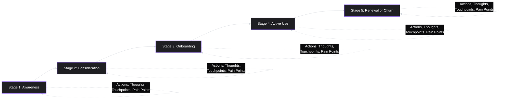
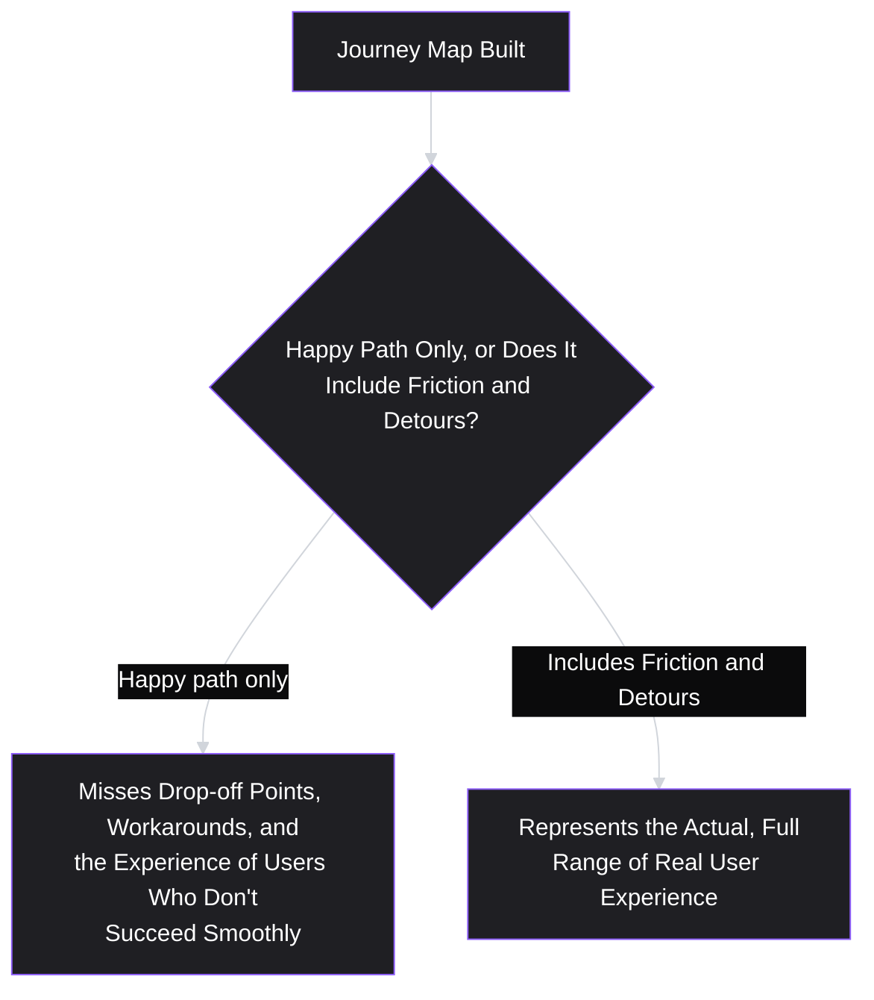
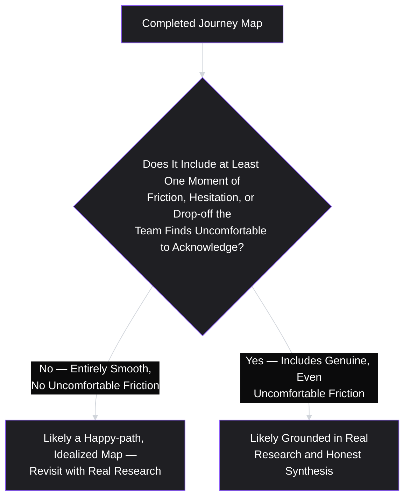

# Lesson 15: User Journey Mapping

## Why This Lesson Matters

Lesson 14 gave you a way to represent *who* a user is — their job, goals, and pain points, synthesized into a single referenceable artifact. This lesson gives you a way to represent *what actually happens to them over time* — the full sequence of steps, emotions, and touchpoints a persona moves through while trying to accomplish their job, from the first moment they realize they have a problem to well after they've (hopefully) solved it. A **user journey map** is a visual, chronological representation of a specific persona's experience across a specific process, showing not just what they do at each step, but what they think and feel while doing it, and where the friction actually lives.

This lesson matters because pain points, discussed in the abstract in Lesson 14, often become far more actionable once they're placed on a timeline. A pain point floating free of context ("users find onboarding confusing") is vague enough to argue about; a pain point pinned to a specific step in a specific journey ("62% of users abandon during the third onboarding screen, specifically after being asked to connect a bank account before seeing any value") is concrete enough to actually design around. Journey mapping is the discipline of building that timeline honestly — grounded in the same research rigor from Lessons 11 through 13, not in a team's assumption about how a process "should" flow.

---

## Learning Path

| Field | Detail |
|---|---|
| **Module** | 2 — Users & Research |
| **Current Lesson** | 15 of 90 |
| **Difficulty** | 4 / 10 |
| **Estimated Study Time** | 25 minutes (reading) + 15 minutes (reflection + quiz) |
| **Prerequisites** | Lesson 12 (Customer Interviews), Lesson 14 (Personas) |
| **Next Lesson** | Lesson 16 — Pain Points |
| **Future Topics Unlocked** | Lesson 16 (Pain Points — a deeper dive into the friction surfaced on a journey map), Lesson 17 (Problem Statements), Lesson 25 (Wireframing) |

---

## Learning Objectives

By the end of this lesson, you will be able to:

1. Define a user journey map and identify its core components: stages, actions, thoughts/emotions, touchpoints, and pain points.
2. Distinguish a journey map built from real research (interviews, behavioral data) from one built from a team's assumed or idealized version of a process.
3. Identify the "happy path only" failure pattern and explain why it produces an incomplete, misleading map.
4. Apply journey mapping to identify specific moments of friction, drop-off, or emotional low points that warrant further investigation or design attention.
5. Distinguish a journey map's scope (a specific persona, a specific process) from an attempt to map "the entire user experience" at once, and explain why the latter produces an unusably broad artifact.

---

## Prerequisites

Lesson 12 (Customer Interviews) and Lesson 14 (Personas). This lesson assumes you can conduct or reference past-behavior-based interview findings and have (or can construct) a genuine, research-based persona — a journey map is most useful when built for a specific, validated persona moving through a specific, well-defined process, not for an undifferentiated "the user" in the abstract.

---

## Theory

### The Core Definition and Components

A user journey map visually represents the sequence of steps a specific persona takes while pursuing a specific goal, alongside their actions, thoughts, and emotions at each step, and the touchpoints (specific product screens, communications, or interactions) involved. The standard components are:

- **Stages**: the major phases of the journey (e.g., awareness, consideration, onboarding, active use, renewal or churn).
- **Actions**: what the persona actually does at each stage, ideally drawn from observed or reported behavior rather than assumption.
- **Thoughts and emotions**: what the persona is thinking and feeling at each step — confusion, confidence, frustration, relief — which often reveals more about where design attention is needed than the actions alone.
- **Touchpoints**: the specific product screens, emails, support interactions, or other concrete points of contact involved at each stage.
- **Pain points and opportunities**: specific moments of friction, confusion, or drop-off, and any corresponding opportunity for improvement.

### Journey Maps Built from Research vs. Assumption

Precisely as Lesson 14 warned about assumption-based personas, a journey map built from a team's idealized or assumed version of "how the process works" — rather than from actual research — carries exactly the same risk: it tends to reflect how the team designed the process to work, rather than how real users actually experience it, and it is especially prone to omitting friction points that are uncomfortable for the team to acknowledge (a confusing step the team itself designed, a drop-off point tied to a decision a stakeholder championed).

A genuinely research-grounded journey map draws on:

- **Past-behavior interview findings (Lesson 12)**: specific, concrete accounts of what actually happened at each stage, rather than a general description of the intended flow.
- **Behavioral/analytics data (revealed preference, per Lesson 11)**: actual drop-off rates, time-on-step, and navigation patterns, which can reveal friction points a team's mental model of the process entirely misses.
- **Direct observation, where possible**: watching a real user move through the actual process, rather than relying solely on their retrospective account of it (which can be subject to the same recall limitations and social desirability effects covered in Lesson 11).

### The "Happy Path Only" Failure Pattern

A specific, common failure in journey mapping is building a map that only represents the **happy path** — the smoothest, most successful version of the journey, in which the user encounters no significant friction and proceeds cleanly from one stage to the next. This produces a map that looks clean and presentable, but that fails to represent the actual, often messier reality experienced by a meaningful share of real users — including detours, abandoned attempts, workarounds, and points where users backtrack or seek external help.

This directly echoes Lesson 8's discovery theater concern and Lesson 13's sampling bias concern: a journey map is a research synthesis artifact, and if the underlying research (or the map's construction) systematically excludes the messier, less successful parts of the real experience, the resulting map — however polished — will mislead a team into believing the process is smoother than it actually is for a meaningful portion of real users.

### Distinguishing Actions from Thoughts and Emotions

A common, more subtle mistake is building a journey map that documents only actions (what the user clicked, what screen they were on) without capturing thoughts and emotions at each step. This is a significant loss, because two users can take the identical sequence of actions while having very different internal experiences — one confident and satisfied, another confused and anxious but proceeding anyway out of necessity — and a map that records only the action sequence cannot distinguish between these two very different underlying experiences, even though they likely call for very different design responses.

Thoughts and emotions are also frequently where the most actionable insight lives: an action-only map might show "user clicks 'connect bank account'" without revealing that, per interview findings, several users hesitated at this step specifically because they weren't sure why a bank connection was necessary before they'd seen any concrete product value — an emotional and cognitive detail (uncertainty, a request for justification) that directly suggests a design fix (explaining the "why" before requesting the connection) that the action alone would never surface.

### Scoping a Journey Map: One Persona, One Process

A final, important discipline is scope: a useful journey map is built for **one specific persona** moving through **one specific, well-defined process** (e.g., "first-time onboarding," "monthly billing and renewal," "canceling a subscription") — not an attempt to map "the entire user experience" of a complex product in a single artifact. Attempting the latter produces a map so broad and abstracted that it loses the specific, concrete detail that makes journey mapping useful in the first place, echoing Lesson 7's "for everyone" value proposition failure and Lesson 14's "too many personas" failure at a process-mapping level: an artifact that tries to represent everything ends up representing nothing with useful specificity.

---

## Common Beginner Mistakes

**Mistake 1: Building a journey map from the team's idealized version of the process, rather than from research**

This inherits the same risk as an assumption-based persona (Lesson 14) — the map reflects how the team designed the process to work, not how users actually experience it, and tends to omit uncomfortable friction points.

**Mistake 2: Mapping only the "happy path."**

A map excluding detours, abandoned attempts, and workarounds misrepresents the actual range of real user experience and can lead a team to underestimate how much friction genuinely exists.

**Mistake 3: Recording only actions, without thoughts and emotions**

An action-only map cannot distinguish between a confident, satisfied user and a confused, anxious one taking the identical sequence of steps, losing exactly the detail most likely to point toward an actionable design fix.

**Mistake 4: Attempting to map "the entire user experience" in a single journey map**

This produces an artifact too broad and abstracted to retain the specific, concrete detail that makes journey mapping useful — scope should be narrowed to one persona and one specific process.

**Mistake 5: Treating a journey map as a one-time artifact that never needs revisiting**

As the underlying product, market, or user behavior changes (echoing Lesson 14's persona-updating guidance), a journey map built from research conducted long ago may no longer accurately reflect the current, real experience.

---

## Mental Model: The Journey Map Truth Test

This lesson's mental model is the **Journey Map Truth Test** — a quick diagnostic for evaluating whether a completed journey map reflects genuine research or an idealized team assumption.

Apply this test whenever reviewing a journey map presented to you: a map with no uncomfortable, team-implicating friction points at all is a specific and reliable warning sign, precisely because real user experiences of any nontrivial process virtually always include at least some genuine friction — its complete absence usually indicates the map was built from an idealized assumption rather than honest research.

---

## Real Company Example

**The LEGO Group**'s digital customer-experience work offers a more verifiable illustration than the vague "well-known UX case study" version of this example often repeated online. In a first-person account of a LEGO.com navigation redesign, the designer leading the project described grounding the redesign in direct research across the site's three distinct primary audiences — casual shoppers, active researchers comparing sets, and "AFOLs" (Adult Fans of LEGO) — gathered through usability tests, surveys, and analytics, rather than starting from an assumed, idealized navigation structure. The friction points that surfaced (confusing entry points depending on why a visitor had actually come to the site) were specific to how each segment behaved in practice, not something an assumption-based map, built without that segmented behavioral research, would have reliably surfaced.

This is a useful caution as much as an endorsement: a commonly circulated "LEGO customer journey map" image (sometimes called the "Experience Wheel," depicting a persona's flight itinerary) is frequently misattributed online as an official LEGO Group case study, when it appears instead to be a UX-methodology teaching example unrelated to LEGO's own retail or e-commerce work. This lesson deliberately avoids citing that widely shared but unverifiable artifact.

*(Assumption flagged: the navigation-redesign account above is a single practitioner's first-person case study rather than an official LEGO Group publication, and this curriculum does not claim certainty about the company's complete, current internal research methodology.)*

---

## Real World Perspective: User Journey Mapping at Different Company Stages

**At a startup:**
Journey maps are often built quickly and informally, based on a small number of early user observations or interviews, and are typically focused narrowly on the single most critical process for the business at that stage — frequently first-time onboarding, since early-stage products are especially vulnerable to losing new users during their very first experience with the product.

**At a mid-size company:**
Journey mapping often becomes a more structured, cross-functional exercise, combining interview findings with actual behavioral analytics (drop-off rates, time-on-step data) to validate that the mapped friction points reflect real, quantifiable patterns rather than a small number of anecdotal accounts — directly echoing Lesson 11's complementary-methods framework applied specifically to journey construction.

**At Big Tech:**
Journey mapping at scale often involves extensive quantitative instrumentation, allowing teams to observe drop-off and friction at a granular, statistically robust level across an enormous user base, but this can create a specific risk of over-relying on quantitative drop-off data alone without pairing it with qualitative research (interviews, direct observation) to understand the emotional and cognitive *why* behind a given friction point — echoing Lesson 11's warning against over-relying on quantitative methods without qualitative depth.

---

## Detailed Case Study: The Onboarding Map That Skipped the Detour

Consider a simplified, illustrative scenario common across B2C subscription products.

A meal-kit subscription company builds a journey map of its new-customer onboarding process, based primarily on the team's own understanding of the intended flow: sign up, select a meal plan, complete the first order, receive the first delivery, cook the first meal. The map is clean, linear, and entirely happy-path, with no significant friction points identified at any stage.

A subsequent round of customer interviews (Lesson 12), conducted using past-behavior questions specifically about the first two weeks of the subscription, reveals a substantially messier reality for a meaningful share of customers: several respondents describe pausing their subscription immediately after the first delivery because the volume of food felt overwhelming relative to their actual weekly cooking capacity, several describe confusion about how to skip a week when traveling (a feature that existed but was difficult to locate), and one respondent specifically describes contacting customer support in frustration after failing to find the skip-week option, ultimately canceling the subscription entirely rather than continuing to search for it.

**What went wrong?**

Applying this lesson's frameworks:

1. **The original map was built from the team's assumed, idealized version of the process, not from research.** It reflected how the onboarding flow was designed to work, not how real customers actually experienced it.
2. **The map was entirely happy-path**, with no included friction, hesitation, or drop-off points — precisely the warning sign the Journey Map Truth Test is designed to catch.
3. **The map recorded only intended actions, not the actual thoughts and emotions (feeling overwhelmed, confused, frustrated) that interviews later revealed** — the specific detail (a confusing, hard-to-locate skip-week feature, and the emotional escalation from confusion to frustration to cancellation) that most directly pointed toward an actionable design fix.

A team applying this lesson's discipline from the outset would have built the original map from real interview findings and behavioral data (Lesson 11), and would very likely have identified the skip-week confusion and portion-size overwhelm as genuine, research-grounded pain points requiring design attention, well before losing customers to a friction point the happy-path map had entirely missed.

This case will be revisited in **Lesson 16 (Pain Points)**, where we cover techniques for prioritizing among the multiple pain points a well-constructed journey map is likely to surface.

---

## Framework Explanation: The Journey Map Construction Checklist

A practical checklist for building a genuinely useful, research-grounded journey map:

| Step | Question to Answer |
|---|---|
| **Scope** | Is this map built for one specific, validated persona (Lesson 14) and one specific, well-defined process — not an attempt to map everything at once? |
| **Source** | Is each stage, action, thought, and pain point drawn from actual research (interviews, behavioral data) rather than the team's assumed or idealized version of the process? |
| **Completeness** | Does the map include genuine friction, hesitation, and drop-off points — not only the happy path? |
| **Depth** | Does the map capture thoughts and emotions at each stage, not just observable actions? |
| **Currency** | Was the underlying research conducted recently enough to still reflect the current product and market, or does the map need to be revisited? |

A journey map that fails several of these checks is not necessarily worthless as a first draft or hypothesis, but should not be treated as a finished, trustworthy artifact — much like Lesson 11's general research trustworthiness checklist, this list distinguishes a genuinely useful synthesis from one that merely looks complete.

---

## Interview Perspective: How Interviewers Think About This

**Typical question 1: "Walk me through how you'd build a journey map for a specific onboarding process."**
*What the interviewer is actually evaluating:* Whether the candidate grounds the process in actual research (interviews, behavioral data) rather than describing a purely internal, assumption-based exercise. A strong answer explicitly names the research inputs and describes capturing thoughts/emotions alongside actions, not just a sequence of screens.

**Typical question 2: "You've built a journey map with no significant friction points identified anywhere. What's your reaction?"**
*What the interviewer is actually evaluating:* Fluency with the Journey Map Truth Test — whether the candidate immediately suspects a happy-path-only map built from assumption, rather than accepting a frictionless map as evidence of a genuinely smooth process.

**Typical question 3: "How would you decide the right scope for a journey map — one process, or the whole product experience?"**
*What the interviewer is actually evaluating:* Awareness of the scoping discipline this lesson emphasizes — recognizing that an overly broad map loses the specific, actionable detail that makes journey mapping valuable, echoing the "for everyone" and "too many personas" failure patterns from earlier lessons.

---

## Summary

A user journey map visually represents a specific persona's stages, actions, thoughts/emotions, touchpoints, and pain points while moving through a specific, well-defined process. Like personas (Lesson 14), journey maps must be built from genuine research — past-behavior interviews and behavioral analytics — rather than a team's idealized or assumed version of the process, since an assumption-based map tends to reflect intended design rather than lived reality and often omits uncomfortable friction points. The "happy path only" failure pattern produces a clean-looking but misleading map that misses detours, abandoned attempts, and workarounds experienced by a meaningful share of real users. Capturing thoughts and emotions alongside actions is essential, since two users can take identical actions while having very different internal experiences, and the emotional/cognitive detail is often what points most directly toward an actionable fix. Finally, a useful journey map is scoped narrowly — one specific persona, one specific process — since attempting to map the entire user experience at once produces an artifact too broad to retain useful specificity.

---

## Key Takeaways

- A journey map's core components are stages, actions, thoughts/emotions, touchpoints, and pain points, built for one specific persona moving through one specific process.
- Journey maps must be grounded in genuine research (interviews, behavioral data), not the team's idealized or assumed version of a process, which risks reflecting intended design rather than lived reality.
- The "happy path only" failure pattern produces a clean but misleading map that omits real detours, abandoned attempts, and workarounds.
- Capturing thoughts and emotions, not just actions, is essential — identical action sequences can reflect very different underlying experiences, and the emotional detail often points most directly to an actionable fix.
- A map with no uncomfortable, team-implicating friction points at all is a reliable warning sign of an idealized, assumption-based map (the Journey Map Truth Test).
- Journey maps should be scoped to one persona and one process, not an attempt to map the entire user experience at once.
- Like personas, journey maps should be periodically revisited as the underlying product, market, and user behavior evolve.

---

## Cheat Sheet

*A two-minute review of everything in this lesson.*

- **Core components:** stages, actions, thoughts/emotions, touchpoints, pain points.
- **Scope to one persona, one process** — not the entire user experience at once.
- **Build from research, not assumption** — same discipline as Lesson 14's personas.
- **Avoid "happy path only"** — include real detours, drop-offs, and workarounds.
- **Capture thoughts and emotions, not just actions** — identical actions can hide very different experiences.
- **Journey Map Truth Test:** no uncomfortable friction anywhere = likely an idealized, assumption-based map.
- **Revisit periodically** as product, market, and behavior evolve.

---

## Glossary

| Term | Definition | Related Concepts | Difficulty |
|---|---|---|---|
| User Journey Map | A visual representation of a specific persona's stages, actions, thoughts/emotions, touchpoints, and pain points through a specific process. | Persona (Lesson 14), Pain Points (Lesson 16) | 2 |
| Touchpoint | A specific product screen, communication, or interaction point involved at a stage of a journey. | User Journey Map | 1 |
| Happy Path | The primary, most common scenario in a user journey or use case where everything goes as intended, with no significant friction, errors, or detours. | Happy Path Only (Failure Pattern) | 2 |
| Happy Path Only (Failure Pattern) | The mistake of building a journey map that represents only the smoothest version of a process, omitting real friction and detours. | Journey Map Truth Test | 2 |
| Journey Map Truth Test | A diagnostic checking whether a journey map includes genuine, uncomfortable friction points, as a signal of research-grounded (versus assumption-based) construction. | Persona Substance Test (Lesson 14) | 3 |

---

## Further Reading / Resources

- Jim Kalbach, *Mapping Experiences* — a widely used, detailed treatment of journey mapping methodology, including guidance on grounding maps in real research rather than assumption.
- Adaptive Path's publicly available journey mapping guides and case studies — practical, widely referenced examples of research-grounded journey map construction.
- Kim Goodwin, *Designing for the Digital Age* — connects journey mapping directly to persona-based design (echoing Lesson 14) within a broader user-centered design methodology.

---

## Flashcards

**Card 1**
- Front: What are the five core components of a user journey map?
- Back: Stages, actions, thoughts/emotions, touchpoints, and pain points.
- Difficulty: 1
- Tags: journey-map-components

**Card 2**
- Front: Why must a journey map be built from research rather than a team's assumed process flow?
- Back: An assumption-based map tends to reflect how the team designed the process to work, not how users actually experience it, and often omits uncomfortable friction points the team is inclined to overlook.
- Difficulty: 2
- Tags: research-grounded-mapping

**Card 3**
- Front: What is the "happy path only" failure pattern?
- Back: Building a journey map that represents only the smoothest, most successful version of a process, omitting real detours, abandoned attempts, and workarounds experienced by real users.
- Difficulty: 2
- Tags: happy-path-only

**Card 4**
- Front: Why is it important to capture thoughts and emotions, not just actions, in a journey map?
- Back: Two users can take an identical sequence of actions while having very different internal experiences (confidence vs. confusion), and the emotional/cognitive detail often points most directly toward an actionable design fix.
- Difficulty: 2
- Tags: thoughts-emotions

**Card 5**
- Front: What is the Journey Map Truth Test?
- Back: A diagnostic checking whether a completed journey map includes at least one genuine, uncomfortable friction point — a map with no such friction anywhere is a reliable warning sign of an idealized, assumption-based map.
- Difficulty: 3
- Tags: journey-map-truth-test

**Card 6**
- Front: What is the correct scope for a useful journey map?
- Back: One specific, validated persona moving through one specific, well-defined process — not an attempt to map "the entire user experience" at once.
- Difficulty: 2
- Tags: journey-map-scope

**Card 7**
- Front: In the Detailed Case Study, what specific friction point did the original happy-path map miss, and what was its consequence?
- Back: A confusing, hard-to-locate "skip a week" feature, which led at least one customer to contact support in frustration and ultimately cancel rather than continue searching for it.
- Difficulty: 3
- Tags: case-study

## Reflection Exercise

You are the PM for a personal budgeting app, mapping the journey of a new user connecting their first bank account.

Work through the following, in writing, before reading further:

1. List the stages you would expect this specific journey to include, from first considering connecting an account through successfully seeing their transaction data.
2. For one stage, write both an action ("clicks 'connect account'") and a plausible corresponding thought/emotion (e.g., hesitation about security) that a real user might experience at that step.
3. Describe one plausible "detour" or non-happy-path moment a real user might experience during this journey (e.g., their specific bank isn't supported, or a security concern causes them to abandon partway through).
4. Apply the Journey Map Truth Test to a hypothetical map your team drafted that shows zero friction anywhere in this process. What would you do in response?
5. Referencing Lesson 12's interview techniques, write one past-behavior question you would ask a real user to validate whether your draft journey map accurately reflects their actual experience.

There is no single correct answer. The purpose of this exercise is to practice building a journey map that captures genuine friction and emotional detail, rather than defaulting to a clean, happy-path assumption.

---

## Quiz

**1. Which of the following is NOT one of the five core components of a user journey map described in this lesson?**
A) Stages
B) Competitor pricing
C) Touchpoints
D) Thoughts and emotions

*Correct answer: B*
*Explanation: The five are stages, actions, thoughts/emotions, touchpoints, and pain points. What rivals charge belongs to competitive analysis, not to a map of one persona's experience.*
*Learning objective tested: #1*
*Difficulty: Easy*

---

**2. Why is a journey map built from a team's idealized, assumed version of a process considered risky, according to this lesson?**
A) Because idealized processes prove technically infeasible to build
B) Because assumption-based maps take longer to build than researched ones
C) Because an idealized map cannot be presented visually
D) Because it reflects intended design, not lived experience

*Correct answer: D*
*Explanation: The map ends up describing how the team meant the flow to work. It is especially prone to omitting the friction that would implicate a decision someone in the room championed.*
*Learning objective tested: #2*
*Difficulty: Easy*

---

**3. What is the "happy path only" failure pattern?**
A) Building a map covering more than one persona at the same time
B) Building a map with touchpoints but no stages or actions listed
C) Building a map without producing any accompanying visual diagram
D) Building a map of the smoothest version, omitting friction and detours

*Correct answer: D*
*Explanation: The result looks clean and presentable and leaves out the backtracking, the workarounds, and the people who gave up — which is most of what a map is for.*
*Learning objective tested: #3*
*Difficulty: Easy*

---

**4. Why is it important for a journey map to capture thoughts and emotions in addition to actions?**
A) Because emotions are easier to measure reliably than actions are
B) Because recorded actions are inaccurate in essentially every case
C) Because identical actions can hide different experiences
D) Because thoughts and emotions are the sole required map component

*Correct answer: C*
*Explanation: One user clicks through confidently, another clicks through anxious but with no alternative. The action log is identical, and the two call for entirely different design responses.*
*Learning objective tested: #4*
*Difficulty: Easy*

---

**5. According to the Journey Map Truth Test, what should a reviewer suspect about a journey map that shows zero friction anywhere in the process?**
A) That the map was built from quantitative behavioural data alone
B) That the process is genuinely flawless and needs no investigation
C) That the map carries too much detail and should be simplified
D) That it is likely idealized, since real processes carry some friction

*Correct answer: D*
*Explanation: Any nontrivial process produces some friction for someone. Its total absence from a map says more about how the map was built than about how the process runs.*
*Learning objective tested: #2, #3*
*Difficulty: Easy*

---

**6. What is the recommended scope for a single journey map, according to this lesson?**
A) One specific validated persona moving through one well-defined process
B) Every persona identified, mapped through a single generic process
C) The entire product experience, across all personas and processes
D) Narrow scoping should be avoided, since broader maps prove useful

*Correct answer: A*
*Explanation: A map covering everything abstracts away the concrete detail that made it worth drawing. This is the "for everyone" failure from Lesson 7, arriving at the level of process.*
*Learning objective tested: #5*
*Difficulty: Easy*

---

**7. In the Detailed Case Study, what specific research method revealed the friction the original happy-path map had missed?**
A) A large-scale quantitative survey of the full subscriber base
B) Past-behavior interviews about the first two weeks
C) A focus group conducted with members of the product team
D) A competitive analysis of rival meal-kit subscription products

*Correct answer: B*
*Explanation: Asking what actually happened in those two weeks surfaced the portion-size overwhelm and the hunt for the skip-week control. A team focus group would have reproduced the idealized map.*
*Learning objective tested: #2, #3*
*Difficulty: Medium*

---

**8. What specific consequence resulted from the hard-to-locate "skip a week" feature in the Detailed Case Study?**
A) A customer contacted support in frustration and then cancelled
B) The customer located the feature after only a brief further search
C) The feature was removed in the following release
D) The customer recommended the product despite the difficulty faced

*Correct answer: A*
*Explanation: The escalation ran from confusion to frustration to cancellation. None of those three steps appeared anywhere on the original map, which showed a clean path through the same period.*
*Learning objective tested: #3*
*Difficulty: Medium*

---

**9. (Scenario) A team is deciding whether to build one comprehensive journey map covering "the entire customer lifecycle" or several narrower maps for specific processes (onboarding, renewal, cancellation). According to this lesson, which approach is recommended, and why?**
A) Several narrower maps, which retain concrete, usable detail
B) One comprehensive map, since covering everything at once is efficient
C) Neither, since maps should never exceed a single touchpoint in scope
D) The choice does not matter, since scope has no bearing on usefulness

*Correct answer: A*
*Explanation: Onboarding friction and cancellation friction are different problems with different stages and emotions. Forced into one artefact, both lose the specificity that would make either actionable.*
*Learning objective tested: #5*
*Difficulty: Medium-Hard*

---

**10. (Product Thinking) A journey map shows a smooth, linear happy path with high emotional confidence at every single stage, based entirely on the design team's understanding of the intended onboarding flow. What should a PM do before trusting this map?**
A) Accept it, since a clean journey shows good design
B) Apply the Truth Test and check it against real research first
C) Add further visual polish so the map presents more convincingly
D) Assume accuracy, since the design team produced the artefact itself

*Correct answer: B*
*Explanation: Two warning signs coincide here — no friction anywhere, and no source outside the team that designed the flow. Either alone would warrant validation before the map drives decisions.*
*Learning objective tested: #2, #3*
*Difficulty: Medium-Hard*

---

**11. (Interview Reasoning) An interviewer asks a candidate to describe a journey map they've built, and the candidate's description includes no mention of any friction, hesitation, or drop-off points anywhere in the process. What might this signal, based on this lesson's Interview Perspective section?**
A) An exceptionally well-designed process needing no further scrutiny
B) Nothing of note, since frictionless maps are the normal outcome
C) Evidence the candidate is unsuited to any product research role
D) A possible sign the map came from assumption rather than research

*Correct answer: D*
*Explanation: The interviewer is applying the Truth Test to the candidate's account. A map that implicates nothing usually means nobody went and asked the people who struggled.*
*Learning objective tested: #2, #3*
*Difficulty: Hard*

---

**12. (Product Thinking, Higher Difficulty) A team has behavioral analytics showing a sharp drop-off at a specific onboarding step, but no qualitative research explaining why users are dropping off at that point. According to this lesson and Lesson 11's complementary-methods framework, what should the team do next?**
A) Redesign the step immediately, working from the drop-off rate alone
B) Treat the drop-off as unimportant, since only quantitative data exists
C) Interview users who dropped off, to learn why the behaviour occurs
D) Disregard the analytics and rely on the team's assumption

*Correct answer: C*
*Explanation: The analytics establish that and how much; they are silent on why. That gap is precisely what the thoughts-and-emotions row of a journey map exists to fill, and it needs qualitative work to fill it.*
*Learning objective tested: #2, #4*
*Difficulty: Medium-Hard*

---

**13. (Interview Reasoning, Higher Difficulty) A candidate is asked how they would scope a journey map for a complex, multi-featured product with several distinct user segments. A weak answer would most likely propose which of the following?**
A) Attempt one comprehensive map spanning all segments and processes
B) Build several narrower maps, each scoped to one persona and process
C) Prioritise which processes matter most strategically before mapping
D) Ground each map in research specific to that persona and process

*Correct answer: A*
*Explanation: Breadth feels thorough and produces an artefact too abstract to act on. The other three each narrow the scope or strengthen the evidence behind it.*
*Learning objective tested: #5*
*Difficulty: Hard*

---

**14. (Product Thinking, Higher Difficulty) A journey map accurately identifies several genuine, research-grounded pain points, but the team has not yet decided which one to address first. What lesson does this scenario most directly set up?**
A) Lesson 9, which covers product vision and long-term direction
B) Lesson 16, which covers prioritising among identified pain points
C) Lesson 7, which covers value proposition and positioning work
D) Lesson 5, which covers the distinction between users and customers

*Correct answer: B*
*Explanation: A good map reliably surfaces more friction than a team can address at once, which makes comparing those pain points the immediate next problem.*
*Learning objective tested: #4*
*Difficulty: Hard*

---

**15. (Highest Difficulty) A team builds a journey map using both past-behavior interviews and behavioral analytics, correctly scoped to one persona and one process, and including genuine friction points with associated thoughts and emotions — but the underlying research was conducted four years ago, before a significant product redesign. According to this lesson, what is the most appropriate response?**
A) Continue using it indefinitely, since the original method was sound
B) Assume it holds, because rigorous methods were used at the time
C) Treat it as potentially outdated and revalidate the mapped stages with fresh research
D) Discard it and rebuild from team assumption, since research costs time

*Correct answer: C*
*Explanation: Method quality does not survive a redesign. The same currency principle that applies to personas and visions applies here: the map was right about a product that no longer exists.*
*Learning objective tested: #2*
*Difficulty: Hard*

---

## Connections

| | Lesson | Core Idea Carried Forward |
|---|---|---|
| **Previous Lesson** | Lesson 14 — Personas | Provides the validated persona a journey map should be built around, and extends the Persona Substance Test's research-grounding discipline into a chronological, process-specific artifact |
| **Current Lesson** | Lesson 15 — User Journey Mapping | Stages/actions/thoughts/touchpoints/pain points; the "happy path only" failure; the Journey Map Truth Test; narrow scoping discipline |
| **Next Lesson** | Lesson 16 — Pain Points | Directly addresses how to prioritize among the multiple pain points a well-constructed journey map typically surfaces |
| **Future Concepts Unlocked** | Lesson 17 (Problem Statements) | Formalizes a prioritized pain point, surfaced through journey mapping, into a structured, testable problem statement |
| | Lesson 25 (Wireframing) | Uses journey map touchpoints and friction points as direct input for early-stage interface design |

This curriculum is designed to be read as one continuous argument. From this lesson forward, any reference to a "user journey" or "onboarding flow" assumes the research-grounding and scoping discipline covered here — this will not be re-explained, only re-applied.
