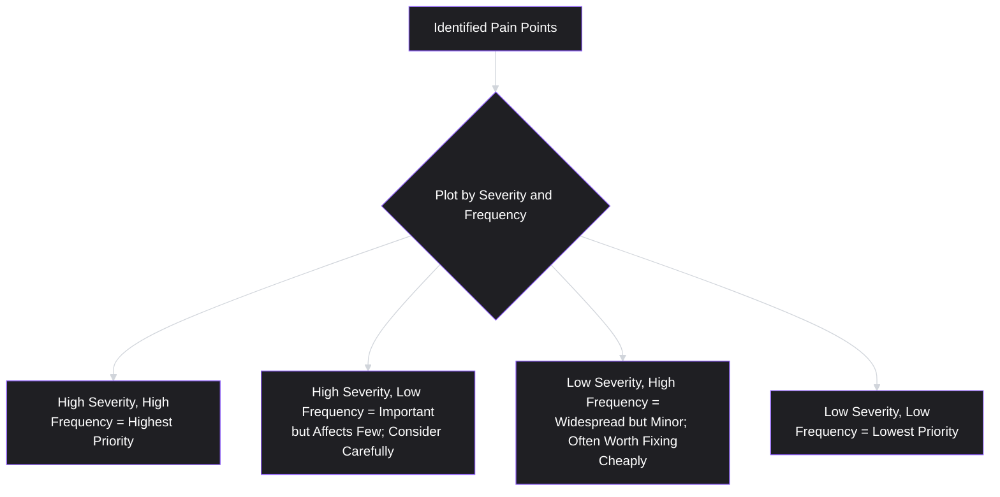
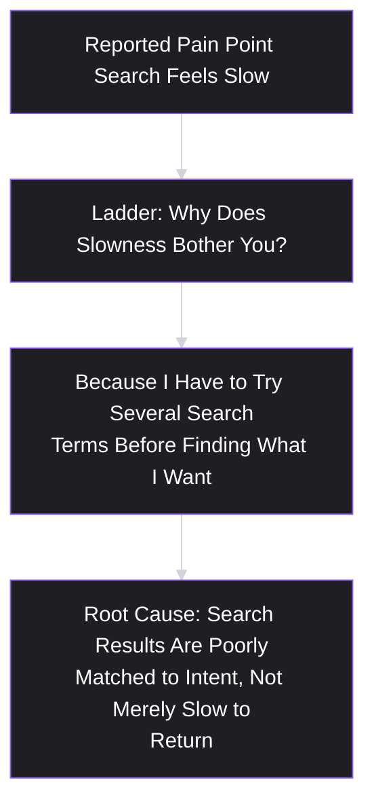
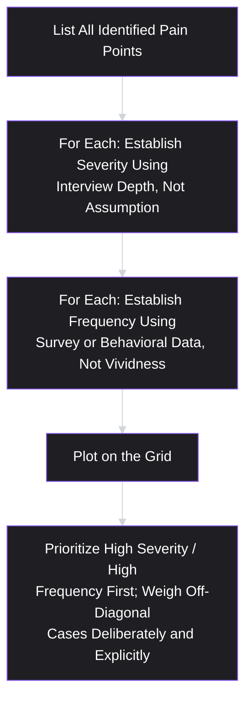

# Lesson 16: Pain Points

## Why This Lesson Matters

Lesson 15 ended with a genuinely useful journey map — one grounded in real research, including uncomfortable friction the team hadn't expected, capturing thoughts and emotions alongside actions. It also ended with a specific, practical problem: a well-built journey map for even a single process typically surfaces *multiple* pain points, not one. The meal-kit company's map, for instance, surfaced both a portion-size overwhelm issue and a skip-week confusion issue. Which one gets fixed first? This lesson exists to answer that question with more rigor than "whichever one a senior stakeholder happened to notice."

A **pain point** is a specific, concrete point of friction, frustration, or unmet need that a user experiences while trying to accomplish a job. This lesson treats pain points not just as things to identify — Lessons 12 and 15 already covered identification — but as things to characterize and prioritize with discipline, because not all pain points are equal, and treating them as if they were interchangeable in severity is a reliable way to spend engineering effort on the wrong problem first.

---

## Learning Path

| Field | Detail |
|---|---|
| **Module** | 2 — Users & Research |
| **Current Lesson** | 16 of 90 |
| **Difficulty** | 3 / 10 |
| **Estimated Study Time** | 25 minutes (reading) + 15 minutes (reflection + quiz) |
| **Prerequisites** | Lesson 12 (Customer Interviews), Lesson 15 (User Journey Mapping) |
| **Next Lesson** | Lesson 17 — Problem Statements |
| **Future Topics Unlocked** | Lesson 17 (Problem Statements — formalizing a prioritized pain point), Lesson 21 (MVP), Lesson 29 (Prioritization Fundamentals) |

---

## Learning Objectives

By the end of this lesson, you will be able to:

1. Define a pain point with sufficient specificity to distinguish it from a vague complaint or a proposed solution.
2. Apply a structured severity/frequency framework for characterizing and comparing multiple pain points.
3. Distinguish a surface-level pain point from a root-cause pain point, using laddering (Lesson 6) as the connecting technique.
4. Identify the "loudest voice wins" and "most recent complaint wins" failure patterns in pain point prioritization.
5. Distinguish pain points that are genuinely widespread from those that are vivid but rare, and explain the risk of over-indexing on the latter.

---

## Prerequisites

Lesson 12 (Customer Interviews) and Lesson 15 (User Journey Mapping). This lesson assumes you can surface pain points through past-behavior interviewing and place them on a journey map, and extends that identification work into a disciplined characterization and prioritization practice.

---

## Theory

### Defining a Pain Point with Real Specificity

A pain point is a specific, concrete point of friction, frustration, or unmet need experienced while pursuing a job — and the operative word, once again, is specific. "Onboarding is confusing" is not yet a pain point in the useful sense this lesson intends; it is a vague complaint, one level of specificity short of being actionable. A genuine pain point names the specific step, the specific friction, and ideally the specific consequence: "62% of new users abandon at the bank-account-connection screen during onboarding, and interview data shows several hesitate specifically because they don't understand why a bank connection is required before they've seen any product value."

This connects directly to Lesson 12's Interview Depth Staircase: a pain point sitting at Step 1 (a vague, surface-level complaint) has not yet been climbed to the level of specificity that makes it genuinely useful for prioritization or design work. Much of the discipline in this lesson is about ensuring pain points are captured, and compared, at a sufficiently deep and specific level — not at the level of the first vague complaint a team happens to hear.

### The Severity/Frequency Framework

A foundational tool for comparing multiple pain points is a simple two-axis framework, plotting each identified pain point by:

- **Severity**: how much does this specific friction actually cost the user — in time, frustration, financial loss, or complete task failure — when it occurs?
- **Frequency**: how often does this friction occur, and across how large a share of the relevant user population (ideally informed by survey or behavioral prevalence data, per Lesson 13, rather than assumption)?

The pain point sitting in the high-severity, high-frequency quadrant is generally the clearest priority — it affects many users and costs them significantly when it occurs. The more genuinely difficult judgment calls happen in the off-diagonal quadrants: a rare but catastrophic pain point (perhaps a data-loss bug affecting a small fraction of users) may still warrant urgent attention despite low frequency, precisely because severity alone can justify prioritization even without high prevalence — while a very common but genuinely minor annoyance may be worth a cheap, quick fix specifically because of its reach, even though no individual instance is severe.

### Surface-Level vs. Root-Cause Pain Points

Directly extending Lesson 6's laddering technique, a pain point as initially reported is often a symptom of a deeper, underlying cause, rather than the actual root issue itself. "Users complain the search feature is slow" might, on laddering, reveal that the actual underlying pain is not raw technical latency but a mismatch between what users are searching for and how the search index is structured — meaning a technically faster search that still returns poor-quality results would not resolve the actual pain, even though it would appear to address the surface-level complaint.

A team that fixes only the surface-level, reported version of a pain point — optimizing raw search speed, in this example — without laddering to the actual root cause risks shipping a technically successful fix that fails to resolve the underlying experience the pain point was actually describing, a failure pattern closely related to Lesson 8's Detailed Case Study (a version-history feature that solved an adjacent problem rather than the one customers were actually describing).

### Common Prioritization Failure Patterns

Two specific, common failure patterns distort pain point prioritization if not deliberately guarded against:

- **"Loudest voice wins"**: a pain point championed by an especially vocal internal stakeholder, or reported by an especially insistent customer, receives disproportionate priority relative to its actual severity and frequency, simply because of how forcefully or persistently it was raised — directly echoing Lesson 5's warning about customer-channel signal being structurally louder than user-channel signal, regardless of actual relative importance.
- **"Most recent complaint wins"**: a pain point surfaced in the most recent customer conversation, support ticket, or executive escalation receives outsized attention simply due to recency, rather than being weighed against the full, systematically gathered set of pain points a well-constructed journey map (Lesson 15) or research synthesis has surfaced. This is a close cousin of confirmation bias (Lesson 11) applied specifically to timing rather than pre-existing belief.

Both patterns share a common underlying mechanism: they substitute a proxy (volume, forcefulness, or recency of complaint) for the actual severity/frequency analysis this lesson recommends, and both can be corrected by the same discipline — insisting that pain points be plotted on the severity/frequency framework using systematically gathered evidence (Lessons 12 and 13) before prioritization decisions are made, rather than allowing whichever pain point was most recently or most forcefully raised to implicitly set the agenda.

### Vivid but Rare vs. Genuinely Widespread

A particularly important and easy-to-miss distortion is the tendency to over-weight pain points that are **vivid** — emotionally striking, memorable, easy to describe in a compelling anecdote — relative to their actual prevalence. A single, dramatically described customer story (a user who lost significant data, or had an unusually frustrating support experience) can dominate a team's attention and prioritization discussion far out of proportion to how many actual users experience anything similar, precisely because vivid, specific stories are more memorable and more persuasive in a room than an aggregate statistic, even when the statistic represents a far larger and more consequential population.

This connects directly to Lesson 13's survey-validated prevalence data: a pain point's frequency should ideally be established using systematically gathered evidence, not by how memorable or emotionally resonant its most vivid example happens to be. This does not mean vivid, severe outlier stories should be ignored — as the severity/frequency framework shows, a high-severity, low-frequency pain point can still warrant priority — but it does mean the decision to prioritize it should be made deliberately, with frequency correctly characterized as low, rather than allowing the story's vividness to implicitly (and inaccurately) suggest it represents a much more widespread problem than it actually does.

---

## Common Beginner Mistakes

**Mistake 1: Recording a vague complaint as if it were a specific pain point.**
"Users find this confusing" has not yet been climbed to the level of specificity (which step, what friction, what consequence) that makes a pain point genuinely useful for prioritization or design work.

**Mistake 2: Prioritizing by "loudest voice" or "most recent complaint" rather than by systematic severity/frequency analysis.**
Both patterns substitute a proxy (forcefulness or recency) for genuine analysis, and both distort prioritization away from the pain points that actually matter most in aggregate.

**Mistake 3: Fixing the surface-level, reported version of a pain point without laddering to its root cause.**
A technically successful fix aimed at the wrong underlying cause can fail to resolve the actual pain, even though it appears to directly address the reported complaint.

**Mistake 4: Over-weighting a vivid, memorable anecdote relative to its actual prevalence.**
A single dramatic story can dominate prioritization discussions far out of proportion to how widespread the underlying issue actually is, unless frequency is deliberately, systematically established rather than inferred from how compelling the story feels.

**Mistake 5: Treating every identified pain point as equally worth fixing, without a severity/frequency comparison at all.**
Without a comparative framework, teams often default to fixing whatever is easiest, most recently discussed, or most personally salient to whoever is making the decision, rather than the pain point that would actually deliver the most value if resolved.

---

## Mental Model: The Pain Point Priority Grid

This lesson's mental model is the **Pain Point Priority Grid** — the severity/frequency plot introduced above, used as a standing discipline whenever multiple pain points (from a journey map, interviews, or support data) need to be compared.

Use this grid as a required step before any pain point is elevated to a roadmap priority: has its severity and frequency actually been established using systematic evidence, or is it being prioritized because it was the loudest, most recent, or most vividly described? Naming which is the case, explicitly, prevents the common failure patterns from operating silently.

---

## Real Company Example

**Amazon**'s well-documented internal practice of deeply investigating individual customer complaints — sometimes referred to in public accounts as tracing a single specific complaint back to its root operational or systemic cause — is a widely discussed illustration of laddering a surface-level pain point to its underlying root cause rather than treating the reported symptom as the finished diagnosis. Public accounts of Amazon's operational culture have described senior leadership occasionally investigating individual customer emails in significant depth specifically to understand whether a single reported problem reflects a broader, systemic issue (in which case it likely reflects a high-frequency pain point, even if only one instance was directly escalated) or a true one-off anomaly (a low-frequency case, warranting a different kind of response) — directly reflecting this lesson's distinction between surface-level symptoms and their underlying, more diagnostically important root causes and true prevalence.

*(Assumption flagged: this reflects widely reported descriptions of Amazon's general operational culture rather than a claim about the company's current, complete internal investigative methodology, which this curriculum does not claim certainty about.)*

---

## Real World Perspective: Pain Point Prioritization at Different Company Stages

**At a startup:**
Pain point prioritization is often necessarily intuitive and fast, given limited research resources, but the core discipline of this lesson — resisting the urge to fix whatever the most recent or loudest customer complained about, and instead asking about actual severity and frequency across the broader (if still small) user base — remains just as important, since early-stage teams have the least slack to spend on the wrong problem first.

**At a mid-size company:**
Pain point prioritization increasingly benefits from combining qualitative severity assessment (via interviews, Lesson 12) with quantitative frequency validation (via surveys or behavioral analytics, Lesson 13), and dedicated processes for systematically logging and categorizing pain points (rather than relying on individual team members' memory of recent conversations) become more valuable as the organization and its user base grow.

**At Big Tech:**
Pain point prioritization at scale often has access to extensive quantitative data allowing precise frequency measurement, but the specific risk at this scale is the inverse of a startup's: an abundance of quantitative severity/frequency data can sometimes crowd out the qualitative, root-cause laddering work needed to ensure a high-priority pain point is actually being fixed at its true underlying source, rather than merely at its most measurable symptom.

---

## Detailed Case Study: The Pain Point That Was Fixed Twice

Consider a simplified, illustrative scenario common across B2B SaaS support and product teams.

A CRM software company's support team logs a recurring complaint: "Users say exporting reports takes too long and often times out." The complaint appears frequently across support tickets, and a product team, treating this as a straightforward performance problem, invests a full quarter optimizing the underlying export infrastructure — significantly improving raw processing speed and reducing timeout occurrences by a substantial margin.

Despite this successful technical fix, essentially the same complaint — "exports are frustrating and don't work the way I need" — continues to appear in support tickets and customer interviews at nearly the same rate as before. A subsequent, more disciplined investigation, applying laddering to a fresh round of interviews specifically about report exports, reveals the actual underlying issue: the majority of complaining users were not primarily bothered by processing speed at all, but by the exported report's formatting requiring extensive manual cleanup before it could be used in their own external reporting tools — a formatting and structure problem entirely distinct from the raw speed problem the team had spent a full quarter solving.

**What went wrong?**

Applying this lesson's frameworks:

1. **The reported pain point ("exporting takes too long") was accepted at its surface level**, without laddering to the actual root cause, echoing Lesson 8's version-history case study and Lesson 6's Job Ladder discipline directly.
2. **Severity and frequency were both established from the original, un-laddered version of the complaint**, meaning the resulting fix was correctly targeted at solving *a* real problem (processing speed genuinely was slow), just not the problem most users were actually describing when they used similar language to report their dissatisfaction.
3. **No one investigated whether "too long" and "times out" were being used by different complaining users to describe genuinely different underlying frustrations** — some may have genuinely meant literal processing speed, but a larger share, once laddered, revealed a formatting and structure complaint that happened to be described using similar surface-level language.

A team applying laddering from the outset — treating "exports take too long" as a starting point requiring further "why" questions, per Lessons 6 and 12, rather than a finished, actionable pain point — would likely have discovered the formatting root cause before investing a full quarter into a technically successful but only partially relevant infrastructure fix, and could have prioritized the formatting problem specifically, rather than needing a second full investigation cycle to find it.

This case connects directly back to **Lesson 6's Job Ladder** and **Lesson 12's Interview Depth Staircase**: both tools exist specifically to prevent a team from stopping at the first, surface-level version of a stated problem, and this case study shows the real cost — a full quarter of otherwise well-executed engineering work — of skipping that step.

---

## Framework Explanation: The Pain Point Validation Checklist

A practical checklist for validating a pain point before it is elevated to the severity/frequency grid:

| Question | Purpose |
|---|---|
| Has this pain point been laddered (Lesson 6) to a specific, root-cause level, or does it remain at the level of the first reported complaint? | Prevents fixing a surface-level symptom while missing the actual underlying cause |
| Is severity based on specific, past-behavior interview evidence (Lesson 12), or on assumption about how bad the friction "must" feel? | Prevents assumption-driven severity estimates |
| Is frequency based on survey or behavioral data (Lesson 13), or on how often this specific pain point happens to come up in conversation? | Prevents the "most recent" and "vivid but rare" distortions |
| Has this pain point been compared against other identified pain points on the same grid, rather than evaluated in isolation? | Prevents "loudest voice" prioritization by forcing genuine comparison |

A pain point that has not passed this checklist is not necessarily wrong or unimportant — it may simply not yet be characterized precisely enough to responsibly prioritize alongside other, more rigorously validated pain points.

---

## Interview Perspective: How Interviewers Think About This

**Typical question 1: "How do you decide which user pain point to prioritize when you have several to choose from?"**
*What the interviewer is actually evaluating:* Whether the candidate has a systematic framework (severity/frequency) rather than defaulting to whichever pain point was raised most recently or most forcefully. A strong answer names specific evidence sources (interviews for severity, surveys or analytics for frequency) rather than describing an intuitive, unstructured judgment call.

**Typical question 2: "Tell me about a time a fix didn't actually solve the problem it was meant to solve."**
*What the interviewer is actually evaluating:* Whether the candidate has direct experience with the surface-level-versus-root-cause failure pattern, and whether they can describe the laddering process that eventually revealed the actual underlying issue — echoing this lesson's Detailed Case Study directly.

**Typical question 3: "A senior executive is pushing hard for a fix based on one dramatic customer story. How do you respond?"**
*What the interviewer is actually evaluating:* Whether the candidate can navigate the "vivid but rare" and "loudest voice" distortions diplomatically but firmly — acknowledging the story's legitimacy while insisting on establishing its actual frequency and severity relative to other known pain points, rather than either dismissing the executive's concern outright or capitulating without genuine analysis.

---

## Summary

A pain point, to be genuinely useful, must be specific — naming the exact step, friction, and consequence — rather than a vague complaint. The severity/frequency framework provides a structured way to compare multiple identified pain points, with high-severity/high-frequency pain points as the clearest priority and off-diagonal cases (rare but severe, or common but minor) requiring deliberate, explicit judgment rather than default neglect. Laddering (Lesson 6) is essential for distinguishing a surface-level, reported pain point from its actual root cause, since fixing the surface-level version alone can leave the true underlying issue unresolved, as shown in this lesson's Detailed Case Study. Two common prioritization failure patterns — "loudest voice wins" and "most recent complaint wins" — substitute a proxy (forcefulness or recency) for genuine severity/frequency analysis, and a closely related distortion, over-weighting vivid but rare anecdotes relative to their actual prevalence, can be corrected only by establishing frequency through systematic evidence (surveys, behavioral data) rather than through how emotionally memorable a given story happens to be.

---

## Key Takeaways

- A pain point must be specific (which step, what friction, what consequence) — a vague complaint has not yet been climbed to a genuinely useful level of detail.
- The severity/frequency framework structures pain point comparison; high-severity/high-frequency cases are the clearest priority, and off-diagonal cases require deliberate, explicit judgment.
- Laddering (Lesson 6) is essential for distinguishing a surface-level, reported pain point from its actual root cause — fixing the surface-level version can leave the true issue unresolved.
- "Loudest voice wins" and "most recent complaint wins" both substitute a proxy (forcefulness, recency) for genuine severity/frequency analysis.
- Vivid, memorable anecdotes can dominate prioritization discussions far out of proportion to their actual prevalence unless frequency is established through systematic evidence.
- A high-severity, low-frequency pain point can still warrant priority — the goal is deliberate, evidence-based judgment, not automatically favoring high-frequency issues over rare-but-severe ones.
- The Pain Point Validation Checklist (laddered? severity from real evidence? frequency from real evidence? compared against other pain points?) should be applied before elevating any pain point to a roadmap priority.

---

## Cheat Sheet

*A two-minute review of everything in this lesson.*

- **Pain point = specific step + specific friction + specific consequence.** Vague complaints aren't yet pain points.
- **Severity/Frequency Grid:** high/high = clear priority; off-diagonal cases need deliberate judgment, not default neglect.
- **Ladder every pain point** (Lesson 6) to its root cause before fixing the surface-level symptom.
- **Avoid "loudest voice wins" and "most recent complaint wins"** — both substitute a proxy for real analysis.
- **Vivid ≠ widespread** — establish frequency from surveys/analytics, not from how memorable the story feels.
- **Pain Point Validation Checklist:** laddered? severity from real evidence? frequency from real evidence? compared against alternatives?

---

## Glossary

| Term | Definition | Related Concepts | Difficulty |
|---|---|---|---|
| Pain Point | A specific, concrete point of friction, frustration, or unmet need experienced while pursuing a job. | Job to Be Done (Lesson 6), User Journey Map (Lesson 15) | 1 |
| Severity/Frequency Framework | A two-axis model for comparing pain points by how costly they are when they occur and how often/widely they occur. | Pain Point Priority Grid | 2 |
| Root-Cause Pain Point | The actual underlying issue behind a reported, surface-level complaint, uncovered through laddering. | Laddering (Lesson 6) | 2 |
| "Loudest Voice Wins" | The failure pattern of prioritizing a pain point based on how forcefully it was raised, rather than its actual severity/frequency. | Stakeholder Ledger (Lesson 5) | 2 |
| "Most Recent Complaint Wins" | The failure pattern of prioritizing whichever pain point was most recently raised, rather than a systematic comparison. | Confirmation Bias (Lesson 11) | 2 |
| Vivid but Rare | A distortion where a memorable, emotionally striking anecdote is over-weighted relative to its actual prevalence. | Evidence Trustworthiness Ladder (Lesson 11) | 3 |

---

## Further Reading / Resources

- Teresa Torres, *Continuous Discovery Habits* — includes practical guidance on systematically capturing and comparing pain points (often framed as "opportunities") across ongoing discovery work.
- Marty Cagan's public writing on distinguishing customer-reported symptoms from underlying product opportunities, closely related to this lesson's surface-versus-root-cause distinction.
- Melissa Perri, *Escaping the Build Trap* — discusses the risk of solving surface-level, reported problems without addressing genuine underlying business or user outcomes.

---

## Flashcards

**Card 1**
- Front: What distinguishes a genuine pain point from a vague complaint?
- Back: A genuine pain point is specific — naming the exact step, the specific friction, and ideally the specific consequence — rather than a general statement like "this is confusing."
- Difficulty: 1
- Tags: pain-point-specificity

**Card 2**
- Front: What are the two axes of the Severity/Frequency Framework?
- Back: Severity (how costly the friction is when it occurs) and frequency (how often/widely it occurs, ideally validated with survey or behavioral data).
- Difficulty: 2
- Tags: severity-frequency

**Card 3**
- Front: Why is laddering essential for pain point prioritization?
- Back: A reported pain point is often a surface-level symptom of a deeper root cause; fixing the surface-level version alone can leave the actual underlying issue unresolved.
- Difficulty: 2
- Tags: laddering, root-cause

**Card 4**
- Front: What is the "loudest voice wins" failure pattern?
- Back: Prioritizing a pain point based on how forcefully or persistently it was raised by a stakeholder or customer, rather than its actual, systematically evaluated severity and frequency.
- Difficulty: 2
- Tags: loudest-voice

**Card 5**
- Front: Why is a "vivid but rare" pain point risky to prioritize based on anecdote alone?
- Back: A single, emotionally striking story can dominate a team's attention far out of proportion to its actual prevalence, unless frequency is established through systematic evidence rather than the story's memorability.
- Difficulty: 3
- Tags: vivid-but-rare

**Card 6**
- Front: In the Detailed Case Study, what was the actual root cause behind the "exports take too long" complaint for most affected users?
- Back: A report formatting and structure problem requiring extensive manual cleanup, which was distinct from the raw processing speed issue the team spent a full quarter fixing.
- Difficulty: 3
- Tags: case-study

**Card 7**
- Front: Can a high-severity, low-frequency pain point still warrant top priority? Why?
- Back: Yes — severity alone can justify prioritization even without high prevalence (e.g., a rare but catastrophic data-loss bug), so off-diagonal cases require deliberate judgment rather than default neglect.
- Difficulty: 2
- Tags: severity-frequency-tradeoffs

---

## Reflection Exercise

You are the PM for a ride-sharing app, and your team has surfaced three pain points from recent research: (1) a small number of riders report the app crashing during payment, causing a failed ride entirely; (2) many riders report mild frustration with a slow-loading map on the home screen; (3) a vocal customer recently emailed the CEO directly about a confusing cancellation policy.

Work through the following, in writing, before reading further:

1. For each of the three pain points, identify what specific evidence (interview finding, survey/analytics data, or anecdote) you currently have, and note whether that evidence establishes real severity/frequency or merely reflects vividness or recency.
2. Plot all three pain points on the Severity/Frequency Grid based on your best current understanding, explicitly noting where you are uncertain and would need more data.
3. Apply laddering to pain point #3 (the cancellation policy complaint): write two "why" follow-up questions you would ask to determine whether this is a surface-level symptom of a deeper issue.
4. Identify which of the three pain points is most at risk of being prioritized due to "loudest voice wins" or "most recent complaint wins," and explain why.
5. Given the information available, propose a tentative prioritization order, and explicitly name what additional evidence would most change your ranking.

There is no single correct answer. The purpose of this exercise is to practice resisting the pull toward the most vivid or most recently raised pain point, and instead reasoning through severity and frequency using the evidence actually available.

---

## Quiz

**1. Which of the following best exemplifies a specific, genuinely useful pain point, as described in this lesson?**
A) "Users find the app confusing."
B) "62% of new users abandon at the bank-account-connection screen, and interviews show several hesitate because they don't understand why it's required before seeing product value."
C) "We should add a tutorial video."
D) "Some people don't like our app."

*Correct answer: B*
*Explanation: This option names the specific step, the specific friction, and a consequence (abandonment), meeting this lesson's bar for a genuinely useful, actionable pain point, unlike the vague statements in the other options.*
*Learning objective tested: #1*
*Difficulty: Easy*

---

**2. In the Severity/Frequency Framework, which quadrant generally represents the clearest priority?**
A) Low severity, low frequency
B) High severity, high frequency
C) Low severity, high frequency
D) High severity, low frequency

*Correct answer: B*
*Explanation: A pain point that is both costly when it occurs and widespread across the user base represents the clearest, least ambiguous priority in the framework.*
*Learning objective tested: #2*
*Difficulty: Easy*

---

**3. Why might a high-severity, low-frequency pain point still warrant priority, according to this lesson?**
A) Because frequency is always less important than severity in every case
B) Because severity alone can justify prioritization even without high prevalence, such as a rare but catastrophic issue like data loss
C) Because low-frequency pain points are always easier to fix
D) Low-frequency pain points should never be prioritized under any circumstances

*Correct answer: B*
*Explanation: The lesson explicitly notes that a rare but catastrophic pain point can still justify priority, since the framework requires deliberate judgment for off-diagonal cases rather than automatic neglect of low-frequency issues.*
*Learning objective tested: #2*
*Difficulty: Easy*

---

**4. What is the purpose of laddering a pain point before prioritizing it?**
A) To make the pain point sound more severe than it actually is
B) To distinguish the surface-level, reported symptom from the actual underlying root cause, since fixing the symptom alone may not resolve the real issue
C) To reduce the number of pain points a team needs to consider
D) To determine which stakeholder raised the complaint most recently

*Correct answer: B*
*Explanation: Laddering, extended from Lesson 6, is specifically used to move past a surface-level complaint to its actual underlying cause, which the lesson argues is essential before committing to a fix.*
*Learning objective tested: #3*
*Difficulty: Easy*

---

**5. What is the "loudest voice wins" failure pattern?**
A) Prioritizing based on a pain point's actual, systematically evaluated severity and frequency
B) Prioritizing a pain point based on how forcefully or persistently it was raised, rather than genuine severity/frequency analysis
C) Prioritizing pain points in the exact order they were originally reported
D) A pattern that only occurs in customer support contexts, never internally

*Correct answer: B*
*Explanation: This is the lesson's explicit definition — prioritization driven by the forcefulness of a complaint rather than a genuine, evidence-based comparison.*
*Learning objective tested: #4*
*Difficulty: Easy*

---

**6. In the Detailed Case Study, what was the key mistake made in the original response to the "exports take too long" complaint?**
A) The team ignored the complaint entirely
B) The team accepted the complaint at its surface level and invested in raw processing speed, without laddering to discover that most affected users were actually frustrated by report formatting requiring manual cleanup
C) The team fixed the formatting issue instead of the speed issue
D) The team never gathered any evidence about the complaint at all

*Correct answer: B*
*Explanation: The case study explicitly attributes the wasted effort to accepting the surface-level version of the complaint without laddering to the actual, formatting-related root cause.*
*Learning objective tested: #3*
*Difficulty: Easy*

---

**7. Why is over-weighting a "vivid but rare" pain point considered risky, according to this lesson?**
A) Because vivid stories are always factually false
B) Because a single, memorable anecdote can dominate prioritization discussions far out of proportion to its actual prevalence, unless frequency is established through systematic evidence
C) Because vivid pain points are always low severity
D) Because rare pain points should never be discussed in prioritization meetings

*Correct answer: B*
*Explanation: The lesson explains that vivid stories are more persuasive and memorable in a room than an aggregate statistic, which can distort prioritization unless frequency is established through systematic evidence rather than the story's emotional resonance.*
*Learning objective tested: #5*
*Difficulty: Medium*

---

**8. What is the Pain Point Validation Checklist primarily used for?**
A) Determining how many personas a team should build
B) Confirming that a pain point has been laddered, that severity and frequency are based on real evidence rather than assumption or vividness, and that it has been compared against other identified pain points
C) Deciding which survey scale (Likert or NPS) to use
D) Measuring how quickly a customer support ticket was resolved

*Correct answer: B*
*Explanation: This checklist, described in the Framework Explanation section, specifically validates whether a pain point has been rigorously characterized before being elevated to a roadmap priority.*
*Learning objective tested: #3, #4, #5*
*Difficulty: Medium*

---

**9. (Scenario) A product team has three pain points: one raised forcefully by a senior executive based on a single dramatic customer story, one identified through survey data as affecting 40% of users with moderate severity, and one identified through interviews as affecting a small number of users but causing complete task failure. According to this lesson, what is the most appropriate first step?**
A) Immediately prioritize the executive's pain point, since executive attention should always determine roadmap priority
B) Establish severity and frequency for all three pain points using systematic evidence, and plot them on the Severity/Frequency Grid before making a prioritization decision
C) Ignore the executive's pain point entirely, since it was based on only one story
D) Prioritize whichever pain point was most recently discussed in a meeting

*Correct answer: B*
*Explanation: The lesson's core discipline is establishing severity and frequency systematically for all identified pain points before comparing them, rather than defaulting to executive pressure, dismissal, or recency.*
*Learning objective tested: #2, #4, #5*
*Difficulty: Medium-Hard*

---

**10. (Product Thinking) A team ladders a reported pain point ("checkout is confusing") and discovers that the actual underlying issue is a specific, unexpected shipping fee revealed only at the final checkout step. What should the team conclude about the original, surface-level version of the complaint?**
A) The surface-level complaint was entirely inaccurate and should be disregarded
B) The surface-level complaint was a real signal of dissatisfaction, but laddering revealed a more specific, actionable root cause (the unexpected fee) that a generic "make checkout less confusing" fix might have missed
C) The team should have ignored the complaint since it used the word "confusing" rather than a more technical term
D) The laddering process was unnecessary, since the original complaint was already sufficiently specific

*Correct answer: B*
*Explanation: This reflects the lesson's core argument — a surface-level complaint remains a real signal, but laddering reveals the specific, actionable root cause that a fix aimed only at the vague, reported symptom might not actually resolve.*
*Learning objective tested: #3*
*Difficulty: Medium-Hard*

---

**11. (Interview Reasoning) A candidate describes prioritizing pain points strictly in the order they were reported, with the most recent complaint always addressed first. What might this signal, according to this lesson's Interview Perspective section?**
A) A strong, disciplined prioritization process
B) A likely instance of the "most recent complaint wins" failure pattern, substituting recency for genuine severity/frequency analysis
C) That the candidate has extensive experience with the Severity/Frequency Framework
D) Nothing meaningful, since recency is always the most important prioritization factor

*Correct answer: B*
*Explanation: The lesson explicitly names this exact pattern — prioritizing by recency rather than systematic analysis — as a failure mode to guard against, not a strong prioritization practice.*
*Learning objective tested: #4*
*Difficulty: Hard*

---

**12. (Product Thinking, Higher Difficulty) A team has survey data showing a pain point affects a large share of users, but qualitative interviews reveal that most affected users rate its severity as quite low (a minor annoyance, not a significant obstacle). Where does this pain point most likely sit on the Severity/Frequency Grid, and what does that suggest?**
A) High severity, low frequency — requiring urgent, top priority attention
B) Low severity, high frequency — often worth a cheap, quick fix specifically because of its reach, even though no individual instance is severe
C) This combination of data is contradictory and should be discarded entirely
D) High severity, high frequency — the clearest possible priority

*Correct answer: B*
*Explanation: This describes the low-severity, high-frequency quadrant, which the lesson notes is often worth a cheap fix precisely because of its wide reach, even without high individual-instance severity.*
*Learning objective tested: #2*
*Difficulty: Medium-Hard*

---

**13. (Interview Reasoning, Higher Difficulty) An interviewer describes a scenario where a senior executive insists on prioritizing a pain point based on one dramatic customer story, and asks how the candidate would respond. A weak answer would most likely include which of the following?**
A) Acknowledging the story's legitimacy while proposing to establish the pain point's actual frequency and severity using systematic evidence before finalizing prioritization
B) Immediately agreeing to prioritize the pain point solely because of the executive's insistence, without any further evidence-gathering
C) Comparing the story-based pain point against other systematically evaluated pain points on the Severity/Frequency Grid
D) Explaining the distinction between a vivid anecdote and genuinely established prevalence

*Correct answer: B*
*Explanation: Capitulating to executive pressure without any genuine evidence-gathering is precisely the "loudest voice wins" pattern this lesson warns against, representing the weak response among these options.*
*Learning objective tested: #4, #5*
*Difficulty: Hard*

---

**14. (Product Thinking, Higher Difficulty) A team discovers, after laddering, that two seemingly distinct reported pain points ("checkout is slow" and "checkout feels untrustworthy") actually share the same root cause: an unexpected, late-appearing shipping fee that both slows down the process (due to hesitation and reconsideration) and damages trust. According to this lesson, what does this finding suggest about how the team should treat these two pain points going forward?**
A) They should continue to be tracked and prioritized as two entirely separate, unrelated pain points
B) They should be recognized as two surface-level manifestations of the same underlying root cause, and a single fix addressing that root cause (e.g., surfacing shipping costs earlier) would likely resolve both simultaneously
C) The team should prioritize whichever of the two was reported more recently
D) The team should build two separate, independent fixes, one for each surface-level complaint

*Correct answer: B*
*Explanation: This reflects the core value of root-cause laddering — recognizing that multiple surface-level complaints can share a single underlying cause, allowing one well-targeted fix to resolve what initially appeared to be two distinct problems.*
*Learning objective tested: #3*
*Difficulty: Hard*

---

**15. (Highest Difficulty) A team has rigorously validated a pain point's severity and frequency using systematic evidence, laddered it to a clear root cause, and confirmed it sits in the high-severity, high-frequency quadrant — but a competing, less-validated pain point is being pushed by a senior stakeholder based on a single vivid anecdote. According to this lesson, what is the most appropriate way to handle this conflict?**
A) Automatically prioritize the stakeholder's pain point, since seniority should always override evidence-based analysis
B) Present both pain points side by side using the Severity/Frequency Grid and available evidence, making the comparative case for the rigorously validated pain point explicit, while remaining open to further investigating the stakeholder's example if it suggests a previously unmeasured or emerging issue
C) Refuse to discuss the stakeholder's example at all, since it lacks systematic evidence
D) Prioritize both pain points equally, splitting resources evenly regardless of their evidentiary strength

*Correct answer: B*
*Explanation: This reflects the lesson's balanced discipline — using evidence to make an explicit, comparative case, while still remaining genuinely open to investigating a vivid example further (since it could reflect an emerging or previously unmeasured issue), rather than either dismissing it outright or deferring automatically to seniority.*
*Learning objective tested: #4, #5*
*Difficulty: Hard*

---

## Connections

| | Lesson | Core Idea Carried Forward |
|---|---|---|
| **Previous Lesson** | Lesson 15 — User Journey Mapping | A well-constructed journey map typically surfaces multiple pain points; this lesson provides the discipline for prioritizing among them |
| **Current Lesson** | Lesson 16 — Pain Points | The Severity/Frequency Framework; surface-level vs. root-cause pain points; "loudest voice" and "most recent complaint" failure patterns; vivid-but-rare distortion |
| **Next Lesson** | Lesson 17 — Problem Statements | Formalizes a validated, prioritized, laddered pain point into a structured, testable problem statement |
| **Future Concepts Unlocked** | Lesson 21 (MVP) | Uses a prioritized, root-cause pain point as the basis for scoping the smallest viable solution |
| | Lesson 29 (Prioritization Fundamentals) | Incorporates the Severity/Frequency Framework as one input into a broader, multi-factor prioritization scoring model |

This curriculum is designed to be read as one continuous argument. From this lesson forward, any reference to a "pain point" assumes it has been laddered to a specific root cause and characterized by real severity/frequency evidence — this will not be re-explained, only re-applied.
