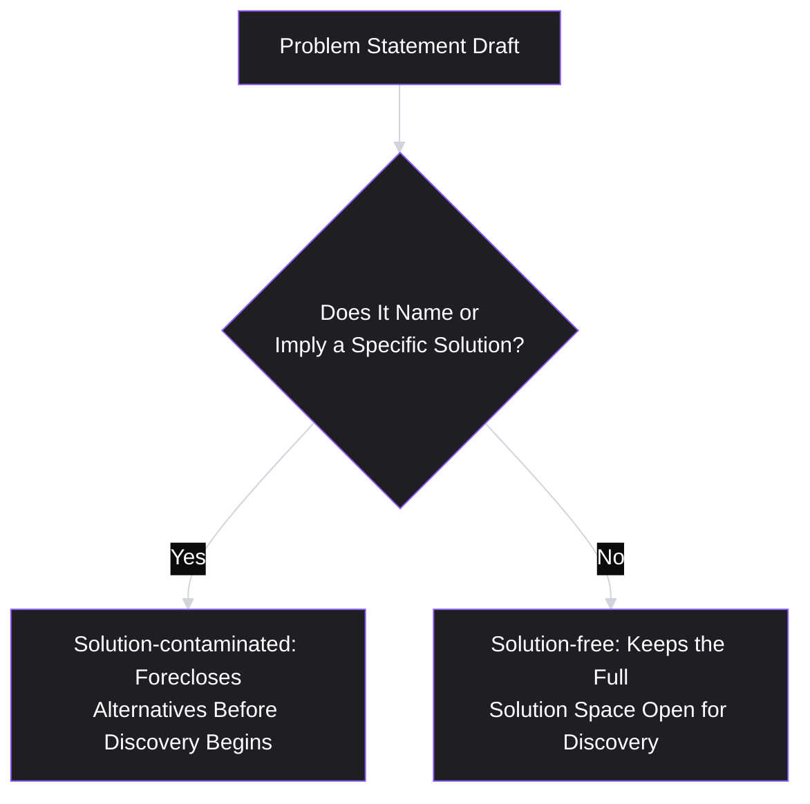
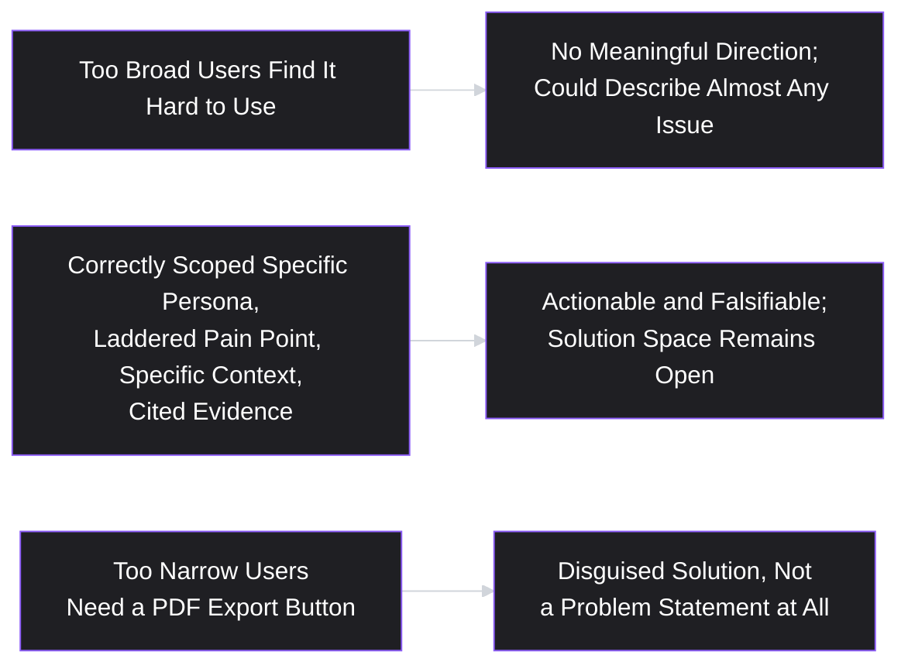
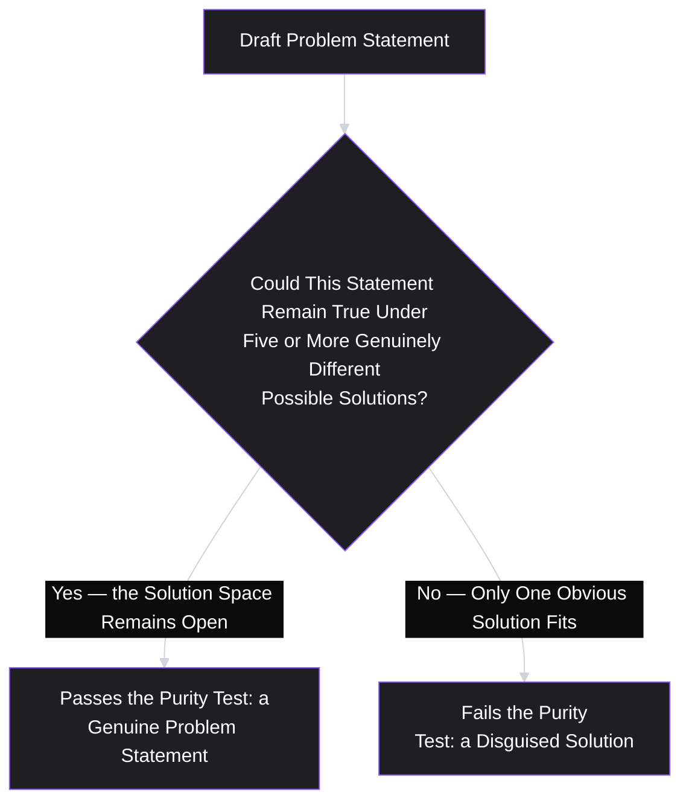

# Lesson 17: Problem Statements

## Why This Lesson Matters

Across the last several lessons, you've built a genuine research pipeline: interviews and surveys (Lessons 12–13) feeding personas and journey maps (Lessons 14–15), which surface multiple pain points that you now know how to prioritize using severity and frequency (Lesson 16). What you don't yet have is a single, disciplined artifact that captures the *specific, validated, prioritized* problem you've decided to solve — in a form precise enough that a team can actually be held to it, and specific enough that success or failure can later be judged against it rather than argued about.

A **problem statement** is a concise, structured articulation of a validated, specific problem — who experiences it, in what context, what job it interferes with, and what evidence supports its importance — written deliberately *without* a proposed solution attached. This last point is the crux of the entire lesson: a problem statement's job is to hold a team's attention on the problem long enough to consider multiple possible solutions, rather than letting the first plausible solution smuggle itself into the framing before alternatives have even been considered.

---

## Learning Path

| Field | Detail |
|---|---|
| **Module** | 2 — Users & Research |
| **Current Lesson** | 17 of 90 |
| **Difficulty** | 4 / 10 |
| **Estimated Study Time** | 25 minutes (reading) + 15 minutes (reflection + quiz) |
| **Prerequisites** | Lesson 6 (Jobs To Be Done), Lesson 16 (Pain Points) |
| **Next Lesson** | Lesson 18 — Customer Segmentation |
| **Future Topics Unlocked** | Lesson 21 (MVP — solutions are scoped against a problem statement), Lesson 22 (PRD — typically opens with a problem statement), Module 3 (Product Design) |

---

## Learning Objectives

By the end of this lesson, you will be able to:

1. Define a problem statement and construct one using a structured, solution-free template.
2. Explain why a problem statement must exclude any proposed solution, and identify the specific risks of solution-contaminated framing.
3. Distinguish a well-scoped problem statement from one that is too broad (unactionable) or too narrow (already a disguised solution).
4. Apply evidence citation within a problem statement, connecting it directly to laddered pain points (Lesson 16) and research findings (Lessons 12–13).
5. Use a problem statement as a shared reference point for evaluating whether a proposed solution actually addresses the stated problem.

---

## Prerequisites

Lesson 6 (Jobs To Be Done) and Lesson 16 (Pain Points). This lesson assumes you can ladder a stated request to its underlying job and can characterize a pain point's severity and frequency with real evidence — a problem statement is the formal artifact that packages this prior work into a single, reusable, solution-free reference point.

---

## Theory

### The Core Definition and Template

A problem statement articulates a specific, validated problem without proposing how to solve it. A widely used structural template:

> **[Specific persona/segment]** experiences **[specific pain point, laddered to its root cause]** when trying to **[specific job to be done]**, particularly in **[specific context/circumstance]**. This matters because **[evidence: severity, frequency, and business or user impact]**.

Every clause here is deliberate. Naming a specific persona or segment (Lesson 14) prevents the vague, undifferentiated "users" that plagues so much product communication. Naming the specific, laddered pain point (Lesson 16) — not the surface-level version — ensures the team is working from a validated root cause rather than a first-pass symptom. Naming the specific job (Lesson 6) anchors the problem in what the person is actually trying to accomplish, not in the product's own internal feature vocabulary. Naming the specific context prevents an overly generalized claim that doesn't actually hold across every circumstance. And explicitly citing evidence keeps the statement honest and falsifiable, rather than a plausible-sounding but ultimately unverified assertion.

### Why Solutions Must Be Excluded

The single most important discipline in writing a problem statement is the deliberate, total exclusion of any proposed solution. This might seem like an arbitrary stylistic rule, but it addresses a specific, well-documented cognitive trap: once a solution is named, even in passing, it becomes extraordinarily difficult for a team to genuinely consider alternatives — the named solution anchors all subsequent thinking, discussion, and even the framing of "success," precisely the anchoring effect Lesson 12 warned about in the interview context, now operating at the level of an entire team's problem-framing process.

Consider the difference between:

- **Solution-contaminated (weak)**: "Enterprise customers need a dark mode option because their eyes get strained during long working sessions."
- **Solution-free (strong)**: "Enterprise power users, who report working in the product for multiple continuous hours, experience visual fatigue during long working sessions, particularly on their evening or late-shift usage; this affects roughly 30% of daily active enterprise seats per session-length analytics, and several report reducing time-in-product as a workaround."

The second version leaves entirely open which solution best addresses the fatigue problem — dark mode is one candidate, but so are adjustable brightness controls, scheduled break reminders, session-length-based UI simplification, or something else the team hasn't yet considered. The first version has already, silently, foreclosed all of these alternatives before a single discovery conversation (Lesson 8) has taken place.

### Scoping: Too Broad vs. Too Narrow

A well-constructed problem statement must be scoped correctly, avoiding two opposite failure modes:

- **Too broad**: "Users find the product hard to use" is so general it provides no meaningful direction for discovery or design — it fails to name a specific persona, a specific pain point, or a specific context, and could describe almost any product issue at all. This mirrors Lesson 7's "for everyone" value proposition failure and Lesson 9's generic-vision failure, applied at the level of problem framing.
- **Too narrow (a disguised solution)**: "Users need a one-click export-to-PDF button" is not actually a problem statement at all — it is a solution wearing a problem statement's grammatical structure, having smuggled in exactly the kind of premature commitment this lesson warns against, without even the courtesy of stating it as an explicit proposal that could be debated as such.

The correctly scoped middle ground is specific enough to be actionable and falsifiable (a team could, in principle, determine whether it has actually been resolved) while remaining entirely agnostic about which solution will resolve it.

### Evidence Citation Within a Problem Statement

A problem statement should cite the specific evidence supporting its claims — directly connecting back to the research techniques covered throughout Module 2. This might include:

- A specific, laddered pain point (Lesson 16), with its established severity and frequency.
- A specific finding from past-behavior interviews (Lesson 12), ideally including a real (never fabricated, per Lesson 14's quote-sourcing rule) representative account.
- A specific, validated prevalence figure from survey or behavioral data (Lesson 13).
- A specific business or strategic consequence tied to the problem (e.g., churn risk in a segment where users and customers are the same person, echoing Lesson 5's Detailed Case Study).

A problem statement without cited evidence is, in effect, an unvalidated assumption wearing a formal-looking structure — precisely the same risk Lesson 14 warned about regarding personas built without research grounding, and Lesson 11's general warning that polished presentation does not confer trustworthiness.

### Using a Problem Statement as a Shared Reference Point

Once written, a problem statement's most important ongoing function is as a **shared reference point** for evaluating proposed solutions later in the process. Given any proposed solution, a team can ask: does this solution actually address the specific persona, pain point, job, and context named in the problem statement — or does it address something adjacent, or something the team has drifted toward without checking? This is directly analogous to Lesson 7's Value Proposition Filter and Lesson 9's Vision Filter, but operating at the level of an individual initiative's problem framing rather than the product's overall strategic direction.

A team that skips writing an explicit problem statement, and instead moves directly from a vague sense of an issue to a specific proposed solution, loses this checking mechanism entirely — there is no stable, solution-free reference point against which to later ask "wait, does this actually solve what we set out to solve?"

---

## Common Beginner Mistakes

**Mistake 1: Including a proposed solution within the problem statement itself**

Even a brief, seemingly harmless mention of a candidate solution anchors the team's thinking and forecloses genuine consideration of alternatives before discovery has even started.

**Mistake 2: Writing a problem statement so broad it provides no real direction**

"Users find this hard to use" fails to name a specific persona, pain point, or context, and could describe almost any product issue — it hasn't actually done the work of specifying a real problem.

**Mistake 3: Writing what is actually a solution, disguised in problem-statement grammar**

"Users need a PDF export button" smuggles in a specific solution without acknowledging it as a proposal, skipping the deliberate solution-agnostic framing this lesson requires.

**Mistake 4: Writing a problem statement with no cited evidence**

A statement built on assumption rather than laddered pain points (Lesson 16) and research findings (Lessons 12–13) is an unvalidated guess dressed up in a formal structure.

**Mistake 5: Never returning to the problem statement once a solution has been proposed**

Without actively using the problem statement as a filter for evaluating the eventual proposed solution, the artifact loses its most important practical function and risks becoming another instance of Lesson 14's "decoration" failure pattern — well-written but never actually used.

---

## Mental Model: The Problem Statement Purity Test

This lesson's mental model is the **Problem Statement Purity Test** — a quick check for whether a draft problem statement has smuggled in a solution.

Apply this test to any draft problem statement before finalizing it: can you name at least five meaningfully different candidate solutions that would all be consistent with the statement as written? If you can only think of one, the statement has very likely already smuggled that one solution in, whether or not it was named explicitly.

---

## Real Company Example

**Airbnb**'s early internal problem framing, according to widely reported accounts of the company's history, is a useful illustration of solution-free problem articulation. Rather than framing their initial challenge narrowly as "we need better listing photos" (a specific, premature solution), the company's early problem understanding is often described in terms closer to "hosts and guests both lack sufficient trust and information to confidently transact with a stranger's home" — a framing broad enough to encompass photography quality, but also host verification, guest reviews, cancellation policies, and other trust-building mechanisms that were developed as the company matured, none of which would have been considered if the original problem framing had prematurely narrowed to photography alone.

*(Assumption flagged: this reflects a widely reported general characterization of Airbnb's early problem understanding rather than a claim about a specific, verbatim internal problem statement document, which this curriculum does not claim certainty about.)*

---

## Real World Perspective: Problem Statements at Different Company Stages

**At a startup:**
Problem statements are often the central artifact anchoring a founding team's entire early strategy (echoing Lesson 10's strategic diagnosis), and getting the scope right — neither so broad it fails to differentiate the company's focus, nor so narrow it's already a specific solution — is disproportionately consequential, since limited resources leave little room to recover from having solved the wrong, or a prematurely narrowed, problem.

**At a mid-size company:**
Problem statements often become a standard, required input at the start of any significant initiative, frequently reviewed and refined collaboratively across product, design, and engineering before any solution discussion begins, precisely to protect against the anchoring effect this lesson describes, especially in organizations where engineering leaders or executives may otherwise arrive at a kickoff meeting with a specific solution already informally decided.

**At Big Tech:**
Problem statements at scale are often paired with rigorous, quantified evidence citation (given the availability of extensive behavioral and survey data), and a significant part of senior product leadership's review process for major initiatives involves specifically checking whether a proposed problem statement has been kept genuinely solution-free, since large organizations with strong existing technical capabilities are especially prone to reflexively reaching for a familiar solution pattern before the underlying problem has been properly scoped.

---

## Detailed Case Study: The Statement That Was Already a Solution

Consider a simplified, illustrative scenario common across B2B collaboration software.

A team building a document collaboration tool is asked to address user complaints about "not knowing who's currently editing a document." An engineering leader, eager to move quickly, drafts what he calls a "problem statement": "Users need real-time cursor indicators showing who else is currently in a document." The team proceeds directly into a significant engineering effort building live, real-time presence indicators and cursor tracking.

Post-launch usage data shows the real-time presence feature is used by only a small fraction of the target user base, and the original underlying complaint — confusion and occasional accidental overwriting of a colleague's recent edits — persists at nearly the same rate. A subsequent, more disciplined investigation reveals that most complaining users work asynchronously, rarely editing a document at the exact same moment as a colleague; their actual problem was not knowing whether someone *had recently* edited the document (in the last hour or day), not whether someone was editing it at that literal instant — a distinct problem that real-time presence indicators, built for simultaneous editing, do not address at all.

**What went wrong?**

Applying this lesson's frameworks:

1. **The "problem statement" was already a solution.** "Users need real-time cursor indicators" names a specific solution outright, failing the Purity Test immediately — no alternative candidate solutions were ever genuinely considered, because the statement had already foreclosed them.
2. **No persona, laddered pain point, or specific context was named.** A genuine problem statement would have specified which users, doing what job, in what context — and this specificity would likely have surfaced the asynchronous-versus-simultaneous distinction before any engineering investment was made.
3. **No evidence was cited.** The statement was based on an assumption about the nature of the underlying confusion (simultaneous editing) rather than laddered interview findings (Lesson 12) that would have revealed the actual, asynchronous nature of most complaining users' workflows.

A team applying the solution-free template from the outset would likely have written something closer to: "Asynchronous collaborators, who report editing shared documents at different times rather than simultaneously, experience uncertainty about whether a document reflects a colleague's most recent changes, particularly when returning to a document after time away; this has led to several reported instances of accidentally overwriting recent edits." This framing would have left open several possible solutions — a "last edited by, and when" indicator, a change-summary notification, or version history (echoing Lesson 8's own case study) — rather than prematurely committing to real-time presence tracking, a solution aimed at a genuinely different underlying scenario.

This case connects directly back to **Lesson 8's Discovery Theater** concept and **Lesson 6's Job Ladder**: a "problem statement" that is actually a solution has skipped the laddering and discovery work this curriculum has built up across multiple lessons, and the cost — a significant engineering investment addressing the wrong scenario — is a direct, predictable consequence of that skipped step.

---

## Framework Explanation: The Problem Statement Review Checklist

A practical checklist for reviewing any draft problem statement before it is finalized and used to anchor a team's discovery process:

| Question | Purpose |
|---|---|
| Does it name a specific persona or segment (Lesson 14), not an undifferentiated "users"? | Prevents vague, unfocused framing |
| Does it name a laddered, root-cause pain point (Lesson 16), not a surface-level symptom? | Ensures the team is solving the actual underlying issue |
| Does it name a specific job to be done (Lesson 6) and context? | Anchors the problem in a real, specific circumstance |
| Does it cite real evidence (interview findings, survey/behavioral data)? | Prevents an unvalidated assumption dressed as a formal statement |
| Does it pass the Purity Test (at least five genuinely different candidate solutions remain consistent with it)? | Confirms no solution has been prematurely smuggled in |

A problem statement that fails any of these checks should be revised before a team commits meaningful discovery or delivery resources to addressing it.

---

## Interview Perspective: How Interviewers Think About This

**Typical question 1: "Walk me through how you'd write a problem statement for an issue you've identified."**
*What the interviewer is actually evaluating:* Whether the candidate's process explicitly excludes solutions and cites real evidence, versus jumping directly to a specific fix framed as if it were a problem description. A strong answer names the specific template elements (persona, laddered pain point, job, context, evidence) rather than describing an unstructured, intuitive process.

**Typical question 2: "Tell me about a time a project solved the wrong problem, in hindsight."**
*What the interviewer is actually evaluating:* Whether the candidate can identify a real instance of the solution-contaminated problem statement failure — a "problem statement" that was actually a disguised solution from the start — and describe what a more disciplined framing would have looked like, echoing this lesson's Detailed Case Study.

**Typical question 3: "How do you keep a team from jumping straight to a solution before the problem is fully understood?"**
*What the interviewer is actually evaluating:* Fluency with the anchoring risk this lesson describes, and whether the candidate has concrete practices (a solution-free template, the Purity Test, explicit review before discovery begins) rather than a vague intention to "slow things down" without a specific mechanism for doing so.

---

## Summary

A problem statement is a concise, structured articulation of a specific, validated problem — naming a specific persona, a laddered root-cause pain point, a specific job and context, and citing real supporting evidence — deliberately written without any proposed solution. Excluding solutions is the lesson's central discipline, since naming even a passing candidate solution anchors a team's subsequent thinking and forecloses genuine consideration of alternatives before discovery has even begun. A well-scoped problem statement avoids being too broad (providing no real direction, echoing Lesson 7's "for everyone" failure) or too narrow (a disguised solution wearing problem-statement grammar), and should cite real evidence connecting it directly to laddered pain points (Lesson 16) and research findings (Lessons 12–13), rather than resting on unvalidated assumption. The Purity Test — checking whether at least five genuinely different candidate solutions remain consistent with the statement — is a practical, quick diagnostic for catching a prematurely smuggled-in solution, and a finalized problem statement's most important ongoing function is as a shared reference point for evaluating whether an eventually proposed solution actually addresses what the team set out to solve.

---

## Key Takeaways

- A problem statement names a specific persona, a laddered pain point, a specific job and context, and cites real evidence — deliberately excluding any proposed solution.
- Naming a solution, even in passing, anchors a team's subsequent thinking and forecloses genuine consideration of alternatives before discovery begins.
- A well-scoped problem statement is neither too broad (no real direction) nor too narrow (a disguised solution) — it should pass the Purity Test of remaining consistent with at least five genuinely different candidate solutions.
- Evidence citation (laddered pain points, interview findings, survey/behavioral data) distinguishes a genuine problem statement from an unvalidated assumption dressed in formal structure.
- A finalized problem statement's most important ongoing use is as a shared reference point for checking whether an eventually proposed solution actually addresses the stated problem.
- Skipping laddering and writing a "problem statement" that is actually a specific solution is a direct, predictable path to solving the wrong version of a problem, as shown in this lesson's Detailed Case Study.
- Never returning to a problem statement once a solution is proposed risks the same "decoration" failure pattern Lesson 14 warned about for personas — a well-written artifact that's never actually used.

---

## Cheat Sheet

*A two-minute review of everything in this lesson.*

- **Template:** [Specific persona] experiences [laddered pain point] when trying to [specific job], particularly in [specific context]. This matters because [cited evidence].
- **No solutions, ever** — naming one anchors the team and forecloses alternatives before discovery starts.
- **Scope check:** not too broad ("users find it hard"), not too narrow (a disguised solution, e.g., "users need a PDF button").
- **Cite real evidence** — laddered pain points, interview findings, survey/behavioral data — not assumption.
- **Purity Test:** can you name at least five genuinely different candidate solutions consistent with this statement? If not, a solution has been smuggled in.
- **Use it as a filter** — check any eventually proposed solution against the original, solution-free statement.

---

## Glossary

| Term | Definition | Related Concepts | Difficulty |
|---|---|---|---|
| Problem Statement | A concise, structured, evidence-cited articulation of a specific, validated problem, written without a proposed solution. | Job to Be Done (Lesson 6), Pain Points (Lesson 16) | 2 |
| Solution Contamination | The failure of including or implying a specific solution within a problem statement, anchoring subsequent thinking. | Anchoring Effect | 2 |
| Purity Test | A diagnostic checking whether a draft problem statement remains consistent with at least five genuinely different candidate solutions. | Problem Statement | 2 |
| Disguised Solution | A statement written in problem-statement grammar that actually names a specific solution, failing the Purity Test. | Solution Contamination | 2 |

---

## Further Reading / Resources

- Marty Cagan's public writing on the distinction between problems and solutions in product discovery, closely related to this lesson's solution-free discipline.
- Teresa Torres, *Continuous Discovery Habits* — includes practical guidance on framing "opportunities" (closely related to problem statements) in a way that keeps the solution space open.
- Design Thinking methodology resources (e.g., IDEO's public design process documentation) — widely reference solution-free problem framing as a foundational discipline, previewing Lesson 30's deeper treatment of design thinking.

---

## Flashcards

**Card 1**
- Front: What is a problem statement, and what must it deliberately exclude?
- Back: A concise, structured, evidence-cited articulation of a specific, validated problem (persona, laddered pain point, job, context); it must deliberately exclude any proposed solution.
- Difficulty: 1
- Tags: problem-statement, fundamentals

**Card 2**
- Front: Why must a problem statement exclude any proposed solution?
- Back: Naming even a passing candidate solution anchors the team's subsequent thinking, making it extraordinarily difficult to genuinely consider alternatives before discovery has taken place.
- Difficulty: 2
- Tags: solution-contamination

**Card 3**
- Front: What is the Purity Test for a problem statement?
- Back: Checking whether the statement remains consistent with at least five genuinely different candidate solutions — if you can only think of one, a solution has likely already been smuggled in.
- Difficulty: 2
- Tags: purity-test

**Card 4**
- Front: What are the two opposite scoping failures for a problem statement?
- Back: Too broad (provides no real direction, e.g., "users find it hard to use") and too narrow (a disguised solution, e.g., "users need a PDF export button").
- Difficulty: 2
- Tags: scoping-failures

**Card 5**
- Front: What five elements does the problem statement template require?
- Back: A specific persona/segment, a specific (laddered) pain point, a specific job to be done, a specific context, and cited evidence.
- Difficulty: 2
- Tags: problem-statement-template

**Card 6**
- Front: In the Detailed Case Study, why did the "real-time cursor indicator" fix fail to resolve the underlying complaint?
- Back: Most complaining users worked asynchronously rather than simultaneously; their actual problem was not knowing about recent edits, not knowing about edits happening at that literal instant — a distinct problem the "problem statement" (which was already a solution) never actually specified.
- Difficulty: 3
- Tags: case-study

**Card 7**
- Front: What is a problem statement's most important ongoing function once finalized?
- Back: Serving as a shared reference point for checking whether an eventually proposed solution actually addresses the specific persona, pain point, job, and context originally named — directly parallel to the Value Proposition and Vision Filters.
- Difficulty: 2
- Tags: problem-statement-filter

## Reflection Exercise

You are the PM for a fitness app, and your team has surfaced a laddered, validated pain point (Lesson 16): users who set a weekly workout goal report feeling discouraged and often abandon the app entirely after missing just one planned session, rather than adjusting and continuing.

Work through the following, in writing, before reading further:

1. Write a first-draft problem statement using this lesson's template, being careful to name a specific persona, the laddered pain point, the specific job, the context, and cited evidence (you may invent plausible-sounding evidence for this exercise, clearly noting it as illustrative).
2. Apply the Purity Test to your draft: name at least five genuinely different candidate solutions that would all remain consistent with your problem statement as written.
3. Rewrite a "too narrow" version of this same problem that smuggles in one specific solution (e.g., "users need a way to adjust their weekly goal after a missed session"), and explain specifically what alternative solutions this narrower framing would foreclose.
4. Rewrite a "too broad" version of this same problem (e.g., "users get discouraged using the app"), and explain what specific direction is lost compared to your original draft.
5. Using the Problem Statement Review Checklist, identify which element of your original draft (persona, pain point, job, context, or evidence) you are least confident is genuinely research-grounded, and describe what additional evidence you would need to strengthen it.

There is no single correct answer. The purpose of this exercise is to practice constructing a genuinely solution-free problem statement and stress-testing it against the Purity Test, rather than defaulting to the first plausible-sounding fix.

---

## Quiz

**1. Which of the following best completes the problem statement template described in this lesson?**
A) "[Persona] experiences [laddered pain point] doing [job], in [context], per [evidence]."
B) "[Persona] needs [specific feature] in order to solve the problem that they currently face."
C) "We should build [feature], because our customers keep asking us for it."
D) "Users are broadly unhappy with the product as it currently stands today."

*Correct answer: A*
*Explanation: Every clause in A does work: a named segment instead of "users," a laddered cause instead of a symptom, a real job, a bounded context, and evidence that makes the claim falsifiable. None of it names a solution.*
*Learning objective tested: #1*
*Difficulty: Easy*

---

**2. Why must a problem statement exclude any proposed solution, according to this lesson?**
A) Because problem statements are used by executives, not engineers
B) Because including a solution would make the statement too long
C) Because solutions are always infeasible at the framing stage
D) Because naming one anchors the team and forecloses the alternatives

*Correct answer: D*
*Explanation: Once "dark mode" is in the sentence, adjustable brightness, break reminders, and session-length simplification quietly stop being candidates — before a single discovery conversation happens.*
*Learning objective tested: #2*
*Difficulty: Easy*

---

**3. Which of the following is the clearest example of a problem statement that is "too broad," as described in this lesson?**
A) "Users need a PDF export button on the reports screen."
B) "Asynchronous collaborators feel unsure about recent document edits."
C) "Users find the product hard to use in daily work."
D) "Enterprise power users report fatigue in long evening sessions."

*Correct answer: C*
*Explanation: No persona, no specific friction, no context. It could describe almost any product and gives a discovery team nowhere in particular to start.*
*Learning objective tested: #3*
*Difficulty: Easy*

---

**4. Which of the following is the clearest example of a "disguised solution" masquerading as a problem statement?**
A) "Users feel uncertain about who recently edited a shared document."
B) "This affects roughly 40% of asynchronous collaborators per analytics."
C) "Users need real-time cursor indicators showing who is in a document."
D) "Asynchronous collaborators, editing at different times, feel uncertain about changes."

*Correct answer: C*
*Explanation: This is a build order in the grammar of a problem. It never says what goes wrong for whom, only what to make — and so it cannot be debated as the proposal it actually is.*
*Learning objective tested: #3*
*Difficulty: Easy*

---

**5. What is the Purity Test used for, according to this lesson?**
A) Checking whether a survey question is worded neutrally enough
B) Checking a statement stays consistent with five different solutions
C) Determining how many personas a product team ought to build
D) Measuring both the severity and the frequency of a given pain point

*Correct answer: B*
*Explanation: If only one candidate comes to mind, that candidate is already inside the statement, whether or not anyone wrote its name.*
*Learning objective tested: #2, #3*
*Difficulty: Easy*

---

**6. In the Detailed Case Study, what was the actual underlying problem that the "real-time cursor indicator" solution failed to address?**
A) Users wanted the ability to delete older document versions
B) Users wanted faster document loading on the shared workspace
C) Most complaining users worked asynchronously, not at the same time
D) Users wanted a way to stop colleagues editing documents entirely

*Correct answer: C*
*Explanation: The feature solved simultaneous editing, which was not the situation these users were in. Their worry was whether what they were reading reflected a colleague's latest work.*
*Learning objective tested: #2*
*Difficulty: Easy*

---

**7. Why is citing evidence considered essential in a problem statement, according to this lesson?**
A) Because citing evidence makes a problem statement legally binding
B) Because uncited statements are always factually incorrect
C) Because citation is required for problems affecting most of the base
D) Because without it the statement is an assumption in formal dress

*Correct answer: D*
*Explanation: A structured template makes a guess look validated. The citation is what lets a sceptical colleague check the claim instead of taking the formatting as proof.*
*Learning objective tested: #4*
*Difficulty: Medium*

---

**8. What is the most important ongoing function of a problem statement once it has been finalized, according to this lesson?**
A) Determining the precise engineering timeline for the project
B) Replacing the need for any further discovery or research work
C) Serving as a permanent, unchangeable historical record of intent
D) Serving as the reference point for checking whether a solution fits

*Correct answer: D*
*Explanation: Without a stable, solution-free statement to return to, there is no way to ask later whether what got built actually solves what the team set out to solve.*
*Learning objective tested: #5*
*Difficulty: Medium*

---

**9. (Scenario) A team writes a problem statement that reads: "Mid-market customers, who manage teams of 10–30 employees, struggle to get timely approval on expense reports, particularly when a manager is traveling; this affects 45% of mid-market accounts per support ticket analysis and interview findings." Does this problem statement pass the Purity Test?**
A) Yes — several different solutions stay consistent with this framing
B) No, because the statement names a specific solution outright
C) No, because the statement is too broad and vague to act on
D) It cannot be judged without knowing which engineering team is assigned

*Correct answer: A*
*Explanation: Delegate approvals, automatic thresholds, a mobile approval flow, and substitute-approver rules all fit the statement as written, which is exactly what the test is looking for.*
*Learning objective tested: #3*
*Difficulty: Medium-Hard*

---

**10. (Product Thinking) A team proposes a solution and, upon reviewing their original problem statement, realizes the solution actually addresses a different persona and context than the one specified. According to this lesson, what should the team do?**
A) Proceed with it regardless, since problem statements are not meant to be rechecked
B) Treat the mismatch as a warning; adjust the solution or revisit the statement
C) Rely on the solution's technical merits and set the statement aside
D) Discard the solution automatically whenever any mismatch appears

*Correct answer: B*
*Explanation: A mismatch means one of the two is wrong, and which one is a real question. New evidence may justify updating the statement; drift alone does not.*
*Learning objective tested: #5*
*Difficulty: Medium-Hard*

---

**11. (Interview Reasoning) A candidate is asked to describe a problem statement they've written, and their description includes a specific named feature as part of the "problem." What might this signal, based on this lesson's Interview Perspective section?**
A) Possible solution contamination, since the framing should stay agnostic
B) Strong and efficient problem-framing skills under time pressure
C) Evidence of unusually advanced technical skill in the candidate's background
D) Nothing of note, since embedding a solution is standard practice here

*Correct answer: A*
*Explanation: The interviewer is checking whether the candidate can hold a problem open. A feature inside the problem statement means the solution space closed before discovery began.*
*Learning objective tested: #2*
*Difficulty: Hard*

---

**12. (Product Thinking, Higher Difficulty) A team's problem statement names a specific persona and job, but provides no cited evidence for the claimed pain point's severity or frequency. According to the Problem Statement Review Checklist, what should happen next?**
A) Finalise it as-is, since persona and job specification already suffice
B) Proceed straight to building, since citation is optional internally
C) Gather and cite specific evidence before anchoring discovery
D) Discard the statement entirely, since it is unusable without evidence

*Correct answer: C*
*Explanation: The framing may well be right; it simply has not been shown to be. Evidence is an addition the draft needs, not grounds for throwing the draft away.*
*Learning objective tested: #4*
*Difficulty: Medium-Hard*

---

**13. (Interview Reasoning, Higher Difficulty) An interviewer describes two draft problem statements and asks a candidate which is better: Draft A specifies a persona, pain point, job, and context but cites no evidence; Draft B specifies a persona and cites strong evidence but is written as "users need feature X to solve their frustration." Which draft has the more fundamental flaw, and why?**
A) Draft A, since missing evidence always outweighs solution contamination
B) Draft B, since naming a solution forecloses the space as a citation gap does not
C) Draft A, because it runs noticeably longer than Draft B
D) Neither draft carries any meaningful flaw worth raising here

*Correct answer: B*
*Explanation: Both are flawed. A citation can be added without changing what Draft A frames; removing feature X from Draft B changes what the statement is about, which is the deeper problem.*
*Learning objective tested: #2, #4*
*Difficulty: Hard*

---

**14. (Product Thinking, Higher Difficulty) A team applies the Purity Test to a draft problem statement and can only identify one plausible candidate solution, despite genuine effort to brainstorm alternatives. What does this most likely indicate?**
A) The statement is excellent, since one clear solution shows strong framing
B) Scoped too narrowly; it is likely a disguised solution already
C) Proceed with the one solution, since test results are not to be acted on
D) The Purity Test does not apply where only a single solution is identified

*Correct answer: B*
*Explanation: A genuinely open problem admits several routes. When only one fits, the statement has usually described the route rather than the destination.*
*Learning objective tested: #3*
*Difficulty: Hard*

---

**15. (Highest Difficulty) A team writes a correctly scoped, evidence-cited, solution-free problem statement, uses it to generate five genuinely different candidate solutions, and ultimately builds one of them. Six months later, usage data shows the built solution has not resolved the original pain point. Using this lesson's framework, what should the team do?**
A) Conclude problem statements are not useful, since the chosen solution failed
B) Assume the persona and pain point were wrong, and abandon the initiative
C) Build all five candidate solutions at once, without further evaluation
D) Return to the statement and evaluate the remaining candidates

*Correct answer: D*
*Explanation: A validated problem and a failed solution are different findings. The statement is the asset that survives the failure, and four considered alternatives are still sitting beside it.*
*Learning objective tested: #5*
*Difficulty: Hard*

---

## Connections

| | Lesson | Core Idea Carried Forward |
|---|---|---|
| **Previous Lesson** | Lesson 16 — Pain Points | Provides the laddered, prioritized pain point that becomes the substantive core of a problem statement |
| **Current Lesson** | Lesson 17 — Problem Statements | The solution-free template; the Purity Test; too-broad vs. too-narrow scoping; evidence citation |
| **Next Lesson** | Lesson 18 — Customer Segmentation | Extends persona-level thinking into a more rigorous, quantitatively validated segmentation practice, often used to refine which persona a problem statement should name |
| **Future Concepts Unlocked** | Lesson 21 (MVP) | Uses a finalized, solution-free problem statement as the basis for scoping the smallest viable solution to test |
| | Lesson 22 (Product Requirements Document) | Typically opens by restating the validated problem statement before any solution specification begins |

This curriculum is designed to be read as one continuous argument. From this lesson forward, any reference to "the problem we're solving" assumes the solution-free discipline and Purity Test covered here — this will not be re-explained, only re-applied. Module 2 continues into more advanced segmentation and opportunity-identification territory in the lessons ahead.
