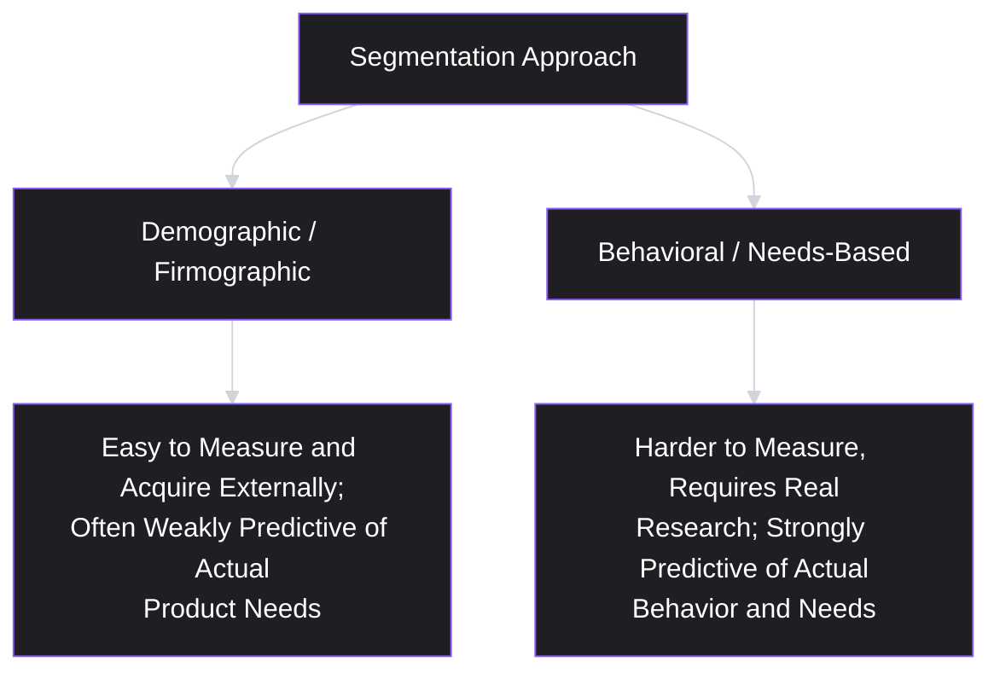
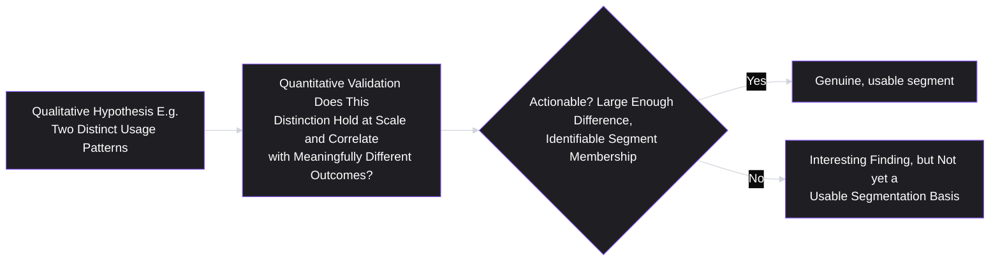

# Lesson 18: Customer Segmentation

## Why This Lesson Matters

Lesson 14 introduced personas — a small number of qualitative, memorable syntheses of research findings. Lesson 5 introduced the Alignment Spectrum, which noted that even "customers" can differ sharply from account to account in how their interests relate to users'. This lesson formalizes a question both lessons have circled without fully answering: how do you rigorously divide a user or customer base into groups that are actually meaningfully different from each other — different enough to warrant different treatment, different prioritization, or different messaging — rather than groups defined by convenient but ultimately arbitrary boundaries like age or company size?

**Customer segmentation** is the disciplined practice of dividing a user or customer base into groups based on characteristics that are genuinely predictive of different needs, behaviors, or value to the business — as opposed to segmentation based on characteristics that are easy to measure but only weakly, or not at all, correlated with anything that actually matters for product or business decisions. This lesson exists because segmentation done badly is worse than not segmenting at all: it creates an illusion of insight and precision while actually encoding demographic convenience as if it were behavioral truth — precisely the trap Lesson 14 warned about with fictional-character personas, now examined at the level of a formal, quantitative practice.

---

## Learning Path

| Field | Detail |
|---|---|
| **Module** | 2 — Users & Research |
| **Current Lesson** | 18 of 90 |
| **Difficulty** | 4 / 10 |
| **Estimated Study Time** | 30 minutes (reading) + 15 minutes (reflection + quiz) |
| **Prerequisites** | Lesson 5 (Users vs. Customers), Lesson 6 (Jobs To Be Done), Lesson 14 (Personas) |
| **Next Lesson** | Lesson 19 — Opportunity Identification |
| **Future Topics Unlocked** | Lesson 19 (Opportunity Identification — often organized around segments), Lesson 29 (Prioritization Fundamentals — segment value as a scoring input) |

---

## Learning Objectives

By the end of this lesson, you will be able to:

1. Define customer segmentation and distinguish behavioral/needs-based segmentation from demographic/firmographic segmentation.
2. Explain why demographic segmentation is often weakly predictive, and identify when it is, and is not, an appropriate segmentation basis.
3. Apply a basic method for validating whether a proposed segment is genuinely distinct, using both qualitative (Lesson 12) and quantitative (Lesson 13) evidence.
4. Identify the "segmentation for its own sake" failure pattern and explain why an unused segmentation scheme provides no value regardless of its analytical sophistication.
5. Distinguish segmentation for strategic targeting from segmentation for tactical personalization, and explain why they may require different segment definitions.

---

## Prerequisites

Lesson 5 (Users vs. Customers), Lesson 6 (Jobs To Be Done), and Lesson 14 (Personas). This lesson assumes fluency with the Alignment Spectrum, laddering, and the persona-construction template, and extends all three into a more rigorous, often quantitatively validated segmentation practice.

---

## Theory

### The Core Definition and the Two Segmentation Traditions

Customer segmentation divides a user or customer base into groups sharing meaningfully different characteristics relevant to product or business strategy. Two broad traditions exist, and distinguishing them clearly is the foundation of this entire lesson:

- **Demographic/firmographic segmentation**: dividing by easily observable, often externally available attributes — for individual consumers, age, income, location, gender; for businesses (firmographic segmentation), company size, industry, geography, revenue.
- **Behavioral/needs-based segmentation**: dividing by what people actually do, want, and struggle with — usage patterns, jobs to be done (Lesson 6), pain points (Lesson 16), and revealed preferences (Lesson 11).

The central argument of this lesson, directly echoing Lesson 6's milkshake example, is that demographic and firmographic attributes are frequently poor predictors of the underlying job or need that actually drives product decisions — two companies of identical size and industry can have wildly different needs depending on their internal workflows, growth stage, or team structure, while two companies of very different size and industry can share nearly identical needs if they face a similar underlying job.

### Why Demographic Segmentation Is Often Weakly Predictive — And When It Isn't

Demographic and firmographic segmentation persists in practice largely because it is cheap and easy: company size and industry are readily available in a CRM without any additional research, while a genuine behavioral segment requires the research investment covered throughout this module. This convenience, however, does not make demographic segmentation predictive of what actually matters for most product decisions.

That said, demographic and firmographic attributes are not useless — they can serve as a reasonable **proxy** for an underlying behavioral difference, when there is good reason (ideally validated through research, not assumed) to believe the demographic correlates with the actual behavioral segment. For example, company size might genuinely correlate with a specific need — very large enterprises may have a validated, higher-frequency need for SSO and compliance features (echoing Lesson 5's enterprise-versus-user divergence) — but the size itself is not the reason the need exists; the underlying organizational complexity that happens to correlate with size is the actual driver. Treating the demographic proxy as if it were the real underlying cause, rather than a correlate of one, risks misapplying the segmentation the moment the correlation breaks down (a small company with unusually complex compliance requirements, or a large company with unusually simple ones).

### Validating a Proposed Segment

A rigorous approach to validating whether a proposed segment is genuinely distinct combines qualitative and quantitative evidence, directly extending Lesson 11's complementary-methods framework:

1. **Qualitative hypothesis generation** (Lesson 12): interviews across a range of customers surface a candidate behavioral distinction — for example, "some customers seem to use this primarily for internal team coordination, while others use it primarily for external client communication."
2. **Quantitative validation** (Lesson 13): a survey or behavioral analysis checks whether this candidate distinction actually exists at meaningful scale, and whether it correlates with meaningfully different behavior, needs, or value (e.g., different feature usage patterns, different willingness to pay, different churn rates).
3. **Actionability check**: even if a statistically real difference exists between two groups, the segmentation is only useful if the difference is large enough, and identifiable enough (can the company actually tell which segment a given customer belongs to, ideally without requiring them to self-report), to justify different treatment.

A segment that fails the actionability check — a real, statistically detectable difference that is too small, or too difficult to identify in practice, to warrant different treatment — is not necessarily wrong, but it is not yet a *useful* segmentation basis, and treating it as one anyway adds unnecessary complexity without a corresponding practical benefit.

### The "Segmentation for Its Own Sake" Failure Pattern

A specific, recurring failure — closely related to Lesson 14's persona-as-decoration and Lesson 9's vision-without-strategy patterns — is producing an analytically sophisticated, well-validated segmentation scheme that is never actually used to inform a real decision: no differentiated messaging, no differentiated feature prioritization, no differentiated pricing or support strategy actually results from the segmentation work. A genuinely valid segmentation scheme that never changes any real decision has, functionally, provided no value, regardless of how much rigor and research effort went into constructing it.

This failure often arises from segmenting a user base into groups that are real and statistically distinct, but that don't actually differ in ways connected to any decision the business is currently in a position to act on — for example, discovering a genuine behavioral distinction that would require a pricing or product-tier restructuring the company has no near-term intention of pursuing. The segmentation may be entirely valid as a piece of research, while still failing the practical test this lesson (and this entire curriculum) consistently applies: does this actually change what the team does next?

### Strategic Targeting Segmentation vs. Tactical Personalization Segmentation

A final, important distinction: the segments most useful for **strategic targeting** (deciding which broad market to focus product development and go-to-market resources on, echoing Lesson 10's strategic diagnosis) are often different, and coarser, than the segments most useful for **tactical personalization** (customizing an individual user's in-product experience, onboarding flow, or messaging in real time).

Strategic targeting segments tend to be few in number, stable over a longer time horizon, and tied closely to a company's overall strategic guiding policy (Lesson 10) — for example, "mid-market logistics companies with 50–500 employees" as a strategic target market. Tactical personalization segments can be far more numerous, more granular, and more dynamic — for example, real-time behavioral micro-segments used to decide which specific onboarding tooltip a given user sees next, based on their in-the-moment usage pattern. Conflating these two purposes — trying to use a handful of broad strategic segments to drive granular, real-time personalization decisions, or trying to use dozens of granular behavioral micro-segments to inform a company's overall strategic market focus — tends to produce a poor fit in both directions, since the two purposes call for genuinely different levels of granularity and stability.

---

## Common Beginner Mistakes

**Mistake 1: Segmenting primarily by demographic or firmographic convenience, without validating actual behavioral correlation**

Company size, industry, and age are easy to measure but frequently weak predictors of the actual underlying need driving product decisions, unless a genuine correlation has been validated rather than assumed.

**Mistake 2: Treating a demographic correlate as if it were the underlying cause**

Even when company size genuinely correlates with a specific need (e.g., compliance requirements), the size itself is not the actual driver — the underlying organizational complexity is — and conflating the two risks misapplying the segmentation when the correlation breaks down for an atypical case.

**Mistake 3: Validating a segment qualitatively but never checking it quantitatively (or vice versa)**

A candidate distinction surfaced in a handful of interviews may not hold at meaningful scale, and a statistically detectable quantitative difference may lack the qualitative depth needed to understand why it exists or how to act on it — both steps, per Lesson 11's complementary-methods framework, are typically needed.

**Mistake 4: Building a sophisticated segmentation scheme that never actually informs a real decision**

A genuinely valid segmentation that changes no messaging, prioritization, pricing, or support strategy has provided no practical value, regardless of its analytical rigor — echoing Lesson 14's persona-as-decoration failure.

**Mistake 5: Using the same segment definitions for both strategic targeting and tactical personalization**

Strategic segments (few, stable, broad) and tactical segments (many, dynamic, granular) generally serve different purposes and require different levels of granularity — conflating them tends to produce a poor fit for both.

---

## Mental Model: The Segmentation Validity Chain

This lesson's mental model is the **Segmentation Validity Chain** — a sequence of checkpoints, directly parallel to Lesson 13's Survey Validity Chain, that a proposed segmentation scheme must pass to be genuinely useful.

```mermaid
%%{init: {
  "theme": "dark",
  "themeVariables": {
    "background": "#0b0b0c",
    "primaryColor": "#1f1f23",
    "primaryTextColor": "#ffffff",
    "primaryBorderColor": "#8b5cf6",
    "lineColor": "#d1d5db",
    "secondaryColor": "#18181b",
    "tertiaryColor": "#111111",
    "mainBkg": "#1f1f23",
    "nodeBorder": "#8b5cf6",
    "clusterBkg": "#000000",
    "clusterBorder": "#27272a",
    "titleColor": "#ffffff",
    "edgeLabelBackground": "#0b0b0c",
    "nodeTextColor": "#ffffff",
    "edgeLabelColor": "#ffffff",
    "actorBorder": "#8b5cf6",
    "actorBkg": "#1f1f23",
    "actorTextColor": "#ffffff",
    "sequenceNumberColor": "#ffffff",
    "signalColor": "#8b5cf6",
    "signalTextColor": "#ffffff",
    "textColor": "#ffffff",
    "classText": "#ffffff",
    "classBorder": "#8b5cf6",
    "classBkg": "#1f1f23"
  }
}}%%
graph LR
    A[Qualitative Hypothesis a Candidate<br/>Distinction Surfaced Through Interviews] --> B[Quantitative Validation Does It Hold at<br/>Scale and Correlate with Real Outcomes?]
    B --> C[Actionability Check Is the Difference<br/>Large Enough and Identifiable Enough to<br/>Warrant Different Treatment?]
    C --> D[Purpose Fit Check Is This Segmentation<br/>Scoped Correctly for Strategic Targeting<br/>or Tactical Personalization?]
    D --> E[Decision Impact Check Does This<br/>Segmentation Change a Real, Current<br/>Decision?]
    E --> F[Genuinely Useful Segmentation]
```

A break at any link — a qualitative hunch never quantitatively checked, a real but tiny difference treated as actionable, segments built for the wrong purpose, or a rigorous scheme that never informs any actual decision — undermines the segmentation's practical value regardless of how sound the other links are.

---

## Real Company Example

**Salesforce**'s well-documented approach to segmenting customers by company size and industry, paired with distinct product tiers and go-to-market motions for each, is a widely discussed illustration of firmographic segmentation used as a validated proxy for genuinely different underlying needs — rather than as an arbitrary convenience. Public accounts of Salesforce's go-to-market strategy have described maintaining distinct offerings and sales approaches for small businesses, mid-market companies, and large enterprises, reflecting a validated recognition that organizational complexity, procurement processes, and integration needs (the actual underlying drivers, per this lesson's proxy discussion) tend to correlate meaningfully with company size in the CRM software category specifically — a correlation that may not hold with equal strength in every product category, underscoring this lesson's point that firmographic segmentation must be validated for the specific context in which it's applied, not assumed to transfer automatically.

*(Assumption flagged: this reflects widely reported descriptions of Salesforce's general go-to-market segmentation rather than a claim about the company's complete internal validation methodology, which this curriculum does not claim certainty about.)*

---

## Real World Perspective: Customer Segmentation at Different Company Stages

**At a startup:**
Segmentation is often minimal and provisional, given limited data and resources, frequently amounting to a single, sharply focused strategic target segment (echoing Lesson 10's exclusion discipline) rather than an elaborate multi-segment scheme. The primary risk at this stage is premature complexity — attempting a sophisticated segmentation exercise before the company has enough real usage data or research to validate any proposed distinction meaningfully.

**At a mid-size company:**
Segmentation often becomes more formalized, typically validated with both qualitative research and quantitative behavioral or survey data, and increasingly used to differentiate go-to-market messaging, pricing tiers, and roadmap prioritization across a small number of genuinely distinct, validated strategic segments.

**At Big Tech:**
Segmentation at scale often supports both strategic targeting (a small number of broad market segments guiding overall product-line strategy) and tactical, often automated, personalization (large numbers of granular behavioral micro-segments driving individualized in-product experiences), and a significant part of senior product and data science work involves maintaining a clear, deliberate distinction between these two purposes rather than allowing one scheme to be misapplied to the other's use case.

---

## Detailed Case Study: The Segments That Looked Right But Weren't

Consider a simplified, illustrative scenario common across B2B marketing software.

A marketing automation company segments its customer base by company size — small (under 50 employees), mid-market (50–500), and enterprise (500+) — and builds distinct onboarding flows, pricing tiers, and customer support models around this firmographic scheme, on the assumption (never explicitly tested) that company size is a reliable proxy for marketing team sophistication and feature needs.

Over time, customer support notices a puzzling pattern: a meaningful share of "small" customers (by employee count) behave, in terms of feature usage and support needs, remarkably like "enterprise" customers — requesting advanced multi-channel campaign orchestration, detailed attribution reporting, and dedicated support — while a meaningful share of "enterprise" customers (by employee count) use only the most basic features and rarely engage with advanced capabilities at all.

A subsequent investigation, combining qualitative interviews (Lesson 12) with quantitative behavioral analysis (Lesson 13), reveals the actual underlying distinction: the real predictor of feature sophistication and support need is not company size at all, but **whether the company has a dedicated, specialized marketing team versus marketing being handled as a secondary responsibility by a generalist role** (a small startup with a dedicated three-person marketing team behaves like an "enterprise" customer, while a large enterprise where marketing automation is managed part-time by an operations generalist behaves like a "small" customer) — a behavioral distinction firmographic company size only weakly, and unreliably, correlated with.

**What went wrong?**

Applying this lesson's frameworks:

1. **The original segmentation was firmographic, chosen for convenience, and never validated against actual behavior before being operationalized into pricing, onboarding, and support structures.** Company size was assumed to be a reliable proxy for marketing sophistication, without qualitative or quantitative confirmation that the correlation actually held.
2. **The Segmentation Validity Chain broke at the earliest possible link** — there was no qualitative hypothesis-generation step at all, let alone a quantitative validation step, before the segmentation was operationalized across multiple significant business functions.
3. **The eventual, validated distinction (dedicated marketing team vs. generalist-managed marketing) is a genuine behavioral driver — directly connected to Lesson 6's Jobs to Be Done concept** — a dedicated marketing team has a fundamentally different, more sophisticated set of jobs to accomplish than a generalist managing marketing as one responsibility among several, regardless of the company's overall employee count.

A team applying this lesson's discipline from the outset would have conducted qualitative interviews across a range of company sizes specifically probing team structure and role dedication, quantitatively validated whether this distinction correlated more strongly with feature usage and support needs than company size did, and only then operationalized pricing, onboarding, and support around the validated, behaviorally grounded distinction — likely discovering the dedicated-team-versus-generalist distinction well before misallocating onboarding and support resources based on an unvalidated firmographic proxy.

This case connects directly back to **Lesson 6's Jobs to Be Done** and **Lesson 14's persona-construction discipline**: in both cases, the lesson's core argument is that behavior and underlying job, not demographic or firmographic convenience, should drive segmentation — and this case study shows the real operational cost (misallocated onboarding, pricing, and support resources) of skipping that validation step.

---

## Framework Explanation: The Proxy Validation Table

A practical framework for evaluating whether a proposed demographic or firmographic segmentation basis is a genuine, validated proxy or an unvalidated convenience:

| Question | If Yes | If No |
|---|---|---|
| Has the correlation between this demographic/firmographic attribute and actual behavior been checked with real data (not assumed)? | Proceed cautiously, treating it as a validated proxy | Treat the segmentation as unvalidated; conduct research before operationalizing it |
| Is the underlying behavioral driver (the actual cause) understood, even if the demographic attribute is used as a convenient proxy for it? | The team understands when the proxy might break down for atypical cases | The team risks misapplying the segmentation whenever the correlation doesn't hold |
| Would a customer who doesn't fit the demographic norm for their assigned segment (e.g., a small company with enterprise-level needs) be miscategorized, and does the business have a process for catching this? | Lower risk of costly misallocation | Higher risk of the exact misallocation shown in the Detailed Case Study |

The consistent discipline this table reinforces: **a demographic or firmographic segmentation basis can be legitimately useful, but only when its correlation with actual behavior has been genuinely validated and is periodically re-checked, not simply assumed because it is convenient to measure.**

---

## Interview Perspective: How Interviewers Think About This

**Typical question 1: "How would you segment a customer base for a new product?"**
*What the interviewer is actually evaluating:* Whether the candidate defaults immediately to demographic or firmographic convenience (age, company size, industry) without considering behavioral validation, or whether they describe a process of qualitative hypothesis generation followed by quantitative validation, per this lesson's Segmentation Validity Chain.

**Typical question 2: "Your company has always segmented customers by company size. How would you evaluate whether this is still the right approach?"**
*What the interviewer is actually evaluating:* Whether the candidate can articulate the proxy-versus-underlying-cause distinction and propose a concrete method (combining qualitative and quantitative research) for testing whether the assumed correlation still holds, rather than either defending the existing scheme unquestioningly or dismissing it without evidence.

**Typical question 3: "You've identified a statistically valid, real difference between two customer groups. What else do you need to know before treating this as a useful segment?"**
*What the interviewer is actually evaluating:* Awareness of the actionability check and the decision-impact check — whether the candidate recognizes that a real, valid difference is not automatically useful unless it's large enough, identifiable enough, and connected to an actual decision the business can act on.

---

## Summary

Customer segmentation divides a user or customer base into meaningfully distinct groups, and this lesson draws a sharp distinction between demographic/firmographic segmentation (easy to measure, often weakly predictive of actual behavior) and behavioral/needs-based segmentation (harder to measure, but strongly predictive when properly validated). Demographic attributes can serve as legitimate proxies for underlying behavioral drivers, but only when the correlation has been genuinely validated rather than assumed, and treating the proxy as if it were the actual cause risks misapplying the segmentation whenever the correlation breaks down, as shown in this lesson's Detailed Case Study. A rigorous validation process combines qualitative hypothesis generation (Lesson 12) with quantitative confirmation (Lesson 13) and an actionability check, following the Segmentation Validity Chain. The "segmentation for its own sake" failure — a valid, rigorous scheme that never actually changes any real decision — provides no practical value regardless of its analytical sophistication. Finally, segments built for strategic targeting (few, stable, broad) generally differ from segments built for tactical personalization (many, dynamic, granular), and conflating the two purposes tends to produce a poor fit for both.

---

## Key Takeaways

- Demographic/firmographic segmentation is easy to measure but often weakly predictive of actual behavior; behavioral/needs-based segmentation is harder to measure but more strongly predictive when properly validated.
- A demographic attribute can be a legitimate proxy for an underlying behavioral driver, but only when the correlation has been genuinely validated — treating the proxy as the actual cause risks misapplication when the correlation breaks down.
- The Segmentation Validity Chain (qualitative hypothesis → quantitative validation → actionability check → purpose fit → decision impact) can break at any link, undermining a segmentation scheme's practical usefulness.
- "Segmentation for its own sake" — a valid, rigorous scheme that never actually changes any real decision — provides no practical value regardless of analytical sophistication.
- Strategic targeting segments (few, stable, broad) and tactical personalization segments (many, dynamic, granular) generally serve different purposes and require different levels of granularity.
- A real, statistically valid difference between groups is not automatically a useful segmentation basis unless it is also large enough and identifiable enough to justify different treatment.
- Segmentation schemes, like personas and journey maps, should be periodically revalidated as underlying markets and behavior evolve.

---

## Cheat Sheet

*A two-minute review of everything in this lesson.*

- **Demographic/firmographic = easy but often weak.** **Behavioral/needs-based = harder but stronger.**
- **A demographic can be a valid proxy** — but only if validated, and only if you understand the actual underlying driver it's standing in for.
- **Segmentation Validity Chain:** qualitative hypothesis → quantitative validation → actionability check → purpose fit → decision impact.
- **"Segmentation for its own sake"** — rigorous but never used = no practical value.
- **Strategic segments** (few, stable, broad) ≠ **tactical segments** (many, dynamic, granular) — don't conflate the two purposes.
- **A real difference isn't automatically useful** — check whether it's large enough and identifiable enough to warrant different treatment.

---

## Glossary

| Term | Definition | Related Concepts | Difficulty |
|---|---|---|---|
| Customer Segmentation | The practice of dividing a user or customer base into meaningfully distinct groups relevant to product or business decisions. | Persona (Lesson 14), Jobs to Be Done (Lesson 6) | 2 |
| Demographic/Firmographic Segmentation | Segmentation based on easily observable attributes (age, company size, industry), often weakly predictive of actual behavior unless validated. | Behavioral Segmentation | 2 |
| Behavioral/Needs-Based Segmentation | Segmentation based on actual behavior, jobs to be done, and pain points, typically more predictive but requiring genuine research. | Jobs to Be Done (Lesson 6) | 2 |
| Segmentation Validity Chain | A sequence of checkpoints (qualitative hypothesis, quantitative validation, actionability, purpose fit, decision impact) a segmentation scheme must pass to be genuinely useful. | Survey Validity Chain (Lesson 13) | 3 |
| Segmentation for Its Own Sake | The failure pattern of building a rigorous, valid segmentation scheme that never actually informs any real decision. | Persona as Decoration (Lesson 14) | 2 |
| Strategic Targeting Segmentation | Segmentation used to guide broad, stable, longer-horizon product and go-to-market strategy decisions. | Product Strategy (Lesson 10) | 2 |
| Tactical Personalization Segmentation | Segmentation used to drive granular, dynamic, real-time individualized product experiences. | Strategic Targeting Segmentation | 2 |

---

## Further Reading / Resources

- Michael Treacy and Fred Wiersema, *The Discipline of Market Leaders* — a foundational treatment of segmentation tied to strategic differentiation, relevant to the strategic-targeting use case in this lesson.
- Clayton Christensen et al., *Competing Against Luck* — extends the Jobs to Be Done framework (Lesson 6) directly into a critique of demographic segmentation, closely related to this lesson's core argument.
- Neil Rackham and John De Vincentis, *Rethinking the Sales Force* — includes detailed discussion of firmographic segmentation validity specifically in B2B contexts, relevant to this lesson's Detailed Case Study.

---

## Flashcards

**Card 1**
- Front: What is the key distinction between demographic/firmographic and behavioral/needs-based segmentation?
- Back: Demographic/firmographic segmentation (age, company size, industry) is easy to measure but often weakly predictive of actual behavior; behavioral/needs-based segmentation is harder to measure but more strongly predictive when properly validated.
- Difficulty: 2
- Tags: segmentation-types

**Card 2**
- Front: Can a demographic attribute ever be a legitimate segmentation basis? Under what condition?
- Back: Yes, when it has been genuinely validated as a reliable proxy for an underlying behavioral driver — not simply assumed because it's convenient to measure.
- Difficulty: 2
- Tags: proxy-validation

**Card 3**
- Front: Name the five links in the Segmentation Validity Chain.
- Back: Qualitative hypothesis generation, quantitative validation, actionability check, purpose fit check, and decision impact check.
- Difficulty: 3
- Tags: segmentation-validity-chain

**Card 4**
- Front: What is "segmentation for its own sake"?
- Back: The failure pattern of building a rigorous, valid segmentation scheme that never actually changes any real decision — messaging, prioritization, pricing, or support — providing no practical value despite analytical sophistication.
- Difficulty: 2
- Tags: segmentation-for-its-own-sake

**Card 5**
- Front: What is the difference between strategic targeting segments and tactical personalization segments?
- Back: Strategic targeting segments are few, stable, and broad, guiding long-horizon strategy; tactical personalization segments are many, dynamic, and granular, driving individualized in-product experiences. Conflating the two produces a poor fit for both.
- Difficulty: 3
- Tags: strategic-vs-tactical-segmentation

**Card 6**
- Front: In the Detailed Case Study, what was the actual behavioral driver behind feature sophistication and support needs, as opposed to the assumed firmographic proxy (company size)?
- Back: Whether the company had a dedicated, specialized marketing team versus marketing handled as a secondary responsibility by a generalist role — a genuine behavioral distinction only weakly and unreliably correlated with employee count.
- Difficulty: 3
- Tags: case-study

**Card 7**
- Front: Is a statistically real, valid difference between two groups automatically a useful segmentation basis?
- Back: No — it must also pass an actionability check: the difference must be large enough, and segment membership identifiable enough, to justify meaningfully different treatment.
- Difficulty: 2
- Tags: actionability-check

## Reflection Exercise

You are the PM for a project management tool currently segmented by company size (small, mid-market, enterprise) for pricing and onboarding purposes.

Work through the following, in writing, before reading further:

1. Propose one plausible, genuinely different behavioral distinction (unrelated to company size) that might better predict feature usage and support needs for this kind of product — consider factors like project complexity, team distribution (co-located vs. remote), or industry-specific workflow requirements.
2. Describe what qualitative research (per Lesson 12) you would conduct to generate this hypothesis, and what quantitative validation (per Lesson 13) you would use to check whether it holds at scale.
3. Using the Proxy Validation Table, evaluate whether "company size" is likely a validated proxy or an unvalidated convenience for this product category, and justify your answer.
4. Identify one way this same segmentation scheme (company size) might need to differ between strategic targeting use (deciding which market segment to prioritize for the next year's roadmap) and tactical personalization use (deciding which onboarding tooltip to show a specific new user).
5. Referencing the Detailed Case Study, describe one specific operational cost (in pricing, onboarding, or support resource allocation) your company might currently be incurring if company size turns out to be a weak proxy for this product category.

There is no single correct answer. The purpose of this exercise is to practice questioning an existing, convenient segmentation scheme rather than assuming it is automatically valid because it has always been used.

---

## Quiz

**1. Which of the following best describes the key difference between demographic/firmographic segmentation and behavioral/needs-based segmentation?**
A) Demographic segmentation is always more accurate than behavioral segmentation
B) Demographic segmentation is easy to measure but often weakly predictive of actual behavior; behavioral segmentation is harder to measure but more strongly predictive when validated
C) Behavioral segmentation can only be used for consumer products, never for B2B products
D) There is no meaningful difference between the two approaches

*Correct answer: B*
*Explanation: This is the lesson's core distinction — ease of measurement does not imply predictive validity, and the two approaches trade off convenience against actual predictive strength.*
*Learning objective tested: #1*
*Difficulty: Easy*

---

**2. Under what condition, according to this lesson, can a demographic attribute serve as a legitimate segmentation basis?**
A) Whenever it is convenient to measure, regardless of validation
B) When it has been genuinely validated as correlating with an actual underlying behavioral driver, rather than simply assumed
C) Only when the demographic attribute is company size specifically
D) Demographic attributes can never serve as a legitimate segmentation basis under any circumstances

*Correct answer: B*
*Explanation: The lesson explicitly allows for demographic proxies, but only when genuinely validated against actual behavior, not assumed based on convenience.*
*Learning objective tested: #2*
*Difficulty: Easy*

---

**3. In the Detailed Case Study, what was the actual underlying behavioral driver of feature sophistication and support needs?**
A) Company revenue
B) Whether the company had a dedicated, specialized marketing team versus marketing managed by a generalist role
C) The company's geographic location
D) The number of years the company had used the product

*Correct answer: B*
*Explanation: The case study explicitly identifies dedicated-team-versus-generalist role structure as the real underlying driver, distinct from the assumed firmographic proxy of company size.*
*Learning objective tested: #2, #3*
*Difficulty: Easy*

---

**4. What is the purpose of the "actionability check" in the Segmentation Validity Chain?**
A) To determine whether a segmentation scheme is easy to present in a slide deck
B) To confirm that a statistically real difference between groups is also large enough and identifiable enough to justify meaningfully different treatment
C) To measure how many customers fall into each segment
D) To check whether segment names are memorable

*Correct answer: B*
*Explanation: The actionability check specifically evaluates whether a real difference is practically useful, not merely statistically detectable.*
*Learning objective tested: #3*
*Difficulty: Easy*

---

**5. What is "segmentation for its own sake"?**
A) A segmentation scheme validated using both qualitative and quantitative methods
B) The failure pattern of building a rigorous, valid segmentation scheme that never actually informs any real decision, providing no practical value despite its analytical sophistication
C) A segmentation scheme based entirely on demographic convenience
D) A segmentation scheme used only for tactical personalization purposes

*Correct answer: B*
*Explanation: This is the lesson's explicit definition of the failure pattern — validity and rigor alone are insufficient if the segmentation never actually changes a real decision.*
*Learning objective tested: #4*
*Difficulty: Easy*

---

**6. Which of the following best distinguishes strategic targeting segmentation from tactical personalization segmentation?**
A) Strategic segments are many and granular; tactical segments are few and broad
B) Strategic segments are few, stable, and broad, guiding long-horizon strategy; tactical segments are many, dynamic, and granular, driving individualized experiences
C) There is no meaningful distinction between the two; the same segments always serve both purposes equally well
D) Strategic segmentation is only used by startups, while tactical segmentation is only used by large companies

*Correct answer: B*
*Explanation: This is the lesson's explicit distinction, and it explicitly warns that conflating the two purposes tends to produce a poor fit for both.*
*Learning objective tested: #5*
*Difficulty: Easy*

---

**7. In the Detailed Case Study, what specific mistake occurred at the earliest stage of the segmentation process?**
A) The company conducted quantitative validation but skipped qualitative research
B) The segmentation was operationalized into pricing, onboarding, and support structures without any qualitative or quantitative validation of the assumed correlation between company size and marketing sophistication
C) The company only interviewed enterprise customers
D) The company used behavioral segmentation exclusively, without any firmographic data at all

*Correct answer: B*
*Explanation: The case study explicitly identifies the lack of any validation step — qualitative or quantitative — before the firmographic scheme was operationalized across major business functions.*
*Learning objective tested: #3*
*Difficulty: Medium*

---

**8. Why does this lesson caution against treating a validated demographic proxy as if it were the actual underlying cause of a behavioral difference?**
A) Because demographic proxies are never actually correlated with real behavior
B) Because the segmentation risks being misapplied whenever the correlation breaks down for an atypical case, since the proxy is not itself the real driver
C) Because demographic data is always inaccurate
D) Because underlying causes can never be identified through research

*Correct answer: B*
*Explanation: The lesson explains that conflating a proxy with the actual cause creates risk precisely because the correlation is not perfect — atypical cases (an unusually small company with complex needs, for instance) will be miscategorized.*
*Learning objective tested: #2*
*Difficulty: Medium*

---

**9. (Scenario) A team discovers a statistically significant, real difference in usage patterns between two customer groups, but the difference is small in magnitude and there's no reliable way to identify which group a new customer belongs to without extensive manual investigation. According to this lesson, what should the team conclude?**
A) This is automatically a highly useful segmentation basis, since the difference is statistically real
B) The segmentation likely fails the actionability check — even though the difference is real, it may not be large enough or identifiable enough to justify differentiated treatment in practice
C) The team should immediately build separate pricing tiers around this distinction
D) Statistical significance alone always guarantees a useful segmentation basis regardless of practical considerations

*Correct answer: B*
*Explanation: This reflects the lesson's explicit actionability check — a real, statistically valid difference is not automatically useful unless it is also large enough and identifiable enough to warrant differentiated treatment.*
*Learning objective tested: #3*
*Difficulty: Medium-Hard*

---

**10. (Product Thinking) A company has built a sophisticated, quantitatively validated ten-segment scheme, but discovers that no team has actually used any of the segments to inform pricing, messaging, or roadmap decisions in over a year. According to this lesson, what does this indicate?**
A) The segmentation is inherently flawed and should never have been built, regardless of its validation
B) This is an instance of "segmentation for its own sake" — the scheme may be analytically valid, but has provided no practical value because it was never actually used to inform a real decision
C) Ten segments is always too many, regardless of whether they are used
D) The company should immediately discard all data related to the segmentation

*Correct answer: B*
*Explanation: This is a direct instance of the "segmentation for its own sake" failure pattern — validity alone does not confer practical value if the segmentation was never actually applied to real decisions.*
*Learning objective tested: #4*
*Difficulty: Medium-Hard*

---

**11. (Interview Reasoning) A candidate describes segmenting a customer base entirely by industry vertical, with no mention of any qualitative or quantitative validation of behavioral differences across those verticals. What might this signal, based on this lesson's Interview Perspective section?**
A) A strong, sophisticated segmentation approach
B) A possible default to firmographic convenience without validating whether industry actually correlates with meaningfully different behavior or needs
C) That industry-based segmentation is always the correct approach for any product
D) Nothing meaningful, since industry segmentation is universally valid across all product categories

*Correct answer: B*
*Explanation: The lesson's Interview Perspective explicitly looks for evidence of validation before accepting any demographic or firmographic segmentation basis, treating an unvalidated default as a weaker signal.*
*Learning objective tested: #2*
*Difficulty: Hard*

---

**12. (Product Thinking, Higher Difficulty) A team wants to use its broad, strategic three-segment scheme (small, mid-market, enterprise) to drive granular, real-time in-product personalization decisions (e.g., which of fifty possible onboarding tooltips to show a specific new user). According to this lesson, what is the likely outcome?**
A) This will work perfectly, since any valid segmentation scheme is equally useful for any purpose
B) This is likely to produce a poor fit, since strategic segments (few, stable, broad) are generally not granular or dynamic enough to drive effective tactical personalization decisions
C) The three-segment scheme should be immediately discarded for all purposes, including its original strategic use
D) Real-time personalization always requires demographic data rather than behavioral data

*Correct answer: B*
*Explanation: This reflects the lesson's explicit warning against conflating strategic and tactical segmentation purposes — a broad, stable scheme is unlikely to provide the granularity needed for effective real-time personalization.*
*Learning objective tested: #5*
*Difficulty: Medium-Hard*

---

**13. (Interview Reasoning, Higher Difficulty) An interviewer asks a candidate how they would respond if senior leadership insisted on continuing to use an existing firmographic segmentation scheme despite emerging evidence (from support tickets and interviews) suggesting it poorly predicts actual customer needs. A weak answer would most likely include which of the following?**
A) Proposing a structured qualitative-then-quantitative validation process to test whether the existing scheme, or an alternative behavioral distinction, better predicts actual outcomes
B) Immediately abandoning the existing scheme without presenting any validating evidence to leadership
C) Deferring entirely to leadership's preference without proposing any validation process, despite the emerging contrary evidence
D) Using both qualitative and quantitative evidence to make an explicit, evidence-based case for reconsidering the scheme

*Correct answer: C*
*Explanation: Deferring entirely without proposing any validation process, despite clear emerging evidence, reflects a weak, non-diagnostic response — in contrast to the more rigorous, evidence-based approaches in the other options.*
*Learning objective tested: #2, #3*
*Difficulty: Hard*

---

**14. (Product Thinking, Higher Difficulty) A team validates, through both qualitative interviews and quantitative behavioral analysis, that "whether a company has a dedicated specialist role for a given function" strongly predicts product needs across multiple product categories the company sells into. What broader principle does this finding illustrate, connecting back to Lesson 6?**
A) Company size is always the best segmentation basis regardless of product category
B) The underlying job to be done (echoing Lesson 6) — shaped by role dedication and organizational structure — can be a more reliable, generalizable predictor of behavior than a superficial firmographic attribute like company size
C) Firmographic segmentation should never be validated, since it is inherently unreliable
D) Behavioral segmentation is only relevant for B2C products, not B2B products

*Correct answer: B*
*Explanation: This connects the lesson's core argument directly back to Lesson 6 — the underlying job (shaped here by role dedication) is the more fundamental, generalizable driver, of which firmographic attributes are, at best, an imperfect proxy.*
*Learning objective tested: #2, #3*
*Difficulty: Hard*

---

**15. (Highest Difficulty) A company has validated a genuine, actionable behavioral segment, correctly distinguished it from its strategic-targeting segments, and used it successfully to drive tactical personalization decisions for two years. The underlying market then undergoes a significant shift (e.g., a major shift in how the product category is typically used). What is the most appropriate response, according to this lesson's principles combined with Lesson 14's guidance on revisiting personas?**
A) Continue using the existing segmentation indefinitely, since it was validated correctly at the time
B) Recognize that, like personas and journey maps, a validated segmentation scheme can become outdated as markets and behavior shift, and conduct fresh qualitative and quantitative validation to check whether the scheme still accurately reflects current customer behavior
C) Discard the segmentation scheme entirely and revert to a purely firmographic approach
D) Assume the segmentation remains valid permanently, since it was rigorously validated using both qualitative and quantitative methods originally

*Correct answer: B*
*Explanation: This integrates this lesson's validation discipline with Lesson 14's periodic-revisiting principle — even a rigorously validated scheme requires re-validation as markets and behavior evolve, rather than being treated as permanently fixed or abandoned in favor of an unvalidated alternative.*
*Learning objective tested: #3*
*Difficulty: Hard*

---

## Connections

| | Lesson | Core Idea Carried Forward |
|---|---|---|
| **Previous Lesson** | Lesson 17 — Problem Statements | Extends the specific-persona discipline of a problem statement into a more rigorous, quantitatively validated segmentation practice |
| **Current Lesson** | Lesson 18 — Customer Segmentation | Demographic vs. behavioral segmentation; the proxy-versus-cause distinction; the Segmentation Validity Chain; strategic vs. tactical segmentation |
| **Next Lesson** | Lesson 19 — Opportunity Identification | Uses validated segments as a lens for identifying and sizing specific product opportunities |
| **Future Concepts Unlocked** | Lesson 29 (Prioritization Fundamentals) | Incorporates validated segment value and size as a scoring input alongside other prioritization factors |

This curriculum is designed to be read as one continuous argument. From this lesson forward, any reference to a "segment" assumes the Segmentation Validity Chain has been checked — this will not be re-explained, only re-applied.
