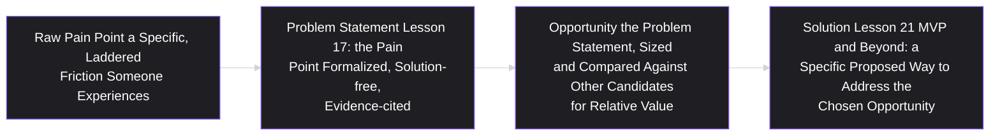
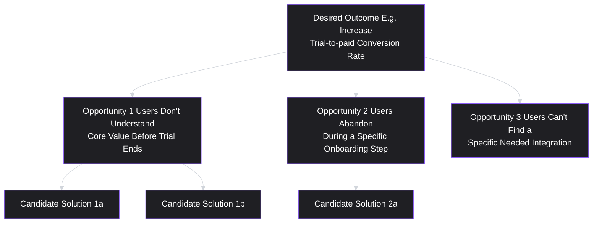
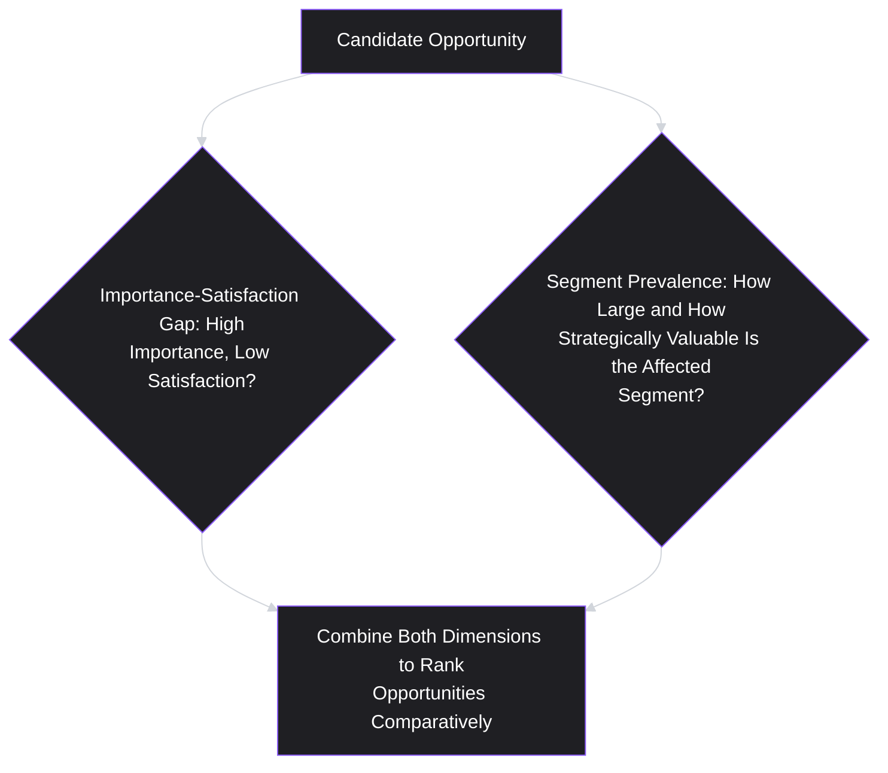
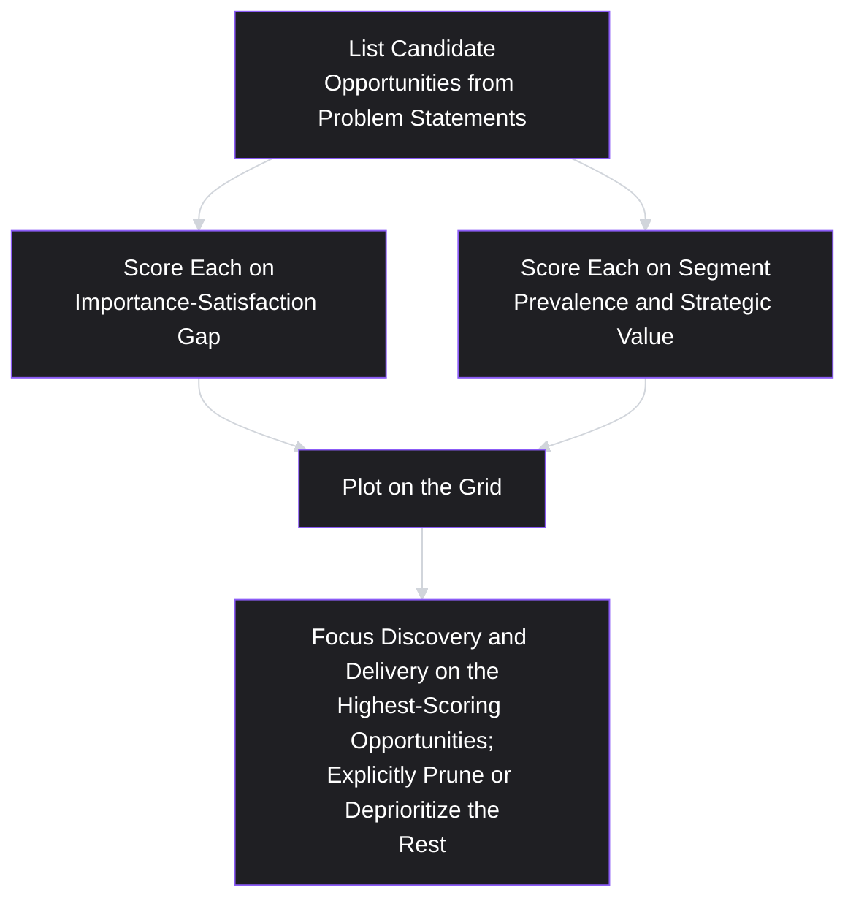

# Lesson 19: Opportunity Identification

## Why This Lesson Matters

Module 2 has built an entire research and synthesis pipeline: interviews and surveys (Lessons 12–13), personas and journey maps (Lessons 14–15), pain points characterized by severity and frequency (Lesson 16), problem statements written without solutions (Lesson 17), and validated segments (Lesson 18). At this point, a team typically has more validated problems, pain points, and segment insights than it could possibly act on simultaneously. This lesson answers the natural next question: given a genuinely large pool of validated candidates, how do you systematically identify and size which ones represent the biggest actual opportunities — before committing to solve any particular one?

**Opportunity identification** is the practice of surfacing, characterizing, and comparatively sizing candidate problems or unmet needs, so that a team can make a deliberate choice about where to focus limited discovery and delivery resources, rather than defaulting to whichever problem statement was written most recently or championed most persuasively. This lesson sits at the seam between research (which surfaces raw material) and strategy (Lesson 10) and prioritization (Lesson 29, still ahead) — it is the disciplined practice of turning a pile of validated findings into a ranked, comparable set of genuine opportunities.

---

## Learning Path

| Field | Detail |
|---|---|
| **Module** | 2 — Users & Research (Closing Lesson) |
| **Current Lesson** | 19 of 90 |
| **Difficulty** | 4 / 10 |
| **Estimated Study Time** | 25 minutes (reading) + 15 minutes (reflection + quiz) |
| **Prerequisites** | Lesson 16 (Pain Points), Lesson 17 (Problem Statements), Lesson 18 (Customer Segmentation) |
| **Next Lesson** | Lesson 20 — Product Discovery Process (opens Module 3 territory on structured discovery workflow) |
| **Future Topics Unlocked** | Lesson 20 (Product Discovery Process), Lesson 21 (MVP), Lesson 29 (Prioritization Fundamentals) |

---

## Learning Objectives

By the end of this lesson, you will be able to:

1. Define an opportunity and distinguish it from a raw pain point, a problem statement, and a solution.
2. Apply the Opportunity Solution Tree as a technique for organizing multiple candidate opportunities beneath a shared outcome.
3. Size an opportunity using both qualitative importance/satisfaction data and quantitative segment-based prevalence (Lesson 18).
4. Identify the "opportunity sprawl" failure pattern and explain why an unbounded list of opportunities is as unusable as no list at all.
5. Distinguish a genuine opportunity from a restated business goal, and explain why the latter provides no real direction for discovery.

---

## Prerequisites

Lesson 16 (Pain Points), Lesson 17 (Problem Statements), and Lesson 18 (Customer Segmentation). This lesson assumes you can characterize a pain point's severity and frequency, write a solution-free problem statement, and validate a segment — an opportunity, in this lesson's sense, is what emerges when these three prior artifacts are organized and compared against each other systematically.

---

## Theory

### The Core Definition, and Distinguishing an Opportunity from Its Neighbors

An opportunity is a validated, sized candidate for where a team could focus its next discovery and delivery effort — sitting conceptually between a raw pain point (Lesson 16) and a fully specified solution. It is useful to place these concepts on a single continuum:

A pain point tells you something hurts. A problem statement tells you precisely what hurts, for whom, and why it matters, without committing to a fix. An opportunity adds the comparative dimension: how does this specific, validated problem compare in size and value to every other validated problem currently competing for the same limited discovery and delivery capacity? Skipping straight from a problem statement to a solution, without ever explicitly sizing and comparing it against alternatives, means a team may invest heavily in solving a real, validated problem that turns out to be far smaller in impact than several other, equally real, validated problems that were never seriously considered.

### The Opportunity Solution Tree

A widely used technique for organizing multiple candidate opportunities is the **Opportunity Solution Tree** (closely associated with Teresa Torres's continuous discovery methodology), which structures a team's discovery work as a tree with a single desired outcome at the root, multiple opportunities as branches beneath it, and, eventually, multiple candidate solutions beneath each opportunity:

This structure enforces a specific, valuable discipline: multiple opportunities are laid out side by side, beneath a single shared outcome, *before* any solution work begins for any of them. This prevents a team from tunneling into deep solution work on the first opportunity that happened to surface, without ever seeing it alongside the full set of alternatives that might have delivered more value toward the same desired outcome. The tree also visually enforces Lesson 17's discipline at the opportunity level: a genuine opportunity, like a genuine problem statement, should sit at the level of a validated user problem, with candidate solutions kept as distinct child nodes underneath it — not merged into the opportunity itself.

### Sizing an Opportunity: Combining Importance/Satisfaction and Prevalence

A practical technique for sizing and comparing opportunities combines two dimensions, directly extending this module's qualitative and quantitative methods:

- **Importance and satisfaction gap** (often gathered via a structured survey technique, sometimes called an "outcome-driven" or "importance-satisfaction" survey): asking a representative sample how important a specific job or outcome is to them, and how satisfied they currently are with existing solutions for it. A large gap between high importance and low satisfaction indicates a genuinely underserved opportunity; a job rated as unimportant, or one where satisfaction is already high, indicates a comparatively weaker opportunity regardless of how vividly it was described in a single interview.
- **Segment-validated prevalence** (Lesson 18): how large is the validated segment experiencing this specific gap, and how does that segment's overall strategic or commercial value compare to other segments experiencing different gaps?

An opportunity that scores well on both dimensions — a large importance-satisfaction gap affecting a large, strategically valuable, validated segment — represents the clearest, highest-value candidate. An opportunity strong on only one dimension (a severe gap affecting a small, low-value segment, or a modest gap affecting a very large segment) requires the same kind of deliberate, explicit judgment Lesson 16 described for off-diagonal severity/frequency cases, rather than either automatic prioritization or automatic dismissal.

### The "Opportunity Sprawl" Failure Pattern

A specific, recurring failure — closely related to Lesson 14's "too many personas" and Lesson 18's "segmentation for its own sake" patterns — is **opportunity sprawl**: generating an ever-growing, unbounded list of candidate opportunities from ongoing research, without ever consolidating, comparing, or pruning the list down to a manageable set the team can actually reason about and act on. A list of forty loosely characterized "opportunities," none of which have been sized or compared against each other using the importance-satisfaction and prevalence dimensions above, provides essentially the same lack of direction as having identified no opportunities at all — the volume of raw material creates an illusion of thoroughness while actually obscuring which few items genuinely deserve the team's limited attention.

The corrective discipline, directly parallel to Lesson 10's exclusion principle, is periodic, deliberate pruning: consolidating overlapping or redundant opportunities, explicitly deprioritizing (not merely ignoring) low-scoring candidates, and maintaining a genuinely short, actively reasoned-about list rather than an ever-growing backlog of undifferentiated possibilities.

### Distinguishing a Genuine Opportunity from a Restated Business Goal

A final, important distinction, directly echoing Lesson 10's "mistaking goals for strategy" failure: a genuine opportunity names a specific, validated user problem or unmet need (echoing Lesson 17's problem statement discipline), while a restated business goal simply names a desired business outcome without identifying any specific underlying user-side driver. "Increase revenue by 15%" is a goal, not an opportunity — it says nothing about *which* validated user problem, if solved, would plausibly move that number. A genuine opportunity, sitting beneath a desired outcome in the Opportunity Solution Tree, must be specific enough to be evaluated using the importance-satisfaction and prevalence dimensions above; a restated goal cannot be evaluated this way at all, because it isn't yet a hypothesis about a specific underlying cause.

---

## Common Beginner Mistakes

**Mistake 1: Moving directly from a single problem statement to a solution, without comparing it against alternative opportunities.**
This risks investing heavily in a real, validated problem that turns out to be smaller in impact than several other equally real problems that were never seriously considered side by side.

**Mistake 2: Merging a candidate solution into the opportunity itself within an Opportunity Solution Tree.**
An opportunity should remain at the level of a validated user problem; folding a specific solution into the same node prematurely forecloses the comparison of multiple candidate solutions later, echoing Lesson 17's solution-contamination warning.

**Mistake 3: Sizing an opportunity using only vivid anecdote or a single interview, without importance-satisfaction or prevalence data.**
This repeats Lesson 16's "vivid but rare" distortion at the level of opportunity comparison, rather than pain point comparison specifically.

**Mistake 4: Allowing an opportunity list to grow indefinitely without consolidation or pruning.**
Opportunity sprawl produces an illusion of thoroughness while actually obscuring which few candidates genuinely deserve focused attention, echoing Lesson 14's "too many personas" pattern.

**Mistake 5: Treating a restated business goal as if it were a genuine opportunity.**
"Increase revenue" or "reduce churn" names a desired outcome, not a specific, validated user-side driver that could be sized and compared using this lesson's framework.

---

## Mental Model: The Opportunity Comparison Grid

This lesson's mental model is the **Opportunity Comparison Grid**, plotting candidate opportunities by importance-satisfaction gap and segment prevalence/value, directly parallel to Lesson 16's Severity/Frequency Grid but operating one level up, at the opportunity-comparison stage rather than the individual pain-point stage.

Use this grid whenever more than a small handful of validated problem statements exist simultaneously: rather than defaulting to whichever one is freshest in memory or most forcefully argued, plot each candidate explicitly and let the comparison, not the loudest voice, guide where the team focuses next.

---

## Real Company Example

**Intercom**'s widely discussed use of a structured "Jobs to Be Done" and opportunity-sizing approach in its product strategy work is a useful illustration of comparing multiple candidate opportunities before committing to a specific solution. Public product commentary from Intercom has described organizing product strategy discussions around a small number of clearly named customer outcomes, with multiple candidate opportunities (specific validated gaps between customer importance and current satisfaction) explicitly laid out and compared before any team commits significant resources to a specific feature — directly reflecting the Opportunity Solution Tree structure and the importance-satisfaction sizing technique described in this lesson, rather than allowing whichever feature idea is most recently discussed to implicitly set the roadmap.

*(Assumption flagged: this reflects widely reported descriptions of Intercom's general product strategy approach rather than a claim about the company's complete internal methodology, which this curriculum does not claim certainty about.)*

---

## Real World Perspective: Opportunity Identification at Different Company Stages

**At a startup:**
Opportunity identification is often concentrated on a small number of existentially important candidates, directly tied to whether the core product concept addresses a real, sufficiently important and underserved job at all (echoing Lesson 8's foundational discovery risk). Startups rarely have the luxury of an extensive Opportunity Solution Tree with many branches; the discipline instead often centers on rigorously validating whether the single most promising opportunity is real before committing scarce resources.

**At a mid-size company:**
Opportunity identification often becomes a more structured, recurring practice — periodically reviewing and re-scoring a maintained Opportunity Solution Tree as new research emerges, and using importance-satisfaction survey techniques at increasing scale to compare candidates more rigorously than a startup's more improvised, resource-constrained approach typically allows.

**At Big Tech:**
Opportunity identification at scale often involves formal, recurring quantitative surveys (echoing Lesson 13) run across large populations specifically to maintain an up-to-date importance-satisfaction map across many potential opportunity areas simultaneously, and a significant part of senior product strategy work involves periodically pruning and consolidating an otherwise sprawling opportunity backlog across multiple product lines, preventing the exact "opportunity sprawl" failure this lesson warns against at organizational scale.

---

## Detailed Case Study: The Opportunity List That Never Got Smaller

Consider a simplified, illustrative scenario common across B2B SaaS product teams practicing continuous discovery.

A team building a customer support platform adopts continuous discovery practices (echoing Lesson 8) and begins maintaining an Opportunity Solution Tree, updated after every round of customer interviews. Over eighteen months, driven by genuine enthusiasm for the practice, the team accumulates 47 distinct "opportunities" beneath their shared outcome ("reduce average ticket resolution time"), each one a real, laddered finding from an actual interview.

Despite the genuine research effort behind each item, the team finds itself increasingly unable to make forward progress: planning meetings devolve into lengthy debates about which of the 47 items to discuss, no consistent method exists for comparing their relative importance, and several near-duplicate opportunities (three separate entries describing closely related variations of "agents struggle to find relevant historical context on a ticket") are tracked separately, further inflating the list without adding genuinely distinct information.

A new discovery lead, brought in to help, spends a full sprint specifically consolidating and re-scoring the list: merging near-duplicate opportunities, running a structured importance-satisfaction survey (Lesson 13's technique, applied per this lesson's sizing method) across a representative sample of support agents to establish genuine relative sizing rather than relying on interview-recency or vividness, and validating segment prevalence (Lesson 18) for the remaining candidates. The exercise reduces the list from 47 loosely characterized items to 6 genuinely distinct, sized, and ranked opportunities — and reveals that the single highest-scoring opportunity (agents lacking a fast way to see a customer's full prior interaction history across multiple channels) had been sitting in the original list, undifferentiated among 46 other items, for over a year without ever being specifically prioritized.

**What went wrong?**

Applying this lesson's frameworks:

1. **The team fell into opportunity sprawl** — genuine research effort produced a continuously growing list without a corresponding, disciplined practice of consolidation, sizing, and pruning, echoing Lesson 14's "too many personas" pattern applied at the opportunity level.
2. **No importance-satisfaction or prevalence sizing was applied consistently across the list**, meaning opportunities were effectively being compared (when compared at all) based on how recently or memorably they had come up in a meeting, rather than through the systematic Opportunity Comparison Grid this lesson recommends.
3. **Near-duplicate opportunities were tracked separately rather than consolidated**, artificially inflating the apparent size of the list and obscuring which underlying themes were actually most significant once properly merged.

A team applying this lesson's discipline from the outset would have periodically (not just once, after the problem had already become severe) consolidated and re-scored its Opportunity Solution Tree, likely surfacing the historical-context opportunity — the eventual highest-scoring candidate — well before a full year had passed with it sitting undifferentiated among dozens of other, less significant items.

This case connects directly back to **Lesson 8's continuous discovery principle**: discovery itself was being conducted diligently and continuously in this case study, but the corresponding discipline of continuous *synthesis and pruning* was missing, showing that genuine research volume alone does not guarantee genuine strategic clarity.

---

## Framework Explanation: The Opportunity Pruning Cadence

A practical framework for preventing opportunity sprawl, structured as a recurring cadence rather than a one-time cleanup:

| Cadence Step | Frequency | Purpose |
|---|---|---|
| **Consolidate near-duplicates** | Each time new opportunities are added | Prevents artificial list inflation from closely related findings tracked separately |
| **Re-score using importance-satisfaction and prevalence data** | Quarterly, or whenever significant new survey/segment data becomes available | Keeps rankings current rather than static or based on outdated impressions |
| **Explicitly deprioritize (not silently ignore) low-scoring candidates** | Quarterly | Maintains a genuinely short, actionable list, following Lesson 10's exclusion discipline |
| **Re-validate the shared outcome at the root of the tree** | Whenever strategy (Lesson 10) or vision (Lesson 9) is revisited | Ensures the entire tree remains connected to current strategic priorities, not an outdated one |

The recurring theme across this cadence: **opportunity identification is not a one-time exercise that produces a static, permanent list — it requires the same ongoing, disciplined maintenance this curriculum has emphasized for personas (Lesson 14), journey maps (Lesson 15), and segments (Lesson 18), or it will drift toward exactly the sprawl this lesson's Detailed Case Study describes.**

---

## Interview Perspective: How Interviewers Think About This

**Typical question 1: "How do you decide which of several validated customer problems to focus on next?"**
*What the interviewer is actually evaluating:* Whether the candidate has a systematic comparison method (importance-satisfaction, segment prevalence) rather than defaulting to whichever problem was most recently or forcefully raised — directly echoing Lesson 16's related question, now applied at the level of comparing entire opportunities rather than individual pain points.

**Typical question 2: "Tell me about a time your team had too many candidate ideas or findings and needed to narrow them down."**
*What the interviewer is actually evaluating:* Direct experience with the opportunity-sprawl problem and its correction — whether the candidate can describe a genuine consolidation and re-scoring process, echoing this lesson's Detailed Case Study, rather than simply describing an unstructured, intuitive winnowing process.

**Typical question 3: "What's the difference between a business goal and a product opportunity?"**
*What the interviewer is actually evaluating:* Whether the candidate can articulate the specific distinction this lesson draws — a goal names a desired outcome, while an opportunity names a specific, validated user-side driver that could plausibly move that outcome, echoing Lesson 10's goal-versus-strategy distinction applied at the discovery level.

---

## Summary

An opportunity is a validated, sized candidate problem sitting between a raw pain point and a specific solution — it adds a comparative dimension that a problem statement alone does not provide, asking how a given validated problem compares in size and value to every other validated problem currently competing for limited resources. The Opportunity Solution Tree organizes multiple candidate opportunities beneath a single shared desired outcome, keeping opportunities distinct from candidate solutions and enabling side-by-side comparison before any solution work begins. Sizing an opportunity combines an importance-satisfaction gap (how important is this job, and how well is it currently served) with segment-validated prevalence (Lesson 18) and strategic value. "Opportunity sprawl" — an ever-growing, unconsolidated list of candidate opportunities — provides no more real direction than having identified none at all, and requires a disciplined, recurring pruning cadence to correct. Finally, a genuine opportunity must be distinguished from a restated business goal: a goal names a desired outcome, while an opportunity names the specific, validated user-side driver that could plausibly move it.

---

## Key Takeaways

- An opportunity sits between a raw pain point and a specific solution, adding the comparative dimension of relative size and value against other validated candidates.
- The Opportunity Solution Tree organizes multiple opportunities beneath a shared desired outcome, keeping opportunities distinct from candidate solutions to enable genuine side-by-side comparison.
- Sizing an opportunity combines an importance-satisfaction gap with segment-validated prevalence and strategic value, not vivid anecdote alone.
- "Opportunity sprawl" — an unconsolidated, ever-growing list — provides no more real direction than an empty list, and requires disciplined, recurring pruning.
- A restated business goal ("increase revenue") is not itself an opportunity; a genuine opportunity names the specific, validated user-side driver that could plausibly move that goal.
- Near-duplicate opportunities should be consolidated, not tracked separately, to avoid artificially inflating the apparent size of a candidate list.
- Opportunity identification requires ongoing, periodic maintenance — consolidation, re-scoring, and explicit deprioritization — not a one-time exercise producing a static list.

---

## Cheat Sheet

*A two-minute review of everything in this lesson.*

- **Pain point → Problem Statement → Opportunity → Solution.** Each step adds specificity or comparison; don't skip the comparison step.
- **Opportunity Solution Tree:** shared outcome at root, opportunities as branches, solutions as leaves — keep opportunities and solutions distinct nodes.
- **Sizing = Importance-Satisfaction Gap + Segment Prevalence/Value** — not vivid anecdote.
- **Opportunity sprawl** = an unconsolidated, ever-growing list = no more useful than no list at all.
- **Goal ≠ Opportunity.** "Increase revenue" isn't an opportunity; the specific validated driver behind it is.
- **Pruning cadence:** consolidate duplicates → re-score → explicitly deprioritize → re-validate against current strategy.

---

## Glossary

| Term | Definition | Related Concepts | Difficulty |
|---|---|---|---|
| Opportunity | A validated, sized candidate problem, positioned for comparison against alternatives before a solution is chosen. | Problem Statement (Lesson 17), Pain Point (Lesson 16) | 2 |
| Opportunity Solution Tree | A structure organizing a desired outcome, multiple candidate opportunities beneath it, and candidate solutions beneath each opportunity. | Continuous Discovery (Lesson 8) | 3 |
| Importance-Satisfaction Gap | A sizing technique measuring how important a job is to users versus how satisfied they currently are with existing solutions for it. | Opportunity Comparison Grid | 3 |
| Opportunity Sprawl | The failure pattern of an ever-growing, unconsolidated list of candidate opportunities that provides no real strategic direction. | Too Many Personas (Lesson 14) | 2 |
| Opportunity Pruning Cadence | A recurring practice of consolidating, re-scoring, and explicitly deprioritizing candidate opportunities to prevent sprawl. | Opportunity Sprawl | 3 |

---

## Further Reading / Resources

- Teresa Torres, *Continuous Discovery Habits* — the primary source for the Opportunity Solution Tree structure referenced throughout this lesson.
- Tony Ulwick, *What Customers Want* — the origin of the importance-satisfaction (outcome-driven innovation) sizing technique described in this lesson.
- Marty Cagan, *Inspired* — discusses organizing product discovery around outcomes and opportunities rather than jumping directly to features, closely related to this lesson's overall framing.

---

## Flashcards

**Card 1**
- Front: Where does an "opportunity" sit on the continuum from pain point to solution?
- Back: Between a problem statement and a solution — it adds the comparative dimension of relative size and value against other validated candidates, which a problem statement alone does not provide.
- Difficulty: 2
- Tags: opportunity-definition

**Card 2**
- Front: What is an Opportunity Solution Tree?
- Back: A structure with a shared desired outcome at the root, multiple candidate opportunities as branches, and candidate solutions as leaves beneath each opportunity — keeping opportunities and solutions as distinct nodes.
- Difficulty: 3
- Tags: opportunity-solution-tree

**Card 3**
- Front: What two dimensions combine to size an opportunity, according to this lesson?
- Back: The importance-satisfaction gap (how important the job is versus how well it's currently served) and segment-validated prevalence/strategic value.
- Difficulty: 2
- Tags: opportunity-sizing

**Card 4**
- Front: What is "opportunity sprawl"?
- Back: The failure pattern of an ever-growing, unconsolidated list of candidate opportunities that provides no more real strategic direction than having identified none at all.
- Difficulty: 2
- Tags: opportunity-sprawl

**Card 5**
- Front: Why is "increase revenue by 15%" not a genuine opportunity, according to this lesson?
- Back: It names a desired business outcome, not a specific, validated user-side driver that could plausibly move that outcome — a genuine opportunity must be specific enough to be sized and compared.
- Difficulty: 2
- Tags: goal-vs-opportunity

**Card 6**
- Front: In the Detailed Case Study, what specific mistake inflated the team's opportunity list beyond its genuine size?
- Back: Near-duplicate opportunities (three separate entries describing closely related variations of the same underlying issue) were tracked separately rather than consolidated.
- Difficulty: 3
- Tags: case-study

**Card 7**
- Front: What are the four steps of the Opportunity Pruning Cadence?
- Back: Consolidate near-duplicates, re-score using importance-satisfaction and prevalence data, explicitly deprioritize low-scoring candidates, and re-validate the shared outcome against current strategy.
- Difficulty: 3
- Tags: pruning-cadence

---

## Reflection Exercise

You are the PM for a note-taking app, and your team's continuous discovery work (per Lesson 8) has surfaced five candidate opportunities beneath the shared outcome "increase weekly active usage": (1) users forget to open the app after the first week; (2) users can't easily find notes taken more than a month ago; (3) users want better formatting options for tables; (4) users on mobile report the app feels slow to open; (5) users want to share notes with people who don't have the app.

Work through the following, in writing, before reading further:

1. Organize these five items into an Opportunity Solution Tree, confirming each is genuinely an opportunity (a validated user problem) rather than a disguised solution or a restated goal.
2. Propose one importance-satisfaction survey question you would ask to size two of these five opportunities against each other.
3. Identify whether any of the five items might actually be near-duplicates or closely related variations of a shared underlying theme, and explain your reasoning.
4. Using the Opportunity Comparison Grid, make a rough, reasoned guess about which one or two of these five likely represent the highest-value opportunities, explicitly noting what additional evidence would most change your ranking.
5. Referencing the Opportunity Pruning Cadence, describe when and how you would revisit this list in the future to prevent it from growing into unmanaged sprawl.

There is no single correct answer. The purpose of this exercise is to practice comparing multiple validated opportunities systematically, rather than defaulting to whichever one feels most vivid or was most recently discussed.

---

## Quiz

**1. Where does an "opportunity" sit on the continuum described in this lesson?**
A) Before a raw pain point
B) Between a problem statement and a specific solution
C) After a specific solution has already been built and launched
D) Opportunities and pain points are identical concepts with no meaningful distinction

*Correct answer: B*
*Explanation: The lesson explicitly places an opportunity between a problem statement (a validated, solution-free description of a problem) and a solution, adding a comparative sizing dimension.*
*Learning objective tested: #1*
*Difficulty: Easy*

---

**2. What is the core structure of an Opportunity Solution Tree?**
A) A single list of features ranked by engineering cost
B) A shared desired outcome at the root, multiple candidate opportunities as branches, and candidate solutions as leaves beneath each opportunity
C) A demographic breakdown of the customer base
D) A timeline of customer support tickets over the past year

*Correct answer: B*
*Explanation: This is the lesson's explicit structural description of the Opportunity Solution Tree, which keeps opportunities and solutions as distinct node types.*
*Learning objective tested: #2*
*Difficulty: Easy*

---

**3. Which two dimensions does this lesson recommend combining to size a candidate opportunity?**
A) Engineering cost and marketing budget
B) The importance-satisfaction gap and segment-validated prevalence/strategic value
C) How recently the opportunity was raised and how senior the person who raised it is
D) The number of competitor products addressing a similar area

*Correct answer: B*
*Explanation: The lesson explicitly recommends combining an importance-satisfaction gap with segment-validated prevalence and strategic value, not recency or seniority of the source.*
*Learning objective tested: #3*
*Difficulty: Easy*

---

**4. What is "opportunity sprawl"?**
A) A well-organized, actively pruned Opportunity Solution Tree
B) An ever-growing, unconsolidated list of candidate opportunities that provides no more real strategic direction than an empty list
C) A technique for validating segment prevalence
D) A method for writing solution-free problem statements

*Correct answer: B*
*Explanation: This is the lesson's explicit definition of the failure pattern — genuine research volume without corresponding consolidation and comparison produces an unusable list.*
*Learning objective tested: #4*
*Difficulty: Easy*

---

**5. Why is "increase revenue by 15%" not considered a genuine opportunity, according to this lesson?**
A) Because revenue goals are never legitimate business objectives
B) Because it names a desired business outcome without identifying any specific, validated user-side driver that could plausibly move it
C) Because 15% is too large a target to be realistic
D) Because opportunities can only be expressed in percentage terms

*Correct answer: B*
*Explanation: The lesson explicitly distinguishes a restated business goal, which lacks a specific underlying driver, from a genuine opportunity, which must be specific enough to be sized and compared.*
*Learning objective tested: #5*
*Difficulty: Easy*

---

**6. In the Detailed Case Study, what specific practice was missing that allowed the opportunity list to grow to 47 items?**
A) The team never conducted any customer interviews
B) The team conducted genuine, continuous discovery but lacked a corresponding practice of consolidating, sizing, and pruning the resulting opportunity list
C) The team refused to use any structured framework at all
D) The team only interviewed a single customer over the entire eighteen-month period

*Correct answer: B*
*Explanation: The case study explicitly attributes the sprawl to genuine discovery effort without a matching discipline of synthesis, consolidation, and pruning — not a lack of research itself.*
*Learning objective tested: #4*
*Difficulty: Easy*

---

**7. What specific consequence resulted from tracking near-duplicate opportunities separately in the Detailed Case Study?**
A) The team's opportunity list became more accurate and useful
B) The list was artificially inflated, obscuring which underlying themes were actually most significant once properly merged
C) The near-duplicate opportunities were automatically prioritized above all others
D) No meaningful consequence resulted from this practice

*Correct answer: B*
*Explanation: The case study explicitly notes that failing to consolidate near-duplicates inflated the apparent size of the list and obscured the true significance of the underlying theme.*
*Learning objective tested: #4*
*Difficulty: Medium*

---

**8. According to the Opportunity Pruning Cadence, what should happen to low-scoring candidate opportunities during a review cycle?**
A) They should be silently ignored without any explicit decision
B) They should be explicitly deprioritized, following Lesson 10's exclusion discipline, rather than left in an undifferentiated, ever-growing list
C) They should always be immediately deleted and never reconsidered under any circumstances
D) They should automatically be merged with the highest-scoring opportunity

*Correct answer: B*
*Explanation: The Pruning Cadence explicitly calls for deliberate, explicit deprioritization — echoing Lesson 10's "Say No" discipline — rather than silent neglect or automatic deletion.*
*Learning objective tested: #4*
*Difficulty: Medium*

---

**9. (Scenario) A team has validated five distinct problem statements (per Lesson 17) but has not yet compared them against each other using importance-satisfaction or prevalence data. According to this lesson, what is the most appropriate next step before committing to a solution for any one of them?**
A) Immediately build a solution for the problem statement that was written most recently
B) Size and compare all five using the Opportunity Comparison Grid before committing significant discovery or delivery resources to any single one
C) Build solutions for all five simultaneously, regardless of their relative size or value
D) Discard four of the five problem statements without any comparative evaluation

*Correct answer: B*
*Explanation: This reflects the lesson's core discipline — comparing validated candidates systematically before committing resources, rather than defaulting to recency or building for all or only one without genuine comparison.*
*Learning objective tested: #1, #3*
*Difficulty: Medium-Hard*

---

**10. (Product Thinking) An opportunity scores high on the importance-satisfaction gap but affects only a very small, strategically low-value segment. According to this lesson, what is the most appropriate response?**
A) Automatically treat it as the top priority, since a high importance-satisfaction gap alone always determines priority
B) Weigh this off-diagonal case deliberately and explicitly, similar to Lesson 16's guidance on off-diagonal severity/frequency cases, rather than either automatically prioritizing or automatically dismissing it
C) Automatically discard it, since small segments are never worth considering under any circumstances
D) Ignore the importance-satisfaction data entirely and rely solely on segment size

*Correct answer: B*
*Explanation: This reflects the lesson's guidance that off-diagonal cases (strong on one dimension, weak on another) require deliberate, explicit judgment, directly paralleling Lesson 16's treatment of severity/frequency trade-offs.*
*Learning objective tested: #3*
*Difficulty: Medium-Hard*

---

**11. (Interview Reasoning) A candidate describes prioritizing whichever customer problem was most recently discussed in a stakeholder meeting, without any structured comparison against other known validated problems. What might this signal, based on this lesson's Interview Perspective section?**
A) A strong, systematic opportunity identification process
B) A likely instance of prioritizing by recency rather than genuine importance-satisfaction and prevalence comparison, echoing Lesson 16's "most recent complaint wins" pattern at the opportunity level
C) That the candidate has extensive experience with the Opportunity Solution Tree
D) Nothing meaningful, since recency is always an appropriate prioritization factor

*Correct answer: B*
*Explanation: This directly echoes the lesson's warning against recency-driven prioritization, applied at the level of comparing entire opportunities rather than individual pain points.*
*Learning objective tested: #3*
*Difficulty: Hard*

---

**12. (Product Thinking, Higher Difficulty) A team merges three previously separate opportunities into one, after discovering through re-scoring that they all describe variations of the same underlying theme (agents lacking fast access to historical context). What should happen to this newly merged opportunity's importance-satisfaction and prevalence scores?**
A) The three original scores should simply be averaged without further investigation
B) The scores should be re-established for the newly consolidated, more accurately defined opportunity, since the original three scores were based on an artificially fragmented view of the underlying issue
C) The merged opportunity should be assigned the lowest of the three original scores automatically
D) No re-scoring is necessary, since merging opportunities has no effect on their sizing

*Correct answer: B*
*Explanation: Since the original fragmented items likely each captured only part of the true underlying theme, the lesson's discipline calls for re-establishing scores for the properly consolidated opportunity, rather than mechanically combining potentially inaccurate fragmented data.*
*Learning objective tested: #3, #4*
*Difficulty: Medium-Hard*

---

**13. (Interview Reasoning, Higher Difficulty) An interviewer asks a candidate to distinguish a business goal from a genuine opportunity, and the candidate responds that "reduce customer churn" is itself a valid opportunity to add to an Opportunity Solution Tree. What is the strongest critique of this answer, based on this lesson?**
A) "Reduce customer churn" is an excellent, fully specified opportunity requiring no further refinement
B) "Reduce customer churn" is better understood as a desired outcome (the root of the tree) rather than an opportunity itself, since it does not name any specific, validated user-side driver that could plausibly reduce churn
C) Business goals should never appear anywhere in an Opportunity Solution Tree, including as the root outcome
D) The candidate's answer is correct, since any measurable business metric qualifies as an opportunity

*Correct answer: B*
*Explanation: This reflects the lesson's explicit distinction — "reduce churn" functions well as a root-level desired outcome, but a genuine opportunity beneath it must name a specific, validated user-side driver, which the candidate's answer fails to do.*
*Learning objective tested: #5*
*Difficulty: Hard*

---

**14. (Product Thinking, Higher Difficulty) A team runs an importance-satisfaction survey and finds that a candidate opportunity has both low importance and low satisfaction scores among users. What does this combination most likely suggest, according to this lesson's framework?**
A) This is automatically the highest-priority opportunity, since low satisfaction always indicates urgent need
B) This combination suggests a comparatively weaker opportunity, since a low importance rating indicates the underlying job itself may not matter much to users, regardless of how poorly it's currently served
C) Importance and satisfaction scores are irrelevant if segment prevalence is high
D) This combination cannot be meaningfully interpreted using the importance-satisfaction framework

*Correct answer: B*
*Explanation: The lesson explains that a job rated as unimportant represents a comparatively weaker opportunity even with low satisfaction, since the gap's value depends on the underlying job actually mattering to the user in the first place.*
*Learning objective tested: #3*
*Difficulty: Hard*

---

**15. (Highest Difficulty) A team has a well-maintained, properly pruned Opportunity Solution Tree with six genuinely distinct, sized opportunities. The company's overall strategy (per Lesson 10) then shifts significantly due to a new market entrant. According to this lesson and its connections to Lesson 9 and Lesson 10, what is the most appropriate response?**
A) Continue using the existing tree indefinitely, since it was properly constructed and pruned before the strategic shift
B) Re-validate the shared outcome at the root of the tree against the new strategic guiding policy, since a properly maintained tree can still become disconnected from current strategy if the root outcome itself is no longer the right one to pursue
C) Discard the entire tree and start over from a completely empty list, ignoring all six previously validated opportunities
D) Assume the tree remains valid permanently, since sizing was done rigorously using both qualitative and quantitative methods originally

*Correct answer: B*
*Explanation: This integrates the lesson's Opportunity Pruning Cadence (specifically, re-validating the root outcome whenever strategy is revisited) with Lessons 9 and 10's guidance on revisiting vision and strategy when the underlying situation genuinely shifts — a properly built tree can still become strategically disconnected if its root outcome no longer reflects current priorities.*
*Learning objective tested: #4*
*Difficulty: Hard*

---

## Connections

| | Lesson | Core Idea Carried Forward |
|---|---|---|
| **Previous Lesson** | Lesson 18 — Customer Segmentation | Provides the validated segment prevalence and value data used directly in opportunity sizing |
| **Current Lesson** | Lesson 19 — Opportunity Identification | The Opportunity Solution Tree; importance-satisfaction sizing; opportunity sprawl; goal-vs-opportunity distinction |
| **Next Lesson** | Lesson 20 — Product Discovery Process | Formalizes a complete, repeatable discovery workflow, incorporating opportunity identification as one structured stage |
| **Future Concepts Unlocked** | Lesson 21 (MVP) | Uses the highest-scoring, chosen opportunity as the basis for scoping the smallest viable solution to test |
| | Lesson 29 (Prioritization Fundamentals) | Incorporates opportunity sizing directly as an input into a broader, multi-factor prioritization scoring model |

This curriculum is designed to be read as one continuous argument. Module 2 — Users & Research concludes with this lesson: Lessons 11 through 19 have built, in sequence, from the foundational discipline of trustworthy research (User Research, Interviews, Surveys), through synthesis artifacts (Personas, Journey Maps), through characterizing and formalizing specific findings (Pain Points, Problem Statements, Segmentation), to comparing and sizing validated candidates against each other (Opportunity Identification). Module 3 — Product Design begins next, addressing the concrete design and specification work that follows once a genuine opportunity has been chosen.
