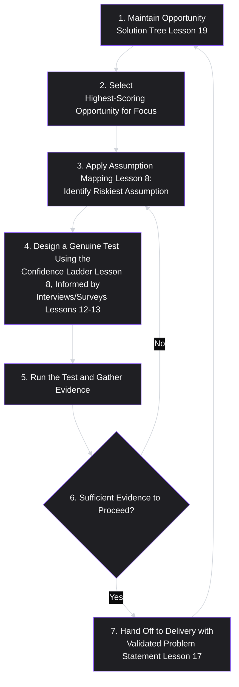
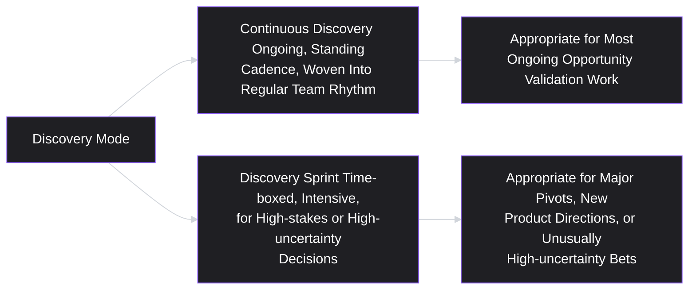
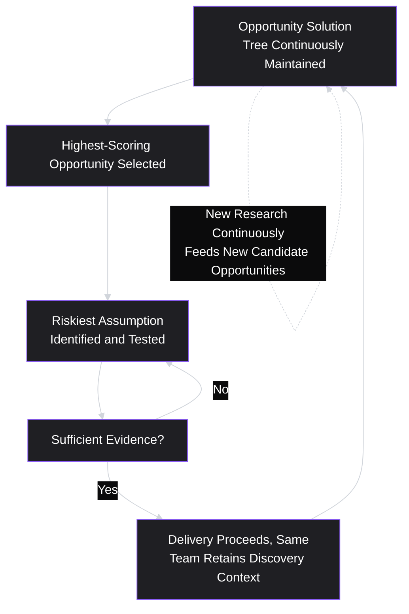

# Lesson 20: Product Discovery Process

## Why This Lesson Matters

Module 2 has, lesson by lesson, built every individual component of a rigorous discovery practice: trustworthy research methods (Lessons 11–13), synthesis artifacts (Lessons 14–15), disciplined characterization and formalization (Lessons 16–17), validated segmentation (Lesson 18), and comparative opportunity sizing (Lesson 19). What hasn't yet been made explicit is how these pieces fit together into a single, repeatable, continuously running process — the actual week-to-week and month-to-month workflow a product team uses to move from "we have a validated opportunity" to "we have strong evidence about which solution best addresses it," on an ongoing basis rather than as a one-time academic exercise.

This lesson closes Module 2 by assembling everything into that single, repeatable **product discovery process** — extending Lesson 8's foundational concepts (the four risks, assumption mapping, the confidence ladder) into a complete, continuously operating workflow that incorporates every tool this module has introduced along the way. If Lesson 8 taught you *why* discovery matters and the basic shape of good versus bad discovery, this lesson teaches you *how a team actually runs it*, sustainably, week after week.

---

## Learning Path

| Field | Detail |
|---|---|
| **Module** | 2 — Users & Research (Closing Lesson) |
| **Current Lesson** | 20 of 90 |
| **Difficulty** | 5 / 10 |
| **Estimated Study Time** | 30 minutes (reading) + 15 minutes (reflection + quiz) |
| **Prerequisites** | Lesson 8 (Product Discovery), Lesson 19 (Opportunity Identification) |
| **Next Lesson** | Lesson 21 — Minimum Viable Product (MVP), opening Module 3 |
| **Future Topics Unlocked** | Module 3 (Product Design), Lesson 29 (Prioritization Fundamentals) |

---

## Learning Objectives

By the end of this lesson, you will be able to:

1. Describe the full, continuous product discovery process as a repeatable weekly/cadence-based cycle, integrating the tools from Lessons 11 through 19.
2. Distinguish a "discovery sprint" (a time-boxed, intensive validation exercise) from ongoing continuous discovery, and identify when each is appropriate.
3. Apply a structured method for deciding when discovery evidence is sufficient to proceed to delivery, versus when further validation is needed.
4. Identify the "discovery-delivery handoff" failure pattern and explain why treating discovery as a separate team's job undermines the entire process.
5. Assemble a complete discovery workflow, from opportunity selection through assumption testing to a delivery-ready recommendation, using the frameworks introduced throughout this module.

---

## Prerequisites

Lesson 8 (Product Discovery) and Lesson 19 (Opportunity Identification). This lesson assumes fluency with the four risk categories, assumption mapping, the confidence ladder, and discovery theater from Lesson 8, and the Opportunity Solution Tree and sizing techniques from Lesson 19 — this lesson is the synthesis lesson that shows how all of Module 2's tools operate together as a single, ongoing process.

---

## Theory

### The Full Discovery Cycle

Building directly on Lesson 8's foundational distinction between discovery and delivery, a complete, continuously operating discovery process integrates this module's tools into a repeating cycle:

Notice that this cycle is genuinely circular, not linear: after a validated opportunity moves to delivery, the team returns to the Opportunity Solution Tree to select the next highest-scoring candidate, rather than treating discovery as a one-time project that concludes once a single opportunity has been addressed. This directly operationalizes Lesson 8's continuous discovery principle — the cycle never fully stops, even as delivery work proceeds on validated opportunities in parallel.

### Discovery Sprints vs. Continuous Discovery

Two related but distinct discovery modes deserve explicit distinction:

- **Continuous discovery**: the ongoing, standing cycle described above, typically involving a regular cadence of lightweight customer conversations (often weekly), continuous maintenance of the Opportunity Solution Tree, and ongoing assumption testing woven into a team's regular rhythm alongside delivery work.
- **Discovery sprints**: a time-boxed, more intensive period (often one to two weeks) dedicated to rapidly validating a specific, usually higher-stakes or higher-uncertainty opportunity — commonly used when a team faces an unusually significant decision (a major new product direction, a significant pivot) that warrants concentrated effort beyond what the standing weekly cadence can support.

A common mistake is treating every validation need as requiring a full discovery sprint, which is resource-intensive and difficult to sustain as a permanent practice — continuous discovery's lighter, ongoing cadence should handle the large majority of a team's validation needs, with discovery sprints reserved for genuinely exceptional, high-stakes situations.

### Deciding When Evidence Is Sufficient to Proceed

A recurring, practical question in any discovery process is: how much evidence is enough? Directly extending Lesson 8's confidence ladder and assumption mapping, a useful decision rule combines several factors:

- **Has the riskiest assumption (per assumption mapping) specifically been tested**, rather than a comfortable but less consequential assumption?
- **Was the test genuine** (per Lesson 8's discovery theater warning) — structured so a plausible negative result was actually observable and would have changed the plan?
- **Does the evidence sit at an appropriately high rung on the Evidence Trustworthiness Ladder (Lesson 11)** for the stakes involved — a low-stakes, easily reversible decision may reasonably proceed on weaker evidence than a large, hard-to-reverse investment?
- **Has the evidence been checked against the original, solution-free problem statement (Lesson 17)** to confirm the validated finding actually addresses the specific persona, job, and context originally named, rather than something adjacent?

A team that proceeds to delivery without being able to answer these questions affirmatively has not necessarily made the wrong call — sometimes moving forward on imperfect evidence is the right trade-off, especially for low-stakes, reversible decisions — but the decision should be made with explicit awareness of the evidentiary gap, rather than by default or convenient assumption that "enough" discovery has occurred.

### The "Discovery-Delivery Handoff" Failure Pattern

A specific, common organizational failure pattern is treating discovery as a separate function or team's responsibility, with a formal "handoff" to a distinct delivery team once validation is deemed complete — echoing Lesson 8's warning against treating discovery as a one-time phase, now examined specifically as an organizational and team-structure problem rather than purely a process-timing problem.

This handoff pattern creates several specific risks: the delivery team, receiving a validated problem statement and supporting evidence secondhand, often lacks the same depth of context and conviction that the discovery team developed through direct exposure to real customer conversations, making it harder for them to make good judgment calls on inevitable implementation details that weren't explicitly covered in the handoff documentation. It also tends to formalize exactly the phase-based, rather than continuous, view of discovery that Lesson 8 warned against — once a "handoff" has formally occurred, there's an implicit organizational signal that discovery on this opportunity is finished, discouraging the team from returning to validate new assumptions that inevitably emerge during actual implementation.

The corrective principle, consistent with modern product team structure (closely associated with the "empowered product team" model advocated by writers like Marty Cagan): the same cross-functional team — including product, design, and engineering — should ideally participate in both discovery and delivery for a given opportunity, maintaining continuity of context and shared conviction, rather than discovery and delivery being organizationally separated functions connected only by a formal document handoff.

---

## Common Beginner Mistakes

**Mistake 1: Treating discovery as a one-time project that concludes once a single opportunity is validated.**
The full discovery cycle is circular — after a validated opportunity moves to delivery, the team should return to the Opportunity Solution Tree to select the next candidate, maintaining a continuously running process rather than a project with a defined endpoint.

**Mistake 2: Running an intensive discovery sprint for every validation need, regardless of stakes.**
Discovery sprints are resource-intensive and appropriate for genuinely high-stakes or high-uncertainty decisions; most ongoing validation needs are better served by a lighter, continuous discovery cadence.

**Mistake 3: Proceeding to delivery based on a comfortable, low-consequence assumption rather than the actual riskiest one identified through assumption mapping.**
This repeats Lesson 8's original warning in the context of a full process — teams should specifically confirm the riskiest assumption, not merely any assumption, has been tested before treating discovery as complete for a given opportunity.

**Mistake 4: Formally "handing off" discovery findings to a separate delivery team.**
This risks a loss of context and conviction, and tends to formalize a phase-based view of discovery that discourages returning to validate new assumptions that emerge during implementation.

**Mistake 5: Applying a fixed, one-size-fits-all evidence bar regardless of the stakes and reversibility of the decision.**
A low-stakes, easily reversible decision can reasonably proceed on lighter evidence than a large, hard-to-reverse investment — the evidence bar should scale with the decision's stakes, not remain constant regardless of context.

---

## Mental Model: The Discovery Flywheel

This lesson's mental model is the **Discovery Flywheel** — visualizing the full cycle described in Theory as a continuously spinning process, rather than a linear project with a start and end.

Use this flywheel as a mental check on team health: is the Opportunity Solution Tree actively, continuously updated with new research, or has it gone stale since the last major project began? Is the team returning to it after each delivery cycle, or treating the current initiative as if it were the final, complete answer to all outstanding user needs? A flywheel that has stopped spinning — no new opportunities being actively considered, no ongoing lightweight customer conversation cadence — signals a discovery process that has quietly reverted to Lesson 8's one-time-phase failure pattern, regardless of how rigorous the original discovery work was.

---

## Real Company Example

**Spotify**'s widely discussed "squad" model, emphasizing small, cross-functional, autonomous teams responsible for both discovery and delivery within a specific product area, is a frequently cited illustration of avoiding the discovery-delivery handoff failure pattern. Public commentary describing Spotify's team structure over the years has emphasized keeping product, design, and engineering closely integrated within the same team throughout both the validation and building phases of a given initiative, rather than organizationally separating a "research" function from a "build" function connected only by formal documentation — directly reflecting this lesson's corrective principle for avoiding lost context and conviction during a discovery-to-delivery transition.

*(Assumption flagged: this reflects widely reported, and since debated, descriptions of Spotify's team structure at a particular point in the company's history, rather than a claim about the company's current, complete organizational model, which this curriculum does not claim certainty about.)*

---

## Real World Perspective: Discovery Process at Different Company Stages

**At a startup:**
The discovery process is often necessarily informal and tightly integrated with delivery by default, simply because small teams cannot afford the organizational separation the handoff failure pattern describes — the same few people conducting customer conversations are typically the same people writing code, providing a natural (if sometimes accidental) form of continuity that larger organizations must work more deliberately to preserve.

**At a mid-size company:**
The discovery process often requires more deliberate structuring to prevent drift toward the handoff failure pattern as teams grow and specialize — maintaining shared, visible Opportunity Solution Trees, ensuring the same cross-functional team stays engaged across both discovery and delivery for a given initiative, and establishing a genuine, sustainable weekly cadence for continuous discovery rather than relying on the informal continuity that smaller teams have by default.

**At Big Tech:**
The discovery process at scale often benefits from significant infrastructure (experimentation platforms, large-scale survey tooling, dedicated research functions) but faces a correspondingly greater organizational risk of the discovery-delivery handoff pattern, given natural specialization pressures in large organizations — deliberate structural choices (embedding researchers within product teams rather than centralizing them entirely, maintaining continuity of ownership from discovery through delivery) are often necessary specifically to counteract this risk at scale.

---

## Detailed Case Study: The Team That Discovered Once

Consider a simplified, illustrative scenario common across mid-size B2B software companies.

A team building a customer analytics dashboard runs an intensive, well-executed discovery sprint (per this lesson's distinction) to validate a major new feature direction, following all of this module's disciplines rigorously: they build a genuine Opportunity Solution Tree, size candidates using importance-satisfaction and prevalence data, correctly ladder the winning opportunity to its root cause, and design a genuinely disconfirming concierge-style test (per Lesson 8's confidence ladder) before committing to full delivery. The sprint is, by every measure this module has taught, a success.

Once the sprint concludes and delivery begins, however, the team disbands its discovery cadence entirely — the weekly customer conversation rhythm stops, the Opportunity Solution Tree is left untouched, and the same cross-functional team, now fully absorbed in an eight-month delivery effort, has no standing mechanism for surfacing or validating any new assumptions that emerge during implementation. Partway through delivery, the team makes several significant, unvalidated implementation decisions — including a specific data-visualization format the design team simply judged to be intuitively best, without any further testing — reasoning that "we already did our discovery" for this initiative.

At launch, the core validated opportunity is genuinely well-addressed, but the specific data-visualization format proves confusing to a meaningful share of users, generating a wave of new support tickets and negative feedback that a lightweight, ongoing discovery cadence — even a brief round of concept testing on the visualization format specifically — would very likely have caught before launch.

**What went wrong?**

Applying this lesson's frameworks:

1. **The team correctly ran an intensive discovery sprint for the major, high-stakes opportunity itself**, but incorrectly treated this single sprint as a substitute for the standing, continuous discovery cadence that should have continued throughout the subsequent delivery period — precisely the discovery-delivery handoff pattern this lesson warns against, here manifesting as a complete cessation of discovery activity rather than a formal handoff to a different team.
2. **New assumptions inevitably emerged during implementation** (the specific visualization format was itself a new, untested assumption, distinct from the original validated opportunity), and no standing mechanism existed to catch and test them, since the team had implicitly declared discovery "finished" once the sprint concluded.
3. **The Discovery Flywheel had stopped spinning** the moment delivery began, rather than continuing to turn in parallel — new candidate assumptions (like the visualization format) should have been fed back into a lightweight, ongoing validation cadence, even while the team's primary effort remained focused on delivering the already-validated core opportunity.

A team applying this lesson's full discipline would have maintained at least a lightweight, ongoing discovery cadence throughout the eight-month delivery period — even a brief weekly customer conversation rhythm — specifically to catch and validate new, smaller assumptions (like the visualization format) that emerged during implementation, rather than treating the initial discovery sprint as a one-time, complete validation of every decision the entire initiative would eventually require.

This case connects directly back to **Lesson 8's continuous discovery principle** and this lesson's discovery-delivery handoff pattern: a genuinely excellent, rigorous discovery sprint is not a substitute for the standing, continuous discipline this module has built toward throughout — it is one especially intensive instance of it, not a replacement for the ongoing cycle.

---

## Framework Explanation: The Discovery Process Health Checklist

A practical checklist for assessing whether a team's discovery process is genuinely healthy and continuous, rather than having quietly reverted to a one-time or handed-off pattern:

| Question | Healthy Sign | Warning Sign |
|---|---|---|
| Is the Opportunity Solution Tree actively updated with new research on an ongoing basis? | Yes, regularly | No, it hasn't changed since the current initiative began |
| Does the team maintain a standing, lightweight customer conversation cadence, even during delivery-heavy periods? | Yes | No, customer conversations stopped once delivery began |
| Does the same cross-functional team (product, design, engineering) retain ownership from discovery through delivery? | Yes | No, discovery findings are handed off to a separate delivery team |
| Are new assumptions that emerge during implementation (not just the original opportunity) tested before being finalized? | Yes | No, implementation-stage decisions are made based on intuition alone, without testing |
| Is evidence sufficiency explicitly assessed against the decision's stakes and reversibility, rather than a fixed, one-size-fits-all bar? | Yes | No, the same evidence bar (often too light, or unnecessarily heavy) is applied regardless of context |

A team failing several of these checks may still be conducting genuinely rigorous discovery for a specific initiative, but is at risk of the "discovered once" failure pattern this lesson's Detailed Case Study describes — rigorous discovery at one point in time is not the same as a genuinely continuous discovery process.

---

## Interview Perspective: How Interviewers Think About This

**Typical question 1: "Walk me through your team's discovery process, from identifying an opportunity to shipping a solution."**
*What the interviewer is actually evaluating:* Whether the candidate describes a genuinely continuous, circular process (returning to the Opportunity Solution Tree after each initiative) or a one-time, linear project with a clear beginning and end — a strong answer explicitly describes what happens to the discovery cadence during and after a specific initiative's delivery phase.

**Typical question 2: "How does your team decide when it has enough evidence to move from discovery to delivery?"**
*What the interviewer is actually evaluating:* Whether the candidate has a principled, stakes-sensitive decision rule (checking the riskiest assumption, evidence trustworthiness, and problem-statement alignment) rather than a fixed, one-size-fits-all bar or, worse, no explicit decision criteria at all.

**Typical question 3: "Does your organization have separate discovery and delivery teams, or the same team doing both?"**
*What the interviewer is actually evaluating:* Awareness of the discovery-delivery handoff risk, and whether the candidate can articulate the specific costs (lost context, reduced conviction, discouraged ongoing validation) of organizational separation, even if their own organization currently has some degree of separation — a strong answer names the risk explicitly rather than being unaware of it.

---

## Summary

A complete, continuously operating product discovery process integrates every tool this module has introduced into a repeating cycle: maintaining an Opportunity Solution Tree (Lesson 19), selecting the highest-scoring opportunity, identifying and testing its riskiest assumption (Lesson 8), and — critically — returning to the tree to select the next candidate once a given opportunity has moved to delivery, rather than treating discovery as a one-time project. Discovery sprints (time-boxed, intensive validation) are appropriate for genuinely high-stakes or high-uncertainty decisions, while a lighter, continuous cadence should handle most ongoing validation needs. Deciding when evidence is sufficient to proceed requires checking that the riskiest assumption specifically has been tested, that the test was genuine rather than discovery theater, that the evidence sits at an appropriate rung on the Evidence Trustworthiness Ladder for the decision's stakes, and that findings have been checked against the original problem statement. The "discovery-delivery handoff" failure pattern — organizationally separating discovery and delivery, or simply ceasing discovery activity once a single initiative's validation is complete — risks lost context, reduced conviction, and a reversion to the one-time-phase pattern Lesson 8 originally warned against, as shown in this lesson's Detailed Case Study.

---

## Key Takeaways

- A complete discovery process is circular: opportunity selection, assumption testing, sufficiency assessment, and delivery handoff all feed back into continuously maintaining the Opportunity Solution Tree, rather than concluding once a single opportunity is addressed.
- Discovery sprints (time-boxed, intensive) suit high-stakes or high-uncertainty decisions; continuous discovery (a lighter, standing cadence) should handle most ongoing validation needs.
- Evidence sufficiency should be judged against whether the riskiest assumption was specifically tested, whether the test was genuine, whether the evidence's trustworthiness matches the decision's stakes, and whether findings align with the original problem statement.
- The "discovery-delivery handoff" pattern — organizational separation or simply stopping discovery once delivery begins — risks lost context, reduced conviction, and new, unvalidated assumptions slipping through during implementation.
- The same cross-functional team should ideally retain ownership from discovery through delivery, rather than discovery findings being handed off to a separate delivery-only team.
- A rigorous, well-executed discovery sprint is not a substitute for an ongoing, continuous discovery cadence — it is one especially intensive instance of the same underlying discipline, not a replacement for it.
- The evidence bar for proceeding to delivery should scale with a decision's stakes and reversibility, not remain fixed regardless of context.

---

## Cheat Sheet

*A two-minute review of everything in this lesson.*

- **Discovery Flywheel:** Opportunity Tree → select → test riskiest assumption → sufficient evidence? → delivery → back to the Tree. Never stops spinning.
- **Discovery sprints** = high-stakes, time-boxed. **Continuous discovery** = standing, lightweight, ongoing. Most needs are continuous.
- **Evidence sufficiency check:** riskiest assumption tested? genuine test? appropriate evidence-ladder rung for the stakes? aligned with the original problem statement?
- **Avoid the "discovery-delivery handoff"** — same cross-functional team should own both, and discovery shouldn't simply stop once delivery begins.
- **A great discovery sprint ≠ a substitute for ongoing discovery** — new assumptions emerge during implementation and need their own validation.
- **Scale the evidence bar to the stakes** — not a fixed standard regardless of context.

---

## Glossary

| Term | Definition | Related Concepts | Difficulty |
|---|---|---|---|
| Discovery Flywheel | The continuous, circular cycle of opportunity selection, assumption testing, and delivery handoff that feeds back into ongoing opportunity maintenance. | Opportunity Solution Tree (Lesson 19) | 3 |
| Discovery Sprint | A time-boxed, intensive period dedicated to rapidly validating a high-stakes or high-uncertainty opportunity. | Continuous Discovery | 2 |
| Continuous Discovery | An ongoing, standing cadence of lightweight validation activity woven into a team's regular rhythm alongside delivery. | Discovery Sprint | 2 |
| Discovery-Delivery Handoff (Failure Pattern) | The failure of organizationally separating discovery and delivery, or ceasing discovery once delivery begins, risking lost context and unvalidated implementation assumptions. | Empowered Product Team Model | 3 |
| Discovery Process Health Checklist | A checklist for assessing whether a team's discovery process is genuinely continuous and healthy, rather than a one-time or handed-off exercise. | Discovery Flywheel | 2 |

---

## Further Reading / Resources

- Teresa Torres, *Continuous Discovery Habits* — the primary source for the continuous discovery cadence and its integration with the Opportunity Solution Tree, extensively referenced throughout this lesson.
- Marty Cagan, *Empowered: Ordinary People, Extraordinary Products* — a detailed treatment of the empowered, cross-functional product team model referenced as this lesson's corrective to the discovery-delivery handoff pattern.
- Jeff Patton, *User Story Mapping* — includes practical guidance on maintaining team continuity and shared context from discovery through delivery.

---

## Flashcards

**Card 1**
- Front: Why is the full discovery process described as "circular" rather than linear in this lesson?
- Back: After a validated opportunity moves to delivery, the team should return to the Opportunity Solution Tree to select the next highest-scoring candidate, rather than treating discovery as a project with a defined endpoint.
- Difficulty: 2
- Tags: discovery-flywheel

**Card 2**
- Front: What is the difference between a discovery sprint and continuous discovery?
- Back: A discovery sprint is a time-boxed, intensive validation period for high-stakes or high-uncertainty decisions; continuous discovery is an ongoing, lighter, standing cadence appropriate for most ongoing validation needs.
- Difficulty: 2
- Tags: discovery-sprint-vs-continuous

**Card 3**
- Front: Name the four factors this lesson recommends checking before deciding evidence is sufficient to proceed to delivery.
- Back: Has the riskiest assumption specifically been tested? Was the test genuine (not discovery theater)? Does the evidence sit at an appropriate Evidence Trustworthiness Ladder rung for the stakes? Does it align with the original problem statement?
- Difficulty: 3
- Tags: evidence-sufficiency

**Card 4**
- Front: What is the "discovery-delivery handoff" failure pattern?
- Back: Organizationally separating discovery and delivery (or simply ceasing discovery activity once delivery begins), risking lost context, reduced conviction, and unvalidated implementation-stage assumptions.
- Difficulty: 2
- Tags: discovery-delivery-handoff

**Card 5**
- Front: According to this lesson's corrective principle, who should ideally own both discovery and delivery for a given opportunity?
- Back: The same cross-functional team (product, design, and engineering together), rather than discovery findings being handed off to a separate delivery-only team.
- Difficulty: 2
- Tags: empowered-team-model

**Card 6**
- Front: In the Detailed Case Study, what specific mistake occurred despite an otherwise excellent discovery sprint?
- Back: The team treated the sprint as a complete substitute for ongoing discovery, stopping their customer conversation cadence entirely during delivery, which allowed an untested implementation assumption (the data-visualization format) to reach launch without validation.
- Difficulty: 3
- Tags: case-study

**Card 7**
- Front: Should the evidence bar for proceeding to delivery be fixed regardless of context, according to this lesson?
- Back: No — the evidence bar should scale with the decision's stakes and reversibility; a low-stakes, easily reversible decision can reasonably proceed on lighter evidence than a large, hard-to-reverse investment.
- Difficulty: 2
- Tags: evidence-bar-scaling

---

## Reflection Exercise

You are the PM for a team that just completed a two-week discovery sprint validating a major new opportunity for your B2B invoicing product, and delivery (an estimated four-month project) is about to begin.

Work through the following, in writing, before reading further:

1. Using the Discovery Flywheel, describe what specific discovery activity (if any) you would maintain during the four-month delivery period, rather than pausing discovery entirely.
2. Identify one type of new, smaller assumption likely to emerge during implementation of this feature (e.g., a specific interface layout, a specific default setting) that was not covered by the original discovery sprint, and describe how you would test it using a lightweight, continuous discovery approach rather than a full sprint.
3. Using the Discovery Process Health Checklist, assess a hypothetical scenario where your team's Opportunity Solution Tree has not been updated in the two months since the sprint concluded. What would you do in response?
4. Explain, in your own words, why maintaining the same cross-functional team from discovery through delivery matters for this specific four-month project, referencing the discovery-delivery handoff pattern.
5. Propose a specific, sustainable cadence (e.g., weekly, biweekly) for lightweight customer conversations during the delivery period, and justify why this cadence is appropriate given the project's stakes and duration.

There is no single correct answer. The purpose of this exercise is to practice designing a genuinely continuous discovery process around a major delivery effort, rather than treating a single, well-executed sprint as sufficient validation for every decision the project will require.

---

## Quiz

**1. Why is the full discovery process described as "circular" in this lesson, rather than a linear project with a defined endpoint?**
A) Because discovery findings are always eventually proven wrong
B) Because after a validated opportunity moves to delivery, the team should return to the Opportunity Solution Tree to select the next candidate, maintaining a continuously running process
C) Because delivery teams always send work back to discovery teams for revision
D) Because circular processes are easier to present in slide decks

*Correct answer: B*
*Explanation: The lesson explicitly describes the Discovery Flywheel as continuously spinning — after delivery begins on one opportunity, the team returns to the tree for the next, rather than treating the process as complete.*
*Learning objective tested: #1*
*Difficulty: Easy*

---

**2. When is a discovery sprint more appropriate than continuous discovery, according to this lesson?**
A) For every single validation need, regardless of stakes
B) For genuinely high-stakes or high-uncertainty decisions, such as a major pivot or new product direction
C) Discovery sprints should never be used under any circumstances
D) Only when a team has no existing customers to interview

*Correct answer: B*
*Explanation: The lesson explicitly reserves discovery sprints for higher-stakes, higher-uncertainty situations, with lighter continuous discovery handling most ongoing validation needs.*
*Learning objective tested: #2*
*Difficulty: Easy*

---

**3. Which of the following is NOT one of the four factors this lesson recommends checking before deciding evidence is sufficient to proceed to delivery?**
A) Whether the riskiest assumption has specifically been tested
B) Whether the test was genuine rather than discovery theater
C) Whether the marketing team has approved the messaging
D) Whether the evidence aligns with the original problem statement

*Correct answer: C*
*Explanation: The four factors are riskiest-assumption testing, test genuineness, evidence trustworthiness appropriate to stakes, and alignment with the original problem statement — marketing approval is not one of the named criteria.*
*Learning objective tested: #3*
*Difficulty: Easy*

---

**4. What is the "discovery-delivery handoff" failure pattern?**
A) A healthy practice of formally documenting discovery findings before delivery begins
B) Organizationally separating discovery and delivery, or ceasing discovery activity once delivery begins, risking lost context and unvalidated implementation assumptions
C) A required step in every product development process
D) A term describing when a customer switches from one product to a competitor

*Correct answer: B*
*Explanation: This is the lesson's explicit definition of the failure pattern, distinct from simply documenting findings (which can be healthy) — the issue is organizational separation or a full cessation of ongoing discovery.*
*Learning objective tested: #4*
*Difficulty: Easy*

---

**5. According to this lesson's corrective principle, who should ideally retain ownership from discovery through delivery for a given opportunity?**
A) A separate, dedicated research team only
B) The same cross-functional team, including product, design, and engineering
C) Only the engineering team, once a specification document has been finalized
D) Only senior leadership, with no involvement from the working team

*Correct answer: B*
*Explanation: The lesson's corrective principle, echoing the empowered product team model, calls for the same cross-functional team maintaining continuity across both discovery and delivery.*
*Learning objective tested: #4*
*Difficulty: Easy*

---

**6. In the Detailed Case Study, what specific mistake occurred despite an otherwise excellent, rigorous discovery sprint?**
A) The team never validated the original opportunity at all
B) The team treated the sprint as a complete substitute for ongoing discovery, allowing an untested implementation-stage assumption (the visualization format) to reach launch without validation
C) The team spent too much time on discovery and not enough on delivery
D) The team failed to use the Opportunity Solution Tree at any point

*Correct answer: B*
*Explanation: The case study explicitly attributes the launch problem to treating the initial sprint as sufficient for the entire project, rather than maintaining ongoing discovery to catch new, smaller assumptions emerging during implementation.*
*Learning objective tested: #5*
*Difficulty: Easy*

---

**7. Why should the evidence bar for proceeding to delivery scale with a decision's stakes and reversibility, according to this lesson?**
A) Because all decisions require exactly the same amount of evidence regardless of context
B) Because a low-stakes, easily reversible decision can reasonably proceed on lighter evidence, while a large, hard-to-reverse investment warrants a higher evidentiary bar
C) Because reversible decisions should always require more evidence than irreversible ones
D) Because evidence quality is irrelevant to decision-making

*Correct answer: B*
*Explanation: The lesson explicitly argues that the appropriate evidence bar depends on the stakes and reversibility of the decision, rather than being fixed regardless of context.*
*Learning objective tested: #3*
*Difficulty: Medium*

---

**8. What specific new, unvalidated assumption emerged during the Detailed Case Study's delivery phase, and how was it handled?**
A) A new pricing model, which was tested using a full discovery sprint before implementation
B) A specific data-visualization format, which was decided based on the design team's intuition alone, without further testing
C) A new target market, which was validated using continuous discovery
D) A new customer segment, which was properly added to the Opportunity Solution Tree

*Correct answer: B*
*Explanation: The case study explicitly describes the visualization format as an untested, intuition-based decision made during implementation, without any further validation.*
*Learning objective tested: #5*
*Difficulty: Medium*

---

**9. (Scenario) A team is considering a low-stakes, easily reversible UI copy change and has only lightweight, informal customer feedback supporting it. According to this lesson, what is the most appropriate response?**
A) Refuse to proceed until a full discovery sprint has been conducted, regardless of the decision's low stakes
B) Recognize that a low-stakes, easily reversible decision can reasonably proceed on lighter evidence, and move forward while remaining open to adjusting if early signals are negative
C) Ignore the evidence entirely and make the decision based purely on personal preference
D) Escalate the decision to senior leadership regardless of its low stakes

*Correct answer: B*
*Explanation: This reflects the lesson's stakes-sensitive evidence bar — a low-stakes, reversible decision doesn't require the same rigor as a major, hard-to-reverse investment.*
*Learning objective tested: #3*
*Difficulty: Medium-Hard*

---

**10. (Product Thinking) A team's Opportunity Solution Tree has not been updated in six months because the team has been fully absorbed in a single, large delivery effort. According to the Discovery Process Health Checklist, what does this indicate?**
A) This is a healthy sign, since the team is focused on delivery
B) This is a warning sign, suggesting the Discovery Flywheel may have stopped spinning and the team should re-establish at least a lightweight, ongoing discovery cadence alongside delivery
C) The Opportunity Solution Tree is no longer a relevant tool once delivery begins
D) This indicates the team has successfully completed all necessary discovery permanently

*Correct answer: B*
*Explanation: An unchanged Opportunity Solution Tree for six months is explicitly flagged in the Health Checklist as a warning sign of a stalled discovery process, not a healthy or complete one.*
*Learning objective tested: #4, #5*
*Difficulty: Medium-Hard*

---

**11. (Interview Reasoning) A candidate describes their organization as having a dedicated "research team" that conducts all discovery work and hands validated findings to separate "build teams." What might this signal, based on this lesson's Interview Perspective section?**
A) An ideal, best-practice organizational structure with no meaningful risks
B) A possible instance of the discovery-delivery handoff pattern, risking lost context and reduced conviction during the transition from discovery to delivery
C) That the candidate's organization has no discovery process at all
D) Nothing meaningful, since organizational structure has no bearing on discovery quality

*Correct answer: B*
*Explanation: This directly describes the organizational separation this lesson explicitly warns against, and a strong interview answer would recognize and articulate this risk rather than presenting it as an unambiguous best practice.*
*Learning objective tested: #4*
*Difficulty: Hard*

---

**12. (Product Thinking, Higher Difficulty) A team has just completed a rigorous discovery sprint validating a major opportunity, and is debating whether to disband their discovery cadence during the subsequent long delivery phase. Using this lesson's framework, what is the strongest argument against disbanding it?**
A) Discovery sprints are never sufficient on their own, regardless of how rigorously they were conducted
B) New, smaller assumptions (implementation details not covered by the original validated opportunity) will likely emerge during delivery, and a standing, lightweight discovery cadence is needed to catch and test them before they reach launch unvalidated
C) Disbanding the cadence is always acceptable once a major sprint has concluded
D) Discovery cadences are only useful before any opportunity has been validated

*Correct answer: B*
*Explanation: This reflects the lesson's core argument — a rigorous sprint validates the major opportunity, but does not anticipate every smaller, implementation-stage assumption that will emerge, which is exactly the gap continuous discovery is meant to fill.*
*Learning objective tested: #5*
*Difficulty: Medium-Hard*

---

**13. (Interview Reasoning, Higher Difficulty) An interviewer asks a candidate how they would respond if senior leadership insisted that discovery formally "end" once a project's initial validation phase concludes. A weak answer would most likely include which of the following?**
A) Proposing to maintain a lightweight, ongoing discovery cadence throughout delivery to catch new, smaller assumptions, while clearly communicating this as a continuation rather than a separate, additional workstream
B) Agreeing entirely and disbanding all further discovery activity once the initial validation phase concludes, regardless of new assumptions that may emerge
C) Explaining the specific risks of the discovery-delivery handoff pattern using a concrete example
D) Proposing a scaled-down, but still standing, customer conversation rhythm during the delivery period

*Correct answer: B*
*Explanation: Fully disbanding discovery activity without pushback, despite the lesson's clear warnings about the risks of doing so, reflects a weak, non-diagnostic response compared to the more thoughtful, evidence-based alternatives in the other options.*
*Learning objective tested: #4, #5*
*Difficulty: Hard*

---

**14. (Product Thinking, Higher Difficulty) A team maintains a genuinely continuous discovery cadence throughout an eight-month delivery project, but recruits interview participants only from currently active users of the specific feature under development. What risk, connecting back to Lesson 11, does this practice introduce?**
A) No risk, since currently active users are always the most representative population
B) A sampling representativeness risk (per Lesson 11), since currently active users may not represent the perspectives of non-users or churned users, who might reveal different or more serious concerns
C) This practice ensures the discovery process is fully continuous with no further risk
D) This practice guarantees the evidence gathered is at the highest rung of the Evidence Trustworthiness Ladder regardless of other factors

*Correct answer: B*
*Explanation: This connects this lesson's continuous discovery cadence back to Lesson 11's representativeness warning — maintaining a continuous cadence does not, by itself, guarantee a representative sample; both disciplines must be applied together.*
*Learning objective tested: #3*
*Difficulty: Hard*

---

**15. (Highest Difficulty) A team has a healthy, continuously spinning Discovery Flywheel, a cross-functional team retaining ownership from discovery through delivery, and a stakes-appropriate evidence bar — but has never revisited whether its underlying desired outcome (the root of its Opportunity Solution Tree) still reflects current company strategy, since that strategy shifted significantly six months ago. What does this scenario illustrate, connecting this lesson to Lessons 9, 10, and 19?**
A) A fully healthy discovery process with no remaining gaps
B) That even an otherwise exemplary discovery process (per this lesson's Health Checklist) can still become strategically disconnected if the root outcome itself, per Lesson 19's Opportunity Pruning Cadence, is not periodically re-validated against current vision and strategy (Lessons 9 and 10)
C) That vision and strategy have no bearing on a team's discovery process once it has been established
D) That the team should immediately discard its entire Opportunity Solution Tree and start over from nothing

*Correct answer: B*
*Explanation: This integrates this lesson's process health checks with Lesson 19's pruning cadence and Lessons 9–10's guidance on revisiting vision and strategy — a well-functioning tactical discovery process can still drift out of alignment with current strategic direction if the root outcome itself isn't periodically re-validated, which is a distinct and additional check beyond simply running the Flywheel correctly.*
*Learning objective tested: #1, #5*
*Difficulty: Hard*

---

## Connections

| | Lesson | Core Idea Carried Forward |
|---|---|---|
| **Previous Lesson** | Lesson 19 — Opportunity Identification | Provides the Opportunity Solution Tree that sits at the center of this lesson's full, continuous discovery cycle |
| **Current Lesson** | Lesson 20 — Product Discovery Process | The Discovery Flywheel; discovery sprints vs. continuous discovery; evidence sufficiency; the discovery-delivery handoff pattern |
| **Next Lesson** | Lesson 21 — Minimum Viable Product (MVP) | Uses a validated, delivery-ready opportunity as the basis for scoping the smallest viable solution, opening Module 3 |
| **Future Concepts Unlocked** | Module 3 (Product Design) | Builds the concrete design and specification practices that follow once a genuine, well-validated opportunity has been handed into (continuous, team-retained) delivery |
| | Lesson 29 (Prioritization Fundamentals) | Incorporates discovery-stage evidence quality as one input into a broader prioritization scoring model |

This curriculum is designed to be read as one continuous argument. Module 2 — Users & Research concludes here, having built from foundational research trustworthiness (Lessons 11–13), through synthesis (Lessons 14–15), through disciplined characterization (Lessons 16–18), through comparative sizing (Lesson 19), to the complete, continuously operating process that ties every prior tool together (this lesson). Module 3 — Product Design begins next, addressing the concrete work of specifying, designing, and scoping a solution once a genuine opportunity has been validated and carried forward by the same team into delivery.
