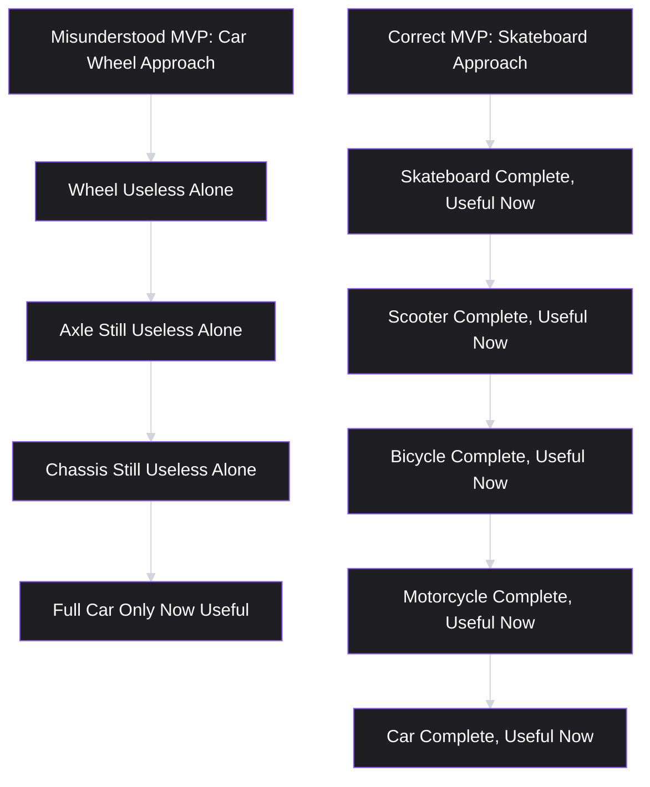
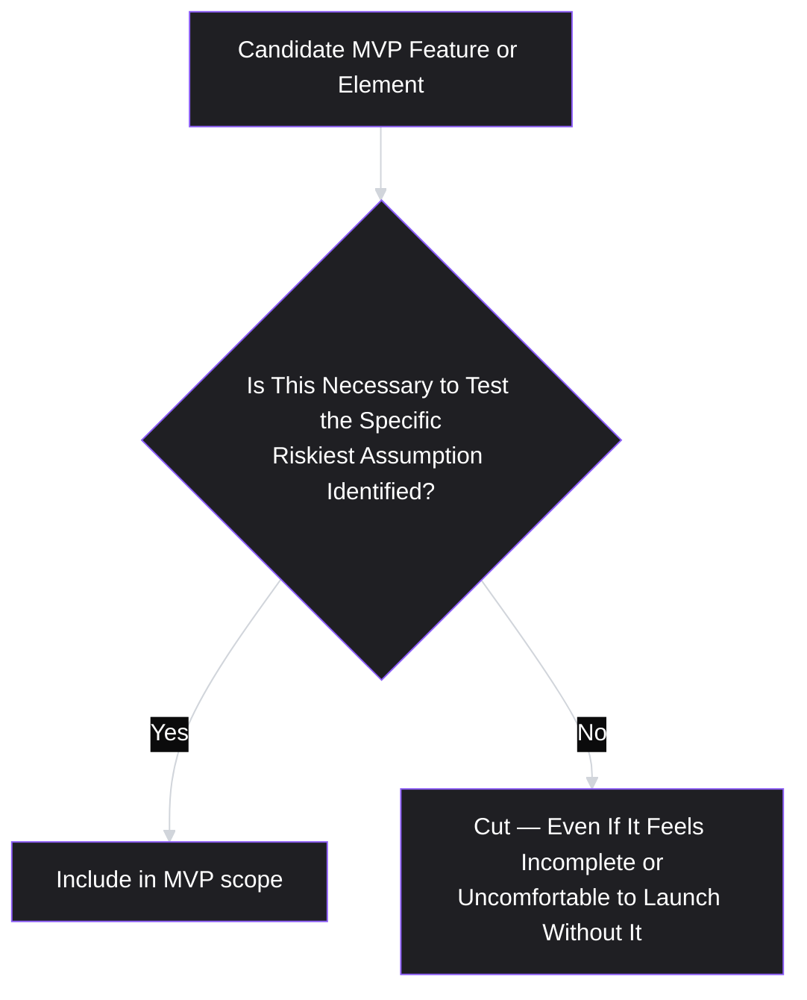
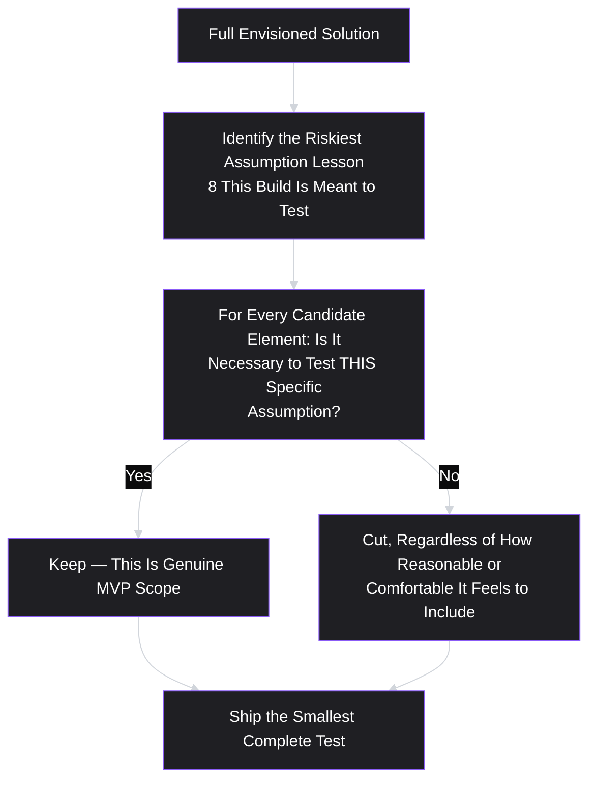

# Lesson 21: Minimum Viable Product (MVP)

## Why This Lesson Matters

Module 2 ended with a complete, continuously spinning discovery process: a validated opportunity, a laddered root cause, and a team that has moved from evidence-gathering into delivery while keeping their discovery cadence alive. This lesson picks up at the exact handoff point — you have a genuine, validated problem (Lesson 17), and now you must decide what to actually build first. The instinctive answer, for most teams, is to build the full, envisioned version of the solution. This lesson argues that instinct is almost always wrong, and gives you the discipline to resist it.

A **minimum viable product (MVP)** is the smallest version of a solution that lets a team test its riskiest remaining assumption (Lesson 8) with real users, in a real context, while investing the least possible amount of time and resources to do so. The word "minimum" is doing real work here, and it is the word most commonly misunderstood: minimum does not mean low-quality, and it does not mean "the first phase of a larger plan we already know we're going to build in full." It means the smallest thing capable of producing a genuine, decision-relevant answer to the question the team most needs answered right now.

---

## Learning Path

| Field | Detail |
|---|---|
| **Module** | 3 — Product Design |
| **Current Lesson** | 21 of 90 |
| **Difficulty** | 4 / 10 |
| **Estimated Study Time** | 25 minutes (reading) + 15 minutes (reflection + quiz) |
| **Prerequisites** | Lesson 8 (Product Discovery), Lesson 17 (Problem Statements), Lesson 20 (Product Discovery Process) |
| **Next Lesson** | Lesson 22 — Product Requirements Document (PRD) |
| **Future Topics Unlocked** | Lesson 22 (PRD — specifying an MVP formally), Lesson 23 (User Stories), Lesson 29 (Prioritization Fundamentals) |

---

## Learning Objectives

By the end of this lesson, you will be able to:

1. Define an MVP precisely, distinguishing it from a low-quality product, a prototype, and a "phase one" of an already-decided larger plan.
2. Apply the "riskiest assumption" test (extending Lesson 8) to scope an MVP correctly.
3. Distinguish the "MVP as a smaller product" misconception from the "MVP as a learning instrument" correct framing, using the well-known skateboard-versus-car analogy.
4. Identify the "MVP creep" and "MVP theater" failure patterns and explain how each undermines the concept's purpose.
5. Apply a structured method for deciding what to cut from an MVP scope without invalidating the specific test it's meant to run.

---

## Prerequisites

Lesson 8 (Product Discovery), Lesson 17 (Problem Statements), and Lesson 20 (Product Discovery Process). This lesson assumes you can identify a riskiest assumption using assumption mapping and can write a solution-free problem statement — an MVP is the first concrete solution artifact built specifically to test that riskiest assumption, sitting at the delivery end of the Discovery Flywheel introduced in Lesson 20.

---

## Theory

### The Core Definition, Precisely Stated

An MVP is the smallest version of a solution capable of producing genuine, decision-relevant learning about the riskiest remaining assumption in a validated opportunity. Three words in this definition each do specific, deliberate work:

- **Smallest**: not the fullest, most feature-complete version the team can imagine, but the version requiring the least investment while still being capable of the specific test at hand.
- **Decision-relevant**: the learning produced must actually change what the team does next — an MVP that produces interesting but non-decision-relevant information has not fulfilled its purpose, echoing Lesson 8's discovery theater warning.
- **Riskiest remaining assumption**: not just any assumption, but specifically the one identified through assumption mapping (Lesson 8) as combining the lowest confidence and highest importance — an MVP scoped around a comfortable, low-risk assumption has not actually done its job, even if it's well-built and well-received.

### The Skateboard, Not the Car Wheel

The most widely cited corrective to MVP misunderstanding is a visual analogy, often attributed to Henrik Kniberg: when asked to build a car incrementally, a team that misunderstands "minimum" might first deliver a single wheel, then an axle, then a chassis — each piece individually useless on its own, with the customer only able to experience actual value once the entire car is assembled. A team that correctly understands MVP thinking instead delivers a skateboard first: a complete, if humble, means of transportation that a person can actually use and provide feedback on immediately, followed by a scooter, then a bicycle, then a motorcycle, and eventually a car — each intermediate step is a genuinely complete, independently useful product in its own right, not a fragment of the final vision.

The distinction this analogy makes vivid: an MVP is not a fragment of a larger, predetermined plan, delivered piece by piece. It is a complete, standalone solution to the smallest version of the validated problem that a real person can actually use and provide genuine feedback on, right now — each subsequent iteration, if warranted by what the MVP reveals, is itself another complete, independently useful product, not merely "phase two of the car."

### The "MVP as Smaller Product" Misconception

The single most common misunderstanding of MVP, closely related to the car-wheel failure above, is treating "minimum viable product" as simply "the smallest slice of the product we already know we're eventually building" — as if scope reduction alone were the entire discipline. This misses the "viable" and "learning" components of the concept entirely: an MVP is not defined by how small it is, but by whether it is capable of producing a genuine answer to the team's riskiest open question.

This distinction matters practically because a team focused purely on "smallest slice" thinking will often cut scope from the wrong place — reducing the visual polish or feature breadth of a plan that was never actually validated in the first place, rather than questioning whether the underlying plan itself addresses the riskiest assumption at all. Recall Lesson 8's Detailed Case Study: a meal-kit company that built a full ingredient-customization engine, when a much smaller, manual "concierge" test (an actual MVP, correctly understood) could have tested the same underlying value-risk and viability-risk assumptions at a fraction of the cost, without ever building the automated system at all.

### Applying the Riskiest Assumption Test to MVP Scoping

Directly extending Lesson 8's assumption mapping technique, correctly scoping an MVP requires explicitly identifying which specific assumption the MVP is meant to test, and then asking, for every candidate feature or piece of polish under consideration: **is this specific element necessary to test that specific assumption, or is it present for some other reason** (comfort, completeness, stakeholder preference, aesthetic quality) unrelated to the test at hand?

This test is deliberately uncomfortable to apply rigorously, because it frequently recommends cutting features or polish that feel important for reasons entirely separate from the specific test at hand — a polished onboarding flow, a broad set of edge-case handling, a visually refined interface — none of which may be necessary to answer the specific riskiest-assumption question the MVP exists to test, even though each might genuinely matter for the eventual, fully realized product.

### "MVP Creep" and "MVP Theater"

Two specific, common failure patterns deserve direct attention, both representing a failure to hold the line on genuine minimality and genuine viability:

- **MVP creep**: the gradual, feature-by-feature expansion of an MVP's scope during planning, as various stakeholders each successfully argue for "just one more thing" needed before launch — a phenomenon closely related to Lesson 10's "grab-bag of disconnected objectives" failure, here operating at the scope-creep level of a single initiative rather than an entire strategy. Each individual addition may sound reasonable in isolation, but cumulatively, an MVP that has crept significantly beyond its original riskiest-assumption-testing scope has stopped being minimal, and often stops being fast enough to still function as a genuine, timely discovery test.
- **MVP theater**: building something small and calling it an MVP, without it actually being capable of testing the riskiest assumption — a direct extension of Lesson 8's discovery theater concept applied specifically to the MVP artifact. A small, cheaply built feature that happens to be minimal, but that doesn't actually address the specific risk the team most needs to resolve, provides the appearance of discovery-minded discipline without its substance.

Both patterns share the same underlying corrective: return explicitly to the riskiest-assumption test described above, for every element under consideration, whenever scope discussions begin to drift in either direction — toward creep (adding things not necessary for the test) or toward theater (cutting things that are necessary for the test, purely for speed).

---

## Common Beginner Mistakes

**Mistake 1: Building a low-quality, broken, or embarrassing version of the eventual product and calling it minimal**

"Minimum" refers to scope, not to quality or craftsmanship within that scope — an MVP should be a small but genuinely complete, functioning solution to a narrowly scoped version of the problem, not a shoddy, half-working version of the full vision.

**Mistake 2: Treating an MVP as "phase one" of an already-decided larger build, rather than a genuine test**

This is the car-wheel failure — building a fragment of a predetermined plan rather than a complete, standalone artifact capable of producing independent learning that might genuinely redirect the plan.

**Mistake 3: Scoping an MVP by "what's easiest to build" rather than "what's necessary to test the riskiest assumption."**

These two scoping criteria frequently diverge, and defaulting to ease of engineering effort, rather than test-relevance, risks producing something that ships quickly but doesn't actually answer the question that matters most.

**Mistake 4: Allowing MVP creep — accumulating "just one more thing" until the MVP is no longer minimal**

Each individual addition may seem reasonable, but cumulative creep undermines both the speed and the discipline that make an MVP valuable in the first place.

**Mistake 5: Calling something an MVP when it hasn't actually been scoped around the riskiest assumption (MVP theater)**

A small, quickly built feature that doesn't test the actual riskiest open question provides the appearance, without the substance, of disciplined discovery.

---

## Mental Model: The MVP Scoping Filter

This lesson's mental model is the **MVP Scoping Filter** — the riskiest-assumption test from Theory, applied as a standing discipline whenever a team is deciding what belongs inside, or outside, an MVP's scope.

Use this filter explicitly, in writing, at the start of any MVP scoping discussion: name the riskiest assumption first, then evaluate every proposed feature or piece of polish strictly against whether it's necessary for that specific test — not against a vaguer standard of "would this be nice to have" or "is this technically easy."

---

## Real Company Example

**Zappos**'s well-documented early history is a frequently cited illustration of correctly scoped MVP thinking. According to widely reported accounts, founder Nick Swinmurn tested the core, riskiest assumption behind the entire online shoe-retail concept — would people actually buy shoes online without trying them on first — by manually photographing shoes at local stores and posting them online himself, purchasing the physical inventory from the store only after a real customer placed a real order, rather than first building an automated inventory system, a large product catalog, or a polished storefront. This is a textbook application of the riskiest-assumption test: the manual, unscalable process was sufficient to answer the one question that mattered most before any further investment was justified, exactly the kind of concierge-style test previewed in Lesson 8's confidence ladder.

*(Assumption flagged: this reflects a widely repeated account of Zappos's early history rather than a claim this curriculum can independently verify in full detail.)*

---

## Real World Perspective: Minimum Viable Product (MVP) at Different Company Stages

**At a startup:**
MVP thinking is often existential, testing whether the company's entire core value proposition (Lesson 7) is real at all, and startups are often forced by resource constraints into genuinely minimal scoping almost by necessity — the risk at this stage is less MVP creep (there's rarely enough resource to indulge it) and more the temptation to build a more "impressive-looking" product than necessary to attract investors or early hype, at the cost of genuine riskiest-assumption testing.

**At a mid-size company:**
MVP scoping discussions are where stakeholder pressure (echoing Lesson 5's structural bias toward louder, more organizationally connected voices) most commonly produces MVP creep, since a wider set of internal stakeholders each have legitimate-sounding reasons for additional scope, and disciplined, explicit application of the riskiest-assumption filter becomes increasingly necessary as an organization grows.

**At Big Tech:**
MVPs at scale are often run as limited, controlled experiments (a specific geographic market, a specific user segment, a percentage-based rollout) rather than a single, universally released small product, allowing genuine minimality in exposure and risk even while the underlying built feature may be more fully realized than a startup's MVP would be — the discipline here shifts toward correctly scoping which population and how much exposure is necessary for a statistically meaningful test, rather than purely which features to build.

---

## Detailed Case Study: The MVP That Grew Into the Full Product

Consider a simplified, illustrative scenario common across B2B productivity software.

A team building a team-scheduling tool identifies, through the Discovery Flywheel (Lesson 20), a validated opportunity: teams struggle to find a mutually available meeting time across multiple calendars. The riskiest assumption, correctly identified through assumption mapping, is whether users will trust an automated tool to propose meeting times without manually reviewing every participant's calendar themselves — a genuine value/usability risk, not a technical feasibility risk (the underlying calendar-matching logic is well understood and low-risk to build).

The team begins scoping an MVP intended specifically to test this trust assumption. During planning, a sales stakeholder requests support for recurring meetings, since "customers will ask about this immediately." A design stakeholder requests a polished, branded email template for meeting invitations, since "our brand standards require it for anything customer-facing." An engineering stakeholder requests support for three major calendar providers rather than one, since "we'll need all three eventually anyway, and it's more efficient to build them together." Each request is individually reasonable, and none is explicitly evaluated against the specific trust assumption the MVP was meant to test.

Two months later — far longer than the team's original one-to-two-week estimate — the MVP finally ships, now supporting recurring meetings, three calendar providers, and a fully branded email system. Usage data reveals the same core finding the team could have learned in the first two weeks: a substantial share of users are hesitant to trust an automatically proposed time without manual review, precisely the assumption the original, much smaller MVP was designed to test.

**What went wrong?**

Applying this lesson's frameworks:

1. **Every added feature failed the MVP Scoping Filter, but was never explicitly checked against it.** Recurring meetings, three calendar providers, and branded emails are all plausible eventual product needs, but none was necessary to test the specific trust assumption the MVP existed to validate.
2. **This is a clear instance of MVP creep** — each individual stakeholder request was reasonable in isolation, but their cumulative effect delayed the team's access to decision-relevant learning by roughly seven weeks, without changing the core finding at all.
3. **The two-month delay had a real opportunity cost** (echoing Lesson 19's opportunity comparison discipline): during those seven additional weeks, the team's discovery cadence on other, potentially higher-value opportunities in their tree was effectively paused, since the entire team's delivery capacity was consumed by scope that never needed to be part of this specific test.

A team applying this lesson's discipline rigorously would have explicitly named the trust assumption at the outset of MVP scoping, and evaluated each of the three stakeholder requests against the MVP Scoping Filter directly — very likely cutting all three from the initial MVP (while potentially noting them as legitimate candidates for the next iteration, once the trust assumption itself had been resolved), shipping a single-calendar-provider, non-recurring, plainly formatted test within the original one-to-two-week estimate, and reaching the same core finding roughly seven weeks earlier.

This case connects directly back to **Lesson 10's exclusion discipline** and **Lesson 17's Purity Test**: just as a real strategy must say no to individually reasonable options, and a real problem statement must resist smuggling in a solution, a real MVP must resist smuggling in scope that isn't necessary for its specific test — in all three cases, the discipline is the same: explicit, deliberate exclusion, even when every individual addition sounds reasonable.

---

## Framework Explanation: The MVP Scope Decision Table

A practical table for evaluating candidate MVP elements, directly operationalizing the MVP Scoping Filter:

| Candidate Element | Necessary for the Riskiest Assumption Test? | Decision |
|---|---|---|
| Core functionality directly testing the assumption | Yes, by definition | Include |
| A feature requested because "customers will eventually want it" | Usually no, unless the test specifically concerns willingness to pay for or adopt that feature | Cut; revisit after the current test resolves |
| Visual polish or branding beyond what's needed for a credible, usable test | Usually no, unless the test specifically concerns brand perception or trust tied to visual design | Cut; revisit later |
| Support for additional platforms/providers beyond the minimum needed to reach test participants | Usually no, unless the specific assumption concerns cross-platform behavior | Cut; revisit later |
| Edge-case handling for rare scenarios unlikely to occur during the test's limited exposure | Usually no, given the test's limited scale | Cut, with monitoring to catch and address genuine issues if they do occur |

The recurring discipline this table reinforces: **the default answer to "should this be included?" is no, unless a specific, articulable connection to the riskiest assumption test can be made** — reversing the more common, permissive default where features are included unless someone actively objects.

---

## Interview Perspective: How Interviewers Think About This

**Typical question 1: "How would you scope an MVP for a new feature idea?"**
*What the interviewer is actually evaluating:* Whether the candidate starts by naming the specific riskiest assumption to be tested, or defaults to a vaguer "smallest version of the feature" framing without that connection. A strong answer explicitly walks through identifying the assumption first, then filtering candidate scope against it.

**Typical question 2: "Tell me about a time an MVP grew larger than originally planned. What happened?"**
*What the interviewer is actually evaluating:* Direct experience with MVP creep and whether the candidate can identify the specific mechanism (stakeholder requests, each individually reasonable) that caused the expansion, echoing this lesson's Detailed Case Study, rather than attributing the growth to vague "scope creep" without deeper diagnosis.

**Typical question 3: "What's the difference between an MVP and a prototype?"**
*What the interviewer is actually evaluating:* Whether the candidate can distinguish a prototype (often not fully functional, used for early concept or usability testing, per Lesson 8's confidence ladder) from an MVP (a genuinely functional, if minimal, product used by real users under real conditions) — a common point of confusion this lesson's precise definition is meant to resolve.

---

## Summary

A minimum viable product is the smallest version of a solution capable of producing genuine, decision-relevant learning about a validated opportunity's riskiest remaining assumption — not a low-quality product, not a fragment of a predetermined larger plan (the car-wheel failure), and not simply "the smallest slice of the feature we already know we're building." The skateboard-versus-car analogy makes vivid that each MVP iteration should be a complete, independently useful artifact, not a piece of a larger vehicle that only becomes useful once fully assembled. Correctly scoping an MVP requires explicitly naming the riskiest assumption (per Lesson 8's assumption mapping) and evaluating every candidate feature or polish element against whether it's actually necessary to test that specific assumption — defaulting to exclusion rather than inclusion. "MVP creep" (gradual, individually reasonable scope expansion) and "MVP theater" (something small that doesn't actually test the riskiest assumption) are the two failure patterns that most commonly undermine genuine MVP discipline, and both are corrected by returning explicitly to the riskiest-assumption filter whenever scope discussions arise.

---

## Key Takeaways

- An MVP is the smallest version of a solution capable of producing decision-relevant learning about the riskiest remaining assumption — not a low-quality product or a fragment of a predetermined plan.
- The skateboard-versus-car analogy illustrates that each MVP iteration should be a complete, independently useful artifact, not a piece of a larger vehicle useful only once fully assembled.
- Correctly scoping an MVP means explicitly naming the riskiest assumption and evaluating every candidate element against whether it's necessary to test that specific assumption.
- "MVP creep" is the gradual, cumulative expansion of MVP scope through individually reasonable but ultimately unnecessary additions.
- "MVP theater" is building something small that doesn't actually test the riskiest assumption, providing the appearance of discovery discipline without its substance.
- The default answer to "should this be included in the MVP?" should be no, unless a specific connection to the riskiest assumption test can be articulated.
- An MVP is distinct from a prototype: an MVP is genuinely functional and used by real users under real conditions, while a prototype may be non-functional and used for earlier-stage concept testing.

---

## Cheat Sheet

*A two-minute review of everything in this lesson.*

- **MVP = smallest version that tests the riskiest remaining assumption** — not "smallest slice of the planned product," not "low quality."
- **Skateboard, not car parts** — each iteration should be complete and useful on its own, not a fragment of a bigger, predetermined vehicle.
- **Scoping test:** name the riskiest assumption first; include only what's necessary to test it; default to cutting everything else.
- **MVP creep** = individually reasonable additions that cumulatively destroy minimality and delay learning.
- **MVP theater** = something small that doesn't actually test the riskiest assumption.
- **MVP ≠ prototype** — an MVP is genuinely functional, used by real users under real conditions.

---

## Glossary

| Term | Definition | Related Concepts | Difficulty |
|---|---|---|---|
| Minimum Viable Product (MVP) | The smallest version of a solution capable of producing decision-relevant learning about the riskiest remaining assumption. | Assumption Mapping (Lesson 8) | 2 |
| MVP Scoping Filter | A technique for evaluating candidate MVP features against whether they're necessary to test the specific riskiest assumption at hand. | Assumption Mapping | 2 |
| MVP Creep | The gradual, cumulative expansion of an MVP's scope through individually reasonable but ultimately unnecessary additions. | Grab-Bag of Disconnected Objectives (Lesson 10) | 2 |
| MVP Theater | Building something small and calling it an MVP without it actually being capable of testing the riskiest assumption. | Discovery Theater (Lesson 8) | 2 |

---

## Further Reading / Resources

- Eric Ries, *The Lean Startup* — the foundational modern source for MVP theory and the build-measure-learn cycle underlying this lesson's framing.
- Henrik Kniberg's widely circulated skateboard-to-car illustration and public writing on MVP scoping, directly referenced in this lesson's Theory section.
- Marty Cagan, *Inspired* — discusses distinguishing genuine MVPs from prototypes and "MVP theater," directly relevant to this lesson's core distinctions.

---

## Flashcards

**Card 1**
- Front: What is the precise definition of an MVP, according to this lesson?
- Back: The smallest version of a solution capable of producing genuine, decision-relevant learning about the riskiest remaining assumption in a validated opportunity.
- Difficulty: 2
- Tags: mvp-definition

**Card 2**
- Front: What does the skateboard-versus-car analogy illustrate about MVPs?
- Back: Each MVP iteration should be a complete, independently useful artifact (like a skateboard), not a fragment of a predetermined larger plan (like a car wheel) that's only useful once fully assembled.
- Difficulty: 2
- Tags: skateboard-analogy

**Card 3**
- Front: What is the correct default when evaluating whether a candidate feature belongs in an MVP?
- Back: Exclude it, unless a specific, articulable connection to the riskiest assumption being tested can be made.
- Difficulty: 2
- Tags: mvp-scoping-filter

**Card 4**
- Front: What is "MVP creep"?
- Back: The gradual, cumulative expansion of an MVP's scope through individually reasonable stakeholder requests, which together undermine the MVP's minimality and delay decision-relevant learning.
- Difficulty: 2
- Tags: mvp-creep

**Card 5**
- Front: What is "MVP theater"?
- Back: Building something small and calling it an MVP without it actually being capable of testing the riskiest remaining assumption — the appearance of discovery discipline without its substance.
- Difficulty: 2
- Tags: mvp-theater

**Card 6**
- Front: How does an MVP differ from a prototype?
- Back: An MVP is genuinely functional and used by real users under real conditions; a prototype may be non-functional and is typically used for earlier-stage concept or usability testing.
- Difficulty: 2
- Tags: mvp-vs-prototype

**Card 7**
- Front: In the Detailed Case Study, what was the real cost of MVP creep beyond the delayed timeline itself?
- Back: The team's discovery cadence on other, potentially higher-value opportunities in their Opportunity Solution Tree was effectively paused during the seven additional weeks the unnecessary scope consumed.
- Difficulty: 3
- Tags: case-study

## Reflection Exercise

You are the PM for a language-learning app, and your team has validated an opportunity: users report abandoning the app because they don't feel confident they're actually retaining vocabulary long-term. Assumption mapping identifies the riskiest assumption as: users will engage with a spaced-repetition review feature enough for it to meaningfully improve retention and reduce abandonment.

Work through the following, in writing, before reading further:

1. Propose a genuinely minimal MVP scope capable of testing this specific riskiest assumption — describe what it would and would not include.
2. A stakeholder requests adding gamified badges to the MVP, arguing "engagement features always help." Apply the MVP Scoping Filter to this request and explain your decision.
3. A different stakeholder requests supporting multiple languages simultaneously in the MVP, rather than just one. Apply the MVP Scoping Filter to this request as well.
4. Using the skateboard-versus-car analogy, describe what a "car wheel" version of this MVP might look like (a technically necessary but individually useless fragment), and contrast it with your genuinely minimal, complete "skateboard" version.
5. Identify one way this MVP could become an instance of "MVP theater" if scoped carelessly, despite being small.

There is no single correct answer. The purpose of this exercise is to practice applying the riskiest-assumption filter rigorously, resisting individually reasonable-sounding scope additions that aren't actually necessary for the specific test at hand.

---

## Quiz

**1. Which of the following best defines a minimum viable product, according to this lesson?**
A) The lowest-quality version of a product a team can ship
B) The smallest version of a solution capable of producing genuine, decision-relevant learning about the riskiest remaining assumption
C) The first phase of an already-decided, larger, predetermined product plan
D) A non-functional visual mockup used to gather initial impressions

*Correct answer: B*
*Explanation: This is the lesson's precise definition, distinguishing an MVP from a low-quality product, a predetermined plan fragment, or a non-functional prototype.*
*Learning objective tested: #1*
*Difficulty: Easy*

---

**2. What does the skateboard-versus-car analogy illustrate about correct MVP thinking?**
A) That MVPs should always be simple modes of transportation
B) That each MVP iteration should be a complete, independently useful artifact, not a fragment of a larger, predetermined plan that only becomes useful once fully assembled
C) That MVPs should never evolve into more complex products over time
D) That cars are always a better analogy for enterprise software than skateboards

*Correct answer: B*
*Explanation: The analogy specifically contrasts a series of complete, useful artifacts (skateboard, scooter, bicycle) against a series of useless fragments (wheel, axle, chassis) that only become useful once fully assembled into a car.*
*Learning objective tested: #3*
*Difficulty: Easy*

---

**3. According to the MVP Scoping Filter, what should be the default decision for a candidate feature under consideration for an MVP?**
A) Include it, unless someone actively objects
B) Exclude it, unless a specific, articulable connection to the riskiest assumption being tested can be made
C) Include it if it is technically easy to build
D) Include it if at least one stakeholder requests it

*Correct answer: B*
*Explanation: The lesson explicitly reverses the more common, permissive default — exclusion is the default unless a specific connection to the riskiest assumption test can be made.*
*Learning objective tested: #2*
*Difficulty: Easy*

---

**4. What is "MVP creep"?**
A) A technique for scoping an MVP correctly
B) The gradual, cumulative expansion of an MVP's scope through individually reasonable but ultimately unnecessary additions
C) The process of testing an MVP with real users
D) A method for identifying the riskiest assumption

*Correct answer: B*
*Explanation: This is the lesson's explicit definition — cumulative, individually reasonable-sounding scope additions that undermine an MVP's minimality.*
*Learning objective tested: #4*
*Difficulty: Easy*

---

**5. What is "MVP theater"?**
A) A presentation format for sharing MVP results with stakeholders
B) Building something small and calling it an MVP without it actually being capable of testing the riskiest remaining assumption
C) A rehearsal process before launching an MVP
D) A method for gathering user feedback on a fully built product

*Correct answer: B*
*Explanation: MVP theater specifically describes a small build that fails to actually address the riskiest assumption, providing the appearance without the substance of genuine discovery discipline.*
*Learning objective tested: #4*
*Difficulty: Easy*

---

**6. In the Zappos example, what was the riskiest assumption being tested by the manual, unscalable photography and fulfillment process?**
A) Whether the company could build an automated inventory system quickly
B) Whether people would actually buy shoes online without trying them on first
C) Whether local shoe stores would agree to a partnership
D) Whether the company's branding would appeal to online shoppers

*Correct answer: B*
*Explanation: The example explicitly identifies this core value-risk assumption — willingness to buy shoes online sight-unseen — as the specific question the manual process was designed to test.*
*Learning objective tested: #1*
*Difficulty: Easy*

---

**7. In the Detailed Case Study, what was the actual cost of the two-month delay caused by MVP creep, beyond the timeline itself?**
A) The team's core finding about user trust changed significantly due to the added features
B) The team's discovery cadence on other, potentially higher-value opportunities was effectively paused during the additional seven weeks
C) The added features (recurring meetings, three calendar providers, branded emails) proved essential to the core assumption test
D) No meaningful cost resulted from the delay

*Correct answer: B*
*Explanation: The case study explicitly identifies the opportunity cost of pausing discovery on other opportunities, distinct from the delay itself, as the more significant consequence.*
*Learning objective tested: #4*
*Difficulty: Medium*

---

**8. Why did none of the three stakeholder requests in the Detailed Case Study belong in the original MVP scope, according to this lesson's framework?**
A) Because all three requests were technically infeasible
B) Because none of the three was necessary to test the specific trust assumption the MVP was designed to validate, despite each being individually reasonable for the eventual product
C) Because stakeholders should never be allowed to request features
D) Because the requests came from different departments

*Correct answer: B*
*Explanation: The MVP Scoping Filter's core test is whether an element is necessary for the specific riskiest assumption at hand — none of the three requests met this bar, regardless of their broader legitimacy.*
*Learning objective tested: #2, #4*
*Difficulty: Medium*

---

**9. (Scenario) A team is scoping an MVP to test whether users will trust an AI-generated summary feature enough to rely on it instead of reading a full document. Which of the following would most likely belong in the MVP, according to the MVP Scoping Filter?**
A) A fully polished, branded visual design for the summary display
B) Support for summarizing documents in ten different file formats
C) The core AI-generated summary functionality itself, presented in a basic but functional and legible way
D) An advanced customization feature allowing users to adjust summary length and tone

*Correct answer: C*
*Explanation: The core summary functionality is directly necessary to test the trust assumption; the other options (polish, format breadth, customization) are not necessary for this specific test and would represent MVP creep if included by default.*
*Learning objective tested: #2*
*Difficulty: Medium-Hard*

---

**10. (Product Thinking) A team builds a very small feature quickly, but on reflection realizes it doesn't actually address the specific riskiest assumption identified through assumption mapping — it tests a much more comfortable, already-high-confidence assumption instead. What has this team most likely produced?**
A) A genuine, well-scoped MVP
B) An instance of MVP theater — small, but not actually testing the riskiest remaining assumption
C) An instance of MVP creep
D) A fully validated solution requiring no further testing

*Correct answer: B*
*Explanation: This matches the lesson's definition of MVP theater precisely — smallness alone does not make something a genuine MVP if it fails to address the actual riskiest assumption.*
*Learning objective tested: #4*
*Difficulty: Medium-Hard*

---

**11. (Interview Reasoning) A candidate describes an MVP that included every feature originally planned for the full product, just built to a lower quality bar to ship faster. What might this signal, based on this lesson's Interview Perspective section?**
A) A strong, disciplined MVP scoping process
B) A likely misunderstanding of MVP as "the same scope, lower quality" rather than "the smallest scope necessary to test the riskiest assumption" — echoing Beginner Mistake 1
C) That the candidate has extensive MVP experience and should be considered highly qualified
D) Nothing meaningful, since quality reduction is an acceptable way to scope any MVP

*Correct answer: B*
*Explanation: This directly reflects Beginner Mistake 1 — conflating "minimum" with "lower quality" rather than "narrower scope, still fully functional," which the lesson identifies as a common and significant misunderstanding.*
*Learning objective tested: #1*
*Difficulty: Hard*

---

**12. (Product Thinking, Higher Difficulty) A team identifies two candidate riskiest assumptions for a new feature: one concerning whether users want the feature at all (value risk), and one concerning whether the underlying technical architecture can scale to full user volume (feasibility risk). Assumption mapping indicates the value-risk assumption has much lower confidence and higher importance. According to this lesson, how should the MVP be scoped?**
A) The MVP should be scoped to test the feasibility-risk assumption, since technical concerns are always more urgent
B) The MVP should be scoped specifically to test the value-risk assumption, since it is the genuinely riskiest one per assumption mapping, even if this means using a technically unscalable, manual, or concierge-style approach that doesn't address feasibility at all yet
C) The MVP should attempt to test both assumptions equally within the same build
D) The MVP should be scoped around whichever assumption is easiest for engineering to test

*Correct answer: B*
*Explanation: This reflects the lesson's core principle — scope should follow the assumption identified as riskiest through assumption mapping, potentially using a manual or unscalable approach (as in the Zappos example) rather than defaulting to feasibility concerns or ease of testing.*
*Learning objective tested: #2*
*Difficulty: Medium-Hard*

---

**13. (Interview Reasoning, Higher Difficulty) An interviewer describes a scenario where five different, individually reasonable stakeholder requests each get added to an MVP over several weeks, ultimately delaying the launch by two months without changing the core finding. What is the strongest diagnostic question a candidate should ask in response, based on this lesson?**
A) "Which stakeholder was most senior, and should their request have simply been prioritized above the others?"
B) "Was each of the five additions ever explicitly checked against the specific riskiest assumption the MVP was meant to test, using something like the MVP Scoping Filter?"
C) "Should the team have skipped MVP testing entirely and built the full product directly?"
D) "Was the MVP built using the correct engineering framework?"

*Correct answer: B*
*Explanation: This reflects the lesson's core diagnostic — the failure mode is the absence of an explicit, applied filter checking each addition against the specific riskiest assumption, not a question of stakeholder seniority, skipping MVP testing, or engineering tooling.*
*Learning objective tested: #4*
*Difficulty: Hard*

---

**14. (Product Thinking, Higher Difficulty) A team scopes a genuinely minimal MVP, correctly limited to testing a single riskiest assumption, and successfully validates it within one week. What should the team do next, according to this lesson's connection to Lesson 20's Discovery Flywheel?**
A) Immediately build the full, envisioned product without any further testing, since the core assumption has been validated
B) Return to the Discovery Flywheel to identify the next riskiest assumption or the next candidate opportunity, potentially scoping a new, similarly minimal MVP or iteration rather than assuming all future decisions are now fully de-risked
C) Disband the discovery process entirely, since the MVP successfully validated the idea
D) Repeat the exact same MVP test multiple times to increase confidence further, regardless of diminishing returns

*Correct answer: B*
*Explanation: This connects directly to Lesson 20's Discovery Flywheel — a successful MVP test resolves one specific assumption, not every future decision; the team should continue the discovery cycle for the next riskiest assumption or opportunity, echoing the skateboard-to-scooter progression rather than jumping straight to the full car.*
*Learning objective tested: #1, #3*
*Difficulty: Hard*

---

**15. (Highest Difficulty) A team has built a genuinely minimal, well-scoped MVP, correctly limited to a single riskiest assumption, but during the test, several real users report an entirely new, unexpected pain point unrelated to the original assumption being tested. According to this lesson combined with Lesson 19's opportunity discipline, what is the most appropriate response?**
A) Ignore the new finding entirely, since it falls outside the current MVP's specific test scope
B) Immediately expand the current MVP to address the new pain point, even though it's unrelated to the assumption being tested, since more feedback is always better to act on immediately
C) Record the new finding as a candidate addition to the Opportunity Solution Tree (Lesson 19) for future sizing and comparison, while keeping the current MVP's scope focused on its original, specific test
D) Discard the entire MVP and restart discovery from the beginning based on this single new finding

*Correct answer: C*
*Explanation: This integrates this lesson's scoping discipline with Lesson 19's opportunity management — a new, unrelated finding is valuable and should be captured for future comparison and sizing, but expanding the current MVP's scope to address it immediately would reintroduce exactly the kind of MVP creep this lesson warns against.*
*Learning objective tested: #2, #4*
*Difficulty: Hard*

---

## Connections

| | Lesson | Core Idea Carried Forward |
|---|---|---|
| **Previous Lesson** | Lesson 20 — Product Discovery Process | Provides the validated opportunity and identified riskiest assumption that an MVP is specifically built to test |
| **Current Lesson** | Lesson 21 — Minimum Viable Product (MVP) | The riskiest-assumption scoping test; the skateboard-versus-car analogy; MVP creep and MVP theater |
| **Next Lesson** | Lesson 22 — Product Requirements Document (PRD) | Formalizes a scoped MVP into a concrete, written specification document for delivery teams |
| **Future Concepts Unlocked** | Lesson 23 (User Stories) | Breaks a scoped MVP down into specific, implementable units of work |
| | Lesson 29 (Prioritization Fundamentals) | Uses MVP scoping discipline as one input into broader initiative-level prioritization decisions |

This curriculum is designed to be read as one continuous argument. Module 3 — Product Design begins here, building the concrete specification and design practices that follow once a genuine, validated opportunity (Module 2) has been carried into delivery. From this lesson forward, any reference to "the MVP" assumes the riskiest-assumption scoping discipline covered here — this will not be re-explained, only re-applied.
