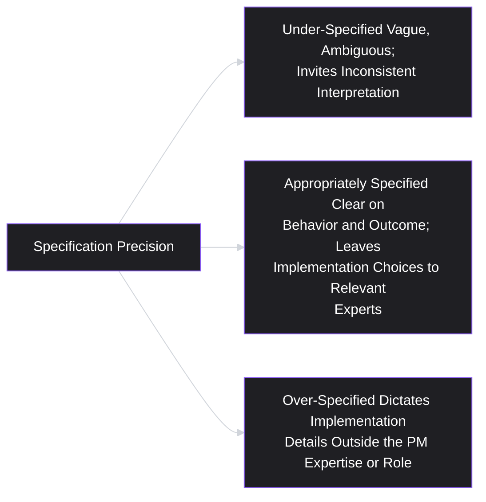
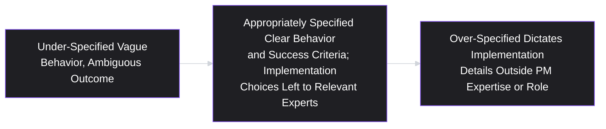

# Lesson 22: Product Requirements Document (PRD)

## Why This Lesson Matters

Lesson 21 ended with a genuinely, rigorously scoped MVP — small, complete, aimed squarely at the riskiest remaining assumption. But "scoped in a PM's head" and "specified clearly enough that a cross-functional team can build it correctly, without the PM in the room for every decision" are very different things. This lesson covers the artifact that bridges that gap: a **Product Requirements Document (PRD)**, a written specification that communicates what needs to be built, why, and for whom, precisely enough that engineering, design, and QA can work from a shared, unambiguous understanding rather than from fragments of hallway conversation and half-remembered Slack threads.

A PRD's job is not to make a PM look thorough, and it is not a ritualistic document produced because "that's the process." It exists to solve a specific, recurring failure: without a shared written specification, different team members build from different mental models of what "the feature" actually is, discovering the gaps between those mental models only during implementation, code review, or — worse — after launch. This lesson treats the PRD as a communication tool first and a documentation artifact second, and covers what separates a PRD that actually prevents this failure from one that merely looks thorough while leaving the same ambiguities unresolved.

---

## Learning Path

| Field | Detail |
|---|---|
| **Module** | 3 — Product Design |
| **Current Lesson** | 22 of 90 |
| **Difficulty** | 4 / 10 |
| **Estimated Study Time** | 25 minutes (reading) + 15 minutes (reflection + quiz) |
| **Prerequisites** | Lesson 17 (Problem Statements), Lesson 21 (MVP) |
| **Next Lesson** | Lesson 23 — User Stories |
| **Future Topics Unlocked** | Lesson 23 (User Stories — breaking a PRD into implementable units), Lesson 24 (Acceptance Criteria), Lesson 37 (Working with Engineering Teams) |

---

## Learning Objectives

By the end of this lesson, you will be able to:

1. Define a PRD and identify its core sections, distinguishing required content from optional or team-specific additions.
2. Apply the "problem before solution" ordering discipline within a PRD, directly extending Lesson 17's problem statement practice.
3. Distinguish appropriate specification precision from over-specification, and explain the risks of each extreme.
4. Identify the "PRD as one-way document" failure pattern and explain why a PRD should function as a living, collaboratively refined artifact rather than a final, unquestionable decree.
5. Apply a structured method for scoping what belongs inside a PRD versus what belongs in adjacent artifacts (user stories, acceptance criteria, design specs).

---

## Prerequisites

Lesson 17 (Problem Statements) and Lesson 21 (MVP). This lesson assumes you can write a solution-free problem statement and can rigorously scope an MVP around a riskiest assumption — a PRD is the document that formally combines both: it restates the validated problem, then specifies the scoped MVP solution precisely enough for a cross-functional team to build it.

---

## Theory

### The Core Definition and Structure

A PRD is a written specification communicating what is being built, for whom, why, and to what specification, structured to give engineering, design, and QA a shared, unambiguous reference point throughout a project. While specific templates vary by organization, a PRD typically includes:

- **Problem statement** (Lesson 17): the validated problem being addressed, stated without a solution.
- **Goals and success metrics**: what outcome this solution is meant to produce, and how success will be measured — directly connecting to the desired outcome at the root of the Opportunity Solution Tree (Lesson 19).
- **Scope** (in and out): what the MVP (Lesson 21) does and, just as importantly, does not include, given the riskiest-assumption scoping discipline from the previous lesson.
- **User flows or scenarios**: how a user actually moves through the solution, often connecting to persona and journey map work (Lessons 14–15).
- **Functional requirements**: specific behaviors the solution must exhibit.
- **Non-functional requirements**: performance, security, accessibility, and other cross-cutting constraints.
- **Open questions and risks**: explicitly unresolved issues, rather than papering over uncertainty with false specificity.

```mermaid
%%{init: {
  "theme": "dark",
  "themeVariables": {
    "background": "#0b0b0c",
    "primaryColor": "#1f1f23",
    "primaryTextColor": "#ffffff",
    "primaryBorderColor": "#8b5cf6",
    "lineColor": "#d1d5db",
    "secondaryColor": "#18181b",
    "tertiaryColor": "#111111",
    "mainBkg": "#1f1f23",
    "nodeBorder": "#8b5cf6",
    "clusterBkg": "#000000",
    "clusterBorder": "#27272a",
    "titleColor": "#ffffff",
    "edgeLabelBackground": "#0b0b0c",
    "nodeTextColor": "#ffffff",
    "edgeLabelColor": "#ffffff",
    "actorBorder": "#8b5cf6",
    "actorBkg": "#1f1f23",
    "actorTextColor": "#ffffff",
    "sequenceNumberColor": "#ffffff",
    "signalColor": "#8b5cf6",
    "signalTextColor": "#ffffff",
    "textColor": "#ffffff",
    "classText": "#ffffff",
    "classBorder": "#8b5cf6",
    "classBkg": "#1f1f23"
  }
}}%%
graph TD
    A[PRD] --> B[Problem Statement<br/>Lesson 17, Solution-free]
    A --> C[Goals & Success Metrics]
    A --> D[Scope: in and Out Per<br/>MVP Discipline, Lesson 21]
    A --> E[User Flows / Scenarios]
    A --> F[Functional Requirements]
    A --> G[Non-Functional Requirements]
    A --> H[Open Questions & Risks]
```

### Problem Before Solution: Ordering Discipline Within a PRD

A specific, important discipline — directly extending Lesson 17's solution-free problem statement practice — is the ordering of a PRD's content: the problem statement and goals must be established and agreed upon *before* functional requirements are specified, not written concurrently with, or after, the solution details. This ordering matters for the same reason Lesson 17 emphasized excluding solutions from problem statements in the first place: a PRD that opens directly with a list of functional requirements, without first anchoring the reader in the validated problem, invites reviewers to evaluate the requirements against their own private, unstated assumptions about the problem, rather than against a shared, explicit understanding — precisely the anchoring risk Lesson 12 warned about at the interview level and Lesson 17 warned about at the problem-framing level, now recurring at the level of an entire specification document's structure.

A PRD that begins with a clearly stated, evidence-cited problem (directly reusing Lesson 17's template) gives every subsequent requirement a test: does this requirement plausibly serve the stated problem, or has scope drifted toward something else? This is the same discipline as the Value Proposition Filter (Lesson 7) and Vision Filter (Lesson 9), now applied at the level of an individual document's internal consistency.

### Appropriate Precision vs. Over-Specification

A genuinely difficult judgment call in PRD writing is choosing the right level of precision — specific enough that engineering and design can build confidently without constant clarification, but not so exhaustively detailed that the document becomes a rigid, premature commitment to implementation choices that are better made by the specialists actually doing that work.

- **Under-specification** leaves genuine ambiguity that different team members will resolve differently, discovering the mismatch only during implementation or QA — for example, a requirement stating "the system should handle errors gracefully" without specifying what "gracefully" means in any testable sense.
- **Over-specification** dictates implementation details that are properly the domain of engineering or design expertise — for example, a PRD specifying the exact database schema or the precise pixel spacing of a UI element, decisions better made by the engineers and designers with the relevant technical and craft expertise, and decisions that, if specified prematurely by a PM without that expertise, risk being both wrong and unnecessarily constraining.

The practical discipline for finding this middle ground: specify the **what and why** (the required behavior, the reason it matters, the success criteria) with real precision, while deliberately leaving the **how** (the specific technical implementation, the exact visual execution) to the engineers and designers whose expertise that decision belongs to — consulting them, and inviting their judgment, rather than pre-deciding it unilaterally in the document.

### The "PRD as One-Way Document" Failure Pattern

A specific, common organizational failure treats a PRD as a final, unquestionable decree — written by a PM, handed to engineering and design as a finished, non-negotiable specification, with any subsequent questions treated as deviations from an already-settled plan rather than legitimate, expected refinements. This directly echoes Lesson 20's discovery-delivery handoff warning, now applied specifically to the PRD document itself: treating a PRD as something "delivered" rather than something collaboratively developed risks losing exactly the kind of implementation-stage insight (technical constraints discovered mid-build, design considerations that only become apparent once real interface work begins) that a genuinely open, living document would incorporate.

A healthier practice treats a PRD as a starting point for structured collaboration: engineering and design review it early, before commitments are finalized, explicitly raising questions, proposing alternative approaches to functional requirements, and flagging any premature over-specification the PM may have unintentionally included. The document itself should be updated as this collaboration surfaces new information, rather than treated as immutable once initially written — directly paralleling Lesson 17's guidance that a finalized problem statement should function as an ongoing reference point checked against reality, not a one-time artifact.

---

## Common Beginner Mistakes

**Mistake 1: Opening a PRD with functional requirements before establishing the problem statement and goals.**
This invites readers to evaluate requirements against their own private assumptions about the problem, rather than a shared, explicit understanding, echoing the anchoring risks covered in earlier lessons.

**Mistake 2: Under-specifying requirements, leaving genuine ambiguity that different team members resolve inconsistently.**
Vague language ("handle errors gracefully," "make it fast") invites exactly the kind of divergent interpretation a PRD exists to prevent.

**Mistake 3: Over-specifying implementation details that belong to engineering or design expertise.**
Dictating a specific database schema or exact pixel measurements, without inviting the relevant experts' judgment, both risks being technically wrong and unnecessarily constrains solutions that specialists might implement better.

**Mistake 4: Treating a PRD as a final, unquestionable decree rather than a living, collaboratively refined document.**
This risks losing valuable implementation-stage insight and echoes Lesson 20's discovery-delivery handoff failure at the level of an individual specification document.

**Mistake 5: Including content that belongs in a different, more granular artifact (user stories, acceptance criteria) rather than the PRD itself.**
A PRD that attempts to specify every individual implementable unit of work in exhaustive detail duplicates, and often conflicts with, the more granular work covered in Lessons 23 and 24.

---

## Mental Model: The PRD Precision Dial

This lesson's mental model is the **PRD Precision Dial** — a way of visualizing the trade-off between under- and over-specification, and consciously choosing where a given requirement should sit.

Use this dial explicitly when drafting or reviewing a requirement: is this specific enough that a reasonable engineer or designer, reading it independently, would build essentially the same thing another reasonable engineer or designer would build from the same text? If two people could reasonably interpret it very differently, it's under-specified. If it dictates a technical or visual implementation choice the PM isn't positioned to make well, it's over-specified.

---

## Real Company Example

**Google**'s widely referenced internal "design docs" and product specification practices, particularly for engineering-heavy initiatives, are a commonly cited illustration of collaborative, living specification documents rather than one-way decrees. Public accounts and externally shared examples of Google's internal documentation culture have described a practice of circulating draft specifications broadly for comment before finalizing them, explicitly inviting engineering and design pushback on both the stated problem and the proposed approach, and treating a written specification as a structured starting point for cross-functional refinement rather than a finished, unquestionable plan — directly reflecting this lesson's corrective to the "PRD as one-way document" failure pattern.

*(Assumption flagged: this reflects widely reported, publicly shared descriptions of general documentation practices at Google rather than a claim about the company's current, complete, or universal internal PRD process, which this curriculum does not claim certainty about.)*

---

## Real World Perspective: PRDs at Different Company Stages

**At a startup:**
PRDs are often lightweight and informal, sometimes replaced by a brief written brief or even a well-structured verbal alignment session, given small team size and close daily collaboration that reduces the risk of the divergent-mental-model problem a formal PRD exists to prevent. As teams grow beyond a size where informal alignment reliably works, the discipline of writing things down explicitly becomes increasingly valuable.

**At a mid-size company:**
PRDs typically become a more standard, expected artifact for any initiative involving more than a small handful of people, and organizations at this stage often develop templates codifying the sections this lesson describes — the main ongoing risk is the "PRD as one-way document" failure pattern, as team size grows enough that informal, continuous conversation with the PM becomes less automatic than it was at a smaller scale.

**At Big Tech:**
PRDs and equivalent specification documents at scale often go through formal, multi-stage review processes involving multiple cross-functional stakeholders and sometimes explicit sign-off requirements, and a significant part of senior product leadership's role involves ensuring these formal review processes remain genuinely collaborative (inviting real pushback and iteration) rather than becoming a bureaucratic, one-way approval ritual that technically satisfies a process requirement without functioning as genuine cross-functional alignment.

---

## Detailed Case Study: The PRD That Specified the Wrong Things

Consider a simplified, illustrative scenario common across B2B software teams.

A PM writes a PRD for a new notification system, based on a well-validated opportunity and a correctly scoped MVP (Lesson 21). The document opens directly with a detailed list of functional requirements — including a highly specific database table structure for storing notification preferences, and an exact specification of button placement and color within the settings interface — without ever explicitly restating the underlying problem statement or success metrics the notification system was meant to address.

Engineering, working from the PRD, builds exactly what was specified: the given database structure and the given interface layout. During implementation, an engineer notices that the specified database structure would make a common, expected future feature (notification digests, batching multiple notifications together) significantly harder to build later, and would have proposed a different structure — but, treating the PRD as a finalized, non-negotiable specification (rather than raising the concern, given the document's one-way framing), the engineer builds as specified rather than raising the issue.

Separately, the design team, upon finally reviewing the PRD's specified button placement and color, disagrees with the choice on established design-system grounds, but similarly treats the specification as already decided rather than open for discussion, given how the document was originally framed and circulated.

Three months after launch, both concerns prove valid: a subsequent notification-digest feature does require a costly database migration exactly because of the original schema choice, and user testing reveals the specified button color has poor contrast for a portion of users, an accessibility issue the design team could have easily caught and flagged, had they felt the document invited that kind of pushback.

**What went wrong?**

Applying this lesson's frameworks:

1. **The PRD opened with functional requirements rather than the problem statement and goals**, denying reviewers the shared context needed to evaluate whether the specific requirements (including the ones that later proved problematic) actually served the underlying need well.
2. **The document was significantly over-specified in areas outside the PM's expertise** — the database schema and exact interface styling are properly engineering and design decisions, and specifying them unilaterally both risked being technically or aesthetically suboptimal and pre-empted the relevant experts' better judgment.
3. **The PRD functioned as a one-way document rather than a living, collaboratively refined one.** Both the engineer and the designer had legitimate, valuable concerns, but the document's framing (and likely the surrounding team culture) discouraged raising them as an expected, welcomed part of the process.

A team applying this lesson's discipline would have opened the PRD with the problem statement and goals, specified the required notification behavior and success criteria (the what and why) while explicitly inviting engineering to propose the database structure and design to propose the specific interface treatment (the how), and circulated the document for genuine review and pushback before finalizing — very likely catching both the schema limitation and the contrast issue well before either became a costly, post-launch problem.

This case connects directly back to **Lesson 20's discovery-delivery handoff pattern** and **Lesson 17's problem-before-solution discipline**: in both cases, the underlying failure is the same — treating a specification or research artifact as a finished, one-way deliverable rather than a living tool for ongoing, genuine collaboration.

---

## Framework Explanation: The PRD Review Checklist

A practical checklist for reviewing a draft PRD before circulating it as a final specification:

| Question | Purpose |
|---|---|
| Does the document open with the problem statement (Lesson 17) and goals, before any functional requirements? | Prevents readers from evaluating requirements against private, unstated assumptions |
| Is each functional requirement specific enough to prevent divergent interpretation, without dictating implementation details outside the PM's expertise? | Balances the Precision Dial correctly |
| Are open questions and risks explicitly listed, rather than papered over with false specificity? | Prevents the document from projecting more certainty than actually exists |
| Has the document been circulated for genuine review, with real opportunity for engineering and design pushback, before being treated as final? | Prevents the "one-way document" failure pattern |
| Does the document avoid duplicating content that belongs in more granular artifacts (user stories, acceptance criteria)? | Keeps the PRD focused on its appropriate level of specification |

A PRD that fails several of these checks risks the exact kind of costly, post-launch discovery shown in this lesson's Detailed Case Study — issues that could have been caught and resolved during specification and review, at a small fraction of the cost of catching them after implementation or launch.

---

## Interview Perspective: How Interviewers Think About This

**Typical question 1: "Walk me through how you'd write a PRD for a new feature."**
*What the interviewer is actually evaluating:* Whether the candidate describes opening with the problem and goals before specifying requirements, and whether they mention circulating the document for genuine cross-functional review, versus describing a document written and delivered unilaterally.

**Typical question 2: "Tell me about a time a PRD was ambiguous or led to miscommunication. What happened?"**
*What the interviewer is actually evaluating:* Direct experience with under-specification (or, less commonly, over-specification) and whether the candidate can articulate the specific gap and how it was ultimately resolved, rather than attributing the miscommunication vaguely to "poor communication" without deeper diagnosis.

**Typical question 3: "How do you decide how much implementation detail to include in a PRD versus leaving to engineering or design?"**
*What the interviewer is actually evaluating:* Fluency with the Precision Dial — whether the candidate can articulate a principled distinction between specifying the what/why (appropriately the PM's domain) and the how (appropriately engineering/design's domain), rather than defaulting to either extreme without a clear rationale.

---

## Summary

A PRD is a written specification giving engineering, design, and QA a shared, unambiguous reference point for what is being built, why, and to what specification — its core sections typically include a problem statement, goals and success metrics, in/out scope, user flows, functional and non-functional requirements, and open questions. The problem statement and goals must be established before functional requirements are specified, directly extending Lesson 17's solution-free discipline, since a document opening with requirements invites readers to evaluate them against private, unstated assumptions about the problem. Appropriate specification precision sits between under-specification (vague requirements inviting inconsistent interpretation) and over-specification (dictating implementation details outside the PM's expertise), and the practical discipline is specifying the what and why with real precision while leaving the how to the relevant engineering and design experts. The "PRD as one-way document" failure pattern — treating a specification as a final, unquestionable decree rather than a living, collaboratively refined artifact — risks losing valuable implementation-stage insight, as shown in this lesson's Detailed Case Study, and the corrective is genuine, early cross-functional review with real opportunity for pushback before the document is treated as final.

---

## Key Takeaways

- A PRD's core sections typically include a problem statement, goals/success metrics, in/out scope, user flows, functional and non-functional requirements, and open questions.
- Problem statement and goals must come before functional requirements, so readers evaluate requirements against a shared, explicit understanding rather than private assumptions.
- Appropriate specification precision specifies the what and why clearly while leaving the how (technical and visual implementation) to engineering and design expertise.
- Under-specification invites inconsistent interpretation; over-specification pre-empts expert judgment and risks being technically or aesthetically wrong.
- "PRD as one-way document" — treating a specification as a final decree rather than a living, collaboratively refined artifact — risks losing valuable implementation-stage insight from engineering and design.
- A healthy PRD process circulates the document early for genuine cross-functional review and welcomes pushback, rather than treating questions as deviations from an already-settled plan.
- A PRD should avoid duplicating content that belongs in more granular artifacts like user stories and acceptance criteria.

---

## Cheat Sheet

*A two-minute review of everything in this lesson.*

- **Core PRD sections:** problem statement, goals/metrics, scope (in/out), user flows, functional requirements, non-functional requirements, open questions.
- **Problem before solution** — always, within the PRD's own structure, not just at the project level.
- **Precision Dial:** specify the what/why clearly; leave the how to engineering/design expertise.
- **Avoid "PRD as one-way document"** — circulate early, invite real pushback, treat it as living.
- **Don't duplicate** user stories/acceptance criteria content inside the PRD itself.
- **PRD Review Checklist:** problem-first ordering? appropriate precision? open questions listed? genuinely reviewed, not just delivered?

---

## Glossary

| Term | Definition | Related Concepts | Difficulty |
|---|---|---|---|
| Product Requirements Document (PRD) | A written specification communicating what is being built, why, and to what specification, for a cross-functional team. | Problem Statement (Lesson 17), MVP (Lesson 21) | 2 |
| PRD Precision Dial | A model for choosing appropriate specification precision, between under-specification and over-specification. | Functional Requirements | 2 |
| Under-Specification | Leaving genuine ambiguity in a requirement, inviting inconsistent interpretation across team members. | PRD Precision Dial | 2 |
| Over-Specification | Dictating implementation details outside the PM's expertise, pre-empting engineering or design judgment. | PRD Precision Dial | 2 |
| "PRD as One-Way Document" (Failure Pattern) | Treating a PRD as a final, unquestionable decree rather than a living, collaboratively refined artifact. | Discovery-Delivery Handoff (Lesson 20) | 3 |

---

## Further Reading / Resources

- Marty Cagan's public writing on the distinction between "PRDs" as traditionally practiced and lighter-weight, collaborative specification approaches used by empowered product teams.
- Google's publicly shared design doc culture and templates, widely referenced as an example of collaborative, review-driven specification practice.
- Julie Zhuo, *The Making of a Manager* — touches on cross-functional collaboration norms relevant to keeping specification documents genuinely open to design and engineering input.

---

## Flashcards

**Card 1**
- Front: What are the core sections typically included in a PRD?
- Back: Problem statement, goals and success metrics, in/out scope, user flows, functional requirements, non-functional requirements, and open questions/risks.
- Difficulty: 2
- Tags: prd-structure

**Card 2**
- Front: Why must the problem statement come before functional requirements within a PRD?
- Back: Opening with requirements invites readers to evaluate them against their own private, unstated assumptions about the problem, rather than a shared, explicit understanding.
- Difficulty: 2
- Tags: problem-before-solution

**Card 3**
- Front: What is the PRD Precision Dial?
- Back: A model for choosing appropriate specification precision — specifying the what/why clearly while leaving the how (implementation details) to engineering and design expertise, avoiding both under- and over-specification.
- Difficulty: 2
- Tags: precision-dial

**Card 4**
- Front: What is the risk of over-specification in a PRD?
- Back: It dictates implementation details outside the PM's expertise, risking being technically or aesthetically wrong and pre-empting the relevant experts' better judgment.
- Difficulty: 2
- Tags: over-specification

**Card 5**
- Front: What is the "PRD as one-way document" failure pattern?
- Back: Treating a PRD as a final, unquestionable decree handed to engineering and design, rather than a living, collaboratively refined artifact inviting genuine review and pushback.
- Difficulty: 2
- Tags: prd-one-way-document

**Card 6**
- Front: In the Detailed Case Study, what two specific problems resulted from over-specification and one-way document treatment?
- Back: A costly database migration later required due to a prematurely specified schema, and a user-facing accessibility contrast issue from a prematurely specified button color — both of which engineering and design had concerns about but didn't feel invited to raise.
- Difficulty: 3
- Tags: case-study

**Card 7**
- Front: What should a PM do to avoid the "PRD as one-way document" failure pattern?
- Back: Circulate the document early for genuine cross-functional review, explicitly inviting engineering and design pushback, and treat the document as living and updatable rather than final once initially written.
- Difficulty: 2
- Tags: collaborative-prd

---

## Reflection Exercise

You are the PM for a ride-sharing app, drafting a PRD for a new in-app tipping feature, following a correctly scoped MVP (Lesson 21) testing whether users will adopt an in-app tip option at all.

Work through the following, in writing, before reading further:

1. Draft a one-paragraph problem statement (per Lesson 17's template) to open this PRD, and briefly note the goals/success metric it should be evaluated against.
2. Write one functional requirement for this feature at an "appropriately specified" level (per the Precision Dial), and then rewrite it once as under-specified and once as over-specified, explaining what's wrong with each version.
3. Identify one implementation decision (e.g., a specific payment-processing integration detail, or an exact visual treatment) that you would deliberately leave open for engineering or design to decide, rather than specifying yourself.
4. Describe how you would circulate this draft PRD for review, and what specific invitation or framing you would use to encourage genuine pushback rather than passive acceptance.
5. List two "open questions" you would explicitly include in the document, rather than resolving them with false confidence.

There is no single correct answer. The purpose of this exercise is to practice applying the Precision Dial and the problem-before-solution ordering discipline to a concrete specification, rather than defaulting to either vague generality or premature over-specification.

---

## Quiz

**1. Which of the following best describes the core purpose of a PRD, according to this lesson?**
A) To make a PM appear thorough to senior leadership
B) To give engineering, design, and QA a shared, unambiguous reference point for what is being built, why, and to what specification
C) To replace the need for any further cross-functional communication during a project
D) To specify every possible implementation detail exhaustively, leaving no decisions to engineering or design

*Correct answer: B*
*Explanation: This is the lesson's explicit core purpose — solving the specific failure of different team members building from different mental models, not appearing thorough or eliminating further communication.*
*Learning objective tested: #1*
*Difficulty: Easy*

---

**2. Why must a PRD's problem statement and goals be established before functional requirements are specified?**
A) Because functional requirements are always less important than goals
B) Because opening with requirements invites readers to evaluate them against their own private, unstated assumptions about the problem, rather than a shared, explicit understanding
C) Because problem statements must always be longer than functional requirements sections
D) Because engineering teams refuse to read documents that don't open with a problem statement

*Correct answer: B*
*Explanation: This directly reflects the lesson's ordering discipline, extending Lesson 17's anchoring-avoidance principle to the structure of an entire specification document.*
*Learning objective tested: #2*
*Difficulty: Easy*

---

**3. Which of the following is the clearest example of over-specification in a PRD, according to this lesson?**
A) "The system must send a notification within 5 seconds of the triggering event."
B) "The database should use this exact table schema with these specific column names and types."
C) "Users should be able to dismiss the notification."
D) "The feature must be accessible to users relying on screen readers."

*Correct answer: B*
*Explanation: Specifying an exact database schema dictates an implementation detail properly belonging to engineering expertise, unlike the other options, which specify required behavior without pre-empting technical implementation choices.*
*Learning objective tested: #3*
*Difficulty: Easy*

---

**4. What is the risk of under-specification in a PRD?**
A) It pre-empts engineering or design expertise
B) It leaves genuine ambiguity that different team members may resolve inconsistently, discovering the mismatch during implementation or QA
C) It always makes a document too long
D) It eliminates the need for any further collaboration

*Correct answer: B*
*Explanation: Under-specification is defined by the lesson as leaving requirements vague enough that reasonable people could interpret them very differently, exactly the failure a PRD exists to prevent.*
*Learning objective tested: #3*
*Difficulty: Easy*

---

**5. What is the "PRD as one-way document" failure pattern?**
A) A PRD that is too short to be useful
B) Treating a PRD as a final, unquestionable decree handed to engineering and design, rather than a living, collaboratively refined artifact
C) A PRD that includes too many open questions
D) A PRD written collaboratively by multiple stakeholders from the outset

*Correct answer: B*
*Explanation: This is the lesson's explicit definition of the failure pattern, distinct from document length or the inclusion of open questions (which the lesson actually encourages).*
*Learning objective tested: #4*
*Difficulty: Easy*

---

**6. In the Detailed Case Study, what specific consequence resulted from over-specifying the database schema?**
A) The system launched significantly ahead of schedule
B) A subsequent notification-digest feature required a costly database migration, directly because of the original schema choice
C) The engineering team refused to build the specified schema at all
D) No meaningful consequence resulted from this specific decision

*Correct answer: B*
*Explanation: The case study explicitly attributes the costly later migration to the prematurely specified schema, which an engineer had concerns about but didn't feel invited to raise given the document's framing.*
*Learning objective tested: #4*
*Difficulty: Easy*

---

**7. Why did the engineer and designer in the Detailed Case Study not raise their concerns about the specified requirements before implementation?**
A) They had no concerns about the specifications at all
B) They treated the PRD as a finalized, non-negotiable specification, given how the document was framed and circulated, rather than an invitation to genuine collaborative review
C) They were not informed that a PRD existed for this project
D) They agreed completely with every specified detail

*Correct answer: B*
*Explanation: The case study explicitly attributes their silence to the document's one-way framing, not agreement or lack of awareness — both had legitimate concerns they didn't feel invited to raise.*
*Learning objective tested: #4*
*Difficulty: Medium*

---

**8. According to the PRD Review Checklist, what should happen with open questions and risks in a PRD?**
A) They should be omitted to project confidence and certainty
B) They should be explicitly listed, rather than papered over with false specificity
C) They should be resolved unilaterally by the PM before the document is shared with anyone
D) They are not a necessary component of a PRD

*Correct answer: B*
*Explanation: The Review Checklist explicitly calls for open questions and risks to be listed transparently, rather than hidden behind false confidence or specificity.*
*Learning objective tested: #1*
*Difficulty: Medium*

---

**9. (Scenario) A PM drafts a PRD specifying that "the checkout process must feel fast and modern." According to the Precision Dial, what is the issue with this requirement, and how should it be improved?**
A) This requirement is appropriately specified and needs no revision
B) This requirement is under-specified — "feel fast and modern" is vague and open to inconsistent interpretation; it should be replaced with a specific, testable behavior or performance target while still leaving exact visual execution to design
C) This requirement is over-specified and should be removed entirely
D) This requirement should specify the exact CSS styling to use, to eliminate any ambiguity

*Correct answer: B*
*Explanation: "Feel fast and modern" is vague and untestable, an example of under-specification; the fix is a specific, testable requirement (e.g., a load-time target) while still leaving exact visual execution — the "how" — to design's expertise.*
*Learning objective tested: #3*
*Difficulty: Medium-Hard*

---

**10. (Product Thinking) A PM circulates a draft PRD and explicitly writes, "I'd like genuine pushback on the approach in section 3 — please propose alternatives if you see a better way to meet this goal." What discipline does this practice reflect?**
A) The "PRD as one-way document" failure pattern
B) A deliberate effort to avoid the one-way document failure pattern, inviting genuine collaborative review rather than passive acceptance
C) Over-specification, since the PM is dictating exactly what feedback to provide
D) Under-specification, since the PM has not yet finalized the requirements

*Correct answer: B*
*Explanation: This explicit invitation for pushback and alternatives is precisely the corrective practice this lesson recommends against the one-way document failure pattern.*
*Learning objective tested: #4*
*Difficulty: Medium-Hard*

---

**11. (Interview Reasoning) A candidate describes writing a PRD that specifies the exact pixel spacing and color hex codes for every UI element, without input from the design team. What might this signal, based on this lesson's Interview Perspective section?**
A) An exceptionally thorough and well-regarded PRD practice
B) A likely instance of over-specification, dictating implementation details outside the PM's design expertise without inviting the relevant experts' judgment
C) That the candidate has strong visual design skills that should be considered a core PM competency
D) Nothing meaningful, since specifying visual details is always appropriate for a PM to do unilaterally

*Correct answer: B*
*Explanation: This directly matches the lesson's definition of over-specification — dictating detailed implementation choices (here, exact visual styling) that belong to design expertise, without inviting collaborative input.*
*Learning objective tested: #3*
*Difficulty: Hard*

---

**12. (Product Thinking, Higher Difficulty) A PRD includes a section attempting to break down every individual user story and specific acceptance criterion in exhaustive detail, duplicating content that the team also maintains separately in a project management tool. According to this lesson, what is the issue with this practice?**
A) This is ideal practice, since more detail in a single document is always better
B) This risks duplicating, and potentially conflicting with, more granular artifacts (user stories, acceptance criteria) that are better maintained separately, per Lessons 23 and 24
C) User stories and acceptance criteria should never exist as separate artifacts from the PRD under any circumstances
D) This practice has no meaningful downside as long as the PRD is kept up to date

*Correct answer: B*
*Explanation: The lesson explicitly warns against a PRD duplicating content that belongs in more granular, separately maintained artifacts, since this risks inconsistency and blurs the PRD's appropriate scope.*
*Learning objective tested: #5*
*Difficulty: Medium-Hard*

---

**13. (Interview Reasoning, Higher Difficulty) An interviewer describes a scenario where an engineer, during implementation, discovers a significant technical constraint that would require deviating from a PRD's specified approach, but proceeds with the flawed original specification anyway rather than raising the concern. What is the strongest diagnostic question for a candidate to ask about the team's process, based on this lesson?**
A) "Was the PRD written in a format the engineering team could technically access?"
B) "Was the PRD treated as a living, collaboratively refined document that genuinely welcomed this kind of mid-implementation pushback, or was it framed and circulated as a final, unquestionable decree?"
C) "Did the PRD include enough Mermaid diagrams to be visually engaging?"
D) "Was the PRD approved by a sufficiently senior stakeholder before implementation began?"

*Correct answer: B*
*Explanation: This diagnostic question directly targets the lesson's core failure pattern — whether the document's framing and team culture invited genuine, ongoing collaboration or discouraged raising legitimate concerns once implementation had begun.*
*Learning objective tested: #4*
*Difficulty: Hard*

---

**14. (Product Thinking, Higher Difficulty) A team's PRD process requires formal, multi-stakeholder sign-off before any implementation can begin, and stakeholders routinely approve documents without substantive comment, viewing the sign-off as a procedural formality. According to this lesson, does this satisfy the goal of collaborative, living specification?**
A) Yes, since a formal sign-off process is sufficient regardless of the substance of the review
B) No — a formal sign-off process that has become a procedural formality without substantive engagement still risks functioning as a "one-way document" in practice, despite its formal appearance of collaboration
C) Yes, as long as the PRD includes all the required sections listed in this lesson's template
D) This scenario is not addressed by this lesson's framework at all

*Correct answer: B*
*Explanation: This reflects the lesson's distinction between the appearance of collaboration (a formal sign-off step) and its substance (genuine, engaged review and pushback) — a procedural formality without real engagement still falls into the one-way document failure pattern in practice.*
*Learning objective tested: #4*
*Difficulty: Hard*

---

**15. (Highest Difficulty) A team writes a PRD that correctly opens with a problem statement and goals, specifies functional requirements at an appropriate level of precision, explicitly lists open questions, and circulates the document for genuine review — but the underlying problem statement itself, inherited from an earlier stage, is later discovered to be based on an un-laddered, surface-level pain point (per Lesson 16) rather than its actual root cause. What does this scenario illustrate?**
A) That PRD-writing discipline alone is sufficient regardless of the quality of the underlying problem statement it's built on
B) That a well-constructed PRD, following every discipline in this lesson, can still lead a team astray if the problem statement it opens with was never properly validated and laddered in the first place — PRD quality does not substitute for the upstream research and problem-formalization work in Lessons 6, 16, and 17
C) That problem statements are unnecessary once a PRD's functional requirements are appropriately specified
D) That this scenario is impossible if a PRD follows the structure described in this lesson

*Correct answer: B*
*Explanation: This connects PRD-writing discipline back to the upstream chain the entire curriculum has built — a PRD's internal quality (structure, precision, collaborative review) cannot substitute for a genuinely validated, laddered problem statement underneath it; both layers of discipline are necessary, and excellence at one layer does not compensate for a failure at another.*
*Learning objective tested: #2*
*Difficulty: Hard*

---

## Connections

| | Lesson | Core Idea Carried Forward |
|---|---|---|
| **Previous Lesson** | Lesson 21 — Minimum Viable Product (MVP) | Provides the scoped MVP that a PRD formally specifies for a cross-functional team |
| **Current Lesson** | Lesson 22 — Product Requirements Document (PRD) | Core PRD sections; problem-before-solution ordering; the Precision Dial; the one-way-document failure pattern |
| **Next Lesson** | Lesson 23 — User Stories | Breaks a PRD's functional requirements down into specific, implementable units of work |
| **Future Concepts Unlocked** | Lesson 24 (Acceptance Criteria) | Formalizes testable conditions for each user story, extending a PRD's requirements to a more granular, verifiable level |
| | Lesson 37 (Working with Engineering Teams) | Extends this lesson's collaborative-review discipline into a broader treatment of PM-engineering partnership |

This curriculum is designed to be read as one continuous argument. From this lesson forward, any reference to "the spec" or "the requirements doc" assumes the problem-before-solution ordering and the Precision Dial covered here — this will not be re-explained, only re-applied.
