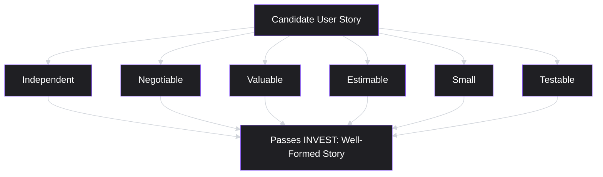
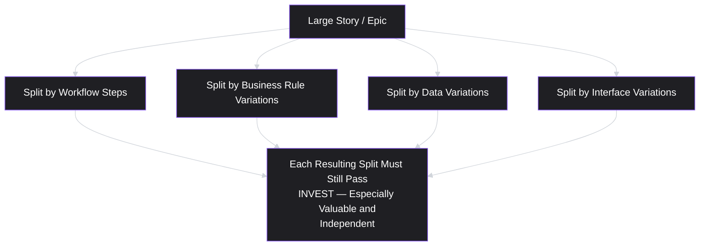
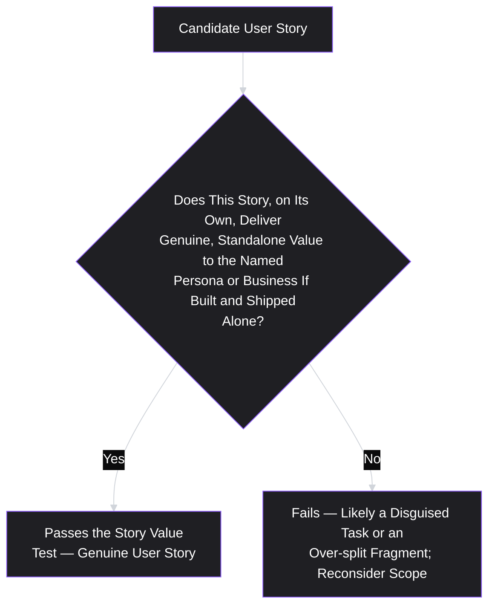

# Lesson 23: User Stories

## Why This Lesson Matters

Lesson 22 ended with a well-formed PRD — problem-first, appropriately precise, genuinely collaborative. But a PRD describes a solution at the level of an entire feature or initiative; it does not, by itself, tell an engineering team what to build this week, or how to sequence work across a sprint. This lesson covers the artifact that closes that final gap: the **user story**, a small, specific unit of functionality described from the perspective of the person who benefits from it, sized to be independently implementable, testable, and deliverable within a short time frame.

A user story's format is famously simple — "As a [role], I want [capability], so that [benefit]" — deceptively so, because the format itself is not the hard part. The hard part, and this lesson's real subject, is *splitting* a larger scoped solution (an MVP, a PRD's functional requirements) into stories that are each genuinely independent, genuinely valuable on their own, and genuinely small enough to build and verify quickly — without splitting so finely that individual stories lose all standalone meaning, or so coarsely that a single story becomes an unmanageable, multi-week undertaking in disguise.

---

## Learning Path

| Field | Detail |
|---|---|
| **Module** | 3 — Product Design |
| **Current Lesson** | 23 of 90 |
| **Difficulty** | 3 / 10 |
| **Estimated Study Time** | 25 minutes (reading) + 15 minutes (reflection + quiz) |
| **Prerequisites** | Lesson 21 (MVP), Lesson 22 (Product Requirements Document) |
| **Next Lesson** | Lesson 24 — Acceptance Criteria |
| **Future Topics Unlocked** | Lesson 24 (Acceptance Criteria — completing a user story's definition of done), Lesson 34 (Sprint Planning & Backlog Grooming) |

---

## Learning Objectives

By the end of this lesson, you will be able to:

1. Write a user story using the standard format, and explain why each of its three clauses matters.
2. Apply the INVEST criteria to evaluate whether a candidate user story is well-formed.
3. Apply at least three specific story-splitting techniques to break a large story ("epic") into smaller, independently valuable stories.
4. Identify the "story as a disguised task" failure pattern and distinguish a genuine user story from a technical task wearing story-format grammar.
5. Distinguish appropriate story granularity from over-splitting, and explain the risks of each extreme.

---

## Prerequisites

Lesson 21 (MVP) and Lesson 22 (Product Requirements Document). This lesson assumes you can scope a minimal solution and write a clear functional requirement — a user story is the unit that breaks a PRD's requirements down into concretely sequenceable, implementable, and testable pieces of work.

---

## Theory

### The Standard Format and Why Each Clause Matters

The canonical user story format is: **"As a [role/persona], I want [capability], so that [benefit]."** Each clause serves a specific, deliberate purpose:

- **"As a [role]"** ties the story back to a specific persona (Lesson 14) or user type, preventing the same undifferentiated "the user" language this curriculum has repeatedly warned against.
- **"I want [capability]"** states the specific functionality being requested, at a level of granularity appropriate for a single, small unit of work.
- **"So that [benefit]"** states the underlying value or job (Lesson 6) the capability serves — and this clause is frequently the most important, and most frequently omitted or treated as an afterthought, because it is what allows anyone reading the story (not just the person who wrote it) to judge whether an implementation choice actually serves the intended purpose.

A story missing the "so that" clause loses exactly the connective tissue that lets an engineer make good judgment calls on ambiguous implementation details — recall Lesson 22's Precision Dial: a well-specified "so that" clause is often what allows a PM to appropriately under-specify the "how," because the underlying reason gives the implementer enough context to make a sound decision independently.

### The INVEST Criteria

A widely used, practical checklist for evaluating whether a candidate user story is well-formed is the **INVEST** acronym:

- **Independent**: the story can be built and delivered without being blocked by, or tightly coupled to, other stories.
- **Negotiable**: the story describes a need, not a rigid, final specification — the specific implementation remains open for discussion between the team members involved (directly echoing Lesson 22's Precision Dial).
- **Valuable**: the story delivers genuine value to the named persona or the business, not merely a technical intermediate step (directly connecting to the next section's core distinction).
- **Estimable**: the team can reasonably estimate the effort required to complete it, which requires the story to be specific and bounded enough to reason about.
- **Small**: the story is sized to be completed within a short time frame (often within a single sprint, sometimes within a few days), not a multi-week undertaking in disguise.
- **Testable**: there is a clear, verifiable way to determine whether the story has actually been completed (a concept extended fully in Lesson 24's acceptance criteria).

A story failing any single INVEST criterion is not necessarily useless, but should prompt specific attention: a story that isn't independent may need resequencing or restructuring; a story that isn't valuable may actually be a disguised technical task (see below); a story that isn't small may need splitting, which is the primary technique this lesson covers next.

### Story-Splitting Techniques

The central practical skill in this lesson is **splitting** a large story (sometimes called an "epic" once it's clearly too large to be a single INVEST-compliant story) into smaller stories that each remain independently valuable. Several widely used techniques:

- **Split by workflow steps**: if a capability involves a multi-step process, each step can sometimes become its own valuable story — for example, splitting "As a user, I want to book and pay for an appointment" into "As a user, I want to book an appointment" and "As a user, I want to pay for a booked appointment," provided each step delivers standalone value on its own (which should be checked, not assumed).
- **Split by business rule variations**: if a capability has multiple variants or edge cases (different payment methods, different user permission levels), the core, most common case can become its own story, with variants split into subsequent stories — directly echoing Lesson 21's MVP discipline of testing the riskiest, most essential version first.
- **Split by data variations**: if a capability must handle multiple types of input or data, the most common or simplest type can become its own story first, with additional types added incrementally.
- **Split by interface variations**: if a capability needs to work across multiple platforms or interfaces (web, mobile, API), the primary platform can become its own story, with others following.

Crucially, every split must be checked against the INVEST criteria afterward, particularly **Valuable** and **Independent** — a mechanical split that produces a piece with no standalone value (for example, splitting a login flow into "build the username field" and "build the password field" as separate stories) has produced fragments, not genuine stories, echoing Lesson 21's car-wheel failure at the level of individual units of work rather than an entire MVP.

### The "Story as a Disguised Task" Failure Pattern

A specific, common failure — closely related to Lesson 17's disguised-solution problem and Lesson 21's car-wheel failure — is writing something in user-story grammar ("As a [role], I want...") that is actually a technical task with no standalone value to the named persona, rather than a genuine, valuable capability. "As a developer, I want to refactor the authentication module" is grammatically a story, but names no benefit to an actual product user, and would fail the INVEST "Valuable" criterion when evaluated honestly against the persona it claims to serve.

This does not mean technical work (refactoring, infrastructure improvements, technical debt reduction — covered further in Lesson 39) is illegitimate or unimportant; it means such work should generally be tracked and communicated using language appropriate to what it actually is — a technical task, not a user story — rather than forced into story-format grammar that implies a standalone value to an end user that isn't actually present. Mislabeling technical tasks as user stories obscures the genuine distinction between value-delivering and infrastructure-supporting work, making it harder to have honest conversations about the trade-off between the two during planning and prioritization.

---

## Common Beginner Mistakes

**Mistake 1: Omitting or treating the "so that" clause as an afterthought**

This clause provides the connective context that allows implementers to make good independent judgment calls on ambiguous details — omitting it removes exactly the information that would otherwise let a PM appropriately avoid over-specifying the "how."

**Mistake 2: Splitting a story mechanically without checking the result against INVEST, especially "Valuable" and "Independent."**

A split that produces fragments with no standalone value (echoing Lesson 21's car-wheel failure) has not actually produced genuine, smaller user stories — merely smaller, disconnected pieces of a larger plan.

**Mistake 3: Writing technical tasks in user-story grammar without genuine standalone value to the named persona**

"As a developer, I want to refactor X" is grammatically a story but fails the "Valuable" INVEST criterion when evaluated honestly — such work should be tracked and communicated as what it actually is.

**Mistake 4: Leaving a story too large ("Small" INVEST failure) because splitting feels like unnecessary overhead**

A story that takes multiple weeks to complete is difficult to estimate accurately, difficult to prioritize meaningfully against other work, and delays the delivery of standalone value that a properly split version would have delivered incrementally.

**Mistake 5: Over-splitting a story until individual pieces no longer deliver standalone value**

Splitting too finely — down to the level of individual UI elements or database fields — produces exactly the same "fragments without standalone value" problem as mechanical, uncritical splitting, just from the opposite direction.

---

## Mental Model: The Story Value Test

This lesson's mental model is the **Story Value Test** — a quick check applied to any candidate user story, whether freshly written or the result of a split, before it's added to a backlog.

Apply this test to every candidate story: if it were the only thing shipped this sprint, with nothing else, would the named persona (or the business) genuinely be better off? If the honest answer is no — if the story only matters in combination with several other, not-yet-built pieces — the story has likely been split too finely, or was never a genuine story (a task in disguise) to begin with.

---

## Real Company Example

**GitLab** offers a more directly documented illustration of the INVEST discipline than a general "squads ship small increments" gesture, because the company's engineering handbook is public. GitLab names "Iteration" as one of its core values, defined explicitly as doing the smallest useful thing and getting it shipped — the handbook instructs engineers to actively look for ways to split a large merge request into smaller, independently reviewable, independently valuable pieces, and even runs automated tooling that flags merge requests judged too large. The handbook is explicit that horizontal slicing (splitting by technical layer — frontend, backend, database) is often the wrong way to split work, echoing this lesson's INVEST emphasis on each split piece remaining independently *valuable*, not just independently small.

This is useful because it makes visible what "the story-splitting discipline" actually costs in practice: GitLab's own material acknowledges engineers must proactively flag scope-cutting opportunities to product management throughout planning and development, not just during a single up-front splitting exercise — splitting well is an ongoing discipline, not a one-time step.

*(Source: GitLab's own public engineering handbook, which is exceptional among large companies for being openly published rather than reconstructed from secondhand reporting.)*

---

## Real World Perspective: User Stories at Different Company Stages

**At a startup:**
User stories are often written informally and quickly, sometimes without strict adherence to the full "as a/I want/so that" format, given close daily collaboration and shared context among a small team — the INVEST criteria remain useful as an informal mental checklist even when the formal grammar isn't rigidly applied, particularly the "Valuable" and "Small" criteria, since startups especially benefit from shipping small, validated increments quickly.

**At a mid-size company:**
User stories typically become a more standardized artifact within a formal backlog and sprint-planning process (previewed further in Lesson 34), and story-splitting technique becomes an increasingly valuable, deliberately taught skill as the volume and complexity of work grows beyond what informal, close collaboration alone can manage.

**At Big Tech:**
User stories at scale often need to account for cross-team dependencies and platform variations (web, mobile, multiple regions) more explicitly, making the "Independent" INVEST criterion both more important and more genuinely difficult to satisfy — a significant part of experienced product and engineering leadership's planning work involves deliberately sequencing and structuring stories to minimize cross-team blocking dependencies, given the scale and organizational complexity involved.

---

## Detailed Case Study: The Epic That Never Shipped

Consider a simplified, illustrative scenario common across B2B software teams.

A team is delivering a scoped MVP (per Lesson 21) for a new expense-approval workflow, following a well-formed PRD (per Lesson 22). The team writes a single user story: "As a finance manager, I want a complete expense-approval workflow, so that I can review and approve team expenses efficiently." This single story is estimated at approximately six weeks of combined engineering effort — far beyond the "Small" INVEST criterion — but the team proceeds anyway, reasoning that the workflow "doesn't make sense to split, since it's all one connected process."

Over the following six weeks, no functionality reaches real users at all, since the single large story remains in progress the entire time. Partway through, a change in company expense-reporting policy (an external event unrelated to the team's own planning) makes one specific piece of the originally planned workflow — multi-level approval chains for expenses above a certain threshold — unnecessary for the foreseeable future. Because the team never split the work into independently valuable pieces, this now-unnecessary piece cannot simply be dropped from the current release without re-estimating and restructuring nearly the entire remaining engineering effort, since the single large story had been implemented as one tightly interwoven unit of work rather than several independent stories.

**What went wrong?**

Applying this lesson's frameworks:

1. **The story clearly failed the "Small" INVEST criterion**, and the team's reasoning that "it doesn't make sense to split" was never actually tested against the specific story-splitting techniques this lesson describes — a workflow-step split (separating basic single-level approval from more complex multi-level approval chains, for instance) would very likely have produced genuinely valuable, independent pieces.
2. **No standalone value reached real users for six full weeks**, meaning the team had no opportunity to gather real usage feedback, catch implementation issues early, or adjust based on genuine learning during that period — echoing this module's broader emphasis on continuous, incremental validation rather than large, delayed releases.
3. **The external policy change exposed the specific cost of failing to split**: had the multi-level approval chain functionality been its own independent story (via a business-rule-variation split), it could have simply been deprioritized or dropped without disrupting the rest of the already-in-progress work, rather than requiring a disruptive mid-project re-scoping effort.

A team applying this lesson's discipline from the outset would have applied at least a workflow-step or business-rule-variation split to the original epic — likely producing a first story for basic, single-level expense approval (immediately valuable and shippable on its own), with multi-level approval chains, notification preferences, and other variants as separate, subsequent stories — allowing continuous, incremental delivery of value and far greater resilience to the kind of external change that occurred partway through the case study's six-week effort.

This case connects directly back to **Lesson 21's skateboard-versus-car analogy**: the single, unsplit six-week story is precisely a car-wheel-style undertaking — a large, tightly coupled piece of a bigger plan that delivers no independent value until the entire thing is finished — while a properly split set of stories would have delivered a series of "skateboards," each valuable and shippable on its own.

---

## Framework Explanation: The Story-Splitting Decision Table

A practical table for choosing which splitting technique to apply to a candidate epic:

| If the Epic Involves... | Consider This Split | Watch For |
|---|---|---|
| A multi-step process (e.g., book, then pay) | Split by workflow steps | Confirm each step genuinely delivers standalone value alone, not just as a fragment of the full process |
| Multiple variants or edge cases (e.g., different user permission levels) | Split by business rule variations | Start with the most common, essential case first (echoing Lesson 21's riskiest-assumption discipline) |
| Multiple types of input or data | Split by data variations | Ensure the simplest data type handled first still represents a meaningful, real use case, not a trivial or unrealistic one |
| Multiple platforms or interfaces | Split by interface variations | Confirm the primary platform chosen first is genuinely the one that matters most for the current validated opportunity |

The consistent discipline across this table: **whichever technique is used, every resulting story must be re-checked against the full INVEST criteria afterward** — a mechanically applied split is not automatically a well-formed story; it is a candidate that still requires verification.

---

## Interview Perspective: How Interviewers Think About This

**Typical question 1: "How do you split a large feature into smaller user stories?"**
*What the interviewer is actually evaluating:* Whether the candidate names specific, concrete splitting techniques (workflow steps, business rule variations, data variations, interface variations) rather than a vague intention to "break it down," and whether they mention checking the result against INVEST afterward.

**Typical question 2: "Tell me about a user story that turned out to be much bigger than expected. How did you handle it?"**
*What the interviewer is actually evaluating:* Direct experience recognizing an INVEST "Small" failure mid-project and applying a genuine splitting technique to recover, rather than either pushing through an oversized story (echoing this lesson's Detailed Case Study) or abandoning the work entirely.

**Typical question 3: "How do you decide whether something belongs in the backlog as a user story or as a technical task?"**
*What the interviewer is actually evaluating:* Fluency with the "story as disguised task" distinction — whether the candidate can articulate that a genuine story must deliver standalone value to a named persona, while acknowledging that legitimate technical work still deserves honest tracking, just not story-format grammar that implies value it doesn't have.

---

## Summary

A user story ("As a [role], I want [capability], so that [benefit]") breaks a larger scoped solution down into a small, specific, independently valuable, testable unit of work, with the "so that" clause providing crucial context that lets implementers make sound judgment calls on details a PM should appropriately leave open. The INVEST criteria (Independent, Negotiable, Valuable, Estimable, Small, Testable) provide a practical checklist for evaluating whether a candidate story is well-formed, and specific splitting techniques (by workflow steps, business rule variations, data variations, or interface variations) break oversized epics into smaller stories — provided every resulting split is re-checked against INVEST, particularly "Valuable" and "Independent," to avoid producing valueless fragments. The "story as a disguised task" failure pattern describes writing technical work in story-format grammar without genuine standalone value to a named persona, which should instead be tracked honestly as what it is. Finally, appropriate granularity sits between an oversized story (delaying value delivery and resisting change, as shown in this lesson's Detailed Case Study) and over-splitting (producing fragments with no standalone value, echoing Lesson 21's car-wheel failure).

---

## Key Takeaways

- The user story format's three clauses each matter: "as a [role]" ties to a specific persona, "I want [capability]" states the specific ask, and "so that [benefit]" provides context that enables appropriate under-specification of implementation details.
- INVEST (Independent, Negotiable, Valuable, Estimable, Small, Testable) is the practical checklist for evaluating whether a candidate story is well-formed.
- Story-splitting techniques (workflow steps, business rule variations, data variations, interface variations) break oversized epics into smaller, more manageable pieces.
- Every split must be re-checked against INVEST, especially "Valuable" and "Independent" — mechanical splitting can produce valueless fragments just as easily as genuine, independently valuable stories.
- "Story as a disguised task" describes technical work written in story-format grammar without genuine standalone value to a named persona — such work should be tracked honestly as a technical task instead.
- An oversized, unsplit story delays value delivery, resists incorporating new learning or change, and makes accurate estimation difficult.
- Over-splitting produces fragments with no standalone value, echoing Lesson 21's car-wheel failure at the level of individual units of work.

---

## Cheat Sheet

*A two-minute review of everything in this lesson.*

- **Format:** "As a [role], I want [capability], so that [benefit]." Don't skip the "so that" clause.
- **INVEST:** Independent, Negotiable, Valuable, Estimable, Small, Testable.
- **Splitting techniques:** workflow steps, business rule variations, data variations, interface variations.
- **Always re-check splits against INVEST** — especially Valuable and Independent — mechanical splitting can produce valueless fragments.
- **"Story as disguised task"** — technical work in story grammar with no standalone user value; track it honestly instead.
- **Story Value Test:** if this were the only thing shipped, would the named persona genuinely be better off?

---

## Glossary

| Term | Definition | Related Concepts | Difficulty |
|---|---|---|---|
| User Story | A small, specific unit of functionality described as "As a [role], I want [capability], so that [benefit]." | Persona (Lesson 14), Acceptance Criteria (Lesson 24) | 1 |
| INVEST Criteria | A checklist (Independent, Negotiable, Valuable, Estimable, Small, Testable) for evaluating whether a user story is well-formed. | Story-Splitting | 2 |
| Story-Splitting | The practice of breaking a large story ("epic") into smaller, independently valuable stories, using techniques like workflow-step or business-rule-variation splits. | INVEST Criteria | 2 |
| "Story as a Disguised Task" (Failure Pattern) | Writing technical work in user-story grammar without genuine standalone value to a named persona. | Disguised Solution (Lesson 17) | 2 |
| Story Value Test | A quick check asking whether a candidate story, if shipped alone, would genuinely benefit the named persona or business. | INVEST Criteria | 2 |

---

## Further Reading / Resources

- Mike Cohn, *User Stories Applied* — the foundational, widely referenced source for the user story format and the INVEST criteria discussed in this lesson.
- Bill Wake's original writing introducing the INVEST acronym, directly referenced throughout this lesson's Theory section.
- Richard Lawrence's publicly available guides on story-splitting patterns, closely related to the specific techniques covered in this lesson's Framework Explanation.

---

## Flashcards

**Card 1**
- Front: What is the standard user story format, and why does the "so that" clause matter?
- Back: "As a [role], I want [capability], so that [benefit]." The "so that" clause provides context that lets implementers make sound independent judgment calls on ambiguous details, enabling appropriate under-specification of the "how."
- Difficulty: 1
- Tags: user-story-format

**Card 2**
- Front: What does each letter in INVEST stand for?
- Back: Independent, Negotiable, Valuable, Estimable, Small, Testable.
- Difficulty: 2
- Tags: invest-criteria

**Card 3**
- Front: Name four story-splitting techniques covered in this lesson.
- Back: Split by workflow steps, split by business rule variations, split by data variations, split by interface variations.
- Difficulty: 2
- Tags: story-splitting-techniques

**Card 4**
- Front: Why must every split be re-checked against INVEST, especially "Valuable" and "Independent"?
- Back: Mechanical splitting can produce fragments with no standalone value, just as easily as genuine, independently valuable smaller stories — the split itself doesn't guarantee a good result.
- Difficulty: 2
- Tags: re-checking-splits

**Card 5**
- Front: What is the "story as a disguised task" failure pattern?
- Back: Writing technical work (like a refactor) in user-story grammar without genuine standalone value to a named persona — such work fails the "Valuable" INVEST criterion and should be tracked honestly as a technical task instead.
- Difficulty: 2
- Tags: disguised-task

**Card 6**
- Front: What is the Story Value Test?
- Back: A check asking: if this story were the only thing shipped this sprint, would the named persona or business genuinely be better off? If no, the story has likely been over-split or was never a genuine story.
- Difficulty: 2
- Tags: story-value-test

**Card 7**
- Front: In the Detailed Case Study, what was the specific cost of leaving the expense-approval epic unsplit?
- Back: No functionality reached real users for six weeks, and when an external policy change made part of the workflow unnecessary, the team couldn't simply drop that piece without disrupting nearly the entire in-progress effort, since it had been built as one tightly interwoven unit rather than independent stories.
- Difficulty: 3
- Tags: case-study

## Reflection Exercise

You are the PM for a fitness app, and your team has a scoped MVP epic: "As a user, I want to create and follow a custom workout plan, so that I can track my progress toward a specific fitness goal."

Work through the following, in writing, before reading further:

1. Estimate whether this epic, as currently written, would likely pass the "Small" INVEST criterion, and explain your reasoning.
2. Apply at least two different story-splitting techniques (from this lesson's four) to break this epic into smaller candidate stories.
3. For each resulting candidate story, apply the Story Value Test: would a user genuinely be better off if only this specific story were shipped, with nothing else?
4. Identify one candidate story from your split that might actually be a "disguised task" rather than a genuine story, and explain how you would reframe or relocate it.
5. Propose a sensible sequencing for your final set of stories, explaining which one should be built first and why, referencing Lesson 21's riskiest-assumption discipline.

There is no single correct answer. The purpose of this exercise is to practice applying genuine story-splitting technique and the INVEST/Story Value Test checks, rather than either leaving an epic oversized or over-splitting it into valueless fragments.

---

## Quiz

**1. What is the standard format for a user story, according to this lesson?**
A) "The system shall [requirement]."
B) "As a [role], I want [capability], so that [benefit]."
C) "Given [context], when [action], then [result]."
D) "The team will build [feature] by [date]."

*Correct answer: B*
*Explanation: This is the lesson's explicit standard format, distinct from a formal requirements statement, an acceptance-criteria format (covered in Lesson 24), or a project timeline statement.*
*Learning objective tested: #1*
*Difficulty: Easy*

---

**2. Why does this lesson emphasize the importance of the "so that" clause in a user story?**
A) Because it is the only clause required for a story to be valid
B) Because it provides context that allows implementers to make sound, independent judgment calls on ambiguous implementation details
C) Because it must always be longer than the "I want" clause
D) Because it is the only clause engineering teams are permitted to read

*Correct answer: B*
*Explanation: The lesson explains that the "so that" clause supplies the underlying reason, which lets implementers fill in ambiguous details appropriately, directly connecting to Lesson 22's Precision Dial.*
*Learning objective tested: #1*
*Difficulty: Easy*

---

**3. What does the "I" in INVEST stand for?**
A) Interesting
B) Independent
C) Iterative
D) Integrated

*Correct answer: B*
*Explanation: INVEST stands for Independent, Negotiable, Valuable, Estimable, Small, and Testable — "Independent" is the correct expansion of the first letter.*
*Learning objective tested: #2*
*Difficulty: Easy*

---

**4. Which of the following user stories most clearly fails the "Valuable" INVEST criterion, as described in this lesson?**
A) "As a customer, I want to receive an email confirmation after checkout, so that I know my order was successful."
B) "As a developer, I want to refactor the payment module's internal code structure."
C) "As a user, I want to filter search results by price, so that I can find products within my budget."
D) "As an admin, I want to export a report as a CSV file, so that I can analyze it in a spreadsheet."

*Correct answer: B*
*Explanation: This item names no benefit to an actual product user or persona — it is a technical task written in story-format grammar, failing the "Valuable" criterion as this lesson defines it.*
*Learning objective tested: #4*
*Difficulty: Easy*

---

**5. Which story-splitting technique would be most appropriate for an epic involving a multi-step booking-and-payment process?**
A) Split by interface variations
B) Split by workflow steps
C) Split by data variations
D) No splitting technique is appropriate for multi-step processes

*Correct answer: B*
*Explanation: A multi-step process is the specific scenario this lesson identifies as well-suited to a workflow-step split, provided each resulting step still delivers standalone value.*
*Learning objective tested: #3*
*Difficulty: Easy*

---

**6. Why must every story-splitting result be re-checked against the INVEST criteria, according to this lesson?**
A) Because splitting always produces perfectly formed stories automatically
B) Because mechanical splitting can produce fragments with no standalone value, just as easily as genuine, independently valuable stories
C) Because INVEST only applies to unsplit epics, not split stories
D) Because re-checking is only necessary for stories split by data variations

*Correct answer: B*
*Explanation: The lesson explicitly warns that splitting alone doesn't guarantee well-formed stories — the result must still be verified, particularly against "Valuable" and "Independent."*
*Learning objective tested: #3, #4*
*Difficulty: Easy*

---

**7. In the Detailed Case Study, what specific INVEST criterion did the original, unsplit expense-approval story clearly fail?**
A) Testable
B) Small
C) Negotiable
D) Independent

*Correct answer: B*
*Explanation: The six-week estimated story clearly failed the "Small" criterion, which the lesson explicitly identifies as the core issue the team failed to address.*
*Learning objective tested: #2*
*Difficulty: Medium*

---

**8. What specific consequence resulted from the team's failure to split the expense-approval epic before an external policy change occurred?**
A) The team was able to easily drop the now-unnecessary multi-level approval functionality without disruption
B) The now-unnecessary functionality couldn't be dropped without re-estimating and restructuring nearly the entire remaining engineering effort, since it had been built as one tightly interwoven unit
C) The policy change had no effect on the project at all
D) The team was able to ship the entire epic ahead of schedule despite the policy change

*Correct answer: B*
*Explanation: The case study explicitly attributes this specific difficulty to the unsplit, tightly interwoven nature of the single large story, in contrast to how a properly split set of stories would have handled the same external change.*
*Learning objective tested: #2, #3*
*Difficulty: Medium*

---

**9. (Scenario) A team splits a login feature into two separate stories: "build the username input field" and "build the password input field." According to this lesson, what is the likely problem with this split?**
A) This is an excellent, well-formed split with no issues
B) Neither resulting piece likely delivers standalone value on its own — a user cannot meaningfully log in with only a username field or only a password field — representing an over-split producing valueless fragments
C) This split correctly follows the "split by interface variations" technique
D) This split should have been done by data variations instead

*Correct answer: B*
*Explanation: This is a clear example of over-splitting — neither fragment provides standalone value to a user, echoing Lesson 21's car-wheel failure pattern at the level of individual stories.*
*Learning objective tested: #5*
*Difficulty: Medium-Hard*

---

**10. (Product Thinking) A team has a story: "As a user, I want to see all products, filter by category, filter by price, and sort by rating, so that I can find what I need." According to this lesson, what is the most likely issue, and how should it be addressed?**
A) This story is appropriately sized and requires no further action
B) This story likely combines multiple distinct capabilities that should be split (e.g., by business rule/feature variation) into separate stories — basic product viewing, category filtering, price filtering, and sorting — each checked against INVEST individually
C) This story should be discarded entirely, since filtering and sorting are never valuable features
D) This story should be rewritten entirely in technical task format, since it involves multiple database queries

*Correct answer: B*
*Explanation: This story bundles multiple distinct, likely independently valuable capabilities together, making it a strong candidate for splitting into separate, INVEST-compliant stories rather than being built or estimated as one large unit.*
*Learning objective tested: #3*
*Difficulty: Medium-Hard*

---

**11. (Interview Reasoning) A candidate describes routinely writing technical infrastructure work (e.g., "As a developer, I want to migrate our database to a new server") in user-story format alongside genuine, persona-valuable stories in the same backlog, without distinction. What might this signal, based on this lesson's Interview Perspective section?**
A) Excellent backlog management practice with no meaningful concerns
B) A likely instance of the "story as a disguised task" failure pattern, obscuring the genuine distinction between value-delivering and infrastructure-supporting work
C) That the candidate has extensive technical expertise that should be considered a core strength
D) Nothing meaningful, since all backlog items should always use identical formatting regardless of their nature

*Correct answer: B*
*Explanation: This reflects the lesson's explicit warning about mislabeling technical tasks as user stories, which obscures honest conversations about the trade-off between value-delivering work and infrastructure-supporting work during planning.*
*Learning objective tested: #4*
*Difficulty: Hard*

---

**12. (Product Thinking, Higher Difficulty) A team splits an epic by business rule variations, producing a first story for the most common case and several subsequent stories for edge cases and variants. How does this practice connect to Lesson 21's MVP discipline?**
A) It has no connection to MVP scoping principles
B) It directly echoes Lesson 21's riskiest-assumption discipline — building and testing the most essential, common case first, before investing in less critical variants, mirrors scoping an MVP around what's necessary to test first
C) Business rule variation splits should always be built in reverse order, starting with the rarest edge case
D) This technique is only applicable to fully mature, post-MVP products, never to initial MVP scoping

*Correct answer: B*
*Explanation: Prioritizing the most common, essential case first when splitting by business rule variations directly parallels Lesson 21's discipline of testing the riskiest, most essential assumption before investing in less critical variants or polish.*
*Learning objective tested: #3*
*Difficulty: Medium-Hard*

---

**13. (Interview Reasoning, Higher Difficulty) An interviewer describes a story that passes "Independent," "Negotiable," "Estimable," "Small," and "Testable," but the team is unsure whether it satisfies "Valuable." What is the strongest diagnostic question a candidate should ask, based on this lesson's Story Value Test?**
A) "How long will this story take to estimate accurately?"
B) "If this story were the only thing shipped this sprint, with nothing else, would the named persona or business genuinely be better off?"
C) "Is this story written in the correct grammatical format?"
D) "Has this story been assigned to a specific engineer yet?"

*Correct answer: B*
*Explanation: This is the exact question posed by the Story Value Test, specifically designed to evaluate the "Valuable" criterion when it's in doubt.*
*Learning objective tested: #4, #5*
*Difficulty: Hard*

---

**14. (Product Thinking, Higher Difficulty) A team has an oversized story and considers two options: leaving it unsplit but committing extra sprint time to it, or applying a data-variation split that would produce a first story handling only the single most common input type, with additional types added later. According to this lesson, which option is generally preferable, and why?**
A) Leaving it unsplit, since splitting always introduces unnecessary complexity
B) Applying the data-variation split, since it allows incremental delivery of standalone value and greater flexibility if priorities or circumstances change mid-project, as shown in the Detailed Case Study
C) Both options are equally preferable in all circumstances
D) Neither option is appropriate; the story should be discarded entirely

*Correct answer: B*
*Explanation: This reflects the lesson's core argument, reinforced by the Detailed Case Study — splitting enables incremental value delivery and resilience to changing circumstances, which an oversized, unsplit story cannot provide.*
*Learning objective tested: #3*
*Difficulty: Hard*

---

**15. (Highest Difficulty) A team applies a workflow-step split to a large epic, producing what appear to be several INVEST-compliant stories. Midway through implementation, however, engineering discovers that two of the "independent" stories actually share a tightly coupled underlying data model, such that changes to one frequently require rework in the other. What does this reveal about the team's original splitting process, and what should they do differently going forward?**
A) Nothing went wrong; this level of coupling is unavoidable and expected in all split stories
B) The "Independent" INVEST criterion was not actually satisfied for these two stories, despite initially appearing well-split — the team should recognize that a workflow-step split does not automatically guarantee technical independence, and should more explicitly verify independence (potentially in consultation with engineering) before finalizing a split as INVEST-compliant
C) The stories should be immediately merged back into a single, unsplit epic and never split again
D) This coupling issue is irrelevant to the INVEST criteria and does not need to be addressed

*Correct answer: B*
*Explanation: This tests a subtler point — a split that appears reasonable at the story-description level can still fail "Independent" at the technical implementation level, and genuine verification (ideally with engineering's input, given their visibility into underlying technical coupling) is needed beyond simply applying a splitting technique and assuming independence follows automatically.*
*Learning objective tested: #2, #3*
*Difficulty: Hard*

---

## Connections

| | Lesson | Core Idea Carried Forward |
|---|---|---|
| **Previous Lesson** | Lesson 22 — Product Requirements Document (PRD) | Provides the functional requirements that user stories break down into small, implementable units of work |
| **Current Lesson** | Lesson 23 — User Stories | The story format and "so that" clause; INVEST criteria; story-splitting techniques; the disguised-task failure pattern |
| **Next Lesson** | Lesson 24 — Acceptance Criteria | Formalizes the "Testable" INVEST criterion into specific, verifiable conditions for each user story |
| **Future Concepts Unlocked** | Lesson 34 (Sprint Planning & Backlog Grooming) | Uses well-formed, appropriately sized user stories as the fundamental unit of sprint planning and estimation |

This curriculum is designed to be read as one continuous argument. From this lesson forward, any reference to a "story" or "backlog item" assumes the INVEST criteria and genuine story-splitting discipline covered here — this will not be re-explained, only re-applied.
