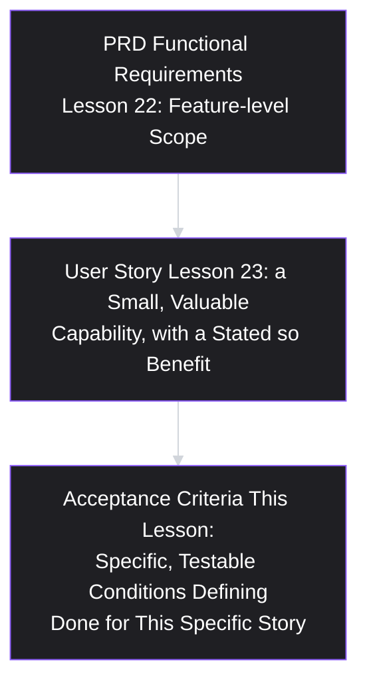
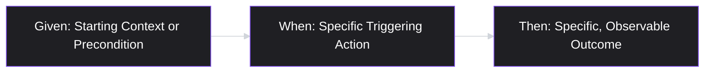
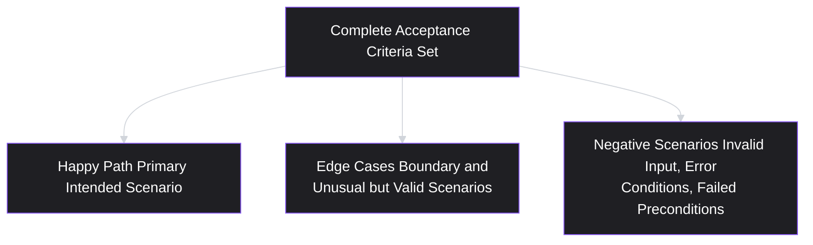
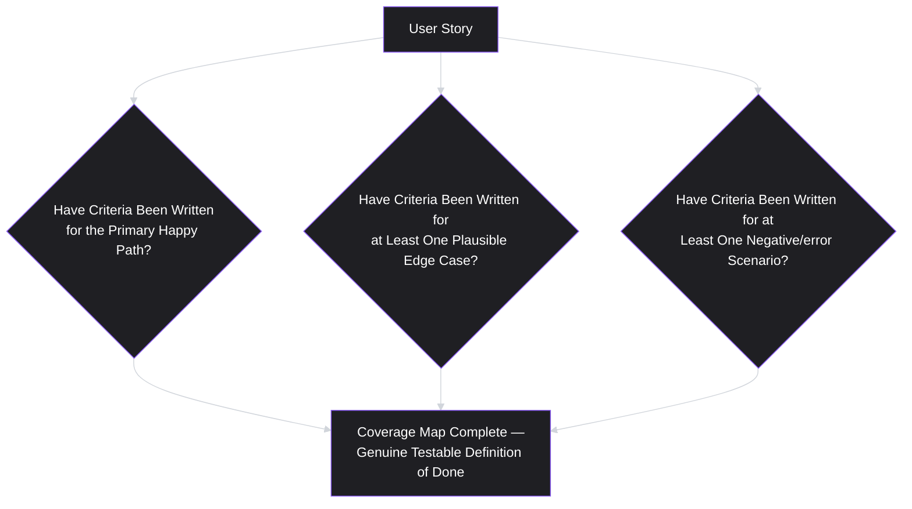

# Lesson 24: Acceptance Criteria

## Why This Lesson Matters

Lesson 23 ended with the INVEST criteria, and one letter in particular deserves a lesson of its own: **Testable**. A user story can pass every other INVEST check — independent, negotiable, valuable, estimable, small — and still leave open a question that causes real damage during a project: how does anyone actually know when it's done? Without an explicit answer, "done" quietly becomes whatever the engineer who built it believes is done, which may or may not match what the PM who wrote the story had in mind, which may or may not match what QA expects to verify, which may or may not match what the actual user experiences.

**Acceptance criteria** are the specific, testable conditions that define when a user story is genuinely complete — a checklist, written before implementation begins, that removes ambiguity about what "done" means and gives everyone involved (engineering, QA, design, and the PM) a shared, verifiable standard to build and test against. This lesson treats acceptance criteria not as bureaucratic overhead added on top of a user story, but as the mechanism that actually makes a story testable in more than name — closing the loop that Lesson 23 opened but didn't fully resolve.

---

## Learning Path

| Field | Detail |
|---|---|
| **Module** | 3 — Product Design |
| **Current Lesson** | 24 of 90 |
| **Difficulty** | 3 / 10 |
| **Estimated Study Time** | 25 minutes (reading) + 15 minutes (reflection + quiz) |
| **Prerequisites** | Lesson 17 (Problem Statements), Lesson 23 (User Stories) |
| **Next Lesson** | Lesson 25 — Wireframing |
| **Future Topics Unlocked** | Lesson 25 (Wireframing — visualizing what acceptance criteria describe), Lesson 34 (Sprint Planning & Backlog Grooming) |

---

## Learning Objectives

By the end of this lesson, you will be able to:

1. Define acceptance criteria and distinguish them from a user story's "so that" clause and from a full PRD's functional requirements.
2. Apply the Given/When/Then (Gherkin) format for writing structured, testable acceptance criteria.
3. Distinguish acceptance criteria covering the happy path from those covering edge cases and negative scenarios, and explain why both are necessary.
4. Identify the "acceptance criteria written after the fact" failure pattern and explain why criteria written post-implementation lose their primary value.
5. Apply a structured method for writing acceptance criteria that are specific and testable without over-specifying implementation details, extending Lesson 22's Precision Dial.

---

## Prerequisites

Lesson 17 (Problem Statements) and Lesson 23 (User Stories). This lesson assumes you can write a well-formed user story satisfying INVEST — acceptance criteria are the mechanism that operationalizes the "Testable" criterion specifically, turning a story's stated capability into a concrete, verifiable definition of done.

---

## Theory

### The Core Definition and Its Place Relative to Other Artifacts

Acceptance criteria are the specific, testable conditions a user story must satisfy to be considered complete. It's useful to place this artifact precisely relative to its neighbors, since confusion between them is common:

- A user story's **"so that" clause** (Lesson 23) states the underlying value or benefit — it explains *why* the capability matters, but doesn't specify exactly what conditions must hold for the capability to be considered correctly built.
- **Acceptance criteria** specify the exact, verifiable conditions that must be true for the story to be considered done — a concrete checklist derived from, and consistent with, the story's stated benefit.
- A **PRD's functional requirements** (Lesson 22) typically operate at a broader, feature-level scope, while acceptance criteria operate at the level of an individual, already-scoped user story.

Acceptance criteria written well should be traceable back to the story's "so that" clause: every criterion should plausibly serve the stated benefit, and any criterion that doesn't connect to that benefit is a candidate for Lesson 22's over-specification warning, now recurring at a more granular level.

### The Given/When/Then (Gherkin) Format

A widely used, structured format for writing acceptance criteria is **Given/When/Then** (sometimes called Gherkin syntax, from its origin in behavior-driven development practice):

> **Given** [a specific starting context or precondition], **When** [a specific action occurs], **Then** [a specific, observable outcome should result].

For example, for a story "As a user, I want to reset my password, so that I can regain access to my account if I forget it":

> Given a user has requested a password reset and received a reset link, When they click the link and submit a new password meeting the minimum complexity requirements, Then their password should be updated and they should be able to log in with the new password.

This format is valuable specifically because it forces explicitness about context (the "Given"), the specific triggering action (the "When"), and a specific, observable result (the "Then") — removing the ambiguity that a vaguer statement like "password reset should work correctly" would leave wide open to inconsistent interpretation, directly echoing Lesson 22's under-specification warning.

### Happy Path vs. Edge Cases and Negative Scenarios

Directly extending Lesson 15's "happy path only" warning to the level of acceptance criteria, a genuinely complete set of criteria must cover more than just the smoothest, most successful scenario. A well-rounded set of acceptance criteria for a given story should include:

- **The happy path**: the primary, most common scenario in which everything goes as intended.
- **Edge cases**: less common but plausible scenarios at the boundaries of expected behavior — an unusually long input, a boundary value, a rare but valid combination of conditions.
- **Negative scenarios**: cases where something goes wrong or a precondition isn't met — invalid input, an expired session, insufficient permissions — and what the system should do in response.

A story whose acceptance criteria only cover the happy path is vulnerable to precisely the same blind spot Lesson 15 warned about for journey maps: real users, in aggregate, will encounter edge cases and error conditions with some regularity, and a story that hasn't specified expected behavior for these scenarios leaves engineering and QA to guess — usually inconsistently — what should happen, discovering the gaps only when a real user hits one in production.

### The "Acceptance Criteria Written After the Fact" Failure Pattern

A specific, common failure — closely related to Lesson 8's discovery theater and Lesson 21's MVP theater patterns — is writing acceptance criteria only after a story has already been implemented, rather than before implementation begins. This inverts the entire purpose of the artifact: acceptance criteria's primary value is in forcing explicit, shared clarity about what "done" means *before* work starts, so that ambiguity is resolved through discussion rather than discovered through divergent interpretation during or after implementation.

When criteria are written retroactively, they tend to simply describe whatever was actually built, rather than genuinely testing whether the built solution correctly satisfies the story's intended benefit — a practice that provides the appearance of rigor (a checklist exists) without its substance (the checklist was never actually capable of catching a mismatch between intention and implementation, since it was written to match the implementation after the fact). This is functionally identical to Lesson 8's discovery theater concept: a test that could not, even in principle, have produced a disconfirming result is not really testing anything.

---

## Common Beginner Mistakes

**Mistake 1: Writing acceptance criteria that only cover the happy path**

This leaves edge cases and negative scenarios unspecified, echoing Lesson 15's "happy path only" warning at the level of individual story verification, and leads to inconsistent, discovered-too-late handling of real, plausible scenarios.

**Mistake 2: Writing vague criteria that don't specify a concrete, observable outcome**

"Password reset should work" is not an acceptance criterion in the useful sense this lesson intends — it fails to specify the given context, the triggering action, and the specific expected result with enough precision to be genuinely testable.

**Mistake 3: Over-specifying implementation details within acceptance criteria**

Just as Lesson 22 warned against over-specification in a PRD, acceptance criteria should specify observable behavior and outcomes, not dictate a specific technical implementation approach — the "Then" clause should describe what should be true, not how the system should internally achieve it.

**Mistake 4: Writing acceptance criteria after implementation is already complete**

This inverts the artifact's purpose, providing the appearance of a testable definition of done without the substance of having actually forced clarity before work began, echoing Lesson 8's discovery theater concept.

**Mistake 5: Treating acceptance criteria as replacing, rather than complementing, the story's "so that" clause**

Acceptance criteria specify the conditions for done, but the underlying benefit stated in "so that" remains important context for evaluating whether the criteria themselves are actually well-chosen and complete.

---

## Mental Model: The Acceptance Criteria Coverage Map

This lesson's mental model is the **Acceptance Criteria Coverage Map** — a simple discipline for checking that a story's criteria genuinely cover the happy path, edge cases, and negative scenarios, rather than only the most obvious scenario.

Before considering a story's acceptance criteria finished, explicitly check all three boxes: has the happy path been specified, has at least one meaningful edge case been considered, and has at least one negative or error scenario been addressed? A criteria set that only fills the first box has done only a third of the necessary work.

---

## Real Company Example

**Cucumber** and the broader behavior-driven development (BDD) community's widespread adoption of Given/When/Then syntax across the software industry is itself the clearest illustration of this lesson's core technique — the format has become common practice specifically because it forces the explicit precondition/action/outcome structure this lesson emphasizes, adopted by engineering and product teams across a wide range of companies (from small startups to large enterprises) precisely because ambiguous, prose-only acceptance criteria were found, repeatedly and across many different organizational contexts, to produce inconsistent implementation and testing outcomes.

- Given/When/Then syntax emerged from the BDD community as a structured way to write acceptance criteria that removes ambiguity about preconditions, actions, and expected outcomes.
- The format has been widely adopted across the software industry precisely because it forces explicit clarity before implementation begins.
- Widespread adoption across company sizes confirms that ambiguous, prose-only criteria consistently produce inconsistent implementation and testing results.

*(Assumption flagged: this reflects the widely documented, general adoption pattern of Given/When/Then and BDD practices across the software industry rather than a claim about any single company's specific, current internal process, which this curriculum does not claim certainty about.)*

---

## Real World Perspective: Acceptance Criteria at Different Company Stages

**At a startup:**
Acceptance criteria are often written more informally, sometimes as a brief bullet list rather than strict Given/When/Then syntax, given close collaboration and shared context among a small team — the core discipline (specifying concrete, testable outcomes before implementation, covering more than just the happy path) remains valuable even without rigid adherence to formal syntax.

**At a mid-size company:**
Acceptance criteria typically become a more standardized, expected part of every user story, often reviewed collaboratively by QA and engineering alongside the PM before implementation begins, precisely to catch ambiguous or incomplete criteria (missing edge cases, vague outcomes) before they become a source of divergent interpretation during a sprint.

**At Big Tech:**
Acceptance criteria at scale are often directly integrated into automated testing infrastructure, where Given/When/Then criteria can be translated fairly directly into automated test cases (a practice closely associated with behavior-driven development tooling), making rigorous, precise criteria writing not just a communication practice but a direct input into a company's automated quality assurance pipeline.

---

## Detailed Case Study: The Story That Passed QA But Failed Users

Consider a simplified, illustrative scenario common across e-commerce platforms.

A team implements a user story: "As a customer, I want to apply a discount code at checkout, so that I can receive a lower price on my order." The team writes a single acceptance criterion covering only the happy path: "Given a valid discount code, when the customer enters it at checkout, then the order total should be reduced by the correct discount amount." QA tests exactly this scenario, confirms it works correctly, and the story is marked complete and shipped.

Within the first week after launch, customer support receives a wave of complaints: some customers report entering an expired discount code and seeing no error message at all, simply having their order proceed at full price with no indication anything was wrong; others report that entering a code twice (accidentally double-clicking "apply") resulted in the discount being applied twice, producing an unexpectedly — and incorrectly — low order total.

**What went wrong?**

Applying this lesson's frameworks:

1. **The acceptance criteria covered only the happy path**, leaving negative scenarios (an expired or invalid code) and edge cases (double-application of the same code) entirely unspecified — precisely the Coverage Map gap this lesson warns about.
2. **QA tested exactly, and only, what the criteria specified.** This is not a QA failure in isolation — QA correctly verified the criteria as written — but a demonstration of why incomplete criteria produce incomplete testing: QA can only verify what has been explicitly specified as a condition of done.
3. **The gaps were discovered by real users in production, rather than caught before launch**, generating support burden and a poor customer experience precisely because the acceptance criteria never asked the question "what should happen when the code is invalid, expired, or applied more than once?"

A team applying this lesson's Coverage Map discipline from the outset would have written at least two additional criteria before implementation began: a negative scenario ("Given an expired discount code, when the customer attempts to apply it, then a clear error message should be displayed and the order total should remain unchanged") and an edge case ("Given a discount code has already been successfully applied to the current order, when the customer attempts to apply it again, then the system should prevent a second application and display an appropriate message") — very likely surfacing and resolving both issues before launch, at a small fraction of the cost of the subsequent support burden and customer frustration.

This case connects directly back to **Lesson 15's "happy path only" journey-mapping warning**: the same underlying blind spot — building and verifying only the smoothest, most successful scenario — recurs here at the level of individual story verification, with the same fundamental corrective: deliberately seek out and specify the messier, less convenient scenarios before they're discovered the hard way.

---

## Framework Explanation: The Acceptance Criteria Quality Checklist

A practical checklist for reviewing a draft set of acceptance criteria before implementation begins:

| Question | Purpose |
|---|---|
| Is each criterion written in a specific, testable format (e.g., Given/When/Then), with a concrete, observable outcome? | Prevents vague, unverifiable criteria |
| Does the set cover the happy path, at least one meaningful edge case, and at least one negative scenario? | Applies the Coverage Map, preventing the "happy path only" blind spot |
| Does each criterion specify observable behavior without dictating a specific technical implementation? | Applies Lesson 22's Precision Dial at the criteria level |
| Were these criteria written and reviewed before implementation began, rather than after? | Prevents the "written after the fact" failure pattern |
| Does each criterion plausibly serve the story's stated "so that" benefit? | Ensures criteria remain connected to genuine user value, not just technical correctness in isolation |

A set of acceptance criteria that fails several of these checks provides, at best, partial protection against the exact kind of production-discovered gap shown in this lesson's Detailed Case Study.

---

## Interview Perspective: How Interviewers Think About This

**Typical question 1: "How do you write acceptance criteria for a new user story?"**
*What the interviewer is actually evaluating:* Whether the candidate names a structured format (Given/When/Then) and explicitly mentions covering edge cases and negative scenarios, rather than describing a vague, happy-path-only, or purely intuitive process.

**Typical question 2: "Tell me about a bug or issue that reached production because acceptance criteria were incomplete."**
*What the interviewer is actually evaluating:* Direct experience recognizing a Coverage Map gap after the fact, and whether the candidate can articulate specifically what edge case or negative scenario was missed, echoing this lesson's Detailed Case Study, rather than attributing the issue vaguely to "a bug" without deeper diagnosis.

**Typical question 3: "When should acceptance criteria be written, relative to implementation?"**
*What the interviewer is actually evaluating:* Whether the candidate understands that criteria must be written and agreed upon before implementation begins to serve their intended purpose, versus treating them as a documentation exercise performed after the fact.

---

## Summary

Acceptance criteria are the specific, testable conditions that define when a user story is complete, sitting between a story's stated "so that" benefit and the broader functional requirements of a PRD, and operationalizing specifically the "Testable" INVEST criterion from Lesson 23. The Given/When/Then format structures criteria around a specific precondition, a specific triggering action, and a specific, observable outcome, removing the ambiguity that vaguer statements would leave open. A complete set of criteria must cover the happy path, meaningful edge cases, and negative scenarios — not just the smoothest, most successful case — directly extending Lesson 15's "happy path only" warning to the level of story verification, and this lesson's Detailed Case Study shows the real cost (production-discovered bugs, customer support burden) of skipping edge case and negative scenario coverage. The "acceptance criteria written after the fact" failure pattern — writing criteria only after implementation is complete — inverts the artifact's purpose, providing the appearance of a testable definition of done without the substance of having actually forced clarity before work began, directly echoing Lesson 8's discovery theater concept.

---

## Key Takeaways

- Acceptance criteria are specific, testable conditions defining when a user story is complete, sitting between a story's "so that" benefit and a PRD's broader functional requirements.
- The Given/When/Then format structures criteria around a specific precondition, action, and observable outcome, removing ambiguity that vaguer statements would leave open.
- A complete criteria set covers the happy path, meaningful edge cases, and negative scenarios — not just the smoothest, most successful scenario.
- The "acceptance criteria written after the fact" failure pattern inverts the artifact's purpose, providing the appearance of rigor without its substance, echoing Lesson 8's discovery theater concept.
- Criteria should specify observable behavior and outcomes without dictating specific technical implementation, extending Lesson 22's Precision Dial to a more granular level.
- QA can only verify what has been explicitly specified — incomplete criteria produce incomplete testing, as shown in this lesson's Detailed Case Study.
- Every criterion should plausibly connect back to the story's stated "so that" benefit, keeping technical correctness anchored to genuine user value.

---

## Cheat Sheet

*A two-minute review of everything in this lesson.*

- **Acceptance criteria** = specific, testable conditions defining "done" for a user story.
- **Given/When/Then:** precondition → triggering action → specific, observable outcome.
- **Coverage Map:** happy path + edge cases + negative scenarios — not just the smooth path.
- **Write criteria before implementation, not after** — retroactive criteria provide appearance without substance (discovery theater).
- **Specify behavior, not implementation** — Lesson 22's Precision Dial, applied at the criteria level.
- **QA only verifies what's specified** — incomplete criteria = incomplete testing = production-discovered gaps.

---

## Glossary

| Term | Definition | Related Concepts | Difficulty |
|---|---|---|---|
| Acceptance Criteria | The specific, testable conditions that define when a user story is complete. | User Story (Lesson 23), INVEST | 1 |
| Given/When/Then (Gherkin) | A structured format for acceptance criteria: a precondition, a triggering action, and a specific, observable outcome. | Behavior-Driven Development | 2 |
| Happy Path | The primary, most common scenario in a user journey or use case where everything goes as intended, with no significant friction, errors, or detours. | Edge Cases, Negative Scenarios | 1 |
| Edge Case | A less common but plausible scenario at the boundaries of expected behavior. | Acceptance Criteria Coverage Map | 2 |
| Negative Scenario | A scenario where something goes wrong or a precondition isn't met, and the expected system response to it. | Acceptance Criteria Coverage Map | 2 |
| "Acceptance Criteria Written After the Fact" (Failure Pattern) | Writing criteria only after implementation is complete, inverting the artifact's purpose of forcing clarity before work begins. | Discovery Theater (Lesson 8) | 2 |

---

## Further Reading / Resources

- Dan North's original writing introducing the Given/When/Then format in the context of behavior-driven development, the direct source of this lesson's core technique.
- Mike Cohn, *User Stories Applied* — extends the user story format (Lesson 23) directly into acceptance criteria practice.
- Gojko Adzic, *Specification by Example* — a detailed treatment of writing concrete, testable acceptance criteria collaboratively before implementation, closely related to this lesson's core discipline.

---

## Flashcards

**Card 1**
- Front: What are acceptance criteria, and where do they sit relative to a user story and a PRD?
- Back: The specific, testable conditions defining when a user story is complete — more granular than a PRD's functional requirements, and operationalizing a story's "Testable" INVEST criterion specifically.
- Difficulty: 1
- Tags: acceptance-criteria-definition

**Card 2**
- Front: What is the Given/When/Then format?
- Back: A structured format for acceptance criteria: Given [a precondition], When [a triggering action], Then [a specific, observable outcome].
- Difficulty: 2
- Tags: given-when-then

**Card 3**
- Front: What three types of scenarios should a complete set of acceptance criteria cover?
- Back: The happy path, meaningful edge cases, and negative scenarios (error conditions or failed preconditions).
- Difficulty: 2
- Tags: coverage-map

**Card 4**
- Front: What is the "acceptance criteria written after the fact" failure pattern?
- Back: Writing criteria only after implementation is complete, which inverts the artifact's purpose — providing the appearance of a testable definition of done without the substance of having forced clarity before work began.
- Difficulty: 2
- Tags: after-the-fact-failure

**Card 5**
- Front: Why should acceptance criteria specify observable behavior rather than implementation details?
- Back: This applies Lesson 22's Precision Dial at a more granular level — specifying the what/outcome while leaving the how (technical implementation) to engineering expertise.
- Difficulty: 2
- Tags: precision-in-criteria

**Card 6**
- Front: In the Detailed Case Study, what two specific gaps in the discount-code story's acceptance criteria caused production issues?
- Back: No criterion covered an expired/invalid discount code (a negative scenario), and no criterion covered applying the same code twice (an edge case) — only the happy path (a valid code applied once) was specified.
- Difficulty: 3
- Tags: case-study

**Card 7**
- Front: Why can QA only be as effective as the acceptance criteria it verifies against?
- Back: QA verifies what has been explicitly specified as a condition of done; if criteria are incomplete (e.g., happy-path only), QA will correctly confirm the specified scenario works while missing unspecified gaps entirely.
- Difficulty: 2
- Tags: qa-and-criteria

## Reflection Exercise

You are the PM for a food delivery app, writing acceptance criteria for the story: "As a customer, I want to cancel my order before it's been prepared, so that I'm not charged for food I no longer want."

Work through the following, in writing, before reading further:

1. Write one acceptance criterion for the happy path, using the Given/When/Then format.
2. Write one acceptance criterion for a negative scenario (e.g., attempting to cancel after preparation has already started).
3. Write one acceptance criterion for a plausible edge case (e.g., attempting to cancel at the exact moment the restaurant marks the order as "preparing").
4. Review your three criteria against the Acceptance Criteria Quality Checklist: are they specific and testable, do they avoid dictating implementation details, and do they each connect back to the story's "so that" benefit?
5. Identify one additional edge case or negative scenario not covered by your three criteria, and explain why it might matter based on real-world usage patterns.

There is no single correct answer. The purpose of this exercise is to practice applying the Coverage Map discipline — happy path, edge cases, and negative scenarios — before implementation begins, rather than discovering gaps after real users encounter them.

---

## Quiz

**1. What are acceptance criteria, according to this lesson?**
A) A list of every feature the product could eventually have
B) A document describing the company's competitive positioning
C) The testable conditions that define when a story is done
D) The organisation's overall mission statement and purpose

*Correct answer: C*
*Explanation: They sit below the story's "so that" benefit and above nothing else — a concrete checklist for one already-scoped capability, narrower than a PRD's feature-level requirements.*
*Learning objective tested: #1*
*Difficulty: Easy*

---

**2. What are the three components of the Given/When/Then format?**
A) Gather, then Weigh, then Test in sequence
B) Goal, Workflow, and Timeline, in that order
C) Government, Workplace, and Team roles
D) A precondition, an action, an outcome

*Correct answer: D*
*Explanation: Naming the starting state, the trigger, and the observable result is what removes the ambiguity that "password reset should work correctly" leaves wide open.*
*Learning objective tested: #2*
*Difficulty: Easy*

---

**3. Why is it important for a complete set of acceptance criteria to cover more than just the happy path?**
A) Real users hit edge and error cases regularly
B) Because QA teams refuse to test happy path scenarios at all
C) Because happy path scenarios are rarely valuable to test
D) Because edge cases are simpler to test than happy paths

*Correct answer: A*
*Explanation: Unspecified scenarios do not go unbuilt; they get built to somebody's guess. The gap surfaces when a real user reaches it in production.*
*Learning objective tested: #3*
*Difficulty: Easy*

---

**4. What is the "acceptance criteria written after the fact" failure pattern?**
A) A required step within all agile development processes
B) A technique for writing criteria faster than Gherkin allows
C) Writing criteria after implementation, inverting their clarifying purpose
D) A best practice ensuring criteria match the finished build

*Correct answer: C*
*Explanation: Criteria written to match what exists cannot catch a mismatch between intention and implementation. Like discovery theater, the test could not have failed.*
*Learning objective tested: #4*
*Difficulty: Easy*

---

**5. Which of the following acceptance criteria best exemplifies over-specification, as warned against in this lesson?**
A) "Given an expired code, when applied, then show a clear error."
B) "Given a valid code, when entered at checkout, then reduce the total."
C) "Given a code already applied, when reapplied, then block it."
D) "Given a valid code, when entered, then cache it and store it in this exact column."

*Correct answer: D*
*Explanation: The other three describe what a person would observe. D names a caching approach and a column, which are engineering's decisions to make and live with.*
*Learning objective tested: #5*
*Difficulty: Easy*

---

**6. In the Detailed Case Study, why did QA fail to catch the expired-code and double-application issues before launch?**
A) QA tested exactly what the criteria specified
B) QA was negligent and did not test the feature at all
C) Engineering refused to let QA test the feature here
D) QA lacked the skill to test discount code functionality

*Correct answer: A*
*Explanation: The verification was faithful to a specification that had a hole in it. QA can confirm what was written down and cannot confirm what nobody thought to write.*
*Learning objective tested: #3*
*Difficulty: Easy*

---

**7. What two specific scenarios were missing from the original discount-code story's acceptance criteria in the Detailed Case Study?**
A) A negative scenario (expired code) and an edge case (reapplied code)
B) A shipping-cost scenario and a tax-calculation scenario
C) A multi-currency scenario and an international shipping scenario here
D) A successful-application scenario and a support-contact scenario

*Correct answer: A*
*Explanation: One of each missing category, which is what made the Coverage Map's third box the one that would have caught both.*
*Learning objective tested: #3*
*Difficulty: Medium-Hard*

---

**8. According to the Acceptance Criteria Quality Checklist, when should acceptance criteria be written and reviewed?**
A) After the story has shipped fully to production users
B) Before implementation, resolving ambiguity by discussion
C) Once a customer complaint has actually been received
D) At no particular point; timing makes no real difference

*Correct answer: B*
*Explanation: The whole value is in surfacing disagreement while it is still cheap. Written afterwards, the same words describe the build instead of testing it.*
*Learning objective tested: #4*
*Difficulty: Medium*

---

**9. (Scenario) A team writes an acceptance criterion: "Given a user is on the checkout page, when they click submit, then the order should process correctly." According to this lesson, what is the primary issue with this criterion?**
A) It is over-specified with needless technical implementation detail
B) It covers far too many distinct edge cases within one criterion
C) It is vague; "process correctly" names no observable outcome
D) It follows Given/When/Then correctly and needs no revision

*Correct answer: C*
*Explanation: The format is right and the third clause is empty. "Correctly" could mean a confirmation screen, a receipt email, a stock decrement, or all three, and nobody has said which.*
*Learning objective tested: #2*
*Difficulty: Medium-Hard*

---

**10. (Product Thinking) A team's acceptance criteria correctly cover the happy path and negative scenarios but include no edge cases at all. Using the Coverage Map, what should the team do next?**
A) Remove the negative criteria, since just two categories fit
B) Add at least one meaningful edge case to complete the map
C) Treat it as complete; two categories suffice
D) Discard the whole set of criteria and begin again from scratch

*Correct answer: B*
*Explanation: Two boxes of three is real progress and an incomplete set. Boundary values and unusual-but-valid combinations are where the remaining surprises live.*
*Learning objective tested: #3*
*Difficulty: Medium-Hard*

---

**11. (Interview Reasoning) A candidate describes writing acceptance criteria immediately after a feature ships, to "document what was built" for future reference. What might this signal, based on this lesson's Interview Perspective section?**
A) The written-after-the-fact pattern; documentation without clarifying value
B) An exemplary, best-practice approach to writing acceptance criteria
C) Deep QA experience that should count as a core candidate strength
D) Nothing of note, since the timing makes no difference to their value at all

*Correct answer: A*
*Explanation: As a record it has some use. As acceptance criteria it arrived too late to do the one job the artifact exists for.*
*Learning objective tested: #4*
*Difficulty: Hard*

---

**12. (Product Thinking, Higher Difficulty) A team is deciding whether an acceptance criterion should specify "the system should cache the user's session token in local storage" or "the user should remain logged in across page refreshes within the same browser session." Which version aligns with this lesson's guidance, and why?**
A) The caching version, since technical specificity is invariably better
B) The stays-logged-in version; it names behaviour, not mechanism
C) Both are equally appropriate and interchangeable
D) Neither; criteria should avoid mentioning session behaviour

*Correct answer: B*
*Explanation: The observable outcome is testable and leaves engineering free to pick a mechanism. Naming local storage forecloses that and may well be the wrong choice.*
*Learning objective tested: #5*
*Difficulty: Medium-Hard*

---

**13. (Interview Reasoning, Higher Difficulty) An interviewer describes a bug that reached production because a discount code could be applied twice, despite the team having written seemingly thorough acceptance criteria. A weak diagnostic response would most likely conclude which of the following?**
A) Acceptance criteria are unreliable and should be abandoned entirely
B) The bug was unavoidable however the criteria had been written
C) QA must have failed to test the feature at all, whatever the criteria said
D) The criteria likely lacked this edge case; check the Coverage Map for gaps

*Correct answer: C*
*Explanation: Reaching for a QA failure before checking whether the scenario was ever specified skips the likelier cause. The case study shows a faithful QA pass against an incomplete list.*
*Learning objective tested: #3, #4*
*Difficulty: Hard*

---

**14. (Product Thinking, Higher Difficulty) A team's acceptance criteria are written using strict Given/When/Then format, cover happy path, edge cases, and negative scenarios, and were finalized before implementation began — but none of the criteria reference the story's stated "so that" benefit at all. What potential issue does this raise, according to this lesson?**
A) No issue; Given/When/Then alone guarantees a complete correct set
B) Well-formed criteria can still miss whether they serve the story's actual value
C) The "so that" clause should be removed once criteria are written
D) The story itself was poorly written, whatever the criteria's quality

*Correct answer: B*
*Explanation: Format and coverage are necessary and not sufficient. A set can be flawlessly structured and still verify technical correctness that has drifted from the benefit it was meant to deliver.*
*Learning objective tested: #1, #5*
*Difficulty: Hard*

---

**15. (Highest Difficulty) A team writes complete, well-formatted acceptance criteria before implementation, covering happy path, edge cases, and negative scenarios, all correctly avoiding implementation-detail over-specification. During implementation, engineering discovers a technical constraint that makes one of the specified negative-scenario outcomes (a specific error message) infeasible to implement exactly as written. What is the most appropriate next step, connecting this lesson to Lesson 22's collaborative-review discipline?**
A) Abandon the story, since any deviation from the criteria is unacceptable
B) Ignore the criteria and mark the story complete regardless
C) Implement whatever is feasible silently, since the criteria were final
D) Raise it with the PM and revise the wording, preserving the intent

*Correct answer: D*
*Explanation: Criteria are a living artifact for the same reason a PRD is. The constraint is new information, and the right response is to change the wording together while holding the intent fixed.*
*Learning objective tested: #2, #4*
*Difficulty: Hard*

---

## Connections

| | Lesson | Core Idea Carried Forward |
|---|---|---|
| **Previous Lesson** | Lesson 23 — User Stories | Operationalizes specifically the "Testable" INVEST criterion into concrete, verifiable conditions |
| **Current Lesson** | Lesson 24 — Acceptance Criteria | Given/When/Then format; happy path/edge case/negative scenario coverage; the "written after the fact" failure pattern |
| **Next Lesson** | Lesson 25 — Wireframing | Begins visualizing the specific interface behavior that acceptance criteria describe in text |
| **Future Concepts Unlocked** | Lesson 34 (Sprint Planning & Backlog Grooming) | Uses well-defined acceptance criteria as a prerequisite for confidently estimating and committing to stories within a sprint |

This curriculum is designed to be read as one continuous argument. From this lesson forward, any reference to a story being "done" assumes an explicit, pre-written set of acceptance criteria covering happy path, edge cases, and negative scenarios — this will not be re-explained, only re-applied.
