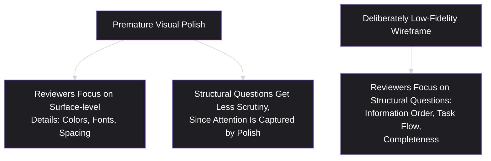
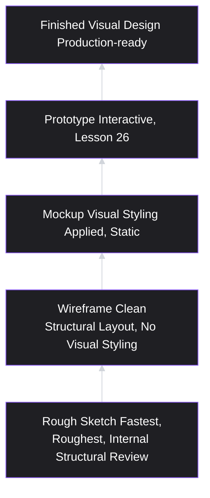

# Lesson 25: Wireframing

## Why This Lesson Matters

Everything Module 3 has covered so far — MVPs, PRDs, user stories, acceptance criteria — has been text: written specifications describing behavior, scope, and testable outcomes. At some point, a real interface has to exist, and the jump from a Given/When/Then criterion to an actual screen a user will look at is not automatic or obvious. A **wireframe** is a low-fidelity, deliberately unpolished visual representation of an interface's structure and layout — showing where elements sit, how information is organized, and how a user moves through a screen — without committing to visual design details like color, typography, or imagery.

This lesson matters because wireframing sits at a genuinely awkward, easy-to-get-wrong point in the process: too early, and premature visual commitment locks in decisions before the underlying structure has been validated; too late, or skipped entirely, and a team moves straight from a text specification to a fully polished, high-fidelity design, losing an entire, cheap, fast round of structural feedback and iteration in between. Wireframing's low fidelity is not a limitation to apologize for — it is the entire point, since it makes structural changes cheap and fast precisely because nothing polished has been invested yet.

---

## Learning Path

| Field | Detail |
|---|---|
| **Module** | 3 — Product Design |
| **Current Lesson** | 25 of 90 |
| **Difficulty** | 3 / 10 |
| **Estimated Study Time** | 25 minutes (reading) + 15 minutes (reflection + quiz) |
| **Prerequisites** | Lesson 15 (User Journey Mapping), Lesson 24 (Acceptance Criteria) |
| **Next Lesson** | Lesson 26 — Prototyping |
| **Future Topics Unlocked** | Lesson 26 (Prototyping — adding interactivity to structural layout), Lesson 27 (UX Principles for Product Managers), Lesson 28 (Information Architecture) |

---

## Learning Objectives

By the end of this lesson, you will be able to:

1. Define a wireframe and distinguish it precisely from a mockup, a prototype, and a finished visual design.
2. Explain why deliberately low fidelity is the core value of wireframing, not a limitation, using the concept of "premature visual commitment."
3. Apply wireframing to visualize a specific journey map touchpoint or acceptance criterion, translating text specification into structural layout.
4. Identify the "wireframe as final design" and "wireframing skipped entirely" failure patterns and explain the risks of each.
5. Distinguish appropriate wireframe fidelity for different review audiences and purposes (internal structural review versus early user testing).

---

## Prerequisites

Lesson 15 (User Journey Mapping) and Lesson 24 (Acceptance Criteria). This lesson assumes you can identify specific touchpoints on a journey map and write specific, testable acceptance criteria — wireframing is the practice of giving those touchpoints and criteria an initial, deliberately rough visual and structural form, before any polished design investment is made.

---

## Theory

### The Core Definition and Precise Distinctions

A wireframe is a low-fidelity visual representation showing an interface's structural layout — the placement, hierarchy, and relationships of elements on a screen — without visual design detail like color, typography, imagery, or polished styling. It's useful to place this precisely relative to closely related, frequently conflated artifacts:

- **Wireframe**: structural layout only, typically grayscale or minimally styled, focused on "what goes where" and "in what order."
- **Mockup**: a higher-fidelity, static visual representation with actual colors, typography, and styling applied, but typically still non-interactive.
- **Prototype** (Lesson 26): an interactive representation, which may range from low to high fidelity, that a user can actually click through and experience some degree of real interaction with.
- **Finished visual design**: the fully polished, production-ready design, informed by validated wireframes and prototypes, and ready for engineering implementation.

```mermaid
%%{init: {
  "theme": "dark",
  "themeVariables": {
    "background": "#0b0b0c",
    "primaryColor": "#1f1f23",
    "primaryTextColor": "#ffffff",
    "primaryBorderColor": "#8b5cf6",
    "lineColor": "#d1d5db",
    "secondaryColor": "#18181b",
    "tertiaryColor": "#111111",
    "mainBkg": "#1f1f23",
    "nodeBorder": "#8b5cf6",
    "clusterBkg": "#000000",
    "clusterBorder": "#27272a",
    "titleColor": "#ffffff",
    "edgeLabelBackground": "#0b0b0c",
    "nodeTextColor": "#ffffff",
    "edgeLabelColor": "#ffffff",
    "actorBorder": "#8b5cf6",
    "actorBkg": "#1f1f23",
    "actorTextColor": "#ffffff",
    "sequenceNumberColor": "#ffffff",
    "signalColor": "#8b5cf6",
    "signalTextColor": "#ffffff",
    "textColor": "#ffffff",
    "classText": "#ffffff",
    "classBorder": "#8b5cf6",
    "classBkg": "#1f1f23"
  }
}}%%
graph LR
    A[Wireframe Structure<br/>Only, No Visual Polish] --> B[Mockup Visual Styling<br/>Applied, Typically Static]
    B --> C[Prototype Interactive,<br/>Varying Fidelity Lesson 26]
    C --> D[Finished Visual Design<br/>Fully Polished, Production-ready]
```

Confusing these stages — treating a wireframe review as if it were a final design review, or skipping wireframing and jumping straight to polished mockups — undermines the specific value each stage provides at its appropriate point in the process, a concern this lesson returns to directly in its failure patterns section.

### Why Deliberate Low Fidelity Is the Point, Not a Limitation

The central argument of this lesson is that a wireframe's low fidelity is not an unfortunate, temporary limitation to be resolved as quickly as possible — it is the specific mechanism that makes structural iteration cheap and fast. This connects directly to a phenomenon worth naming explicitly: **premature visual commitment**, in which polished visual design, introduced too early, causes reviewers (and even the design team itself) to focus feedback on surface-level details (color choices, font selection, spacing aesthetics) rather than the more fundamental, structural questions a wireframe is actually meant to resolve — is the information organized in the right order, does the layout support the user's actual task flow (echoing Lesson 15's journey map work), is anything critical missing or misplaced.

This is a specific, well-documented cognitive effect: polished visuals implicitly signal "this is close to finished," inviting a correspondingly more surface-level, cosmetic style of feedback, even when the actual, more consequential questions (does this layout structurally support the user's task) remain unresolved. Wireframing's rough, unpolished appearance deliberately signals "this is still open to significant structural change," inviting exactly the kind of feedback most valuable at this stage.

### Translating Text Specification into Structural Layout

A wireframe's practical function is translating the text-based artifacts covered earlier in this module — a journey map touchpoint (Lesson 15), an acceptance criterion (Lesson 24) — into an initial visual structure. For example, an acceptance criterion like "Given an expired discount code, when the customer attempts to apply it, then a clear error message should be displayed" specifies a required behavior, but doesn't specify where on the screen that error message should appear, how prominently, or in what relationship to the discount code input field — questions a wireframe begins to answer, still without committing to final visual styling.

This translation step matters because text specifications, however precise (per Lesson 24's Given/When/Then discipline), inevitably leave visual and structural questions unaddressed — not because the text was poorly written, but because text and visual layout are simply different dimensions of a solution, and both require deliberate attention rather than assuming one automatically implies the other.

### Appropriate Fidelity for Different Purposes

Wireframe fidelity should be matched to its specific purpose and audience, directly echoing this module's recurring "appropriate precision" theme (Lesson 22's Precision Dial, now applied to visual rather than textual specification):

- **Internal structural review** (with the immediate product/design/engineering team): often benefits from the roughest, fastest wireframes possible — hand-drawn sketches or simple boxes-and-labels diagrams are frequently sufficient, since the goal is rapid structural iteration among people who already share significant context.
- **Early user testing** (showing a wireframe to real users, echoing Lesson 12's interview techniques): typically requires slightly higher fidelity than a purely internal sketch, since real users, lacking the team's internal context, need enough visual clarity to meaningfully interpret and respond to the layout — but should still stop well short of full visual polish, to avoid the premature-commitment effect described above.

The discipline here parallels Lesson 22's Precision Dial directly: too little fidelity for a given audience (an internal team member's rough sketch shown to a real user who can't interpret it) produces confusion rather than useful feedback; too much fidelity for a given purpose (a fully polished mockup shown in an internal structural-review meeting) triggers premature visual commitment and surface-level feedback. The right fidelity level is a genuine judgment call, calibrated to audience and purpose, not a fixed universal standard.

---

## Common Beginner Mistakes

**Mistake 1: Adding visual polish to a wireframe "just to make it look nicer" before structural feedback has been gathered.**
Even well-intentioned polish introduced too early triggers premature visual commitment, shifting reviewer attention away from the structural questions a wireframe is meant to surface.

**Mistake 2: Skipping wireframing entirely and moving directly from a text specification to a fully polished mockup or prototype.**
This skips an entire, cheap, fast round of structural iteration, and any structural problems discovered later (during prototype testing or, worse, during implementation) become significantly more expensive to fix, since polished visual investment has already been made.

**Mistake 3: Treating a wireframe review meeting as if it were a final design approval, inviting cosmetic rather than structural feedback.**
This confuses the purpose of the wireframe stage specifically, and often results from either excessive fidelity or from framing the review incorrectly, regardless of the wireframe's actual visual polish level.

**Mistake 4: Showing a purely internal, rough sketch-level wireframe to real users without adjusting fidelity for that audience.**
Real users, lacking the team's internal context, may struggle to meaningfully interpret an extremely rough sketch, producing confused or unreliable feedback rather than genuine structural insight.

**Mistake 5: Treating wireframing as purely a design-team responsibility disconnected from the PM's specification work.**
Since a wireframe's core function is translating specific acceptance criteria and journey map touchpoints into structure, a PM's active involvement — checking that the wireframe actually reflects the specified behavior and required scenarios — remains important, not something to fully delegate away.

---

## Mental Model: The Fidelity Ladder

This lesson's mental model is the **Fidelity Ladder** — the sequence of increasing visual and interactive fidelity introduced in Theory, used as a discipline for matching the right level of polish to the right stage of feedback-gathering.

Use this ladder as a discipline for deliberately choosing where to enter and how quickly to climb, based on the specific question currently being resolved: a genuinely open structural question warrants staying at the rough-sketch or wireframe rung longer, gathering iterative feedback cheaply, before investing in the fidelity increase that mockups and prototypes represent.

---

## Real Company Example

**Basecamp** (developed by the company formerly known as 37signals) has been widely discussed in public design writing for a deliberate emphasis on low-fidelity, structural-first design exploration before any visual polish is applied — public commentary from the company's designers has described a practice of working through many rough, unstyled layout iterations specifically to resolve structural and information-hierarchy questions before any typography, color, or visual styling decisions are made, precisely to avoid the premature-commitment effect this lesson describes, where polish invites surface-level feedback at the expense of more fundamental structural scrutiny.

- Basecamp's design process emphasizes low-fidelity, structural-first exploration before any visual polish is applied.
- Working through many rough layout iterations resolves structural and information-hierarchy questions before committing to visual design.
- Delaying visual polish prevents premature commitment and keeps feedback focused on structure rather than surface details.

*(Assumption flagged: this reflects publicly shared design commentary and practice descriptions from the company rather than a claim about its complete, current internal design process, which this curriculum does not claim certainty about.)*

---

## Real World Perspective: Wireframing at Different Company Stages

**At a startup:**
Wireframing is often extremely lightweight and rapid, sometimes literally hand-drawn on paper or a whiteboard, given the premium on speed and the small, tightly collaborating team that doesn't need extensive fidelity to interpret a rough sketch correctly — the core discipline (resolving structural questions before visual investment) matters just as much, even if the specific tooling is minimal.

**At a mid-size company:**
Wireframing typically becomes a more standardized step within a broader design process, often using dedicated wireframing tools that produce clean, consistent, if still deliberately unstyled, layouts suitable for both internal review and early user testing, given a larger team that benefits from more standardized artifacts than an ad hoc sketch might provide.

**At Big Tech:**
Wireframing at scale often needs to account for established design systems and platform conventions even at low fidelity, since structural decisions interact with existing, complex interface patterns across a large product — wireframes at this scale may reference established component structures even while remaining visually unstyled, reflecting the reality that "structure" itself is more constrained and interconnected within a mature, large-scale product than in an early-stage one.

---

## Detailed Case Study: The Wireframe That Was Actually a Mockup

Consider a simplified, illustrative scenario common across B2B software design processes.

A team is designing a new dashboard feature, following a validated opportunity and a set of acceptance criteria specifying required information and interactions. The designer, eager to make a strong first impression in an upcoming stakeholder review, skips a genuinely low-fidelity wireframing stage and instead produces a fully polished, on-brand mockup — complete with the company's color palette, finished typography, and refined iconography — for the very first round of internal review.

During the review meeting, the majority of feedback concerns the specific shade of blue used for a call-to-action button, whether the font size for secondary text is appropriately readable, and a suggestion to adjust icon spacing slightly. No one in the meeting raises a significant structural concern about the fact that the dashboard's information hierarchy actually buries the single most important metric (identified through the original journey map and pain point research, per Lessons 15–16) below several less critical pieces of information — a genuine structural problem that goes entirely unaddressed, because the polished presentation implicitly signaled the design was largely finished and invited cosmetic rather than structural scrutiny.

The issue is only caught weeks later, during early user testing (with a still-polished, by-then further-refined design), when several test participants struggle to locate the key metric quickly, exactly the difficulty the buried information hierarchy would predict.

**What went wrong?**

Applying this lesson's frameworks:

1. **The team skipped the wireframe stage of the Fidelity Ladder entirely**, moving directly from acceptance criteria to a polished mockup, losing the specific, cheap opportunity to catch structural problems before visual investment was made.
2. **Premature visual commitment shaped the nature of the feedback received.** The polish itself, not any explicit decision by the reviewers, shifted attention toward cosmetic details (button color, font size, icon spacing) and away from the more fundamental information-hierarchy problem that a rough, unstyled wireframe would have made more visible and more natural to scrutinize.
3. **The structural problem was eventually caught, but at a significantly higher cost** — after a polished design had already been produced and further refined, rather than during an early, cheap round of unstyled structural iteration.

A team applying this lesson's discipline would have first produced a genuinely low-fidelity wireframe — grayscale boxes and labels, no branding or polish — for the same initial internal review, very likely surfacing structural feedback about the buried key metric at that early stage, when the fix would have cost a quick layout rearrangement rather than a mockup and testing cycle's worth of already-invested effort.

This case connects directly back to **Lesson 22's Precision Dial** and **Lesson 21's MVP discipline**: in both cases, the core argument is the same — resolving the most fundamental, structural questions first, before investing in polish or completeness that isn't yet necessary, and that can actively distract attention from the more important open questions still unresolved.

---

## Framework Explanation: The Wireframe Review Framing Checklist

A practical checklist for ensuring a wireframe review actually surfaces structural feedback, rather than drifting toward premature cosmetic commentary:

| Practice | Purpose |
|---|---|
| Present the wireframe in genuinely low fidelity (grayscale, unstyled), appropriate to the Fidelity Ladder stage | Avoids triggering premature visual commitment |
| Explicitly frame the review's purpose at the start: "We're evaluating structure and information hierarchy, not visual polish" | Directs reviewer attention toward the intended kind of feedback |
| Reference the specific acceptance criteria and journey map touchpoints the wireframe is meant to satisfy | Keeps the review anchored to validated requirements, not personal aesthetic preference |
| Explicitly ask whether the most important information (per prior pain point/severity research, Lesson 16) is appropriately prominent | Directly checks for the kind of hierarchy problem shown in the Detailed Case Study |
| Defer visual design discussion to a later, appropriately staged review | Preserves the Fidelity Ladder's intended sequencing |

The recurring discipline this checklist reinforces: **fidelity and framing together determine what kind of feedback a review actually produces — low fidelity alone is not sufficient if the review's stated purpose isn't also made explicit.**

---

## Interview Perspective: How Interviewers Think About This

**Typical question 1: "Why would a team use a low-fidelity wireframe instead of just designing the final interface directly?"**
*What the interviewer is actually evaluating:* Whether the candidate can articulate the premature-visual-commitment concept specifically, rather than giving a vague answer about wireframes being "faster" without explaining the underlying cognitive mechanism this lesson describes.

**Typical question 2: "Tell me about a time skipping wireframing (or treating one as a final design) caused a problem."**
*What the interviewer is actually evaluating:* Direct experience with one of this lesson's two named failure patterns, and whether the candidate can articulate the specific structural issue that went unaddressed as a result, echoing this lesson's Detailed Case Study.

**Typical question 3: "How do you decide the right fidelity level for a wireframe you're about to show someone?"**
*What the interviewer is actually evaluating:* Fluency with the audience/purpose-matching discipline — whether the candidate distinguishes internal structural review (lower fidelity, faster) from early user testing (slightly higher fidelity, to support meaningful interpretation) rather than applying a single fixed fidelity level regardless of context.

---

## Summary

A wireframe is a deliberately low-fidelity representation of an interface's structural layout, distinct from a mockup (visually styled but static), a prototype (interactive, Lesson 26), and a finished visual design — and its low fidelity is the entire point, not a limitation, because polish introduces "premature visual commitment," shifting reviewer attention toward surface-level cosmetic feedback and away from the more fundamental structural questions a wireframe exists to surface. Wireframing's practical function is translating text-based specifications (journey map touchpoints from Lesson 15, acceptance criteria from Lesson 24) into an initial visual and structural form, a translation step that remains necessary regardless of how precisely the underlying text was written. Fidelity should be matched to purpose and audience — rough sketches for fast internal structural review, slightly higher fidelity for early user testing that still stops short of full polish — echoing this module's recurring Precision Dial theme, now applied visually rather than textually. The two central failure patterns — treating a wireframe as a final design, or skipping wireframing entirely — both risk losing the cheap, early structural iteration this stage is specifically designed to provide, as shown in this lesson's Detailed Case Study.

---

## Key Takeaways

- A wireframe is a deliberately low-fidelity structural layout, distinct from a mockup (styled, static), a prototype (interactive), and a finished visual design.
- Low fidelity is the core value of wireframing, not a limitation — it avoids "premature visual commitment," which shifts feedback toward cosmetic details and away from structural questions.
- Wireframing translates text specifications (journey map touchpoints, acceptance criteria) into an initial visual and structural form, a step that remains necessary regardless of textual precision.
- Fidelity should be matched to audience and purpose — rough sketches for fast internal review, slightly higher fidelity for early user testing, both stopping well short of full visual polish.
- Treating a wireframe review as a final design approval, or skipping wireframing entirely, both risk losing cheap, early structural iteration and pushing structural problem discovery to a much more expensive later stage.
- Framing a wireframe review's explicit purpose (structure, not polish) matters alongside fidelity itself in determining what kind of feedback a review actually produces.
- A PM's active involvement in wireframing — checking that layouts genuinely reflect specified behavior and required scenarios — remains valuable, not something to fully delegate to design alone.

---

## Cheat Sheet

*A two-minute review of everything in this lesson.*

- **Wireframe = structure only**, no visual polish — distinct from mockup (styled, static), prototype (interactive), finished design.
- **Low fidelity is the point** — polish causes "premature visual commitment," shifting feedback toward cosmetics, away from structure.
- **Fidelity Ladder:** rough sketch → wireframe → mockup → prototype → finished design. Match fidelity to purpose and audience.
- **Two failure patterns:** wireframe-as-final-design (invites cosmetic feedback) and skipping wireframing entirely (loses cheap structural iteration).
- **Frame the review explicitly** — "we're evaluating structure, not polish" — fidelity alone isn't enough; framing matters too.
- **PM stays involved** — check that the wireframe actually reflects specified acceptance criteria and journey map touchpoints.

---

## Glossary

| Term | Definition | Related Concepts | Difficulty |
|---|---|---|---|
| Wireframe | A deliberately low-fidelity visual representation of an interface's structural layout, without visual design detail. | Mockup, Prototype (Lesson 26) | 1 |
| Mockup | A higher-fidelity, static visual representation with color, typography, and styling applied. | Wireframe, Prototype | 1 |
| Premature Visual Commitment | The effect where polished visuals shift reviewer attention toward cosmetic feedback and away from structural questions. | Fidelity Ladder | 2 |
| Fidelity Ladder | The sequence from rough sketch through wireframe, mockup, prototype, to finished visual design, each matched to a specific stage and purpose. | Premature Visual Commitment | 2 |

---

## Further Reading / Resources

- Bill Buxton, *Sketching User Experiences* — a foundational treatment of low-fidelity sketching and its role in preserving structural exploration before visual commitment, directly relevant to this lesson's core argument.
- Jake Knapp, *Sprint* — includes practical guidance on structuring design reviews to elicit the right kind of feedback at the right fidelity stage.
- 37signals' (Basecamp's) publicly shared design writing on structural-first, low-fidelity exploration, referenced in this lesson's Real Company Example.

---

## Flashcards

**Card 1**
- Front: What is a wireframe, and how does it differ from a mockup?
- Back: A deliberately low-fidelity representation of an interface's structural layout, with no visual design detail; a mockup adds visual styling (color, typography) but remains static and non-interactive.
- Difficulty: 1
- Tags: wireframe-definition

**Card 2**
- Front: What is "premature visual commitment," and why does it matter?
- Back: The effect where polished visuals shift reviewer attention toward surface-level, cosmetic feedback and away from more fundamental structural questions — the reason wireframing's low fidelity is valuable rather than a limitation.
- Difficulty: 2
- Tags: premature-visual-commitment

**Card 3**
- Front: What is a wireframe's practical function relative to acceptance criteria and journey maps?
- Back: Translating text-based specifications (journey map touchpoints, acceptance criteria) into an initial visual and structural form — a necessary step regardless of how precisely the underlying text was written.
- Difficulty: 2
- Tags: translation-function

**Card 4**
- Front: How should fidelity be matched to audience and purpose, according to this lesson?
- Back: Rough sketches suit fast internal structural review among people with shared context; slightly higher fidelity suits early user testing, since real users need enough clarity to interpret the layout meaningfully — both should stop short of full polish.
- Difficulty: 2
- Tags: fidelity-matching

**Card 5**
- Front: What are the two central wireframing failure patterns this lesson names?
- Back: Treating a wireframe review as a final design approval (inviting cosmetic feedback), and skipping wireframing entirely (losing cheap, early structural iteration).
- Difficulty: 2
- Tags: failure-patterns

**Card 6**
- Front: In the Detailed Case Study, what structural problem went unaddressed because the team skipped wireframing?
- Back: The dashboard's information hierarchy buried the single most important metric below several less critical pieces of information — a problem obscured by the polished mockup's premature visual commitment effect.
- Difficulty: 3
- Tags: case-study

**Card 7**
- Front: Besides fidelity itself, what else determines whether a wireframe review surfaces structural feedback?
- Back: Explicit framing of the review's purpose ("we're evaluating structure, not polish") — low fidelity alone isn't sufficient if the review's intent isn't also made clear to participants.
- Difficulty: 2
- Tags: review-framing

---

## Reflection Exercise

You are the PM for a personal finance app, working with a designer to translate the acceptance criteria from Lesson 24's discount-code exercise (adapted here: a spending-alert feature) into a wireframe: "Given a user has exceeded their monthly budget in a specific category, when they open the app, then a clear alert should be visible on the home screen without requiring additional navigation."

Work through the following, in writing, before reading further:

1. Describe, in words (since you're not creating an actual visual), the key structural questions a wireframe for this alert would need to resolve — where it appears, how it relates to other home-screen content, and what happens when a user interacts with it.
2. Explain why producing a polished, fully branded mockup of this alert for the very first internal review might risk the premature-visual-commitment problem this lesson describes.
3. Identify one specific structural question (drawing on this app's presumed journey map and pain point research, per Lessons 15-16) that a genuinely low-fidelity wireframe review should explicitly surface, if handled correctly.
4. Propose an appropriate fidelity level for showing this concept to five real users for early feedback, and justify why that level is more appropriate than either a rough internal sketch or a fully polished mockup.
5. Using the Wireframe Review Framing Checklist, write the specific framing statement you would use to open an internal review of this wireframe, to keep feedback focused on structure rather than cosmetics.

There is no single correct answer. The purpose of this exercise is to practice reasoning about fidelity, framing, and structural translation, rather than skipping straight to polished visual details.

---

## Quiz

**1. What is the defining characteristic of a wireframe, according to this lesson?**
A) It is fully interactive and can be clicked through like a real product
B) It is a deliberately low-fidelity representation of structural layout, without visual design detail
C) It uses the company's final brand colors and typography
D) It is identical to a finished visual design, just produced earlier in the process

*Correct answer: B*
*Explanation: The lesson's core definition emphasizes deliberate low fidelity and structural focus, distinct from interactivity (a prototype's defining feature) or full visual polish (a mockup or finished design's defining feature).*
*Learning objective tested: #1*
*Difficulty: Easy*

---

**2. What is "premature visual commitment," as described in this lesson?**
A) A technique for speeding up the design process
B) The effect where polished visuals shift reviewer attention toward surface-level, cosmetic feedback and away from structural questions
C) A requirement that all wireframes must be completed within a fixed time limit
D) The practice of finalizing a design before any stakeholder review occurs

*Correct answer: B*
*Explanation: This is the lesson's explicit definition of the phenomenon that makes wireframing's low fidelity valuable rather than a limitation.*
*Learning objective tested: #2*
*Difficulty: Easy*

---

**3. Which of the following best distinguishes a wireframe from a prototype?**
A) A wireframe is always more expensive to produce than a prototype
B) A wireframe shows structural layout without interactivity; a prototype is interactive, allowing a user to click through and experience some real interaction
C) A wireframe and a prototype are identical concepts with different names
D) A wireframe always includes final visual styling, while a prototype does not

*Correct answer: B*
*Explanation: This is the lesson's explicit distinction — interactivity is the defining feature separating a prototype from a wireframe, not visual styling (which neither typically includes at full polish) or cost.*
*Learning objective tested: #1*
*Difficulty: Easy*

---

**4. Why does this lesson argue that wireframing's low fidelity is "the point, not a limitation"?**
A) Because low-fidelity work is always cheaper to produce, regardless of any other consideration
B) Because deliberately low fidelity avoids premature visual commitment, keeping reviewer attention on structural questions rather than surface-level cosmetic details
C) Because clients and stakeholders always prefer rough, unpolished work
D) Because wireframes are legally required to be low fidelity in most design processes

*Correct answer: B*
*Explanation: The lesson's core argument connects low fidelity directly to avoiding the premature-commitment effect, not to cost alone or any external requirement.*
*Learning objective tested: #2*
*Difficulty: Easy*

---

**5. According to this lesson, how should fidelity be adjusted for showing a wireframe to real users during early testing, compared to an internal structural review?**
A) Fidelity should be identical in both cases, regardless of audience
B) Real users typically need slightly higher fidelity than a purely internal rough sketch, since they lack the team's internal context, but should still stop short of full visual polish
C) Real users should always see the fully finished, polished design, never a wireframe
D) Internal team members should always require higher fidelity than real users

*Correct answer: B*
*Explanation: This reflects the lesson's audience-matching discipline — real users need enough clarity to interpret the layout meaningfully, but excessive polish still risks the premature-commitment problem even with this audience.*
*Learning objective tested: #5*
*Difficulty: Easy*

---

**6. In the Detailed Case Study, what specific structural problem went unaddressed because the team skipped the wireframe stage?**
A) The dashboard loaded too slowly for users with slow internet connections
B) The dashboard's information hierarchy buried the single most important metric below several less critical pieces of information
C) The dashboard used the wrong color palette for the company's brand guidelines
D) The dashboard was not compatible with mobile devices

*Correct answer: B*
*Explanation: The case study explicitly identifies this information-hierarchy problem as the structural issue that went unaddressed due to premature visual commitment.*
*Learning objective tested: #4*
*Difficulty: Easy*

---

**7. Why did the internal review in the Detailed Case Study focus primarily on button color, font size, and icon spacing rather than the dashboard's information hierarchy?**
A) The reviewers did not care about the product's success
B) The polished mockup's visual completeness implicitly signaled the design was largely finished, inviting cosmetic rather than structural scrutiny — precisely the premature visual commitment effect
C) The reviewers were only qualified to comment on visual design, not structure
D) The information hierarchy was not actually a real problem with the design

*Correct answer: B*
*Explanation: The case study explicitly attributes the nature of the feedback received to the premature visual commitment effect triggered by the polished presentation.*
*Learning objective tested: #2, #4*
*Difficulty: Medium*

---

**8. According to the Wireframe Review Framing Checklist, what should be done at the start of a wireframe review, in addition to using low fidelity?**
A) Nothing further is necessary once low fidelity has been achieved
B) The review's purpose should be explicitly stated (e.g., "we're evaluating structure, not polish") to direct reviewer attention appropriately
C) The wireframe should be immediately converted to a fully polished mockup before the meeting begins
D) All acceptance criteria should be removed from consideration during this specific review

*Correct answer: B*
*Explanation: The Checklist explicitly notes that fidelity and framing together determine the kind of feedback a review produces — low fidelity alone is not sufficient without also stating the review's intended focus.*
*Learning objective tested: #4*
*Difficulty: Medium*

---

**9. (Scenario) A designer produces a rough, hand-drawn sketch of a new feature and shows it directly to real users for feedback, without any adjustment in fidelity. What risk does this practice raise, according to this lesson?**
A) No risk; rough sketches are always the ideal fidelity level regardless of audience
B) Real users, lacking the team's internal context, may struggle to meaningfully interpret an extremely rough sketch, producing confused or unreliable feedback rather than genuine structural insight
C) This practice guarantees premature visual commitment will occur
D) This practice is only a problem if the sketch includes color

*Correct answer: B*
*Explanation: This reflects Common Mistake 4 — matching fidelity to audience matters in both directions; too little fidelity for an audience lacking internal context risks producing unreliable feedback, not just too much fidelity risking premature commitment.*
*Learning objective tested: #5*
*Difficulty: Medium-Hard*

---

**10. (Product Thinking) A team wants to resolve a genuinely open structural question — whether a specific piece of information should appear above or below another on a screen — before investing in any visual design work. According to the Fidelity Ladder, what is the most appropriate next step?**
A) Skip directly to a fully polished mockup, since visual design will make the comparison clearer
B) Use a rough sketch or wireframe to test both structural arrangements quickly and cheaply, before any visual styling investment is made
C) Build a fully interactive, high-fidelity prototype to resolve this specific structural question
D) Make the decision based purely on personal preference without any visual exploration at all

*Correct answer: B*
*Explanation: A purely structural question (ordering of information) is exactly the kind of question the Fidelity Ladder's early, low-fidelity stages are designed to resolve cheaply, before investing in higher-fidelity stages not yet warranted.*
*Learning objective tested: #3*
*Difficulty: Medium-Hard*

---

**11. (Interview Reasoning) A candidate describes routinely producing fully polished, on-brand mockups for the very first round of internal design review, explaining that "it saves time since we'll need the polish eventually anyway." What might this signal, based on this lesson's Interview Perspective section?**
A) An efficient, best-practice approach to design review
B) A likely instance of skipping the wireframe stage of the Fidelity Ladder, risking premature visual commitment and the loss of cheap, early structural iteration
C) That the candidate has strong visual design skills that should be considered a core PM competency
D) Nothing meaningful, since polish is always beneficial regardless of the review stage

*Correct answer: B*
*Explanation: This reflects the lesson's explicit warning against skipping wireframing, even when framed as a time-saving measure — the actual risk is losing cheap early structural iteration and inviting the wrong kind of feedback.*
*Learning objective tested: #4*
*Difficulty: Hard*

---

**12. (Product Thinking, Higher Difficulty) A team correctly produces a low-fidelity wireframe and explicitly frames the review as structural, but reviewers still spend most of the meeting discussing minor spacing preferences. What additional factor, beyond fidelity and framing, might explain this outcome?**
A) The wireframe fidelity was too low, and should have included full visual polish instead
B) Reviewers may need more explicit guidance connecting the review specifically back to acceptance criteria and journey map touchpoints (per the Framing Checklist), or may simply need a habit-forming reminder, since old review habits can persist even when fidelity and stated framing are both correct
C) This outcome proves that wireframing is fundamentally ineffective as a technique
D) The review should have been skipped entirely, since reviewers are incapable of giving structural feedback under any circumstances

*Correct answer: B*
*Explanation: This reflects a more nuanced point — even with correct fidelity and stated framing, team habits and review culture can still drift toward familiar, comfortable feedback patterns, suggesting the Framing Checklist's practices (explicitly referencing criteria and journey touchpoints) may need reinforcement, not that the underlying technique has failed.*
*Learning objective tested: #4*
*Difficulty: Medium-Hard*

---

**13. (Interview Reasoning, Higher Difficulty) An interviewer describes a scenario where a team's wireframes are appropriately low fidelity, but the PM has no involvement in reviewing them against the original acceptance criteria, delegating this entirely to the design team. What is the strongest critique of this practice, based on this lesson?**
A) No critique is warranted; wireframe review should always be handled entirely by the design team
B) The PM's active involvement in checking that wireframes genuinely reflect specified behavior and required scenarios (per Common Mistake 5) remains valuable and shouldn't be fully delegated away, since the PM holds the connection to the underlying validated requirements
C) PMs should never be involved in any aspect of visual design, including wireframe review
D) This practice is ideal, since designers are always better positioned to catch requirement mismatches than PMs

*Correct answer: B*
*Explanation: This directly reflects Common Mistake 5 — the PM's continued involvement in checking wireframes against specified acceptance criteria and journey map touchpoints is explicitly recommended, not something to be fully delegated away.*
*Learning objective tested: #3*
*Difficulty: Hard*

---

**14. (Product Thinking, Higher Difficulty) A team is deciding between two options: spending an extra day iterating on multiple rough wireframe variations before committing to one, or moving directly to a single polished mockup to save time. Using this lesson's arguments, which option is generally preferable, and why?**
A) Moving directly to a single polished mockup, since more time spent on any stage is inherently wasteful
B) Spending the extra day iterating on rough wireframe variations, since structural changes are dramatically cheaper to make at low fidelity than after visual polish has been invested, potentially saving significantly more time later if a structural issue would otherwise be discovered post-polish
C) Both options are equally time-efficient regardless of when structural issues are discovered
D) Neither option matters, since visual design has no bearing on structural quality

*Correct answer: B*
*Explanation: This reflects the lesson's core economic argument for wireframing — the cost of structural change increases significantly at higher fidelity stages, making early, low-fidelity iteration a net time-saver even though it adds an explicit step, as shown by the costly outcome in the Detailed Case Study.*
*Learning objective tested: #2*
*Difficulty: Hard*

---

**15. (Highest Difficulty) A team produces a genuinely low-fidelity wireframe, explicitly frames the review as structural, and receives excellent structural feedback that leads to several layout changes. The team then moves to a polished mockup stage — but upon final user testing, discovers that the same information-hierarchy problem from this lesson's Detailed Case Study has somehow reappeared. What does this scenario suggest, and what should the team check?**
A) Wireframing is fundamentally ineffective, since the same problem reappeared despite following the correct process
B) The team should check whether the structural changes agreed upon during the wireframe review were actually and faithfully carried through into the subsequent mockup and prototype stages, since a correct wireframing process does not automatically guarantee that its conclusions survive translation into later, higher-fidelity stages
C) The mockup stage should be eliminated entirely from the process going forward
D) This outcome is unrelated to the wireframing process and should be attributed entirely to user testing methodology

*Correct answer: B*
*Explanation: This tests a subtler point — even a well-executed wireframing stage doesn't automatically guarantee that its structural conclusions are faithfully preserved through subsequent fidelity increases; the team should specifically verify that the mockup stage carried forward the wireframe's validated structural decisions, rather than assuming success at one stage guarantees success at all subsequent stages.*
*Learning objective tested: #1, #3*
*Difficulty: Hard*

---

## Connections

| | Lesson | Core Idea Carried Forward |
|---|---|---|
| **Previous Lesson** | Lesson 24 — Acceptance Criteria | Provides the specific, testable behavior that a wireframe translates into initial visual and structural form |
| **Current Lesson** | Lesson 25 — Wireframing | The Fidelity Ladder; premature visual commitment; wireframe-as-final-design and skipped-wireframing failure patterns |
| **Next Lesson** | Lesson 26 — Prototyping | Adds interactivity to structural layout, extending the Fidelity Ladder into a testable, clickable representation |
| **Future Concepts Unlocked** | Lesson 27 (UX Principles for Product Managers) | Provides deeper design principles informing how wireframe structure should be organized |
| | Lesson 28 (Information Architecture) | Formalizes the information-hierarchy concerns this lesson's Detailed Case Study raised into a dedicated discipline |

This curriculum is designed to be read as one continuous argument. From this lesson forward, any reference to "the design" assumes the Fidelity Ladder discipline covered here — this will not be re-explained, only re-applied.
