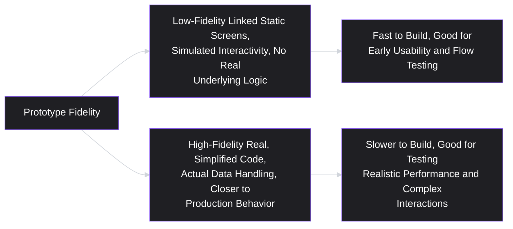
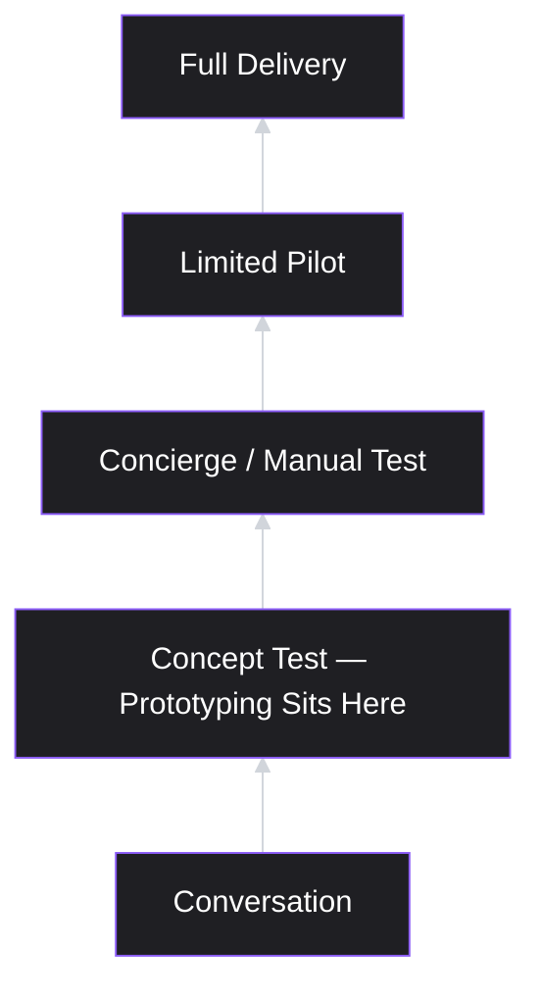
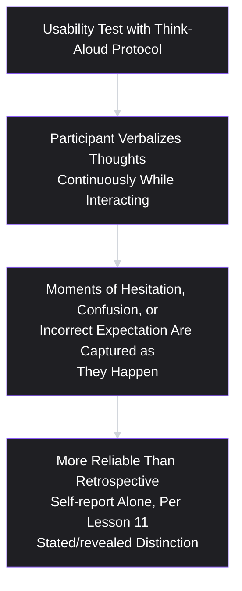
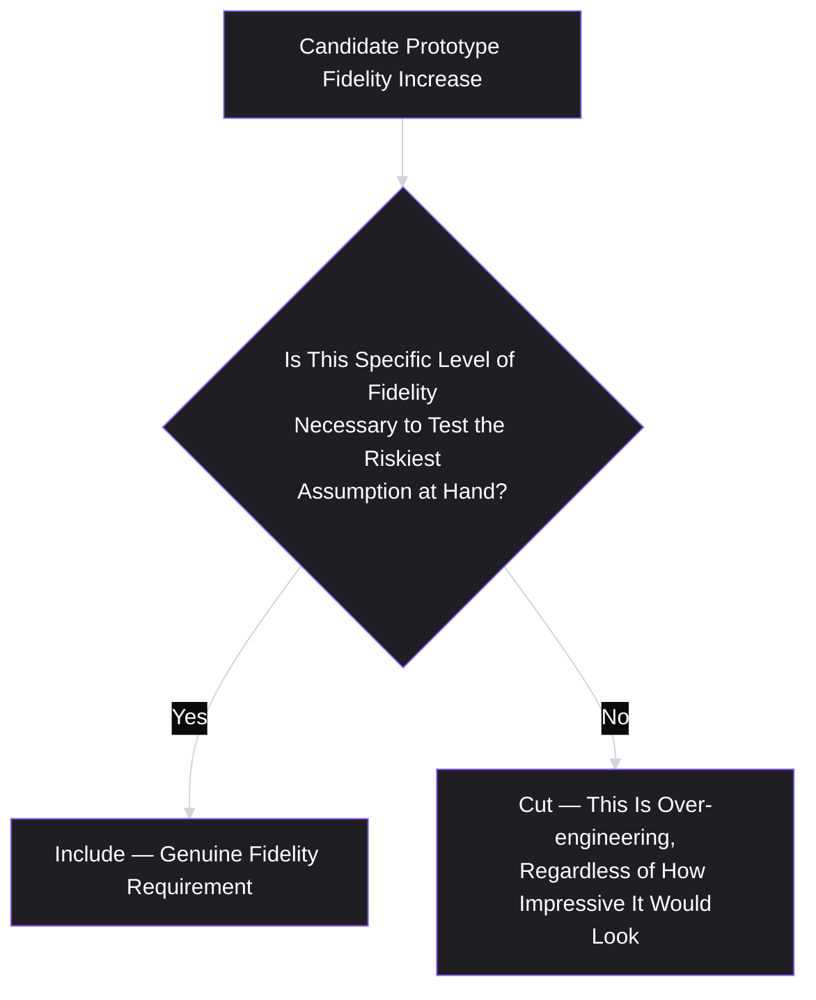

# Lesson 26: Prototyping

## Why This Lesson Matters

Lesson 25 ended with a structurally validated wireframe — the "what goes where" question resolved cheaply, before any polish was invested. But structure alone doesn't answer a different, equally important class of question: does this actually work the way a real person expects it to, once they can touch it, click through it, and experience the sequence of screens and transitions as a connected whole? A wireframe is static; a real interface is not. A **prototype** is an interactive representation of a solution — ranging from a simple clickable sequence of linked screens to a fully functional, code-based simulation — that lets a real or prospective user actually navigate and interact with something resembling the eventual product, before that product has been fully built.

This lesson matters because prototyping sits at a genuinely distinct point on the Fidelity Ladder introduced in Lesson 25, testing a different category of assumption than wireframing does. A wireframe answers "is this structured correctly?" A prototype answers "does this actually work as a connected, navigable experience, and can a real person use it successfully?" Skipping straight from a validated wireframe to full engineering implementation, without an intermediate prototyping stage, means the first time anyone tests the *experience* of moving through the solution is after significant, expensive development work has already happened — exactly the kind of late, costly discovery this entire curriculum has repeatedly warned against.

---

## Learning Path

| Field | Detail |
|---|---|
| **Module** | 3 — Product Design |
| **Current Lesson** | 26 of 90 |
| **Difficulty** | 4 / 10 |
| **Estimated Study Time** | 25 minutes (reading) + 15 minutes (reflection + quiz) |
| **Prerequisites** | Lesson 8 (Product Discovery), Lesson 25 (Wireframing) |
| **Next Lesson** | Lesson 27 — UX Principles for Product Managers |
| **Future Topics Unlocked** | Lesson 27 (UX Principles), Lesson 28 (Information Architecture), Lesson 45 (A/B Testing & Experimentation) |

---

## Learning Objectives

By the end of this lesson, you will be able to:

1. Define a prototype and distinguish low-fidelity from high-fidelity prototypes, identifying when each is appropriate.
2. Apply prototyping as a specific rung on Lesson 8's confidence ladder, connecting it to the riskiest-assumption discipline.
3. Distinguish usability testing (using a prototype) from discovery interviewing (Lesson 12), and explain how the two combine effectively.
4. Identify the "prototype as finished product" and "over-engineered prototype" failure patterns and explain the risks of each.
5. Apply the "think-aloud" usability testing technique to gather genuine, actionable feedback from a prototype test.

---

## Prerequisites

Lesson 8 (Product Discovery) and Lesson 25 (Wireframing). This lesson assumes fluency with the confidence ladder (rungs from conversation through concierge test to full delivery) and the Fidelity Ladder from Lesson 25 — a prototype sits at a specific point on both ladders simultaneously, testing usability and interactive-experience risk after structural risk has already been addressed by wireframing.

---

## Theory

### The Core Definition, and Low- vs. High-Fidelity Prototypes

A prototype is an interactive representation of a solution that a person can navigate and engage with, ranging widely in fidelity:

- **Low-fidelity prototype**: often built from linked static wireframes or mockups (using tools that make individual screens clickable and navigable in sequence), without real underlying functionality — clicking a button moves to the next linked screen, but no actual data processing or business logic occurs behind it.
- **High-fidelity prototype**: closer to fully functional, sometimes built with real (if limited or simplified) underlying code, capable of handling actual data input, real business logic, or realistic performance characteristics, while still typically representing only a subset of the eventual full product's scope.

The choice between low- and high-fidelity prototyping should follow directly from the specific riskiest assumption (Lesson 8) being tested: a question about whether users can successfully navigate a multi-step flow is often well-served by a low-fidelity, linked-screen prototype, while a question about whether users tolerate a specific, realistic loading time, or correctly interpret dynamically changing real data, may require a higher-fidelity, more functionally real prototype to produce a trustworthy answer.

### Prototyping as a Rung on the Confidence Ladder

Recall Lesson 8's confidence ladder: conversation, concept test, concierge/manual test, limited pilot, full delivery — a sequence of progressively more expensive, higher-fidelity validation methods, with the explicit discipline of not skipping rungs. Prototyping sits specifically at the "concept test" rung (and, at higher fidelity, can approach the "concierge/manual test" rung), positioned deliberately before the cost and commitment of a limited pilot or full delivery.

This placement matters practically: a prototype is meant to generate genuine, disconfirmable evidence about usability and interactive experience *before* the cost of a limited pilot or full delivery is incurred — directly extending the discovery discipline from Module 2 into the design stage of Module 3. A team that skips prototyping and moves straight from a validated wireframe to full delivery has, in effect, skipped a rung on the confidence ladder, exactly the discipline violation Lesson 8 warned against.

### Usability Testing vs. Discovery Interviewing

It's worth being precise about how testing a prototype (**usability testing**) differs from the discovery interviewing covered in Lesson 12, since both involve talking with real users but serve genuinely different purposes:

- **Discovery interviewing** (Lesson 12) aims to understand a person's existing behavior, context, and needs, typically independent of any specific solution — past-behavior questions, with any solution reaction deferred to the end of the conversation, if included at all.
- **Usability testing** aims to observe how a person interacts with a specific, already-built (even if low-fidelity) solution — watching what they actually do, where they hesitate or get confused, and what they say while doing it, directly connecting to Lesson 12's discovery-versus-usability-interview distinction, now given a dedicated method.

A well-run discovery-to-delivery process (echoing Lesson 20's Discovery Flywheel) typically uses both in sequence: discovery interviews establish the underlying job and pain points; a prototype is then built to address them; usability testing on that prototype checks whether the specific proposed solution actually resolves the identified pain point in practice, and surfaces any new usability friction the solution itself introduces.

### The Think-Aloud Technique

A widely used, practical method for conducting genuinely useful usability testing on a prototype is the **think-aloud technique**: asking a test participant to verbalize their thoughts continuously while interacting with the prototype — what they're looking at, what they expect to happen next, what confuses them, what they're trying to do — rather than silently completing tasks and only reporting their overall impression afterward.

This technique is valuable specifically because it surfaces moments of hesitation, confusion, or incorrect expectation *as they happen*, rather than relying on a participant's after-the-fact recollection and summary — which, per Lesson 11's stated-versus-revealed-preference distinction, is often less reliable than directly observed, in-the-moment behavior and commentary. A participant who silently completes a task, then reports afterward that "it was pretty intuitive," may have actually hesitated meaningfully at a specific step along the way — a moment of friction that a think-aloud protocol would have captured directly, but that a purely retrospective self-report might smooth over or forget entirely.

### Two Failure Patterns: Prototype as Finished Product, and Over-Engineered Prototype

Two specific, opposite failure patterns deserve direct attention, both distorting the appropriate fidelity match discussed above:

- **Prototype as finished product**: presenting a prototype (particularly a high-fidelity one) to stakeholders or users as if it were the actual, launch-ready solution, rather than a deliberately limited testing artifact — this can create false expectations about timeline or scope, and can trigger the same premature-visual-commitment effect Lesson 25 described, now applied to interactivity rather than pure visual polish.
- **Over-engineered prototype**: investing more time and fidelity into a prototype than the specific riskiest assumption being tested actually requires — echoing Lesson 21's MVP creep concept directly, but applied to the prototyping stage rather than the eventual delivered solution. A prototype meant only to test whether users can navigate a specific flow correctly doesn't need real backend data processing, realistic load times, or edge-case handling — investing in these regardless produces a slower, more expensive prototype without improving its ability to answer the specific question at hand.

---

## Common Beginner Mistakes

**Mistake 1: Building a high-fidelity prototype when a low-fidelity one would answer the riskiest assumption just as well.**
This is a direct instance of over-engineering — matching prototype fidelity to the specific question being tested, not to a default assumption that "more realistic is always better," is the correct discipline.

**Mistake 2: Presenting a prototype to stakeholders without clarifying that it is a testing artifact, not a launch-ready product.**
This risks creating false expectations about timeline, completeness, or scope, and can trigger the premature-commitment effect this lesson and Lesson 25 both warn about.

**Mistake 3: Relying solely on a participant's after-the-fact summary ("it felt intuitive") rather than using a think-aloud protocol during the test itself.**
Retrospective self-report is a weaker form of evidence than in-the-moment observed behavior and commentary, per Lesson 11's stated-versus-revealed-preference distinction.

**Mistake 4: Conflating usability testing with discovery interviewing, or running one when the other is actually needed.**
These serve genuinely different purposes — understanding existing behavior and needs (discovery) versus observing interaction with a specific built solution (usability) — and confusing them produces a session that answers neither question well.

**Mistake 5: Skipping prototyping entirely and moving from a validated wireframe directly to full delivery.**
This skips a specific rung on Lesson 8's confidence ladder, losing the opportunity to catch usability and interactive-experience problems before the cost of full development is incurred.

---

## Mental Model: The Prototype Fidelity Match

This lesson's mental model is the **Prototype Fidelity Match** — a direct extension of Lesson 21's MVP Scoping Filter, applied specifically to choosing prototype fidelity.

Apply this filter to any proposed prototype investment: does testing this specific riskiest assumption genuinely require real backend logic, realistic data, or polished visuals — or would a simpler, faster, linked-screen prototype answer the same question just as reliably? Defaulting to the simplest fidelity level capable of testing the assumption at hand mirrors Lesson 21's MVP discipline directly.

---

## Real Company Example

**Airbnb**'s design team has been publicly associated with extensive use of interactive prototyping before committing to full engineering builds, particularly for significant redesigns of core booking and search flows. Public design commentary from the company has described building clickable, navigable prototypes — often well before any real backend functionality is built — specifically to usability-test entire multi-step flows (such as the full search-to-booking sequence) with real users, catching navigation confusion or unexpected drop-off points at the prototype stage rather than discovering them only after a costly, fully built implementation had already launched.

*(Assumption flagged: this reflects publicly shared design process commentary from the company rather than a claim about its complete, current internal prototyping methodology, which this curriculum does not claim certainty about.)*

---

## Real World Perspective: Prototyping at Different Company Stages

**At a startup:**
Prototyping is often extremely lightweight, frequently using simple, low-fidelity, linked-screen tools, given the premium on speed and limited design/engineering resources — the specific discipline of matching fidelity to the riskiest assumption matters just as much as at any other stage, since a startup has even less capacity to absorb the cost of an over-engineered prototype that answers a question no one actually needed answered yet.

**At a mid-size company:**
Prototyping typically becomes a more standard, expected stage before significant engineering commitment, often incorporating both low-fidelity flow-testing prototypes early and higher-fidelity, more functionally realistic prototypes for specific, higher-risk interactions later in a project, as the organization develops more structured design and research processes.

**At Big Tech:**
Prototyping at scale sometimes involves genuinely high-fidelity, functionally realistic builds — occasionally close to production-quality code — specifically because the cost of a wrong decision at full scale is large enough to justify the additional prototyping investment, and because established design systems and component libraries can make higher-fidelity prototyping faster and cheaper than it would be for a team building from scratch.

---

## Detailed Case Study: The Prototype That Skipped the Real Test

Consider a simplified, illustrative scenario common across e-commerce checkout redesigns.

A team redesigning a multi-step checkout flow builds a low-fidelity, linked-screen prototype and conducts usability testing with several participants, using a think-aloud protocol. Testing goes well: participants navigate the flow successfully, verbalizing confidence at each step, and the team concludes the new flow is ready for full engineering implementation.

After full development, the redesigned checkout launches, and conversion rates drop unexpectedly at a specific step — a real-time shipping cost calculation that, in the actual production implementation, takes several seconds to load due to a third-party shipping API's real-world response time. In the original low-fidelity prototype, this step had simply displayed a static, pre-filled shipping cost immediately, with no simulated delay at all, since the team judged that realistic loading behavior wasn't necessary to test basic flow navigation.

**What went wrong?**

Applying this lesson's frameworks:

1. **The prototype's fidelity was correctly matched to the flow-navigation assumption the team originally set out to test**, but the team never explicitly identified a second, distinct riskiest assumption — whether users would tolerate a multi-second delay during a real-time shipping calculation — that existed alongside the navigation question, and that required a fundamentally different kind of fidelity (realistic timing behavior) to test properly.
2. **The team implicitly treated "the prototype tested successfully" as validating the entire checkout experience**, rather than recognizing that it had only validated the specific dimension (navigation flow) the prototype was actually built to test — a subtle but important scope-of-validation error.
3. **A higher-fidelity prototype, or a specific, targeted secondary test simulating realistic loading delay for just this one step, would have caught the issue before full development**, at a fraction of the cost of discovering it through a live conversion-rate drop after launch.

A team applying this lesson's discipline rigorously would have explicitly identified multiple candidate riskiest assumptions early — not just navigation flow, but also realistic performance characteristics for any step involving external data or processing delay — and matched prototype fidelity specifically to each one, potentially using a low-fidelity prototype for the navigation question and a separate, more targeted, higher-fidelity test (perhaps simulating a deliberate delay) specifically for the shipping-calculation step.

This case connects directly back to **Lesson 8's assumption mapping**: a single prototype test, however well executed, only validates the specific assumption it was built to test — treating success on one dimension as validation of the entire experience is a scope error this lesson's Detailed Case Study makes concrete.

---

## Framework Explanation: The Prototype Test Scope Table

A practical table for explicitly matching prototype fidelity and test design to the specific assumption being validated:

| Riskiest Assumption Type | Appropriate Prototype Fidelity | What NOT to Assume It Validates |
|---|---|---|
| Can users successfully navigate a multi-step flow? | Low-fidelity, linked static screens | Does not validate real-world performance, realistic data behavior, or edge-case handling |
| Will users tolerate a specific loading delay or real-time behavior? | Higher-fidelity, with realistic (even if simulated) timing | Does not validate broader flow navigation if tested in isolation from the full sequence |
| Do users correctly interpret dynamically changing, realistic data? | Higher-fidelity, with real or realistic sample data | Does not validate performance under actual production load or scale |
| Will users adopt this concept at all, before any specific flow exists? | Low-fidelity concept test, potentially even simpler than a full linked prototype | Does not validate detailed usability once a specific flow is designed |

The consistent discipline this table reinforces: **a successful prototype test result is scoped strictly to the specific assumption it was designed to test — extending that success to other, untested dimensions of the experience is an unwarranted inference, exactly the error shown in this lesson's Detailed Case Study.**

---

## Interview Perspective: How Interviewers Think About This

**Typical question 1: "How do you decide what fidelity of prototype to build for a given test?"**
*What the interviewer is actually evaluating:* Whether the candidate connects fidelity choice explicitly to the specific riskiest assumption being tested, echoing the Prototype Fidelity Match, rather than defaulting to either the fastest possible option or the most realistic possible option regardless of the actual question at hand.

**Typical question 2: "Tell me about a usability test you ran using a prototype. What did you learn?"**
*What the interviewer is actually evaluating:* Whether the candidate can describe a genuine think-aloud-style test producing specific, in-the-moment findings, versus a vaguer, retrospective-summary-only account that provides weaker evidence per Lesson 11's framework.

**Typical question 3: "A prototype test went well, but the launched product still had usability problems. What might explain that gap?"**
*What the interviewer is actually evaluating:* Whether the candidate recognizes the scope-of-validation issue this lesson's Detailed Case Study illustrates — a successful test validates only the specific dimension it was designed to test, and other, untested dimensions (like realistic performance) can still surface problems later.

---

## Summary

A prototype is an interactive representation of a solution, ranging from low-fidelity linked static screens to high-fidelity, functionally realistic builds, and sits specifically at the "concept test" rung of Lesson 8's confidence ladder — a deliberate, disconfirmable test conducted before the greater cost and commitment of a limited pilot or full delivery. Prototype fidelity should be matched directly to the specific riskiest assumption being tested, following the same discipline as Lesson 21's MVP Scoping Filter, rather than defaulting to either the fastest or the most realistic option regardless of the actual question at hand. Usability testing (observing interaction with a specific built solution) differs from discovery interviewing (understanding existing behavior and needs independent of a solution, per Lesson 12), and the think-aloud technique — having participants verbalize their thoughts continuously during a test — produces more reliable, in-the-moment evidence than relying on retrospective self-report alone, per Lesson 11's stated-versus-revealed-preference distinction. Finally, a successful prototype test validates only the specific dimension it was designed to test; treating that success as validation of the entire experience, including untested dimensions like realistic performance, is a scope error this lesson's Detailed Case Study makes concrete.

---

## Key Takeaways

- A prototype ranges from low-fidelity (linked static screens) to high-fidelity (functionally realistic), and sits at the "concept test" rung of Lesson 8's confidence ladder.
- Prototype fidelity should be matched to the specific riskiest assumption being tested, following the same discipline as Lesson 21's MVP Scoping Filter — neither over-engineered nor under-fidelitous relative to the actual question at hand.
- Usability testing (observing interaction with a built solution) differs from discovery interviewing (understanding existing behavior independent of a solution) — both serve distinct, complementary purposes.
- The think-aloud technique produces more reliable, in-the-moment evidence than relying on a participant's after-the-fact summary alone.
- "Prototype as finished product" and "over-engineered prototype" are opposite failure patterns, both distorting appropriate fidelity matching.
- A successful prototype test validates only the specific dimension it was designed to test — extending that success to other, untested dimensions (like realistic performance) is an unwarranted inference.
- Skipping prototyping entirely and moving from a validated wireframe directly to full delivery skips a specific rung on the confidence ladder, losing the chance to catch usability problems cheaply.

---

## Cheat Sheet

*A two-minute review of everything in this lesson.*

- **Prototype = interactive, ranges low-to-high fidelity** — sits at the "concept test" rung of the confidence ladder (Lesson 8).
- **Match fidelity to the specific riskiest assumption** — same discipline as the MVP Scoping Filter (Lesson 21).
- **Usability testing ≠ discovery interviewing** — observing interaction with a built solution vs. understanding existing behavior independent of one.
- **Think-aloud > retrospective summary** — in-the-moment observation beats after-the-fact recall (Lesson 11's stated/revealed distinction).
- **Avoid both extremes:** prototype-as-finished-product (false expectations) and over-engineered prototype (wasted investment).
- **A successful test validates only what it tested** — don't assume success on one dimension (navigation) validates untested dimensions (performance).

---

## Glossary

| Term | Definition | Related Concepts | Difficulty |
|---|---|---|---|
| Prototype | An interactive representation of a solution, ranging from low-fidelity linked screens to high-fidelity functional builds. | Wireframe (Lesson 25), Confidence Ladder (Lesson 8) | 2 |
| Low-Fidelity Prototype | A prototype built from linked static screens with simulated, non-functional interactivity. | High-Fidelity Prototype | 2 |
| High-Fidelity Prototype | A prototype with real or realistic underlying functionality, data handling, or performance characteristics. | Low-Fidelity Prototype | 2 |
| Usability Testing | Observing how a person interacts with a specific, already-built solution to identify friction or confusion. | Discovery Interview (Lesson 12) | 2 |
| Think-Aloud Technique | A usability testing method where participants verbalize their thoughts continuously while interacting with a prototype. | Usability Testing | 2 |
| Prototype Fidelity Match | A discipline for choosing prototype fidelity based specifically on the riskiest assumption being tested. | MVP Scoping Filter (Lesson 21) | 2 |

---

## Further Reading / Resources

- Jakob Nielsen's widely cited public writing on usability testing methodology, including the think-aloud protocol referenced in this lesson.
- Todd Zaki Warfel, *Prototyping: A Practitioner's Guide* — a detailed treatment of choosing appropriate prototype fidelity for different testing goals.
- Steve Krug, *Rocket Surgery Made Easy* — a practical, widely used guide to running lightweight, effective usability tests, directly relevant to this lesson's core techniques.

---

## Flashcards

**Card 1**
- Front: What is a prototype, and where does it sit on Lesson 8's confidence ladder?
- Back: An interactive representation of a solution, ranging from low- to high-fidelity; it sits specifically at the "concept test" rung, before the cost of a limited pilot or full delivery.
- Difficulty: 2
- Tags: prototype-definition

**Card 2**
- Front: What determines whether a low- or high-fidelity prototype is appropriate for a given test?
- Back: The specific riskiest assumption being tested — matching fidelity to that assumption, following the same discipline as the MVP Scoping Filter, rather than defaulting to either extreme.
- Difficulty: 2
- Tags: fidelity-match

**Card 3**
- Front: How does usability testing differ from discovery interviewing?
- Back: Usability testing observes interaction with a specific, already-built solution; discovery interviewing understands existing behavior and needs, typically independent of any specific solution.
- Difficulty: 2
- Tags: usability-vs-discovery

**Card 4**
- Front: What is the think-aloud technique, and why is it valuable?
- Back: Having a test participant verbalize their thoughts continuously while interacting with a prototype; it captures moments of hesitation or confusion as they happen, producing more reliable evidence than retrospective self-report alone.
- Difficulty: 2
- Tags: think-aloud

**Card 5**
- Front: What are the two opposite prototyping failure patterns described in this lesson?
- Back: "Prototype as finished product" (presenting a testing artifact as launch-ready, creating false expectations) and "over-engineered prototype" (investing more fidelity than the specific assumption requires).
- Difficulty: 2
- Tags: prototyping-failure-patterns

**Card 6**
- Front: In the Detailed Case Study, what specific assumption went untested by the original low-fidelity prototype?
- Back: Whether users would tolerate a multi-second real-world delay during a real-time shipping cost calculation — the prototype tested navigation flow successfully but never tested realistic loading/performance behavior.
- Difficulty: 3
- Tags: case-study

**Card 7**
- Front: Why is it a scope error to treat a successful prototype test as validating the entire experience?
- Back: A successful test validates only the specific dimension it was designed to test; other, untested dimensions (like realistic performance) can still contain problems, as shown when the checkout flow's navigation tested well but its real-world loading behavior caused a conversion drop after launch.
- Difficulty: 3
- Tags: scope-of-validation

---

## Reflection Exercise

You are the PM for a telehealth app, testing a new feature letting patients upload photos of a symptom before a video consultation. Your team has validated the wireframe structure (Lesson 25) and is now deciding how to prototype and test it.

Work through the following, in writing, before reading further:

1. Identify at least two distinct riskiest assumptions this feature might involve (consider: whether patients will feel comfortable uploading a photo at all, and whether the upload-and-preview experience works smoothly on a range of real mobile devices and camera qualities).
2. For each assumption identified, propose an appropriate prototype fidelity level, and justify why that level is sufficient (or necessary) for that specific question.
3. Write a brief think-aloud test script prompt you would give a participant before testing the upload flow (e.g., what you would ask them to verbalize while completing the task).
4. Identify one way this project could fall into the "over-engineered prototype" failure pattern, and one way it could fall into "prototype as finished product."
5. Using the Prototype Test Scope Table, explicitly state what a successful test of the upload flow's navigation would, and would not, tell you about the feature's real-world readiness.

There is no single correct answer. The purpose of this exercise is to practice explicitly separating multiple distinct riskiest assumptions and matching prototype fidelity and test scope to each one individually, rather than treating "the prototype" as a single, undifferentiated test of the entire feature.

---

## Quiz

**1. What is a prototype, according to this lesson?**
A) A finished, launch-ready product
B) An interactive representation of a solution, ranging from low-fidelity linked screens to high-fidelity functional builds
C) A written specification document
D) A static, non-interactive visual mockup

*Correct answer: B*
*Explanation: The lesson's core definition emphasizes interactivity across a range of fidelity levels, distinguishing a prototype from both a finished product and a static mockup.*
*Learning objective tested: #1*
*Difficulty: Easy*

---

**2. Where does prototyping sit on Lesson 8's confidence ladder?**
A) At the "full delivery" rung
B) At the "concept test" rung, before the cost of a limited pilot or full delivery
C) Before the "conversation" rung
D) Prototyping is not part of the confidence ladder at all

*Correct answer: B*
*Explanation: The lesson explicitly places prototyping at the "concept test" rung, positioned deliberately before the greater cost and commitment of later rungs.*
*Learning objective tested: #2*
*Difficulty: Easy*

---

**3. What should determine whether a low- or high-fidelity prototype is appropriate for a given test?**
A) Whichever fidelity level is fastest to build, regardless of the question being tested
B) The specific riskiest assumption being tested, following the same discipline as the MVP Scoping Filter
C) Whichever fidelity level looks most impressive to stakeholders
D) High fidelity should always be used regardless of the specific question

*Correct answer: B*
*Explanation: The lesson explicitly connects fidelity choice to the specific riskiest assumption at hand, directly extending Lesson 21's MVP Scoping Filter discipline to prototyping.*
*Learning objective tested: #1, #2*
*Difficulty: Easy*

---

**4. How does usability testing differ from discovery interviewing (Lesson 12)?**
A) They are identical practices with different names
B) Usability testing observes interaction with a specific, already-built solution; discovery interviewing understands existing behavior and needs, typically independent of a specific solution
C) Usability testing can only be conducted remotely, while discovery interviewing must be in person
D) Usability testing never involves real users, while discovery interviewing always does

*Correct answer: B*
*Explanation: This is the lesson's explicit distinction, directly connecting back to Lesson 12's discovery-versus-usability-interview framing.*
*Learning objective tested: #3*
*Difficulty: Easy*

---

**5. What is the think-aloud technique?**
A) A method for summarizing test results after all participants have completed testing
B) Asking a test participant to verbalize their thoughts continuously while interacting with a prototype
C) A technique for building high-fidelity prototypes more quickly
D) A method for recruiting usability test participants

*Correct answer: B*
*Explanation: This is the lesson's explicit definition of the think-aloud technique, distinct from post-test summarization, prototype-building methods, or recruitment.*
*Learning objective tested: #5*
*Difficulty: Easy*

---

**6. Why is the think-aloud technique considered more reliable than relying solely on a participant's after-the-fact summary?**
A) Because participants always lie when summarizing their experience afterward
B) Because it captures moments of hesitation, confusion, or incorrect expectation as they happen, rather than relying on retrospective recollection, which is often less reliable per Lesson 11's stated/revealed preference distinction
C) Because think-aloud testing is always faster to conduct
D) Because after-the-fact summaries are technically impossible to collect

*Correct answer: B*
*Explanation: This directly connects the think-aloud technique's value to Lesson 11's broader framework distinguishing more reliable, in-the-moment observation from less reliable retrospective self-report.*
*Learning objective tested: #5*
*Difficulty: Easy*

---

**7. What is "over-engineered prototype," as described in this lesson?**
A) A prototype that is too low in fidelity to test anything meaningfully
B) Investing more time and fidelity into a prototype than the specific riskiest assumption being tested actually requires
C) A prototype that has been tested with too many participants
D) A prototype built using outdated design tools

*Correct answer: B*
*Explanation: This is the lesson's explicit definition, directly echoing Lesson 21's MVP creep concept applied to the prototyping stage.*
*Learning objective tested: #4*
*Difficulty: Medium*

---

**8. In the Detailed Case Study, what specific assumption did the original low-fidelity prototype fail to test, leading to the post-launch conversion drop?**
A) Whether users could successfully navigate the multi-step checkout flow
B) Whether users would tolerate a multi-second delay caused by a real-world third-party shipping API's response time
C) Whether users preferred a different color scheme for the checkout page
D) Whether users understood the checkout flow's terminology

*Correct answer: B*
*Explanation: The case study explicitly identifies the untested realistic-performance assumption (the shipping calculation delay) as the specific gap that caused the post-launch problem, despite successful navigation testing.*
*Learning objective tested: #4*
*Difficulty: Medium*

---

**9. (Scenario) A team successfully tests a low-fidelity prototype's navigation flow with real users and concludes the entire checkout experience is now fully validated and ready for development. According to this lesson, what is the flaw in this conclusion?**
A) There is no flaw; a successful navigation test validates the entire experience
B) The team is committing a scope-of-validation error — the test validated only navigation flow, not other potentially risky dimensions like realistic performance or data behavior, which remain untested
C) The team should have used an even lower-fidelity prototype instead
D) The team should have skipped prototyping entirely and gone straight to development

*Correct answer: B*
*Explanation: This reflects the lesson's core warning against extending a test's validated scope beyond what it actually tested — exactly the error shown in the Detailed Case Study.*
*Learning objective tested: #4*
*Difficulty: Medium-Hard*

---

**10. (Product Thinking) A team is testing whether users understand a new multi-step onboarding flow's navigation, with no need to test realistic data or backend performance. According to the Prototype Fidelity Match, what is the most appropriate prototype fidelity?**
A) A fully functional, high-fidelity prototype with real backend logic
B) A low-fidelity prototype of linked static screens, sufficient to test navigation flow without unnecessary additional investment
C) No prototype should be built at all; the team should proceed directly to full development
D) A fidelity level should be chosen at random, since fidelity has no bearing on test validity

*Correct answer: B*
*Explanation: Since the specific assumption concerns navigation flow rather than realistic performance or data behavior, a low-fidelity, linked-screen prototype is sufficient and appropriately matched, per the Prototype Fidelity Match discipline.*
*Learning objective tested: #1, #2*
*Difficulty: Medium-Hard*

---

**11. (Interview Reasoning) A candidate describes building a fully functional, production-quality prototype (with real backend integration) for every usability test, regardless of the specific question being tested, explaining that "more realistic is always better." What might this signal, based on this lesson's Interview Perspective section?**
A) An exemplary, best-practice approach to prototyping
B) A likely instance of over-engineering, failing to match prototype fidelity to the specific riskiest assumption at hand
C) That the candidate has strong technical skills that should be considered a core strength regardless of context
D) Nothing meaningful, since higher fidelity is always preferable in every prototyping scenario

*Correct answer: B*
*Explanation: This directly reflects the lesson's warning against over-engineering — defaulting to maximum fidelity regardless of the specific question at hand wastes investment without necessarily improving the test's ability to answer that question.*
*Learning objective tested: #4*
*Difficulty: Hard*

---

**12. (Product Thinking, Higher Difficulty) A team identifies two distinct riskiest assumptions for a new feature: one concerning whether users can navigate a specific flow, and one concerning whether users will tolerate a specific real-world performance characteristic. According to this lesson, should these be tested using the same single prototype, or should the team consider a different approach?**
A) They should always be tested using a single, identical prototype and test session regardless of their different natures
B) The team should consider whether a single prototype can adequately test both assumptions, or whether separate, appropriately fidelity-matched tests (as shown in the Detailed Case Study's recommended fix) are needed for each distinct assumption
C) Only the navigation assumption should ever be tested; performance assumptions are never worth testing via prototype
D) Only the performance assumption should be tested; navigation assumptions are always self-evident and don't require testing

*Correct answer: B*
*Explanation: This reflects the lesson's core recommendation from the Detailed Case Study — distinct riskiest assumptions may require distinct, separately fidelity-matched tests rather than assuming a single prototype and test session can adequately validate multiple different dimensions of risk simultaneously.*
*Learning objective tested: #2, #4*
*Difficulty: Medium-Hard*

---

**13. (Interview Reasoning, Higher Difficulty) An interviewer describes a scenario where a prototype tested very well with users, but the candidate is asked what additional information they would want before feeling confident proceeding to full development. A weak answer would most likely include which of the following?**
A) Explicitly identifying which specific riskiest assumptions the prototype test actually validated, and which remain untested
B) Immediately proceeding to full development without further consideration, since the prototype test went well
C) Considering whether a different fidelity level might be needed to test any remaining, distinct risk dimensions
D) Reflecting on whether the test used a think-aloud protocol or relied only on retrospective summary

*Correct answer: B*
*Explanation: Proceeding immediately without further consideration, despite the prompt asking what additional information would be valuable, reflects a weaker response compared to the more diagnostic, scope-aware alternatives in the other options.*
*Learning objective tested: #4*
*Difficulty: Hard*

---

**14. (Product Thinking, Higher Difficulty) A team presents a high-fidelity, functionally realistic prototype to company leadership during a project update, and leadership subsequently begins referencing a specific launch date, apparently believing the prototype represents a nearly finished product. What failure pattern does this illustrate, and what should the team have done differently?**
A) This illustrates "over-engineered prototype," and the team should have used lower fidelity
B) This illustrates "prototype as finished product" — the team should have explicitly clarified, when presenting the prototype, that it is a testing artifact rather than a launch-ready solution, to prevent this kind of false expectation
C) This illustrates a failure of the think-aloud technique specifically
D) This scenario does not relate to any failure pattern discussed in this lesson

*Correct answer: B*
*Explanation: This is a direct example of the "prototype as finished product" failure pattern — the issue is not the fidelity level itself, but the lack of explicit clarification about the prototype's actual purpose and status, which led to a false expectation about timeline and completeness.*
*Learning objective tested: #4*
*Difficulty: Hard*

---

**15. (Highest Difficulty) A team runs a rigorous, well-scoped, think-aloud usability test on a low-fidelity prototype, correctly limited to testing navigation flow, and explicitly documents that realistic performance remains untested. Engineering later implements the feature, and a performance issue similar to the Detailed Case Study's shipping-delay problem emerges, despite the team's explicit documentation of this gap. What does this scenario suggest about the limits of prototyping discipline alone?**
A) This proves that prototyping is fundamentally ineffective, regardless of how rigorously it's conducted
B) Explicitly documenting an untested risk is a necessary but not sufficient step — the team must also ensure that documented, still-open risks are actually tracked and addressed (e.g., through a follow-up, appropriately fidelity-matched test) before or during implementation, rather than the documentation alone preventing the issue from recurring
C) The team should have skipped prototyping entirely, since it failed to prevent the issue
D) This scenario is identical to the original Detailed Case Study and reveals no new insight

*Correct answer: B*
*Explanation: This tests a subtler point — correctly identifying and documenting an untested risk (a genuine improvement over the original Detailed Case Study's team) is still not sufficient on its own; the documented risk must be actively tracked and addressed through appropriate follow-up action, not merely noted and then left unaddressed through the remainder of the project.*
*Learning objective tested: #2, #4*
*Difficulty: Hard*

---

## Connections

| | Lesson | Core Idea Carried Forward |
|---|---|---|
| **Previous Lesson** | Lesson 25 — Wireframing | Provides the validated structural layout that a prototype adds interactivity to, testing usability and experience risk rather than structural risk |
| **Current Lesson** | Lesson 26 — Prototyping | Fidelity matching to riskiest assumptions; usability testing vs. discovery interviewing; the think-aloud technique; scope-of-validation discipline |
| **Next Lesson** | Lesson 27 — UX Principles for Product Managers | Provides deeper design principles that inform both wireframe structure and prototype interaction design |
| **Future Concepts Unlocked** | Lesson 28 (Information Architecture) | Extends structural and navigational concerns tested through prototyping into a dedicated discipline |
| | Lesson 45 (A/B Testing & Experimentation) | Extends prototype-stage validation into rigorous, quantitative experimentation once a solution reaches production |

This curriculum is designed to be read as one continuous argument. From this lesson forward, any reference to "testing the design" assumes the Prototype Fidelity Match and scope-of-validation discipline covered here — this will not be re-explained, only re-applied.
