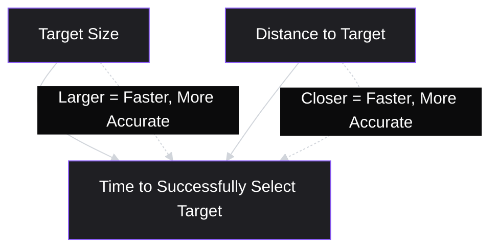
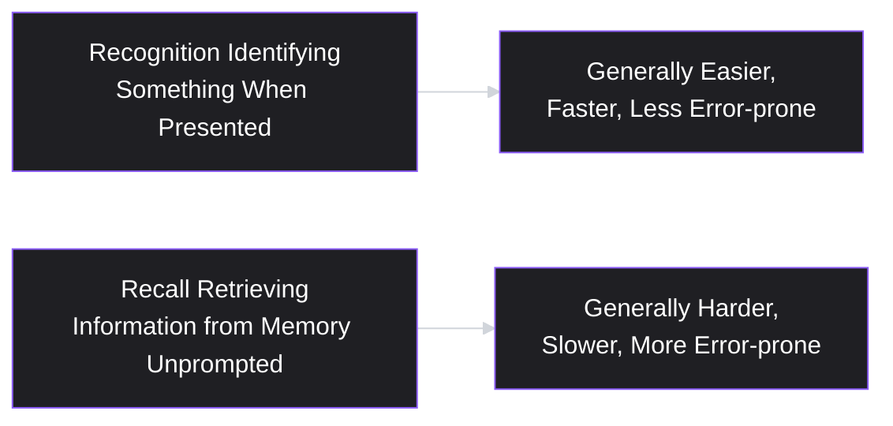
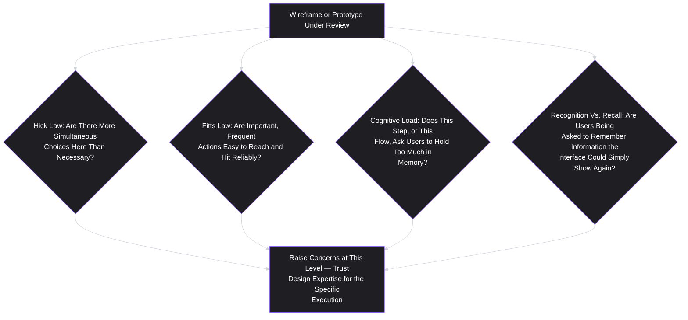

# Lesson 27: UX Principles for Product Managers

## Why This Lesson Matters

Lessons 25 and 26 covered *how* to iterate on structure and interactivity cheaply, before committing to full development — wireframes for layout, prototypes for interaction. What neither lesson addressed is *what actually makes an interface good*, once you're deciding between two structurally valid layouts or two functionally working interaction patterns. This lesson fills that gap with a small set of durable UX principles — not a comprehensive design education, which is a genuinely separate discipline with its own multi-year expertise, but the specific, well-established principles a PM needs to participate meaningfully in design decisions, ask good questions, and recognize when a proposed design is likely to cause real friction, without overstepping into territory that belongs to a trained designer's expertise.

This lesson exists because PMs sit in an uncomfortable middle position on design: enough involvement to ask good questions and catch clear problems, not enough formal training to make expert visual or interaction design judgments unilaterally. The principles covered here are chosen specifically because they're durable (not trend-dependent), broadly applicable across product categories, and genuinely useful for a PM's actual job — evaluating whether a design decision serves the validated problem (Lesson 17) and the user's actual cognitive experience, not dictating the specific visual execution, which properly belongs to design expertise per Lesson 22's Precision Dial.

---

## Learning Path

| Field | Detail |
|---|---|
| **Module** | 3 — Product Design |
| **Current Lesson** | 27 of 90 |
| **Difficulty** | 3 / 10 |
| **Estimated Study Time** | 25 minutes (reading) + 15 minutes (reflection + quiz) |
| **Prerequisites** | Lesson 22 (Product Requirements Document), Lesson 26 (Prototyping) |
| **Next Lesson** | Lesson 28 — Information Architecture |
| **Future Topics Unlocked** | Lesson 28 (Information Architecture), Lesson 29 (Prioritization Fundamentals) |

---

## Learning Objectives

By the end of this lesson, you will be able to:

1. Explain and apply Hick's Law and Fitts's Law to evaluate interface decisions involving choice quantity and target interaction.
2. Apply the concept of cognitive load to identify when an interface is asking too much of a user's working memory.
3. Distinguish recognition from recall, and explain why interfaces that favor recognition generally reduce user effort.
4. Identify the "PM as design dictator" failure pattern, distinguishing legitimate UX evaluation from overstepping into design's domain of expertise.
5. Apply these principles as a review lens on a wireframe or prototype, without prescribing specific visual solutions.

---

## Prerequisites

Lesson 22 (Product Requirements Document) and Lesson 26 (Prototyping). This lesson assumes fluency with the Precision Dial (specifying the what/why while leaving the how to design expertise) and extends it directly: these UX principles give a PM a *what* to specify — reduced cognitive load, favoring recognition, appropriate choice quantity — without dictating the specific *how* a designer would use to achieve it.

---

## Theory

### Hick's Law: More Choices, More Time

**Hick's Law** states that the time it takes a person to make a decision increases with the number and complexity of choices available. This has a direct, practical implication for interface design: a screen presenting many options simultaneously — a long navigation menu, an extensive settings page, a form with many equally weighted fields — increases the cognitive burden and decision time for every person who encounters it, regardless of how well each individual option is designed.

This does not mean fewer options are always better in an absolute sense — some tasks genuinely require presenting many options (a product catalog, for instance) — but it does mean that **unnecessary** choice proliferation carries a real cost, and that progressive disclosure (revealing options only as needed, rather than presenting everything simultaneously) is often a legitimate design response to Hick's Law, one a PM can advocate for at the level of "should we reduce the number of simultaneous choices here" without dictating the specific visual mechanism (a dropdown, a multi-step wizard, a search-first interface) design should use to achieve it.

### Fitts's Law: Distance, Size, and Time to Target

**Fitts's Law** describes the relationship between the time required to move to and successfully select a target and two factors: the target's size and its distance from the user's current position. Larger, closer targets are faster and easier to select accurately; smaller, more distant targets take longer and are more error-prone.

This principle has direct, practical implications for interaction design that a PM can evaluate without needing to specify exact pixel measurements: is a frequently used action (like a primary call-to-action button) sized and positioned appropriately for its importance and frequency of use, or is it small and tucked into a corner, forcing users to move precisely to a small, distant target repeatedly? A PM applying Fitts's Law as a review lens asks "is this important, frequent action easy to reach and hit reliably?" — a what-level question — rather than specifying "make the button exactly 48 pixels tall and position it at these exact coordinates," which is properly a design implementation decision.

### Cognitive Load

**Cognitive load** refers to the total amount of mental effort being used in a person's working memory at a given moment. Interfaces that require a user to remember multiple pieces of information simultaneously, track state across several screens, or process several unrelated decisions at once impose higher cognitive load than interfaces that surface only what's immediately relevant, reduce the need to hold information in memory across steps, and clearly indicate current state.

A practical, PM-relevant application of this principle: reviewing a multi-step flow (echoing Lesson 15's journey maps and Lesson 25's wireframes) and asking, at each step, whether the user is being asked to remember something from a previous step that the interface could instead simply display again, or whether multiple, unrelated decisions have been bundled into a single screen when they could be sequenced or grouped more coherently. This is a question about the user's cognitive experience — squarely within a PM's legitimate concern, since it connects directly to the validated pain points and jobs (Lessons 6 and 16) the solution is meant to serve — without dictating the specific visual or interaction design used to reduce that load.

### Recognition vs. Recall

A closely related, highly practical principle: **recognition** (identifying something correctly when it's presented, such as choosing the right option from a visible list) is generally easier and faster for people than **recall** (retrieving information from memory without any cue, such as remembering and typing an exact command or a previously seen value). Interfaces that favor recognition — showing available options, previously entered information, or relevant context directly, rather than requiring a user to remember and re-enter or re-derive it — generally reduce user effort and error.

A practical example: an interface requiring a user to remember an account number from a previous screen and manually re-type it later favors recall; an interface that instead displays the relevant account information directly at the point where it's needed favors recognition. A PM reviewing a design can legitimately ask "are we requiring users to recall information we could instead simply show them again," a what-level observation, without specifying exactly how a designer should visually surface that information.

### The "PM as Design Dictator" Failure Pattern

A specific, important failure pattern — directly extending Lesson 22's over-specification warning — is a PM using these UX principles (or any design knowledge) as license to dictate specific visual or interaction design solutions, rather than raising the underlying cognitive or usability concern and trusting design expertise to determine the best specific execution. "This button needs to be blue and 60 pixels wide" is design dictation; "this frequently used action seems hard to locate and select reliably — can we make it easier to find and hit?" is legitimate UX evaluation, appropriately pitched at the level of the underlying principle (Fitts's Law, in this case) rather than a specific implementation prescription.

This distinction matters for the same reason Lesson 22 emphasized it at the level of a PRD: a PM's UX knowledge, however genuine, is not equivalent to a trained designer's expertise in visual design, interaction patterns, accessibility standards, and the many other considerations that inform a well-executed specific solution. A PM who has learned these principles well enough to notice a real problem has done valuable, legitimate work; a PM who uses that same knowledge to unilaterally prescribe the specific fix has overstepped into a domain where a different kind of expertise deserves to lead.

---

## Common Beginner Mistakes

**Mistake 1: Using Hick's Law to argue that fewer options are always better, regardless of the task.**
Some tasks genuinely require presenting many options; the principle concerns the cost of *unnecessary* choice proliferation, not a blanket mandate for minimalism regardless of context.

**Mistake 2: Applying Fitts's Law by specifying exact pixel dimensions or coordinates, rather than raising the underlying concern.**
This crosses from legitimate UX evaluation into design dictation — the appropriate PM-level observation is "is this important action easy to reach and hit reliably," not a specific implementation prescription.

**Mistake 3: Failing to recognize cognitive load concerns in a multi-step flow, focusing only on individual screens in isolation.**
Cognitive load often accumulates across a sequence of steps (echoing Lesson 15's full-journey view), not just within any single screen — a review that only evaluates screens independently can miss load that builds up across the whole flow.

**Mistake 4: Requiring users to recall information the interface could simply display again (favoring recall over recognition) without noticing the cost.**
This is a subtle, easy-to-miss usability cost, since the interface may function correctly in a narrow technical sense while still imposing unnecessary user effort.

**Mistake 5: Treating UX principle fluency as license to dictate specific visual or interaction design solutions.**
This is the "PM as design dictator" failure pattern — raising a genuine concern is valuable; prescribing the specific fix oversteps into design's domain of expertise.

---

## Mental Model: The UX Principle Review Lens

This lesson's mental model is the **UX Principle Review Lens** — a set of questions, derived from the four principles above, that a PM can apply when reviewing a wireframe or prototype, pitched consistently at the level of underlying concern rather than specific implementation.

Use this lens consistently as a review discipline: for each question, if a genuine concern surfaces, raise it explicitly and specifically (naming the principle and the specific step or element involved), then stop — resist the pull toward specifying the exact fix, and trust the design conversation that follows to determine the best specific solution.

---

## Real Company Example

**Google**'s well-documented emphasis on minimizing cognitive load and choice complexity in its core search interface — a single input field, deliberately free of the extensive simultaneous options many competing products in adjacent categories present — is a widely discussed illustration of Hick's Law and cognitive load principles applied at the highest level of a product's core interaction. Public design commentary and Google's own publicly shared design philosophy documentation have described a long-standing emphasis on simplicity and minimal cognitive burden in the core search experience specifically, even as many advanced options and features exist and are deliberately kept out of the primary, most frequently used interaction surface — a practical example of progressive disclosure responding directly to the choice-proliferation cost this lesson describes.

*(Assumption flagged: this reflects widely reported, publicly shared descriptions of Google's general design philosophy rather than a claim about the company's complete, current internal design rationale for every specific feature, which this curriculum does not claim certainty about.)*

---

## Real World Perspective: UX Principles at Different Company Stages

**At a startup:**
PMs often work in especially close, informal collaboration with a small design team (or, in the earliest stages, may be responsible for some design work themselves), making fluency with these principles directly useful for making faster, more confident calls in the absence of a large, formal design review process — the risk of "PM as design dictator" is often heightened at this stage precisely because informal collaboration can blur the line between raising a concern and unilaterally deciding a specific solution.

**At a mid-size company:**
UX principle fluency helps a PM participate credibly and usefully in more formal design review processes, asking specific, principle-grounded questions rather than vague aesthetic preferences, and helps build productive working relationships with design teams who generally welcome informed, well-articulated concerns pitched at the appropriate level, rather than either uninformed silence or inappropriate design dictation.

**At Big Tech:**
UX principles often intersect with established, rigorously tested design systems and platform-level interaction conventions, and a PM's most valuable contribution at this scale is often recognizing when a proposed design deviates from well-established, principle-grounded conventions for a good reason versus for an insufficiently examined one — bringing genuine scrutiny without assuming every deviation from convention is automatically wrong.

---

## Detailed Case Study: The Form That Asked Too Much at Once

Consider a simplified, illustrative scenario common across B2B software onboarding flows.

A team designs a new account-setup form for a project management tool, presenting all required fields — company name, team size, primary use case, industry, preferred notification settings, and integration preferences — simultaneously on a single screen, reasoning that a single screen is more "efficient" than a multi-step flow. During internal review, a PM familiar with UX principles from this lesson raises a specific concern: "This screen presents six distinct, largely unrelated decisions simultaneously — per Hick's Law and cognitive load principles, this is likely to increase abandonment, since users are being asked to process too much at once before receiving any value from the product." The PM does not, however, specify a particular alternative layout, deferring that decision to the design team's expertise.

The design team responds by proposing a specific, appropriately staged solution: splitting the form into a shorter, immediately necessary first step (company name and team size, required to create a functional account) followed by progressively disclosed additional steps (use case, industry, and integration preferences) presented later, once the user has already experienced some initial product value — directly applying progressive disclosure as the design team's own chosen response to the cognitive-load concern the PM raised.

Usability testing on the revised, staged flow shows meaningfully improved completion rates compared to the original single-screen version, confirming the concern was genuine and worth addressing.

**What went wrong, and then went right?**

Applying this lesson's frameworks:

1. **The original single-screen design violated both Hick's Law and cognitive load principles simultaneously** — presenting six distinct, largely unrelated decisions at once forced users to process an unnecessarily high decision burden before receiving any product value, a foreseeable risk this lesson's principles would have flagged before the design was even built.
2. **The PM's intervention was correctly pitched at the level of underlying concern, not specific implementation.** The PM named the specific principles (Hick's Law, cognitive load) and the specific problem (six unrelated decisions bundled together), but explicitly left the choice of solution (a staged, progressively disclosed flow, in this case) to the design team's expertise — avoiding the "PM as design dictator" failure pattern while still raising a genuinely valuable, principle-grounded concern.
3. **The design team's chosen solution (progressive disclosure via staged steps) was validated through subsequent usability testing (Lesson 26)**, rather than assumed correct simply because it addressed the stated concern — closing the loop between raising a UX concern and confirming, through genuine testing, that the resulting solution actually resolved it.

This case connects directly back to **Lesson 22's Precision Dial**: the PM specified the what (an unnecessary cognitive burden, tied to a specific, well-established principle) and the why (likely increased abandonment), while explicitly leaving the how (the specific staging and disclosure mechanism) to design's expertise — precisely the discipline this lesson's failure-pattern warning describes.

---

## Framework Explanation: The Principle-to-Concern Translation Table

A practical table for translating each UX principle into an appropriately pitched, what-level review question, rather than a specific implementation prescription:

| Principle | Appropriately Pitched Question | Inappropriate Overstep |
|---|---|---|
| Hick's Law | "Are we presenting more simultaneous choices here than the user actually needs at this moment?" | "Reduce this to exactly three options and use a dropdown." |
| Fitts's Law | "Is this important, frequently used action easy to reach and select reliably?" | "Make this button exactly 48 pixels tall and move it to the top-right corner." |
| Cognitive Load | "Are we asking users to hold too much information in mind across this flow?" | "Combine these three screens into exactly two, structured this specific way." |
| Recognition vs. Recall | "Are we requiring users to remember something we could simply show them again?" | "Add a tooltip here that displays this exact text in this exact location." |

The consistent discipline this table reinforces: **every principle translates into a question about user experience and cognitive burden, never into a specific visual or interaction design prescription** — the question is the PM's legitimate contribution; the answer belongs to design.

---

## Interview Perspective: How Interviewers Think About This

**Typical question 1: "How do you evaluate whether a proposed design is likely to cause usability problems, without a formal design background?"**
*What the interviewer is actually evaluating:* Whether the candidate can name specific, established principles (Hick's Law, Fitts's Law, cognitive load) and apply them as genuine review questions, rather than relying on vague, untethered aesthetic preference or personal intuition alone.

**Typical question 2: "Tell me about a time you raised a UX concern with a design team. How did you frame it?"**
*What the interviewer is actually evaluating:* Whether the candidate framed the concern at the level of underlying principle and user impact, deferring specific solution choice to design's expertise, versus prescribing a specific fix unilaterally — directly testing for the "PM as design dictator" failure pattern.

**Typical question 3: "How do you balance having enough UX knowledge to be useful in design reviews without overstepping into design's domain?"**
*What the interviewer is actually evaluating:* Direct self-awareness of the boundary this lesson describes — whether the candidate can articulate a clear, principled distinction between raising a legitimate concern and dictating a specific solution, rather than treating the boundary as vague or unimportant.

---

## Summary

A small set of durable UX principles — Hick's Law (more choices increase decision time), Fitts's Law (target size and distance affect interaction speed and accuracy), cognitive load (the total mental effort required at a given moment), and recognition versus recall (recognizing presented information is generally easier than recalling it from memory) — give a PM enough grounding to participate meaningfully in design review without requiring full design expertise. Each principle translates into a specific, appropriately pitched review question about user experience and cognitive burden — never into a specific visual or interaction design prescription, which is properly design's domain. The "PM as design dictator" failure pattern describes using UX knowledge as license to unilaterally prescribe specific solutions rather than raising the underlying concern and trusting design expertise to determine execution, directly extending Lesson 22's Precision Dial into the design-review context. As shown in this lesson's Detailed Case Study, a well-pitched, principle-grounded concern (raised at the level of "why," not "how") can lead to a genuinely better design outcome, validated through subsequent usability testing, without the PM ever needing to specify the exact solution themselves.

---

## Key Takeaways

- Hick's Law: decision time increases with the number and complexity of available choices — unnecessary choice proliferation carries a real cost.
- Fitts's Law: target size and distance affect interaction speed and accuracy — important, frequent actions should be easy to reach and hit reliably.
- Cognitive load: interfaces that require holding multiple pieces of information in working memory across steps impose real, measurable user effort.
- Recognition (identifying presented information) is generally easier than recall (retrieving information from memory unprompted) — interfaces favoring recognition reduce user effort.
- Every principle should translate into a what-level review question about user experience, never into a specific visual or interaction design prescription.
- "PM as design dictator" describes overstepping from legitimate concern-raising into unilateral solution prescription, which belongs to design's expertise.
- A well-pitched, principle-grounded concern, left open for design's expertise to resolve, can produce genuinely validated improvements — as shown in this lesson's Detailed Case Study.

---

## Cheat Sheet

*A two-minute review of everything in this lesson.*

- **Hick's Law:** more choices = more decision time. Watch for unnecessary choice proliferation.
- **Fitts's Law:** bigger, closer targets = faster, more accurate selection. Check important actions are easy to reach and hit.
- **Cognitive load:** don't make users hold too much in working memory across a flow.
- **Recognition > Recall:** show information again rather than requiring users to remember it.
- **Pitch every concern as a "what/why" question** ("is this easy to reach?"), never a "how" prescription ("make it 48px").
- **PM as Design Dictator** = overstepping from concern to unilateral solution — always defer specific execution to design expertise.

---

## Glossary

| Term | Definition | Related Concepts | Difficulty |
|---|---|---|---|
| Hick's Law | The principle that decision time increases with the number and complexity of available choices. | Cognitive Load | 2 |
| Fitts's Law | The principle relating target size and distance to the speed and accuracy of interaction. | UX Principle Review Lens | 2 |
| Cognitive Load | The total amount of mental effort used in working memory at a given moment. | Hick's Law, Recognition vs. Recall | 2 |
| Recognition vs. Recall | The distinction between identifying presented information (easier) and retrieving information from memory unprompted (harder). | Cognitive Load | 2 |
| "PM as Design Dictator" (Failure Pattern) | Using UX knowledge to unilaterally prescribe specific design solutions rather than raising concerns and deferring execution to design expertise. | Precision Dial (Lesson 22) | 2 |

---

## Further Reading / Resources

- Don Norman, *The Design of Everyday Things* — a foundational, widely cited treatment of usability principles including cognitive load and recognition/recall, directly relevant to this lesson's core concepts.
- Steve Krug, *Don't Make Me Think* — a practical, accessible treatment of reducing cognitive burden in interface design, closely related to this lesson's core arguments.
- Susan Weinschenk, *100 Things Every Designer Needs to Know About People* — includes accessible treatments of Hick's Law, Fitts's Law, and related cognitive principles for practitioners without formal design training.

---

## Flashcards

**Card 1**
- Front: What does Hick's Law state, and what is its practical implication for interface design?
- Back: Decision time increases with the number and complexity of available choices; unnecessary choice proliferation carries a real cognitive cost, making progressive disclosure a common design response.
- Difficulty: 2
- Tags: hicks-law

**Card 2**
- Front: What does Fitts's Law state?
- Back: The time required to move to and successfully select a target depends on the target's size and distance — larger, closer targets are faster and more accurate to select.
- Difficulty: 2
- Tags: fitts-law

**Card 3**
- Front: What is cognitive load, and why does it matter for a multi-step flow?
- Back: The total mental effort used in working memory at a given moment; cognitive load can accumulate across a sequence of steps, not just within any single screen, making full-flow review important.
- Difficulty: 2
- Tags: cognitive-load

**Card 4**
- Front: Why do interfaces favoring recognition over recall generally reduce user effort?
- Back: Recognizing presented information is generally easier and faster than retrieving information from memory unprompted — showing relevant information again, rather than requiring users to remember it, reduces effort and error.
- Difficulty: 2
- Tags: recognition-vs-recall

**Card 5**
- Front: What is the "PM as design dictator" failure pattern?
- Back: Using UX principle knowledge to unilaterally prescribe specific visual or interaction design solutions, rather than raising the underlying concern and deferring specific execution to design expertise.
- Difficulty: 2
- Tags: pm-as-design-dictator

**Card 6**
- Front: How should a PM appropriately pitch a UX concern, according to this lesson?
- Back: At the level of underlying principle and user impact (the "what/why," e.g., "is this important action easy to reach?"), never as a specific implementation prescription (the "how," e.g., exact pixel dimensions).
- Difficulty: 2
- Tags: appropriate-pitch

**Card 7**
- Front: In the Detailed Case Study, what specific solution did the design team propose in response to the PM's cognitive-load concern, and how was it validated?
- Back: A staged, progressively disclosed flow (splitting six simultaneous decisions into an immediate first step and later, deferred steps); it was validated through usability testing showing improved completion rates compared to the original single-screen version.
- Difficulty: 3
- Tags: case-study

---

## Reflection Exercise

You are the PM for a subscription meal-kit app, reviewing a wireframe for a new "customize your next delivery" screen, which currently displays fifteen simultaneous options: recipe substitutions, portion size, delivery date, delivery address, dietary restriction filters, packaging preferences, and several others, all on one screen.

Work through the following, in writing, before reading further:

1. Apply Hick's Law to this screen: what specific concern would you raise, and how would you phrase it at the appropriate "what/why" level rather than prescribing a specific fix?
2. Identify one element on this screen that might raise a Fitts's Law concern (consider which action is likely used most frequently, and whether it's likely to be easy or hard to reach and select based on the description given).
3. Describe one specific way this screen might impose unnecessary cognitive load across a broader flow (consider whether users need to remember something from an earlier step, such as their dietary restrictions, that this screen could simply display again).
4. Using the Principle-to-Concern Translation Table, write your review feedback for this screen in a form that raises genuine concerns without dictating specific visual solutions.
5. Identify one boundary you would deliberately not cross in this review, to avoid the "PM as design dictator" failure pattern, and explain why.

There is no single correct answer. The purpose of this exercise is to practice applying these principles as review questions pitched at the appropriate level, rather than either ignoring genuine usability concerns or overstepping into design's domain of expertise.

---

## Quiz

**1. What does Hick's Law state?**
A) Larger targets are always visually more appealing
B) The time required to make a decision increases with the number and complexity of available choices
C) Users always prefer recall-based interfaces over recognition-based ones
D) Cognitive load only matters within a single screen, never across a flow

*Correct answer: B*
*Explanation: This is the lesson's explicit statement of Hick's Law, distinct from the other listed principles and misconceptions.*
*Learning objective tested: #1*
*Difficulty: Easy*

---

**2. What does Fitts's Law describe?**
A) The relationship between target size, distance, and the time/accuracy of successfully selecting that target
B) The number of colors a designer should use in an interface
C) The maximum number of screens a user flow should contain
D) The relationship between cognitive load and user satisfaction scores

*Correct answer: A*
*Explanation: This is the lesson's explicit statement of Fitts's Law, concerning target size, distance, and interaction speed/accuracy.*
*Learning objective tested: #1*
*Difficulty: Easy*

---

**3. Why is unnecessary choice proliferation a concern, according to Hick's Law, even though presenting many options is sometimes genuinely necessary?**
A) Because more options always look visually cluttered
B) Because unnecessary additional choices increase decision time and cognitive burden without providing corresponding value, even though some tasks do genuinely require presenting many options
C) Because Hick's Law states that users should never be given more than one choice under any circumstances
D) Because choice proliferation is illegal under most accessibility standards

*Correct answer: B*
*Explanation: The lesson explicitly clarifies that the principle concerns the cost of unnecessary choice proliferation specifically, not a blanket rule against ever presenting multiple options.*
*Learning objective tested: #1*
*Difficulty: Easy*

---

**4. Which of the following is the clearest example of favoring recall over recognition, a pattern this lesson identifies as generally increasing user effort?**
A) Displaying a user's previously entered shipping address again at checkout for confirmation
B) Requiring a user to remember and manually re-type an account number they saw on a previous screen
C) Showing a dropdown list of valid options for a user to select from
D) Displaying a clear error message immediately after an invalid input

*Correct answer: B*
*Explanation: Requiring a user to remember and re-type information from memory, without displaying it again, is the defining example of recall, which this lesson identifies as generally harder and more error-prone than recognition.*
*Learning objective tested: #1*
*Difficulty: Easy*

---

**5. What is the "PM as design dictator" failure pattern?**
A) A PM who never provides any feedback on design work
B) A PM using UX knowledge to unilaterally prescribe specific visual or interaction design solutions, rather than raising concerns and deferring execution to design expertise
C) A PM who only reviews wireframes, never prototypes
D) A required leadership role within a design organization

*Correct answer: B*
*Explanation: This is the lesson's explicit definition of the failure pattern, directly extending Lesson 22's over-specification warning to the design-review context.*
*Learning objective tested: #4*
*Difficulty: Easy*

---

**6. Which of the following review comments correctly applies Fitts's Law without overstepping into design dictation, according to this lesson?**
A) "Make this button exactly 48 pixels tall and move it to the top-right corner."
B) "This is our most frequently used action — is it currently easy to reach and select reliably?"
C) "I don't have any thoughts on this button's placement or size."
D) "Change this button's color to blue immediately."

*Correct answer: B*
*Explanation: This comment raises the underlying concern (ease of reaching and selecting an important action) at an appropriately pitched level, without prescribing a specific pixel dimension or exact placement, unlike option A.*
*Learning objective tested: #5*
*Difficulty: Easy*

---

**7. In the Detailed Case Study, which two UX principles did the original single-screen account-setup form violate simultaneously?**
A) Fitts's Law and recognition vs. recall
B) Hick's Law and cognitive load
C) Only Hick's Law, with no other principle involved
D) Only cognitive load, with no other principle involved

*Correct answer: B*
*Explanation: The case study explicitly identifies both Hick's Law (too many simultaneous choices) and cognitive load (too much unrelated information to process at once) as being violated by the original design.*
*Learning objective tested: #2, #3*
*Difficulty: Medium*

---

**8. How did the PM in the Detailed Case Study correctly avoid the "PM as design dictator" failure pattern?**
A) By refusing to raise any concern about the form at all
B) By naming the specific principles and underlying problem (six unrelated decisions bundled together) while explicitly leaving the choice of specific solution to the design team's expertise
C) By specifying the exact number of steps and fields for each step personally
D) By requiring the design team to use a specific named UX methodology

*Correct answer: B*
*Explanation: The case study explicitly describes the PM raising the concern at the level of principle and problem, then deferring the specific solution (progressive disclosure via staged steps) to the design team.*
*Learning objective tested: #4, #5*
*Difficulty: Medium*

---

**9. (Scenario) A PM reviewing a wireframe notices that a checkout flow requires users to remember a promo code they saw on an earlier marketing email, with no way to view or reference it again during checkout. Which principle is most directly relevant to this concern?**
A) Fitts's Law
B) Recognition vs. recall
C) Hick's Law
D) None of these principles apply to this scenario

*Correct answer: B*
*Explanation: This scenario directly concerns requiring users to recall information from memory (the promo code) rather than allowing recognition (displaying or referencing it again), making recognition vs. recall the most directly relevant principle.*
*Learning objective tested: #3*
*Difficulty: Medium-Hard*

---

**10. (Product Thinking) A PM raises a cognitive-load concern about a multi-step flow, correctly noting that later steps require remembering choices made in earlier steps. According to this lesson, what should the PM do next?**
A) Personally redesign the flow to fix the issue, without involving the design team
B) Raise the concern at the level of underlying principle and user impact, and defer the specific solution (e.g., a persistent summary panel, a review step) to the design team's expertise
C) Ignore the concern entirely, since cognitive load is not a legitimate PM-level consideration
D) Demand that the entire flow be reduced to a single screen regardless of any other consideration

*Correct answer: B*
*Explanation: This reflects the lesson's core discipline — raising the concern at the appropriate level while deferring specific solution design to the relevant expertise, avoiding the "PM as design dictator" pattern.*
*Learning objective tested: #4, #5*
*Difficulty: Medium-Hard*

---

**11. (Interview Reasoning) A candidate describes reviewing a prototype and telling the design team exactly which specific font size, color, and spacing to use for every element, based on their own reading about UX principles. What might this signal, based on this lesson's Interview Perspective section?**
A) Strong, well-informed UX judgment that should be considered a core strength
B) A likely instance of the "PM as design dictator" failure pattern, overstepping from legitimate concern-raising into design's domain of specific implementation expertise
C) That the candidate should be considered for a design role instead of a PM role
D) Nothing meaningful, since specifying exact visual details is always appropriate once a PM has read about UX principles

*Correct answer: B*
*Explanation: This directly matches the lesson's definition of the failure pattern — even genuine UX knowledge does not license dictating specific implementation details that belong to design expertise.*
*Learning objective tested: #4*
*Difficulty: Hard*

---

**12. (Product Thinking, Higher Difficulty) A design team proposes reducing a settings page from twelve simultaneous options to four, citing Hick's Law, but a PM is concerned this might remove options some users genuinely need regularly. What is the most appropriate way to resolve this tension, according to this lesson?**
A) The PM should defer entirely to the design team's citation of Hick's Law without further discussion, since the principle is well-established
B) The PM should raise the specific concern (some users may need regular access to the removed options) as a distinct, evidence-relevant question, potentially suggesting further validation (e.g., usability testing per Lesson 26) to check whether progressive disclosure appropriately serves those users' actual needs, without dictating the specific solution
C) The PM should insist all twelve options remain visible simultaneously, overriding the design team's proposal entirely
D) Hick's Law should be disregarded entirely in this case, since it conflicts with the PM's intuition

*Correct answer: B*
*Explanation: This reflects a balanced application of this lesson's discipline — raising a genuine, evidence-relevant concern about real user needs, and suggesting validation, without either deferring uncritically or overriding design's proposal unilaterally.*
*Learning objective tested: #2, #4, #5*
*Difficulty: Medium-Hard*

---

**13. (Interview Reasoning, Higher Difficulty) An interviewer asks a candidate how they would respond if a designer disagreed with a UX concern the candidate raised, arguing that a specific established convention justified the design as-is. What is the strongest response, based on this lesson?**
A) Insisting the designer is wrong regardless of the convention cited, since the candidate's principle-based concern should always take precedence
B) Genuinely engaging with the cited convention and the underlying rationale, potentially proposing a specific test (echoing Lesson 26) to check whether the convention holds in this specific context, rather than either capitulating without genuine engagement or overriding the designer's expertise unilaterally
C) Immediately dropping the concern entirely without further discussion, regardless of its merit
D) Escalating to senior leadership immediately without further direct engagement with the designer

*Correct answer: B*
*Explanation: This reflects the lesson's collaborative, evidence-oriented discipline — genuinely engaging with design's expertise and proposing validation where appropriate, rather than either unilaterally overriding it or abandoning a potentially valid concern without discussion.*
*Learning objective tested: #4, #5*
*Difficulty: Hard*

---

**14. (Product Thinking, Higher Difficulty) A PM notices that an interface violates cognitive load principles by requiring users to remember dietary restrictions entered on a previous screen. The PM raises this concern, and the design team responds by adding a persistent summary panel that displays these restrictions throughout the flow. How should the PM verify this solution actually resolves the concern, rather than simply assuming it does?**
A) Assume the concern is fully resolved once any visible change has been made, without further verification
B) Apply Lesson 26's usability testing discipline — testing the revised flow with real users to confirm the persistent summary panel actually reduces the cognitive burden and improves the user experience, rather than assuming the proposed fix is automatically correct
C) Insist on a completely different solution without testing either option
D) Skip verification entirely, since the design team's expertise should never be questioned once a change has been proposed

*Correct answer: B*
*Explanation: This connects this lesson directly back to Lesson 26 — a proposed design change addressing a raised UX concern should still be validated through genuine usability testing, rather than assumed correct simply because a change was made, echoing the Detailed Case Study's validation step.*
*Learning objective tested: #4, #5*
*Difficulty: Hard*

---

**15. (Highest Difficulty) A PM has become skilled at applying Hick's Law, Fitts's Law, cognitive load, and recognition/recall principles, and routinely raises well-pitched, appropriately leveled concerns during design reviews. Over time, however, the PM notices that the design team has started deferring almost every decision to the PM's stated principle-based preferences, rather than exercising independent design judgment. What does this scenario suggest, and what should the PM do?**
A) Continue as before, since the design team's deference reflects the PM's superior UX judgment
B) Recognize that even well-pitched, principle-grounded concerns can gradually erode a healthy collaborative dynamic if the design team begins treating them as de facto prescriptions rather than genuine starting points for discussion — the PM should actively encourage the design team to propose and test their own solutions, rather than treating the PM's framing as the final word
C) Stop raising any UX concerns entirely, to avoid any possibility of overstepping
D) This scenario has no meaningful implications and requires no adjustment in practice

*Correct answer: B*
*Explanation: This tests a subtler, higher-order point — even correctly pitched concerns, raised consistently and skillfully, can unintentionally shift a team's dynamic toward the PM's implicit authority over design decisions if not actively counterbalanced, requiring the PM to remain vigilant about preserving genuine design ownership and independent judgment, not merely about phrasing each individual concern correctly.*
*Learning objective tested: #4, #5*
*Difficulty: Hard*

---

## Connections

| | Lesson | Core Idea Carried Forward |
|---|---|---|
| **Previous Lesson** | Lesson 26 — Prototyping | Provides the interactive artifact that UX principles are applied to during review, before and alongside usability testing |
| **Current Lesson** | Lesson 27 — UX Principles for Product Managers | Hick's Law; Fitts's Law; cognitive load; recognition vs. recall; the "PM as design dictator" failure pattern |
| **Next Lesson** | Lesson 28 — Information Architecture | Extends cognitive load and choice-organization principles into a dedicated discipline for structuring information and navigation |
| **Future Concepts Unlocked** | Lesson 29 (Prioritization Fundamentals) | Uses UX-informed usability considerations as one input into broader initiative prioritization |

This curriculum is designed to be read as one continuous argument. From this lesson forward, any reference to "usability feedback" assumes the principle-grounded, appropriately pitched review discipline covered here — this will not be re-explained, only re-applied.
