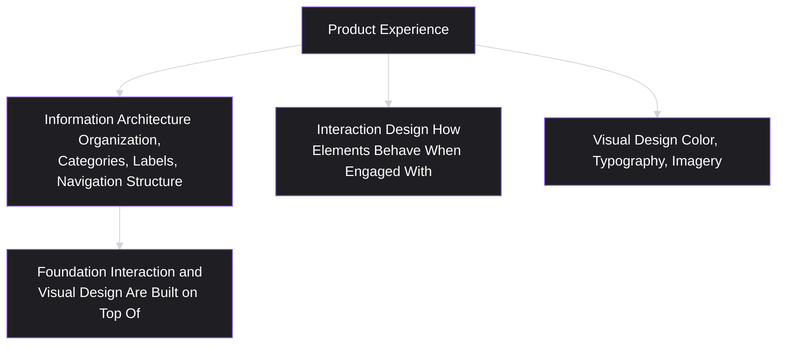
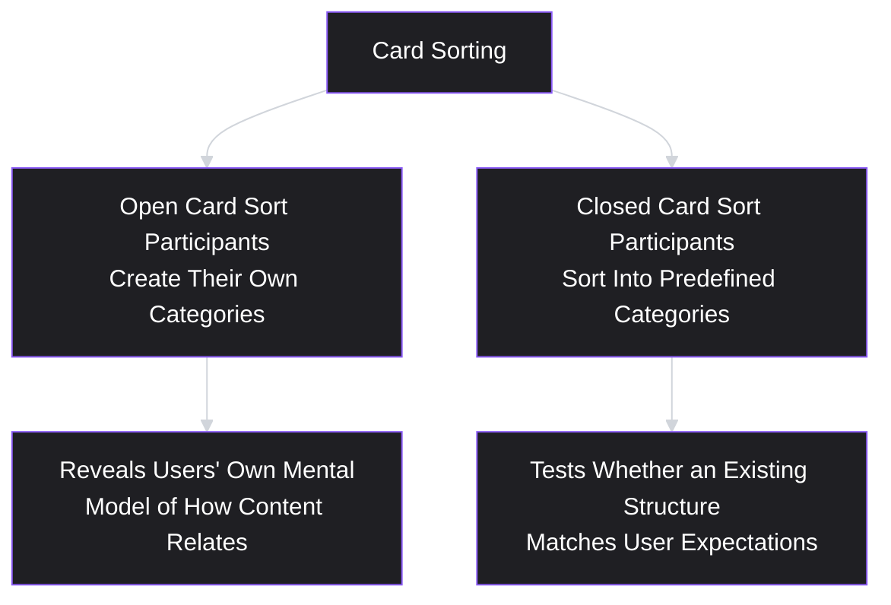
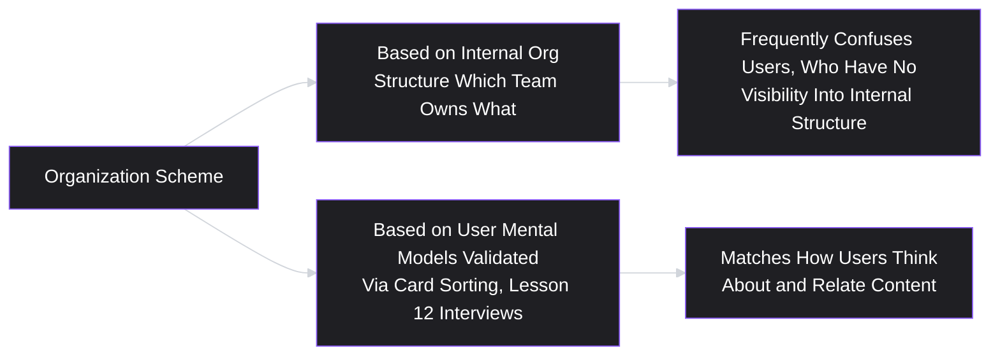
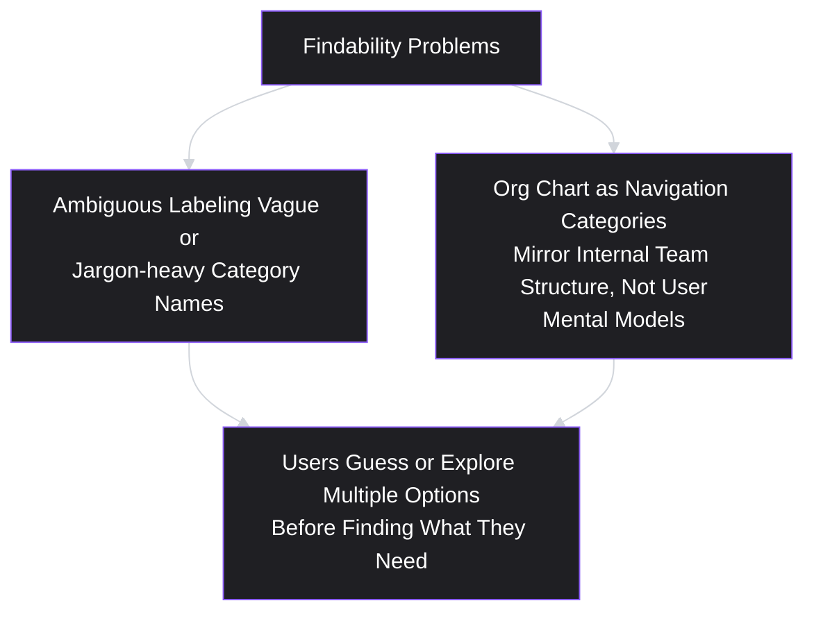
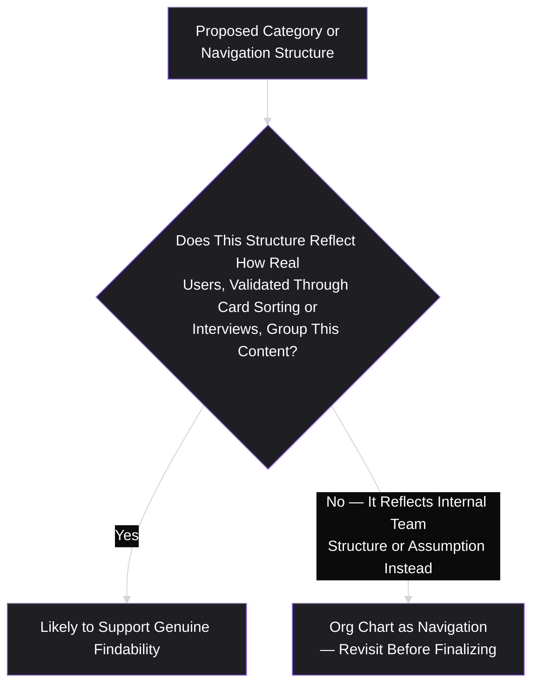

# Lesson 28: Information Architecture

## Why This Lesson Matters

Lesson 27's Detailed Case Study ended with a design team solving a cognitive-load problem by splitting a single overloaded screen into a staged, progressively disclosed flow. That solution worked because someone had implicitly made a decision about *how information should be organized and grouped* — which fields belong together, which can wait, what the underlying categories even are. This lesson makes that implicit decision explicit and gives it a name: **information architecture**, the practice of organizing, structuring, labeling, and connecting content and functionality so that people can find what they need and understand where they are, across an entire product, not just within a single screen or flow.

This lesson matters because information architecture problems are often invisible until they cause real damage — a confusing category structure, an inconsistent labeling scheme, or a navigation hierarchy that doesn't match how users actually think about a product's content rarely shows up as a single dramatic bug. Instead, it shows up as a slow, steady accumulation of failed searches, abandoned tasks, and support tickets asking "where do I find X," each individually minor but collectively reflecting a structural problem no single screen-level fix can resolve. This is the module's final design-specific lesson before Lesson 29 folds everything covered so far into a formal prioritization discipline.

---

## Learning Path

| Field | Detail |
|---|---|
| **Module** | 3 — Product Design |
| **Current Lesson** | 28 of 90 |
| **Difficulty** | 4 / 10 |
| **Estimated Study Time** | 25 minutes (reading) + 15 minutes (reflection + quiz) |
| **Prerequisites** | Lesson 15 (User Journey Mapping), Lesson 18 (Customer Segmentation), Lesson 27 (UX Principles for Product Managers) |
| **Next Lesson** | Lesson 29 — Prioritization Fundamentals (closing Module 3) |
| **Future Topics Unlocked** | Lesson 29 (Prioritization Fundamentals) |

---

## Learning Objectives

By the end of this lesson, you will be able to:

1. Define information architecture and distinguish it from visual design and interaction design.
2. Apply card sorting as a technique for validating a category structure against users' actual mental models, rather than the organization's internal structure.
3. Distinguish organization schemes based on users' mental models from those based on internal organizational structure, and explain why the latter frequently fails users.
4. Apply the concept of findability and identify common failure patterns: ambiguous labeling and "org chart as navigation."
5. Distinguish appropriate information architecture validation from over-engineering a taxonomy no one will actually use as designed.

---

## Prerequisites

Lesson 15 (User Journey Mapping), Lesson 18 (Customer Segmentation), and Lesson 27 (UX Principles for Product Managers). This lesson assumes fluency with mapping a user's actual behavior and mental model (rather than assumption), validating segments against real evidence rather than convenient categories, and applying cognitive-load principles — information architecture combines all three into a discipline for organizing an entire product's content and navigation.

---

## Theory

### The Core Definition and Its Boundaries

Information architecture (IA) is the practice of organizing, structuring, labeling, and connecting a product's content and functionality so that users can find what they need and understand where they are within it. It's useful to distinguish IA precisely from its neighbors:

- **Visual design** concerns how things look — color, typography, imagery.
- **Interaction design** concerns how specific interface elements behave when a user engages with them.
- **Information architecture** concerns how content and functionality are organized, categorized, labeled, and connected — the underlying structure that visual design and interaction design are then applied on top of.

A product can have excellent visual design and interaction design while still suffering from a fundamentally confusing information architecture — users may find each individual screen visually polished and each individual interaction smooth, while still struggling to locate the right screen or feature in the first place, because the underlying organizational structure doesn't match how they think about the product's content.

### Card Sorting: Validating Structure Against Real Mental Models

A widely used, practical technique for validating (or discovering) an appropriate category structure is **card sorting**: giving research participants a set of cards, each representing a specific piece of content or functionality, and asking them to group the cards into categories that make sense to them (an "open" card sort, where participants create their own category labels) or to sort cards into predefined categories (a "closed" card sort, testing whether an existing proposed structure matches users' expectations).

Card sorting directly extends this curriculum's recurring research discipline (Lessons 11–13) into the specific domain of organizational structure: rather than assuming a category scheme is intuitive because it makes sense to the team that built it, card sorting produces genuine, revealed-preference-adjacent evidence (Lesson 11) about how real users actually group and relate the product's content, which can differ substantially from the team's internal assumptions.

### Mental Model Organization vs. Internal Organizational Structure

A specific, common, and costly failure — closely related to Lesson 14's fictional-character-persona warning — is organizing a product's information architecture around the company's own internal organizational structure (which team owns which feature, which department handles which function) rather than around users' actual mental models of the product's content.

For example, a company with separate internal teams for "billing," "account settings," and "notification preferences" might structure a product's navigation around these same three categories, simply because that's how the company itself is organized internally — even if, from a user's actual mental model, "notification preferences" feels more naturally grouped with "account settings" than as its own separate top-level category. Users navigating the product have no visibility into, and no reason to care about, the company's internal team structure; a navigation scheme built around that internal structure, rather than genuine user mental models (validated through techniques like card sorting), will frequently confuse and frustrate users regardless of how logical it seems to the internal teams who built it.

### Findability and Common Failure Patterns

**Findability** describes how easily and reliably a user can locate specific content or functionality within a product. Two specific, common failure patterns undermine findability:

- **Ambiguous labeling**: category or navigation labels that are vague, internally jargon-heavy, or open to multiple reasonable interpretations, forcing users to guess or explore multiple options before finding what they need — a direct instance of Lesson 22's under-specification concern, now applied to navigation labels rather than written requirements.
- **"Org chart as navigation"**: the specific instance of the mental-model-versus-internal-structure failure described above, where a product's top-level navigation categories map directly onto internal team or department boundaries rather than user-facing conceptual groupings.

### Avoiding Over-Engineering: Validation Proportional to Stakes

As with several other artifacts covered in this module (MVP scope, prototype fidelity), information architecture validation should be proportional to the actual stakes and complexity involved — a small product with a handful of clearly distinct sections may not require extensive, formal card-sorting studies to arrive at a sensible structure, while a large, content-rich product with many overlapping categories and a broad, diverse user base likely benefits significantly from rigorous, validated research. Over-investing in exhaustive taxonomy development for a genuinely simple product wastes effort without corresponding benefit, echoing this module's recurring theme (Lesson 21's MVP creep, Lesson 26's over-engineered prototype) that validation effort should match the actual complexity and risk of the specific problem at hand, not a fixed, one-size-fits-all standard.

---

## Common Beginner Mistakes

**Mistake 1: Organizing product navigation around internal team or organizational structure rather than user mental models**

This is the "org chart as navigation" failure — users have no visibility into internal structure and will be confused by a navigation scheme that reflects it rather than their own way of thinking about the product's content.

**Mistake 2: Assuming a category structure is intuitive because it makes sense to the team that built it**

The team's familiarity with the product's internal logic and terminology is precisely what makes them poor judges of whether a structure is genuinely intuitive to someone encountering it fresh — validation (via card sorting or similar techniques) is needed rather than internal confidence alone.

**Mistake 3: Using ambiguous, jargon-heavy, or internally-coined labels for user-facing categories**

Labels that make sense within a team's internal vocabulary may be unfamiliar or ambiguous to actual users, undermining findability regardless of how logical the underlying structure is.

**Mistake 4: Treating information architecture as a one-time decision that never needs revisiting as a product grows**

As new features and content are added over time, an initially sensible structure can gradually become overloaded or inconsistent, echoing this curriculum's recurring theme (Lessons 14, 15, 18) that structural artifacts require periodic revalidation, not permanent, one-time construction.

**Mistake 5: Over-investing in exhaustive taxonomy development for a genuinely simple product with few, clearly distinct sections**

Validation effort should be proportional to actual complexity and stakes, not applied at a fixed, maximal level regardless of the specific product's actual organizational complexity.

---

## Mental Model: The Mental Model Match Test

This lesson's mental model is the **Mental Model Match Test** — a quick diagnostic for evaluating whether a proposed information architecture reflects users' actual thinking or the organization's internal structure.

Apply this test to any proposed navigation or category structure before finalizing it: has this structure actually been validated against real users' mental models, using a technique like card sorting or past-behavior interviews (Lesson 12), or does it simply reflect how the team internally thinks about the product (often shaped by internal organizational boundaries)? A structure that has not passed this test should be treated as an unvalidated hypothesis, not a finished decision.

---

## Real Company Example

**Etsy**'s well-documented use of card sorting and related information architecture research methods to organize its extensive product category structure is a widely discussed illustration of this lesson's core technique applied at meaningful scale. Public design and research commentary from Etsy has described using card sorting and related studies specifically to validate how shoppers actually think about and group the platform's enormous range of product categories, rather than relying on an internally convenient taxonomy — a genuinely challenging information architecture problem given the platform's scale and the sheer diversity of items sold, where an internally intuitive structure could easily diverge substantially from how real shoppers browsing the platform actually think about finding what they want.

*(Assumption flagged: this reflects publicly shared design research commentary from the company rather than a claim about its complete, current internal information architecture process, which this curriculum does not claim certainty about.)*

---

## Real World Perspective: Information Architecture at Different Company Stages

**At a startup:**
Information architecture decisions are often made quickly and intuitively by a small team, given a genuinely simple, limited initial product with few distinct sections — the risk of "org chart as navigation" is often lower at this stage simply because there isn't yet much internal organizational structure to inadvertently reflect, though the risk of confusing, internally-coined labeling can still emerge even in a small, early product.

**At a mid-size company:**
Information architecture challenges typically grow substantially as a product adds features and content over time, and this is often the stage where card sorting and similar validation techniques become genuinely valuable — an initially sensible, small-scale structure frequently needs deliberate revalidation and restructuring as the product's scope expands well beyond its original, simpler form.

**At Big Tech:**
Information architecture at scale often needs to account for multiple overlapping products, teams, and content types simultaneously, and the "org chart as navigation" failure pattern becomes both more likely (given genuinely complex internal organizational structures) and more costly (given the scale of confused users affected) — dedicated information architecture and research functions at this scale exist substantially to counteract this specific, recurring risk.

---

## Detailed Case Study: The Settings Page Organized by Org Chart

Consider a simplified, illustrative scenario common across B2B SaaS platforms.

A project management software company's settings page is organized into four top-level sections, each corresponding directly to the internal engineering team responsible for that area: "Workspace Configuration" (owned by the platform infrastructure team), "Notification Rules" (owned by the notifications team), "Billing & Plans" (owned by the monetization team), and "Integrations" (owned by the partnerships team). This structure emerged organically over time, as each team independently built and shipped their own section without coordinating on an overall, user-validated organizational scheme.

Customer support data reveals a recurring pattern: a substantial share of support tickets involve users unable to find how to change their email notification frequency, despite this setting existing clearly within the "Notification Rules" section. Closer investigation, including a card sorting study conducted with a sample of real users, reveals that most users' actual mental model groups notification preferences together with general account and profile settings — a conceptual category the existing structure had no corresponding home for, since "Notification Rules" had been established as its own separate top-level section purely because a separate internal team happened to own that functionality.

**What went wrong?**

Applying this lesson's frameworks:

1. **The navigation structure directly mirrored internal team ownership rather than user mental models** — a clear instance of the "org chart as navigation" failure pattern, emerging not from any single deliberate decision but from the organic, uncoordinated accumulation of each team's independently shipped section.
2. **No card sorting or similar validation had ever been conducted** before the structure was finalized and shipped — the team's internal familiarity with "of course notifications are their own section, since that's a distinct team's responsibility" masked the fact that this internal logic didn't match how actual users conceptually organized the same content.
3. **The findability problem was discovered only through accumulated support ticket volume**, a slow, indirect signal, rather than through proactive, upfront validation that would have caught the mismatch before launch, at a fraction of the ongoing support cost.

A team applying this lesson's discipline from the outset would have conducted a card sort (open or closed) with real users before finalizing the settings page structure, very likely revealing that users' mental model grouped notification preferences with general account settings rather than as its own distinct top-level category — allowing the team to restructure navigation around validated user mental models rather than internal team boundaries, before the structure had already shipped and accumulated real usage and support burden.

This case connects directly back to **Lesson 14's fictional-character-persona warning** and **Lesson 18's demographic-versus-behavioral segmentation distinction**: in all three cases, the same underlying failure recurs — organizing around what's convenient or intuitive from the organization's internal perspective, rather than what's been genuinely validated against real user behavior and mental models.

---

## Framework Explanation: The Information Architecture Validation Checklist

A practical checklist for evaluating whether a proposed information architecture is ready to finalize:

| Question | Purpose |
|---|---|
| Has this structure been validated through card sorting or similar research, rather than assumed based on internal team logic? | Prevents the "org chart as navigation" failure pattern |
| Are category and navigation labels clear and free of internal jargon, tested for ambiguity with real users where feasible? | Prevents ambiguous labeling failures |
| Is the validation effort proportional to the product's actual organizational complexity and stakes? | Prevents both under-validation (a large, complex product with no research) and over-engineering (exhaustive taxonomy work for a genuinely simple product) |
| Has the structure been revisited since new content or features were added, rather than treated as a permanent, one-time decision? | Prevents the structure from becoming overloaded or inconsistent over time |

A structure that fails several of these checks risks the exact kind of accumulated, hard-to-diagnose findability problem shown in this lesson's Detailed Case Study — a problem that often surfaces slowly, through support burden and quiet user frustration, rather than through any single obvious failure.

---

## Interview Perspective: How Interviewers Think About This

**Typical question 1: "How would you validate whether a proposed navigation structure makes sense to users?"**
*What the interviewer is actually evaluating:* Whether the candidate names a specific technique like card sorting, rather than relying on internal team consensus or intuition alone, and whether they connect this to the broader research discipline covered earlier in this curriculum.

**Typical question 2: "Tell me about a time users struggled to find something in a product, and what caused it."**
*What the interviewer is actually evaluating:* Whether the candidate can diagnose a genuine findability problem — ambiguous labeling, org-chart-driven structure, or a mismatch with user mental models — rather than attributing the issue vaguely to "bad UX" without deeper structural diagnosis.

**Typical question 3: "How do you decide how much information architecture research is warranted for a given product?"**
*What the interviewer is actually evaluating:* Awareness of the proportionality principle — whether the candidate can articulate that validation effort should scale with actual organizational complexity and stakes, rather than applying either no validation or maximal validation regardless of context.

---

## Summary

Information architecture is the practice of organizing, structuring, labeling, and connecting a product's content and functionality — distinct from visual design (appearance) and interaction design (specific element behavior) — and forms the underlying foundation those other disciplines are built on top of. Card sorting is a widely used technique for validating (or discovering) a category structure against users' genuine mental models, rather than assuming internal team familiarity translates to user-facing intuitiveness. A specific, common, and costly failure — "org chart as navigation" — occurs when a product's structure mirrors internal organizational boundaries rather than validated user mental models, producing findability problems that often surface slowly through accumulated support burden rather than a single obvious failure, as shown in this lesson's Detailed Case Study. Findability also depends on clear, unambiguous labeling, free of internal jargon that may be unfamiliar to actual users. Finally, information architecture validation effort should scale proportionally with a product's actual organizational complexity and stakes, avoiding both under-validation for complex products and over-engineering for genuinely simple ones.

---

## Key Takeaways

- Information architecture organizes, structures, labels, and connects content and functionality — the foundation visual design and interaction design are built on top of.
- Card sorting validates a category structure against users' actual mental models, rather than assuming internal team familiarity translates into user-facing intuitiveness.
- "Org chart as navigation" — structuring a product around internal team boundaries rather than validated user mental models — is a specific, common, and costly failure pattern.
- Findability also depends on clear, unambiguous labeling, free of internal jargon that may confuse actual users.
- Findability problems often surface slowly, through accumulated support burden or quiet user frustration, rather than through a single obvious failure.
- Information architecture requires periodic revalidation as a product grows and adds content, rather than being treated as a permanent, one-time decision.
- Validation effort should be proportional to a product's actual organizational complexity and stakes, avoiding both under-validation and over-engineering.

---

## Cheat Sheet

*A two-minute review of everything in this lesson.*

- **Information architecture** = organizing, structuring, labeling, and connecting content — the foundation under visual and interaction design.
- **Card sorting** validates category structure against real user mental models — open (users create categories) or closed (users sort into predefined ones).
- **Avoid "org chart as navigation"** — don't mirror internal team structure; validate against user mental models instead.
- **Ambiguous, jargon-heavy labels** undermine findability, regardless of how logical the underlying structure is.
- **Revisit IA periodically** as products grow — it's not a permanent, one-time decision.
- **Scale validation effort to actual complexity** — don't over-engineer a simple product's taxonomy, don't under-validate a complex one.

---

## Glossary

| Term | Definition | Related Concepts | Difficulty |
|---|---|---|---|
| Information Architecture (IA) | The practice of organizing, structuring, labeling, and connecting a product's content and functionality. | Visual Design, Interaction Design | 2 |
| Card Sorting | A research technique where participants group content cards into categories, validating (open) or testing (closed) an organizational structure. | Findability | 2 |
| "Org Chart as Navigation" (Failure Pattern) | Structuring a product's navigation around internal team/department boundaries rather than validated user mental models. | Fictional-Character Persona (Lesson 14) | 2 |
| Findability | How easily and reliably a user can locate specific content or functionality within a product. | Ambiguous Labeling | 2 |

---

## Further Reading / Resources

- Peter Morville and Louis Rosenfeld, *Information Architecture for the Web and Beyond* — the foundational, widely referenced text on information architecture practice, including card sorting methodology.
- Donna Spencer, *Card Sorting: Designing Usable Categories* — a detailed, practical guide to conducting and interpreting card sorting studies.
- Abby Covert, *How to Make Sense of Any Mess* — an accessible, practitioner-oriented introduction to information architecture principles for people without formal IA training.

---

## Flashcards

**Card 1**
- Front: What is information architecture, and how does it differ from visual and interaction design?
- Back: The practice of organizing, structuring, labeling, and connecting content and functionality — the underlying foundation that visual design (appearance) and interaction design (element behavior) are built on top of.
- Difficulty: 2
- Tags: ia-definition

**Card 2**
- Front: What is card sorting, and what does it validate?
- Back: A research technique where participants group content cards into categories (open sort, self-created categories) or sort them into predefined categories (closed sort), validating whether a structure matches users' actual mental models.
- Difficulty: 2
- Tags: card-sorting

**Card 3**
- Front: What is the "org chart as navigation" failure pattern?
- Back: Structuring a product's navigation around internal team or department boundaries rather than validated user mental models, frequently confusing users who have no visibility into internal organizational structure.
- Difficulty: 2
- Tags: org-chart-as-navigation

**Card 4**
- Front: What is findability, and what are its two common failure patterns discussed in this lesson?
- Back: How easily a user can locate specific content or functionality; the two failure patterns are ambiguous/jargon-heavy labeling and "org chart as navigation."
- Difficulty: 2
- Tags: findability

**Card 5**
- Front: Why is a team's internal familiarity with a category structure a poor indicator of whether it's genuinely intuitive to users?
- Back: The team's deep familiarity with the product's internal logic and terminology is precisely what makes them poor judges of a fresh user's actual experience — validation through techniques like card sorting is needed rather than internal confidence alone.
- Difficulty: 2
- Tags: internal-bias

**Card 6**
- Front: In the Detailed Case Study, why was "Notification Rules" a poorly placed top-level category?
- Back: It existed as its own separate section purely because a distinct internal team owned that functionality, while a card sorting study revealed most users' actual mental model grouped notification preferences with general account settings instead.
- Difficulty: 3
- Tags: case-study

**Card 7**
- Front: How should information architecture validation effort scale, according to this lesson?
- Back: Proportionally to the product's actual organizational complexity and stakes — avoiding both under-validation for complex, high-stakes products and over-engineering exhaustive taxonomy work for genuinely simple ones.
- Difficulty: 2
- Tags: proportional-validation

## Reflection Exercise

You are the PM for a healthcare scheduling app, and your product's navigation currently has four top-level sections that emerged organically over time: "Appointments" (owned by the scheduling team), "Provider Directory" (owned by the search team), "My Health Records" (owned by the records team), and "Billing" (owned by the payments team).

Work through the following, in writing, before reading further:

1. Apply the Mental Model Match Test to this structure: what specific evidence would you need to gather to determine whether it reflects genuine user mental models or internal team ownership?
2. Design a simple open card sort study for this scenario: what content items (cards) would you include, and what would you ask participants to do?
3. Propose one plausible way this structure might actually reflect an "org chart as navigation" failure, and one plausible way it might genuinely match how users think about scheduling healthcare (justify both possibilities, since you don't yet have real data).
4. Identify one label in this structure that might be ambiguous or unclear to a first-time user, and propose a clearer alternative.
5. Using the Information Architecture Validation Checklist, assess how much validation effort seems proportional to this app's apparent complexity, and justify your answer.

There is no single correct answer. The purpose of this exercise is to practice distinguishing a genuinely validated structure from one that merely reflects internal organizational convenience, and to practice scaling validation effort appropriately.

---

## Quiz

**1. What is information architecture, according to this lesson?**
A) Organising, structuring, and labelling a product's content
B) The visual colour and typography choices used across a product
C) How interface elements behave when a user interacts with them
D) A company's internal engineering and product team structure

*Correct answer: A*
*Explanation: It is the layer beneath the other two. A product can be beautiful and smooth to operate while users still cannot find the screen they need.*
*Learning objective tested: #1*
*Difficulty: Easy*

---

**2. What is the difference between an open and a closed card sort?**
A) Open sorts are conducted in person, whereas closed sorts run remotely
B) Open sorts let participants name categories; closed ones predefine
C) Open sorts use physical cards while closed sorts use digital ones
D) There is no meaningful difference between the two card variants

*Correct answer: B*
*Explanation: An open sort discovers how users group things; a closed sort tests whether a structure you already have matches how they would. Medium and location are incidental.*
*Learning objective tested: #2*
*Difficulty: Easy*

---

**3. What is the "org chart as navigation" failure pattern?**
A) A navigation structure that changes too often for users to learn
B) A required best practice within enterprise software navigation
C) A navigation structure containing too few top-level categories
D) Navigation mirroring internal team boundaries, not users

*Correct answer: D*
*Explanation: Users have no view of who owns what internally and no reason to. A structure built on that boundary confuses them however logical it looks from inside.*
*Learning objective tested: #3*
*Difficulty: Easy*

---

**4. Why is a team's internal familiarity with a category structure a poor indicator of its genuine intuitiveness to users, according to this lesson?**
A) Deep familiarity with internal logic distorts judgment of a fresh user
B) Because internal teams are wrong about everything in their product
C) Because internal teams do not use the products they build at all
D) Because familiarity bears on visual design rather than on architecture

*Correct answer: A*
*Explanation: The team cannot unknow the terminology or the history. That knowledge is exactly what a first-time user lacks, which makes the team the wrong instrument for this judgment.*
*Learning objective tested: #3*
*Difficulty: Easy*

---

**5. Which of the following is the clearest example of ambiguous labeling, as described in this lesson?**
A) "Billing," containing payment and subscription-related settings
B) "Workspace Configuration," internal jargon users rarely meet
C) "My Profile," containing the user's own account details and preferences
D) "Help," containing the product's support and documentation resources

*Correct answer: B*
*Explanation: The phrase is precise inside the company and unmoored outside it. A user who cannot predict what sits behind a label has to guess and explore, which is the cost.*
*Learning objective tested: #4*
*Difficulty: Easy*

---

**6. In the Detailed Case Study, why was "Notification Rules" established as its own separate top-level navigation section?**
A) Because card sorting validated it as the ideal user-facing category
B) Because users specifically asked for that exact name and placement
C) Because a separate internal team owned that functionality
D) Because notification settings relate to no other product function

*Correct answer: C*
*Explanation: Nobody decided it should be top-level for users. It became top-level because a team owned it, which is how this pattern usually arrives — organically, undecided.*
*Learning objective tested: #3*
*Difficulty: Easy*

---

**7. What did the card sorting study in the Detailed Case Study reveal about users' actual mental model?**
A) Users could not grasp the concept of notification preferences at all
B) Most grouped notification preferences with account and profile settings
C) Users preferred notification settings exactly where they already sat
D) Users wanted the notification settings section withdrawn from the product

*Correct answer: B*
*Explanation: Users think of it as part of managing their account, not as a distinct area of the product. The internal boundary had no counterpart in anybody's head outside the company.*
*Learning objective tested: #2, #3*
*Difficulty: Medium*

---

**8. According to the Information Architecture Validation Checklist, how should validation effort be determined?**
A) Maximal validation effort applies whatever the product's complexity
B) No validation is needed where the internal team feels confident
C) Proportional to the product's actual complexity and its stakes
D) By however much time happens to be available in the schedule

*Correct answer: C*
*Explanation: The same proportionality that governs MVP scope and prototype fidelity governs this. Three clearly distinct sections warrant less than twelve overlapping ones.*
*Learning objective tested: #5*
*Difficulty: Medium*

---

**9. (Scenario) A small startup's product has three clearly distinct sections with no significant overlap or ambiguity. According to this lesson, is an extensive, formal card sorting study necessarily warranted?**
A) Yes, extensive card sorting is required whatever the simplicity
B) Card sorting should be avoided for any product, whatever its size or type
C) Not necessarily; effort should track actual complexity and stakes
D) This scenario cannot be evaluated using the lesson's framework

*Correct answer: C*
*Explanation: Formal taxonomy work on three unambiguous sections spends effort where little is at risk. The technique is sound and the investment should still be earned.*
*Learning objective tested: #5*
*Difficulty: Medium-Hard*

---

**10. (Product Thinking) A mid-size company's product has grown from three simple sections to twelve overlapping ones over several years, with no revalidation since the original launch. What does this lesson suggest the team should do?**
A) Nothing; the original structure should stand however the product grew
B) Rely on internal team confidence from here, without further research
C) Remove every category added since launch, whatever its usefulness
D) Revalidate the architecture, since structures overload as content accretes

*Correct answer: D*
*Explanation: Each addition was locally sensible and the accumulation was never designed. This is the situation where findability quietly degrades without any single decision causing it.*
*Learning objective tested: #4*
*Difficulty: Medium-Hard*

---

**11. (Interview Reasoning) A candidate describes organizing a product's settings page by asking each internal team to define their own section, without any user research involved. What might this signal, based on this lesson's Interview Perspective section?**
A) An efficient, well-organised approach carrying no real concerns
B) Strong internal stakeholder management counting as a core strength
C) The org-chart-as-navigation pattern, reflecting internal convenience over user models
D) Nothing of note, since internal input is the most reliable source

*Correct answer: C*
*Explanation: Asking each owner to define their own section guarantees the result maps the org chart. It is efficient to produce and it encodes a boundary users cannot see.*
*Learning objective tested: #3*
*Difficulty: Hard*

---

**12. (Product Thinking, Higher Difficulty) A team conducts a closed card sort testing a proposed four-category structure, and results show most participants sort a specific set of cards inconsistently across all four categories, with no clear consensus. What does this most likely indicate?**
A) A structural gap; those cards fit none of the four categories cleanly
B) The proposed structure is excellent and needs no further changes
C) The card sorting method is invalid and should be abandoned here
D) The result should be ignored, since inconsistency carries no diagnostic signal

*Correct answer: A*
*Explanation: Scattered sorting is a finding, not noise. It says the content has no natural home in the scheme on offer, and an open sort may reveal the category that is missing.*
*Learning objective tested: #2*
*Difficulty: Medium-Hard*

---

**13. (Interview Reasoning, Higher Difficulty) An interviewer describes a scenario where a company's internal team structure has recently changed significantly, and asks how this should affect the product's existing information architecture. What is the strongest response, based on this lesson?**
A) Reorganise the navigation at once to match the new team structure
B) The reorganisation should not move navigation, which stays anchored to validated user models
C) Navigation should mirror the current internal structure continuously
D) Internal reorganisations bear on no aspect of product design at all

*Correct answer: B*
*Explanation: Reshuffling navigation to follow a reorg is the org-chart pattern arriving a second time. Users' mental models did not change because the reporting lines did.*
*Learning objective tested: #3*
*Difficulty: Hard*

---

**14. (Product Thinking, Higher Difficulty) A team has validated an information architecture through card sorting, but two years later, the product has added substantial new content and features without any further validation. Support tickets have begun increasing around findability issues. What should the team conclude, and what should they do?**
A) The original study stays valid indefinitely and needs no action
B) Revert to the original three-section structure whatever the content
C) Abandon card sorting, since it failed to prevent these issues
D) Run fresh validation; the original study predates the current content and base

*Correct answer: D*
*Explanation: The study was accurate about a product that no longer exists in that form. Rising findability tickets are the slow, indirect way this problem announces itself.*
*Learning objective tested: #4*
*Difficulty: Hard*

---

**15. (Highest Difficulty) A team validates a proposed information architecture through rigorous card sorting with a representative sample of current users, and the structure performs well. Six months later, the company launches a major new feature targeting an entirely new customer segment (per Lesson 18's segmentation discipline) with potentially different mental models than the original user base. What should the team do regarding their existing information architecture?**
A) Validate again with the new segment before assuming the structure serves them
B) Assume the validated structure extends to the new segment without any checking
C) Discard the whole structure at once, since a new segment has arrived
D) Disregard segment differences, since architecture ignores them anyway

*Correct answer: A*
*Explanation: The study was representative of the users who existed when it ran. A segment with a different job may group the same content differently, and that is a testable question.*
*Learning objective tested: #2, #4, #5*
*Difficulty: Hard*

---

## Connections

| | Lesson | Core Idea Carried Forward |
|---|---|---|
| **Previous Lesson** | Lesson 27 — UX Principles for Product Managers | Extends cognitive load and choice-organization principles from individual screens into full-product structural organization |
| **Current Lesson** | Lesson 28 — Information Architecture | Card sorting; mental models vs. internal structure; findability failures; proportional validation |
| **Next Lesson** | Lesson 29 — Prioritization Fundamentals | Synthesizes design, research, and strategic considerations from this entire module into a formal prioritization framework, closing Module 3 |
| **Future Concepts Unlocked** | Module 5 (Metrics, Experimentation & Growth) | Uses findability and navigation structure as one lens for interpreting funnel and behavioral analytics data |

This curriculum is designed to be read as one continuous argument. From this lesson forward, any reference to "the navigation" or "how content is organized" assumes the Mental Model Match Test covered here — this will not be re-explained, only re-applied.
