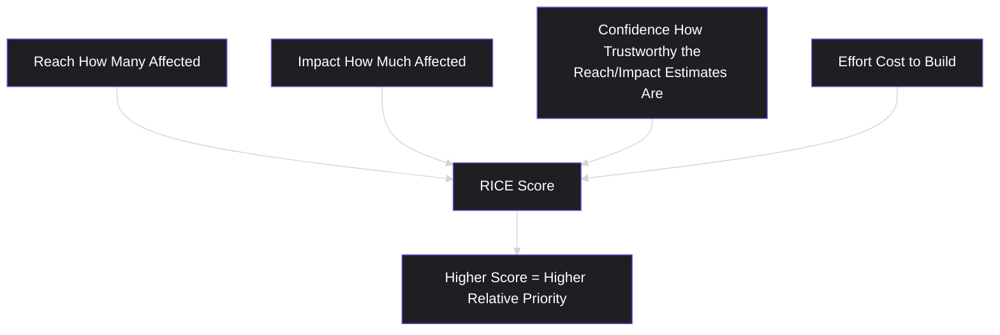
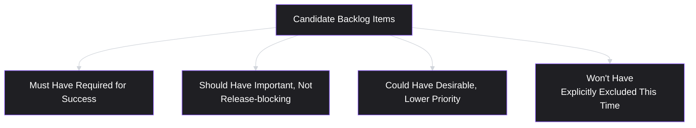
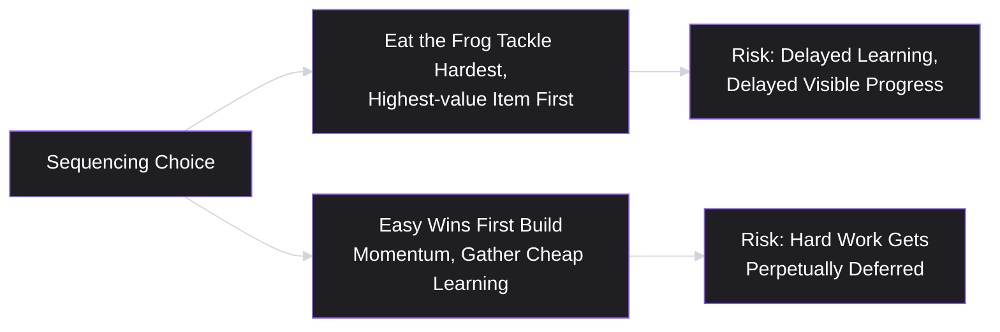
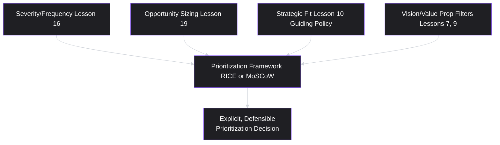

# Lesson 29: Prioritization Fundamentals

## Why This Lesson Matters

Across 24 lessons, this curriculum has repeatedly bumped into the same underlying question without ever naming it directly: when multiple genuinely valid things compete for the same limited time and resources, how do you actually decide? Lesson 16 built a Severity/Frequency Grid for pain points. Lesson 19 built an Opportunity Comparison Grid for opportunities. Lesson 10 insisted a real strategy must say no to something. Lesson 21 insisted an MVP must cut anything not necessary for its specific test. Each of these was, in effect, a scoped, local prioritization framework. This lesson generalizes the underlying discipline: **prioritization** is the practice of deciding what to work on next, using an explicit, defensible method rather than intuition, seniority, or recency alone — and it is, in a real sense, the skill this entire curriculum has been building toward from Lesson 1 onward.

This lesson matters because prioritization is where every other discipline in this curriculum — validated research, laddered pain points, sized opportunities, a real strategy, a scoped MVP — ultimately has to cash out into an actual, defensible decision about sequence: what gets built first, second, and not at all, at least for now. A team can do everything else in this curriculum correctly and still fail here, by falling back on whichever voice is loudest (Lesson 5, Lesson 16) or whichever idea was most recently discussed (Lesson 16, Lesson 19), precisely the failure patterns this curriculum has repeatedly named. This lesson closes that gap with formal, named prioritization frameworks.

---

## Learning Path

| Field | Detail |
|---|---|
| **Module** | 3 — Product Design |
| **Current Lesson** | 29 of 90 |
| **Difficulty** | 5 / 10 |
| **Estimated Study Time** | 30 minutes (reading) + 15 minutes (reflection + quiz) |
| **Prerequisites** | Lesson 10 (Product Strategy Basics), Lesson 16 (Pain Points), Lesson 19 (Opportunity Identification) |
| **Next Lesson** | Lesson 30 — Design Thinking (closing Module 3) |
| **Future Topics Unlocked** | Lesson 30 (Design Thinking), Module 4 (Execution & Agile Delivery), Lesson 34 (Sprint Planning & Backlog Grooming) |

---

## Learning Objectives

By the end of this lesson, you will be able to:

1. Apply the RICE framework (Reach, Impact, Confidence, Effort) to score and compare candidate initiatives quantitatively.
2. Apply the MoSCoW method (Must have, Should have, Could have, Won't have) as a qualitative, stakeholder-facing prioritization technique, and identify when it's more appropriate than RICE.
3. Distinguish "eating the frog" (tackling the highest-value hard thing first) from artificially easy sequencing, and explain the trade-offs of each.
4. Identify the "prioritization theater" failure pattern, where a formal-looking framework is used to rationalize a decision already made for other reasons.
5. Synthesize prior lessons' scoped, local prioritization tools (severity/frequency, opportunity sizing, strategic fit) into a single, coherent scoring approach for comparing dissimilar candidate initiatives.

---

## Prerequisites

Lesson 10 (Product Strategy Basics), Lesson 16 (Pain Points), and Lesson 19 (Opportunity Identification). This lesson assumes fluency with severity/frequency scoring, opportunity sizing via importance-satisfaction and prevalence, and the discipline of genuine strategic exclusion — this lesson generalizes and formalizes these prior, narrower tools into explicit, named prioritization frameworks applicable across a full backlog of dissimilar candidates.

---

## Theory

### RICE: A Quantitative Scoring Framework

**RICE** is a widely used scoring framework for comparing dissimilar candidate initiatives on a common numeric scale, using four factors:

- **Reach**: how many people (or what fraction of a validated segment, per Lesson 18) will this initiative affect within a given time period?
- **Impact**: how much will this initiative affect each person it reaches — typically scored on a simple scale (e.g., massive, high, medium, low, minimal), often assigned a corresponding numeric value?
- **Confidence**: how confident is the team in the reach and impact estimates, given the strength of the underlying evidence (directly connecting to Lesson 11's Evidence Trustworthiness Ladder) — typically expressed as a percentage?
- **Effort**: how much time and resource investment will this initiative require, typically expressed in person-time (e.g., person-months)?

The RICE score is calculated as:

> **RICE Score = (Reach × Impact × Confidence) / Effort**

RICE's genuine value is forcing explicit numbers onto each factor, rather than allowing a comparison to remain vague — a candidate initiative that "feels important" must be translated into an actual reach estimate, an actual impact estimate, an honest confidence level, and an actual effort estimate, all of which can be questioned and debated on their specific merits, rather than accepting or rejecting the initiative based on an unstated, holistic impression.

### Confidence as the Discipline-Enforcing Factor

The **Confidence** factor deserves particular attention, since it is the mechanism that connects RICE directly back to this curriculum's research rigor (Lessons 11–13, 19). A candidate initiative based on a vivid anecdote or an unvalidated assumption (echoing Lesson 16's "vivid but rare" warning) should receive a low confidence score, appropriately discounting its overall RICE score relative to a candidate backed by genuine, validated evidence — even if the vivid anecdote's raw reach and impact estimates look impressive on paper. This is precisely the mechanism that prevents RICE from simply reproducing Lesson 16's "loudest voice" or "vivid but rare" failure patterns under a different, more formal-looking name: a low-confidence estimate should genuinely lower the score, not be treated as a formality to move past quickly.

### MoSCoW: A Qualitative, Stakeholder-Facing Method

**MoSCoW** is a simpler, qualitative categorization method, sorting candidate items into four buckets:

- **Must have**: absolutely required for this release or initiative to be considered successful or complete.
- **Should have**: important, but the release could technically function without it if truly necessary.
- **Could have**: desirable, but with a clearly lower priority than "should have" items.
- **Won't have** (this time): explicitly and deliberately excluded from the current scope, directly echoing Lesson 10's exclusion discipline.

MoSCoW is often more appropriate than RICE when a team needs to communicate priority quickly and clearly to a broad set of stakeholders (particularly non-specialist stakeholders less familiar with a quantitative scoring model), or when the goal is defining the boundary of a specific release rather than ranking a large, diverse backlog against each other on a single numeric scale. Its explicit "Won't have" category is a particularly valuable discipline, directly enforcing Lesson 10's argument that a real strategic choice requires explicit exclusion — MoSCoW makes that exclusion a visible, named category rather than an implicit, unstated omission.

### "Eating the Frog" vs. Artificially Easy Sequencing

A specific, practical sequencing question, once priorities are established, is: within a set of similarly prioritized items, should a team tackle the hardest, highest-value item first, or build momentum with easier wins first? **"Eating the frog"** (a phrase associated with productivity writing, referring to tackling the most difficult, most important task first) argues for confronting the highest-value hard work early, since delaying it often means it never actually gets done, or gets rushed under worse conditions later.

The countervailing consideration is that **artificially easy sequencing** — deliberately front-loading a series of easy wins — can build genuine team and stakeholder confidence, demonstrate visible progress, and (particularly relevant to this curriculum's discovery discipline) surface early, cheap learning that might usefully inform how the harder, more important work is eventually approached. Neither approach is universally correct; the choice depends on specific context — how urgent the hard problem actually is, whether early wins would genuinely inform the harder work or merely delay it, and how much organizational patience and trust currently exists for a team to spend significant time on a single, high-value, high-difficulty initiative without visible interim progress.

### The "Prioritization Theater" Failure Pattern

A specific, important failure pattern — directly extending Lesson 8's discovery theater concept — is **prioritization theater**: applying a formal-looking scoring framework (RICE, MoSCoW, or any other named method) to a set of candidates whose actual priority order has already been decided for other reasons (executive preference, sunk cost, internal politics), with the scoring exercise conducted after the fact specifically to produce numbers that justify the already-determined outcome. This directly parallels Lesson 24's warning about acceptance criteria written after the fact: a scoring framework applied retroactively, to rationalize a decision rather than genuinely inform it, provides the appearance of rigor without any of its substance.

The corrective discipline is the same one this curriculum has applied repeatedly: a genuine prioritization exercise must be capable, in principle, of producing a result that contradicts the team's initial expectation or preference — if a RICE or MoSCoW exercise never once produces a surprising or uncomfortable ranking, that is itself a warning sign worth taking seriously, echoing Lesson 8's core discovery-theater diagnostic applied directly to the practice of prioritization.

---

## Common Beginner Mistakes

**Mistake 1: Treating RICE scores as precise, objective numbers rather than structured estimates**

RICE scores are only as good as the underlying reach, impact, and confidence estimates feeding into them — treating the resulting number as objectively precise, rather than as a structured, debatable estimate, overstates the framework's actual certainty.

**Mistake 2: Assigning high confidence scores to vivid anecdotes or unvalidated assumptions**

This directly reintroduces Lesson 16's "vivid but rare" and "loudest voice" failure patterns under RICE's formal-looking numeric structure — confidence should genuinely reflect the strength of underlying evidence, not the persuasiveness or memorability of how a candidate was pitched.

**Mistake 3: Using RICE when MoSCoW would communicate priority more clearly to a broad stakeholder audience, or vice versa**

These frameworks serve different purposes — RICE for ranking dissimilar candidates on a common numeric scale, MoSCoW for defining release scope and communicating clearly with less quantitatively focused stakeholders — and using the wrong one for the specific situation reduces the exercise's practical value.

**Mistake 4: Defaulting to "easy wins first" purely to avoid difficult work, rather than as a deliberate, justified sequencing choice**

Artificially easy sequencing can be a legitimate strategy in the right context, but defaulting to it simply to defer difficult, high-value work indefinitely produces the opposite of genuine prioritization discipline.

**Mistake 5: Running a prioritization exercise after a decision has already effectively been made, to produce justifying numbers rather than genuine input**

This is prioritization theater — a formal-looking exercise that could not, even in principle, have changed the outcome is not really prioritizing anything.

---

## Mental Model: The Prioritization Synthesis Funnel

This lesson's mental model is the **Prioritization Synthesis Funnel**, which shows how this curriculum's earlier, narrower prioritization tools feed into a single, formal framework like RICE or MoSCoW.

Use this funnel as a synthesis discipline: when scoring a candidate's Impact for RICE, or deciding whether it's a "Must have" for MoSCoW, explicitly draw on the specific evidence this curriculum's earlier tools have already produced — a pain point's established severity and frequency, an opportunity's importance-satisfaction gap and segment prevalence, and whether the initiative follows from the company's actual guiding policy — rather than re-deriving a fresh, unmoored judgment from scratch for each new prioritization exercise.

---

## Real Company Example

**Intercom** is the actual origin of RICE, not just a well-documented user of it: the framework was developed by Sean McBride while he was a PM on Intercom's growth team, specifically because his team needed a consistent way to compare dissimilar candidate initiatives — a small bug fix against a substantial new feature — on a single, defensible scale, rather than relying on ad hoc comparisons or whichever idea had the most vocal internal advocate at a given planning meeting. McBride has written and spoken publicly about the framework's origin, and RICE has since become one of the most widely adopted scoring frameworks in the industry.

*(Assumption flagged: this reflects Intercom's own publicly shared account of developing and using RICE rather than a claim about the framework's universal applicability or Intercom's complete, current internal prioritization process, which this curriculum does not claim certainty about.)*

---

## Real World Perspective: Prioritization Fundamentals at Different Company Stages

**At a startup:**
Prioritization is often concentrated on an extremely small number of genuinely make-or-break decisions, and lightweight, qualitative methods (a simple ranked list, informal MoSCoW-style categorization) frequently suffice given the smaller volume of candidates and closer, more informal team collaboration — the underlying discipline (explicit criteria, genuine willingness to exclude, confidence honestly reflecting evidence quality) matters as much as at any other stage, even without a fully formalized RICE process.

**At a mid-size company:**
Formal frameworks like RICE often become genuinely valuable as backlog size and organizational complexity grow beyond what informal, ad hoc comparison can handle consistently, and this is frequently the stage where prioritization theater risk increases, as more stakeholders with more varied interests attempt to influence outcomes, making a genuinely defensible, evidence-grounded scoring exercise more valuable — and more likely to be circumvented informally if not actively protected.

**At Big Tech:**
Prioritization at scale often requires reconciling multiple, semi-independent teams' RICE or similar scores against a shared, company-wide strategic framework (echoing Lesson 10), and a significant part of senior product leadership's role involves ensuring that formal scoring frameworks remain genuine inputs to real decisions across the organization, rather than degenerating into prioritization theater performed independently by each team to justify their own pre-existing preferences.

---

## Detailed Case Study: The RICE Score That Was Reverse-Engineered

Consider a simplified, illustrative scenario common across mid-size B2B SaaS product teams.

A product team is asked by a senior executive to prioritize a specific feature the executive has personally championed for several months, ahead of several other candidate initiatives the team's own research (following this curriculum's Modules 1 and 2) had identified as more strongly validated and higher-value. Wanting to appear rigorous and data-driven, the team runs a formal RICE scoring exercise across all candidates — but, consciously or not, assigns unusually high Reach and Impact estimates to the executive's preferred feature, and an unusually high Confidence score despite the feature having no supporting research beyond the executive's personal conviction, while applying stricter, more skeptical scrutiny to the reach, impact, and confidence estimates for the team's own, better-validated candidates.

The resulting RICE scores rank the executive's preferred feature at the top, and the team proceeds to build it. Nine months later, the feature sees minimal adoption, while a lower-ranked candidate from the same exercise — one the team's own prior research (per Lesson 19's opportunity sizing) had actually identified as significantly higher-value — remains unaddressed, its genuine potential value still sitting unrealized in the team's backlog.

**What went wrong?**

Applying this lesson's frameworks:

1. **The RICE exercise was prioritization theater, not genuine prioritization.** The scoring inputs were adjusted, consciously or not, to produce a predetermined outcome (validating the executive's preference) rather than genuinely reflecting the team's actual evidence and confidence levels.
2. **The Confidence factor was specifically misapplied** — a feature with no supporting research beyond personal conviction should have received a low confidence score, appropriately discounting its overall RICE score, rather than an inflated confidence score that obscured the actual weakness of its underlying evidence.
3. **The genuinely well-validated candidate, backed by this curriculum's Module 2 research discipline, was held to a higher evidentiary bar than the executive's preferred feature** — an inconsistent standard applied specifically to produce the desired ranking, rather than a uniform, honest standard applied to all candidates equally.

A team applying this lesson's discipline rigorously would have scored all candidates using the same honest, evidence-grounded standard — assigning the executive's preferred feature a genuinely low confidence score given its lack of supporting research, and the team's own validated candidate a correspondingly higher confidence score given its grounding in Lesson 19's opportunity-sizing evidence — very likely producing a RICE ranking that would have required the team to have an honest, evidence-based conversation with the executive about the relative merits of the two candidates, rather than using a superficially rigorous exercise to avoid that conversation entirely.

This case connects directly back to **Lesson 8's discovery theater concept**: a scoring exercise that could not, even in principle, have produced a result different from the predetermined outcome was never actually prioritizing anything — it was providing a formal-looking justification for a decision made through other means entirely.

---

## Framework Explanation: The Prioritization Integrity Checklist

A practical checklist for evaluating whether a prioritization exercise is genuine rather than theater:

| Question | Purpose |
|---|---|
| Were Reach, Impact, and Confidence (or MoSCoW categories) scored using the same honest standard for every candidate, regardless of who championed each one? | Prevents inconsistent scrutiny applied selectively to favor a predetermined outcome |
| Does the Confidence score genuinely reflect the strength of underlying evidence (per Lesson 11's Evidence Trustworthiness Ladder), rather than the persuasiveness of the pitch? | Prevents "vivid but rare" and "loudest voice" patterns from re-entering under a formal-looking numeric disguise |
| Could this exercise, in principle, have produced a result contradicting the team's initial expectation or a stakeholder's preference? | Directly tests for prioritization theater, echoing Lesson 8's genuine-test criterion |
| Were the earlier, narrower prioritization tools from this curriculum (severity/frequency, opportunity sizing, strategic fit) actually drawn upon as inputs, or was this exercise conducted in isolation from that prior evidence? | Ensures genuine synthesis rather than a fresh, unmoored scoring exercise |

A prioritization exercise failing several of these checks risks the exact outcome shown in this lesson's Detailed Case Study — a formally rigorous-looking process that nonetheless produced a predetermined, ultimately costly result.

---

## Interview Perspective: How Interviewers Think About This

**Typical question 1: "How do you prioritize a backlog with many dissimilar candidate initiatives?"**
*What the interviewer is actually evaluating:* Whether the candidate names a specific, defensible framework (RICE, MoSCoW, or a similar named method) and can explain each factor's role, rather than describing a purely intuitive or unstructured process.

**Typical question 2: "Tell me about a time you had to prioritize against a senior stakeholder's strong preference. How did you handle it?"**
*What the interviewer is actually evaluating:* Direct experience navigating the exact tension shown in this lesson's Detailed Case Study, and whether the candidate can describe an honest, evidence-grounded resolution rather than either capitulating uncritically or dismissing the stakeholder's input without genuine engagement.

**Typical question 3: "How do you know if a prioritization process is genuine, rather than just justifying a decision that's already been made?"**
*What the interviewer is actually evaluating:* Fluency with the prioritization theater concept — whether the candidate can articulate the specific diagnostic (could this exercise have produced a contradicting result?) rather than treating the mere existence of a formal framework as sufficient evidence of genuine rigor.

---

## Summary

Prioritization is the practice of deciding what to work on next using an explicit, defensible method, generalizing this curriculum's earlier, narrower scoring tools (severity/frequency, opportunity sizing, strategic fit) into formal, named frameworks. RICE (Reach × Impact × Confidence / Effort) provides a quantitative scoring method for comparing dissimilar candidates on a common scale, with Confidence serving as the critical discipline-enforcing factor that should genuinely reflect underlying evidence quality (per Lesson 11's Evidence Trustworthiness Ladder), preventing vivid but weakly evidenced candidates from scoring artificially high. MoSCoW (Must/Should/Could/Won't have) provides a simpler, qualitative categorization better suited to communicating release scope clearly to broad stakeholder audiences, with its explicit "Won't have" category directly enforcing Lesson 10's exclusion discipline. Sequencing choices — "eating the frog" versus building momentum with easier wins first — depend on specific context rather than a universally correct answer. Finally, "prioritization theater" — applying a formal-looking framework to justify a decision already made for other reasons — is a critical failure pattern to guard against, diagnosable by asking whether the exercise could, in principle, have produced a contradicting result, as this lesson's Detailed Case Study makes concrete.

---

## Key Takeaways

- RICE (Reach × Impact × Confidence / Effort) provides a quantitative method for scoring and comparing dissimilar candidate initiatives on a common scale.
- The Confidence factor should genuinely reflect underlying evidence quality (per Lesson 11's Evidence Trustworthiness Ladder), preventing vivid but weakly evidenced candidates from scoring artificially high.
- MoSCoW (Must/Should/Could/Won't have) is a simpler, qualitative method better suited to communicating release scope to broad stakeholder audiences; its "Won't have" category enforces genuine strategic exclusion.
- "Eating the frog" (tackling the highest-value hard thing first) and easy-wins-first sequencing both have legitimate uses depending on context; neither is universally correct.
- "Prioritization theater" — using a formal framework to justify a predetermined decision — is diagnosable by asking whether the exercise could, in principle, have produced a contradicting result.
- Genuine prioritization synthesizes this curriculum's earlier, narrower tools (severity/frequency, opportunity sizing, strategic fit) as actual inputs, rather than re-deriving fresh judgments in isolation.
- Consistent, honest scoring standards must be applied to every candidate regardless of who championed it, or the exercise risks reintroducing exactly the "loudest voice" and "vivid but rare" failure patterns it's meant to prevent.

---

## Cheat Sheet

*A two-minute review of everything in this lesson.*

- **RICE = (Reach × Impact × Confidence) / Effort.** Confidence should reflect real evidence quality, not persuasiveness.
- **MoSCoW = Must/Should/Could/Won't have.** Better for broad stakeholder communication and defining release scope; "Won't have" enforces real exclusion.
- **Eat the frog vs. easy wins first** — context-dependent, not universally correct either way.
- **Prioritization theater test:** could this exercise, in principle, have produced a result contradicting the predetermined preference? If not, it's theater.
- **Synthesize, don't re-derive** — draw on severity/frequency, opportunity sizing, and strategic fit as actual scoring inputs.
- **Same honest standard for every candidate** — regardless of who's championing it.

---

## Glossary

| Term | Definition | Related Concepts | Difficulty |
|---|---|---|---|
| RICE | A quantitative prioritization framework: (Reach × Impact × Confidence) / Effort. | Evidence Trustworthiness Ladder (Lesson 11) | 2 |
| MoSCoW | A qualitative prioritization method categorizing items as Must/Should/Could/Won't have. | Exclusion Discipline (Lesson 10) | 2 |
| "Eating the Frog" | The practice of tackling the highest-value, hardest task first, rather than deferring it. | Sequencing | 2 |
| "Prioritization Theater" (Failure Pattern) | Applying a formal-looking prioritization framework to justify a decision already made for other reasons. | Discovery Theater (Lesson 8) | 3 |

---

## Further Reading / Resources

- Intercom's publicly shared writing introducing and explaining the RICE scoring framework, the direct origin of this lesson's core quantitative technique.
- Karl Wiegers, *Software Requirements* — includes detailed treatment of prioritization methods including MoSCoW in a requirements-engineering context.
- Melissa Perri, *Escaping the Build Trap* — discusses the organizational and strategic dimensions of genuine, evidence-grounded prioritization versus decisions driven by internal politics or seniority.

---

## Flashcards

**Card 1**
- Front: What is the RICE formula?
- Back: RICE Score = (Reach × Impact × Confidence) / Effort.
- Difficulty: 2
- Tags: rice-formula

**Card 2**
- Front: Why is the Confidence factor in RICE described as "discipline-enforcing"?
- Back: It should genuinely reflect the strength of underlying evidence — a vivid anecdote or unvalidated assumption should receive a low confidence score, preventing Lesson 16's "vivid but rare" and "loudest voice" patterns from reappearing under a formal numeric disguise.
- Difficulty: 3
- Tags: confidence-factor

**Card 3**
- Front: What are the four categories in MoSCoW, and what does the "Won't have" category enforce?
- Back: Must have, Should have, Could have, Won't have; "Won't have" enforces genuine, visible strategic exclusion, directly echoing Lesson 10's discipline.
- Difficulty: 2
- Tags: moscow

**Card 4**
- Front: What is "eating the frog," and what is the trade-off against easy-wins-first sequencing?
- Back: Tackling the highest-value, hardest task first, rather than deferring it; the trade-off against easy wins is urgency and avoiding perpetual deferral versus building momentum and gathering cheap early learning — context-dependent, not universally correct either way.
- Difficulty: 2
- Tags: eating-the-frog

**Card 5**
- Front: What is "prioritization theater," and how is it diagnosed?
- Back: Applying a formal-looking framework to justify a decision already made for other reasons; diagnosed by asking whether the exercise could, in principle, have produced a result contradicting the predetermined preference.
- Difficulty: 3
- Tags: prioritization-theater

**Card 6**
- Front: In the Detailed Case Study, how was the RICE exercise manipulated to favor the executive's preferred feature?
- Back: Unusually high Reach, Impact, and Confidence scores were assigned to the executive's feature despite no supporting research, while the team's own better-validated candidate was held to stricter scrutiny — an inconsistent standard applied to produce a predetermined ranking.
- Difficulty: 3
- Tags: case-study

**Card 7**
- Front: What should a prioritization exercise draw on, according to the Prioritization Synthesis Funnel?
- Back: This curriculum's earlier, narrower prioritization tools — severity/frequency scoring, opportunity sizing, and strategic fit — as actual inputs, rather than re-deriving fresh judgments in isolation for each new exercise.
- Difficulty: 2
- Tags: synthesis-funnel

## Reflection Exercise

You are the PM for a podcast app, with four candidate initiatives competing for the next quarter: (1) a well-validated opportunity (per Lesson 19) around improving offline downloads, backed by strong interview and survey evidence; (2) a feature a senior executive has personally championed, based on a single conversation with a friend who uses a competitor's product; (3) a small, easy bug fix affecting a narrow, low-value edge case; (4) a genuinely difficult, high-value redesign of the core recommendation algorithm, validated through prior research but requiring significant engineering investment.

Work through the following, in writing, before reading further:

1. Assign rough RICE scores (Reach, Impact, Confidence, Effort) to all four candidates, being explicit and honest about confidence levels given the evidence described for each.
2. Using the Prioritization Integrity Checklist, identify which candidate is most at risk of receiving an inflated confidence score if scored dishonestly, and explain why.
3. Apply MoSCoW instead of RICE to these same four candidates, and compare the resulting categorization to your RICE ranking — do the two methods suggest the same priorities, or do they diverge?
4. Consider the "eating the frog" question specifically for candidate #4 (the recommendation algorithm redesign): what context-specific factors would make tackling it first versus deferring it the more defensible choice?
5. Using the Prioritization Synthesis Funnel, explicitly name which of this curriculum's earlier tools (severity/frequency, opportunity sizing, strategic fit) you drew on for each of your four scoring decisions.

There is no single correct answer. The purpose of this exercise is to practice applying honest, consistent scoring standards across genuinely dissimilar candidates, resisting the pull to inflate confidence for a vivid or senior-championed idea.

---

## Quiz

**1. What is the RICE formula?**
A) Reach + Impact + Confidence + Effort
B) (Reach × Impact × Confidence) / Effort
C) Reach / (Impact × Confidence × Effort)
D) (Reach + Impact) × (Confidence + Effort)

*Correct answer: B*
*Explanation: This is the lesson's explicit formula, with Effort as a divisor (lower effort increases the score) and the other three factors as multipliers.*
*Learning objective tested: #1*
*Difficulty: Easy*

---

**2. Why is the Confidence factor described as particularly important in preventing certain failure patterns?**
A) Because Confidence is always the easiest factor to estimate accurately
B) Because it should genuinely reflect the strength of underlying evidence, preventing vivid but weakly evidenced candidates from scoring artificially high, echoing Lesson 16's "vivid but rare" warning
C) Because Confidence is the only factor that affects the final RICE score
D) Because Confidence should always be set to 100% regardless of evidence quality

*Correct answer: B*
*Explanation: The lesson explicitly connects Confidence to preventing the reintroduction of earlier-named failure patterns under RICE's formal numeric structure.*
*Learning objective tested: #1*
*Difficulty: Easy*

---

**3. What are the four categories in the MoSCoW method?**
A) Must have, Should have, Could have, Won't have
B) High, Medium, Low, None
C) Reach, Impact, Confidence, Effort
D) Urgent, Important, Optional, Deferred

*Correct answer: A*
*Explanation: This is the lesson's explicit statement of the MoSCoW categories.*
*Learning objective tested: #2*
*Difficulty: Easy*

---

**4. Why is MoSCoW's "Won't have" category described as particularly valuable?**
A) Because it allows teams to avoid making any prioritization decisions at all
B) Because it makes strategic exclusion an explicit, visible, named category, directly enforcing Lesson 10's discipline that a real strategy must say no to something
C) Because "Won't have" items are always technically infeasible
D) Because it eliminates the need for any further prioritization discussion

*Correct answer: B*
*Explanation: The lesson explicitly connects this category to Lesson 10's exclusion discipline, making a real strategic choice visible rather than an implicit, unstated omission.*
*Learning objective tested: #2*
*Difficulty: Easy*

---

**5. What is "prioritization theater"?**
A) A presentation format for sharing prioritization decisions with stakeholders
B) Applying a formal-looking scoring framework to a set of candidates whose priority order has already been decided for other reasons, to produce justifying numbers after the fact
C) A required step in every legitimate prioritization process
D) A technique for accelerating prioritization decisions

*Correct answer: B*
*Explanation: This is the lesson's explicit definition, directly extending Lesson 8's discovery theater concept to the practice of prioritization.*
*Learning objective tested: #4*
*Difficulty: Easy*

---

**6. In the Detailed Case Study, how was the Confidence factor specifically misapplied?**
A) It was left out of the scoring exercise entirely
B) A feature with no supporting research beyond an executive's personal conviction received an inflated confidence score, while a genuinely well-validated candidate was held to a stricter, higher evidentiary bar
C) It was calculated using an incorrect mathematical formula
D) It was applied consistently and honestly to all four candidates

*Correct answer: B*
*Explanation: The case study explicitly describes this inconsistent application of the Confidence factor as the specific mechanism producing the predetermined, ultimately costly ranking.*
*Learning objective tested: #4*
*Difficulty: Easy*

---

**7. What is the key diagnostic question for identifying prioritization theater, according to this lesson?**
A) Whether the scoring exercise used RICE rather than MoSCoW
B) Whether the exercise could, in principle, have produced a result contradicting the team's initial expectation or a stakeholder's preference
C) Whether the exercise was completed within a specific time limit
D) Whether every candidate received the exact same final score

*Correct answer: B*
*Explanation: This is the lesson's explicit diagnostic, directly echoing Lesson 8's genuine-test criterion applied to prioritization specifically.*
*Learning objective tested: #4*
*Difficulty: Medium*

---

**8. What does "eating the frog" refer to in this lesson's sequencing discussion?**
A) Always choosing the easiest, lowest-value task to build first
B) Tackling the highest-value, hardest task first, rather than deferring it
C) A specific step within the RICE scoring formula
D) A requirement to complete all "Must have" MoSCoW items before any "Should have" items

*Correct answer: B*
*Explanation: This is the lesson's explicit definition of "eating the frog," distinct from RICE's formula or MoSCoW's categories.*
*Learning objective tested: #3*
*Difficulty: Medium*

---

**9. (Scenario) A team scores four candidates using RICE, and one candidate — backed only by a single, vivid customer story with no further validation — receives a high Confidence score simply because the story was compelling. What is the issue with this scoring decision, according to this lesson?**
A) There is no issue; compelling stories always warrant high confidence scores
B) This directly reintroduces Lesson 16's "vivid but rare" failure pattern — Confidence should reflect genuine evidence strength (per Lesson 11's Evidence Trustworthiness Ladder), not how compelling or memorable the story was
C) Confidence scores should always be set at exactly 50% regardless of evidence
D) This scoring decision is correct as long as the Reach and Impact scores are also high

*Correct answer: B*
*Explanation: This is a direct instance of the exact failure pattern this lesson warns against — the persuasiveness of a story should not be conflated with the genuine strength of underlying evidence when scoring Confidence.*
*Learning objective tested: #1*
*Difficulty: Medium-Hard*

---

**10. (Product Thinking) A team is deciding whether to communicate release scope to a broad, non-specialist group of internal stakeholders using RICE scores or MoSCoW categories. According to this lesson, which is generally more appropriate, and why?**
A) RICE, since numeric scores are always easier for any audience to understand
B) MoSCoW, since it provides a simpler, qualitative categorization better suited to communicating clearly with stakeholders less familiar with quantitative scoring models
C) Neither method should ever be used for stakeholder communication
D) Both methods are equally suited to every possible audience and purpose

*Correct answer: B*
*Explanation: The lesson explicitly notes MoSCoW's advantage for broad, non-specialist stakeholder communication, distinct from RICE's strength in ranking dissimilar candidates on a common numeric scale.*
*Learning objective tested: #2*
*Difficulty: Medium-Hard*

---

**11. (Interview Reasoning) A candidate describes running a RICE scoring exercise where every candidate happened to confirm exactly the priority order senior leadership had already informally indicated beforehand. What might this signal, based on this lesson's Interview Perspective section?**
A) An exceptionally well-aligned team with no meaningful concerns
B) A possible instance of prioritization theater, since a genuine scoring exercise should be capable, in principle, of producing a result that contradicts prior expectations at least occasionally
C) That the candidate has strong leadership alignment skills that should be considered a core strength
D) Nothing meaningful, since RICE scores should always confirm leadership's existing preferences

*Correct answer: B*
*Explanation: This reflects the lesson's core diagnostic — a scoring process that never produces a surprising or contradicting result relative to prior expectations is itself a warning sign worth taking seriously.*
*Learning objective tested: #4*
*Difficulty: Hard*

---

**12. (Product Thinking, Higher Difficulty) A team has a well-validated, high-value but genuinely difficult initiative (requiring significant effort) and several smaller, easier initiatives with lower but real value. Using RICE's Effort factor, how would the difficult initiative's score be affected, all else being equal?**
A) The Effort factor has no bearing on the final RICE score
B) A higher Effort value (more resources/time required) would lower the overall RICE score, since Effort is a divisor — meaning a high-value initiative can still score lower than a smaller one if its effort cost is proportionally much higher
C) Higher Effort always increases the RICE score
D) Effort should always be ignored in favor of Reach and Impact alone

*Correct answer: B*
*Explanation: Since RICE divides by Effort, a genuinely high-value but very high-effort initiative may still score lower than a smaller, easier one — this is a legitimate, built-in trade-off the formula makes explicit, distinct from the separate "eating the frog" sequencing question.*
*Learning objective tested: #1, #3*
*Difficulty: Medium-Hard*

---

**13. (Interview Reasoning, Higher Difficulty) An interviewer asks a candidate how they would respond if a senior stakeholder insisted their preferred initiative be scored with high confidence, despite having no supporting research. A weak answer would most likely include which of the following?**
A) Proposing a lightweight validation step (echoing Lesson 8's confidence ladder) to establish genuine confidence before finalizing the score, and being transparent about the current, honest confidence level in the meantime
B) Agreeing to inflate the confidence score as requested, without pushing back or proposing any further validation
C) Explaining the Confidence factor's purpose and its connection to genuine evidence quality
D) Proposing to run both RICE and MoSCoW to give the stakeholder multiple ways to understand the trade-offs involved

*Correct answer: B*
*Explanation: Agreeing to inflate the score without pushback or proposing further validation reflects a weak response compared to the more evidence-grounded, honest alternatives in the other options, and directly risks reproducing the Detailed Case Study's failure.*
*Learning objective tested: #1, #4*
*Difficulty: Hard*

---

**14. (Product Thinking, Higher Difficulty) A team applies MoSCoW to a release and finds that nearly every candidate item has been categorized as "Must have," with almost nothing in "Should have," "Could have," or "Won't have." According to this lesson, what does this suggest?**
A) The release scope has been defined with excellent, appropriate discipline
B) This likely indicates a failure to make genuine prioritization distinctions, echoing Lesson 10's warning against a "grab-bag" that endorses everything as equally essential rather than making real, differentiated choices
C) "Must have" is always the correct category for the vast majority of any release's candidate items
D) This pattern has no diagnostic significance and requires no further scrutiny

*Correct answer: B*
*Explanation: A MoSCoW exercise where nearly everything lands in "Must have" fails to make the genuine, differentiated choices the method is meant to surface, directly echoing Lesson 10's warning about a strategy that endorses everything without real exclusion.*
*Learning objective tested: #2*
*Difficulty: Hard*

---

**15. (Highest Difficulty) A team runs a genuinely honest, evidence-grounded RICE exercise (passing the Prioritization Integrity Checklist) and it produces a ranking that a senior stakeholder strongly disagrees with, based on their own separate business context the team wasn't fully aware of (e.g., a specific contractual commitment). What is the most appropriate next step, connecting this lesson to Lesson 6's laddering discipline and Lesson 10's strategic judgment?**
A) The team should discard the RICE exercise entirely and defer completely to the stakeholder's preference without further discussion
B) The team should present the honest RICE results transparently, then genuinely engage with the stakeholder's additional context (potentially laddering, per Lesson 6, to understand the underlying business need behind their concern), reassessing the priority with this new information incorporated — rather than either ignoring the stakeholder's context or abandoning the evidence-based process entirely
C) The team should insist the RICE ranking is final and non-negotiable, regardless of any additional business context
D) The team should run the exercise again, this time deliberately adjusting scores to match the stakeholder's preference

*Correct answer: B*
*Explanation: This integrates this lesson's integrity discipline with Lesson 6's laddering technique and Lesson 10's strategic judgment — a genuinely honest scoring exercise doesn't mean the result is beyond revision when genuinely new, relevant information (a business context the team lacked) emerges; the correct response is transparent engagement and reassessment, not either rigid adherence or unprincipled score manipulation.*
*Learning objective tested: #4, #5*
*Difficulty: Hard*

---

## Connections

| | Lesson | Core Idea Carried Forward |
|---|---|---|
| **Previous Lesson** | Lesson 28 — Information Architecture | Closes out the design-specific lessons that this formal prioritization framework must now weigh alongside research and strategic considerations |
| **Current Lesson** | Lesson 29 — Prioritization Fundamentals | RICE; MoSCoW; eating the frog vs. easy wins; prioritization theater; synthesis of earlier scoped tools |
| **Next Lesson** | Lesson 30 — Design Thinking (closing Module 3) | Provides a broader, human-centered design methodology that this lesson's prioritization discipline operates within |
| **Future Concepts Unlocked** | Lesson 34 (Sprint Planning & Backlog Grooming) | Uses RICE/MoSCoW-scored priorities as direct input into sprint-level planning and commitment |

This curriculum is designed to be read as one continuous argument. From this lesson forward, any reference to "prioritizing the backlog" assumes the Prioritization Integrity Checklist and honest, consistent scoring discipline covered here — this will not be re-explained, only re-applied.
