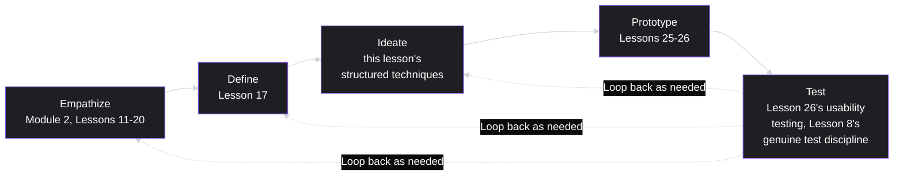
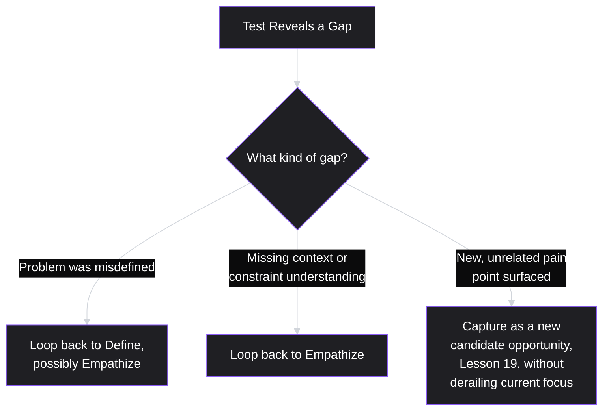
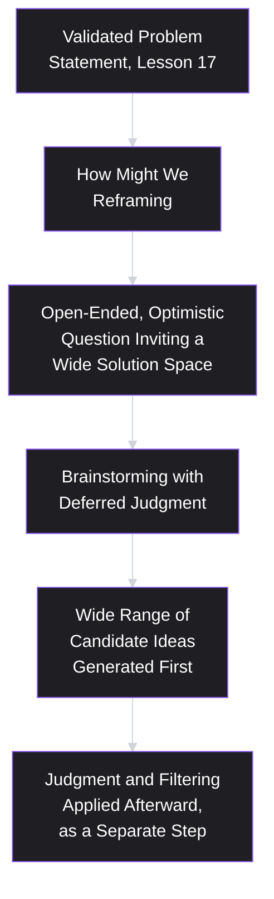
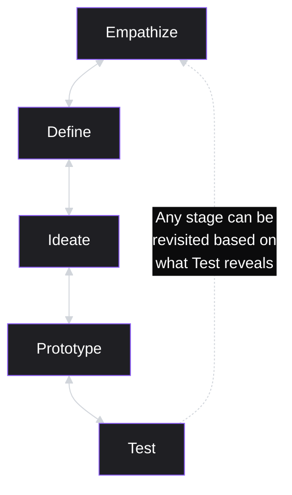

# Lesson 30: Design Thinking

## Why This Lesson Matters

Modules 1 through 3 have, in effect, been teaching design thinking all along, one component at a time, without ever naming the whole. Module 1 built empathy and understanding into strategic discipline. Module 2 was, almost entirely, a deep treatment of the "empathize" and "define" stages of a well-known methodology. Module 3 has covered ideation, prototyping, and testing in specific, granular detail. This final lesson of Module 3 names the whole: **design thinking**, a human-centered problem-solving methodology organized around five iterative stages — Empathize, Define, Ideate, Prototype, Test — that this curriculum has, in effect, already taught in depth, spread across 25 prior lessons.

This lesson's purpose is not to introduce new techniques you haven't seen, but to give you the map that shows how everything you've already learned fits together as a single, coherent, non-linear methodology — and, just as importantly, to correct the single most common misunderstanding about design thinking: that its five stages proceed in a strict, one-directional sequence. They don't. Design thinking is explicitly, deliberately iterative, and this lesson's core argument is that the willingness to loop backward — to return to empathy after a failed prototype test, to redefine the problem after ideation reveals it was framed wrong — is design thinking's actual defining discipline, not a deviation from it.

---

## Learning Path

| Field | Detail |
|---|---|
| **Module** | 3 — Product Design |
| **Current Lesson** | 30 of 90 |
| **Difficulty** | 3 / 10 |
| **Estimated Study Time** | 25 minutes (reading) + 15 minutes (reflection + quiz) |
| **Prerequisites** | Lesson 8 (Product Discovery), Lesson 17 (Problem Statements), Lesson 26 (Prototyping) |
| **Next Lesson** | Lesson 31 — Agile Fundamentals, opening Module 4 |
| **Future Topics Unlocked** | Module 4 (Execution & Agile Delivery) |

---

## Learning Objectives

By the end of this lesson, you will be able to:

1. Name and define the five stages of design thinking (Empathize, Define, Ideate, Prototype, Test), and map each stage to the specific curriculum lessons that already taught it in depth.
2. Explain why design thinking is explicitly non-linear and iterative, and identify specific triggers for looping backward to an earlier stage.
3. Apply at least two structured ideation techniques (brainstorming with deferred judgment, and "How Might We" reframing) at the Ideate stage.
4. Identify the "design thinking as linear checklist" failure pattern and explain why treating the five stages as a rigid sequence undermines the methodology's core value.
5. Synthesize design thinking as the unifying frame for Modules 1 through 3, articulating how each module's content maps onto the five stages.

---

## Prerequisites

Lesson 8 (Product Discovery), Lesson 17 (Problem Statements), and Lesson 26 (Prototyping). This lesson assumes fluency with the full discovery-to-delivery arc this curriculum has built — this lesson does not introduce new techniques so much as it names and organizes techniques you have already learned, showing how they fit into design thinking's five-stage frame.

---

## Theory

### The Five Stages, Mapped to What You Already Know

Design thinking, most closely associated with Stanford's d.school and the design consultancy IDEO, organizes human-centered problem-solving into five stages:

- **Empathize**: understanding the people you're designing for, their context, needs, and pain points — directly corresponding to this curriculum's Module 2 in its entirety (Lessons 11–20: user research, interviews, surveys, personas, journey mapping, pain points).
- **Define**: synthesizing empathy-stage findings into a clear, specific, actionable problem statement — directly corresponding to Lesson 17 (Problem Statements), built on Lesson 6's Jobs to Be Done and Lesson 16's pain point characterization.
- **Ideate**: generating a wide range of candidate solutions to the defined problem, deliberately deferring judgment to maximize the breadth of options considered — a stage this lesson covers in more structured detail below, extending Lesson 6's "laddering reveals a wider solution space" argument.
- **Prototype**: building low-cost, testable representations of candidate solutions — directly corresponding to Lessons 25 (Wireframing) and 26 (Prototyping).
- **Test**: gathering feedback on prototypes from real users, and using that feedback to refine, iterate, or return to an earlier stage entirely — directly corresponding to Lesson 26's usability testing discipline and Lesson 8's genuine discovery test principle.

Recognizing this mapping is itself the primary value of this lesson: nothing here is genuinely new content, but seeing the whole arc named and connected clarifies why this curriculum sequenced Modules 1 through 3 the way it did, and gives you a single, memorable frame for explaining your own process to others, including in the kind of interview settings this curriculum has repeatedly prepared you for.

### Why Design Thinking Is Explicitly Non-Linear

The single most important, and most commonly misunderstood, feature of design thinking is that its five stages are not meant to proceed in a strict, one-directional sequence from Empathize through Test. The methodology is explicitly iterative: a team frequently loops backward, and doing so is not a failure of process — it is the process working correctly.

Specific, common triggers for looping backward include:

- **Test reveals the problem was misdefined**: usability testing on a prototype (Lesson 26) surfaces user confusion or rejection that suggests the underlying problem statement (Lesson 17) itself was wrong or incomplete, not merely that this particular solution attempt was flawed — prompting a return to Define, or even to Empathize, rather than simply iterating on the same prototype.
- **Ideate surfaces a need for more empathy data**: generating candidate solutions reveals a gap in the team's understanding of user context or constraints, prompting a return to Empathize for targeted additional research before continuing to generate or refine solution ideas.
- **Prototype testing reveals an entirely new, unanticipated pain point**: echoing Lesson 21's guidance on handling new findings during MVP testing, a prototype test can surface information relevant to the Empathize or Define stages of an entirely different, adjacent problem, which should be captured (per Lesson 19's Opportunity Solution Tree) rather than either ignored or immediately chased at the expense of the current test's focus.

### Structured Ideation: Deferred Judgment and "How Might We"

The Ideate stage benefits from specific, structured techniques designed to counteract a natural human tendency to evaluate and narrow options too early, before a sufficiently wide range has actually been generated:

- **Brainstorming with deferred judgment**: a foundational discipline (associated with Alex Osborn's original brainstorming principles) requiring that idea generation and idea evaluation be kept as strictly separate activities — participants generate as many candidate ideas as possible without any critique or evaluation during the generation phase, with judgment and filtering applied only afterward, in a clearly separated step. This directly counteracts a natural tendency for early, premature criticism to suppress the generation of unconventional but potentially valuable ideas.
- **"How Might We" (HMW) reframing**: taking a validated problem statement (Lesson 17) and reframing it as an open-ended, optimistic question beginning with "How might we..." — for example, transforming "Users abandon the checkout flow due to unexpected shipping costs" into "How might we help users feel confident about total cost before they commit to checkout?" This reframing technique deliberately opens up a wider solution space than the original problem statement alone might suggest, inviting a broader range of candidate ideas without yet committing to any particular solution direction — directly extending Lesson 17's Purity Test principle (multiple genuinely different solutions should remain consistent with the framing) into a generative, rather than merely evaluative, tool.

### The "Design Thinking as Linear Checklist" Failure Pattern

A specific, common failure — directly related to Lesson 20's discovery-delivery handoff pattern — is treating design thinking's five stages as a rigid, one-directional checklist: completing Empathize, moving on to Define and never returning to it, completing Ideate, moving on to Prototype, and so on, with each stage treated as permanently "done" once its corresponding step has been checked off. This misses the methodology's core, defining discipline entirely — the explicit expectation and genuine welcome of backward iteration whenever new information warrants it.

A team that treats design thinking as a linear checklist will tend to push forward through Prototype and Test even when testing reveals the underlying problem definition was flawed, simply because "Define is already done" according to the checklist — precisely the rigidity this lesson, and the genuinely non-linear nature of the methodology, explicitly reject.

---

## Common Beginner Mistakes

**Mistake 1: Treating the five stages as a strict, one-directional sequence**

This is the "linear checklist" failure pattern — design thinking's defining strength is the explicit expectation of backward iteration, not adherence to a fixed forward order.

**Mistake 2: Mixing idea generation and idea evaluation during brainstorming**

Allowing critique during the generation phase suppresses unconventional ideas prematurely — deferred judgment requires keeping these two activities strictly separate.

**Mistake 3: Skipping "How Might We" reframing and jumping directly from a problem statement to a specific solution**

This risks the exact premature narrowing Lesson 17's Purity Test warns against, since a problem statement alone (however well-written) doesn't automatically invite the widest possible range of candidate solutions without a deliberate, generative reframing step.

**Mistake 4: Treating a new, unrelated finding surfaced during Test as a reason to immediately derail the current project's focus**

Per Lesson 19's Opportunity Solution Tree discipline, new findings should be captured as candidate opportunities for future comparison, not chased immediately at the expense of the current, focused test.

**Mistake 5: Assuming design thinking is a set of entirely new techniques, rather than recognizing it as an organizing frame for methods already covered throughout this curriculum**

This lesson's core value is synthesis and naming, not new content — missing this can lead to redundant relearning rather than genuine integration of prior lessons.

---

## Mental Model: The Design Thinking Loop

This lesson's mental model is the **Design Thinking Loop** — the five-stage diagram from Theory, explicitly redrawn to emphasize its non-linear, loop-permitting structure as the central takeaway.

Use this loop as a standing discipline: whenever a test (or, really, any stage) surfaces new information, explicitly ask which earlier stage that new information actually belongs to, and be willing to genuinely revisit it — rather than defaulting to pushing forward simply because the process, on paper, has already moved past that stage.

---

## Real Company Example

**IDEO**'s widely documented design process — the design consultancy most closely associated with popularizing design thinking as a named, structured methodology — is itself the clearest real-world illustration of this lesson's core argument. Public accounts of IDEO's project work have repeatedly emphasized the explicitly iterative, non-linear nature of their process: teams frequently return to empathy research after prototype testing reveals a flawed problem definition, and the company's own public communications about its methodology consistently emphasize this looping structure as a deliberate strength, not an occasional exception to an otherwise strictly linear ideal process.

*(Assumption flagged: this reflects widely reported, publicly shared descriptions of IDEO's general design methodology rather than a claim about the company's complete, current internal process for every specific project, which this curriculum does not claim certainty about.)*

---

## Real World Perspective: Design Thinking at Different Company Stages

**At a startup:**
Design thinking's five stages are often compressed into rapid, informal cycles given resource constraints, but the core discipline — genuine willingness to loop backward when new information warrants it, rather than rigidly pushing forward — matters just as much, if not more, given how costly a wrong assumption can be for a resource-constrained team.

**At a mid-size company:**
Design thinking often becomes a more explicitly named, structured process, sometimes formalized into workshop formats (echoing Jake Knapp's "Design Sprint" methodology, a compressed, time-boxed application of the same five stages) — the risk of the "linear checklist" failure pattern often increases at this stage, as more formal process documentation can inadvertently suggest a stricter, less iterative sequence than the methodology actually intends.

**At Big Tech:**
Design thinking at scale often needs to coexist with more rigorous, quantitative validation methods (echoing Lesson 45's A/B testing) at the Test stage, and a significant part of senior design and product leadership's work involves ensuring that quantitative rigor at scale doesn't crowd out the genuine willingness to loop backward to Empathize or Define that smaller, more agile teams might find easier to preserve informally.

---

## Detailed Case Study: The Team That Refused to Go Back

Consider a simplified, illustrative scenario common across consumer software product teams.

A team follows design thinking's five stages to design a new budgeting feature: conducting empathy research (Lesson 12's past-behavior interviews), defining a validated problem statement (Lesson 17) around users' anxiety at unexpectedly overspending in specific categories, ideating a range of candidate solutions using "How Might We" reframing and deferred-judgment brainstorming, and building a prototype (Lesson 26) of the highest-scoring candidate: a real-time spending alert that notifies users the moment they cross a category budget threshold.

Usability testing on the prototype reveals a significant, unexpected finding: several participants report that the real-time alert, rather than reducing anxiety as intended, actually increases it — receiving an alert in the middle of an already-stressful purchasing decision (at a checkout register, for instance) made them feel judged and rushed, rather than supported. This finding suggests the original problem definition, while directionally correct (users do experience anxiety around category overspending), may have missed an important nuance: the *timing and framing* of any intervention matters as much as its existence, a distinction the original empathy and define stages hadn't specifically surfaced.

Rather than returning to Define (or even Empathize, to better understand the specific emotional context around spending decisions), the team — under schedule pressure and having already invested significant time reaching the Prototype and Test stages — decides to proceed with a minor tweak to the existing solution (softening the alert's wording slightly) rather than genuinely revisiting the problem definition. The launched feature sees the same pattern of user complaints the original prototype test had already revealed, essentially unresolved by the superficial wording change.

**What went wrong?**

Applying this lesson's frameworks:

1. **The team treated design thinking as a linear checklist, not a genuine loop.** Having already invested time reaching Prototype and Test, the team's schedule pressure created a strong pull to treat Define as "already done" and push forward with a minor fix, rather than genuinely returning to Define (or Empathize) as the Test-stage finding actually warranted.
2. **The Test-stage finding specifically indicated a Define-stage gap, not merely a Prototype-stage flaw.** The issue wasn't that the specific alert design was poorly executed — it was that the underlying problem statement hadn't captured an important dimension (timing and emotional framing) of the actual user experience, a distinction only a genuine return to Define, informed by targeted additional empathy work, could have properly addressed.
3. **A superficial fix at the Prototype stage (softened wording) couldn't resolve a Define-stage gap**, precisely because it addressed the wrong level of the problem — echoing this curriculum's repeated warning (Lesson 6, Lesson 8, Lesson 16) against treating a surface-level symptom as if it were the actual root cause.

A team applying this lesson's genuine, non-linear discipline would have recognized the Test-stage finding as a clear trigger for looping back to Define (potentially preceded by brief, targeted additional empathy research specifically probing the emotional context of spending-related interventions), likely arriving at a meaningfully different, better problem statement — perhaps distinguishing proactive, calm budget guidance from reactive, in-the-moment alerts — before returning through Ideate and Prototype with a genuinely reconsidered solution direction, rather than a superficial wording adjustment to an underlying, still-unaddressed mismatch.

This case connects directly back to **Lesson 6's Job Ladder** and **Lesson 16's root-cause discipline**: the same underlying failure recurs here at the level of an entire design methodology — treating a surface-level adjustment as sufficient, when the actual issue required returning to an earlier, more fundamental stage of the process.

---

## Framework Explanation: The Loop-Back Trigger Table

A practical table for recognizing when a specific finding at any stage warrants a genuine return to an earlier one, rather than a superficial fix at the current stage:

| Finding at Current Stage | Likely Indicates a Gap At | Appropriate Response |
|---|---|---|
| Users reject or misunderstand a prototype in a way tied to the underlying premise, not just its execution | Define (problem statement itself may be incomplete or wrong) | Loop back to Define, possibly preceded by targeted Empathize work |
| Candidate solutions generated during Ideate all feel weak or forced | Define (the problem may be framed too narrowly, or the "How Might We" reframing needs revisiting) | Loop back to Define, try reframing the HMW question |
| A prototype test surfaces confusion about user context or constraints the team hadn't considered | Empathize (missing understanding of context) | Loop back to Empathize for targeted additional research |
| A prototype test surfaces an entirely new, unrelated pain point | A new candidate opportunity, not a gap in the current effort | Capture in the Opportunity Solution Tree (Lesson 19); don't derail current focus |

The consistent discipline this table reinforces: **diagnose which stage a given finding actually belongs to before deciding how to respond** — a Define-stage gap cannot be fixed with a Prototype-stage adjustment, no matter how much schedule pressure exists to treat earlier stages as permanently finished.

---

## Interview Perspective: How Interviewers Think About This

**Typical question 1: "Walk me through the design thinking process and how you've applied it."**
*What the interviewer is actually evaluating:* Whether the candidate can name the five stages fluently and, more importantly, describe a genuine instance of looping backward based on new information — rather than describing a purely linear, checklist-style application that never once required revisiting an earlier stage.

**Typical question 2: "Tell me about a time testing revealed the original problem was defined incorrectly. What did you do?"**
*What the interviewer is actually evaluating:* Direct experience with the exact scenario in this lesson's Detailed Case Study, and whether the candidate genuinely returned to Define (or Empathize) rather than applying a superficial fix at a later stage under schedule pressure.

**Typical question 3: "How do you keep brainstorming sessions from converging too quickly on an obvious solution?"**
*What the interviewer is actually evaluating:* Fluency with structured ideation techniques (deferred judgment, "How Might We" reframing) rather than a vague intention to "think outside the box" without any specific, actionable technique behind it.

---

## Summary

Design thinking organizes human-centered problem-solving into five stages — Empathize, Define, Ideate, Prototype, Test — that map directly onto techniques this curriculum has already covered in depth across Modules 1 through 3, making this lesson primarily a synthesis and naming exercise rather than an introduction to new content. The methodology's defining, most commonly misunderstood feature is its explicit non-linearity: genuine, welcomed backward iteration — looping from Test back to Define or Empathize when new findings warrant it — is the methodology working correctly, not a deviation from an ideal linear process. Structured ideation techniques, including brainstorming with deferred judgment and "How Might We" reframing, help generate a genuinely wide range of candidate solutions at the Ideate stage before any narrowing or evaluation begins. The "design thinking as linear checklist" failure pattern — treating each stage as permanently finished once initially completed — undermines the methodology's core value, and this lesson's Detailed Case Study shows the real cost of applying a superficial, later-stage fix to a problem that actually required returning to an earlier, more fundamental stage.

---

## Key Takeaways

- Design thinking's five stages (Empathize, Define, Ideate, Prototype, Test) map directly onto techniques this curriculum has already covered across Modules 1 through 3.
- The methodology is explicitly non-linear — genuine, welcomed backward iteration is the process working correctly, not a failure or deviation.
- Structured ideation techniques (deferred-judgment brainstorming, "How Might We" reframing) help generate a genuinely wide solution space before any evaluation or narrowing begins.
- "Design thinking as linear checklist" — treating each stage as permanently finished — undermines the methodology's core, defining value.
- A Test-stage finding should be diagnosed for which earlier stage it actually indicates a gap in, before deciding how to respond — a Define-stage gap cannot be resolved with a superficial Prototype-stage fix.
- New, unrelated findings surfaced during any stage should be captured as candidate opportunities (Lesson 19), not chased immediately at the expense of current focus.
- This lesson's primary value is synthesis: recognizing that Modules 1 through 3 have already taught design thinking's substance, one component at a time.

---

## Cheat Sheet

*A two-minute review of everything in this lesson.*

- **Five stages:** Empathize → Define → Ideate → Prototype → Test.
- **Empathize = Module 2. Define = Lesson 17. Ideate = deferred judgment + "How Might We." Prototype = Lessons 25-26. Test = Lesson 26's usability testing.**
- **Non-linear is the point** — genuine backward looping is the methodology working, not failing.
- **Deferred judgment:** separate idea generation from idea evaluation completely.
- **"How Might We":** reframe a problem statement as an open, optimistic question to widen the solution space.
- **Diagnose which stage a finding actually belongs to** before responding — a Define-stage gap needs Define-stage work, not a superficial later-stage patch.

---

## Glossary

| Term | Definition | Related Concepts | Difficulty |
|---|---|---|---|
| Design Thinking | A human-centered, five-stage (Empathize, Define, Ideate, Prototype, Test), explicitly iterative problem-solving methodology. | Empathize, Define, Ideate, Prototype, Test | 1 |
| Deferred Judgment (Brainstorming) | The discipline of strictly separating idea generation from idea evaluation during brainstorming. | Ideate | 2 |
| "How Might We" (HMW) | A reframing technique transforming a problem statement into an open-ended, optimistic question to widen the candidate solution space. | Problem Statement (Lesson 17) | 2 |
| "Design Thinking as Linear Checklist" (Failure Pattern) | Treating the five stages as a rigid, one-directional sequence rather than a genuine, backward-looping process. | Discovery-Delivery Handoff (Lesson 20) | 2 |

---

## Further Reading / Resources

- Tim Brown, *Change by Design* — a foundational treatment of design thinking from IDEO's CEO, directly relevant to this lesson's core methodology and real company example.
- Jake Knapp, *Sprint* — a compressed, time-boxed application of design thinking's five stages, closely related to this lesson's real-world-perspective discussion of design sprint formats.
- Stanford d.school's publicly available design thinking process guides and bootcamp materials, a primary source for the five-stage framework and structured ideation techniques covered in this lesson.

---

## Flashcards

**Card 1**
- Front: Name the five stages of design thinking, in order.
- Back: Empathize, Define, Ideate, Prototype, Test.
- Difficulty: 1
- Tags: five-stages

**Card 2**
- Front: Why is design thinking's non-linearity described as its most commonly misunderstood feature?
- Back: The methodology is explicitly iterative — genuine backward looping between stages, based on new information, is the process working correctly, not a deviation from an ideal linear sequence.
- Difficulty: 2
- Tags: non-linearity

**Card 3**
- Front: What is deferred judgment in brainstorming?
- Back: The discipline of strictly separating idea generation from idea evaluation, generating as many candidate ideas as possible before any critique or filtering is applied.
- Difficulty: 2
- Tags: deferred-judgment

**Card 4**
- Front: What is "How Might We" reframing?
- Back: Transforming a validated problem statement into an open-ended, optimistic question beginning with "How might we...", deliberately widening the candidate solution space before committing to any particular direction.
- Difficulty: 2
- Tags: how-might-we

**Card 5**
- Front: What is the "design thinking as linear checklist" failure pattern?
- Back: Treating the five stages as a rigid, one-directional sequence, with each stage considered permanently finished once initially completed — undermining the methodology's core, defining value of genuine iteration.
- Difficulty: 2
- Tags: linear-checklist-failure

**Card 6**
- Front: In the Detailed Case Study, why did the team's superficial wording fix fail to resolve the user complaints?
- Back: The actual issue was a Define-stage gap (the problem statement hadn't captured the importance of timing and emotional framing), which a Prototype-stage wording adjustment couldn't address, since it addressed the wrong level of the problem entirely.
- Difficulty: 3
- Tags: case-study

**Card 7**
- Front: What should happen when a Test-stage finding surfaces an entirely new, unrelated pain point?
- Back: It should be captured as a candidate opportunity in the Opportunity Solution Tree (Lesson 19) for future comparison, rather than immediately chased at the expense of the current project's focus.
- Difficulty: 2
- Tags: unrelated-findings

## Reflection Exercise

You are the PM for an online learning platform, applying design thinking to a validated problem: students report feeling unsure whether they're actually retaining course material, leading to reduced course completion.

Work through the following, in writing, before reading further:

1. Briefly map this problem through the first three stages: what empathy research (per Lesson 12) would you conduct, what problem statement (per Lesson 17) might result, and what "How Might We" question would you generate from it?
2. Using deferred-judgment brainstorming, list at least five genuinely different candidate solutions to your "How Might We" question, resisting the urge to evaluate or filter any of them yet.
3. Choose one candidate and describe how you would prototype and test it (per Lessons 25-26).
4. Imagine your test reveals that students found the specific solution confusing, but also mentions (unprompted) that they wish course progress were visible alongside a friend or study group's progress — an entirely new, unrelated finding. Using the Loop-Back Trigger Table, determine what this specific finding indicates, and what you should do with it.
5. Now imagine a different test result: students engage with your solution correctly, but report it made them feel more anxious rather than more confident about retention. Using the same table, determine what this finding indicates, and describe what looping back would concretely involve.

There is no single correct answer. The purpose of this exercise is to practice diagnosing which stage a given finding actually belongs to, and responding with genuine iteration rather than a superficial fix at whatever stage the team happens to currently be in.

---

## Quiz

**1. What are the five stages of design thinking, in order?**
A) Discover, Define, Develop, Deliver, and Document
B) Research, Design, Build, Launch, and then Measure
C) Empathize, Define, Ideate, Prototype, Test
D) Plan, Execute, Review, Iterate, and finally Ship

*Correct answer: C*
*Explanation: Each maps onto ground this curriculum already covered — Module 2 for Empathize, Lesson 17 for Define, Lessons 25 and 26 for Prototype and Test.*
*Learning objective tested: #1*
*Difficulty: Easy*

---

**2. What is the single most commonly misunderstood feature of design thinking, according to this lesson?**
A) The stages are non-linear; looping back is the process working
B) That it can be applied to physical products but never software
C) That it requires expensive, specialised tooling to carry out
D) That it requires a minimum team size of around ten participants each

*Correct answer: A*
*Explanation: Returning to Define after a test is not a setback in the method. It is the method responding to evidence, which is the only reason to run it.*
*Learning objective tested: #2*
*Difficulty: Easy*

---

**3. What is "deferred judgment" in the context of brainstorming?**
A) Allowing senior members alone to judge which ideas are good
B) Waiting until a project ends to decide anything
C) A technique for accelerating the Prototype stage of the work
D) Separating generation from evaluation, generating first

*Correct answer: D*
*Explanation: Early criticism suppresses the unconventional idea before it is fully said. Keeping the two activities in separate phases is what protects the breadth of what gets generated.*
*Learning objective tested: #3*
*Difficulty: Easy*

---

**4. What does "How Might We" reframing accomplish, according to this lesson?**
A) It removes the need for any further empathy research at all
B) It narrows a problem statement to a single solution at once
C) It turns the statement into an open question, widening the solution space
D) It is used during Test rather than during the Ideate stage

*Correct answer: C*
*Explanation: "Users abandon checkout over surprise shipping costs" becomes "how might we help users feel confident about total cost before committing?" — the same problem, more room to answer it.*
*Learning objective tested: #3*
*Difficulty: Easy*

---

**5. What is the "design thinking as linear checklist" failure pattern?**
A) Completing all five of the stages considerably too quickly
B) Using too many sticky notes during a brainstorming session
C) A required best practice for applying the method
D) Treating each stage as finished, refusing to revisit any

*Correct answer: D*
*Explanation: Once Define is marked done, a test that undermines the problem definition has nowhere to go, and the team pushes forward on a premise it no longer believes.*
*Learning objective tested: #4*
*Difficulty: Easy*

---

**6. In the Detailed Case Study, what was the actual underlying issue behind the negative user reaction to the real-time spending alert?**
A) The alert's wording was too polite and needed more directness
B) Users could not tell what the alert was actually there for
C) The definition missed timing and emotional framing
D) The alert appeared too infrequently to be of any use to users

*Correct answer: C*
*Explanation: An alert arriving mid-purchase raised anxiety rather than lowering it. That is a fact about when and how, and the problem statement had no room for either.*
*Learning objective tested: #4*
*Difficulty: Easy*

---

**7. Why did the team's superficial wording adjustment fail to resolve the user complaints in the Detailed Case Study?**
A) Because the wording change was implemented wrongly by engineering
B) Because wording changes never resolve any usability issue at all
C) Because the team had used the wrong prototyping tool throughout
D) Because a Define-stage gap cannot be closed by a Prototype-stage fix

*Correct answer: D*
*Explanation: The words were not the problem, so changing them could not be the fix. Matching the level of the response to the level of the gap is the whole diagnostic skill here.*
*Learning objective tested: #4*
*Difficulty: Medium*

---

**8. According to the Loop-Back Trigger Table, what should a team do if a prototype test surfaces an entirely new, unrelated pain point?**
A) Abandon the current project at once to pursue the new finding
B) Capture it as a candidate opportunity without derailing focus
C) Disregard it, since it falls outside this test's defined scope
D) Loop straight back to Define for the current project regardless

*Correct answer: B*
*Explanation: An unrelated finding is a new branch for the tree, not a gap in this effort. Chasing it now is the creep Lesson 21 warned about; discarding it loses something real.*
*Learning objective tested: #2*
*Difficulty: Medium*

---

**9. (Scenario) A team generates candidate solutions during Ideate, but every single idea feels weak, forced, or overly similar to existing competitor products. According to the Loop-Back Trigger Table, what does this most likely indicate?**
A) A Define-stage gap; reframe the How Might We question
B) Proceed to Prototype with the least weak of the ideas anyway
C) The team needs more prototyping tools rather than an earlier stage
D) This pattern carries no diagnostic weight and should be ignored

*Correct answer: A*
*Explanation: Uniformly weak ideation usually means the question is too narrow to admit an interesting answer. The fix is upstream of the ideas, in how the problem was framed.*
*Learning objective tested: #2*
*Difficulty: Medium-Hard*

---

**10. (Product Thinking) A team's usability test reveals that users misunderstand a prototype specifically because of confusion about their own context and workflow constraints that the team hadn't previously considered. According to the Loop-Back Trigger Table, which stage should the team return to?**
A) Empathize, since the gap is in understanding context
B) Ideate, since the issue concerns generating stronger ideas
C) Test again with the identical prototype and no other change
D) No stage needs revisiting; proceed to full development now

*Correct answer: A*
*Explanation: The problem may be correctly defined and the solution reasonable; what is missing is knowledge of the circumstances the user is operating in, which is empathy work.*
*Learning objective tested: #2*
*Difficulty: Medium-Hard*

---

**11. (Interview Reasoning) A candidate describes their design thinking process as always proceeding in the exact order Empathize, Define, Ideate, Prototype, Test, with no examples of ever revisiting an earlier stage across multiple projects. What might this signal, based on this lesson's Interview Perspective section?**
A) An exceptionally well-executed, ideal design thinking process
B) The linear-checklist pattern; real practice loops back sometimes
C) Evidence the candidate is unsuited to any product or design role
D) Nothing of note, since a strictly linear order is the intended one

*Correct answer: B*
*Explanation: Across several projects, evidence should have overturned something at least once. A perfect forward march suggests the loops were unavailable rather than unnecessary.*
*Learning objective tested: #2, #4*
*Difficulty: Hard*

---

**12. (Product Thinking, Higher Difficulty) A team is under significant schedule pressure and a Test-stage finding suggests a genuine Define-stage gap, similar to the Detailed Case Study. What is the most defensible path forward, according to this lesson, given the schedule constraint?**
A) Make the trade-off explicit; run a brief, targeted return to Define
B) Apply a superficial fix to hold the schedule, as the case study did
C) Cancel the project as soon as any Define-stage gap is discovered
D) Disregard the schedule and return fully to Empathize regardless

*Correct answer: A*
*Explanation: Genuine iteration does not require unlimited time; it requires addressing the gap at the level it actually sits. A short, targeted loop can respect both.*
*Learning objective tested: #2, #4*
*Difficulty: Medium-Hard*

---

**13. (Interview Reasoning, Higher Difficulty) An interviewer asks a candidate to critique the Detailed Case Study's team decision to apply a wording tweak rather than loop back to Define. What is the strongest critique, based on this lesson?**
A) The team should not have reached the Prototype stage for this at all
B) They misdiagnosed the stage, fixing at Prototype what sat at Define
C) The wording tweak was poorly written and needed clearer phrasing
D) They diagnosed correctly and should have spent longer on the wording

*Correct answer: B*
*Explanation: The failure was diagnostic rather than executional. A better-worded alert, produced with more care, would have missed in exactly the same way.*
*Learning objective tested: #4*
*Difficulty: Hard*

---

**14. (Product Thinking, Higher Difficulty) A team applies "How Might We" reframing to a problem statement and generates a wide, genuinely diverse set of candidate solutions during deferred-judgment brainstorming. During the subsequent evaluation step, how should the team decide which candidates to prototype, connecting this lesson to Lesson 29's prioritization discipline?**
A) Prototype every candidate idea generated, whatever their number
B) Skip evaluation and develop a randomly chosen candidate in full
C) Apply a prioritisation framework using evidence-grounded criteria
D) Prioritisation frameworks bear no relation to this work

*Correct answer: C*
*Explanation: Deferred judgment postpones evaluation; it does not cancel it. The breadth generated is only useful if something disciplined then selects from it.*
*Learning objective tested: #3, #5*
*Difficulty: Hard*

---

**15. (Highest Difficulty) A team has internalized this lesson's non-linear discipline well, genuinely looping back between stages as warranted across a project's lifecycle. However, senior leadership, unfamiliar with design thinking's non-linear nature, becomes concerned that the project "keeps going backward" and appears disorganized. What is the most appropriate response, connecting this lesson to Lesson 9's Vision Filter and Lesson 22's collaborative documentation practices?**
A) Insist leadership has no legitimate basis here and decline further discussion
B) Abandon genuine iteration to look more linear, whatever the cost
C) Conceal the fact that any backward iteration has occurred at all
D) Explain the framework openly and track each loop in a living document

*Correct answer: D*
*Explanation: The concern is reasonable from the outside, because backward movement genuinely does look like churn. A visible record of what each loop learned turns it into evidence of responsiveness.*
*Learning objective tested: #2, #4*
*Difficulty: Hard*

---

## Connections

| | Lesson | Core Idea Carried Forward |
|---|---|---|
| **Previous Lesson** | Lesson 29 — Prioritization Fundamentals | Provides the discipline for selecting which candidate ideas, generated during Ideate, actually warrant prototyping investment |
| **Current Lesson** | Lesson 30 — Design Thinking | The five-stage loop; deferred-judgment brainstorming; "How Might We" reframing; the linear-checklist failure pattern |
| **Next Lesson** | Lesson 31 — Agile Fundamentals | Opens Module 4, addressing how validated, designed solutions are executed and delivered through structured, iterative delivery processes |
| **Future Concepts Unlocked** | Module 4 (Execution & Agile Delivery) | Applies this curriculum's discovery and design discipline within a structured, team-level execution framework |

This curriculum is designed to be read as one continuous argument. Module 3 — Product Design concludes here, having built from scoping a solution (MVP, PRD, User Stories, Acceptance Criteria) through visualizing and testing it (Wireframing, Prototyping) to the underlying principles and organizing methodology (UX Principles, Information Architecture, Prioritization, Design Thinking) that ties the whole module together. Module 4 — Execution & Agile Delivery begins next, addressing how a validated, well-designed solution actually gets built, sequenced, and shipped by a real engineering team.
