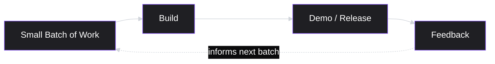

# Lesson 31: Agile Fundamentals

## Why This Lesson Matters

Lesson 30 closed out Module 3 by teaching you how to decide *what* to build — prioritization frameworks, trade-off reasoning, and the discipline of saying no to good ideas in service of better ones. That module answered the second of the three core questions from Lesson 1: "What should we build to solve it?" This lesson begins Module 4, and Module 4 answers a question Lesson 1 mentioned but deliberately did not resolve: once a decision is made, *how does a team actually turn it into working software, week over week, without losing the thread of why the decision was made in the first place?*

This is a real gap in how new PMs are trained. Many PMs can prioritize a backlog beautifully and then watch that backlog degrade into chaos within a month, because they never learned the operating system that engineering and design teams actually run on day to day. Agile is that operating system — not a single tool, not a checklist, but a family of practices built around a specific bet: that in a domain as uncertain as software product development, short feedback loops beat long up-front plans.

This matters concretely because most of your career-long working relationship with engineering will be mediated through an Agile process of some kind — a sprint, a Kanban board, a standup, a retrospective. If you don't understand *why* these rituals exist, you will experience them as bureaucratic overhead to be tolerated. If you do understand why, you will recognize them as the primary mechanism through which the Decision Chain (Lesson 1) actually executes in practice — and you will know when to adapt them, and when a ritual has calcified into theater. This lesson establishes the underlying philosophy; Lessons 32 and 33 will cover the two dominant concrete frameworks (Scrum and Kanban) built on top of it.

---

## Learning Path

| Field | Detail |
|---|---|
| **Module** | 4 — Execution & Agile Delivery |
| **Current Lesson** | 31 of 90 |
| **Difficulty** | 4 / 10 |
| **Estimated Study Time** | 35 minutes (reading) + 15 minutes (reflection + quiz) |
| **Prerequisites** | Lesson 1 (Decision Chain, Output vs. Outcome), Lesson 29 (Prioritization Basics) |
| **Next Lesson** | Lesson 32 — Scrum Framework |
| **Future Topics Unlocked** | Lesson 32 (Scrum Framework), Lesson 33 (Kanban Framework), Lesson 34 (Sprint Planning & Backlog Grooming), Lesson 39 (Technical Debt & PM Trade-offs), Lesson 45 (A/B Testing & Experimentation) — all directly build on the Iteration Loop and the four Agile Values introduced here |

---

## Learning Objectives

By the end of this lesson, you will be able to:

1. Explain the historical problem Agile was designed to solve, and contrast it with the Waterfall model it emerged in response to.
2. State the four core values and twelve principles of the Agile Manifesto in your own words, and identify which value is most frequently violated in practice.
3. Describe the Iteration Loop as a mental model for how Agile teams convert uncertainty into working software, and distinguish it from the Decision Chain (Lesson 1).
4. Identify the difference between "doing Agile" (following ceremonies) and "being Agile" (holding the underlying values), and diagnose which one a given team is actually practicing.
5. Explain the PM's specific role and responsibilities within an Agile team, as distinct from the roles of the Scrum Master, Engineering Manager, and individual contributors.

---

## Prerequisites

This lesson assumes you are comfortable with two things established earlier in this curriculum. First, from **Lesson 1**, it assumes fluency with the Decision Chain (Problem → Understanding → Decision → Execution → Outcome) and the Output vs. Outcome distinction — Agile is, at its core, a way of structuring the "Execution" link of that chain so that it stays connected to the "Outcome" link instead of drifting into pure output production. Second, from **Lesson 29 (Prioritization Basics)**, it assumes you already know how to rank and sequence a backlog of candidate ideas by value and cost. This lesson does not re-teach prioritization; it teaches what happens to a prioritized backlog *after* prioritization is done, once engineering begins turning it into software.

---

## Theory

### The Problem Agile Was Built to Solve

To understand why Agile exists, it helps to understand what it replaced: the **Waterfall model**. Waterfall borrowed its structure from civil engineering and manufacturing, where it is often genuinely wise to fully specify requirements, then design, then build, then test, then release, in strict sequence — because the cost of changing a bridge design after concrete has been poured is catastrophic. Software inherited this sequential model for decades, on the assumption that the same logic applied.

It largely did not. Software requirements are rarely knowable in full up front, because much of what a team learns about the "right" solution only becomes visible once real users interact with something real. Under Waterfall, a team might spend six to twelve months writing a complete specification, only to discover — after building the entire thing — that a core assumption was wrong. By then, the cost of change is enormous, because everything downstream was built on top of the flawed assumption. This is precisely the failure mode described in Lesson 1's Case Study, except stretched across a full release cycle instead of a single feature decision.

### The Agile Manifesto

In 2001, seventeen software practitioners met and produced the **Agile Manifesto**, a short document stating four core values:

1. **Individuals and interactions** over processes and tools
2. **Working software** over comprehensive documentation
3. **Customer collaboration** over contract negotiation
4. **Responding to change** over following a plan

A critical, frequently misunderstood detail: the Manifesto does not say the items on the right have *no* value — it says the items on the left are valued *more*, when the two are in tension. Process and tools still matter; documentation still matters; contracts and plans still matter. The claim is narrower and more defensible: when circumstances force a trade-off, Agile teams choose adaptability over rigid adherence to an original plan.

Twelve supporting principles accompany these values, but three carry disproportionate weight for a PM specifically:

- "Our highest priority is to satisfy the customer through early and continuous delivery of valuable software" — this is the Manifesto's version of Lesson 1's output-vs-outcome distinction, expressed as a delivery cadence.
- "Working software is the primary measure of progress" — not a Gantt chart showing percentage complete, not a specification document, but software a user could actually touch.
- "At regular intervals, the team reflects on how to become more effective, then tunes and adjusts its behavior accordingly" — this is the origin of the retrospective, covered further in Lesson 32.

### The Iteration Loop

This lesson's core mental model — the **Iteration Loop** — describes how these values translate into a repeatable operating rhythm:

The critical design choice is the word **small**. Rather than committing to a large batch of work over a long horizon (Waterfall), an Agile team commits to a small, time-boxed batch, builds it, exposes it to feedback quickly, and lets that feedback shape the next batch. This is not merely a scheduling preference — it is a direct, structural response to uncertainty. The smaller the batch, the cheaper it is to discover you were wrong, and the sooner you can course-correct.

It is worth being precise about how the Iteration Loop relates to the Decision Chain from Lesson 1. The Decision Chain describes a single pass through Problem → Understanding → Decision → Execution → Outcome, at the level of a whole initiative. The Iteration Loop operates *inside* the Execution link of that chain — it is the mechanism by which Execution itself is broken into small, feedback-generating increments, rather than one large, feedback-blind push. Put differently: the Decision Chain tells you *what* you're trying to do; the Iteration Loop tells you *how* a team structures the actual building of it so that being wrong is cheap to discover and cheap to fix.

### "Doing Agile" vs. "Being Agile"

A distinction every PM must learn to diagnose quickly: many organizations that claim to "do Agile" have adopted its ceremonies — daily standups, two-week sprints, retrospectives — without adopting its underlying values. This produces what practitioners sometimes call **"Waterfall in sprint's clothing"**: a team that plans an entire quarter's work in detail up front, breaks it into sprint-sized chunks purely for scheduling convenience, and treats each sprint's plan as fixed and non-negotiable regardless of what is learned along the way. The ceremonies are present; the responsiveness to change is not.

You can diagnose which situation you're in with a simple test: when a team learns something significant mid-sprint that suggests the current plan is wrong, does the plan change, or does the team "finish what was committed" and defer the learning to next sprint's planning? Teams that consistently choose the latter are doing Agile. Teams willing to genuinely re-plan, even at the cost of an uncomfortable conversation about a broken commitment, are being Agile. This distinction will matter directly when you study Scrum in Lesson 32, because Scrum's ceremonies are frequently implemented in the "doing" mode without the "being" mode, and recognizing the gap is a specifically valuable PM skill.

### The PM's Role Inside an Agile Team

New PMs are often unclear on where their responsibility begins and ends once a team goes Agile, because several roles appear to overlap. A brief map:

| Role | Primary Responsibility in an Agile Context |
|---|---|
| **Product Manager** | Owns *what* gets built and *why* — maintains the backlog, prioritizes it (Lesson 29), and ensures every increment ladders up to a real outcome, not just output |
| **Scrum Master / Agile Coach** (if present) | Owns the *process* — facilitates ceremonies, removes team-level blockers, protects the team's focus; does not decide what gets built |
| **Engineering Manager / Tech Lead** | Owns *how* it gets built — technical approach, architecture, estimation accuracy, code quality |
| **Individual engineers/designers** | Own the actual construction and craft-level decisions within the constraints set above |

The most common confusion for new PMs is conflating their role with the Scrum Master's. A PM who spends their energy facilitating standups and tracking velocity charts, while neglecting backlog quality and outcome clarity, has drifted into project-coordination work — precisely the trap Lesson 1 warned against. The PM's distinctive contribution to an Agile team is not running the ceremonies; it is making sure the ceremonies are operating on a backlog worth building.

---

## Common Beginner Mistakes

**Mistake 1: Treating Agile as a synonym for "fast."**

Agile is not a speed technique; it is an uncertainty-management technique. A team can move fast under Waterfall (with enough resources) and can move slowly under Agile (if batches are too large or feedback loops are ignored). The value of Agile comes from short feedback loops, not raw velocity.

**Mistake 2: Believing the Manifesto rejects planning entirely**

"Responding to change over following a plan" is frequently misquoted as "we don't need plans." The Manifesto values planning — it simply treats a plan as a working hypothesis to be revised with evidence, rather than a contract to be defended regardless of what is learned.

**Mistake 3: Confusing ceremony attendance with Agile practice**

As covered above, a team can run every ceremony precisely on schedule while still operating in a fundamentally Waterfall mindset internally. New PMs often assume that because standups and sprints exist, the team is "Agile" by default — this is the single most common misdiagnosis in the industry.

**Mistake 4: Assuming Agile removes the need for upfront strategic thinking**

Short iteration cycles at the execution level do not eliminate the need for the longer-horizon reasoning covered in Lesson 29 (Prioritization) and Lesson 35 (Roadmapping, upcoming). Agile governs how work is executed once prioritized; it does not replace the discipline of deciding what deserves to be worked on in the first place.

**Mistake 5: Using "we're Agile" to avoid commitments to stakeholders**

Some PMs and teams invoke Agile as a shield against giving any forward-looking estimate at all — "we can't tell you when this will ship, we're Agile." This is a misuse of the philosophy. Agile changes *how confidently and how far in advance* you commit, and demands that commitments be revisited as evidence arrives — it does not exempt a team from giving stakeholders a reasonable, honestly-caveated sense of direction and timing, a skill covered directly in Lesson 47 (Stakeholder Management).

---

## Mental Model: The Iteration Loop

*(Introduced above in the Theory section; restated here as this lesson's standalone takeaway tool, per curriculum convention.)*

Use the Iteration Loop as a diagnostic whenever a project feels "stuck" or "off track." Ask: is the current batch of work actually small enough to generate feedback quickly, or has it quietly grown into a mini-Waterfall project? Is feedback from the last loop actually shaping the next batch, or is the team executing a pre-set plan regardless of what was learned? A team that can't clearly answer both questions has a process that looks Agile on a calendar but doesn't function as one in practice.

---

## Real Company Example

**Amazon**'s "two-pizza team" concept is real, but the more precise and more useful version of the story — as told firsthand by former Amazon VP Colin Bryar and former VP Bill Carr in their book *Working Backwards* — is that two-pizza teams were an early solution that Amazon later evolved beyond, not a practice that simply continues unchanged. Amazon found that team *size* wasn't actually the strongest predictor of a team's success; having a single accountable leader with the right authority was. That insight produced "single-threaded leadership" (STL): one leader, unencumbered by competing responsibilities, owns one initiative end-to-end with a dedicated, "separable" team, so the organization doesn't have to coordinate every decision through a large committee.

The underlying logic connects directly to this lesson's theory, and the evolution itself is the more instructive part: small, autonomous teams reduce coordination overhead — a team of eight can decide, build, and get feedback in days, while a team of eighty attempting the same decision typically cannot, because the number of people who must align before work begins grows the batch size by necessity. But Amazon's own experience shows that raw team size was a proxy for the real variable (clear, unambiguous ownership), not the cause itself — worth remembering before copying "keep teams small" as a rule in isolation from what it's actually meant to produce.

*(Source: Bryar and Carr's *Working Backwards* (2021), a firsthand insider account by two former Amazon executives directly involved in the practice's development — a stronger source than the general "widely reported" framing this section previously relied on.)*

---

## Real World Perspective: Agile Fundamentals at Different Company Stages

**At a startup:**
Agile is often practiced informally and without much ceremony — a founder-PM might simply talk to engineers daily and adjust plans in real time, without a named framework, a tracked velocity chart, or a scheduled retrospective. This is not a failure to "do Agile properly"; in a five-person team sitting in one room, many formal ceremonies exist to solve coordination problems that don't yet exist at that scale. The values (short feedback loops, responsiveness to learning) are often present even when the vocabulary (sprints, standups) is not.

**At a mid-size company:**
Formal frameworks typically appear — usually Scrum or Kanban (Lessons 32–33) — because the team has grown past the point where informal daily conversation can keep everyone aligned. This is also where "doing Agile vs. being Agile" drift most commonly begins, because ceremonies get standardized company-wide by a platform or operations team, sometimes without preserving the underlying reasoning for why each ceremony exists.

**At Big Tech:**
Agile ceremonies are typically deeply institutionalized, often supported by dedicated tooling, embedded agile coaches, and standardized sprint cadences across dozens of teams simultaneously. The tension shifts: the risk is no longer "no process at all," but rather process ossifying into ritual disconnected from its purpose, at a scale where a single misaligned ceremony can quietly waste enormous amounts of engineering time across many teams before anyone notices. Senior PMs at this scale are often specifically valued for their willingness to challenge a ceremony that has stopped serving its original function.

---

## Detailed Case Study: The Sprint That Wasn't

Consider a simplified, illustrative scenario, common at mid-size product organizations transitioning from ad hoc development into a formal Agile process for the first time.

A twelve-person product team adopts two-week sprints after a consultant recommends it. In week one of the pilot sprint, the team commits to seven backlog items during sprint planning. On day four, a customer-facing bug is discovered that is actively costing the company revenue — engineers spend a day and a half fixing it, unplanned. On day seven, user interviews (conducted independently by design) reveal that one of the seven committed items is based on a wrong assumption about user behavior and should be redesigned before more engineering time is spent on it.

Despite both discoveries, the PM insists the team "finish what we committed to," reasoning that changing the sprint mid-flight would look like poor planning to leadership. The team ships all seven original items at the end of the sprint, including the one now known to rest on a flawed assumption. The following sprint, the team has to redo roughly 40% of that item's work.

**What went wrong?**

The team had adopted Agile's ceremonies — a sprint, a fixed commitment, a two-week cadence — without adopting its underlying value of *responding to change over following a plan*. Mid-sprint learning, exactly the kind of feedback the Iteration Loop is designed to capture and act on, was treated as an inconvenience to be ignored rather than a signal to be acted on. The PM's instinct — protecting the appearance of predictable delivery — is understandable, but it inverted the entire purpose of the framework: a sprint commitment exists to create a short, protected window of focus, not a contract that must be honored even after it's known to be wrong.

A PM operating from genuine Agile values, rather than Agile ceremony, would have brought the new evidence to the team immediately, made the trade-off explicit to stakeholders ("we're pausing item 5 because we just learned it rests on a false assumption — here's what we'll do instead"), and treated the resulting short-term appearance of a "broken commitment" as a far better outcome than shipping something known to be wrong. This exact tension — protecting a plan versus responding to new evidence — will reappear directly in **Lesson 34 (Sprint Planning & Backlog Grooming)**, where we build a concrete process for handling mid-sprint changes without destabilizing the whole team's focus, and again in **Lesson 47 (Stakeholder Management)**, where we address how to communicate a changed plan upward without it reading as a failure.

---

## Framework Explanation: The Agile Fit Checklist

A second, more tactical tool: before recommending that a team adopt or continue an Agile process, or before evaluating whether an existing process is genuinely functioning, check it against this list.

| Check | Question | Sign of Trouble |
|---|---|---|
| Batch size | Is each unit of committed work small enough to complete and get feedback on within the iteration window? | Work items routinely span multiple sprints with no visible sub-progress |
| Feedback loop closure | Does feedback from a completed increment demonstrably change the next increment's plan? | Retrospectives produce the same action items sprint after sprint with no behavior change |
| Responsiveness | When significant new evidence appears mid-cycle, does the plan actually change? | Plans are treated as fixed commitments regardless of new evidence (see Case Study above) |
| Working software as truth | Is progress measured by something a user could touch, or by percentage-complete estimates and documentation? | Status reports describe "80% done" for work with no demonstrable, testable output |
| PM backlog ownership | Is the PM actively curating and prioritizing the backlog, or has that responsibility drifted to whoever runs the ceremonies? | Backlog is stale, unprioritized, or maintained by the Scrum Master/EM rather than the PM |

This checklist is deliberately framework-agnostic — it applies equally whether the team ultimately uses Scrum, Kanban, or a hybrid, because it audits Agile *values*, not any single Agile *implementation*. We will apply it directly when comparing Scrum and Kanban in Lessons 32 and 33.

---

## Interview Perspective: How Interviewers Think About This

**Typical question 1: "How do you feel about Agile? Do you prefer Scrum or Kanban?"**
*What the interviewer is actually evaluating:* Whether the candidate has a values-first understanding of Agile, or a ceremony-first one. A weak answer states a framework preference with no reasoning ("I like Scrum, it's more structured"). A strong answer explains what problem each framework solves and under what conditions each is a better fit — signaling that the candidate understands Agile as a response to a specific kind of uncertainty, not a personal style preference.

**Typical question 2: "Tell me about a time a project's plan had to change mid-execution. How did you handle it?"**
*What the interviewer is actually evaluating:* Whether the candidate treats new evidence as something to act on or something to defer, mirroring this lesson's Case Study exactly. A weak answer describes forcing the original plan through regardless of what was learned, in the name of predictability. A strong answer describes communicating the change transparently, explaining the evidence behind it, and reprioritizing without treating the change itself as a failure.

**Typical question 3: "What's the PM's job in a sprint, versus the Scrum Master's?"**
*What the interviewer is actually evaluating:* Role clarity — whether the candidate understands that the PM owns backlog quality and outcome direction, not ceremony facilitation. Candidates who describe themselves running standups and tracking burndown charts, without mentioning backlog prioritization or outcome framing, reveal the exact role-confusion covered in this lesson's Theory section.

---

## Summary

Agile is not a single process but a family of practices built on a specific bet about software development: that in the presence of genuine uncertainty about what users actually need, short feedback loops beat long up-front plans. It emerged as a direct response to the failure modes of Waterfall, where large, sequential commitments made discovering a wrong assumption catastrophically expensive. The Agile Manifesto's four values — individuals and interactions, working software, customer collaboration, and responding to change — describe what to prioritize when trade-offs arise, not a rejection of process, documentation, contracts, or plans outright. This lesson's Iteration Loop (small batch → build → demo/release → feedback → informs next batch) describes how those values translate into a repeatable operating rhythm inside the Execution link of the Decision Chain from Lesson 1. The most important diagnostic skill this lesson teaches is distinguishing "doing Agile" (running ceremonies on schedule) from "being Agile" (genuinely responding to what each iteration reveals) — a gap that widens as organizations grow and ceremonies risk becoming ritual. Within an Agile team, the PM's distinctive job remains what it has always been since Lesson 1: owning the backlog's connection to real problems and real outcomes, while the Scrum Master owns process facilitation and engineering leadership owns technical execution.

---

## Key Takeaways

- Agile emerged as a direct response to Waterfall's core weakness: expensive, late discovery of wrong assumptions after long, sequential commitments.
- The four Agile values prioritize individuals/interactions, working software, customer collaboration, and responsiveness to change — without discarding process, documentation, contracts, or plans entirely.
- The Iteration Loop (small batch → build → demo/release → feedback → next batch) operates inside the Execution link of the Decision Chain (Lesson 1), keeping execution connected to real feedback rather than isolated from it.
- "Doing Agile" (ceremonies present) is not the same as "being Agile" (values genuinely practiced) — many organizations have the former without the latter.
- Agile does not remove the need for upfront prioritization (Lesson 29) or longer-horizon planning (Lesson 35) — it governs execution once priorities are set, not the setting of priorities itself.
- The PM's distinctive role inside an Agile team is backlog ownership and outcome clarity, not ceremony facilitation — that belongs to the Scrum Master or Agile Coach where one exists.
- Smaller, more autonomous teams (as in Amazon's two-pizza team model) tend to sustain tighter, more genuine iteration loops than large teams, because coordination overhead scales with team size.

---

## Cheat Sheet

*A two-minute review of everything in this lesson.*

- **Agile exists because:** software requirements are rarely fully knowable up front; short feedback loops make being wrong cheap to discover.
- **Four values:** individuals/interactions, working software, customer collaboration, responding to change — each "over," not "instead of," the item on the right.
- **Iteration Loop:** Small Batch → Build → Demo/Release → Feedback → back into next batch.
- **Doing vs. Being Agile test:** when the team learns something mid-cycle that changes the picture, does the plan actually change?
- **PM's job in Agile:** own the backlog and the "why," not the ceremonies.
- **Agile Fit Checklist:** batch size, feedback loop closure, responsiveness, working software as truth, PM backlog ownership.
- **Not a speed hack:** Agile manages uncertainty; it does not guarantee velocity.

---

## Glossary

| Term | Definition | Related Concepts | Difficulty |
|---|---|---|---|
| Agile | A family of iterative software development practices prioritizing short feedback loops and responsiveness to change over rigid up-front planning | Waterfall, Iteration Loop | 1 |
| Waterfall | A sequential development model (requirements → design → build → test → release) borrowed from manufacturing/civil engineering | Agile Manifesto | 1 |
| Agile Manifesto | The 2001 founding document stating Agile's four core values and twelve principles | Agile Values, Iteration Loop | 1 |
| Iteration Loop | This lesson's mental model: small batch → build → demo/release → feedback → informs next batch | Decision Chain (Lesson 1) | 2 |
| Doing Agile vs. Being Agile | The distinction between following Agile ceremonies and genuinely holding Agile's underlying values | Sprint, Retrospective | 2 |
| Two-Pizza Team | Amazon's informally reported principle of keeping teams small enough to sustain tight iteration loops | Single-Threaded Ownership | 1 |
| Single-Threaded Ownership | A structure where one clearly accountable owner drives an initiative end-to-end without heavy committee coordination | Two-Pizza Team | 2 |
| Batch Size | The amount of work committed to before the next round of feedback is gathered | Iteration Loop, Sprint | 2 |

---

## Further Reading / Resources

- *Agile Manifesto* — Kent Beck, Mike Beedle, et al. (2001), the original founding document and its twelve principles.
- *The Lean Startup* by Eric Ries — extends the same build-measure-learn logic underlying the Iteration Loop to whole-company strategy, not just engineering execution.
- *Inspired: How to Create Tech Products Customers Love* by Marty Cagan — situates Agile execution within the broader context of product discovery and PM responsibility.

---

## Flashcards

**Card 1**
- Front: What problem was Agile originally designed to solve?
- Back: The high cost of discovering wrong assumptions late, after long sequential (Waterfall) commitments had already been fully built out.
- Difficulty: 1
- Tags: history, waterfall

**Card 2**
- Front: Name the four values of the Agile Manifesto.
- Back: Individuals and interactions over processes and tools; working software over comprehensive documentation; customer collaboration over contract negotiation; responding to change over following a plan.
- Difficulty: 2
- Tags: manifesto, values

**Card 3**
- Front: What are the five stages of the Iteration Loop?
- Back: Small Batch of Work → Build → Demo/Release → Feedback → (feeds back into) next Small Batch.
- Difficulty: 1
- Tags: mental-model, iteration-loop

**Card 4**
- Front: What's the simplest test for whether a team is "being Agile" versus just "doing Agile"?
- Back: When the team learns something significant mid-cycle, does the plan actually change, or does the team finish the original commitment regardless?
- Difficulty: 2
- Tags: diagnosis

**Card 5**
- Front: In an Agile team, who owns the backlog and outcome direction — the PM or the Scrum Master?
- Back: The PM. The Scrum Master owns process facilitation; the PM owns what gets built and why.
- Difficulty: 1
- Tags: roles

**Card 6**
- Front: Why does Amazon's reported "two-pizza team" principle connect to the Iteration Loop?
- Back: Smaller, more autonomous teams require less coordination overhead, allowing them to complete small batches and gather feedback faster than large teams can.
- Difficulty: 2
- Tags: amazon, team-size

**Card 7**
- Front: Does Agile eliminate the need for upfront prioritization and roadmapping?
- Back: No. Agile governs how already-prioritized work is executed; it does not replace the separate discipline of deciding what deserves to be built in the first place (Lesson 29, Lesson 35).
- Difficulty: 2
- Tags: scope, prioritization

## Reflection Exercise

Consider the following novel scenario: You've just joined a fourteen-person team as PM. They run two-week sprints, daily standups, and a retrospective every other Friday. On your first day, an engineer tells you, half-joking, "our retros are basically the same meeting every two weeks — same three complaints, nothing changes." You also notice the current sprint board shows three items that have been "in progress" for over five weeks each.

There is no single correct answer to the prompts below — the goal is to practice diagnostic reasoning using this lesson's frameworks, not to arrive at one "right" fix.

1. Using the Agile Fit Checklist, which specific checks does this team appear to be failing, based on the evidence given?
2. Is this team "doing Agile" or "being Agile," in your judgment? What additional evidence would you want before being confident in your answer?
3. The stale, long-running backlog items suggest a batch-size problem. What questions would you ask the team to understand why those items have stayed "in progress" so long?
4. If the recurring, unresolved retrospective complaints turn out to be about a dependency on another team outside your control, how would your response differ from if they turn out to be about something within your own team's process?
5. As the new PM, would you address these issues directly in your first week, or observe for a cycle or two first? Justify your choice using this lesson's distinction between ceremony and value.

---

## Quiz

**1. What core problem did Agile emerge to address, relative to Waterfall's sequential model?**
A) A lack of standardized time-tracking software
B) Wrong assumptions surfacing only after large, costly commitments
C) An excess of unnecessary internal documentation
D) An inability to adopt modern version control tools

*Correct answer: B*
*Explanation: Waterfall's build-everything-then-test sequence meant a flawed assumption was only discovered after the whole thing had already been built, making the fix expensive.*
*Learning objective tested: #1*
*Difficulty: Easy*

---

**2. According to the Manifesto, how should "responding to change" and "following a plan" be understood together?**
A) Plans should never be written under a genuine Agile process
B) The two values apply only to larger, established teams
C) Following a plan is prioritized once conditions grow uncertain
D) Responding to change wins the tie, though plans keep value

*Correct answer: D*
*Explanation: The Manifesto's values are stated as "X over Y" — X wins when the two conflict, not that Y has no worth at all.*
*Learning objective tested: #2*
*Difficulty: Easy*

---

**3. In the Iteration Loop diagram, what does the dotted arrow returning to "Small Batch of Work" represent?**
A) Feedback from a release shaping the next batch of work
B) A checkpoint where the Scrum Master approves new work
C) A rule requiring each batch to repeat the last exactly
D) An optional step most mature teams eventually drop

*Correct answer: A*
*Explanation: The dotted arrow is the loop's defining feature — feedback from what shipped directly shapes what gets built next.*
*Learning objective tested: #3*
*Difficulty: Easy*

---

**4. How does the Iteration Loop relate to the Decision Chain from Lesson 1?**
A) The two models are just different names for one idea
B) The Decision Chain applies only once Waterfall is dropped
C) It sits inside Execution, breaking it into small increments
D) It replaces the Decision Chain once a team goes Agile

*Correct answer: C*
*Explanation: The lesson places the Iteration Loop inside the Decision Chain's Execution step, turning one big push into small increments that generate feedback.*
*Learning objective tested: #3*
*Difficulty: Easy*

---

**5. A team runs standups and retrospectives on schedule but never changes a sprint plan even after learning something important mid-sprint. What does this lesson call that pattern?**
A) A well-functioning Scrum process worth leaving alone
B) Doing Agile without being Agile
C) A Kanban team mistakenly running Scrum ceremonies
D) Being Agile in its most disciplined possible form

*Correct answer: B*
*Explanation: Ceremonies present without genuine responsiveness to new evidence is exactly the "doing Agile without being Agile" pattern this lesson names.*
*Learning objective tested: #4*
*Difficulty: Easy*

---

**6. Which role facilitates ceremonies and removes team-level blockers, without deciding what gets built?**
A) Product Manager
B) An individual engineer on the team
C) An executive sponsor
D) Scrum Master / Agile Coach

*Correct answer: D*
*Explanation: The role table assigns process facilitation and blocker removal to the Scrum Master, distinct from the PM's ownership of what gets built.*
*Learning objective tested: #5*
*Difficulty: Easy*

---

**7. A PM spends most of their time running standups and tracking a velocity chart while the backlog sits unprioritized. What has most likely happened?**
A) The PM has drifted into the Scrum Master's role
B) This is the expected division of labor on a healthy team
C) The team should be praised for such an involved PM
D) The PM is performing exactly the job Lesson 1 describes

*Correct answer: A*
*Explanation: Ceremony facilitation at the expense of backlog quality is the role-confusion trap the lesson warns new PMs against.*
*Learning objective tested: #5*
*Difficulty: Medium*

---

**8. Which of these is NOT one of the four Agile Manifesto values?**
A) Working software over comprehensive documentation
B) Responding to change over following a plan
C) Maximizing headcount over lean staffing
D) Individuals and interactions over processes and tools

*Correct answer: C*
*Explanation: Headcount is not part of the Manifesto; its four values are individuals/interactions, working software, customer collaboration, and responding to change.*
*Learning objective tested: #2*
*Difficulty: Medium*

---

**9. Why does this lesson warn against using "we're Agile" as a reason to give stakeholders no forward-looking information at all?**
A) Every delivery date must be fixed at project kickoff
B) It misuses the philosophy, which only changes commitment confidence
C) Stakeholders forfeit any right to ask about timing
D) Only Waterfall teams are permitted to give estimates

*Correct answer: B*
*Explanation: Common Beginner Mistake #5 frames this as a misuse — Agile changes how confidently and how far ahead a team commits, not whether it communicates direction.*
*Learning objective tested: #2, #4*
*Difficulty: Medium*

---

**10. A team keeps small batches and demos working software each cycle, but its retrospectives raise the same three complaints every time with no resulting change. Which Agile Fit Checklist item is this team failing most clearly?**
A) Working software as truth
B) PM backlog ownership
C) Batch size
D) Feedback loop closure

*Correct answer: D*
*Explanation: Feedback loop closure asks whether feedback actually changes future increments; recurring, unaddressed complaints are the checklist's named warning sign for this check.*
*Learning objective tested: #4*
*Difficulty: Medium-Hard*

---

**11. In the Case Study, what was the PM's central mistake?**
A) Protecting a commitment instead of acting on new evidence
B) Assigning too many backlog items to a single sprint
C) Skipping the sprint planning meeting entirely
D) Choosing a two-week cadence over a one-week cycle

*Correct answer: A*
*Explanation: The PM treated the sprint commitment as fixed even after learning one item rested on a false assumption, inverting Agile's actual purpose.*
*Learning objective tested: #4*
*Difficulty: Medium*

---

**12. A teammate claims "Agile means never planning more than two weeks out." How does this lesson characterize that claim?**
A) The exact definition used in the Agile Manifesto itself
B) A description that actually applies to Waterfall, not Agile
C) A common misreading; plans stay revisable, never absent
D) An accurate account of how genuinely Agile teams operate

*Correct answer: C*
*Explanation: Common Beginner Mistakes #2 and #4 both correct this: Agile treats plans as revisable, not absent, and doesn't remove the need for longer-horizon planning.*
*Learning objective tested: #2, #4*
*Difficulty: Medium-Hard*

---

**13. (Product Thinking) Team A changes its sprint plan whenever major new evidence appears mid-cycle, even if that means an awkward conversation about a broken commitment. Team B always finishes exactly what it committed to, addressing learnings only in the next planning session. Which team is "being Agile," and why does this matter beyond semantics?**
A) Neither team, since both rely on sprints over flow
B) Team A, since responding to real evidence is the actual value
C) Team B, since consistency earns stakeholder trust over time
D) Both teams equally, since both run the same ceremonies

*Correct answer: B*
*Explanation: Genuine responsiveness to significant new evidence, even at the cost of a broken commitment, is what separates real Agile practice from ceremony alone, per the Case Study.*
*Learning objective tested: #3, #4*
*Difficulty: Hard*

---

**14. (Interview Reasoning) A candidate asked "Scrum or Kanban?" answers: "Scrum, because it's more structured and I like structure." What does this response most likely signal?**
A) Strong Agile fluency, since the answer sounded confident
B) That the candidate would fit a Kanban team better
C) Nothing meaningful, since framework choice is personal taste
D) A ceremony-first view, since no reasoning about fit was given

*Correct answer: D*
*Explanation: A strong answer explains what problem each framework solves and when each fits; this answer states a preference with no such reasoning.*
*Learning objective tested: #4, #5*
*Difficulty: Hard*

---

**15. (Product Thinking, Highest Difficulty) A VP asks a PM to guarantee an exact feature list and ship date six months out, "so leadership can plan around it." The team runs a genuinely iterative process. What is the best response, using only this lesson's frameworks?**
A) Give a confident direction with caveats on what's least certain
B) Agree to the exact list and date to satisfy the VP
C) Refuse to discuss the request, since Agile gives no dates
D) Redirect the VP to the Scrum Master instead of answering

*Correct answer: A*
*Explanation: Agile does not reject forward commitments; it changes how confidently and how far ahead they're made, and expects them to sharpen as evidence arrives.*
*Learning objective tested: #2, #4, #5*
*Difficulty: Hard*

---

## Connections

| | Lesson | Core Idea Carried Forward |
|---|---|---|
| **Previous Lesson** | Lesson 30 — (Module 3 closing lesson on prioritization trade-offs) | This lesson picks up immediately after a backlog has been prioritized and asks how it actually gets executed |
| **Current Lesson** | Lesson 31 — Agile Fundamentals | Iteration Loop; Agile's four values; Doing Agile vs. Being Agile; PM's role distinct from Scrum Master/EM; Agile Fit Checklist |
| **Next Lesson** | Lesson 32 — Scrum Framework | Takes the Iteration Loop and formalizes it into Scrum's specific ceremonies, roles, and artifacts |
| **Future Concepts Unlocked** | Lesson 33 (Kanban Framework) | Presents a contrasting, flow-based implementation of the same underlying Agile values, to be evaluated using the Agile Fit Checklist introduced here |
| | Lesson 34 (Sprint Planning & Backlog Grooming) | Builds a concrete process for handling mid-sprint changes, directly resolving the failure mode in this lesson's Case Study |
| | Lesson 39 (Technical Debt & PM Trade-offs) | Applies Agile's short-feedback-loop logic to the specific trade-off of speed versus long-term code health |
| | Lesson 47 (Stakeholder Management) | Extends this lesson's guidance on giving stakeholders honest, caveated forward commitments into a full toolkit |

This curriculum is designed to be read as one continuous argument, not ninety independent articles. Every lesson from here forward will assume you carry the Iteration Loop and the Doing vs. Being Agile distinction with you — they will not be re-explained, only re-applied in new contexts.
