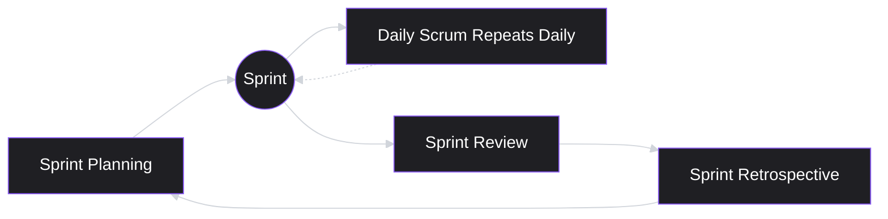
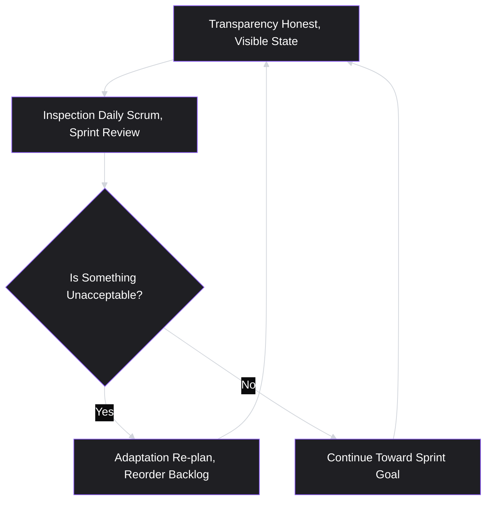

# Lesson 32: Scrum Framework

## Why This Lesson Matters

Lesson 31 established the philosophy underneath all Agile practice: short feedback loops beat long up-front plans, and the real test of an Agile team is whether it genuinely *responds* to what each iteration reveals, not merely whether it runs the right-named meetings on schedule. That lesson deliberately stayed at the level of values and mental models, because before learning any specific framework, you need to be able to judge whether that framework is being used well or used as theater.

This lesson introduces the framework most teams mean when they say "we're Agile": **Scrum**. Scrum is the single most widely adopted concrete implementation of the Iteration Loop from Lesson 31, and it is also the framework most frequently reduced to empty ceremony — precisely because its events (sprint planning, daily standup, review, retrospective) are so easy to schedule and so easy to run without ever engaging the underlying empiricism they exist to produce. If Lesson 31 gave you the values test, this lesson gives you the specific vocabulary, roles, and mechanics you'll actually work inside for most of your PM career — and the specific failure patterns to watch for, since Scrum done badly is often *worse* than no process at all, because it creates a false sense that rigor is already present.

---

## Learning Path

| Field | Detail |
|---|---|
| **Module** | 4 — Execution & Agile Delivery |
| **Current Lesson** | 32 of 90 |
| **Difficulty** | 4 / 10 |
| **Estimated Study Time** | 35 minutes (reading) + 15 minutes (reflection + quiz) |
| **Prerequisites** | Lesson 31 (Agile Fundamentals — Iteration Loop, Agile Fit Checklist, Doing vs. Being Agile) |
| **Next Lesson** | Lesson 33 — Kanban Framework |
| **Future Topics Unlocked** | Lesson 33 (Kanban Framework, contrasting flow-based model), Lesson 34 (Sprint Planning & Backlog Grooming, goes deep on one Scrum event), Lesson 40 (Product Operations), Lesson 55 (Building and Leading Product Teams) — all build on the Scrum roles, events, and artifacts introduced here |

---

## Learning Objectives

By the end of this lesson, you will be able to:

1. Name and explain Scrum's three pillars of empiricism (transparency, inspection, adaptation) and connect each to a specific Scrum event or artifact.
2. List Scrum's three roles, three artifacts (plus their associated commitments), and five events, and state the purpose of each in one sentence.
3. Explain the difference between a Sprint Goal and a sprint backlog, and why conflating the two undermines a sprint's coherence.
4. Diagnose "Zombie Scrum" — a team running all Scrum events without empirical value — using the Agile Fit Checklist from Lesson 31.
5. Explain the specific responsibilities of the Product Owner role, and distinguish them from the responsibilities of the Scrum Master and the Developers.

---

## Prerequisites

This lesson builds directly on **Lesson 31 (Agile Fundamentals)**, which assumed no prior framework knowledge and established the Iteration Loop and the Agile Fit Checklist as generic diagnostic tools. This lesson assumes you can already distinguish "doing Agile" from "being Agile," because Scrum is the framework in which that distinction is tested most often — its five events map so cleanly onto a calendar that a team can run every one of them for years without ever practicing genuine empiricism. If that distinction from Lesson 31 feels shaky, revisit it before continuing, since much of this lesson's Common Beginner Mistakes and Case Study sections depend on it.

---

## Theory

### Origins and the Empirical Foundation

Scrum was formalized in the early 1990s by Ken Schwaber and Jeff Sutherland and later codified in the **Scrum Guide**, which both authors have continued to maintain and periodically revise. Scrum describes itself not as a full methodology but as a lightweight **framework** — a minimal set of roles, events, and artifacts within which teams solve complex problems, with the actual work of planning and execution left to the team itself.

Scrum rests on three pillars, collectively called **empiricism**:

1. **Transparency** — the state of the work and the process must be visible and understood by everyone involved, using a shared, honest vocabulary. A "90% done" status that hides an unresolved technical risk violates transparency.
2. **Inspection** — progress toward a goal must be examined frequently enough to detect problems before they compound. Scrum's events exist largely to create scheduled, structured moments of inspection.
3. **Adaptation** — when inspection reveals that an aspect of the work is unacceptable, or that the resulting product will be unacceptable, adjustments must be made promptly.

Notice the direct lineage from Lesson 31: transparency and inspection generate the "Feedback" step of the Iteration Loop, and adaptation is precisely the "informs next batch" step. Scrum is, in this sense, a specific, named implementation of Lesson 31's generic Iteration Loop — with a fixed cadence (the Sprint) and a specific set of scheduled moments where inspection and adaptation are supposed to happen.

### The Three Roles

| Role | Primary Accountability |
|---|---|
| **Product Owner** | Maximizing the value of the product resulting from the team's work; owns and orders the Product Backlog |
| **Scrum Master** | Establishing Scrum as defined in the Scrum Guide; coaching the team and organization; removing impediments to the team's progress |
| **Developers** | The people doing the work of creating the Increment each Sprint (engineers, designers, QA — anyone building the product) |

Notice that "Product Owner" is a Scrum-specific title for a responsibility this curriculum has been describing since Lesson 1 under the broader term "Product Manager." In many organizations the titles are used interchangeably; in some larger organizations, a single PM may oversee multiple Product Owners embedded in different Scrum teams, or the PM and PO responsibilities may be split across two people. Either way, the accountability described here — owning and ordering the backlog toward maximum value — is precisely the "problem-solution-value fit" accountability from Lesson 1, expressed inside Scrum's specific vocabulary.

### The Three Artifacts and Their Commitments

| Artifact | What It Represents | Associated Commitment |
|---|---|---|
| **Product Backlog** | The complete, ordered list of everything known to be needed in the product | **Product Goal** — the longer-term objective the Product Backlog is working toward |
| **Sprint Backlog** | The Product Backlog items selected for the current Sprint, plus a plan for delivering them | **Sprint Goal** — the single objective the current Sprint exists to achieve |
| **Increment** | A concrete, working step toward the Product Goal, meeting the Definition of Done | **Definition of Done** — a shared, explicit standard of quality every Increment must meet |

The commitments matter as much as the artifacts themselves, and are frequently the part new PMs skip. Without a Sprint Goal, a Sprint Backlog degrades into an arbitrary list of tickets with no coherent story connecting them — which makes mid-sprint trade-off decisions (should we drop item C if item A takes longer than expected?) essentially unanswerable, because there's no shared objective to weigh them against.

### The Five Events

- **The Sprint** — a fixed-length container (commonly one to four weeks) for all other events; a new Sprint starts immediately after the previous one ends, with no gap.
- **Sprint Planning** — the team selects Sprint Backlog items and forms a Sprint Goal, answering "why is this Sprint valuable?" and "what can be done this Sprint?"
- **Daily Scrum** — a short, daily inspection of progress toward the Sprint Goal, used to adapt the plan for the next 24 hours — not a status report to the PM, a distinction covered further below.
- **Sprint Review** — the team and stakeholders inspect the Increment together and adapt the Product Backlog based on what was learned; this is the event most directly tied to Lesson 31's Iteration Loop feedback step.
- **Sprint Retrospective** — the team inspects its own process and interpersonal effectiveness, and plans adaptations to how it works, closing the loop before the next Sprint Planning begins.

### The Daily Scrum Is Not a Status Meeting for the PM

A specific, frequent PM mistake deserves its own subsection because it recurs so often: treating the Daily Scrum as an opportunity to receive individual status updates ("what did you do yesterday, what will you do today, any blockers"), directed at and primarily for the PM's benefit. The Scrum Guide frames the Daily Scrum as belonging to the Developers, for the Developers' own re-planning of the next day's work toward the Sprint Goal. A PM who dominates this event, or attends expecting a personal briefing, subtly converts a peer-coordination ritual into a supervisory one — which tends to make the meeting slower, more guarded, and less genuinely useful for the people actually doing the work.

---

## Common Beginner Mistakes

**Mistake 1: Treating the Product Owner role as a project-manager-style status tracker**

The Product Owner's job is maximizing product value through backlog ordering — a strategic, prioritization-heavy accountability, not a scheduling or status-reporting one. A PO who spends most of their time updating a burndown chart, rather than refining and reordering the backlog based on evidence, has drifted into exactly the role confusion Lesson 1 and Lesson 31 both warned against.

**Mistake 2: Confusing a Sprint Backlog with a Sprint Goal**

A list of ten tickets is not a Sprint Goal. A Sprint Goal is a single coherent objective — "reduce onboarding drop-off for new mobile users" — that the ten tickets exist to serve. Teams that skip forming a real Sprint Goal lose their ability to make sound mid-sprint trade-offs, because there's no shared "why" to weigh a dropped or added item against.

**Mistake 3: Running all five events without empirical value — "Zombie Scrum."**

This is Scrum's version of Lesson 31's "doing Agile without being Agile." A team can hold Sprint Planning, Daily Scrums, a Sprint Review, and a Retrospective every single Sprint, on schedule, while transparency is thin (status is fudged), inspection is shallow (no one asks hard questions), and adaptation never actually happens (the same retrospective action items recur unaddressed). The calendar shows a functioning Scrum team; the outcomes show otherwise.

**Mistake 4: Treating the Sprint Review as a one-way demo rather than a two-way inspection**

The Sprint Review exists to inspect the Increment *with stakeholders* and adapt the Product Backlog based on what's learned — it is a feedback-gathering event, not a presentation. A team that treats it purely as "showing off what we built," without genuinely updating backlog priorities based on stakeholder reaction, has converted an inspection event into a status broadcast.

**Mistake 5: Skipping or trivializing the Definition of Done**

Without an explicit, shared Definition of Done, "done" silently means different things to different people — an engineer may consider a ticket done once code is merged, while a PM may consider it done once it's live for all users. This ambiguity routinely surfaces as a painful surprise during the Sprint Review, when stakeholders discover that "done" items aren't actually usable yet.

---

## Mental Model: The Empirical Loop of a Sprint

This lesson's core takeaway tool builds directly on the five-events diagram above, but reframes it around Scrum's three pillars rather than its calendar structure — useful because it's the pillars, not the event names, that determine whether Scrum is working:

Use this as your standing diagnostic whenever a Scrum team feels "off." Ask, in order: Is the current state of the work actually transparent, or is someone (often unconsciously) protecting appearances? Is inspection happening with real scrutiny, or is it perfunctory? When inspection reveals a problem, does adaptation actually follow — a re-planned Sprint Backlog, a reordered Product Backlog, a changed process — or does the problem get named and then quietly repeated next Sprint? A team failing any one of these three questions is running Scrum's calendar without Scrum's substance — the exact "Zombie Scrum" pattern from Mistake 3 above.

---

## Real Company Example

**Salesforce**'s V2MOM (Vision, Values, Methods, Obstacles, Measures) is a directly sourceable example, not secondhand reporting: CEO Marc Benioff developed it personally in Salesforce's early days and has written about it in both his book *Behind the Cloud* and directly on Salesforce's own company blog, describing it as the process that lets the company "scale the process of setting priorities for tens or hundreds of thousands of employees" while keeping everyone's work traceably connected to a shared strategic direction.

The pairing illustrates a useful structural point: V2MOM-style strategic goal-setting and Scrum-style sprint execution are meant to operate at different altitudes and reinforce each other. V2MOM (or an equivalent strategic framework) answers longer-horizon questions about direction; Scrum's Sprint Goals should, in a healthy team, be visibly traceable back to that longer-horizon direction, rather than existing as disconnected two-week objectives.

*(Source: Marc Benioff's own book *Behind the Cloud* and Salesforce's official company blog. The V2MOM-Scrum pairing itself — how the two are meant to interact day to day — reflects this curriculum's structural argument rather than a specific claim about Salesforce's current internal Agile tooling, which this curriculum does not claim certainty about.)*

---

## Real World Perspective: Scrum Framework at Different Company Stages

**At a startup:**
Scrum, if used at all, is often adopted in a lightweight, partial form — a Sprint Goal and a rough weekly check-in, without necessarily running all five named events formally. This is often appropriate: with five people in one room, transparency and inspection can happen constantly and informally, without needing a scheduled Daily Scrum to manufacture them. The risk here is different from Zombie Scrum — it's under-formalization to the point that adaptation happens on gut feel rather than any structured backlog reordering, which can work at small scale but breaks down as headcount grows.

**At a mid-size company:**
Scrum is typically formalized with all five events running on a fixed cadence, often across multiple teams that need to stay loosely coordinated. This is precisely the stage where Zombie Scrum risk peaks — enough process exists to create the appearance of rigor, but the organization hasn't yet built the muscle (or psychological safety) for genuinely honest transparency and hard-hitting inspection.

**At Big Tech:**
Scrum is frequently one of several coexisting frameworks (some teams may run Scrum, others Kanban — covered in Lesson 33 — depending on the nature of their work), often supported by dedicated Agile coaches and standardized tooling. The PM's job shifts toward ensuring their team's Sprint Goals visibly ladder up to broader organizational objectives across many parallel teams, and toward protecting genuine inspection and adaptation at a scale where it's easy for ceremonies to become perfunctory simply because so many teams are running them simultaneously.

---

## Detailed Case Study: The Retrospective That Never Changed Anything

Consider a simplified, illustrative scenario common at mid-size product organizations several quarters into Scrum adoption.

A nine-person Scrum team has run two-week Sprints for over a year. Every Sprint includes all five events, performed diligently and on schedule. At every Sprint Retrospective, the same two issues surface: (1) the team is frequently blocked waiting on a shared design resource who splits time across three teams, and (2) the Definition of Done is inconsistently applied — some Increments demoed at Sprint Review turn out to need additional QA work the following Sprint. Both issues have appeared in roughly eight consecutive retrospectives. Each time, the team writes an action item ("follow up with design lead about capacity," "clarify Definition of Done"), and each time, the next retrospective reveals the same two problems, unresolved.

**What went wrong?**

By the letter of the Scrum Guide, this team is doing everything correctly — five events, on schedule, with retrospective action items dutifully recorded. But applying this lesson's Mental Model, the failure is visible immediately: **inspection** is functioning (the same two problems keep surfacing, meaning the team is honestly noticing them), but **adaptation** is not (nothing about the design-resource constraint or the Definition of Done actually changes between retrospectives). Recording an action item is not the same as executing an adaptation — and a team that mistakes the former for the latter will experience Scrum as an elaborate mechanism for documenting the same unsolved problems indefinitely.

The design-resource issue, notably, is not solvable by the team's Scrum Master alone, because it's a cross-team resourcing constraint — it requires the Product Owner to escalate it as a structural blocker to the broader organization, rather than treating it as an internal process problem the team can fix through willpower. The Definition of Done issue, by contrast, is entirely within the team's control and should have been resolved after its first appearance. This distinction — which problems a team can adapt to on its own versus which require the PM/PO to escalate outward — will be addressed directly in **Lesson 37 (Working with Engineering Teams)**, and the specific mechanics of writing a Definition of Done that actually prevents this kind of QA surprise will be covered in **Lesson 34 (Sprint Planning & Backlog Grooming)**.

---

## Framework Explanation: The Scrum Health Diagnostic

A second, more tactical tool: use this table to audit whether a specific Scrum team is operating on genuine empiricism or Zombie Scrum, checking each pillar against a concrete, observable signal.

| Pillar | Healthy Signal | Warning Sign |
|---|---|---|
| Transparency | Blockers and risks are raised as soon as they're known, even when uncomfortable | Status is reported as "on track" until it suddenly isn't |
| Inspection (Daily Scrum) | Developers actively re-plan the next day based on new information | The meeting is a recitation of yesterday's tasks with no real re-planning |
| Inspection (Sprint Review) | Stakeholders' reactions visibly change the Product Backlog's order afterward | The Review is a one-way demo with no backlog changes following it |
| Adaptation (Retrospective) | Action items from the previous retrospective are visibly resolved before new ones are added | The same 2–3 issues recur across multiple consecutive retrospectives |
| Sprint Goal coherence | Every item in the Sprint Backlog can be explained in terms of the Sprint Goal | The Sprint Backlog is a list of tickets with no shared "why" connecting them |

This diagnostic pairs directly with the Agile Fit Checklist from Lesson 31 — that checklist audits Agile values generically; this one applies the same audit specifically to Scrum's named pillars and events.

---

## Interview Perspective: How Interviewers Think About This

**Typical question 1: "Walk me through how you'd run a Sprint Retrospective."**
*What the interviewer is actually evaluating:* Whether the candidate understands that a retrospective's purpose is adaptation, not merely inspection — a weak answer describes generating a list of complaints; a strong answer describes ensuring previous action items were actually resolved before adding new ones, directly reflecting this lesson's Case Study.

**Typical question 2: "What's the difference between a Product Owner and a Scrum Master?"**
*What the interviewer is actually evaluating:* Basic role fluency, and whether the candidate understands that these are genuinely distinct accountabilities (value/backlog vs. process/facilitation) rather than interchangeable titles for "the person who runs the sprint."

**Typical question 3: "Tell me about a Scrum team you've worked with that wasn't functioning well. What was actually wrong?"**
*What the interviewer is actually evaluating:* Whether the candidate can diagnose process dysfunction at the level of the three pillars (transparency, inspection, adaptation) rather than superficially ("we didn't have enough meetings" or "our tickets weren't estimated well"). A strong answer names which specific pillar was breaking down and why, echoing this lesson's Mental Model and Framework Explanation.

---

## Summary

Scrum is the most widely adopted concrete framework built on top of Lesson 31's Iteration Loop, structured around three pillars of empiricism — transparency, inspection, and adaptation — expressed through three roles (Product Owner, Scrum Master, Developers), three artifacts with their associated commitments (Product Backlog/Product Goal, Sprint Backlog/Sprint Goal, Increment/Definition of Done), and five events (Sprint, Sprint Planning, Daily Scrum, Sprint Review, Sprint Retrospective). The Product Owner role maps directly onto this curriculum's definition of the PM from Lesson 1: accountable for maximizing value through backlog ordering, not for status tracking or ceremony facilitation. The single most important diagnostic skill this lesson teaches is recognizing "Zombie Scrum" — a team running all five events faithfully while transparency is thin, inspection is shallow, or adaptation never actually follows from what inspection reveals, as illustrated in this lesson's Case Study of a retrospective that recorded the same unresolved issues for eight consecutive Sprints. A functioning Scrum team is not defined by whether it holds the right meetings; it is defined by whether those meetings produce genuine, visible change.

---

## Key Takeaways

- Scrum is a lightweight framework built on three pillars of empiricism: transparency, inspection, and adaptation — a specific, named implementation of Lesson 31's generic Iteration Loop.
- The three roles (Product Owner, Scrum Master, Developers) carry genuinely distinct accountabilities; the Product Owner role maps onto this curriculum's definition of the PM from Lesson 1.
- The three artifacts (Product Backlog, Sprint Backlog, Increment) each have an associated commitment (Product Goal, Sprint Goal, Definition of Done) that gives the artifact coherence and purpose.
- A Sprint Backlog without a real Sprint Goal degrades into an arbitrary ticket list, making mid-sprint trade-offs unanswerable.
- "Zombie Scrum" — running all five events on schedule without genuine empirical value — is Scrum's specific version of Lesson 31's "doing Agile without being Agile."
- The Daily Scrum belongs to the Developers for their own re-planning, not to the PM as a personal status briefing.
- Recording a retrospective action item is not the same as executing an adaptation; a healthy team resolves previous action items before adding new ones.

---

## Cheat Sheet

*A two-minute review of everything in this lesson.*

- **Three pillars:** Transparency, Inspection, Adaptation (empiricism).
- **Three roles:** Product Owner (value/backlog), Scrum Master (process), Developers (building the Increment).
- **Three artifacts + commitments:** Product Backlog/Product Goal, Sprint Backlog/Sprint Goal, Increment/Definition of Done.
- **Five events:** Sprint, Sprint Planning, Daily Scrum, Sprint Review, Sprint Retrospective.
- **Zombie Scrum test:** are the pillars actually functioning, or are the events just happening on schedule?
- **Daily Scrum:** belongs to Developers, not a status meeting for the PM.
- **Retrospective test:** were last Sprint's action items actually resolved, not just repeated?

---

## Glossary

| Term | Definition | Related Concepts | Difficulty |
|---|---|---|---|
| Scrum | A lightweight Agile framework built on empiricism, with three roles, three artifacts, and five events | Empiricism, Iteration Loop | 1 |
| Empiricism | Scrum's foundational principle: knowledge comes from experience and decisions are based on what is observed (transparency, inspection, adaptation) | Transparency, Inspection, Adaptation | 2 |
| Product Owner | The Scrum role accountable for maximizing product value through Product Backlog ownership and ordering | Product Manager, Product Backlog | 1 |
| Sprint Goal | The single coherent objective a Sprint exists to achieve, giving the Sprint Backlog's items a shared "why" | Sprint Backlog | 2 |
| Definition of Done | A shared, explicit quality standard every Increment must meet before being considered complete | Increment | 2 |
| Zombie Scrum | A team running all five Scrum events on schedule without genuine transparency, inspection, or adaptation | Doing Agile vs. Being Agile (Lesson 31) | 2 |
| Sprint Retrospective | The event where the team inspects its own process and plans adaptations before the next Sprint | Adaptation | 1 |
| Daily Scrum | A short daily event for Developers to inspect progress toward the Sprint Goal and re-plan the next 24 hours | Inspection | 1 |

---

## Further Reading / Resources

- *The Scrum Guide* by Ken Schwaber and Jeff Sutherland — the original, continually maintained source defining Scrum's roles, events, and artifacts.
- *Scrum: The Art of Doing Twice the Work in Half the Time* by Jeff Sutherland — a practitioner account of Scrum's origins and its emphasis on empirical process control.
- *Essential Scrum: A Practical Guide to the Most Popular Agile Process* by Kenneth Rubin — a detailed, practitioner-oriented treatment of Scrum roles, artifacts, and common implementation pitfalls.

---

## Flashcards

**Card 1**
- Front: What are Scrum's three pillars of empiricism?
- Back: Transparency, Inspection, and Adaptation.
- Difficulty: 1
- Tags: pillars, empiricism

**Card 2**
- Front: What are Scrum's three roles?
- Back: Product Owner, Scrum Master, and Developers.
- Difficulty: 1
- Tags: roles

**Card 3**
- Front: Match each Scrum artifact to its associated commitment.
- Back: Product Backlog → Product Goal; Sprint Backlog → Sprint Goal; Increment → Definition of Done.
- Difficulty: 2
- Tags: artifacts, commitments

**Card 4**
- Front: What is "Zombie Scrum"?
- Back: A team that runs all five Scrum events on schedule without genuine transparency, inspection, or adaptation — the Scrum-specific version of "doing Agile without being Agile."
- Difficulty: 2
- Tags: diagnosis, zombie-scrum

**Card 5**
- Front: Who does the Daily Scrum belong to, and what is it for?
- Back: It belongs to the Developers, for their own re-planning of the next 24 hours toward the Sprint Goal — not a status briefing for the PM.
- Difficulty: 2
- Tags: daily-scrum, roles

**Card 6**
- Front: What distinguishes a healthy Sprint Retrospective from an unhealthy one, per this lesson's Case Study?
- Back: A healthy one resolves previous action items before adding new ones; an unhealthy one records the same unresolved issues repeatedly across consecutive Sprints.
- Difficulty: 2
- Tags: retrospective, adaptation

**Card 7**
- Front: Why is a Sprint Backlog without a real Sprint Goal a problem?
- Back: It becomes an arbitrary list of tickets with no shared objective, making mid-sprint trade-off decisions (what to drop or add) unanswerable.
- Difficulty: 2
- Tags: sprint-goal

## Reflection Exercise

Consider the following novel scenario: You've become the Product Owner for a seven-person Scrum team midway through a project. The team's Sprint Reviews are well-attended by stakeholders, who ask sharp questions and give detailed feedback on the demoed Increment. However, you notice that the Product Backlog's top ten items have not changed in order for the last five Sprints, regardless of what stakeholders said in each Review.

There is no single correct answer to the prompts below — the goal is to practice diagnosing Scrum health using this lesson's Mental Model and Framework Explanation, not to reach one "right" fix.

1. Using the Empirical Loop mental model, which specific pillar appears to be functioning, and which appears to be breaking down?
2. Is this pattern more likely a transparency problem, an inspection problem, or an adaptation problem? Justify your answer using evidence from the scenario.
3. What questions would you ask the team (or yourself, as PO) to understand why stakeholder feedback isn't reaching the backlog's actual ordering?
4. Could this be a sign that the Sprint Review has become a one-way demo rather than a two-way inspection, as described in Common Beginner Mistake #4? What evidence would confirm or rule that out?
5. As the incoming Product Owner, what is the first concrete change you would make, and how would you know within one or two Sprints whether it worked?

---

## Quiz

**1. What are Scrum's three pillars of empiricism?**
A) Planning, Estimation, Reporting
B) Transparency, Inspection, Adaptation
C) Speed, Quality, Cost
D) Backlog, Sprint, Increment

*Correct answer: B*
*Explanation: The Theory section explicitly names transparency, inspection, and adaptation as Scrum's three pillars of empiricism.*
*Learning objective tested: #1*
*Difficulty: Easy*

---

**2. Which Scrum event is most directly responsible for generating the "feedback" step of Lesson 31's Iteration Loop?**
A) Daily Scrum
B) Sprint Review
C) Sprint Planning
D) None of the events relate to the Iteration Loop

*Correct answer: B*
*Explanation: The lesson explicitly ties the Sprint Review to Lesson 31's Iteration Loop feedback step, since it's where the team and stakeholders inspect the Increment together and adapt the Product Backlog.*
*Learning objective tested: #1*
*Difficulty: Easy*

---

**3. Which artifact is paired with the Definition of Done?**
A) Product Backlog
B) Sprint Backlog
C) Increment
D) Sprint Goal

*Correct answer: C*
*Explanation: The Theory section's artifacts table pairs the Increment with the Definition of Done as its associated commitment.*
*Learning objective tested: #2*
*Difficulty: Easy*

---

**4. Why does the lesson caution against conflating a Sprint Backlog with a Sprint Goal?**
A) Because a Sprint Backlog is always shorter than a Sprint Goal
B) Because without a coherent Sprint Goal, a Sprint Backlog is just a list of tickets with no shared objective, making mid-sprint trade-offs unanswerable
C) Because Sprint Goals are optional in the Scrum Guide
D) Because only the Scrum Master is allowed to set a Sprint Goal

*Correct answer: B*
*Explanation: Common Beginner Mistake #2 explains that without a real Sprint Goal, there is no shared "why" to weigh a dropped or added item against, making trade-offs unanswerable.*
*Learning objective tested: #3*
*Difficulty: Easy*

---

**5. A team runs all five Scrum events every Sprint, but retrospective action items are never actually resolved, and Sprint Reviews never change the Product Backlog's order. What does this lesson call this pattern?**
A) Healthy Scrum
B) Zombie Scrum
C) Kanban
D) Waterfall in disguise

*Correct answer: B*
*Explanation: The lesson defines Zombie Scrum as exactly this pattern — events running on schedule without genuine transparency, inspection, or adaptation.*
*Learning objective tested: #4*
*Difficulty: Easy*

---

**6. Who does the Daily Scrum primarily belong to, according to this lesson?**
A) The Product Owner, for status collection
B) The Developers, for their own re-planning toward the Sprint Goal
C) The Scrum Master, as a personal check-in tool
D) Stakeholders outside the team

*Correct answer: B*
*Explanation: The lesson explicitly states the Daily Scrum belongs to the Developers for their own re-planning of the next 24 hours, not as a status briefing for the PM.*
*Learning objective tested: #5*
*Difficulty: Easy*

---

**7. What is the Product Owner's primary accountability, according to this lesson?**
A) Facilitating all Scrum events and removing impediments
B) Maximizing the value of the product resulting from the team's work by owning and ordering the Product Backlog
C) Writing all the code for the Increment
D) Tracking the team's velocity chart

*Correct answer: B*
*Explanation: The Theory section's roles table defines the Product Owner's accountability as maximizing product value through Product Backlog ownership and ordering.*
*Learning objective tested: #5*
*Difficulty: Medium*

---

**8. Which role is accountable for establishing Scrum as defined in the Scrum Guide and removing impediments to the team's progress?**
A) Product Owner
B) Developers
C) Scrum Master
D) Executive sponsor

*Correct answer: C*
*Explanation: The roles table assigns this accountability specifically to the Scrum Master.*
*Learning objective tested: #2, #5*
*Difficulty: Medium*

---

**9. In the Detailed Case Study, why couldn't the team resolve the design-resource blocker on its own, unlike the Definition of Done issue?**
A) Because the Scrum Master refused to help
B) Because it was a cross-team resourcing constraint requiring the Product Owner to escalate it outward, rather than an internal process problem the team could fix through willpower
C) Because the team didn't hold enough retrospectives
D) Because the issue was not actually real

*Correct answer: B*
*Explanation: The Case Study's "What went wrong?" analysis explicitly distinguishes the cross-team resourcing issue, which required PO escalation, from the Definition of Done issue, which was entirely within the team's control.*
*Learning objective tested: #4*
*Difficulty: Medium*

---

**10. (Scenario) A Sprint Review is well-attended, but afterward the Product Backlog's order never changes based on what stakeholders said. Using the Scrum Health Diagnostic, which signal is this team most clearly failing?**
A) Transparency
B) Daily Scrum inspection
C) Sprint Review inspection
D) Sprint Goal coherence

*Correct answer: C*
*Explanation: The Scrum Health Diagnostic table defines the healthy signal for Sprint Review inspection as stakeholder reactions visibly changing the Product Backlog's order — the warning sign is exactly a one-way demo with no resulting backlog changes.*
*Learning objective tested: #4*
*Difficulty: Medium-Hard*

---

**11. Why does the lesson describe recording a retrospective action item as insufficient on its own?**
A) Because action items should never be written down
B) Because recording an action item is not the same as executing an adaptation — the same issue can recur if the action item is never actually acted on
C) Because only the Scrum Master is allowed to write action items
D) Because retrospectives should not identify any problems

*Correct answer: B*
*Explanation: The Case Study explicitly makes this distinction: the team recorded action items every retrospective, but the same two problems persisted because adaptation, not just recording, never actually followed.*
*Learning objective tested: #4*
*Difficulty: Medium*

---

**12. A new PM insists on running the Daily Scrum as a personal status briefing, asking each Developer to report to them individually. According to this lesson, what is the likely effect?**
A) It has no effect, since the meeting format doesn't matter
B) It subtly converts a peer-coordination ritual into a supervisory one, tending to make the meeting slower, more guarded, and less useful for the people doing the work
C) It correctly follows the Scrum Guide's intended purpose for the Daily Scrum
D) It improves transparency by centralizing all information with the PM

*Correct answer: B*
*Explanation: The Theory section's "Daily Scrum Is Not a Status Meeting for the PM" subsection describes exactly this effect.*
*Learning objective tested: #5*
*Difficulty: Medium-Hard*

---

**13. (Product Thinking) A Product Owner spends most of their time each Sprint updating a burndown chart and tracking ticket status, with the Product Backlog left unrefined and unreordered for weeks. Using this lesson's frameworks, what is the most likely underlying problem?**
A) The PO is performing their role correctly, since tracking progress is central to the job
B) The PO has drifted into project-coordination work, neglecting the backlog ownership and value-maximization accountability that actually defines the role
C) The team needs a Scrum Master instead of a PO
D) This indicates the team should switch to Kanban

*Correct answer: B*
*Explanation: Common Beginner Mistake #1 and the roles table both establish that the PO's defining accountability is backlog ownership and value maximization, not status tracking — spending most effort on the latter while neglecting the former is the specific role-confusion this lesson warns against.*
*Learning objective tested: #2, #5*
*Difficulty: Hard*

---

**14. (Interview Reasoning) A candidate is asked to describe a dysfunctional Scrum team they've worked with, and answers: "We just didn't have enough meetings — if we'd had more standups, it would have gone better." Based on this lesson's Interview Perspective section, what does this answer signal?**
A) A sophisticated diagnosis of the team's process
B) A superficial diagnosis that doesn't identify which of the three pillars (transparency, inspection, adaptation) was actually breaking down
C) Correct reasoning, since more meetings always improve Scrum teams
D) That the candidate should have suggested Kanban instead

*Correct answer: B*
*Explanation: The Interview Perspective section states that a strong answer names which specific pillar was breaking down and why; "not enough meetings" fails to diagnose at the level of transparency, inspection, or adaptation at all.*
*Learning objective tested: #4*
*Difficulty: Hard*

---

**15. (Product Thinking, Highest Difficulty) A Scrum team's Sprint Reviews consistently surface strong stakeholder interest in a specific unplanned feature, and the team's retrospectives consistently surface the same recurring blocker involving a shared resource from another team. Using this lesson's frameworks, how should the Product Owner most appropriately respond to these two different signals?**
A) Treat both signals identically, since both come from Scrum events
B) Ignore both, since Sprint commitments should never change based on new information
C) Use the Sprint Review feedback to reorder and adapt the Product Backlog (since this is squarely within the PO's authority), while escalating the recurring cross-team resource blocker outward as a structural issue requiring intervention beyond the team's own retrospective process
D) Ask the Scrum Master to handle both issues, since process issues and backlog issues are identical in Scrum

*Correct answer: C*
*Explanation: This mirrors the lesson's Detailed Case Study distinction directly: Sprint Review feedback about product direction falls within the PO's backlog-ownership authority and should drive adaptation there, while a cross-team structural blocker recurring across retrospectives requires PO escalation outward, since it cannot be solved by the team's internal process alone.*
*Learning objective tested: #1, #4, #5*
*Difficulty: Hard*

---

## Connections

| | Lesson | Core Idea Carried Forward |
|---|---|---|
| **Previous Lesson** | Lesson 31 — Agile Fundamentals | Takes the generic Iteration Loop and Agile Fit Checklist and formalizes them into Scrum's specific roles, artifacts, and events |
| **Current Lesson** | Lesson 32 — Scrum Framework | Three pillars of empiricism; three roles; three artifacts and commitments; five events; Zombie Scrum diagnosis; Scrum Health Diagnostic |
| **Next Lesson** | Lesson 33 — Kanban Framework | Introduces a contrasting, flow-based Agile implementation, to be compared against Scrum using the same underlying empiricism lens |
| **Future Concepts Unlocked** | Lesson 34 (Sprint Planning & Backlog Grooming) | Goes deep on Sprint Planning and resolves the Definition of Done ambiguity raised in this lesson's Case Study |
| | Lesson 37 (Working with Engineering Teams) | Extends this lesson's distinction between team-solvable problems and problems requiring PO/PM escalation outward |
| | Lesson 40 (Product Operations) | Addresses how Scrum practices are standardized and supported at scale across many teams simultaneously |
| | Lesson 55 (Building and Leading Product Teams) | Builds on the Product Owner/PM role clarity established here when discussing how to structure and lead multiple product teams |

This curriculum is designed to be read as one continuous argument, not ninety independent articles. Every lesson from here forward will assume you carry Scrum's three pillars, its roles/artifacts/events, and the Zombie Scrum diagnosis with you — they will not be re-explained, only re-applied in new contexts.
