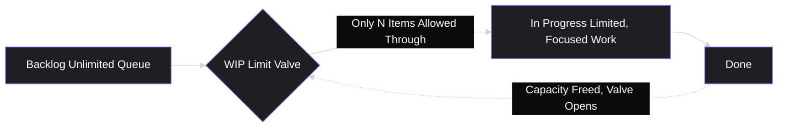

# Lesson 33: Kanban Framework

## Why This Lesson Matters

Lesson 32 gave you Scrum in full — a framework built around fixed-length Sprints, in which work is planned in batches and inspected at scheduled intervals. Scrum's cadence is one of its greatest strengths for teams whose work naturally comes in plannable chunks. But it is not the only serious answer to Lesson 31's underlying question — how do you structure execution so that feedback stays continuous rather than accumulating into late, expensive surprises? For teams whose work arrives unpredictably — support-driven engineering teams, infrastructure teams, teams handling a constant stream of inbound requests rather than a plannable backlog — forcing that work into two-week Sprint boxes can create friction rather than remove it.

This lesson introduces **Kanban**, the other dominant Agile implementation, built not around fixed iterations but around continuous flow. Where Scrum asks "what can we commit to for the next two weeks?", Kanban asks "how much work should be in progress at any given moment, and how do we keep it moving?" Understanding both frameworks — and, more importantly, understanding the underlying conditions that make one a better fit than the other — is what lets you make a genuinely reasoned recommendation to a team, rather than defaulting to whichever framework you personally learned first. This lesson also completes the two-lesson pair the Agile Fit Checklist from Lesson 31 was built to evaluate: you now have both a fixed-cadence and a flow-based implementation to test it against.

---

## Learning Path

| Field | Detail |
|---|---|
| **Module** | 4 — Execution & Agile Delivery |
| **Current Lesson** | 33 of 90 |
| **Difficulty** | 4 / 10 |
| **Estimated Study Time** | 35 minutes (reading) + 15 minutes (reflection + quiz) |
| **Prerequisites** | Lesson 31 (Agile Fundamentals — Iteration Loop, Agile Fit Checklist), Lesson 32 (Scrum Framework — roles, events, artifacts) |
| **Next Lesson** | Lesson 34 — Sprint Planning & Backlog Grooming |
| **Future Topics Unlocked** | Lesson 34 (Sprint Planning & Backlog Grooming), Lesson 39 (Technical Debt & PM Trade-offs, where flow-based prioritization becomes relevant), Lesson 43 (Funnel Analysis, which reuses this lesson's flow-bottleneck logic), Lesson 47 (Stakeholder Management) — all build on WIP limits and flow metrics introduced here |

---

## Learning Objectives

By the end of this lesson, you will be able to:

1. State Kanban's six core practices and explain the problem each one is designed to solve.
2. Explain what a Work-in-Progress (WIP) limit is, and why constraining the amount of work in progress can increase, rather than decrease, overall throughput.
3. Distinguish cycle time from lead time, and explain what each metric reveals that the other does not.
4. Apply the Agile Fit Checklist (Lesson 31) to compare Scrum and Kanban, and identify the specific conditions under which each framework is the better fit.
5. Diagnose a flow bottleneck using a cumulative flow diagram and a WIP-limit violation, and propose an appropriate response.

---

## Prerequisites

This lesson assumes fluency with **Lesson 31's** Iteration Loop and Agile Fit Checklist, since Kanban is evaluated here as a second concrete implementation of the same underlying values, not a new philosophy. It also assumes familiarity with **Lesson 32's** Scrum framework, because much of this lesson's value comes from direct contrast — Kanban is easiest to understand not in isolation but against the fixed-Sprint structure you already know, since the two frameworks make opposite bets about whether batching work into a fixed time-box helps or hinders flow.

---

## Theory

### The Origin: Flow, Not Batches

Kanban's modern software adaptation traces back to lean manufacturing principles, most famously the Toyota Production System, later adapted for knowledge work by David J. Anderson in the mid-2000s. Where Scrum's unit of commitment is the Sprint (a fixed time-box), Kanban's unit of attention is the **item of work moving through a value stream** — and its central bet is that limiting how much work is in progress at once, rather than how much time is allotted, is the more reliable lever for improving delivery speed and predictability.

### The Six Core Practices

| Practice | What It Solves |
|---|---|
| **1. Visualize the workflow** | Makes invisible knowledge work visible, typically as a board with columns representing stages (e.g., Backlog → In Progress → Review → Done) |
| **2. Limit Work in Progress (WIP)** | Prevents a team from starting more than it can finish, which is the single most common cause of slow, unpredictable delivery |
| **3. Manage flow** | Shifts attention from "are people busy" to "is work actually moving through the system smoothly" |
| **4. Make process policies explicit** | Ensures everyone shares the same definition of what it means for an item to move from one column to the next |
| **5. Implement feedback loops** | Establishes regular checkpoints (analogous to, but less rigidly scheduled than, Scrum's events) for reviewing flow and outcomes |
| **6. Improve collaboratively, evolve experimentally** | Treats the process itself as something to be iterated on using evidence, mirroring the Iteration Loop from Lesson 31 applied to the process rather than the product |

### Why Limiting WIP Increases Throughput

This is the single most counterintuitive idea in this lesson, and worth deriving carefully rather than simply asserting. Consider a team with five engineers and no WIP limit. Under pressure from many stakeholders, the team starts eight things simultaneously — every engineer context-switches between roughly 1.5 items on average. Context-switching carries a real, well-documented cost: every switch requires re-loading mental context, and that overhead is pure waste, contributing to none of the eight items' completion.

Now compare a team that limits WIP to, say, three items at a time. A fourth request must wait in a queue until one of the three in progress is finished. This feels, superficially, like it should be slower — after all, work is being deliberately delayed. But because the three in-progress items receive full, uninterrupted attention, they finish faster individually, and the team's overall completion rate (throughput) tends to rise, not fall, because the hidden cost of constant context-switching has been removed. This is Kanban's central, often initially resisted, claim: **starting less work finishes more work**.

### Flow Metrics: Cycle Time and Lead Time

Two related but distinct metrics are essential to Kanban's "manage flow" practice, and new PMs frequently conflate them:

- **Lead time**: the total time from when a request is *made* (entering the backlog) to when it's *delivered*. This is the metric a customer or stakeholder experiences directly — "how long did it take from when I asked to when I got it?"
- **Cycle time**: the time from when work *actually begins* on an item to when it's *delivered*. This is the metric that measures the team's execution efficiency specifically, stripped of however long the item sat waiting in the backlog before anyone started it.

A team can have a short cycle time (fast once started) but a long lead time (items sit in the backlog for weeks before anyone picks them up) — this is an extremely common pattern, and one that a team focused only on cycle time will completely miss, because it's invisible to anyone only watching work once it's "in progress." Diagnosing which of the two is the actual problem determines whether the fix is "work faster once started" (rarely the real issue) or "start things sooner" (frequently the real issue, and much more within a PM's direct influence, since it's often driven by prioritization decisions rather than engineering execution speed).

### The Cumulative Flow Diagram

A cumulative flow diagram (CFD) plots the number of items in each workflow stage over time, as stacked bands. A healthy CFD shows roughly parallel, steadily widening bands. A widening band for one specific stage — say, "Code Review" growing wider and wider while "In Progress" and "Done" stay flat — is a visual signature of a bottleneck: work is piling up at that stage faster than it's being cleared, exactly the kind of structural problem a WIP limit at that stage is designed to surface and force the team to confront directly, rather than allowing it to silently accumulate.

---

## Common Beginner Mistakes

**Mistake 1: Treating Kanban as "Scrum without the meetings."**

Kanban is not merely an unstructured, ceremony-free version of Scrum — it has its own explicit practices (the six above), its own discipline (WIP limits, explicit policies), and its own feedback mechanisms. A team that drops Scrum's events without adopting Kanban's actual practices in their place has adopted neither framework's discipline, only the appearance of informality.

**Mistake 2: Setting WIP limits too high to avoid the discomfort of a full queue**

A WIP limit only works if it's occasionally binding — if it never actually blocks anyone from starting new work, it isn't constraining behavior, it's decorative. New teams frequently set WIP limits generously enough that they're never hit, which defeats the entire mechanism described above.

**Mistake 3: Measuring "team busyness" instead of "flow."**

A team where every engineer is constantly occupied can still have terrible flow, if what they're occupied with is a large number of half-finished items rather than a small number of completed ones. Kanban's "manage flow" practice exists specifically to redirect attention away from individual utilization and toward whether work is actually completing and moving downstream.

**Mistake 4: Confusing cycle time improvements with lead time improvements**

As covered above, optimizing execution speed once work has started does nothing for items still waiting, unstarted, in a long backlog queue. A PM who reports "we improved cycle time by 20%" as evidence the team is now faster to deliver, without checking lead time, may be reporting a genuine but incomplete improvement — or masking a worsening backlog problem entirely.

**Mistake 5: Skipping explicit process policies**

Without an explicit, shared definition of what it means for an item to be ready to move from one column to the next (e.g., what "Ready for Review" actually requires), teams experience constant, low-grade disputes about whether something is really done with a stage — the Kanban equivalent of the Definition of Done ambiguity covered in Lesson 32.

---

## Mental Model: The Flow Valve

This lesson's core takeaway tool visualizes the WIP-limit mechanism as a valve controlling pressure through a pipe:

Use the Flow Valve as a diagnostic whenever a team reports feeling "busy but nothing's shipping." Ask: is the valve (WIP limit) actually constraining anything, or has it been set so loosely that everything passes through unimpeded, recreating the context-switching problem the valve exists to prevent? A team with no binding WIP limit is, functionally, a team with no valve at all — pressure (requests) flows straight through into an overloaded pipe (in-progress work), regardless of what the board visually implies.

---

## Real Company Example

**Microsoft** has been publicly associated with adopting Kanban-style practices in parts of its engineering organization, particularly within operations and infrastructure-adjacent teams handling continuous streams of incident response, maintenance, and support work — a pattern of work that fits Kanban's flow-based model more naturally than Scrum's fixed-Sprint planning, since incoming incidents cannot be scheduled two weeks in advance.

The underlying logic connects directly to this lesson's theory: work that arrives unpredictably, in variable sizes, with variable urgency, is poorly served by a framework that asks a team to commit to a fixed batch of it in advance. A flow-based model, with WIP limits and continuous prioritization rather than sprint-boundary planning, tends to be a better structural fit for this kind of work.

*(Assumption flagged: this reflects general, publicly reported patterns of Kanban-style adoption within parts of large technology organizations' operations and infrastructure teams, not a confirmed, complete, or current account of Microsoft's specific internal processes today. Practices vary significantly by team even within the same company; the durable lesson is the structural principle — flow-based frameworks tend to fit unpredictable, continuously arriving work better than fixed-Sprint frameworks — rather than a claim about any one company's current setup.)*

---

## Real World Perspective: Kanban Framework at Different Company Stages

**At a startup:**
Kanban is often adopted implicitly, even without the name — a simple "To Do / Doing / Done" board with a rough, informal sense that people shouldn't start too many things at once. Formal WIP limits and cumulative flow diagrams are less common at this stage; the team is small enough that flow problems are often visible through direct conversation rather than requiring a chart to surface them.

**At a mid-size company:**
Kanban is more frequently adopted formally for teams whose work doesn't fit neatly into sprints — support-adjacent engineering, platform teams, or teams serving many internal stakeholders with unpredictable requests. This is also where explicit WIP limits and cycle-time tracking tend to appear, because the team has grown past the point where flow problems are obvious from casual observation alone.

**At Big Tech:**
Kanban frequently coexists with Scrum across different teams within the same organization, chosen based on the nature of each team's work rather than a company-wide mandate. PMs at this scale are often expected to make — and defend — the specific choice of framework for their own team, using reasoning like the Agile Fit Checklist below, rather than defaulting to whichever framework is most common company-wide.

---

## Detailed Case Study: The Board That Looked Fine

Consider a simplified, illustrative scenario common on platform and infrastructure teams several months into adopting Kanban.

A six-person platform team adopts a Kanban board with columns: Backlog, In Progress, Code Review, QA, Done. They set a WIP limit of 4 for "In Progress" but never set one for "Code Review," reasoning that review "shouldn't take long anyway." Over several weeks, the team notices that items seem to sit for days after being marked "ready for review," even though engineers report being busy the entire time. The team's dashboard shows steady throughput of new items entering "In Progress," creating an impression of healthy activity.

**What went wrong?**

A cumulative flow diagram would have shown the actual problem immediately: the "Code Review" band was widening steadily while "In Progress" and "QA" stayed flat — a textbook bottleneck signature. Without a WIP limit on Code Review, engineers kept starting new work in "In Progress" (since nothing formally prevented them) rather than picking up items waiting in the review queue, because starting new work often feels more productive, in the moment, than reviewing someone else's. The result: a growing pile of nearly-finished work sitting invisible behind a healthy-looking "In Progress" column, exactly the "busy but nothing's shipping" pattern this lesson's Mental Model warns about.

The fix was not more engineers, more meetings, or faster reviewers — it was placing an explicit WIP limit on Code Review itself, which forced a genuine trade-off into the open: when Code Review is full, engineers must either help clear it or explicitly decide to leave capacity idle, rather than silently starting new work while a bottleneck grows unaddressed. This exact bottleneck-diagnosis logic — noticing where work piles up rather than where people look busy — reappears directly in **Lesson 43 (Funnel Analysis)**, applied to user behavior rather than engineering workflow, and in **Lesson 39 (Technical Debt & PM Trade-offs)**, where an under-resourced review or QA stage is a common source of accumulating technical debt.

---

## Framework Explanation: Scrum vs. Kanban Fit Assessment

A second, more tactical tool: use this table, built directly on the Agile Fit Checklist from Lesson 31, to reason about which framework better suits a specific team's actual working conditions.

| Condition | Favors Scrum | Favors Kanban |
|---|---|---|
| Predictability of incoming work | Work can be reasonably planned two-plus weeks ahead | Work arrives continuously and unpredictably (incidents, support requests) |
| Need for a fixed planning cadence | Stakeholders benefit from regular, scheduled commitments | Work is better served by continuous prioritization than fixed-interval planning |
| Team's tolerance for context-switching | Team can focus on a stable batch for the Sprint's duration | Team must remain responsive to shifting urgency within days or hours |
| Nature of "done" | Discrete features/increments with a clear finish line each cycle | Ongoing operational or maintenance work without a natural batch boundary |
| Primary flow metric of interest | Sprint velocity / burndown | Cycle time, lead time, WIP limit adherence |

Neither framework is inherently superior; the fit assessment above exists precisely to prevent the common mistake of choosing a framework based on familiarity or company-wide default rather than the actual shape of the team's work — a mistake this lesson's Interview Perspective section below addresses directly.

---

## Interview Perspective: How Interviewers Think About This

**Typical question 1: "When would you recommend Kanban over Scrum for a team?"**
*What the interviewer is actually evaluating:* Whether the candidate reasons from the nature of the team's actual work (predictability, batch-ability) rather than personal preference or company convention. A weak answer states a blanket preference; a strong answer references specific conditions, echoing the Scrum vs. Kanban Fit Assessment above.

**Typical question 2: "What's a WIP limit, and why would you ever want to deliberately slow down how much work starts?"**
*What the interviewer is actually evaluating:* Whether the candidate understands the counterintuitive throughput argument — that limiting concurrent work reduces costly context-switching and tends to increase overall completion rate, not decrease it.

**Typical question 3: "A team's board looks busy — lots of cards in progress — but stakeholders are complaining that nothing seems to actually ship. How would you investigate?"**
*What the interviewer is actually evaluating:* Whether the candidate reaches for flow-diagnostic tools (a cumulative flow diagram, cycle time vs. lead time, checking for an unlimited or absent WIP limit at a specific stage) rather than assuming the team simply needs to "work harder," mirroring this lesson's Case Study directly.

---

## Summary

Kanban is the second major concrete implementation of Lesson 31's underlying Agile values, built not around fixed-length Sprints but around continuous flow, governed by six core practices: visualizing the workflow, limiting work in progress, managing flow, making policies explicit, implementing feedback loops, and improving collaboratively. Its central, counterintuitive claim is that limiting how much work is in progress at once increases overall throughput, by removing the hidden cost of constant context-switching — a claim best understood through the Flow Valve mental model. Cycle time and lead time are the two flow metrics every PM must be able to distinguish: cycle time measures execution speed once work begins, while lead time measures the full customer-facing wait including time spent unstarted in the backlog, and conflating the two — as this lesson's Case Study illustrates with an unbounded Code Review stage — can hide a serious bottleneck behind a superficially healthy-looking board. Choosing between Scrum and Kanban is not a matter of which is more "modern" or more familiar, but a matter of fit: predictable, batchable work suits Scrum's fixed cadence, while continuous, unpredictable work suits Kanban's flow-based discipline — a judgment this lesson's Fit Assessment table exists to formalize.

---

## Key Takeaways

- Kanban is a flow-based Agile implementation built on six core practices, distinct from but philosophically consistent with Scrum's fixed-Sprint model from Lesson 32.
- Limiting Work in Progress (WIP) increases overall throughput by reducing the hidden cost of context-switching — starting less work finishes more work.
- Cycle time (execution speed once started) and lead time (total wait including time unstarted in the backlog) are distinct metrics that can move independently of each other.
- A cumulative flow diagram reveals bottlenecks by showing which workflow stage's band is widening faster than others, even when overall activity looks healthy.
- A WIP limit only functions if it's occasionally binding; a limit set high enough to never block anyone is decorative, not disciplinary.
- The choice between Scrum and Kanban should be driven by the predictability and batch-ability of the team's actual work, not by personal familiarity or company-wide default.
- "Busy" and "flowing" are not the same thing — a team can look fully occupied while a bottleneck silently accumulates behind a healthy-looking board.

---

## Cheat Sheet

*A two-minute review of everything in this lesson.*

- **Six practices:** visualize, limit WIP, manage flow, make policies explicit, implement feedback loops, improve collaboratively.
- **Core claim:** limiting WIP increases throughput by cutting context-switching costs.
- **Cycle time:** speed once work starts. **Lead time:** total wait from request to delivery.
- **Cumulative flow diagram:** a widening band = a bottleneck at that stage.
- **WIP limit test:** does it ever actually block someone, or is it purely decorative?
- **Scrum vs. Kanban:** predictable, batchable work → Scrum; continuous, unpredictable work → Kanban.
- **Busy ≠ flowing:** watch for bottlenecks hiding behind a superficially active-looking board.

---

## Glossary

| Term | Definition | Related Concepts | Difficulty |
|---|---|---|---|
| Kanban | A flow-based Agile framework built on visualizing workflow and limiting work in progress | Flow, WIP limit | 1 |
| Work in Progress (WIP) limit | A cap on how many items may occupy a given workflow stage at once | Flow Valve, Throughput | 2 |
| Throughput | The rate at which items are completed over a given period | WIP limit | 2 |
| Cycle time | The time from when work actually begins on an item to when it's delivered | Lead time | 2 |
| Lead time | The total time from when a request is made to when it's delivered, including time waiting unstarted | Cycle time | 2 |
| Cumulative Flow Diagram (CFD) | A chart plotting the number of items in each workflow stage over time, used to visually identify bottlenecks | Bottleneck | 3 |
| Bottleneck | A workflow stage where work accumulates faster than it is cleared | Cumulative Flow Diagram | 2 |

---

## Further Reading / Resources

- *Kanban: Successful Evolutionary Change for Your Technology Business* by David J. Anderson — the foundational text adapting Kanban to knowledge work and software teams.
- *The Principles of Product Development Flow* by Donald G. Reinertsen — a deeper treatment of the economics behind WIP limits, batch size, and flow-based thinking.
- *This Is Lean: Resolving the Efficiency Paradox* by Niklas Modig and Pär Åhlström — accessible grounding in the flow-efficiency-versus-resource-efficiency distinction underlying Kanban's throughput claim.

---

## Flashcards

**Card 1**
- Front: What are Kanban's six core practices?
- Back: Visualize the workflow, limit WIP, manage flow, make process policies explicit, implement feedback loops, improve collaboratively/evolve experimentally.
- Difficulty: 2
- Tags: practices

**Card 2**
- Front: Why does limiting WIP tend to increase throughput rather than decrease it?
- Back: Because starting fewer things at once reduces costly context-switching, letting in-progress items receive full attention and finish faster, raising the overall completion rate.
- Difficulty: 2
- Tags: wip, throughput

**Card 3**
- Front: What's the difference between cycle time and lead time?
- Back: Cycle time measures speed from when work begins to delivery; lead time measures the full wait from when a request is made (entering the backlog) to delivery, including unstarted time.
- Difficulty: 2
- Tags: metrics

**Card 4**
- Front: What does a widening band in a cumulative flow diagram indicate?
- Back: A bottleneck — work is accumulating in that stage faster than it's being cleared.
- Difficulty: 2
- Tags: cfd, bottleneck

**Card 5**
- Front: When is a WIP limit actually functioning as intended?
- Back: When it occasionally binds — i.e., it sometimes actually blocks new work from starting. A limit set so high it never blocks anyone is decorative.
- Difficulty: 2
- Tags: wip-limit

**Card 6**
- Front: What kind of work tends to favor Kanban over Scrum?
- Back: Continuous, unpredictable work that can't be reasonably planned two-plus weeks in advance, such as incident response or inbound support requests.
- Difficulty: 1
- Tags: fit-assessment

**Card 7**
- Front: In the Case Study, why did the platform team's board look healthy while a bottleneck grew?
- Back: Because there was no WIP limit on Code Review, so engineers kept starting new "In Progress" work rather than clearing the review queue, hiding the bottleneck behind steady, busy-looking "In Progress" activity.
- Difficulty: 3
- Tags: case-study, bottleneck

## Reflection Exercise

Consider the following novel scenario: You're the PM for a data infrastructure team that recently switched from Scrum to Kanban because their work — pipeline failures, ad hoc data requests from other teams, and planned improvements — didn't fit neatly into two-week Sprints. Three months in, cycle time for individual tickets has improved significantly. However, several internal stakeholders who submit data requests say they still "wait forever" to even hear back about when their request will be looked at.

There is no single correct answer to the prompts below — the goal is to practice distinguishing flow metrics and applying this lesson's frameworks, not to reach one "right" fix.

1. Based on the stakeholders' complaints, is this more likely a cycle time problem or a lead time problem? What evidence in the scenario points to your answer?
2. What would a cumulative flow diagram need to show for you to confirm where in the workflow requests are actually piling up before being started?
3. Is it possible for cycle time to genuinely improve while lead time gets worse at the same time? Explain how, using this lesson's definitions.
4. What role might an absent or overly generous WIP limit on the "Backlog" or "Not Yet Started" stage play in this pattern?
5. If your investigation confirms a lead time problem specifically, what kind of intervention (using this lesson's frameworks) would you propose, and why would improving cycle time further not solve it?

---

## Quiz

**1. What is Kanban's central, counterintuitive claim about work in progress?**
A) More work in progress always means faster delivery
B) Limiting work in progress tends to increase overall throughput by reducing context-switching costs
C) WIP limits should always be set as high as possible
D) Work in progress has no effect on delivery speed

*Correct answer: B*
*Explanation: The Theory section explicitly derives this claim: limiting WIP removes the hidden cost of context-switching, allowing in-progress items to finish faster and raising overall throughput.*
*Learning objective tested: #2*
*Difficulty: Easy*

---

**2. Which of the following is NOT one of Kanban's six core practices?**
A) Visualize the workflow
B) Limit Work in Progress
C) Hold a fixed two-week Sprint
D) Make process policies explicit

*Correct answer: C*
*Explanation: A fixed two-week Sprint is a Scrum concept (Lesson 32), not one of Kanban's six core practices listed in this lesson's Theory section.*
*Learning objective tested: #1*
*Difficulty: Easy*

---

**3. What does cycle time measure, as distinct from lead time?**
A) The total time from request to delivery, including time waiting unstarted
B) The time from when work actually begins on an item to when it's delivered
C) The number of items completed per week
D) The number of engineers assigned to a project

*Correct answer: B*
*Explanation: The Theory section defines cycle time specifically as the time from when work begins to delivery, distinct from lead time's inclusion of unstarted wait time.*
*Learning objective tested: #3*
*Difficulty: Easy*

---

**4. A team has a short cycle time but stakeholders report long waits before their requests are even started. What does this pattern indicate?**
A) The team's execution speed is the problem
B) The team likely has a lead time problem driven by how long items sit in the backlog before being picked up, not an execution speed problem
C) This pattern is impossible under Kanban
D) The WIP limit is set too low

*Correct answer: B*
*Explanation: The lesson explicitly describes this exact pattern — short cycle time but long lead time — as common and driven by backlog wait time rather than execution speed, often requiring a prioritization rather than an execution fix.*
*Learning objective tested: #3*
*Difficulty: Easy*

---

**5. What does a widening band for one specific stage in a cumulative flow diagram indicate?**
A) That stage is operating efficiently
B) A bottleneck — work is accumulating in that stage faster than it's being cleared
C) The team needs more Sprints
D) The WIP limit is set correctly

*Correct answer: B*
*Explanation: The Theory section explicitly defines a widening band relative to other stages as the visual signature of a bottleneck.*
*Learning objective tested: #5*
*Difficulty: Easy*

---

**6. Why is a WIP limit that never actually blocks anyone considered a problem?**
A) It isn't a problem; a WIP limit's purpose is purely cosmetic
B) A limit set high enough to never bind isn't actually constraining behavior — it's decorative rather than disciplinary
C) It means the team is working too slowly
D) It means the team should switch to Scrum

*Correct answer: B*
*Explanation: Common Beginner Mistake #2 explicitly states that a WIP limit only works if it's occasionally binding; one that's never hit defeats the entire mechanism.*
*Learning objective tested: #2*
*Difficulty: Easy*

---

**7. According to the Scrum vs. Kanban Fit Assessment, which condition favors Kanban over Scrum?**
A) Work can be reasonably planned two-plus weeks ahead
B) Stakeholders benefit from regular, scheduled commitments
C) Work arrives continuously and unpredictably, such as incidents or support requests
D) The team wants a fixed planning cadence

*Correct answer: C*
*Explanation: The Fit Assessment table explicitly lists unpredictable, continuously arriving work as a condition favoring Kanban.*
*Learning objective tested: #4*
*Difficulty: Medium*

---

**8. In the Detailed Case Study, what was the specific missing element that allowed the Code Review bottleneck to go unnoticed?**
A) A missing Daily Scrum
B) A missing WIP limit specifically on the Code Review stage, allowing engineers to keep starting new work instead of clearing the review queue
C) A missing Sprint Goal
D) Too few engineers on the team

*Correct answer: B*
*Explanation: The Case Study's "What went wrong?" section identifies the absence of a WIP limit on Code Review specifically as what allowed the bottleneck to accumulate invisibly.*
*Learning objective tested: #5*
*Difficulty: Medium*

---

**9. Why does the lesson caution against measuring "team busyness" as a proxy for healthy flow?**
A) Because busyness and flow are always identical
B) Because a team can be fully occupied working on many half-finished items while completion (flow) is actually poor, as shown in the Case Study
C) Because busy teams are always underperforming
D) Because Kanban discourages teams from working hard

*Correct answer: B*
*Explanation: Common Beginner Mistake #3 and the Case Study both illustrate that apparent busyness (many active cards) can mask poor actual flow (a bottleneck accumulating behind the scenes).*
*Learning objective tested: #2, #5*
*Difficulty: Medium*

---

**10. (Scenario) A PM reports "cycle time improved 20% this quarter" as evidence the team is now faster to deliver to stakeholders. What critical check is this claim missing, according to this lesson?**
A) Whether the team held enough retrospectives
B) Whether lead time also improved, since a cycle time improvement alone doesn't address how long items wait unstarted in the backlog
C) Whether the WIP limit was removed entirely
D) Whether the team switched from Kanban to Scrum

*Correct answer: B*
*Explanation: Common Beginner Mistake #4 explicitly warns that reporting cycle time improvements without checking lead time may be incomplete or may mask a worsening backlog wait problem.*
*Learning objective tested: #3*
*Difficulty: Medium-Hard*

---

**11. Which real-world type of team does this lesson suggest is naturally better suited to Kanban's flow-based model?**
A) A team building a single large planned feature release over one quarter
B) A team handling continuous, unpredictable incident response and support work
C) A team that only ships once per year
D) A team with no stakeholders at all

*Correct answer: B*
*Explanation: The Real Company Example and Fit Assessment both point to operations/infrastructure-style teams handling continuous, unpredictable work as the natural fit for Kanban.*
*Learning objective tested: #4*
*Difficulty: Medium*

---

**12. What is the relationship between Kanban's six practices and Lesson 31's Iteration Loop?**
A) They are unrelated concepts from different disciplines
B) Kanban's practices (especially "implement feedback loops" and "improve collaboratively") are a specific, flow-based implementation of the same feedback-driven logic behind the Iteration Loop
C) Kanban replaces the need for any feedback loop entirely
D) The Iteration Loop only applies to Scrum, not Kanban

*Correct answer: B*
*Explanation: The lesson frames Kanban throughout as philosophically consistent with Lesson 31's Iteration Loop, just implemented through continuous flow rather than fixed Sprints.*
*Learning objective tested: #1, #4*
*Difficulty: Medium-Hard*

---

**13. (Product Thinking) A team's cumulative flow diagram shows all bands widening in roughly parallel, steady bands over time. What does this indicate?**
A) A severe, hidden bottleneck
B) Healthy flow, with no single stage accumulating work disproportionately faster than others
C) That the team should immediately add more WIP limits
D) That the team is not using Kanban correctly

*Correct answer: B*
*Explanation: The Theory section explicitly describes roughly parallel, steadily widening bands as the visual signature of healthy flow, in contrast to one disproportionately widening band, which signals a bottleneck.*
*Learning objective tested: #5*
*Difficulty: Hard*

---

**14. (Interview Reasoning) An interviewer asks a candidate when they'd recommend Kanban over Scrum, and the candidate answers: "I always prefer Kanban, it's less bureaucratic." Based on this lesson's Interview Perspective section, what does this answer signal?**
A) Strong, well-reasoned framework judgment
B) A preference-based rather than conditions-based answer, since it doesn't reference the actual predictability or batch-ability of the team's work
C) That the candidate should have said Scrum instead
D) Nothing meaningful, since framework choice is arbitrary

*Correct answer: B*
*Explanation: The Interview Perspective section states that a weak answer expresses a blanket preference, while a strong answer references specific conditions like predictability and batch-ability, which this answer fails to do.*
*Learning objective tested: #4*
*Difficulty: Hard*

---

**15. (Product Thinking, Highest Difficulty) A platform team has adopted Kanban, but stakeholders complain about unpredictable delivery timing, and the team's cumulative flow diagram shows a steadily widening "QA" band while other stages stay flat. Using only this lesson's frameworks, what is the most defensible next step, and why?**
A) Switch the entire team back to Scrum immediately, since Kanban has clearly failed
B) Introduce or tighten a WIP limit specifically on the QA stage, since the widening band identifies QA as the accumulating bottleneck — and investigate why work isn't being pulled through QA fast enough, rather than assuming more incoming request throttling elsewhere would help
C) Ignore the diagram, since stakeholder complaints about timing are a lead time issue unrelated to workflow stages
D) Add more WIP limit slots to "In Progress" so more work can start simultaneously

*Correct answer: B*
*Explanation: This mirrors the Detailed Case Study's exact reasoning: a widening band at one specific stage identifies precisely where the bottleneck lives, and the appropriate response is to constrain and address that stage directly (via a WIP limit and investigation into why QA is under-clearing work), not to loosen limits elsewhere or abandon the framework entirely.*
*Learning objective tested: #2, #5*
*Difficulty: Hard*

---

## Connections

| | Lesson | Core Idea Carried Forward |
|---|---|---|
| **Previous Lesson** | Lesson 32 — Scrum Framework | Contrasts Kanban's flow-based model directly against Scrum's fixed-Sprint model, using the same underlying Agile values from Lesson 31 |
| **Current Lesson** | Lesson 33 — Kanban Framework | Six core practices; WIP limits and the throughput claim; cycle time vs. lead time; cumulative flow diagrams; Scrum vs. Kanban Fit Assessment |
| **Next Lesson** | Lesson 34 — Sprint Planning & Backlog Grooming | Returns to Scrum-specific mechanics, now informed by this lesson's flow-metric vocabulary (cycle time, lead time) for estimating and grooming backlog items |
| **Future Concepts Unlocked** | Lesson 39 (Technical Debt & PM Trade-offs) | Applies this lesson's bottleneck-diagnosis logic to under-resourced review/QA stages as a source of accumulating technical debt |
| | Lesson 43 (Funnel Analysis) | Reuses the bottleneck-identification logic from the cumulative flow diagram, applied to user behavior funnels instead of engineering workflow |
| | Lesson 47 (Stakeholder Management) | Extends this lesson's lead-time framing into managing stakeholder expectations about delivery timing |

This curriculum is designed to be read as one continuous argument, not ninety independent articles. Every lesson from here forward will assume you carry the WIP-limit throughput claim and the cycle time/lead time distinction with you — they will not be re-explained, only re-applied in new contexts.
