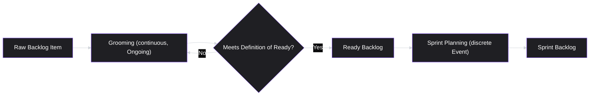
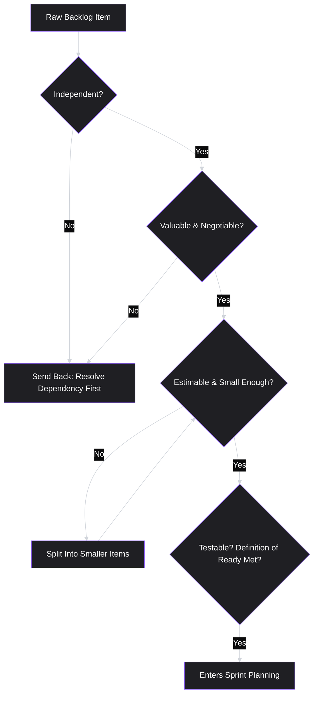

# Lesson 34: Sprint Planning & Backlog Grooming

## Why This Lesson Matters

Lessons 32 and 33 gave you the two dominant Agile frameworks at the level of their overall philosophy and structure — Scrum's roles, events, and artifacts, and Kanban's flow-based alternative. But knowing that "Sprint Planning" exists as an event, and knowing how to actually run one well, are very different levels of fluency. This lesson goes underneath the event itself, into the specific mechanics that separate a Sprint Planning meeting that produces a coherent, achievable Sprint Backlog from one that produces an overcommitted wish list nobody actually believes in.

This lesson also directly resolves two loose threads left open earlier in this module. Lesson 31's Detailed Case Study ended with a PM forcing a sprint plan through after learning it rested on a false assumption, specifically because there was no established process for handling mid-sprint changes gracefully — this lesson builds that process. And Lesson 32's Case Study identified an unclear Definition of Done as a recurring, unresolved retrospective complaint — this lesson gives you the specific tool (a Definition of Ready, paired with the Definition of Done) that prevents that ambiguity from reaching the sprint in the first place. Backlog grooming is where a PM's upstream prioritization work (Lesson 29) gets translated into units small and clear enough for engineering to actually commit to — and doing this translation poorly is one of the most common, and most avoidable, sources of execution dysfunction in product organizations.

---

## Learning Path

| Field | Detail |
|---|---|
| **Module** | 4 — Execution & Agile Delivery |
| **Current Lesson** | 34 of 90 |
| **Difficulty** | 5 / 10 |
| **Estimated Study Time** | 40 minutes (reading) + 15 minutes (reflection + quiz) |
| **Prerequisites** | Lesson 29 (Prioritization Basics), Lesson 32 (Scrum Framework — Sprint Backlog, Sprint Goal, Definition of Done), Lesson 33 (Kanban Framework — for contrast with continuous refinement) |
| **Next Lesson** | Lesson 35 — Roadmapping |
| **Future Topics Unlocked** | Lesson 35 (Roadmapping, which sits one altitude above Sprint Planning), Lesson 36 (Release Planning & Launch Management), Lesson 39 (Technical Debt & PM Trade-offs, which reuses story-splitting logic), Lesson 45 (A/B Testing & Experimentation, which depends on cleanly-scoped, testable increments) |

---

## Learning Objectives

By the end of this lesson, you will be able to:

1. Explain the difference between backlog grooming (an ongoing, continuous activity) and Sprint Planning (a discrete event), and why conflating the two produces rushed, poor-quality sprints.
2. Apply the INVEST criteria to evaluate whether a backlog item is well-formed enough to bring into Sprint Planning.
3. Define a Definition of Ready and explain how it complements, without duplicating, the Definition of Done from Lesson 32.
4. Explain capacity-based sprint planning using velocity, and identify the most common estimation pitfalls that lead to systematic overcommitment.
5. Design a mid-sprint change protocol that allows a team to respond to significant new evidence without either destabilizing the Sprint Goal or defaulting to rigid over-commitment, directly resolving the failure mode from Lesson 31's Case Study.

---

## Prerequisites

This lesson assumes **Lesson 29's** prioritization logic — you should already know how to rank a raw list of candidate ideas by value and cost. It also assumes **Lesson 32's** Scrum vocabulary in full: Sprint Backlog, Sprint Goal, and especially the Definition of Done, since this lesson introduces a companion concept (the Definition of Ready) that only makes sense in contrast to it. Finally, it assumes you remember **Lesson 33's** Kanban concepts of WIP limits and cycle time, because well-run backlog grooming is, in effect, a continuous-flow discipline (grooming happens constantly, not just at Sprint Planning) applied to a Scrum team's otherwise batch-oriented process.

---

## Theory

### Grooming Is Continuous; Planning Is a Single Event

The single most common structural mistake in this space is treating backlog grooming and Sprint Planning as the same activity, performed only once every Sprint. They are not. **Backlog grooming** (also called backlog refinement) is an ongoing activity — ideally happening in small doses throughout the Sprint, not concentrated into a single pre-planning session — where the PM and team progressively clarify, split, and estimate upcoming backlog items well before they're due to enter a Sprint. **Sprint Planning** is the discrete Scrum event (Lesson 32) where the team selects already-groomed items into the Sprint Backlog and forms a Sprint Goal.

When grooming is skipped and pushed entirely into the Sprint Planning meeting itself, the team is forced to clarify scope, split oversized items, and estimate effort all in the same session where it's also supposed to be forming a coherent Sprint Goal — a workload mismatch that reliably produces either a rushed, shallow planning session or one that runs for hours. Continuous grooming exists specifically to prevent this collision.

### The INVEST Criteria

A widely used mnemonic, commonly attributed to Bill Wake, for evaluating whether a backlog item (often written as a user story) is well-formed enough to enter Sprint Planning:

| Letter | Criterion | What It Checks |
|---|---|---|
| **I** | Independent | Can this item be built and delivered without being blocked on another unfinished item? |
| **N** | Negotiable | Is the item a statement of a problem/need, not an over-specified technical solution the team has no room to shape? |
| **V** | Valuable | Does the item clearly connect to a real user or business outcome, not just an internal technical task with no visible value? |
| **E** | Estimable | Does the team have enough information to give a reasonable size estimate? |
| **S** | Small | Is the item sized to be completed comfortably within a single Sprint, ideally a fraction of it? |
| **T** | Testable | Is there a clear, verifiable way to know when the item is actually done? |

An item failing "Estimable" or "Small" is the most common real-world grooming failure — a large, vague item ("improve onboarding") gets dragged into Sprint Planning, is nominally "estimated," and then blows through its estimate because no one actually broke it down into pieces small enough to reason about clearly.

### Definition of Ready, Paired With Definition of Done

Lesson 32 introduced the **Definition of Done**: a shared standard every Increment must meet before being considered complete. This lesson introduces its natural complement, the **Definition of Ready**: a shared standard a backlog item must meet before it is allowed to enter Sprint Planning at all. A typical Definition of Ready might require that an item has a clear acceptance criteria, has been estimated, has no unresolved external dependencies, and has been reviewed by both a PM and an engineer.

The pairing matters because each standard guards a different transition:

A team with a strong Definition of Done but no Definition of Ready will frequently pull poorly-specified, oversized items into a Sprint, then discover mid-Sprint that the item was never actually well-formed enough to build — precisely the ambiguity that produced the recurring, unresolved complaint in Lesson 32's Case Study. Establishing a genuine Definition of Ready is the direct fix for that dysfunction.

### Capacity-Based Planning and Velocity

Most Scrum teams plan a Sprint's capacity using **velocity** — a rolling average of how many story points (or equivalent estimation units) the team has completed in recent past Sprints. Rather than optimistically committing to however much backlog looks appealing, a disciplined team commits only up to its established velocity, adjusted for known factors like planned time off or a public holiday shortening the Sprint.

A simple, commonly used formula: **Sprint Capacity ≈ Historical Velocity × Focus Factor**, where the Focus Factor (often somewhere between 0.7 and 0.85 for many teams) accounts for the reality that not all of a team's nominal time converts into feature-delivery work — meetings, support interruptions, and unplanned work all consume real capacity that a naive full-time-hours estimate ignores.

The most common estimation pitfall is **planning fallacy**: systematically underestimating how long work will take, driven by focusing on the best-case scenario for a specific task while ignoring the base rate of how long similar tasks have taken historically. Anchoring Sprint commitments to actual historical velocity, rather than to each Sprint's fresh, optimistic estimate, is the primary structural defense against this bias.

---

## Common Beginner Mistakes

**Mistake 1: Grooming the entire backlog inside the Sprint Planning meeting itself**

As covered above, this collapses two workloads (clarifying/splitting/estimating, and forming a coherent Sprint Goal) into one meeting, reliably producing either a rushed session or one that runs far longer than intended.

**Mistake 2: Writing backlog items as technical solutions instead of problems or needs**

An item like "add a Redis cache layer to the search endpoint" violates INVEST's "Negotiable" criterion — it pre-supposes the solution and removes the team's ability to propose a better one. A better-formed version states the underlying need ("search response time is causing measurable user drop-off") and lets engineering propose the technical approach, including a cache layer if that's genuinely the best fix.

**Mistake 3: Committing to Sprint capacity based on optimism rather than historical velocity**

Teams new to Scrum frequently plan each Sprint as if it will be the team's best Sprint ever, ignoring their own established velocity trend. This produces chronic overcommitment, and — worse — chronic overcommitment quietly erodes a team's trust in the Sprint Goal itself, since it becomes an expectation everyone privately assumes won't be met.

**Mistake 4: Having a Definition of Done but no Definition of Ready**

As covered above, this allows poorly-specified items to enter a Sprint, where their ambiguity surfaces as a mid-Sprint surprise rather than being caught during grooming, when it's far cheaper to resolve.

**Mistake 5: Treating any mid-sprint change as either forbidden or trivial, with no middle-ground protocol**

This is the exact failure from Lesson 31's Case Study: a PM who treats the sprint plan as untouchable regardless of new evidence. The opposite failure also exists and is just as damaging — a team that re-plans the Sprint casually every time something new comes up, never actually protecting a period of focus. The fix, covered next, is a deliberate middle path.

---

## Mental Model: The Readiness Gate

This lesson's core takeaway tool visualizes backlog grooming as a gate that filters raw ideas down to Sprint-ready items, using INVEST and the Definition of Ready together as the gate's actual criteria rather than a rubber stamp:

Use the Readiness Gate as a standing discipline in every grooming session: an item that can't pass through it honestly is not ready, regardless of how much pressure exists to bring it into the next Sprint anyway. The gate's real value is forcing the "Split into smaller items" step to happen during grooming — a calm, unhurried setting — rather than being discovered mid-Sprint, under time pressure, as an unpleasant surprise.

---

## Real Company Example

**Atlassian** — the company behind Jira and Confluence, and consequently one of the most public voices on Agile process itself — publishes its own Definition of Ready guidance as core material in its Agile Coach content, explicitly framing DoR as a checklist a backlog item must clear (a clear description, defined acceptance criteria, a rough estimate, identified dependencies, a validated user problem) before it is eligible for sprint planning at all, and pairs it explicitly with the INVEST criteria this lesson covers as the standard for evaluating whether a story is genuinely well-formed.

The underlying principle connects directly to this lesson's Theory: a culture that insists on genuinely small, well-specified units of work — rather than large, vaguely-scoped initiatives — tends to produce far more predictable Sprint outcomes, because less ambiguity is smuggled into the Sprint undetected.

*(Source: Atlassian's own publicly published Agile Coach material. This is one of the more directly verifiable examples in this curriculum, since it comes from the company's own official documentation rather than secondhand reporting.)*

---

## Real World Perspective: Sprint Planning & Backlog Grooming at Different Company Stages

**At a startup:**
Grooming is often informal and conversational — a founder-PM and a handful of engineers might clarify scope in a quick Slack thread rather than a scheduled ceremony. INVEST and a Definition of Ready are still useful as a mental checklist even without formal documentation, and are frequently the difference between a small team shipping smoothly and one that constantly discovers mid-Sprint that "simple" items were actually far more complex than assumed.

**At a mid-size company:**
Grooming typically becomes a scheduled, recurring ceremony (often weekly, separate from Sprint Planning), with a written Definition of Ready the team holds itself to consistently. This is also the stage where velocity tracking becomes formalized enough to meaningfully anchor capacity planning, since enough Sprint history exists to establish a reliable trend.

**At Big Tech:**
Backlog grooming is often supported by dedicated tooling that tracks estimation accuracy, velocity trends, and story-splitting patterns across many teams, and story-writing/estimation practices are frequently standardized company-wide through internal playbooks. The PM's job shifts toward protecting genuine INVEST-quality grooming from becoming a box-ticking exercise at scale, and toward correctly interpreting velocity data (distinguishing a genuine capacity change from ordinary Sprint-to-Sprint variance) when it's presented across many parallel teams.

---

## Detailed Case Study: The Team That Learned to Change Its Mind Without Breaking Its Sprint

Recall Lesson 31's Case Study: a PM insisted a team "finish what we committed to" even after mid-sprint evidence revealed one committed item rested on a false assumption, reasoning that changing the plan would look like poor planning to leadership. The team shipped the flawed item anyway and had to redo roughly 40% of its work the following Sprint.

Consider now, as a direct continuation, how that same team addressed the underlying problem going forward. Rather than choosing between "never change the plan" and "constantly re-plan for every new input," the team adopted a specific, narrow **mid-sprint change protocol**, established during a retrospective: a change to the Sprint Backlog mid-Sprint is only made if (1) the new evidence directly threatens the validity of the Sprint Goal itself, not just a preference about a specific item, and (2) the change and its reasoning are communicated transparently to stakeholders the same day, rather than silently absorbed. Any other new information, however interesting, is captured in the backlog for the next grooming session rather than triggering an immediate re-plan.

**What changed, and why it worked:**

This protocol resolves the false dichotomy the original PM faced. It gives the team a clear, narrow, pre-agreed threshold for when a mid-Sprint change is warranted — protecting the Sprint Goal's stability against being disrupted by every minor new idea, while still allowing genuine, Sprint-Goal-threatening evidence to trigger a real change rather than being suppressed to protect appearances. Critically, the protocol also builds in transparent communication as a requirement, not an afterthought — directly addressing the original PM's underlying fear (that a changed plan would look like poor planning) by reframing a well-justified, well-communicated change as evidence of good judgment, not failure. This same communication skill — explaining a changed plan to stakeholders without it reading as failure — is developed in full in **Lesson 47 (Stakeholder Management)**, and the broader question of how much to specify upfront versus leave flexible is revisited at a longer time horizon in **Lesson 35 (Roadmapping)**.

---

## Framework Explanation: The Sprint Planning Readiness Checklist

A second, more tactical tool: use this checklist immediately before a Sprint Planning meeting begins, to confirm the backlog items on the table are actually ready to be planned against, rather than discovering gaps live in the meeting.

| Check | Question | If "No" |
|---|---|---|
| INVEST pass | Has every candidate item passed all six INVEST criteria? | Send back to grooming; do not bring into Sprint Planning |
| Definition of Ready | Has each item been explicitly confirmed against the team's written Definition of Ready? | Same as above |
| Estimate freshness | Were estimates given during grooming, in a calm setting, rather than being rushed through during Planning itself? | Re-estimate during a proper grooming pass first |
| Capacity anchor | Is the proposed Sprint Backlog sized against actual historical velocity, not optimistic best-case capacity? | Trim the Sprint Backlog to match established velocity |
| Sprint Goal clarity | Can every item in the proposed Sprint Backlog be explained in one sentence in terms of the emerging Sprint Goal? | Reconsider whether the item belongs in this Sprint at all |

A Sprint Planning meeting that fails several of these checks is not a planning problem — it's a symptom of insufficient upstream grooming, and no amount of skillful facilitation during the meeting itself can fully substitute for that missing work.

---

## Interview Perspective: How Interviewers Think About This

**Typical question 1: "How do you decide if a backlog item is ready for Sprint Planning?"**
*What the interviewer is actually evaluating:* Whether the candidate has a concrete, repeatable standard (INVEST, a Definition of Ready) rather than a purely intuitive, case-by-case judgment that would be hard to apply consistently across a team.

**Typical question 2: "Tell me about a time your team had to change a Sprint plan mid-way through. How did you handle it?"**
*What the interviewer is actually evaluating:* Whether the candidate has a principled threshold for mid-Sprint changes — distinguishing Sprint-Goal-threatening evidence from minor new information — and whether they communicated the change transparently, directly testing the reasoning developed in this lesson's Case Study.

**Typical question 3: "Your team consistently finishes only 60% of what it commits to each Sprint. What would you investigate?"**
*What the interviewer is actually evaluating:* Whether the candidate's first instinct is to blame engineering effort, or to correctly suspect upstream causes — poor grooming, missing Definition of Ready discipline, or capacity planning anchored to optimism rather than historical velocity, as covered throughout this lesson.

---

## Summary

Backlog grooming and Sprint Planning are distinct activities that are frequently, and mistakenly, collapsed into one — grooming is a continuous, ongoing discipline of clarifying, splitting, and estimating backlog items, while Sprint Planning is the discrete event where already-ready items are selected into a Sprint Backlog around a coherent Sprint Goal. The INVEST criteria (Independent, Negotiable, Valuable, Estimable, Small, Testable) give a concrete, repeatable standard for judging whether an item is well-formed, and a written Definition of Ready extends this standard into a team-wide gate, complementing the Definition of Done from Lesson 32 by guarding the opposite end of an item's lifecycle. Capacity-based planning, anchored to actual historical velocity rather than each Sprint's fresh optimism, is the primary structural defense against the planning fallacy that produces chronic overcommitment. Finally, this lesson resolves Lesson 31's open Case Study by showing a concrete mid-sprint change protocol — one that protects Sprint Goal stability against every minor new idea, while still allowing genuine, Sprint-Goal-threatening evidence to trigger a transparent, well-communicated change, rather than forcing a false choice between rigid over-commitment and constant re-planning.

---

## Key Takeaways

- Backlog grooming is continuous and ongoing; Sprint Planning is a discrete event that should only ever operate on already-groomed, ready items.
- INVEST (Independent, Negotiable, Valuable, Estimable, Small, Testable) gives a concrete, repeatable standard for judging whether a backlog item is well-formed enough to plan against.
- A Definition of Ready complements the Definition of Done (Lesson 32) by guarding entry into a Sprint, rather than completion out of it — teams with only one of the two standards remain exposed at the other end.
- Capacity-based planning anchored to historical velocity, adjusted with a realistic Focus Factor, is the main structural defense against the planning fallacy and chronic overcommitment.
- Writing backlog items as problems/needs rather than pre-specified technical solutions preserves engineering's ability to propose the best approach and satisfies INVEST's "Negotiable" criterion.
- A deliberate, narrow mid-sprint change protocol — reserved for evidence that threatens the Sprint Goal itself, always communicated transparently — resolves the false choice between rigid over-commitment and constant, destabilizing re-planning.
- A Sprint Planning meeting that struggles is very often a symptom of insufficient upstream grooming, not a facilitation failure inside the meeting itself.

---

## Cheat Sheet

*A two-minute review of everything in this lesson.*

- **Grooming ≠ Planning:** grooming is continuous; planning is a discrete event acting only on ready items.
- **INVEST:** Independent, Negotiable, Valuable, Estimable, Small, Testable.
- **Definition of Ready + Definition of Done:** guard entry into, and completion out of, a Sprint respectively.
- **Capacity formula:** Sprint Capacity ≈ Historical Velocity × Focus Factor (not optimistic best-case).
- **Write needs, not solutions:** preserves engineering's ability to propose the best technical approach.
- **Mid-sprint change protocol:** only for evidence that threatens the Sprint Goal itself; always communicated transparently, same day.
- **Struggling Sprint Planning meeting →** usually an upstream grooming problem, not a facilitation problem.

---

## Glossary

| Term | Definition | Related Concepts | Difficulty |
|---|---|---|---|
| Backlog grooming (refinement) | The continuous, ongoing activity of clarifying, splitting, and estimating backlog items before they enter Sprint Planning | Definition of Ready, INVEST | 1 |
| INVEST | A mnemonic (Independent, Negotiable, Valuable, Estimable, Small, Testable) for judging whether a backlog item is well-formed | Definition of Ready | 2 |
| Definition of Ready | A shared, explicit standard a backlog item must meet before entering Sprint Planning | Definition of Done (Lesson 32) | 2 |
| Velocity | A rolling average of story points (or equivalent units) a team completes per Sprint, used to anchor capacity planning | Focus Factor, Planning Fallacy | 1 |
| Focus Factor | An adjustment applied to nominal team capacity to account for meetings, interruptions, and unplanned work | Velocity | 2 |
| Planning fallacy | The systematic tendency to underestimate task duration by focusing on best-case scenarios rather than historical base rates | Velocity | 2 |
| Mid-sprint change protocol | A pre-agreed, narrow threshold for when a Sprint Backlog may be changed mid-Sprint, paired with a requirement for transparent communication | Sprint Goal (Lesson 32) | 2 |

---

## Further Reading / Resources

- *User Stories Applied: For Agile Software Development* by Mike Cohn — the standard reference for writing well-formed user stories and applying the INVEST criteria in practice.
- *Agile Estimating and Planning* by Mike Cohn — a detailed treatment of story points, velocity, and capacity-based Sprint planning.
- *Scrum: The Art of Doing Twice the Work in Half the Time* by Jeff Sutherland — revisited here specifically for its discussion of estimation and the planning fallacy in software teams.

---

## Flashcards

**Card 1**
- Front: What is the key difference between backlog grooming and Sprint Planning?
- Back: Grooming is a continuous, ongoing activity of clarifying/splitting/estimating items; Sprint Planning is a discrete event that selects already-groomed items into a Sprint Backlog around a Sprint Goal.
- Difficulty: 1
- Tags: grooming, sprint-planning

**Card 2**
- Front: What does each letter of INVEST stand for?
- Back: Independent, Negotiable, Valuable, Estimable, Small, Testable.
- Difficulty: 1
- Tags: invest

**Card 3**
- Front: How does a Definition of Ready relate to a Definition of Done?
- Back: A Definition of Ready guards entry into a Sprint (is this item well-formed enough to plan against?); a Definition of Done guards completion out of it (is this Increment actually finished?). They are complementary, guarding opposite ends of an item's lifecycle.
- Difficulty: 2
- Tags: definition-of-ready, definition-of-done

**Card 4**
- Front: What is the recommended formula for capacity-based Sprint planning?
- Back: Sprint Capacity ≈ Historical Velocity × Focus Factor, anchored to actual past performance rather than optimistic best-case estimates.
- Difficulty: 2
- Tags: velocity, capacity

**Card 5**
- Front: Why does writing a backlog item as a technical solution (rather than a problem/need) violate INVEST?
- Back: It violates the "Negotiable" criterion by pre-supposing the solution, removing the team's ability to propose a better technical approach.
- Difficulty: 2
- Tags: invest, negotiable

**Card 6**
- Front: What two conditions define this lesson's mid-sprint change protocol?
- Back: (1) The new evidence must directly threaten the validity of the Sprint Goal itself, not just a preference about one item; (2) the change and its reasoning must be communicated transparently to stakeholders the same day.
- Difficulty: 2
- Tags: mid-sprint-change, case-study

**Card 7**
- Front: If a Sprint Planning meeting consistently runs long and feels chaotic, what is the most likely root cause according to this lesson?
- Back: Insufficient upstream backlog grooming — items are arriving un-estimated, oversized, or unclear, forcing that work to happen live during Planning itself.
- Difficulty: 2
- Tags: diagnosis

## Reflection Exercise

Consider the following novel scenario: You're the PM for a Scrum team that has just finished a retrospective revealing that three of the last four Sprints ended with only about 65% of committed story points actually completed. The team's velocity has been calculated as a simple average of the last four Sprints, without adjustment. During grooming sessions, items are typically discussed for the first time only a day or two before Sprint Planning.

There is no single correct answer to the prompts below — the goal is to practice applying this lesson's diagnostic tools, not to reach one "right" fix.

1. Using the Sprint Planning Readiness Checklist, which specific checks does this team appear to be failing, based on the evidence given?
2. Is the team's velocity calculation itself likely to be a reliable anchor for future capacity planning, given the pattern described? Why or why not?
3. What specific INVEST criterion would you focus on first when you sit in on the next grooming session, and what would you look for as evidence that it's being met or missed?
4. If you introduce a written Definition of Ready, what is one requirement you'd include that would have prevented the most likely root cause of this pattern?
5. How would you explain this change to the team without it feeling like a criticism of their effort or work ethic — connecting back to this lesson's point that overcommitment is usually a grooming and estimation problem, not an effort problem?

---

## Quiz

**1. What is the core structural difference between backlog grooming and Sprint Planning?**
A) Grooming happens only for bugs, while Planning covers new features
B) Grooming is continuous; Planning acts only on already-ready items
C) Grooming is run by engineering, while Planning is run by the PM alone
D) Grooming replaces the need for a Sprint Goal entirely

*Correct answer: B*
*Explanation: Grooming continuously clarifies, splits, and estimates items, while Sprint Planning is the discrete event that selects already-ready items into a Sprint Backlog.*
*Learning objective tested: #1*
*Difficulty: Easy*

---

**2. Which of the following is NOT one of the six INVEST criteria?**
A) Small
B) Testable
C) Estimable
D) Scalable

*Correct answer: D*
*Explanation: INVEST stands for Independent, Negotiable, Valuable, Estimable, Small, and Testable. Scalability is a technical concern, not part of the mnemonic.*
*Learning objective tested: #2*
*Difficulty: Easy*

---

**3. A backlog item reads "add a Redis cache layer to the search endpoint." Which INVEST criterion does this most clearly violate?**
A) Negotiable, because it pre-specifies the technical solution
B) Testable, because no one can verify caching worked
C) Independent, because caching depends on another team
D) Small, because caching is too minor a change to plan

*Correct answer: A*
*Explanation: The item states a technical solution rather than the underlying need, removing the team's room to propose a different or better approach.*
*Learning objective tested: #2*
*Difficulty: Easy*

---

**4. What does a Definition of Ready require before an item can enter Sprint Planning?**
A) That the item has already been coded by an engineer in advance
B) That leadership has personally reviewed and approved the item
C) Clear criteria, an estimate, resolved dependencies, and joint review
D) That the item has previously appeared in at least one earlier Sprint

*Correct answer: C*
*Explanation: A typical Definition of Ready requires clear acceptance criteria, an estimate, resolved dependencies, and joint review before an item is eligible for Sprint Planning.*
*Learning objective tested: #3*
*Difficulty: Easy*

---

**5. How does a Definition of Ready relate to a Definition of Done?**
A) They are two names for the same checklist used at different points
B) A Definition of Done replaced the need for a Definition of Ready
C) A Definition of Ready is optional once a Definition of Done exists
D) Ready guards entry into a Sprint; Done guards completion out of it

*Correct answer: D*
*Explanation: The two standards guard opposite ends of an item's lifecycle — Ready governs what may enter a Sprint, and Done governs what may count as finished.*
*Learning objective tested: #3*
*Difficulty: Easy*

---

**6. What is velocity, as used in capacity-based Sprint planning?**
A) The number of stakeholders attending Sprint Planning each cycle
B) A rolling average of story points a team completed in recent Sprints
C) The total number of engineers currently assigned to a team
D) The speed at which a single ticket moves through a Kanban board

*Correct answer: B*
*Explanation: Velocity is a rolling average of completed story points across recent Sprints, used to anchor how much work a team commits to next.*
*Learning objective tested: #4*
*Difficulty: Easy*

---

**7. What is the recommended formula for capacity-based Sprint planning?**
A) Sprint Capacity equals the number of engineers times their hourly rate
B) Sprint Capacity equals every backlog item marked high priority
C) Sprint Capacity equals total calendar hours in the Sprint, unadjusted
D) Sprint Capacity equals Historical Velocity multiplied by a Focus Factor

*Correct answer: D*
*Explanation: This formula anchors commitments to actual past performance, adjusted by a Focus Factor that accounts for meetings and unplanned work.*
*Learning objective tested: #4*
*Difficulty: Medium*

---

**8. What does the planning fallacy describe?**
A) Underestimating duration by focusing on best-case scenarios
B) A team's tendency to overestimate every task it plans
C) A failure to assign a Scrum Master to a new team
D) Confusing a Sprint Backlog with a product roadmap

*Correct answer: A*
*Explanation: The planning fallacy is the systematic tendency to underestimate how long work will take by focusing on the best case rather than historical base rates.*
*Learning objective tested: #4*
*Difficulty: Medium*

---

**9. Why does a Focus Factor typically sit below 1.0 (often 0.7-0.85) in the capacity formula?**
A) Because velocity itself is always measured incorrectly
B) Because story points overstate the size of most items
C) Because meetings and unplanned work consume real time
D) Because it accounts for holidays but nothing else

*Correct answer: C*
*Explanation: Not all of a team's nominal time converts into delivery work; the Focus Factor discounts capacity for meetings, support interruptions, and unplanned work.*
*Learning objective tested: #4*
*Difficulty: Medium*

---

**10. What are the two conditions of this lesson's mid-sprint change protocol?**
A) A manager approves it, and it is logged in the retrospective notes
B) The Sprint Goal is threatened, and the change is announced same-day
C) The change is small, and no communication is required at all
D) The team votes unanimously, and the Scrum Master breaks any tie

*Correct answer: B*
*Explanation: A mid-sprint change is only warranted when new evidence threatens the Sprint Goal itself, and it must be communicated transparently to stakeholders that same day.*
*Learning objective tested: #5*
*Difficulty: Medium*

---

**11. In Lesson 31's original Case Study, what specific gap led the PM to force a flawed sprint plan through rather than adjusting it?**
A) The team lacked a defined Sprint Goal from the start
B) The team had switched frameworks mid-Sprint without warning
C) No mid-sprint change protocol existed to guide the decision
D) Engineering refused to discuss the false assumption at all

*Correct answer: C*
*Explanation: This lesson frames the original PM's mistake as the absence of any established process for handling mid-sprint changes, a gap this lesson's protocol directly resolves.*
*Learning objective tested: #5*
*Difficulty: Medium*

---

**12. According to this lesson's Real Company Example, how does Atlassian frame its Definition of Ready guidance?**
A) As a checklist an item must clear before entering Sprint Planning
B) As an optional suggestion most teams should skip for speed
C) As a rule that applies only to Kanban boards, not Scrum sprints
D) As a replacement for the INVEST criteria rather than a companion to it

*Correct answer: A*
*Explanation: Atlassian publishes its Definition of Ready as a checklist — description, acceptance criteria, estimate, dependencies, validated problem — paired explicitly with INVEST.*
*Learning objective tested: #3*
*Difficulty: Medium*

---

**13. Using the Sprint Planning Readiness Checklist, what does it mean if several items were estimated for the first time during the Sprint Planning meeting itself?**
A) The team's Sprint Goal was written incorrectly this cycle
B) The "Estimate freshness" check failed, showing insufficient grooming
C) This is expected behavior and requires no further action
D) The team's velocity calculation must be recalculated immediately

*Correct answer: B*
*Explanation: Estimates given live during Planning, rather than calmly during grooming, specifically flag a failed "Estimate freshness" check and point to insufficient upstream grooming.*
*Learning objective tested: #1, #4*
*Difficulty: Medium-Hard*

---

**14. (Interview Reasoning) A candidate says they decide if a backlog item is ready for Sprint Planning "purely by gut feel, based on experience." What is the weakness in this answer, based on this lesson's Interview Perspective section?**
A) It reveals the candidate has never worked on a Scrum team before
B) It correctly avoids the overhead of formal checklists like INVEST
C) It lacks a repeatable standard such as INVEST or a Definition of Ready
D) It shows strong technical depth but weak stakeholder communication

*Correct answer: C*
*Explanation: A strong answer offers a concrete, repeatable standard that others on the team could apply consistently, rather than a purely intuitive, case-by-case judgment.*
*Learning objective tested: #2, #3*
*Difficulty: Hard*

---

**15. (Product Thinking, Highest Difficulty) Mid-Sprint, a PM learns a competitor just launched a feature resembling one committed item, but that item's scope and design remain fundamentally sound. What should the PM do?**
A) Capture the news for next grooming, since the Sprint Goal isn't threatened
B) Halt the Sprint immediately and re-plan the entire backlog around the news
C) Ask engineering to work unpaid overtime to beat the competitor this Sprint
D) Quietly drop the item from the Sprint without telling any stakeholders

*Correct answer: A*
*Explanation: The mid-sprint change protocol only triggers when evidence threatens the Sprint Goal itself; notable but non-invalidating news belongs in the next grooming session instead.*
*Learning objective tested: #5*
*Difficulty: Hard*

---

## Connections

| | Lesson | Core Idea Carried Forward |
|---|---|---|
| **Previous Lesson** | Lesson 33 — Kanban Framework | Continuous grooming borrows Kanban's flow-based discipline and applies it to keeping a Scrum backlog perpetually ready |
| **Current Lesson** | Lesson 34 — Sprint Planning & Backlog Grooming | INVEST criteria; Definition of Ready; velocity-based capacity planning; planning fallacy; mid-sprint change protocol |
| **Next Lesson** | Lesson 35 — Roadmapping | Moves one altitude above Sprint Planning, addressing how multiple Sprints' worth of work is sequenced into a longer-horizon view |
| **Future Concepts Unlocked** | Lesson 36 (Release Planning & Launch Management) | Builds on Definition of Ready/Done discipline when coordinating multi-team releases |
| | Lesson 39 (Technical Debt & PM Trade-offs) | Reuses story-splitting and INVEST logic when deciding how to size and sequence technical debt work |
| | Lesson 45 (A/B Testing & Experimentation) | Depends on cleanly-scoped, testable increments — a direct product of good INVEST and Definition of Ready discipline |
| | Lesson 47 (Stakeholder Management) | Develops in full the transparent-communication skill this lesson's mid-sprint change protocol depends on |

This curriculum is designed to be read as one continuous argument, not ninety independent articles. Every lesson from here forward will assume you carry INVEST, the Definition of Ready, and velocity-based capacity planning with you — they will not be re-explained, only re-applied in new contexts.
