# Lesson 35: Roadmapping

## Why This Lesson Matters

Lesson 34 took you inside a single Sprint — how a backlog item gets groomed, estimated, and planned into a two-week (or similar) window. But a Sprint Backlog only ever shows a few weeks of a much longer story. Stakeholders, executives, sales teams, and customers routinely need a view further out than a single Sprint can offer — not because they need Sprint-level detail six months in advance, which this curriculum has already established (Lesson 31) is rarely knowable that precisely, but because they need a credible sense of *direction and sequence* that a single Sprint Backlog can't provide on its own.

This lesson addresses the tool built for exactly that gap: the **product roadmap**. It is also one of the most consistently mishandled artifacts in product management, because roadmaps sit at an uncomfortable intersection — they must satisfy a genuine organizational need for forward visibility, while resisting the temptation to promise a level of certainty about the future that Lesson 31's entire premise (short feedback loops beat long up-front plans) explicitly warns against. A roadmap built as a list of features with fixed dates routinely turns into a source of broken promises and eroded trust; a roadmap built well becomes one of a PM's most valuable tools for aligning an organization around outcomes rather than a list of commitments. This lesson teaches you to build the second kind.

---

## Learning Path

| Field | Detail |
|---|---|
| **Module** | 4 — Execution & Agile Delivery |
| **Current Lesson** | 35 of 90 |
| **Difficulty** | 5 / 10 |
| **Estimated Study Time** | 35 minutes (reading) + 15 minutes (reflection + quiz) |
| **Prerequisites** | Lesson 29 (Prioritization Basics), Lesson 31 (Agile Fundamentals — responding to change over following a plan), Lesson 34 (Sprint Planning & Backlog Grooming) |
| **Next Lesson** | Lesson 36 — Release Planning & Launch Management |
| **Future Topics Unlocked** | Lesson 36 (Release Planning & Launch Management), Lesson 47 (Stakeholder Management), Lesson 49 (Go-To-Market Strategy), Lesson 51 (Communicating with Executives) — all build directly on the roadmap communication patterns introduced here |

---

## Learning Objectives

By the end of this lesson, you will be able to:

1. Explain why a feature-and-fixed-date roadmap tends to create false certainty, and connect this failure mode to the Agile values introduced in Lesson 31.
2. Describe the Now-Next-Later roadmap format and explain why its structure deliberately varies in specificity across time horizons.
3. Distinguish an outcome-based roadmap from a feature-based roadmap, and explain the trade-offs of each.
4. Explain how a roadmap should relate to a Sprint Backlog and a Sprint Goal (Lesson 32, Lesson 34) without collapsing the distinction between the two altitudes.
5. Design a roadmap communication approach for a stakeholder audience that preserves honesty about uncertainty while still providing genuinely useful forward direction.

---

## Prerequisites

This lesson assumes **Lesson 29's** prioritization discipline, since a roadmap is, in large part, a prioritized backlog presented at a longer time horizon and coarser grain. It also directly assumes **Lesson 31's** core Agile value — "responding to change over following a plan" — because the central tension in this lesson (how to give forward visibility without over-promising) is a direct, practical instance of that value under real organizational pressure. Finally, it assumes **Lesson 34's** Sprint-level vocabulary (Sprint Backlog, Sprint Goal), since this lesson is explicitly about the altitude one level above that one.

---

## Theory

### The Core Failure Mode: The Date-Driven Feature Roadmap

The most common, and most damaging, roadmap format is a simple table or Gantt-style chart listing specific features against specific calendar dates, often stretching six to twelve months into the future. This format feels reassuring to stakeholders in the moment it's presented — it looks precise, confident, and easy to plan around. It is also, in most real product organizations, close to fiction the moment it's published, for exactly the reasons established in Lesson 31: requirements clarify, priorities shift, and unexpected discoveries reshape plans as teams actually build and learn. A roadmap presented as a set of fixed promises will, with near certainty, be broken in some particulars — and every broken date quietly erodes trust in the PM who published it, even when the underlying reasons for the change were entirely sound.

This is not an argument against forward planning — stakeholders have a legitimate need for direction, and refusing to provide any (Lesson 31's Mistake 5) is its own failure. It is an argument for choosing a roadmap *format* whose structure matches the actual level of certainty available at each time horizon, rather than a format that manufactures false precision uniformly across the whole timeline.

### The Now-Next-Later Format

A widely adopted alternative, popularized by Janna Bastow, organizes a roadmap into three horizons instead of fixed calendar dates:

The critical design principle is that **specificity and confidence are meant to decrease as the horizon extends**, and this is stated openly rather than hidden. "Now" items can be described with real feature-level detail, because they're already well-groomed (Lesson 34) and actively being built. "Later" items are deliberately described as problem areas or themes ("improving new-user onboarding," not "add a five-step interactive tutorial with X, Y, Z screens"), because committing to specific solutions that far out would misrepresent how much is actually known. This structure lets a PM be simultaneously honest and useful — precise where precision is earned, and appropriately vague where it isn't, rather than uniformly vague (unhelpful) or uniformly precise (dishonest).

### Outcome-Based vs. Feature-Based Roadmaps

A second, related distinction concerns *what a roadmap's rows represent*. A **feature-based roadmap** lists specific things to be built ("add SSO login," "redesign the search page"). An **outcome-based roadmap** lists problems to be solved or metrics to be moved ("reduce enterprise sales friction from authentication concerns," "improve search result relevance"), leaving the specific solution open, especially for items further out on the Now-Next-Later horizon.

| | Feature-Based Roadmap | Outcome-Based Roadmap |
|---|---|---|
| **Strength** | Concrete, easy for stakeholders to visualize | Preserves flexibility to change approach as evidence accumulates |
| **Risk** | Can lock in a specific solution before it's validated, and reads as a broken promise if that solution changes | Can feel vague or evasive to stakeholders unaccustomed to this format |
| **Best fit** | "Now" horizon items, already well-specified through grooming | "Next" and especially "Later" horizon items |

In practice, most healthy roadmaps blend the two: feature-specific in the "Now" column, progressively more outcome-oriented moving into "Next" and "Later" — which is precisely the Now-Next-Later structure's underlying logic applied to content, not just to labeled time buckets.

### How a Roadmap Relates to a Sprint Backlog

It's worth being explicit about the altitude difference here, since new PMs sometimes collapse these into one artifact. A roadmap operates at the level of quarters-to-a-year, expressed as outcomes or themes with decreasing specificity; a Sprint Backlog (Lesson 32, Lesson 34) operates at the level of a single Sprint, expressed as specific, groomed, INVEST-compliant items. The relationship between them should flow in one clear direction: a roadmap's "Now" items should be traceable down into the current Sprint's actual work, and a Sprint Goal (Lesson 32) should be explainable in terms of which roadmap theme it serves. A roadmap that has no visible connection to what a team is actually sprinting on has become disconnected fiction; a Sprint Backlog with no visible connection to any roadmap theme has lost sight of its longer-horizon purpose.

---

## Common Beginner Mistakes

**Mistake 1: Publishing a roadmap with fixed dates for items many months out**

As covered above, this manufactures false precision and reliably produces broken promises, since Lesson 31's entire premise is that far-future specifics are rarely knowable with confidence.

**Mistake 2: Treating "Later" items as promises rather than exploration themes**

A "Later" item should read as "we believe this is an important problem area," not "we will ship exactly this feature in exactly this quarter." Stakeholders who mistake the former for the latter will, reasonably, feel misled when the eventual solution differs from what they imagined.

**Mistake 3: Refusing to give any forward-looking view at all, out of excessive caution**

This is the mirror-image failure to Mistake 1, and was flagged already in Lesson 31 (Mistake 5): using "we can't know the future" as an excuse to withhold any useful directional information, which leaves stakeholders unable to plan around the PM's team at all.

**Mistake 4: Building a roadmap with no visible connection to current Sprint work**

As covered above, a roadmap that has drifted out of sync with what the team is actually building has stopped functioning as a real planning tool and become a disconnected communication artifact — often discovered only when a stakeholder asks "so is this roadmap item happening this quarter?" and no one on the team can answer confidently.

**Mistake 5: Using the same roadmap format and content for every audience**

An engineering-facing roadmap discussion can meaningfully include more technical specificity and dependency detail than a sales-facing or customer-facing one; a roadmap shared externally with customers typically needs to be far more conservative about "Later" specifics than one shared internally with engineering leadership. Using one undifferentiated roadmap for every audience risks either overwhelming some audiences with irrelevant detail or under-informing others who need more.

---

## Mental Model: The Confidence Gradient

This lesson's core takeaway tool visualizes the Now-Next-Later structure not as three discrete buckets, but as a continuous gradient of decreasing confidence and specificity, which is the more accurate mental picture and helps avoid Mistake 2 above:

```mermaid
%%{init: {
  "theme": "dark",
  "themeVariables": {
    "background": "#0b0b0c",
    "primaryColor": "#1f1f23",
    "primaryTextColor": "#ffffff",
    "primaryBorderColor": "#8b5cf6",
    "lineColor": "#d1d5db",
    "secondaryColor": "#18181b",
    "tertiaryColor": "#111111",
    "mainBkg": "#1f1f23",
    "nodeBorder": "#8b5cf6",
    "clusterBkg": "#000000",
    "clusterBorder": "#27272a",
    "titleColor": "#ffffff",
    "edgeLabelBackground": "#0b0b0c",
    "nodeTextColor": "#ffffff",
    "edgeLabelColor": "#ffffff",
    "actorBorder": "#8b5cf6",
    "actorBkg": "#1f1f23",
    "actorTextColor": "#ffffff",
    "sequenceNumberColor": "#ffffff",
    "signalColor": "#8b5cf6",
    "signalTextColor": "#ffffff",
    "textColor": "#ffffff",
    "classText": "#ffffff",
    "classBorder": "#8b5cf6",
    "classBkg": "#1f1f23"
  }
}}%%
graph LR
    A["High Confidence<br/>Specific Features (Now)"] -.->|decreasing certainty| B["Medium Confidence<br/>Directional Themes (Next)"] -.->|decreasing certainty| C["Low Confidence<br/>Problem Areas Only (Later)"]
```

Use the Confidence Gradient as a standing discipline whenever you're deciding how to describe a roadmap item: ask explicitly, "how much do I actually know about this, and does my description's specificity honestly reflect that?" An item described with feature-level detail should genuinely have feature-level certainty behind it; an item that's still mostly a hypothesis should be described as a theme or problem area, regardless of how satisfying a more specific-sounding description might feel to write or present.

---

## Real Company Example

**Notion** has been publicly associated with maintaining a public-facing roadmap that organizes upcoming work by theme and rough time horizon rather than as a list of specific features with committed ship dates, a format broadly consistent with the outcome-and-horizon-based approach described in this lesson.

The underlying principle connects directly to this lesson's Theory: a public roadmap, seen by customers, prospects, and the broader community, carries even higher reputational cost for broken specific promises than an internal one — making the discipline of matching specificity to actual confidence especially important in a customer-facing context.

*(Assumption flagged: this reflects a general, publicly observable pattern in how product roadmaps are commonly presented by software companies, based on publicly available roadmap pages, not a confirmed, complete, or current account of Notion's specific internal roadmapping process or philosophy today. Public roadmap formats and practices evolve over time at any company; the durable lesson is the underlying principle — matching a roadmap's specificity to genuine confidence, especially for external audiences — rather than a claim about Notion's exact current practice.)*

---

## Real World Perspective: Roadmapping at Different Company Stages

**At a startup:**
Roadmaps are often informal — a simple document or slide reviewed periodically with the founding team — and may skip external publication altogether. The risk here is usually Mistake 3: because the team is small and things change fast, a founder-PM may avoid committing to any roadmap at all, leaving even close internal stakeholders (like a sales co-founder trying to set customer expectations) without useful directional information.

**At a mid-size company:**
Roadmaps typically become a more formal, recurring artifact reviewed quarterly with leadership and shared, in some form, with sales, customer success, and sometimes customers directly. This is the stage where Mistake 5 (one-size-fits-all roadmap) most commonly appears, as the same document gets stretched to serve audiences with genuinely different needs.

**At Big Tech:**
Roadmaps often exist at multiple nested altitudes simultaneously — a company-wide roadmap, an organization-level roadmap, and team-level roadmaps, each needing to stay visibly connected to the ones above and below it. The PM's job shifts toward ensuring their team's roadmap items trace clearly up into larger organizational themes and down into actual Sprint work, since disconnection at either end (an isolated team roadmap with no larger context, or a leadership roadmap with no visible grounding in real team execution) becomes increasingly likely as the number of intermediate layers grows.

---

## Detailed Case Study: The Roadmap That Promised Too Much

Consider a simplified, illustrative scenario common at growing product organizations building their first formal roadmap.

A PM at a mid-size B2B software company builds a roadmap for the upcoming year at the request of the sales team, who want something concrete to show prospective enterprise customers during the sales cycle. Eager to be helpful, the PM lists twelve specific features, each with a target quarter, stretching a full year out — including several "Later"-horizon ideas that were, at the time, barely more than early hallway conversations about possible directions.

Sales enthusiastically uses this roadmap in customer conversations throughout the year, sometimes referencing specific quarter commitments directly in contract negotiations. By year's end, four of the twelve features shipped roughly on schedule, three shipped in a substantially different form than originally described (after user research revealed the original approach wouldn't solve the underlying problem), and five were deprioritized entirely in favor of higher-value work discovered along the way. Several enterprise customers, holding a printed copy of the original roadmap, raise pointed complaints during renewal conversations about "promises that were never kept."

**What went wrong?**

The PM's underlying prioritization judgment may have been entirely sound — deprioritizing five items in favor of better-validated opportunities is exactly the kind of adaptive, evidence-driven behavior Lesson 31 endorses. The failure was in the roadmap's *format*, not necessarily its content: presenting a full year of specific features at specific dates manufactured a level of certainty about "Later"-horizon items that never actually existed, and handed sales a document that functioned, in practice, as a set of contractual promises rather than a directional communication tool.

A Now-Next-Later format, applied honestly, would have prevented most of this damage. The four features that shipped roughly as planned were very likely genuine "Now" items with real confidence behind them, appropriate to describe specifically. The three that changed substantially and the five that were deprioritized were, in hindsight, "Later"-horizon ideas dressed up with false "Now"-level specificity — exactly the failure mode this lesson's Confidence Gradient is designed to prevent. The deeper organizational fix — training sales on how to use a Now-Next-Later roadmap responsibly in customer conversations, including what language is and isn't safe to use with prospects — is addressed directly in **Lesson 47 (Stakeholder Management)**, and the specific mechanics of coordinating a roadmap with an actual release calendar are covered in **Lesson 36 (Release Planning & Launch Management)**.

---

## Framework Explanation: The Roadmap Format Selector

A second, more tactical tool: use this table to decide which roadmap format and specificity level fits a given audience and time horizon.

| Audience / Horizon | Recommended Format | Specificity Level |
|---|---|---|
| Engineering, "Now" horizon | Feature-level, tied directly to current Sprint Backlog items | High — specific features, real estimates |
| Engineering, "Next"/"Later" horizon | Outcome/theme-based, with early technical considerations noted | Medium to low |
| Internal leadership, all horizons | Outcome-based with visible traceability to strategic goals | Medium, increasing toward "Now" |
| Sales / Customer Success, "Now" horizon | Feature-level, but explicitly labeled as "shipping soon" rather than a fixed date | High, but hedged |
| Sales / Customer Success, "Next"/"Later" horizon | Theme-based only, explicitly framed as directional, not committed | Low — themes only, no specific dates |
| External customers/public | Now-Next-Later, themes only beyond "Now," no fixed dates beyond the current quarter | Low to medium, conservative by design |

The general rule this table encodes: specificity should be earned by confidence, and confidence should be earned by proximity to actual, groomed (Lesson 34) work — never by audience pressure to sound more certain than the underlying reality supports.

---

## Interview Perspective: How Interviewers Think About This

**Typical question 1: "How do you build and communicate a product roadmap?"**
*What the interviewer is actually evaluating:* Whether the candidate defaults to a feature-and-fixed-date format (a common but risky default) or demonstrates awareness of formats like Now-Next-Later that match specificity to actual confidence.

**Typical question 2: "A sales leader is pressuring you to commit to a specific date for a feature that's still in early exploration. How do you respond?"**
*What the interviewer is actually evaluating:* Whether the candidate can hold a principled line on honest specificity under real organizational pressure, offering a useful alternative (a themed, hedged commitment) rather than either caving to false precision or unhelpfully refusing to engage at all.

**Typical question 3: "Tell me about a roadmap commitment that didn't work out. What happened, and what would you do differently?"**
*What the interviewer is actually evaluating:* Whether the candidate can distinguish a sound prioritization decision (deprioritizing something for good reasons) from a format failure (having presented uncertain information with false certainty in the first place) — precisely the distinction drawn in this lesson's Case Study.

---

## Summary

A product roadmap exists to give stakeholders a credible sense of direction and sequence beyond what a single Sprint Backlog can show, but the most common roadmap format — a list of specific features tied to fixed calendar dates, stretching many months out — manufactures a level of certainty about the future that directly contradicts Lesson 31's founding premise, reliably producing broken promises and eroded trust. The Now-Next-Later format resolves this by deliberately decreasing specificity and confidence as the time horizon extends — precise where precision is earned (the "Now" horizon, grounded in already-groomed Sprint work), thematic and outcome-oriented where it isn't (the "Later" horizon, still mostly hypothesis). This same logic extends to the choice between feature-based and outcome-based roadmap rows, and to tailoring format and specificity by audience, since a roadmap shared externally with customers carries a different, higher reputational cost for broken specifics than one shared internally with engineering. A roadmap's "Now" items should always be traceable down into actual current Sprint work, and a Sprint Goal should be explainable in terms of which roadmap theme it serves — a roadmap or Sprint Backlog that has lost this visible connection to the other has stopped functioning as a coherent planning system.

---

## Key Takeaways

- A roadmap listing specific features against fixed, far-future dates manufactures false certainty and reliably produces broken promises, directly contradicting Lesson 31's core Agile premise.
- The Now-Next-Later format deliberately decreases specificity and confidence as the time horizon extends, allowing a PM to be both honest and useful simultaneously.
- Outcome-based roadmap items (problems/metrics) preserve flexibility for "Next" and "Later" horizons; feature-based items are appropriate mainly for well-groomed "Now" horizon work.
- A roadmap's "Now" items should trace down into actual current Sprint work, and a Sprint Goal should trace up into a roadmap theme — disconnection at either end signals dysfunction.
- Refusing to provide any forward-looking roadmap view at all, out of excessive caution, is a real and damaging mistake, not a safe default.
- Roadmap format and specificity should be tailored by audience — external customer-facing roadmaps generally warrant more conservative specificity than internal engineering-facing ones.
- A sound prioritization decision (deprioritizing something for good reasons) is different from a format failure (having presented uncertain information with false certainty in the first place) — a broken roadmap promise is often the latter, not the former.

---

## Cheat Sheet

*A two-minute review of everything in this lesson.*

- **Core failure:** fixed dates + specific features, far out in time, manufacture false certainty.
- **Now-Next-Later:** specificity and confidence decrease as horizon extends — precise Now, thematic Later.
- **Feature-based vs. outcome-based:** features for "Now" (earned specificity); outcomes/themes for "Next"/"Later."
- **Roadmap ↔ Sprint link:** "Now" items trace into current Sprint work; Sprint Goals trace up into roadmap themes.
- **Don't over-correct:** refusing any forward view at all is its own failure (Lesson 31, Mistake 5).
- **Tailor by audience:** external/customer-facing = more conservative; internal engineering = can carry more detail.
- **Diagnose broken promises correctly:** was it a bad prioritization call, or a format failure presenting uncertainty as certainty?

---

## Glossary

| Term | Definition | Related Concepts | Difficulty |
|---|---|---|---|
| Product roadmap | A longer-horizon (quarters-to-a-year) artifact communicating direction and sequence beyond what a single Sprint Backlog shows | Now-Next-Later | 1 |
| Now-Next-Later | A roadmap format organizing work into three horizons with decreasing specificity and confidence | Confidence Gradient | 1 |
| Confidence Gradient | This lesson's mental model: a continuous decrease in specificity and confidence as roadmap time horizon extends | Now-Next-Later | 2 |
| Feature-based roadmap | A roadmap whose rows describe specific things to be built | Outcome-based roadmap | 1 |
| Outcome-based roadmap | A roadmap whose rows describe problems to be solved or metrics to be moved, leaving the specific solution open | Feature-based roadmap | 2 |
| Roadmap-Sprint traceability | The principle that a roadmap's "Now" items should connect visibly to current Sprint work, and vice versa | Sprint Goal (Lesson 32) | 2 |

---

## Further Reading / Resources

- *Product Roadmaps Relaunched* by C. Todd Lombardo, Bruce McCarthy, Evan Ryan, and Michael Connors — a detailed practitioner treatment of outcome-based roadmapping formats.
- "Now-Next-Later Roadmaps" by Janna Bastow (ProdPad) — the original articulation of the Now-Next-Later format referenced in this lesson.
- *Escaping the Build Trap* by Melissa Perri — situates roadmapping within the broader discipline of outcome-oriented product strategy.

---

## Flashcards

**Card 1**
- Front: What is the core failure mode of a feature-and-fixed-date roadmap?
- Back: It manufactures false certainty about far-future specifics, reliably producing broken promises since requirements and priorities inevitably shift.
- Difficulty: 1
- Tags: date-driven-roadmap

**Card 2**
- Front: What are the three horizons in a Now-Next-Later roadmap?
- Back: Now (high confidence, specific, active development), Next (medium confidence, directional), Later (low confidence, thematic/problem areas).
- Difficulty: 1
- Tags: now-next-later

**Card 3**
- Front: What's the difference between a feature-based and an outcome-based roadmap row?
- Back: A feature-based row describes a specific thing to build; an outcome-based row describes a problem to solve or metric to move, leaving the solution open.
- Difficulty: 2
- Tags: feature-based, outcome-based

**Card 4**
- Front: How should a roadmap's "Now" items relate to a team's current Sprint Backlog?
- Back: They should be directly traceable — "Now" roadmap items should be visible in what the team is actually sprinting on, and Sprint Goals should trace back up into a roadmap theme.
- Difficulty: 2
- Tags: traceability

**Card 5**
- Front: Why is refusing to give any forward-looking roadmap a mistake, not a safe choice?
- Back: It leaves stakeholders unable to plan around the team at all, repeating Lesson 31's Mistake 5 of using uncertainty as an excuse to withhold useful direction.
- Difficulty: 2
- Tags: mistake-5, forward-visibility

**Card 6**
- Front: In the Detailed Case Study, was the PM's prioritization judgment or the roadmap's format the primary failure?
- Back: The format — presenting a full year of specific features at specific dates manufactured false certainty, even though the underlying prioritization decisions (deprioritizing weaker ideas for better ones) were reasonable.
- Difficulty: 2
- Tags: case-study

## Reflection Exercise

Consider the following novel scenario: You're a PM at a company preparing its first-ever public roadmap page, to be linked from the marketing website. Your engineering lead wants to include ambitious, specific "Later"-horizon items to generate excitement about the product's future direction. Your head of sales wants specific dates attached to everything, to use in customer conversations. You know from experience that specifics that far out are rarely reliable.

There is no single correct answer to the prompts below — the goal is to practice applying the Confidence Gradient and Roadmap Format Selector, not to reach one "right" answer.

1. Using the Roadmap Format Selector, what specificity level would you recommend for the public-facing "Later" horizon, and why?
2. How would you respond to the engineering lead's request for ambitious, specific "Later" items, without simply refusing to include any exciting future direction at all?
3. How would you respond to the sales leader's request for specific dates, in a way that still gives sales something useful for customer conversations?
4. What language would you use on the public roadmap page itself to signal, honestly, which parts are commitments and which are directional themes?
5. Six months from now, a "Later" item you described as a theme turns into a very different feature than anyone imagined. How would the format you chose today help or hurt you in explaining that change publicly?

---

## Quiz

**1. What is the main risk of a roadmap that lists specific features against fixed calendar dates many months out?**
A) It manufactures certainty that rarely holds, producing broken promises
B) It costs noticeably more engineering time to draft than other formats
C) It cannot be paired with a Sprint Backlog under any circumstances
D) It is unreadable by non-technical stakeholders reviewing it

*Correct answer: A*
*Explanation: Far-future dates attached to specific features manufacture a false sense of certainty, and Lesson 31's premise is that such specifics rarely hold as priorities shift.*
*Learning objective tested: #1*
*Difficulty: Easy*

---

**2. In the Now-Next-Later format, how should specificity change as the time horizon extends?**
A) It should stay flat across all three horizons at all times
B) It should decrease, moving from specific "Now" work to thematic "Later" ideas
C) It should increase, since distant items need more detail to plan around
D) It should be randomized so stakeholders don't over-rely on any horizon

*Correct answer: B*
*Explanation: The format is built so specificity and confidence deliberately decrease as the horizon extends, from concrete "Now" work to thematic "Later" ideas.*
*Learning objective tested: #2*
*Difficulty: Easy*

---

**3. What best describes an outcome-based roadmap row, compared to a feature-based one?**
A) It lists a specific interface element scheduled for redesign
B) It is only ever appropriate for the "Now" horizon of a roadmap
C) It states a problem or metric to move, leaving the solution open
D) It always includes a committed ship date for stakeholders

*Correct answer: C*
*Explanation: An outcome-based row names a problem or metric rather than a specific build, preserving flexibility for horizons where the solution isn't yet validated.*
*Learning objective tested: #3*
*Difficulty: Easy*

---

**4. According to this lesson, what should a roadmap's "Now" items connect to?**
A) A rival company's most recently published roadmap
B) The organization's long-range five-year budget plan
C) Nothing in particular, since "Now" items stand on their own
D) The team's actual, currently groomed Sprint Backlog work

*Correct answer: D*
*Explanation: A roadmap's "Now" items should be traceable down into current Sprint work, and a Sprint Goal should trace back up into the roadmap theme it serves.*
*Learning objective tested: #4*
*Difficulty: Easy*

---

**5. Why does this lesson treat refusing to publish any forward-looking roadmap as a real mistake?**
A) It leaves stakeholders with nothing to plan around, echoing Lesson 31
B) Because every company is contractually required to maintain one
C) Because the Scrum Guide mandates a published roadmap document
D) Because engineering cannot begin grooming without one existing

*Correct answer: A*
*Explanation: Withholding all forward direction under the excuse of uncertainty leaves stakeholders unable to plan, repeating the mirror-image mistake already flagged in Lesson 31.*
*Learning objective tested: #1, #5*
*Difficulty: Easy*

---

**6. In the Detailed Case Study, what was the PM's primary mistake in building the year-long roadmap?**
A) Deprioritizing five items after discovering better-validated opportunities
B) Presenting early-stage ideas with fixed dates and feature-level detail
C) Using an outcome-based format for every single roadmap row
D) Declining to share any roadmap details with the sales team

*Correct answer: B*
*Explanation: The failure was in the format, not the prioritization judgment — early, uncertain ideas were dressed up with a specificity they hadn't earned.*
*Learning objective tested: #5*
*Difficulty: Easy*

---

**7. Using the Roadmap Format Selector, what specificity is recommended for external, customer-facing "Next"/"Later" items?**
A) High detail matching exactly what engineering sees internally
B) Specific dates, since customers need them for renewal planning
C) Themes only, framed as directional, with no fixed dates attached
D) No roadmap information should ever reach external audiences

*Correct answer: C*
*Explanation: External audiences at the Next/Later horizon should see low-specificity, theme-only content, framed as directional rather than committed.*
*Learning objective tested: #5*
*Difficulty: Medium*

---

**8. Why does this lesson recommend tailoring roadmap specificity by audience rather than using one format for everyone?**
A) Legal teams forbid sharing any roadmap with external parties
B) Engineering audiences should never see thematic roadmap content
C) Every audience should always receive the exact same document
D) Broken specific promises carry a higher reputational cost for some audiences

*Correct answer: D*
*Explanation: A broken specific promise made to an external customer typically carries a higher reputational cost than one made internally, justifying different specificity levels.*
*Learning objective tested: #5*
*Difficulty: Medium*

---

**9. A "Later" item is described externally as "a five-step onboarding wizard with screens A, B, and C, shipping in Q3." What does the Confidence Gradient say about this?**
A) It applies "Now"-level detail to a "Later" idea that hasn't earned it
B) It should include even more implementation detail to be useful
C) "Later" items should simply never be mentioned externally at all
D) It correctly matches "Later"-horizon confidence and specificity

*Correct answer: A*
*Explanation: A "Later" item that hasn't been validated should read as a theme, not a specific, dated feature; this description misrepresents how much is actually known.*
*Learning objective tested: #1, #2*
*Difficulty: Medium-Hard*

---

**10. A team's current Sprint Goal has no visible link to any theme on the published roadmap. What does this most likely signal?**
A) That the roadmap needs additional fixed calendar dates added
B) That the roadmap and the Sprint Backlog have drifted apart
C) Nothing unusual; roadmaps and Sprint Goals are meant to stay unrelated
D) That the team should switch immediately from Scrum to Kanban

*Correct answer: B*
*Explanation: A roadmap and Sprint Backlog with no visible connection to each other signals that one of the two artifacts has lost sight of its purpose.*
*Learning objective tested: #4*
*Difficulty: Medium*

---

**11. (Interview Reasoning) A sales leader pressures a PM for a firm ship date on a feature still in early exploration. What response best reflects this lesson's guidance?**
A) Commit to the requested date in order to preserve the relationship
B) Tell sales the feature has already been permanently cancelled
C) Offer a themed, hedged commitment that stays useful without false certainty
D) Refuse to discuss the feature with sales in any form whatsoever

*Correct answer: C*
*Explanation: A strong answer holds a principled line on honest specificity while still giving sales something genuinely useful, rather than caving or refusing to engage.*
*Learning objective tested: #5*
*Difficulty: Hard*

---

**12. Why does this lesson recommend blending feature-based and outcome-based rows within a single roadmap?**
A) Outcome-based rows are prohibited once a roadmap reaches "Now"
B) A roadmap must legally use only one row format throughout
C) Feature-based rows work only for teams that have abandoned Scrum
D) Feature rows suit earned "Now" specificity; outcome rows keep later options open

*Correct answer: D*
*Explanation: Blending formats mirrors the Confidence Gradient — concrete features where certainty is earned, open-ended outcomes where it isn't yet.*
*Learning objective tested: #2, #3*
*Difficulty: Medium-Hard*

---

**13. (Product Thinking) A customer holds a company to a specific date from a year-old roadmap that wasn't met after a validated pivot in approach. What is the most defensible diagnosis?**
A) The roadmap format gave an early idea false certainty; the pivot may be sound
B) The pivot itself was the error, regardless of the evidence behind it
C) The customer's complaint has no legitimate basis whatsoever
D) The original roadmap should have added still more technical detail

*Correct answer: A*
*Explanation: A well-reasoned, evidence-driven pivot is a different failure than a format that dressed an uncertain idea up as a fixed promise from the start.*
*Learning objective tested: #1, #5*
*Difficulty: Hard*

---

**14. Which practice best reflects the principle that specificity should be earned by confidence?**
A) Giving "Later" items full feature-level detail to build stakeholder excitement
B) Describing "Now" items concretely, since they're groomed, and "Later" items only as themes
C) Applying identical specificity to every horizon regardless of grooming status
D) Withholding all detail on "Now" items since the future is inherently uncertain

*Correct answer: B*
*Explanation: This directly reflects the Confidence Gradient: specificity should track how much is genuinely known, which peaks for already-groomed "Now" work.*
*Learning objective tested: #1, #2, #5*
*Difficulty: Medium-Hard*

---

**15. (Product Thinking, Highest Difficulty) A PM is asked to share one unmodified roadmap document with engineering, sales, and external customers at once. What is the likely risk, and the better approach?**
A) The safer fix is to give every audience firm dates with no thematic framing
B) The safer fix is to strip every horizon down to vague themes, even "Now"
C) One document risks over-sharing with customers or under-informing engineering
D) There is no real risk; a single shared document is always most efficient

*Correct answer: C*
*Explanation: Different audiences carry different reputational stakes for the same specificity; a single undifferentiated document risks failing several of them at once.*
*Learning objective tested: #5*
*Difficulty: Hard*

---

## Connections

| | Lesson | Core Idea Carried Forward |
|---|---|---|
| **Previous Lesson** | Lesson 34 — Sprint Planning & Backlog Grooming | Roadmapping operates one altitude above Sprint Planning, and depends on the same underlying discipline of matching specificity to actual confidence |
| **Current Lesson** | Lesson 35 — Roadmapping | Now-Next-Later format; Confidence Gradient; feature-based vs. outcome-based roadmaps; roadmap-Sprint traceability; Roadmap Format Selector |
| **Next Lesson** | Lesson 36 — Release Planning & Launch Management | Takes roadmap "Now" items and addresses how they're actually coordinated into a live release |
| **Future Concepts Unlocked** | Lesson 47 (Stakeholder Management) | Develops in full the skill of communicating roadmap changes and hedged commitments to stakeholders under pressure |
| | Lesson 49 (Go-To-Market Strategy) | Builds on roadmap-to-sales communication patterns raised in this lesson's Case Study |
| | Lesson 51 (Communicating with Executives) | Extends this lesson's audience-tailoring principle to executive-level roadmap communication specifically |

This curriculum is designed to be read as one continuous argument, not ninety independent articles. Every lesson from here forward will assume you carry the Now-Next-Later format and the Confidence Gradient with you — they will not be re-explained, only re-applied in new contexts.
