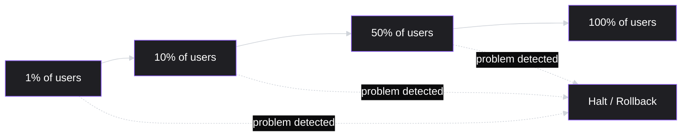
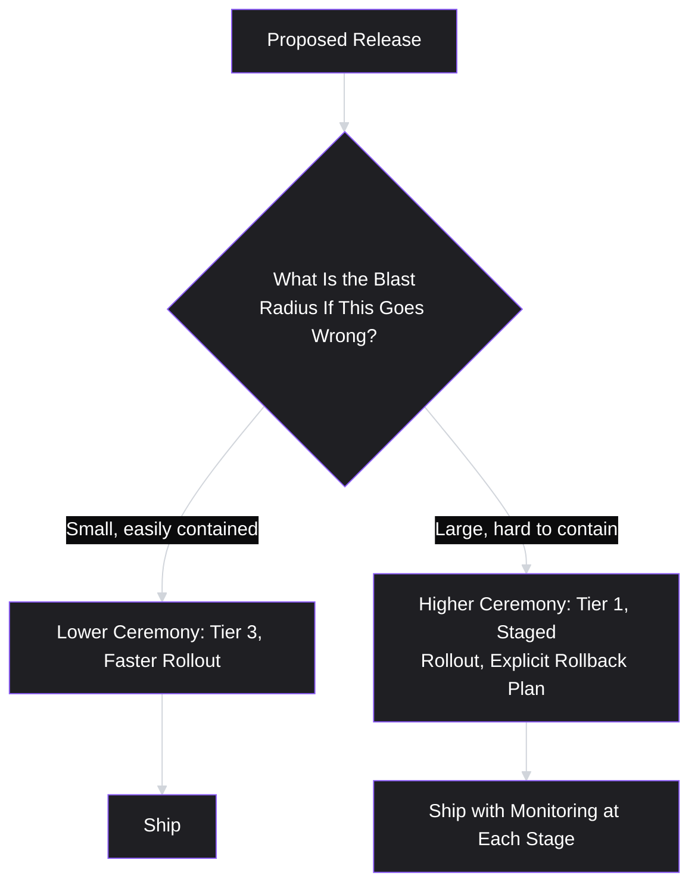

# Lesson 36: Release Planning & Launch Management

## Why This Lesson Matters

Lesson 35 addressed how a roadmap's "Now" horizon connects down into actual Sprint work. This lesson addresses the final, and often most consequential, step in that chain: what actually happens when a "Now" item, having been built and tested across one or more Sprints, is ready to reach real users. This step is where a huge amount of otherwise-careful product work can be undone in a single afternoon, because the discipline required to launch something well is genuinely different from the discipline required to build it well.

A large fraction of the most memorable, embarrassing product failures in software are not failures of the underlying feature at all — they are failures of the *release*: a change pushed to everyone at once instead of gradually, a rollback plan that didn't exist when it was needed, a support team blindsided by a launch nobody told them about, a features flag left in the wrong state. This lesson gives you the vocabulary and tools to avoid that category of failure entirely — treating a launch itself as something to be planned, staged, and monitored with the same rigor this curriculum has already applied to backlog grooming (Lesson 34) and roadmapping (Lesson 35).

---

## Learning Path

| Field | Detail |
|---|---|
| **Module** | 4 — Execution & Agile Delivery |
| **Current Lesson** | 36 of 90 |
| **Difficulty** | 5 / 10 |
| **Estimated Study Time** | 35 minutes (reading) + 15 minutes (reflection + quiz) |
| **Prerequisites** | Lesson 32 (Scrum Framework — Increment, Definition of Done), Lesson 34 (Sprint Planning & Backlog Grooming), Lesson 35 (Roadmapping — "Now" horizon items) |
| **Next Lesson** | Lesson 37 — Working with Engineering Teams |
| **Future Topics Unlocked** | Lesson 37 (Working with Engineering Teams), Lesson 39 (Technical Debt & PM Trade-offs), Lesson 45 (A/B Testing & Experimentation, which reuses staged-rollout logic), Lesson 49 (Go-To-Market Strategy) — all build on the launch tiers and staged-rollout mechanics introduced here |

---

## Learning Objectives

By the end of this lesson, you will be able to:

1. Distinguish a "big-bang" release from a staged (progressive) rollout, and explain the risk trade-offs of each.
2. Explain feature flags and canary releases as tools for controlling exposure, and connect them to this lesson's Blast Radius mental model.
3. Apply a launch tiering system to determine how much cross-functional coordination a given release actually warrants.
4. Design a rollback plan and explain why "we'll fix it in the next release" is not an acceptable substitute for one.
5. Identify the cross-functional stakeholders a launch checklist must include beyond engineering, and explain the risk of omitting any one of them.

---

## Prerequisites

This lesson assumes **Lesson 32's** concept of an Increment meeting a Definition of Done, since release planning begins only once work is genuinely complete by that standard — releasing something that hasn't met its Definition of Done is a distinct and more basic failure this lesson does not re-cover. It also assumes **Lesson 35's** roadmap vocabulary, particularly the "Now" horizon, since this lesson picks up exactly where a "Now" item's development work ends and its actual path to users begins.

---

## Theory

### Big-Bang vs. Staged Rollout

A **big-bang release** ships a change to all users simultaneously, at a single point in time. A **staged (or progressive) rollout** ships the same change to a small fraction of users first, then progressively larger fractions, pausing to observe real-world behavior at each stage before continuing.

The core trade-off is speed versus exposure. A big-bang release reaches full impact — both the intended benefit and any unintended harm — immediately. A staged rollout reaches full impact more slowly, but any problem is discovered while it's still affecting a small fraction of users, dramatically limiting the damage a bad release can do before it's caught. For most releases carrying meaningful risk (new core functionality, changes to critical infrastructure, anything touching billing or authentication), a staged rollout is the safer default; a big-bang release is more defensible for low-risk, easily reversible, or time-sensitive changes where the cost of a slower rollout genuinely outweighs the benefit of limited exposure.

### Feature Flags and Canary Releases

A **feature flag** is a configuration switch that allows a team to turn a feature on or off (or adjust its exposure percentage) without deploying new code — the feature ships to production in a "dark" or hidden state, and its visibility is controlled independently afterward. This decouples two things that a big-bang release conflates: *deploying* code and *releasing* a feature to users. A team can deploy code continuously, with new functionality sitting behind a flag, and release it to users on a completely separate, controlled schedule.

A **canary release** (named after the historical practice of using canaries to detect dangerous gas in mines) is the specific practice of releasing a change to a small, often randomly selected, subset of infrastructure or users first, explicitly as an early-warning mechanism — if the canary group shows a problem, the release halts before reaching everyone else. Canary releases and feature flags are complementary: a feature flag controls *who sees a feature*, while a canary release strategy controls *how the underlying infrastructure change is validated* before wider exposure — both serve this lesson's broader principle of controlling exposure deliberately, rather than accepting whatever exposure a single, undifferentiated deployment happens to produce.

### Launch Tiers

Not every release warrants the same level of ceremony. A small copy change and a new core billing flow do not carry comparable risk, and treating them identically either wastes coordination effort on trivial changes or, more dangerously, under-prepares for consequential ones. A **launch tiering system** classifies releases by potential impact and assigns a proportional level of required coordination:

| Tier | Example | Required Coordination |
|---|---|---|
| **Tier 1** (highest impact) | New core product surface, major pricing change, anything touching authentication or billing broadly | Full cross-functional launch review, staged rollout mandatory, rollback plan required, dedicated post-launch monitoring window |
| **Tier 2** (moderate impact) | A significant new feature within an existing surface, a notable UI redesign | Staged rollout recommended, relevant stakeholders (support, docs) notified in advance, lighter-weight rollback plan |
| **Tier 3** (low impact) | Minor UI tweaks, copy changes, small bug fixes | Standard engineering release process; no special cross-functional coordination required |

The specific tier boundaries vary by organization, but the underlying principle — proportional ceremony matched to actual risk — is a direct extension of Lesson 34's Confidence-and-Effort-matching logic applied to launches instead of estimation.

---

## Common Beginner Mistakes

**Mistake 1: Treating every release as either maximally ceremonial or minimally so, with no tiering in between**

As covered above, applying Tier 1 rigor to a minor copy change wastes organizational effort and creates launch-process fatigue; applying Tier 3 casualness to a major billing change is how large-scale incidents happen.

**Mistake 2: Conflating "code is deployed" with "feature is released."**

Without a feature flag decoupling these two events, a team loses the ability to control exposure independently of deployment timing — meaning any deployment-time issue (a bad deploy window, unexpected interaction with other in-flight changes) directly and immediately affects every user, rather than being contained to a small, controlled group.

**Mistake 3: Believing "we'll fix it in the next release" is an acceptable rollback plan**

For anything beyond the lowest-risk Tier 3 changes, this is not a rollback plan — it's an acknowledgment that no rollback plan exists. A genuine rollback plan specifies, in advance, exactly how to revert the change quickly (flag flip, feature toggle, code revert, database migration reversal) without waiting for a full new release cycle, since a live, actively-harming issue often cannot wait days for a properly tested fix.

**Mistake 4: Launching without informing support, sales, or customer-facing teams in advance**

A support team blindsided by a change they didn't know was launching will be unable to answer user questions, may misdiagnose the change as a bug, and will lose confidence in the product organization's coordination — entirely avoidable simply by including these teams in the launch checklist from the start.

**Mistake 5: Treating a staged rollout's early stages as a formality rather than genuinely watching for signal**

A staged rollout only provides protection if its early stages are actually monitored closely enough to catch a problem before proceeding — a team that mechanically advances from 1% to 10% to 100% on a fixed schedule, without genuinely reviewing metrics at each stage, has adopted the form of a staged rollout without its actual protective function.

---

## Mental Model: The Blast Radius

This lesson's core takeaway tool frames every release decision around a single guiding question: *if this goes wrong, how many people does it affect, and how quickly can that be contained?*

Use the Blast Radius as your default first question for any release, before deciding on tier, rollout strategy, or rollback plan — the answer to "how big is the blast radius, and how containable is it" should drive every other decision in this lesson, rather than defaulting to habit or to whatever ceremony level the last release happened to use.

---

## Real Company Example

**Slack** has been publicly associated, through its own engineering blog writing, with using feature-flag-based, incremental rollout practices for shipping changes to its messaging infrastructure — releasing changes to a small percentage of workspaces first and progressively expanding exposure, specifically because Slack's core product sits in the critical path of many customers' daily work, making the cost of a widely-exposed bad release especially high.

The underlying principle connects directly to this lesson's Theory: for a product where an outage or bug has an unusually high blast radius (affecting real-time, business-critical communication for many organizations simultaneously), the discipline of staged rollout and careful exposure control becomes proportionally more important, not less.

*(Assumption flagged: this reflects general, publicly available descriptions of feature-flagging and incremental deployment practices discussed in Slack's own engineering blog writing over time, not a confirmed, complete, or current account of Slack's specific internal release process today. Specific tooling and processes evolve continuously at any company; the durable lesson is the underlying principle — high blast-radius products warrant proportionally more careful exposure control — rather than a claim about Slack's exact current practice.)*

---

## Real World Perspective: Release Planning & Launch Management at Different Company Stages

**At a startup:**
Release processes are often minimal — a small team may deploy directly to all users, several times a day, without formal staging, largely because the total user base is small enough that the blast radius of most changes is genuinely limited, and the team can respond to a problem within minutes of it being reported. The risk here is assuming this remains true as the user base and the product's criticality to customers grow, without deliberately revisiting the process.

**At a mid-size company:**
Feature flags and at least lightweight staged rollouts typically become standard practice for anything beyond trivial changes, and a basic launch tiering system usually emerges, often informally at first. This is the stage where Mistake 4 (launching without informing support/sales) most commonly causes real damage, since the organization has grown large enough that engineering and customer-facing teams no longer sit in the same room and overhear each other's plans.

**At Big Tech:**
Launch tiering, staged rollout, and rollback processes are typically deeply formalized, often enforced through required sign-offs and automated canary analysis tools that halt a rollout automatically if key metrics regress. The PM's job shifts toward correctly classifying a release's actual tier (resisting both the temptation to under-classify a risky release to move faster, and the bureaucratic drag of over-classifying a genuinely low-risk one) and toward ensuring cross-functional stakeholders are looped in appropriately for the tier assigned.

---

## Detailed Case Study: The Launch That Went Out to Everyone at Once

Consider a simplified, illustrative scenario common at growing product organizations experiencing their first serious launch failure.

A team at a mid-size SaaS company ships a significant redesign of its core reporting dashboard, a feature used daily by nearly all paying customers. Confident in weeks of internal QA and a successful staging-environment test, the team deploys the redesign to all users simultaneously on a Friday afternoon, without a feature flag, without informing the support team in advance, and without a specific rollback plan beyond "we can revert the deploy if needed."

Within two hours, a data-formatting bug — invisible in the staging environment's smaller test dataset, but which manifests only for customers with unusually large report volumes — causes reports to display incorrect figures for roughly 15% of enterprise customers, the company's highest-value segment. Customers begin contacting support, whose team has no idea a redesign shipped at all and initially tells confused customers that "reports have always looked this way," escalating customer frustration. By the time engineering identifies the root cause and executes a code revert, nearly five hours have passed — most of it not spent diagnosing the bug itself, which took under thirty minutes, but spent locating who had deployment access on a Friday evening and confirming it was safe to revert.

**What went wrong?**

Using the Blast Radius mental model: this was, by any reasonable classification, a Tier 1 release — a core, daily-use surface, touching the company's highest-value customer segment, with functional correctness (not just cosmetic appearance) at stake. It was treated, in practice, as though it were Tier 3. Three separate, compounding failures are visible: no staged rollout meant the data-formatting bug, which affected a specific data-volume profile invisible in smaller staging tests, hit all affected customers simultaneously rather than being caught in a small canary group first. No feature flag meant there was no fast, code-independent way to hide the redesign the moment the bug was discovered. And no advance communication to support meant the team best positioned to notice and triage the problem quickly was instead actively making it worse by confidently telling customers nothing had changed.

Each of these three failures maps to a specific tool this lesson introduces: a staged rollout would very likely have surfaced the data-volume-dependent bug in a small canary group of large customers before it reached the entire high-value segment; a feature flag would have allowed an instant, code-independent rollback in minutes rather than hours; and a basic launch checklist including support would have prevented the confused, damage-amplifying customer interactions. The deeper organizational lesson — how to actually work with engineering to build these safeguards into a team's default release process, rather than relying on individual PM vigilance every single time — is covered directly in **Lesson 37 (Working with Engineering Teams)**, and the specific question of how much rollback and monitoring infrastructure is worth investing in versus treated as acceptable technical debt is addressed in **Lesson 39 (Technical Debt & PM Trade-offs)**.

---

## Framework Explanation: The Launch Readiness Checklist

A second, more tactical tool: before any Tier 1 or Tier 2 release, confirm each of the following has an explicit, named answer — not merely an assumption that it's "probably fine."

| Stakeholder / Area | Question That Must Have an Explicit Answer |
|---|---|
| Engineering | Is the change behind a feature flag, and has a canary/staged rollout plan been agreed? |
| Rollback | Is there a specific, fast, tested way to revert this change, independent of a full new release cycle? |
| Support / Customer Success | Have they been briefed on what's changing, when, and what to tell customers who ask? |
| Sales / Customer-facing teams | Do they know this is launching, especially if it affects anything visible in demos or active sales conversations? |
| Monitoring | What specific metrics will be watched during and after rollout, and who is watching them, on what schedule? |
| Legal / Compliance (where relevant) | Has anything requiring review (data handling changes, pricing changes, terms-of-service implications) been signed off? |

A release proceeding to Tier 1 or Tier 2 status with any of these left unanswered is, in effect, the same underlying failure as this lesson's Case Study — a gap that feels acceptable in the moment and becomes very expensive the moment something actually goes wrong.

---

## Interview Perspective: How Interviewers Think About This

**Typical question 1: "How do you decide how much ceremony a given release needs?"**
*What the interviewer is actually evaluating:* Whether the candidate has a principled classification system (a launch tiering approach tied to blast radius) rather than either treating every release identically or deciding case-by-case with no consistent logic.

**Typical question 2: "Tell me about a launch that didn't go as planned. What happened, and what would you do differently?"**
*What the interviewer is actually evaluating:* Whether the candidate can name the specific missing safeguard (staged rollout, feature flag, rollback plan, stakeholder communication) rather than describing the failure only vaguely as "bad luck" or "an edge case we didn't anticipate."

**Typical question 3: "What's the difference between deploying code and releasing a feature, and why does that distinction matter?"**
*What the interviewer is actually evaluating:* Whether the candidate understands feature flags as a tool for decoupling these two events, and can explain concretely why that decoupling reduces risk — testing basic technical release-management fluency, which is increasingly expected of PMs working closely with engineering.

---

## Summary

Release planning and launch management address the final, and often most consequential, step in the chain running from roadmap ("Now" horizon, Lesson 35) through Sprint execution (Lesson 34) to real users: how a completed Increment actually reaches the world. A big-bang release maximizes speed but exposes all users to any problem simultaneously; a staged rollout trades some speed for the ability to catch problems in a small, contained group before they reach everyone. Feature flags decouple code deployment from user-facing release, enabling fast, code-independent rollback; canary releases apply the same exposure-control logic to infrastructure validation. A launch tiering system matches the level of cross-functional ceremony to a release's actual potential impact, using this lesson's Blast Radius question — how bad could this be, and how containable — as the guiding test. As this lesson's Case Study demonstrates, the most damaging launch failures are rarely failures of the underlying feature itself; they are failures to apply proportional safeguards (staged rollout, feature flags, rollback plans, and cross-functional communication with support and sales) to a release whose actual risk warranted them.

---

## Key Takeaways

- A staged rollout trades some speed for the ability to catch a problem in a small, contained group before it reaches all users; a big-bang release maximizes speed but maximizes exposure to any undiscovered issue simultaneously.
- Feature flags decouple deploying code from releasing a feature to users, enabling fast, code-independent rollback that doesn't require a full new release cycle.
- A launch tiering system matches cross-functional ceremony to actual risk, using potential blast radius as the deciding factor — not habit or convenience.
- "We'll fix it in the next release" is not a rollback plan; a genuine rollback plan specifies a fast, tested way to revert independent of the normal release cycle.
- A launch checklist must include support, sales, and other customer-facing teams, not just engineering — omitting them risks a support team actively worsening a launch problem out of simple lack of awareness.
- A staged rollout only protects a team if its early stages are genuinely monitored, not mechanically advanced on a fixed schedule regardless of signal.
- The most damaging launch failures are usually failures to apply proportional safeguards to a release whose actual risk warranted them, not failures of the underlying feature itself.

---

## Cheat Sheet

*A two-minute review of everything in this lesson.*

- **Big-bang vs. staged rollout:** speed vs. contained exposure — staged wins for most meaningful-risk releases.
- **Feature flag:** decouples deploy from release; enables fast, code-independent rollback.
- **Canary release:** small early-exposure group as an early-warning mechanism.
- **Launch tiers:** match ceremony (staged rollout, rollback plan, cross-functional review) to actual blast radius.
- **Blast Radius question:** if this goes wrong, how many people are affected, and how quickly can it be contained?
- **Rollback plan ≠ "fix it next release":** must be fast, tested, independent of the normal release cycle.
- **Launch checklist must include:** engineering, rollback, support/CS, sales, monitoring, legal/compliance where relevant.

---

## Glossary

| Term | Definition | Related Concepts | Difficulty |
|---|---|---|---|
| Big-bang release | A release shipped to all users simultaneously at a single point in time | Staged rollout | 1 |
| Staged (progressive) rollout | A release shipped to progressively larger fractions of users, with monitoring between stages | Big-bang release, Canary release | 1 |
| Feature flag | A configuration switch controlling a feature's visibility independently of code deployment | Rollback plan | 1 |
| Canary release | Releasing a change to a small, early-warning subset of users or infrastructure before wider exposure | Staged rollout | 2 |
| Launch tier | A classification of a release's required coordination level based on its potential impact | Blast Radius | 2 |
| Blast Radius | This lesson's mental model: the scope and containability of harm if a release goes wrong | Launch Tier | 1 |
| Rollback plan | A specific, fast, tested method for reverting a release independent of a full new release cycle | Feature flag | 2 |

---

## Further Reading / Resources

- *Accelerate: The Science of Lean Software and DevOps* by Nicole Forsgren, Jez Humble, and Gene Kim — research-backed treatment of deployment frequency, feature flags, and release risk management.
- *Continuous Delivery* by Jez Humble and David Farley — the foundational text on decoupling deployment from release and building reliable, low-risk release pipelines.
- "Feature Flags" documentation and practitioner writing by LaunchDarkly — a widely referenced practical resource on feature-flag-based release management.

---

## Flashcards

**Card 1**
- Front: What is the core trade-off between a big-bang release and a staged rollout?
- Back: Speed versus exposure — big-bang maximizes speed but exposes all users to any problem at once; staged rollout is slower but contains a problem to a small group first.
- Difficulty: 1
- Tags: big-bang, staged-rollout

**Card 2**
- Front: What does a feature flag decouple, and why does that matter?
- Back: It decouples deploying code from releasing a feature to users, enabling fast, code-independent rollback without waiting for a new release cycle.
- Difficulty: 1
- Tags: feature-flag

**Card 3**
- Front: What is a canary release?
- Back: Releasing a change to a small, early-warning subset of users or infrastructure first, so a problem is detected before wider exposure.
- Difficulty: 1
- Tags: canary-release

**Card 4**
- Front: What question does the Blast Radius mental model ask first, before any other release decision?
- Back: If this release goes wrong, how many people does it affect, and how quickly can that be contained?
- Difficulty: 2
- Tags: blast-radius

**Card 5**
- Front: Why is "we'll fix it in the next release" not an acceptable rollback plan for most releases?
- Back: A live, actively-harming issue often cannot wait days for a properly tested fix; a genuine rollback plan specifies a fast, tested way to revert independent of the normal release cycle.
- Difficulty: 2
- Tags: rollback-plan

**Card 6**
- Front: In the Detailed Case Study, name the three compounding failures that turned a bug into a major incident.
- Back: No staged rollout (bug hit everyone at once), no feature flag (no fast code-independent rollback), and no advance communication to support (support worsened customer confusion).
- Difficulty: 2
- Tags: case-study

**Card 7**
- Front: Who must a Launch Readiness Checklist include, beyond engineering?
- Back: Rollback owner, Support/Customer Success, Sales/customer-facing teams, a monitoring owner, and Legal/Compliance where relevant.
- Difficulty: 2
- Tags: launch-checklist

## Reflection Exercise

Consider the following novel scenario: You're the PM for a feature that changes how usage-based billing is calculated for a subset of enterprise customers. Engineering has completed the work, tested it thoroughly in staging, and is eager to ship it before the end of the current quarter to hit an internal deadline. There is currently no feature flag built for this specific change, and building one would take an additional two days of engineering time.

There is no single correct answer to the prompts below — the goal is to practice applying this lesson's tiering and Blast Radius reasoning under real deadline pressure, not to reach one "right" answer.

1. Using the launch tiering table, what tier would you assign this release, and why?
2. Using the Blast Radius mental model, what is the worst plausible outcome if this specific change goes wrong, and how containable is it without a feature flag?
3. Is the two-day delay to build a feature flag worth it, given the quarter-end deadline pressure? What information would you want before deciding?
4. Which stakeholders, beyond engineering, would you insist be briefed before this specific release, given that it touches billing?
5. If you decide to proceed without a feature flag, what alternative safeguards (from the Launch Readiness Checklist) would you insist on instead, to partially compensate for its absence?

---

## Quiz

**1. What is the core trade-off between a big-bang release and a staged rollout?**
A) Speed versus contained exposure to any problem that surfaces
B) Engineering cost versus how much design polish is possible
C) The number of Sprints required versus code quality
D) Whether a feature flag can technically be used at all

*Correct answer: A*
*Explanation: A big-bang release maximizes speed but exposes everyone at once; a staged rollout trades some speed for catching problems in a small group first.*
*Learning objective tested: #1*
*Difficulty: Easy*

---

**2. What does a feature flag primarily allow a team to decouple?**
A) Frontend work from backend work on the same feature
B) Deploying code from releasing a feature to users
C) Sprint Planning from the team's daily standup
D) A Sprint Goal from the roadmap theme behind it

*Correct answer: B*
*Explanation: A feature flag separates deploying code from making a feature visible to users, so exposure can be controlled independently of the deploy itself.*
*Learning objective tested: #2*
*Difficulty: Easy*

---

**3. What is a canary release specifically designed to do?**
A) Guarantee that a shipped feature contains no remaining bugs
B) Replace the need for any rollback plan whatsoever
C) Expose a small subset first as an early-warning check
D) Speed up how quickly a big-bang release reaches everyone

*Correct answer: C*
*Explanation: A canary release exposes a small, often random subset first, explicitly to catch a problem before it reaches everyone else.*
*Learning objective tested: #2*
*Difficulty: Easy*

---

**4. What primarily determines a release's tier in this lesson's launch tiering system?**
A) How many Sprints the underlying work actually took
B) Whether the release includes any visual design changes
C) How enthusiastic the engineering team feels about the launch
D) The release's potential blast radius if something goes wrong

*Correct answer: D*
*Explanation: The tiering table classifies releases by potential impact, assigning proportional coordination based on that blast radius, not on effort or visual scope.*
*Learning objective tested: #3*
*Difficulty: Easy*

---

**5. Why is "we'll fix it in the next release" generally not an acceptable rollback plan?**
A) A live issue can't wait days; rollback needs a fast, independent revert
B) Because rollback plans are legally required only for Tier 3 releases
C) Because most engineering teams are structurally unable to revert code
D) Because every release cycle at every company lasts exactly one day

*Correct answer: A*
*Explanation: Waiting for the next release cycle is too slow for a live, harmful issue, which is why a genuine rollback plan must be fast and independent of it.*
*Learning objective tested: #4*
*Difficulty: Easy*

---

**6. Which stakeholders does the Launch Readiness Checklist name beyond engineering?**
A) Only the company's board of directors
B) Support, sales, a monitoring owner, and legal/compliance where relevant
C) No one; the checklist covers engineering topics only
D) Only external customers who opt into a beta program

*Correct answer: B*
*Explanation: The checklist explicitly names these stakeholder categories, since a launch's risk extends well beyond the engineering team building it.*
*Learning objective tested: #5*
*Difficulty: Easy*

---

**7. In the Detailed Case Study, why did the data-formatting bug go undetected until the full rollout?**
A) The engineering team never ran any tests before shipping
B) The bug had actually been introduced by the support team
C) It hit large report volumes staging missed, and no staged rollout caught it
D) No engineers were reachable on the day of the release

*Correct answer: C*
*Explanation: The bug was tied to a data-volume profile missing from staging, and without a staged rollout it reached every affected customer at once.*
*Learning objective tested: #1, #4*
*Difficulty: Medium*

---

**8. Why did the support team's lack of advance notice make the Case Study's incident worse?**
A) It had essentially no measurable effect on the outcome
B) Support was the team that had actually written the buggy code
C) Support told customers reports "always looked this way," deepening frustration
D) Support refused to respond to any customer messages at all

*Correct answer: C*
*Explanation: Without advance notice, support gave customers confidently wrong answers, which worsened rather than helped triage the real issue.*
*Learning objective tested: #5*
*Difficulty: Medium*

---

**9. A release is described as "a minor copy change to a settings page tooltip." Which tier does this most likely belong to?**
A) Tier 3, needing only the standard engineering release process
B) Tier 2, requiring a canary release and stakeholder notice
C) It cannot be classified without the current marketing calendar
D) Tier 1, requiring a full cross-functional launch review

*Correct answer: A*
*Explanation: Minor copy and UI tweaks sit at Tier 3, matching their genuinely low blast radius with no special coordination required.*
*Learning objective tested: #3*
*Difficulty: Medium-Hard*

---

**10. Why does this lesson caution against mechanically advancing a staged rollout on a fixed schedule?**
A) Staged rollouts should always move through every stage as fast as possible
B) It only helps if each stage is truly monitored, not simply passed through
C) Fixed rollout schedules violate most companies' internal policy
D) A staged rollout should never include more than two stages total

*Correct answer: B*
*Explanation: The protective value of a staged rollout depends entirely on genuine monitoring at each stage, not the mere appearance of a staged process.*
*Learning objective tested: #1, #4*
*Difficulty: Medium*

---

**11. (Interview Reasoning) A candidate describes a failed launch only as "bad luck, I guess." What is the weakness in this answer?**
A) It fails to name the specific missing safeguard that could have prevented it
B) It demonstrates unusually strong technical fluency
C) There is no weakness; some launches simply fail unpredictably
D) It correctly avoids overexplaining a minor, low-stakes incident

*Correct answer: A*
*Explanation: A strong answer names the specific missing safeguard — staged rollout, feature flag, rollback plan, or communication — rather than describing bad luck.*
*Learning objective tested: #4*
*Difficulty: Hard*

---

**12. Why does this lesson describe feature flags and canary releases as complementary rather than interchangeable?**
A) Only one of the two tools can technically be active at a time
B) They are actually the same underlying tool with two different names
C) Canary releases apply only to marketing and copy changes
D) A flag controls who sees a feature; a canary validates infrastructure separately

*Correct answer: D*
*Explanation: Each tool governs a different layer of exposure — user-facing visibility versus infrastructure validation — while sharing the same underlying principle.*
*Learning objective tested: #2*
*Difficulty: Medium-Hard*

---

**13. (Product Thinking) A team wants to ship a Tier 1 change under deadline pressure, skipping a feature flag because building one would take too long. What is the most defensible response?**
A) Proceed exactly as planned, since deadlines should always outrank process
B) Downgrade the release to Tier 3 simply to avoid the extra requirements
C) Recognize the fast rollback path is gone; build the flag or add safeguards
D) Cancel the release outright with no further discussion of alternatives

*Correct answer: C*
*Explanation: A real trade-off exists between deadline pressure and safeguard investment; the responsible path funds the safeguard or explicitly compensates for its absence.*
*Learning objective tested: #2, #3, #4*
*Difficulty: Hard*

---

**14. Which of the following best reflects the Blast Radius mental model in practice?**
A) Applying identical ceremony to every release regardless of its potential impact
B) Asking how bad the worst outcome could be and how containable it is
C) Skipping any risk discussion for releases the team already feels confident about
D) Treating every release as equally risky until a lengthy legal review clears it

*Correct answer: B*
*Explanation: The Blast Radius question — scope and containability of potential harm — is meant to drive every subsequent release decision, not a fixed default.*
*Learning objective tested: #1, #3*
*Difficulty: Medium-Hard*

---

**15. (Product Thinking, Highest Difficulty) A PM inherits a team that ships every release big-bang with no feature flags, reasoning "it's usually been fine." What is the most defensible first step?**
A) Leave the existing practice untouched, since it has usually worked out
B) Require full legal sign-off on every future release regardless of content
C) Mandate staged rollouts and feature flags for every release without exception
D) Introduce a lightweight tiering system matching ceremony to actual blast radius

*Correct answer: D*
*Explanation: The goal is proportional ceremony driven by a tiering system; "usually fine" ignores the tail risk carried by the releases that eventually aren't.*
*Learning objective tested: #3, #5*
*Difficulty: Hard*

---

## Connections

| | Lesson | Core Idea Carried Forward |
|---|---|---|
| **Previous Lesson** | Lesson 35 — Roadmapping | Takes a roadmap's "Now" horizon item, once built and Sprint-complete, and addresses how it actually reaches users |
| **Current Lesson** | Lesson 36 — Release Planning & Launch Management | Big-bang vs. staged rollout; feature flags; canary releases; launch tiers; Blast Radius; Launch Readiness Checklist |
| **Next Lesson** | Lesson 37 — Working with Engineering Teams | Addresses how to build these safeguards into a team's default process through effective PM-engineering collaboration |
| **Future Concepts Unlocked** | Lesson 39 (Technical Debt & PM Trade-offs) | Extends this lesson's rollback/monitoring investment question into the broader trade-off of what safeguard infrastructure is worth building versus deferring |
| | Lesson 45 (A/B Testing & Experimentation) | Reuses this lesson's staged-exposure logic, applied to controlled experimentation rather than risk containment |
| | Lesson 49 (Go-To-Market Strategy) | Builds on this lesson's cross-functional launch coordination when planning a full go-to-market launch |

This curriculum is designed to be read as one continuous argument, not ninety independent articles. Every lesson from here forward will assume you carry the Blast Radius question, launch tiers, and the feature-flag/rollback distinction with you — they will not be re-explained, only re-applied in new contexts.
