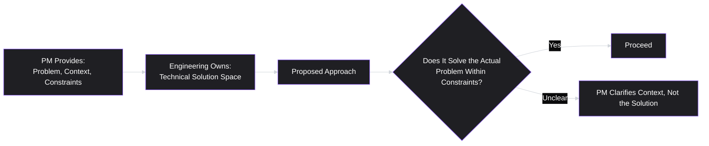
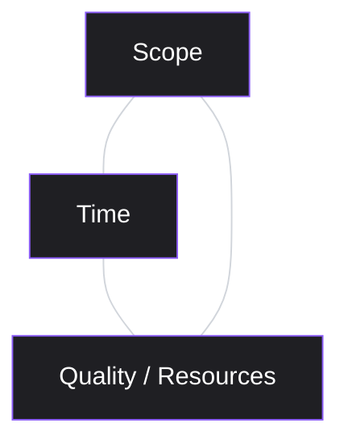
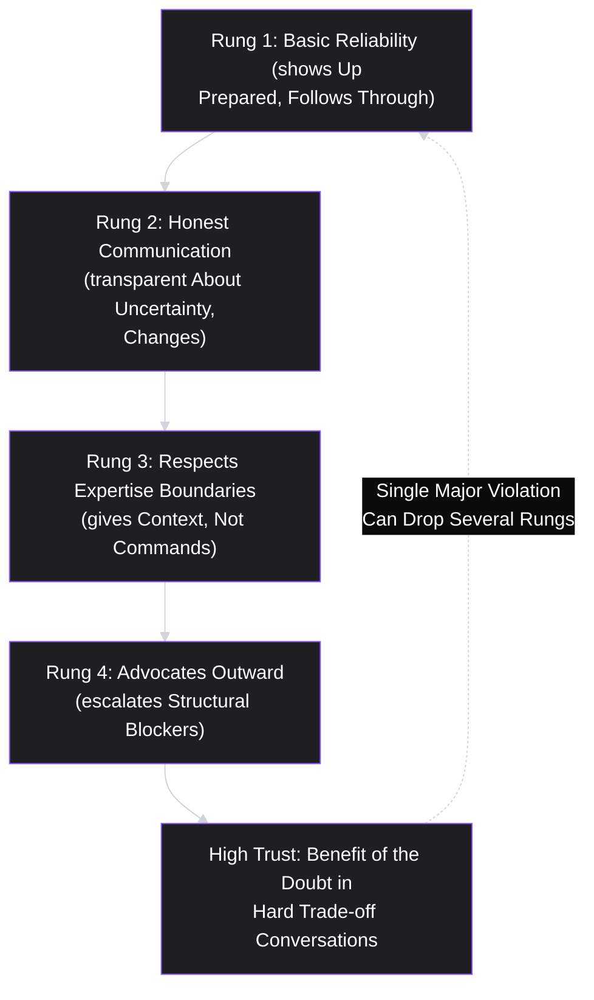

# Lesson 37: Working with Engineering Teams

## Why This Lesson Matters

Lessons 31 through 36 gave you the mechanics of Agile execution — the frameworks, ceremonies, and release practices a PM operates within. But mechanics alone don't produce a functioning team; the quality of the actual working relationship between a PM and the engineers building the product does. This lesson addresses that relationship directly, because it is simultaneously one of the highest-leverage and most commonly mishandled parts of the job. A PM with excellent prioritization judgment (Lesson 29) and flawless Sprint mechanics (Lesson 34) can still fail completely if engineers don't trust their judgment, feel dictated to rather than collaborated with, or are handed solutions instead of problems.

This lesson also closes a loop opened in Lesson 32's Case Study, where a cross-team resourcing blocker required escalation beyond what the team's own retrospective process could solve — this lesson gives you the specific judgment for knowing which problems belong to the team and which require the PM to act as an escalation point on the team's behalf. The underlying theme across this entire lesson is one this curriculum has returned to since Lesson 1: a PM's authority comes from the quality of their judgment and their trustworthiness as a partner, not from positional authority they don't actually hold over engineering. Nowhere is that truer than in the day-to-day working relationship this lesson covers.

---

## Learning Path

| Field | Detail |
|---|---|
| **Module** | 4 — Execution & Agile Delivery |
| **Current Lesson** | 37 of 90 |
| **Difficulty** | 5 / 10 |
| **Estimated Study Time** | 35 minutes (reading) + 15 minutes (reflection + quiz) |
| **Prerequisites** | Lesson 1 (Responsibility without authority), Lesson 32 (Scrum Framework — Product Owner vs. Developers roles), Lesson 34 (Sprint Planning & Backlog Grooming — INVEST's "Negotiable" criterion) |
| **Next Lesson** | Lesson 38 — Working with Design Teams |
| **Future Topics Unlocked** | Lesson 38 (Working with Design Teams, a parallel relationship-building lesson), Lesson 39 (Technical Debt & PM Trade-offs), Lesson 53 (Negotiation & Influence Without Authority), Lesson 54 (Managing Up and Across) — all build on the trust and context-handoff principles introduced here |

---

## Learning Objectives

By the end of this lesson, you will be able to:

1. Explain why "giving context, not commands" produces better technical outcomes than specifying a solution directly, and connect this to INVEST's "Negotiable" criterion from Lesson 34.
2. Describe the specific behaviors that build or erode engineering trust in a PM over time, distinguishing durable trust from one-off goodwill.
3. Apply a technical-disagreement resolution approach that respects engineering's authority over "how" while preserving the PM's accountability for "why" and "what."
4. Distinguish problems a team can resolve internally from problems that require PM/PO escalation outward, extending the distinction raised in Lesson 32's Case Study.
5. Explain the Iron Triangle (scope, time, quality) and use it to reason about trade-off conversations with engineering under real constraints.

---

## Prerequisites

This lesson assumes **Lesson 1's** foundational framing of the PM as having "responsibility without authority" — this lesson is, in many ways, a direct application of that idea to the single most important working relationship a PM maintains. It also assumes **Lesson 32's** role distinctions (Product Owner owns value/backlog, Developers own the how) and **Lesson 34's** INVEST criteria, specifically the "Negotiable" principle that a well-formed backlog item states a need rather than a pre-specified technical solution — this lesson extends that principle from how items are *written* to how a PM *behaves* in conversation with engineers more broadly.

---

## Theory

### Give Context, Not Commands

The single most consequential shift a new PM can make in how they work with engineers is moving from specifying solutions to specifying problems, context, and constraints — then trusting engineering to own the solution space. This is not a matter of etiquette; it reflects a genuine asymmetry in expertise. A PM typically has the clearest view of the user problem, the business context, and the constraints that matter (deadline pressure, dependencies, strategic priority); engineers typically have the clearest view of the technical trade-off space (what's actually hard, what's actually cheap, what technical debt a given approach would create). A PM who hands over a fully-specified technical solution is, in effect, making decisions in a domain where engineering has more information — and is very often specifying a worse solution than engineering would have proposed with the same context.

This does not mean a PM should have no opinion on technical approach, or should never ask a clarifying or challenging question about a proposed solution. It means the PM's questions should test whether a proposed approach actually serves the stated problem and constraints, rather than substituting the PM's own preferred implementation for engineering's.

### What Builds (and Erodes) Engineering Trust

Trust between a PM and an engineering team is built cumulatively, through specific, repeated behaviors, and eroded quickly by their absence:

| Builds Trust | Erodes Trust |
|---|---|
| Explaining the "why" behind a request, not just the "what" | Handing over tickets with no context, expecting silent execution |
| Protecting the team's focus by pushing back on low-value mid-Sprint interruptions | Constantly introducing new "urgent" requests without prioritization discipline |
| Accepting engineering's estimate and technical judgment by default | Second-guessing every estimate or technical call without domain expertise to back it up |
| Escalating blockers the team can't solve on its own (Lesson 32's Case Study) | Leaving structural blockers unaddressed and blaming the team for resulting delays |
| Being honest about uncertainty and changing plans transparently (Lesson 31, Lesson 34) | Presenting an uncertain plan as a firm commitment, then quietly walking it back later |

Trust, once established, gives a PM significant benefit of the doubt during a genuinely difficult trade-off conversation; trust, once eroded, makes even a reasonable request from the PM subject to skepticism and resistance.

### Resolving Technical Disagreements

A specific, recurring situation deserves its own framework: what happens when a PM and engineering disagree about the right approach to a problem. The healthiest pattern separates the conversation into two distinct questions, asked in order:

1. **Do we agree on the problem, the user need, and the constraints?** If not, the disagreement is actually about "what" and "why" — squarely the PM's domain — and should be resolved there first, before any technical discussion proceeds.
2. **Given agreement on problem and constraints, which technical approach best satisfies them?** This is squarely engineering's domain. A PM can and should ask clarifying questions here ("does this approach still meet the timeline we discussed," "does this handle the edge case we identified"), but should generally defer to engineering's judgment on the actual technical trade-offs once the problem and constraints are aligned.

Most unproductive PM-engineering disagreements occur because the two questions get conflated — a PM pushing back on a technical approach is often, without realizing it, actually revealing an unresolved disagreement about the underlying problem or constraints, which is better surfaced and resolved directly rather than fought out indirectly through a debate about implementation details neither side fully owns from the other's side.

### Escalating What the Team Can't Solve Internally

Recall Lesson 32's Case Study: a cross-team design-resource blocker recurred across eight consecutive retrospectives, unsolved, because it required PO escalation outward rather than an internal process fix. This lesson generalizes that distinction: some problems (unclear requirements, internal process friction, estimation disagreements) are genuinely within a team's power to resolve through its own Scrum or Kanban practices; others (a shared resource bottleneck, an organizational dependency, a conflicting priority set by another team's leadership) are structural, and no amount of internal team process will fix them. A PM's job includes correctly identifying which category a given blocker falls into, and taking ownership of escalating the structural ones — since failing to do so leaves the team blocked indefinitely while quietly absorbing blame for a problem that was never theirs to solve alone.

### The Iron Triangle

A classical framing, useful in trade-off conversations with engineering: any piece of work can be described along three dimensions — **scope** (how much is being built), **time** (how quickly it must ship), and **quality/resources** (how much rigor, testing, and polish goes into it). The core claim of the Iron Triangle is that these three dimensions are interdependent: fixing any two effectively determines the third, and demanding all three be fixed simultaneously (more scope, faster, with no quality trade-off) is not a request for hard work — it's a request that violates the triangle's basic arithmetic.

This framing gives a PM a clean, respectful way to have a trade-off conversation under deadline pressure: rather than simply demanding "more, faster," name explicitly which side of the triangle is flexible — is scope negotiable (can something be cut), is time negotiable (can the deadline move), or is quality genuinely the dimension being knowingly traded down (with the resulting risk made explicit and accepted).

---

## Common Beginner Mistakes

**Mistake 1: Handing engineering a fully-specified technical solution instead of a problem and constraints.**
As covered in Theory, this substitutes the PM's judgment for engineering's in a domain where engineering typically has more relevant information, often producing a worse outcome than trusting the team with the actual problem.

**Mistake 2: Second-guessing engineering estimates without new information to justify it.**
Pushing back on an estimate simply because it's inconvenient, without offering new context that might genuinely change the estimate (a simplified scope, a different approach, new information about urgency), erodes trust and rarely produces a more accurate number — it usually just produces a falsely optimistic one.

**Mistake 3: Treating every blocker as the team's to solve internally.**
As covered in Theory, some blockers are structural and require PM escalation; a PM who reflexively tells a blocked team to "just figure it out" when the blocker is genuinely outside the team's control leaves the team stuck and erodes trust in the PM's willingness to advocate for them.

**Mistake 4: Demanding fixed scope, fixed time, and fixed quality simultaneously under deadline pressure.**
This is the Iron Triangle violation described above — a request that isn't really a request for harder work, but an implicit demand that one of the three dimensions quietly gives way (usually quality, and usually invisibly, in the form of accumulating technical debt or reduced testing) without ever being named or agreed to explicitly.

**Mistake 5: Conflating disagreement about the problem with disagreement about the technical solution.**
As covered in Theory, unresolved disagreements about the underlying problem or constraints often surface, confusingly, as arguments about implementation details — resolving the wrong layer of disagreement (arguing about code architecture when the real disagreement is about which user need matters most) wastes time and rarely produces genuine alignment.

---

## Mental Model: The Trust Ladder

This lesson's core takeaway tool visualizes engineering trust as a ladder that a PM climbs through repeated, consistent behavior, and can fall down quickly through a small number of trust-eroding actions:

Use the Trust Ladder as a diagnostic whenever a working relationship with engineering feels strained: which rung is actually in question? A team that doesn't trust a PM's basic reliability (Rung 1) needs a different remedy than a team that trusts the PM personally but has seen structural blockers go unaddressed (Rung 4) — treating every trust problem as if it's the same problem, at the same rung, tends to apply the wrong fix.

---

## Real Company Example

**Stripe** has been publicly associated, through its own engineering and product culture writing, with a strong internal emphasis on detailed written design documents and clearly articulated problem statements preceding significant engineering work — a practice consistent with this lesson's "give context, not commands" principle, since a well-written problem-and-context document is precisely the artifact that lets engineering own the solution space with full information.

The underlying principle connects directly to this lesson's Theory: investing real effort in clearly articulating the problem and its constraints in writing, before engineering discussion begins, tends to produce both better technical solutions and a clearer basis for productive disagreement when it does arise, since both sides can point back to a shared, explicit statement of the actual problem.

*(Assumption flagged: this reflects general, publicly available descriptions of Stripe's writing-oriented product and engineering culture over time, not a confirmed, complete, or current account of Stripe's specific internal processes today. Specific practices evolve and vary by team at any company; the durable lesson is the underlying principle — clear, written problem framing improves both technical outcomes and disagreement resolution — rather than a claim about Stripe's exact current process.)*

---

## Real World Perspective: Startup vs. Mid-Size vs. Big Tech

**At a startup:**
The PM-engineering relationship is often informal and built through constant, close daily contact — trust can form (or erode) quickly, since there's little organizational distance between the PM and the people building the product. The risk here is that informality can mask Mistake 1 (handing over solutions instead of problems) as simply "collaborative brainstorming," when in practice the PM is still substituting their own technical preference without realizing it.

**At a mid-size company:**
The relationship typically becomes more structured — a PM works with a defined set of engineers and an Engineering Manager or Tech Lead, often across recurring, scheduled touchpoints (grooming, planning, 1:1s). This is the stage where the Trust Ladder's higher rungs (advocating outward, escalating structural blockers) become especially visible and valuable, since the PM increasingly sits at the interface between the immediate team and the broader organization.

**At Big Tech:**
A PM may work with multiple engineering teams or a large team led by a dedicated Engineering Manager, and technical design review processes are often formalized (design docs, architecture review committees). The PM's job shifts toward being an effective participant and advocate within these more formal technical review processes, ensuring the problem and constraints are represented clearly, rather than trying to personally adjudicate technical trade-offs outside their expertise.

---

## Detailed Case Study: The PRD That Specified the Database Schema

Consider a simplified, illustrative scenario common among new PMs eager to demonstrate technical credibility.

A first-time PM, wanting to be seen as technically capable by an engineering team they've just started working with, writes a product requirements document for a new feature that includes not just the user problem and business context, but a specific proposed database schema, API endpoint structure, and caching strategy — details the PM researched independently but has no direct engineering experience implementing. The engineering team, seeing a fully pre-specified technical design handed to them, quietly builds it as specified rather than raising concerns, despite two engineers privately believing a different, simpler approach would have handled an important edge case (concurrent updates from multiple users) that the PM's proposed schema does not handle well.

Three weeks after launch, the unhandled edge case causes a data-consistency bug affecting a small number of users. In the resulting retrospective, the two engineers explain they'd noticed the issue during initial design review but assumed the PM's detailed schema reflected a deliberate, informed technical decision, and didn't want to seem like they were overriding the PM's stated plan.

**What went wrong?**

The PM's instinct — to demonstrate technical seriousness by being maximally specific — inverted the actual value they could have provided. By specifying a full technical solution rather than the underlying problem and constraints (in this case, the requirement to handle concurrent multi-user updates correctly, which the PM likely wasn't even aware needed explicit design attention), the PM removed the space for the engineers' better technical judgment to surface, and inadvertently signaled through the level of detail that the schema was a firm, considered decision rather than an open starting point. The engineers' silence, while understandable given the artifact they were handed, compounded the underlying mistake — but the root cause was the PM operating outside the boundary this lesson describes, treating engineering's domain as something to specify rather than something to trust with full context.

The fix is not for the PM to avoid all technical detail out of caution, but to clearly separate two kinds of information in any written specification: context and constraints that must be conveyed precisely (including, critically, non-obvious requirements like "must handle concurrent updates from multiple users correctly"), versus a proposed technical approach explicitly labeled as a starting suggestion open to revision, not a final decision. This distinction — what must be stated as a hard requirement versus what should be offered only as an open, negotiable suggestion — is a specific instance of INVEST's "Negotiable" criterion from **Lesson 34**, applied here to a full specification document rather than a single backlog item, and will be extended further in **Lesson 39 (Technical Debt & PM Trade-offs)**, where we discuss how upfront technical decisions interact with longer-term system health.

---

## Framework Explanation: The Escalation Decision Table

A second, more tactical tool: use this table when a team reports being blocked, to decide quickly whether the blocker is genuinely team-solvable or requires PM escalation.

| Signal | Likely Team-Solvable | Likely Requires PM Escalation |
|---|---|---|
| Source of the blocker | Internal to the team's own process or communication | Involves another team, external vendor, or organizational resourcing decision |
| Recurrence | First time this specific issue has come up | Has recurred across multiple Sprints or retrospectives unresolved (as in Lesson 32's Case Study) |
| Authority required to fix it | Within the team's existing decision-making authority | Requires a decision or resource commitment from outside the team's leadership |
| What's already been tried | The team hasn't yet attempted an internal process fix | The team has already tried reasonable internal fixes without success |

A blocker landing mostly in the right-hand column is a signal that the PM's job is to advocate outward — not to encourage the team to keep trying to solve something structurally outside their control, which both wastes effort and, per the Trust Ladder, quietly erodes trust if it continues without visible PM action.

---

## Interview Perspective: How Interviewers Think About This

**Typical question 1: "How do you handle a disagreement with an engineer about the right technical approach?"**
*What the interviewer is actually evaluating:* Whether the candidate can articulate the two-question framework from this lesson — first checking alignment on problem and constraints, then deferring to engineering's technical judgment — rather than describing themselves as simply asserting their own preference or capitulating without any structured reasoning.

**Typical question 2: "Tell me about a time you had to earn an engineering team's trust."**
*What the interviewer is actually evaluating:* Whether the candidate can name specific, concrete behaviors (from the Trust Ladder) that built trust over time, rather than describing trust as something that simply accumulated passively through tenure or personality.

**Typical question 3: "Describe a situation where your team was blocked by something outside its control. What did you do?"**
*What the interviewer is actually evaluating:* Whether the candidate recognizes structural blockers as their own responsibility to escalate, rather than treating every blocker as the team's problem to solve internally — directly testing the distinction from this lesson's Escalation Decision Table.

---

## Summary

The working relationship between a PM and an engineering team is one of the highest-leverage, and most commonly mishandled, parts of the job, because it directly tests this curriculum's founding premise (Lesson 1) that a PM's authority comes from judgment and trust, not positional control. The single most important behavioral shift is "giving context, not commands" — conveying the problem, user need, and real constraints precisely, while trusting engineering to own the technical solution space, since engineering typically holds more relevant information about that space's actual trade-offs. Trust builds cumulatively through specific behaviors (honest communication, respecting expertise boundaries, advocating outward for structural blockers) and erodes quickly through their absence, as visualized in this lesson's Trust Ladder. Technical disagreements are best resolved by first confirming alignment on the underlying problem and constraints before ever debating implementation, since most unproductive disagreements are actually unresolved disagreements about the wrong layer. Finally, a PM must correctly distinguish blockers a team can solve internally from structural ones requiring PM escalation — a distinction this lesson extends directly from Lesson 32's Case Study — and must hold trade-off conversations honestly using the Iron Triangle, rather than implicitly demanding that scope, time, and quality all remain fixed simultaneously under pressure.

---

## Key Takeaways

- "Give context, not commands": conveying the problem and constraints precisely while trusting engineering to own the technical solution space typically produces better outcomes than specifying a solution directly.
- Engineering trust builds cumulatively through honest communication, respecting expertise boundaries, and advocating outward for structural blockers — and can erode quickly through a small number of violations.
- Most unproductive technical disagreements are actually unresolved disagreements about the underlying problem or constraints, surfacing indirectly as arguments about implementation.
- A PM must distinguish team-solvable blockers from structural ones requiring PM escalation — failing to escalate the latter leaves a team stuck while quietly absorbing blame that isn't theirs.
- The Iron Triangle (scope, time, quality/resources) makes explicit that these three dimensions are interdependent — demanding all three remain fixed simultaneously under pressure isn't a request for hard work, it's a request that violates basic trade-off logic.
- A specification document should distinguish hard, precisely-stated requirements from proposed technical approaches explicitly labeled as open suggestions, extending INVEST's "Negotiable" criterion (Lesson 34) to full documents, not just backlog items.
- Demonstrating technical seriousness through excessive solution-specificity can backfire, signaling a decision as final when it was meant to be a starting point, and suppressing better technical judgment that might otherwise have surfaced.

---

## Cheat Sheet

*A two-minute review of everything in this lesson.*

- **Give context, not commands:** state the problem and constraints; let engineering own the solution.
- **Trust Ladder:** reliability → honest communication → respects expertise boundaries → advocates outward.
- **Technical disagreement:** resolve problem/constraint alignment first, then defer to engineering on implementation.
- **Escalation test:** is the blocker internal to the team, or structural/cross-team/resourcing (needs PM escalation)?
- **Iron Triangle:** scope, time, quality/resources are interdependent — fixing two determines the third.
- **Specs:** state hard requirements precisely; label proposed technical approaches as open suggestions, not decisions.
- **Watch for:** disagreements about implementation that are actually unresolved disagreements about the problem.

---

## Glossary

| Term | Definition | Related Concepts | Difficulty (1–3) |
|---|---|---|---|
| Give context, not commands | The principle of conveying problem/constraints precisely while leaving the technical solution space to engineering | INVEST "Negotiable" (Lesson 34) | 1 |
| Trust Ladder | This lesson's mental model: cumulative rungs of trust-building behavior between a PM and engineering | — | 2 |
| Iron Triangle | The interdependence of scope, time, and quality/resources in any piece of work | Trade-off conversation | 1 |
| Escalation Decision Table | A tool for distinguishing team-solvable blockers from structural ones requiring PM escalation | Lesson 32 Case Study | 2 |
| Technical disagreement resolution | A two-step approach: align on problem/constraints first, then defer to engineering on implementation | Give context, not commands | 2 |

---

## Further Reading / Resources

- *The Manager's Path* by Camille Fournier — offers an engineering-side view of PM-engineering collaboration, useful for understanding how trust and technical authority are perceived from across the table.
- *Inspired: How to Create Tech Products Customers Love* by Marty Cagan — discusses the PM-engineering-design partnership model referenced throughout this lesson.
- *Team Topologies* by Matthew Skelton and Manuel Pais — a deeper treatment of team boundaries, dependencies, and when a blocker is structural versus internally solvable.

---

## Flashcards

**Card 1**
Front: What does "give context, not commands" mean, in practice?
Back: Conveying the problem, user need, and real constraints precisely, while trusting engineering to own the technical solution space, rather than specifying a solution directly.
Difficulty: 1
Tags: context-not-commands

**Card 2**
Front: Name the four rungs of the Trust Ladder in order.
Back: Basic reliability, honest communication, respects expertise boundaries (context not commands), advocates outward (escalates structural blockers).
Difficulty: 2
Tags: trust-ladder

**Card 3**
Front: What two questions should be asked, in order, when a PM and engineer disagree about technical approach?
Back: (1) Do we agree on the problem, user need, and constraints? (2) Given that agreement, which technical approach best satisfies them — generally deferring to engineering here.
Difficulty: 2
Tags: technical-disagreement

**Card 4**
Front: What are the three dimensions of the Iron Triangle?
Back: Scope, time, and quality/resources — interdependent, such that fixing any two effectively determines the third.
Difficulty: 1
Tags: iron-triangle

**Card 5**
Front: How does this lesson distinguish a team-solvable blocker from one requiring PM escalation?
Back: Team-solvable blockers are internal to the team's own process; escalation-worthy blockers involve another team, external dependency, or organizational resourcing decision outside the team's authority — especially if they've recurred unresolved.
Difficulty: 2
Tags: escalation

**Card 6**
Front: In the Detailed Case Study, what was the PM's core mistake in writing the PRD?
Back: Specifying a full technical solution (database schema, API structure, caching strategy) rather than clearly stating the problem and constraints, which suppressed engineers' better judgment about an unhandled edge case.
Difficulty: 2
Tags: case-study

**Card 7**
Front: Why is demanding fixed scope, fixed time, and fixed quality simultaneously not really "asking for hard work"?
Back: Per the Iron Triangle, these three dimensions are interdependent; demanding all three stay fixed under pressure implicitly forces one to give way invisibly (usually quality/technical debt) without ever being named or agreed to.
Difficulty: 2
Tags: iron-triangle, mistake

---

## Reflection Exercise

Consider the following novel scenario: You're a new PM working with an engineering team for the first time. During Sprint Planning, an engineer proposes an estimate for a feature that seems, to you, surprisingly high — nearly double what you expected based on similar past features. You don't have deep technical expertise in the specific area involved.

There is no single correct answer to the prompts below — the goal is to practice applying this lesson's trust and disagreement frameworks, not to reach one "right" answer.

1. Using this lesson's technical disagreement framework, what should you check first before questioning the estimate itself?
2. What specific, respectful questions could you ask that test the estimate without second-guessing engineering's technical judgment outright?
3. If the engineer's answer reveals a piece of context you were missing (a hidden dependency, a testing requirement), how should that change your next move?
4. If, after this conversation, you still believe the estimate seems high, and you lack the technical expertise to independently evaluate it, what does the Trust Ladder suggest about how you should proceed?
5. How would you distinguish, going forward, whether this specific interaction built or eroded trust with this engineer, using the builds/erodes trust table from this lesson?

---

## Quiz

**1. What does "give context, not commands" mean, according to this lesson?**
A) PMs should never communicate any technical details to engineering
B) PMs should convey the problem, user need, and real constraints precisely, while trusting engineering to own the technical solution space
C) PMs should always specify the exact technical solution to be built
D) Engineers should never ask PMs any clarifying questions

*Correct answer: B*
*Explanation: The Theory section defines this principle exactly as conveying problem and constraints while leaving the solution space to engineering.*
*Learning objective tested: #1*
*Difficulty: Easy*

---

**2. Why does specifying a fully-detailed technical solution often produce a worse outcome than specifying the problem and constraints?**
A) Because engineers dislike detailed documents on principle
B) Because engineering typically has more relevant information about the technical trade-off space, and a PM substituting their own solution overrides that expertise advantage
C) Because detailed documents take longer to write
D) Because Scrum forbids PMs from writing technical specifications

*Correct answer: B*
*Explanation: The Theory section explains this as an asymmetry-of-expertise argument — engineering typically knows the technical trade-off space better than the PM does.*
*Learning objective tested: #1*
*Difficulty: Easy*

---

**3. According to the Trust Ladder, which of these behaviors builds trust rather than eroding it?**
A) Handing over tickets with no context, expecting silent execution
B) Escalating blockers the team can't solve on its own
C) Second-guessing every estimate without new information
D) Presenting an uncertain plan as a firm commitment, then quietly walking it back

*Correct answer: B*
*Explanation: The Theory section's builds/erodes trust table lists escalating unsolvable blockers as a trust-building behavior; the other three options are explicitly listed as trust-eroding.*
*Learning objective tested: #2*
*Difficulty: Easy*

---

**4. What is the correct order of questions when resolving a technical disagreement, according to this lesson?**
A) Debate the technical approach first, then discuss the problem if needed
B) First confirm alignment on the problem, user need, and constraints; then discuss which technical approach best satisfies them
C) Always defer to whichever party has more seniority
D) Skip discussing the problem entirely and vote on the technical approach

*Correct answer: B*
*Explanation: The Theory section explicitly presents this as a two-step, ordered framework — problem/constraints alignment first, technical approach second.*
*Learning objective tested: #3*
*Difficulty: Easy*

---

**5. Why does this lesson claim that many unproductive PM-engineering disagreements are "conflated"?**
A) Because PMs and engineers never actually disagree about anything real
B) Because an unresolved disagreement about the underlying problem or constraints often surfaces indirectly as an argument about implementation details, which resolves the wrong layer
C) Because engineers always agree with PMs once given enough data
D) Because technical disagreements are always about code style only

*Correct answer: B*
*Explanation: The Theory section explains that disagreements about problem/constraints frequently get mistaken for, and fought out as, disagreements about technical implementation.*
*Learning objective tested: #3, #5*
*Difficulty: Easy*

---

**6. Using the Escalation Decision Table, which signal suggests a blocker likely requires PM escalation rather than being team-solvable?**
A) It's the first time this specific issue has come up
B) It involves another team, external vendor, or organizational resourcing decision outside the team's authority
C) The team hasn't yet attempted an internal process fix
D) It is within the team's existing decision-making authority

*Correct answer: B*
*Explanation: The Escalation Decision Table explicitly lists involvement of another team, external party, or organizational resourcing as a signal pointing toward PM escalation.*
*Learning objective tested: #4*
*Difficulty: Easy*

---

**7. What are the three dimensions of the Iron Triangle?**
A) Backlog, Sprint, Increment
B) Scope, Time, Quality/Resources
C) Transparency, Inspection, Adaptation
D) Now, Next, Later

*Correct answer: B*
*Explanation: The Theory section explicitly defines the Iron Triangle as scope, time, and quality/resources.*
*Learning objective tested: #5*
*Difficulty: Medium*

---

**8. What does the Iron Triangle imply about demanding more scope, faster delivery, and unchanged quality simultaneously?**
A) This is always achievable with enough motivation
B) This violates the triangle's basic interdependence — fixing two of the three dimensions effectively determines the third, so demanding all three fixed forces one to give way, often invisibly
C) This is only a problem for Kanban teams
D) This has no relationship to the Iron Triangle at all

*Correct answer: B*
*Explanation: The Theory section explicitly frames this demand as a violation of the triangle's interdependence, typically resulting in quality or technical debt quietly absorbing the difference.*
*Learning objective tested: #5*
*Difficulty: Medium*

---

**9. In the Detailed Case Study, why did the two engineers stay silent about the unhandled concurrent-update edge case?**
A) They did not notice the issue at all
B) They assumed the PM's detailed, specific schema reflected a deliberate, informed technical decision, and didn't want to seem like they were overriding the PM's stated plan
C) They agreed the edge case did not matter
D) They were not part of the design review process

*Correct answer: B*
*Explanation: The Case Study explicitly states the engineers noticed the issue during review but assumed the specificity of the PM's schema signaled a deliberate, final decision.*
*Learning objective tested: #1, #5*
*Difficulty: Medium*

---

**10. What is the recommended fix from the Detailed Case Study, for how a PM should write a specification document?**
A) Include no technical detail whatsoever, under any circumstances
B) Clearly separate hard, precisely-stated requirements (like handling concurrent updates correctly) from proposed technical approaches explicitly labeled as open, negotiable suggestions
C) Always let engineering write the entire specification independently
D) Always specify the exact database schema to avoid ambiguity

*Correct answer: B*
*Explanation: The Case Study's resolution explicitly recommends this distinction between hard requirements and open, negotiable suggested approaches.*
*Learning objective tested: #1, #5*
*Difficulty: Medium*

---

**11. (Scenario) A team has been blocked for three consecutive Sprints by the same dependency on another team's unavailable resource, and retrospective action items about it have gone unresolved each time. Using the Escalation Decision Table, what should the PM most likely do?**
A) Continue asking the team to solve it internally through better planning
B) Recognize this as a structural, escalation-worthy blocker (recurrence, cross-team source, authority required) and take ownership of escalating it outward
C) Remove the blocked item from the backlog permanently without further discussion
D) Wait for the issue to resolve itself naturally over time

*Correct answer: B*
*Explanation: This matches the Escalation Decision Table's clearest signals for PM escalation: cross-team source and unresolved recurrence across multiple Sprints, directly echoing Lesson 32's Case Study.*
*Learning objective tested: #4*
*Difficulty: Medium-Hard*

---

**12. (Interview Reasoning) A candidate is asked how they handle a technical disagreement with an engineer, and answers: "I usually just trust my gut and go with what I think is right, since I'm the PM." Based on this lesson's Interview Perspective section, what is the weakness in this answer?**
A) There is no weakness; PM authority should always prevail in a disagreement
B) It fails to describe a structured approach (confirming problem/constraint alignment first, then deferring to engineering's technical judgment) and instead asserts positional authority in a domain where the PM often has less relevant expertise
C) It correctly demonstrates strong decision-making under uncertainty
D) It shows appropriate confidence and should be viewed positively

*Correct answer: B*
*Explanation: The Interview Perspective section explicitly states that a weak answer asserts preference without structured reasoning, echoing the lesson's broader point that a PM's authority is not positional (Lesson 1) and technical trade-offs are typically better judged by engineering.*
*Learning objective tested: #1, #3*
*Difficulty: Hard*

---

**13. (Product Thinking) A PM notices that engineers on their team have started silently implementing exactly what's written in specs, even when they privately have concerns, rather than raising objections. Using the Trust Ladder and the Detailed Case Study, what is the most likely underlying cause?**
A) The engineers are simply not skilled enough to raise concerns
B) The PM's specifications may be signaling technical decisions as final and fully-specified rather than open, inviting engineers to defer rather than push back — echoing the Case Study's core failure
C) This is a sign of a perfectly healthy, high-trust relationship
D) The team should be given even more detailed specifications to prevent further silence

*Correct answer: B*
*Explanation: This directly mirrors the Detailed Case Study's dynamic — overly specific, final-seeming specifications can suppress engineers' willingness to raise legitimate concerns, exactly the failure mode this lesson warns against.*
*Learning objective tested: #1, #2, #5*
*Difficulty: Hard*

---

**14. Why does the lesson recommend asking clarifying questions about a technical approach ("does this handle the edge case we identified") rather than avoiding all technical engagement entirely?**
A) Because PMs should have no involvement in technical conversations at all
B) Because these questions test whether a proposed approach serves the stated problem and constraints, without substituting the PM's own preferred implementation for engineering's judgment
C) Because asking questions is only appropriate once a decision has already shipped
D) Because engineers expect PMs to propose alternative technical solutions directly

*Correct answer: B*
*Explanation: The Theory section explicitly distinguishes appropriate PM engagement (testing whether an approach serves the problem/constraints) from inappropriate engagement (substituting a preferred implementation).*
*Learning objective tested: #1, #3*
*Difficulty: Medium-Hard*

---

**15. (Product Thinking, Highest Difficulty) A PM is under significant pressure from leadership to ship more scope in less time than the engineering team believes is realistic, without any discussion of reduced quality or additional resources. Using the Iron Triangle and the Trust Ladder together, what is the most defensible response?**
A) Silently pass the pressure on to engineering and demand they simply work harder to hit both targets
B) Use the Iron Triangle to make the trade-off explicit with leadership — naming that scope, time, and quality are interdependent — while using the Trust Ladder's principles (honest communication, advocating outward) to represent engineering's realistic assessment rather than absorbing the pressure silently and passing it downward
C) Tell engineering to quietly cut corners on testing without informing leadership of the change
D) Refuse to discuss the request with leadership at all

*Correct answer: B*
*Explanation: This combines both frameworks as intended: the Iron Triangle names the actual trade-off explicitly to leadership, while the Trust Ladder's "advocates outward" principle means the PM represents engineering's honest assessment upward rather than passing unreasonable pressure downward or letting quality erode invisibly.*
*Learning objective tested: #2, #5*
*Difficulty: Hard*

---

## Connections

| | Lesson | Core Idea Carried Forward |
|---|---|---|
| **Previous Lesson** | Lesson 36 — Release Planning & Launch Management | This lesson addresses how the safeguards from Lesson 36 (staged rollout, feature flags, rollback plans) actually get built into a team's default process through effective PM-engineering collaboration |
| **Current Lesson** | Lesson 37 — Working with Engineering Teams | Give context, not commands; Trust Ladder; technical disagreement resolution; Escalation Decision Table; Iron Triangle |
| **Next Lesson** | Lesson 38 — Working with Design Teams | A parallel relationship-building lesson, applying similar trust and context-handoff principles to the PM-design partnership |
| **Future Concepts Unlocked** | Lesson 39 (Technical Debt & PM Trade-offs) | Extends the Iron Triangle and the hard-requirement/open-suggestion distinction from this lesson's Case Study |
| | Lesson 53 (Negotiation & Influence Without Authority) | Builds directly on this lesson's Trust Ladder and Lesson 1's "responsibility without authority" framing |
| | Lesson 54 (Managing Up and Across) | Extends this lesson's "advocates outward" principle to managing pressure from leadership specifically |

This curriculum is designed to be read as one continuous argument, not ninety independent articles. Every lesson from here forward will assume you carry the Trust Ladder, the Iron Triangle, and the "context not commands" principle with you — they will not be re-explained, only re-applied in new contexts.
