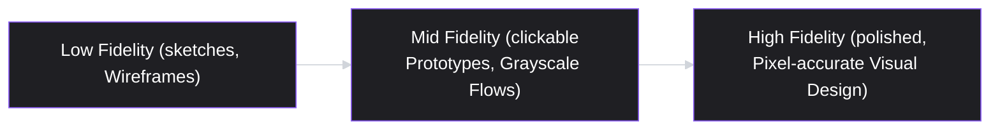
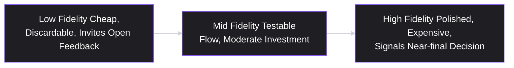

# Lesson 38: Working with Design Teams

## Why This Lesson Matters

Lesson 37 addressed the PM-engineering relationship in depth. This lesson addresses its close parallel — the PM-design relationship — because although the underlying principle is the same (trust the domain expert with their domain), the specific failure modes are different enough to deserve their own treatment. Where the classic engineering mistake is handing over a fully-specified technical solution, the classic design mistake is bringing design in too late, after the problem has already been implicitly solved by the PM's own assumptions about what the interface should look like — leaving design to prettify a decision that was never actually theirs to shape.

This matters because design, done well, is not decoration applied after a decision is made; it is a core method of exploring the solution space itself, often surfacing problems with an approach that would otherwise only be discovered after expensive engineering work has already begun. A PM who involves design only at the end, to "make it look nice," is not just under-using a valuable resource — they are removing one of the cheapest, earliest opportunities to catch a bad idea before it becomes an expensive one.

---

## Learning Path

| Field | Detail |
|---|---|
| **Module** | 4 — Execution & Agile Delivery |
| **Current Lesson** | 38 of 90 |
| **Difficulty** | 4 / 10 |
| **Estimated Study Time** | 35 minutes (reading) + 15 minutes (reflection + quiz) |
| **Prerequisites** | Lesson 8 (Product Discovery), Lesson 37 (Working with Engineering Teams — trust and context-handoff principles) |
| **Next Lesson** | Lesson 39 — Technical Debt & PM Trade-offs |
| **Future Topics Unlocked** | Lesson 39 (Technical Debt & PM Trade-offs), Lesson 45 (A/B Testing & Experimentation, which depends on testable design variants), Lesson 52 (Storytelling and Narrative for PMs) — all build on the fidelity discipline and early-involvement principles introduced here |

---

## Learning Objectives

By the end of this lesson, you will be able to:

1. Explain why involving design early, during problem definition rather than after a solution is chosen, tends to produce better outcomes than involving design only at the visual-polish stage.
2. Apply the fidelity ladder (low, mid, high fidelity) to match a design artifact's polish to the actual certainty behind the underlying decision.
3. Describe the Double Diamond framework and use it to identify which phase of design work a given moment in a project actually calls for.
4. Diagnose "premature high-fidelity" — a specific, common failure where polished mockups create false attachment to an unvalidated idea — and explain why it's costly.
5. Apply the same "give context, not commands" principle from Lesson 37 to the PM-design relationship specifically, distinguishing user needs and constraints (PM's domain) from visual and interaction solutions (design's domain).

---

## Prerequisites

This lesson assumes **Lesson 8's** grounding in product discovery — the practice of understanding user problems before committing to solutions — since good design collaboration is, in large part, an extension of discovery practice into the visual and interaction domain. It also directly assumes **Lesson 37's** "give context, not commands" principle and Trust Ladder, since this lesson largely mirrors that framework, adapted for the specific dynamics of working with designers rather than engineers.

---

## Theory

### Design as Exploration, Not Decoration

The most consequential mental shift a PM can make about design is recognizing it as a method for exploring and pressure-testing a solution space, not a finishing step applied after the "real" decisions have already been made elsewhere. A PM who arrives at a design conversation having already decided the interface's layout, flow, and interaction pattern — asking design only to "make it look good" — has skipped past the phase where design's distinct expertise (understanding how users actually perceive, navigate, and form mental models of an interface) could have meaningfully shaped the underlying decision, not just its surface appearance.

### The Double Diamond

A widely used framework, originally developed by the UK Design Council, describes the design process as two consecutive diamonds — each expanding into divergent exploration before converging on a decision:

```mermaid
%%{init: {
  "theme": "dark",
  "themeVariables": {
    "background": "#0b0b0c",
    "primaryColor": "#1f1f23",
    "primaryTextColor": "#ffffff",
    "primaryBorderColor": "#8b5cf6",
    "lineColor": "#d1d5db",
    "secondaryColor": "#18181b",
    "tertiaryColor": "#111111",
    "mainBkg": "#1f1f23",
    "nodeBorder": "#8b5cf6",
    "clusterBkg": "#000000",
    "clusterBorder": "#27272a",
    "titleColor": "#ffffff",
    "edgeLabelBackground": "#0b0b0c",
    "nodeTextColor": "#ffffff",
    "edgeLabelColor": "#ffffff",
    "actorBorder": "#8b5cf6",
    "actorBkg": "#1f1f23",
    "actorTextColor": "#ffffff",
    "sequenceNumberColor": "#ffffff",
    "signalColor": "#8b5cf6",
    "signalTextColor": "#ffffff",
    "textColor": "#ffffff",
    "classText": "#ffffff",
    "classBorder": "#8b5cf6",
    "classBkg": "#1f1f23"
  }
}}%%
graph LR
    A[Discover Diverge: Explore the Problem] --> B[Define Converge:<br/>Commit to a Specific Problem]
    B --> C[Develop Diverge: Explore Solutions]
    C --> D[Deliver Converge:<br/>Commit to a Specific Solution]
```

The critical insight, easy to miss at a glance, is that there are *two* distinct divergent phases — one exploring the problem itself (Discover), and a separate one exploring possible solutions (Develop) — each followed by a deliberate narrowing (Define, Deliver). A PM who invites design in only at the "Deliver" stage has skipped both divergent phases entirely, asking design to visually finish a solution whose problem framing and solution exploration were never actually opened up for genuine design input. This directly parallels Lesson 8's discovery discipline: design has its own discovery process, and skipping it produces the same risk — building the wrong thing, confidently — that skipping user discovery does elsewhere in the product process.

### The Fidelity Ladder

A second, closely related concept concerns *how polished* a design artifact should be at a given stage of certainty:

Low-fidelity artifacts are cheap to produce and cheap to discard, making them appropriate for early exploration when the underlying idea itself is still uncertain — a hand-drawn sketch invites genuine feedback and revision in a way a polished mockup does not, because it visibly signals "this is still an open question." High-fidelity artifacts are expensive to produce and, critically, tend to create a psychological sense of finality and ownership disproportionate to how validated the underlying idea actually is — a mistake this lesson calls **premature high-fidelity**, covered in detail in the Case Study below. The general rule: fidelity should track actual certainty, mirroring Lesson 35's Confidence Gradient principle applied here to design artifacts rather than roadmap items.

### Applying "Give Context, Not Commands" to Design

Lesson 37 established that a PM's job is to convey the problem, user need, and constraints precisely, while trusting the domain expert to own the solution space. Applied to design, this means a PM should be highly specific about the *user problem* being solved, the *constraints* that matter (technical limitations, brand guidelines, accessibility requirements, existing design system components), and the *outcome* being targeted — while resisting the urge to dictate specific layouts, visual treatments, or interaction patterns, which is squarely design's domain, just as technical architecture is squarely engineering's.

| PM's Domain (context to convey precisely) | Design's Domain (solution space to own) |
|---|---|
| The user problem and evidence behind it | Specific layout, visual hierarchy, interaction pattern |
| Business and technical constraints | How to communicate information visually |
| Success criteria / what "solved" looks like | Which existing design system components to use or extend |
| Priority and timeline | Exact copy, iconography, and micro-interaction choices (within brand guidelines) |

---

## Common Beginner Mistakes

**Mistake 1: Bringing design in only at the "make it pretty" stage**

As covered in Theory, this skips both of the Double Diamond's divergent phases, wasting design's ability to meaningfully shape problem framing and solution exploration, and reduces the relationship to a visual-polish service rather than a genuine partnership.

**Mistake 2: Commissioning high-fidelity mockups before the underlying idea has been validated**

This is "premature high-fidelity" — producing a level of visual polish that creates false attachment and a false sense of finality around an idea that hasn't actually earned that level of certainty yet, covered in full in this lesson's Case Study.

**Mistake 3: Dictating specific layouts or visual treatments instead of describing the user problem and constraints**

This is the design-specific version of Lesson 37's Mistake 1 — substituting the PM's own visual preference for design's domain expertise, often producing a worse outcome than trusting design with full context.

**Mistake 4: Treating design feedback sessions as approval checkpoints rather than genuine collaboration**

A PM who shows design a nearly-finished mockup expecting only a rubber-stamp "looks good" has effectively excluded design from the actual decision-making process, even if the meeting nominally included them.

**Mistake 5: Skipping user testing on a design because "the team already likes it."**

Internal team enthusiasm for a design is not evidence that real users will understand or successfully use it — conflating internal consensus with user validation is a distinct and common failure, especially once a polished mockup has generated internal excitement (see Mistake 2).

---

## Mental Model: The Fidelity Ladder (Design)

*(Introduced above in the Theory section; restated here as this lesson's standalone takeaway tool, per curriculum convention.)*

Use the Fidelity Ladder as a standing discipline whenever a design artifact is being produced: ask explicitly, "how validated is the underlying idea this artifact represents, and does its polish level honestly reflect that?" An idea still being explored should be represented with correspondingly low fidelity, regardless of how tempting it might be to show something impressive-looking to stakeholders early — because a polished artifact, once seen, is very hard to walk back psychologically, even when the underlying idea turns out to be wrong.

---

## Real Company Example

**Figma** has been publicly associated, through its own product positioning and design community writing, with popularizing real-time, multiplayer collaborative design work — allowing PMs, engineers, and designers to view and comment on in-progress design work simultaneously, rather than design happening in isolation and being "revealed" only once complete.

The underlying principle connects directly to this lesson's Theory: tools that make early-stage, low-fidelity design work easily visible and commentable to the whole team support genuine collaboration during the Double Diamond's divergent phases, rather than confining cross-functional involvement to a single, late "reveal" moment.

*(Assumption flagged: this reflects general, publicly observable positioning of Figma's collaborative design tooling, not a confirmed, complete, or current account of how any specific team uses the tool internally today. Specific team workflows vary widely and evolve continuously; the durable lesson is the underlying principle — visible, early collaborative access to in-progress design work supports genuine cross-functional input — rather than a claim about any particular team's exact current practice.)*

---

## Real World Perspective: Working with Design Teams at Different Company Stages

**At a startup:**
A PM may work directly with a single designer, or wear the design hat personally in the absence of a dedicated designer at all. The risk here is Mistake 3 — without a dedicated design partner to push back, a PM's own visual instincts can go unchallenged, even when they lack the training to recognize interaction or usability problems a trained designer would catch immediately.

**At a mid-size company:**
A PM typically works with one or a small number of dedicated designers, often participating in a shared team ritual (a design critique, a weekly review) that formalizes the Double Diamond's divergent-then-convergent rhythm. This is the stage where Mistake 1 (bringing design in late) most commonly causes friction, since designers with real capacity for deeper involvement are being under-utilized relative to what the team's process nominally allows for.

**At Big Tech:**
Design often operates as its own strong, semi-independent discipline with dedicated design leadership, formal design systems, and rigorous user research support, and PM-design collaboration is frequently structured through formal design review processes analogous to engineering's architecture reviews. The PM's job shifts toward ensuring the underlying user problem and constraints are represented clearly and early in these processes, and toward correctly interpreting design system constraints (which interaction patterns are already established and shouldn't be casually reinvented) when scoping new work.

---

## Detailed Case Study: The Mockup Everyone Fell in Love With

Consider a simplified, illustrative scenario common at teams new to structured design collaboration.

A PM, excited about a new onboarding flow idea, asks a designer to produce a polished, high-fidelity set of screens quickly, "just to see how it could look," before any user testing has occurred and before the underlying flow concept has been validated with real users. The designer produces a genuinely beautiful set of mockups. The PM shares them enthusiastically in a company-wide meeting, and the mockups generate real internal excitement — several stakeholders reference "the new onboarding flow" in subsequent planning conversations as though it were already a settled direction.

Three weeks later, informal user testing on a simplified prototype (built only after the internal excitement prompted someone to ask "have we actually tested this with users yet?") reveals that the core flow concept confuses first-time users in a specific, structural way that no amount of visual polish can fix — the underlying information architecture, not the visual design, is the problem. Reworking the flow at this point requires largely discarding the beautiful mockups and starting over, and several stakeholders express visible disappointment and mild resistance to abandoning "the design we already loved."

**What went wrong?**

Using the Fidelity Ladder: this idea was still squarely in the Double Diamond's early "Develop" phase — a solution concept that hadn't yet been pressure-tested with real users — but was represented with "Deliver"-stage polish, creating a mismatch between the artifact's apparent finality and its actual, unvalidated status. The resulting internal enthusiasm was not really evidence the idea was good; it was evidence that polished visuals are persuasive regardless of underlying validation, a distinct and separate thing. The stakeholders' resistance to abandoning "the design we already loved" is precisely the psychological cost of premature high-fidelity: the team had become emotionally attached to a specific, expensive artifact before the underlying concept had earned that level of commitment, making a necessary pivot feel like a loss rather than a normal part of a healthy discovery process.

The fix is not to avoid high-fidelity work altogether, but to sequence it correctly: low-fidelity sketches and a testable mid-fidelity prototype should validate the underlying flow concept with real users *before* any high-fidelity visual polish is invested in it. This sequencing discipline — matching artifact investment to validation status — is directly related to the technical-debt trade-off reasoning covered next in **Lesson 39 (Technical Debt & PM Trade-offs)**, where a similar principle applies to engineering investment: build the cheapest version that answers the real question first, before investing in a polished, expensive version of an idea that hasn't yet earned that investment.

---

## Framework Explanation: The Design Involvement Timing Table

A second, more tactical tool: use this table to check whether design is being brought into a project at the right phase, relative to the Double Diamond.

| Project Phase | Design's Appropriate Role | Warning Sign of Late Involvement |
|---|---|---|
| Problem exploration (Discover) | Participating in user research, synthesizing problem patterns alongside the PM | Design first hears about the project once a specific solution is already assumed |
| Problem definition (Define) | Helping frame the specific problem statement, informed by user/interaction perspective | The problem statement is fully written before design is consulted at all |
| Solution exploration (Develop) | Producing low/mid-fidelity concepts, testing multiple directions | Design is asked to visually execute a single, PM-specified layout with no real alternatives considered |
| Solution delivery (Deliver) | Producing high-fidelity, validated final design, working with engineering on implementation detail | High-fidelity work is commissioned before user validation has occurred (see Case Study) |

A project where design's actual involvement clusters entirely in the "Deliver" column, with little or no presence in "Discover" or "Develop," is very likely under-using design relative to what this lesson's Theory recommends — even if design is nominally "involved" throughout, in a purely reactive capacity.

---

## Interview Perspective: How Interviewers Think About This

**Typical question 1: "How do you decide when to bring design into a project?"**
*What the interviewer is actually evaluating:* Whether the candidate defaults to bringing design in early, during problem exploration, rather than only at the visual-polish stage — testing awareness of the Double Diamond's two divergent phases.

**Typical question 2: "Tell me about a time a design decision changed based on user feedback after significant work had already gone into it. How did the team handle it?"**
*What the interviewer is actually evaluating:* Whether the candidate can recognize and navigate the emotional/organizational cost of premature high-fidelity, and whether they can describe a healthy process for pivoting without treating it as a personal or team failure.

**Typical question 3: "How do you give feedback on a design without micromanaging the designer?"**
*What the interviewer is actually evaluating:* Whether the candidate applies the "context, not commands" principle specifically to design — framing feedback around user problems and constraints rather than dictating specific visual choices.

---

## Summary

The PM-design relationship mirrors the PM-engineering relationship covered in Lesson 37 in its core principle — trust the domain expert with their domain — but carries its own distinct failure modes, chiefly bringing design in too late, after a solution has already been implicitly decided. The Double Diamond framework makes explicit that design has two separate divergent phases (exploring the problem, then exploring solutions), each requiring genuine design involvement, not just a final "make it pretty" step at the end. The Fidelity Ladder captures a closely related principle: a design artifact's polish level should track the actual validation status of the underlying idea, since high-fidelity work produced before validation creates a specific, costly failure mode — premature high-fidelity — where polished visuals generate false internal confidence and psychological attachment to an idea that hasn't earned it, as demonstrated in this lesson's Case Study of an onboarding mockup the whole company fell in love with before it was ever tested with real users. Applying Lesson 37's "context, not commands" principle to design means conveying the user problem, constraints, and success criteria precisely, while trusting design to own layout, visual hierarchy, and interaction pattern decisions.

---

## Key Takeaways

- Design is a method for exploring and pressure-testing a solution space, not a finishing step applied after the real decisions have already been made — treating it as decoration wastes its most valuable contribution.
- The Double Diamond's two divergent phases (Discover, Develop) both require genuine design involvement; skipping both to bring design in only at "Deliver" reduces the relationship to visual-polish execution.
- Design artifact fidelity should track the actual validation status of the underlying idea — low fidelity for unvalidated exploration, high fidelity only after real user validation.
- "Premature high-fidelity" — polished mockups produced before validation — creates false internal confidence and psychological attachment, making a necessary pivot feel like a loss rather than a normal part of discovery.
- Internal team enthusiasm for a design is not evidence of user validation; these are separate things, and conflating them is a common and costly mistake.
- Applying "context, not commands" to design means specifying the user problem, constraints, and success criteria precisely, while trusting design to own layout, visual hierarchy, and interaction pattern choices.
- A design involvement pattern clustered entirely in the late "Deliver" phase, even if nominally continuous, signals under-use of design relative to its potential contribution.

---

## Cheat Sheet

*A two-minute review of everything in this lesson.*

- **Design = exploration, not decoration:** bring design in during problem and solution exploration, not just visual polish.
- **Double Diamond:** Discover (diverge on problem) → Define (converge) → Develop (diverge on solutions) → Deliver (converge).
- **Fidelity Ladder:** low fidelity for unvalidated ideas; high fidelity only after real user validation.
- **Premature high-fidelity:** polished mockups before validation create false confidence and costly attachment.
- **Context, not commands, for design:** specify user problem/constraints/success criteria; let design own layout and interaction.
- **Internal love ≠ user validation:** team enthusiasm for a mockup says nothing about whether real users will succeed with it.
- **Design Involvement Timing Table:** check whether design shows up in Discover/Develop, not just Deliver.

---

## Glossary

| Term | Definition | Related Concepts | Difficulty |
|---|---|---|---|
| Double Diamond | A design process framework of two divergent-then-convergent phases: Discover/Define and Develop/Deliver | Fidelity Ladder | 1 |
| Fidelity Ladder | A framework representing the sequence of design artifacts from low to high polish (sketch, wireframe, mockup, prototype, finished design), matching the polish level to the validation stage of the underlying idea. | Confidence Gradient (Lesson 35) | 1 |
| Premature high-fidelity | Producing polished visual design before an idea is validated, creating false confidence and psychological attachment | Fidelity Ladder | 2 |
| Design Involvement Timing Table | A tool for checking whether design is involved during problem/solution exploration, not just final visual execution | Double Diamond | 2 |

---

## Further Reading / Resources

- *Sprint: How to Solve Big Problems and Test New Ideas in Just Five Days* by Jake Knapp — a practitioner framework emphasizing rapid, low-fidelity testing before high-fidelity investment.
- *The Design of Everyday Things* by Don Norman — foundational reading on how design decisions shape user understanding, independent of visual polish.
- "The Double Diamond" — UK Design Council's original framework documentation, the source of this lesson's core process model.

---

## Flashcards

**Card 1**
- Front: What are the four phases of the Double Diamond, in order?
- Back: Discover (diverge on problem), Define (converge on problem statement), Develop (diverge on solutions), Deliver (converge on final solution).
- Difficulty: 1
- Tags: double-diamond

**Card 2**
- Front: What does the Fidelity Ladder recommend about matching design polish to validation status?
- Back: Low-fidelity artifacts for unvalidated, still-exploratory ideas; high-fidelity, polished artifacts only after the underlying idea has been genuinely validated with real users.
- Difficulty: 1
- Tags: fidelity-ladder

**Card 3**
- Front: What is "premature high-fidelity," and why is it costly?
- Back: Producing polished, expensive visual design before an idea is validated; it creates false internal confidence and psychological attachment, making a later necessary pivot feel like a loss.
- Difficulty: 2
- Tags: premature-high-fidelity

**Card 4**
- Front: How does "give context, not commands" (Lesson 37) apply specifically to working with designers?
- Back: Specify the user problem, constraints, and success criteria precisely; trust design to own layout, visual hierarchy, and interaction pattern decisions.
- Difficulty: 2
- Tags: context-not-commands

**Card 5**
- Front: Why is internal team enthusiasm for a mockup not evidence of good design?
- Back: Polished visuals are persuasive regardless of underlying validation; team excitement reflects the artifact's polish, not confirmation that real users will understand or succeed with it.
- Difficulty: 2
- Tags: validation

**Card 6**
- Front: In the Detailed Case Study, what was the actual root cause of the onboarding flow's failure, and why couldn't visual polish fix it?
- Back: A structural information-architecture problem in the flow concept itself, not a visual design issue — no amount of visual polish addresses a fundamentally confusing underlying flow.
- Difficulty: 2
- Tags: case-study

## Reflection Exercise

Consider the following novel scenario: You're a PM who has just had an idea for a new feature after a single conversation with one enthusiastic customer. You're excited, and you're tempted to ask your designer to put together a polished set of screens to show at next week's leadership meeting, to build momentum for the idea.

There is no single correct answer to the prompts below — the goal is to practice applying the Fidelity Ladder and Double Diamond, not to reach one "right" answer.

1. Using the Double Diamond, which phase is this idea actually in right now, and what does that suggest about the appropriate fidelity level for any design artifact at this stage?
2. What would you ask your designer to produce instead of a polished mockup, if your goal is to genuinely test the idea rather than just generate excitement?
3. If you do want to build leadership momentum for the idea, how could you do that honestly without resorting to premature high-fidelity?
4. What would you want to learn from a low-fidelity test before investing in any further design or engineering work?
5. If leadership loves a low-fidelity version and pushes for immediate high-fidelity design and engineering commitment, how would you respond, using this lesson's frameworks?

---

## Quiz

**1. According to this lesson, what is the biggest risk of treating design as something applied only after a solution has already been decided?**
A) It makes the interface look worse
B) It skips design's ability to meaningfully shape problem framing and solution exploration, reducing the relationship to visual-polish execution
C) It takes longer than involving design early
D) It violates the Definition of Done

*Correct answer: B*
*Explanation: The Theory section explains that treating design as decoration wastes its ability to explore and pressure-test the solution space during the Double Diamond's divergent phases.*
*Learning objective tested: #1*
*Difficulty: Easy*

---

**2. What are the two divergent phases in the Double Diamond framework?**
A) Discover and Deliver
B) Discover and Develop
C) Define and Deliver
D) There is only one divergent phase

*Correct answer: B*
*Explanation: The Theory section identifies Discover (diverging on the problem) and Develop (diverging on solutions) as the framework's two divergent phases, each followed by a convergent phase (Define, Deliver).*
*Learning objective tested: #3*
*Difficulty: Easy*

---

**3. What should a design artifact's fidelity level track, according to the Fidelity Ladder?**
A) How much time is available before the deadline
B) The actual validation status of the underlying idea — low fidelity for unvalidated ideas, high fidelity only after real user validation
C) The seniority of the designer assigned to the project
D) The size of the engineering team involved

*Correct answer: B*
*Explanation: The Theory section explains that fidelity should track actual certainty/validation status, mirroring Lesson 35's Confidence Gradient principle.*
*Learning objective tested: #2*
*Difficulty: Easy*

---

**4. What is "premature high-fidelity"?**
A) Producing polished visual design before an idea has been validated with real users, creating false confidence and attachment
B) Producing sketches too early in a project
C) A term describing engineering technical debt
D) A design system component that hasn't been finalized

*Correct answer: A*
*Explanation: The Theory and Case Study sections define this term exactly as described in option A.*
*Learning objective tested: #4*
*Difficulty: Easy*

---

**5. In the Detailed Case Study, why was it so difficult for stakeholders to abandon the original onboarding mockup once user testing revealed a problem?**
A) The mockup had been legally approved and could not be changed
B) The team had become emotionally attached to a specific, polished artifact before the underlying concept had earned that level of commitment, making the pivot feel like a loss
C) The designer refused to make any changes
D) There was no actual problem with the original design

*Correct answer: B*
*Explanation: The Case Study's "What went wrong?" analysis explicitly identifies premature emotional attachment to a polished, unvalidated artifact as the reason the pivot felt costly.*
*Learning objective tested: #4*
*Difficulty: Easy*

---

**6. What was the actual root cause of the onboarding flow's failure in the Case Study?**
A) The visual design was ugly
B) A structural information-architecture problem in the underlying flow concept, which no amount of visual polish could fix
C) The mockup used the wrong color scheme
D) The designer did not follow the brand guidelines

*Correct answer: B*
*Explanation: The Case Study explicitly states the problem was structural (information architecture), not visual, meaning visual polish could never have fixed it regardless of fidelity level.*
*Learning objective tested: #4*
*Difficulty: Easy*

---

**7. Applying Lesson 37's "context, not commands" principle to design, which of the following is squarely the PM's domain to specify precisely?**
A) The exact pixel layout of a screen
B) The user problem, constraints, and success criteria
C) Which icon style to use
D) The specific interaction animation for a button

*Correct answer: B*
*Explanation: The Theory section's table places user problem, constraints, and success criteria in the PM's domain, while layout, visual hierarchy, and interaction pattern belong to design.*
*Learning objective tested: #5*
*Difficulty: Medium*

---

**8. Why is internal team enthusiasm for a mockup not, by itself, evidence that the design is good?**
A) Because teams are never enthusiastic about good designs
B) Because polished visuals are persuasive regardless of underlying validation, and enthusiasm reflects the artifact's polish rather than confirmation that real users will succeed with it
C) Because only external customers are allowed to evaluate design quality
D) Because enthusiasm is always a sign of groupthink

*Correct answer: B*
*Explanation: Common Beginner Mistake #5 and the Case Study both make this exact point — internal enthusiasm and user validation are separate things that are easily, and dangerously, conflated.*
*Learning objective tested: #4*
*Difficulty: Medium*

---

**9. Using the Design Involvement Timing Table, what is a warning sign that design is being involved too late in a project?**
A) Design participates in user research during the Discover phase
B) Design first hears about the project once a specific solution is already assumed, with no real alternatives considered
C) Design helps frame the problem statement during Define
D) Design produces low-fidelity concepts during Develop

*Correct answer: B*
*Explanation: The Design Involvement Timing Table explicitly lists this as a warning sign of late involvement, corresponding to design being excluded from both divergent phases.*
*Learning objective tested: #3*
*Difficulty: Medium*

---

**10. (Scenario) A PM asks a designer to produce a fully polished, pixel-perfect mockup of a brand-new feature concept before any user testing has occurred, "just to see how it could look." Using the Fidelity Ladder, what is the most likely risk?**
A) There is no risk; polished mockups are always beneficial regardless of timing
B) The team may become falsely confident in and attached to the concept before it has been validated, making a needed pivot later feel like a loss — premature high-fidelity
C) The designer will refuse the request outright
D) The mockup will automatically be tested with users as part of the request

*Correct answer: B*
*Explanation: This is a direct instance of premature high-fidelity as defined in this lesson, mirroring the Detailed Case Study's exact scenario.*
*Learning objective tested: #2, #4*
*Difficulty: Medium-Hard*

---

**11. (Interview Reasoning) A candidate is asked "how do you give feedback on a design without micromanaging the designer?" and answers: "I usually just tell them exactly what layout and colors I want." Based on this lesson's Interview Perspective section, what does this answer reveal?**
A) Strong design fluency and clear communication
B) A failure to apply "context, not commands" to design — dictating specific visual choices instead of framing feedback around user problems and constraints
C) An appropriate level of PM involvement in design decisions
D) That the candidate should be a designer instead of a PM

*Correct answer: B*
*Explanation: The Interview Perspective section states that a strong answer frames feedback around user problems and constraints, not specific visual dictates — this answer does the opposite.*
*Learning objective tested: #5*
*Difficulty: Hard*

---

**12. Why does this lesson recommend low-fidelity or mid-fidelity prototypes specifically for testing an unvalidated flow concept with users, rather than high-fidelity mockups?**
A) Because users cannot understand high-fidelity mockups at all
B) Because low/mid-fidelity artifacts are cheap to produce and discard, inviting genuine feedback and revision without the false sense of finality high-fidelity work creates
C) Because high-fidelity mockups are illegal to test with users
D) Because designers refuse to create low-fidelity work

*Correct answer: B*
*Explanation: The Theory section explains that low-fidelity artifacts are cheap and discardable, appropriate for genuine exploration, in contrast to high-fidelity work's costly finality.*
*Learning objective tested: #2*
*Difficulty: Medium-Hard*

---

**13. (Product Thinking) A PM wants to build leadership excitement for an early-stage idea without risking premature high-fidelity attachment. Using this lesson's frameworks, what is the most defensible approach?**
A) Commission a fully polished, final-looking mockup to maximize excitement regardless of validation status
B) Share a low- or mid-fidelity concept, explicitly framed as an early, unvalidated exploration, and pair it with a plan for how it will be tested with real users before further investment
C) Avoid discussing the idea with leadership at all until it is fully built
D) Ask engineering to build a complete working version before showing anyone

*Correct answer: B*
*Explanation: This directly applies the Fidelity Ladder and premature high-fidelity caution — building excitement is possible without dishonest, misleadingly polished artifacts, by being explicit about the idea's actual validation status.*
*Learning objective tested: #2, #4*
*Difficulty: Hard*

---

**14. Which of the following best reflects genuine design involvement during the "Develop" phase, according to the Design Involvement Timing Table?**
A) Design executes a single, PM-specified layout with no real alternatives considered
B) Design produces low/mid-fidelity concepts and tests multiple directions
C) Design is not consulted at all during this phase
D) Design only reviews the final, already-shipped product

*Correct answer: B*
*Explanation: The Design Involvement Timing Table explicitly describes genuine "Develop" phase involvement as producing and testing multiple low/mid-fidelity concepts, not executing a single predetermined layout.*
*Learning objective tested: #3*
*Difficulty: Medium-Hard*

---

**15. (Product Thinking, Highest Difficulty) A PM has a strong personal preference for a specific visual layout for a new feature, based on products they've personally enjoyed using elsewhere. Using this lesson's and Lesson 37's frameworks together, what is the most defensible way to raise this preference with the design team?**
A) Direct the designer to implement the exact layout as a firm requirement, since the PM has already decided it's the right approach
B) Share the underlying user need or interaction quality the preferred layout seems to address, as context and inspiration, while explicitly leaving the specific solution open for design to explore and potentially improve upon
C) Say nothing at all, to avoid any appearance of influencing the design process
D) Insist the designer copy the other product's layout exactly, citing the PM's positive personal experience with it

*Correct answer: B*
*Explanation: This applies "context, not commands" correctly — sharing the underlying need or quality as useful context and inspiration, while preserving design's ownership of the actual solution space, rather than converting a personal preference into a directive.*
*Learning objective tested: #1, #5*
*Difficulty: Hard*

---

## Connections

| | Lesson | Core Idea Carried Forward |
|---|---|---|
| **Previous Lesson** | Lesson 37 — Working with Engineering Teams | This lesson mirrors the "context, not commands" and trust-building principles from Lesson 37, applied specifically to the PM-design relationship |
| **Current Lesson** | Lesson 38 — Working with Design Teams | Double Diamond; Fidelity Ladder; premature high-fidelity; Design Involvement Timing Table |
| **Next Lesson** | Lesson 39 — Technical Debt & PM Trade-offs | Extends this lesson's "build cheap before investing" sequencing principle to engineering investment decisions |
| **Future Concepts Unlocked** | Lesson 45 (A/B Testing & Experimentation) | Depends on well-sequenced, testable design variants produced through appropriate fidelity discipline |
| | Lesson 52 (Storytelling and Narrative for PMs) | Builds on this lesson's distinction between generating genuine excitement and manufacturing false confidence through polish |

This curriculum is designed to be read as one continuous argument, not ninety independent articles. Every lesson from here forward will assume you carry the Double Diamond and the Fidelity Ladder with you — they will not be re-explained, only re-applied in new contexts.
