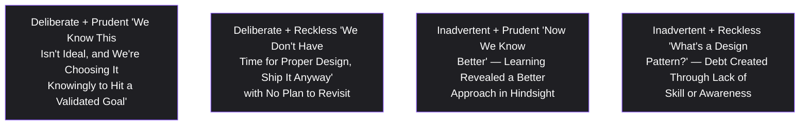
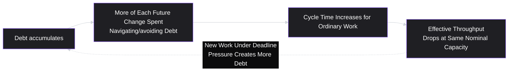
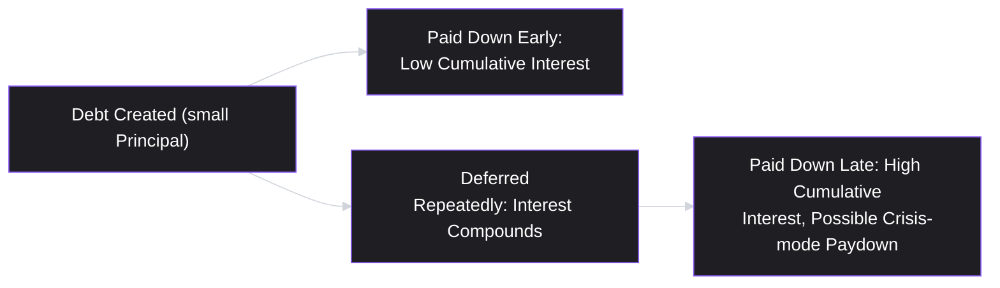

# Lesson 39: Technical Debt & PM Trade-offs

## Why This Lesson Matters

Lesson 37 introduced the Iron Triangle — scope, time, and quality/resources as interdependent dimensions of any piece of work — and noted that demanding all three stay fixed under pressure typically forces one to give way invisibly, most often quality, in the form of accumulating technical debt. This lesson makes that invisible trade-off visible and gives you the vocabulary and judgment to manage it deliberately, rather than letting it happen by default every time a deadline gets tight.

Technical debt is one of the most consequential, and most poorly understood, concepts a PM must reason about, precisely because its costs are deferred and often invisible until they compound into a real crisis — a team that once shipped quickly grinding to a near-halt, unable to explain exactly why every change now takes three times as long as it used to. A PM who doesn't understand technical debt will either resist all of it reflexively (starving a team of the deadline flexibility it sometimes genuinely needs) or accumulate it thoughtlessly (mortgaging future velocity for a short-term deadline win, over and over, until the mortgage comes due). This lesson teaches the more sophisticated middle position: technical debt, like financial debt, can be a legitimate and even wise tool when taken on deliberately and paid down intentionally — and a serious liability when taken on recklessly or ignored indefinitely.

---

## Learning Path

| Field | Detail |
|---|---|
| **Module** | 4 — Execution & Agile Delivery |
| **Current Lesson** | 39 of 90 |
| **Difficulty** | 5 / 10 |
| **Estimated Study Time** | 35 minutes (reading) + 15 minutes (reflection + quiz) |
| **Prerequisites** | Lesson 33 (Kanban Framework — Little's Law, flow), Lesson 37 (Working with Engineering Teams — Iron Triangle) |
| **Next Lesson** | Lesson 40 — Product Operations |
| **Future Topics Unlocked** | Lesson 40 (Product Operations), Lesson 41 (Product Metrics Fundamentals, which will help quantify debt's velocity impact), Lesson 55 (Building and Leading Product Teams) — all build on the debt-quadrant reasoning and paydown discipline introduced here |

---

## Learning Objectives

By the end of this lesson, you will be able to:

1. Define technical debt using its original financial metaphor, and explain both its "principal" and "interest" components.
2. Apply Martin Fowler's Technical Debt Quadrant (reckless/prudent × deliberate/inadvertent) to classify a given instance of technical debt.
3. Explain why unmanaged technical debt compounds over time, and connect this to Lesson 33's Little's Law reasoning about flow and cycle time.
4. Use a structured framework to decide when to pay down existing debt versus when to accept new debt in service of a deadline.
5. Advocate effectively for dedicated debt-paydown capacity within a Sprint or Kanban system, using language and reasoning that resonates with both engineering and non-technical stakeholders.

---

## Prerequisites

This lesson assumes **Lesson 33's** concept of flow and Little's Law, since technical debt's most direct symptom — a team's velocity or cycle time degrading over time despite constant effort — is best understood through that same flow-based lens. It also assumes **Lesson 37's** Iron Triangle, since this lesson is, in large part, a detailed treatment of what actually happens to the "quality" dimension when scope and time are held fixed under pressure.

---

## Theory

### The Financial Metaphor: Principal and Interest

The term "technical debt," coined by Ward Cunningham, deliberately borrows from finance. Taking on technical debt means choosing an expedient, faster implementation now, in exchange for owing a "principal" — the cost of eventually doing the more thorough, proper implementation — plus ongoing "interest": the extra cost, paid repeatedly on every future change, of working around the shortcut rather than having done it properly from the start. Just as with financial debt, taking some on deliberately, at a known and acceptable interest rate, in service of a genuine goal (hitting a critical market window, validating an idea before over-investing in it) can be a sound decision. Taking on debt recklessly, without tracking it, or never paying down principal while interest compounds, tends to end the same way financial over-leverage does: a crisis where a disproportionate share of new capacity goes toward simply servicing debt rather than producing new value.

### The Technical Debt Quadrant

Martin Fowler's widely referenced framework classifies technical debt along two independent dimensions: whether it was **deliberate** (a conscious trade-off) or **inadvertent** (not recognized as debt at the time it was created), and whether it was **reckless** or **prudent** (a sound decision given the information and constraints at the time):

The most important, and most frequently overlooked, quadrant is Deliberate + Prudent — the only quadrant where technical debt is being managed *well*. This is debt taken on consciously, with a clear understanding of the trade-off, ideally with an explicit plan for when and how the principal will be repaid. The other three quadrants each represent some form of dysfunction: reckless debt (whether deliberate or not) accumulates without any accounting for its eventual cost, and inadvertent debt, even when it stemmed from a reasonable decision given information available at the time, still needs to be recognized and addressed once better information (or better skill) becomes available — the fact that debt was created innocently doesn't make its ongoing interest cost any less real.

### Why Debt Compounds: The Flow Connection

Recall Lesson 33's Little's Law: Average WIP = Average Throughput × Average Cycle Time. Unmanaged technical debt directly degrades a team's effective throughput on new work, because an increasing share of every future change must first navigate, work around, or carefully avoid disturbing the fragile, poorly-structured code created by past shortcuts. This produces a specific, insidious dynamic: as debt accumulates, cycle time on ordinary work quietly increases, and the same nominal team capacity produces less and less real forward progress — often without anyone explicitly deciding to slow down, which is precisely what makes accumulating debt so easy to underestimate from a PM's vantage point, since no single decision along the way looks like the cause of the eventual crisis.

### Deciding When to Pay Down Debt vs. Take It On

A PM does not typically make the specific technical judgment of whether a given shortcut constitutes debt (that's engineering's domain, echoing Lesson 37's context-not-commands principle) — but a PM absolutely does own the trade-off judgment of whether taking on a known, well-understood piece of debt is worth it given the business context, and whether dedicating capacity to paying down existing debt is currently a higher priority than new feature work. A useful question set for that judgment:

1. Is the deadline this debt would help us hit genuinely fixed and consequential (a real market window, a contractual commitment), or is it an arbitrary internal target that could flex without real cost?
2. Do we have a credible, concrete plan for when and how the principal gets repaid, or is "we'll fix it later" functioning as a way of avoiding the decision rather than actually making one?
3. Is the affected code in a high-change-frequency area (where interest compounds quickly because it's touched often) or a stable, rarely-modified area (where interest accrues more slowly)?

---

## Common Beginner Mistakes

**Mistake 1: Treating all technical debt as uniformly bad and demanding it always be avoided**

As covered in Theory, Deliberate + Prudent debt is a legitimate and sometimes wise tool; reflexively refusing any shortcut under any circumstances can starve a team of flexibility it genuinely needs to hit a real, consequential deadline.

**Mistake 2: Treating all technical debt as acceptable simply because "we'll clean it up later."**

Without a credible, concrete plan and dedicated capacity, "later" routinely never arrives, and this vague deferral is often functionally identical to Deliberate + Reckless debt, regardless of the good intentions behind it.

**Mistake 3: Never allocating dedicated capacity to debt paydown, treating every Sprint as 100% new-feature capacity**

This guarantees debt only ever accumulates, since paydown never happens unless it's explicitly planned for — echoing this lesson's compounding-interest dynamic.

**Mistake 4: Assuming a PM should personally judge whether a specific technical shortcut constitutes "real" debt**

This is squarely engineering's domain, per Lesson 37's context-not-commands principle — the PM's job is the business trade-off judgment (is this deadline worth this cost), not the technical assessment of the shortcut's actual severity.

**Mistake 5: Waiting until a crisis (a "stabilization Sprint" or worse) to address debt, rather than paying it down incrementally**

Reactive, crisis-driven debt paydown is typically far more expensive and disruptive than steady, incremental paydown woven into ongoing Sprint capacity, because a crisis often requires halting new feature work entirely rather than simply allocating a modest, sustained share of capacity over time.

---

## Mental Model: The Debt Interest Curve

This lesson's core takeaway tool visualizes why early, small technical debt payments are dramatically cheaper than late, large ones:

Use the Debt Interest Curve whenever a paydown decision is being deprioritized "for now." The question isn't just "how bad is this debt today" — it's "how much more expensive will this same paydown be if we defer it again, given how frequently this code area is touched." A piece of debt in a rarely-touched, stable area may reasonably stay deferred indefinitely at low cost; a piece of debt in a high-change-frequency area compounds quickly, and repeated deferral there is a specific, avoidable form of the crisis this lesson warns against.

---

## Real Company Example

**LinkedIn**'s 2011 "Operation InVersion" is a specific, well-documented instance of this lesson's core trade-off, not just a general pattern. Shortly after LinkedIn's IPO, then-VP of Engineering Kevin Scott froze all new feature development company-wide for two months so the entire engineering organization could focus exclusively on overhauling the site's core computing architecture — including breaking apart a monolithic, failure-prone application (internally called "Leo") into smaller, independently deployable services. By Scott's own account, this was a genuinely difficult call to make so soon after going public, precisely because halting visible feature output in front of new public shareholders looked, on its face, like the wrong move.

The instructive part for this lesson is the trade-off's visibility: this wasn't debt paid down quietly alongside normal feature work — it was treated with the same seriousness, planning, and organizational commitment as a major product launch, made possible only because leadership was willing to accept zero feature output for two full months in exchange for a foundation that could support the company's next phase of growth.

*(Source: contemporaneous reporting, including a detailed Bloomberg Businessweek account, and later retrospective case studies of the initiative. This curriculum does not claim certainty about LinkedIn's current-day technical debt practices.)*

The underlying principle connects directly to this lesson's Theory: at sufficient scale, unmanaged technical debt's compounding interest can become large enough to justify a major, deliberate, and visible paydown investment — treated with the same seriousness and planning rigor as a significant new feature initiative, rather than as an afterthought squeezed into spare capacity.

*(Assumption flagged: this reflects general, publicly available descriptions of large-scale infrastructure investment discussed in engineering blog writing across the industry, including content associated with LinkedIn, not a confirmed, complete, or current account of LinkedIn's specific internal technical debt practices today. Specific practices evolve continuously at any company; the durable lesson is the underlying principle — debt paydown sometimes warrants major, deliberate investment at scale — rather than a claim about LinkedIn's exact current approach.)*

---

## Real World Perspective: Technical Debt & PM Trade-offs at Different Company Stages

**At a startup:**
Taking on significant technical debt is often a genuinely reasonable strategy, since validating whether an idea has any market fit at all is frequently more urgent than building a robust, scalable implementation of an idea that might get thrown away entirely. The risk is Mistake 2 — debt taken on reasonably during early validation is never revisited once the product finds traction, and the codebase's "prudent" early debt quietly becomes a serious liability as the company scales without ever having been consciously re-evaluated.

**At a mid-size company:**
Debt paydown typically needs to become a formalized, recurring practice — often through a fixed percentage of Sprint capacity dedicated to paydown work, or periodic dedicated "cleanup" Sprints — because informal, ad hoc paydown (relying on the team to squeeze it in whenever there's spare time) tends to consistently lose out to feature work under normal prioritization pressure.

**At Big Tech:**
Technical debt is often tracked and quantified explicitly, sometimes with dedicated tooling measuring code health metrics, and major paydown or re-architecture initiatives are planned and resourced with the same rigor as large feature launches, as in the Real Company Example above. The PM's job shifts toward advocating effectively for this investment in the same prioritization conversations (Lesson 29) used for feature work, translating engineering's technical debt concerns into business-relevant trade-off language that resonates with non-technical stakeholders and leadership.

---

## Detailed Case Study: The Sprint That Kept Getting Slower

Consider a simplified, illustrative scenario common at growing product teams under sustained feature-delivery pressure.

A team ships aggressively for several consecutive quarters, hitting an ambitious roadmap under real market pressure. Each Sprint, when a choice arises between the "proper" implementation and a faster shortcut, the team consistently chooses the shortcut, reasoning each time that the deadline pressure justifies it and that cleanup can happen "once things calm down." No dedicated paydown capacity is ever allocated, and no explicit tracking of accumulated debt occurs.

By the fourth quarter, the team's velocity — measured in the same story-point terms used throughout — has quietly dropped by nearly 40% compared to the first quarter, despite no change in team size or nominal effort. Simple features that once took two days now routinely take a week, because engineers must first carefully navigate several layers of prior shortcuts before making even a small change safely. Morale has declined noticeably; several engineers describe the codebase as "held together with tape." Leadership, seeing declining output, initially suspects a motivation or performance problem, since no single decision along the way was ever flagged as the cause of the slowdown.

**What went wrong?**

Using the Technical Debt Quadrant: much of this debt likely began as Deliberate + Prudent — reasonable shortcuts made consciously under real deadline pressure. But without ever tracking accumulated debt or allocating paydown capacity, it drifted, in practice, toward the functional equivalent of Deliberate + Reckless: repeated, unaccounted-for borrowing with no repayment plan, compounding exactly as the Debt Interest Curve predicts. Leadership's initial suspicion of a motivation problem was a natural, but mistaken, diagnosis — the actual cause was a steadily compounding interest payment being extracted from the team's nominal capacity on every single piece of new work, invisible in any single Sprint's numbers but glaring in aggregate over a year.

The recovery required exactly what should have happened incrementally all along: a multi-Sprint period explicitly dedicated to debt paydown, communicated to leadership using the same principal-and-interest framing this lesson provides, rather than vague engineering language about "cleanup" that non-technical stakeholders often struggle to prioritize against concrete feature requests. This translation skill — making a technical debt trade-off legible and compelling to non-technical stakeholders — is developed further in **Lesson 51 (Communicating with Executives)**, and the broader discipline of instrumenting and monitoring flow health at an organizational level, so this kind of slow-motion crisis is caught earlier next time, is covered in **Lesson 40 (Product Operations)**.

---

## Framework Explanation: The Debt Paydown Prioritization Table

A second, more tactical tool: when multiple technical debt items compete for limited paydown capacity, prioritize using this simple two-factor comparison, echoing standard prioritization logic (Lesson 29) applied specifically to debt.

| Factor | Question | High Priority Signal |
|---|---|---|
| Interest rate | How much does this debt slow down *ordinary, frequent* work in the affected area? | High-change-frequency code area, touched by many future features |
| Principal cost | How expensive is it to actually pay this debt down properly? | Relatively contained, well-understood fix (versus an open-ended, uncertain rework) |
| Business consequence of inaction | What happens if this specific debt is never addressed? | Risk of a customer-facing incident, security exposure, or the specific velocity-collapse dynamic from this lesson's Case Study |

Debt items scoring high on interest rate and business consequence, with a reasonably contained principal cost, represent the best return on limited paydown capacity — the technical debt equivalent of Lesson 29's value-versus-cost prioritization logic, applied specifically to the invisible, compounding cost of deferred cleanup rather than the visible cost of new feature work.

---

## Interview Perspective: How Interviewers Think About This

**Typical question 1: "How do you think about technical debt as a PM?"**
*What the interviewer is actually evaluating:* Whether the candidate understands debt as a legitimate, sometimes wise trade-off tool (echoing the Technical Debt Quadrant) rather than either uniformly opposing all debt or being naively unconcerned about it — testing for the nuanced middle position this lesson advocates.

**Typical question 2: "How would you convince leadership to allocate a Sprint (or several) to technical debt paydown instead of new features?"**
*What the interviewer is actually evaluating:* Whether the candidate can translate a technical concept into business-relevant trade-off language (principal, interest, compounding velocity loss) that resonates with non-technical stakeholders, rather than relying on engineering jargon alone.

**Typical question 3: "Tell me about a time your team's velocity unexpectedly declined. What did you investigate?"**
*What the interviewer is actually evaluating:* Whether the candidate's first instinct is to suspect technical debt and flow-related causes (echoing Lesson 33's Little's Law) rather than jumping straight to blaming team effort or motivation, mirroring this lesson's Case Study.

---

## Summary

Technical debt, borrowed from finance, describes the trade-off of choosing a faster, expedient implementation now in exchange for a "principal" (eventual proper implementation cost) plus ongoing "interest" (extra cost paid on every future change touching the affected area). Martin Fowler's Technical Debt Quadrant classifies debt along deliberate/inadvertent and reckless/prudent axes, with Deliberate + Prudent as the only quadrant representing well-managed debt — a conscious trade-off with a credible repayment plan. Unmanaged debt compounds over time in a way directly analogous to Lesson 33's Little's Law: as debt accumulates, an increasing share of future work is spent navigating past shortcuts, quietly degrading effective throughput even without any explicit decision to slow down — precisely the dynamic illustrated in this lesson's Case Study, where a team's velocity dropped nearly 40% over a year without any single visible cause. A PM's job is not to personally judge the technical severity of a given shortcut (that's engineering's domain, per Lesson 37), but to own the business trade-off judgment of when taking on new debt is worth it, and to advocate effectively — using principal-and-interest framing rather than engineering jargon — for dedicated paydown capacity before deferred debt compounds into a genuine crisis.

---

## Key Takeaways

- Technical debt's financial metaphor includes both a "principal" (eventual proper-implementation cost) and ongoing "interest" (extra cost on every future change touching the affected area) — both should factor into any trade-off decision.
- The Technical Debt Quadrant (deliberate/inadvertent × reckless/prudent) identifies Deliberate + Prudent as the only well-managed form of debt — a conscious trade-off with a credible repayment plan.
- Unmanaged debt compounds over time, degrading effective throughput even without any single visible decision to slow down, directly mirroring Lesson 33's Little's Law dynamics.
- A PM's role is the business trade-off judgment (is this deadline worth this cost, is paydown a higher priority than new features right now), not the technical assessment of a shortcut's severity, which remains engineering's domain.
- Debt in high-change-frequency code areas compounds faster and deserves higher paydown priority than debt in stable, rarely-touched areas.
- Reactive, crisis-driven debt paydown is typically far more expensive and disruptive than steady, incremental paydown woven into ongoing capacity.
- Translating technical debt into business-relevant, principal-and-interest language is often necessary to secure leadership buy-in for dedicated paydown capacity.

---

## Cheat Sheet

*A two-minute review of everything in this lesson.*

- **Principal + interest:** debt costs both an eventual fix and ongoing extra cost on every future touch.
- **Technical Debt Quadrant:** deliberate/inadvertent × reckless/prudent — only Deliberate + Prudent is well-managed.
- **Compounding:** unmanaged debt quietly degrades throughput over time (Little's Law-style dynamics).
- **PM's job:** business trade-off judgment (worth it? paydown priority?), not technical severity assessment.
- **Prioritize paydown by:** interest rate (change frequency) × principal cost × business consequence of inaction.
- **Pay down early, incrementally** — not reactively, in a crisis "stabilization Sprint."
- **Translate for leadership:** use principal/interest language, not engineering jargon, to secure paydown capacity.

---

## Glossary

| Term | Definition | Related Concepts | Difficulty |
|---|---|---|---|
| Technical debt | The cost of choosing a faster, expedient implementation now in exchange for eventual repayment plus ongoing extra cost | Principal, Interest | 1 |
| Principal (technical debt) | The eventual cost of properly implementing what was shortcut | Technical debt | 2 |
| Interest (technical debt) | The recurring extra cost paid on every future change that touches the affected area | Debt Interest Curve | 2 |
| Technical Debt Quadrant | Martin Fowler's framework classifying team-level technical debt trade-offs along deliberate/inadvertent and reckless/prudent axes. | Deliberate + Prudent debt | 2 |
| Debt Interest Curve | This lesson's mental model: early paydown is cheap, deferred paydown compounds and becomes expensive | Technical debt | 1 |
| Debt Paydown Prioritization | Ranking debt items by interest rate, principal cost, and business consequence of inaction | Lesson 29 prioritization | 2 |

---

## Further Reading / Resources

- "Technical Debt Quadrant" by Martin Fowler — the original articulation of the deliberate/inadvertent × reckless/prudent framework referenced in this lesson.
- *Working Effectively with Legacy Code* by Michael Feathers — a detailed engineering-side treatment of managing and paying down accumulated code debt.
- *Accelerate: The Science of Lean Software and DevOps* by Nicole Forsgren, Jez Humble, and Gene Kim — research connecting code health, deployment practices, and organizational performance.

---

## Flashcards

**Card 1**
- Front: What are the two cost components of technical debt, per its financial metaphor?
- Back: Principal (the eventual cost of the proper implementation) and interest (the ongoing extra cost paid on every future change touching the affected area).
- Difficulty: 1
- Tags: principal-interest

**Card 2**
- Front: What are the two axes of Martin Fowler's Technical Debt Quadrant?
- Back: Deliberate vs. inadvertent, and reckless vs. prudent.
- Difficulty: 1
- Tags: technical-debt-quadrant

**Card 3**
- Front: Which quadrant of the Technical Debt Quadrant represents well-managed debt, and why?
- Back: Deliberate + Prudent — a conscious trade-off made knowingly, ideally with a credible plan for eventual repayment.
- Difficulty: 2
- Tags: deliberate-prudent

**Card 4**
- Front: How does unmanaged technical debt connect to Lesson 33's Little's Law?
- Back: As debt accumulates, more of each future change is spent navigating past shortcuts, increasing cycle time and degrading effective throughput at the same nominal capacity — the same compounding dynamic Little's Law describes for excessive WIP.
- Difficulty: 2
- Tags: littles-law-connection

**Card 5**
- Front: Whose job is it to judge whether a specific technical shortcut constitutes "real" debt, and whose job is the trade-off decision?
- Back: Assessing technical severity is engineering's domain; the PM owns the business trade-off judgment of whether taking on or paying down debt is worth it given business context.
- Difficulty: 2
- Tags: roles

**Card 6**
- Front: In the Case Study, why did leadership initially suspect a motivation problem rather than technical debt?
- Back: No single decision along the way was ever flagged as a cause of the slowdown; the compounding interest cost was invisible in any single Sprint but glaring in aggregate over a year.
- Difficulty: 2
- Tags: case-study

**Card 7**
- Front: What three factors does the Debt Paydown Prioritization Table use to rank competing debt items?
- Back: Interest rate (change frequency of the affected area), principal cost (how expensive the fix is), and business consequence of inaction.
- Difficulty: 2
- Tags: prioritization

## Reflection Exercise

Consider the following novel scenario: You're a PM whose team is under pressure to ship a major feature before a competitor's announced launch date, which is genuinely fixed and consequential for the business. Engineering has proposed a faster implementation approach that would require a data model shortcut in a part of the codebase that many future features are likely to touch.

There is no single correct answer to the prompts below — the goal is to practice applying the Technical Debt Quadrant and paydown reasoning, not to reach one "right" answer.

1. Using this lesson's three-question framework, what would you want to know before deciding whether this debt is worth taking on?
2. Which quadrant of the Technical Debt Quadrant would this debt most likely fall into if the team proceeds with a clear, tracked repayment plan? What would push it toward a worse quadrant instead?
3. Given that the affected area is described as high-change-frequency, how should that affect your sense of urgency around eventually paying this debt down?
4. If you agree to take on this debt, what specific commitment would you want from engineering (and from yourself, as PM) to avoid it becoming indefinitely deferred?
5. How would you explain this trade-off to a non-technical executive who is only focused on hitting the competitive launch date?

---

## Quiz

**1. What are the two cost components of technical debt, per its financial metaphor?**
A) Interest and dividends
B) Principal and interest
C) Revenue and expense
D) Assets and liabilities

*Correct answer: B*
*Explanation: The Theory section defines technical debt's cost as principal (eventual proper-implementation cost) plus ongoing interest (extra cost on future changes).*
*Learning objective tested: #1*
*Difficulty: Easy*

---

**2. What are the two axes of the Technical Debt Quadrant?**
A) Cheap vs. expensive, and fast vs. slow
B) Deliberate vs. inadvertent, and reckless vs. prudent
C) Frontend vs. backend, and small vs. large
D) Scrum vs. Kanban, and Now vs. Later

*Correct answer: B*
*Explanation: The Theory section explicitly names these two axes as defining Fowler's Technical Debt Quadrant.*
*Learning objective tested: #2*
*Difficulty: Easy*

---

**3. Which quadrant of the Technical Debt Quadrant represents debt that is being managed well?**
A) Inadvertent + Reckless
B) Deliberate + Reckless
C) Deliberate + Prudent
D) All quadrants represent equally poor management

*Correct answer: C*
*Explanation: The Theory section identifies Deliberate + Prudent as the only quadrant representing well-managed debt — a conscious trade-off, ideally with a repayment plan.*
*Learning objective tested: #2*
*Difficulty: Easy*

---

**4. How does unmanaged technical debt typically affect a team's effective throughput over time, according to this lesson?**
A) It has no effect on throughput as long as team size stays constant
B) It quietly degrades throughput, since an increasing share of future work must navigate past shortcuts, increasing cycle time even without any explicit decision to slow down
C) It always increases throughput by simplifying future work
D) It only affects throughput if the team switches from Scrum to Kanban

*Correct answer: B*
*Explanation: The Theory section explains this compounding dynamic directly, connecting it to Lesson 33's Little's Law reasoning about cycle time and throughput.*
*Learning objective tested: #3*
*Difficulty: Easy*

---

**5. Whose responsibility is it, according to this lesson, to judge the technical severity of a specific code shortcut?**
A) The PM's, exclusively
B) Engineering's — the PM owns the business trade-off judgment, not the technical severity assessment
C) Sales leadership's
D) No one; technical debt severity cannot be assessed by anyone

*Correct answer: B*
*Explanation: Common Beginner Mistake #4 explicitly states that assessing a shortcut's technical severity is engineering's domain, echoing Lesson 37's context-not-commands principle, while the PM owns the business trade-off decision.*
*Learning objective tested: #4, #5*
*Difficulty: Easy*

---

**6. According to the Debt Paydown Prioritization Table, why does debt in a high-change-frequency code area deserve higher paydown priority than debt in a stable, rarely-touched area?**
A) High-change-frequency areas are always more expensive to fix
B) The interest cost compounds faster in areas touched often by future work, making the ongoing cost of leaving it unaddressed higher
C) Stable areas never accumulate any technical debt
D) There is no difference in priority based on change frequency

*Correct answer: B*
*Explanation: The Framework Explanation section explains that interest rate — how much a debt slows down frequent, ordinary work — is a key prioritization factor, and high-change-frequency areas compound interest faster.*
*Learning objective tested: #4*
*Difficulty: Easy*

---

**7. In the Detailed Case Study, why did leadership initially suspect a motivation or performance problem rather than technical debt?**
A) The engineers explicitly told leadership they were unmotivated
B) No single decision along the way was flagged as the cause of the slowdown, since the compounding interest cost was invisible in any single Sprint but glaring only in aggregate over time
C) The team had switched frameworks from Scrum to Kanban
D) Leadership had no visibility into the team's Sprint reports at all

*Correct answer: B*
*Explanation: The Case Study explicitly describes this as the reason for leadership's mistaken initial diagnosis — the compounding cost was invisible Sprint-to-Sprint.*
*Learning objective tested: #3*
*Difficulty: Medium*

---

**8. Why does this lesson caution against treating "we'll clean it up later" as a sufficient plan for technical debt?**
A) Because cleanup should always happen immediately, with zero exceptions
B) Because without a credible, concrete plan and dedicated capacity, "later" often never arrives, functioning as de facto Deliberate + Reckless debt regardless of good intentions
C) Because engineering teams are never willing to do cleanup work
D) Because this violates the Scrum Guide directly

*Correct answer: B*
*Explanation: Common Beginner Mistake #2 explicitly describes this exact dynamic — vague deferral without a real plan tends to function as reckless debt in practice.*
*Learning objective tested: #4*
*Difficulty: Medium*

---

**9. Why is reactive, crisis-driven debt paydown typically more expensive than steady, incremental paydown?**
A) Because crisis-driven paydown always involves hiring new staff
B) Because a crisis often requires halting new feature work entirely, rather than simply allocating a modest, sustained share of capacity over time as debt is created
C) Because incremental paydown is always slower than crisis paydown
D) There is no cost difference between the two approaches

*Correct answer: B*
*Explanation: Common Beginner Mistake #5 explains that reactive paydown, often requiring a full halt to feature work, tends to be far more disruptive and costly than steady, incremental paydown.*
*Learning objective tested: #4*
*Difficulty: Medium*

---

**10. (Scenario) A team takes on a data-model shortcut to hit a genuinely fixed, consequential competitive deadline, with an explicit, tracked plan for repaying it within two Sprints after launch. Using the Technical Debt Quadrant, how would this debt most likely be classified, assuming the plan is followed?**
A) Inadvertent + Reckless
B) Deliberate + Prudent
C) Inadvertent + Prudent
D) This cannot be classified using the Technical Debt Quadrant

*Correct answer: B*
*Explanation: A conscious trade-off (deliberate) made with a credible, tracked repayment plan in service of a real deadline (prudent) is a textbook example of Deliberate + Prudent debt.*
*Learning objective tested: #2, #4*
*Difficulty: Medium-Hard*

---

**11. (Interview Reasoning) A candidate is asked "how do you think about technical debt as a PM?" and answers: "I try to avoid it entirely — any shortcut is a bad idea." Based on this lesson's Interview Perspective section, what is the weakness in this answer?**
A) There is no weakness; all technical debt should always be avoided
B) It fails to recognize that Deliberate + Prudent debt can be a legitimate, sometimes wise trade-off tool, reflecting an overly rigid rather than nuanced understanding of the concept
C) It correctly reflects the only defensible position on technical debt
D) It shows strong technical expertise

*Correct answer: B*
*Explanation: The Interview Perspective section states that a nuanced answer recognizes debt as a legitimate trade-off tool in some cases, rather than uniformly opposing it, which this answer fails to do.*
*Learning objective tested: #2, #4*
*Difficulty: Hard*

---

**12. Why does this lesson recommend translating technical debt into "principal and interest" language when advocating to non-technical leadership?**
A) Because leadership only understands financial terminology and nothing else
B) Because this framing makes an otherwise abstract, engineering-jargon-heavy concept legible and compellingly comparable to other business trade-offs leadership already reasons about
C) Because engineering teams require this specific language to do their jobs
D) Because this framing is required by the Scrum Guide

*Correct answer: B*
*Explanation: The Case Study and Interview Perspective both recommend this translation specifically because it makes the trade-off legible and comparable to trade-offs leadership already understands, rather than relying on engineering jargon.*
*Learning objective tested: #5*
*Difficulty: Medium-Hard*

---

**13. (Product Thinking) A team has two competing technical debt items: Item A affects a rarely-touched legacy reporting module and would take significant effort to fix; Item B affects a core, frequently-modified checkout flow and would take modest effort to fix. Using the Debt Paydown Prioritization Table, which item most likely deserves priority for limited paydown capacity?**
A) Item A, because it has existed longer
B) Item B, because it combines a high interest rate (frequently touched) with a lower principal cost (modest effort), likely a stronger return on limited paydown capacity than Item A's high-effort fix in a rarely-touched area
C) Neither item should ever be prioritized over new feature work
D) Item A, because legacy code should always be addressed first regardless of context

*Correct answer: B*
*Explanation: This directly applies the Debt Paydown Prioritization Table's logic — high interest rate and lower principal cost together suggest a stronger return on paydown investment than a high-effort fix in a low-interest area.*
*Learning objective tested: #4*
*Difficulty: Hard*

---

**14. Why does this lesson describe the Deliberate + Prudent quadrant as requiring "a credible plan for eventual repayment," rather than simply requiring the decision to be conscious?**
A) Because a conscious decision alone, without any repayment plan, risks drifting into the same functional outcome as reckless, unaccounted-for debt, as shown in the Case Study
B) Because repayment plans are legally required for all technical decisions
C) Because engineering always insists on a repayment plan before agreeing to any shortcut
D) Because "conscious" and "prudent" mean exactly the same thing in this framework

*Correct answer: A*
*Explanation: The Theory section explicitly notes that even deliberate debt without a real repayment plan risks functioning like reckless debt in practice — consciousness alone isn't sufficient for prudent management.*
*Learning objective tested: #2, #4*
*Difficulty: Medium-Hard*

---

**15. (Product Thinking, Highest Difficulty) A PM is asked by leadership to justify dedicating an entire upcoming Sprint to technical debt paydown instead of new features, with no specific customer-facing deliverable to show for it. Using this lesson's frameworks, what is the most defensible way to make this case?**
A) Simply assert that "engineering says we need it," without further explanation
B) Frame the request using principal-and-interest language, citing specific evidence of compounding cycle-time increases or velocity decline (echoing the Case Study), and connect the investment to future feature delivery capacity rather than treating it as unrelated to business goals
C) Avoid raising the topic with leadership entirely, and quietly ask engineering to squeeze in paydown work informally
D) Argue that all technical debt is inherently unacceptable and should never have been allowed to accumulate in the first place

*Correct answer: B*
*Explanation: This combines the lesson's core translation principle (principal/interest framing) with concrete evidence (the Case Study's velocity-decline pattern) to make a business case that connects debt paydown directly to future delivery capacity, rather than treating it as a disconnected or purely technical concern.*
*Learning objective tested: #5*
*Difficulty: Hard*

---

## Connections

| | Lesson | Core Idea Carried Forward |
|---|---|---|
| **Previous Lesson** | Lesson 38 — Working with Design Teams | Both lessons apply a "sequence investment to actual validation/necessity" principle — premature high-fidelity design and reckless technical debt are structurally similar mistakes |
| **Current Lesson** | Lesson 39 — Technical Debt & PM Trade-offs | Principal and interest; Technical Debt Quadrant; Debt Interest Curve; Debt Paydown Prioritization Table |
| **Next Lesson** | Lesson 40 — Product Operations | Addresses how flow health, including debt-related velocity decline, is instrumented and monitored at an organizational level |
| **Future Concepts Unlocked** | Lesson 41 (Product Metrics Fundamentals) | Provides the quantitative tools needed to actually measure debt's velocity impact rigorously, rather than relying on impression alone |
| | Lesson 55 (Building and Leading Product Teams) | Builds on this lesson's paydown-advocacy skill when structuring how a team balances feature work and health investment long-term |

This curriculum is designed to be read as one continuous argument, not ninety independent articles. Every lesson from here forward will assume you carry the Technical Debt Quadrant and the principal/interest framing with you — they will not be re-explained, only re-applied in new contexts.
