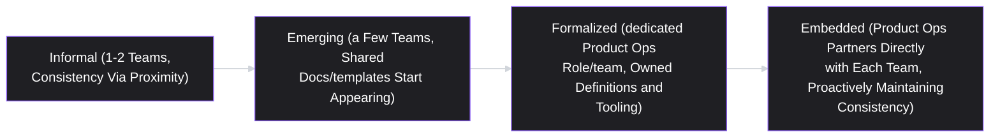
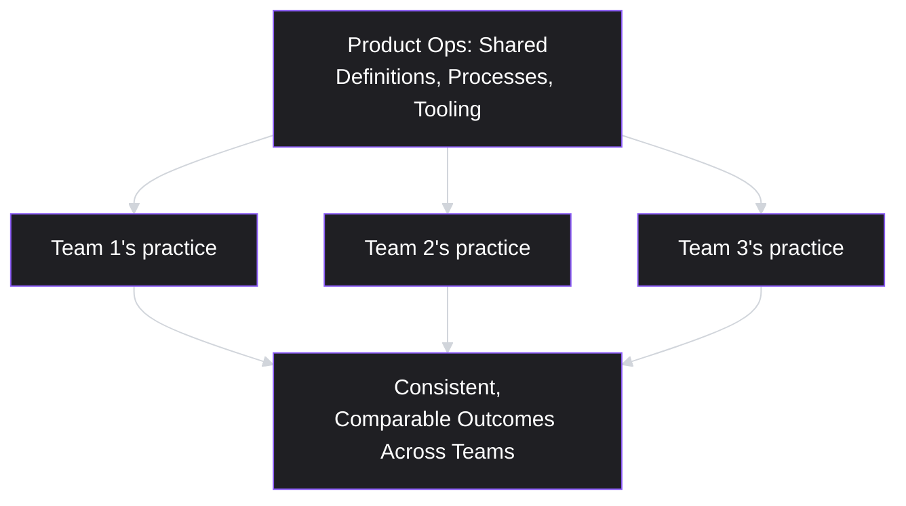

# Lesson 40: Product Operations

## Why This Lesson Matters

Every lesson in this module so far — Agile fundamentals, Scrum, Kanban, Sprint Planning, Roadmapping, Release Management, working with engineering and design, and technical debt — has been framed at the level of a single PM working with a single team. This closing lesson of Module 4 addresses what happens to all of that practice once an organization grows to have many teams, many PMs, and many roadmaps running simultaneously: the informal consistency that exists naturally in a small organization (everyone roughly agrees on what "active user" means, everyone launches features roughly the same way) stops happening automatically, and something has to actively maintain it. That something is **Product Operations**.

Product Operations (Product Ops) is a relatively newer discipline in most product organizations, and is frequently misunderstood — sometimes dismissed as pure bureaucracy, sometimes over-relied upon as a substitute for good individual PM judgment. This lesson positions it correctly: as a multiplier layer that makes every other practice in this module scale — consistent metric definitions, shared launch processes, standardized research infrastructure — freeing individual PMs to spend their time on judgment-heavy work (prioritization, strategy, stakeholder trust) rather than reinventing basic infrastructure and definitions independently, team by team.

---

## Learning Path

| Field | Detail |
|---|---|
| **Module** | 4 — Execution & Agile Delivery |
| **Current Lesson** | 40 of 90 |
| **Difficulty** | 4 / 10 |
| **Estimated Study Time** | 30 minutes (reading) + 15 minutes (reflection + quiz) |
| **Prerequisites** | Lesson 33 (Kanban Framework — flow metrics), Lesson 36 (Release Planning & Launch Management — launch tiers), Lesson 39 (Technical Debt & PM Trade-offs — organizational-scale investment) |
| **Next Lesson** | Lesson 41 — Product Metrics Fundamentals (opening Module 5) |
| **Future Topics Unlocked** | Lesson 41 (Product Metrics Fundamentals, which depends on the standardized definitions this lesson introduces), Lesson 47 (Stakeholder Management), Lesson 55 (Building and Leading Product Teams) — all build on the standardization and multiplier-layer thinking introduced here |

---

## Learning Objectives

By the end of this lesson, you will be able to:

1. Define Product Operations and explain the specific organizational problem it exists to solve as companies scale beyond a single team.
2. Identify the core functional areas Product Ops typically owns: metric definition standardization, process/ritual consistency, research operations, and launch coordination infrastructure.
3. Explain why inconsistent metric definitions across teams create organizational confusion, and connect this to Lesson 41's upcoming metrics content.
4. Apply a maturity framework to assess how much formal Product Ops investment a given organization actually needs at its current size.
5. Distinguish Product Ops as a genuine multiplier of good PM practice from Product Ops as a bureaucratic substitute for individual PM judgment.

---

## Prerequisites

This lesson assumes familiarity with **Lesson 33's** flow metrics (cycle time, throughput) and **Lesson 36's** launch tiering system, since two of Product Ops' core functions are standardizing exactly these kinds of definitions and processes across many teams at once, rather than each team defining and running them independently. It also assumes **Lesson 39's** organizational-scale investment reasoning, since Product Ops itself represents a similar kind of deliberate, scale-driven investment — in this case, in shared infrastructure and consistency rather than code health specifically.

---

## Theory

### The Problem Product Ops Exists to Solve

In a small organization with one or two product teams, consistency across teams is nearly automatic — everyone works closely enough together that shared definitions, shared processes, and shared tooling emerge organically through simple proximity and conversation. As an organization grows to many teams, each with its own PM, this informal consistency breaks down: without deliberate effort, one team's PM defines "active user" one way for their dashboard, while another team's PM defines it slightly differently for theirs, and a company-wide metrics review becomes an exercise in reconciling numbers that were never actually comparable in the first place. Similarly, one team's launch process might include a rollback plan and staged rollout by habit, while another team, staffed by PMs without that specific habit, skips both — not out of negligence, but simply because no shared standard exists to make the practice consistent across the organization.

Product Operations exists specifically to solve this class of problem: it is the function responsible for building and maintaining the shared infrastructure, definitions, and processes that let good practices (like the ones covered throughout this module) scale consistently across many teams, rather than depending entirely on each individual PM independently reinventing or remembering to apply them.

### Core Functional Areas

Product Ops commonly owns some combination of the following, though the specific scope varies by organization:

| Functional Area | What It Standardizes |
|---|---|
| Metric definitions | Ensuring "active user," "conversion," "retention," and similar terms mean the same thing across every team's dashboards and reports |
| Process and ritual consistency | Ensuring Sprint ceremonies (Lesson 32), launch tiering (Lesson 36), and similar practices are applied consistently, without each team reinventing them from scratch |
| Research operations | Managing shared infrastructure for user research — participant recruiting panels, research repositories, scheduling tooling — so individual PMs and researchers aren't each rebuilding this infrastructure independently |
| Launch coordination infrastructure | Providing the shared tooling and checklists (echoing Lesson 36's Launch Readiness Checklist) that make cross-functional launch coordination consistent and repeatable across teams |
| Tooling and data infrastructure | Selecting, maintaining, and training teams on the shared analytics, roadmapping, and backlog tools used organization-wide |

### Why Inconsistent Metric Definitions Specifically Matter

Of everything Product Ops typically owns, inconsistent metric definitions deserve particular emphasis, because they cause a specific, insidious organizational failure: leadership reviewing numbers from multiple teams, each computed under a subtly different definition, without realizing the numbers aren't actually comparable. A company-wide "active users" figure assembled by summing five teams' individually-defined "active user" counts may look precise and authoritative while being, in a meaningful sense, meaningless — because the underlying term was never actually standardized. This exact problem is the reason **Lesson 41 (Product Metrics Fundamentals)**, immediately following this lesson, opens Module 5 by establishing precise, shared definitions before any specific metric framework is introduced — Product Ops is the organizational function responsible for ensuring those shared definitions, once established, actually get used consistently across every team going forward, rather than drifting back into inconsistency over time.

### A Maturity Ladder for Product Ops Investment

Not every organization needs the same level of formal Product Ops investment, and over-investing prematurely can itself become a form of bureaucratic drag:

An organization at the "Informal" stage attempting to build a fully "Embedded" Product Ops function is very likely over-investing relative to its actual coordination needs; conversely, an organization well past the "Emerging" stage, with dozens of teams and PMs, relying entirely on informal proximity to maintain consistency, is very likely under-investing and will experience exactly the metric-definition and process-drift problems described above.

---

## Common Beginner Mistakes

**Mistake 1: Treating Product Ops as pure bureaucratic overhead with no real value**

As covered in Theory, Product Ops exists to solve a genuine coordination problem that emerges predictably as organizations scale — dismissing it entirely tends to produce exactly the metric-inconsistency and process-drift failures this lesson describes, discovered painfully once the organization is large enough for them to matter.

**Mistake 2: Over-investing in formal Product Ops infrastructure at a stage where informal proximity still works fine**

A two-team organization building an elaborate, fully-staffed Product Ops function is very likely solving a coordination problem that doesn't yet exist at meaningful scale, at real opportunity cost to actually building product.

**Mistake 3: Treating Product Ops as a substitute for individual PM judgment rather than a multiplier of it**

Product Ops standardizes definitions, processes, and infrastructure — it does not, and should not, make prioritization or strategic decisions on behalf of individual PMs. An organization that routes genuine product judgment calls through Product Ops has confused a support function with a decision-making one.

**Mistake 4: Allowing metric definitions to drift back into inconsistency after initial standardization**

Standardizing a definition once is necessary but not sufficient; without ongoing maintenance (new teams onboarding, new metrics being introduced), definitions tend to drift back toward inconsistency over time, echoing the same "doing it once isn't enough" lesson seen with retrospective action items in Lesson 32.

**Mistake 5: Assuming Product Ops responsibilities must be held by a dedicated, separately-titled team**

In smaller or "Emerging"-stage organizations, Product Ops functions are often handled by an individual PM or a rotating responsibility rather than a dedicated team — the functional need for consistency exists at any scale beyond a single team, even before an organization formally names or staffs a Product Ops function.

---

## Mental Model: The Multiplier Layer

This lesson's core takeaway tool visualizes Product Ops not as a team that does product work itself, but as an underlying layer that multiplies the effectiveness of every product team's individual practice:

Use the Multiplier Layer as a diagnostic whenever evaluating a proposed Product Ops initiative: does this genuinely multiply good practice across many teams (a shared metric definition, a shared launch checklist template), or does it attempt to make product decisions on individual teams' behalf (Mistake 3)? The former is Product Ops functioning correctly; the latter is a category error that tends to produce resentment and disengagement from PMs who feel their judgment has been displaced rather than supported.

---

## Real Company Example

**Booking.com** is one of the most concretely documented illustrations available of shared experimentation infrastructure as Product Ops. The company runs over 1,000 controlled experiments concurrently at any given moment (an estimated 25,000+ per year), according to Harvard Business Review's case study and public statements from the company's own experimentation leadership, including former Director of Experimentation Lukas Vermeer. That scale is only possible because of centrally built, standardized infrastructure: any employee can propose and launch an experiment without needing management pre-approval, but every experiment runs through the same shared platform, the same statistical rigor, and the same standardized reporting form (recording the experiment's name, purpose, hypothesis, and prior related tests) — precisely the kind of shared tooling and consistent definitions this lesson identifies as the core value a mature Product Ops function provides.

The instructive detail is what the shared infrastructure actually buys the organization: without it, "anyone can test anything" would produce chaos — inconsistent methodology, duplicated effort, and results nobody could trust or compare. With it, decentralized experimentation and centralized rigor coexist, which is the specific trade-off Product Ops is meant to resolve.

*(Source: Harvard Business Review's 2020 case study "Building a Culture of Experimentation" and public talks by Booking.com's own experimentation and design leadership.)*

The underlying principle connects directly to this lesson's Theory: building shared, standardized tooling and definitions once, centrally, and making them available to every team, avoids the wasteful and confusion-generating alternative of each team independently building its own version of the same underlying infrastructure with its own subtly different definitions.

*(Assumption flagged: this reflects general, publicly available descriptions of internal data and experimentation infrastructure discussed in Airbnb's engineering blog writing over time, not a confirmed, complete, or current account of Airbnb's specific internal Product Ops organization or practices today. Specific organizational structures and tooling evolve continuously at any company; the durable lesson is the underlying principle — shared, centrally-built infrastructure and definitions avoid wasteful, inconsistent duplication across teams — rather than a claim about Airbnb's exact current setup.)*

---

## Real World Perspective: Product Operations at Different Company Stages

**At a startup:**
Formal Product Ops essentially doesn't exist as a named function, and doesn't need to — with one or two teams, consistency happens naturally through proximity, exactly as the Maturity Ladder's "Informal" stage describes. The risk here is Mistake 2's mirror image not applying yet, but teams should stay alert to the point where growth starts to strain this informal consistency, rather than being caught by surprise once it does.

**At a mid-size company:**
This is typically the stage where Product Ops functions first emerge, often informally at first — a shared metrics glossary document, a standard launch checklist template, a common backlog tool rollout — frequently owned by an individual PM or analytics lead as a partial responsibility, rather than a fully dedicated team. This is the "Emerging" stage of the Maturity Ladder, and getting the timing right (not too early, not too late) is a genuinely difficult judgment call.

**At Big Tech:**
Product Ops is frequently a fully dedicated, staffed function with its own leadership, embedded liaisons supporting individual product teams, and significant ownership of shared tooling, metric governance, and research infrastructure at the "Embedded" stage of the Maturity Ladder. The PM's job shifts toward effectively partnering with Product Ops — using its shared infrastructure and definitions rather than reinventing them independently — while still recognizing where Product Ops' role ends and the PM's own judgment-based decisions begin (Mistake 3).

---

## Detailed Case Study: The Five Different Definitions of "Active User"

Consider a simplified, illustrative scenario common at organizations experiencing rapid team growth without corresponding investment in shared infrastructure.

A company grows from three product teams to twelve over roughly two years, with each new team's PM independently building their own dashboards and defining their own metrics as needed, without any central coordination. At a company-wide quarterly business review, the CEO asks for a single, company-wide "monthly active users" figure. Compiling it reveals that the twelve teams are using five meaningfully different definitions of "active" — some counting any login, some requiring a specific core action, some using a 30-day window, others a 7-day window — several of which were chosen for good, locally reasonable reasons specific to each team's own feature, with no team aware that other teams had defined the same-sounding term differently.

Reconciling a genuinely comparable, company-wide figure takes the analytics team nearly two weeks of retroactive data reconciliation, and even then, several historical trends can't be meaningfully compared across teams because the underlying raw data needed to recompute a consistent definition retroactively was never captured in the first place for some teams.

**What went wrong?**

Using the Multiplier Layer mental model: no shared layer existed to standardize this foundational definition before each team's practice diverged independently. Each individual team's choice was locally reasonable — this is not a story of any single PM behaving carelessly — but the absence of any centrally maintained, shared standard meant twelve locally reasonable decisions compounded into an organization-wide inconsistency that took significant retroactive effort to even partially untangle, and some of that untangling proved permanently impossible due to uncaptured raw data.

The fix, going forward, required exactly what this lesson's Theory describes: a small, centrally-owned Product Ops function (in this case, initially just one analytics-minded PM taking on the responsibility part-time) establishing and publishing a single, precise definition of "active user" — the specific kind of definitional work covered in depth in **Lesson 41 (Product Metrics Fundamentals)** — along with a lightweight process for any team proposing a new metric to check it against the shared glossary first, preventing this same divergence from recurring as the company continued to grow. The broader organizational challenge of getting twelve independent teams to actually adopt a newly standardized definition, rather than quietly continuing to use their own, is a specific instance of the influence-without-authority challenge covered in **Lesson 53 (Negotiation & Influence Without Authority)**.

---

## Framework Explanation: The Product Ops Investment Checklist

A second, more tactical tool: use this checklist to decide whether a specific area genuinely needs formal Product Ops investment right now, or can reasonably remain informal a while longer.

| Question | "Yes" Suggests Investment Is Warranted |
|---|---|
| Are multiple teams currently defining the same core term or metric differently? | Standardize the definition centrally before further divergence compounds |
| Has a cross-team launch or process failure occurred recently due to inconsistent practice? | Formalize a shared checklist or process template |
| Are individual teams independently building similar research or data infrastructure? | Consolidate into a shared, centrally-maintained tool |
| Would fixing this problem retroactively, after further growth, be significantly more expensive than fixing it now? | Prioritize proactive investment, echoing Lesson 39's Debt Interest Curve logic applied to organizational process rather than code |

A "yes" across several of these questions signals that informal, proximity-based consistency has already broken down or is close to doing so — the same principle underlying this lesson's Case Study, where retroactive reconciliation proved far more costly than proactive standardization would have been.

---

## Interview Perspective: How Interviewers Think About This

**Typical question 1: "What is Product Operations, and when does an organization actually need it?"**
*What the interviewer is actually evaluating:* Whether the candidate understands Product Ops as solving a genuine, scale-dependent coordination problem (echoing the Maturity Ladder) rather than either dismissing it as unnecessary bureaucracy or assuming every organization needs a fully dedicated function regardless of size.

**Typical question 2: "Tell me about a time inconsistent processes or definitions across teams caused a real problem. How was it resolved?"**
*What the interviewer is actually evaluating:* Whether the candidate can identify the specific organizational failure mode (metric drift, process inconsistency) and describe a concrete standardization fix, mirroring this lesson's Case Study.

**Typical question 3: "How do you make sure Product Ops supports PM judgment rather than replacing it?"**
*What the interviewer is actually evaluating:* Whether the candidate understands the Multiplier Layer distinction — Product Ops should standardize shared infrastructure and definitions, not make product decisions on individual teams' behalf, directly testing awareness of Mistake 3.

---

## Summary

Product Operations exists to solve a specific, predictable organizational problem: the informal consistency that exists naturally in a small organization — shared metric definitions, shared launch practices, shared research infrastructure — breaks down as an organization grows to many teams and PMs, unless something actively maintains it. Product Ops commonly owns metric definition standardization, process and ritual consistency, research operations infrastructure, launch coordination tooling, and shared analytics/roadmapping tooling — functioning, per this lesson's Multiplier Layer mental model, as a layer that multiplies the effectiveness of every individual team's practice rather than a team that makes product decisions itself. Inconsistent metric definitions specifically deserve emphasis, since they produce a particularly insidious failure — leadership reviewing numbers that look precise and comparable across teams while actually being computed under meaningfully different definitions, as illustrated in this lesson's Case Study of an organization discovering five different definitions of "active user" only when a company-wide figure was requested. A Product Ops Maturity Ladder helps calibrate how much formal investment is actually warranted at a given organization's size — over-investing prematurely wastes effort on coordination problems that don't yet exist, while under-investing past the point of real need reliably produces costly, retroactive reconciliation problems.

---

## Key Takeaways

- Product Ops exists because informal, proximity-based consistency across teams (shared definitions, processes, infrastructure) breaks down predictably as an organization scales beyond a small number of teams.
- Core Product Ops functional areas typically include metric definition standardization, process/ritual consistency, research operations infrastructure, launch coordination tooling, and shared analytics/roadmapping tools.
- Inconsistent metric definitions across teams create a particularly insidious failure: numbers that look precise and comparable while actually being computed under different underlying definitions.
- A Product Ops Maturity Ladder (Informal → Emerging → Formalized → Embedded) helps calibrate the right level of investment for an organization's actual current scale, avoiding both premature over-investment and costly under-investment.
- Product Ops should function as a multiplier of good individual PM practice — standardizing shared infrastructure and definitions — not as a substitute for PM judgment on genuine prioritization or strategic decisions.
- Standardizing a definition once is necessary but not sufficient; without ongoing maintenance, definitions and processes tend to drift back toward inconsistency as an organization continues to grow.
- Fixing inconsistency proactively, before it compounds, is typically far cheaper than retroactive reconciliation after significant growth — mirroring Lesson 39's Debt Interest Curve logic applied to organizational process rather than code.

---

## Cheat Sheet

*A two-minute review of everything in this lesson.*

- **Product Ops exists because:** informal cross-team consistency breaks down as an organization scales past a few teams.
- **Core functions:** metric definitions, process/ritual consistency, research ops, launch coordination infrastructure, shared tooling.
- **Multiplier Layer:** Product Ops multiplies good practice across teams; it should not replace individual PM judgment.
- **Maturity Ladder:** Informal → Emerging → Formalized → Embedded — match investment to actual organizational scale.
- **Inconsistent metric definitions:** the specific, insidious failure of numbers that look comparable but aren't.
- **Standardize proactively:** retroactive reconciliation (after growth) is far more expensive than early, deliberate standardization.
- **Watch for drift:** standardizing once isn't enough; definitions and processes need ongoing maintenance as organizations keep growing.

---

## Glossary

| Term | Definition | Related Concepts | Difficulty |
|---|---|---|---|
| Product Operations (Product Ops) | The function responsible for building and maintaining shared definitions, processes, and infrastructure that let good product practices scale consistently across many teams | Multiplier Layer | 1 |
| Multiplier Layer | This lesson's mental model: Product Ops as a layer multiplying individual teams' effectiveness, not a decision-making substitute for PM judgment | Product Ops | 2 |
| Product Ops Maturity Ladder | A framework (Informal → Emerging → Formalized → Embedded) for calibrating how much formal Product Ops investment an organization actually needs | — | 2 |
| Metric Definition Drift | The silent, gradual divergence between a metric's original intended meaning and what it has come to actually measure, often caused by local code changes, new feature launches, or migrations. | Lesson 41 (Product Metrics Fundamentals) | 2 |

---

## Further Reading / Resources

- *Product Operations: How Successful Companies Build Better Products at Scale* by Melissa Perri and Denise Tilles — a dedicated treatment of the Product Ops discipline and its core functional areas.
- "What Is Product Ops?" — Product-Led Alliance and related practitioner community writing on Product Ops maturity stages and common organizational patterns.
- *Escaping the Build Trap* by Melissa Perri — situates Product Ops within the broader discipline of organizational product management maturity, revisited from this lesson's Lesson 35 reference.

---

## Flashcards

**Card 1**
- Front: What specific organizational problem does Product Ops exist to solve?
- Back: The informal consistency (shared definitions, processes, infrastructure) that exists naturally in a small organization breaks down as it scales to many teams and PMs, unless something actively maintains it.
- Difficulty: 1
- Tags: product-ops-purpose

**Card 2**
- Front: Name Product Ops' typical core functional areas.
- Back: Metric definition standardization, process/ritual consistency, research operations infrastructure, launch coordination tooling, and shared analytics/roadmapping tooling.
- Difficulty: 1
- Tags: core-functions

**Card 3**
- Front: What is the Multiplier Layer mental model's key distinction?
- Back: Product Ops should multiply the effectiveness of individual teams' good practice through shared infrastructure and definitions — it should not replace individual PM judgment on genuine prioritization or strategic decisions.
- Difficulty: 2
- Tags: multiplier-layer

**Card 4**
- Front: What are the four stages of the Product Ops Maturity Ladder?
- Back: Informal (consistency via proximity), Emerging (shared docs/templates appear), Formalized (dedicated role/team), Embedded (proactive team-level partnership).
- Difficulty: 2
- Tags: maturity-ladder

**Card 5**
- Front: Why are inconsistent metric definitions across teams a particularly insidious problem?
- Back: They produce numbers that look precise and comparable across teams while actually being computed under meaningfully different underlying definitions, misleading anyone reviewing them without realizing it.
- Difficulty: 2
- Tags: metric-inconsistency

**Card 6**
- Front: In the Detailed Case Study, why couldn't some historical trends be reconciled even after standardizing a definition?
- Back: The underlying raw data needed to retroactively recompute a consistent definition had never been captured in the first place for some teams, making full retroactive reconciliation permanently impossible for that data.
- Difficulty: 2
- Tags: case-study

## Reflection Exercise

Consider the following novel scenario: You're a PM at a company that has just grown from four product teams to nine over the past year. You've noticed that two teams use completely different tools for tracking their backlogs, three teams have slightly different definitions of what counts as a "critical" bug, and no shared launch checklist exists company-wide — each team follows its own informal habits.

There is no single correct answer to the prompts below — the goal is to practice applying the Maturity Ladder and Investment Checklist, not to reach one "right" answer.

1. Using the Product Ops Maturity Ladder, which stage does this organization appear to be at right now, and what evidence from the scenario supports that assessment?
2. Using the Product Ops Investment Checklist, which of the three issues described (backlog tools, "critical" bug definitions, launch checklists) would you prioritize addressing first, and why?
3. Is a fully dedicated, staffed Product Ops team the right level of investment for this organization right now, or would a lighter-weight approach be more appropriate? Justify your answer.
4. If you take on part of this responsibility yourself as a PM, how would you avoid drifting into Mistake 3 (Product Ops substituting for individual PM judgment) while still standardizing what genuinely needs standardizing?
5. What would you want to check again in a year to confirm the standardization you put in place hasn't drifted back into inconsistency?

---

## Quiz

**1. What specific organizational problem does Product Operations exist to solve?**
A) The need for a single company-wide programming language
B) The need to eliminate all Agile ceremonies
C) Informal, proximity-based consistency breaking down at scale
D) The need for additional engineering headcount overall

*Correct answer: C*
*Explanation: Product Ops exists to solve this specific scale-driven consistency problem.*
*Learning objective tested: #1*
*Difficulty: Easy*

---

**2. Which of the following is NOT typically a core functional area of Product Ops?**
A) Setting individual teams' feature prioritization calls
B) Standardizing metric definitions across teams
C) Launch coordination infrastructure and checklists
D) Research operations infrastructure and tooling

*Correct answer: A*
*Explanation: Individual prioritization decisions remain the domain of individual PMs, not Product Ops, per the Multiplier Layer distinction.*
*Learning objective tested: #2, #5*
*Difficulty: Easy*

---

**3. Why do inconsistent metric definitions across teams create a particularly insidious organizational problem?**
A) They only affect engineering teams, never leadership
B) They are illegal under most corporate governance rules
C) They make dashboards look visually unappealing
D) Numbers look precise and comparable but actually aren't

*Correct answer: D*
*Explanation: This exact failure mode — numbers that look authoritative and comparable while not actually being so — is what makes it so insidious.*
*Learning objective tested: #3*
*Difficulty: Easy*

---

**4. What are the four stages of the Product Ops Maturity Ladder, in order?**
A) Now, next, later, and never as ordered stages
B) Informal, emerging, formalized, and embedded
C) Discover, define, develop, and deliver phases
D) Startup, growth, maturity, and decline stages

*Correct answer: B*
*Explanation: These four stages are named in this order.*
*Learning objective tested: #4*
*Difficulty: Easy*

---

**5. According to the Multiplier Layer mental model, what is the correct relationship between Product Ops and individual PM judgment?**
A) Individual PMs should ignore any Product Ops standard
B) Product Ops and individual PMs should never interact
C) Product Ops standardizes infrastructure, not judgment
D) Product Ops should make every strategic decision itself

*Correct answer: C*
*Explanation: This is the correct relationship — multiplying practice through shared infrastructure, not replacing judgment.*
*Learning objective tested: #5*
*Difficulty: Easy*

---

**6. In the Detailed Case Study, why did twelve teams end up with five different definitions of "active user"?**
A) Each PM made a reasonable choice with no shared glossary
B) The analytics team refused to define the term at all
C) The CEO mandated five different definitions deliberately
D) Each team acted carelessly and ignored existing standards

*Correct answer: A*
*Explanation: Each team's choice was locally reasonable; the failure was the absence of a centrally shared standard, not carelessness.*
*Learning objective tested: #3*
*Difficulty: Easy*

---

**7. Why could some historical trends in the Case Study never be fully reconciled, even after a standard definition was established?**
A) All teams had actually used the same definition all along
B) The CEO refused to approve the reconciliation project
C) The company decided reconciliation wasn't worth the effort
D) The raw data needed to recompute it was never captured

*Correct answer: D*
*Explanation: Some historical data could not be recomputed because the necessary raw data was never captured under a consistent definition.*
*Learning objective tested: #3*
*Difficulty: Medium*

---

**8. Using the Product Ops Investment Checklist, which signal suggests formal investment in a shared process is warranted right now?**
A) All teams already use identical tools without coordination
B) Multiple teams define the same term differently already
C) Only one team currently exists in the organization
D) The organization has never experienced any inconsistency

*Correct answer: B*
*Explanation: This checklist item signals that formal investment is warranted now rather than later.*
*Learning objective tested: #4*
*Difficulty: Medium*

---

**9. Why does this lesson caution against a two-team startup building a fully "Embedded" Product Ops function immediately?**
A) Small companies cannot standardize any process at all
B) Product Ops only applies past 1,000 employees in size
C) This scale of investment outpaces real coordination needs
D) Embedded-stage Product Ops is legally barred for startups

*Correct answer: C*
*Explanation: The Maturity Ladder cautions against over-investing relative to actual organizational scale and coordination needs.*
*Learning objective tested: #4*
*Difficulty: Medium*

---

**10. (Scenario) A mid-size organization's Product Ops function established a shared metric glossary a year ago, but three new teams that joined since then have each started using their own definitions again without consulting it. What does this lesson say about this situation?**
A) Standardizing once isn't enough without ongoing upkeep
B) The original glossary must have been incorrect somehow
C) Product Ops should be eliminated since it clearly failed
D) This is expected and needs no further action at all

*Correct answer: A*
*Explanation: Standardization drifts back without continued effort as new teams join, per this exact ongoing-maintenance requirement.*
*Learning objective tested: #4, #5*
*Difficulty: Medium-Hard*

---

**11. (Interview Reasoning) A candidate is asked what Product Operations is and when an organization needs it, and answers: "Every company should have a fully staffed Product Ops team from day one, regardless of size." What is the weakness in this answer?**
A) It shows strong understanding of organizational scaling
B) It correctly identifies a universal need regardless of size
C) There is no weakness; this fits every organization
D) It ignores that investment should scale with org size

*Correct answer: D*
*Explanation: A nuanced answer recognizes Product Ops as scale-dependent, not universally necessary at maximum investment from day one.*
*Learning objective tested: #4*
*Difficulty: Hard*

---

**12. Why does this lesson connect inconsistent metric definitions directly to Lesson 41 (Product Metrics Fundamentals)?**
A) There is no meaningful connection between the two lessons
B) Lesson 41 sets shared definitions Product Ops must maintain
C) Lesson 41 fully replaces the need for Product Ops
D) Lesson 41 covers deployment practices, unrelated to metrics

*Correct answer: B*
*Explanation: The lesson connects this metric-consistency problem to Lesson 41's upcoming definitional work, framing Product Ops as the ongoing-maintenance function.*
*Learning objective tested: #3*
*Difficulty: Medium-Hard*

---

**13. (Product Thinking) A PM notices that three different teams have each independently built similar user-research recruiting infrastructure, each somewhat clumsily and unaware of the others' efforts. What is the most defensible next step?**
A) Instruct all three teams to stop research entirely
B) Ignore it, since it isn't a metric-definition issue
C) Centralize the duplicated effort into one shared tool
D) Let each team keep building its own version separately

*Correct answer: C*
*Explanation: This matches the Investment Checklist's signal of independently-built, duplicative infrastructure, and research operations is one of Product Ops' core functional areas.*
*Learning objective tested: #2, #4*
*Difficulty: Hard*

---

**14. Which of the following best reflects the Multiplier Layer mental model in practice?**
A) Product Ops maintains one shared conversion definition
B) Product Ops requires identical roadmaps for every team
C) Product Ops eliminates the need for individual PM roles
D) Product Ops overrides a team's own prioritization call

*Correct answer: A*
*Explanation: This reflects the correct Multiplier Layer relationship — standardizing shared infrastructure while leaving genuine prioritization judgment to individual PMs.*
*Learning objective tested: #5*
*Difficulty: Medium-Hard*

---

**15. (Product Thinking, Highest Difficulty) A rapidly growing organization has five different teams maintaining five different definitions of a key metric, causing real confusion in leadership reviews. A PM is asked to fix this, but has no formal authority over other teams' PMs. What is the most defensible approach?**
A) Wait for a larger crisis to eventually force the issue
B) Unilaterally mandate one definition without any discussion
C) Avoid raising the issue, since it falls outside the role
D) Propose a shared definition and build buy-in with evidence

*Correct answer: D*
*Explanation: A PM proposing cross-team standards typically lacks formal authority over other teams, so fixing the inconsistency requires genuine buy-in built through evidence and influence, not just a technically correct definition.*
*Learning objective tested: #3, #4, #5*
*Difficulty: Hard*

---

## Connections

| | Lesson | Core Idea Carried Forward |
|---|---|---|
| **Previous Lesson** | Lesson 39 — Technical Debt & PM Trade-offs | Applies the same "proactive investment beats costly retroactive fixing" logic from technical debt to organizational process and metric consistency |
| **Current Lesson** | Lesson 40 — Product Operations | Multiplier Layer; Product Ops Maturity Ladder; core functional areas; Product Ops Investment Checklist |
| **Next Lesson** | Lesson 41 — Product Metrics Fundamentals (opens Module 5) | Provides the precise, shared metric definitions that Product Ops is responsible for maintaining consistently across teams |
| **Future Concepts Unlocked** | Lesson 47 (Stakeholder Management) | Builds on this lesson's cross-team standardization challenges when managing stakeholders across multiple teams |
| | Lesson 53 (Negotiation & Influence Without Authority) | Directly addresses how a PM drives adoption of a shared standard across teams without formal authority over them |
| | Lesson 55 (Building and Leading Product Teams) | Extends this lesson's organizational-scale thinking to team structure and leadership design |

This curriculum is designed to be read as one continuous argument, not ninety independent articles. Every lesson from here forward will assume you carry the Multiplier Layer and the Product Ops Maturity Ladder with you — they will not be re-explained, only re-applied in new contexts.
