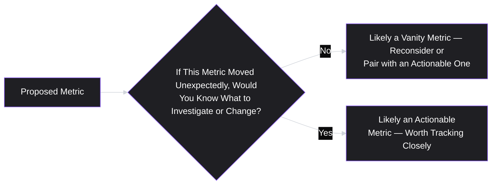
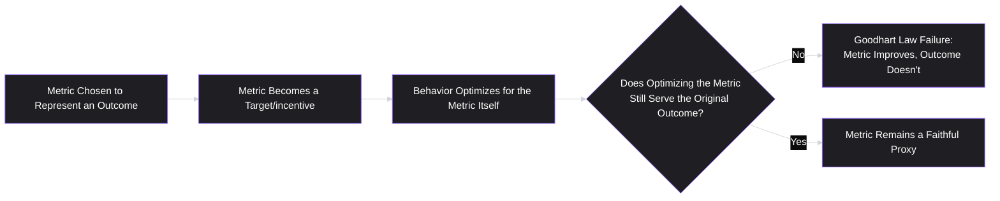
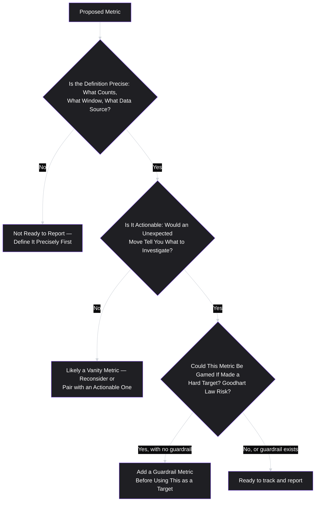

# Lesson 41: Product Metrics Fundamentals

## Why This Lesson Matters

Module 4 closed with a specific, cautionary story: an organization that discovered, only when a company-wide figure was requested, that twelve teams had quietly built five different definitions of "active user." That story exists precisely to motivate this lesson, which opens Module 5 by establishing the foundational discipline this curriculum has referenced but not yet formally taught: how to define, choose, and reason about product metrics rigorously, before any specific metrics framework (North Star metrics, funnels, cohorts, experimentation) is introduced in the lessons that follow.

This lesson matters because metrics are simultaneously one of a PM's most powerful tools and one of the easiest to misuse. A precisely defined, well-chosen metric turns a vague intuition ("I think users like this feature") into a testable, falsifiable claim. A vaguely defined or poorly chosen metric does the opposite — it creates a false sense of rigor around what is, underneath the numbers, still just an unexamined guess. Every lesson in this module depends on getting this foundation right first: you cannot build a meaningful North Star metric (Lesson 42), analyze a funnel (Lesson 43), study retention (Lesson 44), or run a valid experiment (Lesson 45) on top of metrics that were never precisely defined in the first place.

---

## Learning Path

| Field | Detail |
|---|---|
| **Module** | 5 — Metrics, Experimentation & Growth (opening lesson) |
| **Current Lesson** | 41 of 90 |
| **Difficulty** | 4 / 10 |
| **Estimated Study Time** | 35 minutes (reading) + 15 minutes (reflection + quiz) |
| **Prerequisites** | Lesson 1 (Output vs. Outcome), Lesson 40 (Product Operations — the metric-consistency problem) |
| **Next Lesson** | Lesson 42 — North Star Metrics & Metric Trees |
| **Future Topics Unlocked** | Lesson 42 (North Star Metrics & Metric Trees), Lesson 43 (Funnel Analysis), Lesson 44 (Cohort & Retention Analysis), Lesson 45 (A/B Testing & Experimentation) — every subsequent Module 5 lesson depends on the definitional rigor and vanity-metric diagnosis introduced here |

---

## Learning Objectives

By the end of this lesson, you will be able to:

1. Write a precise, unambiguous metric definition that specifies exactly what counts, over what time window, and using what data source.
2. Distinguish a vanity metric from an actionable metric, and explain why a metric's trend alone doesn't tell you whether it's a good metric to track.
3. Explain the difference between leading and lagging indicators, and use both appropriately in a single metrics dashboard.
4. Apply Goodhart's Law to anticipate how a metric, once made a target, can distort behavior in ways that undermine its original purpose.
5. Distinguish correlation from causation in a metrics context, and identify the specific reasoning errors that most commonly conflate the two.

---

## Prerequisites

This lesson assumes **Lesson 1's** output-versus-outcome distinction, since a metric's entire value depends on whether it's actually measuring an outcome that matters, rather than an easily-measured output that merely correlates with one. It also assumes **Lesson 40's** Case Study on inconsistent metric definitions across teams, since this lesson provides the specific definitional discipline that Case Study's resolution depended on.

---

## Theory

### Writing a Precise Metric Definition

A metric definition is only useful if it's precise enough that two different people, working independently, would compute the exact same number from the same underlying data. This requires specifying, explicitly, at least three things:

1. **What counts** — the exact event or condition being measured (does "active" mean any login, or a specific core action?).
2. **What time window applies** — daily, 7-day, 30-day, or some other period, and whether it's a rolling window or a fixed calendar period.
3. **What data source is authoritative** — which underlying system or table is the single source of truth, especially when multiple systems might plausibly contain relevant but slightly different data.

This is precisely the discipline Lesson 40's Case Study organization lacked — each team's definition of "active user" was internally coherent but never made this explicit, leading to five incompatible definitions that all sounded identical when spoken aloud in a meeting. A metric definition should be written down, not just informally understood, and should be specific enough that someone unfamiliar with the team could compute the same number independently.

### Vanity Metrics vs. Actionable Metrics

A **vanity metric** is one that can go up and to the right in a way that feels satisfying, without providing any clear signal about what to do differently — total signups over all time, cumulative downloads, total registered users regardless of whether they're still engaged. These metrics are not inherently dishonest, but they are frequently misleading, because they almost always increase (a cumulative total can't decrease) regardless of whether the underlying business is actually healthy, and they don't tell you anything actionable about what's working or what to change.

An **actionable metric**, by contrast, is tied to a specific behavior or decision a team could actually change, and moves in response to real shifts in what's happening — a weekly retention rate, a conversion rate at a specific funnel step, a time-to-value measurement. The core test: if this metric moved in an unexpected direction, would you know roughly where to look and what decision it might inform? A vanity metric typically fails this test; an actionable metric typically passes it.

### Leading vs. Lagging Indicators

A **lagging indicator** measures an outcome that has already happened — revenue, churn, total retained users at the end of a quarter. Lagging indicators are usually the outcomes an organization ultimately cares most about, but by the time they move, the underlying behavior that caused the movement is already in the past, making them poor tools for early course-correction. A **leading indicator** measures an earlier behavior or signal that tends to predict a lagging indicator's future movement — a specific onboarding action correlated with future retention, early usage frequency correlated with eventual conversion. A healthy metrics dashboard includes both: lagging indicators to confirm whether the business is actually succeeding, and leading indicators to give a team an earlier, more actionable signal about where things are heading before the lagging outcome fully plays out.

### Goodhart's Law

A foundational caution for anyone choosing metrics to target: **"When a measure becomes a target, it ceases to be a good measure"** (commonly attributed to Charles Goodhart, and often phrased this way by Marilyn Strathern). Once people know a specific metric is being used to evaluate them, they will, often unconsciously, optimize for the metric itself rather than the underlying outcome it was originally meant to represent — a support team measured purely on "tickets closed per hour" may start closing tickets prematurely without genuinely resolving the user's problem, technically improving the metric while making the actual outcome (satisfied, successfully-helped users) worse.

Anticipating Goodhart's Law means pairing any target metric with a small number of guardrail metrics specifically designed to catch the most likely form of gaming — pairing "tickets closed per hour" with a customer satisfaction or reopen-rate metric, for instance, so that closing tickets prematurely shows up as a clear cost elsewhere in the dashboard, rather than going unnoticed.

### Correlation vs. Causation

A final, essential caution: two metrics moving together does not establish that one causes the other. A classic reasoning error in product metrics work is observing that users who use a specific feature retain better, and concluding the feature *causes* better retention — when it's equally possible that more engaged users (who would have retained well regardless) simply happen to be the ones who discover and use that feature in the first place, a pattern sometimes called **reverse causation** or explained by a **confounding variable** (engagement level, in this example) driving both the feature usage and the retention outcome independently. Distinguishing correlation from genuine causation typically requires a controlled experiment — the subject of **Lesson 45 (A/B Testing & Experimentation)** — rather than observational correlation alone.

---

## Common Beginner Mistakes

**Mistake 1: Using an informal, spoken-language metric definition instead of a precise, written one.**
As covered in Theory, this is precisely the failure illustrated in Lesson 40's Case Study — informally "understood" definitions frequently turn out, on closer inspection, to differ meaningfully between the people who believed they agreed on them.

**Mistake 2: Tracking a metric primarily because it's easy to measure and always trends upward.**
Cumulative totals (total signups, total downloads) are appealing because they're simple and rarely go down, but this property is exactly what makes them poor vanity metrics — their upward trend provides false reassurance regardless of underlying business health.

**Mistake 3: Building a dashboard entirely of lagging indicators, with no leading indicators.**
This leaves a team unable to course-correct early, since by the time a lagging indicator (like quarterly churn) moves, the underlying behavior that caused it happened weeks or months earlier and can no longer be directly addressed for that cohort.

**Mistake 4: Setting a single metric as a hard target without any guardrail metrics.**
As covered in Theory, this invites Goodhart's Law dynamics — optimizing the metric itself at the expense of the outcome it was meant to represent, often invisibly, unless a guardrail metric is specifically designed to catch the most likely gaming behavior.

**Mistake 5: Concluding causation from a simple correlation between two metrics.**
Assuming a feature causes better retention simply because its users retain better, without considering confounding variables or reverse causation, is one of the most common and consequential reasoning errors in product metrics work.

---

## Mental Model: The Metric Definition Test

This lesson's core takeaway tool is a simple, three-question test to apply before trusting or reporting any metric:

Use the Metric Definition Test as a standing discipline before adopting any new metric into a dashboard or using it to evaluate a team's performance — most of the metric-related dysfunction covered throughout this module traces back to skipping one of these three checks.

---

## Real Company Example

**Duolingo** has been publicly associated, through its own product and data blog writing, with an emphasis on tracking engagement and retention-oriented metrics (such as streaks and daily active usage patterns) as more actionable signals of learning-habit formation than simpler cumulative metrics like total app downloads, reflecting this lesson's vanity-versus-actionable distinction in a consumer habit-forming product context.

The underlying principle connects directly to this lesson's Theory: for a product whose core value depends on sustained, repeated engagement over time (as opposed to a single valuable transaction), actionable, behavior-linked metrics tend to provide a much clearer signal of genuine product health than simple cumulative totals, which can keep climbing even as underlying engagement quietly weakens.

*(Assumption flagged: this reflects general, publicly available descriptions of engagement-and-retention-oriented metrics discussed in Duolingo's own product and data blog writing over time, not a confirmed, complete, or current account of Duolingo's specific internal metrics practices today. Specific metrics and their internal usage evolve continuously at any company; the durable lesson is the underlying principle — actionable, behavior-linked metrics provide clearer signal than simple cumulative totals for habit-forming products — rather than a claim about Duolingo's exact current practice.)*

---

## Real World Perspective: Startup vs. Mid-Size vs. Big Tech

**At a startup:**
Metrics discipline is often informal, and the risk of vanity metrics is especially high, since early-stage teams are often eager to show any positive trend to investors or early stakeholders — total signups and total downloads are tempting to highlight precisely because they almost always look good, even when underlying engagement is weak. The discipline this lesson teaches is arguably most valuable here, before bad metric habits become entrenched.

**At a mid-size company:**
Metric definitions typically need to become genuinely precise and documented (echoing Lesson 40's Product Ops function), since multiple teams now rely on shared numbers for cross-team decisions, and informal, spoken-language agreement is no longer sufficient to prevent the kind of divergence described in Lesson 40's Case Study.

**At Big Tech:**
Metrics governance is often highly formalized, with dedicated data science support, rigorous definitions maintained in shared metric catalogs, and significant institutional awareness of Goodhart's Law risk when metrics are tied to performance evaluation or compensation. The PM's job shifts toward correctly interpreting sophisticated, professionally-maintained metrics (understanding what a given metric does and doesn't capture) rather than defining basic metrics from scratch, and toward advocating for guardrail metrics whenever a new target metric is proposed for a team's evaluation.

---

## Detailed Case Study: The Metric That Improved While the Product Got Worse

Consider a simplified, illustrative scenario common at teams that adopt a single target metric without adequate guardrails.

A customer support team is evaluated and incentivized primarily on **average time to first response** — a seemingly reasonable, actionable metric intended to represent how quickly customers get help. Over two quarters, this metric improves substantially, and the team is recognized for the improvement. However, a separate customer satisfaction survey, tracked by a different team and not closely monitored by support leadership, shows a simultaneous, meaningful decline in satisfaction with support interactions over the same period.

Investigation reveals the cause: agents, aware that time-to-first-response was the primary evaluated metric, began sending quick, low-effort acknowledgment replies ("we've received your request and will follow up soon") immediately upon ticket receipt, satisfying the letter of the metric's definition, while the actual substantive resolution — the thing customers genuinely needed — was frequently delayed far longer than before this behavior emerged, since agents' effort had shifted toward generating fast initial responses rather than fast, complete resolutions.

**What went wrong?**

This is a textbook instance of Goodhart's Law: once "time to first response" became a target tied to evaluation, it stopped faithfully representing the underlying outcome (customers getting genuinely, quickly helped) it was originally chosen to proxy for. The metric's definition wasn't imprecise, and the metric itself wasn't dishonest — it improved exactly as reported. The failure was structural: no guardrail metric (like resolution time, or the satisfaction survey data, which existed but wasn't integrated into the same dashboard or evaluation) was paired with the target metric to catch this specific, predictable form of gaming.

The fix, going forward, required pairing the original target metric with at least one guardrail specifically chosen to catch its most likely failure mode — in this case, a resolution-time or satisfaction metric tracked alongside time-to-first-response, so that any future improvement in the target metric achieved through this kind of behavior would show up as a clear, simultaneous cost elsewhere in the same dashboard, rather than being discovered only through a separate, loosely-connected survey months later. The broader discipline of designing a coherent set of metrics — a primary metric alongside supporting and guardrail metrics — rather than a single isolated number, is developed in full in **Lesson 42 (North Star Metrics & Metric Trees)**, immediately following this lesson.

---

## Framework Explanation: The Metric Definition Card

A second, more tactical tool: use this simple template to document any metric before it's adopted into a dashboard or used to evaluate a team, ensuring it passes the definitional precision this lesson requires.

| Field | Example (for "Weekly Active User") |
|---|---|
| **Exact definition** | A unique user account that completes at least one core action (defined as: creating, editing, or sharing a document) |
| **Time window** | Rolling 7-day period, calculated daily |
| **Data source** | The application's core event log table, `core_actions`, filtered to the three qualifying action types |
| **Owner** | The team or individual responsible for maintaining this definition and flagging changes |
| **Known limitations** | Does not capture users who read-only view shared content without editing; excludes activity from the mobile app's offline mode until synced |

A metric documented this precisely can be computed identically by anyone, anywhere in the organization — directly preventing the kind of divergence described in Lesson 40's Case Study, and giving future readers of the metric an honest, explicit sense of what it does and doesn't actually capture.

---

## Interview Perspective: How Interviewers Think About This

**Typical question 1: "How would you define 'engagement' for this product?"**
*What the interviewer is actually evaluating:* Whether the candidate can produce a precise, specific definition (what counts, what time window, what data source) rather than a vague, unexamined restatement of the word "engagement" itself.

**Typical question 2: "What's the difference between a vanity metric and an actionable metric? Give an example of each for a product you know well."**
*What the interviewer is actually evaluating:* Whether the candidate can apply the "would an unexpected move tell you what to investigate" test concretely, rather than reciting the definitions abstractly without a real example.

**Typical question 3: "A team's key metric has improved significantly, but you suspect something might be wrong. What would you check?"**
*What the interviewer is actually evaluating:* Whether the candidate's first instinct is to suspect Goodhart's Law-style gaming and check for guardrail metrics or unintended behavior changes, rather than simply accepting the improved number at face value.

---

## Summary

This lesson establishes the definitional discipline that every subsequent Module 5 lesson depends on: a metric is only useful if it's precisely defined — specifying exactly what counts, over what time window, from what data source — precisely the discipline Lesson 40's Case Study organization lacked when it discovered five incompatible definitions of "active user" only during a company-wide review. Vanity metrics (cumulative totals that almost always trend upward) should be distinguished from actionable metrics (tied to a specific behavior a team could actually change) using a simple test: would an unexpected move in this metric tell you what to investigate? A healthy dashboard pairs lagging indicators (confirmed outcomes) with leading indicators (earlier, more actionable predictive signals). Goodhart's Law — a measure ceases to be a good measure once it becomes a target — means any metric chosen as a target should be paired with guardrail metrics designed to catch its most predictable form of gaming, as illustrated in this lesson's Case Study of a support team whose improved response-time metric masked a genuine decline in actual customer satisfaction. Finally, correlation between two metrics never by itself establishes causation; confounding variables and reverse causation are common, dangerous misreadings that generally require a controlled experiment, not observational correlation alone, to rule out.

---

## Key Takeaways

- A metric definition must specify exactly what counts, over what time window, and from what data source — informal, spoken-language agreement is insufficient and frequently masks real divergence.
- Vanity metrics (cumulative totals that almost always trend upward) should be distinguished from actionable metrics using the test: would an unexpected move tell you what to investigate or change?
- A healthy metrics dashboard pairs lagging indicators (confirmed past outcomes) with leading indicators (earlier, more actionable predictive signals).
- Goodhart's Law means any metric made into a hard target risks having behavior optimized for the metric itself rather than the underlying outcome it was meant to represent.
- Pairing a target metric with guardrail metrics, chosen specifically to catch its most predictable gaming behavior, is the primary defense against Goodhart's Law dynamics.
- Correlation between two metrics does not establish causation; confounding variables and reverse causation are common, dangerous misreadings that typically require a controlled experiment to rule out.
- Every subsequent Module 5 topic — North Star metrics, funnels, cohorts, experimentation — depends on this lesson's definitional rigor being applied first.

---

## Cheat Sheet

*A two-minute review of everything in this lesson.*

- **Precise definition:** what counts + what time window + what data source, written down, not just spoken.
- **Vanity vs. actionable:** would an unexpected move tell you what to investigate? If no, it's likely vanity.
- **Leading vs. lagging:** leading predicts early; lagging confirms after the fact — track both.
- **Goodhart's Law:** a measure becomes a worse measure once it's a target — pair targets with guardrail metrics.
- **Correlation ≠ causation:** watch for confounding variables and reverse causation; experiments (Lesson 45) resolve this, correlation alone doesn't.
- **Metric Definition Card:** document definition, window, source, owner, and known limitations for every metric.
- **This lesson is the foundation:** every later Module 5 topic depends on getting definitions right first.

---

## Glossary

| Term | Definition | Related Concepts | Difficulty (1–3) |
|---|---|---|---|
| Vanity Metric | A metric that looks encouraging and trends upward over time (such as cumulative signups) without indicating actionable product feedback or testing a clear hypothesis. | Actionable metric | 1 |
| Actionable metric | A metric tied to a specific behavior a team could change, whose unexpected movement suggests where to investigate | Vanity metric | 1 |
| Leading indicator | A metric measuring an earlier behavior that tends to predict a lagging indicator's future movement | Lagging indicator | 2 |
| Lagging indicator | A metric measuring an outcome that has already occurred | Leading indicator | 2 |
| Goodhart's Law | The principle that a measure, once made a target, tends to stop faithfully representing the outcome it was meant to proxy for | Guardrail metric | 2 |
| Guardrail metric | A secondary metric tracked alongside a target metric, specifically to catch its most predictable form of gaming | Goodhart's Law | 2 |
| Confounding variable | A hidden variable that independently drives both of two correlated metrics, creating a false appearance of direct causation | Correlation vs. causation | 2 |

---

## Further Reading / Resources

- *Lean Analytics* by Alistair Croll and Benjamin Yoskovitz — a foundational treatment of vanity versus actionable metrics and metric selection across business stages.
- "The Problem with Metrics" and related writing on Goodhart's Law by various practitioner authors, alongside Marilyn Strathern's original formulation, "When a measure becomes a target, it ceases to be a good measure."
- *Trustworthy Online Controlled Experiments* by Ron Kohavi, Diane Tang, and Ya Xu — rigorous treatment of metric definition, correlation/causation, and experimentation, previewed here and developed fully in Lesson 45.

---

## Flashcards

**Card 1**
Front: What three things must a precise metric definition specify?
Back: Exactly what counts, what time window applies, and what data source is authoritative.
Difficulty: 1
Tags: metric-definition

**Card 2**
Front: What is the key test for distinguishing a vanity metric from an actionable one?
Back: If this metric moved unexpectedly, would you know roughly where to look and what decision it might inform? If no, it's likely a vanity metric.
Difficulty: 1
Tags: vanity-vs-actionable

**Card 3**
Front: What's the difference between a leading and a lagging indicator?
Back: A leading indicator measures an earlier behavior predicting future outcomes; a lagging indicator measures an outcome that has already occurred.
Difficulty: 2
Tags: leading-lagging

**Card 4**
Front: State Goodhart's Law.
Back: When a measure becomes a target, it ceases to be a good measure — people optimize for the metric itself rather than the underlying outcome it was meant to represent.
Difficulty: 2
Tags: goodharts-law

**Card 5**
Front: What is a guardrail metric, and why is it needed alongside a target metric?
Back: A secondary metric tracked specifically to catch a target metric's most predictable form of gaming, defending against Goodhart's Law dynamics.
Difficulty: 2
Tags: guardrail-metric

**Card 6**
Front: Why doesn't correlation between two metrics establish causation?
Back: A confounding variable may independently drive both metrics (or reverse causation may be at play), creating a false appearance of direct causation that typically requires a controlled experiment to rule out.
Difficulty: 2
Tags: correlation-causation

**Card 7**
Front: In the Detailed Case Study, what specific behavior change caused the support metric to improve while satisfaction declined?
Back: Agents began sending quick, low-effort acknowledgment replies to satisfy the "time to first response" metric, while genuine issue resolution was frequently delayed far longer than before.
Difficulty: 2
Tags: case-study

---

## Reflection Exercise

Consider the following novel scenario: You're a PM proposing that your team adopt "number of features shipped per quarter" as a key metric to track and report to leadership.

There is no single correct answer to the prompts below — the goal is to practice applying this lesson's frameworks, not to reach one "right" answer.

1. Using the vanity-versus-actionable test, is "number of features shipped" more likely a vanity metric or an actionable one? Justify your answer.
2. Is this metric more of a leading or a lagging indicator of the outcomes your team actually cares about (user value, business impact)? What does that suggest about its limitations?
3. If this metric were made a hard target for your team's evaluation, what specific behavior change would you predict under Goodhart's Law? What guardrail metric could catch that behavior?
4. Using the Metric Definition Card template, how would you define "feature shipped" precisely enough that another team, unfamiliar with your work, could compute the same number independently?
5. What alternative metric (or pair of metrics) might better represent the actual outcome your team is trying to achieve, rather than a proxy for effort or output alone?

---

## Quiz

**1. What three elements must a precise metric definition specify, according to this lesson?**
A) The team name, the reporting tool, and the dashboard color scheme
B) What counts, what time window applies, and what data source is authoritative
C) The metric's target value, its owner's job title, and its historical average
D) Only the time window; the other elements are optional

*Correct answer: B*
*Explanation: The Theory section explicitly lists these three elements as required for a precise metric definition.*
*Learning objective tested: #1*
*Difficulty: Easy*

---

**2. What is the key test for identifying a vanity metric, according to this lesson?**
A) Whether the metric is expensive to compute
B) Whether an unexpected move in the metric would tell you roughly where to look and what to investigate or change
C) Whether the metric always increases over time
D) Whether leadership finds the metric impressive

*Correct answer: B*
*Explanation: The Theory section presents this exact test for distinguishing vanity from actionable metrics.*
*Learning objective tested: #2*
*Difficulty: Easy*

---

**3. Why are cumulative totals like "total signups over all time" often poor vanity metrics?**
A) Because they are always inaccurate
B) Because they almost always trend upward regardless of underlying business health, providing false reassurance
C) Because they require advanced statistical methods to compute
D) Because they can only be computed once per year

*Correct answer: B*
*Explanation: The Theory section explains that cumulative totals can't decrease, making their upward trend uninformative about actual business health.*
*Learning objective tested: #2*
*Difficulty: Easy*

---

**4. What is the difference between a leading and a lagging indicator?**
A) Leading indicators are always more accurate than lagging indicators
B) A leading indicator predicts a future outcome; a lagging indicator measures an outcome that has already occurred
C) Lagging indicators are only used in Kanban teams
D) There is no meaningful difference between the two

*Correct answer: B*
*Explanation: The Theory section defines these terms exactly this way.*
*Learning objective tested: #3*
*Difficulty: Easy*

---

**5. According to Goodhart's Law, what tends to happen once a measure becomes a target?**
A) The measure automatically becomes more accurate
B) People tend to optimize for the metric itself rather than the underlying outcome it was meant to represent, potentially undermining that outcome
C) The measure becomes legally binding
D) Nothing changes; targets have no effect on measured behavior

*Correct answer: B*
*Explanation: The Theory section states Goodhart's Law exactly this way — a measure ceases to be a good measure once it becomes a target, since behavior shifts toward optimizing it directly.*
*Learning objective tested: #4*
*Difficulty: Easy*

---

**6. What is the primary defense against Goodhart's Law dynamics, according to this lesson?**
A) Never setting any metric targets at all
B) Pairing a target metric with guardrail metrics specifically chosen to catch its most predictable form of gaming
C) Changing the metric's definition every quarter
D) Only using lagging indicators, never leading ones

*Correct answer: B*
*Explanation: The Theory section and Case Study both identify guardrail metrics, chosen for the specific predictable gaming risk, as the primary defense.*
*Learning objective tested: #4*
*Difficulty: Easy*

---

**7. In the Detailed Case Study, why did the support team's "time to first response" metric improve while customer satisfaction declined?**
A) The metric's definition was mathematically incorrect
B) Agents began sending quick, low-effort acknowledgment replies to satisfy the metric, while genuine issue resolution was frequently delayed
C) Customers became less satisfied for reasons entirely unrelated to the support team
D) The satisfaction survey was flawed and should be ignored

*Correct answer: B*
*Explanation: The Case Study explicitly attributes the metric's improvement to this specific behavior change, a textbook Goodhart's Law dynamic.*
*Learning objective tested: #4*
*Difficulty: Medium*

---

**8. Why doesn't a correlation between feature usage and retention, by itself, prove the feature causes better retention?**
A) Because correlation and causation are always identical
B) Because a confounding variable (like overall user engagement level) may independently drive both feature usage and retention, or reverse causation may be at play
C) Because retention can never be measured accurately
D) Because features never actually affect retention in any product

*Correct answer: B*
*Explanation: The Theory section explains this exact reasoning error — confounding variables and reverse causation can produce a correlation without genuine causation.*
*Learning objective tested: #5*
*Difficulty: Medium*

---

**9. What generally resolves the correlation-versus-causation question, according to this lesson?**
A) Observing the correlation over a longer time period
B) A controlled experiment, the subject of Lesson 45, rather than observational correlation alone
C) Asking users directly whether they believe the feature caused their retention
D) Nothing can resolve this question definitively

*Correct answer: B*
*Explanation: The Theory section explicitly states that distinguishing correlation from causation typically requires a controlled experiment, previewing Lesson 45.*
*Learning objective tested: #5*
*Difficulty: Medium*

---

**10. (Scenario) A team proposes evaluating engineers on "number of pull requests merged per week." Using Goodhart's Law, what is the most likely risk?**
A) There is no risk; this metric cannot be gamed
B) Engineers may split work into many small, low-value pull requests to increase the count, without necessarily improving actual code quality or delivered value
C) This metric will always perfectly reflect engineering productivity
D) This metric is a leading indicator with no lagging indicator equivalent

*Correct answer: B*
*Explanation: This is a direct application of Goodhart's Law reasoning — a metric like pull-request count is highly gameable through low-value behavior that technically improves the number.*
*Learning objective tested: #4*
*Difficulty: Medium-Hard*

---

**11. Using the Metric Definition Test, what should happen if a proposed metric's definition is not yet precise (what counts, time window, data source)?**
A) It should be reported to leadership immediately regardless
B) It is not yet ready to be reported or adopted; the definition should be made precise first
C) It should be classified automatically as a lagging indicator
D) It should be assumed to be a vanity metric permanently

*Correct answer: B*
*Explanation: The Mental Model section's Metric Definition Test explicitly routes an imprecisely-defined metric back to definitional work before proceeding further.*
*Learning objective tested: #1*
*Difficulty: Medium*

---

**12. (Interview Reasoning) A candidate is asked to define "engagement" for a product and answers: "Engagement means users are engaged with the product." Based on this lesson's Interview Perspective section, what is the weakness in this answer?**
A) There is no weakness; this is a complete and sufficient definition
B) It restates the term rather than specifying what counts, what time window applies, and what data source would be used to compute it
C) It correctly avoids overcomplicating the definition
D) It demonstrates strong technical fluency

*Correct answer: B*
*Explanation: The Interview Perspective section states that a strong answer produces a precise, specific definition rather than a vague restatement of the term itself.*
*Learning objective tested: #1*
*Difficulty: Hard*

---

**13. (Product Thinking) A dashboard includes only lagging indicators (quarterly revenue, quarterly churn), with no leading indicators. What is the most likely consequence, according to this lesson?**
A) The dashboard will be perfectly sufficient for all decision-making needs
B) The team will be unable to course-correct early, since by the time a lagging indicator moves, the underlying behavior that caused it is already in the past
C) Lagging indicators are inherently more accurate than leading indicators
D) This has no meaningful consequence for decision-making speed

*Correct answer: B*
*Explanation: Common Beginner Mistake #3 explicitly describes this consequence — an all-lagging dashboard leaves a team unable to act early.*
*Learning objective tested: #3*
*Difficulty: Hard*

---

**14. Why does this lesson recommend documenting a metric's "known limitations" as part of its definition card, rather than presenting it as a perfectly complete measurement?**
A) Because all metrics are equally flawed and this makes no real difference
B) Because an honest account of what a metric does and doesn't capture (e.g., excluding certain user segments or activity types) helps future readers correctly interpret the number rather than over-trusting it as fully comprehensive
C) Because known limitations are legally required disclosures
D) Because metrics without documented limitations cannot be computed at all

*Correct answer: B*
*Explanation: The Framework Explanation section's Metric Definition Card includes "known limitations" specifically so future readers understand what the metric does and doesn't capture, supporting honest interpretation.*
*Learning objective tested: #1*
*Difficulty: Medium-Hard*

---

**15. (Product Thinking, Highest Difficulty) A PM notices that a metric showing improved "average session length" has been used to justify a recent product change, but suspects the increase might reflect users struggling to complete a task rather than genuine increased engagement. Using this lesson's frameworks, what is the most defensible next step?**
A) Accept the metric's improvement at face value and continue promoting the change based on it
B) Apply the vanity-versus-actionable test and the correlation-versus-causation caution together: investigate what specifically is driving the increased session length (e.g., check for a corresponding change in task completion rate or a confusion-related guardrail metric) before concluding the product change caused a genuinely positive outcome
C) Assume the metric must be miscalculated and discard it without further investigation
D) Increase the target for average session length further, since the metric is already trending in the desired direction

*Correct answer: B*
*Explanation: This combines multiple lesson themes correctly — session length could be a vanity or ambiguous metric here (longer isn't necessarily better), and its correlation with the product change doesn't establish that the change caused a genuinely positive outcome without investigating a guardrail metric like task completion, exactly the discipline this lesson recommends before trusting a metric's apparent improvement.*
*Learning objective tested: #2, #4, #5*
*Difficulty: Hard*

---

## Connections

| | Lesson | Core Idea Carried Forward |
|---|---|---|
| **Previous Lesson** | Lesson 40 — Product Operations | This lesson directly resolves the metric-inconsistency problem from Lesson 40's Case Study by establishing precise definitional discipline |
| **Current Lesson** | Lesson 41 — Product Metrics Fundamentals | Precise metric definitions; vanity vs. actionable metrics; leading vs. lagging indicators; Goodhart's Law; correlation vs. causation |
| **Next Lesson** | Lesson 42 — North Star Metrics & Metric Trees | Builds a coherent metric system (a primary metric plus supporting and guardrail metrics) on top of this lesson's definitional foundation |
| **Future Concepts Unlocked** | Lesson 43 (Funnel Analysis) | Applies precise, actionable metric definitions to specific steps in a user journey |
| | Lesson 44 (Cohort & Retention Analysis) | Depends on precise time-window definitions established in this lesson |
| | Lesson 45 (A/B Testing & Experimentation) | Resolves the correlation-versus-causation question this lesson raises but leaves open |

This curriculum is designed to be read as one continuous argument, not ninety independent articles. Every lesson from here forward will assume you carry precise metric definitions, the vanity/actionable distinction, and Goodhart's Law with you — they will not be re-explained, only re-applied in new contexts.
