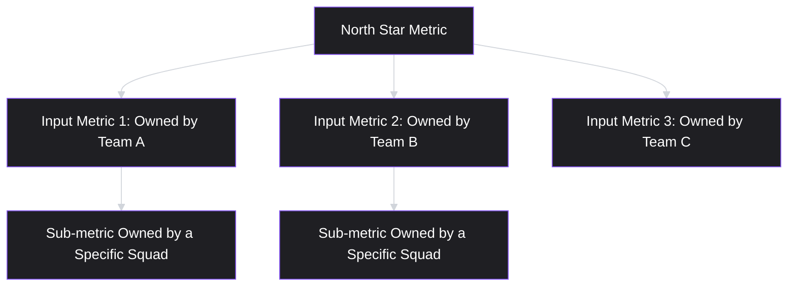
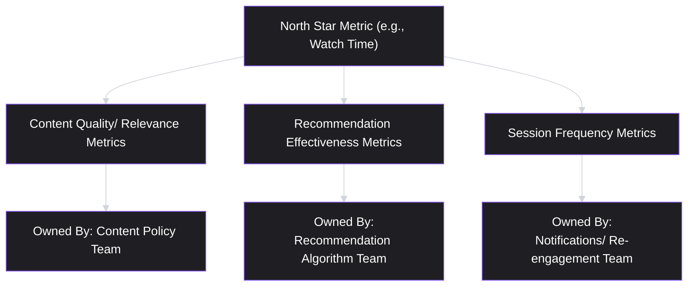

# Lesson 42: North Star Metrics & Metric Trees

## Why This Lesson Matters

Lesson 41 gave you the definitional discipline every metric needs — precision, actionability, awareness of Goodhart's Law and correlation-versus-causation traps. This lesson builds on that foundation to answer a question every product organization eventually faces: among the dozens of metrics a team could track, which single metric should serve as the organization's central compass, and how does that one metric connect down to the many smaller metrics individual teams actually influence day to day?

This lesson matters because choosing the wrong North Star metric is not a minor technical error — it can silently redirect an entire organization's prioritization decisions toward the wrong goal for months or years, with every team locally optimizing correctly against a metric that was never the right thing to optimize in the first place. The single most famous real-world illustration of this exact dynamic, YouTube's shift from optimizing for view count to optimizing for watch time, is this lesson's Real Company Example precisely because it demonstrates, at enormous scale, both the cost of choosing wrong and the value of correcting course.

---

## Learning Path

| Field | Detail |
|---|---|
| **Module** | 5 — Metrics, Experimentation & Growth |
| **Current Lesson** | 42 of 90 |
| **Difficulty** | 5 / 10 |
| **Estimated Study Time** | 35 minutes (reading) + 15 minutes (reflection + quiz) |
| **Prerequisites** | Lesson 41 (Product Metrics Fundamentals — vanity vs. actionable, Goodhart's Law) |
| **Next Lesson** | Lesson 43 — Funnel Analysis |
| **Future Topics Unlocked** | Lesson 43 (Funnel Analysis), Lesson 44 (Cohort & Retention Analysis), Lesson 48 (Pricing & Monetization Strategy), Lesson 50 (Product-Led Growth) — all connect back to the metric tree structure introduced here |

---

## Learning Objectives

By the end of this lesson, you will be able to:

1. Define a North Star Metric and list the criteria that distinguish a good candidate from a poor one.
2. Explain why YouTube's shift from view count to watch time illustrates the risk of choosing a North Star Metric that can be gamed or that fails to represent genuine value.
3. Construct a metric tree that decomposes a North Star Metric into the specific input metrics individual teams can actually influence.
4. Diagnose a North Star Metric that has become too broad or too lagging to usefully guide day-to-day team decisions.
5. Pair a North Star Metric with appropriate guardrail metrics, applying Lesson 41's Goodhart's Law caution at an organizational scale.

---

## Prerequisites

This lesson assumes fluency with **Lesson 41's** full toolkit: precise metric definitions, the vanity-versus-actionable distinction, leading versus lagging indicators, and Goodhart's Law. A North Star Metric is, in effect, the single most consequential metric choice an organization makes — every one of Lesson 41's cautions applies with amplified stakes here, since an entire organization's prioritization, not just one team's, will orient around whatever is chosen.

---

## Theory

### What a North Star Metric Is

A **North Star Metric (NSM)** is the single metric an organization chooses to represent the core value it delivers to customers, selected specifically because it also reliably predicts long-term business success. The NSM is not simply "the most important number" in an abstract sense — it plays a specific organizational role: it gives every team, working on different parts of the product, a shared, common measure of whether their work is actually contributing to the thing the business fundamentally exists to do.

A good NSM candidate should satisfy several criteria simultaneously:

| Criterion | What It Checks |
|---|---|
| Reflects customer value | Movement in the metric should correspond to customers genuinely getting more value, not just more exposure to the product |
| Leading indicator of business success | The metric should move before, and predict, lagging business outcomes like revenue or retention, not simply restate them |
| Actionable | Teams should be able to identify concrete work that plausibly moves the metric, echoing Lesson 41's actionable-metric test |
| Understandable | The metric should be simple enough that people across the organization, not just data specialists, can grasp what it means and why it matters |
| Resistant to easy gaming | The metric should be difficult to improve without genuinely delivering more value, anticipating Lesson 41's Goodhart's Law caution at organizational scale |

### The Metric Tree

A North Star Metric, chosen well, is still too broad and too aggregate for any individual team to directly act on day to day — a company-wide NSM doesn't tell a specific engineering team what to build this Sprint. A **metric tree** solves this by decomposing the NSM into a hierarchy of contributing input metrics, each of which some specific team can meaningfully influence:

The critical design property of a well-built metric tree is that each branch represents a genuine, quantifiable contribution to the level above it — not just a metric that feels thematically related. A metric tree built loosely, where branches are only vaguely connected to the NSM above them, gives teams a false sense that their local metric improvements are contributing to the organization's actual goal, when the connection was never rigorously established.

### YouTube's Watch Time Shift: A Worked Example

The most instructive real-world case for this lesson's core lesson is YouTube's publicly discussed shift, around 2012, from optimizing primarily for view count to optimizing for **watch time**. Under a view-count-oriented approach, a video's success was measured by how many times it was clicked — a metric that, per Lesson 41's Goodhart's Law caution, could be improved through misleading thumbnails and clickbait titles that generated clicks without generating genuine viewer satisfaction, since a view counted the same whether a viewer watched thirty seconds or the whole video. Shifting the organization's central metric to watch time — how long people actually spent watching — much more directly reflected whether content was genuinely engaging viewers, and directly disincentivized the clickbait dynamic that view-count optimization had inadvertently encouraged.

This example illustrates every criterion in this lesson's table simultaneously: watch time better reflects genuine customer value (real engagement, not just a click), is resistant to the specific gaming vector that undermined view count, and, once adopted as the organizational NSM, gave many different teams (recommendation algorithms, content policies, creator tools) a shared, meaningfully-aligned target to build a metric tree around.

*(Assumption flagged: this reflects a widely and publicly reported account of YouTube's metric strategy shift, based on public reporting and industry discussion of the change, not a confirmed, complete, or current internal account of YouTube's present-day metrics philosophy, which may have evolved further since this widely-discussed period. The durable lesson is the underlying principle — a North Star Metric should resist the specific gaming vectors created by whatever it replaces — rather than a claim about YouTube's exact current metric strategy.)*

---

## Common Beginner Mistakes

**Mistake 1: Choosing an NSM that is really just a business/revenue metric restated.**
Revenue is a lagging indicator of success, not a leading indicator teams can act on directly — an NSM should sit further upstream, representing the customer value that, when delivered well, tends to produce revenue as a downstream consequence, not simply restate the downstream consequence itself.

**Mistake 2: Choosing an NSM so broad that no team can identify concrete work that moves it.**
A metric like "overall company success" or an overly abstract composite index fails the actionability criterion — teams need a metric specific enough to trace down into a metric tree with real, ownable input metrics.

**Mistake 3: Building a metric tree with only thematically related branches, not rigorously connected ones.**
As covered in Theory, this creates a false sense of alignment — a team can improve their local metric substantially while contributing little or nothing to the actual NSM above it, if the connection was never quantitatively verified.

**Mistake 4: Adopting an NSM without considering how it could be gamed, echoing Lesson 41's Goodhart's Law.**
YouTube's original view-count metric is the canonical illustration — an NSM that can be improved through behavior disconnected from genuine value (clickbait, in that example) will eventually produce exactly the gaming dynamic Lesson 41 warns against, at organizational scale.

**Mistake 5: Treating the NSM as permanently fixed, never revisiting it as the business or product matures.**
An NSM appropriate for an early-stage product exploring product-market fit may become the wrong choice once the product matures and different dynamics (retention, monetization) become more central to genuine value — YouTube's own shift demonstrates that revisiting an NSM, when evidence warrants it, is a sign of good metric discipline, not instability.

---

## Mental Model: The Metric Tree

*(Introduced above in the Theory section; restated here as this lesson's standalone takeaway tool, per curriculum convention.)*

Use the Metric Tree as a standing discipline whenever a team claims their local metric improvement matters: ask explicitly, "what is the quantified, verified relationship between this input metric and the North Star Metric above it?" A team unable to answer this with real evidence — only a plausible-sounding story — is very likely operating on an unverified branch of the tree, the specific failure this lesson's Mistake 3 describes.

---

## Real Company Example

**YouTube** is the most widely cited real-world example of a North Star Metric change driving organizational behavior. In its early years, YouTube optimized for view count — the total number of video views across the platform. This metric encouraged clickbait titles, short viral videos, and content optimized for the initial thumbnail click rather than genuine viewer satisfaction. After shifting its North Star to **watch time** (total minutes watched), the platform's recommendation algorithm, content incentives, and product decisions all realigned toward creating engaging, longer-viewed content that better served both viewers and the platform's long-term advertising model.

- YouTube's shift from view count to watch time is the canonical example of choosing the right North Star Metric.
- Optimizing for view count encouraged clickbait and short viral content at the expense of genuine viewer engagement.
- Switching to watch time realigned the entire organization — algorithm, content incentives, and product decisions — toward creating more valuable viewing experiences.

---

## Real World Perspective: Startup vs. Mid-Size vs. Big Tech

**At a startup:**
A formal NSM and metric tree are often unnecessary at very early stages, when the more urgent question is simply whether the product has found any genuine value at all (a topic closer to Lesson 8's discovery work than this lesson's metric-system design). Choosing an NSM prematurely, before the team even knows what customers value, risks locking in the wrong metric before there's enough evidence to choose well.

**At a mid-size company:**
This is typically the stage where a formal NSM and metric tree become genuinely valuable — enough teams now exist that a shared, central metric is needed to keep everyone's prioritization loosely aligned (echoing Lesson 40's Product Ops function), and enough usage data exists to choose an NSM with real evidence behind it rather than guesswork.

**At Big Tech:**
NSMs and metric trees are often deeply formalized, sometimes with dedicated data science teams responsible for validating and periodically re-verifying the quantified relationships between tree branches and the NSM above them — treating metric tree validation with similar rigor to the experimentation practices covered in Lesson 45. The PM's job shifts toward correctly interpreting a complex, professionally-maintained metric tree and advocating for its periodic re-evaluation (per Mistake 5) as the product and market mature.

---

## Detailed Case Study: The North Star That Rewarded the Wrong Growth

Consider a simplified, illustrative scenario common at growth-stage companies choosing their first formal North Star Metric.

A B2B SaaS company selects "total registered accounts" as its North Star Metric, reasoning that account growth is the clearest signal of overall business momentum. Every team builds its roadmap and metric tree around driving new account registrations: marketing optimizes signup-page conversion, product simplifies the signup flow to reduce friction, and sales incentives are restructured to reward new logo counts above all else.

Eighteen months later, registered accounts have grown impressively, but revenue growth has stagnated and customer support costs have risen sharply. Investigation reveals that a large share of new accounts are free-tier signups with no genuine intent to adopt the product — driven by an aggressively simplified signup flow that removed qualifying questions and by sales incentives that rewarded any new account regardless of fit — while existing paying customers, whose experience had received comparatively little product investment during this period, began churning at an increasing rate.

**What went wrong?**

Using this lesson's NSM criteria table: "total registered accounts" failed the "reflects customer value" test from the start — it measured exposure to the product (a signup event), not genuine value delivered, and it failed the "resistant to easy gaming" test just as clearly, since simplifying the signup flow and loosening sales qualification could both improve the metric substantially without any corresponding increase in real customer value. The entire organization's metric tree — genuinely well-built in the narrow sense that each branch really did drive the chosen NSM — was, in effect, rigorously optimizing for the wrong thing, precisely because the NSM itself was chosen poorly at the root.

The fix required replacing the NSM with something closer to a genuine value signal — in this case, a metric more like "accounts reaching a defined activation milestone within their first 30 days," which could not be improved simply by loosening signup friction or sales qualification, since a low-intent signup that never activates would not move this replacement metric at all. Rebuilding the metric tree around this corrected NSM, and re-aligning team incentives accordingly, is precisely the kind of NSM revision process this lesson's Mistake 5 endorses when evidence reveals the original choice was flawed. The deeper question of how "activation" itself should be defined and measured across a user's early journey is addressed directly in **Lesson 43 (Funnel Analysis)**, immediately following this lesson.

---

## Framework Explanation: The North Star Candidate Evaluation Table

A second, more tactical tool: use this table to evaluate any proposed North Star Metric candidate before adopting it organization-wide.

| Criterion | Evaluation Question | Score (1–5) |
|---|---|---|
| Reflects customer value | Does genuine value delivery, not just exposure or activity, move this metric? | — |
| Leading indicator | Does this metric move before, and predict, lagging outcomes like revenue or retention? | — |
| Actionable | Can most teams identify concrete work that plausibly moves this metric? | — |
| Understandable | Can someone outside the data team explain what this metric means and why it matters? | — |
| Resistant to gaming | Is it hard to improve this metric without genuinely delivering more value (per Lesson 41's Goodhart's Law)? | — |

A candidate scoring low on "reflects customer value" or "resistant to gaming" — as "total registered accounts" would have, in this lesson's Case Study — should be treated as a serious warning sign before organizational adoption, regardless of how appealingly simple or impressive-sounding the candidate metric is.

---

## Interview Perspective: How Interviewers Think About This

**Typical question 1: "How would you choose a North Star Metric for [a specific product]?"**
*What the interviewer is actually evaluating:* Whether the candidate applies a structured evaluation (the criteria table above) rather than picking an intuitively appealing but poorly-vetted metric, and whether they can explain why their chosen metric resists easy gaming.

**Typical question 2: "Tell me about YouTube's shift from view count to watch time. Why did that matter?"**
*What the interviewer is actually evaluating:* Whether the candidate understands the underlying principle (an NSM should resist the specific gaming vector created by whatever it replaces) rather than simply reciting the historical fact without explaining its significance.

**Typical question 3: "How do you build a metric tree that individual teams can actually act on?"**
*What the interviewer is actually evaluating:* Whether the candidate understands that metric tree branches must be rigorously, quantifiably connected to the NSM — not just thematically related — testing awareness of this lesson's Mistake 3.

---

## Summary

A North Star Metric is the single metric an organization selects to represent genuine customer value delivered, chosen specifically because it also reliably predicts long-term business success — evaluated against criteria including reflecting customer value, serving as a leading indicator, being actionable and understandable, and resisting easy gaming. YouTube's well-documented shift from view count to watch time illustrates every one of these criteria at once: view count could be improved through clickbait disconnected from genuine viewer satisfaction, while watch time much more directly represented real engagement and resisted that specific gaming vector. A metric tree decomposes an NSM into a hierarchy of team-ownable input metrics, but only provides genuine value when each branch's connection to the NSM above it is rigorously verified with real evidence, not merely assumed because it feels thematically related — a distinction this lesson's Case Study illustrates through a company whose "total registered accounts" NSM was faithfully, rigorously optimized by every team, while the underlying metric choice itself silently rewarded low-value growth and ultimately damaged the business. An NSM should be periodically revisited as a product and business mature, since the right NSM for an early-stage product exploring value is often not the right NSM once retention and monetization dynamics become more central.

---

## Key Takeaways

- A North Star Metric represents genuine customer value delivered, chosen because it reliably predicts long-term business success, not because it simply restates a lagging business outcome like revenue.
- Good NSM candidates satisfy five criteria: reflecting customer value, serving as a leading indicator, being actionable, being understandable, and resisting easy gaming.
- YouTube's shift from view count to watch time illustrates the risk of choosing an NSM vulnerable to gaming disconnected from genuine value, and the benefit of correcting course once evidence reveals the problem.
- A metric tree decomposes an NSM into team-ownable input metrics, but only functions well when each branch's connection to the NSM is rigorously verified with real evidence, not just assumed by thematic association.
- A poorly chosen NSM can be faithfully, rigorously optimized by every team's well-built metric tree while still silently rewarding the wrong kind of growth, as illustrated in this lesson's Case Study.
- An NSM should be periodically revisited as a product and business mature, since the right choice can shift as different dynamics (from early value discovery to later retention/monetization) become more central.
- Choosing an NSM prematurely, before a team has enough evidence about what customers genuinely value, risks locking in the wrong metric before it can be chosen well.

---

## Cheat Sheet

*A two-minute review of everything in this lesson.*

- **NSM definition:** the single metric representing genuine customer value that also predicts business success.
- **Five criteria:** reflects value, leading indicator, actionable, understandable, resistant to gaming.
- **YouTube example:** view count (gameable via clickbait) → watch time (better reflects genuine engagement).
- **Metric tree:** decomposes NSM into team-ownable input metrics — but only if each branch is rigorously, quantifiably connected, not just thematically related.
- **Case study lesson:** a well-built metric tree can faithfully optimize the wrong NSM, rewarding bad growth.
- **Revisit the NSM:** the right choice changes as a product matures from early value discovery to retention/monetization.
- **Evaluate before adopting:** use the North Star Candidate Evaluation Table, don't just pick the intuitively appealing option.

---

## Glossary

| Term | Definition | Related Concepts | Difficulty (1–3) |
|---|---|---|---|
| North Star Metric (NSM) | The single metric an organization chooses to represent genuine customer value delivered, selected because it also predicts business success | Metric tree | 1 |
| Metric tree | A hierarchy decomposing a North Star Metric into team-ownable input metrics | North Star Metric | 1 |
| North Star Candidate Evaluation | A structured five-criteria check (value, leading indicator, actionable, understandable, gaming-resistant) for vetting NSM candidates | Goodhart's Law (Lesson 41) | 2 |

---

## Further Reading / Resources

- *Amplitude's North Star Playbook* by John Cutler and the Amplitude team — a widely referenced practitioner treatment of North Star Metric selection and metric tree construction.
- *Lean Analytics* by Alistair Croll and Benjamin Yoskovitz — revisited here for its guidance on choosing the "One Metric That Matters" at different business stages.
- Public reporting and industry discussion of YouTube's watch-time metric shift — useful background on this lesson's central worked example.

---

## Flashcards

**Card 1**
Front: What is a North Star Metric?
Back: The single metric an organization chooses to represent genuine customer value delivered, selected because it also reliably predicts long-term business success.
Difficulty: 1
Tags: nsm-definition

**Card 2**
Front: List the five criteria for a good NSM candidate.
Back: Reflects customer value, leading indicator of business success, actionable, understandable, resistant to easy gaming.
Difficulty: 1
Tags: nsm-criteria

**Card 3**
Front: Why did YouTube's shift from view count to watch time matter?
Back: View count could be improved through clickbait disconnected from genuine viewer satisfaction; watch time much more directly reflected real engagement and resisted that specific gaming vector.
Difficulty: 2
Tags: youtube-example

**Card 4**
Front: What is a metric tree, and what makes one well-built versus poorly-built?
Back: A hierarchy decomposing an NSM into team-ownable input metrics; well-built trees have each branch rigorously, quantifiably connected to the NSM above, not just thematically related.
Difficulty: 2
Tags: metric-tree

**Card 5**
Front: In the Detailed Case Study, why did "total registered accounts" fail as a North Star Metric despite the organization's metric tree being well-executed?
Back: It measured exposure (signups), not genuine value, and could be improved through loosened signup friction and sales qualification without any real increase in customer value — failing both the "reflects value" and "resistant to gaming" criteria.
Difficulty: 2
Tags: case-study

**Card 6**
Front: Why should an NSM be periodically revisited rather than treated as permanently fixed?
Back: The right NSM for an early-stage product exploring value may not be the right NSM once the business matures and different dynamics (retention, monetization) become more central to genuine value.
Difficulty: 2
Tags: nsm-revision

---

## Reflection Exercise

Consider the following novel scenario: You're a PM at a project management software company currently using "number of projects created" as its North Star Metric. The company has grown quickly on this metric, but you've noticed that many created projects are abandoned within a day, and customer support has flagged a rising number of confused first-time users.

There is no single correct answer to the prompts below — the goal is to practice applying the North Star Candidate Evaluation Table, not to reach one "right" answer.

1. Using the North Star Candidate Evaluation Table, score "number of projects created" against each of the five criteria, and justify your scores.
2. What specific behavior might teams be incentivized toward if this metric is heavily emphasized, and how might that behavior show up in the abandoned-project and confused-user patterns you've noticed?
3. Propose an alternative NSM candidate that might better reflect genuine customer value for this product. How would you evaluate it against the same five criteria?
4. What would a first draft of a metric tree look like for your proposed alternative NSM — which teams might own which input metrics?
5. How would you make the case to leadership for changing the NSM, given that "number of projects created" has been publicly cited as a growth success story?

---

## Quiz

**1. What is the defining purpose of a North Star Metric?**
A) To measure total company revenue directly
B) To represent the genuine customer value an organization delivers, chosen because it also reliably predicts long-term business success
C) To track engineering team velocity exclusively
D) To replace the need for any other metrics

*Correct answer: B*
*Explanation: The Theory section defines the NSM exactly this way — representing genuine value while predicting business success.*
*Learning objective tested: #1*
*Difficulty: Easy*

---

**2. Which of the following is NOT one of the five criteria for a good NSM candidate, according to this lesson?**
A) Reflects customer value
B) Resistant to easy gaming
C) Must be the same metric used by every competitor in the industry
D) Actionable

*Correct answer: C*
*Explanation: The Theory section's criteria table lists reflects value, leading indicator, actionable, understandable, and resistant to gaming — not matching competitors' metrics.*
*Learning objective tested: #1*
*Difficulty: Easy*

---

**3. Why did YouTube's view-count metric create a problematic incentive, according to this lesson?**
A) View count was too difficult to measure accurately
B) View count could be improved through misleading thumbnails and clickbait titles that generated clicks without genuine viewer satisfaction
C) View count was a leading indicator with no lagging indicator equivalent
D) View count was actually a perfectly good NSM that never needed to change

*Correct answer: B*
*Explanation: The Theory section explains this exact gaming vector as the reason YouTube's original metric was problematic.*
*Learning objective tested: #2*
*Difficulty: Easy*

---

**4. What does watch time better reflect, compared to view count, according to this lesson?**
A) Nothing; the two metrics are functionally identical
B) Genuine viewer engagement and satisfaction, since it captures how long people actually spent watching rather than just whether they clicked
C) Only the total number of videos uploaded
D) Advertising revenue exclusively

*Correct answer: B*
*Explanation: The Theory section explains that watch time much more directly reflects genuine engagement than a simple click-based view count.*
*Learning objective tested: #2*
*Difficulty: Easy*

---

**5. What is a metric tree?**
A) A visual chart showing revenue over time
B) A hierarchy decomposing a North Star Metric into specific input metrics that individual teams can actually influence and own
C) A list of every metric a company has ever tracked, in no particular order
D) A tool exclusively used in Kanban-based teams

*Correct answer: B*
*Explanation: The Theory section defines a metric tree exactly this way.*
*Learning objective tested: #3*
*Difficulty: Easy*

---

**6. What makes a metric tree branch well-built, according to this lesson, rather than poorly-built?**
A) It uses an impressive-sounding name
B) Its connection to the North Star Metric above it is rigorously, quantifiably verified, not just assumed based on thematic similarity
C) It is owned by the most senior team in the organization
D) It changes every quarter regardless of evidence

*Correct answer: B*
*Explanation: The Theory section and Mistake 3 both emphasize that genuine, verified quantitative connection — not thematic association — is what makes a metric tree branch well-built.*
*Learning objective tested: #3*
*Difficulty: Easy*

---

**7. In the Detailed Case Study, why did "total registered accounts" fail as a North Star Metric even though the company's metric tree was well-executed in a narrow sense?**
A) The metric tree branches were not connected to the NSM at all
B) The NSM itself measured exposure (signups) rather than genuine value, and could be improved through loosened signup friction and sales qualification without any real increase in customer value
C) The company did not have enough engineers to support the metric
D) The metric was too difficult to compute accurately

*Correct answer: B*
*Explanation: The Case Study's "What went wrong?" analysis attributes the failure to the NSM's own poor selection, not to any flaw in how the metric tree was built beneath it.*
*Learning objective tested: #4*
*Difficulty: Medium*

---

**8. What replacement metric did the Case Study company consider adopting, and why was it more resistant to gaming than the original?**
A) Total marketing spend, because it directly measures investment
B) Accounts reaching a defined activation milestone within their first 30 days, because a low-intent signup that never activates would not move this metric, unlike simple registration counts
C) Total number of support tickets, because it measures customer frustration directly
D) Number of sales calls made, because it measures sales team effort

*Correct answer: B*
*Explanation: The Case Study explicitly proposes this activation-based replacement metric and explains why it resists the same gaming vector that undermined the original NSM.*
*Learning objective tested: #4*
*Difficulty: Medium*

---

**9. Why does this lesson caution against choosing a North Star Metric that is simply a restated revenue or business outcome metric?**
A) Because revenue metrics are always inaccurate
B) Because a lagging business outcome doesn't give teams an actionable, upstream signal to work toward — an NSM should sit further upstream, representing the value that produces revenue as a downstream consequence
C) Because revenue should never be tracked by any team
D) Because this violates Lesson 41's definition of a vanity metric directly

*Correct answer: B*
*Explanation: Common Beginner Mistake #1 explains this exact reasoning — a restated lagging outcome fails to give teams an actionable upstream target.*
*Learning objective tested: #1, #4*
*Difficulty: Medium*

---

**10. (Scenario) A company chooses "total marketing impressions" as its North Star Metric. Using the North Star Candidate Evaluation Table, what is the most likely weakness of this choice?**
A) It scores perfectly on all five criteria
B) It likely fails "reflects customer value" and "resistant to easy gaming," since impressions can be purchased or increased without any genuine value being delivered to customers
C) It is too specific and narrow to be useful at all
D) It cannot be measured using any existing data source

*Correct answer: B*
*Explanation: Impressions, like view count in the YouTube example, can be increased through spend or exposure tactics disconnected from genuine customer value, failing the same criteria that undermined view count.*
*Learning objective tested: #5*
*Difficulty: Medium-Hard*

---

**11. (Interview Reasoning) A candidate is asked how they would choose a North Star Metric for a new product and answers: "I'd just pick whichever metric is currently growing the fastest." Based on this lesson's Interview Perspective section, what is the weakness in this answer?**
A) There is no weakness; fast-growing metrics are always the best choice
B) It skips structured evaluation against the five NSM criteria entirely, risking the selection of a metric that grows fast precisely because it's easy to game rather than because it reflects genuine value
C) It correctly identifies the only factor that matters in metric selection
D) It demonstrates strong quantitative reasoning

*Correct answer: B*
*Explanation: The Interview Perspective section states that a strong answer applies structured evaluation criteria, not just intuitive appeal or current growth trend, which can itself be a symptom of gaming rather than genuine value.*
*Learning objective tested: #1, #5*
*Difficulty: Hard*

---

**12. Why does this lesson recommend periodically revisiting a chosen North Star Metric rather than treating it as permanently fixed?**
A) Because metrics should be changed randomly to keep teams alert
B) Because the right NSM for an early-stage product exploring value may no longer be the right NSM once the business matures and different dynamics become more central to genuine value, as YouTube's own shift demonstrates
C) Because North Star Metrics are only valid for exactly one calendar year
D) Because changing metrics frequently improves data science team morale

*Correct answer: B*
*Explanation: Common Beginner Mistake #5 and the Summary explicitly recommend periodic revisiting as a sign of good metric discipline, using YouTube's shift as the illustrative precedent.*
*Learning objective tested: #4*
*Difficulty: Medium-Hard*

---

**13. (Product Thinking) A team reports that their local metric (in-app notification open rate) has improved 20%, and claims this proves they're contributing meaningfully to the company's North Star Metric (weekly active users). Using this lesson's Metric Tree mental model, what should a PM ask first?**
A) Nothing further; a 20% improvement is self-evidently valuable
B) What is the quantified, verified relationship between notification open rate and weekly active users — has this connection actually been established with real evidence, or is it assumed based on thematic plausibility?
C) Whether the team used Scrum or Kanban to achieve this improvement
D) Whether the notification design used the correct brand colors

*Correct answer: B*
*Explanation: This directly applies the Metric Tree mental model's core diagnostic question — verifying a real, quantified connection rather than accepting a plausible-sounding but unverified claim.*
*Learning objective tested: #3*
*Difficulty: Hard*

---

**14. Which of the following best reflects a metric tree branch that is rigorously connected, rather than merely thematically related, to its NSM?**
A) A team asserts their metric "feels important" to overall company success without further evidence
B) A team demonstrates, through actual data analysis, that increases in their specific input metric are statistically associated with subsequent increases in the North Star Metric, controlling for other factors
C) A team's metric is included in the tree simply because a senior leader requested it
D) A team's metric shares a similar-sounding name to the NSM

*Correct answer: B*
*Explanation: This reflects the kind of rigorous, evidence-based verification this lesson requires for a genuinely well-built metric tree branch, in contrast to the several weaker, unverified justifications listed in the other options.*
*Learning objective tested: #3*
*Difficulty: Medium-Hard*

---

**15. (Product Thinking, Highest Difficulty) A mature company's original North Star Metric, chosen five years ago during early growth, still rewards raw user acquisition, but the company's business has since shifted toward monetization and retention among an already-large user base. Using this lesson's frameworks, what is the most defensible response?**
A) Continue using the original NSM indefinitely, since changing it would be disruptive
B) Recognize this as a case warranting NSM revision (per Mistake 5): re-evaluate a new candidate metric against the five criteria, reflecting the business's current stage (retention/monetization-oriented value) rather than its early-growth stage, and rebuild the metric tree accordingly once a better candidate is validated
C) Abandon the use of any North Star Metric entirely, since the original choice turned out to be temporary
D) Add "raw user acquisition" as a permanent guardrail metric with no further changes to the primary NSM

*Correct answer: B*
*Explanation: This applies the lesson's explicit guidance on periodic NSM revision — recognizing that a metric appropriate for one business stage may no longer be appropriate for a later one, and that revising it (rather than either stubbornly keeping it or abandoning metric discipline altogether) is the correct response, followed by rebuilding the metric tree around the newly validated choice.*
*Learning objective tested: #4, #5*
*Difficulty: Hard*

---

## Connections

| | Lesson | Core Idea Carried Forward |
|---|---|---|
| **Previous Lesson** | Lesson 41 — Product Metrics Fundamentals | Applies the vanity/actionable distinction and Goodhart's Law caution to the single highest-stakes metric choice an organization makes |
| **Current Lesson** | Lesson 42 — North Star Metrics & Metric Trees | NSM criteria; YouTube watch-time example; metric tree; North Star Candidate Evaluation Table |
| **Next Lesson** | Lesson 43 — Funnel Analysis | Develops the specific activation/conversion metrics this lesson's Case Study proposed as a replacement NSM |
| **Future Concepts Unlocked** | Lesson 44 (Cohort & Retention Analysis) | Builds retention-oriented metric trees for products whose NSM centers on sustained engagement |
| | Lesson 48 (Pricing & Monetization Strategy) | Connects NSM selection to monetization-stage business dynamics raised in this lesson's Real World Perspective |
| | Lesson 50 (Product-Led Growth) | Builds growth-loop metric trees directly on top of a well-chosen NSM |

This curriculum is designed to be read as one continuous argument, not ninety independent articles. Every lesson from here forward will assume you carry North Star Metric criteria and the metric tree structure with you — they will not be re-explained, only re-applied in new contexts.
