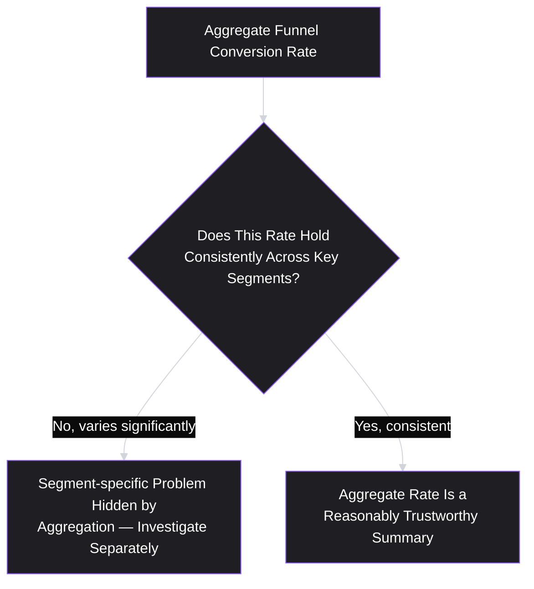
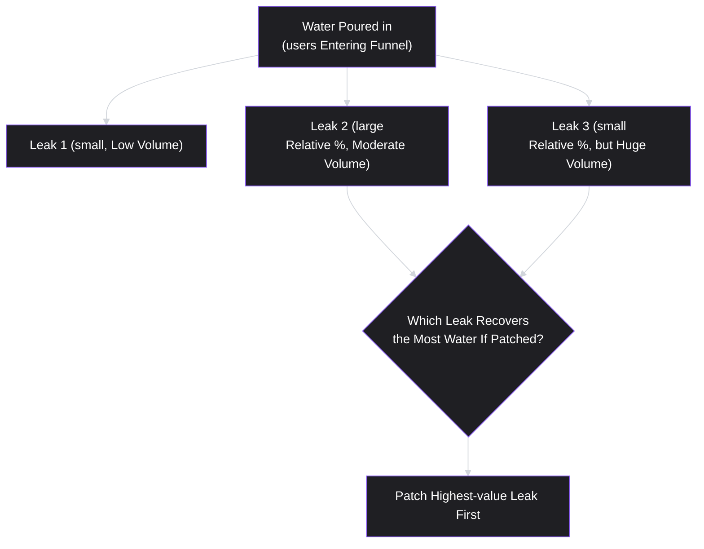

# Lesson 43: Funnel Analysis

## Why This Lesson Matters

Lesson 42's Case Study ended with a company replacing a flawed North Star Metric ("total registered accounts") with a better one: the share of new accounts reaching a defined activation milestone within their first 30 days. That replacement metric raises an immediate, practical question this lesson answers: activation doesn't happen all at once — it's the end result of a user moving through a specific sequence of steps, and understanding *where* users drop out of that sequence is essential to actually improving the metric, not just measuring it.

This lesson introduces funnel analysis, the discipline of breaking a multi-step user journey into its component stages and measuring conversion between each one. This matters because aggregate metrics, however precisely defined (Lesson 41), can hide enormous variation in where a product is actually succeeding or failing — a 20% overall signup-to-activation rate could mean many different things depending on whether the biggest drop-off happens at step one (visiting a page) or step four (completing a specific setup task), and the right fix is completely different in each case. Funnel analysis is how a PM finds out which story is actually true, rather than guessing.

---

## Learning Path

| Field | Detail |
|---|---|
| **Module** | 5 — Metrics, Experimentation & Growth |
| **Current Lesson** | 43 of 90 |
| **Difficulty** | 5 / 10 |
| **Estimated Study Time** | 35 minutes (reading) + 15 minutes (reflection + quiz) |
| **Prerequisites** | Lesson 41 (Product Metrics Fundamentals — precise definitions), Lesson 42 (North Star Metrics & Metric Trees — the activation-metric Case Study) |
| **Next Lesson** | Lesson 44 — Cohort & Retention Analysis |
| **Future Topics Unlocked** | Lesson 44 (Cohort & Retention Analysis), Lesson 45 (A/B Testing & Experimentation, which is how funnel fixes get validated), Lesson 50 (Product-Led Growth) — all build on the funnel decomposition and segmentation discipline introduced here |

---

## Learning Objectives

By the end of this lesson, you will be able to:

1. Decompose a user journey into discrete funnel stages and calculate step-by-step conversion rates.
2. Identify the single largest drop-off point in a funnel and explain why it typically deserves the most immediate investigative attention.
3. Explain Simpson's Paradox in a funnel context and describe why aggregate conversion rates can mislead without segmentation.
4. Distinguish absolute drop-off (raw number of users lost) from relative drop-off (percentage lost), and explain why prioritizing by the wrong one can lead to a misallocated fix.
5. Combine quantitative funnel data with qualitative investigation to move from "where users drop off" to "why they drop off."

---

## Prerequisites

This lesson assumes **Lesson 41's** definitional discipline, since every funnel stage needs the same precision (what counts as reaching this step, over what window, from what source) that any other metric requires. It also directly assumes **Lesson 42's** activation-metric Case Study, since this lesson picks up exactly where that Case Study left off — a company now needs to understand the specific journey leading to its newly chosen activation metric, not just track the metric's aggregate value.

---

## Theory

### Decomposing a Journey into Funnel Stages

A **funnel** represents a user's journey as a sequence of discrete stages, each with a measurable conversion rate to the next. A common generic template, often summarized by the mnemonic **AARRR** ("pirate metrics," coined by Dave McClure), is Awareness → Acquisition → Activation → Retention → Revenue → Referral, though the specific stages should always be tailored to the actual product journey being studied, rather than applied mechanically regardless of fit.

```mermaid
%%{init: {
  "theme": "dark",
  "themeVariables": {
    "background": "#0b0b0c",
    "primaryColor": "#1f1f23",
    "primaryTextColor": "#ffffff",
    "primaryBorderColor": "#8b5cf6",
    "lineColor": "#d1d5db",
    "secondaryColor": "#18181b",
    "tertiaryColor": "#111111",
    "mainBkg": "#1f1f23",
    "nodeBorder": "#8b5cf6",
    "clusterBkg": "#000000",
    "clusterBorder": "#27272a",
    "titleColor": "#ffffff",
    "edgeLabelBackground": "#0b0b0c",
    "nodeTextColor": "#ffffff",
    "edgeLabelColor": "#ffffff",
    "actorBorder": "#8b5cf6",
    "actorBkg": "#1f1f23",
    "actorTextColor": "#ffffff",
    "sequenceNumberColor": "#ffffff",
    "signalColor": "#8b5cf6",
    "signalTextColor": "#ffffff",
    "textColor": "#ffffff",
    "classText": "#ffffff",
    "classBorder": "#8b5cf6",
    "classBkg": "#1f1f23"
  }
}}%%
graph LR
    A["Stage 1: Visit<br/>Signup Page (1,000 Users)"] --> B["Stage 2: Start Signup<br/>Form (700 Users, 70%)"]
    B --> C["Stage 3: Complete<br/>Signup (550 Users, 79%)"]
    C --> D["Stage 4: Complete First<br/>Core Action (250 Users, 45%)"]
    D --> E["Stage 5: Activation<br/>Milestone (180 Users, 72%)"]
```

Each arrow's percentage represents the conversion rate from one stage to the next — the single most important number for finding where to focus improvement effort, since it isolates each transition rather than only reporting the overall, aggregate conversion from start to finish.

### Finding the Biggest Drop-off: Absolute vs. Relative

Two different ways of measuring "biggest drop-off" can point to different priorities, and conflating them is a common mistake. **Relative drop-off** is the percentage of users lost at a given step (in the diagram above, Stage 1→2 loses 30% of users). **Absolute drop-off** is the raw number of users lost (Stage 1→2 loses 300 users, the largest raw number in this example, even though Stage 3→4's 55% relative loss is a larger percentage).

| Stage Transition | Relative Drop-off | Absolute Drop-off |
|---|---|---|
| Stage 1 → 2 | 30% | 300 users |
| Stage 2 → 3 | 21% | 150 users |
| Stage 3 → 4 | 55% | 300 users |
| Stage 4 → 5 | 28% | 70 users |

In this example, Stage 1→2 and Stage 3→4 tie on absolute drop-off (300 users each), but Stage 3→4's relative drop-off (55%) is much higher, suggesting a more severe, specific problem at that step relative to how many users reached it — while Stage 1→2's large absolute number may simply reflect that far more users reach that early stage in the first place. Generally, relative drop-off is more useful for diagnosing *where a specific step itself is unusually broken*, while absolute drop-off is more useful for prioritizing *where fixing a step would recover the most total users* — both numbers matter, and a PM should look at both rather than defaulting to just one.

### Simpson's Paradox: Why Aggregation Can Mislead

A funnel's aggregate conversion rate can obscure dramatically different underlying realities across segments, a phenomenon related to **Simpson's Paradox** — where a trend visible in aggregated data reverses or disappears entirely once the data is broken into meaningful subgroups. In a funnel context: an overall signup-to-activation rate might look stable or even improving, while masking the fact that mobile users are converting far worse than desktop users (or vice versa), because a shift in the *mix* of traffic (more mobile users overall, who convert at a lower baseline rate) is hiding a genuine, segment-specific problem worth investigating separately.

### From "Where" to "Why": Combining Quantitative and Qualitative Investigation

Funnel data reliably tells a PM *where* users drop off, but rarely tells them *why* on its own. Once a specific stage transition is identified as the priority (using both absolute and relative drop-off, and checked for segment-hidden variation via Simpson's Paradox), the next step is typically qualitative: session recordings, targeted user interviews, or usability testing focused specifically on that step, to understand the actual user experience causing the drop-off. A PM who treats funnel data as sufficient on its own, without this qualitative follow-up, risks guessing at a fix based on assumption rather than genuine understanding of the underlying cause — precisely the discovery discipline from Lesson 8, applied here to a specific, quantitatively-identified problem area rather than a broad, undirected exploration.

---

## Common Beginner Mistakes

**Mistake 1: Only looking at the overall, start-to-end conversion rate without breaking it into stages**

An aggregate rate tells you *that* something is wrong somewhere in the journey, but gives no guidance on *where* to focus — exactly the gap funnel decomposition into discrete stages is designed to close.

**Mistake 2: Prioritizing by relative drop-off alone, ignoring absolute numbers**

A step with a dramatic 60% relative drop-off affecting only a handful of users may matter less, in terms of total recoverable users, than a milder 20% relative drop-off at a much higher-volume step — both figures should inform prioritization, not just one.

**Mistake 3: Trusting an aggregate conversion rate without checking for Simpson's Paradox-style segment variation**

As covered in Theory, a stable or improving aggregate rate can mask a serious, worsening problem in a specific segment, especially when the overall traffic mix is shifting over the same period.

**Mistake 4: Assuming funnel data alone explains why users drop off**

Quantitative funnel data identifies *where* to look; it rarely explains *why* without qualitative follow-up — proposing a fix based purely on quantitative funnel data, without any qualitative investigation of the actual user experience at that step, risks solving the wrong underlying problem.

**Mistake 5: Defining funnel stages inconsistently with the metric definitions established in Lesson 41**

If a funnel stage's definition (what counts as "starting" the signup form, for instance) isn't as precise as Lesson 41 requires for any other metric, the resulting funnel analysis inherits the same definitional risk — comparing numbers across time or across teams that were never actually computed consistently.

---

## Mental Model: The Leaky Bucket

This lesson's core takeaway tool visualizes a funnel as a bucket with leaks at each stage, directing attention to the leak that matters most rather than treating every leak as equally urgent:

Use the Leaky Bucket as a standing discipline whenever a funnel review surfaces multiple problem steps: rather than intuitively fixing whichever step "feels" most broken, calculate which leak, if patched, would actually recover the most users given both its relative severity and its absolute volume — the same dual consideration this lesson's Theory section establishes.

---

## Real Company Example

**Uber** has been publicly associated, through its own engineering and data blog writing, with detailed funnel analysis across its rider and driver acquisition journeys — tracking conversion from app download through account creation, first ride request, and first completed ride, and using this decomposition to identify specific friction points (such as onboarding steps or payment setup) worth targeted improvement.

The underlying principle connects directly to this lesson's Theory: a multi-sided marketplace product, with genuinely distinct rider and driver journeys, benefits especially clearly from funnel decomposition and segmentation, since aggregating riders and drivers into a single funnel would obscure two very different underlying stories, echoing this lesson's Simpson's Paradox caution.

*(Assumption flagged: this reflects general, publicly available descriptions of funnel and conversion analysis discussed in Uber's own engineering and data blog writing over time, not a confirmed, complete, or current account of Uber's specific internal funnel methodology today. Specific practices evolve continuously at any company; the durable lesson is the underlying principle — multi-sided or highly segmented products benefit especially from careful funnel decomposition and segmentation — rather than a claim about Uber's exact current approach.)*

---

## Real World Perspective: Funnel Analysis at Different Company Stages

**At a startup:**
Funnel analysis is often informal, sometimes just a rough mental model of "people sign up, and then most of them don't come back," without precise stage-by-stage instrumentation. The risk here is Mistake 1 — without breaking the journey into discrete, measured stages, a small team can spend significant effort guessing at fixes for the wrong part of the journey.

**At a mid-size company:**
Funnels typically become formally instrumented, often through dedicated analytics tooling, and segmentation (by acquisition channel, device type, user cohort) becomes standard practice specifically to guard against Simpson's Paradox-style aggregation problems. This is the stage where combining quantitative funnel data with qualitative research (Theory's final subsection) becomes a genuinely repeatable practice rather than an occasional exception.

**At Big Tech:**
Funnel analysis is often deeply granular, sometimes tracking dozens of micro-steps within what might appear, at a glance, to be a single stage, with dedicated data science support for segment-level analysis and statistical rigor around what constitutes a genuinely significant drop-off versus ordinary variance. The PM's job shifts toward correctly prioritizing among many identified problem areas (using both absolute and relative drop-off) and toward partnering effectively with data science and research teams for the qualitative "why" investigation.

---

## Detailed Case Study: The Step Everyone Blamed for the Wrong Reason

Consider a simplified, illustrative scenario that directly continues Lesson 42's Case Study — the company that replaced "total registered accounts" with a 30-day activation milestone as its North Star Metric.

Building a funnel to understand the new activation metric, the PM finds five stages: visiting the signup page, starting the signup form, completing signup, completing a required initial project setup, and reaching the activation milestone. The team immediately notices the largest relative drop-off (55%) occurs between "completing signup" and "completing initial project setup," and several team members, based on past assumptions, conclude the project setup flow's UI must be confusing and propose a visual redesign.

Before committing engineering resources to the redesign, the PM segments the drop-off data by acquisition channel and discovers something the aggregate number had hidden: users acquired through a specific paid marketing channel are dropping off at this step at nearly double the rate of users acquired organically or through referral, while the UI itself is identical for all users regardless of channel. Follow-up qualitative interviews with paid-channel users who dropped off reveal the actual cause: the marketing campaign's messaging had set an expectation (a quick, one-click setup) that didn't match the actual multi-field setup flow, causing a specific mismatch-driven abandonment that had nothing to do with the UI's visual design at all.

**What went wrong (and what was caught in time)?**

Using this lesson's Simpson's Paradox caution: the team's initial instinct — a UI redesign based on the aggregate drop-off number alone — would have addressed a symptom rather than the actual cause, and would likely have shown little improvement even after a costly redesign effort, since the underlying problem was an expectation mismatch specific to one acquisition channel, not a universal usability flaw. Segmenting the funnel data before committing to a fix revealed the real, channel-specific story that the aggregate number had obscured, and qualitative follow-up (per this lesson's Theory) turned a plausible-but-wrong guess about "why" into an evidence-based, channel-specific diagnosis. The eventual fix — adjusting the paid channel's marketing messaging to set accurate expectations, rather than redesigning the shared setup flow — was cheaper, faster, and directly targeted at the actual cause. The broader question of how to rigorously validate that a proposed fix actually works, rather than assuming it will based on this diagnosis alone, is addressed directly in **Lesson 45 (A/B Testing & Experimentation)**.

---

## Framework Explanation: The Funnel Segmentation Table

A second, more tactical tool: before committing to a fix for any identified funnel drop-off, check the aggregate number against key segments using this table structure.

| Segment Dimension | Aggregate Conversion at Problem Step | Segment A Conversion | Segment B Conversion | Notable Divergence? |
|---|---|---|---|---|
| Acquisition channel | e.g., 45% | Organic: 58% | Paid: 31% | Yes — investigate paid channel specifically |
| Device type | e.g., 45% | Desktop: 47% | Mobile: 43% | Minor — likely not the primary driver |
| User segment/plan tier | e.g., 45% | Free tier: 44% | Paid tier: 46% | Minor — likely not the primary driver |

A significant divergence in any single dimension, as with acquisition channel in this lesson's Case Study, is a strong signal that the aggregate number is hiding a segment-specific story worth investigating on its own, rather than treating the problem as universal across all users.

---

## Interview Perspective: How Interviewers Think About This

**Typical question 1: "Walk me through how you'd analyze a signup funnel with a low overall conversion rate."**
*What the interviewer is actually evaluating:* Whether the candidate's process includes decomposing the funnel into discrete stages, checking both absolute and relative drop-off, and segmenting before concluding anything — rather than jumping straight to a fix based on the aggregate number alone.

**Typical question 2: "A funnel step's conversion rate has stayed flat overall, but you suspect something is actually changing underneath. What would you check?"**
*What the interviewer is actually evaluating:* Whether the candidate proactively suspects Simpson's Paradox-style aggregation masking and knows to segment the data by relevant dimensions (channel, device, cohort) before trusting the flat aggregate number.

**Typical question 3: "Your team identified a funnel drop-off and proposed a UI fix, but the fix didn't improve the metric. What might have gone wrong?"**
*What the interviewer is actually evaluating:* Whether the candidate recognizes the risk of skipping qualitative investigation — proposing a fix based on assumption about "why" rather than evidence, mirroring this lesson's Case Study.

---

## Summary

Funnel analysis decomposes a user's journey into discrete, measurable stages, allowing a PM to identify precisely where users drop off rather than relying on an uninformative aggregate conversion rate. Prioritizing which drop-off to address first requires weighing both relative drop-off (the percentage lost at a given step, indicating how severely broken that specific step is) and absolute drop-off (the raw number of users lost, indicating how many users a fix would actually recover) — the two can point to different priorities, and a PM should consider both, as this lesson's Leaky Bucket mental model illustrates. Aggregate funnel numbers are also vulnerable to Simpson's Paradox: a stable or improving overall rate can mask a serious, segment-specific problem, which is why funnel data should always be checked against key segments (acquisition channel, device, user cohort) before committing to a fix, as demonstrated in this lesson's Case Study, where segmentation revealed a channel-specific expectation mismatch that an aggregate-only analysis would have misdiagnosed as a universal UI problem. Finally, funnel data reliably answers "where" users drop off but rarely answers "why" on its own — qualitative investigation (session recordings, targeted interviews) is typically necessary to move from a quantitatively-identified problem area to an evidence-based understanding of its actual cause.

---

## Key Takeaways

- Decomposing a user journey into discrete funnel stages, each with its own measured conversion rate, is necessary to identify where users drop off — an aggregate start-to-end conversion rate alone gives no guidance on where to focus.
- Relative drop-off (percentage lost) and absolute drop-off (raw users lost) can point to different priorities; both should inform which funnel step to address first.
- Simpson's Paradox means an aggregate funnel conversion rate can mask serious, segment-specific problems — always check key segments (channel, device, cohort) before trusting an aggregate number.
- Funnel data reliably identifies where users drop off but rarely explains why on its own; qualitative investigation is typically necessary to move from a quantitative problem area to an evidence-based understanding of its cause.
- A fix proposed based on an unsegmented, aggregate-only funnel analysis risks addressing a symptom rather than the actual, often segment-specific, underlying cause.
- Funnel stage definitions should meet the same precision standard established in Lesson 41 for any other metric, or the resulting analysis inherits the same definitional risk.
- Multi-sided or highly segmented products (like a marketplace with distinct buyer and seller journeys) benefit especially clearly from careful funnel decomposition and segmentation.

---

## Cheat Sheet

*A two-minute review of everything in this lesson.*

- **Decompose the journey:** stage-by-stage conversion, not just aggregate start-to-end rate.
- **Absolute vs. relative drop-off:** both matter — severity (relative) and recoverable volume (absolute) can point to different priorities.
- **Simpson's Paradox:** always segment (channel, device, cohort) before trusting an aggregate rate.
- **Where vs. why:** funnel data shows where; qualitative research (interviews, session recordings) explains why.
- **Leaky Bucket:** patch the leak that recovers the most users, weighing both relative and absolute drop-off.
- **Funnel Segmentation Table:** check the aggregate problem step against key segments before committing to a fix.
- **Define stages precisely:** funnel stages need the same definitional rigor as any other metric (Lesson 41).

---

## Glossary

| Term | Definition | Related Concepts | Difficulty |
|---|---|---|---|
| Funnel | A decomposition of a user journey into discrete, sequential stages with measurable conversion between them | AARRR | 1 |
| Relative drop-off | The percentage of users lost at a given funnel stage transition | Absolute drop-off | 1 |
| Absolute drop-off | The raw number of users lost at a given funnel stage transition | Relative drop-off | 1 |
| Simpson's Paradox | A phenomenon where a trend visible in aggregated data reverses or disappears once broken into meaningful subgroups | Funnel segmentation | 2 |
| Funnel segmentation | Breaking funnel conversion data down by dimensions like acquisition channel, device, or cohort to check for hidden variation | Simpson's Paradox | 2 |
| Leaky Bucket | This lesson's mental model: prioritizing which funnel "leak" to patch based on both relative severity and absolute recoverable volume | Absolute/relative drop-off | 1 |

---

## Further Reading / Resources

- *Lean Analytics* by Alistair Croll and Benjamin Yoskovitz — revisited here for its treatment of funnel metrics across different business models.
- "Startup Metrics for Pirates" (AARRR) by Dave McClure — the original articulation of the Awareness-Acquisition-Activation-Retention-Revenue-Referral funnel framework referenced in this lesson.
- *Trustworthy Online Controlled Experiments* by Ron Kohavi, Diane Tang, and Ya Xu — relevant background on segmentation rigor, previewed here and extended in Lesson 45.

---

## Flashcards

**Card 1**
- Front: What is a funnel, in the context of product metrics?
- Back: A decomposition of a user journey into discrete, sequential stages, each with a measurable conversion rate to the next stage.
- Difficulty: 1
- Tags: funnel-definition

**Card 2**
- Front: What's the difference between relative and absolute drop-off?
- Back: Relative drop-off is the percentage of users lost at a step; absolute drop-off is the raw number of users lost — both should inform prioritization, since they can point to different priorities.
- Difficulty: 1
- Tags: relative-absolute

**Card 3**
- Front: What is Simpson's Paradox, in a funnel context?
- Back: A phenomenon where an aggregate conversion rate looks stable or misleading while masking a serious, segment-specific problem (e.g., by channel or device) hidden by the aggregation.
- Difficulty: 2
- Tags: simpsons-paradox

**Card 4**
- Front: Why does funnel data alone often fail to explain why users drop off?
- Back: Quantitative funnel data identifies where users drop off, but understanding why typically requires qualitative investigation, like session recordings or targeted user interviews.
- Difficulty: 2
- Tags: where-vs-why

**Card 5**
- Front: In the Detailed Case Study, what did segmenting the funnel data reveal that the aggregate number hid?
- Back: Users from a specific paid marketing channel were dropping off at nearly double the rate of organic/referral users at the project setup step, due to a channel-specific expectation mismatch, not a universal UI problem.
- Difficulty: 2
- Tags: case-study

**Card 6**
- Front: What does the Leaky Bucket mental model recommend when multiple funnel steps show drop-off?
- Back: Prioritize patching the leak that would recover the most users overall, weighing both relative severity and absolute recoverable volume, rather than intuitively fixing whichever step feels most broken.
- Difficulty: 2
- Tags: leaky-bucket

## Reflection Exercise

Consider the following novel scenario: You're analyzing a funnel for a mobile fitness app: app install → account creation → first workout completed → seventh workout completed (a proposed habit-formation milestone). The step from "first workout completed" to "seventh workout completed" shows the largest relative drop-off (70%), but it's also the step furthest along the funnel, with far fewer total users remaining by that point.

There is no single correct answer to the prompts below — the goal is to practice applying this lesson's frameworks, not to reach one "right" answer.

1. Using absolute versus relative drop-off, what additional numbers would you want before deciding whether this step deserves top priority?
2. What segments would you check this drop-off against, to rule out a Simpson's Paradox-style hidden pattern (consider acquisition channel, fitness experience level, or workout type chosen)?
3. If segmentation reveals no meaningful divergence across segments, what would that suggest about the nature of the underlying problem, compared to if it revealed a large divergence?
4. What qualitative investigation would you propose to understand why users complete a first workout but don't reach a seventh, beyond what the funnel numbers alone can tell you?
5. If your qualitative research reveals a plausible cause, what would you want to do before rolling out a fix broadly, based on what you know is coming in Lesson 45?

---

## Quiz

**1. What is the primary purpose of decomposing a user journey into funnel stages, rather than looking only at an aggregate start-to-end conversion rate?**
A) To make the analysis appear more rigorous to leadership
B) To locate the specific transition where users are lost
C) To remove the need for later qualitative follow-up
D) To calculate the company's total revenue per quarter

*Correct answer: B*
*Explanation: An aggregate rate tells you the journey leaks without saying where. Improvement effort has to be pointed at a particular transition to be worth spending.*
*Learning objective tested: #1*
*Difficulty: Easy*

---

**2. What is the difference between relative and absolute drop-off?**
A) Relative is the percentage lost; absolute is the count
B) They are the same measurement under two different names
C) Relative applies to mobile; absolute applies to desktop
D) Absolute drop-off exceeds relative drop-off at each step

*Correct answer: A*
*Explanation: The two can rank the same funnel differently, which is why the lesson treats them as a pair rather than picking one as the real measure.*
*Learning objective tested: #4*
*Difficulty: Easy*

---

**3. Why might a step with a smaller relative drop-off percentage still deserve high prioritization?**
A) Because smaller relative drop-offs are statistically stronger
B) High volume through it can make the raw loss larger
C) Because relative figures are the sole prioritisation input
D) Because absolute figures play no part in prioritisation

*Correct answer: B*
*Explanation: The Theory table shows this exact case: a 30% loss early and a 55% loss later cost the same 300 users, because far more people reach the early step.*
*Learning objective tested: #4*
*Difficulty: Easy*

---

**4. What is Simpson's Paradox, as described in this lesson?**
A) A trend that reverses once data is segmented
B) A rule fixing every funnel at five distinct stages
C) A requirement to report all metrics as percentages
D) Another label for Goodhart's Law from Lesson 41

*Correct answer: A*
*Explanation: Goodhart's Law is Lesson 41's point about targets distorting behaviour. This one is about aggregation concealing what the subgroups are doing.*
*Learning objective tested: #3*
*Difficulty: Easy*

---

**5. Why does this lesson recommend segmenting funnel data by dimensions like acquisition channel or device type?**
A) Because analytics regulation requires segmented reporting
B) Because segmented data is cheaper to compute than aggregate
C) The overall rate can hide a segment-specific problem
D) Because dashboards can display segmented data alone

*Correct answer: C*
*Explanation: A steady aggregate can sit on top of a mix shift, so the number looks reassuring while one segment quietly degrades underneath it.*
*Learning objective tested: #3*
*Difficulty: Easy*

---

**6. In the Detailed Case Study, what did the team initially assume was causing the largest funnel drop-off, before segmenting the data?**
A) A confusing setup-flow UI, inferred from the aggregate figure
B) A technical defect in the signup form's validation
C) A pricing problem affecting the whole user base
D) A server outage during the measurement window

*Correct answer: A*
*Explanation: The assumption was reasonable and untested. A drop-off at a setup step invites a design explanation before anyone checks whether it is uniform across users.*
*Learning objective tested: #3, #5*
*Difficulty: Easy*

---

**7. What did segmenting the funnel data by acquisition channel reveal in the Detailed Case Study?**
A) Every channel converted at essentially the same rate
B) Mobile users converted better than desktop users overall
C) The UI was the cause, confirming the first hypothesis
D) One paid channel dropped off at near double the rate, an expectation mismatch

*Correct answer: D*
*Explanation: The same screen worked acceptably for organic arrivals. What differed was what the paid messaging had led people to expect before they reached it.*
*Learning objective tested: #3*
*Difficulty: Medium*

---

**8. Why did the qualitative interviews in the Case Study matter, even after the funnel data had already identified the problem step?**
A) They were redundant, as the funnel data already sufficed
B) They served to confirm the planned UI redesign
C) They removed the need for the funnel analysis itself
D) They surfaced the actual cause behind the measured drop

*Correct answer: D*
*Explanation: Funnel data is reliable about where and silent about why. The interviews are what turned a located problem into a diagnosed one.*
*Learning objective tested: #5*
*Difficulty: Medium*

---

**9. What would have likely happened if the team had proceeded directly with a UI redesign based on the aggregate drop-off number alone?**
A) The redesign would have fixed the problem regardless
B) Little improvement, since the cause lay elsewhere
C) The redesign would have carried no cost whatsoever
D) The redesign would have surfaced the segment insight anyway

*Correct answer: B*
*Explanation: A redesign addresses visual and structural clarity. Neither is what a mismatch between marketing promise and product reality is made of.*
*Learning objective tested: #3, #5*
*Difficulty: Medium*

---

**10. Using the Funnel Segmentation Table, what is the appropriate response to a "Notable Divergence" finding in a specific segment dimension?**
A) Proceed with a universal fix across the whole user base
B) Conclude the whole funnel analysis was invalid
C) Treat it as a data error and drop that segment
D) Investigate that segment, since the aggregate is hiding its story

*Correct answer: D*
*Explanation: Divergence is the table's purpose, not its failure. A dimension that splits sharply is the one carrying information the aggregate threw away.*
*Learning objective tested: #3*
*Difficulty: Medium*

---

**11. (Interview Reasoning) A candidate is asked how they'd analyze a low-converting signup funnel, and answers: "I'd look at the overall conversion rate and immediately propose a redesign of the signup page." Based on this lesson's Interview Perspective section, what is missing from this answer?**
A) Stage decomposition, both drop-off measures, segmentation, and interviews
B) No gap; the described process is complete as stated
C) A recommendation to move the team from Scrum to Kanban
D) A commitment to redesign the entire product at once

*Correct answer: A*
*Explanation: The answer jumps from a single number straight to a solution. Every step that would have identified which problem to solve has been skipped.*
*Learning objective tested: #1, #3, #5*
*Difficulty: Hard*

---

**12. Why does this lesson emphasize that funnel stage definitions should meet the same precision standard as any other metric (per Lesson 41)?**
A) Because funnel stages are exempt from definitional requirements
B) Because a stage computes the same however it is defined
C) Because the final stage alone requires a firm definition
D) An ambiguous stage undermines comparison over time or teams

*Correct answer: D*
*Explanation: If "started the form" means a page view one quarter and a first keystroke the next, the conversion rate moved without any user behaviour changing.*
*Learning objective tested: #1*
*Difficulty: Medium-Hard*

---

**13. (Product Thinking) A funnel shows a 40% relative drop-off at Step A (affecting 200 users) and a 15% relative drop-off at Step B (affecting 900 users, due to much higher volume passing through that step). Using the Leaky Bucket mental model, which step likely deserves higher priority if the goal is recovering the most total users?**
A) Step A, since its relative drop-off percentage is higher
B) Neither step, as relative drop-off is the sole input
C) Step B, whose larger raw loss offers greater recovery
D) Both steps rank equally whatever the numbers show

*Correct answer: C*
*Explanation: The stated goal is total users recovered, and that is an absolute quantity. Step A is the more broken step; Step B is the larger leak.*
*Learning objective tested: #2, #4*
*Difficulty: Hard*

---

**14. (Product Thinking) An aggregate funnel conversion rate has remained flat over the past two quarters, but the company's traffic mix has shifted significantly toward a new acquisition channel during that time. Using Simpson's Paradox reasoning, what should a PM suspect?**
A) No concern; a flat aggregate rules out change
B) The flat figure may be masking segment-level movement
C) The funnel is defective and should be discarded outright
D) Simpson's Paradox applies to short funnels alone

*Correct answer: B*
*Explanation: A flat line produced by a changing mix is a coincidence of arithmetic. Segments could be improving, worsening, or both while the total sits still.*
*Learning objective tested: #3*
*Difficulty: Hard*

---

**15. (Product Thinking, Highest Difficulty) A team identifies a funnel drop-off, segments the data thoroughly and finds no meaningful divergence across channels, devices, or cohorts, and conducts qualitative interviews revealing a plausible, evidence-based cause. What should the team do next, given what this lesson connects forward to?**
A) Roll the fix out to all users at once on the interview evidence
B) Drop the fix, since qualitative evidence cannot be trusted
C) Validate the change through a controlled experiment first
D) Repeat the same interviews until another explanation appears

*Correct answer: C*
*Explanation: The team has a well-supported hypothesis, which is not yet a demonstrated improvement. Lesson 45 covers the step that closes that gap.*
*Learning objective tested: #5*
*Difficulty: Hard*

---

## Connections

| | Lesson | Core Idea Carried Forward |
|---|---|---|
| **Previous Lesson** | Lesson 42 — North Star Metrics & Metric Trees | Directly continues Lesson 42's Case Study, decomposing the newly chosen activation metric into its component funnel journey |
| **Current Lesson** | Lesson 43 — Funnel Analysis | Funnel stages; absolute vs. relative drop-off; Simpson's Paradox; Leaky Bucket; Funnel Segmentation Table |
| **Next Lesson** | Lesson 44 — Cohort & Retention Analysis | Extends this lesson's time-window and segmentation discipline to studying how user behavior evolves after the funnel's endpoint |
| **Future Concepts Unlocked** | Lesson 45 (A/B Testing & Experimentation) | Provides the rigorous validation method for funnel-identified fixes, referenced explicitly in this lesson's Case Study and Reflection Exercise |
| | Lesson 50 (Product-Led Growth) | Builds growth loop analysis directly on top of funnel and activation metric foundations established here |

This curriculum is designed to be read as one continuous argument, not ninety independent articles. Every lesson from here forward will assume you carry funnel decomposition, the absolute/relative drop-off distinction, and Simpson's Paradox with you — they will not be re-explained, only re-applied in new contexts.
