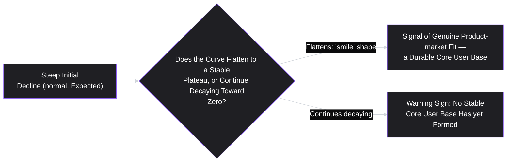
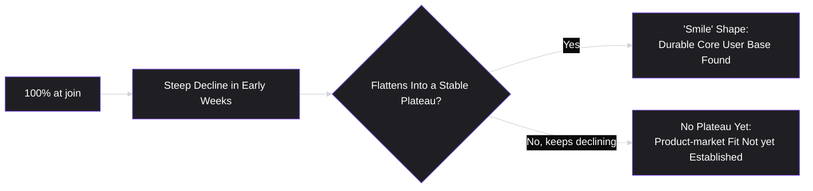

# Lesson 44: Cohort & Retention Analysis

## Why This Lesson Matters

Lesson 43 taught you to decompose a single journey into a funnel and to distrust aggregate numbers that might be hiding segment-specific stories, using Simpson's Paradox as the cautionary principle. This lesson applies a closely related discipline to a different, equally important question: not just whether users convert once, but whether they keep coming back over time — and whether an aggregate trend line showing steady or growing usage might be hiding a much more concerning underlying reality, in exactly the way Lesson 43 warned aggregate funnel numbers could.

This lesson matters because total active users, tracked as a simple trend line over time, is one of the most seductive and most misleading metrics a product organization can rely on, for a specific structural reason: it can grow steadily even while the product is actually losing its existing users at an alarming rate, as long as new user acquisition outpaces that loss. Cohort and retention analysis is the specific technique that unmasks this dynamic, by tracking not "how many total users were active this month" but "of the users who joined in a specific period, what fraction are still active N periods later" — a question that acquisition volume cannot hide the answer to.

---

## Learning Path

| Field | Detail |
|---|---|
| **Module** | 5 — Metrics, Experimentation & Growth |
| **Current Lesson** | 44 of 90 |
| **Difficulty** | 5 / 10 |
| **Estimated Study Time** | 35 minutes (reading) + 15 minutes (reflection + quiz) |
| **Prerequisites** | Lesson 41 (Product Metrics Fundamentals — precise time windows), Lesson 43 (Funnel Analysis — Simpson's Paradox, segmentation) |
| **Next Lesson** | Lesson 45 — A/B Testing & Experimentation |
| **Future Topics Unlocked** | Lesson 45 (A/B Testing & Experimentation), Lesson 46 (Growth Loops & Virality), Lesson 50 (Product-Led Growth) — all build on the cohort-based measurement discipline introduced here |

---

## Learning Objectives

By the end of this lesson, you will be able to:

1. Define a cohort and explain why grouping users by shared start period, rather than looking at aggregate activity, reveals retention dynamics that aggregate trends can hide.
2. Construct and read a cohort retention triangle, tracking how retention changes both across cohorts and across time since joining.
3. Distinguish classic (N-day), rolling, and bracketed retention definitions, and explain when each is most appropriate.
4. Interpret a retention curve's shape, including the "smile" pattern that signals genuine product-market fit versus a curve that continues decaying toward zero.
5. Explain why a growing aggregate active-user trend can coexist with declining underlying retention, and connect this to Lesson 43's Simpson's Paradox and Leaky Bucket concepts.

---

## Prerequisites

This lesson assumes **Lesson 41's** precise time-window definitional discipline, since every retention definition in this lesson depends on specifying an exact time window (7-day, 30-day, or otherwise) with the same rigor any other metric requires. It also directly assumes **Lesson 43's** Simpson's Paradox and Leaky Bucket concepts, since this lesson's central caution — that aggregate active-user trends can hide deteriorating retention — is a close cousin of Lesson 43's warning that aggregate funnel conversion rates can hide segment-specific problems.

---

## Theory

### What a Cohort Is

A **cohort** is a group of users who share a defining starting characteristic, most commonly the time period in which they first joined or signed up — the "January cohort," the "week of March 3rd cohort." Cohort analysis tracks each such group *separately* over time, rather than pooling all users together into a single, undifferentiated aggregate — precisely the segmentation discipline Lesson 43 recommended for funnel data, applied here across the dimension of time-since-joining rather than acquisition channel or device.

### The Cohort Retention Triangle

The standard way to visualize cohort retention data is a **retention triangle** (sometimes called a cohort table or cohort heatmap): each row represents a cohort (grouped by start period), and each column represents a time period since that cohort's start, with each cell showing the percentage of that cohort still active at that point.

| Cohort | Week 0 | Week 1 | Week 2 | Week 3 | Week 4 |
|---|---|---|---|---|---|
| Jan Week 1 | 100% | 45% | 38% | 35% | 34% |
| Jan Week 2 | 100% | 48% | 40% | 37% | 36% |
| Jan Week 3 | 100% | 52% | 44% | 41% | — |
| Jan Week 4 | 100% | 55% | 47% | — | — |

Reading down a column (comparing the same "weeks since joining" across different cohorts) reveals whether retention is improving or worsening for newer cohorts compared to older ones — in this example, Week 1 retention has climbed from 45% to 55% across successive cohorts, a genuinely encouraging trend that a simple aggregate "active users this week" number would not directly reveal. Reading across a row reveals how a single cohort's retention decays (or stabilizes) over its own lifetime — the subject of the next section.

### Classic, Rolling, and Bracketed Retention

Precisely defining "retained," per Lesson 41's discipline, requires choosing among several common conventions:

- **Classic (N-day) retention**: did the user perform a qualifying action on exactly day N after joining? This is strict and can be noisy, since it ignores activity on adjacent days.
- **Rolling retention**: did the user perform a qualifying action on day N *or any day after*? This is more forgiving and tends to produce smoother, higher-looking numbers, since it credits any later return, not just activity on the exact target day.
- **Bracketed retention**: did the user perform a qualifying action at any point *within a window* around day N (for example, days N-3 through N+3)? This balances the strictness of classic retention with rolling retention's tolerance for natural variation in exactly which day a user happens to return.

The choice matters because these three definitions can produce meaningfully different numbers from the identical underlying data — reporting a "40% Day-30 retention rate" without specifying which of these three conventions was used is exactly the kind of imprecision Lesson 41 warns against, and can make retention figures reported by different teams, or even the same team at different times, silently incomparable.

### The Smile Curve: Reading Retention Shape

A single cohort's retention, plotted over time since joining, typically declines — this is normal and expected, since some fraction of any cohort will always churn. The critical question is not whether the curve declines, but *whether it eventually flattens*:

A retention curve that flattens into a stable plateau after its initial decline — sometimes visually resembling the upward curve of a smile when plotted, hence the "smile curve" or "smile test" — indicates that some meaningful fraction of users have found durable, ongoing value and are settling into a stable usage pattern, widely regarded as one of the strongest available quantitative signals of genuine product-market fit. A curve that never flattens, continuing to decay toward zero indefinitely, suggests the product has not yet found the durable core of users who genuinely need it, regardless of how strong its short-term acquisition numbers might look.

### Why Aggregate Active-User Trends Can Mislead

This lesson's central caution, directly extending Lesson 43's Leaky Bucket concept: a company can grow its total active users steadily every month while its underlying, cohort-level retention is actually worsening, as long as new user acquisition volume outpaces the accelerating churn. In this scenario, the aggregate trend line looks healthy and reassuring, while the retention triangle underneath it — reading down the columns — would reveal each successive cohort retaining worse than the one before it. This is precisely why cohort analysis, not aggregate trend-watching, is the appropriate tool for genuinely assessing whether a product is building a durable, sticky user base or merely running faster to fill an increasingly leaky bucket.

---

## Common Beginner Mistakes

**Mistake 1: Relying on a total active-user trend line as the primary signal of product health**

As covered in Theory, this metric can mask deteriorating cohort-level retention entirely, as long as acquisition volume compensates — precisely the failure this lesson's Case Study illustrates in detail.

**Mistake 2: Reporting a retention percentage without specifying which convention (classic, rolling, bracketed) was used**

As covered in Theory, these three definitions can produce meaningfully different numbers from identical data, and omitting this detail makes retention figures silently incomparable across teams or over time.

**Mistake 3: Comparing retention across cohorts of very different sizes without noting the difference**

A cohort of 50 early beta users retaining at 60% and a cohort of 50,000 users retaining at 40% are both meaningful data points, but drawing strong conclusions from small early cohorts as though they carry the same statistical weight as large, mature ones risks over-interpreting noisy, small-sample data.

**Mistake 4: Interpreting any declining retention curve as inherently bad, without checking whether it eventually flattens**

Since some decline is normal and expected for any cohort, the meaningful question is whether a stable plateau eventually emerges — a curve that's still declining at the point of measurement isn't necessarily concerning if it hasn't yet had enough time to reveal whether a plateau will form.

**Mistake 5: Comparing retention curves across cohorts affected by different product changes without accounting for the change**

If a significant feature launched between two cohorts' start dates, comparing their retention curves directly conflates the launch's effect with ordinary cohort-to-cohort variation, unless the comparison explicitly accounts for and isolates that specific change — a concern directly addressed by the controlled experimentation methods in Lesson 45.

---

## Mental Model: The Smile Curve

*(Introduced above in the Theory section; restated here as this lesson's standalone takeaway tool, per curriculum convention.)*

Use the Smile Curve as a standing discipline whenever reviewing a retention chart: don't just ask "is retention declining" (it almost always is, at least initially) — ask specifically "has it flattened yet, and if not, has enough time passed to know whether it will?" A product team chasing acquisition growth while its retention curve has never once flattened is very likely building on an unstable foundation, regardless of how encouraging its total user count looks.

---

## Real Company Example

**Adobe**'s 2013 transition from perpetual-license software (Creative Suite, a one-time purchase) to Creative Cloud (a monthly subscription) is a specific, well-documented business event that makes cohort-based retention analysis existentially necessary rather than merely useful. Announced in May 2013 and covered contemporaneously by outlets including TechCrunch, the shift was met with significant public backlash from existing customers, but it fundamentally changed what "business health" meant for Adobe: under the old perpetual-license model, a single purchase counted as success regardless of whether the customer ever opened the software again; under the subscription model, revenue depends entirely on whether cohorts of subscribers keep renewing month after month. Creative Cloud grew from zero subscribers in 2013 to tens of millions of paying subscribers within a decade — but that growth number alone reveals nothing about whether any given monthly cohort was actually sticking around, which is precisely this lesson's core caution about aggregate totals masking retention health.

This is a sharper illustration than a generic "Netflix cares about retention" claim because it's a company observably built two different businesses — one where retention barely mattered to the metric that counted as success, and one where it became the central determinant of revenue — and the transition between them is exactly when cohort-based analysis stops being optional.

*(Source: TechCrunch's May 2013 contemporaneous coverage of Adobe's announcement, and Adobe's own reported subscriber figures in subsequent years.)*

The underlying principle connects directly to this lesson's Theory: for a subscription-based product where the business fundamentally depends on members continuing to renew month after month, cohort-level retention is a far more direct signal of business health than aggregate subscriber counts alone, which, per this lesson's central caution, can rise even while underlying retention quietly deteriorates.

---

## Real World Perspective: Cohort & Retention Analysis at Different Company Stages

**At a startup:**
Cohort sizes are often small, making retention curves noisy and hard to interpret with confidence (Mistake 3) — a startup should be cautious about over-interpreting small-sample retention data, while still tracking it, since it's often the earliest genuine signal of product-market fit available, well before revenue or growth metrics would reveal anything meaningful.

**At a mid-size company:**
Cohort retention analysis typically becomes a standard, recurring practice, often reviewed alongside the aggregate active-user trend specifically to catch the divergence this lesson warns about — a healthy-looking aggregate trend paired with worsening cohort retention is a pattern experienced product organizations learn to actively watch for at this stage.

**At Big Tech:**
Retention analysis is often highly sophisticated, with cohorts segmented across many dimensions simultaneously (acquisition channel, geography, platform, feature adoption) and dedicated data science support for statistically rigorous comparison across cohorts, including proper handling of the product-change confounding described in Mistake 5. The PM's job shifts toward correctly interpreting complex, multi-dimensional retention data and prioritizing which segment's retention trend deserves the most urgent attention.

---

## Detailed Case Study: The Growth Chart That Was Hiding a Leak

Consider a simplified, illustrative scenario that extends this lesson's central caution directly.

A consumer app's leadership reviews a monthly active user chart showing confident, steady growth for six consecutive quarters, and treats this as clear evidence the product is succeeding. Marketing spend is increased accordingly to accelerate acquisition further, based on the assumption that the growing user count reflects a genuinely healthy, improving product.

A newly hired data analyst, building a cohort retention triangle for the first time, discovers a very different underlying story: reading down the columns of the triangle, Week-4 retention has been declining steadily, cohort over cohort, for the same six quarters — from roughly 38% for the earliest cohort to just 19% for the most recent one. The aggregate active-user growth had been masking this entirely, because each successive cohort, while retaining progressively worse, was also larger than the one before it (due to increased marketing spend), so the sheer volume of new users continued to outpace the accelerating rate of loss.

**What went wrong?**

This is a direct, worked illustration of this lesson's central caution and Lesson 43's Leaky Bucket concept combined: the "bucket" (the product's ability to retain users) was leaking progressively faster with each successive cohort, while the "water poured in" (new user acquisition) was simultaneously increasing even faster, producing a rising water level (aggregate active users) that visually suggested health despite the accelerating leak underneath. Leadership's decision to increase marketing spend based on the aggregate trend alone was, in retrospect, actively counterproductive — it was pouring more water into an increasingly leaky bucket rather than addressing the leak itself, and every dollar of that increased spend was acquiring users at a retention rate that made each new cohort a progressively worse long-term investment than the one before it.

The corrective response required treating the declining Week-4 retention trend, not the aggregate active-user count, as the organization's primary health signal going forward — pausing further acquisition spend increases until the underlying retention decline was diagnosed and addressed. Diagnosing the specific cause of the declining retention (a product change, a shift in acquisition channel mix, or something else) requires exactly the segmentation techniques from **Lesson 43**, applied here across cohorts rather than funnel steps, and validating any proposed fix rigorously, rather than assuming it will work, is the subject of **Lesson 45 (A/B Testing & Experimentation)**, immediately following this lesson.

---

## Framework Explanation: The Retention Health Check

A second, more tactical tool: use this checklist whenever reviewing an aggregate growth metric, to actively guard against the exact failure illustrated in this lesson's Case Study.

| Check | Question | Warning Sign |
|---|---|---|
| Cohort trend direction | Reading down the retention triangle's columns, is each successive cohort retaining better, worse, or the same? | Declining retention across successive cohorts, even while aggregate totals grow |
| Curve shape | Has the retention curve for mature cohorts flattened into a plateau, or is it still decaying? | No plateau has ever emerged, even for the organization's oldest cohorts |
| Definition consistency | Is the same retention convention (classic, rolling, bracketed) and time window being used consistently across all reported comparisons? | Different teams or time periods silently using different conventions |
| Acquisition-retention relationship | Is acquisition volume increasing at the same time retention is declining, potentially masking the decline in aggregate numbers? | Rising aggregate totals coinciding with worsening cohort-level retention, as in this lesson's Case Study |

An organization whose growth reviews check only the aggregate trend, without ever walking through this checklist, is at meaningful risk of the exact blind spot this lesson's Case Study describes.

---

## Interview Perspective: How Interviewers Think About This

**Typical question 1: "How would you know if a product's growth is healthy or masking a retention problem?"**
*What the interviewer is actually evaluating:* Whether the candidate immediately reaches for cohort-based retention analysis rather than trusting an aggregate active-user trend alone, directly testing this lesson's central caution.

**Typical question 2: "What does it mean for a retention curve to 'flatten,' and why does that matter?"**
*What the interviewer is actually evaluating:* Whether the candidate understands the Smile Curve concept specifically — that a flattening plateau, not simply the presence of any retained users, is the meaningful signal of durable product-market fit.

**Typical question 3: "A retention metric looks good this quarter compared to last. What would you want to verify before trusting that comparison?"**
*What the interviewer is actually evaluating:* Whether the candidate checks for definitional consistency (classic vs. rolling vs. bracketed, same time window) and potential confounding product changes between the compared periods, rather than accepting the comparison at face value.

---

## Summary

Cohort analysis groups users by shared starting period and tracks each group's behavior separately over time, using a retention triangle to reveal both how retention changes across successive cohorts (reading down columns) and how a single cohort's engagement decays or stabilizes over its own lifetime (reading across rows) — a discipline that closely extends Lesson 43's segmentation principle across the dimension of time-since-joining. Retention must be precisely defined using one of three common conventions (classic N-day, rolling, or bracketed), since these can produce meaningfully different numbers from identical underlying data. The Smile Curve mental model captures this lesson's central interpretive insight: a retention curve's decline is normal and expected, but whether it eventually flattens into a stable plateau — rather than continuing to decay toward zero — is the meaningful signal of genuine, durable product-market fit. This lesson's central caution, illustrated in its Case Study, is that an aggregate active-user trend can look healthy and growing while cohort-level retention is actually worsening steadily, as long as increasing acquisition volume outpaces the accelerating churn — directly extending Lesson 43's Leaky Bucket concept, since a growing "water level" can mask an increasingly severe underlying leak.

---

## Key Takeaways

- A cohort groups users by shared starting period and tracks that group's behavior separately over time, rather than pooling all users into a single aggregate trend.
- A cohort retention triangle reveals two distinct things: whether successive cohorts are retaining better or worse (reading down columns) and how a single cohort decays or stabilizes over its own lifetime (reading across rows).
- Retention must be defined precisely as classic (N-day), rolling, or bracketed — these conventions can produce meaningfully different numbers from identical data, and must be specified to avoid silent incomparability.
- A retention curve that flattens into a stable plateau after its initial decline (the "smile" shape) signals genuine, durable product-market fit; a curve that never flattens suggests that fit hasn't yet been established.
- An aggregate active-user trend can grow steadily while cohort-level retention worsens, as long as acquisition volume outpaces accelerating churn — this is this lesson's central, most consequential caution.
- Small early cohorts produce noisy retention data that shouldn't be over-interpreted with the same confidence as large, mature cohorts.
- Comparing retention curves across cohorts affected by different product changes requires accounting for those changes explicitly, or risks conflating the change's effect with ordinary cohort variation.

---

## Cheat Sheet

*A two-minute review of everything in this lesson.*

- **Cohort:** users grouped by shared start period, tracked separately over time.
- **Retention triangle:** rows = cohorts, columns = time since start; read down for cohort-over-cohort trend, across for single-cohort decay.
- **Three retention conventions:** classic (exact day N), rolling (day N or later), bracketed (window around day N) — specify which one.
- **Smile Curve:** decline is normal; the meaningful question is whether it flattens into a stable plateau.
- **Central caution:** aggregate active-user growth can mask worsening cohort-level retention if acquisition outpaces churn.
- **Retention Health Check:** cohort trend direction, curve shape, definition consistency, acquisition-retention relationship.
- **Small cohorts are noisy:** don't over-interpret early, small-sample retention data with high confidence.

---

## Glossary

| Term | Definition | Related Concepts | Difficulty |
|---|---|---|---|
| Cohort | A group of users sharing a defining starting characteristic, most commonly their join period, tracked separately over time | Retention triangle | 1 |
| Retention triangle | A table visualizing cohort retention, with rows as cohorts and columns as time periods since each cohort's start | Cohort | 1 |
| Classic (N-day) retention | Whether a user performed a qualifying action on exactly day N after joining | Rolling retention, Bracketed retention | 2 |
| Rolling retention | Whether a user performed a qualifying action on day N or any day after | Classic retention | 2 |
| Bracketed retention | Whether a user performed a qualifying action within a window around day N | Classic retention, Rolling retention | 2 |
| Smile Curve | A retention curve shape that flattens into a stable, non-zero plateau over time, signaling durable value delivery and product-market fit. | Product-market fit | 1 |

---

## Further Reading / Resources

- *Lean Analytics* by Alistair Croll and Benjamin Yoskovitz — revisited here for its treatment of cohort analysis and retention curve interpretation.
- "The Case for Cohort Analysis" and related practitioner writing on retention triangles, widely referenced across growth and analytics literature.
- *Hooked: How to Build Habit-Forming Products* by Nir Eyal — relevant background on the behavioral dynamics underlying retention curve shape and habit formation.

---

## Flashcards

**Card 1**
- Front: What is a cohort, in the context of product metrics?
- Back: A group of users sharing a defining starting characteristic, most commonly their join period, tracked separately over time rather than pooled into an aggregate.
- Difficulty: 1
- Tags: cohort-definition

**Card 2**
- Front: What do you learn by reading down a retention triangle's columns versus across its rows?
- Back: Reading down columns compares the same "time since joining" across successive cohorts (improving or worsening trend); reading across rows shows how a single cohort decays or stabilizes over its own lifetime.
- Difficulty: 2
- Tags: retention-triangle

**Card 3**
- Front: Name the three common retention conventions.
- Back: Classic (N-day): exact day N; Rolling: day N or any day after; Bracketed: within a window around day N.
- Difficulty: 2
- Tags: retention-conventions

**Card 4**
- Front: What does a "smile" shaped retention curve indicate?
- Back: The curve flattens into a stable plateau after its initial decline, signaling that a meaningful fraction of users have found durable value — a strong signal of genuine product-market fit.
- Difficulty: 1
- Tags: smile-curve

**Card 5**
- Front: How can an aggregate active-user trend mislead about a product's actual health?
- Back: It can grow steadily even while cohort-level retention is worsening, as long as increasing acquisition volume outpaces the accelerating churn rate.
- Difficulty: 2
- Tags: aggregate-vs-cohort

**Card 6**
- Front: In the Detailed Case Study, what did the retention triangle reveal that the aggregate active-user chart hid?
- Back: Week-4 retention had been declining steadily across six quarters of successive cohorts (38% to 19%), masked by each cohort also being larger than the last due to increased marketing spend.
- Difficulty: 2
- Tags: case-study

## Reflection Exercise

Consider the following novel scenario: You're a PM reviewing your product's monthly active user chart, which has grown 8% month-over-month for the past year — a trend leadership has celebrated repeatedly. You've never built a cohort retention triangle for this product before.

There is no single correct answer to the prompts below — the goal is to practice applying this lesson's frameworks, not to reach one "right" answer.

1. Using the Retention Health Check, what specific data would you need to gather to determine whether this growth trend might be masking a retention problem?
2. If you build a retention triangle and find that Week-4 retention has been flat across all cohorts, what would that suggest about the growth trend's health, compared to if retention were declining?
3. If retention curves for your oldest cohorts have never flattened into a plateau, even after many months, what would that suggest about the product's current stage, using the Smile Curve model?
4. How would you communicate a finding of declining cohort-level retention to leadership, given that they've been celebrating the aggregate growth trend for a year?
5. What would you want to investigate next if you did find declining retention, drawing on Lesson 43's segmentation techniques?

---

## Quiz

**1. What is a cohort, according to this lesson?**
A) A random sample of users drawn across all join dates
B) Another name for an active user in this curriculum
C) A measurement used within Kanban-based teams
D) Users sharing a join period, tracked apart

*Correct answer: D*
*Explanation: The grouping is what makes the analysis work. Pooling everyone together is precisely what conceals the dynamics cohort analysis exists to expose.*
*Learning objective tested: #1*
*Difficulty: Easy*

---

**2. In a cohort retention triangle, what does reading down a single column reveal?**
A) Whether newer cohorts retain better or worse
B) How one cohort's retention decays over its life
C) The total revenue produced across every cohort
D) No useful signal; rows carry the information

*Correct answer: A*
*Explanation: A column holds the same week-since-joining for every cohort, so the comparison is like-for-like across time. Option B describes reading across a row instead.*
*Learning objective tested: #2*
*Difficulty: Easy*

---

**3. What is the difference between classic (N-day) and rolling retention?**
A) They are identical measures under two labels
B) Classic applies to mobile; rolling to desktop
C) Classic checks day N exactly; rolling counts any later return
D) Rolling retention is stricter than classic retention

*Correct answer: C*
*Explanation: Because rolling credits any subsequent visit, it produces smoother and generally higher figures from the same underlying events.*
*Learning objective tested: #3*
*Difficulty: Easy*

---

**4. What does a "smile" shaped retention curve indicate?**
A) That the cohort experienced no churn whatsoever
B) That acquisition spending is performing efficiently
C) That retention has decayed toward zero over time
D) That some users settled into durable ongoing usage

*Correct answer: D*
*Explanation: Every curve declines at first, so decline alone says little. The plateau is the signal, because it means a share of the cohort stopped leaving.*
*Learning objective tested: #4*
*Difficulty: Easy*

---

**5. Why can an aggregate active-user trend look healthy while cohort-level retention is actually worsening?**
A) Because aggregate charts are computed incorrectly
B) New acquisition volume outpaces the accelerating churn
C) Because retention figures lag by one full quarter
D) Because active users and retention are unrelated

*Correct answer: B*
*Explanation: The total is a balance of arrivals against departures. Spending enough on the first can keep the line rising while the second gets steadily worse.*
*Learning objective tested: #5*
*Difficulty: Easy*

---

**6. How does this lesson's central caution connect to Lesson 43's Leaky Bucket concept?**
A) The bucket model applies to funnels and not retention
B) Acquisition is the leak; retention is the water poured
C) Rising water can hide a leak that widens beneath it
D) The two ideas have no bearing on one another

*Correct answer: C*
*Explanation: Option B has the metaphor inverted. Acquisition is what fills the bucket; retention is what determines how much of it stays in.*
*Learning objective tested: #5*
*Difficulty: Easy*

---

**7. In the Detailed Case Study, what specific data did the newly hired analyst discover that leadership's aggregate chart had hidden?**
A) Week-4 retention falling cohort over cohort for six quarters
B) That the aggregate chart had been built from stale data
C) That the newest cohorts had retained better than the oldest ones
D) That the retention triangle contained no readable signal

*Correct answer: A*
*Explanation: The figure moved from roughly 38% to 19% over the same six quarters the growth chart had been climbing. Both readings were accurate.*
*Learning objective tested: #5*
*Difficulty: Medium*

---

**8. Why was leadership's decision to increase marketing spend, based on the aggregate trend alone, described as "actively counterproductive" in the Case Study?**
A) Because marketing spend is wasteful in every situation
B) Because the aggregate chart itself was inaccurate
C) It bought larger cohorts that each retained worse
D) Because acquisition and retention are separate concerns

*Correct answer: C*
*Explanation: Each additional dollar was buying users at a worse retention rate than the dollar before it, so the spend made the underlying position worse while improving the headline.*
*Learning objective tested: #5*
*Difficulty: Medium*

---

**9. Why does this lesson caution against over-interpreting retention data from small, early cohorts?**
A) Small cohorts produce noisy rates on few users
B) Early cohorts carry no relevance to product health
C) Small cohorts cannot be measured by any tool
D) Retention is undefined below a hundred users

*Correct answer: A*
*Explanation: With forty users in a cohort, two people returning or not moves the rate by five points. The number is real and carries little information.*
*Learning objective tested: #3*
*Difficulty: Medium*

---

**10. Using the Retention Health Check, which combination of signals most directly matches the pattern illustrated in this lesson's Case Study?**
A) Flat retention paired with flat acquisition volume
B) Improving retention alongside falling acquisition spend
C) Consistent conventions paired with a flattened curve
D) Rising totals with worsening cohort retention

*Correct answer: D*
*Explanation: This is the checklist's acquisition-retention row, and it is the one combination in which the headline number and the underlying health point in opposite directions.*
*Learning objective tested: #5*
*Difficulty: Medium*

---

**11. (Interview Reasoning) A candidate is asked how they'd assess whether a product's growth is healthy, and answers: "I'd look at the total user count trend over the past year." Based on this lesson's Interview Perspective section, what is the weakness in this answer?**
A) No weakness; the total trend answers the question fully
B) A total can rise while each cohort retains worse
C) It omits any reference to the Scrum framework
D) It relies on a metric that cannot be measured

*Correct answer: B*
*Explanation: The word in the question is "healthy," not "growing." The candidate has answered the easier question without noticing they are different.*
*Learning objective tested: #5*
*Difficulty: Hard*

---

**12. Why does this lesson recommend specifying which retention convention (classic, rolling, or bracketed) was used whenever reporting a retention figure?**
A) The three conventions give different numbers
B) Because the conventions are required by regulation
C) Because rolling retention is the accurate convention
D) Because classic retention suits enterprise products

*Correct answer: A*
*Explanation: "40% Day-30 retention" is three different claims depending on the convention behind it, and two teams quoting it may be silently incomparable.*
*Learning objective tested: #3*
*Difficulty: Medium-Hard*

---

**13. (Product Thinking) A retention curve for a product's oldest, most mature cohort is still declining steadily at the 12-month mark, having never flattened. Using the Smile Curve model, what does this suggest?**
A) Retention ought to be measured over a shorter window
B) No durable core has emerged, so product-market fit stays unproven
C) The decline confirms healthy, expected cohort behaviour
D) The cohort is too old for the curve to mean much

*Correct answer: B*
*Explanation: Twelve months is long enough that a plateau would have appeared if one were coming. Strong acquisition numbers do not substitute for that evidence.*
*Learning objective tested: #4*
*Difficulty: Hard*

---

**14. Why does comparing retention curves across cohorts affected by different product changes require special caution, according to this lesson?**
A) Because comparing cohorts of unequal size is forbidden outright
B) The change's effect blends into ordinary cohort variation
C) Because product changes leave retention untouched
D) Because retention curves are identical across cohorts

*Correct answer: B*
*Explanation: Cohorts differ from one another for reasons that have nothing to do with the release. Without accounting for the change, the two causes arrive as one number.*
*Learning objective tested: #5*
*Difficulty: Medium-Hard*

---

**15. (Product Thinking, Highest Difficulty) A team wants to know whether a recent onboarding redesign genuinely improved retention, by comparing the retention curve of cohorts who joined after the redesign to cohorts who joined before it. Using this lesson's and Lesson 43's frameworks together, what is the most rigorous approach?**
A) Compare the two curves and treat any gap as proof
B) Assume the redesign worked, given the effort invested
C) Segment for confounds, then validate with a controlled test
D) Wait a further year before drawing any conclusion

*Correct answer: C*
*Explanation: A channel-mix shift across the same period would produce the same gap. Segmentation narrows the explanations; an experiment is what settles between them.*
*Learning objective tested: #5*
*Difficulty: Hard*

---

## Connections

| | Lesson | Core Idea Carried Forward |
|---|---|---|
| **Previous Lesson** | Lesson 43 — Funnel Analysis | Extends Lesson 43's segmentation and Simpson's Paradox/Leaky Bucket concepts across the dimension of time-since-joining, via cohorts |
| **Current Lesson** | Lesson 44 — Cohort & Retention Analysis | Retention triangle; classic/rolling/bracketed retention; Smile Curve; the aggregate-vs-cohort masking caution |
| **Next Lesson** | Lesson 45 — A/B Testing & Experimentation | Provides the rigorous method for validating whether a proposed fix to a retention or funnel problem actually causes improvement |
| **Future Concepts Unlocked** | Lesson 46 (Growth Loops & Virality) | Builds growth loop analysis on top of the retention foundation established here |
| | Lesson 50 (Product-Led Growth) | Depends on cohort-level retention as a core health signal for growth strategy |

This curriculum is designed to be read as one continuous argument, not ninety independent articles. Every lesson from here forward will assume you carry cohort analysis, the retention triangle, and the Smile Curve with you — they will not be re-explained, only re-applied in new contexts.
