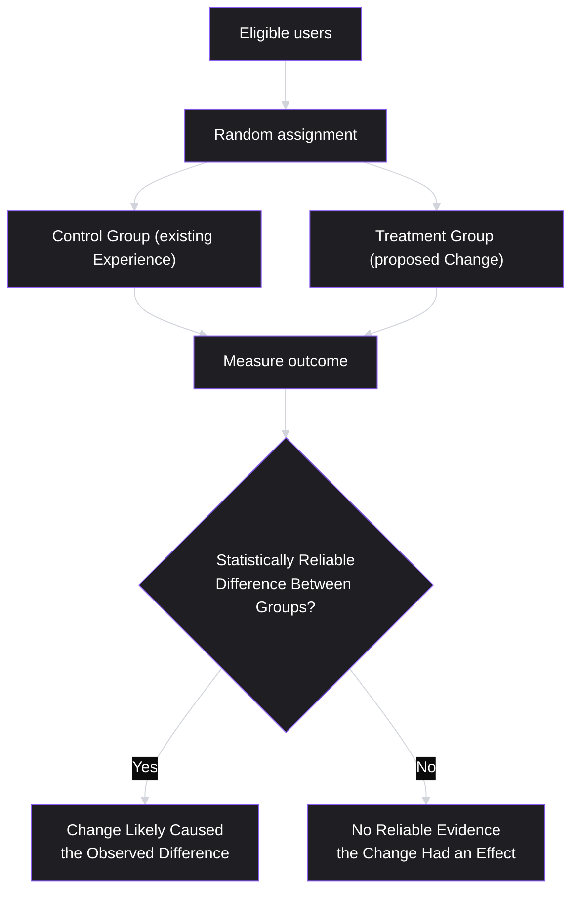
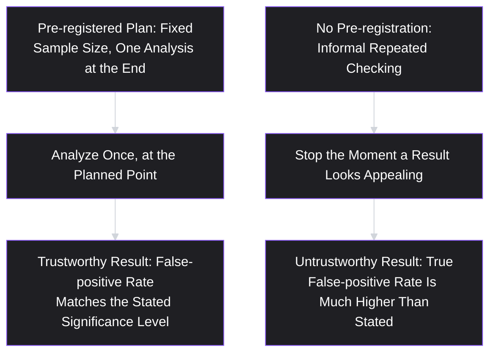

# Lesson 45: A/B Testing & Experimentation

## Why This Lesson Matters

Three consecutive lessons have now ended by pointing forward to this one. Lesson 43's funnel Case Study found a plausible, evidence-based cause for a drop-off but stopped short of proving the proposed fix would actually work. Lesson 44's retention Case Study and Reflection Exercise both noted that a before-and-after cohort comparison cannot fully rule out confounding factors. In both cases, the missing piece is the same: a rigorous way to establish that a specific change *causes* a specific improvement, rather than merely correlating with one — precisely the correlation-versus-causation gap Lesson 41 first flagged and explicitly left unresolved until now.

This lesson closes that gap. A/B testing (more formally, controlled experimentation) is the discipline of randomly assigning users to different versions of a product experience and measuring the difference in outcomes between them — random assignment being the specific mechanism that allows a PM to conclude, with quantified confidence, that an observed difference was actually caused by the change rather than by some other factor that happened to vary alongside it. This lesson also covers the discipline's most common failure modes, since a poorly run experiment can produce a confident, precise-looking, and completely wrong answer — often more dangerous than no experiment at all, because it carries false authority.

---

## Learning Path

| Field | Detail |
|---|---|
| **Module** | 5 — Metrics, Experimentation & Growth |
| **Current Lesson** | 45 of 90 |
| **Difficulty** | 6 / 10 |
| **Estimated Study Time** | 40 minutes (reading) + 15 minutes (reflection + quiz) |
| **Prerequisites** | Lesson 41 (Product Metrics Fundamentals — correlation vs. causation, guardrail metrics), Lesson 43 (Funnel Analysis), Lesson 44 (Cohort & Retention Analysis) |
| **Next Lesson** | Lesson 46 — Growth Loops & Virality |
| **Future Topics Unlocked** | Lesson 46 (Growth Loops & Virality), Lesson 50 (Product-Led Growth), Lesson 57 (Ethics in Product Management, which revisits experimentation's ethical boundaries) — all build on the experimental validity discipline introduced here |

---

## Learning Objectives

By the end of this lesson, you will be able to:

1. Explain why random assignment is the specific mechanism that allows a controlled experiment to establish causation, resolving the correlation-versus-causation gap from Lesson 41.
2. Define statistical significance and explain, in plain language, what a p-value does and does not tell you.
3. Explain sample size and statistical power, and why an underpowered experiment risks missing a genuine effect entirely.
4. Diagnose "peeking" — stopping an experiment early based on an interim result — and explain why it inflates false-positive rates.
5. Apply a pre-registration discipline (defining hypothesis, primary metric, guardrails, and sample size before launching) to design a trustworthy experiment.

---

## Prerequisites

This lesson assumes **Lesson 41's** full toolkit: precise metric definitions, Goodhart's Law, guardrail metrics, and especially the correlation-versus-causation caution this lesson directly resolves. It also assumes **Lesson 43's** and **Lesson 44's** open threads — both lessons identified a plausible fix for a real problem but explicitly deferred the question of rigorously validating that fix to this lesson.

---

## Theory

### Why Random Assignment Establishes Causation

Recall Lesson 41's caution: two metrics moving together doesn't establish that one causes the other, because a confounding variable might independently drive both. A controlled experiment solves this specific problem through **random assignment**: users are randomly split into a control group (seeing the existing experience) and one or more treatment groups (seeing the proposed change), with randomization ensuring that, on average, the two groups are statistically identical in every other respect — same mix of acquisition channels, same mix of device types, same mix of user tenure, same mix of literally everything else that might otherwise confound the comparison. Because random assignment neutralizes every other systematic difference between the groups, any statistically reliable difference in outcomes between them can be attributed to the one thing that was deliberately varied: the change being tested.

### Statistical Significance and P-Values, in Plain Language

A **p-value** answers a specific, narrow question: if the change genuinely had *no real effect at all*, how likely would it be to observe a difference this large (or larger) between groups purely by random chance? A small p-value (conventionally, below 0.05, though the right threshold depends on context) suggests the observed difference would be unlikely to arise from chance alone if there were truly no effect, giving some confidence that a real effect exists. Critically, a p-value does *not* tell you the probability that the change actually works, nor does it tell you how large or practically meaningful the effect is — a large sample size can produce a statistically significant result for an effect too small to matter practically, and a small sample size can fail to reach significance even for an effect that's genuinely large and meaningful, simply because there wasn't enough data to detect it reliably.

### Sample Size and Statistical Power

**Statistical power** is the probability that an experiment will correctly detect a real effect, if one genuinely exists, at a given sample size. An **underpowered** experiment — one run with too few users relative to the size of the effect being tested for — risks concluding "no significant difference found" not because the change had no effect, but simply because the experiment never had enough data to reliably detect an effect of that size, even if a real one existed. Before running an experiment, a PM should estimate the **minimum detectable effect** (the smallest change worth caring about, business-wise) and ensure the planned sample size is large enough to reliably detect an effect of that size — running an experiment without this calculation risks either wasting resources on a hopelessly underpowered test, or running it far longer than necessary for an effect large enough to be obvious much sooner.

### The Peeking Problem

A specific and extremely common mistake deserves detailed treatment: **peeking** — checking an experiment's results before it reaches its planned sample size or duration, and stopping it early the moment the result happens to look statistically significant. This inflates the true false-positive rate far beyond the nominal significance threshold, because random noise naturally causes an experiment's measured difference to fluctuate above and below the true effect throughout its run — checking repeatedly and stopping at the first moment the fluctuation happens to cross a significance threshold is systematically biased toward catching noise, not signal, since a sufficiently long-running experiment on a null effect will, by chance, cross a nominal 0.05 significance threshold at some point during its run far more than 5% of the time if checked and potentially stopped repeatedly.

```mermaid
%%{init: {
  "theme": "dark",
  "themeVariables": {
    "background": "#0b0b0c",
    "primaryColor": "#1f1f23",
    "primaryTextColor": "#ffffff",
    "primaryBorderColor": "#8b5cf6",
    "lineColor": "#d1d5db",
    "secondaryColor": "#18181b",
    "tertiaryColor": "#111111",
    "mainBkg": "#1f1f23",
    "nodeBorder": "#8b5cf6",
    "clusterBkg": "#000000",
    "clusterBorder": "#27272a",
    "titleColor": "#ffffff",
    "edgeLabelBackground": "#0b0b0c",
    "nodeTextColor": "#ffffff",
    "edgeLabelColor": "#ffffff",
    "actorBorder": "#8b5cf6",
    "actorBkg": "#1f1f23",
    "actorTextColor": "#ffffff",
    "sequenceNumberColor": "#ffffff",
    "signalColor": "#8b5cf6",
    "signalTextColor": "#ffffff",
    "textColor": "#ffffff",
    "classText": "#ffffff",
    "classBorder": "#8b5cf6",
    "classBkg": "#1f1f23"
  }
}}%%
graph LR
    A[Experiment starts] --> B[Day 1: Check Result<br/>— Not Significant Yet]
    B --> C[Day 2: Check Result<br/>— Not Significant Yet]
    C --> D[Day 3: Check Result<br/>— Appears Significant!]
    D --> E[Stop and Ship Based on Day 3 Result]
    E -.->|Risk: This May Be a Random<br/>Fluctuation, Not a Real Effect| F[False positive]
```

The correct discipline is to determine the required sample size and duration *before* launching the experiment (per the previous section), and either wait until that pre-determined point to analyze results, or use a statistical method specifically designed to allow valid early stopping (sequential testing methods), rather than informally checking and stopping at the first appealing-looking result.

### Pre-Registration: Deciding Before You Look

The most reliable defense against both peeking and other, subtler forms of unintentional bias (sometimes called p-hacking when done more deliberately) is **pre-registration**: writing down, before the experiment launches, the specific hypothesis being tested, the single primary metric that will determine success, the guardrail metrics (Lesson 41) being monitored to catch unintended harm, the planned sample size and duration, and the specific threshold that will count as a meaningful result. Committing to these decisions in advance prevents the natural, often unconscious temptation to retroactively decide "well, this secondary metric moved significantly, so let's call that our success metric instead" after seeing results that didn't confirm the original hypothesis — a pattern that, applied loosely enough across many possible metrics, will eventually find *something* that looks significant purely by chance, without that finding representing a genuine effect.

---

## Common Beginner Mistakes

**Mistake 1: Treating a statistically significant result as proof the change definitely works and is worth shipping**

As covered in Theory, statistical significance indicates the observed difference is unlikely to be pure chance — it says nothing about whether the effect size is practically meaningful, and a significant-but-tiny effect may not be worth the cost of shipping and maintaining the change.

**Mistake 2: Running an experiment without first calculating the required sample size**

As covered in Theory, this risks either wasting effort on a severely underpowered test that will very likely fail to detect a real effect, or leaving an experiment running far longer than necessary once a large, obvious effect could have been detected sooner.

**Mistake 3: Peeking at results and stopping the experiment early upon seeing an appealing result**

As covered in Theory, this specific behavior systematically inflates false positives, and is one of the single most common ways a well-intentioned experimentation program produces unreliable, non-reproducible results.

**Mistake 4: Checking many secondary metrics after the fact and treating whichever one moved significantly as the "real" result**

This is a subtler cousin of peeking — testing enough metrics, by chance alone, some will appear significant even with no genuine underlying effect, which is precisely why pre-registering a single primary metric in advance is essential.

**Mistake 5: Ignoring guardrail metrics because the primary metric improved**

An experiment that improves its primary metric while quietly damaging a guardrail metric (echoing Lesson 41's Goodhart's Law caution, and Lesson 45's own version of the same principle applied to a single experiment rather than an ongoing target) should not be shipped without understanding and addressing that trade-off explicitly.

---

## Mental Model: The Peeking Trap

This lesson's core takeaway tool visualizes why informal, repeated checking of an in-progress experiment is fundamentally different from — and far riskier than — a single, planned analysis at a pre-determined endpoint:

Use the Peeking Trap as a standing discipline whenever tempted to check an in-progress experiment's results before its planned endpoint: remind yourself that an appealing-looking interim result is not evidence of a real effect — it's exactly the kind of noise a properly powered, pre-registered experiment is specifically designed to filter out, and giving in to the temptation to stop early defeats that purpose entirely.

---

## Real Company Example

**Google** has been publicly associated, through widely reported accounts including public statements by former Google executive Marissa Mayer, with a well-documented 2009 experiment testing 41 different shades of blue for a UI element, to determine empirically which shade produced the best click-through performance, rather than settling the question through internal design opinion alone.

The underlying principle connects directly to this lesson's Theory: even a seemingly minor design decision (a specific shade of a color) can be tested rigorously through controlled experimentation rather than debated on the basis of individual taste or intuition, and the story has become a widely cited (and sometimes debated) illustration of just how granular and data-driven experimentation culture can become at organizations operating at very large scale, where even small, statistically detectable effects can translate into meaningful aggregate business impact.

*(Assumption flagged: this reflects a widely and publicly reported anecdote, discussed in numerous secondary sources and public statements attributed to Marissa Mayer, not a confirmed, complete, or independently verified account of Google's specific internal experimentation methodology or results from this particular test. The durable lesson is the underlying principle — rigorous experimentation can resolve even granular design questions with empirical evidence rather than opinion — rather than a claim to verify every specific detail of this frequently retold story.)*

---

## Real World Perspective: A/B Testing & Experimentation at Different Company Stages

**At a startup:**
Formal A/B testing is often impractical, since a startup's total user base may be too small to reach adequate statistical power within a reasonable timeframe for anything but the largest, most obvious effects. Reliance on qualitative research (Lesson 8, Lesson 38) and directional signal from smaller-scale tests is often more appropriate at this stage than expecting rigorous statistical significance on every decision.

**At a mid-size company:**
This is typically the stage where formal A/B testing infrastructure and discipline become genuinely valuable, since sufficient traffic exists to reach meaningful sample sizes within reasonable timeframes, and enough decisions are being made that a systematic, less opinion-driven process for validating changes becomes worth the investment.

**At Big Tech:**
Experimentation is often deeply institutionalized, with dedicated platforms supporting many simultaneous experiments, automated guardrail monitoring, and statistical rigor enforced through required pre-registration and standardized power calculations — precisely the culture illustrated by the Google shades-of-blue example. The PM's job shifts toward correctly designing experiments within this infrastructure, interpreting results rigorously (resisting both Mistake 1's overconfidence and Mistake 3's peeking temptation), and understanding how multiple simultaneous experiments interact without contaminating each other's results.

---

## Detailed Case Study: The Fix That Looked Like It Worked

Consider a simplified, illustrative scenario that directly continues Lesson 43's funnel Case Study — the company that diagnosed a paid-channel expectation mismatch causing drop-off at a project setup step.

Armed with a specific, evidence-based hypothesis (adjusting the paid channel's marketing messaging to set accurate expectations would improve conversion at the setup step), the team launches a controlled experiment: half of new paid-channel users see the adjusted messaging, half see the original. Eager to see results, the PM checks the experiment dashboard daily. On day four, the treatment group's conversion rate is meaningfully higher than the control group's, with a p-value just under 0.05. Excited, the PM stops the experiment immediately and ships the new messaging to all paid-channel users.

Over the following month, however, overall paid-channel conversion at the setup step doesn't show the improvement the four-day experiment suggested — it settles back to roughly where it was before the change, with no meaningful, lasting difference detectable.

**What went wrong?**

This is a direct, worked illustration of the Peeking Trap: the experiment was never pre-registered with a planned sample size or duration, and the PM's daily checking, stopping at the first appealing-looking result, is precisely the behavior this lesson's Theory identifies as systematically inflating false positives. The day-four result was very likely a random fluctuation — noise that happened, by chance, to cross the nominal significance threshold at that particular moment — rather than genuine evidence of a real, lasting effect, and the subsequent month's data (effectively serving as an unplanned larger sample) revealed the true, much smaller or nonexistent effect.

The corrective process for any future experiment requires exactly what this lesson's Theory prescribes: calculating the required sample size before launch, based on a realistic minimum detectable effect estimate, and committing to a single analysis at that pre-determined point rather than informal daily checking. Notably, the underlying hypothesis from Lesson 43's Case Study (a messaging-expectation mismatch) may still have been correct — this Case Study's failure is not necessarily evidence the hypothesis was wrong, but a demonstration that the specific experiment run to test it was not conducted rigorously enough to actually confirm or deny it. A properly powered, pre-registered re-run of the same experiment would be the appropriate next step, rather than either abandoning the hypothesis or reflexively re-shipping the original change based on the flawed initial result.

---

## Framework Explanation: The Experiment Pre-Registration Checklist

A second, more tactical tool: complete this checklist before launching any experiment, and resist the temptation to revise any of these fields after seeing interim results.

| Field | What to Specify Before Launch |
|---|---|
| Hypothesis | The specific, falsifiable claim being tested (e.g., "adjusted messaging will increase setup-step conversion for paid-channel users") |
| Primary metric | The single metric that will determine success — chosen and locked in advance, not selected retroactively from whichever moved |
| Guardrail metrics | Secondary metrics monitored to catch unintended harm, per Lesson 41's Goodhart's Law caution |
| Minimum detectable effect | The smallest effect size that would be practically meaningful enough to justify shipping the change |
| Required sample size / duration | Calculated in advance based on the minimum detectable effect and current traffic levels |
| Analysis plan | A commitment to analyze results once, at the pre-determined endpoint, rather than through informal repeated checking |

An experiment launched without completing this checklist in advance is at meaningful risk of producing exactly the kind of unreliable, non-reproducible result illustrated in this lesson's Case Study — regardless of how sound the underlying hypothesis might genuinely be.

---

## Interview Perspective: How Interviewers Think About This

**Typical question 1: "Walk me through how you'd design an A/B test for a proposed product change."**
*What the interviewer is actually evaluating:* Whether the candidate's process includes pre-registration elements (hypothesis, primary metric, guardrails, sample size) defined before launch, rather than an informal "run it and see what happens" approach.

**Typical question 2: "What's wrong with checking an experiment's results every day and stopping as soon as you see a significant result?"**
*What the interviewer is actually evaluating:* Whether the candidate can explain the peeking problem specifically — that repeated checking inflates the true false-positive rate beyond the nominal significance threshold — rather than only vaguely sensing that "checking too often" is somehow bad.

**Typical question 3: "An experiment showed a statistically significant improvement, but you're hesitant to ship it. Why might that be reasonable?"**
*What the interviewer is actually evaluating:* Whether the candidate distinguishes statistical significance from practical significance (Mistake 1), and considers guardrail metric trade-offs (Mistake 5) before assuming a significant result is automatically worth shipping.

---

## Summary

Controlled experimentation resolves the correlation-versus-causation gap left open since Lesson 41: random assignment ensures treatment and control groups are statistically identical in every respect except the change being tested, so a statistically reliable difference in outcomes can be attributed to that change specifically. A p-value indicates how unlikely an observed difference would be under pure chance if no real effect existed — it does not indicate the probability the change works, nor its practical significance, which is why minimum detectable effect and statistical power must be calculated before launching an experiment, ensuring adequate sample size to reliably detect an effect worth caring about. The peeking problem — informally checking an in-progress experiment and stopping early upon seeing an appealing result — systematically inflates false positives well beyond the nominal significance threshold, precisely the failure illustrated in this lesson's Case Study, where a four-day, unplanned early stop produced a result that didn't hold up over the following month. Pre-registration — committing in advance to a hypothesis, primary metric, guardrail metrics, sample size, and a single planned analysis point — is the primary discipline defending against both peeking and the subtler bias of retroactively selecting whichever metric happened to move significantly.

---

## Key Takeaways

- Random assignment is the specific mechanism that allows a controlled experiment to establish causation, by ensuring treatment and control groups are statistically identical except for the change being tested.
- A p-value indicates how unlikely an observed difference would be under pure chance if no real effect existed — it does not indicate the probability the change works or how practically meaningful the effect is.
- Statistical power and sample size must be calculated before launching an experiment, based on a realistic minimum detectable effect, or the experiment risks being unable to reliably detect a real effect even if one exists.
- Peeking — checking results early and stopping at the first appealing-looking outcome — systematically inflates the true false-positive rate well beyond the nominal significance threshold.
- Pre-registration (committing to hypothesis, primary metric, guardrails, sample size, and analysis plan before launch) is the primary defense against both peeking and retroactive metric selection.
- A statistically significant result should still be evaluated against guardrail metrics and practical significance before shipping, not treated as automatic proof a change is worth deploying.
- A failed or inconclusive experiment doesn't necessarily disprove the underlying hypothesis — it may simply indicate the experiment itself wasn't conducted rigorously enough to test it properly.

---

## Cheat Sheet

*A two-minute review of everything in this lesson.*

- **Random assignment:** the mechanism that lets a controlled experiment establish causation, not just correlation.
- **P-value:** likelihood of seeing this result (or more extreme) by chance alone if there's truly no effect — not the probability the change works.
- **Power and sample size:** calculate before launch, based on the smallest effect size worth caring about.
- **Peeking:** checking early and stopping at an appealing result inflates false positives — avoid it.
- **Pre-registration:** lock in hypothesis, primary metric, guardrails, sample size, and analysis plan before launch.
- **Significant ≠ worth shipping:** check practical significance and guardrail metrics before deploying a "winning" result.
- **A failed experiment ≠ a false hypothesis:** it may just mean the experiment itself wasn't run rigorously enough.

---

## Glossary

| Term | Definition | Related Concepts | Difficulty |
|---|---|---|---|
| Random assignment | Randomly splitting users into control and treatment groups, ensuring the groups are statistically identical except for the tested change | Controlled experiment | 1 |
| P-value | The probability of observing a result this extreme (or more) by chance alone, if the change genuinely had no effect | Statistical significance | 2 |
| Statistical power | The probability an experiment will correctly detect a real effect, if one exists, at a given sample size | Minimum detectable effect | 2 |
| Minimum detectable effect | The smallest effect size considered practically meaningful enough to justify shipping a change | Statistical power | 2 |
| Peeking | Checking an experiment's results before its planned endpoint and stopping early upon seeing an appealing result | Pre-registration | 2 |
| Pre-registration | Committing to a hypothesis, primary metric, guardrails, sample size, and analysis plan before an experiment launches | Peeking | 2 |

---

## Further Reading / Resources

- *Trustworthy Online Controlled Experiments* by Ron Kohavi, Diane Tang, and Ya Xu — the definitive, rigorous practitioner treatment of A/B testing methodology, referenced throughout this module.
- "Twyman's Law and the Peeking Problem" and related practitioner writing on sequential testing and premature stopping in online experiments.
- Public reporting and secondary accounts of Google's 2009 "41 shades of blue" experiment — useful background on this lesson's central worked example.

---

## Flashcards

**Card 1**
- Front: Why does random assignment allow a controlled experiment to establish causation?
- Back: It ensures treatment and control groups are statistically identical in every respect except the change being tested, so any reliable outcome difference can be attributed specifically to that change.
- Difficulty: 1
- Tags: random-assignment

**Card 2**
- Front: What does a p-value actually tell you?
- Back: How unlikely it would be to observe a difference this large (or larger) by pure chance, if the change genuinely had no real effect — not the probability the change works, and not the effect's practical size.
- Difficulty: 2
- Tags: p-value

**Card 3**
- Front: What is statistical power, and why does it matter?
- Back: The probability an experiment will correctly detect a real effect, if one exists, at a given sample size; an underpowered experiment may fail to detect a genuine effect simply due to insufficient data.
- Difficulty: 2
- Tags: statistical-power

**Card 4**
- Front: What is "peeking," and why is it a problem?
- Back: Checking an experiment's results before its planned endpoint and stopping early on an appealing result; this systematically inflates the true false-positive rate beyond the nominal significance threshold.
- Difficulty: 2
- Tags: peeking

**Card 5**
- Front: What does pre-registration require a team to commit to before launching an experiment?
- Back: Hypothesis, primary metric, guardrail metrics, minimum detectable effect, required sample size/duration, and a single planned analysis point.
- Difficulty: 2
- Tags: pre-registration

**Card 6**
- Front: In the Detailed Case Study, why did the day-four "significant" result fail to hold up over the following month?
- Back: The experiment was never pre-registered with a planned sample size; the PM peeked daily and stopped at an appealing but likely random fluctuation, rather than a genuine, lasting effect.
- Difficulty: 2
- Tags: case-study

**Card 7**
- Front: Why doesn't a failed or inconclusive experiment necessarily disprove the underlying hypothesis?
- Back: It may indicate the experiment itself wasn't conducted rigorously enough (underpowered, peeked at early) to properly test the hypothesis, rather than proving the hypothesis false.
- Difficulty: 2
- Tags: interpretation

## Reflection Exercise

Consider the following novel scenario: Your team wants to test whether adding a progress bar to a multi-step signup flow improves completion rates. Based on rough traffic estimates, you calculate that reaching adequate statistical power for a minimum detectable effect of 2 percentage points will take approximately five weeks.

There is no single correct answer to the prompts below — the goal is to practice applying this lesson's pre-registration and power discipline, not to reach one "right" answer.

1. Using the Experiment Pre-Registration Checklist, what would you specify for each field before launching this experiment?
2. Three days into the experiment, a teammate excitedly reports the treatment group is already showing a large, seemingly significant improvement. How would you respond, using the Peeking Trap mental model?
3. If, after the full five weeks, the result is statistically significant but the effect size is only 0.3 percentage points (below your minimum detectable effect threshold), what would you conclude, and why does this differ from simply asking "was the p-value below 0.05"?
4. What guardrail metric might be worth monitoring alongside completion rate, in case the progress bar has an unintended negative effect elsewhere in the experience?
5. If the five-week experiment shows no statistically significant difference at all, what would you want to check before concluding the progress bar definitely has no effect?

---

## Quiz

**1. What specific mechanism allows a controlled experiment to establish causation rather than mere correlation?**
A) A large enough overall sample size
B) Random assignment, which ensures treatment and control groups are statistically identical except for the tested change
C) Running the experiment for at least 30 days
D) Using a p-value threshold below 0.01 instead of 0.05

*Correct answer: B*
*Explanation: The Theory section explains that random assignment specifically neutralizes other systematic differences between groups, isolating the tested change as the cause of any reliable difference.*
*Learning objective tested: #1*
*Difficulty: Easy*

---

**2. What does a p-value of 0.03 actually indicate?**
A) There is a 97% probability the tested change works
B) If the change genuinely had no real effect, there would be roughly a 3% chance of observing a difference this large or larger by pure chance
C) The effect size is definitely large enough to be practically meaningful
D) The experiment was run for exactly 3% of the required duration

*Correct answer: B*
*Explanation: The Theory section explains that a p-value indicates the likelihood of the observed result under pure chance assuming no real effect — not the probability the change works.*
*Learning objective tested: #2*
*Difficulty: Easy*

---

**3. Why might an underpowered experiment fail to detect a real, genuinely existing effect?**
A) Because underpowered experiments always produce false positives
B) Because insufficient sample size relative to the effect size being tested for can prevent reliable detection, even when a real effect exists
C) Because underpowered experiments cannot use random assignment
D) Because power only matters for guardrail metrics, not primary metrics

*Correct answer: B*
*Explanation: The Theory section explains that an underpowered experiment risks concluding "no significant difference" not because there's no effect, but because there wasn't enough data to reliably detect it.*
*Learning objective tested: #3*
*Difficulty: Easy*

---

**4. What is "peeking," and why does it inflate false positives?**
A) Peeking is reviewing an experiment's design before launch; it has no effect on false positives
B) Peeking is checking results before the planned endpoint and stopping early on an appealing result, which systematically increases the true false-positive rate beyond the nominal significance threshold
C) Peeking is a required step in every valid experiment design
D) Peeking only affects guardrail metrics, not primary metrics

*Correct answer: B*
*Explanation: The Theory section explains this exact mechanism — repeated checking and early stopping on noise inflates the true false-positive rate.*
*Learning objective tested: #4*
*Difficulty: Easy*

---

**5. What does pre-registration require a team to define before an experiment launches?**
A) Only the experiment's start date
B) Hypothesis, primary metric, guardrail metrics, minimum detectable effect, sample size/duration, and analysis plan
C) Only the color scheme of the treatment variant
D) The final decision on whether to ship the change, decided before any data is collected

*Correct answer: B*
*Explanation: The Framework Explanation section's Experiment Pre-Registration Checklist lists exactly these fields.*
*Learning objective tested: #5*
*Difficulty: Easy*

---

**6. In the Detailed Case Study, why did the PM's day-four decision to stop the experiment turn out to be unreliable?**
A) The experiment's hypothesis was fundamentally wrong
B) The experiment was never pre-registered with a planned sample size, and the day-four result was very likely a random fluctuation rather than a genuine, lasting effect
C) The control group was not randomly assigned
D) The guardrail metrics showed clear harm that was ignored

*Correct answer: B*
*Explanation: The Case Study explicitly attributes the unreliable result to peeking without pre-registration, not to a flaw in the underlying hypothesis or randomization.*
*Learning objective tested: #4*
*Difficulty: Easy*

---

**7. Why does the Case Study conclude that the underlying hypothesis (a messaging-expectation mismatch) might still be correct, despite the failed experiment?**
A) Because failed experiments always confirm the original hypothesis
B) Because the experiment's failure to hold up was attributed to a lack of rigor (peeking, no pre-registration), not necessarily to the hypothesis itself being wrong
C) Because the guardrail metrics proved the hypothesis directly
D) Because the treatment group was larger than the control group

*Correct answer: B*
*Explanation: The Case Study explicitly distinguishes a flawed experimental process from a necessarily false hypothesis, recommending a properly powered re-run rather than abandoning the hypothesis.*
*Learning objective tested: #4, #5*
*Difficulty: Medium*

---

**8. Why is checking many secondary metrics after an experiment and treating whichever one moved significantly as "the real result" considered a mistake?**
A) Because secondary metrics should never be measured at all
B) Because testing enough metrics will, by chance alone, produce some significant-looking results even with no genuine underlying effect — a subtler cousin of peeking
C) Because secondary metrics are always less accurate than primary metrics
D) Because this approach is required by most experimentation platforms

*Correct answer: B*
*Explanation: Common Beginner Mistake #4 explains this exact risk — retroactive metric selection can produce false positives purely by chance across many tested metrics.*
*Learning objective tested: #5*
*Difficulty: Medium*

---

**9. Why shouldn't a statistically significant result automatically be treated as proof a change is worth shipping?**
A) Because statistical significance is always fabricated
B) Because significance indicates the difference is unlikely to be pure chance, but says nothing about whether the effect is practically meaningful or whether guardrail metrics were harmed
C) Because only guardrail metrics matter, never primary metrics
D) Because shipping decisions should never depend on any data at all

*Correct answer: B*
*Explanation: Common Beginner Mistake #1 and #5 both explain that practical significance and guardrail metric impact must be considered alongside statistical significance before shipping.*
*Learning objective tested: #2, #5*
*Difficulty: Medium*

---

**10. (Scenario) An experiment reaches its pre-registered sample size, and the primary metric shows a statistically significant 0.1 percentage point improvement — far below the pre-specified minimum detectable effect of 2 percentage points. What is the most appropriate conclusion?**
A) Ship the change immediately, since any statistically significant result should always be deployed
B) The result, while statistically significant, falls short of the effect size the team predetermined as practically meaningful, so shipping may not be justified despite technical significance
C) The experiment must have been run incorrectly, since a significant result was found at all
D) Statistical significance and minimum detectable effect are the same concept and cannot diverge

*Correct answer: B*
*Explanation: This directly applies the lesson's distinction between statistical and practical significance — a technically significant but tiny effect, below the pre-specified minimum detectable effect, may not justify shipping.*
*Learning objective tested: #2, #3*
*Difficulty: Medium-Hard*

---

**11. (Interview Reasoning) A candidate is asked to design an A/B test and answers: "I'd launch it and check the dashboard every day until I see a clear winner." Based on this lesson's Interview Perspective section, what is the weakness in this answer?**
A) There is no weakness; frequent checking is the recommended best practice
B) It describes exactly the peeking behavior this lesson identifies as inflating false positives, rather than a pre-registered plan with a single analysis at a predetermined endpoint
C) It correctly demonstrates thorough monitoring of the experiment
D) It shows strong statistical rigor

*Correct answer: B*
*Explanation: The Interview Perspective section states that a strong answer includes pre-registration elements defined before launch, not informal daily checking and early stopping.*
*Learning objective tested: #4, #5*
*Difficulty: Hard*

---

**12. Why does this lesson recommend calculating minimum detectable effect and required sample size before launching an experiment, rather than simply running it until a decision "feels" clear?**
A) Because sample size calculations are a formality with no real impact on results
B) Because without this calculation, a team risks either wasting resources on a severely underpowered test unable to detect a real effect, or running the experiment far longer than necessary for an obvious effect
C) Because minimum detectable effect only applies to guardrail metrics
D) Because sample size calculations eliminate the need for random assignment

*Correct answer: B*
*Explanation: The Theory section explains both risks of skipping this calculation — underpowering and unnecessary over-running — directly motivating the pre-launch calculation.*
*Learning objective tested: #3*
*Difficulty: Medium-Hard*

---

**13. (Product Thinking) A team runs an experiment and finds the primary metric improved significantly, but a guardrail metric tracking customer complaints also increased significantly. Using this lesson's frameworks, what is the most defensible next step?**
A) Ship the change immediately, since the primary metric result is all that matters
B) Investigate and understand the guardrail metric's regression before deciding whether to ship, since an improvement in the primary metric achieved at the cost of a guardrail metric may not represent a net-positive change, echoing Lesson 41's Goodhart's Law caution
C) Ignore the guardrail metric entirely, since it wasn't the primary focus of the experiment
D) Assume the guardrail metric regression is unrelated and irrelevant without further investigation

*Correct answer: B*
*Explanation: Common Beginner Mistake #5 explicitly warns against ignoring guardrail metrics when the primary metric improves, recommending investigation of the trade-off before shipping.*
*Learning objective tested: #5*
*Difficulty: Hard*

---

**14. Which of the following best reflects the Peeking Trap mental model's core distinction?**
A) There is no meaningful difference between checking results once at a planned endpoint versus checking repeatedly and stopping early
B) A single, planned analysis at a pre-determined endpoint produces a trustworthy false-positive rate matching the stated significance level; repeated informal checking with early stopping produces a much higher true false-positive rate than stated
C) Checking results more frequently always produces more accurate conclusions
D) The Peeking Trap only applies to experiments with guardrail metrics

*Correct answer: B*
*Explanation: The Mental Model section explicitly draws this exact contrast between pre-registered single analysis and informal repeated checking.*
*Learning objective tested: #4*
*Difficulty: Medium-Hard*

---

**15. (Product Thinking, Highest Difficulty) A PM wants to test a change but calculates that reaching adequate statistical power would take four months given current traffic levels — far longer than the team's planning horizon allows. Using this lesson's frameworks, what is the most defensible approach?**
A) Run the experiment for two weeks anyway and treat whatever result appears as final, regardless of power calculations
B) Recognize the experiment is likely to be underpowered within the available timeframe, and consider alternatives: testing a larger, more dramatic version of the change to increase the expected effect size, accepting a larger minimum detectable effect threshold, pooling traffic across a longer eligible population, or supplementing with qualitative research (Lesson 8) rather than relying on an underpowered quantitative result
C) Abandon all experimentation permanently for this product due to insufficient traffic
D) Reduce the required sample size arbitrarily without recalculating power, just to fit the planning horizon

*Correct answer: B*
*Explanation: This reflects a sophisticated application of the lesson's power and sample-size discipline — rather than either ignoring power requirements (option A/D) or giving up on evidence entirely (option C), the defensible path involves adjusting the experiment's design or complementing it with other rigorous methods to work within real constraints.*
*Learning objective tested: #3, #5*
*Difficulty: Hard*

---

## Connections

| | Lesson | Core Idea Carried Forward |
|---|---|---|
| **Previous Lesson** | Lesson 44 — Cohort & Retention Analysis | Resolves both Lesson 43's and Lesson 44's open threads about rigorously validating a proposed fix rather than assuming a plausible hypothesis is correct |
| **Current Lesson** | Lesson 45 — A/B Testing & Experimentation | Random assignment; p-values; statistical power; the Peeking Trap; pre-registration |
| **Next Lesson** | Lesson 46 — Growth Loops & Virality | Applies experimental rigor to validating growth mechanisms and loop interventions |
| **Future Concepts Unlocked** | Lesson 50 (Product-Led Growth) | Depends on rigorous experimentation to validate self-serve growth mechanics |
| | Lesson 57 (Ethics in Product Management) | Revisits experimentation's ethical boundaries, including informed consent and manipulation concerns |

This curriculum is designed to be read as one continuous argument, not ninety independent articles. Every lesson from here forward will assume you carry random assignment, statistical power, and the Peeking Trap with you — they will not be re-explained, only re-applied in new contexts.
