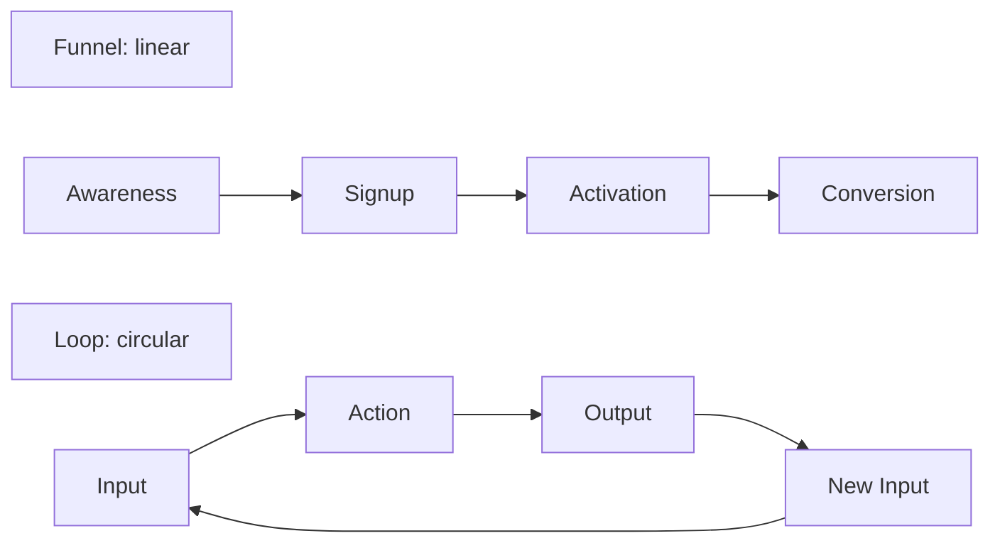
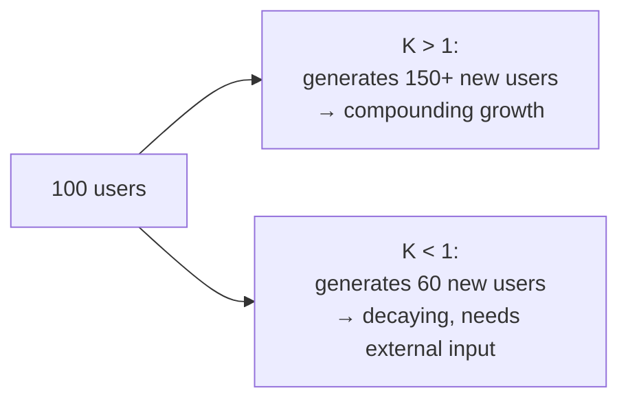
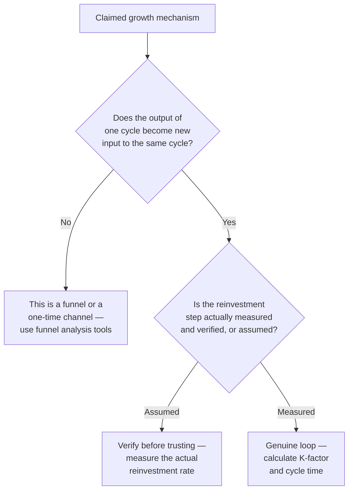

# Lesson 46: Growth Loops & Virality

## Why This Lesson Matters

Lesson 43 taught you to analyze a funnel: a linear sequence from awareness to activation. Lesson 44 taught you to analyze retention: whether users, once acquired, keep coming back. This lesson introduces a structurally different way of thinking about growth — one where the *output* of a cycle becomes the *input* to the next cycle, creating a self-reinforcing loop rather than a one-way path. Understanding this distinction matters because a team that only ever thinks in funnels will miss the compounding, structural growth opportunities that loops make possible, and will systematically misdiagnose why some growth channels seem to accelerate over time while others plateau no matter how much is invested in them.

This lesson matters practically because "growth loop" has become one of the most overused, least precisely applied terms in product management — many things casually labeled "growth loops" are, on close inspection, simply linear funnels or paid acquisition channels wearing a fashionable label. This lesson gives you the precise structural test for what actually makes something a loop, and the specific metrics (loop cycle time, and the viral coefficient in particular) needed to evaluate whether a genuine loop is actually compounding or merely appearing to.

---

## Learning Path

| Field | Detail |
|---|---|
| **Module** | 5 — Metrics, Experimentation & Growth |
| **Current Lesson** | 46 of 90 |
| **Difficulty** | 5 / 10 |
| **Estimated Study Time** | 35 minutes (reading) + 15 minutes (reflection + quiz) |
| **Prerequisites** | Lesson 43 (Funnel Analysis), Lesson 44 (Cohort & Retention Analysis), Lesson 45 (A/B Testing & Experimentation) |
| **Next Lesson** | Lesson 47 — Stakeholder Management |
| **Future Topics Unlocked** | Lesson 49 (Go-To-Market Strategy), Lesson 50 (Product-Led Growth, which builds extensively on loops) — both depend on the loop-versus-funnel distinction and viral coefficient math introduced here |

---

## Learning Objectives

By the end of this lesson, you will be able to:

1. Explain the structural distinction between a growth loop and a funnel, and correctly classify a given growth mechanism as one or the other.
2. Identify the four generic components of any growth loop: input, action, output, and reinvestment into new input.
3. Calculate a viral coefficient (K-factor) and explain what value of K distinguishes a self-sustaining viral loop from one that merely supplements other acquisition.
4. Explain viral cycle time and why two loops with identical K-factors can produce very different growth outcomes.
5. Audit a claimed "growth loop" against the structural test from this lesson to determine whether it's a genuine loop or a mislabeled funnel.

---

## Prerequisites

This lesson assumes **Lesson 43's** funnel vocabulary, since a loop is best understood in direct contrast to a funnel's linear structure. It also assumes **Lesson 44's** retention concepts, since a loop's sustainability depends heavily on whether users generated by one cycle actually stick around long enough to complete another cycle themselves, and **Lesson 45's** experimentation discipline, since validating whether a proposed loop intervention actually improves the loop's compounding rate requires the same rigor as any other causal claim.

---

## Theory

### Loops vs. Funnels: A Structural Distinction

A **funnel** (Lesson 43) is linear: users enter at the top and progress through a sequence of stages, with each stage's output simply being fewer users reaching the next stage. A **growth loop**, by contrast, is circular: the output of one cycle becomes the input to the next cycle, so that a successful cycle doesn't just convert existing users further down a path — it generates *new* entrants into the very beginning of the same process, creating the possibility of compounding growth rather than a fixed, one-time conversion.

Every genuine growth loop can be described using four generic components: an **input** (a resource the loop consumes, such as existing users or content), an **action** (something users do with that input), an **output** (something the action produces), and a **reinvestment** step, where that output becomes new input to the same loop, restarting the cycle with a larger starting population than before. A mechanism missing this final reinvestment step — where output doesn't actually flow back into new input — is a funnel or a one-time conversion event, not a loop, regardless of what it's called informally.

### Common Loop Types

| Loop Type | Input | Action | Output | New Input |
|---|---|---|---|---|
| Viral loop | Existing users | Inviting others | New signups from invites | New users, who can themselves invite others |
| Content loop | Existing content/users | Creating or sharing content | New content indexed/discovered | New visitors who find that content and may create their own |
| Paid loop | Revenue from existing users | Reinvesting revenue in paid acquisition | New paying users | Additional revenue reinvested in further acquisition |

Note that a "paid loop" only qualifies as a genuine loop if revenue from acquired users is systematically reinvested into acquiring more users at a sustainable, positive-return rate — a company that simply spends a fixed marketing budget without this revenue-driven reinvestment relationship is running a funnel-fed acquisition channel, not a loop.

### The Viral Coefficient (K-factor)

For viral loops specifically, the standard measurement is the **viral coefficient**, commonly denoted K:

> **K = (invites sent per user) × (conversion rate of invites into new users)**

If K is greater than 1, each existing user generates, on average, more than one new user through the loop, meaning the loop is theoretically self-sustaining and would continue growing even with zero additional external acquisition — genuine, compounding virality. If K is less than 1, each cycle generates fewer new users than it started with, meaning the loop will eventually decay toward zero without continued external input — the loop still provides real value (often meaningfully supplementing other acquisition channels), but it is not, by itself, self-sustaining.

### Viral Cycle Time: Why Speed Matters as Much as K

A second, frequently overlooked factor is **viral cycle time** — how long it takes for one full loop cycle to complete, from a user receiving an invite to that new user sending their own invites. Two loops with an identical K-factor above 1 can produce dramatically different growth trajectories if their cycle times differ significantly: a loop with a one-day cycle time compounds far faster than a mechanically identical loop with a thirty-day cycle time, simply because more cycles complete within any given period. This is why growth teams often invest specifically in *shortening* cycle time (making the invite-and-conversion process faster), not just improving K itself, since even a modest improvement in cycle time can meaningfully accelerate an already-viral loop's growth curve.

---

## Common Beginner Mistakes

**Mistake 1: Calling any acquisition mechanism a "growth loop" regardless of whether it actually reinvests output as new input.**
As covered in Theory, a mechanism without a genuine reinvestment step — output flowing back into new input — is a funnel or a one-time channel, not a loop, and analyzing it with loop-specific tools like K-factor is a category error.

**Mistake 2: Believing K > 1 alone guarantees successful, sustained growth.**
A loop with K just above 1 but a very long cycle time may compound so slowly that it's practically indistinguishable from no growth at all over any reasonable planning horizon — K and cycle time must both be considered together.

**Mistake 3: Ignoring retention's effect on a loop's sustainability.**
A viral loop's new users must themselves stick around long enough (Lesson 44) to actually complete another cycle and send their own invites; a loop feeding into a product with poor retention will see its effective compounding rate collapse regardless of how the initial K-factor was calculated, since churned users can't generate the next cycle.

**Mistake 4: Assuming a loop that worked well at small scale will continue to work identically at large scale.**
Viral loops frequently experience **saturation** — as a loop reaches an increasingly large share of the addressable population, the pool of not-yet-reached potential new users shrinks, mechanically reducing the effective conversion rate of invites over time, even if nothing about the loop's underlying design has changed.

**Mistake 5: Optimizing K-factor through low-quality, spammy invite mechanics.**
An invite mechanism engineered aggressively to maximize invites-sent-per-user, without regard for genuine value to the person receiving the invite, tends to produce low invite-conversion rates and can actively damage a product's reputation — echoing Lesson 41's Goodhart's Law caution, since optimizing the K-factor formula's inputs directly, without regard for the underlying user experience, can degrade the very thing the metric was meant to represent.

---

## Mental Model: The Loop vs. Funnel Test

This lesson's core takeaway tool is a simple diagnostic question to apply to any claimed "growth loop" before analyzing it with loop-specific tools:

Use the Loop vs. Funnel Test as a standing discipline whenever a team presents a "growth loop" strategy: ask specifically whether the reinvestment step has actually been measured, not just assumed to exist because the overall shape of the mechanism sounds loop-like. A team that skips this verification risks investing significant effort optimizing what is, in reality, an ordinary funnel using tools designed for a fundamentally different structure.

---

## Real Company Example

**Duolingo** has been publicly associated, through its own product and engagement blog writing, with building strong habit-formation and social mechanics — streaks, leaderboards, and social/friend features — that function as a self-reinforcing engagement loop: users who build a streak or compete on a leaderboard are more likely to return daily, and daily returning users are more likely to extend their streak and engage further with social features, reinforcing the same behavior in subsequent cycles.

The underlying principle connects directly to this lesson's Theory: this is a genuine loop in the structural sense this lesson defines — the "output" of one day's engagement (an extended streak, a leaderboard position) becomes meaningful "input" motivating the next day's engagement — even though it's a retention/engagement loop rather than a viral acquisition loop specifically, illustrating that the loop structure this lesson describes applies more broadly than just user-acquisition mechanisms.

*(Assumption flagged: this reflects general, publicly available descriptions of engagement and habit-formation mechanics discussed in Duolingo's own product and engagement blog writing over time, not a confirmed, complete, or current account of Duolingo's specific internal growth loop strategy or its measured effectiveness today. Specific mechanics and their internal measurement evolve continuously at any company; the durable lesson is the underlying structural principle — genuine loops reinvest output as new input, whether for acquisition or engagement — rather than a claim about Duolingo's exact current growth metrics.)*

---

## Real World Perspective: Startup vs. Mid-Size vs. Big Tech

**At a startup:**
Growth loops are often aspirational rather than measured — a team may design a referral mechanism hoping it becomes viral, without yet having enough data to calculate a reliable K-factor. The risk here is Mistake 1's mirror image: treating an unproven, hoped-for loop as though its viral status were already confirmed, when in reality it may still be underperforming as a funnel-like, non-compounding channel.

**At a mid-size company:**
Loop metrics (K-factor, cycle time) typically become genuinely measurable and worth tracking rigorously, since sufficient volume exists to calculate these figures with reasonable statistical confidence, and enough historical data exists to detect saturation effects (Mistake 4) as they begin to emerge.

**At Big Tech:**
Growth loops are often deeply instrumented, with dedicated growth teams responsible for continuously monitoring K-factor and cycle time across multiple simultaneous loops, and rigorously testing loop interventions using the experimentation discipline from Lesson 45 rather than assuming a proposed change will improve compounding. The PM's job shifts toward correctly diagnosing which specific loop component (input volume, action rate, output quality, or reinvestment conversion) is the actual bottleneck limiting a loop's growth, rather than intuitively guessing.

---

## Detailed Case Study: The Referral Program That Wasn't Actually a Loop

Consider a simplified, illustrative scenario common at teams eager to claim viral growth.

A team launches a referral program offering both the referrer and the referred friend a discount, and celebrates it internally as "our new growth loop." Over several months, the referral program generates a meaningful, steady stream of new signups, and leadership treats it as a successful viral growth engine, allocating additional marketing budget to promote the referral program more prominently.

A growth analyst, asked to calculate the referral loop's K-factor for a quarterly review, discovers a critical gap in the data: the company has never actually measured what fraction of *referred* users go on to refer additional users themselves — the analysis has only ever tracked the first-generation conversion (existing users referring new users), never verifying whether the reinvestment step (new users becoming a source of further referrals) was actually happening at any meaningful rate. Digging into the data reveals that referred users refer new users at barely a quarter of the rate of the original, organically-acquired user base, meaning the mechanism's true, multi-generational K-factor is well below 1 — it has been generating a genuine, valuable one-time boost to acquisition, but it was never actually compounding as a self-sustaining loop, and the additional marketing budget spent "amplifying the loop" was, in reality, simply funding an ordinary paid-adjacent acquisition channel with a referral-shaped incentive structure.

**What went wrong?**

Using the Loop vs. Funnel Test: the team had assumed the reinvestment step existed and was compounding, based on the mechanism's loop-like *shape* (a referral program certainly looks like a loop), without ever actually measuring whether referred users completed the loop by referring others themselves at a similar rate to the original population. This is a direct instance of Mistake 1 — treating a plausible-looking mechanism as a genuine loop without the specific verification this lesson's Mental Model requires.

The corrective step was straightforward once diagnosed: recalculate the program's value using accurate, verified metrics — treating it honestly as a valuable one-time acquisition boost (which it genuinely was) rather than a compounding growth loop (which it was not), and redirecting the marketing budget that had been allocated on the mistaken assumption of self-sustaining virality toward channels more appropriate for its actual, non-compounding structure. Rigorously testing any proposed intervention to actually increase the second-generation referral rate — rather than assuming a change would help — would require exactly the controlled experimentation discipline covered in **Lesson 45**, applied here specifically to loop mechanics.

---

## Framework Explanation: The Loop Component Health Check

A second, more tactical tool: use this table to diagnose which specific component of a claimed growth loop is the actual bottleneck, rather than assuming the loop as a whole is simply "not working."

| Component | Question | Diagnostic Signal |
|---|---|---|
| Input | How many existing users are eligible to take the loop's action? | Low eligible population limits total loop volume regardless of conversion rates |
| Action rate | What fraction of eligible users actually take the action (e.g., send an invite)? | A low action rate suggests the action itself isn't sufficiently incentivized or visible |
| Output quality | Of the outputs generated (invites sent), what fraction are received by genuinely interested, well-targeted recipients? | Poor targeting can depress downstream conversion regardless of action volume |
| Reinvestment conversion | What fraction of outputs actually convert into new input (new users who themselves become eligible loop participants)? | This is the step most often unmeasured, as illustrated in this lesson's Case Study — verify it explicitly |

A team investing effort to improve a loop without first identifying which specific component is the actual bottleneck risks optimizing a part of the loop that was never the limiting factor to begin with.

---

## Interview Perspective: How Interviewers Think About This

**Typical question 1: "What's the difference between a growth loop and a funnel?"**
*What the interviewer is actually evaluating:* Whether the candidate can articulate the structural distinction precisely — reinvestment of output as new input — rather than using the terms loosely or interchangeably.

**Typical question 2: "How would you calculate whether a referral program is genuinely viral?"**
*What the interviewer is actually evaluating:* Whether the candidate knows to calculate a multi-generational K-factor, specifically verifying whether referred users themselves generate further referrals, rather than only measuring first-generation conversion, directly testing awareness of this lesson's Case Study failure mode.

**Typical question 3: "A loop's K-factor is 1.2, but growth has been slow. What might explain this?"**
*What the interviewer is actually evaluating:* Whether the candidate considers viral cycle time as a second, independent factor alongside K, rather than assuming K > 1 alone guarantees fast, visible growth.

---

## Summary

A growth loop is structurally distinct from a funnel: where a funnel is linear, a loop reinvests the output of one cycle as new input to the same cycle, creating the possibility of compounding growth. Every genuine loop can be described through four components — input, action, output, and reinvestment — and the reinvestment step specifically must be measured and verified, not merely assumed, as this lesson's Case Study demonstrates through a referral program that generated real value but was never actually compounding, because referred users were never verified to refer others at a meaningful rate themselves. The viral coefficient (K-factor) quantifies a viral loop's compounding potential — K greater than 1 indicates genuine self-sustaining growth — but must be considered alongside viral cycle time, since two loops with identical K-factors can produce dramatically different growth trajectories depending on how quickly each cycle completes. Diagnosing a struggling loop requires identifying which of its four components (input, action rate, output quality, or reinvestment conversion) is the actual bottleneck, rather than assuming the loop as a whole has simply failed, and any proposed intervention to improve a loop's performance should be validated through the controlled experimentation discipline from Lesson 45 rather than assumed to work.

---

## Key Takeaways

- A growth loop reinvests the output of one cycle as new input to the same cycle, creating compounding potential; a funnel is linear and lacks this reinvestment step.
- Every genuine loop has four components: input, action, output, and reinvestment — the reinvestment step must be measured and verified, not assumed.
- The viral coefficient (K-factor) equals invites sent per user times the conversion rate of those invites; K greater than 1 indicates a self-sustaining, compounding loop.
- Viral cycle time — how long a full loop cycle takes to complete — matters as much as K-factor itself, since faster cycles compound more quickly even at an identical K.
- A loop's sustainability depends on retention (Lesson 44), since new users must stick around long enough to complete another cycle themselves.
- Loops frequently experience saturation as they reach an increasingly large share of the addressable population, mechanically reducing effective conversion rates over time.
- A mechanism that looks loop-shaped but has never had its reinvestment step actually measured should be treated with caution — it may be a valuable but non-compounding channel, not a genuine growth loop.

---

## Cheat Sheet

*A two-minute review of everything in this lesson.*

- **Loop vs. funnel:** loops reinvest output as new input; funnels are linear, one-way paths.
- **Four loop components:** input, action, output, reinvestment (verify reinvestment — don't assume it).
- **K-factor:** invites per user × conversion rate of invites; K > 1 = self-sustaining compounding growth.
- **Cycle time matters too:** faster loops compound faster even at identical K.
- **Retention affects loops:** new users must stick around long enough to complete another cycle.
- **Saturation:** loops often slow down as they exhaust the addressable population, even with unchanged design.
- **Diagnose the bottleneck:** input, action rate, output quality, or reinvestment conversion — identify which before optimizing.

---

## Glossary

| Term | Definition | Related Concepts | Difficulty (1–3) |
|---|---|---|---|
| Growth loop | A growth mechanism where the output of one cycle becomes new input to the same cycle, enabling compounding growth | Funnel (Lesson 43) | 1 |
| Viral coefficient (K-factor) | Invites sent per user multiplied by the conversion rate of those invites into new users | Viral cycle time | 1 |
| Viral cycle time | The time required for one full loop cycle to complete, from invite to the new user's own subsequent action | Viral coefficient | 2 |
| Saturation | The mechanical reduction in a loop's effective conversion rate as it reaches an increasingly large share of the addressable population | Viral coefficient | 2 |
| Loop Component Health Check | A diagnostic tool identifying which of a loop's four components (input, action, output, reinvestment) is the actual bottleneck | Growth loop | 2 |

---

## Further Reading / Resources

- *Reforge Growth Series* materials and writing by Brian Balfour — a widely referenced practitioner treatment of growth loops versus funnels.
- "The Myth of the Silver Bullet Growth Hack" and related growth-loop practitioner writing by Casey Winters — background on distinguishing genuine loops from funnel-shaped acquisition channels.
- *Hooked: How to Build Habit-Forming Products* by Nir Eyal — relevant background on the engagement-loop mechanics illustrated in this lesson's Duolingo example.

---

## Flashcards

**Card 1**
Front: What structurally distinguishes a growth loop from a funnel?
Back: A loop reinvests the output of one cycle as new input to the same cycle, creating compounding potential; a funnel is linear with no such reinvestment step.
Difficulty: 1
Tags: loop-vs-funnel

**Card 2**
Front: Name the four generic components of any growth loop.
Back: Input, action, output, and reinvestment (output becoming new input).
Difficulty: 1
Tags: loop-components

**Card 3**
Front: State the formula for the viral coefficient (K-factor).
Back: K = (invites sent per user) × (conversion rate of invites into new users).
Difficulty: 1
Tags: k-factor

**Card 4**
Front: What does K > 1 indicate, and what does K < 1 indicate?
Back: K > 1 indicates a self-sustaining, compounding loop that could grow even without external input; K < 1 indicates a loop that will decay toward zero without continued external input, though it may still add real value.
Difficulty: 2
Tags: k-factor-interpretation

**Card 5**
Front: Why can two loops with identical K-factors produce very different growth outcomes?
Back: Viral cycle time (how long one full cycle takes) also matters — a faster cycle time compounds more quickly than a slower one, even at the same K.
Difficulty: 2
Tags: cycle-time

**Card 6**
Front: In the Detailed Case Study, what critical verification had the team skipped?
Back: They had never measured whether referred users themselves went on to refer additional users at a meaningful rate — the reinvestment step was assumed, not verified, revealing the true multi-generational K-factor was below 1.
Difficulty: 2
Tags: case-study

**Card 7**
Front: What is loop "saturation," and why does it happen?
Back: The mechanical reduction in a loop's effective conversion rate as it reaches an increasingly large share of the addressable population, shrinking the pool of not-yet-reached potential new users over time.
Difficulty: 2
Tags: saturation

---

## Reflection Exercise

Consider the following novel scenario: Your team runs a content-sharing feature where users can share their created content to social media, and some fraction of viewers click through and sign up. Leadership has started calling this the company's "growth loop" in board presentations, based on strong early signup numbers from shared content.

There is no single correct answer to the prompts below — the goal is to practice applying the Loop vs. Funnel Test, not to reach one "right" answer.

1. Using the Loop vs. Funnel Test, what specific data would you need to verify before confirming this is a genuine loop rather than a one-time acquisition channel?
2. If new users acquired through shared content create and share their own content at a much lower rate than the original user base, what would that suggest about the mechanism's true K-factor?
3. What would you want to measure about viral cycle time for this specific mechanism, and why might it matter even if K turns out to be above 1?
4. Using the Loop Component Health Check, which of the four components (input, action rate, output quality, reinvestment conversion) seems least verified in this scenario, and why?
5. How would you communicate your findings to leadership if your analysis reveals this is a valuable but non-compounding acquisition channel, rather than the self-sustaining growth loop they've been describing publicly?

---

## Quiz

**1. What is the key structural difference between a growth loop and a funnel?**
A) Loops are always faster than funnels
B) A loop reinvests the output of one cycle as new input to the same cycle, enabling compounding growth; a funnel is a linear, one-way sequence with no such reinvestment
C) Funnels only apply to paid acquisition; loops only apply to organic acquisition
D) There is no meaningful structural difference between the two

*Correct answer: B*
*Explanation: The Theory section explicitly defines this structural distinction.*
*Learning objective tested: #1*
*Difficulty: Easy*

---

**2. What are the four generic components of any growth loop?**
A) Awareness, acquisition, activation, retention
B) Input, action, output, reinvestment
C) Hypothesis, primary metric, guardrail, sample size
D) Now, Next, Later, Never

*Correct answer: B*
*Explanation: The Theory section explicitly names these four components as the structure of any genuine growth loop.*
*Learning objective tested: #2*
*Difficulty: Easy*

---

**3. What is the formula for the viral coefficient (K-factor)?**
A) Total users divided by total revenue
B) Invites sent per user multiplied by the conversion rate of those invites into new users
C) Retention rate multiplied by activation rate
D) Cycle time divided by total input

*Correct answer: B*
*Explanation: The Theory section states this exact formula for K.*
*Learning objective tested: #3*
*Difficulty: Easy*

---

**4. What does a K-factor greater than 1 indicate?**
A) The loop is losing money
B) The loop is theoretically self-sustaining, generating more than one new user per existing user on average, enabling compounding growth even without external input
C) The loop has reached saturation
D) The loop's cycle time is too long to matter

*Correct answer: B*
*Explanation: The Theory section explains that K > 1 indicates genuine, self-sustaining compounding growth.*
*Learning objective tested: #3*
*Difficulty: Easy*

---

**5. Why can two loops with identical K-factors above 1 produce very different growth trajectories?**
A) Because K-factor calculations are always inaccurate
B) Because viral cycle time — how long one full loop cycle takes to complete — also affects how quickly growth compounds, even at an identical K
C) Because only paid loops have meaningful cycle times
D) Because K-factor and growth trajectory are completely unrelated concepts

*Correct answer: B*
*Explanation: The Theory section explains that cycle time is a second, independent factor that affects how quickly compounding growth actually materializes.*
*Learning objective tested: #4*
*Difficulty: Easy*

---

**6. Why does a viral loop's sustainability depend on retention, as covered in this lesson?**
A) It doesn't; retention is unrelated to loop performance
B) New users must stick around long enough to themselves complete another loop cycle (e.g., send their own invites); poor retention prevents this, collapsing the loop's effective compounding rate regardless of the initial K-factor
C) Retention only matters for paid loops, not viral loops
D) Retention is only relevant to funnel analysis, never to loops

*Correct answer: B*
*Explanation: Common Beginner Mistake #3 explains this exact dependency between retention and a loop's ability to sustain compounding.*
*Learning objective tested: #4*
*Difficulty: Easy*

---

**7. In the Detailed Case Study, what critical measurement had the team never actually verified about their referral program?**
A) The total number of signups generated by referrals
B) Whether referred users themselves went on to refer additional users at a meaningful rate — the reinvestment step of the loop
C) The cost of the referral discount offered
D) Whether the referral program had a mobile-friendly interface

*Correct answer: B*
*Explanation: The Case Study explicitly identifies this unverified reinvestment step as the critical gap in the team's analysis.*
*Learning objective tested: #2, #5*
*Difficulty: Medium*

---

**8. What did the growth analyst discover when finally measuring the referral program's multi-generational conversion rate?**
A) Referred users referred new users at a much higher rate than the original user base
B) Referred users referred new users at barely a quarter of the rate of the original, organically-acquired user base, meaning the true K-factor was well below 1
C) The referral program had no measurable effect on signups at all
D) The referral program's K-factor was exactly 2.0

*Correct answer: B*
*Explanation: The Case Study explicitly states this finding — a much lower second-generation referral rate revealing a true K-factor below 1.*
*Learning objective tested: #5*
*Difficulty: Medium*

---

**9. Why does this lesson caution against optimizing K-factor through aggressive, low-quality invite mechanics?**
A) Because K-factor cannot be affected by invite mechanics at all
B) Because this can produce low invite-conversion rates and damage product reputation, echoing Lesson 41's Goodhart's Law caution about optimizing a metric's formula directly rather than the underlying value it represents
C) Because low-quality invites always increase K-factor reliably
D) Because invite mechanics are entirely unrelated to viral loops

*Correct answer: B*
*Explanation: Common Beginner Mistake #5 explicitly connects this risk to Lesson 41's Goodhart's Law, since gaming the K-factor formula's inputs can degrade genuine value.*
*Learning objective tested: #3, #5*
*Difficulty: Medium*

---

**10. What is "saturation," in the context of a growth loop?**
A) A technical term for a loop's cycle time
B) The mechanical reduction in a loop's effective conversion rate as it reaches an increasingly large share of the addressable population, shrinking the pool of new potential users over time
C) A synonym for the viral coefficient
D) A measurement that only applies to paid acquisition loops

*Correct answer: B*
*Explanation: Common Beginner Mistake #4 defines saturation exactly this way.*
*Learning objective tested: #4*
*Difficulty: Medium*

---

**11. (Interview Reasoning) A candidate is asked how they'd verify whether a referral program is genuinely viral, and answers: "I'd look at how many signups came from referral links last month." Based on this lesson's Interview Perspective section, what is missing from this answer?**
A) Nothing; total referral signups is sufficient evidence of virality
B) Verification of the multi-generational K-factor — specifically whether referred users themselves go on to generate further referrals — rather than only measuring first-generation conversion
C) A recommendation to switch to a paid acquisition strategy instead
D) A calculation of the product's Net Promoter Score

*Correct answer: B*
*Explanation: The Interview Perspective section states that a strong answer specifically checks multi-generational conversion, exactly the verification missing from this answer and from the Case Study's original flawed analysis.*
*Learning objective tested: #3, #5*
*Difficulty: Hard*

---

**12. Using the Loop Component Health Check, if a loop has plenty of eligible users (input) and a healthy action rate, but very few of its outputs convert into new input, what does this suggest?**
A) The loop's input component is the bottleneck
B) The reinvestment conversion step is likely the bottleneck, and should be the focus of further investigation before optimizing other components
C) The loop must not be a genuine loop at all
D) Nothing can be diagnosed from this information

*Correct answer: B*
*Explanation: The Framework Explanation section's Loop Component Health Check identifies exactly this pattern — healthy input and action rate but poor reinvestment conversion — as pointing to the reinvestment step as the bottleneck.*
*Learning objective tested: #5*
*Difficulty: Medium-Hard*

---

**13. (Product Thinking) A team wants to improve an underperforming viral loop and proposes simply increasing the discount offered per successful referral, assuming this will improve K-factor. Using this lesson's and Lesson 45's frameworks together, what is the most defensible next step?**
A) Roll out the increased discount to all users immediately, since the reasoning seems sound
B) First diagnose which specific loop component (input, action rate, output quality, reinvestment conversion) is actually the bottleneck using the Loop Component Health Check, then validate the proposed discount increase through a controlled experiment (Lesson 45) rather than assuming it will work
C) Ignore the proposal entirely without any further analysis
D) Increase the discount only for the highest-spending customers, regardless of loop diagnostics

*Correct answer: B*
*Explanation: This combines the Loop Component Health Check's bottleneck diagnosis with Lesson 45's experimentation discipline — the right sequence is diagnosing the actual bottleneck first, then validating any proposed fix rigorously rather than assuming it works.*
*Learning objective tested: #5*
*Difficulty: Hard*

---

**14. Which of the following best reflects a genuine growth loop, as opposed to a funnel mislabeled as one?**
A) A one-time email campaign that generates a spike in signups but has no further reinvestment mechanism
B) A referral mechanism where measured, verified data confirms that a meaningful share of newly referred users go on to refer additional users themselves, sustaining the cycle
C) A paid advertising campaign with a fixed monthly budget and no revenue-based reinvestment relationship
D) A one-time product launch announcement shared on social media

*Correct answer: B*
*Explanation: Only option B includes a verified reinvestment step where output becomes new input for further cycles — the defining structural feature of a genuine loop per this lesson's Theory.*
*Learning objective tested: #1, #5*
*Difficulty: Medium-Hard*

---

**15. (Product Thinking, Highest Difficulty) A company's viral loop has a K-factor of 1.4 and has been growing steadily for a year, but growth has recently begun to slow despite no changes to the loop's design or messaging. Using this lesson's frameworks, what is the most likely explanation, and how would you investigate it?**
A) The K-factor formula must have been calculated incorrectly from the start
B) The loop may be experiencing saturation as it reaches an increasingly large share of the addressable population; investigate by checking whether the pool of not-yet-reached potential users has meaningfully shrunk, and consider whether cycle time or retention (Lesson 44) among newer cohorts has also changed
C) A K-factor above 1 guarantees indefinite growth with no possible slowdown, so this must be a measurement error
D) The loop should be immediately discontinued, since any slowdown indicates total failure

*Correct answer: B*
*Explanation: This applies the lesson's saturation concept directly — a previously strong, unchanged loop naturally slowing over time is the classic signature of reaching diminishing returns in the addressable population, and investigating alongside cycle time and retention reflects the multi-factor reasoning this lesson establishes rather than assuming K-factor alone tells the whole story.*
*Learning objective tested: #4, #5*
*Difficulty: Hard*

---

## Connections

| | Lesson | Core Idea Carried Forward |
|---|---|---|
| **Previous Lesson** | Lesson 45 — A/B Testing & Experimentation | Loop interventions should be validated using the same experimental rigor established in Lesson 45, not assumed to work |
| **Current Lesson** | Lesson 46 — Growth Loops & Virality | Loop vs. funnel structural test; four loop components; viral coefficient (K-factor); viral cycle time; saturation |
| **Next Lesson** | Lesson 47 — Stakeholder Management | Shifts from quantitative growth mechanics to the interpersonal discipline of managing stakeholder expectations and communication |
| **Future Concepts Unlocked** | Lesson 49 (Go-To-Market Strategy) | Builds on loop-versus-channel distinctions when planning acquisition strategy for a launch |
| | Lesson 50 (Product-Led Growth) | Depends extensively on genuine, verified growth loops as a core mechanism |

This curriculum is designed to be read as one continuous argument, not ninety independent articles. Every lesson from here forward will assume you carry the loop-versus-funnel distinction and the K-factor/cycle-time framework with you — they will not be re-explained, only re-applied in new contexts.
