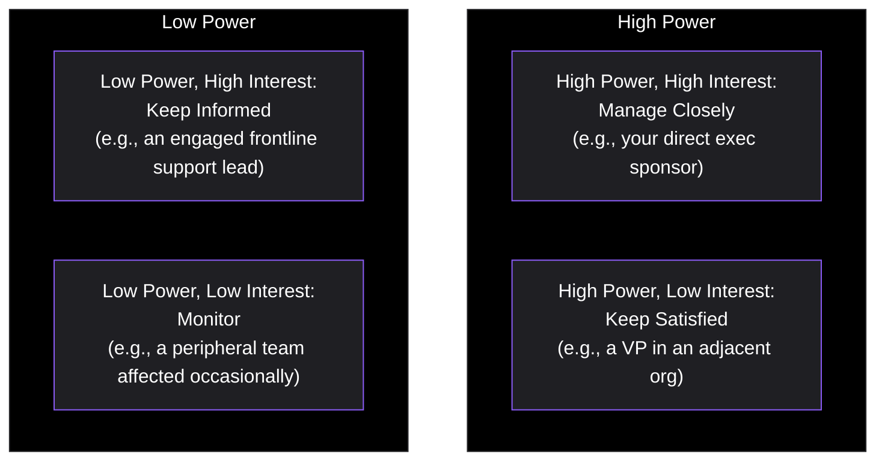
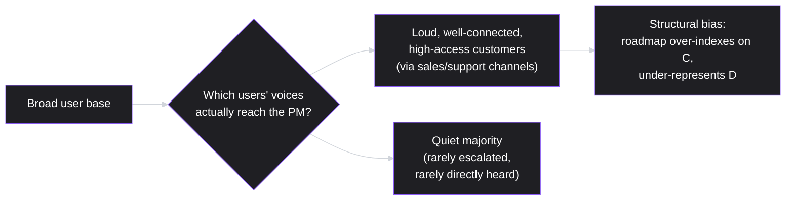
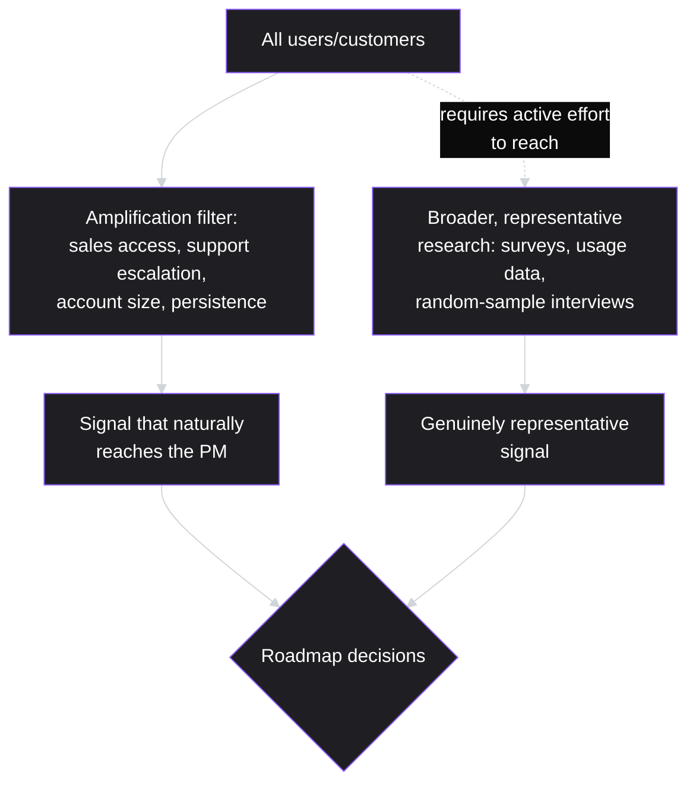

# Lesson 47: Stakeholder Management

## Why This Lesson Matters

This lesson has been forward-referenced more times than any other in this curriculum so far. Lesson 5 first flagged it as the place to extend an early discussion of structural bias toward customer-channel signal. Lesson 31 pointed here for the skill of communicating a changed plan without it reading as failure. Lesson 34 pointed here for explaining mid-sprint changes transparently. Lesson 35 pointed here for giving stakeholders honest, hedged commitments under pressure. Lesson 36 pointed here for coordinating cross-functional launch communication. Lesson 46 implicitly connects here too, since a growth or product decision is only as good as an organization's ability to understand it accurately. This lesson gathers all of those threads into a single, coherent discipline: managing the relationships and communication flows between a PM and everyone who has a stake in what the PM does, without formal authority over most of them.

This matters because a PM's job, as Lesson 1 established from the very beginning, is one of responsibility without authority — and nowhere is that gap more consequential than in stakeholder relationships. A brilliant product decision, poorly communicated to the people who need to understand and support it, routinely fails not because the decision was wrong, but because the stakeholders around it never actually understood or trusted it. This lesson also finally resolves Lesson 5's structural bias concept directly: the specific risk that the customer voices reaching a PM through internal channels (sales, support, a vocal account) are not a representative sample of the actual user base, and that treating them as if they were can silently distort an entire roadmap.

---

## Learning Path

| Field | Detail |
|---|---|
| **Module** | 5 — Metrics, Experimentation & Growth |
| **Current Lesson** | 47 of 90 |
| **Difficulty** | 5 / 10 |
| **Estimated Study Time** | 35 minutes (reading) + 15 minutes (reflection + quiz) |
| **Prerequisites** | Lesson 5 (structural bias toward customer-channel signal), Lesson 35 (Roadmapping — hedged commitments), Lesson 37 (Working with Engineering Teams — Trust Ladder) |
| **Next Lesson** | Lesson 48 — Pricing & Monetization Strategy |
| **Future Topics Unlocked** | Lesson 49 (Go-To-Market Strategy), Lesson 51 (Communicating with Executives), Lesson 53 (Negotiation & Influence Without Authority), Lesson 54 (Managing Up and Across) — all build directly on the stakeholder mapping and communication discipline introduced here |

---

## Learning Objectives

By the end of this lesson, you will be able to:

1. Map an organization's stakeholders using a power/interest grid and tailor communication approach to each quadrant.
2. Explain structural bias toward customer-channel signal, extending Lesson 5's original framing, and describe concrete practices that counteract it.
3. Apply Lesson 35's hedged-commitment principles specifically to upward stakeholder communication under deadline or pressure situations.
4. Deliver difficult news (a delay, a deprioritization, a "no") to a stakeholder in a way that preserves trust rather than eroding it.
5. Distinguish stakeholder management done well (informing and aligning) from stakeholder management done poorly (simply telling people what they want to hear).

---

## Prerequisites

This lesson assumes **Lesson 5's** original discussion of structural bias toward customer-channel signal, which this lesson extends directly. It also assumes **Lesson 35's** hedged-commitment discipline (Now-Next-Later, the Confidence Gradient) and **Lesson 37's** Trust Ladder, since managing a stakeholder relationship well draws on the same honest-communication principles this curriculum has already established for engineering relationships, applied here to a much broader and more varied set of people.

---

## Theory

### Mapping Stakeholders: The Power/Interest Grid

Not every stakeholder needs the same relationship or communication cadence. A widely used tool, the **power/interest grid**, classifies stakeholders along two dimensions — how much influence or authority they hold over the product's success, and how actively interested they are in its day-to-day details:

A stakeholder in the "Manage Closely" quadrant warrants frequent, detailed, two-way communication and early involvement in decisions. A stakeholder in "Keep Satisfied" needs periodic, high-level updates focused on outcomes rather than process detail, since their interest is low but their influence is high enough that surprising them is risky. A stakeholder in "Keep Informed" benefits from regular updates even though they can't independently affect outcomes, since their engagement can be valuable and their goodwill matters. A stakeholder in "Monitor" needs the least active management — occasional awareness is sufficient. Misjudging a stakeholder's quadrant — most commonly, treating a "Keep Satisfied" stakeholder as "Monitor," and blindsiding a high-power person who was quietly paying less attention than assumed — is one of the most common and costly stakeholder management errors.

### Structural Bias Toward Customer-Channel Signal, Revisited

Recall Lesson 5's original framing: customer feedback that reaches a PM through internal channels — a sales team relaying a prospect's specific request, a support team escalating a vocal customer's complaint, a single large account's account manager pushing for a feature — is not a representative sample of the broader user base. It is filtered by who has the loudest voice, the most organizational access, or the most squeaky-wheel persistence, not by who represents the most common or most valuable underlying need.

This structural bias is not a matter of any individual stakeholder acting in bad faith — a salesperson relaying a prospect's blocking requirement, or a support lead escalating a frustrated customer, is doing their job correctly. The bias emerges structurally, from the simple fact that certain channels amplify certain voices more than others, and a PM who treats whatever reaches them through these channels as a representative signal of the whole user base — rather than actively supplementing it with broader, more representative research (echoing Lesson 8's discovery discipline) — will systematically over-invest in the needs of the loudest, most connected segment at the expense of the quieter majority. Managing this bias is itself a form of stakeholder management: it requires actively seeking out and weighing signal from stakeholders and channels that don't naturally advocate for themselves as forcefully.

### Hedged Commitments Under Pressure

Lesson 35 introduced the Now-Next-Later format and the Confidence Gradient as tools for giving stakeholders honest, useful forward visibility without manufacturing false certainty. Applying this specifically to live stakeholder conversations, particularly under pressure: when a stakeholder pushes for a specific date or commitment on something genuinely uncertain, the goal is not to choose between capitulating to false precision and unhelpfully refusing to engage — it's to offer the most specific, useful answer that's still honest about its own confidence level, explicitly naming what would need to be true for the estimate to hold and what could change it.

### Delivering Difficult News

A recurring, high-stakes stakeholder management situation deserves specific treatment: telling a stakeholder something they don't want to hear — a delay, a deprioritization, a declined request. The pattern that best preserves trust (echoing Lesson 37's Trust Ladder and Lesson 34's mid-sprint change protocol) has several consistent elements: deliver the news directly and promptly rather than delaying or burying it, explain the reasoning transparently (what changed, what evidence drove the decision), acknowledge the impact on the stakeholder specifically rather than only defending the decision abstractly, and where possible, offer a concrete alternative or next step rather than leaving the stakeholder with only a closed door. A PM who delays delivering bad news, hoping circumstances will improve before the conversation becomes necessary, typically only makes the eventual conversation more damaging, since the stakeholder now has less time to adjust and may reasonably wonder how long the PM already knew.

---

## Common Beginner Mistakes

**Mistake 1: Treating every stakeholder identically, regardless of their actual power and interest**

As covered in Theory, an executive sponsor and a peripheral, low-interest observer warrant genuinely different communication approaches — a uniform approach either overwhelms low-interest stakeholders or under-serves high-power ones.

**Mistake 2: Treating whatever customer feedback reaches you through sales or support as representative of the whole user base**

This is the exact structural bias Lesson 5 and this lesson both address — feedback that reaches a PM through internal channels is filtered by access and volume, not representativeness, and must be actively supplemented with broader research rather than trusted at face value.

**Mistake 3: Telling stakeholders what they want to hear rather than what's actually true**

This produces short-term comfort at the cost of long-term trust — a stakeholder who discovers, eventually, that they were told a comforting but inaccurate story will trust future communications far less, echoing Lesson 37's Trust Ladder principle that honest communication builds durable trust while its absence erodes it quickly.

**Mistake 4: Delaying difficult news in hopes the situation will resolve itself before a conversation becomes necessary**

As covered in Theory, this typically only compounds the damage, since the stakeholder loses valuable time to adjust and may reasonably question how long the information was known before being shared.

**Mistake 5: Defending a decision abstractly without acknowledging its specific impact on the stakeholder receiving the news**

A stakeholder who feels their specific situation wasn't genuinely considered, even if the underlying decision was sound, is far more likely to feel dismissed and less likely to trust future communications, regardless of how well-reasoned the decision actually was.

---

## Mental Model: The Signal Amplification Map

This lesson's core takeaway tool visualizes structural bias toward customer-channel signal as a filtering process, making the invisible amplification explicit so a PM can consciously counteract it:

Use the Signal Amplification Map as a standing discipline whenever a specific, vivid customer request arrives through a sales or support channel: ask explicitly, "is this request reaching me because it's genuinely representative of a widespread need, or because this specific customer happens to have unusually strong access to me?" Both can be true simultaneously, but only active, structured effort — the dotted-line path in the diagram — reliably surfaces the second, quieter kind of signal that the amplification filter would otherwise systematically suppress.

---

## Real Company Example

**37signals (Basecamp)** offers a differently structured but equally instructive illustration of this lesson's core concern than a research-methodology example would: founder Jason Fried has written and spoken extensively — in the company's book *Getting Real* and its own public writing — about deliberately saying no to the large majority of specific feature requests, on the reasoning that the customers loud enough to formally request a feature are a self-selected, unrepresentative slice of the full user base, and that building for every vocal request would eventually produce a bloated product that serves the requesters' edge cases at the expense of everyone else's core experience. The company has also written about the value of team members talking directly to customers, rather than having customer signal filtered exclusively through a support layer before ever reaching product decision-makers.

This is a useful counterpoint precisely because it complicates a simple "listen to your stakeholders" reading of this lesson: 37signals' actual practice is to treat the volume and persistence of a request as weak evidence of its importance to the broader user base, not strong evidence — the opposite instinct from routing decisions toward whichever channel is loudest. The lesson isn't "customer requests don't matter" — it's that *who* is heard, and how directly, shapes what gets prioritized, and an organization has to design for that deliberately rather than let it happen by default.

*(Source: Jason Fried and David Heinemeier Hansson's *Getting Real* and 37signals' own public writing and podcast archive.)*

The underlying principle connects directly to this lesson's Theory: whichever feedback channel is structurally loudest — support escalations, the most persistent enterprise account, the most vocal internal stakeholder — will always generate signal disproportionate to its actual representativeness, and a PM has to deliberately account for that structural bias rather than treat request volume as a neutral prioritization input.

---

## Real World Perspective: Stakeholder Management at Different Company Stages

**At a startup:**
Stakeholder management is often informal, with a small number of stakeholders (perhaps a handful of co-founders and early customers) who interact directly and frequently. Structural bias toward customer-channel signal is still a real risk even here — early customers who are unusually vocal or well-connected to the founding team can disproportionately shape early product direction, even in a small, seemingly close-knit environment.

**At a mid-size company:**
The stakeholder map typically grows significantly — multiple executives, sales and support organizations, and a broader base of customers whose feedback increasingly arrives through structured channels rather than direct founder relationships. This is the stage where formal stakeholder mapping (the power/interest grid) and deliberate structural-bias countermeasures (like Intuit's customer immersion practices) become genuinely necessary rather than optional refinements.

**At Big Tech:**
Stakeholder ecosystems are often large and complex, spanning multiple business units, regulatory and legal stakeholders, and vast, highly segmented customer bases where structural bias risk is especially acute, since sales and enterprise account relationships can carry enormous organizational weight even when representing a small fraction of the overall user base. The PM's job shifts toward navigating a genuinely complex stakeholder map with much higher stakes for misjudging a quadrant, and toward advocating for and using rigorous, representative research (surveys, usage analytics, structured sampling) as a deliberate counterweight to the loudest available channel signal.

---

## Detailed Case Study: The Roadmap Built on the Loudest Voice

Consider a simplified, illustrative scenario that directly resolves Lesson 5's original structural-bias framing and echoes Lesson 35's roadmap Case Study from a different angle.

A PM at a B2B software company receives a specific, detailed feature request repeatedly, relayed through the sales team, from a small number of large enterprise prospects currently in active sales conversations. The request is compelling, well-articulated (since sales has refined the pitch through repeated conversations), and carries visible urgency (each relay comes with a note about a deal that might close faster if the feature existed). The PM prioritizes it near the top of the roadmap, reasoning that it must reflect broad market demand, given how consistently and urgently it keeps surfacing.

After shipping the feature, adoption among the broader existing customer base is minimal — fewer than 3% of customers use it in the following quarter — and none of the specific enterprise deals that had originally driven the urgency actually close any faster than deals that didn't reference the feature at all. A subsequent, deliberately broader survey of the existing customer base reveals the actual most commonly requested improvement was something entirely different — a much less dramatic, less "sales-pitch-worthy" workflow improvement that had never once been escalated through sales, because no single customer considered it urgent enough to push hard for individually, even though a large share of customers, independently and quietly, wanted it.

**What went wrong?**

This is a direct, worked instance of the structural bias Lesson 5 first raised and this lesson formalizes: the feature request that reached the PM most forcefully did so not because it represented the broadest underlying need, but because it happened to pass through a channel (active sales conversations with a small number of vocal, well-connected prospects) that amplifies exactly this kind of request, regardless of how representative it actually is. The quieter, more broadly-held need never generated the same organizational volume, precisely because it wasn't urgent or dramatic enough for any single customer to escalate — but its quietness said nothing about its actual underlying prevalence or value across the customer base as a whole.

The corrective practice, going forward, mirrors this lesson's Real Company Example: supplementing channel-amplified signal with deliberate, structured research — a broad survey, systematic usage-pattern analysis, or a structured sampling of customer interviews not filtered through sales urgency — specifically to surface the quieter, more representative signal the amplification filter had been suppressing. This does not mean sales-channel feedback should be ignored; it remains valuable, specific, and often genuinely urgent information. It means such feedback should never be treated as a substitute for broader validation, precisely the discipline this lesson's Signal Amplification Map recommends.

---

## Framework Explanation: The Stakeholder Communication Cadence Table

A second, more tactical tool: use this table to determine an appropriate communication cadence and format for a stakeholder, once mapped onto the power/interest grid.

| Quadrant | Recommended Cadence | Recommended Format |
|---|---|---|
| Manage Closely (high power, high interest) | Frequent, often weekly or biweekly | Detailed, two-way conversation; early involvement in decisions |
| Keep Satisfied (high power, low interest) | Periodic, milestone-based | High-level, outcome-focused summary; proactive heads-up before anything surprising |
| Keep Informed (low power, high interest) | Regular, often via a standing update | Detailed but one-way is often sufficient (newsletter, shared doc) |
| Monitor (low power, low interest) | Minimal, as-needed | Brief, only when directly relevant |

Misapplying this table in either direction carries real cost: over-communicating with a "Monitor" stakeholder wastes effort and can create noise; under-communicating with a "Keep Satisfied" stakeholder risks a damaging surprise precisely because their low day-to-day interest doesn't reduce their high underlying influence.

---

## Interview Perspective: How Interviewers Think About This

**Typical question 1: "How do you decide how much to communicate with different stakeholders?"**
*What the interviewer is actually evaluating:* Whether the candidate applies a structured framework (the power/interest grid) rather than communicating uniformly or purely intuitively with every stakeholder regardless of their actual influence and engagement level.

**Typical question 2: "A specific customer request keeps coming up through your sales team. How do you decide whether to prioritize it?"**
*What the interviewer is actually evaluating:* Whether the candidate recognizes structural bias toward customer-channel signal and knows to validate a channel-amplified request against broader, more representative research before committing significant roadmap priority to it.

**Typical question 3: "Tell me about a time you had to deliver disappointing news to a stakeholder. How did you handle it?"**
*What the interviewer is actually evaluating:* Whether the candidate's approach includes directness, transparent reasoning, acknowledgment of specific impact, and an alternative or next step, rather than describing an avoidant, delayed, or purely defensive conversation.

---

## Summary

Stakeholder management is the discipline of navigating relationships and communication with everyone who has a stake in a PM's decisions, most of whom the PM has no formal authority over. The power/interest grid provides a structured way to tailor communication cadence and format to each stakeholder's actual influence and engagement level, avoiding the common error of treating every stakeholder identically. This lesson resolves Lesson 5's original framing of structural bias toward customer-channel signal in full: feedback reaching a PM through sales or support channels is filtered by access, volume, and persistence, not by representativeness, and treating it as a proxy for the broader user base risks the exact failure illustrated in this lesson's Case Study, where a loudly and urgently relayed enterprise feature request turned out to represent almost no broader demand, while a quieter, more widely-held need went unaddressed simply because it never generated the same organizational volume. Countering this bias requires deliberately supplementing channel-amplified signal with structured, representative research, echoing Intuit's publicly discussed customer immersion practices. Finally, delivering difficult news — a delay, a deprioritization, a decline — is best handled directly and promptly, with transparent reasoning and acknowledgment of specific stakeholder impact, since delaying or softening difficult news typically compounds the eventual damage rather than avoiding it.

---

## Key Takeaways

- The power/interest grid (Manage Closely, Keep Satisfied, Keep Informed, Monitor) provides a structured basis for tailoring stakeholder communication cadence and format, rather than treating every stakeholder identically.
- Feedback reaching a PM through sales or support channels is filtered by access, volume, and persistence, not representativeness — structural bias toward customer-channel signal can silently distort roadmap priorities if left unchecked.
- Countering structural bias requires deliberately supplementing channel-amplified feedback with broader, structured research (surveys, usage data, representative sampling), not discarding channel feedback but never treating it as sufficient on its own.
- Applying Lesson 35's hedged-commitment principles to live stakeholder conversations means offering the most specific, useful answer that remains honest about its own confidence, rather than choosing between false precision and unhelpful vagueness.
- Delivering difficult news directly, promptly, with transparent reasoning and acknowledgment of specific impact, preserves trust far better than delaying or softening it — delay typically compounds rather than avoids the eventual damage.
- Misjudging a stakeholder's power/interest quadrant, especially treating a high-power, low-interest stakeholder as unimportant, is one of the most common and costly stakeholder management errors.
- A vivid, urgent, well-articulated request reaching a PM through a single amplified channel says nothing on its own about how broadly that need is actually shared across the user base.

---

## Cheat Sheet

*A two-minute review of everything in this lesson.*

- **Power/Interest Grid:** Manage Closely, Keep Satisfied, Keep Informed, Monitor — tailor cadence and format to each.
- **Structural bias:** channel-amplified feedback (sales, support) reflects access and persistence, not representativeness.
- **Counter it:** supplement channel signal with structured, broad research — don't discard it, but don't trust it alone.
- **Hedged commitments live:** offer the most specific honest answer, naming what would change the estimate.
- **Difficult news:** deliver directly, promptly, with transparent reasoning and acknowledged specific impact.
- **Don't delay bad news:** delay compounds damage and raises "how long did you know?" doubts.
- **Watch for:** treating a vivid, urgent single-channel request as proof of broad underlying demand.

---

## Glossary

| Term | Definition | Related Concepts | Difficulty |
|---|---|---|---|
| Power/interest grid | A 2x2 framework classifying stakeholders by influence and engagement level, guiding communication approach | Stakeholder mapping | 1 |
| Structural bias toward customer-channel signal | The tendency for feedback reaching a PM through sales/support channels to over-represent loud, well-connected customers rather than the broader user base | Signal Amplification Map | 2 |
| Signal Amplification Map | This lesson's mental model: visualizing how certain channels amplify certain customer voices, and the active effort required to surface quieter, representative signal | Structural bias | 2 |
| Hedged commitment | A specific, useful forward-looking answer that remains honest about its own confidence level, per Lesson 35's Confidence Gradient | Now-Next-Later (Lesson 35) | 2 |

---

## Further Reading / Resources

- *Escaping the Build Trap* by Melissa Perri — revisited here for its discussion of stakeholder alignment around outcomes rather than output requests.
- "Managing Stakeholders" and related project/product management practitioner writing on the power/interest grid, widely referenced across PMI and product management literature.
- *Continuous Discovery Habits* by Teresa Torres — relevant background on structured, representative customer research as a counterweight to ad hoc, channel-amplified feedback.

---

## Flashcards

**Card 1**
- Front: What are the four quadrants of the power/interest grid?
- Back: Manage Closely (high power, high interest), Keep Satisfied (high power, low interest), Keep Informed (low power, high interest), Monitor (low power, low interest).
- Difficulty: 1
- Tags: power-interest-grid

**Card 2**
- Front: What is structural bias toward customer-channel signal?
- Back: The tendency for feedback reaching a PM through sales/support channels to over-represent loud, well-connected customers, filtered by access and persistence rather than actual representativeness of the broader user base.
- Difficulty: 2
- Tags: structural-bias

**Card 3**
- Front: How should a PM counter structural bias toward customer-channel signal, without discarding channel feedback entirely?
- Back: Deliberately supplement it with broader, structured research — surveys, usage data, representative sampling — rather than treating channel-amplified requests as sufficient evidence of broad demand on their own.
- Difficulty: 2
- Tags: countering-bias

**Card 4**
- Front: What is the most damaging consequence of misjudging a "Keep Satisfied" stakeholder as "Monitor"?
- Back: A high-power, low-day-to-day-interest stakeholder gets blindsided by a surprise, since their low engagement doesn't reduce their high underlying influence.
- Difficulty: 2
- Tags: quadrant-misjudgment

**Card 5**
- Front: What four elements characterize delivering difficult news well, according to this lesson?
- Back: Deliver directly and promptly, explain the reasoning transparently, acknowledge the specific impact on the stakeholder, and offer a concrete alternative or next step where possible.
- Difficulty: 2
- Tags: difficult-news

**Card 6**
- Front: In the Detailed Case Study, why did the enterprise feature request turn out not to represent broad demand, despite arriving urgently and repeatedly?
- Back: It reached the PM forcefully because it passed through a channel (active sales conversations with a small number of vocal prospects) that amplifies such requests, regardless of how representative they actually are of the broader customer base.
- Difficulty: 2
- Tags: case-study

## Reflection Exercise

Consider the following novel scenario: You're a PM who has just received, for the third time this month, an urgent feature request relayed by your sales team on behalf of a single large prospective customer currently in final contract negotiations. Your engineering team has capacity for one more mid-size initiative this quarter, and this request would consume most of it.

There is no single correct answer to the prompts below — the goal is to practice applying the Signal Amplification Map and stakeholder communication principles, not to reach one "right" answer.

1. Using the Signal Amplification Map, what questions would you ask before concluding this request reflects broad underlying demand rather than one prospect's specific, urgent need?
2. Where would you place the sales team itself on the power/interest grid for this specific situation, and how would that shape how you communicate your decision-making process to them?
3. If your research reveals this request is genuinely a one-off need rather than a broadly shared one, how would you communicate that decision to sales in a way that doesn't dismiss the urgency they've been relaying in good faith?
4. What structured research (survey, usage data, broader interviews) could you run quickly enough to inform this quarter's decision, given the time pressure?
5. If you ultimately decide not to prioritize this request, and the deal doesn't close as a result, how would you evaluate whether your decision was still the right one, using this lesson's frameworks?

---

## Quiz

**1. What are the four quadrants of the power/interest grid?**
A) Discover, Define, Develop, and Deliver stages
B) Input, Action, Output, and Reinvestment stages
C) Manage, Satisfy, Inform, Monitor
D) A fixed Now, Next, Later, and Shelved sequence

*Correct answer: C*
*Explanation: These four labels name the quadrants the grid sorts stakeholders into, based on their power and interest.*
*Learning objective tested: #1*
*Difficulty: Easy*

---

**2. According to the power/interest grid, what communication approach fits a high-power, low-interest stakeholder?**
A) No communication at all, given their low interest
B) Periodic updates with a heads-up before surprises
C) The same frequent conversation as a high-interest one
D) Communication just when that stakeholder asks

*Correct answer: B*
*Explanation: Their influence stays high even though attention is low, so the cadence trades frequency for a reliable heads-up before anything surprising.*
*Learning objective tested: #1*
*Difficulty: Easy*

---

**3. What is structural bias toward customer-channel signal, as extended from Lesson 5?**
A) Using too many communication channels at once
B) A bias that applies solely to A/B testing results
C) A preference for written over verbal updates
D) Channel feedback over-representing loud customers

*Correct answer: D*
*Explanation: The channels that reach a PM most easily are shaped by access and persistence, not by how common the underlying need actually is.*
*Learning objective tested: #2*
*Difficulty: Easy*

---

**4. Why does this lesson caution against discarding sales- or support-relayed customer feedback entirely, even while warning about structural bias?**
A) It stays valuable; caution targets relying on it alone
B) It should be treated as the single most important signal
C) Sales and support are rarely trustworthy feedback sources
D) Structural bias applies to support channels and not sales

*Correct answer: A*
*Explanation: The complaint reaching a PM through a channel is usually real. The problem is mistaking one channel's volume for the whole population's preference.*
*Learning objective tested: #2*
*Difficulty: Easy*

---

**5. What practice does this lesson's Real Company Example (Intuit) illustrate as a countermeasure to structural bias?**
A) Structured, direct customer immersion in the field
B) Relying exclusively on the loudest customer voices
C) Ignoring all sales-relayed feedback going forward
D) Ending the sales team's ability to relay feedback

*Correct answer: A*
*Explanation: Watching customers in their own context surfaces needs nobody thought to escalate through a channel at all.*
*Learning objective tested: #2*
*Difficulty: Easy*

---

**6. In the Detailed Case Study, what did the PM discover after shipping the urgently-requested enterprise feature?**
A) Every cited enterprise deal closed faster as promised
B) Adoption stayed under 3%, no deal closed faster
C) Sales stopped relaying any feedback after the episode
D) Engineering constraints kept the feature from shipping

*Correct answer: B*
*Explanation: The urgency at the time the request arrived never translated into either broad usage or the deal outcomes it had been justified by.*
*Learning objective tested: #2*
*Difficulty: Easy*

---

**7. What did a subsequent, broader survey reveal in the Detailed Case Study?**
A) A quieter, unescalated workflow change topped the list
B) Customers wanted no new features of any kind
C) The survey's results turned out to be inconclusive
D) It confirmed the original feature as the priority

*Correct answer: A*
*Explanation: No single customer had felt strongly enough to push it through sales, so it never generated the volume that gets a request escalated.*
*Learning objective tested: #2*
*Difficulty: Medium*

---

**8. What four elements characterize delivering difficult news well, according to this lesson?**
A) Delaying it while minimizing detail and alternatives
B) Prompt delivery, transparency, impact, next step
C) Written communication with no verbal follow-up
D) Delivery just to the highest-power stakeholder

*Correct answer: B*
*Explanation: These four elements are what the Theory section names as the pattern that keeps trust intact through unwelcome news.*
*Learning objective tested: #4*
*Difficulty: Medium*

---

**9. Why does delaying difficult news typically compound rather than avoid damage, according to this lesson?**
A) It costs adjustment time and raises trust doubts
B) Delayed news is invariably different somehow
C) Delaying news is prohibited at most organizations
D) Delayed news eventually skips being delivered

*Correct answer: A*
*Explanation: Less runway to adjust and a reasonable question about how long the PM already knew both make the eventual conversation harder, not easier.*
*Learning objective tested: #4*
*Difficulty: Medium*

---

**10. (Scenario) A PM receives a single, highly detailed, urgently-framed feature request from a support team representing one frustrated customer, and immediately elevates it to the top of the roadmap without further validation. Using the Signal Amplification Map, what is the most likely risk?**
A) None; support requests are invariably representative
B) The request warrants dismissal, given the channel it arrived through
C) Over-indexing on a signal without checking its reach
D) The scenario carries no bearing on structural bias with one customer

*Correct answer: C*
*Explanation: A single detailed voice reaching a PM through an easy channel says nothing yet about how many other customers share the same need.*
*Learning objective tested: #2, #5*
*Difficulty: Medium-Hard*

---

**11. (Interview Reasoning) A candidate is asked how they'd handle a specific, urgent customer request relayed repeatedly by sales, and answers: "I'd prioritize it immediately, since sales clearly believes it's important." Based on this lesson's Interview Perspective section, what is the weakness in this answer?**
A) None; sales requests should be prioritized right away
B) It skips validating the request against broader research first
C) It shows appropriate trust in the sales team's judgment
D) It demonstrates strong responsiveness to sales needs

*Correct answer: B*
*Explanation: Sales believing something is important and a request being widely shared are two separate claims, and the answer treats them as one.*
*Learning objective tested: #2, #5*
*Difficulty: Hard*

---

**12. Why does misjudging a stakeholder's power/interest quadrant carry real cost in both directions, according to this lesson?**
A) There is no real cost either way to misjudging a quadrant
B) Under-communication alone carries cost, not the reverse
C) Over-communication alone carries cost, not the reverse
D) Wasted effort on one side; a real surprise on the other

*Correct answer: D*
*Explanation: Both errors are wasteful in their own way — one burns effort on someone who barely notices, the other under-prepares someone whose reaction carries weight.*
*Learning objective tested: #1*
*Difficulty: Medium-Hard*

---

**13. (Product Thinking) A PM wants to validate whether a channel-amplified feature request represents broad demand before committing significant engineering resources to it. Using this lesson's and earlier lessons' frameworks together, what is the most defensible approach?**
A) Trust the amplified request fully, given its urgency
B) Ask the same sales team to relay the request again
C) Run broader, structured research before committing
D) Set the request aside without further investigation

*Correct answer: C*
*Explanation: A survey or representative sample checks the claim the channel signal only asserted, before that signal gets to spend real engineering time.*
*Learning objective tested: #2, #3*
*Difficulty: Hard*

---

**14. Which of the following best reflects a well-executed instance of delivering difficult news, per this lesson's frameworks?**
A) A brief, vague note that skips the reasoning outright
B) Informing just the highest-power stakeholder present
C) A delay of weeks, hoping the timeline recovers first
D) Prompt, transparent, acknowledges impact, offers a step

*Correct answer: D*
*Explanation: All four elements the Theory section names for well-delivered bad news show up together here — nothing is softened away or left implicit.*
*Learning objective tested: #4*
*Difficulty: Medium-Hard*

---

**15. (Product Thinking, Highest Difficulty) A PM has validated, through broad research, that a channel-amplified request from a major enterprise account does NOT represent a widely shared need. The account's sales lead is upset and insists the deal will be lost without it. Using this lesson's frameworks, what is the most defensible way forward?**
A) Reverse the decision at once, to avoid the conflict
B) Decline to discuss the decision with sales further
C) Leave the sales lead's concern without any reply
D) Share findings, acknowledge stakes, explore a smaller step

*Correct answer: D*
*Explanation: This keeps the research-backed decision intact while still treating the sales lead's business concern as real, looking for a proportionate response rather than an all-or-nothing one.*
*Learning objective tested: #3, #4, #5*
*Difficulty: Hard*

---

## Connections

| | Lesson | Core Idea Carried Forward |
|---|---|---|
| **Previous Lesson** | Lesson 46 — Growth Loops & Virality | Shifts from quantitative growth mechanics to the interpersonal discipline of managing the people who make product decisions possible |
| **Current Lesson** | Lesson 47 — Stakeholder Management | Power/interest grid; structural bias toward customer-channel signal (extending Lesson 5); hedged commitments; delivering difficult news |
| **Next Lesson** | Lesson 48 — Pricing & Monetization Strategy | Applies stakeholder communication discipline to a specifically high-stakes, cross-functional decision area |
| **Future Concepts Unlocked** | Lesson 49 (Go-To-Market Strategy) | Builds on stakeholder coordination when planning a cross-functional launch |
| | Lesson 51 (Communicating with Executives) | Extends the power/interest grid's "Manage Closely" and "Keep Satisfied" quadrants specifically to executive audiences |
| | Lesson 53 (Negotiation & Influence Without Authority) | Builds directly on this lesson's difficult-news and trust-preservation principles |
| | Lesson 54 (Managing Up and Across) | Extends this lesson's stakeholder cadence discipline to ongoing manager and peer relationships |

This curriculum is designed to be read as one continuous argument, not ninety independent articles. Every lesson from here forward will assume you carry the power/interest grid and the structural bias caution with you — they will not be re-explained, only re-applied in new contexts.
