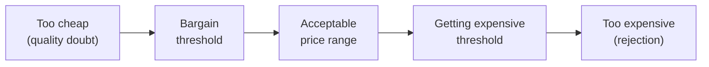
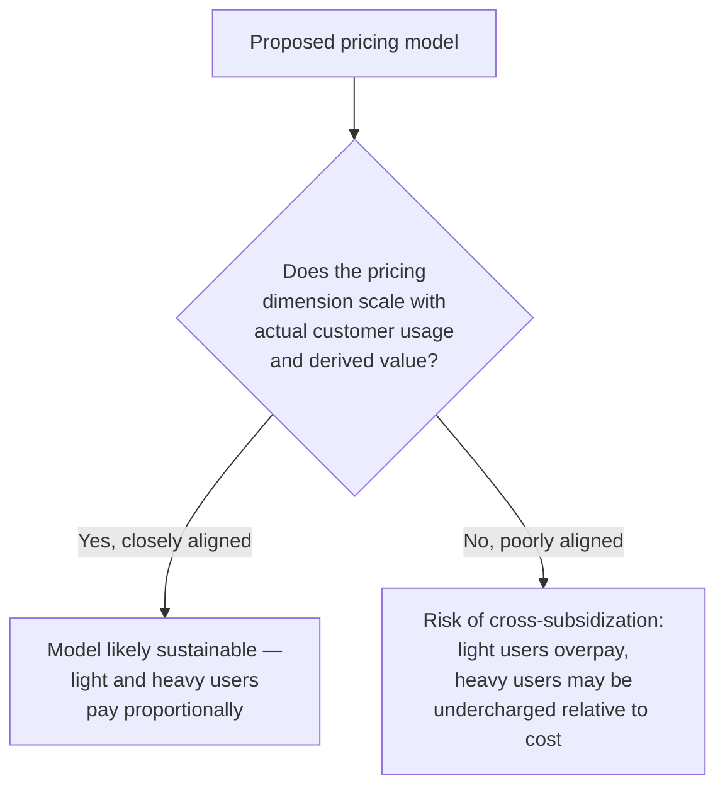

# Lesson 48: Pricing & Monetization Strategy

## Why This Lesson Matters

Every lesson so far in this module has addressed how to build, measure, and grow a product — but growth and usage only translate into a sustainable business if the product is priced and packaged in a way that captures a fair share of the value it creates. Pricing is unusual among the topics in this curriculum because, unlike most product decisions, it is highly visible, directly and immediately felt by every customer, and extremely difficult to reverse once set — a pricing change that goes wrong can alienate an entire existing customer base in a way a delayed feature never could.

This lesson matters because pricing is frequently treated as a finance or sales problem rather than a product one, when in reality a PM's product judgment — understanding what customers actually value, how usage patterns vary, and how packaging shapes perceived value — is essential to getting pricing right. Underpricing leaves value on the table and can starve a company of resources needed to keep building; overpricing, or pricing structured around the wrong dimension of value, can suppress adoption or create a mismatch between what customers pay and what they actually use, generating exactly the kind of resentment that erodes the trust this curriculum's stakeholder and design lessons have worked to build.

---

## Learning Path

| Field | Detail |
|---|---|
| **Module** | 5 — Metrics, Experimentation & Growth |
| **Current Lesson** | 48 of 90 |
| **Difficulty** | 5 / 10 |
| **Estimated Study Time** | 35 minutes (reading) + 15 minutes (reflection + quiz) |
| **Prerequisites** | Lesson 42 (North Star Metrics — value-vs-exposure distinction), Lesson 44 (Cohort & Retention Analysis) |
| **Next Lesson** | Lesson 49 — Go-To-Market Strategy |
| **Future Topics Unlocked** | Lesson 49 (Go-To-Market Strategy), Lesson 50 (Product-Led Growth) — both build directly on the pricing model and value-capture concepts introduced here |

---

## Learning Objectives

By the end of this lesson, you will be able to:

1. Distinguish value-based pricing from cost-plus pricing, and explain why value-based pricing is generally the more defensible starting point for a differentiated product.
2. Compare common pricing models — flat-rate, tiered, usage-based, per-seat, and freemium — and identify which best fits a given usage pattern.
3. Distinguish pricing (how much) from packaging (what's included at each level), and explain why conflating the two produces poor monetization decisions.
4. Apply the Van Westendorp price sensitivity approach to estimate an acceptable price range directly from customer input.
5. Diagnose a pricing model that is misaligned with actual usage patterns, and explain the business risk this misalignment creates.

---

## Prerequisites

This lesson assumes **Lesson 42's** distinction between metrics that reflect genuine value and those that merely reflect exposure or activity, since pricing should ultimately be anchored to genuine value delivered, not to easily-measured but potentially misleading proxies. It also assumes **Lesson 44's** retention concepts, since a pricing model's sustainability depends heavily on whether it aligns with how customers actually derive ongoing value, not just how they behave in an initial transaction.

---

## Theory

### Value-Based vs. Cost-Plus Pricing

**Cost-plus pricing** sets price by calculating the cost to produce and deliver a product, then adding a margin. This approach is common in commoditized goods but is generally a poor starting point for a differentiated software product, because it anchors price to the seller's internal cost structure rather than to what the product is actually worth to the customer — two customers might derive wildly different value from the identical product, and cost-plus pricing has no mechanism for capturing that difference.

**Value-based pricing** instead sets price according to the value the product creates for the customer — the money saved, the revenue enabled, the time recovered, or the risk reduced. This requires genuinely understanding what a customer values (echoing this curriculum's discovery discipline from Lesson 8) and is harder to execute than cost-plus pricing, but it is generally the more defensible approach for a genuinely differentiated product, since it aligns price with the actual reason a customer is willing to pay at all, rather than with an internal cost figure the customer never sees and has no reason to care about.

### Common Pricing Models

| Model | How It Works | Best Fit When |
|---|---|---|
| Flat-rate | A single price for full access, regardless of usage | Usage is fairly uniform across customers, and simplicity is highly valued |
| Tiered | Multiple fixed packages (e.g., Basic/Pro/Enterprise) at different price points with different feature sets | Customer needs vary meaningfully, and can be reasonably grouped into a small number of distinct segments |
| Usage-based | Price scales directly with a measured unit of consumption (API calls, storage, transactions) | Usage varies widely across customers, and the value delivered scales closely with that usage |
| Per-seat | Price scales with the number of individual users/accounts | Value is delivered per individual user, and usage per seat is relatively consistent |
| Freemium | A free tier with core functionality, paid tiers unlocking additional value | The product benefits from network effects or has a low marginal cost to serve free users, and a credible upgrade path to paid value exists |

Choosing the wrong model for a given usage pattern is one of the most common and costly pricing mistakes: a flat-rate model applied to a product with wildly varying usage across customers means light users effectively subsidize heavy users (risking light-user churn) while heavy users may be undercharged relative to the cost of serving them (risking margin erosion) — precisely the failure illustrated in this lesson's Case Study.

### Pricing vs. Packaging

A critical, frequently conflated distinction: **pricing** is how much a customer pays; **packaging** is what they get at each price point (which features, usage limits, or support levels are bundled together). A company can have an excellent pricing model (correctly aligned with usage and value) undermined by poor packaging (bundling features in a way that forces customers to pay for a much higher tier than they need just to access one feature they genuinely value), or vice versa. Getting both right requires treating them as related but genuinely separate design decisions — packaging should group value coherently around distinct customer needs and willingness to pay, while pricing should reflect the value of each resulting package.

### The Van Westendorp Price Sensitivity Meter

A widely used, structured technique for estimating an acceptable price range directly from customer input, developed by Peter van Westendorp, asks each customer four questions about a specific product: at what price would this be so cheap you'd question its quality? At what price would this be a bargain? At what price would this start to feel expensive? At what price would this be so expensive you wouldn't consider it? Plotting the aggregated responses across a sample of customers reveals a range bounded by these four curves, typically converging on an "acceptable price range" and an "optimal price point" where the trade-off between perceived value and affordability is best balanced.

This technique doesn't replace the deeper value-based pricing work of understanding what specifically drives willingness to pay, but it provides a structured, customer-grounded starting range that avoids both dramatically underpricing and pricing so high that adoption stalls before value can even be demonstrated.

---

## Common Beginner Mistakes

**Mistake 1: Defaulting to cost-plus pricing without considering actual customer value.**
As covered in Theory, this anchors price to an internal figure customers never see and have no reason to care about, and typically leaves significant value uncaptured for a genuinely differentiated product.

**Mistake 2: Choosing a pricing model that doesn't match the actual variance in customer usage.**
A flat-rate model applied to widely varying usage patterns creates the specific cross-subsidization problem covered in Theory and illustrated in this lesson's Case Study — light users overpay relative to their usage, heavy users may be undercharged relative to cost to serve.

**Mistake 3: Conflating pricing and packaging decisions.**
Treating "how much" and "what's included" as a single, undifferentiated decision often produces packages that don't map cleanly to distinct customer needs, forcing customers into an awkward choice between an insufficient lower tier and an unnecessarily expensive higher one.

**Mistake 4: Setting price based on internal opinion or founder intuition alone, without any structured customer input.**
Without a technique like the Van Westendorp approach or direct value-based research, pricing decisions risk being calibrated to what feels reasonable internally rather than to what customers actually perceive as fair value, a gap that's easy to miss without deliberately measuring it.

**Mistake 5: Treating a pricing change as a purely internal, low-risk decision.**
Pricing is unusually visible and difficult to reverse compared to most product decisions — a poorly communicated or poorly designed pricing change can generate immediate, vocal backlash from an existing customer base, making the stakeholder communication discipline from Lesson 47 especially relevant when planning any pricing change.

---

## Mental Model: The Value-Price Alignment Check

This lesson's core takeaway tool is a simple diagnostic for evaluating whether a chosen pricing model actually aligns with how value is delivered:

Use the Value-Price Alignment Check whenever evaluating an existing or proposed pricing model: identify the specific dimension being charged for (seats, usage volume, flat access) and ask honestly whether that dimension actually tracks how customers derive value and how much it costs to serve them — a mismatch here is one of the most common, and most fixable, sources of pricing dysfunction.

---

## Real Company Example

**Salesforce** has been publicly associated with a long-standing tiered "editions" pricing model (historically including tiers such as Essentials, Professional, Enterprise, and Unlimited), combining per-seat pricing within each tier with meaningfully differentiated feature packaging across tiers — allowing smaller organizations to access core CRM functionality at a lower price point while larger, more sophisticated organizations pay more for advanced customization, automation, and support capabilities genuinely relevant to their scale and complexity.

The underlying principle connects directly to this lesson's Theory: this structure reflects both value-based reasoning (larger, more sophisticated customers derive more value from advanced features and are charged accordingly) and a deliberate separation of packaging (what's included at each tier) from pricing (the per-seat cost within each tier), rather than a single undifferentiated price applied uniformly regardless of customer size or need.

*(Assumption flagged: this reflects general, publicly available descriptions of Salesforce's tiered edition pricing structure over time, not a confirmed, complete, or current account of Salesforce's specific current pricing, which may have changed since this description. Specific pricing tiers, features, and amounts evolve continuously at any company; the durable lesson is the underlying principle — tiered, value-aligned packaging serves meaningfully different customer segments better than a single undifferentiated price — rather than a claim about Salesforce's exact current pricing structure.)*

---

## Real World Perspective: Startup vs. Mid-Size vs. Big Tech

**At a startup:**
Pricing is often set with limited data, sometimes based on rough competitor benchmarking or founder intuition, and is frequently a flat-rate or simple tiered structure chosen more for implementation simplicity than rigorous value alignment. This is often reasonable at very early stages, when the priority is validating whether customers will pay anything at all, but the specific model chosen should still be revisited deliberately as usage data accumulates, rather than left unexamined by default.

**At a mid-size company:**
Pricing decisions typically warrant more structured research — Van Westendorp-style customer input, usage-pattern analysis to check the Value-Price Alignment Check, and closer collaboration between product, sales, and finance. This is the stage where the mismatch between a simple, early-stage pricing model and actual, now-more-varied usage patterns often first becomes visible and costly, as illustrated in this lesson's Case Study.

**At Big Tech:**
Pricing and packaging decisions are often deeply sophisticated, supported by dedicated pricing/monetization teams, extensive experimentation (echoing Lesson 45's rigor, since pricing changes can and should be tested where feasible), and careful attention to price discrimination across customer segments (charging different amounts to different segments based on differing value and willingness to pay, within legal and ethical bounds). The PM's job shifts toward partnering effectively with these specialized teams while ensuring pricing and packaging decisions remain grounded in genuine product value rather than becoming a purely financial optimization exercise disconnected from customer experience.

---

## Detailed Case Study: The Flat Rate That Punished the Wrong Users

Consider a simplified, illustrative scenario common at SaaS companies whose usage patterns diversify faster than their pricing model evolves.

A company launches with a single flat-rate monthly price, reasoning that simplicity would ease adoption during its early growth phase. As the customer base grows, usage patterns diverge dramatically: some customers use the product lightly, for a narrow use case, while others — often the company's most successful, most engaged customers — use it intensively, generating usage volumes many times higher than the typical customer, at meaningfully higher infrastructure cost to serve.

Over time, two problems emerge simultaneously. Light users increasingly perceive the flat rate as poor value relative to their actual usage and begin churning at a higher rate than heavy users, since they're effectively subsidizing the platform's heaviest users without deriving proportional benefit themselves. Meanwhile, the company's gross margin on its heaviest-usage accounts — paradoxically, its most successful and most product-engaged customers — steadily erodes, since the flat rate was calibrated to a "typical" usage level that these customers far exceed, meaning the company is losing money, at the margin, on serving its own best customers more they use the product.

**What went wrong?**

Using the Value-Price Alignment Check: the flat-rate model's pricing dimension (a single fixed monthly fee) never scaled with the dimension along which usage and cost actually varied (usage volume), producing exactly the cross-subsidization risk this lesson's Theory predicts. Light users were, in effect, being asked to pay for capacity they didn't use, while heavy users were being served at a cost the flat fee no longer covered — a dynamic invisible in the company's aggregate revenue figures (which continued growing as the customer base grew) but clearly visible once usage-segmented margin analysis was performed, echoing Lesson 43's Simpson's Paradox caution about aggregate numbers hiding segment-specific problems.

The corrective response required transitioning to a hybrid model — a lower base flat fee covering typical light usage, with usage-based charges for consumption beyond a defined threshold — deliberately designed to realign pricing with the dimension driving both value and cost. This transition itself required careful stakeholder communication (Lesson 47) to existing customers, since any pricing change to an installed base carries the specific trust and communication risks this lesson's Mistake 5 describes, and ideally would be validated through structured customer input (the Van Westendorp technique, or direct research into willingness to pay at different usage levels) rather than assumed to be correct without customer-grounded evidence.

---

## Framework Explanation: The Pricing Model Selection Table

A second, more tactical tool: use this table to select an appropriate pricing model based on how customer usage and value actually vary.

| Usage Pattern | Recommended Model Direction | Key Risk If Misapplied |
|---|---|---|
| Highly uniform usage across all customers | Flat-rate is likely appropriate | Overcomplicating pricing for no real benefit if usage genuinely doesn't vary |
| Usage clusters into a few distinct customer segments | Tiered pricing, aligned to those segments | Poorly-defined tiers that don't map to real segment boundaries |
| Usage varies continuously and widely across customers | Usage-based pricing, or a hybrid with a base fee | Flat-rate cross-subsidization, as in this lesson's Case Study |
| Value scales primarily with number of individual users | Per-seat pricing | Charging per-seat when value actually scales with usage volume, not headcount |
| Product benefits from wide, low-friction adoption and has low marginal cost to serve free users | Freemium, with a credible upgrade path | A free tier so generous it removes any incentive to upgrade |

A pricing model chosen without reference to this kind of usage-pattern analysis risks the mismatch this lesson's Case Study illustrates, regardless of how reasonable the model might have seemed at the time of initial launch.

---

## Interview Perspective: How Interviewers Think About This

**Typical question 1: "How would you decide on a pricing model for a new product?"**
*What the interviewer is actually evaluating:* Whether the candidate reasons from actual or anticipated usage patterns and value delivery (echoing the Value-Price Alignment Check) rather than defaulting to whatever pricing model is most common in the category without justification.

**Typical question 2: "What's the difference between pricing and packaging, and why does the distinction matter?"**
*What the interviewer is actually evaluating:* Whether the candidate can clearly separate "how much" from "what's included," and explain a concrete failure mode from conflating the two.

**Typical question 3: "A company's flat-rate pricing model seems to be causing margin problems on its heaviest-usage customers. What would you investigate?"**
*What the interviewer is actually evaluating:* Whether the candidate's first instinct is to check whether the pricing dimension actually aligns with the usage/cost dimension, mirroring this lesson's Case Study, rather than assuming the problem is purely about the price level being too low.

---

## Summary

Pricing should generally be anchored to value-based reasoning — what a product is genuinely worth to a customer — rather than cost-plus reasoning anchored to internal cost structures the customer never sees. Choosing among common pricing models (flat-rate, tiered, usage-based, per-seat, freemium) requires matching the pricing dimension to how customer usage and derived value actually vary, since a mismatch produces cross-subsidization risk: light users overpaying relative to their usage, heavy users potentially undercharged relative to the cost of serving them, exactly the dynamic illustrated in this lesson's Case Study of a flat-rate model that quietly eroded margin on a company's best, most engaged customers while driving away its lightest ones. Pricing and packaging are related but genuinely distinct decisions — how much a customer pays versus what they receive at each price point — and conflating them risks producing packages that don't map cleanly to real customer segments. The Van Westendorp price sensitivity technique offers a structured, customer-grounded way to estimate an acceptable price range directly from customer input, rather than relying purely on internal intuition. Finally, because pricing changes are unusually visible and difficult to reverse compared to most product decisions, they warrant the same careful stakeholder communication discipline established in Lesson 47, since a poorly communicated pricing change can generate immediate, vocal backlash from an existing, trust-dependent customer base.

---

## Key Takeaways

- Value-based pricing anchors price to what a product is genuinely worth to the customer; cost-plus pricing anchors it to internal cost structures the customer never sees, and is generally a weaker starting point for a differentiated product.
- Choosing a pricing model (flat-rate, tiered, usage-based, per-seat, freemium) requires matching the pricing dimension to how customer usage and value actually vary — a mismatch creates cross-subsidization risk.
- Pricing (how much) and packaging (what's included) are related but distinct decisions; conflating them risks producing packages that don't map cleanly to real customer segments.
- The Van Westendorp price sensitivity technique provides a structured, customer-grounded way to estimate an acceptable price range directly from customer input.
- A flat-rate model applied to widely varying usage patterns can quietly erode margin on the heaviest-usage, often most engaged and successful, customers while simultaneously driving away lighter users who feel they're overpaying.
- Aggregate revenue growth can mask a usage-segmented margin problem, echoing Lesson 43's Simpson's Paradox caution — segmented analysis is necessary to detect this kind of pricing misalignment.
- Pricing changes are unusually visible and difficult to reverse, and warrant careful stakeholder communication (Lesson 47) given their potential to generate immediate backlash from an existing customer base.

---

## Cheat Sheet

*A two-minute review of everything in this lesson.*

- **Value-based, not cost-plus:** anchor price to what customers value, not internal cost structure.
- **Match model to usage variance:** flat-rate (uniform usage), tiered (segments), usage-based (wide variance), per-seat (value scales with users), freemium (low-cost-to-serve + upgrade path).
- **Pricing ≠ packaging:** how much vs. what's included — treat as related but separate decisions.
- **Van Westendorp:** four customer-input questions revealing an acceptable price range and optimal point.
- **Value-Price Alignment Check:** does the pricing dimension actually track usage and derived value?
- **Watch for cross-subsidization:** flat-rate models risk light users overpaying, heavy users undercharged relative to cost.
- **Pricing changes are high-stakes and hard to reverse:** apply Lesson 47's stakeholder communication discipline.

---

## Glossary

| Term | Definition | Related Concepts | Difficulty (1–3) |
|---|---|---|---|
| Value-based pricing | Setting price according to the value a product creates for the customer | Cost-plus pricing | 1 |
| Cost-plus pricing | Setting price by calculating production/delivery cost and adding a margin | Value-based pricing | 1 |
| Packaging | What is included at each price point (features, usage limits, support level) | Pricing | 2 |
| Van Westendorp price sensitivity meter | A four-question customer research technique estimating an acceptable price range | — | 2 |
| Cross-subsidization | A pricing mismatch where light users effectively subsidize heavy users under a poorly-aligned model | Value-Price Alignment Check | 2 |
| Value-Price Alignment Check | This lesson's mental model: verifying that a pricing dimension actually scales with usage and derived value | Cross-subsidization | 2 |

---

## Further Reading / Resources

- *Monetizing Innovation* by Madhavan Ramanujam and Georg Tacke — a detailed treatment of value-based pricing and common monetization pitfalls.
- "Price Sensitivity Measurement" by Peter van Westendorp — the original articulation of the price sensitivity meter technique referenced in this lesson.
- *Pricing Strategy: Setting Price Levels, Managing Price Discounts, and Establishing Price Structures* by Tim J. Smith — a comprehensive practitioner reference on pricing model selection and structure.

---

## Flashcards

**Card 1**
Front: What's the difference between value-based and cost-plus pricing?
Back: Value-based pricing sets price according to what a product is worth to the customer; cost-plus pricing sets price by calculating production cost and adding a margin — value-based is generally the stronger starting point for a differentiated product.
Difficulty: 1
Tags: value-based-vs-cost-plus

**Card 2**
Front: Name the five common pricing models covered in this lesson.
Back: Flat-rate, tiered, usage-based, per-seat, freemium.
Difficulty: 1
Tags: pricing-models

**Card 3**
Front: What's the difference between pricing and packaging?
Back: Pricing is how much a customer pays; packaging is what they receive at each price point (features, limits, support) — related but distinct decisions.
Difficulty: 1
Tags: pricing-vs-packaging

**Card 4**
Front: What does the Van Westendorp price sensitivity meter measure, and how?
Back: An acceptable price range, estimated by asking customers four questions about when a price feels too cheap, a bargain, expensive, or too expensive to consider.
Difficulty: 2
Tags: van-westendorp

**Card 5**
Front: What is cross-subsidization in a pricing context, and when does it typically occur?
Back: Light users effectively subsidize heavy users under a poorly-aligned pricing model, typically occurring when a flat-rate model is applied to widely varying usage patterns.
Difficulty: 2
Tags: cross-subsidization

**Card 6**
Front: In the Detailed Case Study, what two problems emerged simultaneously from the flat-rate model?
Back: Light users churned at higher rates, perceiving poor value relative to their usage, while margin eroded on the company's heaviest-usage customers, whose actual usage far exceeded what the flat fee was calibrated to cover.
Difficulty: 2
Tags: case-study

---

## Reflection Exercise

Consider the following novel scenario: You're a PM at a company considering moving from a simple per-seat pricing model to a usage-based model, since you've noticed that some customers with very few seats generate enormous usage volume, while other customers with many seats use the product lightly.

There is no single correct answer to the prompts below — the goal is to practice applying the Value-Price Alignment Check and Pricing Model Selection Table, not to reach one "right" answer.

1. Using the Value-Price Alignment Check, what specific evidence would confirm that per-seat pricing is currently misaligned with how value and cost actually vary for this product?
2. Using the Pricing Model Selection Table, what usage pattern would justify moving toward a usage-based or hybrid model instead of per-seat pricing?
3. What research would you want to conduct with customers before finalizing a new pricing structure, drawing on the Van Westendorp technique or direct value-based research?
4. Which existing customers are most likely to be upset by this change, and how would you apply Lesson 47's stakeholder communication principles to manage that transition?
5. How would you structure a transition period (grandfathering, phased rollout) to reduce the risk of the kind of backlash this lesson warns pricing changes can generate?

---

## Quiz

**1. What is the key difference between value-based and cost-plus pricing?**
A) They are identical approaches with different names
B) Value-based pricing anchors price to what the product is worth to the customer; cost-plus pricing anchors it to internal production cost plus a margin
C) Cost-plus pricing is always higher than value-based pricing
D) Value-based pricing can only be used for physical products, not software

*Correct answer: B*
*Explanation: The Theory section defines these two approaches exactly this way.*
*Learning objective tested: #1*
*Difficulty: Easy*

---

**2. Which pricing model is generally most appropriate when customer usage varies widely and continuously across the customer base?**
A) Flat-rate
B) Usage-based, or a hybrid with a base fee
C) A single price with no variation of any kind
D) Freemium exclusively

*Correct answer: B*
*Explanation: The Theory section and Pricing Model Selection Table both identify usage-based (or hybrid) pricing as the appropriate fit for widely varying usage.*
*Learning objective tested: #2*
*Difficulty: Easy*

---

**3. What is the difference between pricing and packaging?**
A) They are the same decision and should always be made together as a single choice
B) Pricing is how much a customer pays; packaging is what they receive at each price point
C) Packaging only applies to physical products
D) Pricing only applies to freemium models

*Correct answer: B*
*Explanation: The Theory section explicitly distinguishes these two related but separate decisions.*
*Learning objective tested: #3*
*Difficulty: Easy*

---

**4. What does the Van Westendorp price sensitivity meter ask customers?**
A) Only their income level
B) Four questions about when a price feels too cheap, a bargain, expensive, or too expensive to consider
C) A single question about their maximum budget
D) Whether they prefer flat-rate or tiered pricing

*Correct answer: B*
*Explanation: The Theory section describes these exact four questions as the basis of the Van Westendorp technique.*
*Learning objective tested: #4*
*Difficulty: Easy*

---

**5. What is cross-subsidization, in a pricing context?**
A) A legal requirement for all SaaS pricing models
B) A dynamic where light users effectively subsidize heavy users under a poorly-aligned pricing model, such as flat-rate pricing applied to widely varying usage
C) A synonym for freemium pricing
D) A technique for calculating cost-plus pricing

*Correct answer: B*
*Explanation: The Theory section and Glossary define cross-subsidization exactly this way.*
*Learning objective tested: #5*
*Difficulty: Easy*

---

**6. In the Detailed Case Study, why did the company's gross margin erode specifically on its heaviest-usage customers?**
A) Those customers stopped paying entirely
B) The flat rate was calibrated to a "typical" usage level that heavy users far exceeded, meaning the company was serving them at a cost the flat fee no longer covered
C) Heavy users were charged more than light users under the flat-rate model
D) The company's infrastructure costs had nothing to do with usage volume

*Correct answer: B*
*Explanation: The Case Study explicitly attributes the margin erosion to this specific mismatch between flat-fee revenue and usage-driven cost.*
*Learning objective tested: #5*
*Difficulty: Easy*

---

**7. Why was the margin problem in the Case Study invisible in the company's aggregate revenue figures?**
A) Because aggregate revenue figures are always inaccurate
B) Because aggregate revenue continued growing as the customer base grew, masking a segment-specific margin problem only visible through usage-segmented analysis, echoing Lesson 43's Simpson's Paradox caution
C) Because the company never tracked revenue at all
D) Because heavy users were a majority of the customer base

*Correct answer: B*
*Explanation: The Case Study explicitly connects this masking effect to Lesson 43's Simpson's Paradox caution about aggregate numbers hiding segment-specific problems.*
*Learning objective tested: #5*
*Difficulty: Medium*

---

**8. Why does this lesson caution that pricing changes are unusually high-stakes compared to most product decisions?**
A) Because pricing changes are always illegal without government approval
B) Because pricing is unusually visible and difficult to reverse, and a poorly communicated change can generate immediate, vocal backlash from an existing, trust-dependent customer base
C) Because pricing changes never affect existing customers, only new ones
D) Because pricing decisions require no stakeholder communication at all

*Correct answer: B*
*Explanation: Common Beginner Mistake #5 explains this exact caution about visibility, difficulty of reversal, and backlash risk.*
*Learning objective tested: #5*
*Difficulty: Medium*

---

**9. Using the Pricing Model Selection Table, which pricing model is generally most appropriate when value scales primarily with the number of individual users, and usage per user is relatively consistent?**
A) Usage-based pricing
B) Per-seat pricing
C) Flat-rate pricing regardless of team size
D) Freemium exclusively

*Correct answer: B*
*Explanation: The Pricing Model Selection Table identifies per-seat pricing as the appropriate fit when value scales with headcount rather than usage volume.*
*Learning objective tested: #2*
*Difficulty: Medium*

---

**10. (Scenario) A company's freemium pricing model offers such generous free-tier functionality that almost no customers ever feel a need to upgrade to a paid tier. Using the Pricing Model Selection Table's noted risk, what is the most likely explanation?**
A) The company has successfully implemented value-based pricing
B) The free tier removes any meaningful incentive to upgrade, exactly the risk the table identifies for a freemium model with an overly generous free tier
C) This is not a pricing problem at all, only a marketing problem
D) Freemium models never have any associated risks

*Correct answer: B*
*Explanation: The Pricing Model Selection Table explicitly lists an overly generous free tier removing upgrade incentive as freemium's key risk if misapplied.*
*Learning objective tested: #2*
*Difficulty: Medium-Hard*

---

**11. (Interview Reasoning) A candidate is asked how they'd decide on a pricing model for a new product, and answers: "I'd look at what competitors charge and match it." Based on this lesson's Interview Perspective section, what is the weakness in this answer?**
A) There is no weakness; competitor pricing is the only factor that matters
B) It skips reasoning from the product's own actual or anticipated usage patterns and value delivery, relying instead purely on external benchmarking without justification specific to the product itself
C) It correctly demonstrates strong competitive awareness
D) It shows an appropriate level of market research

*Correct answer: B*
*Explanation: The Interview Perspective section states that a strong answer reasons from actual usage patterns and value delivery, not simply matching competitors without independent justification.*
*Learning objective tested: #1, #2*
*Difficulty: Hard*

---

**12. Why does this lesson recommend structured customer input (such as the Van Westendorp technique) rather than relying purely on internal intuition when setting price?**
A) Because internal intuition is always illegal to use in pricing decisions
B) Because pricing calibrated purely to what feels reasonable internally risks a gap from what customers actually perceive as fair value, a gap that's easy to miss without deliberately measuring it
C) Because customer input always produces a single, unambiguous correct price
D) Because Van Westendorp is required by law for SaaS pricing

*Correct answer: B*
*Explanation: Common Beginner Mistake #4 explains this exact reasoning about the risk of purely intuition-based pricing.*
*Learning objective tested: #4*
*Difficulty: Medium-Hard*

---

**13. (Product Thinking) A company notices that a small number of customers with very few seats generate disproportionately high usage volume under a per-seat pricing model, while many customers with many seats use the product lightly. Using the Value-Price Alignment Check, what does this suggest?**
A) The per-seat model is perfectly aligned and requires no further examination
B) The pricing dimension (seats) may not be tracking the dimension that actually drives value and cost (usage volume), suggesting a potential misalignment worth investigating further, similar to this lesson's Case Study
C) This pattern is irrelevant to pricing decisions and only affects marketing
D) The company should immediately switch to a flat-rate model instead

*Correct answer: B*
*Explanation: This is a direct application of the Value-Price Alignment Check — a mismatch between the charged dimension (seats) and the actual value/cost driver (usage) signals a potential pricing misalignment.*
*Learning objective tested: #5*
*Difficulty: Hard*

---

**14. Which of the following best reflects appropriately separating pricing from packaging decisions, per this lesson?**
A) Setting a single price and a single feature set for all customers regardless of need
B) Designing packages that group value coherently around distinct customer needs and willingness to pay, then setting the price of each resulting package based on its value — treating the two as related but genuinely separate design decisions
C) Setting price first, then randomly assigning features to whichever tier seems convenient
D) Assuming pricing and packaging must always be identical decisions made by the same process

*Correct answer: B*
*Explanation: This reflects the lesson's explicit recommendation to treat packaging (grouping value coherently) and pricing (valuing each resulting package) as related but distinct design steps.*
*Learning objective tested: #3*
*Difficulty: Medium-Hard*

---

**15. (Product Thinking, Highest Difficulty) A company wants to transition from a poorly-aligned flat-rate model (as in this lesson's Case Study) to a usage-based hybrid model, but is concerned about backlash from its existing customer base. Using this lesson's and Lesson 47's frameworks together, what is the most defensible approach?**
A) Announce the change with no advance notice and implement it immediately for all customers
B) Validate the new pricing structure with structured customer research (Van Westendorp or direct value-based input), then communicate the change transparently to existing customers using Lesson 47's difficult-news principles — explaining the reasoning, acknowledging specific impact, and considering a grandfathering or phased transition period to reduce backlash risk
C) Avoid changing the pricing model at all, regardless of the ongoing margin and churn problems it's causing
D) Change the pricing model only for new customers, permanently ignoring the underlying problem for the existing customer base

*Correct answer: B*
*Explanation: This combines the lesson's customer-validation discipline with Lesson 47's difficult-news delivery principles — addressing the underlying pricing misalignment while managing the transition's stakeholder and trust risks deliberately, rather than either ignoring the problem or executing the change carelessly.*
*Learning objective tested: #5*
*Difficulty: Hard*

---

## Connections

| | Lesson | Core Idea Carried Forward |
|---|---|---|
| **Previous Lesson** | Lesson 47 — Stakeholder Management | Pricing changes require the same careful, trust-preserving stakeholder communication discipline established in Lesson 47 |
| **Current Lesson** | Lesson 48 — Pricing & Monetization Strategy | Value-based vs. cost-plus pricing; pricing model selection; pricing vs. packaging; Van Westendorp technique; Value-Price Alignment Check |
| **Next Lesson** | Lesson 49 — Go-To-Market Strategy | Builds on pricing and packaging decisions when planning how a product is positioned and launched to market |
| **Future Concepts Unlocked** | Lesson 50 (Product-Led Growth) | Depends on freemium and usage-based pricing concepts when designing self-serve growth mechanics |

This curriculum is designed to be read as one continuous argument, not ninety independent articles. Every lesson from here forward will assume you carry value-based pricing reasoning and the Value-Price Alignment Check with you — they will not be re-explained, only re-applied in new contexts.
